# smartlab full code context

Generated at: 2026-07-03T11:09:10

This file is generated from the local SmartLab repository for model-readable project context.

## File Tree

- adapter/camera/camera/README.txt
- adapter/edge-agent-runtime/README.md
- adapter/edge-agent-runtime/runtime.config.example.json
- adapter/GetPLCData/GetPLCData/.vs/GetPLCData/v17/DocumentLayout.backup.json
- adapter/GetPLCData/GetPLCData/.vs/GetPLCData/v17/DocumentLayout.json
- adapter/GetPLCData/GetPLCData/GetPLCData/PLC_Data.csv
- adapter/GetPLCData/GetPLCData/GetPLCData/vcpkg_installed/x64-windows/vcpkg/compiler-file-hash-cache.json
- adapter/GetPLCData/GetPLCData/GetPLCData/vcpkg_installed/x64-windows/vcpkg/manifest-info.json
- adapter/GetPLCData/GetPLCData/GetPLCData/vcpkg_installed/x64-windows/x64-windows/share/curl/vcpkg.spdx.json
- adapter/GetPLCData/GetPLCData/GetPLCData/vcpkg_installed/x64-windows/x64-windows/share/curl/vcpkg_abi_info.txt
- adapter/GetPLCData/GetPLCData/GetPLCData/vcpkg_installed/x64-windows/x64-windows/share/nlohmann-json/vcpkg.spdx.json
- adapter/GetPLCData/GetPLCData/GetPLCData/vcpkg_installed/x64-windows/x64-windows/share/nlohmann-json/vcpkg_abi_info.txt
- adapter/GetPLCData/GetPLCData/GetPLCData/vcpkg_installed/x64-windows/x64-windows/share/vcpkg-cmake-config/vcpkg.spdx.json
- adapter/GetPLCData/GetPLCData/GetPLCData/vcpkg_installed/x64-windows/x64-windows/share/vcpkg-cmake-config/vcpkg_abi_info.txt
- adapter/GetPLCData/GetPLCData/GetPLCData/vcpkg_installed/x64-windows/x64-windows/share/vcpkg-cmake/vcpkg.spdx.json
- adapter/GetPLCData/GetPLCData/GetPLCData/vcpkg_installed/x64-windows/x64-windows/share/vcpkg-cmake/vcpkg_abi_info.txt
- adapter/GetPLCData/GetPLCData/GetPLCData/vcpkg_installed/x64-windows/x64-windows/share/zlib/vcpkg.spdx.json
- adapter/GetPLCData/GetPLCData/GetPLCData/vcpkg_installed/x64-windows/x64-windows/share/zlib/vcpkg_abi_info.txt
- adapter/GetPLCData/GetPLCData/GetPLCData/x64/Debug/GetPLCData.vcxproj.FileListAbsolute.txt
- adapter/GetPLCData/GetPLCData/GetPLCData/x64/Release/GetPLCData.vcxproj.FileListAbsolute.txt
- adapter/GetPLCData/GetPLCData/vcpkg.json
- adapter/GetPLCData/GetPLCData/vcpkg_installed/x64-windows-static/vcpkg/compiler-file-hash-cache.json
- adapter/GetPLCData/GetPLCData/vcpkg_installed/x64-windows-static/vcpkg/manifest-info.json
- adapter/GetPLCData/GetPLCData/vcpkg_installed/x64-windows-static/x64-windows-static/share/curl/vcpkg.spdx.json
- adapter/GetPLCData/GetPLCData/vcpkg_installed/x64-windows-static/x64-windows-static/share/curl/vcpkg_abi_info.txt
- adapter/GetPLCData/GetPLCData/vcpkg_installed/x64-windows-static/x64-windows-static/share/libpq/vcpkg.spdx.json
- adapter/GetPLCData/GetPLCData/vcpkg_installed/x64-windows-static/x64-windows-static/share/libpq/vcpkg_abi_info.txt
- adapter/GetPLCData/GetPLCData/vcpkg_installed/x64-windows-static/x64-windows-static/share/lz4/vcpkg.spdx.json
- adapter/GetPLCData/GetPLCData/vcpkg_installed/x64-windows-static/x64-windows-static/share/lz4/vcpkg_abi_info.txt
- adapter/GetPLCData/GetPLCData/vcpkg_installed/x64-windows-static/x64-windows-static/share/nlohmann-json/vcpkg.spdx.json
- adapter/GetPLCData/GetPLCData/vcpkg_installed/x64-windows-static/x64-windows-static/share/nlohmann-json/vcpkg_abi_info.txt
- adapter/GetPLCData/GetPLCData/vcpkg_installed/x64-windows-static/x64-windows-static/share/openssl/vcpkg.spdx.json
- adapter/GetPLCData/GetPLCData/vcpkg_installed/x64-windows-static/x64-windows-static/share/openssl/vcpkg_abi_info.txt
- adapter/GetPLCData/GetPLCData/vcpkg_installed/x64-windows-static/x64-windows-static/share/zlib/vcpkg.spdx.json
- adapter/GetPLCData/GetPLCData/vcpkg_installed/x64-windows-static/x64-windows-static/share/zlib/vcpkg_abi_info.txt
- adapter/GetPLCData/GetPLCData/vcpkg_installed/x64-windows-static/x64-windows/share/pkgconf/vcpkg.spdx.json
- adapter/GetPLCData/GetPLCData/vcpkg_installed/x64-windows-static/x64-windows/share/pkgconf/vcpkg_abi_info.txt
- adapter/GetPLCData/GetPLCData/vcpkg_installed/x64-windows-static/x64-windows/share/vcpkg-cmake-config/vcpkg.spdx.json
- adapter/GetPLCData/GetPLCData/vcpkg_installed/x64-windows-static/x64-windows/share/vcpkg-cmake-config/vcpkg_abi_info.txt
- adapter/GetPLCData/GetPLCData/vcpkg_installed/x64-windows-static/x64-windows/share/vcpkg-cmake-get-vars/cmake_get_vars/CMakeLists.txt
- adapter/GetPLCData/GetPLCData/vcpkg_installed/x64-windows-static/x64-windows/share/vcpkg-cmake-get-vars/vcpkg.spdx.json
- adapter/GetPLCData/GetPLCData/vcpkg_installed/x64-windows-static/x64-windows/share/vcpkg-cmake-get-vars/vcpkg_abi_info.txt
- adapter/GetPLCData/GetPLCData/vcpkg_installed/x64-windows-static/x64-windows/share/vcpkg-cmake/vcpkg.spdx.json
- adapter/GetPLCData/GetPLCData/vcpkg_installed/x64-windows-static/x64-windows/share/vcpkg-cmake/vcpkg_abi_info.txt
- adapter/GetPLCData/GetPLCData/vcpkg_installed/x64-windows-static/x64-windows/share/vcpkg-pkgconfig-get-modules/vcpkg.spdx.json
- adapter/GetPLCData/GetPLCData/vcpkg_installed/x64-windows-static/x64-windows/share/vcpkg-pkgconfig-get-modules/vcpkg_abi_info.txt
- adapter/GetPLCData/GetPLCData/vcpkg_installed/x64-windows-static/x64-windows/share/vcpkg-tool-meson/vcpkg.spdx.json
- adapter/GetPLCData/GetPLCData/vcpkg_installed/x64-windows-static/x64-windows/share/vcpkg-tool-meson/vcpkg_abi_info.txt
- adapter/GetPLCData/GetPLCData/vcpkg_installed/x64-windows/vcpkg/compiler-file-hash-cache.json
- adapter/GetPLCData/GetPLCData/vcpkg_installed/x64-windows/vcpkg/manifest-info.json
- adapter/GetPLCData/GetPLCData/vcpkg_installed/x64-windows/x64-windows/share/curl/vcpkg.spdx.json
- adapter/GetPLCData/GetPLCData/vcpkg_installed/x64-windows/x64-windows/share/curl/vcpkg_abi_info.txt
- adapter/GetPLCData/GetPLCData/vcpkg_installed/x64-windows/x64-windows/share/libpq/vcpkg.spdx.json
- adapter/GetPLCData/GetPLCData/vcpkg_installed/x64-windows/x64-windows/share/libpq/vcpkg_abi_info.txt
- adapter/GetPLCData/GetPLCData/vcpkg_installed/x64-windows/x64-windows/share/lz4/vcpkg.spdx.json
- adapter/GetPLCData/GetPLCData/vcpkg_installed/x64-windows/x64-windows/share/lz4/vcpkg_abi_info.txt
- adapter/GetPLCData/GetPLCData/vcpkg_installed/x64-windows/x64-windows/share/nlohmann-json/vcpkg.spdx.json
- adapter/GetPLCData/GetPLCData/vcpkg_installed/x64-windows/x64-windows/share/nlohmann-json/vcpkg_abi_info.txt
- adapter/GetPLCData/GetPLCData/vcpkg_installed/x64-windows/x64-windows/share/openssl/vcpkg.spdx.json
- adapter/GetPLCData/GetPLCData/vcpkg_installed/x64-windows/x64-windows/share/openssl/vcpkg_abi_info.txt
- adapter/GetPLCData/GetPLCData/vcpkg_installed/x64-windows/x64-windows/share/pkgconf/vcpkg.spdx.json
- adapter/GetPLCData/GetPLCData/vcpkg_installed/x64-windows/x64-windows/share/pkgconf/vcpkg_abi_info.txt
- adapter/GetPLCData/GetPLCData/vcpkg_installed/x64-windows/x64-windows/share/vcpkg-cmake-config/vcpkg.spdx.json
- adapter/GetPLCData/GetPLCData/vcpkg_installed/x64-windows/x64-windows/share/vcpkg-cmake-config/vcpkg_abi_info.txt
- adapter/GetPLCData/GetPLCData/vcpkg_installed/x64-windows/x64-windows/share/vcpkg-cmake-get-vars/cmake_get_vars/CMakeLists.txt
- adapter/GetPLCData/GetPLCData/vcpkg_installed/x64-windows/x64-windows/share/vcpkg-cmake-get-vars/vcpkg.spdx.json
- adapter/GetPLCData/GetPLCData/vcpkg_installed/x64-windows/x64-windows/share/vcpkg-cmake-get-vars/vcpkg_abi_info.txt
- adapter/GetPLCData/GetPLCData/vcpkg_installed/x64-windows/x64-windows/share/vcpkg-cmake/vcpkg.spdx.json
- adapter/GetPLCData/GetPLCData/vcpkg_installed/x64-windows/x64-windows/share/vcpkg-cmake/vcpkg_abi_info.txt
- adapter/GetPLCData/GetPLCData/vcpkg_installed/x64-windows/x64-windows/share/vcpkg-pkgconfig-get-modules/vcpkg.spdx.json
- adapter/GetPLCData/GetPLCData/vcpkg_installed/x64-windows/x64-windows/share/vcpkg-pkgconfig-get-modules/vcpkg_abi_info.txt
- adapter/GetPLCData/GetPLCData/vcpkg_installed/x64-windows/x64-windows/share/vcpkg-tool-meson/vcpkg.spdx.json
- adapter/GetPLCData/GetPLCData/vcpkg_installed/x64-windows/x64-windows/share/vcpkg-tool-meson/vcpkg_abi_info.txt
- adapter/GetPLCData/GetPLCData/vcpkg_installed/x64-windows/x64-windows/share/zlib/vcpkg.spdx.json
- adapter/GetPLCData/GetPLCData/vcpkg_installed/x64-windows/x64-windows/share/zlib/vcpkg_abi_info.txt
- adapter/GetPLCData/GetPLCData/x64/Debug/setup.ini
- adapter/GetPLCData/GetPLCData/x64/Release/setup.ini
- adapter/MotionStageController/MotionStageController/.vs/MotionStageController/v17/DocumentLayout.backup.json
- adapter/MotionStageController/MotionStageController/.vs/MotionStageController/v17/DocumentLayout.json
- adapter/MotionStageController/MotionStageController/MotionStageController/vcpkg.json
- adapter/MotionStageController/MotionStageController/MotionStageController/vcpkg_installed/x64-windows-static/vcpkg/compiler-file-hash-cache.json
- adapter/MotionStageController/MotionStageController/MotionStageController/vcpkg_installed/x64-windows-static/vcpkg/manifest-info.json
- adapter/MotionStageController/MotionStageController/MotionStageController/vcpkg_installed/x64-windows-static/x64-windows-static/share/nlohmann-json/vcpkg.spdx.json
- adapter/MotionStageController/MotionStageController/MotionStageController/vcpkg_installed/x64-windows-static/x64-windows-static/share/nlohmann-json/vcpkg_abi_info.txt
- adapter/MotionStageController/MotionStageController/MotionStageController/vcpkg_installed/x64-windows-static/x64-windows-static/share/openssl/vcpkg.spdx.json
- adapter/MotionStageController/MotionStageController/MotionStageController/vcpkg_installed/x64-windows-static/x64-windows-static/share/openssl/vcpkg_abi_info.txt
- adapter/MotionStageController/MotionStageController/MotionStageController/vcpkg_installed/x64-windows-static/x64-windows-static/share/paho-mqtt/vcpkg.spdx.json
- adapter/MotionStageController/MotionStageController/MotionStageController/vcpkg_installed/x64-windows-static/x64-windows-static/share/paho-mqtt/vcpkg_abi_info.txt
- adapter/MotionStageController/MotionStageController/MotionStageController/vcpkg_installed/x64-windows-static/x64-windows-static/share/paho-mqttpp3/vcpkg.spdx.json
- adapter/MotionStageController/MotionStageController/MotionStageController/vcpkg_installed/x64-windows-static/x64-windows-static/share/paho-mqttpp3/vcpkg_abi_info.txt
- adapter/MotionStageController/MotionStageController/MotionStageController/vcpkg_installed/x64-windows-static/x64-windows/share/vcpkg-cmake-config/vcpkg.spdx.json
- adapter/MotionStageController/MotionStageController/MotionStageController/vcpkg_installed/x64-windows-static/x64-windows/share/vcpkg-cmake-config/vcpkg_abi_info.txt
- adapter/MotionStageController/MotionStageController/MotionStageController/vcpkg_installed/x64-windows-static/x64-windows/share/vcpkg-cmake-get-vars/cmake_get_vars/CMakeLists.txt
- adapter/MotionStageController/MotionStageController/MotionStageController/vcpkg_installed/x64-windows-static/x64-windows/share/vcpkg-cmake-get-vars/vcpkg.spdx.json
- adapter/MotionStageController/MotionStageController/MotionStageController/vcpkg_installed/x64-windows-static/x64-windows/share/vcpkg-cmake-get-vars/vcpkg_abi_info.txt
- adapter/MotionStageController/MotionStageController/MotionStageController/vcpkg_installed/x64-windows-static/x64-windows/share/vcpkg-cmake/vcpkg.spdx.json
- adapter/MotionStageController/MotionStageController/MotionStageController/vcpkg_installed/x64-windows-static/x64-windows/share/vcpkg-cmake/vcpkg_abi_info.txt
- adapter/MotionStageController/MotionStageController/x64/Debug/setup.ini
- adapter/MotionStageController/MotionStageController/x64/Release/RunTimeLog/2026_03_21.txt
- adapter/MotionStageController/MotionStageController/x64/Release/RunTimeLog/2026_03_22.txt
- adapter/MotionStageController/MotionStageController/x64/Release/setup.ini
- adapter/MotionStageController/契约字典.txt
- adapter/testAdapter/adapter-manifest.json
- adapter/testAdapter/README.md
- adapter/testAdapter/requirements.txt
- adapter/ValueAdapterMQTT/ValueAdapterMQTT/.vs/ValueAdapterMQTT/v17/DocumentLayout.backup.json
- adapter/ValueAdapterMQTT/ValueAdapterMQTT/.vs/ValueAdapterMQTT/v17/DocumentLayout.json
- adapter/ValueAdapterMQTT/ValueAdapterMQTT/ValueAdapterMQTT/vcpkg.json
- adapter/ValueAdapterMQTT/ValueAdapterMQTT/ValueAdapterMQTT/vcpkg_installed/x64-windows-static/vcpkg/compiler-file-hash-cache.json
- adapter/ValueAdapterMQTT/ValueAdapterMQTT/ValueAdapterMQTT/vcpkg_installed/x64-windows-static/vcpkg/manifest-info.json
- adapter/ValueAdapterMQTT/ValueAdapterMQTT/ValueAdapterMQTT/vcpkg_installed/x64-windows-static/x64-windows-static/share/jsoncpp/vcpkg.spdx.json
- adapter/ValueAdapterMQTT/ValueAdapterMQTT/ValueAdapterMQTT/vcpkg_installed/x64-windows-static/x64-windows-static/share/jsoncpp/vcpkg_abi_info.txt
- adapter/ValueAdapterMQTT/ValueAdapterMQTT/ValueAdapterMQTT/vcpkg_installed/x64-windows-static/x64-windows-static/share/openssl/vcpkg.spdx.json
- adapter/ValueAdapterMQTT/ValueAdapterMQTT/ValueAdapterMQTT/vcpkg_installed/x64-windows-static/x64-windows-static/share/openssl/vcpkg_abi_info.txt
- adapter/ValueAdapterMQTT/ValueAdapterMQTT/ValueAdapterMQTT/vcpkg_installed/x64-windows-static/x64-windows-static/share/paho-mqtt/vcpkg.spdx.json
- adapter/ValueAdapterMQTT/ValueAdapterMQTT/ValueAdapterMQTT/vcpkg_installed/x64-windows-static/x64-windows-static/share/paho-mqtt/vcpkg_abi_info.txt
- adapter/ValueAdapterMQTT/ValueAdapterMQTT/ValueAdapterMQTT/vcpkg_installed/x64-windows-static/x64-windows-static/share/paho-mqttpp3/vcpkg.spdx.json
- adapter/ValueAdapterMQTT/ValueAdapterMQTT/ValueAdapterMQTT/vcpkg_installed/x64-windows-static/x64-windows-static/share/paho-mqttpp3/vcpkg_abi_info.txt
- adapter/ValueAdapterMQTT/ValueAdapterMQTT/ValueAdapterMQTT/vcpkg_installed/x64-windows-static/x64-windows/share/vcpkg-cmake-config/vcpkg.spdx.json
- adapter/ValueAdapterMQTT/ValueAdapterMQTT/ValueAdapterMQTT/vcpkg_installed/x64-windows-static/x64-windows/share/vcpkg-cmake-config/vcpkg_abi_info.txt
- adapter/ValueAdapterMQTT/ValueAdapterMQTT/ValueAdapterMQTT/vcpkg_installed/x64-windows-static/x64-windows/share/vcpkg-cmake-get-vars/cmake_get_vars/CMakeLists.txt
- adapter/ValueAdapterMQTT/ValueAdapterMQTT/ValueAdapterMQTT/vcpkg_installed/x64-windows-static/x64-windows/share/vcpkg-cmake-get-vars/vcpkg.spdx.json
- adapter/ValueAdapterMQTT/ValueAdapterMQTT/ValueAdapterMQTT/vcpkg_installed/x64-windows-static/x64-windows/share/vcpkg-cmake-get-vars/vcpkg_abi_info.txt
- adapter/ValueAdapterMQTT/ValueAdapterMQTT/ValueAdapterMQTT/vcpkg_installed/x64-windows-static/x64-windows/share/vcpkg-cmake/vcpkg.spdx.json
- adapter/ValueAdapterMQTT/ValueAdapterMQTT/ValueAdapterMQTT/vcpkg_installed/x64-windows-static/x64-windows/share/vcpkg-cmake/vcpkg_abi_info.txt
- adapter/ValueAdapterMQTT/ValueAdapterMQTT/ValueAdapterMQTT/vcpkg_installed/x64-windows/vcpkg/compiler-file-hash-cache.json
- adapter/ValueAdapterMQTT/ValueAdapterMQTT/ValueAdapterMQTT/vcpkg_installed/x64-windows/vcpkg/manifest-info.json
- adapter/ValueAdapterMQTT/ValueAdapterMQTT/ValueAdapterMQTT/vcpkg_installed/x64-windows/x64-windows/share/jsoncpp/vcpkg.spdx.json
- adapter/ValueAdapterMQTT/ValueAdapterMQTT/ValueAdapterMQTT/vcpkg_installed/x64-windows/x64-windows/share/jsoncpp/vcpkg_abi_info.txt
- adapter/ValueAdapterMQTT/ValueAdapterMQTT/ValueAdapterMQTT/vcpkg_installed/x64-windows/x64-windows/share/openssl/vcpkg.spdx.json
- adapter/ValueAdapterMQTT/ValueAdapterMQTT/ValueAdapterMQTT/vcpkg_installed/x64-windows/x64-windows/share/openssl/vcpkg_abi_info.txt
- adapter/ValueAdapterMQTT/ValueAdapterMQTT/ValueAdapterMQTT/vcpkg_installed/x64-windows/x64-windows/share/paho-mqtt/vcpkg.spdx.json
- adapter/ValueAdapterMQTT/ValueAdapterMQTT/ValueAdapterMQTT/vcpkg_installed/x64-windows/x64-windows/share/paho-mqtt/vcpkg_abi_info.txt
- adapter/ValueAdapterMQTT/ValueAdapterMQTT/ValueAdapterMQTT/vcpkg_installed/x64-windows/x64-windows/share/paho-mqttpp3/vcpkg.spdx.json
- adapter/ValueAdapterMQTT/ValueAdapterMQTT/ValueAdapterMQTT/vcpkg_installed/x64-windows/x64-windows/share/paho-mqttpp3/vcpkg_abi_info.txt
- adapter/ValueAdapterMQTT/ValueAdapterMQTT/ValueAdapterMQTT/vcpkg_installed/x64-windows/x64-windows/share/vcpkg-cmake-config/vcpkg.spdx.json
- adapter/ValueAdapterMQTT/ValueAdapterMQTT/ValueAdapterMQTT/vcpkg_installed/x64-windows/x64-windows/share/vcpkg-cmake-config/vcpkg_abi_info.txt
- adapter/ValueAdapterMQTT/ValueAdapterMQTT/ValueAdapterMQTT/vcpkg_installed/x64-windows/x64-windows/share/vcpkg-cmake-get-vars/cmake_get_vars/CMakeLists.txt
- adapter/ValueAdapterMQTT/ValueAdapterMQTT/ValueAdapterMQTT/vcpkg_installed/x64-windows/x64-windows/share/vcpkg-cmake-get-vars/vcpkg.spdx.json
- adapter/ValueAdapterMQTT/ValueAdapterMQTT/ValueAdapterMQTT/vcpkg_installed/x64-windows/x64-windows/share/vcpkg-cmake-get-vars/vcpkg_abi_info.txt
- adapter/ValueAdapterMQTT/ValueAdapterMQTT/ValueAdapterMQTT/vcpkg_installed/x64-windows/x64-windows/share/vcpkg-cmake/vcpkg.spdx.json
- adapter/ValueAdapterMQTT/ValueAdapterMQTT/ValueAdapterMQTT/vcpkg_installed/x64-windows/x64-windows/share/vcpkg-cmake/vcpkg_abi_info.txt
- adapter/ValueAdapterMQTT/ValueAdapterMQTT/ValueAdapterMQTT/x64/Debug/ValueAdapterMQTT.vcxproj.FileListAbsolute.txt
- adapter/ValueAdapterMQTT/ValueAdapterMQTT/ValueAdapterMQTT/x64/Release/ValueAdapterMQTT.vcxproj.FileListAbsolute.txt
- adapter/ValueAdapterMQTT/ValueAdapterMQTT/x64/Debug/setup.ini
- adapter/ValueAdapterMQTT/ValueAdapterMQTT/x64/Release/setup.ini
- Backend/backend_tree.txt
- Backend/pom.xml
- Backend/src/main/java/com/smartlab/adapter/AdapterManifestService.java
- Backend/src/main/java/com/smartlab/adapter/MqttAdapterMessagingService.java
- Backend/src/main/java/com/smartlab/engine/statemachine/StateMachineDictionary.java
- Backend/src/main/java/com/smartlab/engine/statemachine/StateMachineEngine.java
- Backend/src/main/java/com/smartlab/engine/statemachine/StateMachineModels.java
- Backend/src/main/java/com/smartlab/engine/statemachine/StateMachineSendActionEvent.java
- Backend/src/main/java/com/smartlab/engine/workflow/WorkflowEngine.java
- Backend/src/main/java/com/smartlab/global/auth/AuthenticationTokenService.java
- Backend/src/main/java/com/smartlab/global/config/JwtAuthenticationFilter.java
- Backend/src/main/java/com/smartlab/global/config/MyBatisPlusConfig.java
- Backend/src/main/java/com/smartlab/global/config/SecurityConfig.java
- Backend/src/main/java/com/smartlab/global/config/TaskExecutionConfig.java
- Backend/src/main/java/com/smartlab/global/util/JsonNodeSupport.java
- Backend/src/main/java/com/smartlab/global/util/JsonPathReader.java
- Backend/src/main/java/com/smartlab/global/util/JsonSchemaValidationService.java
- Backend/src/main/java/com/smartlab/management/controller/constraint/ConstraintRuleController.java
- Backend/src/main/java/com/smartlab/management/controller/constraint/ViolationLogController.java
- Backend/src/main/java/com/smartlab/management/controller/resource/adapter/AdapterIndexController.java
- Backend/src/main/java/com/smartlab/management/controller/resource/adapter/MqttBridgeController.java
- Backend/src/main/java/com/smartlab/management/controller/resource/data/DataIndexController.java
- Backend/src/main/java/com/smartlab/management/controller/resource/data/DataRecordController.java
- Backend/src/main/java/com/smartlab/management/controller/resource/data/DataTemplateController.java
- Backend/src/main/java/com/smartlab/management/controller/resource/device/DeviceCategoryController.java
- Backend/src/main/java/com/smartlab/management/controller/resource/device/DeviceComponentController.java
- Backend/src/main/java/com/smartlab/management/controller/resource/device/DeviceInstanceController.java
- Backend/src/main/java/com/smartlab/management/controller/resource/device/DeviceModelController.java
- Backend/src/main/java/com/smartlab/management/controller/resource/device/DeviceTwinStateController.java
- Backend/src/main/java/com/smartlab/management/controller/resource/device/PropertyTypeController.java
- Backend/src/main/java/com/smartlab/management/controller/resource/device/ResourceStructureController.java
- Backend/src/main/java/com/smartlab/management/controller/resource/scene/SceneController.java
- Backend/src/main/java/com/smartlab/management/controller/user/PermissionController.java
- Backend/src/main/java/com/smartlab/management/controller/user/UserController.java
- Backend/src/main/java/com/smartlab/management/controller/workflow/FlowNodeController.java
- Backend/src/main/java/com/smartlab/management/controller/workflow/TaskController.java
- Backend/src/main/java/com/smartlab/management/controller/workflow/WorkflowController.java
- Backend/src/main/java/com/smartlab/management/dto/common/ApiResponse.java
- Backend/src/main/java/com/smartlab/management/dto/common/PageResult.java
- Backend/src/main/java/com/smartlab/management/dto/constraint/ConstraintDTO.java
- Backend/src/main/java/com/smartlab/management/dto/resource/adapter/AdapterRouteDTO.java
- Backend/src/main/java/com/smartlab/management/dto/resource/data/DataTemplateDTO.java
- Backend/src/main/java/com/smartlab/management/dto/resource/data/DataTemplateSaveDTO.java
- Backend/src/main/java/com/smartlab/management/dto/resource/device/DeviceInstanceDTO.java
- Backend/src/main/java/com/smartlab/management/dto/resource/device/DeviceModelDTO.java
- Backend/src/main/java/com/smartlab/management/dto/resource/device/DeviceModelSaveDTO.java
- Backend/src/main/java/com/smartlab/management/dto/resource/device/DeviceStateMachineSaveDTO.java
- Backend/src/main/java/com/smartlab/management/dto/user/MenuDTO.java
- Backend/src/main/java/com/smartlab/management/dto/user/UserRequestDTO.java
- Backend/src/main/java/com/smartlab/management/dto/workflow/TaskDTO.java
- Backend/src/main/java/com/smartlab/management/dto/workflow/TaskMonitorSummary.java
- Backend/src/main/java/com/smartlab/management/dto/workflow/WorkflowDTO.java
- Backend/src/main/java/com/smartlab/management/entity/constraint/ConstraintRule.java
- Backend/src/main/java/com/smartlab/management/entity/constraint/ViolationLog.java
- Backend/src/main/java/com/smartlab/management/entity/resource/adapter/AdapterIndex.java
- Backend/src/main/java/com/smartlab/management/entity/resource/data/DataIndex.java
- Backend/src/main/java/com/smartlab/management/entity/resource/data/DataTemplateDetail.java
- Backend/src/main/java/com/smartlab/management/entity/resource/data/DataTemplateMain.java
- Backend/src/main/java/com/smartlab/management/entity/resource/device/DeviceCategory.java
- Backend/src/main/java/com/smartlab/management/entity/resource/device/DeviceComponents.java
- Backend/src/main/java/com/smartlab/management/entity/resource/device/DeviceInstances.java
- Backend/src/main/java/com/smartlab/management/entity/resource/device/DeviceModels.java
- Backend/src/main/java/com/smartlab/management/entity/resource/device/DeviceTwinStates.java
- Backend/src/main/java/com/smartlab/management/entity/resource/device/PropertyType.java
- Backend/src/main/java/com/smartlab/management/entity/resource/device/ResourceStructure.java
- Backend/src/main/java/com/smartlab/management/entity/resource/scene/SceneDetail.java
- Backend/src/main/java/com/smartlab/management/entity/resource/scene/SceneMain.java
- Backend/src/main/java/com/smartlab/management/entity/user/PermissionInfo.java
- Backend/src/main/java/com/smartlab/management/entity/user/UserInfo.java
- Backend/src/main/java/com/smartlab/management/entity/workflow/FlowModels.java
- Backend/src/main/java/com/smartlab/management/entity/workflow/FlowNode.java
- Backend/src/main/java/com/smartlab/management/entity/workflow/StepLog.java
- Backend/src/main/java/com/smartlab/management/entity/workflow/Task.java
- Backend/src/main/java/com/smartlab/management/entity/workflow/TaskStep.java
- Backend/src/main/java/com/smartlab/management/mapper/common/PostgresJsonbTypeHandler.java
- Backend/src/main/java/com/smartlab/management/mapper/constraint/ConstraintRuleMapper.java
- Backend/src/main/java/com/smartlab/management/mapper/constraint/ViolationLogMapper.java
- Backend/src/main/java/com/smartlab/management/mapper/resource/adapter/AdapterIndexMapper.java
- Backend/src/main/java/com/smartlab/management/mapper/resource/data/DataIndexMapper.java
- Backend/src/main/java/com/smartlab/management/mapper/resource/data/DataTemplateDetailMapper.java
- Backend/src/main/java/com/smartlab/management/mapper/resource/data/DataTemplateMainMapper.java
- Backend/src/main/java/com/smartlab/management/mapper/resource/device/DeviceCategoryMapper.java
- Backend/src/main/java/com/smartlab/management/mapper/resource/device/DeviceComponentsMapper.java
- Backend/src/main/java/com/smartlab/management/mapper/resource/device/DeviceInstancesMapper.java
- Backend/src/main/java/com/smartlab/management/mapper/resource/device/DeviceModelsMapper.java
- Backend/src/main/java/com/smartlab/management/mapper/resource/device/DeviceTwinStatesMapper.java
- Backend/src/main/java/com/smartlab/management/mapper/resource/device/PropertyTypeMapper.java
- Backend/src/main/java/com/smartlab/management/mapper/resource/device/ResourceStructureMapper.java
- Backend/src/main/java/com/smartlab/management/mapper/resource/scene/SceneDetailMapper.java
- Backend/src/main/java/com/smartlab/management/mapper/resource/scene/SceneMainMapper.java
- Backend/src/main/java/com/smartlab/management/mapper/user/PermissionInfoMapper.java
- Backend/src/main/java/com/smartlab/management/mapper/user/UserInfoMapper.java
- Backend/src/main/java/com/smartlab/management/mapper/workflow/FlowModelsMapper.java
- Backend/src/main/java/com/smartlab/management/mapper/workflow/FlowNodeMapper.java
- Backend/src/main/java/com/smartlab/management/mapper/workflow/StepLogMapper.java
- Backend/src/main/java/com/smartlab/management/mapper/workflow/TaskMapper.java
- Backend/src/main/java/com/smartlab/management/mapper/workflow/TaskStepMapper.java
- Backend/src/main/java/com/smartlab/management/service/db/common/ManagementCrudService.java
- Backend/src/main/java/com/smartlab/management/service/db/constraint/ConstraintRuleService.java
- Backend/src/main/java/com/smartlab/management/service/db/constraint/ViolationLogService.java
- Backend/src/main/java/com/smartlab/management/service/db/resource/adapter/AdapterIndexService.java
- Backend/src/main/java/com/smartlab/management/service/db/resource/data/DataIndexService.java
- Backend/src/main/java/com/smartlab/management/service/db/resource/data/DataRecordService.java
- Backend/src/main/java/com/smartlab/management/service/db/resource/data/DataTemplateService.java
- Backend/src/main/java/com/smartlab/management/service/db/resource/data/PropertyTypeService.java
- Backend/src/main/java/com/smartlab/management/service/db/resource/device/DeviceCategoryService.java
- Backend/src/main/java/com/smartlab/management/service/db/resource/device/DeviceComponentService.java
- Backend/src/main/java/com/smartlab/management/service/db/resource/device/DeviceInstanceService.java
- Backend/src/main/java/com/smartlab/management/service/db/resource/device/DeviceModelService.java
- Backend/src/main/java/com/smartlab/management/service/db/resource/device/DeviceTwinStateService.java
- Backend/src/main/java/com/smartlab/management/service/db/resource/scene/ResourceStructureService.java
- Backend/src/main/java/com/smartlab/management/service/db/resource/scene/SceneService.java
- Backend/src/main/java/com/smartlab/management/service/db/user/PermissionService.java
- Backend/src/main/java/com/smartlab/management/service/db/user/UserService.java
- Backend/src/main/java/com/smartlab/management/service/db/workflow/FlowNodeService.java
- Backend/src/main/java/com/smartlab/management/service/db/workflow/TaskService.java
- Backend/src/main/java/com/smartlab/management/service/db/workflow/WorkflowService.java
- Backend/src/main/java/com/smartlab/management/service/menu/MenuCatalogService.java
- Backend/src/main/java/com/smartlab/management/service/menu/MenuService.java
- Backend/src/main/java/com/smartlab/management/service/protocol/AdapterPayloadMapperService.java
- Backend/src/main/java/com/smartlab/SmartLabApplication.java
- Backend/src/main/resources/application.yml
- Backend/src/main/resources/samples/adapter-heat-pressure-test.json
- Backend/src/main/resources/schemas/constraint-model.json
- Backend/src/main/resources/schemas/device-capability-model.json
- Backend/src/main/resources/schemas/device-state-machine-model.json
- Backend/src/main/resources/schemas/protocol-dict.json
- Backend/src/main/resources/schemas/resource-connection-graph.json
- Backend/src/main/resources/schemas/workflow-model.json
- Backend/src/main/resources/sql/permission_info_seed.sql
- db_structure_output.txt
- docs/codex-execution-plan-outline.md
- docs/software-architecture-and-project-plan.md
- docx_output.txt
- Frontend/index.html
- Frontend/package-lock.json
- Frontend/package.json
- Frontend/README.md
- Frontend/src/App.vue
- Frontend/src/components/device/DeviceCategorySidebar.vue
- Frontend/src/components/layout/AppTopNav.vue
- Frontend/src/components/layouts/MainLayout.vue
- Frontend/src/main.js
- Frontend/src/router/index.js
- Frontend/src/stores/authStore.ts
- Frontend/src/style.css
- Frontend/src/utils/request.js
- Frontend/src/views/admin/UserManagement.vue
- Frontend/src/views/auth/Login.vue
- Frontend/src/views/auth/Register.vue
- Frontend/src/views/dashboard/Dashboard.vue
- Frontend/src/views/data/DataManagement.vue
- Frontend/src/views/device/AdapterManagement.vue
- Frontend/src/views/device/DeviceInstanceManagement.vue
- Frontend/src/views/device/DeviceModelManagement.vue
- Frontend/src/views/security/SecurityCenter.vue
- Frontend/src/views/task/TaskList.vue
- Frontend/src/views/task/WorkflowDesigner.vue
- Frontend/vite.config.js
- README.md
- schemas_archive/adapter-message-envelope.json
- schemas_archive/adapter-northbound-contract.json
- schemas_archive/README.md
- schemas_archive/resource-connection-graph.json
- schemas_archive/工作流模型.json
- schemas_archive/设备状态机模型.json
- schemas_archive/设备能力模型.json
- schemas_archive/资源结构图.json
- schemas_archive/需求约束模型.json
- 菜单权限映射_建议.csv

## Files

---

## adapter/camera/camera/README.txt

````text
1.摄像头读取协议：rtsp://192.168.8.12:554/user=admin&password=&channel=1&stream=0.sdp?，根据实际情况修改ip；
2.best.pt于httpRTSP.py放在同一目录下；
3.运行httpRTSP.py。
````

---

## adapter/edge-agent-runtime/README.md

````text
# SmartLab Edge Agent Runtime

`runtime.py` 是 SmartLab 的独立边缘运行时。它部署在靠近设备的工控机、Orange Pi、用户电脑或设备控制主机上，不属于 Spring Boot 单体。

## 职责

- 北向连接 SmartLab MQTT Broker。
- 接收上位机下发的设备执行代理配置。
- 订阅标准命令主题并发布 ACK、状态、事件、遥测和告警。
- 南向执行设备协议、设备服务程序代理、进程托管或仿真逻辑。

## 启动

```bash
pip install paho-mqtt
python runtime.py -c runtime.config.example.json
```

生产环境建议复制 `runtime.config.example.json` 为 `runtime.config.json`，填入真实 broker、gatewayId 和本机需要预加载的 agents。

如果使用 Modbus 或串口连接器，在边缘节点额外安装：

```bash
pip install pymodbus pyserial
```

## 支持的南向连接器

| connectorType | 说明 |
| --- | --- |
| `simulated` | 内置仿真执行与遥测，适合联调、数字孪生和无设备开发 |
| `proxy-http` | 将系统命令转换为 HTTP 请求，适合调用既有 C++/Python 设备服务程序 |
| `tcp-client` | 按配置发送 TCP 帧并读取响应 |
| `mqtt-device` / `plc-mqtt` | adapter 南向再与 PLC 或设备 MQTT 通信 |
| `process` | 执行本机命令或托管设备侧进程，适合代码型设备代理 |
| `modbus-tcp` / `modbus-rtu` | 通过 `pymodbus` 读写寄存器或线圈 |
| `serial` / `rs485` | 通过 `pyserial` 发送串口帧 |
| `custom` | 加载用户自定义 Python connector 插件 |

Modbus、RS-485、串口、PLC SDK 等不应写入 Spring Boot。简单点位协议优先用配置型 connector；复杂设备使用 `custom` 插件，或由 `process/proxy-http` 调用已有驱动服务。

## 配置边界

- `northbound`：系统与 adapter 的 MQTT 契约，来源于设备模型 `adapterContract`。
- `southbound`：adapter 如何控制设备或旧服务程序，来源于设备模型 `adapterProfileTemplate`。

运行中后端只按 `northbound.commandTopic` 发布 `COMMAND`，runtime 只按 `southbound.commandMappings` 执行南向动作。

````

---

## adapter/edge-agent-runtime/runtime.config.example.json

````text
{
  "tenantId": "default",
  "labId": "lab1",
  "gatewayId": "gateway_lab1_01",
  "gatewayName": "一号实验室边缘网关",
  "hostAddress": "192.168.1.30",
  "runtimeVersion": "edge-runtime-python-0.1.0",
  "heartbeatIntervalSec": 10,
  "mqtt": {
    "broker": "tcp://101.42.50.179:1883",
    "clientId": "edge-runtime-lab1-01",
    "username": "",
    "password": ""
  },
  "agents": [
    {
      "specVersion": "smartlab.edge.v1",
      "messageType": "AGENT_CONFIG",
      "tenantId": "default",
      "labId": "lab1",
      "gatewayId": "gateway_lab1_01",
      "agentId": "agent_demo_heater_001",
      "versionNo": 1,
      "agent": {
        "agentId": "agent_demo_heater_001",
        "agentName": "演示加热器设备执行代理",
        "agentMode": "CONFIG_DRIVEN",
        "gatewayId": "gateway_lab1_01",
        "deviceInstanceId": "HEATER_INS_001",
        "deviceModelId": "HEATER_MODEL",
        "deviceType": "HEATER",
        "deviceSn": "heater001"
      },
      "northbound": {
        "transportType": "MQTT",
        "contractVersion": "smartlab.adapter.v1",
        "commandTopic": "smartlab/v1/default/lab1/HEATER/HEATER_MODEL/heater001/cmd/+",
        "statusTopic": "smartlab/v1/default/lab1/HEATER/HEATER_MODEL/heater001/status",
        "eventTopic": "smartlab/v1/default/lab1/HEATER/HEATER_MODEL/heater001/evt",
        "telemetryTopic": "smartlab/v1/default/lab1/HEATER/HEATER_MODEL/heater001/telemetry",
        "alarmTopic": "smartlab/v1/default/lab1/HEATER/HEATER_MODEL/heater001/alarm",
        "heartbeatTopic": "smartlab/v1/default/lab1/HEATER/HEATER_MODEL/heater001/heartbeat",
        "qos": 1,
        "dataUploadContract": {
          "enabled": true,
          "contractVersion": "smartlab.ingestion.v1",
          "endpoint": "http://127.0.0.1:8080/api/data/ingestion/batch",
          "templateRef": "HEATER_DATA_TEMPLATE",
          "deviceInstanceId": "HEATER_INS_001",
          "batchSize": 100,
          "flushIntervalMs": 5000,
          "maxBufferSize": 10000,
          "timeoutSec": 10,
          "fieldMapping": {
            "temperature": "temperature",
            "pressure": "pressure"
          }
        }
      },
      "southbound": {
        "connectorType": "simulated",
        "simulateDelayMs": 300,
        "telemetryDefaults": {
          "temperature": 25.0,
          "pressure": 1.0
        },
        "polling": {
          "enabled": true,
          "intervalMs": 2000
        },
        "commandMappings": [
          {
            "commandId": "start",
            "simulateDelayMs": 500
          },
          {
            "commandId": "stop",
            "simulateDelayMs": 200
          }
        ]
      }
    },
    {
      "specVersion": "smartlab.edge.v1",
      "messageType": "AGENT_CONFIG",
      "tenantId": "default",
      "labId": "lab1",
      "gatewayId": "gateway_lab1_01",
      "agentId": "agent_demo_modbus_pump_001",
      "versionNo": 1,
      "agent": {
        "agentId": "agent_demo_modbus_pump_001",
        "agentName": "演示 Modbus 泵设备执行代理",
        "agentMode": "CONFIG_DRIVEN",
        "gatewayId": "gateway_lab1_01",
        "deviceInstanceId": "PUMP_INS_001",
        "deviceModelId": "PUMP_MODEL",
        "deviceType": "PUMP",
        "deviceSn": "pump001"
      },
      "northbound": {
        "transportType": "MQTT",
        "contractVersion": "smartlab.adapter.v1",
        "commandTopic": "smartlab/v1/default/lab1/PUMP/PUMP_MODEL/pump001/cmd/+",
        "statusTopic": "smartlab/v1/default/lab1/PUMP/PUMP_MODEL/pump001/status",
        "eventTopic": "smartlab/v1/default/lab1/PUMP/PUMP_MODEL/pump001/evt",
        "telemetryTopic": "smartlab/v1/default/lab1/PUMP/PUMP_MODEL/pump001/telemetry",
        "alarmTopic": "smartlab/v1/default/lab1/PUMP/PUMP_MODEL/pump001/alarm",
        "heartbeatTopic": "smartlab/v1/default/lab1/PUMP/PUMP_MODEL/pump001/heartbeat",
        "qos": 1
      },
      "southbound": {
        "connectorType": "modbus-tcp",
        "connection": {
          "host": "192.168.1.20",
          "port": 502,
          "unitId": 1,
          "timeoutSec": 3
        },
        "polling": {
          "enabled": false,
          "intervalMs": 1000
        },
        "commandMappings": [
          {
            "commandId": "start",
            "operation": "writeRegister",
            "address": 100,
            "valueTemplate": 1
          },
          {
            "commandId": "set_speed",
            "operation": "writeRegister",
            "address": 101,
            "valueTemplate": "${payload.speed}"
          }
        ],
        "telemetryMappings": [
          {
            "field": "speed",
            "target": "speed",
            "operation": "readHoldingRegisters",
            "address": 201,
            "count": 1,
            "scale": 1
          }
        ]
      }
    },
    {
      "specVersion": "smartlab.edge.v1",
      "messageType": "AGENT_CONFIG",
      "tenantId": "default",
      "labId": "lab1",
      "gatewayId": "gateway_lab1_01",
      "agentId": "agent_demo_proxy_camera_001",
      "versionNo": 1,
      "agent": {
        "agentId": "agent_demo_proxy_camera_001",
        "agentName": "演示相机服务包装代理",
        "agentMode": "PROXY",
        "gatewayId": "gateway_lab1_01",
        "deviceInstanceId": "CAMERA_INS_001",
        "deviceModelId": "CAMERA_MODEL",
        "deviceType": "CAMERA",
        "deviceSn": "camera001"
      },
      "northbound": {
        "transportType": "MQTT",
        "contractVersion": "smartlab.adapter.v1",
        "commandTopic": "smartlab/v1/default/lab1/CAMERA/CAMERA_MODEL/camera001/cmd/+",
        "statusTopic": "smartlab/v1/default/lab1/CAMERA/CAMERA_MODEL/camera001/status",
        "eventTopic": "smartlab/v1/default/lab1/CAMERA/CAMERA_MODEL/camera001/evt",
        "telemetryTopic": "smartlab/v1/default/lab1/CAMERA/CAMERA_MODEL/camera001/telemetry",
        "alarmTopic": "smartlab/v1/default/lab1/CAMERA/CAMERA_MODEL/camera001/alarm",
        "heartbeatTopic": "smartlab/v1/default/lab1/CAMERA/CAMERA_MODEL/camera001/heartbeat",
        "qos": 1
      },
      "southbound": {
        "connectorType": "proxy-http",
        "baseUrl": "http://127.0.0.1:5678",
        "polling": {
          "enabled": false,
          "intervalMs": 1000,
          "path": "/status"
        },
        "commandMappings": [
          {
            "commandId": "capture",
            "method": "POST",
            "path": "/capture",
            "bodyTemplate": {
              "exposure": "${payload.exposure}",
              "savePath": "${payload.savePath}"
            }
          }
        ]
      }
    }
  ]
}

````

---

## adapter/GetPLCData/GetPLCData/.vs/GetPLCData/v17/DocumentLayout.backup.json

````text
{
  "Version": 1,
  "WorkspaceRootPath": "D:\\SmartLab\\adapter\\GetPLCData\\GetPLCData\\",
  "Documents": [
    {
      "AbsoluteMoniker": "D:0:0:{F4C591D0-844C-4F5C-B0A1-A3A7D2A270CD}|GetPLCData\\GetPLCData.vcxproj|D:\\SmartLab\\adapter\\GetPLCData\\GetPLCData\\GetPLCData\\GetPLCData.cpp||{D0E1A5C6-B359-4E41-9B60-3365922C2A22}",
      "RelativeMoniker": "D:0:0:{F4C591D0-844C-4F5C-B0A1-A3A7D2A270CD}|GetPLCData\\GetPLCData.vcxproj|solutionrelative:GetPLCData\\GetPLCData.cpp||{D0E1A5C6-B359-4E41-9B60-3365922C2A22}"
    },
    {
      "AbsoluteMoniker": "D:0:0:{F4C591D0-844C-4F5C-B0A1-A3A7D2A270CD}|GetPLCData\\GetPLCData.vcxproj|D:\\SmartLab\\adapter\\GetPLCData\\GetPLCData\\GetPLCData\\PLCCtrl.cpp||{D0E1A5C6-B359-4E41-9B60-3365922C2A22}",
      "RelativeMoniker": "D:0:0:{F4C591D0-844C-4F5C-B0A1-A3A7D2A270CD}|GetPLCData\\GetPLCData.vcxproj|solutionrelative:GetPLCData\\PLCCtrl.cpp||{D0E1A5C6-B359-4E41-9B60-3365922C2A22}"
    },
    {
      "AbsoluteMoniker": "D:0:0:{F4C591D0-844C-4F5C-B0A1-A3A7D2A270CD}|GetPLCData\\GetPLCData.vcxproj|D:\\SmartLab\\adapter\\GetPLCData\\GetPLCData\\GetPLCData\\pch.cpp||{D0E1A5C6-B359-4E41-9B60-3365922C2A22}",
      "RelativeMoniker": "D:0:0:{F4C591D0-844C-4F5C-B0A1-A3A7D2A270CD}|GetPLCData\\GetPLCData.vcxproj|solutionrelative:GetPLCData\\pch.cpp||{D0E1A5C6-B359-4E41-9B60-3365922C2A22}"
    },
    {
      "AbsoluteMoniker": "D:0:0:{F4C591D0-844C-4F5C-B0A1-A3A7D2A270CD}|GetPLCData\\GetPLCData.vcxproj|D:\\SmartLab\\adapter\\GetPLCData\\GetPLCData\\GetPLCData\\PLCCtrl.h||{D0E1A5C6-B359-4E41-9B60-3365922C2A22}",
      "RelativeMoniker": "D:0:0:{F4C591D0-844C-4F5C-B0A1-A3A7D2A270CD}|GetPLCData\\GetPLCData.vcxproj|solutionrelative:GetPLCData\\PLCCtrl.h||{D0E1A5C6-B359-4E41-9B60-3365922C2A22}"
    },
    {
      "AbsoluteMoniker": "D:0:0:{A2FE74E1-B743-11D0-AE1A-00A0C90FFFC3}|\u003CMiscFiles\u003E|D:\\Windows Kits\\10\\Source\\10.0.26100.0\\ucrt\\startup\\abort.cpp||{D0E1A5C6-B359-4E41-9B60-3365922C2A22}"
    },
    {
      "AbsoluteMoniker": "D:0:0:{F4C591D0-844C-4F5C-B0A1-A3A7D2A270CD}|GetPLCData\\GetPLCData.vcxproj|D:\\SmartLab\\adapter\\GetPLCData\\GetPLCData\\GetPLCData\\pch.h||{D0E1A5C6-B359-4E41-9B60-3365922C2A22}",
      "RelativeMoniker": "D:0:0:{F4C591D0-844C-4F5C-B0A1-A3A7D2A270CD}|GetPLCData\\GetPLCData.vcxproj|solutionrelative:GetPLCData\\pch.h||{D0E1A5C6-B359-4E41-9B60-3365922C2A22}"
    }
  ],
  "DocumentGroupContainers": [
    {
      "Orientation": 0,
      "VerticalTabListWidth": 256,
      "DocumentGroups": [
        {
          "DockedWidth": 200,
          "SelectedChildIndex": 2,
          "Children": [
            {
              "$type": "Document",
              "DocumentIndex": 4,
              "Title": "abort.cpp",
              "DocumentMoniker": "D:\\Windows Kits\\10\\Source\\10.0.26100.0\\ucrt\\startup\\abort.cpp",
              "RelativeDocumentMoniker": "..\\..\\..\\..\\Windows Kits\\10\\Source\\10.0.26100.0\\ucrt\\startup\\abort.cpp",
              "ToolTip": "D:\\Windows Kits\\10\\Source\\10.0.26100.0\\ucrt\\startup\\abort.cpp",
              "RelativeToolTip": "..\\..\\..\\..\\Windows Kits\\10\\Source\\10.0.26100.0\\ucrt\\startup\\abort.cpp",
              "ViewState": "AgIAAD4AAAAAAAAAAAAMwFQAAAA3AAAAAAAAAA==",
              "Icon": "ae27a6b0-e345-4288-96df-5eaf394ee369.000677|",
              "WhenOpened": "2025-12-16T02:03:59.195Z"
            },
            {
              "$type": "Document",
              "DocumentIndex": 1,
              "Title": "PLCCtrl.cpp",
              "DocumentMoniker": "D:\\SmartLab\\adapter\\GetPLCData\\GetPLCData\\GetPLCData\\PLCCtrl.cpp",
              "RelativeDocumentMoniker": "GetPLCData\\PLCCtrl.cpp",
              "ToolTip": "D:\\SmartLab\\adapter\\GetPLCData\\GetPLCData\\GetPLCData\\PLCCtrl.cpp",
              "RelativeToolTip": "GetPLCData\\PLCCtrl.cpp",
              "ViewState": "AgIAAPQJAAAAAAAAAAAQwAUKAAA3AAAAAAAAAA==",
              "Icon": "ae27a6b0-e345-4288-96df-5eaf394ee369.000677|",
              "WhenOpened": "2025-08-12T07:43:02.473Z",
              "EditorCaption": ""
            },
            {
              "$type": "Document",
              "DocumentIndex": 0,
              "Title": "GetPLCData.cpp",
              "DocumentMoniker": "D:\\SmartLab\\adapter\\GetPLCData\\GetPLCData\\GetPLCData\\GetPLCData.cpp",
              "RelativeDocumentMoniker": "GetPLCData\\GetPLCData.cpp",
              "ToolTip": "D:\\SmartLab\\adapter\\GetPLCData\\GetPLCData\\GetPLCData\\GetPLCData.cpp",
              "RelativeToolTip": "GetPLCData\\GetPLCData.cpp",
              "ViewState": "AgIAAAAAAAAAAAAAAAAAAAMAAAAAAAAAAAAAAA==",
              "Icon": "ae27a6b0-e345-4288-96df-5eaf394ee369.000677|",
              "WhenOpened": "2025-08-12T07:38:52.042Z",
              "EditorCaption": ""
            },
            {
              "$type": "Document",
              "DocumentIndex": 5,
              "Title": "pch.h",
              "DocumentMoniker": "D:\\SmartLab\\adapter\\GetPLCData\\GetPLCData\\GetPLCData\\pch.h",
              "RelativeDocumentMoniker": "GetPLCData\\pch.h",
              "ToolTip": "D:\\SmartLab\\adapter\\GetPLCData\\GetPLCData\\GetPLCData\\pch.h",
              "RelativeToolTip": "GetPLCData\\pch.h",
              "ViewState": "AgIAABUAAAAAAAAAAADwvyEAAAAWAAAAAAAAAA==",
              "Icon": "ae27a6b0-e345-4288-96df-5eaf394ee369.000680|",
              "WhenOpened": "2025-08-12T07:41:34.332Z"
            },
            {
              "$type": "Document",
              "DocumentIndex": 3,
              "Title": "PLCCtrl.h",
              "DocumentMoniker": "D:\\SmartLab\\adapter\\GetPLCData\\GetPLCData\\GetPLCData\\PLCCtrl.h",
              "RelativeDocumentMoniker": "GetPLCData\\PLCCtrl.h",
              "ToolTip": "D:\\SmartLab\\adapter\\GetPLCData\\GetPLCData\\GetPLCData\\PLCCtrl.h",
              "RelativeToolTip": "GetPLCData\\PLCCtrl.h",
              "ViewState": "AgIAANIAAAAAAAAAAAAhwOMAAAAfAAAAAAAAAA==",
              "Icon": "ae27a6b0-e345-4288-96df-5eaf394ee369.000680|",
              "WhenOpened": "2025-08-12T07:42:24.799Z"
            },
            {
              "$type": "Document",
              "DocumentIndex": 2,
              "Title": "pch.cpp",
              "DocumentMoniker": "D:\\SmartLab\\adapter\\GetPLCData\\GetPLCData\\GetPLCData\\pch.cpp",
              "RelativeDocumentMoniker": "GetPLCData\\pch.cpp",
              "ToolTip": "D:\\SmartLab\\adapter\\GetPLCData\\GetPLCData\\GetPLCData\\pch.cpp",
              "RelativeToolTip": "GetPLCData\\pch.cpp",
              "ViewState": "AgIAAAAAAAAAAAAAAAAAAAUAAAAAAAAAAAAAAA==",
              "Icon": "ae27a6b0-e345-4288-96df-5eaf394ee369.000677|",
              "WhenOpened": "2025-08-12T07:41:20.917Z"
            }
          ]
        }
      ]
    }
  ]
}
````

---

## adapter/GetPLCData/GetPLCData/.vs/GetPLCData/v17/DocumentLayout.json

````text
{
  "Version": 1,
  "WorkspaceRootPath": "D:\\SmartLab2.0\\adapter\\GetPLCData\\GetPLCData\\",
  "Documents": [
    {
      "AbsoluteMoniker": "D:0:0:{F4C591D0-844C-4F5C-B0A1-A3A7D2A270CD}|GetPLCData\\GetPLCData.vcxproj|D:\\SmartLab2.0\\adapter\\GetPLCData\\GetPLCData\\GetPLCData\\PLCCtrl.cpp||{D0E1A5C6-B359-4E41-9B60-3365922C2A22}",
      "RelativeMoniker": "D:0:0:{F4C591D0-844C-4F5C-B0A1-A3A7D2A270CD}|GetPLCData\\GetPLCData.vcxproj|solutionrelative:GetPLCData\\PLCCtrl.cpp||{D0E1A5C6-B359-4E41-9B60-3365922C2A22}"
    },
    {
      "AbsoluteMoniker": "D:0:0:{F4C591D0-844C-4F5C-B0A1-A3A7D2A270CD}|GetPLCData\\GetPLCData.vcxproj|D:\\SmartLab2.0\\adapter\\GetPLCData\\GetPLCData\\GetPLCData\\GetPLCData.cpp||{D0E1A5C6-B359-4E41-9B60-3365922C2A22}",
      "RelativeMoniker": "D:0:0:{F4C591D0-844C-4F5C-B0A1-A3A7D2A270CD}|GetPLCData\\GetPLCData.vcxproj|solutionrelative:GetPLCData\\GetPLCData.cpp||{D0E1A5C6-B359-4E41-9B60-3365922C2A22}"
    },
    {
      "AbsoluteMoniker": "D:0:0:{F4C591D0-844C-4F5C-B0A1-A3A7D2A270CD}|GetPLCData\\GetPLCData.vcxproj|D:\\SmartLab2.0\\adapter\\GetPLCData\\GetPLCData\\GetPLCData\\pch.cpp||{D0E1A5C6-B359-4E41-9B60-3365922C2A22}",
      "RelativeMoniker": "D:0:0:{F4C591D0-844C-4F5C-B0A1-A3A7D2A270CD}|GetPLCData\\GetPLCData.vcxproj|solutionrelative:GetPLCData\\pch.cpp||{D0E1A5C6-B359-4E41-9B60-3365922C2A22}"
    },
    {
      "AbsoluteMoniker": "D:0:0:{F4C591D0-844C-4F5C-B0A1-A3A7D2A270CD}|GetPLCData\\GetPLCData.vcxproj|D:\\SmartLab2.0\\adapter\\GetPLCData\\GetPLCData\\GetPLCData\\PLCCtrl.h||{D0E1A5C6-B359-4E41-9B60-3365922C2A22}",
      "RelativeMoniker": "D:0:0:{F4C591D0-844C-4F5C-B0A1-A3A7D2A270CD}|GetPLCData\\GetPLCData.vcxproj|solutionrelative:GetPLCData\\PLCCtrl.h||{D0E1A5C6-B359-4E41-9B60-3365922C2A22}"
    },
    {
      "AbsoluteMoniker": "D:0:0:{A2FE74E1-B743-11D0-AE1A-00A0C90FFFC3}|\u003CMiscFiles\u003E|D:\\Windows Kits\\10\\Source\\10.0.26100.0\\ucrt\\startup\\abort.cpp||{D0E1A5C6-B359-4E41-9B60-3365922C2A22}"
    },
    {
      "AbsoluteMoniker": "D:0:0:{F4C591D0-844C-4F5C-B0A1-A3A7D2A270CD}|GetPLCData\\GetPLCData.vcxproj|D:\\SmartLab2.0\\adapter\\GetPLCData\\GetPLCData\\GetPLCData\\pch.h||{D0E1A5C6-B359-4E41-9B60-3365922C2A22}",
      "RelativeMoniker": "D:0:0:{F4C591D0-844C-4F5C-B0A1-A3A7D2A270CD}|GetPLCData\\GetPLCData.vcxproj|solutionrelative:GetPLCData\\pch.h||{D0E1A5C6-B359-4E41-9B60-3365922C2A22}"
    }
  ],
  "DocumentGroupContainers": [
    {
      "Orientation": 0,
      "VerticalTabListWidth": 256,
      "DocumentGroups": [
        {
          "DockedWidth": 200,
          "SelectedChildIndex": 1,
          "Children": [
            {
              "$type": "Document",
              "DocumentIndex": 4,
              "Title": "abort.cpp",
              "DocumentMoniker": "D:\\Windows Kits\\10\\Source\\10.0.26100.0\\ucrt\\startup\\abort.cpp",
              "RelativeDocumentMoniker": "..\\..\\..\\..\\Windows Kits\\10\\Source\\10.0.26100.0\\ucrt\\startup\\abort.cpp",
              "ToolTip": "D:\\Windows Kits\\10\\Source\\10.0.26100.0\\ucrt\\startup\\abort.cpp",
              "RelativeToolTip": "..\\..\\..\\..\\Windows Kits\\10\\Source\\10.0.26100.0\\ucrt\\startup\\abort.cpp",
              "ViewState": "AgIAAD4AAAAAAAAAAAAMwFQAAAA3AAAAAAAAAA==",
              "Icon": "ae27a6b0-e345-4288-96df-5eaf394ee369.000677|",
              "WhenOpened": "2025-12-16T02:03:59.195Z"
            },
            {
              "$type": "Document",
              "DocumentIndex": 0,
              "Title": "PLCCtrl.cpp",
              "DocumentMoniker": "D:\\SmartLab2.0\\adapter\\GetPLCData\\GetPLCData\\GetPLCData\\PLCCtrl.cpp",
              "RelativeDocumentMoniker": "GetPLCData\\PLCCtrl.cpp",
              "ToolTip": "D:\\SmartLab2.0\\adapter\\GetPLCData\\GetPLCData\\GetPLCData\\PLCCtrl.cpp",
              "RelativeToolTip": "GetPLCData\\PLCCtrl.cpp",
              "ViewState": "AgIAAM4DAAAAAAAAAAAAAN8DAAAgAAAAAAAAAA==",
              "Icon": "ae27a6b0-e345-4288-96df-5eaf394ee369.000677|",
              "WhenOpened": "2025-08-12T07:43:02.473Z",
              "EditorCaption": ""
            },
            {
              "$type": "Document",
              "DocumentIndex": 1,
              "Title": "GetPLCData.cpp",
              "DocumentMoniker": "D:\\SmartLab2.0\\adapter\\GetPLCData\\GetPLCData\\GetPLCData\\GetPLCData.cpp",
              "RelativeDocumentMoniker": "GetPLCData\\GetPLCData.cpp",
              "ToolTip": "D:\\SmartLab2.0\\adapter\\GetPLCData\\GetPLCData\\GetPLCData\\GetPLCData.cpp",
              "RelativeToolTip": "GetPLCData\\GetPLCData.cpp",
              "ViewState": "AgIAAAAAAAAAAAAAAAAAAAMAAAAAAAAAAAAAAA==",
              "Icon": "ae27a6b0-e345-4288-96df-5eaf394ee369.000677|",
              "WhenOpened": "2025-08-12T07:38:52.042Z",
              "EditorCaption": ""
            },
            {
              "$type": "Document",
              "DocumentIndex": 5,
              "Title": "pch.h",
              "DocumentMoniker": "D:\\SmartLab2.0\\adapter\\GetPLCData\\GetPLCData\\GetPLCData\\pch.h",
              "RelativeDocumentMoniker": "GetPLCData\\pch.h",
              "ToolTip": "D:\\SmartLab2.0\\adapter\\GetPLCData\\GetPLCData\\GetPLCData\\pch.h",
              "RelativeToolTip": "GetPLCData\\pch.h",
              "ViewState": "AgIAABUAAAAAAAAAAADwvyEAAAAWAAAAAAAAAA==",
              "Icon": "ae27a6b0-e345-4288-96df-5eaf394ee369.000680|",
              "WhenOpened": "2025-08-12T07:41:34.332Z"
            },
            {
              "$type": "Document",
              "DocumentIndex": 3,
              "Title": "PLCCtrl.h",
              "DocumentMoniker": "D:\\SmartLab2.0\\adapter\\GetPLCData\\GetPLCData\\GetPLCData\\PLCCtrl.h",
              "RelativeDocumentMoniker": "GetPLCData\\PLCCtrl.h",
              "ToolTip": "D:\\SmartLab2.0\\adapter\\GetPLCData\\GetPLCData\\GetPLCData\\PLCCtrl.h",
              "RelativeToolTip": "GetPLCData\\PLCCtrl.h",
              "ViewState": "AgIAANIAAAAAAAAAAAAhwOMAAAAfAAAAAAAAAA==",
              "Icon": "ae27a6b0-e345-4288-96df-5eaf394ee369.000680|",
              "WhenOpened": "2025-08-12T07:42:24.799Z"
            },
            {
              "$type": "Document",
              "DocumentIndex": 2,
              "Title": "pch.cpp",
              "DocumentMoniker": "D:\\SmartLab2.0\\adapter\\GetPLCData\\GetPLCData\\GetPLCData\\pch.cpp",
              "RelativeDocumentMoniker": "GetPLCData\\pch.cpp",
              "ToolTip": "D:\\SmartLab2.0\\adapter\\GetPLCData\\GetPLCData\\GetPLCData\\pch.cpp",
              "RelativeToolTip": "GetPLCData\\pch.cpp",
              "ViewState": "AgIAAAAAAAAAAAAAAAAAAAUAAAAAAAAAAAAAAA==",
              "Icon": "ae27a6b0-e345-4288-96df-5eaf394ee369.000677|",
              "WhenOpened": "2025-08-12T07:41:20.917Z",
              "EditorCaption": ""
            }
          ]
        }
      ]
    }
  ]
}
````

---

## adapter/GetPLCData/GetPLCData/GetPLCData/PLC_Data.csv

````text
Time,Addr_0,Addr_1,Addr_2,Addr_3,Addr_4,Addr_5,Addr_6,Addr_7,Addr_8,Addr_9,Addr_10,Addr_11,Addr_12,Addr_13,Addr_14,Addr_15,Addr_16,Addr_17,Addr_18,Addr_19,Addr_20,Addr_21,Addr_22,Addr_23,Addr_24,Addr_25,Addr_26,Addr_27,Addr_28,Addr_29,Addr_30,Addr_31,Addr_32,Addr_33,Addr_34,Addr_35,Addr_36,Addr_37,Addr_38,Addr_39,Addr_40,Addr_41,Addr_42,Addr_43,Addr_44,Addr_45,Addr_46,Addr_47,Addr_48,Addr_49,Addr_50,Addr_51,Addr_52,Addr_53,Addr_54,Addr_55,Addr_56,Addr_57,Addr_58,Addr_59,Addr_60,Addr_61,Addr_62,Addr_63,Addr_64,Addr_65,Addr_66,Addr_67,Addr_68,Addr_69,Addr_70,Addr_71,Addr_72,Addr_73,Addr_74,Addr_75,Addr_76,Addr_77,Addr_78,Addr_79,Addr_80,Addr_81,Addr_82,Addr_83,Addr_84,Addr_85,Addr_86,Addr_87,Addr_88,Addr_89,Addr_90,Addr_91,Addr_92,Addr_93,Addr_94,Addr_95,Addr_96,Addr_97,Addr_98,Addr_99,Addr_100,Addr_101,Addr_102,Addr_103,Addr_104,Addr_105,Addr_106,Addr_107,Addr_108,Addr_109,Addr_110,Addr_111,Addr_112,Addr_113,Addr_114,Addr_115,Addr_116,Addr_117,Addr_118,Addr_119,Addr_120,Addr_121,Addr_122,Addr_123,Addr_124,Addr_125,Addr_126,Addr_127,Addr_128,Addr_129,Addr_130,Addr_131,Addr_132,Addr_133,Addr_134,Addr_135,Addr_136,Addr_137,Addr_138,Addr_139,Addr_140,Addr_141,Addr_142,Addr_143,Addr_144,Addr_145,Addr_146,Addr_147,Addr_148,Addr_149,Addr_150,Addr_151,Addr_152,Addr_153,Addr_154,Addr_155,Addr_156,Addr_157,Addr_158,Addr_159,Addr_160,Addr_161,Addr_162,Addr_163,Addr_164,Addr_165,Addr_166,Addr_167,Addr_168,Addr_169,Addr_170,Addr_171,Addr_172,Addr_173,Addr_174,Addr_175,Addr_176,Addr_177,Addr_178,Addr_179,Addr_180,Addr_181,Addr_182,Addr_183,Addr_184,Addr_185,Addr_186,Addr_187,Addr_188,Addr_189,Addr_190,Addr_191,Addr_192,Addr_193,Addr_194,Addr_195,Addr_196,Addr_197,Addr_198,Addr_199,Addr_200,Addr_201,Addr_202,Addr_203,Addr_204,Addr_205,Addr_206,Addr_207,Addr_208,Addr_209,Addr_210,Addr_211,Addr_212,Addr_213,Addr_214,Addr_215,Addr_216,Addr_217,Addr_218,Addr_219,Addr_220,Addr_221,Addr_222,Addr_223,Addr_224,Addr_225,Addr_226,Addr_227,Addr_228,Addr_229,Addr_230,Addr_231,Addr_232,Addr_233,Addr_234,Addr_235,Addr_236,Addr_237,Addr_238,Addr_239,Addr_240,Addr_241,Addr_242,Addr_243,Addr_244,Addr_245,Addr_246,Addr_247,Addr_248,Addr_249,Addr_250,Addr_251,Addr_252,Addr_253,Addr_254,Addr_255,Addr_256,Addr_257,Addr_258,Addr_259,Addr_260,Addr_261,Addr_262,Addr_263,Addr_264,Addr_265,Addr_266,Addr_267,Addr_268,Addr_269,Addr_270,Addr_271,Addr_272,Addr_273,Addr_274,Addr_275,Addr_276,Addr_277,Addr_278,Addr_279,Addr_280,Addr_281,Addr_282,Addr_283,Addr_284,Addr_285,Addr_286,Addr_287,Addr_288,Addr_289,Addr_290,Addr_291,Addr_292,Addr_293,Addr_294,Addr_295,Addr_296,
2025-12-16 12:55:8,150,143,150,148,152,143,155,146,0,0,0,0,0,0,0,0,1,0,0,0,0,0,2,0,2,1,0,0,0,0,0,0,0,0,0,0,0,0,0,0,0,0,0,0,0,0,0,0,0,0,0,0,0,0,0,0,0,0,0,0,0,0,0,0,0,0,0,0,0,0,0,0,0,0,0,0,0,0,0,0,0,0,0,0,0,0,0,0,0,0,0,0,0,0,0,0,0,0,0,0,0,0,0,0,0,0,0,0,0,0,0,0,0,0,0,0,0,0,0,0,0,0,0,0,0,0,0,0,0,0,0,0,0,0,0,0,0,0,0,0,0,0,0,0,0,0,0,0,0,0,0,0,0,0,0,0,0,0,0,0,0,0,0,0,0,0,0,0,0,0,0,0,0,0,0,0,0,0,0,0,0,0,0,0,0,0,0,0,0,0,0,0,0,0,0,0,0,0,0,0,0,0,0,0,0,0,0,0,0,0,0,0,0,0,0,0,0,0,0,0,0,0,0,0,0,0,0,0,0,0,0,0,0,0,0,0,0,0,0,0,0,0,0,0,0,0,0,0,0,0,0,0,2,2,0,0,0,0,0,0,0,0,0,0,0,0,0,0,0,0,0,0,0,0,0,0,117,0,0,120,118,118,120,116,123,120,125,140,140,0,0,0,0,0,0,0,0,
2025-12-16 12:55:13,150,143,150,148,152,143,155,146,0,0,0,0,0,0,0,0,1,0,0,0,0,0,2,0,2,1,0,0,0,0,0,0,0,0,0,0,0,0,0,0,0,0,0,0,0,0,0,0,0,0,0,0,0,0,0,0,0,0,0,0,0,0,0,0,0,0,0,0,0,0,0,0,0,0,0,0,0,0,0,0,0,0,0,0,0,0,0,0,0,0,0,0,0,0,0,0,0,0,0,0,0,0,0,0,0,0,0,0,0,0,0,0,0,0,0,0,0,0,0,0,0,0,0,0,0,0,0,0,0,0,0,0,0,0,0,0,0,0,0,0,0,0,0,0,0,0,0,0,0,0,0,0,0,0,0,0,0,0,0,0,0,0,0,0,0,0,0,0,0,0,0,0,0,0,0,0,0,0,0,0,0,0,0,0,0,0,0,0,0,0,0,0,0,0,0,0,0,0,0,0,0,0,0,0,0,0,0,0,0,0,0,0,0,0,0,0,0,0,0,0,0,0,0,0,0,0,0,0,0,0,0,0,0,0,0,0,0,0,0,0,0,0,0,0,0,0,0,0,0,0,0,0,2,2,0,0,0,0,0,0,0,0,0,0,0,0,0,0,0,0,0,0,0,0,0,0,117,0,0,120,118,118,120,116,123,120,125,140,140,0,0,0,0,0,0,0,0,
2025-12-16 12:55:19,150,143,150,148,152,143,155,146,0,0,0,0,0,0,0,0,1,0,0,0,0,0,2,0,2,1,0,0,0,0,0,0,0,0,0,0,0,0,0,0,0,0,0,0,0,0,0,0,0,0,0,0,0,0,0,0,0,0,0,0,0,0,0,0,0,0,0,0,0,0,0,0,0,0,0,0,0,0,0,0,0,0,0,0,0,0,0,0,0,0,0,0,0,0,0,0,0,0,0,0,0,0,0,0,0,0,0,0,0,0,0,0,0,0,0,0,0,0,0,0,0,0,0,0,0,0,0,0,0,0,0,0,0,0,0,0,0,0,0,0,0,0,0,0,0,0,0,0,0,0,0,0,0,0,0,0,0,0,0,0,0,0,0,0,0,0,0,0,0,0,0,0,0,0,0,0,0,0,0,0,0,0,0,0,0,0,0,0,0,0,0,0,0,0,0,0,0,0,0,0,0,0,0,0,0,0,0,0,0,0,0,0,0,0,0,0,0,0,0,0,0,0,0,0,0,0,0,0,0,0,0,0,0,0,0,0,0,0,0,0,0,0,0,0,0,0,0,0,0,0,0,0,2,2,0,0,0,0,0,0,0,0,0,0,0,0,0,0,0,0,0,0,0,0,0,0,118,0,0,120,118,118,120,116,123,120,125,140,140,0,0,0,0,0,0,0,0,
2025-12-16 12:55:24,150,143,150,148,152,143,155,146,0,0,0,0,0,0,0,0,1,0,0,0,0,0,2,0,2,1,0,0,0,0,0,0,0,0,0,0,0,0,0,0,0,0,0,0,0,0,0,0,0,0,0,0,0,0,0,0,0,0,0,0,0,0,0,0,0,0,0,0,0,0,0,0,0,0,0,0,0,0,0,0,0,0,0,0,0,0,0,0,0,0,0,0,0,0,0,0,0,0,0,0,0,0,0,0,0,0,0,0,0,0,0,0,0,0,0,0,0,0,0,0,0,0,0,0,0,0,0,0,0,0,0,0,0,0,0,0,0,0,0,0,0,0,0,0,0,0,0,0,0,0,0,0,0,0,0,0,0,0,0,0,0,0,0,0,0,0,0,0,0,0,0,0,0,0,0,0,0,0,0,0,0,0,0,0,0,0,0,0,0,0,0,0,0,0,0,0,0,0,0,0,0,0,0,0,0,0,0,0,0,0,0,0,0,0,0,0,0,0,0,0,0,0,0,0,0,0,0,0,0,0,0,0,0,0,0,0,0,0,0,0,0,0,0,0,0,0,0,0,0,0,0,0,2,2,0,0,0,0,0,0,0,0,0,0,0,0,0,0,0,0,0,0,0,0,0,0,117,0,0,120,118,118,120,116,123,120,125,140,140,0,0,0,0,0,0,0,0,
2025-12-16 12:55:30,150,143,150,148,152,143,155,147,0,0,0,0,0,0,0,0,1,0,0,0,0,0,2,0,2,1,0,0,0,0,0,0,0,0,0,0,0,0,0,0,0,0,0,0,0,0,0,0,0,0,0,0,0,0,0,0,0,0,0,0,0,0,0,0,0,0,0,0,0,0,0,0,0,0,0,0,0,0,0,0,0,0,0,0,0,0,0,0,0,0,0,0,0,0,0,0,0,0,0,0,0,0,0,0,0,0,0,0,0,0,0,0,0,0,0,0,0,0,0,0,0,0,0,0,0,0,0,0,0,0,0,0,0,0,0,0,0,0,0,0,0,0,0,0,0,0,0,0,0,0,0,0,0,0,0,0,0,0,0,0,0,0,0,0,0,0,0,0,0,0,0,0,0,0,0,0,0,0,0,0,0,0,0,0,0,0,0,0,0,0,0,0,0,0,0,0,0,0,0,0,0,0,0,0,0,0,0,0,0,0,0,0,0,0,0,0,0,0,0,0,0,0,0,0,0,0,0,0,0,0,0,0,0,0,0,0,0,0,0,0,0,0,0,0,0,0,0,0,0,0,0,0,2,2,0,0,0,0,0,0,0,0,0,0,0,0,0,0,0,0,0,0,0,0,0,0,116,0,0,120,118,118,120,116,123,120,125,140,140,0,0,0,0,0,0,0,0,

````

---

## adapter/GetPLCData/GetPLCData/GetPLCData/vcpkg_installed/x64-windows/vcpkg/compiler-file-hash-cache.json

````text
{
  "D:/VisualStdio/VC/Tools/MSVC/14.44.35207/bin/Hostx64/x64/cl.exe" : 
  {
    "hash" : "2b47c4afdfdf4405ba8288d4d586bbf0addd836e",
    "size" : 677984,
    "timestamp" : 1747985428
  }
}
````

---

## adapter/GetPLCData/GetPLCData/GetPLCData/vcpkg_installed/x64-windows/vcpkg/manifest-info.json

````text
{
  "manifest-path": "D:\\SmartLab\\adapter\\GetPLCData\\GetPLCData\\GetPLCData\\vcpkg.json"
}

````

---

## adapter/GetPLCData/GetPLCData/GetPLCData/vcpkg_installed/x64-windows/x64-windows/share/curl/vcpkg.spdx.json

````text
{
  "$schema": "https://raw.githubusercontent.com/spdx/spdx-spec/v2.2.1/schemas/spdx-schema.json",
  "spdxVersion": "SPDX-2.2",
  "dataLicense": "CC0-1.0",
  "SPDXID": "SPDXRef-DOCUMENT",
  "documentNamespace": "https://spdx.org/spdxdocs/curl-x64-windows-8.16.0-069e0c6e-ad64-4fbb-a95d-9ffee0488a67",
  "name": "curl:x64-windows@8.16.0 0d95b0b43803887653fff120119a83531b4065934ab53f06762d3dd8523c6178",
  "creationInfo": {
    "creators": [
      "Tool: vcpkg-2025-09-03-4580816534ed8fd9634ac83d46471440edd82dfe"
    ],
    "created": "2025-11-19T11:50:02Z"
  },
  "relationships": [
    {
      "spdxElementId": "SPDXRef-port",
      "relationshipType": "GENERATES",
      "relatedSpdxElement": "SPDXRef-binary"
    },
    {
      "spdxElementId": "SPDXRef-port",
      "relationshipType": "CONTAINS",
      "relatedSpdxElement": "SPDXRef-port-file-0"
    },
    {
      "spdxElementId": "SPDXRef-port",
      "relationshipType": "CONTAINS",
      "relatedSpdxElement": "SPDXRef-port-file-1"
    },
    {
      "spdxElementId": "SPDXRef-port",
      "relationshipType": "CONTAINS",
      "relatedSpdxElement": "SPDXRef-port-file-2"
    },
    {
      "spdxElementId": "SPDXRef-port",
      "relationshipType": "CONTAINS",
      "relatedSpdxElement": "SPDXRef-port-file-3"
    },
    {
      "spdxElementId": "SPDXRef-port",
      "relationshipType": "CONTAINS",
      "relatedSpdxElement": "SPDXRef-port-file-4"
    },
    {
      "spdxElementId": "SPDXRef-port",
      "relationshipType": "CONTAINS",
      "relatedSpdxElement": "SPDXRef-port-file-5"
    },
    {
      "spdxElementId": "SPDXRef-port",
      "relationshipType": "CONTAINS",
      "relatedSpdxElement": "SPDXRef-port-file-6"
    },
    {
      "spdxElementId": "SPDXRef-port-file-6",
      "relationshipType": "DEPENDENCY_MANIFEST_OF",
      "relatedSpdxElement": "SPDXRef-port"
    },
    {
      "spdxElementId": "SPDXRef-binary",
      "relationshipType": "CONTAINS",
      "relatedSpdxElement": "SPDXRef-binary-file-0"
    },
    {
      "spdxElementId": "SPDXRef-binary",
      "relationshipType": "CONTAINS",
      "relatedSpdxElement": "SPDXRef-binary-file-1"
    },
    {
      "spdxElementId": "SPDXRef-binary",
      "relationshipType": "CONTAINS",
      "relatedSpdxElement": "SPDXRef-binary-file-2"
    },
    {
      "spdxElementId": "SPDXRef-binary",
      "relationshipType": "CONTAINS",
      "relatedSpdxElement": "SPDXRef-binary-file-3"
    },
    {
      "spdxElementId": "SPDXRef-binary",
      "relationshipType": "CONTAINS",
      "relatedSpdxElement": "SPDXRef-binary-file-4"
    },
    {
      "spdxElementId": "SPDXRef-binary",
      "relationshipType": "CONTAINS",
      "relatedSpdxElement": "SPDXRef-binary-file-5"
    },
    {
      "spdxElementId": "SPDXRef-binary",
      "relationshipType": "CONTAINS",
      "relatedSpdxElement": "SPDXRef-binary-file-6"
    },
    {
      "spdxElementId": "SPDXRef-binary",
      "relationshipType": "CONTAINS",
      "relatedSpdxElement": "SPDXRef-binary-file-7"
    },
    {
      "spdxElementId": "SPDXRef-binary",
      "relationshipType": "CONTAINS",
      "relatedSpdxElement": "SPDXRef-binary-file-8"
    },
    {
      "spdxElementId": "SPDXRef-binary",
      "relationshipType": "CONTAINS",
      "relatedSpdxElement": "SPDXRef-binary-file-9"
    },
    {
      "spdxElementId": "SPDXRef-binary",
      "relationshipType": "CONTAINS",
      "relatedSpdxElement": "SPDXRef-binary-file-10"
    },
    {
      "spdxElementId": "SPDXRef-binary",
      "relationshipType": "CONTAINS",
      "relatedSpdxElement": "SPDXRef-binary-file-11"
    },
    {
      "spdxElementId": "SPDXRef-binary",
      "relationshipType": "CONTAINS",
      "relatedSpdxElement": "SPDXRef-binary-file-12"
    },
    {
      "spdxElementId": "SPDXRef-binary",
      "relationshipType": "CONTAINS",
      "relatedSpdxElement": "SPDXRef-binary-file-13"
    },
    {
      "spdxElementId": "SPDXRef-binary",
      "relationshipType": "CONTAINS",
      "relatedSpdxElement": "SPDXRef-binary-file-14"
    },
    {
      "spdxElementId": "SPDXRef-binary",
      "relationshipType": "CONTAINS",
      "relatedSpdxElement": "SPDXRef-binary-file-15"
    },
    {
      "spdxElementId": "SPDXRef-binary",
      "relationshipType": "CONTAINS",
      "relatedSpdxElement": "SPDXRef-binary-file-16"
    },
    {
      "spdxElementId": "SPDXRef-binary",
      "relationshipType": "CONTAINS",
      "relatedSpdxElement": "SPDXRef-binary-file-17"
    },
    {
      "spdxElementId": "SPDXRef-binary",
      "relationshipType": "CONTAINS",
      "relatedSpdxElement": "SPDXRef-binary-file-18"
    },
    {
      "spdxElementId": "SPDXRef-binary",
      "relationshipType": "CONTAINS",
      "relatedSpdxElement": "SPDXRef-binary-file-19"
    },
    {
      "spdxElementId": "SPDXRef-binary",
      "relationshipType": "CONTAINS",
      "relatedSpdxElement": "SPDXRef-binary-file-20"
    },
    {
      "spdxElementId": "SPDXRef-binary",
      "relationshipType": "CONTAINS",
      "relatedSpdxElement": "SPDXRef-binary-file-21"
    },
    {
      "spdxElementId": "SPDXRef-binary",
      "relationshipType": "CONTAINS",
      "relatedSpdxElement": "SPDXRef-binary-file-22"
    },
    {
      "spdxElementId": "SPDXRef-binary",
      "relationshipType": "CONTAINS",
      "relatedSpdxElement": "SPDXRef-binary-file-23"
    },
    {
      "spdxElementId": "SPDXRef-binary",
      "relationshipType": "CONTAINS",
      "relatedSpdxElement": "SPDXRef-binary-file-24"
    },
    {
      "spdxElementId": "SPDXRef-binary",
      "relationshipType": "CONTAINS",
      "relatedSpdxElement": "SPDXRef-binary-file-25"
    },
    {
      "spdxElementId": "SPDXRef-binary",
      "relationshipType": "CONTAINS",
      "relatedSpdxElement": "SPDXRef-binary-file-26"
    },
    {
      "spdxElementId": "SPDXRef-binary",
      "relationshipType": "CONTAINS",
      "relatedSpdxElement": "SPDXRef-binary-file-27"
    },
    {
      "spdxElementId": "SPDXRef-binary",
      "relationshipType": "CONTAINS",
      "relatedSpdxElement": "SPDXRef-binary-file-28"
    },
    {
      "spdxElementId": "SPDXRef-binary",
      "relationshipType": "CONTAINS",
      "relatedSpdxElement": "SPDXRef-binary-file-29"
    },
    {
      "spdxElementId": "SPDXRef-binary",
      "relationshipType": "CONTAINS",
      "relatedSpdxElement": "SPDXRef-binary-file-30"
    },
    {
      "spdxElementId": "SPDXRef-binary",
      "relationshipType": "CONTAINS",
      "relatedSpdxElement": "SPDXRef-binary-file-31"
    },
    {
      "spdxElementId": "SPDXRef-binary",
      "relationshipType": "CONTAINS",
      "relatedSpdxElement": "SPDXRef-binary-file-32"
    }
  ],
  "packages": [
    {
      "name": "curl",
      "SPDXID": "SPDXRef-port",
      "versionInfo": "8.16.0",
      "downloadLocation": "git+https://github.com/Microsoft/vcpkg#ports/curl",
      "homepage": "https://curl.se/",
      "licenseConcluded": "BSD-3-Clause AND ISC AND curl",
      "licenseDeclared": "NOASSERTION",
      "copyrightText": "NOASSERTION",
      "description": "A library for transferring data with URLs",
      "comment": "This is the port (recipe) consumed by vcpkg."
    },
    {
      "name": "curl:x64-windows",
      "SPDXID": "SPDXRef-binary",
      "versionInfo": "0d95b0b43803887653fff120119a83531b4065934ab53f06762d3dd8523c6178",
      "downloadLocation": "NONE",
      "licenseConcluded": "BSD-3-Clause AND ISC AND curl",
      "licenseDeclared": "NOASSERTION",
      "copyrightText": "NOASSERTION",
      "comment": "This is a binary package built by vcpkg."
    },
    {
      "SPDXID": "SPDXRef-resource-0",
      "name": "curl/curl",
      "downloadLocation": "git+https://github.com/curl/curl@${curl_version}",
      "licenseConcluded": "NOASSERTION",
      "licenseDeclared": "NOASSERTION",
      "copyrightText": "NOASSERTION",
      "checksums": [
        {
          "algorithm": "SHA512",
          "checksumValue": "9530537a2e9b1e22fa75f3816a122f34b46348e462e74bae2eb3aaa8927de44ac1dd4ce9517f38937d32de4add3151071cc01bdd5554a2000aa9f4db18c0de9b"
        }
      ]
    }
  ],
  "files": [
    {
      "fileName": "./cmake-project-include.cmake",
      "SPDXID": "SPDXRef-port-file-0",
      "checksums": [
        {
          "algorithm": "SHA256",
          "checksumValue": "80347766650490a1666b7d7a4a0489d876fc0082fb13ea9f8e1df51649df48aa"
        }
      ],
      "licenseConcluded": "NOASSERTION",
      "copyrightText": "NOASSERTION"
    },
    {
      "fileName": "./dependencies.patch",
      "SPDXID": "SPDXRef-port-file-1",
      "checksums": [
        {
          "algorithm": "SHA256",
          "checksumValue": "aa2bd58efc5ef7a2a640cb2aee655f297706e865e2085cb5293d9aa503410267"
        }
      ],
      "licenseConcluded": "NOASSERTION",
      "copyrightText": "NOASSERTION"
    },
    {
      "fileName": "./pkgconfig-curl-config.patch",
      "SPDXID": "SPDXRef-port-file-2",
      "checksums": [
        {
          "algorithm": "SHA256",
          "checksumValue": "b7069ee832b4d41a8d3275bd4881c97ba0c62ccb68b1f9efb83d0ddebf8952bf"
        }
      ],
      "licenseConcluded": "NOASSERTION",
      "copyrightText": "NOASSERTION"
    },
    {
      "fileName": "./portfile.cmake",
      "SPDXID": "SPDXRef-port-file-3",
      "checksums": [
        {
          "algorithm": "SHA256",
          "checksumValue": "3214b32f5cbf0d13dbd06dd6679af1a7b8cd4792c2a27539a4575b852c77b758"
        }
      ],
      "licenseConcluded": "NOASSERTION",
      "copyrightText": "NOASSERTION"
    },
    {
      "fileName": "./usage",
      "SPDXID": "SPDXRef-port-file-4",
      "checksums": [
        {
          "algorithm": "SHA256",
          "checksumValue": "01f406a1f4a9845db86ed51f530d4373189cba9d29369e510e68f30073c1293c"
        }
      ],
      "licenseConcluded": "NOASSERTION",
      "copyrightText": "NOASSERTION"
    },
    {
      "fileName": "./vcpkg-cmake-wrapper.cmake",
      "SPDXID": "SPDXRef-port-file-5",
      "checksums": [
        {
          "algorithm": "SHA256",
          "checksumValue": "d62f2dcaaf203a3d4e0695c466193c12e15ad52d6b9fe5c5c551eb487a479ed2"
        }
      ],
      "licenseConcluded": "NOASSERTION",
      "copyrightText": "NOASSERTION"
    },
    {
      "fileName": "./vcpkg.json",
      "SPDXID": "SPDXRef-port-file-6",
      "checksums": [
        {
          "algorithm": "SHA256",
          "checksumValue": "f8378bb9f9202387fceb32cd5f8d3996df56b268c25872cdae182b8e6ae79611"
        }
      ],
      "licenseConcluded": "NOASSERTION",
      "copyrightText": "NOASSERTION"
    },
    {
      "fileName": "./bin/libcurl.dll",
      "SPDXID": "SPDXRef-binary-file-0",
      "checksums": [
        {
          "algorithm": "SHA256",
          "checksumValue": "0ed2d4d7053bc5a64078b828691cdc00a20eff02e23705c460ee2199e48a5524"
        }
      ],
      "licenseConcluded": "NOASSERTION",
      "copyrightText": "NOASSERTION"
    },
    {
      "fileName": "./bin/libcurl.pdb",
      "SPDXID": "SPDXRef-binary-file-1",
      "checksums": [
        {
          "algorithm": "SHA256",
          "checksumValue": "07911faf83cd258063019c34498aadf05d0582c17cf37f45f10cfe52722aee2c"
        }
      ],
      "licenseConcluded": "NOASSERTION",
      "copyrightText": "NOASSERTION"
    },
    {
      "fileName": "./bin/wcurl",
      "SPDXID": "SPDXRef-binary-file-2",
      "checksums": [
        {
          "algorithm": "SHA256",
          "checksumValue": "f616823b15657643889b9cbc724a261dc0550ea508b0b4ccdcf74bedbb3d31a8"
        }
      ],
      "licenseConcluded": "NOASSERTION",
      "copyrightText": "NOASSERTION"
    },
    {
      "fileName": "./BUILD_INFO",
      "SPDXID": "SPDXRef-binary-file-3",
      "checksums": [
        {
          "algorithm": "SHA256",
          "checksumValue": "5e7f821ab4eb804deb535baa7b41edca682d0303cf21a91908c98d5c9a7dcf4d"
        }
      ],
      "licenseConcluded": "NOASSERTION",
      "copyrightText": "NOASSERTION"
    },
    {
      "fileName": "./debug/bin/libcurl-d.dll",
      "SPDXID": "SPDXRef-binary-file-4",
      "checksums": [
        {
          "algorithm": "SHA256",
          "checksumValue": "978783a48826cb553abe68c6232537e35f4f1486bf7e9dde303fd0151c3d1999"
        }
      ],
      "licenseConcluded": "NOASSERTION",
      "copyrightText": "NOASSERTION"
    },
    {
      "fileName": "./debug/bin/libcurl-d.pdb",
      "SPDXID": "SPDXRef-binary-file-5",
      "checksums": [
        {
          "algorithm": "SHA256",
          "checksumValue": "0eace16a16f8aa621e52d4937af92a5fc77a2b464416e0fc9b81bd068d56a828"
        }
      ],
      "licenseConcluded": "NOASSERTION",
      "copyrightText": "NOASSERTION"
    },
    {
      "fileName": "./debug/bin/wcurl",
      "SPDXID": "SPDXRef-binary-file-6",
      "checksums": [
        {
          "algorithm": "SHA256",
          "checksumValue": "f616823b15657643889b9cbc724a261dc0550ea508b0b4ccdcf74bedbb3d31a8"
        }
      ],
      "licenseConcluded": "NOASSERTION",
      "copyrightText": "NOASSERTION"
    },
    {
      "fileName": "./debug/lib/libcurl-d.lib",
      "SPDXID": "SPDXRef-binary-file-7",
      "checksums": [
        {
          "algorithm": "SHA256",
          "checksumValue": "adf42039b725e9e2a57531a8d7f126a0741356ca63b49487cd6851c5638d28d7"
        }
      ],
      "licenseConcluded": "NOASSERTION",
      "copyrightText": "NOASSERTION"
    },
    {
      "fileName": "./debug/lib/pkgconfig/libcurl.pc",
      "SPDXID": "SPDXRef-binary-file-8",
      "checksums": [
        {
          "algorithm": "SHA256",
          "checksumValue": "c33962069a519fb96170bc46b7682fb9b425b8b363b832c7bd9158555bef6a19"
        }
      ],
      "licenseConcluded": "NOASSERTION",
      "copyrightText": "NOASSERTION"
    },
    {
      "fileName": "./include/curl/curl.h",
      "SPDXID": "SPDXRef-binary-file-9",
      "checksums": [
        {
          "algorithm": "SHA256",
          "checksumValue": "b9e8eb6651d9b880bc21b5906886f902f8efb186b220994c12c4a84ad69d0852"
        }
      ],
      "licenseConcluded": "NOASSERTION",
      "copyrightText": "NOASSERTION"
    },
    {
      "fileName": "./include/curl/curlver.h",
      "SPDXID": "SPDXRef-binary-file-10",
      "checksums": [
        {
          "algorithm": "SHA256",
          "checksumValue": "031c01440c03fc495e20687f6ab3162306b7131b863af67cad6ea4739a2ae3b3"
        }
      ],
      "licenseConcluded": "NOASSERTION",
      "copyrightText": "NOASSERTION"
    },
    {
      "fileName": "./include/curl/easy.h",
      "SPDXID": "SPDXRef-binary-file-11",
      "checksums": [
        {
          "algorithm": "SHA256",
          "checksumValue": "f6dac9703e0d4b091e0d2e3cc7d43009174be453ba12607f97ce2a743173d404"
        }
      ],
      "licenseConcluded": "NOASSERTION",
      "copyrightText": "NOASSERTION"
    },
    {
      "fileName": "./include/curl/header.h",
      "SPDXID": "SPDXRef-binary-file-12",
      "checksums": [
        {
          "algorithm": "SHA256",
          "checksumValue": "7dff3bd37afb58c009f0755cc1b37401f7c409e58172eaed492c819181a86e3f"
        }
      ],
      "licenseConcluded": "NOASSERTION",
      "copyrightText": "NOASSERTION"
    },
    {
      "fileName": "./include/curl/mprintf.h",
      "SPDXID": "SPDXRef-binary-file-13",
      "checksums": [
        {
          "algorithm": "SHA256",
          "checksumValue": "a79657fa15db71e732bcb58bc4645ab65bdb3222767f34be5bab56aa0d4f4cc9"
        }
      ],
      "licenseConcluded": "NOASSERTION",
      "copyrightText": "NOASSERTION"
    },
    {
      "fileName": "./include/curl/multi.h",
      "SPDXID": "SPDXRef-binary-file-14",
      "checksums": [
        {
          "algorithm": "SHA256",
          "checksumValue": "9c46c34a7474cd2f0d321d3126155fd262f6a890188cfbbbe398f5ad6573c833"
        }
      ],
      "licenseConcluded": "NOASSERTION",
      "copyrightText": "NOASSERTION"
    },
    {
      "fileName": "./include/curl/options.h",
      "SPDXID": "SPDXRef-binary-file-15",
      "checksums": [
        {
          "algorithm": "SHA256",
          "checksumValue": "03a9c51b7173c8d9f3aeb1a280eedc43c66a8e4d757a0e950fcdb9ea10577e60"
        }
      ],
      "licenseConcluded": "NOASSERTION",
      "copyrightText": "NOASSERTION"
    },
    {
      "fileName": "./include/curl/stdcheaders.h",
      "SPDXID": "SPDXRef-binary-file-16",
      "checksums": [
        {
          "algorithm": "SHA256",
          "checksumValue": "d7588b86814a35ffc3766ff6242e6f6705e04401fc9c208a195caff3503af81c"
        }
      ],
      "licenseConcluded": "NOASSERTION",
      "copyrightText": "NOASSERTION"
    },
    {
      "fileName": "./include/curl/system.h",
      "SPDXID": "SPDXRef-binary-file-17",
      "checksums": [
        {
          "algorithm": "SHA256",
          "checksumValue": "643fcc9f35631031d24790494e9740eb8d3408555f2e9d59c30cbfff7f3e31c4"
        }
      ],
      "licenseConcluded": "NOASSERTION",
      "copyrightText": "NOASSERTION"
    },
    {
      "fileName": "./include/curl/typecheck-gcc.h",
      "SPDXID": "SPDXRef-binary-file-18",
      "checksums": [
        {
          "algorithm": "SHA256",
          "checksumValue": "dcee0bf0fbadb902508676dd8fd0a8751ecab41b6631b7133f967f4194d4a29d"
        }
      ],
      "licenseConcluded": "NOASSERTION",
      "copyrightText": "NOASSERTION"
    },
    {
      "fileName": "./include/curl/urlapi.h",
      "SPDXID": "SPDXRef-binary-file-19",
      "checksums": [
        {
          "algorithm": "SHA256",
          "checksumValue": "3323c7546b9a93d4664e977b7973094a93cc31f60a1bf3073b17ae79e7ea2f09"
        }
      ],
      "licenseConcluded": "NOASSERTION",
      "copyrightText": "NOASSERTION"
    },
    {
      "fileName": "./include/curl/websockets.h",
      "SPDXID": "SPDXRef-binary-file-20",
      "checksums": [
        {
          "algorithm": "SHA256",
          "checksumValue": "e56d2099d28ecbeb5b8d0978a818e0dd76a252c5e47e614a1a86435424413314"
        }
      ],
      "licenseConcluded": "NOASSERTION",
      "copyrightText": "NOASSERTION"
    },
    {
      "fileName": "./lib/libcurl.lib",
      "SPDXID": "SPDXRef-binary-file-21",
      "checksums": [
        {
          "algorithm": "SHA256",
          "checksumValue": "fefd2afd4645f99ae20c6ae16a6b2bee92957b9dc28ec0bab6aa117b0e3bc2a6"
        }
      ],
      "licenseConcluded": "NOASSERTION",
      "copyrightText": "NOASSERTION"
    },
    {
      "fileName": "./lib/pkgconfig/libcurl.pc",
      "SPDXID": "SPDXRef-binary-file-22",
      "checksums": [
        {
          "algorithm": "SHA256",
          "checksumValue": "02f794cd89d6090f8fb7f7c3bc7fa5fddc99ccb1f9bcd3adf6d62e935a5f262f"
        }
      ],
      "licenseConcluded": "NOASSERTION",
      "copyrightText": "NOASSERTION"
    },
    {
      "fileName": "./share/curl/copyright",
      "SPDXID": "SPDXRef-binary-file-23",
      "checksums": [
        {
          "algorithm": "SHA256",
          "checksumValue": "fe53111d55b3825f9e92c8b122c572032bf6384695d84097431782568a0416b4"
        }
      ],
      "licenseConcluded": "NOASSERTION",
      "copyrightText": "NOASSERTION"
    },
    {
      "fileName": "./share/curl/CURLConfig.cmake",
      "SPDXID": "SPDXRef-binary-file-24",
      "checksums": [
        {
          "algorithm": "SHA256",
          "checksumValue": "ca33d08568e6ed164a52c0a6461c18c2a395a3fa417802cbfa7ffdb9f7305832"
        }
      ],
      "licenseConcluded": "NOASSERTION",
      "copyrightText": "NOASSERTION"
    },
    {
      "fileName": "./share/curl/CURLConfigVersion.cmake",
      "SPDXID": "SPDXRef-binary-file-25",
      "checksums": [
        {
          "algorithm": "SHA256",
          "checksumValue": "449615ffb05fc555f2d1115d1200f0a99f1f1e58ee563e5a94230ef893ff762c"
        }
      ],
      "licenseConcluded": "NOASSERTION",
      "copyrightText": "NOASSERTION"
    },
    {
      "fileName": "./share/curl/CURLTargets-debug.cmake",
      "SPDXID": "SPDXRef-binary-file-26",
      "checksums": [
        {
          "algorithm": "SHA256",
          "checksumValue": "92d5efd5fc76c04891494dc44b7477e1e04f604b86a1f34d5f1756c3d05fe8e0"
        }
      ],
      "licenseConcluded": "NOASSERTION",
      "copyrightText": "NOASSERTION"
    },
    {
      "fileName": "./share/curl/CURLTargets-release.cmake",
      "SPDXID": "SPDXRef-binary-file-27",
      "checksums": [
        {
          "algorithm": "SHA256",
          "checksumValue": "9b2d3814514068120e6cfcb236eb9c17f70de74b01238952a17b7be7d35826de"
        }
      ],
      "licenseConcluded": "NOASSERTION",
      "copyrightText": "NOASSERTION"
    },
    {
      "fileName": "./share/curl/CURLTargets.cmake",
      "SPDXID": "SPDXRef-binary-file-28",
      "checksums": [
        {
          "algorithm": "SHA256",
          "checksumValue": "2b872fdeece46b4f2255e2a96638fc17ebe39b4728b1f2d2d1d6c1220629480f"
        }
      ],
      "licenseConcluded": "NOASSERTION",
      "copyrightText": "NOASSERTION"
    },
    {
      "fileName": "./share/curl/usage",
      "SPDXID": "SPDXRef-binary-file-29",
      "checksums": [
        {
          "algorithm": "SHA256",
          "checksumValue": "01f406a1f4a9845db86ed51f530d4373189cba9d29369e510e68f30073c1293c"
        }
      ],
      "licenseConcluded": "NOASSERTION",
      "copyrightText": "NOASSERTION"
    },
    {
      "fileName": "./share/curl/vcpkg-cmake-wrapper.cmake",
      "SPDXID": "SPDXRef-binary-file-30",
      "checksums": [
        {
          "algorithm": "SHA256",
          "checksumValue": "d62f2dcaaf203a3d4e0695c466193c12e15ad52d6b9fe5c5c551eb487a479ed2"
        }
      ],
      "licenseConcluded": "NOASSERTION",
      "copyrightText": "NOASSERTION"
    },
    {
      "fileName": "./tools/curl/bin/curl-config",
      "SPDXID": "SPDXRef-binary-file-31",
      "checksums": [
        {
          "algorithm": "SHA256",
          "checksumValue": "16afa003e032d30684ec49a7217ce959f61f1b96ba49c26ae2196ec59f6a242d"
        }
      ],
      "licenseConcluded": "NOASSERTION",
      "copyrightText": "NOASSERTION"
    },
    {
      "fileName": "./tools/curl/debug/bin/curl-config",
      "SPDXID": "SPDXRef-binary-file-32",
      "checksums": [
        {
          "algorithm": "SHA256",
          "checksumValue": "1b3fcec817db735aa12f2d33572b43f7d14fed3868de94276a0c5921c431d190"
        }
      ],
      "licenseConcluded": "NOASSERTION",
      "copyrightText": "NOASSERTION"
    }
  ]
}

````

---

## adapter/GetPLCData/GetPLCData/GetPLCData/vcpkg_installed/x64-windows/x64-windows/share/curl/vcpkg_abi_info.txt

````text
cmake 3.30.1
cmake-project-include.cmake 80347766650490a1666b7d7a4a0489d876fc0082fb13ea9f8e1df51649df48aa
dependencies.patch aa2bd58efc5ef7a2a640cb2aee655f297706e865e2085cb5293d9aa503410267
features core;non-http;ssl;sspi
pkgconfig-curl-config.patch b7069ee832b4d41a8d3275bd4881c97ba0c62ccb68b1f9efb83d0ddebf8952bf
portfile.cmake 3214b32f5cbf0d13dbd06dd6679af1a7b8cd4792c2a27539a4575b852c77b758
ports.cmake 396a7ff92b4f63d694e861eda4041784616a05ca31268739cac927c0ac9c4843
post_build_checks 2
powershell 7.5.4
sbom_info 1
triplet x64-windows
triplet_abi 4556164a2cd3dd6f4742101eabb46def7e71b6e5856faa88e5d005aac12a803c-1d3d767ab10b488977977b83f6c2da7e06afd80b1e375a2a41c60c343e7b3f94-f9e7b9204212eaa1e19199fc2a47999c71f6e728
usage 01f406a1f4a9845db86ed51f530d4373189cba9d29369e510e68f30073c1293c
vcpkg-cmake aec178e3bc0f24dab8a21d1d5e28f6a76204e83754c946c841f31004189f8a23
vcpkg-cmake-config 5f877706fd206d8f649143f799337aa2d878f5e276bf2d796e02409569430cbf
vcpkg-cmake-wrapper.cmake d62f2dcaaf203a3d4e0695c466193c12e15ad52d6b9fe5c5c551eb487a479ed2
vcpkg.json f8378bb9f9202387fceb32cd5f8d3996df56b268c25872cdae182b8e6ae79611
vcpkg_check_features 943b217e0968d64cf2cb9c272608e6a0b497377e792034f819809a79e1502c2b
vcpkg_copy_pdbs d15c2f2822d93ecb9023af44803328e491c5374136e0813600289582a72d196d
vcpkg_copy_tools 3d45ff761bddbabe8923b52330168dc3abd295fa469d3f2e47cb14dce85332d5
vcpkg_find_acquire_program 03722d714d388b19731f5c0be35996c25a47d5b35dd6a09669ea1e599a56e005
vcpkg_find_acquire_program(PKGCONFIG) 20ae00612ded560fad43b1af4a4b10c13ff4fbf0f9465f3f20214f3aed3b2237
vcpkg_fixup_pkgconfig 1a15f6c6d8e2b244d83a7514a0412d339127d2217d1df60ad1388b546c85f777
vcpkg_from_git 96ed81968f76354c00096dd8cd4e63c6a235fa969334a11ab18d11c0c512ff58
vcpkg_from_github 1284881728e98a182fc63e841be04e39b8c94753fdc361603c72a63c1adcf846
vcpkg_install_copyright ba6c169ab4e59fa05682e530cdeb883767de22c8391f023d4e6844a7ec5dd3d2
vcpkg_replace_string b450deb79207478b37119743e00808ebc42de0628e7b98c14ab24728bd5c78b8
zlib 7551a2af79213b2369bc536b8f15c8d38e2272da5bb6390f5649a2e5fa7de8d3

````

---

## adapter/GetPLCData/GetPLCData/GetPLCData/vcpkg_installed/x64-windows/x64-windows/share/nlohmann-json/vcpkg.spdx.json

````text
{
  "$schema": "https://raw.githubusercontent.com/spdx/spdx-spec/v2.2.1/schemas/spdx-schema.json",
  "spdxVersion": "SPDX-2.2",
  "dataLicense": "CC0-1.0",
  "SPDXID": "SPDXRef-DOCUMENT",
  "documentNamespace": "https://spdx.org/spdxdocs/nlohmann-json-x64-windows-3.12.0#1-f1b3e3d4-dc83-417f-9629-f7152933dcbd",
  "name": "nlohmann-json:x64-windows@3.12.0#1 8b78d212ecd6f23d0363e52c751cfe92d747a4e47a33edd057257c1dc36b69ce",
  "creationInfo": {
    "creators": [
      "Tool: vcpkg-2025-09-03-4580816534ed8fd9634ac83d46471440edd82dfe"
    ],
    "created": "2025-11-19T11:50:06Z"
  },
  "relationships": [
    {
      "spdxElementId": "SPDXRef-port",
      "relationshipType": "GENERATES",
      "relatedSpdxElement": "SPDXRef-binary"
    },
    {
      "spdxElementId": "SPDXRef-port",
      "relationshipType": "CONTAINS",
      "relatedSpdxElement": "SPDXRef-port-file-0"
    },
    {
      "spdxElementId": "SPDXRef-port",
      "relationshipType": "CONTAINS",
      "relatedSpdxElement": "SPDXRef-port-file-1"
    },
    {
      "spdxElementId": "SPDXRef-port",
      "relationshipType": "CONTAINS",
      "relatedSpdxElement": "SPDXRef-port-file-2"
    },
    {
      "spdxElementId": "SPDXRef-port",
      "relationshipType": "CONTAINS",
      "relatedSpdxElement": "SPDXRef-port-file-3"
    },
    {
      "spdxElementId": "SPDXRef-port-file-3",
      "relationshipType": "DEPENDENCY_MANIFEST_OF",
      "relatedSpdxElement": "SPDXRef-port"
    },
    {
      "spdxElementId": "SPDXRef-binary",
      "relationshipType": "CONTAINS",
      "relatedSpdxElement": "SPDXRef-binary-file-0"
    },
    {
      "spdxElementId": "SPDXRef-binary",
      "relationshipType": "CONTAINS",
      "relatedSpdxElement": "SPDXRef-binary-file-1"
    },
    {
      "spdxElementId": "SPDXRef-binary",
      "relationshipType": "CONTAINS",
      "relatedSpdxElement": "SPDXRef-binary-file-2"
    },
    {
      "spdxElementId": "SPDXRef-binary",
      "relationshipType": "CONTAINS",
      "relatedSpdxElement": "SPDXRef-binary-file-3"
    },
    {
      "spdxElementId": "SPDXRef-binary",
      "relationshipType": "CONTAINS",
      "relatedSpdxElement": "SPDXRef-binary-file-4"
    },
    {
      "spdxElementId": "SPDXRef-binary",
      "relationshipType": "CONTAINS",
      "relatedSpdxElement": "SPDXRef-binary-file-5"
    },
    {
      "spdxElementId": "SPDXRef-binary",
      "relationshipType": "CONTAINS",
      "relatedSpdxElement": "SPDXRef-binary-file-6"
    },
    {
      "spdxElementId": "SPDXRef-binary",
      "relationshipType": "CONTAINS",
      "relatedSpdxElement": "SPDXRef-binary-file-7"
    },
    {
      "spdxElementId": "SPDXRef-binary",
      "relationshipType": "CONTAINS",
      "relatedSpdxElement": "SPDXRef-binary-file-8"
    },
    {
      "spdxElementId": "SPDXRef-binary",
      "relationshipType": "CONTAINS",
      "relatedSpdxElement": "SPDXRef-binary-file-9"
    },
    {
      "spdxElementId": "SPDXRef-binary",
      "relationshipType": "CONTAINS",
      "relatedSpdxElement": "SPDXRef-binary-file-10"
    },
    {
      "spdxElementId": "SPDXRef-binary",
      "relationshipType": "CONTAINS",
      "relatedSpdxElement": "SPDXRef-binary-file-11"
    },
    {
      "spdxElementId": "SPDXRef-binary",
      "relationshipType": "CONTAINS",
      "relatedSpdxElement": "SPDXRef-binary-file-12"
    },
    {
      "spdxElementId": "SPDXRef-binary",
      "relationshipType": "CONTAINS",
      "relatedSpdxElement": "SPDXRef-binary-file-13"
    },
    {
      "spdxElementId": "SPDXRef-binary",
      "relationshipType": "CONTAINS",
      "relatedSpdxElement": "SPDXRef-binary-file-14"
    },
    {
      "spdxElementId": "SPDXRef-binary",
      "relationshipType": "CONTAINS",
      "relatedSpdxElement": "SPDXRef-binary-file-15"
    },
    {
      "spdxElementId": "SPDXRef-binary",
      "relationshipType": "CONTAINS",
      "relatedSpdxElement": "SPDXRef-binary-file-16"
    },
    {
      "spdxElementId": "SPDXRef-binary",
      "relationshipType": "CONTAINS",
      "relatedSpdxElement": "SPDXRef-binary-file-17"
    },
    {
      "spdxElementId": "SPDXRef-binary",
      "relationshipType": "CONTAINS",
      "relatedSpdxElement": "SPDXRef-binary-file-18"
    },
    {
      "spdxElementId": "SPDXRef-binary",
      "relationshipType": "CONTAINS",
      "relatedSpdxElement": "SPDXRef-binary-file-19"
    },
    {
      "spdxElementId": "SPDXRef-binary",
      "relationshipType": "CONTAINS",
      "relatedSpdxElement": "SPDXRef-binary-file-20"
    },
    {
      "spdxElementId": "SPDXRef-binary",
      "relationshipType": "CONTAINS",
      "relatedSpdxElement": "SPDXRef-binary-file-21"
    },
    {
      "spdxElementId": "SPDXRef-binary",
      "relationshipType": "CONTAINS",
      "relatedSpdxElement": "SPDXRef-binary-file-22"
    },
    {
      "spdxElementId": "SPDXRef-binary",
      "relationshipType": "CONTAINS",
      "relatedSpdxElement": "SPDXRef-binary-file-23"
    },
    {
      "spdxElementId": "SPDXRef-binary",
      "relationshipType": "CONTAINS",
      "relatedSpdxElement": "SPDXRef-binary-file-24"
    },
    {
      "spdxElementId": "SPDXRef-binary",
      "relationshipType": "CONTAINS",
      "relatedSpdxElement": "SPDXRef-binary-file-25"
    },
    {
      "spdxElementId": "SPDXRef-binary",
      "relationshipType": "CONTAINS",
      "relatedSpdxElement": "SPDXRef-binary-file-26"
    },
    {
      "spdxElementId": "SPDXRef-binary",
      "relationshipType": "CONTAINS",
      "relatedSpdxElement": "SPDXRef-binary-file-27"
    },
    {
      "spdxElementId": "SPDXRef-binary",
      "relationshipType": "CONTAINS",
      "relatedSpdxElement": "SPDXRef-binary-file-28"
    },
    {
      "spdxElementId": "SPDXRef-binary",
      "relationshipType": "CONTAINS",
      "relatedSpdxElement": "SPDXRef-binary-file-29"
    },
    {
      "spdxElementId": "SPDXRef-binary",
      "relationshipType": "CONTAINS",
      "relatedSpdxElement": "SPDXRef-binary-file-30"
    },
    {
      "spdxElementId": "SPDXRef-binary",
      "relationshipType": "CONTAINS",
      "relatedSpdxElement": "SPDXRef-binary-file-31"
    },
    {
      "spdxElementId": "SPDXRef-binary",
      "relationshipType": "CONTAINS",
      "relatedSpdxElement": "SPDXRef-binary-file-32"
    },
    {
      "spdxElementId": "SPDXRef-binary",
      "relationshipType": "CONTAINS",
      "relatedSpdxElement": "SPDXRef-binary-file-33"
    },
    {
      "spdxElementId": "SPDXRef-binary",
      "relationshipType": "CONTAINS",
      "relatedSpdxElement": "SPDXRef-binary-file-34"
    },
    {
      "spdxElementId": "SPDXRef-binary",
      "relationshipType": "CONTAINS",
      "relatedSpdxElement": "SPDXRef-binary-file-35"
    },
    {
      "spdxElementId": "SPDXRef-binary",
      "relationshipType": "CONTAINS",
      "relatedSpdxElement": "SPDXRef-binary-file-36"
    },
    {
      "spdxElementId": "SPDXRef-binary",
      "relationshipType": "CONTAINS",
      "relatedSpdxElement": "SPDXRef-binary-file-37"
    },
    {
      "spdxElementId": "SPDXRef-binary",
      "relationshipType": "CONTAINS",
      "relatedSpdxElement": "SPDXRef-binary-file-38"
    },
    {
      "spdxElementId": "SPDXRef-binary",
      "relationshipType": "CONTAINS",
      "relatedSpdxElement": "SPDXRef-binary-file-39"
    },
    {
      "spdxElementId": "SPDXRef-binary",
      "relationshipType": "CONTAINS",
      "relatedSpdxElement": "SPDXRef-binary-file-40"
    },
    {
      "spdxElementId": "SPDXRef-binary",
      "relationshipType": "CONTAINS",
      "relatedSpdxElement": "SPDXRef-binary-file-41"
    },
    {
      "spdxElementId": "SPDXRef-binary",
      "relationshipType": "CONTAINS",
      "relatedSpdxElement": "SPDXRef-binary-file-42"
    },
    {
      "spdxElementId": "SPDXRef-binary",
      "relationshipType": "CONTAINS",
      "relatedSpdxElement": "SPDXRef-binary-file-43"
    },
    {
      "spdxElementId": "SPDXRef-binary",
      "relationshipType": "CONTAINS",
      "relatedSpdxElement": "SPDXRef-binary-file-44"
    },
    {
      "spdxElementId": "SPDXRef-binary",
      "relationshipType": "CONTAINS",
      "relatedSpdxElement": "SPDXRef-binary-file-45"
    },
    {
      "spdxElementId": "SPDXRef-binary",
      "relationshipType": "CONTAINS",
      "relatedSpdxElement": "SPDXRef-binary-file-46"
    },
    {
      "spdxElementId": "SPDXRef-binary",
      "relationshipType": "CONTAINS",
      "relatedSpdxElement": "SPDXRef-binary-file-47"
    },
    {
      "spdxElementId": "SPDXRef-binary",
      "relationshipType": "CONTAINS",
      "relatedSpdxElement": "SPDXRef-binary-file-48"
    },
    {
      "spdxElementId": "SPDXRef-binary",
      "relationshipType": "CONTAINS",
      "relatedSpdxElement": "SPDXRef-binary-file-49"
    },
    {
      "spdxElementId": "SPDXRef-binary",
      "relationshipType": "CONTAINS",
      "relatedSpdxElement": "SPDXRef-binary-file-50"
    },
    {
      "spdxElementId": "SPDXRef-binary",
      "relationshipType": "CONTAINS",
      "relatedSpdxElement": "SPDXRef-binary-file-51"
    },
    {
      "spdxElementId": "SPDXRef-binary",
      "relationshipType": "CONTAINS",
      "relatedSpdxElement": "SPDXRef-binary-file-52"
    },
    {
      "spdxElementId": "SPDXRef-binary",
      "relationshipType": "CONTAINS",
      "relatedSpdxElement": "SPDXRef-binary-file-53"
    }
  ],
  "packages": [
    {
      "name": "nlohmann-json",
      "SPDXID": "SPDXRef-port",
      "versionInfo": "3.12.0#1",
      "downloadLocation": "git+https://github.com/Microsoft/vcpkg#ports/nlohmann-json",
      "homepage": "https://github.com/nlohmann/json",
      "licenseConcluded": "MIT",
      "licenseDeclared": "NOASSERTION",
      "copyrightText": "NOASSERTION",
      "description": "JSON for Modern C++",
      "comment": "This is the port (recipe) consumed by vcpkg."
    },
    {
      "name": "nlohmann-json:x64-windows",
      "SPDXID": "SPDXRef-binary",
      "versionInfo": "8b78d212ecd6f23d0363e52c751cfe92d747a4e47a33edd057257c1dc36b69ce",
      "downloadLocation": "NONE",
      "licenseConcluded": "MIT",
      "licenseDeclared": "NOASSERTION",
      "copyrightText": "NOASSERTION",
      "comment": "This is a binary package built by vcpkg."
    },
    {
      "SPDXID": "SPDXRef-resource-0",
      "name": "nlohmann/json",
      "downloadLocation": "git+https://github.com/nlohmann/json@v3.12.0",
      "licenseConcluded": "NOASSERTION",
      "licenseDeclared": "NOASSERTION",
      "copyrightText": "NOASSERTION",
      "checksums": [
        {
          "algorithm": "SHA512",
          "checksumValue": "6cc1e86261f8fac21cc17a33da3b6b3c3cd5c116755651642af3c9e99bb3538fd42c1bd50397a77c8fb6821bc62d90e6b91bcdde77a78f58f2416c62fc53b97d"
        }
      ]
    }
  ],
  "files": [
    {
      "fileName": "./fix-4742_std_optional.patch",
      "SPDXID": "SPDXRef-port-file-0",
      "checksums": [
        {
          "algorithm": "SHA256",
          "checksumValue": "218c2182366f1e9b997fc81f1b27b951a1438a3578f8e0cb22a1957cc326ccbd"
        }
      ],
      "licenseConcluded": "NOASSERTION",
      "copyrightText": "NOASSERTION"
    },
    {
      "fileName": "./portfile.cmake",
      "SPDXID": "SPDXRef-port-file-1",
      "checksums": [
        {
          "algorithm": "SHA256",
          "checksumValue": "885dc4251af4857424716cccfd310b83ce59ef48d9a079fb351b6bd23f849cb9"
        }
      ],
      "licenseConcluded": "NOASSERTION",
      "copyrightText": "NOASSERTION"
    },
    {
      "fileName": "./usage",
      "SPDXID": "SPDXRef-port-file-2",
      "checksums": [
        {
          "algorithm": "SHA256",
          "checksumValue": "ec6460d4688d7908d8adc698700f77639013641f1ab27066e9324c9ca11276c3"
        }
      ],
      "licenseConcluded": "NOASSERTION",
      "copyrightText": "NOASSERTION"
    },
    {
      "fileName": "./vcpkg.json",
      "SPDXID": "SPDXRef-port-file-3",
      "checksums": [
        {
          "algorithm": "SHA256",
          "checksumValue": "250c591739cafefe5f1dfc5a455bbb6faf7e4edbe438618df7a0deae75a5b73c"
        }
      ],
      "licenseConcluded": "NOASSERTION",
      "copyrightText": "NOASSERTION"
    },
    {
      "fileName": "./BUILD_INFO",
      "SPDXID": "SPDXRef-binary-file-0",
      "checksums": [
        {
          "algorithm": "SHA256",
          "checksumValue": "5e7f821ab4eb804deb535baa7b41edca682d0303cf21a91908c98d5c9a7dcf4d"
        }
      ],
      "licenseConcluded": "NOASSERTION",
      "copyrightText": "NOASSERTION"
    },
    {
      "fileName": "./include/nlohmann/adl_serializer.hpp",
      "SPDXID": "SPDXRef-binary-file-1",
      "checksums": [
        {
          "algorithm": "SHA256",
          "checksumValue": "80742b0081e0ac5094ad4d7a3549e969b004bb7ed86807911a8177c843701262"
        }
      ],
      "licenseConcluded": "NOASSERTION",
      "copyrightText": "NOASSERTION"
    },
    {
      "fileName": "./include/nlohmann/byte_container_with_subtype.hpp",
      "SPDXID": "SPDXRef-binary-file-2",
      "checksums": [
        {
          "algorithm": "SHA256",
          "checksumValue": "2b75a051d2f82fd95f613c70472b85a281d085f1973791c1118244099bf38942"
        }
      ],
      "licenseConcluded": "NOASSERTION",
      "copyrightText": "NOASSERTION"
    },
    {
      "fileName": "./include/nlohmann/detail/abi_macros.hpp",
      "SPDXID": "SPDXRef-binary-file-3",
      "checksums": [
        {
          "algorithm": "SHA256",
          "checksumValue": "cebb5441f1ce851444f47a7d8ea0446339ee499df83215ebd873c8347a191bd7"
        }
      ],
      "licenseConcluded": "NOASSERTION",
      "copyrightText": "NOASSERTION"
    },
    {
      "fileName": "./include/nlohmann/detail/conversions/from_json.hpp",
      "SPDXID": "SPDXRef-binary-file-4",
      "checksums": [
        {
          "algorithm": "SHA256",
          "checksumValue": "40af785ecd909d2ca3abea3e9a3b8d8b8973e66a3c9ff7820b06bb6898783f64"
        }
      ],
      "licenseConcluded": "NOASSERTION",
      "copyrightText": "NOASSERTION"
    },
    {
      "fileName": "./include/nlohmann/detail/conversions/to_chars.hpp",
      "SPDXID": "SPDXRef-binary-file-5",
      "checksums": [
        {
          "algorithm": "SHA256",
          "checksumValue": "20b9bc4469ee490bc626d8dbcdee060a494292473df4bdbcecfe2f2145ed562d"
        }
      ],
      "licenseConcluded": "NOASSERTION",
      "copyrightText": "NOASSERTION"
    },
    {
      "fileName": "./include/nlohmann/detail/conversions/to_json.hpp",
      "SPDXID": "SPDXRef-binary-file-6",
      "checksums": [
        {
          "algorithm": "SHA256",
          "checksumValue": "a0aadb543a4c2009564aee738b0adaabfa6275e9f4d3e08b6b11e4005bb6fb12"
        }
      ],
      "licenseConcluded": "NOASSERTION",
      "copyrightText": "NOASSERTION"
    },
    {
      "fileName": "./include/nlohmann/detail/exceptions.hpp",
      "SPDXID": "SPDXRef-binary-file-7",
      "checksums": [
        {
          "algorithm": "SHA256",
          "checksumValue": "5c9b21e0a13ac0bab8dea676b9804d739dfd2adc24f036f97ab243ef70e2aae7"
        }
      ],
      "licenseConcluded": "NOASSERTION",
      "copyrightText": "NOASSERTION"
    },
    {
      "fileName": "./include/nlohmann/detail/hash.hpp",
      "SPDXID": "SPDXRef-binary-file-8",
      "checksums": [
        {
          "algorithm": "SHA256",
          "checksumValue": "a025807281c5d92fdfddcc993b2b2a9658146435cc10b003723b130698445c80"
        }
      ],
      "licenseConcluded": "NOASSERTION",
      "copyrightText": "NOASSERTION"
    },
    {
      "fileName": "./include/nlohmann/detail/input/binary_reader.hpp",
      "SPDXID": "SPDXRef-binary-file-9",
      "checksums": [
        {
          "algorithm": "SHA256",
          "checksumValue": "9e617825317910352f2a2025bb8749898287fa3003e81ce22a57b52c535d0eab"
        }
      ],
      "licenseConcluded": "NOASSERTION",
      "copyrightText": "NOASSERTION"
    },
    {
      "fileName": "./include/nlohmann/detail/input/input_adapters.hpp",
      "SPDXID": "SPDXRef-binary-file-10",
      "checksums": [
        {
          "algorithm": "SHA256",
          "checksumValue": "01fa7af8fdd1ba7b1c12089bf92783f70d09a93db7564e4df70544fc85304de6"
        }
      ],
      "licenseConcluded": "NOASSERTION",
      "copyrightText": "NOASSERTION"
    },
    {
      "fileName": "./include/nlohmann/detail/input/json_sax.hpp",
      "SPDXID": "SPDXRef-binary-file-11",
      "checksums": [
        {
          "algorithm": "SHA256",
          "checksumValue": "0ed6fdb0ef91f163cca312b7ffd6e0842f12e1b8340204ab2d0c05277e0d1f18"
        }
      ],
      "licenseConcluded": "NOASSERTION",
      "copyrightText": "NOASSERTION"
    },
    {
      "fileName": "./include/nlohmann/detail/input/lexer.hpp",
      "SPDXID": "SPDXRef-binary-file-12",
      "checksums": [
        {
          "algorithm": "SHA256",
          "checksumValue": "a8b73e55242731375c088133f3a355af7b1bb82d6b9531678cb20560d3733c1d"
        }
      ],
      "licenseConcluded": "NOASSERTION",
      "copyrightText": "NOASSERTION"
    },
    {
      "fileName": "./include/nlohmann/detail/input/parser.hpp",
      "SPDXID": "SPDXRef-binary-file-13",
      "checksums": [
        {
          "algorithm": "SHA256",
          "checksumValue": "b4a762967b174de0c43896b465e4a7c8c92c3a8636f669debdec836050f7912a"
        }
      ],
      "licenseConcluded": "NOASSERTION",
      "copyrightText": "NOASSERTION"
    },
    {
      "fileName": "./include/nlohmann/detail/input/position_t.hpp",
      "SPDXID": "SPDXRef-binary-file-14",
      "checksums": [
        {
          "algorithm": "SHA256",
          "checksumValue": "0239037872b622a5f3f42fa1b453d201f977d21829b2dc4a19abe2594515eada"
        }
      ],
      "licenseConcluded": "NOASSERTION",
      "copyrightText": "NOASSERTION"
    },
    {
      "fileName": "./include/nlohmann/detail/iterators/internal_iterator.hpp",
      "SPDXID": "SPDXRef-binary-file-15",
      "checksums": [
        {
          "algorithm": "SHA256",
          "checksumValue": "bf015623518c5aab4762d9a4d21af0e85a26cdcb3fc6e69e464c8575a3b87aba"
        }
      ],
      "licenseConcluded": "NOASSERTION",
      "copyrightText": "NOASSERTION"
    },
    {
      "fileName": "./include/nlohmann/detail/iterators/iteration_proxy.hpp",
      "SPDXID": "SPDXRef-binary-file-16",
      "checksums": [
        {
          "algorithm": "SHA256",
          "checksumValue": "3c562f1783e1fc9476ed53d8054bc50309caa425d993996a9ddf9194fb2129cc"
        }
      ],
      "licenseConcluded": "NOASSERTION",
      "copyrightText": "NOASSERTION"
    },
    {
      "fileName": "./include/nlohmann/detail/iterators/iterator_traits.hpp",
      "SPDXID": "SPDXRef-binary-file-17",
      "checksums": [
        {
          "algorithm": "SHA256",
          "checksumValue": "960d1fefbe7cb220292b07e4ec047bfa9a3ccbd753adaf62e5d583f746e71e47"
        }
      ],
      "licenseConcluded": "NOASSERTION",
      "copyrightText": "NOASSERTION"
    },
    {
      "fileName": "./include/nlohmann/detail/iterators/iter_impl.hpp",
      "SPDXID": "SPDXRef-binary-file-18",
      "checksums": [
        {
          "algorithm": "SHA256",
          "checksumValue": "c6f0664c4965287154505837dde4ae13e7625978745e8876951fc90da61b5068"
        }
      ],
      "licenseConcluded": "NOASSERTION",
      "copyrightText": "NOASSERTION"
    },
    {
      "fileName": "./include/nlohmann/detail/iterators/json_reverse_iterator.hpp",
      "SPDXID": "SPDXRef-binary-file-19",
      "checksums": [
        {
          "algorithm": "SHA256",
          "checksumValue": "6f072fb2b9e151ad9645cb03a9aa23231480bf447e53b2e0ecb41f45fb7503e1"
        }
      ],
      "licenseConcluded": "NOASSERTION",
      "copyrightText": "NOASSERTION"
    },
    {
      "fileName": "./include/nlohmann/detail/iterators/primitive_iterator.hpp",
      "SPDXID": "SPDXRef-binary-file-20",
      "checksums": [
        {
          "algorithm": "SHA256",
          "checksumValue": "40a03177d519ba378e59bed0a53a9be8022fd3d0ee701409781c0e856d5bf510"
        }
      ],
      "licenseConcluded": "NOASSERTION",
      "copyrightText": "NOASSERTION"
    },
    {
      "fileName": "./include/nlohmann/detail/json_custom_base_class.hpp",
      "SPDXID": "SPDXRef-binary-file-21",
      "checksums": [
        {
          "algorithm": "SHA256",
          "checksumValue": "e622910868b019ba09460c96a6092c1018ed501f34cce4ed633641400c2d2500"
        }
      ],
      "licenseConcluded": "NOASSERTION",
      "copyrightText": "NOASSERTION"
    },
    {
      "fileName": "./include/nlohmann/detail/json_pointer.hpp",
      "SPDXID": "SPDXRef-binary-file-22",
      "checksums": [
        {
          "algorithm": "SHA256",
          "checksumValue": "9c5b54a455e96c63788c157d914b70cde6a3f36ef1e5df037f4fc17bb92f235d"
        }
      ],
      "licenseConcluded": "NOASSERTION",
      "copyrightText": "NOASSERTION"
    },
    {
      "fileName": "./include/nlohmann/detail/json_ref.hpp",
      "SPDXID": "SPDXRef-binary-file-23",
      "checksums": [
        {
          "algorithm": "SHA256",
          "checksumValue": "5d133945d0859acaa82c50c1a044b1e1f806c0a38107eae24bf07ff5944fc1e3"
        }
      ],
      "licenseConcluded": "NOASSERTION",
      "copyrightText": "NOASSERTION"
    },
    {
      "fileName": "./include/nlohmann/detail/macro_scope.hpp",
      "SPDXID": "SPDXRef-binary-file-24",
      "checksums": [
        {
          "algorithm": "SHA256",
          "checksumValue": "76012b860dc76e7c28efead61311d588596417f5b476fc20f762b1ad81858ae0"
        }
      ],
      "licenseConcluded": "NOASSERTION",
      "copyrightText": "NOASSERTION"
    },
    {
      "fileName": "./include/nlohmann/detail/macro_unscope.hpp",
      "SPDXID": "SPDXRef-binary-file-25",
      "checksums": [
        {
          "algorithm": "SHA256",
          "checksumValue": "626b7e10290a2bb558634b8bbfbc5118b5ce696151b5bc87418142c578bd501e"
        }
      ],
      "licenseConcluded": "NOASSERTION",
      "copyrightText": "NOASSERTION"
    },
    {
      "fileName": "./include/nlohmann/detail/meta/call_std/begin.hpp",
      "SPDXID": "SPDXRef-binary-file-26",
      "checksums": [
        {
          "algorithm": "SHA256",
          "checksumValue": "4629b547aa6b6629c266b1b474f576cbde5ce898c96502c828a72d99212b9f34"
        }
      ],
      "licenseConcluded": "NOASSERTION",
      "copyrightText": "NOASSERTION"
    },
    {
      "fileName": "./include/nlohmann/detail/meta/call_std/end.hpp",
      "SPDXID": "SPDXRef-binary-file-27",
      "checksums": [
        {
          "algorithm": "SHA256",
          "checksumValue": "e09dd80f2263ff192d60bad19bdbdc5402866d0b0c8caeb9c2759b26ba864a39"
        }
      ],
      "licenseConcluded": "NOASSERTION",
      "copyrightText": "NOASSERTION"
    },
    {
      "fileName": "./include/nlohmann/detail/meta/cpp_future.hpp",
      "SPDXID": "SPDXRef-binary-file-28",
      "checksums": [
        {
          "algorithm": "SHA256",
          "checksumValue": "71e606c586174ff875f5996a00bc6e84a49e0919eafd6fb38c7cb928dfdf5795"
        }
      ],
      "licenseConcluded": "NOASSERTION",
      "copyrightText": "NOASSERTION"
    },
    {
      "fileName": "./include/nlohmann/detail/meta/detected.hpp",
      "SPDXID": "SPDXRef-binary-file-29",
      "checksums": [
        {
          "algorithm": "SHA256",
          "checksumValue": "d144ac2ab6bb92be35bfda7eec560b9d030760e4330b7f951a2aca63469488a1"
        }
      ],
      "licenseConcluded": "NOASSERTION",
      "copyrightText": "NOASSERTION"
    },
    {
      "fileName": "./include/nlohmann/detail/meta/identity_tag.hpp",
      "SPDXID": "SPDXRef-binary-file-30",
      "checksums": [
        {
          "algorithm": "SHA256",
          "checksumValue": "37ff788879d4b14ffa2e79bdc75b470d2c2ca5ebadafef649312f653455d45fa"
        }
      ],
      "licenseConcluded": "NOASSERTION",
      "copyrightText": "NOASSERTION"
    },
    {
      "fileName": "./include/nlohmann/detail/meta/is_sax.hpp",
      "SPDXID": "SPDXRef-binary-file-31",
      "checksums": [
        {
          "algorithm": "SHA256",
          "checksumValue": "e60398b282767374747db20ab06101804c7345eea0761a313a298bf87b913f91"
        }
      ],
      "licenseConcluded": "NOASSERTION",
      "copyrightText": "NOASSERTION"
    },
    {
      "fileName": "./include/nlohmann/detail/meta/std_fs.hpp",
      "SPDXID": "SPDXRef-binary-file-32",
      "checksums": [
        {
          "algorithm": "SHA256",
          "checksumValue": "257716f0958e9fd6c1dc3f0335716d779550353c58bc929e8dda1c79bd336701"
        }
      ],
      "licenseConcluded": "NOASSERTION",
      "copyrightText": "NOASSERTION"
    },
    {
      "fileName": "./include/nlohmann/detail/meta/type_traits.hpp",
      "SPDXID": "SPDXRef-binary-file-33",
      "checksums": [
        {
          "algorithm": "SHA256",
          "checksumValue": "d5da966796c089fa89cba5474309fd2124b083d99adf17991084a6a532fdf55d"
        }
      ],
      "licenseConcluded": "NOASSERTION",
      "copyrightText": "NOASSERTION"
    },
    {
      "fileName": "./include/nlohmann/detail/meta/void_t.hpp",
      "SPDXID": "SPDXRef-binary-file-34",
      "checksums": [
        {
          "algorithm": "SHA256",
          "checksumValue": "c340e7b148543b0abfd719ddbc3759e23c2feffc63656136a15fd80b98ca8bf8"
        }
      ],
      "licenseConcluded": "NOASSERTION",
      "copyrightText": "NOASSERTION"
    },
    {
      "fileName": "./include/nlohmann/detail/output/binary_writer.hpp",
      "SPDXID": "SPDXRef-binary-file-35",
      "checksums": [
        {
          "algorithm": "SHA256",
          "checksumValue": "cdf56265d14b80505796dfb94d79896a226e8888e4f730ff6e92c31a2b891cd1"
        }
      ],
      "licenseConcluded": "NOASSERTION",
      "copyrightText": "NOASSERTION"
    },
    {
      "fileName": "./include/nlohmann/detail/output/output_adapters.hpp",
      "SPDXID": "SPDXRef-binary-file-36",
      "checksums": [
        {
          "algorithm": "SHA256",
          "checksumValue": "3322dce8f63e69930806bd8691c2cd9ece8a76b54b34f617641329c44559bbb5"
        }
      ],
      "licenseConcluded": "NOASSERTION",
      "copyrightText": "NOASSERTION"
    },
    {
      "fileName": "./include/nlohmann/detail/output/serializer.hpp",
      "SPDXID": "SPDXRef-binary-file-37",
      "checksums": [
        {
          "algorithm": "SHA256",
          "checksumValue": "4c079acb8f6936c4f787fd5706a52c77a1751dd34787a821705845698ec8540e"
        }
      ],
      "licenseConcluded": "NOASSERTION",
      "copyrightText": "NOASSERTION"
    },
    {
      "fileName": "./include/nlohmann/detail/string_concat.hpp",
      "SPDXID": "SPDXRef-binary-file-38",
      "checksums": [
        {
          "algorithm": "SHA256",
          "checksumValue": "fb30fb50c325a1b5610a62a9061a1966b4e850dd964635c1ad1c4c9da48f7daa"
        }
      ],
      "licenseConcluded": "NOASSERTION",
      "copyrightText": "NOASSERTION"
    },
    {
      "fileName": "./include/nlohmann/detail/string_escape.hpp",
      "SPDXID": "SPDXRef-binary-file-39",
      "checksums": [
        {
          "algorithm": "SHA256",
          "checksumValue": "cb12b0e5903b1ec90aaa96a4a71e0cf7106440ca9cedcff6495677d01f244733"
        }
      ],
      "licenseConcluded": "NOASSERTION",
      "copyrightText": "NOASSERTION"
    },
    {
      "fileName": "./include/nlohmann/detail/string_utils.hpp",
      "SPDXID": "SPDXRef-binary-file-40",
      "checksums": [
        {
          "algorithm": "SHA256",
          "checksumValue": "85e2fbdfe07f1a44b90d5422ee1b951d1053f32e429dc4aee36274fb03fd9354"
        }
      ],
      "licenseConcluded": "NOASSERTION",
      "copyrightText": "NOASSERTION"
    },
    {
      "fileName": "./include/nlohmann/detail/value_t.hpp",
      "SPDXID": "SPDXRef-binary-file-41",
      "checksums": [
        {
          "algorithm": "SHA256",
          "checksumValue": "67ed7b164db48556bb4ae409a645401faba459081570f9b9f9ff977fd32c6114"
        }
      ],
      "licenseConcluded": "NOASSERTION",
      "copyrightText": "NOASSERTION"
    },
    {
      "fileName": "./include/nlohmann/json.hpp",
      "SPDXID": "SPDXRef-binary-file-42",
      "checksums": [
        {
          "algorithm": "SHA256",
          "checksumValue": "88d7eb42b19599cab48856576dd4ea52538df72ad7c57200c50de98bda246458"
        }
      ],
      "licenseConcluded": "NOASSERTION",
      "copyrightText": "NOASSERTION"
    },
    {
      "fileName": "./include/nlohmann/json_fwd.hpp",
      "SPDXID": "SPDXRef-binary-file-43",
      "checksums": [
        {
          "algorithm": "SHA256",
          "checksumValue": "8777a878c20a412dd04c8011c87c3d72d74e48a4dda5e52f7948e26dd2168931"
        }
      ],
      "licenseConcluded": "NOASSERTION",
      "copyrightText": "NOASSERTION"
    },
    {
      "fileName": "./include/nlohmann/ordered_map.hpp",
      "SPDXID": "SPDXRef-binary-file-44",
      "checksums": [
        {
          "algorithm": "SHA256",
          "checksumValue": "2d4e2d9f6e6a0c2d2adadcb620da1f49585fa4e54e54cfa16b6d20e01d857d61"
        }
      ],
      "licenseConcluded": "NOASSERTION",
      "copyrightText": "NOASSERTION"
    },
    {
      "fileName": "./include/nlohmann/thirdparty/hedley/hedley.hpp",
      "SPDXID": "SPDXRef-binary-file-45",
      "checksums": [
        {
          "algorithm": "SHA256",
          "checksumValue": "1547b367895f8be9f8283ae21f583182db572ad990236220002b632a15238712"
        }
      ],
      "licenseConcluded": "NOASSERTION",
      "copyrightText": "NOASSERTION"
    },
    {
      "fileName": "./include/nlohmann/thirdparty/hedley/hedley_undef.hpp",
      "SPDXID": "SPDXRef-binary-file-46",
      "checksums": [
        {
          "algorithm": "SHA256",
          "checksumValue": "ddf06784ca9448b4899db96a409ec1cbc65a0f682db9c966c011f00b77ae75c4"
        }
      ],
      "licenseConcluded": "NOASSERTION",
      "copyrightText": "NOASSERTION"
    },
    {
      "fileName": "./share/nlohmann-json/copyright",
      "SPDXID": "SPDXRef-binary-file-47",
      "checksums": [
        {
          "algorithm": "SHA256",
          "checksumValue": "46a65cffd1ea955132d95a8dd921640714a8d6b537d2e4e482d31145ae95b603"
        }
      ],
      "licenseConcluded": "NOASSERTION",
      "copyrightText": "NOASSERTION"
    },
    {
      "fileName": "./share/nlohmann-json/usage",
      "SPDXID": "SPDXRef-binary-file-48",
      "checksums": [
        {
          "algorithm": "SHA256",
          "checksumValue": "ec6460d4688d7908d8adc698700f77639013641f1ab27066e9324c9ca11276c3"
        }
      ],
      "licenseConcluded": "NOASSERTION",
      "copyrightText": "NOASSERTION"
    },
    {
      "fileName": "./share/nlohmann_json/nlohmann_json.natvis",
      "SPDXID": "SPDXRef-binary-file-49",
      "checksums": [
        {
          "algorithm": "SHA256",
          "checksumValue": "ebae05bb6700f3c70cf2f9353313bd12069913821e8fdaabb8e99dbbb798c9bb"
        }
      ],
      "licenseConcluded": "NOASSERTION",
      "copyrightText": "NOASSERTION"
    },
    {
      "fileName": "./share/nlohmann_json/nlohmann_jsonConfig.cmake",
      "SPDXID": "SPDXRef-binary-file-50",
      "checksums": [
        {
          "algorithm": "SHA256",
          "checksumValue": "a879dc2b648e17ac32836ef9013b5a6cf1234a74b9a60962cc081c3776c9f13f"
        }
      ],
      "licenseConcluded": "NOASSERTION",
      "copyrightText": "NOASSERTION"
    },
    {
      "fileName": "./share/nlohmann_json/nlohmann_jsonConfigVersion.cmake",
      "SPDXID": "SPDXRef-binary-file-51",
      "checksums": [
        {
          "algorithm": "SHA256",
          "checksumValue": "a7e9420a8ed15d2b96c28f85b8810b9d4a48f5e7e1d3fcd2b85a44b0dcb85b4e"
        }
      ],
      "licenseConcluded": "NOASSERTION",
      "copyrightText": "NOASSERTION"
    },
    {
      "fileName": "./share/nlohmann_json/nlohmann_jsonTargets.cmake",
      "SPDXID": "SPDXRef-binary-file-52",
      "checksums": [
        {
          "algorithm": "SHA256",
          "checksumValue": "1bc33b3df6eaff574a2fdec015e2ea860f320c1def1de9790130fb43cce964ec"
        }
      ],
      "licenseConcluded": "NOASSERTION",
      "copyrightText": "NOASSERTION"
    },
    {
      "fileName": "./share/pkgconfig/nlohmann_json.pc",
      "SPDXID": "SPDXRef-binary-file-53",
      "checksums": [
        {
          "algorithm": "SHA256",
          "checksumValue": "f9c0d1f90b05141d23ffddf68f120f3865c535f118cd0f844eca70fdd6269e19"
        }
      ],
      "licenseConcluded": "NOASSERTION",
      "copyrightText": "NOASSERTION"
    }
  ]
}

````

---

## adapter/GetPLCData/GetPLCData/GetPLCData/vcpkg_installed/x64-windows/x64-windows/share/nlohmann-json/vcpkg_abi_info.txt

````text
cmake 3.30.1
features core
fix-4742_std_optional.patch 218c2182366f1e9b997fc81f1b27b951a1438a3578f8e0cb22a1957cc326ccbd
portfile.cmake 885dc4251af4857424716cccfd310b83ce59ef48d9a079fb351b6bd23f849cb9
ports.cmake 396a7ff92b4f63d694e861eda4041784616a05ca31268739cac927c0ac9c4843
post_build_checks 2
powershell 7.5.4
sbom_info 1
triplet x64-windows
triplet_abi 4556164a2cd3dd6f4742101eabb46def7e71b6e5856faa88e5d005aac12a803c-1d3d767ab10b488977977b83f6c2da7e06afd80b1e375a2a41c60c343e7b3f94-f9e7b9204212eaa1e19199fc2a47999c71f6e728
usage ec6460d4688d7908d8adc698700f77639013641f1ab27066e9324c9ca11276c3
vcpkg-cmake aec178e3bc0f24dab8a21d1d5e28f6a76204e83754c946c841f31004189f8a23
vcpkg-cmake-config 5f877706fd206d8f649143f799337aa2d878f5e276bf2d796e02409569430cbf
vcpkg.json 250c591739cafefe5f1dfc5a455bbb6faf7e4edbe438618df7a0deae75a5b73c
vcpkg_check_features 943b217e0968d64cf2cb9c272608e6a0b497377e792034f819809a79e1502c2b
vcpkg_fixup_pkgconfig 1a15f6c6d8e2b244d83a7514a0412d339127d2217d1df60ad1388b546c85f777
vcpkg_from_git 96ed81968f76354c00096dd8cd4e63c6a235fa969334a11ab18d11c0c512ff58
vcpkg_from_github 1284881728e98a182fc63e841be04e39b8c94753fdc361603c72a63c1adcf846
vcpkg_replace_string b450deb79207478b37119743e00808ebc42de0628e7b98c14ab24728bd5c78b8

````

---

## adapter/GetPLCData/GetPLCData/GetPLCData/vcpkg_installed/x64-windows/x64-windows/share/vcpkg-cmake-config/vcpkg.spdx.json

````text
{
  "$schema": "https://raw.githubusercontent.com/spdx/spdx-spec/v2.2.1/schemas/spdx-schema.json",
  "spdxVersion": "SPDX-2.2",
  "dataLicense": "CC0-1.0",
  "SPDXID": "SPDXRef-DOCUMENT",
  "documentNamespace": "https://spdx.org/spdxdocs/vcpkg-cmake-config-x64-windows-2024-05-23-9e46591d-fd8c-4f4d-ba68-78d78b25a0e3",
  "name": "vcpkg-cmake-config:x64-windows@2024-05-23 5f877706fd206d8f649143f799337aa2d878f5e276bf2d796e02409569430cbf",
  "creationInfo": {
    "creators": [
      "Tool: vcpkg-2025-09-03-4580816534ed8fd9634ac83d46471440edd82dfe"
    ],
    "created": "2025-11-19T11:49:18Z"
  },
  "relationships": [
    {
      "spdxElementId": "SPDXRef-port",
      "relationshipType": "GENERATES",
      "relatedSpdxElement": "SPDXRef-binary"
    },
    {
      "spdxElementId": "SPDXRef-port",
      "relationshipType": "CONTAINS",
      "relatedSpdxElement": "SPDXRef-port-file-0"
    },
    {
      "spdxElementId": "SPDXRef-port",
      "relationshipType": "CONTAINS",
      "relatedSpdxElement": "SPDXRef-port-file-1"
    },
    {
      "spdxElementId": "SPDXRef-port",
      "relationshipType": "CONTAINS",
      "relatedSpdxElement": "SPDXRef-port-file-2"
    },
    {
      "spdxElementId": "SPDXRef-port",
      "relationshipType": "CONTAINS",
      "relatedSpdxElement": "SPDXRef-port-file-3"
    },
    {
      "spdxElementId": "SPDXRef-port-file-3",
      "relationshipType": "DEPENDENCY_MANIFEST_OF",
      "relatedSpdxElement": "SPDXRef-port"
    },
    {
      "spdxElementId": "SPDXRef-port",
      "relationshipType": "CONTAINS",
      "relatedSpdxElement": "SPDXRef-port-file-4"
    },
    {
      "spdxElementId": "SPDXRef-binary",
      "relationshipType": "CONTAINS",
      "relatedSpdxElement": "SPDXRef-binary-file-0"
    },
    {
      "spdxElementId": "SPDXRef-binary",
      "relationshipType": "CONTAINS",
      "relatedSpdxElement": "SPDXRef-binary-file-1"
    },
    {
      "spdxElementId": "SPDXRef-binary",
      "relationshipType": "CONTAINS",
      "relatedSpdxElement": "SPDXRef-binary-file-2"
    },
    {
      "spdxElementId": "SPDXRef-binary",
      "relationshipType": "CONTAINS",
      "relatedSpdxElement": "SPDXRef-binary-file-3"
    }
  ],
  "packages": [
    {
      "name": "vcpkg-cmake-config",
      "SPDXID": "SPDXRef-port",
      "versionInfo": "2024-05-23",
      "downloadLocation": "git+https://github.com/Microsoft/vcpkg#ports/vcpkg-cmake-config",
      "licenseConcluded": "MIT",
      "licenseDeclared": "NOASSERTION",
      "copyrightText": "NOASSERTION",
      "comment": "This is the port (recipe) consumed by vcpkg."
    },
    {
      "name": "vcpkg-cmake-config:x64-windows",
      "SPDXID": "SPDXRef-binary",
      "versionInfo": "5f877706fd206d8f649143f799337aa2d878f5e276bf2d796e02409569430cbf",
      "downloadLocation": "NONE",
      "licenseConcluded": "MIT",
      "licenseDeclared": "NOASSERTION",
      "copyrightText": "NOASSERTION",
      "comment": "This is a binary package built by vcpkg."
    }
  ],
  "files": [
    {
      "fileName": "./copyright",
      "SPDXID": "SPDXRef-port-file-0",
      "checksums": [
        {
          "algorithm": "SHA256",
          "checksumValue": "04b60f99a43bfd7fefdc8364b24aac704a2160cef969b75ba6a38b62dc4c4b70"
        }
      ],
      "licenseConcluded": "NOASSERTION",
      "copyrightText": "NOASSERTION"
    },
    {
      "fileName": "./portfile.cmake",
      "SPDXID": "SPDXRef-port-file-1",
      "checksums": [
        {
          "algorithm": "SHA256",
          "checksumValue": "832b34e63f5af41ad1b2e4aa79c5bfa507a005b120b51548e674accc706837d7"
        }
      ],
      "licenseConcluded": "NOASSERTION",
      "copyrightText": "NOASSERTION"
    },
    {
      "fileName": "./vcpkg-port-config.cmake",
      "SPDXID": "SPDXRef-port-file-2",
      "checksums": [
        {
          "algorithm": "SHA256",
          "checksumValue": "72bc3093337e633bdd19fe5d4dd1f38ca1918def49608d676a9c98c686d38b1e"
        }
      ],
      "licenseConcluded": "NOASSERTION",
      "copyrightText": "NOASSERTION"
    },
    {
      "fileName": "./vcpkg.json",
      "SPDXID": "SPDXRef-port-file-3",
      "checksums": [
        {
          "algorithm": "SHA256",
          "checksumValue": "3964c3d0e6b39c7f42cebd5949cccdc7eb6feb83ee434fe73756c954b173c5c2"
        }
      ],
      "licenseConcluded": "NOASSERTION",
      "copyrightText": "NOASSERTION"
    },
    {
      "fileName": "./vcpkg_cmake_config_fixup.cmake",
      "SPDXID": "SPDXRef-port-file-4",
      "checksums": [
        {
          "algorithm": "SHA256",
          "checksumValue": "f3880578674f1bdbc54b67c5fc3787aaab8ee8bcf4e3e6e008204bf4ab67aa0b"
        }
      ],
      "licenseConcluded": "NOASSERTION",
      "copyrightText": "NOASSERTION"
    },
    {
      "fileName": "./BUILD_INFO",
      "SPDXID": "SPDXRef-binary-file-0",
      "checksums": [
        {
          "algorithm": "SHA256",
          "checksumValue": "a73b10fef47d7e23b16c4603b4eed0f405d298ac520f9cf61cf5ba087ed4e225"
        }
      ],
      "licenseConcluded": "NOASSERTION",
      "copyrightText": "NOASSERTION"
    },
    {
      "fileName": "./share/vcpkg-cmake-config/copyright",
      "SPDXID": "SPDXRef-binary-file-1",
      "checksums": [
        {
          "algorithm": "SHA256",
          "checksumValue": "04b60f99a43bfd7fefdc8364b24aac704a2160cef969b75ba6a38b62dc4c4b70"
        }
      ],
      "licenseConcluded": "NOASSERTION",
      "copyrightText": "NOASSERTION"
    },
    {
      "fileName": "./share/vcpkg-cmake-config/vcpkg-port-config.cmake",
      "SPDXID": "SPDXRef-binary-file-2",
      "checksums": [
        {
          "algorithm": "SHA256",
          "checksumValue": "72bc3093337e633bdd19fe5d4dd1f38ca1918def49608d676a9c98c686d38b1e"
        }
      ],
      "licenseConcluded": "NOASSERTION",
      "copyrightText": "NOASSERTION"
    },
    {
      "fileName": "./share/vcpkg-cmake-config/vcpkg_cmake_config_fixup.cmake",
      "SPDXID": "SPDXRef-binary-file-3",
      "checksums": [
        {
          "algorithm": "SHA256",
          "checksumValue": "f3880578674f1bdbc54b67c5fc3787aaab8ee8bcf4e3e6e008204bf4ab67aa0b"
        }
      ],
      "licenseConcluded": "NOASSERTION",
      "copyrightText": "NOASSERTION"
    }
  ]
}

````

---

## adapter/GetPLCData/GetPLCData/GetPLCData/vcpkg_installed/x64-windows/x64-windows/share/vcpkg-cmake-config/vcpkg_abi_info.txt

````text
cmake 3.30.1
copyright 04b60f99a43bfd7fefdc8364b24aac704a2160cef969b75ba6a38b62dc4c4b70
features core
portfile.cmake 832b34e63f5af41ad1b2e4aa79c5bfa507a005b120b51548e674accc706837d7
ports.cmake 396a7ff92b4f63d694e861eda4041784616a05ca31268739cac927c0ac9c4843
post_build_checks 2
powershell 7.5.4
sbom_info 1
triplet x64-windows
triplet_abi 4556164a2cd3dd6f4742101eabb46def7e71b6e5856faa88e5d005aac12a803c-1d3d767ab10b488977977b83f6c2da7e06afd80b1e375a2a41c60c343e7b3f94-f9e7b9204212eaa1e19199fc2a47999c71f6e728
vcpkg-port-config.cmake 72bc3093337e633bdd19fe5d4dd1f38ca1918def49608d676a9c98c686d38b1e
vcpkg.json 3964c3d0e6b39c7f42cebd5949cccdc7eb6feb83ee434fe73756c954b173c5c2
vcpkg_cmake_config_fixup.cmake f3880578674f1bdbc54b67c5fc3787aaab8ee8bcf4e3e6e008204bf4ab67aa0b
vcpkg_list f5de3ebcbc40a4db90622ade9aca918e2cf404dc0d91342fcde457d730e6fa29

````

---

## adapter/GetPLCData/GetPLCData/GetPLCData/vcpkg_installed/x64-windows/x64-windows/share/vcpkg-cmake/vcpkg.spdx.json

````text
{
  "$schema": "https://raw.githubusercontent.com/spdx/spdx-spec/v2.2.1/schemas/spdx-schema.json",
  "spdxVersion": "SPDX-2.2",
  "dataLicense": "CC0-1.0",
  "SPDXID": "SPDXRef-DOCUMENT",
  "documentNamespace": "https://spdx.org/spdxdocs/vcpkg-cmake-x64-windows-2024-04-23-34ffa18a-c245-41ed-a085-8621e46d28e3",
  "name": "vcpkg-cmake:x64-windows@2024-04-23 aec178e3bc0f24dab8a21d1d5e28f6a76204e83754c946c841f31004189f8a23",
  "creationInfo": {
    "creators": [
      "Tool: vcpkg-2025-09-03-4580816534ed8fd9634ac83d46471440edd82dfe"
    ],
    "created": "2025-11-19T11:49:11Z"
  },
  "relationships": [
    {
      "spdxElementId": "SPDXRef-port",
      "relationshipType": "GENERATES",
      "relatedSpdxElement": "SPDXRef-binary"
    },
    {
      "spdxElementId": "SPDXRef-port",
      "relationshipType": "CONTAINS",
      "relatedSpdxElement": "SPDXRef-port-file-0"
    },
    {
      "spdxElementId": "SPDXRef-port",
      "relationshipType": "CONTAINS",
      "relatedSpdxElement": "SPDXRef-port-file-1"
    },
    {
      "spdxElementId": "SPDXRef-port",
      "relationshipType": "CONTAINS",
      "relatedSpdxElement": "SPDXRef-port-file-2"
    },
    {
      "spdxElementId": "SPDXRef-port-file-2",
      "relationshipType": "DEPENDENCY_MANIFEST_OF",
      "relatedSpdxElement": "SPDXRef-port"
    },
    {
      "spdxElementId": "SPDXRef-port",
      "relationshipType": "CONTAINS",
      "relatedSpdxElement": "SPDXRef-port-file-3"
    },
    {
      "spdxElementId": "SPDXRef-port",
      "relationshipType": "CONTAINS",
      "relatedSpdxElement": "SPDXRef-port-file-4"
    },
    {
      "spdxElementId": "SPDXRef-port",
      "relationshipType": "CONTAINS",
      "relatedSpdxElement": "SPDXRef-port-file-5"
    },
    {
      "spdxElementId": "SPDXRef-binary",
      "relationshipType": "CONTAINS",
      "relatedSpdxElement": "SPDXRef-binary-file-0"
    },
    {
      "spdxElementId": "SPDXRef-binary",
      "relationshipType": "CONTAINS",
      "relatedSpdxElement": "SPDXRef-binary-file-1"
    },
    {
      "spdxElementId": "SPDXRef-binary",
      "relationshipType": "CONTAINS",
      "relatedSpdxElement": "SPDXRef-binary-file-2"
    },
    {
      "spdxElementId": "SPDXRef-binary",
      "relationshipType": "CONTAINS",
      "relatedSpdxElement": "SPDXRef-binary-file-3"
    },
    {
      "spdxElementId": "SPDXRef-binary",
      "relationshipType": "CONTAINS",
      "relatedSpdxElement": "SPDXRef-binary-file-4"
    },
    {
      "spdxElementId": "SPDXRef-binary",
      "relationshipType": "CONTAINS",
      "relatedSpdxElement": "SPDXRef-binary-file-5"
    }
  ],
  "packages": [
    {
      "name": "vcpkg-cmake",
      "SPDXID": "SPDXRef-port",
      "versionInfo": "2024-04-23",
      "downloadLocation": "git+https://github.com/Microsoft/vcpkg#ports/vcpkg-cmake",
      "licenseConcluded": "MIT",
      "licenseDeclared": "NOASSERTION",
      "copyrightText": "NOASSERTION",
      "comment": "This is the port (recipe) consumed by vcpkg."
    },
    {
      "name": "vcpkg-cmake:x64-windows",
      "SPDXID": "SPDXRef-binary",
      "versionInfo": "aec178e3bc0f24dab8a21d1d5e28f6a76204e83754c946c841f31004189f8a23",
      "downloadLocation": "NONE",
      "licenseConcluded": "MIT",
      "licenseDeclared": "NOASSERTION",
      "copyrightText": "NOASSERTION",
      "comment": "This is a binary package built by vcpkg."
    }
  ],
  "files": [
    {
      "fileName": "./portfile.cmake",
      "SPDXID": "SPDXRef-port-file-0",
      "checksums": [
        {
          "algorithm": "SHA256",
          "checksumValue": "a711531b7f13b7da16fa1f25d7c5737a423d4a126465dc9e6689a0f043fcc1aa"
        }
      ],
      "licenseConcluded": "NOASSERTION",
      "copyrightText": "NOASSERTION"
    },
    {
      "fileName": "./vcpkg-port-config.cmake",
      "SPDXID": "SPDXRef-port-file-1",
      "checksums": [
        {
          "algorithm": "SHA256",
          "checksumValue": "f0a30f77c8f5e3ac40436fe2518a61ad067f2955c7ef3be6d6a0ca4b81cd2a45"
        }
      ],
      "licenseConcluded": "NOASSERTION",
      "copyrightText": "NOASSERTION"
    },
    {
      "fileName": "./vcpkg.json",
      "SPDXID": "SPDXRef-port-file-2",
      "checksums": [
        {
          "algorithm": "SHA256",
          "checksumValue": "6fd546b781a1aa5df572bdd31672cf222e55698aa5bf7d3e5c11abf1ae56a45b"
        }
      ],
      "licenseConcluded": "NOASSERTION",
      "copyrightText": "NOASSERTION"
    },
    {
      "fileName": "./vcpkg_cmake_build.cmake",
      "SPDXID": "SPDXRef-port-file-3",
      "checksums": [
        {
          "algorithm": "SHA256",
          "checksumValue": "6d1c27080fe3e768b5e7b968d6a28a37db154ebcb214297de25f10b6713511e1"
        }
      ],
      "licenseConcluded": "NOASSERTION",
      "copyrightText": "NOASSERTION"
    },
    {
      "fileName": "./vcpkg_cmake_configure.cmake",
      "SPDXID": "SPDXRef-port-file-4",
      "checksums": [
        {
          "algorithm": "SHA256",
          "checksumValue": "a8bc92be2faf621d6183ed1f3eb2ac3b103f4418b95f8695cf0dc7f7c5e8f724"
        }
      ],
      "licenseConcluded": "NOASSERTION",
      "copyrightText": "NOASSERTION"
    },
    {
      "fileName": "./vcpkg_cmake_install.cmake",
      "SPDXID": "SPDXRef-port-file-5",
      "checksums": [
        {
          "algorithm": "SHA256",
          "checksumValue": "3ae7886dc8434fac6f1e61190cc355fdec5fbd4f60758e2de20423cf49c91369"
        }
      ],
      "licenseConcluded": "NOASSERTION",
      "copyrightText": "NOASSERTION"
    },
    {
      "fileName": "./BUILD_INFO",
      "SPDXID": "SPDXRef-binary-file-0",
      "checksums": [
        {
          "algorithm": "SHA256",
          "checksumValue": "658d5b20f5215ff07e3df992736863b70b1549e3eb66e1d2190b7d73c6ba41b8"
        }
      ],
      "licenseConcluded": "NOASSERTION",
      "copyrightText": "NOASSERTION"
    },
    {
      "fileName": "./share/vcpkg-cmake/copyright",
      "SPDXID": "SPDXRef-binary-file-1",
      "checksums": [
        {
          "algorithm": "SHA256",
          "checksumValue": "1ee376fc340e0aa6ad6a3581c94126e741468705096ac92263048a21daa86460"
        }
      ],
      "licenseConcluded": "NOASSERTION",
      "copyrightText": "NOASSERTION"
    },
    {
      "fileName": "./share/vcpkg-cmake/vcpkg-port-config.cmake",
      "SPDXID": "SPDXRef-binary-file-2",
      "checksums": [
        {
          "algorithm": "SHA256",
          "checksumValue": "f0a30f77c8f5e3ac40436fe2518a61ad067f2955c7ef3be6d6a0ca4b81cd2a45"
        }
      ],
      "licenseConcluded": "NOASSERTION",
      "copyrightText": "NOASSERTION"
    },
    {
      "fileName": "./share/vcpkg-cmake/vcpkg_cmake_build.cmake",
      "SPDXID": "SPDXRef-binary-file-3",
      "checksums": [
        {
          "algorithm": "SHA256",
          "checksumValue": "6d1c27080fe3e768b5e7b968d6a28a37db154ebcb214297de25f10b6713511e1"
        }
      ],
      "licenseConcluded": "NOASSERTION",
      "copyrightText": "NOASSERTION"
    },
    {
      "fileName": "./share/vcpkg-cmake/vcpkg_cmake_configure.cmake",
      "SPDXID": "SPDXRef-binary-file-4",
      "checksums": [
        {
          "algorithm": "SHA256",
          "checksumValue": "a8bc92be2faf621d6183ed1f3eb2ac3b103f4418b95f8695cf0dc7f7c5e8f724"
        }
      ],
      "licenseConcluded": "NOASSERTION",
      "copyrightText": "NOASSERTION"
    },
    {
      "fileName": "./share/vcpkg-cmake/vcpkg_cmake_install.cmake",
      "SPDXID": "SPDXRef-binary-file-5",
      "checksums": [
        {
          "algorithm": "SHA256",
          "checksumValue": "3ae7886dc8434fac6f1e61190cc355fdec5fbd4f60758e2de20423cf49c91369"
        }
      ],
      "licenseConcluded": "NOASSERTION",
      "copyrightText": "NOASSERTION"
    }
  ]
}

````

---

## adapter/GetPLCData/GetPLCData/GetPLCData/vcpkg_installed/x64-windows/x64-windows/share/vcpkg-cmake/vcpkg_abi_info.txt

````text
cmake 3.30.1
features core
portfile.cmake a711531b7f13b7da16fa1f25d7c5737a423d4a126465dc9e6689a0f043fcc1aa
ports.cmake 396a7ff92b4f63d694e861eda4041784616a05ca31268739cac927c0ac9c4843
post_build_checks 2
powershell 7.5.4
sbom_info 1
triplet x64-windows
triplet_abi 4556164a2cd3dd6f4742101eabb46def7e71b6e5856faa88e5d005aac12a803c-1d3d767ab10b488977977b83f6c2da7e06afd80b1e375a2a41c60c343e7b3f94-f9e7b9204212eaa1e19199fc2a47999c71f6e728
vcpkg-port-config.cmake f0a30f77c8f5e3ac40436fe2518a61ad067f2955c7ef3be6d6a0ca4b81cd2a45
vcpkg.json 6fd546b781a1aa5df572bdd31672cf222e55698aa5bf7d3e5c11abf1ae56a45b
vcpkg_add_to_path 5f5ae75cf37b2a58d1a8561ca96496b64cd91ec9a0afab0b976c3e5d59030bfe
vcpkg_cmake_build.cmake 6d1c27080fe3e768b5e7b968d6a28a37db154ebcb214297de25f10b6713511e1
vcpkg_cmake_configure.cmake a8bc92be2faf621d6183ed1f3eb2ac3b103f4418b95f8695cf0dc7f7c5e8f724
vcpkg_cmake_install.cmake 3ae7886dc8434fac6f1e61190cc355fdec5fbd4f60758e2de20423cf49c91369
vcpkg_configure_cmake 89bbcfedfa51eb02eeaddaf37fe75ebf88d00e00dbe283ed9861087d9ea82d22
vcpkg_execute_build_process 4976d00fc7d25ad07984f282490121a09aa44a49c5dae627ca68355affd929d0
vcpkg_execute_required_process 2df167e6e7f37c8038e02a3ebbfb239fa55de0b384ed4532d33f5483710a608b
vcpkg_find_acquire_program 03722d714d388b19731f5c0be35996c25a47d5b35dd6a09669ea1e599a56e005
vcpkg_find_acquire_program(NINJA) 0febb13893222f94a072f6c397889f2750e72a5b05d51ec7629eb31dc49b8044
vcpkg_list f5de3ebcbc40a4db90622ade9aca918e2cf404dc0d91342fcde457d730e6fa29

````

---

## adapter/GetPLCData/GetPLCData/GetPLCData/vcpkg_installed/x64-windows/x64-windows/share/zlib/vcpkg.spdx.json

````text
{
  "$schema": "https://raw.githubusercontent.com/spdx/spdx-spec/v2.2.1/schemas/spdx-schema.json",
  "spdxVersion": "SPDX-2.2",
  "dataLicense": "CC0-1.0",
  "SPDXID": "SPDXRef-DOCUMENT",
  "documentNamespace": "https://spdx.org/spdxdocs/zlib-x64-windows-1.3.1-4754cf2a-8d6a-4e95-b66b-c9d8024a6cc4",
  "name": "zlib:x64-windows@1.3.1 7551a2af79213b2369bc536b8f15c8d38e2272da5bb6390f5649a2e5fa7de8d3",
  "creationInfo": {
    "creators": [
      "Tool: vcpkg-2025-09-03-4580816534ed8fd9634ac83d46471440edd82dfe"
    ],
    "created": "2025-11-19T11:49:18Z"
  },
  "relationships": [
    {
      "spdxElementId": "SPDXRef-port",
      "relationshipType": "GENERATES",
      "relatedSpdxElement": "SPDXRef-binary"
    },
    {
      "spdxElementId": "SPDXRef-port",
      "relationshipType": "CONTAINS",
      "relatedSpdxElement": "SPDXRef-port-file-0"
    },
    {
      "spdxElementId": "SPDXRef-port",
      "relationshipType": "CONTAINS",
      "relatedSpdxElement": "SPDXRef-port-file-1"
    },
    {
      "spdxElementId": "SPDXRef-port",
      "relationshipType": "CONTAINS",
      "relatedSpdxElement": "SPDXRef-port-file-2"
    },
    {
      "spdxElementId": "SPDXRef-port",
      "relationshipType": "CONTAINS",
      "relatedSpdxElement": "SPDXRef-port-file-3"
    },
    {
      "spdxElementId": "SPDXRef-port",
      "relationshipType": "CONTAINS",
      "relatedSpdxElement": "SPDXRef-port-file-4"
    },
    {
      "spdxElementId": "SPDXRef-port",
      "relationshipType": "CONTAINS",
      "relatedSpdxElement": "SPDXRef-port-file-5"
    },
    {
      "spdxElementId": "SPDXRef-port",
      "relationshipType": "CONTAINS",
      "relatedSpdxElement": "SPDXRef-port-file-6"
    },
    {
      "spdxElementId": "SPDXRef-port-file-6",
      "relationshipType": "DEPENDENCY_MANIFEST_OF",
      "relatedSpdxElement": "SPDXRef-port"
    },
    {
      "spdxElementId": "SPDXRef-binary",
      "relationshipType": "CONTAINS",
      "relatedSpdxElement": "SPDXRef-binary-file-0"
    },
    {
      "spdxElementId": "SPDXRef-binary",
      "relationshipType": "CONTAINS",
      "relatedSpdxElement": "SPDXRef-binary-file-1"
    },
    {
      "spdxElementId": "SPDXRef-binary",
      "relationshipType": "CONTAINS",
      "relatedSpdxElement": "SPDXRef-binary-file-2"
    },
    {
      "spdxElementId": "SPDXRef-binary",
      "relationshipType": "CONTAINS",
      "relatedSpdxElement": "SPDXRef-binary-file-3"
    },
    {
      "spdxElementId": "SPDXRef-binary",
      "relationshipType": "CONTAINS",
      "relatedSpdxElement": "SPDXRef-binary-file-4"
    },
    {
      "spdxElementId": "SPDXRef-binary",
      "relationshipType": "CONTAINS",
      "relatedSpdxElement": "SPDXRef-binary-file-5"
    },
    {
      "spdxElementId": "SPDXRef-binary",
      "relationshipType": "CONTAINS",
      "relatedSpdxElement": "SPDXRef-binary-file-6"
    },
    {
      "spdxElementId": "SPDXRef-binary",
      "relationshipType": "CONTAINS",
      "relatedSpdxElement": "SPDXRef-binary-file-7"
    },
    {
      "spdxElementId": "SPDXRef-binary",
      "relationshipType": "CONTAINS",
      "relatedSpdxElement": "SPDXRef-binary-file-8"
    },
    {
      "spdxElementId": "SPDXRef-binary",
      "relationshipType": "CONTAINS",
      "relatedSpdxElement": "SPDXRef-binary-file-9"
    },
    {
      "spdxElementId": "SPDXRef-binary",
      "relationshipType": "CONTAINS",
      "relatedSpdxElement": "SPDXRef-binary-file-10"
    },
    {
      "spdxElementId": "SPDXRef-binary",
      "relationshipType": "CONTAINS",
      "relatedSpdxElement": "SPDXRef-binary-file-11"
    },
    {
      "spdxElementId": "SPDXRef-binary",
      "relationshipType": "CONTAINS",
      "relatedSpdxElement": "SPDXRef-binary-file-12"
    },
    {
      "spdxElementId": "SPDXRef-binary",
      "relationshipType": "CONTAINS",
      "relatedSpdxElement": "SPDXRef-binary-file-13"
    }
  ],
  "packages": [
    {
      "name": "zlib",
      "SPDXID": "SPDXRef-port",
      "versionInfo": "1.3.1",
      "downloadLocation": "git+https://github.com/Microsoft/vcpkg#ports/zlib",
      "homepage": "https://www.zlib.net/",
      "licenseConcluded": "Zlib",
      "licenseDeclared": "NOASSERTION",
      "copyrightText": "NOASSERTION",
      "description": "A compression library",
      "comment": "This is the port (recipe) consumed by vcpkg."
    },
    {
      "name": "zlib:x64-windows",
      "SPDXID": "SPDXRef-binary",
      "versionInfo": "7551a2af79213b2369bc536b8f15c8d38e2272da5bb6390f5649a2e5fa7de8d3",
      "downloadLocation": "NONE",
      "licenseConcluded": "Zlib",
      "licenseDeclared": "NOASSERTION",
      "copyrightText": "NOASSERTION",
      "comment": "This is a binary package built by vcpkg."
    },
    {
      "SPDXID": "SPDXRef-resource-0",
      "name": "madler/zlib",
      "downloadLocation": "git+https://github.com/madler/zlib@v1.3.1",
      "licenseConcluded": "NOASSERTION",
      "licenseDeclared": "NOASSERTION",
      "copyrightText": "NOASSERTION",
      "checksums": [
        {
          "algorithm": "SHA512",
          "checksumValue": "8c9642495bafd6fad4ab9fb67f09b268c69ff9af0f4f20cf15dfc18852ff1f312bd8ca41de761b3f8d8e90e77d79f2ccacd3d4c5b19e475ecf09d021fdfe9088"
        }
      ]
    }
  ],
  "files": [
    {
      "fileName": "./0001-Prevent-invalid-inclusions-when-HAVE_-is-set-to-0.patch",
      "SPDXID": "SPDXRef-port-file-0",
      "checksums": [
        {
          "algorithm": "SHA256",
          "checksumValue": "750b9542cb55e6328cca01d3ca997f1373b9530afa95e04213168676936e7bfa"
        }
      ],
      "licenseConcluded": "NOASSERTION",
      "copyrightText": "NOASSERTION"
    },
    {
      "fileName": "./0002-build-static-or-shared-not-both.patch",
      "SPDXID": "SPDXRef-port-file-1",
      "checksums": [
        {
          "algorithm": "SHA256",
          "checksumValue": "dd4945e8af55d9feb65af706cb0254a6925dc4ac12789586c0d28acf323ad075"
        }
      ],
      "licenseConcluded": "NOASSERTION",
      "copyrightText": "NOASSERTION"
    },
    {
      "fileName": "./0003-android-and-mingw-fixes.patch",
      "SPDXID": "SPDXRef-port-file-2",
      "checksums": [
        {
          "algorithm": "SHA256",
          "checksumValue": "63e62c9bae3952b8cca832e01aa96ef3b2696b21976c5031d6d6d79937d8d54c"
        }
      ],
      "licenseConcluded": "NOASSERTION",
      "copyrightText": "NOASSERTION"
    },
    {
      "fileName": "./portfile.cmake",
      "SPDXID": "SPDXRef-port-file-3",
      "checksums": [
        {
          "algorithm": "SHA256",
          "checksumValue": "b14cee469c2da06e036e63293c0b6e6509924462e9b341b317986df46b281695"
        }
      ],
      "licenseConcluded": "NOASSERTION",
      "copyrightText": "NOASSERTION"
    },
    {
      "fileName": "./usage",
      "SPDXID": "SPDXRef-port-file-4",
      "checksums": [
        {
          "algorithm": "SHA256",
          "checksumValue": "be22662327df993eebc437495add75acb365ab18d37c7e5de735d4ea4f5d3083"
        }
      ],
      "licenseConcluded": "NOASSERTION",
      "copyrightText": "NOASSERTION"
    },
    {
      "fileName": "./vcpkg-cmake-wrapper.cmake",
      "SPDXID": "SPDXRef-port-file-5",
      "checksums": [
        {
          "algorithm": "SHA256",
          "checksumValue": "5d49ef2ee6448479c2aad0e5f732e2676eaba0411860f9bebabe6002d66f57d1"
        }
      ],
      "licenseConcluded": "NOASSERTION",
      "copyrightText": "NOASSERTION"
    },
    {
      "fileName": "./vcpkg.json",
      "SPDXID": "SPDXRef-port-file-6",
      "checksums": [
        {
          "algorithm": "SHA256",
          "checksumValue": "8ad7072167e1bf56d2ed531e43ecc95026d5b305ed0393140d5ec78f5c6b6c00"
        }
      ],
      "licenseConcluded": "NOASSERTION",
      "copyrightText": "NOASSERTION"
    },
    {
      "fileName": "./bin/zlib.pdb",
      "SPDXID": "SPDXRef-binary-file-0",
      "checksums": [
        {
          "algorithm": "SHA256",
          "checksumValue": "a082abc1d054500c3062215467724f5b1336b882036193a4419bcc5203e9b499"
        }
      ],
      "licenseConcluded": "NOASSERTION",
      "copyrightText": "NOASSERTION"
    },
    {
      "fileName": "./bin/zlib1.dll",
      "SPDXID": "SPDXRef-binary-file-1",
      "checksums": [
        {
          "algorithm": "SHA256",
          "checksumValue": "28739738f2d191f49adbd9e15146763091c18b96682b3678473066cd399c004f"
        }
      ],
      "licenseConcluded": "NOASSERTION",
      "copyrightText": "NOASSERTION"
    },
    {
      "fileName": "./BUILD_INFO",
      "SPDXID": "SPDXRef-binary-file-2",
      "checksums": [
        {
          "algorithm": "SHA256",
          "checksumValue": "5e7f821ab4eb804deb535baa7b41edca682d0303cf21a91908c98d5c9a7dcf4d"
        }
      ],
      "licenseConcluded": "NOASSERTION",
      "copyrightText": "NOASSERTION"
    },
    {
      "fileName": "./debug/bin/zlibd.pdb",
      "SPDXID": "SPDXRef-binary-file-3",
      "checksums": [
        {
          "algorithm": "SHA256",
          "checksumValue": "a0d3ca36e54302092f45c154c2a3f58dfa965508146cab9ae5eaed43fd62a974"
        }
      ],
      "licenseConcluded": "NOASSERTION",
      "copyrightText": "NOASSERTION"
    },
    {
      "fileName": "./debug/bin/zlibd1.dll",
      "SPDXID": "SPDXRef-binary-file-4",
      "checksums": [
        {
          "algorithm": "SHA256",
          "checksumValue": "a1a5a4295c8df07d828e75a256806290812eba0ab7bb000c1b133bf9c631e98f"
        }
      ],
      "licenseConcluded": "NOASSERTION",
      "copyrightText": "NOASSERTION"
    },
    {
      "fileName": "./debug/lib/pkgconfig/zlib.pc",
      "SPDXID": "SPDXRef-binary-file-5",
      "checksums": [
        {
          "algorithm": "SHA256",
          "checksumValue": "daf440983d9c50958dd22f3c3223ba64a9fca7a4e4df0b309e5a54e05ffb5e90"
        }
      ],
      "licenseConcluded": "NOASSERTION",
      "copyrightText": "NOASSERTION"
    },
    {
      "fileName": "./debug/lib/zlibd.lib",
      "SPDXID": "SPDXRef-binary-file-6",
      "checksums": [
        {
          "algorithm": "SHA256",
          "checksumValue": "b031f45b7a896a332a2df2a6d673fbd0ed7ba8fa7c51ed4080b27f288dc2bab6"
        }
      ],
      "licenseConcluded": "NOASSERTION",
      "copyrightText": "NOASSERTION"
    },
    {
      "fileName": "./include/zconf.h",
      "SPDXID": "SPDXRef-binary-file-7",
      "checksums": [
        {
          "algorithm": "SHA256",
          "checksumValue": "8e6b6dd7046d7528a935d19162822702f0b7aa53e0b16871ce306f391938cb21"
        }
      ],
      "licenseConcluded": "NOASSERTION",
      "copyrightText": "NOASSERTION"
    },
    {
      "fileName": "./include/zlib.h",
      "SPDXID": "SPDXRef-binary-file-8",
      "checksums": [
        {
          "algorithm": "SHA256",
          "checksumValue": "8a5579af72ea4f427ff00a4150f0ccb3fc5c1e4379f726e101133b1ab9fc600c"
        }
      ],
      "licenseConcluded": "NOASSERTION",
      "copyrightText": "NOASSERTION"
    },
    {
      "fileName": "./lib/pkgconfig/zlib.pc",
      "SPDXID": "SPDXRef-binary-file-9",
      "checksums": [
        {
          "algorithm": "SHA256",
          "checksumValue": "2159eaeb16f3f2abcf27dcadef62f069c1308ce013d44608cb83b1aabe810dc4"
        }
      ],
      "licenseConcluded": "NOASSERTION",
      "copyrightText": "NOASSERTION"
    },
    {
      "fileName": "./lib/zlib.lib",
      "SPDXID": "SPDXRef-binary-file-10",
      "checksums": [
        {
          "algorithm": "SHA256",
          "checksumValue": "f2c886fca49b8d38e2b7a2c272bcd3ef428e2f350beff9338622bc3189f12ee8"
        }
      ],
      "licenseConcluded": "NOASSERTION",
      "copyrightText": "NOASSERTION"
    },
    {
      "fileName": "./share/zlib/copyright",
      "SPDXID": "SPDXRef-binary-file-11",
      "checksums": [
        {
          "algorithm": "SHA256",
          "checksumValue": "845efc77857d485d91fb3e0b884aaa929368c717ae8186b66fe1ed2495753243"
        }
      ],
      "licenseConcluded": "NOASSERTION",
      "copyrightText": "NOASSERTION"
    },
    {
      "fileName": "./share/zlib/usage",
      "SPDXID": "SPDXRef-binary-file-12",
      "checksums": [
        {
          "algorithm": "SHA256",
          "checksumValue": "be22662327df993eebc437495add75acb365ab18d37c7e5de735d4ea4f5d3083"
        }
      ],
      "licenseConcluded": "NOASSERTION",
      "copyrightText": "NOASSERTION"
    },
    {
      "fileName": "./share/zlib/vcpkg-cmake-wrapper.cmake",
      "SPDXID": "SPDXRef-binary-file-13",
      "checksums": [
        {
          "algorithm": "SHA256",
          "checksumValue": "5d49ef2ee6448479c2aad0e5f732e2676eaba0411860f9bebabe6002d66f57d1"
        }
      ],
      "licenseConcluded": "NOASSERTION",
      "copyrightText": "NOASSERTION"
    }
  ]
}

````

---

## adapter/GetPLCData/GetPLCData/GetPLCData/vcpkg_installed/x64-windows/x64-windows/share/zlib/vcpkg_abi_info.txt

````text
0001-Prevent-invalid-inclusions-when-HAVE_-is-set-to-0.patch 750b9542cb55e6328cca01d3ca997f1373b9530afa95e04213168676936e7bfa
0002-build-static-or-shared-not-both.patch dd4945e8af55d9feb65af706cb0254a6925dc4ac12789586c0d28acf323ad075
0003-android-and-mingw-fixes.patch 63e62c9bae3952b8cca832e01aa96ef3b2696b21976c5031d6d6d79937d8d54c
cmake 3.30.1
features core
portfile.cmake b14cee469c2da06e036e63293c0b6e6509924462e9b341b317986df46b281695
ports.cmake 396a7ff92b4f63d694e861eda4041784616a05ca31268739cac927c0ac9c4843
post_build_checks 2
powershell 7.5.4
sbom_info 1
triplet x64-windows
triplet_abi 4556164a2cd3dd6f4742101eabb46def7e71b6e5856faa88e5d005aac12a803c-1d3d767ab10b488977977b83f6c2da7e06afd80b1e375a2a41c60c343e7b3f94-f9e7b9204212eaa1e19199fc2a47999c71f6e728
usage be22662327df993eebc437495add75acb365ab18d37c7e5de735d4ea4f5d3083
vcpkg-cmake aec178e3bc0f24dab8a21d1d5e28f6a76204e83754c946c841f31004189f8a23
vcpkg-cmake-wrapper.cmake 5d49ef2ee6448479c2aad0e5f732e2676eaba0411860f9bebabe6002d66f57d1
vcpkg.json 8ad7072167e1bf56d2ed531e43ecc95026d5b305ed0393140d5ec78f5c6b6c00
vcpkg_copy_pdbs d15c2f2822d93ecb9023af44803328e491c5374136e0813600289582a72d196d
vcpkg_fixup_pkgconfig 1a15f6c6d8e2b244d83a7514a0412d339127d2217d1df60ad1388b546c85f777
vcpkg_from_git 96ed81968f76354c00096dd8cd4e63c6a235fa969334a11ab18d11c0c512ff58
vcpkg_from_github 1284881728e98a182fc63e841be04e39b8c94753fdc361603c72a63c1adcf846
vcpkg_replace_string b450deb79207478b37119743e00808ebc42de0628e7b98c14ab24728bd5c78b8

````

---

## adapter/GetPLCData/GetPLCData/GetPLCData/x64/Debug/GetPLCData.vcxproj.FileListAbsolute.txt

````text
D:\SmartLab\adapter\GetPLCData\GetPLCData\GetPLCData\x64\Debug\GetPLCDa.DBCCB5C1.Up2Date

````

---

## adapter/GetPLCData/GetPLCData/GetPLCData/x64/Release/GetPLCData.vcxproj.FileListAbsolute.txt

````text

````

---

## adapter/GetPLCData/GetPLCData/vcpkg.json

````text
{
  "name": "get-plc-data",
  "version-string": "0.1.0",
  "dependencies": [
    "curl",
    "nlohmann-json",
    "libpq"
  ]
}
````

---

## adapter/GetPLCData/GetPLCData/vcpkg_installed/x64-windows-static/vcpkg/compiler-file-hash-cache.json

````text
{
  "D:/VisualStdio/VC/Tools/MSVC/14.44.35207/bin/Hostx64/x64/cl.exe" : 
  {
    "hash" : "2b47c4afdfdf4405ba8288d4d586bbf0addd836e",
    "size" : 677984,
    "timestamp" : 1747985428
  }
}
````

---

## adapter/GetPLCData/GetPLCData/vcpkg_installed/x64-windows-static/vcpkg/manifest-info.json

````text
{
  "manifest-path": "D:\\SmartLab\\adapter\\GetPLCData\\GetPLCData\\vcpkg.json"
}

````

---

## adapter/GetPLCData/GetPLCData/vcpkg_installed/x64-windows-static/x64-windows-static/share/curl/vcpkg.spdx.json

````text
{
  "$schema": "https://raw.githubusercontent.com/spdx/spdx-spec/v2.2.1/schemas/spdx-schema.json",
  "spdxVersion": "SPDX-2.2",
  "dataLicense": "CC0-1.0",
  "SPDXID": "SPDXRef-DOCUMENT",
  "documentNamespace": "https://spdx.org/spdxdocs/curl-x64-windows-static-8.17.0-a652bcfb-c9b1-4c40-812f-1fb756c6f2af",
  "name": "curl:x64-windows-static@8.17.0 8b687d80c816368e7bf5efc75ac8fb6600621922ac402b7e4050e69f821a7308",
  "creationInfo": {
    "creators": [
      "Tool: vcpkg-2025-10-16-71538f2694db93da4668782d094768ba74c45991"
    ],
    "created": "2025-12-14T13:48:12Z"
  },
  "relationships": [
    {
      "spdxElementId": "SPDXRef-port",
      "relationshipType": "GENERATES",
      "relatedSpdxElement": "SPDXRef-binary"
    },
    {
      "spdxElementId": "SPDXRef-port",
      "relationshipType": "CONTAINS",
      "relatedSpdxElement": "SPDXRef-port-file-0"
    },
    {
      "spdxElementId": "SPDXRef-port",
      "relationshipType": "CONTAINS",
      "relatedSpdxElement": "SPDXRef-port-file-1"
    },
    {
      "spdxElementId": "SPDXRef-port",
      "relationshipType": "CONTAINS",
      "relatedSpdxElement": "SPDXRef-port-file-2"
    },
    {
      "spdxElementId": "SPDXRef-port",
      "relationshipType": "CONTAINS",
      "relatedSpdxElement": "SPDXRef-port-file-3"
    },
    {
      "spdxElementId": "SPDXRef-port",
      "relationshipType": "CONTAINS",
      "relatedSpdxElement": "SPDXRef-port-file-4"
    },
    {
      "spdxElementId": "SPDXRef-port",
      "relationshipType": "CONTAINS",
      "relatedSpdxElement": "SPDXRef-port-file-5"
    },
    {
      "spdxElementId": "SPDXRef-port",
      "relationshipType": "CONTAINS",
      "relatedSpdxElement": "SPDXRef-port-file-6"
    },
    {
      "spdxElementId": "SPDXRef-port-file-6",
      "relationshipType": "DEPENDENCY_MANIFEST_OF",
      "relatedSpdxElement": "SPDXRef-port"
    },
    {
      "spdxElementId": "SPDXRef-binary",
      "relationshipType": "CONTAINS",
      "relatedSpdxElement": "SPDXRef-binary-file-0"
    },
    {
      "spdxElementId": "SPDXRef-binary",
      "relationshipType": "CONTAINS",
      "relatedSpdxElement": "SPDXRef-binary-file-1"
    },
    {
      "spdxElementId": "SPDXRef-binary",
      "relationshipType": "CONTAINS",
      "relatedSpdxElement": "SPDXRef-binary-file-2"
    },
    {
      "spdxElementId": "SPDXRef-binary",
      "relationshipType": "CONTAINS",
      "relatedSpdxElement": "SPDXRef-binary-file-3"
    },
    {
      "spdxElementId": "SPDXRef-binary",
      "relationshipType": "CONTAINS",
      "relatedSpdxElement": "SPDXRef-binary-file-4"
    },
    {
      "spdxElementId": "SPDXRef-binary",
      "relationshipType": "CONTAINS",
      "relatedSpdxElement": "SPDXRef-binary-file-5"
    },
    {
      "spdxElementId": "SPDXRef-binary",
      "relationshipType": "CONTAINS",
      "relatedSpdxElement": "SPDXRef-binary-file-6"
    },
    {
      "spdxElementId": "SPDXRef-binary",
      "relationshipType": "CONTAINS",
      "relatedSpdxElement": "SPDXRef-binary-file-7"
    },
    {
      "spdxElementId": "SPDXRef-binary",
      "relationshipType": "CONTAINS",
      "relatedSpdxElement": "SPDXRef-binary-file-8"
    },
    {
      "spdxElementId": "SPDXRef-binary",
      "relationshipType": "CONTAINS",
      "relatedSpdxElement": "SPDXRef-binary-file-9"
    },
    {
      "spdxElementId": "SPDXRef-binary",
      "relationshipType": "CONTAINS",
      "relatedSpdxElement": "SPDXRef-binary-file-10"
    },
    {
      "spdxElementId": "SPDXRef-binary",
      "relationshipType": "CONTAINS",
      "relatedSpdxElement": "SPDXRef-binary-file-11"
    },
    {
      "spdxElementId": "SPDXRef-binary",
      "relationshipType": "CONTAINS",
      "relatedSpdxElement": "SPDXRef-binary-file-12"
    },
    {
      "spdxElementId": "SPDXRef-binary",
      "relationshipType": "CONTAINS",
      "relatedSpdxElement": "SPDXRef-binary-file-13"
    },
    {
      "spdxElementId": "SPDXRef-binary",
      "relationshipType": "CONTAINS",
      "relatedSpdxElement": "SPDXRef-binary-file-14"
    },
    {
      "spdxElementId": "SPDXRef-binary",
      "relationshipType": "CONTAINS",
      "relatedSpdxElement": "SPDXRef-binary-file-15"
    },
    {
      "spdxElementId": "SPDXRef-binary",
      "relationshipType": "CONTAINS",
      "relatedSpdxElement": "SPDXRef-binary-file-16"
    },
    {
      "spdxElementId": "SPDXRef-binary",
      "relationshipType": "CONTAINS",
      "relatedSpdxElement": "SPDXRef-binary-file-17"
    },
    {
      "spdxElementId": "SPDXRef-binary",
      "relationshipType": "CONTAINS",
      "relatedSpdxElement": "SPDXRef-binary-file-18"
    },
    {
      "spdxElementId": "SPDXRef-binary",
      "relationshipType": "CONTAINS",
      "relatedSpdxElement": "SPDXRef-binary-file-19"
    },
    {
      "spdxElementId": "SPDXRef-binary",
      "relationshipType": "CONTAINS",
      "relatedSpdxElement": "SPDXRef-binary-file-20"
    },
    {
      "spdxElementId": "SPDXRef-binary",
      "relationshipType": "CONTAINS",
      "relatedSpdxElement": "SPDXRef-binary-file-21"
    },
    {
      "spdxElementId": "SPDXRef-binary",
      "relationshipType": "CONTAINS",
      "relatedSpdxElement": "SPDXRef-binary-file-22"
    },
    {
      "spdxElementId": "SPDXRef-binary",
      "relationshipType": "CONTAINS",
      "relatedSpdxElement": "SPDXRef-binary-file-23"
    },
    {
      "spdxElementId": "SPDXRef-binary",
      "relationshipType": "CONTAINS",
      "relatedSpdxElement": "SPDXRef-binary-file-24"
    },
    {
      "spdxElementId": "SPDXRef-binary",
      "relationshipType": "CONTAINS",
      "relatedSpdxElement": "SPDXRef-binary-file-25"
    },
    {
      "spdxElementId": "SPDXRef-binary",
      "relationshipType": "CONTAINS",
      "relatedSpdxElement": "SPDXRef-binary-file-26"
    }
  ],
  "packages": [
    {
      "name": "curl",
      "SPDXID": "SPDXRef-port",
      "versionInfo": "8.17.0",
      "downloadLocation": "git+https://github.com/Microsoft/vcpkg#ports/curl",
      "homepage": "https://curl.se/",
      "licenseConcluded": "BSD-3-Clause AND ISC AND curl",
      "licenseDeclared": "NOASSERTION",
      "copyrightText": "NOASSERTION",
      "description": "A library for transferring data with URLs",
      "comment": "This is the port (recipe) consumed by vcpkg."
    },
    {
      "name": "curl:x64-windows-static",
      "SPDXID": "SPDXRef-binary",
      "versionInfo": "8b687d80c816368e7bf5efc75ac8fb6600621922ac402b7e4050e69f821a7308",
      "downloadLocation": "NONE",
      "licenseConcluded": "BSD-3-Clause AND ISC AND curl",
      "licenseDeclared": "NOASSERTION",
      "copyrightText": "NOASSERTION",
      "comment": "This is a binary package built by vcpkg."
    },
    {
      "SPDXID": "SPDXRef-resource-0",
      "name": "curl/curl",
      "downloadLocation": "git+https://github.com/curl/curl@${curl_version}",
      "licenseConcluded": "NOASSERTION",
      "licenseDeclared": "NOASSERTION",
      "copyrightText": "NOASSERTION",
      "checksums": [
        {
          "algorithm": "SHA512",
          "checksumValue": "ec2fa6c47d52feed943421b00e98370971bcc73b82842a85426ea9e42d36eaab51258a8d00197fdaaf5ec39e19385280fe387765f27e3b3dc1086c46236dc0bf"
        }
      ]
    }
  ],
  "files": [
    {
      "fileName": "./cmake-project-include.cmake",
      "SPDXID": "SPDXRef-port-file-0",
      "checksums": [
        {
          "algorithm": "SHA256",
          "checksumValue": "80347766650490a1666b7d7a4a0489d876fc0082fb13ea9f8e1df51649df48aa"
        }
      ],
      "licenseConcluded": "NOASSERTION",
      "copyrightText": "NOASSERTION"
    },
    {
      "fileName": "./dependencies.patch",
      "SPDXID": "SPDXRef-port-file-1",
      "checksums": [
        {
          "algorithm": "SHA256",
          "checksumValue": "210c4a28a9b429b3b158d1bcad357953b6f8d825dc6d50b0eb57de63e301bd68"
        }
      ],
      "licenseConcluded": "NOASSERTION",
      "copyrightText": "NOASSERTION"
    },
    {
      "fileName": "./pkgconfig-curl-config.patch",
      "SPDXID": "SPDXRef-port-file-2",
      "checksums": [
        {
          "algorithm": "SHA256",
          "checksumValue": "b7069ee832b4d41a8d3275bd4881c97ba0c62ccb68b1f9efb83d0ddebf8952bf"
        }
      ],
      "licenseConcluded": "NOASSERTION",
      "copyrightText": "NOASSERTION"
    },
    {
      "fileName": "./portfile.cmake",
      "SPDXID": "SPDXRef-port-file-3",
      "checksums": [
        {
          "algorithm": "SHA256",
          "checksumValue": "63a18bbbcb07d2806cafe75397645386b8d48a9c232c1aba50fc02d3bd4e4d4d"
        }
      ],
      "licenseConcluded": "NOASSERTION",
      "copyrightText": "NOASSERTION"
    },
    {
      "fileName": "./usage",
      "SPDXID": "SPDXRef-port-file-4",
      "checksums": [
        {
          "algorithm": "SHA256",
          "checksumValue": "01f406a1f4a9845db86ed51f530d4373189cba9d29369e510e68f30073c1293c"
        }
      ],
      "licenseConcluded": "NOASSERTION",
      "copyrightText": "NOASSERTION"
    },
    {
      "fileName": "./vcpkg-cmake-wrapper.cmake",
      "SPDXID": "SPDXRef-port-file-5",
      "checksums": [
        {
          "algorithm": "SHA256",
          "checksumValue": "d62f2dcaaf203a3d4e0695c466193c12e15ad52d6b9fe5c5c551eb487a479ed2"
        }
      ],
      "licenseConcluded": "NOASSERTION",
      "copyrightText": "NOASSERTION"
    },
    {
      "fileName": "./vcpkg.json",
      "SPDXID": "SPDXRef-port-file-6",
      "checksums": [
        {
          "algorithm": "SHA256",
          "checksumValue": "062c6ea4830fba52a712515d1d81677be48c56c5e134f2c2253c1e0b0aaa5d90"
        }
      ],
      "licenseConcluded": "NOASSERTION",
      "copyrightText": "NOASSERTION"
    },
    {
      "fileName": "./BUILD_INFO",
      "SPDXID": "SPDXRef-binary-file-0",
      "checksums": [
        {
          "algorithm": "SHA256",
          "checksumValue": "113b30f08058c0a789496d4df1d21817679522b6327568e991689bfd53fe4e19"
        }
      ],
      "licenseConcluded": "NOASSERTION",
      "copyrightText": "NOASSERTION"
    },
    {
      "fileName": "./debug/lib/libcurl-d.lib",
      "SPDXID": "SPDXRef-binary-file-1",
      "checksums": [
        {
          "algorithm": "SHA256",
          "checksumValue": "a511d4abc92d81d768df243d8ccd36349e4662a8ef9f7f71a7106a0d9a571823"
        }
      ],
      "licenseConcluded": "NOASSERTION",
      "copyrightText": "NOASSERTION"
    },
    {
      "fileName": "./debug/lib/pkgconfig/libcurl.pc",
      "SPDXID": "SPDXRef-binary-file-2",
      "checksums": [
        {
          "algorithm": "SHA256",
          "checksumValue": "bc9b4ffa878165276ea952228c7e1f28845090982992f6b8edd04ada6ac49f08"
        }
      ],
      "licenseConcluded": "NOASSERTION",
      "copyrightText": "NOASSERTION"
    },
    {
      "fileName": "./include/curl/curl.h",
      "SPDXID": "SPDXRef-binary-file-3",
      "checksums": [
        {
          "algorithm": "SHA256",
          "checksumValue": "cc759b8e27ee8b57d70c8c269a48210266e9a1820febeee307928411af78a08b"
        }
      ],
      "licenseConcluded": "NOASSERTION",
      "copyrightText": "NOASSERTION"
    },
    {
      "fileName": "./include/curl/curlver.h",
      "SPDXID": "SPDXRef-binary-file-4",
      "checksums": [
        {
          "algorithm": "SHA256",
          "checksumValue": "70371f749b7af303ef1a9744190cf5da6346ef542fd8491630f20eb3821111a3"
        }
      ],
      "licenseConcluded": "NOASSERTION",
      "copyrightText": "NOASSERTION"
    },
    {
      "fileName": "./include/curl/easy.h",
      "SPDXID": "SPDXRef-binary-file-5",
      "checksums": [
        {
          "algorithm": "SHA256",
          "checksumValue": "f6dac9703e0d4b091e0d2e3cc7d43009174be453ba12607f97ce2a743173d404"
        }
      ],
      "licenseConcluded": "NOASSERTION",
      "copyrightText": "NOASSERTION"
    },
    {
      "fileName": "./include/curl/header.h",
      "SPDXID": "SPDXRef-binary-file-6",
      "checksums": [
        {
          "algorithm": "SHA256",
          "checksumValue": "7dff3bd37afb58c009f0755cc1b37401f7c409e58172eaed492c819181a86e3f"
        }
      ],
      "licenseConcluded": "NOASSERTION",
      "copyrightText": "NOASSERTION"
    },
    {
      "fileName": "./include/curl/mprintf.h",
      "SPDXID": "SPDXRef-binary-file-7",
      "checksums": [
        {
          "algorithm": "SHA256",
          "checksumValue": "a79657fa15db71e732bcb58bc4645ab65bdb3222767f34be5bab56aa0d4f4cc9"
        }
      ],
      "licenseConcluded": "NOASSERTION",
      "copyrightText": "NOASSERTION"
    },
    {
      "fileName": "./include/curl/multi.h",
      "SPDXID": "SPDXRef-binary-file-8",
      "checksums": [
        {
          "algorithm": "SHA256",
          "checksumValue": "e39ef75b1a6235f242db218e2475346dd2669f53c3b71ac4288c9412042f05cf"
        }
      ],
      "licenseConcluded": "NOASSERTION",
      "copyrightText": "NOASSERTION"
    },
    {
      "fileName": "./include/curl/options.h",
      "SPDXID": "SPDXRef-binary-file-9",
      "checksums": [
        {
          "algorithm": "SHA256",
          "checksumValue": "03a9c51b7173c8d9f3aeb1a280eedc43c66a8e4d757a0e950fcdb9ea10577e60"
        }
      ],
      "licenseConcluded": "NOASSERTION",
      "copyrightText": "NOASSERTION"
    },
    {
      "fileName": "./include/curl/stdcheaders.h",
      "SPDXID": "SPDXRef-binary-file-10",
      "checksums": [
        {
          "algorithm": "SHA256",
          "checksumValue": "d7588b86814a35ffc3766ff6242e6f6705e04401fc9c208a195caff3503af81c"
        }
      ],
      "licenseConcluded": "NOASSERTION",
      "copyrightText": "NOASSERTION"
    },
    {
      "fileName": "./include/curl/system.h",
      "SPDXID": "SPDXRef-binary-file-11",
      "checksums": [
        {
          "algorithm": "SHA256",
          "checksumValue": "643fcc9f35631031d24790494e9740eb8d3408555f2e9d59c30cbfff7f3e31c4"
        }
      ],
      "licenseConcluded": "NOASSERTION",
      "copyrightText": "NOASSERTION"
    },
    {
      "fileName": "./include/curl/typecheck-gcc.h",
      "SPDXID": "SPDXRef-binary-file-12",
      "checksums": [
        {
          "algorithm": "SHA256",
          "checksumValue": "efb3d834c52948e010941d660e1abf82bd275b68050f0da0ef2ca238c98ebfb7"
        }
      ],
      "licenseConcluded": "NOASSERTION",
      "copyrightText": "NOASSERTION"
    },
    {
      "fileName": "./include/curl/urlapi.h",
      "SPDXID": "SPDXRef-binary-file-13",
      "checksums": [
        {
          "algorithm": "SHA256",
          "checksumValue": "3323c7546b9a93d4664e977b7973094a93cc31f60a1bf3073b17ae79e7ea2f09"
        }
      ],
      "licenseConcluded": "NOASSERTION",
      "copyrightText": "NOASSERTION"
    },
    {
      "fileName": "./include/curl/websockets.h",
      "SPDXID": "SPDXRef-binary-file-14",
      "checksums": [
        {
          "algorithm": "SHA256",
          "checksumValue": "e56d2099d28ecbeb5b8d0978a818e0dd76a252c5e47e614a1a86435424413314"
        }
      ],
      "licenseConcluded": "NOASSERTION",
      "copyrightText": "NOASSERTION"
    },
    {
      "fileName": "./lib/libcurl.lib",
      "SPDXID": "SPDXRef-binary-file-15",
      "checksums": [
        {
          "algorithm": "SHA256",
          "checksumValue": "6885649ab065a77963c63230336c92dd508aefc2d9afb869ab3793d923be536c"
        }
      ],
      "licenseConcluded": "NOASSERTION",
      "copyrightText": "NOASSERTION"
    },
    {
      "fileName": "./lib/pkgconfig/libcurl.pc",
      "SPDXID": "SPDXRef-binary-file-16",
      "checksums": [
        {
          "algorithm": "SHA256",
          "checksumValue": "756a4bbf601134eac9a4fbe4b0eaefaed3b08f48660300e76179a21a7e2b9448"
        }
      ],
      "licenseConcluded": "NOASSERTION",
      "copyrightText": "NOASSERTION"
    },
    {
      "fileName": "./share/curl/copyright",
      "SPDXID": "SPDXRef-binary-file-17",
      "checksums": [
        {
          "algorithm": "SHA256",
          "checksumValue": "a32d1b4d1dc917e33f0d2a2de3384839a5f733df135b7b7910283ff7e19f7956"
        }
      ],
      "licenseConcluded": "NOASSERTION",
      "copyrightText": "NOASSERTION"
    },
    {
      "fileName": "./share/curl/CURLConfig.cmake",
      "SPDXID": "SPDXRef-binary-file-18",
      "checksums": [
        {
          "algorithm": "SHA256",
          "checksumValue": "7a4555f0d3022157679b5b1dbba2080dd7e25a7650f3b43c93600d93ea1cd083"
        }
      ],
      "licenseConcluded": "NOASSERTION",
      "copyrightText": "NOASSERTION"
    },
    {
      "fileName": "./share/curl/CURLConfigVersion.cmake",
      "SPDXID": "SPDXRef-binary-file-19",
      "checksums": [
        {
          "algorithm": "SHA256",
          "checksumValue": "3dc5fc94720b7090ef26bcabbdb8425660aaaf5ee9f460c4c79dfc5a4c27a592"
        }
      ],
      "licenseConcluded": "NOASSERTION",
      "copyrightText": "NOASSERTION"
    },
    {
      "fileName": "./share/curl/CURLTargets-debug.cmake",
      "SPDXID": "SPDXRef-binary-file-20",
      "checksums": [
        {
          "algorithm": "SHA256",
          "checksumValue": "67e2b5d38fbab97ef6464d41a68a6e077804bdbf0ea3954b78e0d2b97f9801ef"
        }
      ],
      "licenseConcluded": "NOASSERTION",
      "copyrightText": "NOASSERTION"
    },
    {
      "fileName": "./share/curl/CURLTargets-release.cmake",
      "SPDXID": "SPDXRef-binary-file-21",
      "checksums": [
        {
          "algorithm": "SHA256",
          "checksumValue": "64e58537805ec28001e29bb42829506c96d489f5ee0e6978124a15e31f69e821"
        }
      ],
      "licenseConcluded": "NOASSERTION",
      "copyrightText": "NOASSERTION"
    },
    {
      "fileName": "./share/curl/CURLTargets.cmake",
      "SPDXID": "SPDXRef-binary-file-22",
      "checksums": [
        {
          "algorithm": "SHA256",
          "checksumValue": "2b982ab755ba18da576a05a20e0a43d65362ad17ebf91d3c9f4f1830013e9535"
        }
      ],
      "licenseConcluded": "NOASSERTION",
      "copyrightText": "NOASSERTION"
    },
    {
      "fileName": "./share/curl/usage",
      "SPDXID": "SPDXRef-binary-file-23",
      "checksums": [
        {
          "algorithm": "SHA256",
          "checksumValue": "01f406a1f4a9845db86ed51f530d4373189cba9d29369e510e68f30073c1293c"
        }
      ],
      "licenseConcluded": "NOASSERTION",
      "copyrightText": "NOASSERTION"
    },
    {
      "fileName": "./share/curl/vcpkg-cmake-wrapper.cmake",
      "SPDXID": "SPDXRef-binary-file-24",
      "checksums": [
        {
          "algorithm": "SHA256",
          "checksumValue": "d62f2dcaaf203a3d4e0695c466193c12e15ad52d6b9fe5c5c551eb487a479ed2"
        }
      ],
      "licenseConcluded": "NOASSERTION",
      "copyrightText": "NOASSERTION"
    },
    {
      "fileName": "./tools/curl/bin/curl-config",
      "SPDXID": "SPDXRef-binary-file-25",
      "checksums": [
        {
          "algorithm": "SHA256",
          "checksumValue": "6b617cc035e97afdc19979169ed6e2675265b9fdcd54504a835920b562943695"
        }
      ],
      "licenseConcluded": "NOASSERTION",
      "copyrightText": "NOASSERTION"
    },
    {
      "fileName": "./tools/curl/debug/bin/curl-config",
      "SPDXID": "SPDXRef-binary-file-26",
      "checksums": [
        {
          "algorithm": "SHA256",
          "checksumValue": "9a70b9dae53142b91d9059c206090de9b94d8c2bde67f36fa936cbfa7a16e1e8"
        }
      ],
      "licenseConcluded": "NOASSERTION",
      "copyrightText": "NOASSERTION"
    }
  ]
}

````

---

## adapter/GetPLCData/GetPLCData/vcpkg_installed/x64-windows-static/x64-windows-static/share/curl/vcpkg_abi_info.txt

````text
cmake 3.30.1
cmake-project-include.cmake 80347766650490a1666b7d7a4a0489d876fc0082fb13ea9f8e1df51649df48aa
dependencies.patch 210c4a28a9b429b3b158d1bcad357953b6f8d825dc6d50b0eb57de63e301bd68
features core;non-http;ssl;sspi
pkgconfig-curl-config.patch b7069ee832b4d41a8d3275bd4881c97ba0c62ccb68b1f9efb83d0ddebf8952bf
portfile.cmake 63a18bbbcb07d2806cafe75397645386b8d48a9c232c1aba50fc02d3bd4e4d4d
ports.cmake f4cc0e4d312b743fcb1e9b680c66d17bb556996dc267dc1301eac9037608a378
post_build_checks 2
powershell 7.5.4
sbom_info 1
triplet x64-windows-static
triplet_abi e3cd9820386c639b8cbf844d43853cbc838f75a1488bfd4add98d5646c716538-1d3d767ab10b488977977b83f6c2da7e06afd80b1e375a2a41c60c343e7b3f94-f9e7b9204212eaa1e19199fc2a47999c71f6e728
usage 01f406a1f4a9845db86ed51f530d4373189cba9d29369e510e68f30073c1293c
vcpkg-cmake d69317c994ca7a46a13df95a229d0f09612cb952c457d88f8cfa53018cab6995
vcpkg-cmake-config dfb2b4800f5d0a8ba4d437119ef2013a8a33a828e9c9d5af43f6bda809681cb0
vcpkg-cmake-wrapper.cmake d62f2dcaaf203a3d4e0695c466193c12e15ad52d6b9fe5c5c551eb487a479ed2
vcpkg.json 062c6ea4830fba52a712515d1d81677be48c56c5e134f2c2253c1e0b0aaa5d90
vcpkg_check_features 943b217e0968d64cf2cb9c272608e6a0b497377e792034f819809a79e1502c2b
vcpkg_copy_pdbs d15c2f2822d93ecb9023af44803328e491c5374136e0813600289582a72d196d
vcpkg_copy_tools 3d45ff761bddbabe8923b52330168dc3abd295fa469d3f2e47cb14dce85332d5
vcpkg_find_acquire_program 03722d714d388b19731f5c0be35996c25a47d5b35dd6a09669ea1e599a56e005
vcpkg_find_acquire_program(PKGCONFIG) b250ca4116e65b57c9937c7688959ac346d6f86fca813791c624902e7aa7682c
vcpkg_fixup_pkgconfig 1a15f6c6d8e2b244d83a7514a0412d339127d2217d1df60ad1388b546c85f777
vcpkg_from_git 96ed81968f76354c00096dd8cd4e63c6a235fa969334a11ab18d11c0c512ff58
vcpkg_from_github 1284881728e98a182fc63e841be04e39b8c94753fdc361603c72a63c1adcf846
vcpkg_install_copyright ba6c169ab4e59fa05682e530cdeb883767de22c8391f023d4e6844a7ec5dd3d2
vcpkg_replace_string b450deb79207478b37119743e00808ebc42de0628e7b98c14ab24728bd5c78b8
zlib d5c0766b8a195244735c4ea462f703b9cfe2e961c057cc575652eebf106cd660

````

---

## adapter/GetPLCData/GetPLCData/vcpkg_installed/x64-windows-static/x64-windows-static/share/libpq/vcpkg.spdx.json

````text
{
  "$schema": "https://raw.githubusercontent.com/spdx/spdx-spec/v2.2.1/schemas/spdx-schema.json",
  "spdxVersion": "SPDX-2.2",
  "dataLicense": "CC0-1.0",
  "SPDXID": "SPDXRef-DOCUMENT",
  "documentNamespace": "https://spdx.org/spdxdocs/libpq-x64-windows-static-16.9#1-bb4932a8-9b87-44ef-b1c1-73603423c3f3",
  "name": "libpq:x64-windows-static@16.9#1 474d77a26350ca7354071737291e3dc3d57183105e0810d81a1dcf6461a4e98e",
  "creationInfo": {
    "creators": [
      "Tool: vcpkg-2025-10-16-71538f2694db93da4668782d094768ba74c45991"
    ],
    "created": "2025-12-14T13:55:55Z"
  },
  "relationships": [
    {
      "spdxElementId": "SPDXRef-port",
      "relationshipType": "GENERATES",
      "relatedSpdxElement": "SPDXRef-binary"
    },
    {
      "spdxElementId": "SPDXRef-port",
      "relationshipType": "CONTAINS",
      "relatedSpdxElement": "SPDXRef-port-file-0"
    },
    {
      "spdxElementId": "SPDXRef-port",
      "relationshipType": "CONTAINS",
      "relatedSpdxElement": "SPDXRef-port-file-1"
    },
    {
      "spdxElementId": "SPDXRef-port",
      "relationshipType": "CONTAINS",
      "relatedSpdxElement": "SPDXRef-port-file-2"
    },
    {
      "spdxElementId": "SPDXRef-port",
      "relationshipType": "CONTAINS",
      "relatedSpdxElement": "SPDXRef-port-file-3"
    },
    {
      "spdxElementId": "SPDXRef-port",
      "relationshipType": "CONTAINS",
      "relatedSpdxElement": "SPDXRef-port-file-4"
    },
    {
      "spdxElementId": "SPDXRef-port",
      "relationshipType": "CONTAINS",
      "relatedSpdxElement": "SPDXRef-port-file-5"
    },
    {
      "spdxElementId": "SPDXRef-port",
      "relationshipType": "CONTAINS",
      "relatedSpdxElement": "SPDXRef-port-file-6"
    },
    {
      "spdxElementId": "SPDXRef-port",
      "relationshipType": "CONTAINS",
      "relatedSpdxElement": "SPDXRef-port-file-7"
    },
    {
      "spdxElementId": "SPDXRef-port",
      "relationshipType": "CONTAINS",
      "relatedSpdxElement": "SPDXRef-port-file-8"
    },
    {
      "spdxElementId": "SPDXRef-port",
      "relationshipType": "CONTAINS",
      "relatedSpdxElement": "SPDXRef-port-file-9"
    },
    {
      "spdxElementId": "SPDXRef-port",
      "relationshipType": "CONTAINS",
      "relatedSpdxElement": "SPDXRef-port-file-10"
    },
    {
      "spdxElementId": "SPDXRef-port",
      "relationshipType": "CONTAINS",
      "relatedSpdxElement": "SPDXRef-port-file-11"
    },
    {
      "spdxElementId": "SPDXRef-port",
      "relationshipType": "CONTAINS",
      "relatedSpdxElement": "SPDXRef-port-file-12"
    },
    {
      "spdxElementId": "SPDXRef-port",
      "relationshipType": "CONTAINS",
      "relatedSpdxElement": "SPDXRef-port-file-13"
    },
    {
      "spdxElementId": "SPDXRef-port",
      "relationshipType": "CONTAINS",
      "relatedSpdxElement": "SPDXRef-port-file-14"
    },
    {
      "spdxElementId": "SPDXRef-port-file-14",
      "relationshipType": "DEPENDENCY_MANIFEST_OF",
      "relatedSpdxElement": "SPDXRef-port"
    },
    {
      "spdxElementId": "SPDXRef-port",
      "relationshipType": "CONTAINS",
      "relatedSpdxElement": "SPDXRef-port-file-15"
    },
    {
      "spdxElementId": "SPDXRef-port",
      "relationshipType": "CONTAINS",
      "relatedSpdxElement": "SPDXRef-port-file-16"
    },
    {
      "spdxElementId": "SPDXRef-port",
      "relationshipType": "CONTAINS",
      "relatedSpdxElement": "SPDXRef-port-file-17"
    },
    {
      "spdxElementId": "SPDXRef-port",
      "relationshipType": "CONTAINS",
      "relatedSpdxElement": "SPDXRef-port-file-18"
    },
    {
      "spdxElementId": "SPDXRef-port",
      "relationshipType": "CONTAINS",
      "relatedSpdxElement": "SPDXRef-port-file-19"
    },
    {
      "spdxElementId": "SPDXRef-binary",
      "relationshipType": "CONTAINS",
      "relatedSpdxElement": "SPDXRef-binary-file-0"
    },
    {
      "spdxElementId": "SPDXRef-binary",
      "relationshipType": "CONTAINS",
      "relatedSpdxElement": "SPDXRef-binary-file-1"
    },
    {
      "spdxElementId": "SPDXRef-binary",
      "relationshipType": "CONTAINS",
      "relatedSpdxElement": "SPDXRef-binary-file-2"
    },
    {
      "spdxElementId": "SPDXRef-binary",
      "relationshipType": "CONTAINS",
      "relatedSpdxElement": "SPDXRef-binary-file-3"
    },
    {
      "spdxElementId": "SPDXRef-binary",
      "relationshipType": "CONTAINS",
      "relatedSpdxElement": "SPDXRef-binary-file-4"
    },
    {
      "spdxElementId": "SPDXRef-binary",
      "relationshipType": "CONTAINS",
      "relatedSpdxElement": "SPDXRef-binary-file-5"
    },
    {
      "spdxElementId": "SPDXRef-binary",
      "relationshipType": "CONTAINS",
      "relatedSpdxElement": "SPDXRef-binary-file-6"
    },
    {
      "spdxElementId": "SPDXRef-binary",
      "relationshipType": "CONTAINS",
      "relatedSpdxElement": "SPDXRef-binary-file-7"
    },
    {
      "spdxElementId": "SPDXRef-binary",
      "relationshipType": "CONTAINS",
      "relatedSpdxElement": "SPDXRef-binary-file-8"
    },
    {
      "spdxElementId": "SPDXRef-binary",
      "relationshipType": "CONTAINS",
      "relatedSpdxElement": "SPDXRef-binary-file-9"
    },
    {
      "spdxElementId": "SPDXRef-binary",
      "relationshipType": "CONTAINS",
      "relatedSpdxElement": "SPDXRef-binary-file-10"
    },
    {
      "spdxElementId": "SPDXRef-binary",
      "relationshipType": "CONTAINS",
      "relatedSpdxElement": "SPDXRef-binary-file-11"
    },
    {
      "spdxElementId": "SPDXRef-binary",
      "relationshipType": "CONTAINS",
      "relatedSpdxElement": "SPDXRef-binary-file-12"
    },
    {
      "spdxElementId": "SPDXRef-binary",
      "relationshipType": "CONTAINS",
      "relatedSpdxElement": "SPDXRef-binary-file-13"
    },
    {
      "spdxElementId": "SPDXRef-binary",
      "relationshipType": "CONTAINS",
      "relatedSpdxElement": "SPDXRef-binary-file-14"
    },
    {
      "spdxElementId": "SPDXRef-binary",
      "relationshipType": "CONTAINS",
      "relatedSpdxElement": "SPDXRef-binary-file-15"
    },
    {
      "spdxElementId": "SPDXRef-binary",
      "relationshipType": "CONTAINS",
      "relatedSpdxElement": "SPDXRef-binary-file-16"
    },
    {
      "spdxElementId": "SPDXRef-binary",
      "relationshipType": "CONTAINS",
      "relatedSpdxElement": "SPDXRef-binary-file-17"
    },
    {
      "spdxElementId": "SPDXRef-binary",
      "relationshipType": "CONTAINS",
      "relatedSpdxElement": "SPDXRef-binary-file-18"
    },
    {
      "spdxElementId": "SPDXRef-binary",
      "relationshipType": "CONTAINS",
      "relatedSpdxElement": "SPDXRef-binary-file-19"
    },
    {
      "spdxElementId": "SPDXRef-binary",
      "relationshipType": "CONTAINS",
      "relatedSpdxElement": "SPDXRef-binary-file-20"
    },
    {
      "spdxElementId": "SPDXRef-binary",
      "relationshipType": "CONTAINS",
      "relatedSpdxElement": "SPDXRef-binary-file-21"
    },
    {
      "spdxElementId": "SPDXRef-binary",
      "relationshipType": "CONTAINS",
      "relatedSpdxElement": "SPDXRef-binary-file-22"
    },
    {
      "spdxElementId": "SPDXRef-binary",
      "relationshipType": "CONTAINS",
      "relatedSpdxElement": "SPDXRef-binary-file-23"
    },
    {
      "spdxElementId": "SPDXRef-binary",
      "relationshipType": "CONTAINS",
      "relatedSpdxElement": "SPDXRef-binary-file-24"
    },
    {
      "spdxElementId": "SPDXRef-binary",
      "relationshipType": "CONTAINS",
      "relatedSpdxElement": "SPDXRef-binary-file-25"
    },
    {
      "spdxElementId": "SPDXRef-binary",
      "relationshipType": "CONTAINS",
      "relatedSpdxElement": "SPDXRef-binary-file-26"
    },
    {
      "spdxElementId": "SPDXRef-binary",
      "relationshipType": "CONTAINS",
      "relatedSpdxElement": "SPDXRef-binary-file-27"
    },
    {
      "spdxElementId": "SPDXRef-binary",
      "relationshipType": "CONTAINS",
      "relatedSpdxElement": "SPDXRef-binary-file-28"
    },
    {
      "spdxElementId": "SPDXRef-binary",
      "relationshipType": "CONTAINS",
      "relatedSpdxElement": "SPDXRef-binary-file-29"
    },
    {
      "spdxElementId": "SPDXRef-binary",
      "relationshipType": "CONTAINS",
      "relatedSpdxElement": "SPDXRef-binary-file-30"
    },
    {
      "spdxElementId": "SPDXRef-binary",
      "relationshipType": "CONTAINS",
      "relatedSpdxElement": "SPDXRef-binary-file-31"
    },
    {
      "spdxElementId": "SPDXRef-binary",
      "relationshipType": "CONTAINS",
      "relatedSpdxElement": "SPDXRef-binary-file-32"
    },
    {
      "spdxElementId": "SPDXRef-binary",
      "relationshipType": "CONTAINS",
      "relatedSpdxElement": "SPDXRef-binary-file-33"
    },
    {
      "spdxElementId": "SPDXRef-binary",
      "relationshipType": "CONTAINS",
      "relatedSpdxElement": "SPDXRef-binary-file-34"
    },
    {
      "spdxElementId": "SPDXRef-binary",
      "relationshipType": "CONTAINS",
      "relatedSpdxElement": "SPDXRef-binary-file-35"
    },
    {
      "spdxElementId": "SPDXRef-binary",
      "relationshipType": "CONTAINS",
      "relatedSpdxElement": "SPDXRef-binary-file-36"
    },
    {
      "spdxElementId": "SPDXRef-binary",
      "relationshipType": "CONTAINS",
      "relatedSpdxElement": "SPDXRef-binary-file-37"
    },
    {
      "spdxElementId": "SPDXRef-binary",
      "relationshipType": "CONTAINS",
      "relatedSpdxElement": "SPDXRef-binary-file-38"
    },
    {
      "spdxElementId": "SPDXRef-binary",
      "relationshipType": "CONTAINS",
      "relatedSpdxElement": "SPDXRef-binary-file-39"
    },
    {
      "spdxElementId": "SPDXRef-binary",
      "relationshipType": "CONTAINS",
      "relatedSpdxElement": "SPDXRef-binary-file-40"
    },
    {
      "spdxElementId": "SPDXRef-binary",
      "relationshipType": "CONTAINS",
      "relatedSpdxElement": "SPDXRef-binary-file-41"
    },
    {
      "spdxElementId": "SPDXRef-binary",
      "relationshipType": "CONTAINS",
      "relatedSpdxElement": "SPDXRef-binary-file-42"
    },
    {
      "spdxElementId": "SPDXRef-binary",
      "relationshipType": "CONTAINS",
      "relatedSpdxElement": "SPDXRef-binary-file-43"
    },
    {
      "spdxElementId": "SPDXRef-binary",
      "relationshipType": "CONTAINS",
      "relatedSpdxElement": "SPDXRef-binary-file-44"
    },
    {
      "spdxElementId": "SPDXRef-binary",
      "relationshipType": "CONTAINS",
      "relatedSpdxElement": "SPDXRef-binary-file-45"
    },
    {
      "spdxElementId": "SPDXRef-binary",
      "relationshipType": "CONTAINS",
      "relatedSpdxElement": "SPDXRef-binary-file-46"
    },
    {
      "spdxElementId": "SPDXRef-binary",
      "relationshipType": "CONTAINS",
      "relatedSpdxElement": "SPDXRef-binary-file-47"
    },
    {
      "spdxElementId": "SPDXRef-binary",
      "relationshipType": "CONTAINS",
      "relatedSpdxElement": "SPDXRef-binary-file-48"
    },
    {
      "spdxElementId": "SPDXRef-binary",
      "relationshipType": "CONTAINS",
      "relatedSpdxElement": "SPDXRef-binary-file-49"
    },
    {
      "spdxElementId": "SPDXRef-binary",
      "relationshipType": "CONTAINS",
      "relatedSpdxElement": "SPDXRef-binary-file-50"
    },
    {
      "spdxElementId": "SPDXRef-binary",
      "relationshipType": "CONTAINS",
      "relatedSpdxElement": "SPDXRef-binary-file-51"
    },
    {
      "spdxElementId": "SPDXRef-binary",
      "relationshipType": "CONTAINS",
      "relatedSpdxElement": "SPDXRef-binary-file-52"
    },
    {
      "spdxElementId": "SPDXRef-binary",
      "relationshipType": "CONTAINS",
      "relatedSpdxElement": "SPDXRef-binary-file-53"
    },
    {
      "spdxElementId": "SPDXRef-binary",
      "relationshipType": "CONTAINS",
      "relatedSpdxElement": "SPDXRef-binary-file-54"
    },
    {
      "spdxElementId": "SPDXRef-binary",
      "relationshipType": "CONTAINS",
      "relatedSpdxElement": "SPDXRef-binary-file-55"
    },
    {
      "spdxElementId": "SPDXRef-binary",
      "relationshipType": "CONTAINS",
      "relatedSpdxElement": "SPDXRef-binary-file-56"
    },
    {
      "spdxElementId": "SPDXRef-binary",
      "relationshipType": "CONTAINS",
      "relatedSpdxElement": "SPDXRef-binary-file-57"
    },
    {
      "spdxElementId": "SPDXRef-binary",
      "relationshipType": "CONTAINS",
      "relatedSpdxElement": "SPDXRef-binary-file-58"
    },
    {
      "spdxElementId": "SPDXRef-binary",
      "relationshipType": "CONTAINS",
      "relatedSpdxElement": "SPDXRef-binary-file-59"
    },
    {
      "spdxElementId": "SPDXRef-binary",
      "relationshipType": "CONTAINS",
      "relatedSpdxElement": "SPDXRef-binary-file-60"
    },
    {
      "spdxElementId": "SPDXRef-binary",
      "relationshipType": "CONTAINS",
      "relatedSpdxElement": "SPDXRef-binary-file-61"
    },
    {
      "spdxElementId": "SPDXRef-binary",
      "relationshipType": "CONTAINS",
      "relatedSpdxElement": "SPDXRef-binary-file-62"
    },
    {
      "spdxElementId": "SPDXRef-binary",
      "relationshipType": "CONTAINS",
      "relatedSpdxElement": "SPDXRef-binary-file-63"
    },
    {
      "spdxElementId": "SPDXRef-binary",
      "relationshipType": "CONTAINS",
      "relatedSpdxElement": "SPDXRef-binary-file-64"
    },
    {
      "spdxElementId": "SPDXRef-binary",
      "relationshipType": "CONTAINS",
      "relatedSpdxElement": "SPDXRef-binary-file-65"
    },
    {
      "spdxElementId": "SPDXRef-binary",
      "relationshipType": "CONTAINS",
      "relatedSpdxElement": "SPDXRef-binary-file-66"
    },
    {
      "spdxElementId": "SPDXRef-binary",
      "relationshipType": "CONTAINS",
      "relatedSpdxElement": "SPDXRef-binary-file-67"
    },
    {
      "spdxElementId": "SPDXRef-binary",
      "relationshipType": "CONTAINS",
      "relatedSpdxElement": "SPDXRef-binary-file-68"
    },
    {
      "spdxElementId": "SPDXRef-binary",
      "relationshipType": "CONTAINS",
      "relatedSpdxElement": "SPDXRef-binary-file-69"
    },
    {
      "spdxElementId": "SPDXRef-binary",
      "relationshipType": "CONTAINS",
      "relatedSpdxElement": "SPDXRef-binary-file-70"
    },
    {
      "spdxElementId": "SPDXRef-binary",
      "relationshipType": "CONTAINS",
      "relatedSpdxElement": "SPDXRef-binary-file-71"
    },
    {
      "spdxElementId": "SPDXRef-binary",
      "relationshipType": "CONTAINS",
      "relatedSpdxElement": "SPDXRef-binary-file-72"
    },
    {
      "spdxElementId": "SPDXRef-binary",
      "relationshipType": "CONTAINS",
      "relatedSpdxElement": "SPDXRef-binary-file-73"
    },
    {
      "spdxElementId": "SPDXRef-binary",
      "relationshipType": "CONTAINS",
      "relatedSpdxElement": "SPDXRef-binary-file-74"
    },
    {
      "spdxElementId": "SPDXRef-binary",
      "relationshipType": "CONTAINS",
      "relatedSpdxElement": "SPDXRef-binary-file-75"
    },
    {
      "spdxElementId": "SPDXRef-binary",
      "relationshipType": "CONTAINS",
      "relatedSpdxElement": "SPDXRef-binary-file-76"
    },
    {
      "spdxElementId": "SPDXRef-binary",
      "relationshipType": "CONTAINS",
      "relatedSpdxElement": "SPDXRef-binary-file-77"
    },
    {
      "spdxElementId": "SPDXRef-binary",
      "relationshipType": "CONTAINS",
      "relatedSpdxElement": "SPDXRef-binary-file-78"
    },
    {
      "spdxElementId": "SPDXRef-binary",
      "relationshipType": "CONTAINS",
      "relatedSpdxElement": "SPDXRef-binary-file-79"
    },
    {
      "spdxElementId": "SPDXRef-binary",
      "relationshipType": "CONTAINS",
      "relatedSpdxElement": "SPDXRef-binary-file-80"
    },
    {
      "spdxElementId": "SPDXRef-binary",
      "relationshipType": "CONTAINS",
      "relatedSpdxElement": "SPDXRef-binary-file-81"
    },
    {
      "spdxElementId": "SPDXRef-binary",
      "relationshipType": "CONTAINS",
      "relatedSpdxElement": "SPDXRef-binary-file-82"
    },
    {
      "spdxElementId": "SPDXRef-binary",
      "relationshipType": "CONTAINS",
      "relatedSpdxElement": "SPDXRef-binary-file-83"
    },
    {
      "spdxElementId": "SPDXRef-binary",
      "relationshipType": "CONTAINS",
      "relatedSpdxElement": "SPDXRef-binary-file-84"
    },
    {
      "spdxElementId": "SPDXRef-binary",
      "relationshipType": "CONTAINS",
      "relatedSpdxElement": "SPDXRef-binary-file-85"
    },
    {
      "spdxElementId": "SPDXRef-binary",
      "relationshipType": "CONTAINS",
      "relatedSpdxElement": "SPDXRef-binary-file-86"
    },
    {
      "spdxElementId": "SPDXRef-binary",
      "relationshipType": "CONTAINS",
      "relatedSpdxElement": "SPDXRef-binary-file-87"
    },
    {
      "spdxElementId": "SPDXRef-binary",
      "relationshipType": "CONTAINS",
      "relatedSpdxElement": "SPDXRef-binary-file-88"
    },
    {
      "spdxElementId": "SPDXRef-binary",
      "relationshipType": "CONTAINS",
      "relatedSpdxElement": "SPDXRef-binary-file-89"
    },
    {
      "spdxElementId": "SPDXRef-binary",
      "relationshipType": "CONTAINS",
      "relatedSpdxElement": "SPDXRef-binary-file-90"
    },
    {
      "spdxElementId": "SPDXRef-binary",
      "relationshipType": "CONTAINS",
      "relatedSpdxElement": "SPDXRef-binary-file-91"
    },
    {
      "spdxElementId": "SPDXRef-binary",
      "relationshipType": "CONTAINS",
      "relatedSpdxElement": "SPDXRef-binary-file-92"
    },
    {
      "spdxElementId": "SPDXRef-binary",
      "relationshipType": "CONTAINS",
      "relatedSpdxElement": "SPDXRef-binary-file-93"
    },
    {
      "spdxElementId": "SPDXRef-binary",
      "relationshipType": "CONTAINS",
      "relatedSpdxElement": "SPDXRef-binary-file-94"
    },
    {
      "spdxElementId": "SPDXRef-binary",
      "relationshipType": "CONTAINS",
      "relatedSpdxElement": "SPDXRef-binary-file-95"
    },
    {
      "spdxElementId": "SPDXRef-binary",
      "relationshipType": "CONTAINS",
      "relatedSpdxElement": "SPDXRef-binary-file-96"
    },
    {
      "spdxElementId": "SPDXRef-binary",
      "relationshipType": "CONTAINS",
      "relatedSpdxElement": "SPDXRef-binary-file-97"
    },
    {
      "spdxElementId": "SPDXRef-binary",
      "relationshipType": "CONTAINS",
      "relatedSpdxElement": "SPDXRef-binary-file-98"
    },
    {
      "spdxElementId": "SPDXRef-binary",
      "relationshipType": "CONTAINS",
      "relatedSpdxElement": "SPDXRef-binary-file-99"
    },
    {
      "spdxElementId": "SPDXRef-binary",
      "relationshipType": "CONTAINS",
      "relatedSpdxElement": "SPDXRef-binary-file-100"
    },
    {
      "spdxElementId": "SPDXRef-binary",
      "relationshipType": "CONTAINS",
      "relatedSpdxElement": "SPDXRef-binary-file-101"
    },
    {
      "spdxElementId": "SPDXRef-binary",
      "relationshipType": "CONTAINS",
      "relatedSpdxElement": "SPDXRef-binary-file-102"
    },
    {
      "spdxElementId": "SPDXRef-binary",
      "relationshipType": "CONTAINS",
      "relatedSpdxElement": "SPDXRef-binary-file-103"
    },
    {
      "spdxElementId": "SPDXRef-binary",
      "relationshipType": "CONTAINS",
      "relatedSpdxElement": "SPDXRef-binary-file-104"
    },
    {
      "spdxElementId": "SPDXRef-binary",
      "relationshipType": "CONTAINS",
      "relatedSpdxElement": "SPDXRef-binary-file-105"
    },
    {
      "spdxElementId": "SPDXRef-binary",
      "relationshipType": "CONTAINS",
      "relatedSpdxElement": "SPDXRef-binary-file-106"
    },
    {
      "spdxElementId": "SPDXRef-binary",
      "relationshipType": "CONTAINS",
      "relatedSpdxElement": "SPDXRef-binary-file-107"
    },
    {
      "spdxElementId": "SPDXRef-binary",
      "relationshipType": "CONTAINS",
      "relatedSpdxElement": "SPDXRef-binary-file-108"
    },
    {
      "spdxElementId": "SPDXRef-binary",
      "relationshipType": "CONTAINS",
      "relatedSpdxElement": "SPDXRef-binary-file-109"
    },
    {
      "spdxElementId": "SPDXRef-binary",
      "relationshipType": "CONTAINS",
      "relatedSpdxElement": "SPDXRef-binary-file-110"
    },
    {
      "spdxElementId": "SPDXRef-binary",
      "relationshipType": "CONTAINS",
      "relatedSpdxElement": "SPDXRef-binary-file-111"
    },
    {
      "spdxElementId": "SPDXRef-binary",
      "relationshipType": "CONTAINS",
      "relatedSpdxElement": "SPDXRef-binary-file-112"
    },
    {
      "spdxElementId": "SPDXRef-binary",
      "relationshipType": "CONTAINS",
      "relatedSpdxElement": "SPDXRef-binary-file-113"
    },
    {
      "spdxElementId": "SPDXRef-binary",
      "relationshipType": "CONTAINS",
      "relatedSpdxElement": "SPDXRef-binary-file-114"
    },
    {
      "spdxElementId": "SPDXRef-binary",
      "relationshipType": "CONTAINS",
      "relatedSpdxElement": "SPDXRef-binary-file-115"
    },
    {
      "spdxElementId": "SPDXRef-binary",
      "relationshipType": "CONTAINS",
      "relatedSpdxElement": "SPDXRef-binary-file-116"
    },
    {
      "spdxElementId": "SPDXRef-binary",
      "relationshipType": "CONTAINS",
      "relatedSpdxElement": "SPDXRef-binary-file-117"
    },
    {
      "spdxElementId": "SPDXRef-binary",
      "relationshipType": "CONTAINS",
      "relatedSpdxElement": "SPDXRef-binary-file-118"
    },
    {
      "spdxElementId": "SPDXRef-binary",
      "relationshipType": "CONTAINS",
      "relatedSpdxElement": "SPDXRef-binary-file-119"
    },
    {
      "spdxElementId": "SPDXRef-binary",
      "relationshipType": "CONTAINS",
      "relatedSpdxElement": "SPDXRef-binary-file-120"
    },
    {
      "spdxElementId": "SPDXRef-binary",
      "relationshipType": "CONTAINS",
      "relatedSpdxElement": "SPDXRef-binary-file-121"
    },
    {
      "spdxElementId": "SPDXRef-binary",
      "relationshipType": "CONTAINS",
      "relatedSpdxElement": "SPDXRef-binary-file-122"
    },
    {
      "spdxElementId": "SPDXRef-binary",
      "relationshipType": "CONTAINS",
      "relatedSpdxElement": "SPDXRef-binary-file-123"
    },
    {
      "spdxElementId": "SPDXRef-binary",
      "relationshipType": "CONTAINS",
      "relatedSpdxElement": "SPDXRef-binary-file-124"
    },
    {
      "spdxElementId": "SPDXRef-binary",
      "relationshipType": "CONTAINS",
      "relatedSpdxElement": "SPDXRef-binary-file-125"
    },
    {
      "spdxElementId": "SPDXRef-binary",
      "relationshipType": "CONTAINS",
      "relatedSpdxElement": "SPDXRef-binary-file-126"
    },
    {
      "spdxElementId": "SPDXRef-binary",
      "relationshipType": "CONTAINS",
      "relatedSpdxElement": "SPDXRef-binary-file-127"
    },
    {
      "spdxElementId": "SPDXRef-binary",
      "relationshipType": "CONTAINS",
      "relatedSpdxElement": "SPDXRef-binary-file-128"
    },
    {
      "spdxElementId": "SPDXRef-binary",
      "relationshipType": "CONTAINS",
      "relatedSpdxElement": "SPDXRef-binary-file-129"
    },
    {
      "spdxElementId": "SPDXRef-binary",
      "relationshipType": "CONTAINS",
      "relatedSpdxElement": "SPDXRef-binary-file-130"
    },
    {
      "spdxElementId": "SPDXRef-binary",
      "relationshipType": "CONTAINS",
      "relatedSpdxElement": "SPDXRef-binary-file-131"
    },
    {
      "spdxElementId": "SPDXRef-binary",
      "relationshipType": "CONTAINS",
      "relatedSpdxElement": "SPDXRef-binary-file-132"
    },
    {
      "spdxElementId": "SPDXRef-binary",
      "relationshipType": "CONTAINS",
      "relatedSpdxElement": "SPDXRef-binary-file-133"
    },
    {
      "spdxElementId": "SPDXRef-binary",
      "relationshipType": "CONTAINS",
      "relatedSpdxElement": "SPDXRef-binary-file-134"
    },
    {
      "spdxElementId": "SPDXRef-binary",
      "relationshipType": "CONTAINS",
      "relatedSpdxElement": "SPDXRef-binary-file-135"
    },
    {
      "spdxElementId": "SPDXRef-binary",
      "relationshipType": "CONTAINS",
      "relatedSpdxElement": "SPDXRef-binary-file-136"
    },
    {
      "spdxElementId": "SPDXRef-binary",
      "relationshipType": "CONTAINS",
      "relatedSpdxElement": "SPDXRef-binary-file-137"
    },
    {
      "spdxElementId": "SPDXRef-binary",
      "relationshipType": "CONTAINS",
      "relatedSpdxElement": "SPDXRef-binary-file-138"
    },
    {
      "spdxElementId": "SPDXRef-binary",
      "relationshipType": "CONTAINS",
      "relatedSpdxElement": "SPDXRef-binary-file-139"
    },
    {
      "spdxElementId": "SPDXRef-binary",
      "relationshipType": "CONTAINS",
      "relatedSpdxElement": "SPDXRef-binary-file-140"
    },
    {
      "spdxElementId": "SPDXRef-binary",
      "relationshipType": "CONTAINS",
      "relatedSpdxElement": "SPDXRef-binary-file-141"
    },
    {
      "spdxElementId": "SPDXRef-binary",
      "relationshipType": "CONTAINS",
      "relatedSpdxElement": "SPDXRef-binary-file-142"
    },
    {
      "spdxElementId": "SPDXRef-binary",
      "relationshipType": "CONTAINS",
      "relatedSpdxElement": "SPDXRef-binary-file-143"
    },
    {
      "spdxElementId": "SPDXRef-binary",
      "relationshipType": "CONTAINS",
      "relatedSpdxElement": "SPDXRef-binary-file-144"
    },
    {
      "spdxElementId": "SPDXRef-binary",
      "relationshipType": "CONTAINS",
      "relatedSpdxElement": "SPDXRef-binary-file-145"
    },
    {
      "spdxElementId": "SPDXRef-binary",
      "relationshipType": "CONTAINS",
      "relatedSpdxElement": "SPDXRef-binary-file-146"
    },
    {
      "spdxElementId": "SPDXRef-binary",
      "relationshipType": "CONTAINS",
      "relatedSpdxElement": "SPDXRef-binary-file-147"
    },
    {
      "spdxElementId": "SPDXRef-binary",
      "relationshipType": "CONTAINS",
      "relatedSpdxElement": "SPDXRef-binary-file-148"
    },
    {
      "spdxElementId": "SPDXRef-binary",
      "relationshipType": "CONTAINS",
      "relatedSpdxElement": "SPDXRef-binary-file-149"
    },
    {
      "spdxElementId": "SPDXRef-binary",
      "relationshipType": "CONTAINS",
      "relatedSpdxElement": "SPDXRef-binary-file-150"
    },
    {
      "spdxElementId": "SPDXRef-binary",
      "relationshipType": "CONTAINS",
      "relatedSpdxElement": "SPDXRef-binary-file-151"
    },
    {
      "spdxElementId": "SPDXRef-binary",
      "relationshipType": "CONTAINS",
      "relatedSpdxElement": "SPDXRef-binary-file-152"
    },
    {
      "spdxElementId": "SPDXRef-binary",
      "relationshipType": "CONTAINS",
      "relatedSpdxElement": "SPDXRef-binary-file-153"
    },
    {
      "spdxElementId": "SPDXRef-binary",
      "relationshipType": "CONTAINS",
      "relatedSpdxElement": "SPDXRef-binary-file-154"
    },
    {
      "spdxElementId": "SPDXRef-binary",
      "relationshipType": "CONTAINS",
      "relatedSpdxElement": "SPDXRef-binary-file-155"
    },
    {
      "spdxElementId": "SPDXRef-binary",
      "relationshipType": "CONTAINS",
      "relatedSpdxElement": "SPDXRef-binary-file-156"
    },
    {
      "spdxElementId": "SPDXRef-binary",
      "relationshipType": "CONTAINS",
      "relatedSpdxElement": "SPDXRef-binary-file-157"
    },
    {
      "spdxElementId": "SPDXRef-binary",
      "relationshipType": "CONTAINS",
      "relatedSpdxElement": "SPDXRef-binary-file-158"
    },
    {
      "spdxElementId": "SPDXRef-binary",
      "relationshipType": "CONTAINS",
      "relatedSpdxElement": "SPDXRef-binary-file-159"
    },
    {
      "spdxElementId": "SPDXRef-binary",
      "relationshipType": "CONTAINS",
      "relatedSpdxElement": "SPDXRef-binary-file-160"
    },
    {
      "spdxElementId": "SPDXRef-binary",
      "relationshipType": "CONTAINS",
      "relatedSpdxElement": "SPDXRef-binary-file-161"
    },
    {
      "spdxElementId": "SPDXRef-binary",
      "relationshipType": "CONTAINS",
      "relatedSpdxElement": "SPDXRef-binary-file-162"
    },
    {
      "spdxElementId": "SPDXRef-binary",
      "relationshipType": "CONTAINS",
      "relatedSpdxElement": "SPDXRef-binary-file-163"
    },
    {
      "spdxElementId": "SPDXRef-binary",
      "relationshipType": "CONTAINS",
      "relatedSpdxElement": "SPDXRef-binary-file-164"
    },
    {
      "spdxElementId": "SPDXRef-binary",
      "relationshipType": "CONTAINS",
      "relatedSpdxElement": "SPDXRef-binary-file-165"
    },
    {
      "spdxElementId": "SPDXRef-binary",
      "relationshipType": "CONTAINS",
      "relatedSpdxElement": "SPDXRef-binary-file-166"
    },
    {
      "spdxElementId": "SPDXRef-binary",
      "relationshipType": "CONTAINS",
      "relatedSpdxElement": "SPDXRef-binary-file-167"
    },
    {
      "spdxElementId": "SPDXRef-binary",
      "relationshipType": "CONTAINS",
      "relatedSpdxElement": "SPDXRef-binary-file-168"
    },
    {
      "spdxElementId": "SPDXRef-binary",
      "relationshipType": "CONTAINS",
      "relatedSpdxElement": "SPDXRef-binary-file-169"
    },
    {
      "spdxElementId": "SPDXRef-binary",
      "relationshipType": "CONTAINS",
      "relatedSpdxElement": "SPDXRef-binary-file-170"
    },
    {
      "spdxElementId": "SPDXRef-binary",
      "relationshipType": "CONTAINS",
      "relatedSpdxElement": "SPDXRef-binary-file-171"
    },
    {
      "spdxElementId": "SPDXRef-binary",
      "relationshipType": "CONTAINS",
      "relatedSpdxElement": "SPDXRef-binary-file-172"
    },
    {
      "spdxElementId": "SPDXRef-binary",
      "relationshipType": "CONTAINS",
      "relatedSpdxElement": "SPDXRef-binary-file-173"
    },
    {
      "spdxElementId": "SPDXRef-binary",
      "relationshipType": "CONTAINS",
      "relatedSpdxElement": "SPDXRef-binary-file-174"
    },
    {
      "spdxElementId": "SPDXRef-binary",
      "relationshipType": "CONTAINS",
      "relatedSpdxElement": "SPDXRef-binary-file-175"
    },
    {
      "spdxElementId": "SPDXRef-binary",
      "relationshipType": "CONTAINS",
      "relatedSpdxElement": "SPDXRef-binary-file-176"
    },
    {
      "spdxElementId": "SPDXRef-binary",
      "relationshipType": "CONTAINS",
      "relatedSpdxElement": "SPDXRef-binary-file-177"
    },
    {
      "spdxElementId": "SPDXRef-binary",
      "relationshipType": "CONTAINS",
      "relatedSpdxElement": "SPDXRef-binary-file-178"
    },
    {
      "spdxElementId": "SPDXRef-binary",
      "relationshipType": "CONTAINS",
      "relatedSpdxElement": "SPDXRef-binary-file-179"
    },
    {
      "spdxElementId": "SPDXRef-binary",
      "relationshipType": "CONTAINS",
      "relatedSpdxElement": "SPDXRef-binary-file-180"
    },
    {
      "spdxElementId": "SPDXRef-binary",
      "relationshipType": "CONTAINS",
      "relatedSpdxElement": "SPDXRef-binary-file-181"
    },
    {
      "spdxElementId": "SPDXRef-binary",
      "relationshipType": "CONTAINS",
      "relatedSpdxElement": "SPDXRef-binary-file-182"
    },
    {
      "spdxElementId": "SPDXRef-binary",
      "relationshipType": "CONTAINS",
      "relatedSpdxElement": "SPDXRef-binary-file-183"
    },
    {
      "spdxElementId": "SPDXRef-binary",
      "relationshipType": "CONTAINS",
      "relatedSpdxElement": "SPDXRef-binary-file-184"
    },
    {
      "spdxElementId": "SPDXRef-binary",
      "relationshipType": "CONTAINS",
      "relatedSpdxElement": "SPDXRef-binary-file-185"
    },
    {
      "spdxElementId": "SPDXRef-binary",
      "relationshipType": "CONTAINS",
      "relatedSpdxElement": "SPDXRef-binary-file-186"
    },
    {
      "spdxElementId": "SPDXRef-binary",
      "relationshipType": "CONTAINS",
      "relatedSpdxElement": "SPDXRef-binary-file-187"
    },
    {
      "spdxElementId": "SPDXRef-binary",
      "relationshipType": "CONTAINS",
      "relatedSpdxElement": "SPDXRef-binary-file-188"
    },
    {
      "spdxElementId": "SPDXRef-binary",
      "relationshipType": "CONTAINS",
      "relatedSpdxElement": "SPDXRef-binary-file-189"
    },
    {
      "spdxElementId": "SPDXRef-binary",
      "relationshipType": "CONTAINS",
      "relatedSpdxElement": "SPDXRef-binary-file-190"
    },
    {
      "spdxElementId": "SPDXRef-binary",
      "relationshipType": "CONTAINS",
      "relatedSpdxElement": "SPDXRef-binary-file-191"
    },
    {
      "spdxElementId": "SPDXRef-binary",
      "relationshipType": "CONTAINS",
      "relatedSpdxElement": "SPDXRef-binary-file-192"
    },
    {
      "spdxElementId": "SPDXRef-binary",
      "relationshipType": "CONTAINS",
      "relatedSpdxElement": "SPDXRef-binary-file-193"
    },
    {
      "spdxElementId": "SPDXRef-binary",
      "relationshipType": "CONTAINS",
      "relatedSpdxElement": "SPDXRef-binary-file-194"
    },
    {
      "spdxElementId": "SPDXRef-binary",
      "relationshipType": "CONTAINS",
      "relatedSpdxElement": "SPDXRef-binary-file-195"
    },
    {
      "spdxElementId": "SPDXRef-binary",
      "relationshipType": "CONTAINS",
      "relatedSpdxElement": "SPDXRef-binary-file-196"
    },
    {
      "spdxElementId": "SPDXRef-binary",
      "relationshipType": "CONTAINS",
      "relatedSpdxElement": "SPDXRef-binary-file-197"
    },
    {
      "spdxElementId": "SPDXRef-binary",
      "relationshipType": "CONTAINS",
      "relatedSpdxElement": "SPDXRef-binary-file-198"
    },
    {
      "spdxElementId": "SPDXRef-binary",
      "relationshipType": "CONTAINS",
      "relatedSpdxElement": "SPDXRef-binary-file-199"
    },
    {
      "spdxElementId": "SPDXRef-binary",
      "relationshipType": "CONTAINS",
      "relatedSpdxElement": "SPDXRef-binary-file-200"
    },
    {
      "spdxElementId": "SPDXRef-binary",
      "relationshipType": "CONTAINS",
      "relatedSpdxElement": "SPDXRef-binary-file-201"
    },
    {
      "spdxElementId": "SPDXRef-binary",
      "relationshipType": "CONTAINS",
      "relatedSpdxElement": "SPDXRef-binary-file-202"
    },
    {
      "spdxElementId": "SPDXRef-binary",
      "relationshipType": "CONTAINS",
      "relatedSpdxElement": "SPDXRef-binary-file-203"
    },
    {
      "spdxElementId": "SPDXRef-binary",
      "relationshipType": "CONTAINS",
      "relatedSpdxElement": "SPDXRef-binary-file-204"
    },
    {
      "spdxElementId": "SPDXRef-binary",
      "relationshipType": "CONTAINS",
      "relatedSpdxElement": "SPDXRef-binary-file-205"
    },
    {
      "spdxElementId": "SPDXRef-binary",
      "relationshipType": "CONTAINS",
      "relatedSpdxElement": "SPDXRef-binary-file-206"
    },
    {
      "spdxElementId": "SPDXRef-binary",
      "relationshipType": "CONTAINS",
      "relatedSpdxElement": "SPDXRef-binary-file-207"
    },
    {
      "spdxElementId": "SPDXRef-binary",
      "relationshipType": "CONTAINS",
      "relatedSpdxElement": "SPDXRef-binary-file-208"
    },
    {
      "spdxElementId": "SPDXRef-binary",
      "relationshipType": "CONTAINS",
      "relatedSpdxElement": "SPDXRef-binary-file-209"
    },
    {
      "spdxElementId": "SPDXRef-binary",
      "relationshipType": "CONTAINS",
      "relatedSpdxElement": "SPDXRef-binary-file-210"
    },
    {
      "spdxElementId": "SPDXRef-binary",
      "relationshipType": "CONTAINS",
      "relatedSpdxElement": "SPDXRef-binary-file-211"
    },
    {
      "spdxElementId": "SPDXRef-binary",
      "relationshipType": "CONTAINS",
      "relatedSpdxElement": "SPDXRef-binary-file-212"
    },
    {
      "spdxElementId": "SPDXRef-binary",
      "relationshipType": "CONTAINS",
      "relatedSpdxElement": "SPDXRef-binary-file-213"
    },
    {
      "spdxElementId": "SPDXRef-binary",
      "relationshipType": "CONTAINS",
      "relatedSpdxElement": "SPDXRef-binary-file-214"
    },
    {
      "spdxElementId": "SPDXRef-binary",
      "relationshipType": "CONTAINS",
      "relatedSpdxElement": "SPDXRef-binary-file-215"
    },
    {
      "spdxElementId": "SPDXRef-binary",
      "relationshipType": "CONTAINS",
      "relatedSpdxElement": "SPDXRef-binary-file-216"
    },
    {
      "spdxElementId": "SPDXRef-binary",
      "relationshipType": "CONTAINS",
      "relatedSpdxElement": "SPDXRef-binary-file-217"
    },
    {
      "spdxElementId": "SPDXRef-binary",
      "relationshipType": "CONTAINS",
      "relatedSpdxElement": "SPDXRef-binary-file-218"
    },
    {
      "spdxElementId": "SPDXRef-binary",
      "relationshipType": "CONTAINS",
      "relatedSpdxElement": "SPDXRef-binary-file-219"
    },
    {
      "spdxElementId": "SPDXRef-binary",
      "relationshipType": "CONTAINS",
      "relatedSpdxElement": "SPDXRef-binary-file-220"
    },
    {
      "spdxElementId": "SPDXRef-binary",
      "relationshipType": "CONTAINS",
      "relatedSpdxElement": "SPDXRef-binary-file-221"
    },
    {
      "spdxElementId": "SPDXRef-binary",
      "relationshipType": "CONTAINS",
      "relatedSpdxElement": "SPDXRef-binary-file-222"
    },
    {
      "spdxElementId": "SPDXRef-binary",
      "relationshipType": "CONTAINS",
      "relatedSpdxElement": "SPDXRef-binary-file-223"
    },
    {
      "spdxElementId": "SPDXRef-binary",
      "relationshipType": "CONTAINS",
      "relatedSpdxElement": "SPDXRef-binary-file-224"
    },
    {
      "spdxElementId": "SPDXRef-binary",
      "relationshipType": "CONTAINS",
      "relatedSpdxElement": "SPDXRef-binary-file-225"
    },
    {
      "spdxElementId": "SPDXRef-binary",
      "relationshipType": "CONTAINS",
      "relatedSpdxElement": "SPDXRef-binary-file-226"
    },
    {
      "spdxElementId": "SPDXRef-binary",
      "relationshipType": "CONTAINS",
      "relatedSpdxElement": "SPDXRef-binary-file-227"
    },
    {
      "spdxElementId": "SPDXRef-binary",
      "relationshipType": "CONTAINS",
      "relatedSpdxElement": "SPDXRef-binary-file-228"
    },
    {
      "spdxElementId": "SPDXRef-binary",
      "relationshipType": "CONTAINS",
      "relatedSpdxElement": "SPDXRef-binary-file-229"
    },
    {
      "spdxElementId": "SPDXRef-binary",
      "relationshipType": "CONTAINS",
      "relatedSpdxElement": "SPDXRef-binary-file-230"
    },
    {
      "spdxElementId": "SPDXRef-binary",
      "relationshipType": "CONTAINS",
      "relatedSpdxElement": "SPDXRef-binary-file-231"
    },
    {
      "spdxElementId": "SPDXRef-binary",
      "relationshipType": "CONTAINS",
      "relatedSpdxElement": "SPDXRef-binary-file-232"
    },
    {
      "spdxElementId": "SPDXRef-binary",
      "relationshipType": "CONTAINS",
      "relatedSpdxElement": "SPDXRef-binary-file-233"
    },
    {
      "spdxElementId": "SPDXRef-binary",
      "relationshipType": "CONTAINS",
      "relatedSpdxElement": "SPDXRef-binary-file-234"
    },
    {
      "spdxElementId": "SPDXRef-binary",
      "relationshipType": "CONTAINS",
      "relatedSpdxElement": "SPDXRef-binary-file-235"
    },
    {
      "spdxElementId": "SPDXRef-binary",
      "relationshipType": "CONTAINS",
      "relatedSpdxElement": "SPDXRef-binary-file-236"
    },
    {
      "spdxElementId": "SPDXRef-binary",
      "relationshipType": "CONTAINS",
      "relatedSpdxElement": "SPDXRef-binary-file-237"
    },
    {
      "spdxElementId": "SPDXRef-binary",
      "relationshipType": "CONTAINS",
      "relatedSpdxElement": "SPDXRef-binary-file-238"
    },
    {
      "spdxElementId": "SPDXRef-binary",
      "relationshipType": "CONTAINS",
      "relatedSpdxElement": "SPDXRef-binary-file-239"
    },
    {
      "spdxElementId": "SPDXRef-binary",
      "relationshipType": "CONTAINS",
      "relatedSpdxElement": "SPDXRef-binary-file-240"
    },
    {
      "spdxElementId": "SPDXRef-binary",
      "relationshipType": "CONTAINS",
      "relatedSpdxElement": "SPDXRef-binary-file-241"
    },
    {
      "spdxElementId": "SPDXRef-binary",
      "relationshipType": "CONTAINS",
      "relatedSpdxElement": "SPDXRef-binary-file-242"
    },
    {
      "spdxElementId": "SPDXRef-binary",
      "relationshipType": "CONTAINS",
      "relatedSpdxElement": "SPDXRef-binary-file-243"
    },
    {
      "spdxElementId": "SPDXRef-binary",
      "relationshipType": "CONTAINS",
      "relatedSpdxElement": "SPDXRef-binary-file-244"
    },
    {
      "spdxElementId": "SPDXRef-binary",
      "relationshipType": "CONTAINS",
      "relatedSpdxElement": "SPDXRef-binary-file-245"
    },
    {
      "spdxElementId": "SPDXRef-binary",
      "relationshipType": "CONTAINS",
      "relatedSpdxElement": "SPDXRef-binary-file-246"
    },
    {
      "spdxElementId": "SPDXRef-binary",
      "relationshipType": "CONTAINS",
      "relatedSpdxElement": "SPDXRef-binary-file-247"
    },
    {
      "spdxElementId": "SPDXRef-binary",
      "relationshipType": "CONTAINS",
      "relatedSpdxElement": "SPDXRef-binary-file-248"
    },
    {
      "spdxElementId": "SPDXRef-binary",
      "relationshipType": "CONTAINS",
      "relatedSpdxElement": "SPDXRef-binary-file-249"
    },
    {
      "spdxElementId": "SPDXRef-binary",
      "relationshipType": "CONTAINS",
      "relatedSpdxElement": "SPDXRef-binary-file-250"
    },
    {
      "spdxElementId": "SPDXRef-binary",
      "relationshipType": "CONTAINS",
      "relatedSpdxElement": "SPDXRef-binary-file-251"
    },
    {
      "spdxElementId": "SPDXRef-binary",
      "relationshipType": "CONTAINS",
      "relatedSpdxElement": "SPDXRef-binary-file-252"
    },
    {
      "spdxElementId": "SPDXRef-binary",
      "relationshipType": "CONTAINS",
      "relatedSpdxElement": "SPDXRef-binary-file-253"
    },
    {
      "spdxElementId": "SPDXRef-binary",
      "relationshipType": "CONTAINS",
      "relatedSpdxElement": "SPDXRef-binary-file-254"
    },
    {
      "spdxElementId": "SPDXRef-binary",
      "relationshipType": "CONTAINS",
      "relatedSpdxElement": "SPDXRef-binary-file-255"
    },
    {
      "spdxElementId": "SPDXRef-binary",
      "relationshipType": "CONTAINS",
      "relatedSpdxElement": "SPDXRef-binary-file-256"
    },
    {
      "spdxElementId": "SPDXRef-binary",
      "relationshipType": "CONTAINS",
      "relatedSpdxElement": "SPDXRef-binary-file-257"
    },
    {
      "spdxElementId": "SPDXRef-binary",
      "relationshipType": "CONTAINS",
      "relatedSpdxElement": "SPDXRef-binary-file-258"
    },
    {
      "spdxElementId": "SPDXRef-binary",
      "relationshipType": "CONTAINS",
      "relatedSpdxElement": "SPDXRef-binary-file-259"
    },
    {
      "spdxElementId": "SPDXRef-binary",
      "relationshipType": "CONTAINS",
      "relatedSpdxElement": "SPDXRef-binary-file-260"
    },
    {
      "spdxElementId": "SPDXRef-binary",
      "relationshipType": "CONTAINS",
      "relatedSpdxElement": "SPDXRef-binary-file-261"
    },
    {
      "spdxElementId": "SPDXRef-binary",
      "relationshipType": "CONTAINS",
      "relatedSpdxElement": "SPDXRef-binary-file-262"
    },
    {
      "spdxElementId": "SPDXRef-binary",
      "relationshipType": "CONTAINS",
      "relatedSpdxElement": "SPDXRef-binary-file-263"
    },
    {
      "spdxElementId": "SPDXRef-binary",
      "relationshipType": "CONTAINS",
      "relatedSpdxElement": "SPDXRef-binary-file-264"
    },
    {
      "spdxElementId": "SPDXRef-binary",
      "relationshipType": "CONTAINS",
      "relatedSpdxElement": "SPDXRef-binary-file-265"
    },
    {
      "spdxElementId": "SPDXRef-binary",
      "relationshipType": "CONTAINS",
      "relatedSpdxElement": "SPDXRef-binary-file-266"
    },
    {
      "spdxElementId": "SPDXRef-binary",
      "relationshipType": "CONTAINS",
      "relatedSpdxElement": "SPDXRef-binary-file-267"
    },
    {
      "spdxElementId": "SPDXRef-binary",
      "relationshipType": "CONTAINS",
      "relatedSpdxElement": "SPDXRef-binary-file-268"
    },
    {
      "spdxElementId": "SPDXRef-binary",
      "relationshipType": "CONTAINS",
      "relatedSpdxElement": "SPDXRef-binary-file-269"
    },
    {
      "spdxElementId": "SPDXRef-binary",
      "relationshipType": "CONTAINS",
      "relatedSpdxElement": "SPDXRef-binary-file-270"
    },
    {
      "spdxElementId": "SPDXRef-binary",
      "relationshipType": "CONTAINS",
      "relatedSpdxElement": "SPDXRef-binary-file-271"
    },
    {
      "spdxElementId": "SPDXRef-binary",
      "relationshipType": "CONTAINS",
      "relatedSpdxElement": "SPDXRef-binary-file-272"
    },
    {
      "spdxElementId": "SPDXRef-binary",
      "relationshipType": "CONTAINS",
      "relatedSpdxElement": "SPDXRef-binary-file-273"
    },
    {
      "spdxElementId": "SPDXRef-binary",
      "relationshipType": "CONTAINS",
      "relatedSpdxElement": "SPDXRef-binary-file-274"
    },
    {
      "spdxElementId": "SPDXRef-binary",
      "relationshipType": "CONTAINS",
      "relatedSpdxElement": "SPDXRef-binary-file-275"
    },
    {
      "spdxElementId": "SPDXRef-binary",
      "relationshipType": "CONTAINS",
      "relatedSpdxElement": "SPDXRef-binary-file-276"
    },
    {
      "spdxElementId": "SPDXRef-binary",
      "relationshipType": "CONTAINS",
      "relatedSpdxElement": "SPDXRef-binary-file-277"
    },
    {
      "spdxElementId": "SPDXRef-binary",
      "relationshipType": "CONTAINS",
      "relatedSpdxElement": "SPDXRef-binary-file-278"
    },
    {
      "spdxElementId": "SPDXRef-binary",
      "relationshipType": "CONTAINS",
      "relatedSpdxElement": "SPDXRef-binary-file-279"
    },
    {
      "spdxElementId": "SPDXRef-binary",
      "relationshipType": "CONTAINS",
      "relatedSpdxElement": "SPDXRef-binary-file-280"
    },
    {
      "spdxElementId": "SPDXRef-binary",
      "relationshipType": "CONTAINS",
      "relatedSpdxElement": "SPDXRef-binary-file-281"
    },
    {
      "spdxElementId": "SPDXRef-binary",
      "relationshipType": "CONTAINS",
      "relatedSpdxElement": "SPDXRef-binary-file-282"
    },
    {
      "spdxElementId": "SPDXRef-binary",
      "relationshipType": "CONTAINS",
      "relatedSpdxElement": "SPDXRef-binary-file-283"
    },
    {
      "spdxElementId": "SPDXRef-binary",
      "relationshipType": "CONTAINS",
      "relatedSpdxElement": "SPDXRef-binary-file-284"
    },
    {
      "spdxElementId": "SPDXRef-binary",
      "relationshipType": "CONTAINS",
      "relatedSpdxElement": "SPDXRef-binary-file-285"
    },
    {
      "spdxElementId": "SPDXRef-binary",
      "relationshipType": "CONTAINS",
      "relatedSpdxElement": "SPDXRef-binary-file-286"
    },
    {
      "spdxElementId": "SPDXRef-binary",
      "relationshipType": "CONTAINS",
      "relatedSpdxElement": "SPDXRef-binary-file-287"
    },
    {
      "spdxElementId": "SPDXRef-binary",
      "relationshipType": "CONTAINS",
      "relatedSpdxElement": "SPDXRef-binary-file-288"
    },
    {
      "spdxElementId": "SPDXRef-binary",
      "relationshipType": "CONTAINS",
      "relatedSpdxElement": "SPDXRef-binary-file-289"
    },
    {
      "spdxElementId": "SPDXRef-binary",
      "relationshipType": "CONTAINS",
      "relatedSpdxElement": "SPDXRef-binary-file-290"
    },
    {
      "spdxElementId": "SPDXRef-binary",
      "relationshipType": "CONTAINS",
      "relatedSpdxElement": "SPDXRef-binary-file-291"
    },
    {
      "spdxElementId": "SPDXRef-binary",
      "relationshipType": "CONTAINS",
      "relatedSpdxElement": "SPDXRef-binary-file-292"
    },
    {
      "spdxElementId": "SPDXRef-binary",
      "relationshipType": "CONTAINS",
      "relatedSpdxElement": "SPDXRef-binary-file-293"
    },
    {
      "spdxElementId": "SPDXRef-binary",
      "relationshipType": "CONTAINS",
      "relatedSpdxElement": "SPDXRef-binary-file-294"
    },
    {
      "spdxElementId": "SPDXRef-binary",
      "relationshipType": "CONTAINS",
      "relatedSpdxElement": "SPDXRef-binary-file-295"
    },
    {
      "spdxElementId": "SPDXRef-binary",
      "relationshipType": "CONTAINS",
      "relatedSpdxElement": "SPDXRef-binary-file-296"
    },
    {
      "spdxElementId": "SPDXRef-binary",
      "relationshipType": "CONTAINS",
      "relatedSpdxElement": "SPDXRef-binary-file-297"
    },
    {
      "spdxElementId": "SPDXRef-binary",
      "relationshipType": "CONTAINS",
      "relatedSpdxElement": "SPDXRef-binary-file-298"
    },
    {
      "spdxElementId": "SPDXRef-binary",
      "relationshipType": "CONTAINS",
      "relatedSpdxElement": "SPDXRef-binary-file-299"
    },
    {
      "spdxElementId": "SPDXRef-binary",
      "relationshipType": "CONTAINS",
      "relatedSpdxElement": "SPDXRef-binary-file-300"
    },
    {
      "spdxElementId": "SPDXRef-binary",
      "relationshipType": "CONTAINS",
      "relatedSpdxElement": "SPDXRef-binary-file-301"
    },
    {
      "spdxElementId": "SPDXRef-binary",
      "relationshipType": "CONTAINS",
      "relatedSpdxElement": "SPDXRef-binary-file-302"
    },
    {
      "spdxElementId": "SPDXRef-binary",
      "relationshipType": "CONTAINS",
      "relatedSpdxElement": "SPDXRef-binary-file-303"
    },
    {
      "spdxElementId": "SPDXRef-binary",
      "relationshipType": "CONTAINS",
      "relatedSpdxElement": "SPDXRef-binary-file-304"
    },
    {
      "spdxElementId": "SPDXRef-binary",
      "relationshipType": "CONTAINS",
      "relatedSpdxElement": "SPDXRef-binary-file-305"
    },
    {
      "spdxElementId": "SPDXRef-binary",
      "relationshipType": "CONTAINS",
      "relatedSpdxElement": "SPDXRef-binary-file-306"
    },
    {
      "spdxElementId": "SPDXRef-binary",
      "relationshipType": "CONTAINS",
      "relatedSpdxElement": "SPDXRef-binary-file-307"
    },
    {
      "spdxElementId": "SPDXRef-binary",
      "relationshipType": "CONTAINS",
      "relatedSpdxElement": "SPDXRef-binary-file-308"
    },
    {
      "spdxElementId": "SPDXRef-binary",
      "relationshipType": "CONTAINS",
      "relatedSpdxElement": "SPDXRef-binary-file-309"
    },
    {
      "spdxElementId": "SPDXRef-binary",
      "relationshipType": "CONTAINS",
      "relatedSpdxElement": "SPDXRef-binary-file-310"
    },
    {
      "spdxElementId": "SPDXRef-binary",
      "relationshipType": "CONTAINS",
      "relatedSpdxElement": "SPDXRef-binary-file-311"
    },
    {
      "spdxElementId": "SPDXRef-binary",
      "relationshipType": "CONTAINS",
      "relatedSpdxElement": "SPDXRef-binary-file-312"
    },
    {
      "spdxElementId": "SPDXRef-binary",
      "relationshipType": "CONTAINS",
      "relatedSpdxElement": "SPDXRef-binary-file-313"
    },
    {
      "spdxElementId": "SPDXRef-binary",
      "relationshipType": "CONTAINS",
      "relatedSpdxElement": "SPDXRef-binary-file-314"
    },
    {
      "spdxElementId": "SPDXRef-binary",
      "relationshipType": "CONTAINS",
      "relatedSpdxElement": "SPDXRef-binary-file-315"
    },
    {
      "spdxElementId": "SPDXRef-binary",
      "relationshipType": "CONTAINS",
      "relatedSpdxElement": "SPDXRef-binary-file-316"
    },
    {
      "spdxElementId": "SPDXRef-binary",
      "relationshipType": "CONTAINS",
      "relatedSpdxElement": "SPDXRef-binary-file-317"
    },
    {
      "spdxElementId": "SPDXRef-binary",
      "relationshipType": "CONTAINS",
      "relatedSpdxElement": "SPDXRef-binary-file-318"
    },
    {
      "spdxElementId": "SPDXRef-binary",
      "relationshipType": "CONTAINS",
      "relatedSpdxElement": "SPDXRef-binary-file-319"
    },
    {
      "spdxElementId": "SPDXRef-binary",
      "relationshipType": "CONTAINS",
      "relatedSpdxElement": "SPDXRef-binary-file-320"
    },
    {
      "spdxElementId": "SPDXRef-binary",
      "relationshipType": "CONTAINS",
      "relatedSpdxElement": "SPDXRef-binary-file-321"
    },
    {
      "spdxElementId": "SPDXRef-binary",
      "relationshipType": "CONTAINS",
      "relatedSpdxElement": "SPDXRef-binary-file-322"
    },
    {
      "spdxElementId": "SPDXRef-binary",
      "relationshipType": "CONTAINS",
      "relatedSpdxElement": "SPDXRef-binary-file-323"
    },
    {
      "spdxElementId": "SPDXRef-binary",
      "relationshipType": "CONTAINS",
      "relatedSpdxElement": "SPDXRef-binary-file-324"
    },
    {
      "spdxElementId": "SPDXRef-binary",
      "relationshipType": "CONTAINS",
      "relatedSpdxElement": "SPDXRef-binary-file-325"
    },
    {
      "spdxElementId": "SPDXRef-binary",
      "relationshipType": "CONTAINS",
      "relatedSpdxElement": "SPDXRef-binary-file-326"
    },
    {
      "spdxElementId": "SPDXRef-binary",
      "relationshipType": "CONTAINS",
      "relatedSpdxElement": "SPDXRef-binary-file-327"
    },
    {
      "spdxElementId": "SPDXRef-binary",
      "relationshipType": "CONTAINS",
      "relatedSpdxElement": "SPDXRef-binary-file-328"
    },
    {
      "spdxElementId": "SPDXRef-binary",
      "relationshipType": "CONTAINS",
      "relatedSpdxElement": "SPDXRef-binary-file-329"
    },
    {
      "spdxElementId": "SPDXRef-binary",
      "relationshipType": "CONTAINS",
      "relatedSpdxElement": "SPDXRef-binary-file-330"
    },
    {
      "spdxElementId": "SPDXRef-binary",
      "relationshipType": "CONTAINS",
      "relatedSpdxElement": "SPDXRef-binary-file-331"
    },
    {
      "spdxElementId": "SPDXRef-binary",
      "relationshipType": "CONTAINS",
      "relatedSpdxElement": "SPDXRef-binary-file-332"
    },
    {
      "spdxElementId": "SPDXRef-binary",
      "relationshipType": "CONTAINS",
      "relatedSpdxElement": "SPDXRef-binary-file-333"
    },
    {
      "spdxElementId": "SPDXRef-binary",
      "relationshipType": "CONTAINS",
      "relatedSpdxElement": "SPDXRef-binary-file-334"
    },
    {
      "spdxElementId": "SPDXRef-binary",
      "relationshipType": "CONTAINS",
      "relatedSpdxElement": "SPDXRef-binary-file-335"
    },
    {
      "spdxElementId": "SPDXRef-binary",
      "relationshipType": "CONTAINS",
      "relatedSpdxElement": "SPDXRef-binary-file-336"
    },
    {
      "spdxElementId": "SPDXRef-binary",
      "relationshipType": "CONTAINS",
      "relatedSpdxElement": "SPDXRef-binary-file-337"
    },
    {
      "spdxElementId": "SPDXRef-binary",
      "relationshipType": "CONTAINS",
      "relatedSpdxElement": "SPDXRef-binary-file-338"
    },
    {
      "spdxElementId": "SPDXRef-binary",
      "relationshipType": "CONTAINS",
      "relatedSpdxElement": "SPDXRef-binary-file-339"
    },
    {
      "spdxElementId": "SPDXRef-binary",
      "relationshipType": "CONTAINS",
      "relatedSpdxElement": "SPDXRef-binary-file-340"
    },
    {
      "spdxElementId": "SPDXRef-binary",
      "relationshipType": "CONTAINS",
      "relatedSpdxElement": "SPDXRef-binary-file-341"
    },
    {
      "spdxElementId": "SPDXRef-binary",
      "relationshipType": "CONTAINS",
      "relatedSpdxElement": "SPDXRef-binary-file-342"
    },
    {
      "spdxElementId": "SPDXRef-binary",
      "relationshipType": "CONTAINS",
      "relatedSpdxElement": "SPDXRef-binary-file-343"
    },
    {
      "spdxElementId": "SPDXRef-binary",
      "relationshipType": "CONTAINS",
      "relatedSpdxElement": "SPDXRef-binary-file-344"
    },
    {
      "spdxElementId": "SPDXRef-binary",
      "relationshipType": "CONTAINS",
      "relatedSpdxElement": "SPDXRef-binary-file-345"
    },
    {
      "spdxElementId": "SPDXRef-binary",
      "relationshipType": "CONTAINS",
      "relatedSpdxElement": "SPDXRef-binary-file-346"
    },
    {
      "spdxElementId": "SPDXRef-binary",
      "relationshipType": "CONTAINS",
      "relatedSpdxElement": "SPDXRef-binary-file-347"
    },
    {
      "spdxElementId": "SPDXRef-binary",
      "relationshipType": "CONTAINS",
      "relatedSpdxElement": "SPDXRef-binary-file-348"
    },
    {
      "spdxElementId": "SPDXRef-binary",
      "relationshipType": "CONTAINS",
      "relatedSpdxElement": "SPDXRef-binary-file-349"
    },
    {
      "spdxElementId": "SPDXRef-binary",
      "relationshipType": "CONTAINS",
      "relatedSpdxElement": "SPDXRef-binary-file-350"
    },
    {
      "spdxElementId": "SPDXRef-binary",
      "relationshipType": "CONTAINS",
      "relatedSpdxElement": "SPDXRef-binary-file-351"
    },
    {
      "spdxElementId": "SPDXRef-binary",
      "relationshipType": "CONTAINS",
      "relatedSpdxElement": "SPDXRef-binary-file-352"
    },
    {
      "spdxElementId": "SPDXRef-binary",
      "relationshipType": "CONTAINS",
      "relatedSpdxElement": "SPDXRef-binary-file-353"
    },
    {
      "spdxElementId": "SPDXRef-binary",
      "relationshipType": "CONTAINS",
      "relatedSpdxElement": "SPDXRef-binary-file-354"
    },
    {
      "spdxElementId": "SPDXRef-binary",
      "relationshipType": "CONTAINS",
      "relatedSpdxElement": "SPDXRef-binary-file-355"
    },
    {
      "spdxElementId": "SPDXRef-binary",
      "relationshipType": "CONTAINS",
      "relatedSpdxElement": "SPDXRef-binary-file-356"
    },
    {
      "spdxElementId": "SPDXRef-binary",
      "relationshipType": "CONTAINS",
      "relatedSpdxElement": "SPDXRef-binary-file-357"
    },
    {
      "spdxElementId": "SPDXRef-binary",
      "relationshipType": "CONTAINS",
      "relatedSpdxElement": "SPDXRef-binary-file-358"
    },
    {
      "spdxElementId": "SPDXRef-binary",
      "relationshipType": "CONTAINS",
      "relatedSpdxElement": "SPDXRef-binary-file-359"
    },
    {
      "spdxElementId": "SPDXRef-binary",
      "relationshipType": "CONTAINS",
      "relatedSpdxElement": "SPDXRef-binary-file-360"
    },
    {
      "spdxElementId": "SPDXRef-binary",
      "relationshipType": "CONTAINS",
      "relatedSpdxElement": "SPDXRef-binary-file-361"
    },
    {
      "spdxElementId": "SPDXRef-binary",
      "relationshipType": "CONTAINS",
      "relatedSpdxElement": "SPDXRef-binary-file-362"
    },
    {
      "spdxElementId": "SPDXRef-binary",
      "relationshipType": "CONTAINS",
      "relatedSpdxElement": "SPDXRef-binary-file-363"
    },
    {
      "spdxElementId": "SPDXRef-binary",
      "relationshipType": "CONTAINS",
      "relatedSpdxElement": "SPDXRef-binary-file-364"
    },
    {
      "spdxElementId": "SPDXRef-binary",
      "relationshipType": "CONTAINS",
      "relatedSpdxElement": "SPDXRef-binary-file-365"
    },
    {
      "spdxElementId": "SPDXRef-binary",
      "relationshipType": "CONTAINS",
      "relatedSpdxElement": "SPDXRef-binary-file-366"
    },
    {
      "spdxElementId": "SPDXRef-binary",
      "relationshipType": "CONTAINS",
      "relatedSpdxElement": "SPDXRef-binary-file-367"
    },
    {
      "spdxElementId": "SPDXRef-binary",
      "relationshipType": "CONTAINS",
      "relatedSpdxElement": "SPDXRef-binary-file-368"
    },
    {
      "spdxElementId": "SPDXRef-binary",
      "relationshipType": "CONTAINS",
      "relatedSpdxElement": "SPDXRef-binary-file-369"
    },
    {
      "spdxElementId": "SPDXRef-binary",
      "relationshipType": "CONTAINS",
      "relatedSpdxElement": "SPDXRef-binary-file-370"
    },
    {
      "spdxElementId": "SPDXRef-binary",
      "relationshipType": "CONTAINS",
      "relatedSpdxElement": "SPDXRef-binary-file-371"
    },
    {
      "spdxElementId": "SPDXRef-binary",
      "relationshipType": "CONTAINS",
      "relatedSpdxElement": "SPDXRef-binary-file-372"
    },
    {
      "spdxElementId": "SPDXRef-binary",
      "relationshipType": "CONTAINS",
      "relatedSpdxElement": "SPDXRef-binary-file-373"
    },
    {
      "spdxElementId": "SPDXRef-binary",
      "relationshipType": "CONTAINS",
      "relatedSpdxElement": "SPDXRef-binary-file-374"
    },
    {
      "spdxElementId": "SPDXRef-binary",
      "relationshipType": "CONTAINS",
      "relatedSpdxElement": "SPDXRef-binary-file-375"
    },
    {
      "spdxElementId": "SPDXRef-binary",
      "relationshipType": "CONTAINS",
      "relatedSpdxElement": "SPDXRef-binary-file-376"
    },
    {
      "spdxElementId": "SPDXRef-binary",
      "relationshipType": "CONTAINS",
      "relatedSpdxElement": "SPDXRef-binary-file-377"
    },
    {
      "spdxElementId": "SPDXRef-binary",
      "relationshipType": "CONTAINS",
      "relatedSpdxElement": "SPDXRef-binary-file-378"
    },
    {
      "spdxElementId": "SPDXRef-binary",
      "relationshipType": "CONTAINS",
      "relatedSpdxElement": "SPDXRef-binary-file-379"
    },
    {
      "spdxElementId": "SPDXRef-binary",
      "relationshipType": "CONTAINS",
      "relatedSpdxElement": "SPDXRef-binary-file-380"
    },
    {
      "spdxElementId": "SPDXRef-binary",
      "relationshipType": "CONTAINS",
      "relatedSpdxElement": "SPDXRef-binary-file-381"
    },
    {
      "spdxElementId": "SPDXRef-binary",
      "relationshipType": "CONTAINS",
      "relatedSpdxElement": "SPDXRef-binary-file-382"
    },
    {
      "spdxElementId": "SPDXRef-binary",
      "relationshipType": "CONTAINS",
      "relatedSpdxElement": "SPDXRef-binary-file-383"
    },
    {
      "spdxElementId": "SPDXRef-binary",
      "relationshipType": "CONTAINS",
      "relatedSpdxElement": "SPDXRef-binary-file-384"
    },
    {
      "spdxElementId": "SPDXRef-binary",
      "relationshipType": "CONTAINS",
      "relatedSpdxElement": "SPDXRef-binary-file-385"
    },
    {
      "spdxElementId": "SPDXRef-binary",
      

[file truncated because it is too long]

````

---

## adapter/GetPLCData/GetPLCData/vcpkg_installed/x64-windows-static/x64-windows-static/share/libpq/vcpkg_abi_info.txt

````text
Makefile eca6910d17eedbe6882a3f65ec0183d5a4c210364c19bd89115ab6cd43666369
android\unversioned_so.patch 36fee0c4c23f3b7640c3b1602976cf1536dc47f956552df7511edd2e1722dc76
build-msvc.cmake eae91247f6e417e2bf091fe56881bbe0f565e41415a7102d0e66be9c60b0065c
cmake 3.30.1
features core;lz4;openssl;zlib
libpq.props.in b320090134a4bb2ff8402729b172cdc9ce71976a7520130d7898079f7a5d0055
lz4 4886605c9f29ccb4c58aa0535f05a05bed6ffaa863a2020a5a293ef7d123c3b3
openssl d99fbd8da1c5657a334b68322423669b0eb8a7e15cf2f9f57b1520444850ee6b
portfile.cmake f1eb45c86bd1e46f157a1d396f455eada834b40b7be1132e5a4900b55beebce5
ports.cmake f4cc0e4d312b743fcb1e9b680c66d17bb556996dc267dc1301eac9037608a378
post_build_checks 2
powershell 7.5.4
sbom_info 1
triplet x64-windows-static
triplet_abi e3cd9820386c639b8cbf844d43853cbc838f75a1488bfd4add98d5646c716538-1d3d767ab10b488977977b83f6c2da7e06afd80b1e375a2a41c60c343e7b3f94-f9e7b9204212eaa1e19199fc2a47999c71f6e728
unix\fix-configure.patch 126ddc7bb5be5199deb1f4d32bd9d0a4da3ff9380edf6e817ec8fd077f5d01f1
unix\installdirs.patch dc948880aba924b87f3dc9f00d6f0f9bb9b627288b6affe9bf1b787892fdb559
unix\mingw-install.patch dc21aa3eb47a3a67e395e121e3d9ee6fa6064d3b686cfbc54734b884dd5cf3b4
unix\no-server-tools.patch 6b449d8b68eea2e7e62fbc2ddb5d84d1df6756a231519709c4f6cc15e6acf622
unix\python.patch 26a5a63cca16ca859086d7ebcad94f75291880669146e1a6cf92eb768bbfe467
unix\single-linkage.patch e3cdd5777e3d0889f43adc8ee1a8abe691a44c3c7c73c703ad9658d3c244ba6f
usage 5233b2f78eb60be9804daf1b0e75dae9ee137f25dd5f4e811c2c6243d38b86fa
vcpkg-cmake-get-vars 6d251bf9376f30a00406be72d3cf72ad5a7dbb55dffdf6f0a8e6a71d9520877a
vcpkg-cmake-wrapper.cmake 140ba9fdc948fad8ac4dd287f09efc44cf58a7545ecbf75e5efcce152b0cc770
vcpkg-libs.props.in 98aa63268696e08bf4309f70098032cc8c10b01ae0a122f829cfaa7f102e7674
vcpkg-pkgconfig-get-modules df581797ec6f55fa9c421559d934aab1f7efd9bc7a0539036000823a301dd811
vcpkg.json c6a9bd350233e977484be545d06b8d9033582717da33f1ed714e9ecfde481a6e
vcpkg_add_to_path 5f5ae75cf37b2a58d1a8561ca96496b64cd91ec9a0afab0b976c3e5d59030bfe
vcpkg_configure_make 2c51e60f0db20cec7d7ee12c7e6055fdf01d7983b496ee07d915e0303daeab67
vcpkg_copy_tool_dependencies 9c65db8b180f7e65e32332baad2e13de85f8413b93711538ec0252ced604034c
vcpkg_download_distfile 5b22c0d0a397f4fdd0aa1c054afc84c20c91591d669027688b7c11334c3e4d0e
vcpkg_execute_required_process 2df167e6e7f37c8038e02a3ebbfb239fa55de0b384ed4532d33f5483710a608b
vcpkg_extract_source_archive 9c733832f8b58b05e6c329ae8b6ad1cfa858224fdc06d4a2d08b428e31de1a51
vcpkg_find_acquire_program 03722d714d388b19731f5c0be35996c25a47d5b35dd6a09669ea1e599a56e005
vcpkg_find_acquire_program(PYTHON3) 756bad24d5fd0c492537f544a8f716356b4e70113ae3fb350c38b296204b108e
vcpkg_fixup_pkgconfig 1a15f6c6d8e2b244d83a7514a0412d339127d2217d1df60ad1388b546c85f777
vcpkg_get_windows_sdk 1bb57ecf48db9703b9496a40ff9eeec83b856362b426d23e7d25a54a0ac55916
vcpkg_install_copyright ba6c169ab4e59fa05682e530cdeb883767de22c8391f023d4e6844a7ec5dd3d2
vcpkg_install_make ac7542b80f3a575fb396013378d8834eb2afa397fa7ab207969cacbca049b98f
vcpkg_list f5de3ebcbc40a4db90622ade9aca918e2cf404dc0d91342fcde457d730e6fa29
vcpkg_replace_string b450deb79207478b37119743e00808ebc42de0628e7b98c14ab24728bd5c78b8
windows\macro-def.patch 5eee809348f5c0fd6f9dce75ed0f5827702a1917df94b857ffeae00b7d6304b9
windows\msbuild.patch b3eac5f8745687ca6e5d8ba6b0d11711eb2cf1332a3b64d32f4d7094a4ef8670
windows\spin_delay.patch 7c8ad5a27bfa9a09d821159a8ea99afb741325fe0c1334a8239aea0d2ee5aefd
windows\tcl-9.0-alpha.patch 55a6fae9df8ee631409124f3f7a4745ebae0bac198470f41c0353f053d4c8b77
windows\win_bison_flex.patch eaa51dbc6f94d4c57014fc9cc48f3fd53ecf193d10056e427a41b903a42bb209
zlib d5c0766b8a195244735c4ea462f703b9cfe2e961c057cc575652eebf106cd660

````

---

## adapter/GetPLCData/GetPLCData/vcpkg_installed/x64-windows-static/x64-windows-static/share/lz4/vcpkg.spdx.json

````text
{
  "$schema": "https://raw.githubusercontent.com/spdx/spdx-spec/v2.2.1/schemas/spdx-schema.json",
  "spdxVersion": "SPDX-2.2",
  "dataLicense": "CC0-1.0",
  "SPDXID": "SPDXRef-DOCUMENT",
  "documentNamespace": "https://spdx.org/spdxdocs/lz4-x64-windows-static-1.10.0-aee77b70-a233-411b-ae7f-f0daad598f4e",
  "name": "lz4:x64-windows-static@1.10.0 4886605c9f29ccb4c58aa0535f05a05bed6ffaa863a2020a5a293ef7d123c3b3",
  "creationInfo": {
    "creators": [
      "Tool: vcpkg-2025-10-16-71538f2694db93da4668782d094768ba74c45991"
    ],
    "created": "2025-12-14T13:53:40Z"
  },
  "relationships": [
    {
      "spdxElementId": "SPDXRef-port",
      "relationshipType": "GENERATES",
      "relatedSpdxElement": "SPDXRef-binary"
    },
    {
      "spdxElementId": "SPDXRef-port",
      "relationshipType": "CONTAINS",
      "relatedSpdxElement": "SPDXRef-port-file-0"
    },
    {
      "spdxElementId": "SPDXRef-port",
      "relationshipType": "CONTAINS",
      "relatedSpdxElement": "SPDXRef-port-file-1"
    },
    {
      "spdxElementId": "SPDXRef-port",
      "relationshipType": "CONTAINS",
      "relatedSpdxElement": "SPDXRef-port-file-2"
    },
    {
      "spdxElementId": "SPDXRef-port",
      "relationshipType": "CONTAINS",
      "relatedSpdxElement": "SPDXRef-port-file-3"
    },
    {
      "spdxElementId": "SPDXRef-port-file-3",
      "relationshipType": "DEPENDENCY_MANIFEST_OF",
      "relatedSpdxElement": "SPDXRef-port"
    },
    {
      "spdxElementId": "SPDXRef-binary",
      "relationshipType": "CONTAINS",
      "relatedSpdxElement": "SPDXRef-binary-file-0"
    },
    {
      "spdxElementId": "SPDXRef-binary",
      "relationshipType": "CONTAINS",
      "relatedSpdxElement": "SPDXRef-binary-file-1"
    },
    {
      "spdxElementId": "SPDXRef-binary",
      "relationshipType": "CONTAINS",
      "relatedSpdxElement": "SPDXRef-binary-file-2"
    },
    {
      "spdxElementId": "SPDXRef-binary",
      "relationshipType": "CONTAINS",
      "relatedSpdxElement": "SPDXRef-binary-file-3"
    },
    {
      "spdxElementId": "SPDXRef-binary",
      "relationshipType": "CONTAINS",
      "relatedSpdxElement": "SPDXRef-binary-file-4"
    },
    {
      "spdxElementId": "SPDXRef-binary",
      "relationshipType": "CONTAINS",
      "relatedSpdxElement": "SPDXRef-binary-file-5"
    },
    {
      "spdxElementId": "SPDXRef-binary",
      "relationshipType": "CONTAINS",
      "relatedSpdxElement": "SPDXRef-binary-file-6"
    },
    {
      "spdxElementId": "SPDXRef-binary",
      "relationshipType": "CONTAINS",
      "relatedSpdxElement": "SPDXRef-binary-file-7"
    },
    {
      "spdxElementId": "SPDXRef-binary",
      "relationshipType": "CONTAINS",
      "relatedSpdxElement": "SPDXRef-binary-file-8"
    },
    {
      "spdxElementId": "SPDXRef-binary",
      "relationshipType": "CONTAINS",
      "relatedSpdxElement": "SPDXRef-binary-file-9"
    },
    {
      "spdxElementId": "SPDXRef-binary",
      "relationshipType": "CONTAINS",
      "relatedSpdxElement": "SPDXRef-binary-file-10"
    },
    {
      "spdxElementId": "SPDXRef-binary",
      "relationshipType": "CONTAINS",
      "relatedSpdxElement": "SPDXRef-binary-file-11"
    },
    {
      "spdxElementId": "SPDXRef-binary",
      "relationshipType": "CONTAINS",
      "relatedSpdxElement": "SPDXRef-binary-file-12"
    },
    {
      "spdxElementId": "SPDXRef-binary",
      "relationshipType": "CONTAINS",
      "relatedSpdxElement": "SPDXRef-binary-file-13"
    },
    {
      "spdxElementId": "SPDXRef-binary",
      "relationshipType": "CONTAINS",
      "relatedSpdxElement": "SPDXRef-binary-file-14"
    },
    {
      "spdxElementId": "SPDXRef-binary",
      "relationshipType": "CONTAINS",
      "relatedSpdxElement": "SPDXRef-binary-file-15"
    },
    {
      "spdxElementId": "SPDXRef-binary",
      "relationshipType": "CONTAINS",
      "relatedSpdxElement": "SPDXRef-binary-file-16"
    }
  ],
  "packages": [
    {
      "name": "lz4",
      "SPDXID": "SPDXRef-port",
      "versionInfo": "1.10.0",
      "downloadLocation": "git+https://github.com/Microsoft/vcpkg#ports/lz4",
      "homepage": "https://github.com/lz4/lz4",
      "licenseConcluded": "BSD-2-Clause",
      "licenseDeclared": "NOASSERTION",
      "copyrightText": "NOASSERTION",
      "description": "Lossless compression algorithm, providing compression speed at 400 MB/s per core.",
      "comment": "This is the port (recipe) consumed by vcpkg."
    },
    {
      "name": "lz4:x64-windows-static",
      "SPDXID": "SPDXRef-binary",
      "versionInfo": "4886605c9f29ccb4c58aa0535f05a05bed6ffaa863a2020a5a293ef7d123c3b3",
      "downloadLocation": "NONE",
      "licenseConcluded": "BSD-2-Clause",
      "licenseDeclared": "NOASSERTION",
      "copyrightText": "NOASSERTION",
      "comment": "This is a binary package built by vcpkg."
    },
    {
      "SPDXID": "SPDXRef-resource-0",
      "name": "lz4/lz4",
      "downloadLocation": "git+https://github.com/lz4/lz4@v1.10.0",
      "licenseConcluded": "NOASSERTION",
      "licenseDeclared": "NOASSERTION",
      "copyrightText": "NOASSERTION",
      "checksums": [
        {
          "algorithm": "SHA512",
          "checksumValue": "8c4ceb217e6dc8e7e0beba99adc736aca8963867bcf9f970d621978ba11ce92855912f8b66138037a1d2ae171e8e17beb7be99281fea840106aa60373c455b28"
        }
      ]
    }
  ],
  "files": [
    {
      "fileName": "./portfile.cmake",
      "SPDXID": "SPDXRef-port-file-0",
      "checksums": [
        {
          "algorithm": "SHA256",
          "checksumValue": "b70fd07b84540a452f252350e5877063cb6ff924de4a817bd824aab6ff2216cb"
        }
      ],
      "licenseConcluded": "NOASSERTION",
      "copyrightText": "NOASSERTION"
    },
    {
      "fileName": "./target-lz4-lz4.diff",
      "SPDXID": "SPDXRef-port-file-1",
      "checksums": [
        {
          "algorithm": "SHA256",
          "checksumValue": "82e8dcd050d3249f6ce0598a18136ee5939667a28e41ff5dd220d71b42a156f0"
        }
      ],
      "licenseConcluded": "NOASSERTION",
      "copyrightText": "NOASSERTION"
    },
    {
      "fileName": "./usage",
      "SPDXID": "SPDXRef-port-file-2",
      "checksums": [
        {
          "algorithm": "SHA256",
          "checksumValue": "32490d4c5d482fcef4f551b56ac5db1c6e38e7c5779ff8f656c9d93cdb155470"
        }
      ],
      "licenseConcluded": "NOASSERTION",
      "copyrightText": "NOASSERTION"
    },
    {
      "fileName": "./vcpkg.json",
      "SPDXID": "SPDXRef-port-file-3",
      "checksums": [
        {
          "algorithm": "SHA256",
          "checksumValue": "dbc58f209d5e2ddbfd04ef4984c657a6c097710461114313a26617d983694666"
        }
      ],
      "licenseConcluded": "NOASSERTION",
      "copyrightText": "NOASSERTION"
    },
    {
      "fileName": "./BUILD_INFO",
      "SPDXID": "SPDXRef-binary-file-0",
      "checksums": [
        {
          "algorithm": "SHA256",
          "checksumValue": "113b30f08058c0a789496d4df1d21817679522b6327568e991689bfd53fe4e19"
        }
      ],
      "licenseConcluded": "NOASSERTION",
      "copyrightText": "NOASSERTION"
    },
    {
      "fileName": "./debug/lib/lz4d.lib",
      "SPDXID": "SPDXRef-binary-file-1",
      "checksums": [
        {
          "algorithm": "SHA256",
          "checksumValue": "c325156c80ee6a99732da574662f8586db34c431ef21f6ca80668a0e53958746"
        }
      ],
      "licenseConcluded": "NOASSERTION",
      "copyrightText": "NOASSERTION"
    },
    {
      "fileName": "./debug/lib/pkgconfig/liblz4.pc",
      "SPDXID": "SPDXRef-binary-file-2",
      "checksums": [
        {
          "algorithm": "SHA256",
          "checksumValue": "a6af7bb9470fc4cdab89f626553d6bf5c43208a3eb12e9c0f8537b7a87c1fde8"
        }
      ],
      "licenseConcluded": "NOASSERTION",
      "copyrightText": "NOASSERTION"
    },
    {
      "fileName": "./include/lz4.h",
      "SPDXID": "SPDXRef-binary-file-3",
      "checksums": [
        {
          "algorithm": "SHA256",
          "checksumValue": "efec8c09302bd4fdacba08b32c817ea289c951bce93a3d2c0cd9616a5d15758c"
        }
      ],
      "licenseConcluded": "NOASSERTION",
      "copyrightText": "NOASSERTION"
    },
    {
      "fileName": "./include/lz4file.h",
      "SPDXID": "SPDXRef-binary-file-4",
      "checksums": [
        {
          "algorithm": "SHA256",
          "checksumValue": "400ed90bc74324abcf338d37235dd81aa431fd815c22db4b369b88c12b213115"
        }
      ],
      "licenseConcluded": "NOASSERTION",
      "copyrightText": "NOASSERTION"
    },
    {
      "fileName": "./include/lz4frame.h",
      "SPDXID": "SPDXRef-binary-file-5",
      "checksums": [
        {
          "algorithm": "SHA256",
          "checksumValue": "48507e31fefe95dbed7deba68ab47e18a3b2a71f343aa25bc99057b8bdd6b82b"
        }
      ],
      "licenseConcluded": "NOASSERTION",
      "copyrightText": "NOASSERTION"
    },
    {
      "fileName": "./include/lz4hc.h",
      "SPDXID": "SPDXRef-binary-file-6",
      "checksums": [
        {
          "algorithm": "SHA256",
          "checksumValue": "e43824e8a9ba16f54100c4ccbccfa5782a858ca9ab83c48aac303fea3e76e21e"
        }
      ],
      "licenseConcluded": "NOASSERTION",
      "copyrightText": "NOASSERTION"
    },
    {
      "fileName": "./lib/lz4.lib",
      "SPDXID": "SPDXRef-binary-file-7",
      "checksums": [
        {
          "algorithm": "SHA256",
          "checksumValue": "d2885abae691a5026d223b3b2417ca5552d884e9b9b66d0a2e978f9da93cff76"
        }
      ],
      "licenseConcluded": "NOASSERTION",
      "copyrightText": "NOASSERTION"
    },
    {
      "fileName": "./lib/pkgconfig/liblz4.pc",
      "SPDXID": "SPDXRef-binary-file-8",
      "checksums": [
        {
          "algorithm": "SHA256",
          "checksumValue": "fd6d83a8b177704f501f8e878648ea075c43a3029ac318d549a5e34a403fe9ea"
        }
      ],
      "licenseConcluded": "NOASSERTION",
      "copyrightText": "NOASSERTION"
    },
    {
      "fileName": "./share/lz4/copyright",
      "SPDXID": "SPDXRef-binary-file-9",
      "checksums": [
        {
          "algorithm": "SHA256",
          "checksumValue": "8b58c446121a109ccf32edc094bba3010a3d85e4ee3702950db55e4d3e87736c"
        }
      ],
      "licenseConcluded": "NOASSERTION",
      "copyrightText": "NOASSERTION"
    },
    {
      "fileName": "./share/lz4/lz4Config.cmake",
      "SPDXID": "SPDXRef-binary-file-10",
      "checksums": [
        {
          "algorithm": "SHA256",
          "checksumValue": "dd97d7bf7652af894fa98e8064f88d5fa93615d69428e1caddf87883cf17dcf6"
        }
      ],
      "licenseConcluded": "NOASSERTION",
      "copyrightText": "NOASSERTION"
    },
    {
      "fileName": "./share/lz4/lz4ConfigVersion.cmake",
      "SPDXID": "SPDXRef-binary-file-11",
      "checksums": [
        {
          "algorithm": "SHA256",
          "checksumValue": "b0d513b96a319efe1f60b0a82d2424326108f5c60c05579e7f72add9b597e846"
        }
      ],
      "licenseConcluded": "NOASSERTION",
      "copyrightText": "NOASSERTION"
    },
    {
      "fileName": "./share/lz4/lz4Targets-debug.cmake",
      "SPDXID": "SPDXRef-binary-file-12",
      "checksums": [
        {
          "algorithm": "SHA256",
          "checksumValue": "4da73297cc1e89ab4935062d0b8335e99468332c7624cef4e4e15ef05a2e13f7"
        }
      ],
      "licenseConcluded": "NOASSERTION",
      "copyrightText": "NOASSERTION"
    },
    {
      "fileName": "./share/lz4/lz4Targets-release.cmake",
      "SPDXID": "SPDXRef-binary-file-13",
      "checksums": [
        {
          "algorithm": "SHA256",
          "checksumValue": "1247858f001a3df455bab715ccc7e38a9aea5d052e7ae4588ba5d3e9dbd1f8f2"
        }
      ],
      "licenseConcluded": "NOASSERTION",
      "copyrightText": "NOASSERTION"
    },
    {
      "fileName": "./share/lz4/lz4Targets.cmake",
      "SPDXID": "SPDXRef-binary-file-14",
      "checksums": [
        {
          "algorithm": "SHA256",
          "checksumValue": "144b4f9893b2315ba3f74d4fe3b44caf6932fc9ed3f87b17926c42d808ba2340"
        }
      ],
      "licenseConcluded": "NOASSERTION",
      "copyrightText": "NOASSERTION"
    },
    {
      "fileName": "./share/lz4/usage",
      "SPDXID": "SPDXRef-binary-file-15",
      "checksums": [
        {
          "algorithm": "SHA256",
          "checksumValue": "32490d4c5d482fcef4f551b56ac5db1c6e38e7c5779ff8f656c9d93cdb155470"
        }
      ],
      "licenseConcluded": "NOASSERTION",
      "copyrightText": "NOASSERTION"
    },
    {
      "fileName": "./share/man/man1/lz4.1",
      "SPDXID": "SPDXRef-binary-file-16",
      "checksums": [
        {
          "algorithm": "SHA256",
          "checksumValue": "84e711b1283c2b79f5c5d225ed3dbe70a516e0b6bdda5279f395bd3d12ea7d19"
        }
      ],
      "licenseConcluded": "NOASSERTION",
      "copyrightText": "NOASSERTION"
    }
  ]
}

````

---

## adapter/GetPLCData/GetPLCData/vcpkg_installed/x64-windows-static/x64-windows-static/share/lz4/vcpkg_abi_info.txt

````text
cmake 3.30.1
features core
portfile.cmake b70fd07b84540a452f252350e5877063cb6ff924de4a817bd824aab6ff2216cb
ports.cmake f4cc0e4d312b743fcb1e9b680c66d17bb556996dc267dc1301eac9037608a378
post_build_checks 2
powershell 7.5.4
sbom_info 1
target-lz4-lz4.diff 82e8dcd050d3249f6ce0598a18136ee5939667a28e41ff5dd220d71b42a156f0
triplet x64-windows-static
triplet_abi e3cd9820386c639b8cbf844d43853cbc838f75a1488bfd4add98d5646c716538-1d3d767ab10b488977977b83f6c2da7e06afd80b1e375a2a41c60c343e7b3f94-f9e7b9204212eaa1e19199fc2a47999c71f6e728
usage 32490d4c5d482fcef4f551b56ac5db1c6e38e7c5779ff8f656c9d93cdb155470
vcpkg-cmake d69317c994ca7a46a13df95a229d0f09612cb952c457d88f8cfa53018cab6995
vcpkg-cmake-config dfb2b4800f5d0a8ba4d437119ef2013a8a33a828e9c9d5af43f6bda809681cb0
vcpkg.json dbc58f209d5e2ddbfd04ef4984c657a6c097710461114313a26617d983694666
vcpkg_check_features 943b217e0968d64cf2cb9c272608e6a0b497377e792034f819809a79e1502c2b
vcpkg_copy_pdbs d15c2f2822d93ecb9023af44803328e491c5374136e0813600289582a72d196d
vcpkg_copy_tools 3d45ff761bddbabe8923b52330168dc3abd295fa469d3f2e47cb14dce85332d5
vcpkg_fixup_pkgconfig 1a15f6c6d8e2b244d83a7514a0412d339127d2217d1df60ad1388b546c85f777
vcpkg_from_git 96ed81968f76354c00096dd8cd4e63c6a235fa969334a11ab18d11c0c512ff58
vcpkg_from_github 1284881728e98a182fc63e841be04e39b8c94753fdc361603c72a63c1adcf846
vcpkg_install_copyright ba6c169ab4e59fa05682e530cdeb883767de22c8391f023d4e6844a7ec5dd3d2
vcpkg_replace_string b450deb79207478b37119743e00808ebc42de0628e7b98c14ab24728bd5c78b8

````

---

## adapter/GetPLCData/GetPLCData/vcpkg_installed/x64-windows-static/x64-windows-static/share/nlohmann-json/vcpkg.spdx.json

````text
{
  "$schema": "https://raw.githubusercontent.com/spdx/spdx-spec/v2.2.1/schemas/spdx-schema.json",
  "spdxVersion": "SPDX-2.2",
  "dataLicense": "CC0-1.0",
  "SPDXID": "SPDXRef-DOCUMENT",
  "documentNamespace": "https://spdx.org/spdxdocs/nlohmann-json-x64-windows-static-3.12.0#1-3e55784c-ef51-4396-92d0-125cae56127e",
  "name": "nlohmann-json:x64-windows-static@3.12.0#1 9545b4d4eaca4d097ac26cdff1f7c0452ac232585c26a4cbfeee2b914352fa50",
  "creationInfo": {
    "creators": [
      "Tool: vcpkg-2025-10-16-71538f2694db93da4668782d094768ba74c45991"
    ],
    "created": "2025-12-14T13:56:04Z"
  },
  "relationships": [
    {
      "spdxElementId": "SPDXRef-port",
      "relationshipType": "GENERATES",
      "relatedSpdxElement": "SPDXRef-binary"
    },
    {
      "spdxElementId": "SPDXRef-port",
      "relationshipType": "CONTAINS",
      "relatedSpdxElement": "SPDXRef-port-file-0"
    },
    {
      "spdxElementId": "SPDXRef-port",
      "relationshipType": "CONTAINS",
      "relatedSpdxElement": "SPDXRef-port-file-1"
    },
    {
      "spdxElementId": "SPDXRef-port",
      "relationshipType": "CONTAINS",
      "relatedSpdxElement": "SPDXRef-port-file-2"
    },
    {
      "spdxElementId": "SPDXRef-port",
      "relationshipType": "CONTAINS",
      "relatedSpdxElement": "SPDXRef-port-file-3"
    },
    {
      "spdxElementId": "SPDXRef-port-file-3",
      "relationshipType": "DEPENDENCY_MANIFEST_OF",
      "relatedSpdxElement": "SPDXRef-port"
    },
    {
      "spdxElementId": "SPDXRef-binary",
      "relationshipType": "CONTAINS",
      "relatedSpdxElement": "SPDXRef-binary-file-0"
    },
    {
      "spdxElementId": "SPDXRef-binary",
      "relationshipType": "CONTAINS",
      "relatedSpdxElement": "SPDXRef-binary-file-1"
    },
    {
      "spdxElementId": "SPDXRef-binary",
      "relationshipType": "CONTAINS",
      "relatedSpdxElement": "SPDXRef-binary-file-2"
    },
    {
      "spdxElementId": "SPDXRef-binary",
      "relationshipType": "CONTAINS",
      "relatedSpdxElement": "SPDXRef-binary-file-3"
    },
    {
      "spdxElementId": "SPDXRef-binary",
      "relationshipType": "CONTAINS",
      "relatedSpdxElement": "SPDXRef-binary-file-4"
    },
    {
      "spdxElementId": "SPDXRef-binary",
      "relationshipType": "CONTAINS",
      "relatedSpdxElement": "SPDXRef-binary-file-5"
    },
    {
      "spdxElementId": "SPDXRef-binary",
      "relationshipType": "CONTAINS",
      "relatedSpdxElement": "SPDXRef-binary-file-6"
    },
    {
      "spdxElementId": "SPDXRef-binary",
      "relationshipType": "CONTAINS",
      "relatedSpdxElement": "SPDXRef-binary-file-7"
    },
    {
      "spdxElementId": "SPDXRef-binary",
      "relationshipType": "CONTAINS",
      "relatedSpdxElement": "SPDXRef-binary-file-8"
    },
    {
      "spdxElementId": "SPDXRef-binary",
      "relationshipType": "CONTAINS",
      "relatedSpdxElement": "SPDXRef-binary-file-9"
    },
    {
      "spdxElementId": "SPDXRef-binary",
      "relationshipType": "CONTAINS",
      "relatedSpdxElement": "SPDXRef-binary-file-10"
    },
    {
      "spdxElementId": "SPDXRef-binary",
      "relationshipType": "CONTAINS",
      "relatedSpdxElement": "SPDXRef-binary-file-11"
    },
    {
      "spdxElementId": "SPDXRef-binary",
      "relationshipType": "CONTAINS",
      "relatedSpdxElement": "SPDXRef-binary-file-12"
    },
    {
      "spdxElementId": "SPDXRef-binary",
      "relationshipType": "CONTAINS",
      "relatedSpdxElement": "SPDXRef-binary-file-13"
    },
    {
      "spdxElementId": "SPDXRef-binary",
      "relationshipType": "CONTAINS",
      "relatedSpdxElement": "SPDXRef-binary-file-14"
    },
    {
      "spdxElementId": "SPDXRef-binary",
      "relationshipType": "CONTAINS",
      "relatedSpdxElement": "SPDXRef-binary-file-15"
    },
    {
      "spdxElementId": "SPDXRef-binary",
      "relationshipType": "CONTAINS",
      "relatedSpdxElement": "SPDXRef-binary-file-16"
    },
    {
      "spdxElementId": "SPDXRef-binary",
      "relationshipType": "CONTAINS",
      "relatedSpdxElement": "SPDXRef-binary-file-17"
    },
    {
      "spdxElementId": "SPDXRef-binary",
      "relationshipType": "CONTAINS",
      "relatedSpdxElement": "SPDXRef-binary-file-18"
    },
    {
      "spdxElementId": "SPDXRef-binary",
      "relationshipType": "CONTAINS",
      "relatedSpdxElement": "SPDXRef-binary-file-19"
    },
    {
      "spdxElementId": "SPDXRef-binary",
      "relationshipType": "CONTAINS",
      "relatedSpdxElement": "SPDXRef-binary-file-20"
    },
    {
      "spdxElementId": "SPDXRef-binary",
      "relationshipType": "CONTAINS",
      "relatedSpdxElement": "SPDXRef-binary-file-21"
    },
    {
      "spdxElementId": "SPDXRef-binary",
      "relationshipType": "CONTAINS",
      "relatedSpdxElement": "SPDXRef-binary-file-22"
    },
    {
      "spdxElementId": "SPDXRef-binary",
      "relationshipType": "CONTAINS",
      "relatedSpdxElement": "SPDXRef-binary-file-23"
    },
    {
      "spdxElementId": "SPDXRef-binary",
      "relationshipType": "CONTAINS",
      "relatedSpdxElement": "SPDXRef-binary-file-24"
    },
    {
      "spdxElementId": "SPDXRef-binary",
      "relationshipType": "CONTAINS",
      "relatedSpdxElement": "SPDXRef-binary-file-25"
    },
    {
      "spdxElementId": "SPDXRef-binary",
      "relationshipType": "CONTAINS",
      "relatedSpdxElement": "SPDXRef-binary-file-26"
    },
    {
      "spdxElementId": "SPDXRef-binary",
      "relationshipType": "CONTAINS",
      "relatedSpdxElement": "SPDXRef-binary-file-27"
    },
    {
      "spdxElementId": "SPDXRef-binary",
      "relationshipType": "CONTAINS",
      "relatedSpdxElement": "SPDXRef-binary-file-28"
    },
    {
      "spdxElementId": "SPDXRef-binary",
      "relationshipType": "CONTAINS",
      "relatedSpdxElement": "SPDXRef-binary-file-29"
    },
    {
      "spdxElementId": "SPDXRef-binary",
      "relationshipType": "CONTAINS",
      "relatedSpdxElement": "SPDXRef-binary-file-30"
    },
    {
      "spdxElementId": "SPDXRef-binary",
      "relationshipType": "CONTAINS",
      "relatedSpdxElement": "SPDXRef-binary-file-31"
    },
    {
      "spdxElementId": "SPDXRef-binary",
      "relationshipType": "CONTAINS",
      "relatedSpdxElement": "SPDXRef-binary-file-32"
    },
    {
      "spdxElementId": "SPDXRef-binary",
      "relationshipType": "CONTAINS",
      "relatedSpdxElement": "SPDXRef-binary-file-33"
    },
    {
      "spdxElementId": "SPDXRef-binary",
      "relationshipType": "CONTAINS",
      "relatedSpdxElement": "SPDXRef-binary-file-34"
    },
    {
      "spdxElementId": "SPDXRef-binary",
      "relationshipType": "CONTAINS",
      "relatedSpdxElement": "SPDXRef-binary-file-35"
    },
    {
      "spdxElementId": "SPDXRef-binary",
      "relationshipType": "CONTAINS",
      "relatedSpdxElement": "SPDXRef-binary-file-36"
    },
    {
      "spdxElementId": "SPDXRef-binary",
      "relationshipType": "CONTAINS",
      "relatedSpdxElement": "SPDXRef-binary-file-37"
    },
    {
      "spdxElementId": "SPDXRef-binary",
      "relationshipType": "CONTAINS",
      "relatedSpdxElement": "SPDXRef-binary-file-38"
    },
    {
      "spdxElementId": "SPDXRef-binary",
      "relationshipType": "CONTAINS",
      "relatedSpdxElement": "SPDXRef-binary-file-39"
    },
    {
      "spdxElementId": "SPDXRef-binary",
      "relationshipType": "CONTAINS",
      "relatedSpdxElement": "SPDXRef-binary-file-40"
    },
    {
      "spdxElementId": "SPDXRef-binary",
      "relationshipType": "CONTAINS",
      "relatedSpdxElement": "SPDXRef-binary-file-41"
    },
    {
      "spdxElementId": "SPDXRef-binary",
      "relationshipType": "CONTAINS",
      "relatedSpdxElement": "SPDXRef-binary-file-42"
    },
    {
      "spdxElementId": "SPDXRef-binary",
      "relationshipType": "CONTAINS",
      "relatedSpdxElement": "SPDXRef-binary-file-43"
    },
    {
      "spdxElementId": "SPDXRef-binary",
      "relationshipType": "CONTAINS",
      "relatedSpdxElement": "SPDXRef-binary-file-44"
    },
    {
      "spdxElementId": "SPDXRef-binary",
      "relationshipType": "CONTAINS",
      "relatedSpdxElement": "SPDXRef-binary-file-45"
    },
    {
      "spdxElementId": "SPDXRef-binary",
      "relationshipType": "CONTAINS",
      "relatedSpdxElement": "SPDXRef-binary-file-46"
    },
    {
      "spdxElementId": "SPDXRef-binary",
      "relationshipType": "CONTAINS",
      "relatedSpdxElement": "SPDXRef-binary-file-47"
    },
    {
      "spdxElementId": "SPDXRef-binary",
      "relationshipType": "CONTAINS",
      "relatedSpdxElement": "SPDXRef-binary-file-48"
    },
    {
      "spdxElementId": "SPDXRef-binary",
      "relationshipType": "CONTAINS",
      "relatedSpdxElement": "SPDXRef-binary-file-49"
    },
    {
      "spdxElementId": "SPDXRef-binary",
      "relationshipType": "CONTAINS",
      "relatedSpdxElement": "SPDXRef-binary-file-50"
    },
    {
      "spdxElementId": "SPDXRef-binary",
      "relationshipType": "CONTAINS",
      "relatedSpdxElement": "SPDXRef-binary-file-51"
    },
    {
      "spdxElementId": "SPDXRef-binary",
      "relationshipType": "CONTAINS",
      "relatedSpdxElement": "SPDXRef-binary-file-52"
    },
    {
      "spdxElementId": "SPDXRef-binary",
      "relationshipType": "CONTAINS",
      "relatedSpdxElement": "SPDXRef-binary-file-53"
    }
  ],
  "packages": [
    {
      "name": "nlohmann-json",
      "SPDXID": "SPDXRef-port",
      "versionInfo": "3.12.0#1",
      "downloadLocation": "git+https://github.com/Microsoft/vcpkg#ports/nlohmann-json",
      "homepage": "https://github.com/nlohmann/json",
      "licenseConcluded": "MIT",
      "licenseDeclared": "NOASSERTION",
      "copyrightText": "NOASSERTION",
      "description": "JSON for Modern C++",
      "comment": "This is the port (recipe) consumed by vcpkg."
    },
    {
      "name": "nlohmann-json:x64-windows-static",
      "SPDXID": "SPDXRef-binary",
      "versionInfo": "9545b4d4eaca4d097ac26cdff1f7c0452ac232585c26a4cbfeee2b914352fa50",
      "downloadLocation": "NONE",
      "licenseConcluded": "MIT",
      "licenseDeclared": "NOASSERTION",
      "copyrightText": "NOASSERTION",
      "comment": "This is a binary package built by vcpkg."
    },
    {
      "SPDXID": "SPDXRef-resource-0",
      "name": "nlohmann/json",
      "downloadLocation": "git+https://github.com/nlohmann/json@v3.12.0",
      "licenseConcluded": "NOASSERTION",
      "licenseDeclared": "NOASSERTION",
      "copyrightText": "NOASSERTION",
      "checksums": [
        {
          "algorithm": "SHA512",
          "checksumValue": "6cc1e86261f8fac21cc17a33da3b6b3c3cd5c116755651642af3c9e99bb3538fd42c1bd50397a77c8fb6821bc62d90e6b91bcdde77a78f58f2416c62fc53b97d"
        }
      ]
    }
  ],
  "files": [
    {
      "fileName": "./fix-4742_std_optional.patch",
      "SPDXID": "SPDXRef-port-file-0",
      "checksums": [
        {
          "algorithm": "SHA256",
          "checksumValue": "218c2182366f1e9b997fc81f1b27b951a1438a3578f8e0cb22a1957cc326ccbd"
        }
      ],
      "licenseConcluded": "NOASSERTION",
      "copyrightText": "NOASSERTION"
    },
    {
      "fileName": "./portfile.cmake",
      "SPDXID": "SPDXRef-port-file-1",
      "checksums": [
        {
          "algorithm": "SHA256",
          "checksumValue": "885dc4251af4857424716cccfd310b83ce59ef48d9a079fb351b6bd23f849cb9"
        }
      ],
      "licenseConcluded": "NOASSERTION",
      "copyrightText": "NOASSERTION"
    },
    {
      "fileName": "./usage",
      "SPDXID": "SPDXRef-port-file-2",
      "checksums": [
        {
          "algorithm": "SHA256",
          "checksumValue": "ec6460d4688d7908d8adc698700f77639013641f1ab27066e9324c9ca11276c3"
        }
      ],
      "licenseConcluded": "NOASSERTION",
      "copyrightText": "NOASSERTION"
    },
    {
      "fileName": "./vcpkg.json",
      "SPDXID": "SPDXRef-port-file-3",
      "checksums": [
        {
          "algorithm": "SHA256",
          "checksumValue": "250c591739cafefe5f1dfc5a455bbb6faf7e4edbe438618df7a0deae75a5b73c"
        }
      ],
      "licenseConcluded": "NOASSERTION",
      "copyrightText": "NOASSERTION"
    },
    {
      "fileName": "./BUILD_INFO",
      "SPDXID": "SPDXRef-binary-file-0",
      "checksums": [
        {
          "algorithm": "SHA256",
          "checksumValue": "113b30f08058c0a789496d4df1d21817679522b6327568e991689bfd53fe4e19"
        }
      ],
      "licenseConcluded": "NOASSERTION",
      "copyrightText": "NOASSERTION"
    },
    {
      "fileName": "./include/nlohmann/adl_serializer.hpp",
      "SPDXID": "SPDXRef-binary-file-1",
      "checksums": [
        {
          "algorithm": "SHA256",
          "checksumValue": "80742b0081e0ac5094ad4d7a3549e969b004bb7ed86807911a8177c843701262"
        }
      ],
      "licenseConcluded": "NOASSERTION",
      "copyrightText": "NOASSERTION"
    },
    {
      "fileName": "./include/nlohmann/byte_container_with_subtype.hpp",
      "SPDXID": "SPDXRef-binary-file-2",
      "checksums": [
        {
          "algorithm": "SHA256",
          "checksumValue": "2b75a051d2f82fd95f613c70472b85a281d085f1973791c1118244099bf38942"
        }
      ],
      "licenseConcluded": "NOASSERTION",
      "copyrightText": "NOASSERTION"
    },
    {
      "fileName": "./include/nlohmann/detail/abi_macros.hpp",
      "SPDXID": "SPDXRef-binary-file-3",
      "checksums": [
        {
          "algorithm": "SHA256",
          "checksumValue": "cebb5441f1ce851444f47a7d8ea0446339ee499df83215ebd873c8347a191bd7"
        }
      ],
      "licenseConcluded": "NOASSERTION",
      "copyrightText": "NOASSERTION"
    },
    {
      "fileName": "./include/nlohmann/detail/conversions/from_json.hpp",
      "SPDXID": "SPDXRef-binary-file-4",
      "checksums": [
        {
          "algorithm": "SHA256",
          "checksumValue": "40af785ecd909d2ca3abea3e9a3b8d8b8973e66a3c9ff7820b06bb6898783f64"
        }
      ],
      "licenseConcluded": "NOASSERTION",
      "copyrightText": "NOASSERTION"
    },
    {
      "fileName": "./include/nlohmann/detail/conversions/to_chars.hpp",
      "SPDXID": "SPDXRef-binary-file-5",
      "checksums": [
        {
          "algorithm": "SHA256",
          "checksumValue": "20b9bc4469ee490bc626d8dbcdee060a494292473df4bdbcecfe2f2145ed562d"
        }
      ],
      "licenseConcluded": "NOASSERTION",
      "copyrightText": "NOASSERTION"
    },
    {
      "fileName": "./include/nlohmann/detail/conversions/to_json.hpp",
      "SPDXID": "SPDXRef-binary-file-6",
      "checksums": [
        {
          "algorithm": "SHA256",
          "checksumValue": "a0aadb543a4c2009564aee738b0adaabfa6275e9f4d3e08b6b11e4005bb6fb12"
        }
      ],
      "licenseConcluded": "NOASSERTION",
      "copyrightText": "NOASSERTION"
    },
    {
      "fileName": "./include/nlohmann/detail/exceptions.hpp",
      "SPDXID": "SPDXRef-binary-file-7",
      "checksums": [
        {
          "algorithm": "SHA256",
          "checksumValue": "5c9b21e0a13ac0bab8dea676b9804d739dfd2adc24f036f97ab243ef70e2aae7"
        }
      ],
      "licenseConcluded": "NOASSERTION",
      "copyrightText": "NOASSERTION"
    },
    {
      "fileName": "./include/nlohmann/detail/hash.hpp",
      "SPDXID": "SPDXRef-binary-file-8",
      "checksums": [
        {
          "algorithm": "SHA256",
          "checksumValue": "a025807281c5d92fdfddcc993b2b2a9658146435cc10b003723b130698445c80"
        }
      ],
      "licenseConcluded": "NOASSERTION",
      "copyrightText": "NOASSERTION"
    },
    {
      "fileName": "./include/nlohmann/detail/input/binary_reader.hpp",
      "SPDXID": "SPDXRef-binary-file-9",
      "checksums": [
        {
          "algorithm": "SHA256",
          "checksumValue": "9e617825317910352f2a2025bb8749898287fa3003e81ce22a57b52c535d0eab"
        }
      ],
      "licenseConcluded": "NOASSERTION",
      "copyrightText": "NOASSERTION"
    },
    {
      "fileName": "./include/nlohmann/detail/input/input_adapters.hpp",
      "SPDXID": "SPDXRef-binary-file-10",
      "checksums": [
        {
          "algorithm": "SHA256",
          "checksumValue": "01fa7af8fdd1ba7b1c12089bf92783f70d09a93db7564e4df70544fc85304de6"
        }
      ],
      "licenseConcluded": "NOASSERTION",
      "copyrightText": "NOASSERTION"
    },
    {
      "fileName": "./include/nlohmann/detail/input/json_sax.hpp",
      "SPDXID": "SPDXRef-binary-file-11",
      "checksums": [
        {
          "algorithm": "SHA256",
          "checksumValue": "0ed6fdb0ef91f163cca312b7ffd6e0842f12e1b8340204ab2d0c05277e0d1f18"
        }
      ],
      "licenseConcluded": "NOASSERTION",
      "copyrightText": "NOASSERTION"
    },
    {
      "fileName": "./include/nlohmann/detail/input/lexer.hpp",
      "SPDXID": "SPDXRef-binary-file-12",
      "checksums": [
        {
          "algorithm": "SHA256",
          "checksumValue": "a8b73e55242731375c088133f3a355af7b1bb82d6b9531678cb20560d3733c1d"
        }
      ],
      "licenseConcluded": "NOASSERTION",
      "copyrightText": "NOASSERTION"
    },
    {
      "fileName": "./include/nlohmann/detail/input/parser.hpp",
      "SPDXID": "SPDXRef-binary-file-13",
      "checksums": [
        {
          "algorithm": "SHA256",
          "checksumValue": "b4a762967b174de0c43896b465e4a7c8c92c3a8636f669debdec836050f7912a"
        }
      ],
      "licenseConcluded": "NOASSERTION",
      "copyrightText": "NOASSERTION"
    },
    {
      "fileName": "./include/nlohmann/detail/input/position_t.hpp",
      "SPDXID": "SPDXRef-binary-file-14",
      "checksums": [
        {
          "algorithm": "SHA256",
          "checksumValue": "0239037872b622a5f3f42fa1b453d201f977d21829b2dc4a19abe2594515eada"
        }
      ],
      "licenseConcluded": "NOASSERTION",
      "copyrightText": "NOASSERTION"
    },
    {
      "fileName": "./include/nlohmann/detail/iterators/internal_iterator.hpp",
      "SPDXID": "SPDXRef-binary-file-15",
      "checksums": [
        {
          "algorithm": "SHA256",
          "checksumValue": "bf015623518c5aab4762d9a4d21af0e85a26cdcb3fc6e69e464c8575a3b87aba"
        }
      ],
      "licenseConcluded": "NOASSERTION",
      "copyrightText": "NOASSERTION"
    },
    {
      "fileName": "./include/nlohmann/detail/iterators/iteration_proxy.hpp",
      "SPDXID": "SPDXRef-binary-file-16",
      "checksums": [
        {
          "algorithm": "SHA256",
          "checksumValue": "3c562f1783e1fc9476ed53d8054bc50309caa425d993996a9ddf9194fb2129cc"
        }
      ],
      "licenseConcluded": "NOASSERTION",
      "copyrightText": "NOASSERTION"
    },
    {
      "fileName": "./include/nlohmann/detail/iterators/iterator_traits.hpp",
      "SPDXID": "SPDXRef-binary-file-17",
      "checksums": [
        {
          "algorithm": "SHA256",
          "checksumValue": "960d1fefbe7cb220292b07e4ec047bfa9a3ccbd753adaf62e5d583f746e71e47"
        }
      ],
      "licenseConcluded": "NOASSERTION",
      "copyrightText": "NOASSERTION"
    },
    {
      "fileName": "./include/nlohmann/detail/iterators/iter_impl.hpp",
      "SPDXID": "SPDXRef-binary-file-18",
      "checksums": [
        {
          "algorithm": "SHA256",
          "checksumValue": "c6f0664c4965287154505837dde4ae13e7625978745e8876951fc90da61b5068"
        }
      ],
      "licenseConcluded": "NOASSERTION",
      "copyrightText": "NOASSERTION"
    },
    {
      "fileName": "./include/nlohmann/detail/iterators/json_reverse_iterator.hpp",
      "SPDXID": "SPDXRef-binary-file-19",
      "checksums": [
        {
          "algorithm": "SHA256",
          "checksumValue": "6f072fb2b9e151ad9645cb03a9aa23231480bf447e53b2e0ecb41f45fb7503e1"
        }
      ],
      "licenseConcluded": "NOASSERTION",
      "copyrightText": "NOASSERTION"
    },
    {
      "fileName": "./include/nlohmann/detail/iterators/primitive_iterator.hpp",
      "SPDXID": "SPDXRef-binary-file-20",
      "checksums": [
        {
          "algorithm": "SHA256",
          "checksumValue": "40a03177d519ba378e59bed0a53a9be8022fd3d0ee701409781c0e856d5bf510"
        }
      ],
      "licenseConcluded": "NOASSERTION",
      "copyrightText": "NOASSERTION"
    },
    {
      "fileName": "./include/nlohmann/detail/json_custom_base_class.hpp",
      "SPDXID": "SPDXRef-binary-file-21",
      "checksums": [
        {
          "algorithm": "SHA256",
          "checksumValue": "e622910868b019ba09460c96a6092c1018ed501f34cce4ed633641400c2d2500"
        }
      ],
      "licenseConcluded": "NOASSERTION",
      "copyrightText": "NOASSERTION"
    },
    {
      "fileName": "./include/nlohmann/detail/json_pointer.hpp",
      "SPDXID": "SPDXRef-binary-file-22",
      "checksums": [
        {
          "algorithm": "SHA256",
          "checksumValue": "9c5b54a455e96c63788c157d914b70cde6a3f36ef1e5df037f4fc17bb92f235d"
        }
      ],
      "licenseConcluded": "NOASSERTION",
      "copyrightText": "NOASSERTION"
    },
    {
      "fileName": "./include/nlohmann/detail/json_ref.hpp",
      "SPDXID": "SPDXRef-binary-file-23",
      "checksums": [
        {
          "algorithm": "SHA256",
          "checksumValue": "5d133945d0859acaa82c50c1a044b1e1f806c0a38107eae24bf07ff5944fc1e3"
        }
      ],
      "licenseConcluded": "NOASSERTION",
      "copyrightText": "NOASSERTION"
    },
    {
      "fileName": "./include/nlohmann/detail/macro_scope.hpp",
      "SPDXID": "SPDXRef-binary-file-24",
      "checksums": [
        {
          "algorithm": "SHA256",
          "checksumValue": "76012b860dc76e7c28efead61311d588596417f5b476fc20f762b1ad81858ae0"
        }
      ],
      "licenseConcluded": "NOASSERTION",
      "copyrightText": "NOASSERTION"
    },
    {
      "fileName": "./include/nlohmann/detail/macro_unscope.hpp",
      "SPDXID": "SPDXRef-binary-file-25",
      "checksums": [
        {
          "algorithm": "SHA256",
          "checksumValue": "626b7e10290a2bb558634b8bbfbc5118b5ce696151b5bc87418142c578bd501e"
        }
      ],
      "licenseConcluded": "NOASSERTION",
      "copyrightText": "NOASSERTION"
    },
    {
      "fileName": "./include/nlohmann/detail/meta/call_std/begin.hpp",
      "SPDXID": "SPDXRef-binary-file-26",
      "checksums": [
        {
          "algorithm": "SHA256",
          "checksumValue": "4629b547aa6b6629c266b1b474f576cbde5ce898c96502c828a72d99212b9f34"
        }
      ],
      "licenseConcluded": "NOASSERTION",
      "copyrightText": "NOASSERTION"
    },
    {
      "fileName": "./include/nlohmann/detail/meta/call_std/end.hpp",
      "SPDXID": "SPDXRef-binary-file-27",
      "checksums": [
        {
          "algorithm": "SHA256",
          "checksumValue": "e09dd80f2263ff192d60bad19bdbdc5402866d0b0c8caeb9c2759b26ba864a39"
        }
      ],
      "licenseConcluded": "NOASSERTION",
      "copyrightText": "NOASSERTION"
    },
    {
      "fileName": "./include/nlohmann/detail/meta/cpp_future.hpp",
      "SPDXID": "SPDXRef-binary-file-28",
      "checksums": [
        {
          "algorithm": "SHA256",
          "checksumValue": "71e606c586174ff875f5996a00bc6e84a49e0919eafd6fb38c7cb928dfdf5795"
        }
      ],
      "licenseConcluded": "NOASSERTION",
      "copyrightText": "NOASSERTION"
    },
    {
      "fileName": "./include/nlohmann/detail/meta/detected.hpp",
      "SPDXID": "SPDXRef-binary-file-29",
      "checksums": [
        {
          "algorithm": "SHA256",
          "checksumValue": "d144ac2ab6bb92be35bfda7eec560b9d030760e4330b7f951a2aca63469488a1"
        }
      ],
      "licenseConcluded": "NOASSERTION",
      "copyrightText": "NOASSERTION"
    },
    {
      "fileName": "./include/nlohmann/detail/meta/identity_tag.hpp",
      "SPDXID": "SPDXRef-binary-file-30",
      "checksums": [
        {
          "algorithm": "SHA256",
          "checksumValue": "37ff788879d4b14ffa2e79bdc75b470d2c2ca5ebadafef649312f653455d45fa"
        }
      ],
      "licenseConcluded": "NOASSERTION",
      "copyrightText": "NOASSERTION"
    },
    {
      "fileName": "./include/nlohmann/detail/meta/is_sax.hpp",
      "SPDXID": "SPDXRef-binary-file-31",
      "checksums": [
        {
          "algorithm": "SHA256",
          "checksumValue": "e60398b282767374747db20ab06101804c7345eea0761a313a298bf87b913f91"
        }
      ],
      "licenseConcluded": "NOASSERTION",
      "copyrightText": "NOASSERTION"
    },
    {
      "fileName": "./include/nlohmann/detail/meta/std_fs.hpp",
      "SPDXID": "SPDXRef-binary-file-32",
      "checksums": [
        {
          "algorithm": "SHA256",
          "checksumValue": "257716f0958e9fd6c1dc3f0335716d779550353c58bc929e8dda1c79bd336701"
        }
      ],
      "licenseConcluded": "NOASSERTION",
      "copyrightText": "NOASSERTION"
    },
    {
      "fileName": "./include/nlohmann/detail/meta/type_traits.hpp",
      "SPDXID": "SPDXRef-binary-file-33",
      "checksums": [
        {
          "algorithm": "SHA256",
          "checksumValue": "d5da966796c089fa89cba5474309fd2124b083d99adf17991084a6a532fdf55d"
        }
      ],
      "licenseConcluded": "NOASSERTION",
      "copyrightText": "NOASSERTION"
    },
    {
      "fileName": "./include/nlohmann/detail/meta/void_t.hpp",
      "SPDXID": "SPDXRef-binary-file-34",
      "checksums": [
        {
          "algorithm": "SHA256",
          "checksumValue": "c340e7b148543b0abfd719ddbc3759e23c2feffc63656136a15fd80b98ca8bf8"
        }
      ],
      "licenseConcluded": "NOASSERTION",
      "copyrightText": "NOASSERTION"
    },
    {
      "fileName": "./include/nlohmann/detail/output/binary_writer.hpp",
      "SPDXID": "SPDXRef-binary-file-35",
      "checksums": [
        {
          "algorithm": "SHA256",
          "checksumValue": "cdf56265d14b80505796dfb94d79896a226e8888e4f730ff6e92c31a2b891cd1"
        }
      ],
      "licenseConcluded": "NOASSERTION",
      "copyrightText": "NOASSERTION"
    },
    {
      "fileName": "./include/nlohmann/detail/output/output_adapters.hpp",
      "SPDXID": "SPDXRef-binary-file-36",
      "checksums": [
        {
          "algorithm": "SHA256",
          "checksumValue": "3322dce8f63e69930806bd8691c2cd9ece8a76b54b34f617641329c44559bbb5"
        }
      ],
      "licenseConcluded": "NOASSERTION",
      "copyrightText": "NOASSERTION"
    },
    {
      "fileName": "./include/nlohmann/detail/output/serializer.hpp",
      "SPDXID": "SPDXRef-binary-file-37",
      "checksums": [
        {
          "algorithm": "SHA256",
          "checksumValue": "4c079acb8f6936c4f787fd5706a52c77a1751dd34787a821705845698ec8540e"
        }
      ],
      "licenseConcluded": "NOASSERTION",
      "copyrightText": "NOASSERTION"
    },
    {
      "fileName": "./include/nlohmann/detail/string_concat.hpp",
      "SPDXID": "SPDXRef-binary-file-38",
      "checksums": [
        {
          "algorithm": "SHA256",
          "checksumValue": "fb30fb50c325a1b5610a62a9061a1966b4e850dd964635c1ad1c4c9da48f7daa"
        }
      ],
      "licenseConcluded": "NOASSERTION",
      "copyrightText": "NOASSERTION"
    },
    {
      "fileName": "./include/nlohmann/detail/string_escape.hpp",
      "SPDXID": "SPDXRef-binary-file-39",
      "checksums": [
        {
          "algorithm": "SHA256",
          "checksumValue": "cb12b0e5903b1ec90aaa96a4a71e0cf7106440ca9cedcff6495677d01f244733"
        }
      ],
      "licenseConcluded": "NOASSERTION",
      "copyrightText": "NOASSERTION"
    },
    {
      "fileName": "./include/nlohmann/detail/string_utils.hpp",
      "SPDXID": "SPDXRef-binary-file-40",
      "checksums": [
        {
          "algorithm": "SHA256",
          "checksumValue": "85e2fbdfe07f1a44b90d5422ee1b951d1053f32e429dc4aee36274fb03fd9354"
        }
      ],
      "licenseConcluded": "NOASSERTION",
      "copyrightText": "NOASSERTION"
    },
    {
      "fileName": "./include/nlohmann/detail/value_t.hpp",
      "SPDXID": "SPDXRef-binary-file-41",
      "checksums": [
        {
          "algorithm": "SHA256",
          "checksumValue": "67ed7b164db48556bb4ae409a645401faba459081570f9b9f9ff977fd32c6114"
        }
      ],
      "licenseConcluded": "NOASSERTION",
      "copyrightText": "NOASSERTION"
    },
    {
      "fileName": "./include/nlohmann/json.hpp",
      "SPDXID": "SPDXRef-binary-file-42",
      "checksums": [
        {
          "algorithm": "SHA256",
          "checksumValue": "88d7eb42b19599cab48856576dd4ea52538df72ad7c57200c50de98bda246458"
        }
      ],
      "licenseConcluded": "NOASSERTION",
      "copyrightText": "NOASSERTION"
    },
    {
      "fileName": "./include/nlohmann/json_fwd.hpp",
      "SPDXID": "SPDXRef-binary-file-43",
      "checksums": [
        {
          "algorithm": "SHA256",
          "checksumValue": "8777a878c20a412dd04c8011c87c3d72d74e48a4dda5e52f7948e26dd2168931"
        }
      ],
      "licenseConcluded": "NOASSERTION",
      "copyrightText": "NOASSERTION"
    },
    {
      "fileName": "./include/nlohmann/ordered_map.hpp",
      "SPDXID": "SPDXRef-binary-file-44",
      "checksums": [
        {
          "algorithm": "SHA256",
          "checksumValue": "2d4e2d9f6e6a0c2d2adadcb620da1f49585fa4e54e54cfa16b6d20e01d857d61"
        }
      ],
      "licenseConcluded": "NOASSERTION",
      "copyrightText": "NOASSERTION"
    },
    {
      "fileName": "./include/nlohmann/thirdparty/hedley/hedley.hpp",
      "SPDXID": "SPDXRef-binary-file-45",
      "checksums": [
        {
          "algorithm": "SHA256",
          "checksumValue": "1547b367895f8be9f8283ae21f583182db572ad990236220002b632a15238712"
        }
      ],
      "licenseConcluded": "NOASSERTION",
      "copyrightText": "NOASSERTION"
    },
    {
      "fileName": "./include/nlohmann/thirdparty/hedley/hedley_undef.hpp",
      "SPDXID": "SPDXRef-binary-file-46",
      "checksums": [
        {
          "algorithm": "SHA256",
          "checksumValue": "ddf06784ca9448b4899db96a409ec1cbc65a0f682db9c966c011f00b77ae75c4"
        }
      ],
      "licenseConcluded": "NOASSERTION",
      "copyrightText": "NOASSERTION"
    },
    {
      "fileName": "./share/nlohmann-json/copyright",
      "SPDXID": "SPDXRef-binary-file-47",
      "checksums": [
        {
          "algorithm": "SHA256",
          "checksumValue": "46a65cffd1ea955132d95a8dd921640714a8d6b537d2e4e482d31145ae95b603"
        }
      ],
      "licenseConcluded": "NOASSERTION",
      "copyrightText": "NOASSERTION"
    },
    {
      "fileName": "./share/nlohmann-json/usage",
      "SPDXID": "SPDXRef-binary-file-48",
      "checksums": [
        {
          "algorithm": "SHA256",
          "checksumValue": "ec6460d4688d7908d8adc698700f77639013641f1ab27066e9324c9ca11276c3"
        }
      ],
      "licenseConcluded": "NOASSERTION",
      "copyrightText": "NOASSERTION"
    },
    {
      "fileName": "./share/nlohmann_json/nlohmann_json.natvis",
      "SPDXID": "SPDXRef-binary-file-49",
      "checksums": [
        {
          "algorithm": "SHA256",
          "checksumValue": "ebae05bb6700f3c70cf2f9353313bd12069913821e8fdaabb8e99dbbb798c9bb"
        }
      ],
      "licenseConcluded": "NOASSERTION",
      "copyrightText": "NOASSERTION"
    },
    {
      "fileName": "./share/nlohmann_json/nlohmann_jsonConfig.cmake",
      "SPDXID": "SPDXRef-binary-file-50",
      "checksums": [
        {
          "algorithm": "SHA256",
          "checksumValue": "a879dc2b648e17ac32836ef9013b5a6cf1234a74b9a60962cc081c3776c9f13f"
        }
      ],
      "licenseConcluded": "NOASSERTION",
      "copyrightText": "NOASSERTION"
    },
    {
      "fileName": "./share/nlohmann_json/nlohmann_jsonConfigVersion.cmake",
      "SPDXID": "SPDXRef-binary-file-51",
      "checksums": [
        {
          "algorithm": "SHA256",
          "checksumValue": "a7e9420a8ed15d2b96c28f85b8810b9d4a48f5e7e1d3fcd2b85a44b0dcb85b4e"
        }
      ],
      "licenseConcluded": "NOASSERTION",
      "copyrightText": "NOASSERTION"
    },
    {
      "fileName": "./share/nlohmann_json/nlohmann_jsonTargets.cmake",
      "SPDXID": "SPDXRef-binary-file-52",
      "checksums": [
        {
          "algorithm": "SHA256",
          "checksumValue": "1bc33b3df6eaff574a2fdec015e2ea860f320c1def1de9790130fb43cce964ec"
        }
      ],
      "licenseConcluded": "NOASSERTION",
      "copyrightText": "NOASSERTION"
    },
    {
      "fileName": "./share/pkgconfig/nlohmann_json.pc",
      "SPDXID": "SPDXRef-binary-file-53",
      "checksums": [
        {
          "algorithm": "SHA256",
          "checksumValue": "a1cf895e74bb49cd46ede4079d6c20f6203162aa764bd1e7d6be08c6e93f4391"
        }
      ],
      "licenseConcluded": "NOASSERTION",
      "copyrightText": "NOASSERTION"
    }
  ]
}

````

---

## adapter/GetPLCData/GetPLCData/vcpkg_installed/x64-windows-static/x64-windows-static/share/nlohmann-json/vcpkg_abi_info.txt

````text
cmake 3.30.1
features core
fix-4742_std_optional.patch 218c2182366f1e9b997fc81f1b27b951a1438a3578f8e0cb22a1957cc326ccbd
portfile.cmake 885dc4251af4857424716cccfd310b83ce59ef48d9a079fb351b6bd23f849cb9
ports.cmake f4cc0e4d312b743fcb1e9b680c66d17bb556996dc267dc1301eac9037608a378
post_build_checks 2
powershell 7.5.4
sbom_info 1
triplet x64-windows-static
triplet_abi e3cd9820386c639b8cbf844d43853cbc838f75a1488bfd4add98d5646c716538-1d3d767ab10b488977977b83f6c2da7e06afd80b1e375a2a41c60c343e7b3f94-f9e7b9204212eaa1e19199fc2a47999c71f6e728
usage ec6460d4688d7908d8adc698700f77639013641f1ab27066e9324c9ca11276c3
vcpkg-cmake d69317c994ca7a46a13df95a229d0f09612cb952c457d88f8cfa53018cab6995
vcpkg-cmake-config dfb2b4800f5d0a8ba4d437119ef2013a8a33a828e9c9d5af43f6bda809681cb0
vcpkg.json 250c591739cafefe5f1dfc5a455bbb6faf7e4edbe438618df7a0deae75a5b73c
vcpkg_check_features 943b217e0968d64cf2cb9c272608e6a0b497377e792034f819809a79e1502c2b
vcpkg_fixup_pkgconfig 1a15f6c6d8e2b244d83a7514a0412d339127d2217d1df60ad1388b546c85f777
vcpkg_from_git 96ed81968f76354c00096dd8cd4e63c6a235fa969334a11ab18d11c0c512ff58
vcpkg_from_github 1284881728e98a182fc63e841be04e39b8c94753fdc361603c72a63c1adcf846
vcpkg_replace_string b450deb79207478b37119743e00808ebc42de0628e7b98c14ab24728bd5c78b8

````

---

## adapter/GetPLCData/GetPLCData/vcpkg_installed/x64-windows-static/x64-windows-static/share/openssl/vcpkg.spdx.json

````text
{
  "$schema": "https://raw.githubusercontent.com/spdx/spdx-spec/v2.2.1/schemas/spdx-schema.json",
  "spdxVersion": "SPDX-2.2",
  "dataLicense": "CC0-1.0",
  "SPDXID": "SPDXRef-DOCUMENT",
  "documentNamespace": "https://spdx.org/spdxdocs/openssl-x64-windows-static-3.6.0#3-e72fec24-352d-48e9-b85c-1ba6c0932d99",
  "name": "openssl:x64-windows-static@3.6.0#3 d99fbd8da1c5657a334b68322423669b0eb8a7e15cf2f9f57b1520444850ee6b",
  "creationInfo": {
    "creators": [
      "Tool: vcpkg-2025-10-16-71538f2694db93da4668782d094768ba74c45991"
    ],
    "created": "2025-12-14T13:53:32Z"
  },
  "relationships": [
    {
      "spdxElementId": "SPDXRef-port",
      "relationshipType": "GENERATES",
      "relatedSpdxElement": "SPDXRef-binary"
    },
    {
      "spdxElementId": "SPDXRef-port",
      "relationshipType": "CONTAINS",
      "relatedSpdxElement": "SPDXRef-port-file-0"
    },
    {
      "spdxElementId": "SPDXRef-port",
      "relationshipType": "CONTAINS",
      "relatedSpdxElement": "SPDXRef-port-file-1"
    },
    {
      "spdxElementId": "SPDXRef-port",
      "relationshipType": "CONTAINS",
      "relatedSpdxElement": "SPDXRef-port-file-2"
    },
    {
      "spdxElementId": "SPDXRef-port",
      "relationshipType": "CONTAINS",
      "relatedSpdxElement": "SPDXRef-port-file-3"
    },
    {
      "spdxElementId": "SPDXRef-port",
      "relationshipType": "CONTAINS",
      "relatedSpdxElement": "SPDXRef-port-file-4"
    },
    {
      "spdxElementId": "SPDXRef-port",
      "relationshipType": "CONTAINS",
      "relatedSpdxElement": "SPDXRef-port-file-5"
    },
    {
      "spdxElementId": "SPDXRef-port",
      "relationshipType": "CONTAINS",
      "relatedSpdxElement": "SPDXRef-port-file-6"
    },
    {
      "spdxElementId": "SPDXRef-port",
      "relationshipType": "CONTAINS",
      "relatedSpdxElement": "SPDXRef-port-file-7"
    },
    {
      "spdxElementId": "SPDXRef-port",
      "relationshipType": "CONTAINS",
      "relatedSpdxElement": "SPDXRef-port-file-8"
    },
    {
      "spdxElementId": "SPDXRef-port",
      "relationshipType": "CONTAINS",
      "relatedSpdxElement": "SPDXRef-port-file-9"
    },
    {
      "spdxElementId": "SPDXRef-port",
      "relationshipType": "CONTAINS",
      "relatedSpdxElement": "SPDXRef-port-file-10"
    },
    {
      "spdxElementId": "SPDXRef-port",
      "relationshipType": "CONTAINS",
      "relatedSpdxElement": "SPDXRef-port-file-11"
    },
    {
      "spdxElementId": "SPDXRef-port",
      "relationshipType": "CONTAINS",
      "relatedSpdxElement": "SPDXRef-port-file-12"
    },
    {
      "spdxElementId": "SPDXRef-port",
      "relationshipType": "CONTAINS",
      "relatedSpdxElement": "SPDXRef-port-file-13"
    },
    {
      "spdxElementId": "SPDXRef-port",
      "relationshipType": "CONTAINS",
      "relatedSpdxElement": "SPDXRef-port-file-14"
    },
    {
      "spdxElementId": "SPDXRef-port",
      "relationshipType": "CONTAINS",
      "relatedSpdxElement": "SPDXRef-port-file-15"
    },
    {
      "spdxElementId": "SPDXRef-port",
      "relationshipType": "CONTAINS",
      "relatedSpdxElement": "SPDXRef-port-file-16"
    },
    {
      "spdxElementId": "SPDXRef-port-file-16",
      "relationshipType": "DEPENDENCY_MANIFEST_OF",
      "relatedSpdxElement": "SPDXRef-port"
    },
    {
      "spdxElementId": "SPDXRef-port",
      "relationshipType": "CONTAINS",
      "relatedSpdxElement": "SPDXRef-port-file-17"
    },
    {
      "spdxElementId": "SPDXRef-port",
      "relationshipType": "CONTAINS",
      "relatedSpdxElement": "SPDXRef-port-file-18"
    },
    {
      "spdxElementId": "SPDXRef-port",
      "relationshipType": "CONTAINS",
      "relatedSpdxElement": "SPDXRef-port-file-19"
    },
    {
      "spdxElementId": "SPDXRef-port",
      "relationshipType": "CONTAINS",
      "relatedSpdxElement": "SPDXRef-port-file-20"
    },
    {
      "spdxElementId": "SPDXRef-binary",
      "relationshipType": "CONTAINS",
      "relatedSpdxElement": "SPDXRef-binary-file-0"
    },
    {
      "spdxElementId": "SPDXRef-binary",
      "relationshipType": "CONTAINS",
      "relatedSpdxElement": "SPDXRef-binary-file-1"
    },
    {
      "spdxElementId": "SPDXRef-binary",
      "relationshipType": "CONTAINS",
      "relatedSpdxElement": "SPDXRef-binary-file-2"
    },
    {
      "spdxElementId": "SPDXRef-binary",
      "relationshipType": "CONTAINS",
      "relatedSpdxElement": "SPDXRef-binary-file-3"
    },
    {
      "spdxElementId": "SPDXRef-binary",
      "relationshipType": "CONTAINS",
      "relatedSpdxElement": "SPDXRef-binary-file-4"
    },
    {
      "spdxElementId": "SPDXRef-binary",
      "relationshipType": "CONTAINS",
      "relatedSpdxElement": "SPDXRef-binary-file-5"
    },
    {
      "spdxElementId": "SPDXRef-binary",
      "relationshipType": "CONTAINS",
      "relatedSpdxElement": "SPDXRef-binary-file-6"
    },
    {
      "spdxElementId": "SPDXRef-binary",
      "relationshipType": "CONTAINS",
      "relatedSpdxElement": "SPDXRef-binary-file-7"
    },
    {
      "spdxElementId": "SPDXRef-binary",
      "relationshipType": "CONTAINS",
      "relatedSpdxElement": "SPDXRef-binary-file-8"
    },
    {
      "spdxElementId": "SPDXRef-binary",
      "relationshipType": "CONTAINS",
      "relatedSpdxElement": "SPDXRef-binary-file-9"
    },
    {
      "spdxElementId": "SPDXRef-binary",
      "relationshipType": "CONTAINS",
      "relatedSpdxElement": "SPDXRef-binary-file-10"
    },
    {
      "spdxElementId": "SPDXRef-binary",
      "relationshipType": "CONTAINS",
      "relatedSpdxElement": "SPDXRef-binary-file-11"
    },
    {
      "spdxElementId": "SPDXRef-binary",
      "relationshipType": "CONTAINS",
      "relatedSpdxElement": "SPDXRef-binary-file-12"
    },
    {
      "spdxElementId": "SPDXRef-binary",
      "relationshipType": "CONTAINS",
      "relatedSpdxElement": "SPDXRef-binary-file-13"
    },
    {
      "spdxElementId": "SPDXRef-binary",
      "relationshipType": "CONTAINS",
      "relatedSpdxElement": "SPDXRef-binary-file-14"
    },
    {
      "spdxElementId": "SPDXRef-binary",
      "relationshipType": "CONTAINS",
      "relatedSpdxElement": "SPDXRef-binary-file-15"
    },
    {
      "spdxElementId": "SPDXRef-binary",
      "relationshipType": "CONTAINS",
      "relatedSpdxElement": "SPDXRef-binary-file-16"
    },
    {
      "spdxElementId": "SPDXRef-binary",
      "relationshipType": "CONTAINS",
      "relatedSpdxElement": "SPDXRef-binary-file-17"
    },
    {
      "spdxElementId": "SPDXRef-binary",
      "relationshipType": "CONTAINS",
      "relatedSpdxElement": "SPDXRef-binary-file-18"
    },
    {
      "spdxElementId": "SPDXRef-binary",
      "relationshipType": "CONTAINS",
      "relatedSpdxElement": "SPDXRef-binary-file-19"
    },
    {
      "spdxElementId": "SPDXRef-binary",
      "relationshipType": "CONTAINS",
      "relatedSpdxElement": "SPDXRef-binary-file-20"
    },
    {
      "spdxElementId": "SPDXRef-binary",
      "relationshipType": "CONTAINS",
      "relatedSpdxElement": "SPDXRef-binary-file-21"
    },
    {
      "spdxElementId": "SPDXRef-binary",
      "relationshipType": "CONTAINS",
      "relatedSpdxElement": "SPDXRef-binary-file-22"
    },
    {
      "spdxElementId": "SPDXRef-binary",
      "relationshipType": "CONTAINS",
      "relatedSpdxElement": "SPDXRef-binary-file-23"
    },
    {
      "spdxElementId": "SPDXRef-binary",
      "relationshipType": "CONTAINS",
      "relatedSpdxElement": "SPDXRef-binary-file-24"
    },
    {
      "spdxElementId": "SPDXRef-binary",
      "relationshipType": "CONTAINS",
      "relatedSpdxElement": "SPDXRef-binary-file-25"
    },
    {
      "spdxElementId": "SPDXRef-binary",
      "relationshipType": "CONTAINS",
      "relatedSpdxElement": "SPDXRef-binary-file-26"
    },
    {
      "spdxElementId": "SPDXRef-binary",
      "relationshipType": "CONTAINS",
      "relatedSpdxElement": "SPDXRef-binary-file-27"
    },
    {
      "spdxElementId": "SPDXRef-binary",
      "relationshipType": "CONTAINS",
      "relatedSpdxElement": "SPDXRef-binary-file-28"
    },
    {
      "spdxElementId": "SPDXRef-binary",
      "relationshipType": "CONTAINS",
      "relatedSpdxElement": "SPDXRef-binary-file-29"
    },
    {
      "spdxElementId": "SPDXRef-binary",
      "relationshipType": "CONTAINS",
      "relatedSpdxElement": "SPDXRef-binary-file-30"
    },
    {
      "spdxElementId": "SPDXRef-binary",
      "relationshipType": "CONTAINS",
      "relatedSpdxElement": "SPDXRef-binary-file-31"
    },
    {
      "spdxElementId": "SPDXRef-binary",
      "relationshipType": "CONTAINS",
      "relatedSpdxElement": "SPDXRef-binary-file-32"
    },
    {
      "spdxElementId": "SPDXRef-binary",
      "relationshipType": "CONTAINS",
      "relatedSpdxElement": "SPDXRef-binary-file-33"
    },
    {
      "spdxElementId": "SPDXRef-binary",
      "relationshipType": "CONTAINS",
      "relatedSpdxElement": "SPDXRef-binary-file-34"
    },
    {
      "spdxElementId": "SPDXRef-binary",
      "relationshipType": "CONTAINS",
      "relatedSpdxElement": "SPDXRef-binary-file-35"
    },
    {
      "spdxElementId": "SPDXRef-binary",
      "relationshipType": "CONTAINS",
      "relatedSpdxElement": "SPDXRef-binary-file-36"
    },
    {
      "spdxElementId": "SPDXRef-binary",
      "relationshipType": "CONTAINS",
      "relatedSpdxElement": "SPDXRef-binary-file-37"
    },
    {
      "spdxElementId": "SPDXRef-binary",
      "relationshipType": "CONTAINS",
      "relatedSpdxElement": "SPDXRef-binary-file-38"
    },
    {
      "spdxElementId": "SPDXRef-binary",
      "relationshipType": "CONTAINS",
      "relatedSpdxElement": "SPDXRef-binary-file-39"
    },
    {
      "spdxElementId": "SPDXRef-binary",
      "relationshipType": "CONTAINS",
      "relatedSpdxElement": "SPDXRef-binary-file-40"
    },
    {
      "spdxElementId": "SPDXRef-binary",
      "relationshipType": "CONTAINS",
      "relatedSpdxElement": "SPDXRef-binary-file-41"
    },
    {
      "spdxElementId": "SPDXRef-binary",
      "relationshipType": "CONTAINS",
      "relatedSpdxElement": "SPDXRef-binary-file-42"
    },
    {
      "spdxElementId": "SPDXRef-binary",
      "relationshipType": "CONTAINS",
      "relatedSpdxElement": "SPDXRef-binary-file-43"
    },
    {
      "spdxElementId": "SPDXRef-binary",
      "relationshipType": "CONTAINS",
      "relatedSpdxElement": "SPDXRef-binary-file-44"
    },
    {
      "spdxElementId": "SPDXRef-binary",
      "relationshipType": "CONTAINS",
      "relatedSpdxElement": "SPDXRef-binary-file-45"
    },
    {
      "spdxElementId": "SPDXRef-binary",
      "relationshipType": "CONTAINS",
      "relatedSpdxElement": "SPDXRef-binary-file-46"
    },
    {
      "spdxElementId": "SPDXRef-binary",
      "relationshipType": "CONTAINS",
      "relatedSpdxElement": "SPDXRef-binary-file-47"
    },
    {
      "spdxElementId": "SPDXRef-binary",
      "relationshipType": "CONTAINS",
      "relatedSpdxElement": "SPDXRef-binary-file-48"
    },
    {
      "spdxElementId": "SPDXRef-binary",
      "relationshipType": "CONTAINS",
      "relatedSpdxElement": "SPDXRef-binary-file-49"
    },
    {
      "spdxElementId": "SPDXRef-binary",
      "relationshipType": "CONTAINS",
      "relatedSpdxElement": "SPDXRef-binary-file-50"
    },
    {
      "spdxElementId": "SPDXRef-binary",
      "relationshipType": "CONTAINS",
      "relatedSpdxElement": "SPDXRef-binary-file-51"
    },
    {
      "spdxElementId": "SPDXRef-binary",
      "relationshipType": "CONTAINS",
      "relatedSpdxElement": "SPDXRef-binary-file-52"
    },
    {
      "spdxElementId": "SPDXRef-binary",
      "relationshipType": "CONTAINS",
      "relatedSpdxElement": "SPDXRef-binary-file-53"
    },
    {
      "spdxElementId": "SPDXRef-binary",
      "relationshipType": "CONTAINS",
      "relatedSpdxElement": "SPDXRef-binary-file-54"
    },
    {
      "spdxElementId": "SPDXRef-binary",
      "relationshipType": "CONTAINS",
      "relatedSpdxElement": "SPDXRef-binary-file-55"
    },
    {
      "spdxElementId": "SPDXRef-binary",
      "relationshipType": "CONTAINS",
      "relatedSpdxElement": "SPDXRef-binary-file-56"
    },
    {
      "spdxElementId": "SPDXRef-binary",
      "relationshipType": "CONTAINS",
      "relatedSpdxElement": "SPDXRef-binary-file-57"
    },
    {
      "spdxElementId": "SPDXRef-binary",
      "relationshipType": "CONTAINS",
      "relatedSpdxElement": "SPDXRef-binary-file-58"
    },
    {
      "spdxElementId": "SPDXRef-binary",
      "relationshipType": "CONTAINS",
      "relatedSpdxElement": "SPDXRef-binary-file-59"
    },
    {
      "spdxElementId": "SPDXRef-binary",
      "relationshipType": "CONTAINS",
      "relatedSpdxElement": "SPDXRef-binary-file-60"
    },
    {
      "spdxElementId": "SPDXRef-binary",
      "relationshipType": "CONTAINS",
      "relatedSpdxElement": "SPDXRef-binary-file-61"
    },
    {
      "spdxElementId": "SPDXRef-binary",
      "relationshipType": "CONTAINS",
      "relatedSpdxElement": "SPDXRef-binary-file-62"
    },
    {
      "spdxElementId": "SPDXRef-binary",
      "relationshipType": "CONTAINS",
      "relatedSpdxElement": "SPDXRef-binary-file-63"
    },
    {
      "spdxElementId": "SPDXRef-binary",
      "relationshipType": "CONTAINS",
      "relatedSpdxElement": "SPDXRef-binary-file-64"
    },
    {
      "spdxElementId": "SPDXRef-binary",
      "relationshipType": "CONTAINS",
      "relatedSpdxElement": "SPDXRef-binary-file-65"
    },
    {
      "spdxElementId": "SPDXRef-binary",
      "relationshipType": "CONTAINS",
      "relatedSpdxElement": "SPDXRef-binary-file-66"
    },
    {
      "spdxElementId": "SPDXRef-binary",
      "relationshipType": "CONTAINS",
      "relatedSpdxElement": "SPDXRef-binary-file-67"
    },
    {
      "spdxElementId": "SPDXRef-binary",
      "relationshipType": "CONTAINS",
      "relatedSpdxElement": "SPDXRef-binary-file-68"
    },
    {
      "spdxElementId": "SPDXRef-binary",
      "relationshipType": "CONTAINS",
      "relatedSpdxElement": "SPDXRef-binary-file-69"
    },
    {
      "spdxElementId": "SPDXRef-binary",
      "relationshipType": "CONTAINS",
      "relatedSpdxElement": "SPDXRef-binary-file-70"
    },
    {
      "spdxElementId": "SPDXRef-binary",
      "relationshipType": "CONTAINS",
      "relatedSpdxElement": "SPDXRef-binary-file-71"
    },
    {
      "spdxElementId": "SPDXRef-binary",
      "relationshipType": "CONTAINS",
      "relatedSpdxElement": "SPDXRef-binary-file-72"
    },
    {
      "spdxElementId": "SPDXRef-binary",
      "relationshipType": "CONTAINS",
      "relatedSpdxElement": "SPDXRef-binary-file-73"
    },
    {
      "spdxElementId": "SPDXRef-binary",
      "relationshipType": "CONTAINS",
      "relatedSpdxElement": "SPDXRef-binary-file-74"
    },
    {
      "spdxElementId": "SPDXRef-binary",
      "relationshipType": "CONTAINS",
      "relatedSpdxElement": "SPDXRef-binary-file-75"
    },
    {
      "spdxElementId": "SPDXRef-binary",
      "relationshipType": "CONTAINS",
      "relatedSpdxElement": "SPDXRef-binary-file-76"
    },
    {
      "spdxElementId": "SPDXRef-binary",
      "relationshipType": "CONTAINS",
      "relatedSpdxElement": "SPDXRef-binary-file-77"
    },
    {
      "spdxElementId": "SPDXRef-binary",
      "relationshipType": "CONTAINS",
      "relatedSpdxElement": "SPDXRef-binary-file-78"
    },
    {
      "spdxElementId": "SPDXRef-binary",
      "relationshipType": "CONTAINS",
      "relatedSpdxElement": "SPDXRef-binary-file-79"
    },
    {
      "spdxElementId": "SPDXRef-binary",
      "relationshipType": "CONTAINS",
      "relatedSpdxElement": "SPDXRef-binary-file-80"
    },
    {
      "spdxElementId": "SPDXRef-binary",
      "relationshipType": "CONTAINS",
      "relatedSpdxElement": "SPDXRef-binary-file-81"
    },
    {
      "spdxElementId": "SPDXRef-binary",
      "relationshipType": "CONTAINS",
      "relatedSpdxElement": "SPDXRef-binary-file-82"
    },
    {
      "spdxElementId": "SPDXRef-binary",
      "relationshipType": "CONTAINS",
      "relatedSpdxElement": "SPDXRef-binary-file-83"
    },
    {
      "spdxElementId": "SPDXRef-binary",
      "relationshipType": "CONTAINS",
      "relatedSpdxElement": "SPDXRef-binary-file-84"
    },
    {
      "spdxElementId": "SPDXRef-binary",
      "relationshipType": "CONTAINS",
      "relatedSpdxElement": "SPDXRef-binary-file-85"
    },
    {
      "spdxElementId": "SPDXRef-binary",
      "relationshipType": "CONTAINS",
      "relatedSpdxElement": "SPDXRef-binary-file-86"
    },
    {
      "spdxElementId": "SPDXRef-binary",
      "relationshipType": "CONTAINS",
      "relatedSpdxElement": "SPDXRef-binary-file-87"
    },
    {
      "spdxElementId": "SPDXRef-binary",
      "relationshipType": "CONTAINS",
      "relatedSpdxElement": "SPDXRef-binary-file-88"
    },
    {
      "spdxElementId": "SPDXRef-binary",
      "relationshipType": "CONTAINS",
      "relatedSpdxElement": "SPDXRef-binary-file-89"
    },
    {
      "spdxElementId": "SPDXRef-binary",
      "relationshipType": "CONTAINS",
      "relatedSpdxElement": "SPDXRef-binary-file-90"
    },
    {
      "spdxElementId": "SPDXRef-binary",
      "relationshipType": "CONTAINS",
      "relatedSpdxElement": "SPDXRef-binary-file-91"
    },
    {
      "spdxElementId": "SPDXRef-binary",
      "relationshipType": "CONTAINS",
      "relatedSpdxElement": "SPDXRef-binary-file-92"
    },
    {
      "spdxElementId": "SPDXRef-binary",
      "relationshipType": "CONTAINS",
      "relatedSpdxElement": "SPDXRef-binary-file-93"
    },
    {
      "spdxElementId": "SPDXRef-binary",
      "relationshipType": "CONTAINS",
      "relatedSpdxElement": "SPDXRef-binary-file-94"
    },
    {
      "spdxElementId": "SPDXRef-binary",
      "relationshipType": "CONTAINS",
      "relatedSpdxElement": "SPDXRef-binary-file-95"
    },
    {
      "spdxElementId": "SPDXRef-binary",
      "relationshipType": "CONTAINS",
      "relatedSpdxElement": "SPDXRef-binary-file-96"
    },
    {
      "spdxElementId": "SPDXRef-binary",
      "relationshipType": "CONTAINS",
      "relatedSpdxElement": "SPDXRef-binary-file-97"
    },
    {
      "spdxElementId": "SPDXRef-binary",
      "relationshipType": "CONTAINS",
      "relatedSpdxElement": "SPDXRef-binary-file-98"
    },
    {
      "spdxElementId": "SPDXRef-binary",
      "relationshipType": "CONTAINS",
      "relatedSpdxElement": "SPDXRef-binary-file-99"
    },
    {
      "spdxElementId": "SPDXRef-binary",
      "relationshipType": "CONTAINS",
      "relatedSpdxElement": "SPDXRef-binary-file-100"
    },
    {
      "spdxElementId": "SPDXRef-binary",
      "relationshipType": "CONTAINS",
      "relatedSpdxElement": "SPDXRef-binary-file-101"
    },
    {
      "spdxElementId": "SPDXRef-binary",
      "relationshipType": "CONTAINS",
      "relatedSpdxElement": "SPDXRef-binary-file-102"
    },
    {
      "spdxElementId": "SPDXRef-binary",
      "relationshipType": "CONTAINS",
      "relatedSpdxElement": "SPDXRef-binary-file-103"
    },
    {
      "spdxElementId": "SPDXRef-binary",
      "relationshipType": "CONTAINS",
      "relatedSpdxElement": "SPDXRef-binary-file-104"
    },
    {
      "spdxElementId": "SPDXRef-binary",
      "relationshipType": "CONTAINS",
      "relatedSpdxElement": "SPDXRef-binary-file-105"
    },
    {
      "spdxElementId": "SPDXRef-binary",
      "relationshipType": "CONTAINS",
      "relatedSpdxElement": "SPDXRef-binary-file-106"
    },
    {
      "spdxElementId": "SPDXRef-binary",
      "relationshipType": "CONTAINS",
      "relatedSpdxElement": "SPDXRef-binary-file-107"
    },
    {
      "spdxElementId": "SPDXRef-binary",
      "relationshipType": "CONTAINS",
      "relatedSpdxElement": "SPDXRef-binary-file-108"
    },
    {
      "spdxElementId": "SPDXRef-binary",
      "relationshipType": "CONTAINS",
      "relatedSpdxElement": "SPDXRef-binary-file-109"
    },
    {
      "spdxElementId": "SPDXRef-binary",
      "relationshipType": "CONTAINS",
      "relatedSpdxElement": "SPDXRef-binary-file-110"
    },
    {
      "spdxElementId": "SPDXRef-binary",
      "relationshipType": "CONTAINS",
      "relatedSpdxElement": "SPDXRef-binary-file-111"
    },
    {
      "spdxElementId": "SPDXRef-binary",
      "relationshipType": "CONTAINS",
      "relatedSpdxElement": "SPDXRef-binary-file-112"
    },
    {
      "spdxElementId": "SPDXRef-binary",
      "relationshipType": "CONTAINS",
      "relatedSpdxElement": "SPDXRef-binary-file-113"
    },
    {
      "spdxElementId": "SPDXRef-binary",
      "relationshipType": "CONTAINS",
      "relatedSpdxElement": "SPDXRef-binary-file-114"
    },
    {
      "spdxElementId": "SPDXRef-binary",
      "relationshipType": "CONTAINS",
      "relatedSpdxElement": "SPDXRef-binary-file-115"
    },
    {
      "spdxElementId": "SPDXRef-binary",
      "relationshipType": "CONTAINS",
      "relatedSpdxElement": "SPDXRef-binary-file-116"
    },
    {
      "spdxElementId": "SPDXRef-binary",
      "relationshipType": "CONTAINS",
      "relatedSpdxElement": "SPDXRef-binary-file-117"
    },
    {
      "spdxElementId": "SPDXRef-binary",
      "relationshipType": "CONTAINS",
      "relatedSpdxElement": "SPDXRef-binary-file-118"
    },
    {
      "spdxElementId": "SPDXRef-binary",
      "relationshipType": "CONTAINS",
      "relatedSpdxElement": "SPDXRef-binary-file-119"
    },
    {
      "spdxElementId": "SPDXRef-binary",
      "relationshipType": "CONTAINS",
      "relatedSpdxElement": "SPDXRef-binary-file-120"
    },
    {
      "spdxElementId": "SPDXRef-binary",
      "relationshipType": "CONTAINS",
      "relatedSpdxElement": "SPDXRef-binary-file-121"
    },
    {
      "spdxElementId": "SPDXRef-binary",
      "relationshipType": "CONTAINS",
      "relatedSpdxElement": "SPDXRef-binary-file-122"
    },
    {
      "spdxElementId": "SPDXRef-binary",
      "relationshipType": "CONTAINS",
      "relatedSpdxElement": "SPDXRef-binary-file-123"
    },
    {
      "spdxElementId": "SPDXRef-binary",
      "relationshipType": "CONTAINS",
      "relatedSpdxElement": "SPDXRef-binary-file-124"
    },
    {
      "spdxElementId": "SPDXRef-binary",
      "relationshipType": "CONTAINS",
      "relatedSpdxElement": "SPDXRef-binary-file-125"
    },
    {
      "spdxElementId": "SPDXRef-binary",
      "relationshipType": "CONTAINS",
      "relatedSpdxElement": "SPDXRef-binary-file-126"
    },
    {
      "spdxElementId": "SPDXRef-binary",
      "relationshipType": "CONTAINS",
      "relatedSpdxElement": "SPDXRef-binary-file-127"
    },
    {
      "spdxElementId": "SPDXRef-binary",
      "relationshipType": "CONTAINS",
      "relatedSpdxElement": "SPDXRef-binary-file-128"
    },
    {
      "spdxElementId": "SPDXRef-binary",
      "relationshipType": "CONTAINS",
      "relatedSpdxElement": "SPDXRef-binary-file-129"
    },
    {
      "spdxElementId": "SPDXRef-binary",
      "relationshipType": "CONTAINS",
      "relatedSpdxElement": "SPDXRef-binary-file-130"
    },
    {
      "spdxElementId": "SPDXRef-binary",
      "relationshipType": "CONTAINS",
      "relatedSpdxElement": "SPDXRef-binary-file-131"
    },
    {
      "spdxElementId": "SPDXRef-binary",
      "relationshipType": "CONTAINS",
      "relatedSpdxElement": "SPDXRef-binary-file-132"
    },
    {
      "spdxElementId": "SPDXRef-binary",
      "relationshipType": "CONTAINS",
      "relatedSpdxElement": "SPDXRef-binary-file-133"
    },
    {
      "spdxElementId": "SPDXRef-binary",
      "relationshipType": "CONTAINS",
      "relatedSpdxElement": "SPDXRef-binary-file-134"
    },
    {
      "spdxElementId": "SPDXRef-binary",
      "relationshipType": "CONTAINS",
      "relatedSpdxElement": "SPDXRef-binary-file-135"
    },
    {
      "spdxElementId": "SPDXRef-binary",
      "relationshipType": "CONTAINS",
      "relatedSpdxElement": "SPDXRef-binary-file-136"
    },
    {
      "spdxElementId": "SPDXRef-binary",
      "relationshipType": "CONTAINS",
      "relatedSpdxElement": "SPDXRef-binary-file-137"
    },
    {
      "spdxElementId": "SPDXRef-binary",
      "relationshipType": "CONTAINS",
      "relatedSpdxElement": "SPDXRef-binary-file-138"
    },
    {
      "spdxElementId": "SPDXRef-binary",
      "relationshipType": "CONTAINS",
      "relatedSpdxElement": "SPDXRef-binary-file-139"
    },
    {
      "spdxElementId": "SPDXRef-binary",
      "relationshipType": "CONTAINS",
      "relatedSpdxElement": "SPDXRef-binary-file-140"
    },
    {
      "spdxElementId": "SPDXRef-binary",
      "relationshipType": "CONTAINS",
      "relatedSpdxElement": "SPDXRef-binary-file-141"
    },
    {
      "spdxElementId": "SPDXRef-binary",
      "relationshipType": "CONTAINS",
      "relatedSpdxElement": "SPDXRef-binary-file-142"
    },
    {
      "spdxElementId": "SPDXRef-binary",
      "relationshipType": "CONTAINS",
      "relatedSpdxElement": "SPDXRef-binary-file-143"
    },
    {
      "spdxElementId": "SPDXRef-binary",
      "relationshipType": "CONTAINS",
      "relatedSpdxElement": "SPDXRef-binary-file-144"
    },
    {
      "spdxElementId": "SPDXRef-binary",
      "relationshipType": "CONTAINS",
      "relatedSpdxElement": "SPDXRef-binary-file-145"
    },
    {
      "spdxElementId": "SPDXRef-binary",
      "relationshipType": "CONTAINS",
      "relatedSpdxElement": "SPDXRef-binary-file-146"
    },
    {
      "spdxElementId": "SPDXRef-binary",
      "relationshipType": "CONTAINS",
      "relatedSpdxElement": "SPDXRef-binary-file-147"
    },
    {
      "spdxElementId": "SPDXRef-binary",
      "relationshipType": "CONTAINS",
      "relatedSpdxElement": "SPDXRef-binary-file-148"
    },
    {
      "spdxElementId": "SPDXRef-binary",
      "relationshipType": "CONTAINS",
      "relatedSpdxElement": "SPDXRef-binary-file-149"
    },
    {
      "spdxElementId": "SPDXRef-binary",
      "relationshipType": "CONTAINS",
      "relatedSpdxElement": "SPDXRef-binary-file-150"
    },
    {
      "spdxElementId": "SPDXRef-binary",
      "relationshipType": "CONTAINS",
      "relatedSpdxElement": "SPDXRef-binary-file-151"
    },
    {
      "spdxElementId": "SPDXRef-binary",
      "relationshipType": "CONTAINS",
      "relatedSpdxElement": "SPDXRef-binary-file-152"
    },
    {
      "spdxElementId": "SPDXRef-binary",
      "relationshipType": "CONTAINS",
      "relatedSpdxElement": "SPDXRef-binary-file-153"
    },
    {
      "spdxElementId": "SPDXRef-binary",
      "relationshipType": "CONTAINS",
      "relatedSpdxElement": "SPDXRef-binary-file-154"
    },
    {
      "spdxElementId": "SPDXRef-binary",
      "relationshipType": "CONTAINS",
      "relatedSpdxElement": "SPDXRef-binary-file-155"
    },
    {
      "spdxElementId": "SPDXRef-binary",
      "relationshipType": "CONTAINS",
      "relatedSpdxElement": "SPDXRef-binary-file-156"
    },
    {
      "spdxElementId": "SPDXRef-binary",
      "relationshipType": "CONTAINS",
      "relatedSpdxElement": "SPDXRef-binary-file-157"
    },
    {
      "spdxElementId": "SPDXRef-binary",
      "relationshipType": "CONTAINS",
      "relatedSpdxElement": "SPDXRef-binary-file-158"
    },
    {
      "spdxElementId": "SPDXRef-binary",
      "relationshipType": "CONTAINS",
      "relatedSpdxElement": "SPDXRef-binary-file-159"
    }
  ],
  "packages": [
    {
      "name": "openssl",
      "SPDXID": "SPDXRef-port",
      "versionInfo": "3.6.0#3",
      "downloadLocation": "git+https://github.com/Microsoft/vcpkg#ports/openssl",
      "homepage": "https://www.openssl.org",
      "licenseConcluded": "Apache-2.0",
      "licenseDeclared": "NOASSERTION",
      "copyrightText": "NOASSERTION",
      "description": "OpenSSL is an open source project that provides a robust, commercial-grade, and full-featured toolkit for the Transport Layer Security (TLS) and Secure Sockets Layer (SSL) protocols. It is also a general-purpose cryptography library.",
      "comment": "This is the port (recipe) consumed by vcpkg."
    },
    {
      "name": "openssl:x64-windows-static",
      "SPDXID": "SPDXRef-binary",
      "versionInfo": "d99fbd8da1c5657a334b68322423669b0eb8a7e15cf2f9f57b1520444850ee6b",
      "downloadLocation": "NONE",
      "licenseConcluded": "Apache-2.0",
      "licenseDeclared": "NOASSERTION",
      "copyrightText": "NOASSERTION",
      "comment": "This is a binary package built by vcpkg."
    },
    {
      "SPDXID": "SPDXRef-resource-0",
      "name": "openssl/openssl",
      "downloadLocation": "git+https://github.com/openssl/openssl@openssl-3.6.0",
      "licenseConcluded": "NOASSERTION",
      "licenseDeclared": "NOASSERTION",
      "copyrightText": "NOASSERTION",
      "checksums": [
        {
          "algorithm": "SHA512",
          "checksumValue": "3e1796708155454c118550ba0964b42c0c1055b651fec00cfb55038e8a8abbf5f85df02449e62b50b99d2a4a2f7b47862067f8a965e9c8a72f71dee0153672d9"
        }
      ]
    }
  ],
  "files": [
    {
      "fileName": "./aes_cfb128_vaes_encdec_wrapper.diff",
      "SPDXID": "SPDXRef-port-file-0",
      "checksums": [
        {
          "algorithm": "SHA256",
          "checksumValue": "dea8f17bd5fc23369a56b8256eabbe956b5b8431f57d614e0e040e7f4ad4b5ce"
        }
      ],
      "licenseConcluded": "NOASSERTION",
      "copyrightText": "NOASSERTION"
    },
    {
      "fileName": "./cmake-config.patch",
      "SPDXID": "SPDXRef-port-file-1",
      "checksums": [
        {
          "algorithm": "SHA256",
          "checksumValue": "9b4cd414b2f7ea82e9bc46507312ad6046ba62403834869b1cc7badc13597a27"
        }
      ],
      "licenseConcluded": "NOASSERTION",
      "copyrightText": "NOASSERTION"
    },
    {
      "fileName": "./command-line-length.patch",
      "SPDXID": "SPDXRef-port-file-2",
      "checksums": [
        {
          "algorithm": "SHA256",
          "checksumValue": "f901c068c91456b0405c726d2808ff53fb7b60775fc8a5cb22f2bd8feecf44eb"
        }
      ],
      "licenseConcluded": "NOASSERTION",
      "copyrightText": "NOASSERTION"
    },
    {
      "fileName": "./install-pc-files.cmake",
      "SPDXID": "SPDXRef-port-file-3",
      "checksums": [
        {
          "algorithm": "SHA256",
          "checksumValue": "001f4b55b3da7b4faa0910b906f9c587055abaa99edac9cfb3669a06b5387d44"
        }
      ],
      "licenseConcluded": "NOASSERTION",
      "copyrightText": "NOASSERTION"
    },
    {
      "fileName": "./openssl.pc.in",
      "SPDXID": "SPDXRef-port-file-4",
      "checksums": [
        {
          "algorithm": "SHA256",
          "checksumValue": "add49223f08228831ced1bc35fc2c56a4ab0fe9741e1fb2bdc86c6d3da4b326a"
        }
      ],
      "licenseConcluded": "NOASSERTION",
      "copyrightText": "NOASSERTION"
    },
    {
      "fileName": "./portfile.cmake",
      "SPDXID": "SPDXRef-port-file-5",
      "checksums": [
        {
          "algorithm": "SHA256",
          "checksumValue": "82c51bbe8f9db617b5ee4e8b977b7baa588605ea22cccd284c2d54a9899a52a2"
        }
      ],
      "licenseConcluded": "NOASSERTION",
      "copyrightText": "NOASSERTION"
    },
    {
      "fileName": "./script-prefix.patch",
      "SPDXID": "SPDXRef-port-file-6",
      "checksums": [
        {
          "algorithm": "SHA256",
          "checksumValue": "caa28374650ac6510fa5190a7645a91c86a7fd3570eb357e7fa0927b97e8f13e"
        }
      ],
      "licenseConcluded": "NOASSERTION",
      "copyrightText": "NOASSERTION"
    },
    {
      "fileName": "./unix/android-cc.patch",
      "SPDXID": "SPDXRef-port-file-7",
      "checksums": [
        {
          "algorithm": "SHA256",
          "checksumValue": "a3cde12ca3c7c7894e73d300e0ccf728de28b87afde13776e7d7267979c3ead2"
        }
      ],
      "licenseConcluded": "NOASSERTION",
      "copyrightText": "NOASSERTION"
    },
    {
      "fileName": "./unix/configure",
      "SPDXID": "SPDXRef-port-file-8",
      "checksums": [
        {
          "algorithm": "SHA256",
          "checksumValue": "96ef16490c8a7c240a0c96de7e641c93843d0b78400b4de7dc2c7d2e500f3480"
        }
      ],
      "licenseConcluded": "NOASSERTION",
      "copyrightText": "NOASSERTION"
    },
    {
      "fileName": "./unix/move-openssldir.patch",
      "SPDXID": "SPDXRef-port-file-9",
      "checksums": [
        {
          "algorithm": "SHA256",
          "checksumValue": "9e62ad861f8421e5b732bf488b7199131ac17a57f295f50c697d2591f5845e0e"
        }
      ],
      "licenseConcluded": "NOASSERTION",
      "copyrightText": "NOASSERTION"
    },
    {
      "fileName": "./unix/no-empty-dirs.patch",
      "SPDXID": "SPDXRef-port-file-10",
      "checksums": [
        {
          "algorithm": "SHA256",
          "checksumValue": "a03d46642c903c9eb09184eabc553ce1467e000c28a9e7d7e92d995970004a62"
        }
      ],
      "licenseConcluded": "NOASSERTION",
      "copyrightText": "NOASSERTION"
    },
    {
      "fileName": "./unix/no-static-libs-for-shared.patch",
      "SPDXID": "SPDXRef-port-file-11",
      "checksums": [
        {
          "algorithm": "SHA256",
          "checksumValue": "dc51d597ad7477fc56c2a394c84493c87a4de2b84898497dda2754dd0fd8cb53"
        }
      ],
      "licenseConcluded": "NOASSERTION",
      "copyrightText": "NOASSERTION"
    },
    {
      "fileName": "./unix/portfile.cmake",
      "SPDXID": "SPDXRef-port-file-12",
      "checksums": [
        {
          "algorithm": "SHA256",
          "checksumValue": "62af5f7cbafc5bdfcce2ebeda1e776084f6a12c96d4b9b5fde9cea3db638f89e"
        }
      ],
      "licenseConcluded": "NOASSERTION",
      "copyrightText": "NOASSERTION"
    },
    {
      "fileName": "./unix/remove-deps.cmake",
      "SPDXID": "SPDXRef-port-file-13",
      "checksums": [
        {
          "algorithm": "SHA256",
          "checksumValue": "6f9560155faa36f82e249d20b80d28edebd546c55db144b8dabbe0affea6ab14"
        }
      ],
      "licenseConcluded": "NOASSERTION",
      "copyrightText": "NOASSERTION"
    },
    {
      "fileName": "./usage",
      "SPDXID": "SPDXRef-port-file-14",
      "checksums": [
        {
          "algorithm": "SHA256",
          "checksumValue": "2f31595ba815f7c986ea9fed0f198f7a2691dc027f9e1a39dd3093753ed8bc79"
        }
      ],
      "licenseConcluded": "NOASSERTION",
      "copyrightText": "NOASSERTION"
    },
    {
      "fileName": "./vcpkg-cmake-wrapper.cmake.in",
      "SPDXID": "SPDXRef-port-file-15",
      "checksums": [
        {
          "algorithm": "SHA256",
          "checksumValue": "b29a6ba88f6f26f03a70cf57c31beb6de58ba0306ce8f3028f52fef4b86aec13"
        }
      ],
      "licenseConcluded": "NOASSERTION",
      "copyrightText": "NOASSERTION"
    },
    {
      "fileName": "./vcpkg.json",
      "SPDXID": "SPDXRef-port-file-16",
      "checksums": [
        {
          "algorithm": "SHA256",
          "checksumValue": "60ba2bb21c7220d5236fcdbcab814f15e4f8f54bd3c99815c122b45ee9e58939"
        }
      ],
      "licenseConcluded": "NOASSERTION",
      "copyrightText": "NOASSERTION"
    },
    {
      "fileName": "./windows/install-layout.patch",
      "SPDXID": "SPDXRef-port-file-17",
      "checksums": [
        {
          "algorithm": "SHA256",
          "checksumValue": "06bf9d3f9d78a99d6472bd8a63442065a90cf413af5c4e2946348bece1ce50f2"
        }
      ],
      "licenseConcluded": "NOASSERTION",
      "copyrightText": "NOASSERTION"
    },
    {
      "fileName": "./windows/install-pdbs.patch",
      "SPDXID": "SPDXRef-port-file-18",
      "checksums": [
        {
          "algorithm": "SHA256",
          "checksumValue": "e913fdc775b5e7be3eb71bfc223d51c3d8fd7e933410493efdbc53c5a1e1f3b7"
        }
      ],
      "licenseConcluded": "NOASSERTION",
      "copyrightText": "NOASSERTION"
    },
    {
      "fileName": "./windows/install-programs.diff",
      "SPDXID": "SPDXRef-port-file-19",
      "checksums": [
        {
          "algorithm": "SHA256",
          "checksumValue": "09b91267b364fb10e101b432d86e761247bafbfd42cb7688b5d7748ea6175e2a"
        }
      ],
      "licenseConcluded": "NOASSERTION",
      "copyrightText": "NOASSERTION"
    },
    {
      "fileName": "./windows/portfile.cmake",
      "SPDXID": "SPDXRef-port-file-20",
      "checksums": [
        {
          "algorithm": "SHA256",
          "checksumValue": "7f262ffb0219b3a0e2db7b172bec9ccad299898ac934f8de1e449fb749052582"
        }
      ],
      "licenseConcluded": "NOASSERTION",
      "copyrightText": "NOASSERTION"
    },
    {
      "fileName": "./BUILD_INFO",
      "SPDXID": "SPDXRef-binary-file-0",
      "checksums": [
        {
          "algorithm": "SHA256",
          "checksumValue": "113b30f08058c0a789496d4df1d21817679522b6327568e991689bfd53fe4e19"
        }
      ],
      "licenseConcluded": "NOASSERTION",
      "copyrightText": "NOASSERTION"
    },
    {
      "fileName": "./debug/lib/libcrypto.lib",
      "SPDXID": "SPDXRef-binary-file-1",
      "checksums": [
        {
          "algorithm": "SHA256",
          "checksumValue": "fd8d73c89708294b30b6c74eded60571daf5088421d9c4dbfbec598a0fc6a572"
        }
      ],
      "licenseConcluded": "NOASSERTION",
      "copyrightText": "NOASSERTION"
    },
    {
      "fileName": "./debug/lib/libssl.lib",
      "SPDXID": "SPDXRef-binary-file-2",
      "checksums": [
        {
          "algorithm": "SHA256",
          "checksumValue": "5b6d9e566a2db4b3b7a7c7bf8443ae24f5c4708f733a8f16cd51381dd02112e8"
        }
      ],
      "licenseConcluded": "NOASSERTION",
      "copyrightText": "NOASSERTION"
    },
    {
      "fileName": "./debug/lib/pkgconfig/libcrypto.pc",
      "SPDXID": "SPDXRef-binary-file-3",
      "checksums": [
        {
          "algorithm": "SHA256",
          "checksumValue": "96543b6e6864594462570d1cbbdc66c7a07cf1dffd0bf17c809979423b940942"
        }
      ],
      "licenseConcluded": "NOASSERTION",
      "copyrightText": "NOASSERTION"
    },
    {
      "fileName": "./debug/lib/pkgconfig/libssl.pc",
      "SPDXID": "SPDXRef-binary-file-4",
      "checksums": [
        {
          "algorithm": "SHA256",
          "checksumValue": "8c36bed191d65d85423d7069f5724e855286e743030b134edb42bccbac9eda39"
        }
      ],
      "licenseConcluded": "NOASSERTION",
      "copyrightText": "NOASSERTION"
    },
    {
      "fileName": "./debug/lib/pkgconfig/openssl.pc",
      "SPDXID": "SPDXRef-binary-file-5",
      "checksums": [
        {
          "algorithm": "SHA256",
          "checksumValue": "c7774ce2b898ff6f30b73f0e8433f3da522e06bcbb62c0c042a73146a1288b7e"
        }
      ],
      "licenseConcluded": "NOASSERTION",
      "copyrightText": "NOASSERTION"
    },
    {
      "fileName": "./include/openssl/aes.h",
      "SPDXID": "SPDXRef-binary-file-6",
      "checksums": [
        {
          "algorithm": "SHA256",
          "checksumValue": "27aaa89367b022b12b66cf52c3c2d68f6761965ac36f3f1153202fa44692ad0e"
        }
      ],
      "licenseConcluded": "NOASSERTION",
      "copyrightText": "NOASSERTION"
    },
    {
      "fileName": "./include/openssl/asn1.h",
      "SPDXID": "SPDXRef-binary-file-7",
      "checksums": [
        {
          "algorithm": "SHA256",
          "checksumValue": "df9e2476a689f96495dc38290d8379c5f85e4da0e47b90571c59cb27cdb65e01"
        }
      ],
      "licenseConcluded": "NOASSERTION",
      "copyrightText": "NOASSERTION"
    },
    {
      "fileName": "./include/openssl/asn1err.h",
      "SPDXID": "SPDXRef-binary-file-8",
      "checksums": [
        {
          "algorithm": "SHA256",
          "checksumValue": "50703d11cce3d6defab8d664d3d917c6aaaa9ee677538757b811bbb288d60407"
        }
      ],
      "licenseConcluded": "NOASSERTION",
      "copyrightText": "NOASSERTION"
    },
    {
      "fileName": "./include/openssl/asn1t.h",
      "SPDXID": "SPDXRef-binary-file-9",
      "checksums": [
        {
          "algorithm": "SHA256",
          "checksumValue": "5601afc7fbcf5fc10596c249d02d6f6a77cac70db6af386003e5c09c3520f6e2"
        }
      ],
      "licenseConcluded": "NOASSERTION",
      "copyrightText": "NOASSERTION"
    },
    {
      "fileName": "./include/openssl/async.h",
      "SPDXID": "SPDXRef-binary-file-10",
      "checksums": [
        {
          "algorithm": "SHA256",
          "checksumValue": "f0112bd2d6f7ef9d2192f614c7d43bf6a0b3cc8be8f3116ba539b7a6579698a7"
        }
      ],
      "licenseConcluded": "NOASSERTION",
      "copyrightText": "NOASSERTION"
    },
    {
      "fileName": "./include/openssl/asyncerr.h",
      "SPDXID": "SPDXRef-binary-file-11",
      "checksums": [
        {
          "algorithm": "SHA256",
          "checksumValue": "154f003cfbf49040a04d9aac459cf5009a5a1d76298b222d66ba5b5a4e3721af"
        }
      ],
      "licenseConcluded": "NOASSERTION",
      "copyrightText": "NOASSERTION"
    },
    {
      "fileName": "./include/openssl/bio.h",
      "SPDXID": "SPDXRef-binary-file-12",
      "checksums": [
        {
          "algorithm": "SHA256",
          "checksumValue": "a7bf10351364a4d47309d15ccd3b89f057f508cb8a50afb519da24fa6123c2a1"
        }
      ],
      "licenseConcluded": "NOASSERTION",
      "copyrightText": "NOASSERTION"
    },
    {
      "fileName": "./include/openssl/bioerr.h",
      "SPDXID": "SPDXRef-binary-file-13",
      "checksums": [
        {
          "algorithm": "SHA256",
          "checksumValue": "fab33e1a3a6d998634e31e86556c7badfae58876c753d10c841e3506edb9bb3e"
        }
      ],
      "licenseConcluded": "NOASSERTION",
      "copyrightText": "NOASSERTION"
    },
    {
      "fileName": "./include/openssl/blowfish.h",
      "SPDXID": "SPDXRef-binary-file-14",
      "checksums": [
        {
          "algorithm": "SHA256",
          "checksumValue": "fb4b19b7730d1cc7ff2b9da1435a506ad0ef50263bd168c5ff24214a06580282"
        }
      ],
      "licenseConcluded": "NOASSERTION",
      "copyrightText": "NOASSERTION"
    },
    {
      "fileName": "./include/openssl/bn.h",
      "SPDXID": "SPDXRef-binary-file-15",
      "checksums": [
        {
          "algorithm": "SHA256",
          "checksumValue": "ee24f408eb0e8cdf72e94d6d7fd4a411d3e12824592e493b72764957cf75a58b"
        }
      ],
      "licenseConcluded": "NOASSERTION",
      "copyrightText": "NOASSERTION"
    },
    {
      "fileName": "./include/openssl/bnerr.h",
      "SPDXID": "SPDXRef-binary-file-16",
      "checksums": [
        {
          "algorithm": "SHA256",
          "checksumValue": "f0dfac26985a7ae40174e90173df9f95b15bba4d3768290746d7258ff1b0ae64"
        }
      ],
      "licenseConcluded": "NOASSERTION",
      "copyrightText": "NOASSERTION"
    },
    {
      "fileName": "./include/openssl/buffer.h",
      "SPDXID": "SPDXRef-binary-file-17",
      "checksums": [
        {
          "algorithm": "SHA256",
          "checksumValue": "c87b52702746e224e6242f4a2a2070b007502ea92063b41df2c4f6bec11c37ca"
        }
      ],
      "licenseConcluded": "NOASSERTION",
      "copyrightText": "NOASSERTION"
    },
    {
      "fileName": "./include/openssl/buffererr.h",
      "SPDXID": "SPDXRef-binary-file-18",
      "checksums": [
        {
          "algorithm": "SHA256",
          "checksumValue": "73f33a7b4406477a0eaf9d0ec42f43b2594167b1d6b84175f378cf5b0de07c12"
        }
      ],
      "licenseConcluded": "NOASSERTION",
      "copyrightText": "NOASSERTION"
    },
    {
      "fileName": "./include/openssl/byteorder.h",
      "SPDXID": "SPDXRef-binary-file-19",
      "checksums": [
        {
          "algorithm": "SHA256",
          "checksumValue": "7ea79e5a67443c807526cd77a081484dbcabe09bb4eb743454a0064e037cbaaa"
        }
      ],
      "licenseConcluded": "NOASSERTION",
      "copyrightText": "NOASSERTION"
    },
    {
      "fileName": "./include/openssl/camellia.h",
      "SPDXID": "SPDXRef-binary-file-20",
      "checksums": [
        {
          "algorithm": "SHA256",
          "checksumValue": "d1cee6e44668fba0e46c38db7394aa094c6cd2a25b97dbcfcc6f0ff4414f8ebf"
        }
      ],
      "licenseConcluded": "NOASSERTION",
      "copyrightText": "NOASSERTION"
    },
    {
      "fileName": "./include/openssl/cast.h",
      "SPDXID": "SPDXRef-binary-file-21",
      "checksums": [
        {
          "algorithm": "SHA256",
          "checksumValue": "654ac650ae74ca5e9a87ab46c1205157a7489097d005fdccc4c52912cfcefa55"
        }
      ],
      "licenseConcluded": "NOASSERTION",
      "copyrightText": "NOASSERTION"
    },
    {
      "fileName": "./include/openssl/cmac.h",
      "SPDXID": "SPDXRef-binary-file-22",
      "checksums": [
        {
          "algorithm": "SHA256",
          "checksumValue": "b26f8ddb9f60eef2601a84a5455c11060e028d8ce700cae682c4a02ffe2f2ca2"
        }
      ],
      "licenseConcluded": "NOASSERTION",
      "copyrightText": "NOASSERTION"
    },
    {
      "fileName": "./include/openssl/cmp.h",
      "SPDXID": "SPDXRef-binary-file-23",
      "checksums": [
        {
          "algorithm": "SHA256",
          "checksumValue": "737373d9165781ad80a8dcbb4c62b6cd8def67225d8a35147f0d482125fd1cf9"
        }
      ],
      "licenseConcluded": "NOASSERTION",
      "copyrightText": "NOASSERTION"
    },
    {
      "fileName": "./include/openssl/cmperr.h",
      "SPDXID": "SPDXRef-binary-file-24",
      "checksums": [
        {
          "algorithm": "SHA256",
          "checksumValue": "b1c17cf0b79dccd69f05f362bde67d13588dab20614e50500e604dbabb18f2ee"
        }
      ],
      "licenseConcluded": "NOASSERTION",
      "copyrightText": "NOASSERTION"
    },
    {
      "fileName": "./include/openssl/cmp_util.h",
      "SPDXID": "SPDXRef-binary-file-25",
      "checksums": [
        {
          "algorithm": "SHA256",
          "checksumValue": "7a982bac5840812b486176102b1fe8b48dda8cce0fe94f2d35aff5057a99004e"
        }
      ],
      "licenseConcluded": "NOASSERTION",
      "copyrightText": "NOASSERTION"
    },
    {
      "fileName": "./include/openssl/cms.h",
      "SPDXID": "SPDXRef-binary-file-26",
      "checksums": [
        {
          "algorithm": "SHA256",
          "checksumValue": "ff6fe34a5f88d1320720302ebb7501d6402efc762b5903b4426c53e2fc67dd3d"
        }
      ],
      "licenseConcluded": "NOASSERTION",
      "copyrightText": "NOASSERTION"
    },
    {
      "fileName": "./include/openssl/cmserr.h",
      "SPDXID": "SPDXRef-binary-file-27",
      "checksums": [
        {
          "algorithm": "SHA256",
          "checksumValue": "4537bb4f702a1affa0d3f249bd6c85dd7d023aff8c05b93c1b883ce4a02344f4"
        }
      ],
      "licenseConcluded": "NOASSERTION",
      "copyrightText": "NOASSERTION"
    },
    {
      "fileName": "./include/openssl/comp.h",
      "SPDXID": "SPDXRef-binary-file-28",
      "checksums": [
        {
          "algorithm": "SHA256",
          "checksumValue": "e80200df0179292f01f0fe94982f9f9ca3e521fb886d45359602d7190f6ab731"
        }
      ],
      "licenseConcluded": "NOASSERTION",
      "copyrightText": "NOASSERTION"
    },
    {
      "fileName": "./include/openssl/comperr.h",
      "SPDXID": "SPDXRef-binary-file-29",
      "checksums": [
        {
          "algorithm": "SHA256",
          "checksumValue": "851f81212d489813f368757bc9511ccfa76b9cb66024607f3f0d4846a42eb085"
        }
      ],
      "licenseConcluded": "NOASSERTION",
      "copyrightText": "NOASSERTION"
    },
    {
      "fileName": "./include/openssl/conf.h",
      "SPDXID": "SPDXRef-binary-file-30",
      "checksums": [
        {
          "algorithm": "SHA256",
          "checksumValue": "0be7fc2c318410325f97b17e7237edf4646a46fc5ec2d7ab682519a491b9a91a"
        }
      ],
      "licenseConcluded": "NOASSERTION",
      "copyrightText": "NOASSERTION"
    },
    {
      "fileName": "./include/openssl/conferr.h",
      "SPDXID": "SPDXRef-binary-file-31",
      "checksums": [
        {
          "algorithm": "SHA256",
          "checksumValue": "ee8aaa36553894d836b728ce9a52234d22b5d812bbbb75fa09645e7b1011346a"
        }
      ],
      "licenseConcluded": "NOASSERTION",
      "copyrightText": "NOASSERTION"
    },
    {
      "fileName": "./include/openssl/configuration.h",
      "SPDXID": "SPDXRef-binary-file-32",
      "checksums": [
        {
          "algorithm": "SHA256",
          "checksumValue": "78e73d3ce9b6a144cb05b0dceecdffadad065c38415685267654f263cd010b96"
        }
      ],
      "licenseConcluded": "NOASSERTION",
      "copyrightText": "NOASSERTION"
    },
    {
      "fileName": "./include/openssl/conftypes.h",
      "SPDXID": "SPDXRef-binary-file-33",
      "checksums": [
        {
          "algorithm": "SHA256",
          "checksumValue": "e8f6697076d2464eaecfe2cdae8d2045388c53da2372fd52df5f6cfdc4d63375"
        }
      ],
      "licenseConcluded": "NOASSERTION",
      "copyrightText": "NOASSERTION"
    },
    {
      "fileName": "./include/openssl/conf_api.h",
      "SPDXID": "SPDXRef-binary-file-34",
      "checksums": [
        {
          "algorithm": "SHA256",
          "checksumValue": "a66bcc69464235679980efc4a687a4fe036388da91173809ca45c0a3cfe47a5b"
        }
      ],
      "licenseConcluded": "NOASSERTION",
      "copyrightText": "NOASSERTION"
    },
    {
      "fileName": "./include/openssl/core.h",
      "SPDXID": "SPDXRef-binary-file-35",
      "checksums": [
        {
          "algorithm": "SHA256",
          "checksumValue": "a4a8e73bd642913e2ec268d13460f7bb97aceea59152430483e013775328eb3d"
        }
      ],
      "licenseConcluded": "NOASSERTION",
      "copyrightText": "NOASSERTION"
    },
    {
      "fileName": "./include/openssl/core_dispatch.h",
      "SPDXID": "SPDXRef-binary-file-36",
      "checksums": [
        {
          "algorithm": "SHA256",
          "checksumValue": "8b5ecbac0482989804f90d302517492b1bf39a00539de183010fd9c097bd2429"
        }
      ],
      "licenseConcluded": "NOASSERTION",
      "copyrightText": "NOASSERTION"
    },
    {
      "fileName": "./include/openssl/core_names.h",
      "SPDXID": "SPDXRef-binary-file-37",
      "checksums": [
        {
          "algorithm": "SHA256",
          "checksumValue": "da1ea765fceca83c75f5870186b0ef53e431dd16ba854cc7e12d48e2b31299af"
        }
      ],
      "licenseConcluded": "NOASSERTION",
      "copyrightText": "NOASSERTION"
    },
    {
      "fileName": "./include/openssl/core_object.h",
      "SPDXID": "SPDXRef-binary-file-38",
      "checksums": [
        {
          "algorithm": "SHA256",
          "checksumValue": "7a7172d30597e3a3e06c4e67a049d1335aa6f7d5b49641abba8fd4d5a1c07563"
        }
      ],
      "licenseConcluded": "NOASSERTION",
      "copyrightText": "NOASSERTION"
    },
    {
      "fileName": "./include/openssl/crmf.h",
      "SPDXID": "SPDXRef-binary-file-39",
      "checksums": [
        {
          "algorithm": "SHA256",
          "checksumValue": "86ab02cda0707c43897a6dc9c67d8cad2cd3bf1d32bcf906035d10ae8bd0f405"
        }
      ],
      "licenseConcluded": "NOASSERTION",
      "copyrightText": "NOASSERTION"
    },
    {
      "fileName": "./include/openssl/crmferr.h",
      "SPDXID": "SPDXRef-binary-file-40",
      "checksums": [
        {
          "algorithm": "SHA256",
          "checksumValue": "71a65c9e51d2b168dbe50948b35917cc2d96a4135701c43f0f16a85ce4e6013a"
        }
      ],
      "licenseConcluded": "NOASSERTION",
      "copyrightText": "NOASSERTION"
    },
    {
      "fileName": "./include/openssl/crypto.h",
      "SPDXID": "SPDXRef-binary-file-41",
      "checksums": [
        {
          "algorithm": "SHA256",
          "checksumValue": "e3d7ca37e9cb0313bfa389d40f54d3b99ea3f93436f4c7e58c171e067d14b3c6"
        }
      ],
      "licenseConcluded": "NOASSERTION",
      "copyrightText": "NOASSERTION"
    },
    {
      "fileName": "./include/openssl/cryptoerr.h",
      "SPDXID": "SPDXRef-binary-file-42",
      "checksums": [
        {
          "algorithm": "SHA256",
          "checksumValue": "b4a370d355fbfaad54f3241044f755c93b2265490f188e877150ec7550fe59ff"
        }
      ],
      "licenseConcluded": "NOASSERTION",
      "copyrightText": "NOASSERTION"
    },
    {
      "fileName": "./include/openssl/cryptoerr_legacy.h",
      "SPDXID": "SPDXRef-binary-file-43",
      "checksums": [
        {
          "algorithm": "SHA256",
          "checksumValue": "870042252331e89723d31079469104cafd676f0fedcbe0d99f56f3e8862fff8d"
        }
      ],
      "licenseConcluded": "NOASSERTION",
      "copyrightText": "NOASSERTION"
    },
    {
      "fileName": "./include/openssl/ct.h",
      "SPDXID": "SPDXRef-binary-file-44",
      "checksums": [
        {
          "algorithm": "SHA256",
          "checksumValue": "893f84531a5f83188f5851141869d6e711425c22586c5bdb01763f65077e757c"
        }
      ],
      "licenseConcluded": "NOASSERTION",
      "copyrightText": "NOASSERTION"
    },
    {
      "fileName": "./include/openssl/cterr.h",
      "SPDXID": "SPDXRef-binary-file-45",
      "checksums": [
        {
          "algorithm": "SHA256",
          "checksumValue": "562bfe4ac984ebfef4fb91bdbe0a649d157f5057ab61ffee3a844d23f7c72c0a"
        }
      ],
      "licenseConcluded": "NOASSERTION",
      "copyrightText": "NOASSERTION"
    },
    {
      "fileName": "./include/openssl/decoder.h",
      "SPDXID": "SPDXRef-binary-file-46",
      "checksums": [
        {
          "algorithm": "SHA256",
          "checksumValue": "8419fd9e4e333fd477238bbad4ff875d5657b02cc39635c3a5c15f3a5bc7f0f2"
        }
      ],
      "licenseConcluded": "NOASSERTION",
      "copyrightText": "NOASSERTION"
    },
    {
      "fileName": "./include/openssl/decodererr.h",
      "SPDXID": "SPDXRef-binary-file-47",
      "checksums": [
        {
          "algorithm": "SHA256",
          "checksumValue": "a785fb95930e8b4a18054f77b7d5143d44673f4ca57682899bc2bf3464cafccf"
        }
      ],
      "licenseConcluded": "NOASSERTION",
      "copyrightText": "NOASSERTION"
    },
    {
      "fileName": "./include/openssl/des.h",
      "SPDXID": "SPDXRef-binary-file-48",
      "checksums": [
        {
          "algorithm": "SHA256",
          "checksumValue": "bb13c7c5e13f3402d674fa88994b92ed72d6cdc1116707765d28bd7e0de31285"
        }
      ],
      "licenseConcluded": "NOASSERTION",
      "copyrightText": "NOASSERTION"
    },
    {
      "fileName": "./include/openssl/dh.h",
      "SPDXID": "SPDXRef-binary-file-49",
      "checksums": [
        {
          "algorithm": "SHA256",
          "checksumValue": "d834937ef536956fffe4f567745a1736714ffec4c4cf248d94c910b1748b14cf"
        }
      ],
      "licenseConcluded": "NOASSERTION",
      "copyrightText": "NOASSERTION"
    },
    {
      "fileName": "./include/openssl/dherr.h",
      "SPDXID": "SPDXRef-binary-file-50",
      "checksums": [
        {
          "algorithm": "SHA256",
          "checksumValue": "9a9878ebd561a4fb1d38c8157d511f5de0893ac7b928f33b5cc52450bcc41a9d"
        }
      ],
      "licenseConcluded": "NOASSERTION",
      "copyrightText": "NOASSERTION"
    },
    {
      "fileName": "./include/openssl/dsa.h",
      "SPDXID": "SPDXRef-binary-file-51",
      "checksums": [
        {
          "algorithm": "SHA256",
          "checksumValue": "3e9b65a16899dd737b4c8fa99bd94f0cf94dcfb6ebea4a24e7b21fc92e409e46"
        }
      ],
      "licenseConcluded": "NOASSERTION",
      "copyrightText": "NOASSERTION"
    },
    {
      "fileName": "./include/openssl/dsaerr.h",
      "SPDXID": "SPDXRef-binary-file-52",
      "checksums": [
        {
          "algorithm": "SHA256",
          "checksumValue": "69c2ecff5f62898461bc521ea918abd2a673206dd5e8d43288ad25d2c012f163"
        }
      ],
      "licenseConcluded": "NOASSERTION",
      "copyrightText": "NOASSERTION"
    },
    {
      "fileName": "./include/openssl/dtls1.h",
      "SPDXID": "SPDXRef-binary-file-53",
      "checksums": [
        {
          "algorithm": "SHA256",
          "checksumValue": "1d1f404032a9eb31408c1f10bdff554d5740fb345b64b86fb74da8df95fbd901"
        }
      ],
      "licenseConcluded": "NOASSERTION",
      "copyrightText": "NOASSERTION"
    },
    {
      "fileName": "./include/openssl/ebcdic.h",
      "SPDXID": "SPDXRef-binary-file-54",
      "checksums": [
        {
          "algorithm": "SHA256",
          "checksumValue": "75a668c25c97853d5ba37ebce060a15152573242e3729d42830eba1daa642404"
        }
      ],
      "licenseConcluded": "NOASSERTION",
      "copyrightText": "NOASSERTION"
    },
    {
      "fileName": "./include/openssl/ec.h",
      "SPDXID": "SPDXRef-binary-file-55",
      "checksums": [
        {
          "algorithm": "SHA256",
          "checksumValue": "0b028cf04ba8769a693f022725c91ef902a9e31f12a950180d1b4e8fa6952ff2"
        }
      ],
      "licenseConcluded": "NOASSERTION",
      "copyrightText": "NOASSERTION"
    },
    {
      "fileName": "./include/openssl/ecdh.h",
      "SPDXID": "SPDXRef-binary-file-56",
      "checksums": [
        {
          "algorithm": "SHA256",
          "checksumValue": "5b99fdd1dfea38640ed8a506fb9b66db381cc26a1254448a81cc6b161e41850f"
        }
      ],
      "licenseConcluded": "NOASSERTION",
      "copyrightText": "NOASSERTION"
    },
    {
      "fileName": "./include/openssl/ecdsa.h",
      "SPDXID": "SPDXRef-binary-file-57",
      "checksums": [
        {
          "algorithm": "SHA256",
          "checksumValue": "5b99fdd1dfea38640ed8a506fb9b66db381cc26a1254448a81cc6b161e41850f"
        }
      ],
      "licenseConcluded": "NOASSERTION",
      "copyrightText": "NOASSERTION"
    },
    {
      "fileName": "./include/openssl/ecerr.h",
      "SPDXID": "SPDXRef-binary-file-58",
      "checksums": [
        {
          "algorithm": "SHA256",
          "checksumValue": "ce4fec7ee41de25a20abb7a9f00fe93305793a7bd2023d434b9aa6f64f91058a"
        }
      ],
      "licenseConcluded": "NOASSERTION",
      "copyrightText": "NOASSERTION"
    },
    {
      "fileName": "./include/openssl/encoder.h",
      "SPDXID": "SPDXRef-binary-file-59",
      "checksums": [
        {
          "algorithm": "SHA256",
          "checksumValue": "907d2f061c2972447d3f0c1cfc149c78791b1e4bdc131ad5a3eed1d084c76b41"
        }
      ],
      "licenseConcluded": "NOASSERTION",
      "copyrightText": "NOASSERTION"
    },
    {
      "fileName": "./include/openssl/encodererr.h",
      "SPDXID": "SPDXRef-binary-file-60",
      "checksums": [
        {
          "algorithm": "SHA256",
          "checksumValue": "63504766e9fcf36fe1527d95fe21460574896da187c60707bfa68254a35693b7"
        }
      ],
      "licenseConcluded": "NOASSERTION",
      "copyrightText": "NOASSERTION"
    },
    {
      "fileName": "./include/openssl/engine.h",
      "SPDXID": "SPDXRef-binary-file-61",
      "checksums": [
        {
          "algorithm": "SHA256",
          "checksumValue": "9fd9863831c6871d927103abf61bd11a7ba3059ff8b0f8f1db03f0d83cde31e1"
        }
      ],
      "licenseConcluded": "NOASSERTION",
      "copyrightText": "NOASSERTION"
    },
    {
      "fileName": "./include/openssl/engineerr.h",
      "SPDXID": "SPDXRef-binary-file-62",
      "checksums": [
        {
          "algorithm": "SHA256",
          "checksumValue": "8616a93b1b1bd8d1221844834817c28b7da78be1649a5b1780d9ea65fba8807c"
        }
      ],
      "licenseConcluded": "NOASSERTION",
      "copyrightText": "NOASSERTION"
    },
    {
      "fileName": "./include/openssl/err.h",
      "SPDXID": "SPDXRef-binary-file-63",
      "checksums": [
        {
          "algorithm": "SHA256",
          "checksumValue": "ed10bc0f932f8e3509da3bbfe3f077e448476eb92f988f0da0afcb378e4b2f78"
        }
      ],
      "licenseConcluded": "NOASSERTION",
      "copyrightText": "NOASSERTION"
    },
    {
      "fileName": "./include/openssl/ess.h",
      "SPDXID": "SPDXRef-binary-file-64",
      "checksums": [
        {
          "algorithm": "SHA256",
          "checksumValue": "eb8d5721fd6d92beb1507f89647eb68d51d4b527dd4f9cdc9544e745d9942aa7"
        }
      ],
      "licenseConcluded": "NOASSERTION",
      "copyrightText": "NOASSERTION"
    },
    {
      "fileName": "./include/openssl/esserr.h",
      "SPDXID": "SPDXRef-binary-file-65",
      "checksums": [
        {
          "algorithm": "SHA256",
          "checksumValue": "e791193e891b0784670d5410539aeea9d2a8591de71495b4add6e7dbf9dc22cd"
        }
      ],
      "licenseConcluded": "NOASSERTION",
      "copyrightText": "NOASSERTION"
    },
    {
      "fileName": "./include/openssl/evp.h",
      "SPDXID": "SPDXRef-binary-file-66",
      "checksums": [
        {
          "algorithm": "SHA256",
          "checksumValue": "5be12ae6b5a049f69d689121f121c24af0cc0cc47a472a1426

[file truncated because it is too long]

````

---

## adapter/GetPLCData/GetPLCData/vcpkg_installed/x64-windows-static/x64-windows-static/share/openssl/vcpkg_abi_info.txt

````text
aes_cfb128_vaes_encdec_wrapper.diff dea8f17bd5fc23369a56b8256eabbe956b5b8431f57d614e0e040e7f4ad4b5ce
cmake 3.30.1
cmake-config.patch 9b4cd414b2f7ea82e9bc46507312ad6046ba62403834869b1cc7badc13597a27
command-line-length.patch f901c068c91456b0405c726d2808ff53fb7b60775fc8a5cb22f2bd8feecf44eb
execute_process 66a937b9c074422643135c319d1abadaa45484a664f1b160d4c163efb444a446
features core
install-pc-files.cmake 001f4b55b3da7b4faa0910b906f9c587055abaa99edac9cfb3669a06b5387d44
openssl.pc.in add49223f08228831ced1bc35fc2c56a4ab0fe9741e1fb2bdc86c6d3da4b326a
portfile.cmake 82c51bbe8f9db617b5ee4e8b977b7baa588605ea22cccd284c2d54a9899a52a2
ports.cmake f4cc0e4d312b743fcb1e9b680c66d17bb556996dc267dc1301eac9037608a378
post_build_checks 2
powershell 7.5.4
sbom_info 1
script-prefix.patch caa28374650ac6510fa5190a7645a91c86a7fd3570eb357e7fa0927b97e8f13e
triplet x64-windows-static
triplet_abi e3cd9820386c639b8cbf844d43853cbc838f75a1488bfd4add98d5646c716538-1d3d767ab10b488977977b83f6c2da7e06afd80b1e375a2a41c60c343e7b3f94-f9e7b9204212eaa1e19199fc2a47999c71f6e728
unix\android-cc.patch a3cde12ca3c7c7894e73d300e0ccf728de28b87afde13776e7d7267979c3ead2
unix\configure 96ef16490c8a7c240a0c96de7e641c93843d0b78400b4de7dc2c7d2e500f3480
unix\move-openssldir.patch 9e62ad861f8421e5b732bf488b7199131ac17a57f295f50c697d2591f5845e0e
unix\no-empty-dirs.patch a03d46642c903c9eb09184eabc553ce1467e000c28a9e7d7e92d995970004a62
unix\no-static-libs-for-shared.patch dc51d597ad7477fc56c2a394c84493c87a4de2b84898497dda2754dd0fd8cb53
unix\portfile.cmake 62af5f7cbafc5bdfcce2ebeda1e776084f6a12c96d4b9b5fde9cea3db638f89e
unix\remove-deps.cmake 6f9560155faa36f82e249d20b80d28edebd546c55db144b8dabbe0affea6ab14
usage 2f31595ba815f7c986ea9fed0f198f7a2691dc027f9e1a39dd3093753ed8bc79
vcpkg-cmake d69317c994ca7a46a13df95a229d0f09612cb952c457d88f8cfa53018cab6995
vcpkg-cmake-config dfb2b4800f5d0a8ba4d437119ef2013a8a33a828e9c9d5af43f6bda809681cb0
vcpkg-cmake-get-vars 6d251bf9376f30a00406be72d3cf72ad5a7dbb55dffdf6f0a8e6a71d9520877a
vcpkg-cmake-wrapper.cmake.in b29a6ba88f6f26f03a70cf57c31beb6de58ba0306ce8f3028f52fef4b86aec13
vcpkg.json 60ba2bb21c7220d5236fcdbcab814f15e4f8f54bd3c99815c122b45ee9e58939
vcpkg_acquire_msys 13386b4ae713986d16ea5587cf11181a1f0e0066d1787b19c58f7c6caa6fcd4b
vcpkg_add_to_path 5f5ae75cf37b2a58d1a8561ca96496b64cd91ec9a0afab0b976c3e5d59030bfe
vcpkg_build_nmake 04f244a60749279ee930d3ad9d6f1a659ed280fbd958b3d84c73b10ade4e501c
vcpkg_check_linkage f8d5dc4ee94493155b76fb825a74e9c4f6037569b990c3f8c02074338223fbbd
vcpkg_configure_make 2c51e60f0db20cec7d7ee12c7e6055fdf01d7983b496ee07d915e0303daeab67
vcpkg_copy_pdbs d15c2f2822d93ecb9023af44803328e491c5374136e0813600289582a72d196d
vcpkg_copy_tools 3d45ff761bddbabe8923b52330168dc3abd295fa469d3f2e47cb14dce85332d5
vcpkg_find_acquire_program 03722d714d388b19731f5c0be35996c25a47d5b35dd6a09669ea1e599a56e005
vcpkg_find_acquire_program(CLANG) a7e999cf1fc40ca40cdb36a096d9ac97ebaa223d1eb9c3571974d8030bdf3ce0
vcpkg_find_acquire_program(NASM) ff801b330d90fb0a43f4588e55c37df774e2cf2304e784dc09e5388a9a17dfba
vcpkg_find_acquire_program(PERL) ce56581c1135946110369783b1490cc3f1670120bceba14a97ea94447eac50bf
vcpkg_fixup_pkgconfig 1a15f6c6d8e2b244d83a7514a0412d339127d2217d1df60ad1388b546c85f777
vcpkg_from_git 96ed81968f76354c00096dd8cd4e63c6a235fa969334a11ab18d11c0c512ff58
vcpkg_from_github 1284881728e98a182fc63e841be04e39b8c94753fdc361603c72a63c1adcf846
vcpkg_host_path_list 6a82fdba2f552783e479b478eb5bbf3c36e4f5e9bb34bb9c8eca1770b227a4ba
vcpkg_install_copyright ba6c169ab4e59fa05682e530cdeb883767de22c8391f023d4e6844a7ec5dd3d2
vcpkg_install_make ac7542b80f3a575fb396013378d8834eb2afa397fa7ab207969cacbca049b98f
vcpkg_list f5de3ebcbc40a4db90622ade9aca918e2cf404dc0d91342fcde457d730e6fa29
windows\install-layout.patch 06bf9d3f9d78a99d6472bd8a63442065a90cf413af5c4e2946348bece1ce50f2
windows\install-pdbs.patch e913fdc775b5e7be3eb71bfc223d51c3d8fd7e933410493efdbc53c5a1e1f3b7
windows\install-programs.diff 09b91267b364fb10e101b432d86e761247bafbfd42cb7688b5d7748ea6175e2a
windows\portfile.cmake 7f262ffb0219b3a0e2db7b172bec9ccad299898ac934f8de1e449fb749052582

````

---

## adapter/GetPLCData/GetPLCData/vcpkg_installed/x64-windows-static/x64-windows-static/share/zlib/vcpkg.spdx.json

````text
{
  "$schema": "https://raw.githubusercontent.com/spdx/spdx-spec/v2.2.1/schemas/spdx-schema.json",
  "spdxVersion": "SPDX-2.2",
  "dataLicense": "CC0-1.0",
  "SPDXID": "SPDXRef-DOCUMENT",
  "documentNamespace": "https://spdx.org/spdxdocs/zlib-x64-windows-static-1.3.1-3096df99-a800-4e99-b63f-a7bc5042fec1",
  "name": "zlib:x64-windows-static@1.3.1 d5c0766b8a195244735c4ea462f703b9cfe2e961c057cc575652eebf106cd660",
  "creationInfo": {
    "creators": [
      "Tool: vcpkg-2025-10-16-71538f2694db93da4668782d094768ba74c45991"
    ],
    "created": "2025-12-14T13:47:33Z"
  },
  "relationships": [
    {
      "spdxElementId": "SPDXRef-port",
      "relationshipType": "GENERATES",
      "relatedSpdxElement": "SPDXRef-binary"
    },
    {
      "spdxElementId": "SPDXRef-port",
      "relationshipType": "CONTAINS",
      "relatedSpdxElement": "SPDXRef-port-file-0"
    },
    {
      "spdxElementId": "SPDXRef-port",
      "relationshipType": "CONTAINS",
      "relatedSpdxElement": "SPDXRef-port-file-1"
    },
    {
      "spdxElementId": "SPDXRef-port",
      "relationshipType": "CONTAINS",
      "relatedSpdxElement": "SPDXRef-port-file-2"
    },
    {
      "spdxElementId": "SPDXRef-port",
      "relationshipType": "CONTAINS",
      "relatedSpdxElement": "SPDXRef-port-file-3"
    },
    {
      "spdxElementId": "SPDXRef-port",
      "relationshipType": "CONTAINS",
      "relatedSpdxElement": "SPDXRef-port-file-4"
    },
    {
      "spdxElementId": "SPDXRef-port",
      "relationshipType": "CONTAINS",
      "relatedSpdxElement": "SPDXRef-port-file-5"
    },
    {
      "spdxElementId": "SPDXRef-port",
      "relationshipType": "CONTAINS",
      "relatedSpdxElement": "SPDXRef-port-file-6"
    },
    {
      "spdxElementId": "SPDXRef-port-file-6",
      "relationshipType": "DEPENDENCY_MANIFEST_OF",
      "relatedSpdxElement": "SPDXRef-port"
    },
    {
      "spdxElementId": "SPDXRef-binary",
      "relationshipType": "CONTAINS",
      "relatedSpdxElement": "SPDXRef-binary-file-0"
    },
    {
      "spdxElementId": "SPDXRef-binary",
      "relationshipType": "CONTAINS",
      "relatedSpdxElement": "SPDXRef-binary-file-1"
    },
    {
      "spdxElementId": "SPDXRef-binary",
      "relationshipType": "CONTAINS",
      "relatedSpdxElement": "SPDXRef-binary-file-2"
    },
    {
      "spdxElementId": "SPDXRef-binary",
      "relationshipType": "CONTAINS",
      "relatedSpdxElement": "SPDXRef-binary-file-3"
    },
    {
      "spdxElementId": "SPDXRef-binary",
      "relationshipType": "CONTAINS",
      "relatedSpdxElement": "SPDXRef-binary-file-4"
    },
    {
      "spdxElementId": "SPDXRef-binary",
      "relationshipType": "CONTAINS",
      "relatedSpdxElement": "SPDXRef-binary-file-5"
    },
    {
      "spdxElementId": "SPDXRef-binary",
      "relationshipType": "CONTAINS",
      "relatedSpdxElement": "SPDXRef-binary-file-6"
    },
    {
      "spdxElementId": "SPDXRef-binary",
      "relationshipType": "CONTAINS",
      "relatedSpdxElement": "SPDXRef-binary-file-7"
    },
    {
      "spdxElementId": "SPDXRef-binary",
      "relationshipType": "CONTAINS",
      "relatedSpdxElement": "SPDXRef-binary-file-8"
    },
    {
      "spdxElementId": "SPDXRef-binary",
      "relationshipType": "CONTAINS",
      "relatedSpdxElement": "SPDXRef-binary-file-9"
    }
  ],
  "packages": [
    {
      "name": "zlib",
      "SPDXID": "SPDXRef-port",
      "versionInfo": "1.3.1",
      "downloadLocation": "git+https://github.com/Microsoft/vcpkg#ports/zlib",
      "homepage": "https://www.zlib.net/",
      "licenseConcluded": "Zlib",
      "licenseDeclared": "NOASSERTION",
      "copyrightText": "NOASSERTION",
      "description": "A compression library",
      "comment": "This is the port (recipe) consumed by vcpkg."
    },
    {
      "name": "zlib:x64-windows-static",
      "SPDXID": "SPDXRef-binary",
      "versionInfo": "d5c0766b8a195244735c4ea462f703b9cfe2e961c057cc575652eebf106cd660",
      "downloadLocation": "NONE",
      "licenseConcluded": "Zlib",
      "licenseDeclared": "NOASSERTION",
      "copyrightText": "NOASSERTION",
      "comment": "This is a binary package built by vcpkg."
    },
    {
      "SPDXID": "SPDXRef-resource-0",
      "name": "madler/zlib",
      "downloadLocation": "git+https://github.com/madler/zlib@v1.3.1",
      "licenseConcluded": "NOASSERTION",
      "licenseDeclared": "NOASSERTION",
      "copyrightText": "NOASSERTION",
      "checksums": [
        {
          "algorithm": "SHA512",
          "checksumValue": "8c9642495bafd6fad4ab9fb67f09b268c69ff9af0f4f20cf15dfc18852ff1f312bd8ca41de761b3f8d8e90e77d79f2ccacd3d4c5b19e475ecf09d021fdfe9088"
        }
      ]
    }
  ],
  "files": [
    {
      "fileName": "./0001-Prevent-invalid-inclusions-when-HAVE_-is-set-to-0.patch",
      "SPDXID": "SPDXRef-port-file-0",
      "checksums": [
        {
          "algorithm": "SHA256",
          "checksumValue": "750b9542cb55e6328cca01d3ca997f1373b9530afa95e04213168676936e7bfa"
        }
      ],
      "licenseConcluded": "NOASSERTION",
      "copyrightText": "NOASSERTION"
    },
    {
      "fileName": "./0002-build-static-or-shared-not-both.patch",
      "SPDXID": "SPDXRef-port-file-1",
      "checksums": [
        {
          "algorithm": "SHA256",
          "checksumValue": "dd4945e8af55d9feb65af706cb0254a6925dc4ac12789586c0d28acf323ad075"
        }
      ],
      "licenseConcluded": "NOASSERTION",
      "copyrightText": "NOASSERTION"
    },
    {
      "fileName": "./0003-android-and-mingw-fixes.patch",
      "SPDXID": "SPDXRef-port-file-2",
      "checksums": [
        {
          "algorithm": "SHA256",
          "checksumValue": "63e62c9bae3952b8cca832e01aa96ef3b2696b21976c5031d6d6d79937d8d54c"
        }
      ],
      "licenseConcluded": "NOASSERTION",
      "copyrightText": "NOASSERTION"
    },
    {
      "fileName": "./portfile.cmake",
      "SPDXID": "SPDXRef-port-file-3",
      "checksums": [
        {
          "algorithm": "SHA256",
          "checksumValue": "b14cee469c2da06e036e63293c0b6e6509924462e9b341b317986df46b281695"
        }
      ],
      "licenseConcluded": "NOASSERTION",
      "copyrightText": "NOASSERTION"
    },
    {
      "fileName": "./usage",
      "SPDXID": "SPDXRef-port-file-4",
      "checksums": [
        {
          "algorithm": "SHA256",
          "checksumValue": "be22662327df993eebc437495add75acb365ab18d37c7e5de735d4ea4f5d3083"
        }
      ],
      "licenseConcluded": "NOASSERTION",
      "copyrightText": "NOASSERTION"
    },
    {
      "fileName": "./vcpkg-cmake-wrapper.cmake",
      "SPDXID": "SPDXRef-port-file-5",
      "checksums": [
        {
          "algorithm": "SHA256",
          "checksumValue": "5d49ef2ee6448479c2aad0e5f732e2676eaba0411860f9bebabe6002d66f57d1"
        }
      ],
      "licenseConcluded": "NOASSERTION",
      "copyrightText": "NOASSERTION"
    },
    {
      "fileName": "./vcpkg.json",
      "SPDXID": "SPDXRef-port-file-6",
      "checksums": [
        {
          "algorithm": "SHA256",
          "checksumValue": "8ad7072167e1bf56d2ed531e43ecc95026d5b305ed0393140d5ec78f5c6b6c00"
        }
      ],
      "licenseConcluded": "NOASSERTION",
      "copyrightText": "NOASSERTION"
    },
    {
      "fileName": "./BUILD_INFO",
      "SPDXID": "SPDXRef-binary-file-0",
      "checksums": [
        {
          "algorithm": "SHA256",
          "checksumValue": "113b30f08058c0a789496d4df1d21817679522b6327568e991689bfd53fe4e19"
        }
      ],
      "licenseConcluded": "NOASSERTION",
      "copyrightText": "NOASSERTION"
    },
    {
      "fileName": "./debug/lib/pkgconfig/zlib.pc",
      "SPDXID": "SPDXRef-binary-file-1",
      "checksums": [
        {
          "algorithm": "SHA256",
          "checksumValue": "aba6c83ead83cab5ea9cd634ea15b11c9a04357faf4fc53cb5ad5f07a2b46462"
        }
      ],
      "licenseConcluded": "NOASSERTION",
      "copyrightText": "NOASSERTION"
    },
    {
      "fileName": "./debug/lib/zlibd.lib",
      "SPDXID": "SPDXRef-binary-file-2",
      "checksums": [
        {
          "algorithm": "SHA256",
          "checksumValue": "dbfb2d0ee2062ff2d559d89ef000fd00d3410849787f35c04699741986ba206e"
        }
      ],
      "licenseConcluded": "NOASSERTION",
      "copyrightText": "NOASSERTION"
    },
    {
      "fileName": "./include/zconf.h",
      "SPDXID": "SPDXRef-binary-file-3",
      "checksums": [
        {
          "algorithm": "SHA256",
          "checksumValue": "69b8edb08395c9cd21c55d7ab930170835a7349ce75a7475c1fc363ff7ba1f78"
        }
      ],
      "licenseConcluded": "NOASSERTION",
      "copyrightText": "NOASSERTION"
    },
    {
      "fileName": "./include/zlib.h",
      "SPDXID": "SPDXRef-binary-file-4",
      "checksums": [
        {
          "algorithm": "SHA256",
          "checksumValue": "8a5579af72ea4f427ff00a4150f0ccb3fc5c1e4379f726e101133b1ab9fc600c"
        }
      ],
      "licenseConcluded": "NOASSERTION",
      "copyrightText": "NOASSERTION"
    },
    {
      "fileName": "./lib/pkgconfig/zlib.pc",
      "SPDXID": "SPDXRef-binary-file-5",
      "checksums": [
        {
          "algorithm": "SHA256",
          "checksumValue": "791407ef014c613ec7e76d7dcb543bc463d277ae4c9175c6f947fc61450d8532"
        }
      ],
      "licenseConcluded": "NOASSERTION",
      "copyrightText": "NOASSERTION"
    },
    {
      "fileName": "./lib/zlib.lib",
      "SPDXID": "SPDXRef-binary-file-6",
      "checksums": [
        {
          "algorithm": "SHA256",
          "checksumValue": "0c62a098a0e6d5ec962040c074461283cfd60dcf81048c826f3b941fd35f72a8"
        }
      ],
      "licenseConcluded": "NOASSERTION",
      "copyrightText": "NOASSERTION"
    },
    {
      "fileName": "./share/zlib/copyright",
      "SPDXID": "SPDXRef-binary-file-7",
      "checksums": [
        {
          "algorithm": "SHA256",
          "checksumValue": "845efc77857d485d91fb3e0b884aaa929368c717ae8186b66fe1ed2495753243"
        }
      ],
      "licenseConcluded": "NOASSERTION",
      "copyrightText": "NOASSERTION"
    },
    {
      "fileName": "./share/zlib/usage",
      "SPDXID": "SPDXRef-binary-file-8",
      "checksums": [
        {
          "algorithm": "SHA256",
          "checksumValue": "be22662327df993eebc437495add75acb365ab18d37c7e5de735d4ea4f5d3083"
        }
      ],
      "licenseConcluded": "NOASSERTION",
      "copyrightText": "NOASSERTION"
    },
    {
      "fileName": "./share/zlib/vcpkg-cmake-wrapper.cmake",
      "SPDXID": "SPDXRef-binary-file-9",
      "checksums": [
        {
          "algorithm": "SHA256",
          "checksumValue": "5d49ef2ee6448479c2aad0e5f732e2676eaba0411860f9bebabe6002d66f57d1"
        }
      ],
      "licenseConcluded": "NOASSERTION",
      "copyrightText": "NOASSERTION"
    }
  ]
}

````

---

## adapter/GetPLCData/GetPLCData/vcpkg_installed/x64-windows-static/x64-windows-static/share/zlib/vcpkg_abi_info.txt

````text
0001-Prevent-invalid-inclusions-when-HAVE_-is-set-to-0.patch 750b9542cb55e6328cca01d3ca997f1373b9530afa95e04213168676936e7bfa
0002-build-static-or-shared-not-both.patch dd4945e8af55d9feb65af706cb0254a6925dc4ac12789586c0d28acf323ad075
0003-android-and-mingw-fixes.patch 63e62c9bae3952b8cca832e01aa96ef3b2696b21976c5031d6d6d79937d8d54c
cmake 3.30.1
features core
portfile.cmake b14cee469c2da06e036e63293c0b6e6509924462e9b341b317986df46b281695
ports.cmake f4cc0e4d312b743fcb1e9b680c66d17bb556996dc267dc1301eac9037608a378
post_build_checks 2
powershell 7.5.4
sbom_info 1
triplet x64-windows-static
triplet_abi e3cd9820386c639b8cbf844d43853cbc838f75a1488bfd4add98d5646c716538-1d3d767ab10b488977977b83f6c2da7e06afd80b1e375a2a41c60c343e7b3f94-f9e7b9204212eaa1e19199fc2a47999c71f6e728
usage be22662327df993eebc437495add75acb365ab18d37c7e5de735d4ea4f5d3083
vcpkg-cmake d69317c994ca7a46a13df95a229d0f09612cb952c457d88f8cfa53018cab6995
vcpkg-cmake-wrapper.cmake 5d49ef2ee6448479c2aad0e5f732e2676eaba0411860f9bebabe6002d66f57d1
vcpkg.json 8ad7072167e1bf56d2ed531e43ecc95026d5b305ed0393140d5ec78f5c6b6c00
vcpkg_copy_pdbs d15c2f2822d93ecb9023af44803328e491c5374136e0813600289582a72d196d
vcpkg_fixup_pkgconfig 1a15f6c6d8e2b244d83a7514a0412d339127d2217d1df60ad1388b546c85f777
vcpkg_from_git 96ed81968f76354c00096dd8cd4e63c6a235fa969334a11ab18d11c0c512ff58
vcpkg_from_github 1284881728e98a182fc63e841be04e39b8c94753fdc361603c72a63c1adcf846
vcpkg_replace_string b450deb79207478b37119743e00808ebc42de0628e7b98c14ab24728bd5c78b8

````

---

## adapter/GetPLCData/GetPLCData/vcpkg_installed/x64-windows-static/x64-windows/share/pkgconf/vcpkg.spdx.json

````text
{
  "$schema": "https://raw.githubusercontent.com/spdx/spdx-spec/v2.2.1/schemas/spdx-schema.json",
  "spdxVersion": "SPDX-2.2",
  "dataLicense": "CC0-1.0",
  "SPDXID": "SPDXRef-DOCUMENT",
  "documentNamespace": "https://spdx.org/spdxdocs/pkgconf-x64-windows-2.5.1#4-0aee81c7-9f25-4633-9471-8de45ecccc91",
  "name": "pkgconf:x64-windows@2.5.1#4 5d48c952391724298756aaec7aa5a9fcc7f84235f01d597633cbb34ac11d94d6",
  "creationInfo": {
    "creators": [
      "Tool: vcpkg-2025-10-16-71538f2694db93da4668782d094768ba74c45991"
    ],
    "created": "2025-12-14T13:27:10Z"
  },
  "relationships": [
    {
      "spdxElementId": "SPDXRef-port",
      "relationshipType": "GENERATES",
      "relatedSpdxElement": "SPDXRef-binary"
    },
    {
      "spdxElementId": "SPDXRef-port",
      "relationshipType": "CONTAINS",
      "relatedSpdxElement": "SPDXRef-port-file-0"
    },
    {
      "spdxElementId": "SPDXRef-port",
      "relationshipType": "CONTAINS",
      "relatedSpdxElement": "SPDXRef-port-file-1"
    },
    {
      "spdxElementId": "SPDXRef-port",
      "relationshipType": "CONTAINS",
      "relatedSpdxElement": "SPDXRef-port-file-2"
    },
    {
      "spdxElementId": "SPDXRef-port-file-2",
      "relationshipType": "DEPENDENCY_MANIFEST_OF",
      "relatedSpdxElement": "SPDXRef-port"
    },
    {
      "spdxElementId": "SPDXRef-binary",
      "relationshipType": "CONTAINS",
      "relatedSpdxElement": "SPDXRef-binary-file-0"
    },
    {
      "spdxElementId": "SPDXRef-binary",
      "relationshipType": "CONTAINS",
      "relatedSpdxElement": "SPDXRef-binary-file-1"
    },
    {
      "spdxElementId": "SPDXRef-binary",
      "relationshipType": "CONTAINS",
      "relatedSpdxElement": "SPDXRef-binary-file-2"
    },
    {
      "spdxElementId": "SPDXRef-binary",
      "relationshipType": "CONTAINS",
      "relatedSpdxElement": "SPDXRef-binary-file-3"
    },
    {
      "spdxElementId": "SPDXRef-binary",
      "relationshipType": "CONTAINS",
      "relatedSpdxElement": "SPDXRef-binary-file-4"
    },
    {
      "spdxElementId": "SPDXRef-binary",
      "relationshipType": "CONTAINS",
      "relatedSpdxElement": "SPDXRef-binary-file-5"
    },
    {
      "spdxElementId": "SPDXRef-binary",
      "relationshipType": "CONTAINS",
      "relatedSpdxElement": "SPDXRef-binary-file-6"
    },
    {
      "spdxElementId": "SPDXRef-binary",
      "relationshipType": "CONTAINS",
      "relatedSpdxElement": "SPDXRef-binary-file-7"
    },
    {
      "spdxElementId": "SPDXRef-binary",
      "relationshipType": "CONTAINS",
      "relatedSpdxElement": "SPDXRef-binary-file-8"
    },
    {
      "spdxElementId": "SPDXRef-binary",
      "relationshipType": "CONTAINS",
      "relatedSpdxElement": "SPDXRef-binary-file-9"
    },
    {
      "spdxElementId": "SPDXRef-binary",
      "relationshipType": "CONTAINS",
      "relatedSpdxElement": "SPDXRef-binary-file-10"
    },
    {
      "spdxElementId": "SPDXRef-binary",
      "relationshipType": "CONTAINS",
      "relatedSpdxElement": "SPDXRef-binary-file-11"
    },
    {
      "spdxElementId": "SPDXRef-binary",
      "relationshipType": "CONTAINS",
      "relatedSpdxElement": "SPDXRef-binary-file-12"
    },
    {
      "spdxElementId": "SPDXRef-binary",
      "relationshipType": "CONTAINS",
      "relatedSpdxElement": "SPDXRef-binary-file-13"
    },
    {
      "spdxElementId": "SPDXRef-binary",
      "relationshipType": "CONTAINS",
      "relatedSpdxElement": "SPDXRef-binary-file-14"
    },
    {
      "spdxElementId": "SPDXRef-binary",
      "relationshipType": "CONTAINS",
      "relatedSpdxElement": "SPDXRef-binary-file-15"
    },
    {
      "spdxElementId": "SPDXRef-binary",
      "relationshipType": "CONTAINS",
      "relatedSpdxElement": "SPDXRef-binary-file-16"
    },
    {
      "spdxElementId": "SPDXRef-binary",
      "relationshipType": "CONTAINS",
      "relatedSpdxElement": "SPDXRef-binary-file-17"
    }
  ],
  "packages": [
    {
      "name": "pkgconf",
      "SPDXID": "SPDXRef-port",
      "versionInfo": "2.5.1#4",
      "downloadLocation": "git+https://github.com/Microsoft/vcpkg#ports/pkgconf",
      "homepage": "https://github.com/pkgconf/pkgconf",
      "licenseConcluded": "LicenseRef-vcpkg-null",
      "licenseDeclared": "NOASSERTION",
      "copyrightText": "NOASSERTION",
      "description": "pkgconf is a program which helps to configure compiler and linker flags for development libraries. It is similar to pkg-config from freedesktop.org.",
      "comment": "This is the port (recipe) consumed by vcpkg."
    },
    {
      "name": "pkgconf:x64-windows",
      "SPDXID": "SPDXRef-binary",
      "versionInfo": "5d48c952391724298756aaec7aa5a9fcc7f84235f01d597633cbb34ac11d94d6",
      "downloadLocation": "NONE",
      "licenseConcluded": "LicenseRef-vcpkg-null",
      "licenseDeclared": "NOASSERTION",
      "copyrightText": "NOASSERTION",
      "comment": "This is a binary package built by vcpkg."
    },
    {
      "SPDXID": "SPDXRef-resource-0",
      "name": "pkgconf/pkgconf",
      "downloadLocation": "git+https://github.com/pkgconf/pkgconf@pkgconf-2.5.1",
      "licenseConcluded": "NOASSERTION",
      "licenseDeclared": "NOASSERTION",
      "copyrightText": "NOASSERTION",
      "checksums": [
        {
          "algorithm": "SHA512",
          "checksumValue": "53244f372ea21125a1d97c5b89a84299740b55a66165782e807ed23adab3a07408a1547f1f40156e3060359660d07f49846c8b4893beef10ac9440ab7e8611cc"
        }
      ]
    }
  ],
  "files": [
    {
      "fileName": "./001-unveil-fixes.patch",
      "SPDXID": "SPDXRef-port-file-0",
      "checksums": [
        {
          "algorithm": "SHA256",
          "checksumValue": "4258fd2370ac20fefb6def1f83d867c60ba3ca61d25927c01d16377e689e1fbb"
        }
      ],
      "licenseConcluded": "NOASSERTION",
      "copyrightText": "NOASSERTION"
    },
    {
      "fileName": "./portfile.cmake",
      "SPDXID": "SPDXRef-port-file-1",
      "checksums": [
        {
          "algorithm": "SHA256",
          "checksumValue": "0d5457a78d2de915ce06c0df4494e32dfe2a44a41df52105c8638ad77b30853c"
        }
      ],
      "licenseConcluded": "NOASSERTION",
      "copyrightText": "NOASSERTION"
    },
    {
      "fileName": "./vcpkg.json",
      "SPDXID": "SPDXRef-port-file-2",
      "checksums": [
        {
          "algorithm": "SHA256",
          "checksumValue": "71764017a2cebf30dd10e0067da0d791a567c34fb456e9dc1ac7abd1f649e9a5"
        }
      ],
      "licenseConcluded": "NOASSERTION",
      "copyrightText": "NOASSERTION"
    },
    {
      "fileName": "./bin/pkgconf-7.dll",
      "SPDXID": "SPDXRef-binary-file-0",
      "checksums": [
        {
          "algorithm": "SHA256",
          "checksumValue": "653c1308221b7bad3e438c6114cbdf7417fa9f50a1455fa0e7ef0248382e5b91"
        }
      ],
      "licenseConcluded": "NOASSERTION",
      "copyrightText": "NOASSERTION"
    },
    {
      "fileName": "./BUILD_INFO",
      "SPDXID": "SPDXRef-binary-file-1",
      "checksums": [
        {
          "algorithm": "SHA256",
          "checksumValue": "5e7f821ab4eb804deb535baa7b41edca682d0303cf21a91908c98d5c9a7dcf4d"
        }
      ],
      "licenseConcluded": "NOASSERTION",
      "copyrightText": "NOASSERTION"
    },
    {
      "fileName": "./debug/bin/pkgconf-7.dll",
      "SPDXID": "SPDXRef-binary-file-2",
      "checksums": [
        {
          "algorithm": "SHA256",
          "checksumValue": "e1df119dbe1383fb06c7022c18c6049624e6f2db65ce80f076506a6697e96ffd"
        }
      ],
      "licenseConcluded": "NOASSERTION",
      "copyrightText": "NOASSERTION"
    },
    {
      "fileName": "./debug/bin/pkgconf-7.pdb",
      "SPDXID": "SPDXRef-binary-file-3",
      "checksums": [
        {
          "algorithm": "SHA256",
          "checksumValue": "8574b67004d6c967d16769533013fe3851eeb5879c98949bd4960e3afaf31fb3"
        }
      ],
      "licenseConcluded": "NOASSERTION",
      "copyrightText": "NOASSERTION"
    },
    {
      "fileName": "./debug/lib/pkgconf.lib",
      "SPDXID": "SPDXRef-binary-file-4",
      "checksums": [
        {
          "algorithm": "SHA256",
          "checksumValue": "33278b634fbbea836548493ffaf6a7f6fce296104e01871b72f51612f6b8e814"
        }
      ],
      "licenseConcluded": "NOASSERTION",
      "copyrightText": "NOASSERTION"
    },
    {
      "fileName": "./debug/lib/pkgconfig/libpkgconf.pc",
      "SPDXID": "SPDXRef-binary-file-5",
      "checksums": [
        {
          "algorithm": "SHA256",
          "checksumValue": "0d4d70b755563996011cb53e83bbe9816e0e99fa4fd6e1314d791f87505f390a"
        }
      ],
      "licenseConcluded": "NOASSERTION",
      "copyrightText": "NOASSERTION"
    },
    {
      "fileName": "./include/pkgconf/libpkgconf/bsdstubs.h",
      "SPDXID": "SPDXRef-binary-file-6",
      "checksums": [
        {
          "algorithm": "SHA256",
          "checksumValue": "6eb6463883aebfc66867f0bc73f4f6048cb976364149e6339400770e7a19b7ca"
        }
      ],
      "licenseConcluded": "NOASSERTION",
      "copyrightText": "NOASSERTION"
    },
    {
      "fileName": "./include/pkgconf/libpkgconf/iter.h",
      "SPDXID": "SPDXRef-binary-file-7",
      "checksums": [
        {
          "algorithm": "SHA256",
          "checksumValue": "cb503569a9e106f930c40b2b8bafeb016473b6ab65720469afc9d0e0ed8ca636"
        }
      ],
      "licenseConcluded": "NOASSERTION",
      "copyrightText": "NOASSERTION"
    },
    {
      "fileName": "./include/pkgconf/libpkgconf/libpkgconf-api.h",
      "SPDXID": "SPDXRef-binary-file-8",
      "checksums": [
        {
          "algorithm": "SHA256",
          "checksumValue": "26d56d01ab526d65c1839105d3541898cb1eb37665361abee00a208b843f4767"
        }
      ],
      "licenseConcluded": "NOASSERTION",
      "copyrightText": "NOASSERTION"
    },
    {
      "fileName": "./include/pkgconf/libpkgconf/libpkgconf.h",
      "SPDXID": "SPDXRef-binary-file-9",
      "checksums": [
        {
          "algorithm": "SHA256",
          "checksumValue": "71bf9a7194de372a32e560605669c9dd8d31055b01572d8d5d797198677a6d09"
        }
      ],
      "licenseConcluded": "NOASSERTION",
      "copyrightText": "NOASSERTION"
    },
    {
      "fileName": "./include/pkgconf/libpkgconf/stdinc.h",
      "SPDXID": "SPDXRef-binary-file-10",
      "checksums": [
        {
          "algorithm": "SHA256",
          "checksumValue": "4b65b196d9cf8227851fcc3bbc52002bf9901a640a0c71db7b11349a815b7076"
        }
      ],
      "licenseConcluded": "NOASSERTION",
      "copyrightText": "NOASSERTION"
    },
    {
      "fileName": "./lib/pkgconf.lib",
      "SPDXID": "SPDXRef-binary-file-11",
      "checksums": [
        {
          "algorithm": "SHA256",
          "checksumValue": "33278b634fbbea836548493ffaf6a7f6fce296104e01871b72f51612f6b8e814"
        }
      ],
      "licenseConcluded": "NOASSERTION",
      "copyrightText": "NOASSERTION"
    },
    {
      "fileName": "./lib/pkgconfig/libpkgconf.pc",
      "SPDXID": "SPDXRef-binary-file-12",
      "checksums": [
        {
          "algorithm": "SHA256",
          "checksumValue": "353e528ebafda8369cd4f7ab204cf6d590b61c7b874736fb9a144b17530e11ff"
        }
      ],
      "licenseConcluded": "NOASSERTION",
      "copyrightText": "NOASSERTION"
    },
    {
      "fileName": "./share/aclocal/pkg.m4",
      "SPDXID": "SPDXRef-binary-file-13",
      "checksums": [
        {
          "algorithm": "SHA256",
          "checksumValue": "07f90de7dad7478234c170dd8c85bdbab9252e4d9e3fc4d2c54ef274ff370141"
        }
      ],
      "licenseConcluded": "NOASSERTION",
      "copyrightText": "NOASSERTION"
    },
    {
      "fileName": "./share/pkgconf/copyright",
      "SPDXID": "SPDXRef-binary-file-14",
      "checksums": [
        {
          "algorithm": "SHA256",
          "checksumValue": "07ee94b50a41ee3fc4e13a9b9c60b26fc28488494c465639f7e5f07a3952ec04"
        }
      ],
      "licenseConcluded": "NOASSERTION",
      "copyrightText": "NOASSERTION"
    },
    {
      "fileName": "./tools/pkgconf/bomtool.exe",
      "SPDXID": "SPDXRef-binary-file-15",
      "checksums": [
        {
          "algorithm": "SHA256",
          "checksumValue": "564a6871b23423ddb689a1e7f82d1a0c341e1bbbadb0d2732348d0ca546af1c4"
        }
      ],
      "licenseConcluded": "NOASSERTION",
      "copyrightText": "NOASSERTION"
    },
    {
      "fileName": "./tools/pkgconf/pkgconf-7.dll",
      "SPDXID": "SPDXRef-binary-file-16",
      "checksums": [
        {
          "algorithm": "SHA256",
          "checksumValue": "653c1308221b7bad3e438c6114cbdf7417fa9f50a1455fa0e7ef0248382e5b91"
        }
      ],
      "licenseConcluded": "NOASSERTION",
      "copyrightText": "NOASSERTION"
    },
    {
      "fileName": "./tools/pkgconf/pkgconf.exe",
      "SPDXID": "SPDXRef-binary-file-17",
      "checksums": [
        {
          "algorithm": "SHA256",
          "checksumValue": "2d6b7ec3c395a51a3489cd076fe093181733f681d7fccfbec740ef87302ff278"
        }
      ],
      "licenseConcluded": "NOASSERTION",
      "copyrightText": "NOASSERTION"
    }
  ]
}

````

---

## adapter/GetPLCData/GetPLCData/vcpkg_installed/x64-windows-static/x64-windows/share/pkgconf/vcpkg_abi_info.txt

````text
001-unveil-fixes.patch 4258fd2370ac20fefb6def1f83d867c60ba3ca61d25927c01d16377e689e1fbb
cmake 3.30.1
features core
portfile.cmake 0d5457a78d2de915ce06c0df4494e32dfe2a44a41df52105c8638ad77b30853c
ports.cmake f4cc0e4d312b743fcb1e9b680c66d17bb556996dc267dc1301eac9037608a378
post_build_checks 2
powershell 7.5.4
sbom_info 1
triplet x64-windows
triplet_abi 4556164a2cd3dd6f4742101eabb46def7e71b6e5856faa88e5d005aac12a803c-1d3d767ab10b488977977b83f6c2da7e06afd80b1e375a2a41c60c343e7b3f94-f9e7b9204212eaa1e19199fc2a47999c71f6e728
vcpkg-tool-meson 7e96901affd3478d5f2ab1b8b7b62504045fab8b072f81f1722147ad952e851e
vcpkg.json 71764017a2cebf30dd10e0067da0d791a567c34fb456e9dc1ac7abd1f649e9a5
vcpkg_configure_meson 114db38f3a765f4c01b2583be60557d567b754300a4f388a0c5e40ee3f1a9914
vcpkg_copy_tools 3d45ff761bddbabe8923b52330168dc3abd295fa469d3f2e47cb14dce85332d5
vcpkg_fixup_pkgconfig 1a15f6c6d8e2b244d83a7514a0412d339127d2217d1df60ad1388b546c85f777
vcpkg_from_git 96ed81968f76354c00096dd8cd4e63c6a235fa969334a11ab18d11c0c512ff58
vcpkg_from_github 1284881728e98a182fc63e841be04e39b8c94753fdc361603c72a63c1adcf846
vcpkg_install_copyright ba6c169ab4e59fa05682e530cdeb883767de22c8391f023d4e6844a7ec5dd3d2
vcpkg_install_meson cc77e0248f5e935134c9061e5d424bc6533b561eeeac6f72d1788837cd5d0384
vcpkg_replace_string b450deb79207478b37119743e00808ebc42de0628e7b98c14ab24728bd5c78b8

````

---

## adapter/GetPLCData/GetPLCData/vcpkg_installed/x64-windows-static/x64-windows/share/vcpkg-cmake-config/vcpkg.spdx.json

````text
{
  "$schema": "https://raw.githubusercontent.com/spdx/spdx-spec/v2.2.1/schemas/spdx-schema.json",
  "spdxVersion": "SPDX-2.2",
  "dataLicense": "CC0-1.0",
  "SPDXID": "SPDXRef-DOCUMENT",
  "documentNamespace": "https://spdx.org/spdxdocs/vcpkg-cmake-config-x64-windows-2024-05-23-93d69d87-0491-418e-bbd4-8f4231826c98",
  "name": "vcpkg-cmake-config:x64-windows@2024-05-23 dfb2b4800f5d0a8ba4d437119ef2013a8a33a828e9c9d5af43f6bda809681cb0",
  "creationInfo": {
    "creators": [
      "Tool: vcpkg-2025-10-16-71538f2694db93da4668782d094768ba74c45991"
    ],
    "created": "2025-11-19T07:02:57Z"
  },
  "relationships": [
    {
      "spdxElementId": "SPDXRef-port",
      "relationshipType": "GENERATES",
      "relatedSpdxElement": "SPDXRef-binary"
    },
    {
      "spdxElementId": "SPDXRef-port",
      "relationshipType": "CONTAINS",
      "relatedSpdxElement": "SPDXRef-port-file-0"
    },
    {
      "spdxElementId": "SPDXRef-port",
      "relationshipType": "CONTAINS",
      "relatedSpdxElement": "SPDXRef-port-file-1"
    },
    {
      "spdxElementId": "SPDXRef-port",
      "relationshipType": "CONTAINS",
      "relatedSpdxElement": "SPDXRef-port-file-2"
    },
    {
      "spdxElementId": "SPDXRef-port",
      "relationshipType": "CONTAINS",
      "relatedSpdxElement": "SPDXRef-port-file-3"
    },
    {
      "spdxElementId": "SPDXRef-port-file-3",
      "relationshipType": "DEPENDENCY_MANIFEST_OF",
      "relatedSpdxElement": "SPDXRef-port"
    },
    {
      "spdxElementId": "SPDXRef-port",
      "relationshipType": "CONTAINS",
      "relatedSpdxElement": "SPDXRef-port-file-4"
    },
    {
      "spdxElementId": "SPDXRef-binary",
      "relationshipType": "CONTAINS",
      "relatedSpdxElement": "SPDXRef-binary-file-0"
    },
    {
      "spdxElementId": "SPDXRef-binary",
      "relationshipType": "CONTAINS",
      "relatedSpdxElement": "SPDXRef-binary-file-1"
    },
    {
      "spdxElementId": "SPDXRef-binary",
      "relationshipType": "CONTAINS",
      "relatedSpdxElement": "SPDXRef-binary-file-2"
    },
    {
      "spdxElementId": "SPDXRef-binary",
      "relationshipType": "CONTAINS",
      "relatedSpdxElement": "SPDXRef-binary-file-3"
    }
  ],
  "packages": [
    {
      "name": "vcpkg-cmake-config",
      "SPDXID": "SPDXRef-port",
      "versionInfo": "2024-05-23",
      "downloadLocation": "git+https://github.com/Microsoft/vcpkg#ports/vcpkg-cmake-config",
      "licenseConcluded": "MIT",
      "licenseDeclared": "NOASSERTION",
      "copyrightText": "NOASSERTION",
      "comment": "This is the port (recipe) consumed by vcpkg."
    },
    {
      "name": "vcpkg-cmake-config:x64-windows",
      "SPDXID": "SPDXRef-binary",
      "versionInfo": "dfb2b4800f5d0a8ba4d437119ef2013a8a33a828e9c9d5af43f6bda809681cb0",
      "downloadLocation": "NONE",
      "licenseConcluded": "MIT",
      "licenseDeclared": "NOASSERTION",
      "copyrightText": "NOASSERTION",
      "comment": "This is a binary package built by vcpkg."
    }
  ],
  "files": [
    {
      "fileName": "./copyright",
      "SPDXID": "SPDXRef-port-file-0",
      "checksums": [
        {
          "algorithm": "SHA256",
          "checksumValue": "04b60f99a43bfd7fefdc8364b24aac704a2160cef969b75ba6a38b62dc4c4b70"
        }
      ],
      "licenseConcluded": "NOASSERTION",
      "copyrightText": "NOASSERTION"
    },
    {
      "fileName": "./portfile.cmake",
      "SPDXID": "SPDXRef-port-file-1",
      "checksums": [
        {
          "algorithm": "SHA256",
          "checksumValue": "832b34e63f5af41ad1b2e4aa79c5bfa507a005b120b51548e674accc706837d7"
        }
      ],
      "licenseConcluded": "NOASSERTION",
      "copyrightText": "NOASSERTION"
    },
    {
      "fileName": "./vcpkg-port-config.cmake",
      "SPDXID": "SPDXRef-port-file-2",
      "checksums": [
        {
          "algorithm": "SHA256",
          "checksumValue": "72bc3093337e633bdd19fe5d4dd1f38ca1918def49608d676a9c98c686d38b1e"
        }
      ],
      "licenseConcluded": "NOASSERTION",
      "copyrightText": "NOASSERTION"
    },
    {
      "fileName": "./vcpkg.json",
      "SPDXID": "SPDXRef-port-file-3",
      "checksums": [
        {
          "algorithm": "SHA256",
          "checksumValue": "3964c3d0e6b39c7f42cebd5949cccdc7eb6feb83ee434fe73756c954b173c5c2"
        }
      ],
      "licenseConcluded": "NOASSERTION",
      "copyrightText": "NOASSERTION"
    },
    {
      "fileName": "./vcpkg_cmake_config_fixup.cmake",
      "SPDXID": "SPDXRef-port-file-4",
      "checksums": [
        {
          "algorithm": "SHA256",
          "checksumValue": "f3880578674f1bdbc54b67c5fc3787aaab8ee8bcf4e3e6e008204bf4ab67aa0b"
        }
      ],
      "licenseConcluded": "NOASSERTION",
      "copyrightText": "NOASSERTION"
    },
    {
      "fileName": "./BUILD_INFO",
      "SPDXID": "SPDXRef-binary-file-0",
      "checksums": [
        {
          "algorithm": "SHA256",
          "checksumValue": "a73b10fef47d7e23b16c4603b4eed0f405d298ac520f9cf61cf5ba087ed4e225"
        }
      ],
      "licenseConcluded": "NOASSERTION",
      "copyrightText": "NOASSERTION"
    },
    {
      "fileName": "./share/vcpkg-cmake-config/copyright",
      "SPDXID": "SPDXRef-binary-file-1",
      "checksums": [
        {
          "algorithm": "SHA256",
          "checksumValue": "04b60f99a43bfd7fefdc8364b24aac704a2160cef969b75ba6a38b62dc4c4b70"
        }
      ],
      "licenseConcluded": "NOASSERTION",
      "copyrightText": "NOASSERTION"
    },
    {
      "fileName": "./share/vcpkg-cmake-config/vcpkg-port-config.cmake",
      "SPDXID": "SPDXRef-binary-file-2",
      "checksums": [
        {
          "algorithm": "SHA256",
          "checksumValue": "72bc3093337e633bdd19fe5d4dd1f38ca1918def49608d676a9c98c686d38b1e"
        }
      ],
      "licenseConcluded": "NOASSERTION",
      "copyrightText": "NOASSERTION"
    },
    {
      "fileName": "./share/vcpkg-cmake-config/vcpkg_cmake_config_fixup.cmake",
      "SPDXID": "SPDXRef-binary-file-3",
      "checksums": [
        {
          "algorithm": "SHA256",
          "checksumValue": "f3880578674f1bdbc54b67c5fc3787aaab8ee8bcf4e3e6e008204bf4ab67aa0b"
        }
      ],
      "licenseConcluded": "NOASSERTION",
      "copyrightText": "NOASSERTION"
    }
  ]
}

````

---

## adapter/GetPLCData/GetPLCData/vcpkg_installed/x64-windows-static/x64-windows/share/vcpkg-cmake-config/vcpkg_abi_info.txt

````text
cmake 3.30.1
copyright 04b60f99a43bfd7fefdc8364b24aac704a2160cef969b75ba6a38b62dc4c4b70
features core
portfile.cmake 832b34e63f5af41ad1b2e4aa79c5bfa507a005b120b51548e674accc706837d7
ports.cmake f4cc0e4d312b743fcb1e9b680c66d17bb556996dc267dc1301eac9037608a378
post_build_checks 2
powershell 7.5.4
sbom_info 1
triplet x64-windows
triplet_abi 4556164a2cd3dd6f4742101eabb46def7e71b6e5856faa88e5d005aac12a803c-1d3d767ab10b488977977b83f6c2da7e06afd80b1e375a2a41c60c343e7b3f94-f9e7b9204212eaa1e19199fc2a47999c71f6e728
vcpkg-port-config.cmake 72bc3093337e633bdd19fe5d4dd1f38ca1918def49608d676a9c98c686d38b1e
vcpkg.json 3964c3d0e6b39c7f42cebd5949cccdc7eb6feb83ee434fe73756c954b173c5c2
vcpkg_cmake_config_fixup.cmake f3880578674f1bdbc54b67c5fc3787aaab8ee8bcf4e3e6e008204bf4ab67aa0b
vcpkg_list f5de3ebcbc40a4db90622ade9aca918e2cf404dc0d91342fcde457d730e6fa29

````

---

## adapter/GetPLCData/GetPLCData/vcpkg_installed/x64-windows-static/x64-windows/share/vcpkg-cmake-get-vars/cmake_get_vars/CMakeLists.txt

````text
cmake_minimum_required(VERSION 3.20)

if(NOT VCPKG_OUTPUT_FILE)
    message(FATAL_ERROR "VCPKG_OUTPUT_FILE is required to be defined")
endif()

if(NOT CMAKE_BUILD_TYPE)
    message(FATAL_ERROR "CMAKE_BUILD_TYPE is required to be defined")
else()
    string(TOUPPER "${CMAKE_BUILD_TYPE}" VCPKG_CONFIGS)
endif()

set(VCPKG_LANGUAGES "C;CXX" CACHE STRING "Languages to enables for this project")

project(get_cmake_vars LANGUAGES ${VCPKG_LANGUAGES})


set(OUTPUT_STRING "# Generator: ${CMAKE_CURRENT_LIST_FILE}\n")

function(escaped out_var value)
    string(REPLACE "\\" "\\\\" value "${value}")
    string(REPLACE "\"" "\\\"" value "${value}")
    string(REPLACE "\$" "\\\$" value "${value}")
    set(${out_var} "${value}" PARENT_SCOPE)
endfunction()

# Build default checklists
list(APPEND VCPKG_DEFAULT_VARS_TO_CHECK CMAKE_CROSSCOMPILING
                                        CMAKE_SYSTEM_NAME
                                        CMAKE_SYSTEM_VERSION
                                        CMAKE_HOST_SYSTEM_NAME
                                        CMAKE_SYSTEM_PROCESSOR
                                        CMAKE_HOST_SYSTEM_PROCESSOR
                                        CMAKE_SIZEOF_VOID_P
                                        CMAKE_LIBRARY_PATH_FLAG
                                        MSVC
                                        MSVC_VERSION)
if(ANDROID)
    list(APPEND VCPKG_DEFAULT_VARS_TO_CHECK
        CMAKE_ANDROID_ARCH
        CMAKE_ANDROID_ARCH_ABI
        CMAKE_ANDROID_ARM_MODE
        CMAKE_ANDROID_ARM_NEON
        CMAKE_ANDROID_NDK
        CMAKE_ANDROID_NDK_TOOLCHAIN_HOST_TAG
        CMAKE_ANDROID_NDK_TOOLCHAIN_VERSION
        CMAKE_ANDROID_NDK_VERSION
        CMAKE_ANDROID_STL_TYPE
    )
    # Forward legacy variables from older NDKs
    if("${CMAKE_ANDROID_ARCH}" STREQUAL "")
        set(CMAKE_ANDROID_ARCH "${ANDROID_ARCH_NAME}")
    endif()
    if("${CMAKE_ANDROID_NDK_TOOLCHAIN_HOST_TAG}" STREQUAL "")
        set(CMAKE_ANDROID_NDK_TOOLCHAIN_HOST_TAG "${ANDROID_HOST_TAG}")
    endif()
    if(CMAKE_SYSTEM_VERSION STREQUAL "1" AND ANDROID_PLATFORM_LEVEL GREATER "1")
        set(CMAKE_SYSTEM_VERSION "${ANDROID_PLATFORM_LEVEL}")
    endif()
endif()
if(APPLE)
    list(APPEND VCPKG_DEFAULT_VARS_TO_CHECK CMAKE_OSX_DEPLOYMENT_TARGET
                                            CMAKE_OSX_SYSROOT)
endif()
# Programs to check
set(PROGLIST AR DLLTOOL LINKER MT NM OBJCOPY OBJDUMP RANLIB STRIP)
foreach(prog IN LISTS PROGLIST)
    list(APPEND VCPKG_DEFAULT_VARS_TO_CHECK CMAKE_${prog})
endforeach()
set(COMPILERS ${VCPKG_LANGUAGES} RC)
foreach(prog IN LISTS COMPILERS)
    list(APPEND VCPKG_DEFAULT_VARS_TO_CHECK CMAKE_${prog}_COMPILER)
    list(APPEND VCPKG_DEFAULT_VARS_TO_CHECK CMAKE_${prog}_COMPILER_ID)
    list(APPEND VCPKG_DEFAULT_VARS_TO_CHECK CMAKE_${prog}_COMPILER_VERSION)
    list(APPEND VCPKG_DEFAULT_VARS_TO_CHECK CMAKE_${prog}_COMPILER_FRONTEND_VARIANT)
endforeach()
# Variables to check
foreach(_lang IN LISTS VCPKG_LANGUAGES)
    list(APPEND VCPKG_DEFAULT_VARS_TO_CHECK CMAKE_${_lang}_STANDARD_INCLUDE_DIRECTORIES)
    list(APPEND VCPKG_DEFAULT_VARS_TO_CHECK CMAKE_${_lang}_STANDARD_LIBRARIES)
    list(APPEND VCPKG_DEFAULT_VARS_TO_CHECK CMAKE_${_lang}_STANDARD)
    list(APPEND VCPKG_DEFAULT_VARS_TO_CHECK CMAKE_${_lang}_COMPILE_FEATURES)
    list(APPEND VCPKG_DEFAULT_VARS_TO_CHECK CMAKE_${_lang}_EXTENSION)
    list(APPEND VCPKG_DEFAULT_VARS_TO_CHECK CMAKE_${_lang}_COMPILER_TARGET)
    list(APPEND VCPKG_DEFAULT_VARS_TO_CHECK CMAKE_${_lang}_IMPLICIT_LINK_FRAMEWORK_DIRECTORIES)
    list(APPEND VCPKG_DEFAULT_VARS_TO_CHECK CMAKE_${_lang}_IMPLICIT_INCLUDE_DIRECTORIES)
    list(APPEND VCPKG_DEFAULT_VARS_TO_CHECK CMAKE_${_lang}_IMPLICIT_LINK_DIRECTORIES)
    list(APPEND VCPKG_DEFAULT_VARS_TO_CHECK CMAKE_${_lang}_IMPLICIT_LINK_LIBRARIES)
endforeach()
list(REMOVE_DUPLICATES VCPKG_DEFAULT_VARS_TO_CHECK)

# Environment variables to check. 
list(APPEND VCPKG_DEFAULT_ENV_VARS_TO_CHECK PATH INCLUDE C_INCLUDE_PATH CPLUS_INCLUDE_PATH LIB LIBPATH LIBRARY_PATH LD_LIBRARY_PATH)
list(REMOVE_DUPLICATES VCPKG_DEFAULT_ENV_VARS_TO_CHECK)

#Flags to check. Flags are a bit special since they are configuration aware. 
set(FLAGS ${VCPKG_LANGUAGES} RC SHARED_LINKER STATIC_LINKER EXE_LINKER)
foreach(flag IN LISTS FLAGS)
    list(APPEND VCPKG_DEFAULT_FLAGS_TO_CHECK CMAKE_${flag}_FLAGS)
endforeach()
list(REMOVE_DUPLICATES VCPKG_DEFAULT_FLAGS_TO_CHECK)

#Language-specific flags.
foreach(_lang IN LISTS VCPKG_LANGUAGES)
    list(APPEND VCPKG_LANG_FLAGS CMAKE_${_lang}_FLAGS)
endforeach()
list(REMOVE_DUPLICATES VCPKG_LANG_FLAGS)

# TODO if ever necessary: Properties to check

set(VCPKG_VAR_PREFIX "VCPKG_DETECTED" CACHE STRING "Variable prefix to use for detected flags")
set(VCPKG_VARS_TO_CHECK "${VCPKG_DEFAULT_VARS_TO_CHECK}" CACHE STRING "Variables to check. If not given there is a list of defaults")
set(VCPKG_FLAGS_TO_CHECK "${VCPKG_DEFAULT_FLAGS_TO_CHECK}" CACHE STRING "Variables to check. If not given there is a list of defaults")
set(VCPKG_ENV_VARS_TO_CHECK "${VCPKG_DEFAULT_ENV_VARS_TO_CHECK}" CACHE STRING "Variables to check. If not given there is a list of defaults")

foreach(VAR IN LISTS VCPKG_VARS_TO_CHECK VCPKG_FLAGS_TO_CHECK)
    escaped(value "${${VAR}}")
    string(APPEND OUTPUT_STRING "set(${VCPKG_VAR_PREFIX}_${VAR} \"${value}\")\n")
endforeach()

foreach(_env IN LISTS VCPKG_ENV_VARS_TO_CHECK)
    if(CMAKE_HOST_WIN32)
        string(REPLACE "\\" "/" value "$ENV{${_env}}")
        escaped(value "${value}")
    else()
        escaped(value "$ENV{${_env}}")
    endif()
    string(APPEND OUTPUT_STRING "set(${VCPKG_VAR_PREFIX}_ENV_${_env} \"${value}\")\n")
endforeach()

set(EXTRA_FLAGS "")

if(APPLE)
    if(CMAKE_OSX_SYSROOT)
        string(APPEND EXTRA_FLAGS " -isysroot \"${CMAKE_OSX_SYSROOT}\"")
    endif()
    foreach(arch IN LISTS CMAKE_OSX_ARCHITECTURES)
        string(APPEND EXTRA_FLAGS " -arch ${arch}")
    endforeach()
    if(CMAKE_OSX_DEPLOYMENT_TARGET)
        list(GET VCPKG_LANGUAGES 0 lang)
        string(APPEND EXTRA_FLAGS " ${CMAKE_${lang}_OSX_DEPLOYMENT_TARGET_FLAG}${CMAKE_OSX_DEPLOYMENT_TARGET}")
        unset(lang)
    endif()
endif()
set(target_param "")
list(GET VCPKG_LANGUAGES 0 lang)
if(CMAKE_${lang}_COMPILER_TARGET)
    if (CMAKE_${lang}_COMPILER_ID STREQUAL Clang)
        set(target_param "${CMAKE_${lang}_COMPILE_OPTIONS_TARGET}${CMAKE_${lang}_COMPILER_TARGET}")
    elseif(CMAKE_${lang}_COMPILE_OPTIONS_TARGET)
        set(target_param "${CMAKE_${lang}_COMPILE_OPTIONS_TARGET} ${CMAKE_${lang}_COMPILER_TARGET}")
    endif()
endif()
if(CMAKE_CXX_COMPILER_EXTERNAL_TOOLCHAIN)
    if(CMAKE_CXX_COMPILER_ID STREQUAL "Clang")
        string(APPEND EXTRA_FLAGS " \"${CMAKE_CXX_COMPILE_OPTIONS_EXTERNAL_TOOLCHAIN}${CMAKE_CXX_COMPILER_EXTERNAL_TOOLCHAIN}\"")
    else()
        string(APPEND EXTRA_FLAGS " ${CMAKE_CXX_COMPILE_OPTIONS_EXTERNAL_TOOLCHAIN} \"${CMAKE_CXX_COMPILER_EXTERNAL_TOOLCHAIN}\"")
    endif()
endif()

set(extra_flags_compile "")
set(extra_flags_link "")
if(CMAKE_CXX_COMPILE_OPTIONS_SYSROOT)
    if(CMAKE_SYSROOT_COMPILE)
        string(APPEND extra_flags_compile " \"${CMAKE_CXX_COMPILE_OPTIONS_SYSROOT}${CMAKE_SYSROOT_COMPILE}\"")
    elseif(CMAKE_SYSROOT)
        string(APPEND extra_flags_compile " \"${CMAKE_CXX_COMPILE_OPTIONS_SYSROOT}${CMAKE_SYSROOT}\"")
    endif()

    if(CMAKE_SYSROOT_LINK)
        string(APPEND extra_flags_link " \"${CMAKE_CXX_COMPILE_OPTIONS_SYSROOT}${CMAKE_SYSROOT_LINK}\"")
    elseif(CMAKE_SYSROOT)
        string(APPEND extra_flags_link " \"${CMAKE_CXX_COMPILE_OPTIONS_SYSROOT}${CMAKE_SYSROOT}\"")
    endif()
endif()

set(flags_to_add_target_compile "${VCPKG_LANGUAGES}")
set(flags_to_add_target_link SHARED_LINKER EXE_LINKER STATIC_LINKER MODULE_LINKER)

foreach(flags IN LISTS flags_to_add_target_compile flags_to_add_target_link)
    set(${flags}_FLAGS "${target_param} ${CMAKE_${flags}_FLAGS} ${CMAKE_${flags}_FLAGS_${VCPKG_CONFIGS}} ${EXTRA_FLAGS}")
endforeach()

foreach(flags IN LISTS flags_to_add_target_compile)
    string(APPEND ${flags}_FLAGS " ${extra_flags_compile}")
    string(STRIP ${flags}_FLAGS "${${flags}_FLAGS}")
endforeach()

foreach(flags IN LISTS flags_to_add_target_link)
    string(APPEND ${flags}_FLAGS " ${extra_flags_link}")
    string(STRIP ${flags}_FLAGS "${${flags}_FLAGS}")
endforeach()

foreach(flags STATIC_LINKER RC)
    set(${flags}_FLAGS "${CMAKE_${flags}_FLAGS} ${CMAKE_${flags}_FLAGS_${VCPKG_CONFIGS}}")
    string(STRIP ${flags}_FLAGS "${${flags}_FLAGS}")
endforeach()

foreach(incdir IN LISTS CMAKE_CXX_STANDARD_INCLUDE_DIRECTORIES)
    string(APPEND CXX_FLAGS " \"${CMAKE_INCLUDE_FLAG_CXX}${incdir}\"")
endforeach()

foreach(incdir IN LISTS CMAKE_C_STANDARD_INCLUDE_DIRECTORIES)
    string(APPEND C_FLAGS " \"${CMAKE_INCLUDE_FLAG_C}${incdir}\"")
endforeach()

foreach(flag ${VCPKG_LANGUAGES} SHARED_LINKER EXE_LINKER STATIC_LINKER MODULE_LINKER RC)
    # When using MSVC, maybe transform /flags to -flags.
    #   When cross compiling, "/flags" may be an absolute path starting with /, so don't transform.
    #   Otherwise, transform to improve compatibility with scripts interpreting "/flags" as a path.
    if(MSVC AND "${CMAKE_HOST_SYSTEM_NAME}" MATCHES "Windows")
        # This implementation is imperfect because it fails on directories with trailing spaces,
        # but those are rare.
        string(REGEX REPLACE "(^| )/" "\\1-" ${flag}_FLAGS "${${flag}_FLAGS}")
        if(CMAKE_SYSTEM_NAME STREQUAL "WindowsStore")
            if("${flag}" STREQUAL "CXX")
                string(APPEND ${flag}_FLAGS " -ZW:nostdlib")
            endif()
        endif()
    endif()
    escaped(value "${${flag}_FLAGS}")
    string(APPEND OUTPUT_STRING "set(VCPKG_COMBINED_${flag}_FLAGS_${VCPKG_CONFIGS} \"${value}\")\n")
endforeach()

file(WRITE "${VCPKG_OUTPUT_FILE}" "${OUTPUT_STRING}")

# Programs:
# CMAKE_AR
# CMAKE_<LANG>_COMPILER_AR (Wrapper)
# CMAKE_RANLIB
# CMAKE_<LANG>_COMPILER_RANLIB
# CMAKE_STRIP
# CMAKE_NM
# CMAKE_OBJDUMP
# CMAKE_DLLTOOL
# CMAKE_MT
# CMAKE_LINKER
# CMAKE_C_COMPILER
# CMAKE_CXX_COMPILER
# CMAKE_RC_COMPILER

# Program details:
# CMAKE_<LANG>_COMPILER_ID
# CMAKE_<LANG>_COMPILER_VERSION
# MSVC
# MSVC_VERSION

# Flags:
# CMAKE_<LANG>_FLAGS
# CMAKE_<LANG>_FLAGS_<CONFIG>
# CMAKE_RC_FLAGS
# CMAKE_SHARED_LINKER_FLAGS
# CMAKE_SHARED_LINKER_FLAGS_<CONFIG>
# CMAKE_STATIC_LINKER_FLAGS
# CMAKE_STATIC_LINKER_FLAGS_<CONFIG>
# CMAKE_EXE_LINKER_FLAGS
# CMAKE_EXE_LINKER_FLAGS_<CONFIG>

# Additional information:
# CMAKE_SIZEOF_VOID_P
# CMAKE_CROSSCOMPILING
# CMAKE_SYSTEM_NAME
# CMAKE_HOST_SYSTEM_NAME
# CMAKE_SYSTEM_PROCESSOR
# CMAKE_HOST_SYSTEM_PROCESSOR

````

---

## adapter/GetPLCData/GetPLCData/vcpkg_installed/x64-windows-static/x64-windows/share/vcpkg-cmake-get-vars/vcpkg.spdx.json

````text
{
  "$schema": "https://raw.githubusercontent.com/spdx/spdx-spec/v2.2.1/schemas/spdx-schema.json",
  "spdxVersion": "SPDX-2.2",
  "dataLicense": "CC0-1.0",
  "SPDXID": "SPDXRef-DOCUMENT",
  "documentNamespace": "https://spdx.org/spdxdocs/vcpkg-cmake-get-vars-x64-windows-2025-05-29-a85f4913-f48c-473e-af33-53e11c57ce91",
  "name": "vcpkg-cmake-get-vars:x64-windows@2025-05-29 6d251bf9376f30a00406be72d3cf72ad5a7dbb55dffdf6f0a8e6a71d9520877a",
  "creationInfo": {
    "creators": [
      "Tool: vcpkg-2025-10-16-71538f2694db93da4668782d094768ba74c45991"
    ],
    "created": "2025-11-19T07:03:30Z"
  },
  "relationships": [
    {
      "spdxElementId": "SPDXRef-port",
      "relationshipType": "GENERATES",
      "relatedSpdxElement": "SPDXRef-binary"
    },
    {
      "spdxElementId": "SPDXRef-port",
      "relationshipType": "CONTAINS",
      "relatedSpdxElement": "SPDXRef-port-file-0"
    },
    {
      "spdxElementId": "SPDXRef-port",
      "relationshipType": "CONTAINS",
      "relatedSpdxElement": "SPDXRef-port-file-1"
    },
    {
      "spdxElementId": "SPDXRef-port",
      "relationshipType": "CONTAINS",
      "relatedSpdxElement": "SPDXRef-port-file-2"
    },
    {
      "spdxElementId": "SPDXRef-port",
      "relationshipType": "CONTAINS",
      "relatedSpdxElement": "SPDXRef-port-file-3"
    },
    {
      "spdxElementId": "SPDXRef-port",
      "relationshipType": "CONTAINS",
      "relatedSpdxElement": "SPDXRef-port-file-4"
    },
    {
      "spdxElementId": "SPDXRef-port-file-4",
      "relationshipType": "DEPENDENCY_MANIFEST_OF",
      "relatedSpdxElement": "SPDXRef-port"
    },
    {
      "spdxElementId": "SPDXRef-port",
      "relationshipType": "CONTAINS",
      "relatedSpdxElement": "SPDXRef-port-file-5"
    },
    {
      "spdxElementId": "SPDXRef-binary",
      "relationshipType": "CONTAINS",
      "relatedSpdxElement": "SPDXRef-binary-file-0"
    },
    {
      "spdxElementId": "SPDXRef-binary",
      "relationshipType": "CONTAINS",
      "relatedSpdxElement": "SPDXRef-binary-file-1"
    },
    {
      "spdxElementId": "SPDXRef-binary",
      "relationshipType": "CONTAINS",
      "relatedSpdxElement": "SPDXRef-binary-file-2"
    },
    {
      "spdxElementId": "SPDXRef-binary",
      "relationshipType": "CONTAINS",
      "relatedSpdxElement": "SPDXRef-binary-file-3"
    },
    {
      "spdxElementId": "SPDXRef-binary",
      "relationshipType": "CONTAINS",
      "relatedSpdxElement": "SPDXRef-binary-file-4"
    },
    {
      "spdxElementId": "SPDXRef-binary",
      "relationshipType": "CONTAINS",
      "relatedSpdxElement": "SPDXRef-binary-file-5"
    }
  ],
  "packages": [
    {
      "name": "vcpkg-cmake-get-vars",
      "SPDXID": "SPDXRef-port",
      "versionInfo": "2025-05-29",
      "downloadLocation": "git+https://github.com/Microsoft/vcpkg#ports/vcpkg-cmake-get-vars",
      "licenseConcluded": "MIT",
      "licenseDeclared": "NOASSERTION",
      "copyrightText": "NOASSERTION",
      "comment": "This is the port (recipe) consumed by vcpkg."
    },
    {
      "name": "vcpkg-cmake-get-vars:x64-windows",
      "SPDXID": "SPDXRef-binary",
      "versionInfo": "6d251bf9376f30a00406be72d3cf72ad5a7dbb55dffdf6f0a8e6a71d9520877a",
      "downloadLocation": "NONE",
      "licenseConcluded": "MIT",
      "licenseDeclared": "NOASSERTION",
      "copyrightText": "NOASSERTION",
      "comment": "This is a binary package built by vcpkg."
    }
  ],
  "files": [
    {
      "fileName": "./cmake-get-vars.cmake.in",
      "SPDXID": "SPDXRef-port-file-0",
      "checksums": [
        {
          "algorithm": "SHA256",
          "checksumValue": "2c9f7cdefba85c7a6df2e881888681e85fb4ab7593f1647ea9897d5c1df3ce66"
        }
      ],
      "licenseConcluded": "NOASSERTION",
      "copyrightText": "NOASSERTION"
    },
    {
      "fileName": "./cmake_get_vars/CMakeLists.txt",
      "SPDXID": "SPDXRef-port-file-1",
      "checksums": [
        {
          "algorithm": "SHA256",
          "checksumValue": "33c9cdd0a0945e590ea1dd6b9744c86783e6a6ca1c070943b297bb383d15f134"
        }
      ],
      "licenseConcluded": "NOASSERTION",
      "copyrightText": "NOASSERTION"
    },
    {
      "fileName": "./portfile.cmake",
      "SPDXID": "SPDXRef-port-file-2",
      "checksums": [
        {
          "algorithm": "SHA256",
          "checksumValue": "0a6c61926f6d1af5ed6e02b8df4dd8df81d3988a263c2849a38cef364e290e81"
        }
      ],
      "licenseConcluded": "NOASSERTION",
      "copyrightText": "NOASSERTION"
    },
    {
      "fileName": "./vcpkg-port-config.cmake",
      "SPDXID": "SPDXRef-port-file-3",
      "checksums": [
        {
          "algorithm": "SHA256",
          "checksumValue": "4fd4c2e909bbdf069eb3c59b4b847b0b386cdb41840714e12b34b7eff41f9e22"
        }
      ],
      "licenseConcluded": "NOASSERTION",
      "copyrightText": "NOASSERTION"
    },
    {
      "fileName": "./vcpkg.json",
      "SPDXID": "SPDXRef-port-file-4",
      "checksums": [
        {
          "algorithm": "SHA256",
          "checksumValue": "c63654032f0c0f79ffc9932cfade8a13d68fc607e823d3ea17cc4d24b4e76bac"
        }
      ],
      "licenseConcluded": "NOASSERTION",
      "copyrightText": "NOASSERTION"
    },
    {
      "fileName": "./vcpkg_cmake_get_vars.cmake",
      "SPDXID": "SPDXRef-port-file-5",
      "checksums": [
        {
          "algorithm": "SHA256",
          "checksumValue": "f80132758a6a7d0930697814c0fd2b719a06ee092bf60fab96d3d9cfef0e4c2b"
        }
      ],
      "licenseConcluded": "NOASSERTION",
      "copyrightText": "NOASSERTION"
    },
    {
      "fileName": "./BUILD_INFO",
      "SPDXID": "SPDXRef-binary-file-0",
      "checksums": [
        {
          "algorithm": "SHA256",
          "checksumValue": "658d5b20f5215ff07e3df992736863b70b1549e3eb66e1d2190b7d73c6ba41b8"
        }
      ],
      "licenseConcluded": "NOASSERTION",
      "copyrightText": "NOASSERTION"
    },
    {
      "fileName": "./share/vcpkg-cmake-get-vars/cmake-get-vars.cmake.in",
      "SPDXID": "SPDXRef-binary-file-1",
      "checksums": [
        {
          "algorithm": "SHA256",
          "checksumValue": "2c9f7cdefba85c7a6df2e881888681e85fb4ab7593f1647ea9897d5c1df3ce66"
        }
      ],
      "licenseConcluded": "NOASSERTION",
      "copyrightText": "NOASSERTION"
    },
    {
      "fileName": "./share/vcpkg-cmake-get-vars/cmake_get_vars/CMakeLists.txt",
      "SPDXID": "SPDXRef-binary-file-2",
      "checksums": [
        {
          "algorithm": "SHA256",
          "checksumValue": "33c9cdd0a0945e590ea1dd6b9744c86783e6a6ca1c070943b297bb383d15f134"
        }
      ],
      "licenseConcluded": "NOASSERTION",
      "copyrightText": "NOASSERTION"
    },
    {
      "fileName": "./share/vcpkg-cmake-get-vars/copyright",
      "SPDXID": "SPDXRef-binary-file-3",
      "checksums": [
        {
          "algorithm": "SHA256",
          "checksumValue": "1ee376fc340e0aa6ad6a3581c94126e741468705096ac92263048a21daa86460"
        }
      ],
      "licenseConcluded": "NOASSERTION",
      "copyrightText": "NOASSERTION"
    },
    {
      "fileName": "./share/vcpkg-cmake-get-vars/vcpkg-port-config.cmake",
      "SPDXID": "SPDXRef-binary-file-4",
      "checksums": [
        {
          "algorithm": "SHA256",
          "checksumValue": "4fd4c2e909bbdf069eb3c59b4b847b0b386cdb41840714e12b34b7eff41f9e22"
        }
      ],
      "licenseConcluded": "NOASSERTION",
      "copyrightText": "NOASSERTION"
    },
    {
      "fileName": "./share/vcpkg-cmake-get-vars/vcpkg_cmake_get_vars.cmake",
      "SPDXID": "SPDXRef-binary-file-5",
      "checksums": [
        {
          "algorithm": "SHA256",
          "checksumValue": "f80132758a6a7d0930697814c0fd2b719a06ee092bf60fab96d3d9cfef0e4c2b"
        }
      ],
      "licenseConcluded": "NOASSERTION",
      "copyrightText": "NOASSERTION"
    }
  ]
}

````

---

## adapter/GetPLCData/GetPLCData/vcpkg_installed/x64-windows-static/x64-windows/share/vcpkg-cmake-get-vars/vcpkg_abi_info.txt

````text
cmake 3.30.1
cmake-get-vars.cmake.in 2c9f7cdefba85c7a6df2e881888681e85fb4ab7593f1647ea9897d5c1df3ce66
cmake_get_vars\CMakeLists.txt 33c9cdd0a0945e590ea1dd6b9744c86783e6a6ca1c070943b297bb383d15f134
features core
portfile.cmake 0a6c61926f6d1af5ed6e02b8df4dd8df81d3988a263c2849a38cef364e290e81
ports.cmake f4cc0e4d312b743fcb1e9b680c66d17bb556996dc267dc1301eac9037608a378
post_build_checks 2
powershell 7.5.4
sbom_info 1
triplet x64-windows
triplet_abi 4556164a2cd3dd6f4742101eabb46def7e71b6e5856faa88e5d005aac12a803c-1d3d767ab10b488977977b83f6c2da7e06afd80b1e375a2a41c60c343e7b3f94-f9e7b9204212eaa1e19199fc2a47999c71f6e728
vcpkg-cmake d69317c994ca7a46a13df95a229d0f09612cb952c457d88f8cfa53018cab6995
vcpkg-port-config.cmake 4fd4c2e909bbdf069eb3c59b4b847b0b386cdb41840714e12b34b7eff41f9e22
vcpkg.json c63654032f0c0f79ffc9932cfade8a13d68fc607e823d3ea17cc4d24b4e76bac
vcpkg_cmake_get_vars.cmake f80132758a6a7d0930697814c0fd2b719a06ee092bf60fab96d3d9cfef0e4c2b

````

---

## adapter/GetPLCData/GetPLCData/vcpkg_installed/x64-windows-static/x64-windows/share/vcpkg-cmake/vcpkg.spdx.json

````text
{
  "$schema": "https://raw.githubusercontent.com/spdx/spdx-spec/v2.2.1/schemas/spdx-schema.json",
  "spdxVersion": "SPDX-2.2",
  "dataLicense": "CC0-1.0",
  "SPDXID": "SPDXRef-DOCUMENT",
  "documentNamespace": "https://spdx.org/spdxdocs/vcpkg-cmake-x64-windows-2024-04-23-b145196a-7920-4158-8d0e-5dd7d4bc7fc3",
  "name": "vcpkg-cmake:x64-windows@2024-04-23 d69317c994ca7a46a13df95a229d0f09612cb952c457d88f8cfa53018cab6995",
  "creationInfo": {
    "creators": [
      "Tool: vcpkg-2025-10-16-71538f2694db93da4668782d094768ba74c45991"
    ],
    "created": "2025-11-19T07:02:56Z"
  },
  "relationships": [
    {
      "spdxElementId": "SPDXRef-port",
      "relationshipType": "GENERATES",
      "relatedSpdxElement": "SPDXRef-binary"
    },
    {
      "spdxElementId": "SPDXRef-port",
      "relationshipType": "CONTAINS",
      "relatedSpdxElement": "SPDXRef-port-file-0"
    },
    {
      "spdxElementId": "SPDXRef-port",
      "relationshipType": "CONTAINS",
      "relatedSpdxElement": "SPDXRef-port-file-1"
    },
    {
      "spdxElementId": "SPDXRef-port",
      "relationshipType": "CONTAINS",
      "relatedSpdxElement": "SPDXRef-port-file-2"
    },
    {
      "spdxElementId": "SPDXRef-port-file-2",
      "relationshipType": "DEPENDENCY_MANIFEST_OF",
      "relatedSpdxElement": "SPDXRef-port"
    },
    {
      "spdxElementId": "SPDXRef-port",
      "relationshipType": "CONTAINS",
      "relatedSpdxElement": "SPDXRef-port-file-3"
    },
    {
      "spdxElementId": "SPDXRef-port",
      "relationshipType": "CONTAINS",
      "relatedSpdxElement": "SPDXRef-port-file-4"
    },
    {
      "spdxElementId": "SPDXRef-port",
      "relationshipType": "CONTAINS",
      "relatedSpdxElement": "SPDXRef-port-file-5"
    },
    {
      "spdxElementId": "SPDXRef-binary",
      "relationshipType": "CONTAINS",
      "relatedSpdxElement": "SPDXRef-binary-file-0"
    },
    {
      "spdxElementId": "SPDXRef-binary",
      "relationshipType": "CONTAINS",
      "relatedSpdxElement": "SPDXRef-binary-file-1"
    },
    {
      "spdxElementId": "SPDXRef-binary",
      "relationshipType": "CONTAINS",
      "relatedSpdxElement": "SPDXRef-binary-file-2"
    },
    {
      "spdxElementId": "SPDXRef-binary",
      "relationshipType": "CONTAINS",
      "relatedSpdxElement": "SPDXRef-binary-file-3"
    },
    {
      "spdxElementId": "SPDXRef-binary",
      "relationshipType": "CONTAINS",
      "relatedSpdxElement": "SPDXRef-binary-file-4"
    },
    {
      "spdxElementId": "SPDXRef-binary",
      "relationshipType": "CONTAINS",
      "relatedSpdxElement": "SPDXRef-binary-file-5"
    }
  ],
  "packages": [
    {
      "name": "vcpkg-cmake",
      "SPDXID": "SPDXRef-port",
      "versionInfo": "2024-04-23",
      "downloadLocation": "git+https://github.com/Microsoft/vcpkg#ports/vcpkg-cmake",
      "licenseConcluded": "MIT",
      "licenseDeclared": "NOASSERTION",
      "copyrightText": "NOASSERTION",
      "comment": "This is the port (recipe) consumed by vcpkg."
    },
    {
      "name": "vcpkg-cmake:x64-windows",
      "SPDXID": "SPDXRef-binary",
      "versionInfo": "d69317c994ca7a46a13df95a229d0f09612cb952c457d88f8cfa53018cab6995",
      "downloadLocation": "NONE",
      "licenseConcluded": "MIT",
      "licenseDeclared": "NOASSERTION",
      "copyrightText": "NOASSERTION",
      "comment": "This is a binary package built by vcpkg."
    }
  ],
  "files": [
    {
      "fileName": "./portfile.cmake",
      "SPDXID": "SPDXRef-port-file-0",
      "checksums": [
        {
          "algorithm": "SHA256",
          "checksumValue": "a711531b7f13b7da16fa1f25d7c5737a423d4a126465dc9e6689a0f043fcc1aa"
        }
      ],
      "licenseConcluded": "NOASSERTION",
      "copyrightText": "NOASSERTION"
    },
    {
      "fileName": "./vcpkg-port-config.cmake",
      "SPDXID": "SPDXRef-port-file-1",
      "checksums": [
        {
          "algorithm": "SHA256",
          "checksumValue": "f0a30f77c8f5e3ac40436fe2518a61ad067f2955c7ef3be6d6a0ca4b81cd2a45"
        }
      ],
      "licenseConcluded": "NOASSERTION",
      "copyrightText": "NOASSERTION"
    },
    {
      "fileName": "./vcpkg.json",
      "SPDXID": "SPDXRef-port-file-2",
      "checksums": [
        {
          "algorithm": "SHA256",
          "checksumValue": "6fd546b781a1aa5df572bdd31672cf222e55698aa5bf7d3e5c11abf1ae56a45b"
        }
      ],
      "licenseConcluded": "NOASSERTION",
      "copyrightText": "NOASSERTION"
    },
    {
      "fileName": "./vcpkg_cmake_build.cmake",
      "SPDXID": "SPDXRef-port-file-3",
      "checksums": [
        {
          "algorithm": "SHA256",
          "checksumValue": "6d1c27080fe3e768b5e7b968d6a28a37db154ebcb214297de25f10b6713511e1"
        }
      ],
      "licenseConcluded": "NOASSERTION",
      "copyrightText": "NOASSERTION"
    },
    {
      "fileName": "./vcpkg_cmake_configure.cmake",
      "SPDXID": "SPDXRef-port-file-4",
      "checksums": [
        {
          "algorithm": "SHA256",
          "checksumValue": "a8bc92be2faf621d6183ed1f3eb2ac3b103f4418b95f8695cf0dc7f7c5e8f724"
        }
      ],
      "licenseConcluded": "NOASSERTION",
      "copyrightText": "NOASSERTION"
    },
    {
      "fileName": "./vcpkg_cmake_install.cmake",
      "SPDXID": "SPDXRef-port-file-5",
      "checksums": [
        {
          "algorithm": "SHA256",
          "checksumValue": "3ae7886dc8434fac6f1e61190cc355fdec5fbd4f60758e2de20423cf49c91369"
        }
      ],
      "licenseConcluded": "NOASSERTION",
      "copyrightText": "NOASSERTION"
    },
    {
      "fileName": "./BUILD_INFO",
      "SPDXID": "SPDXRef-binary-file-0",
      "checksums": [
        {
          "algorithm": "SHA256",
          "checksumValue": "658d5b20f5215ff07e3df992736863b70b1549e3eb66e1d2190b7d73c6ba41b8"
        }
      ],
      "licenseConcluded": "NOASSERTION",
      "copyrightText": "NOASSERTION"
    },
    {
      "fileName": "./share/vcpkg-cmake/copyright",
      "SPDXID": "SPDXRef-binary-file-1",
      "checksums": [
        {
          "algorithm": "SHA256",
          "checksumValue": "1ee376fc340e0aa6ad6a3581c94126e741468705096ac92263048a21daa86460"
        }
      ],
      "licenseConcluded": "NOASSERTION",
      "copyrightText": "NOASSERTION"
    },
    {
      "fileName": "./share/vcpkg-cmake/vcpkg-port-config.cmake",
      "SPDXID": "SPDXRef-binary-file-2",
      "checksums": [
        {
          "algorithm": "SHA256",
          "checksumValue": "f0a30f77c8f5e3ac40436fe2518a61ad067f2955c7ef3be6d6a0ca4b81cd2a45"
        }
      ],
      "licenseConcluded": "NOASSERTION",
      "copyrightText": "NOASSERTION"
    },
    {
      "fileName": "./share/vcpkg-cmake/vcpkg_cmake_build.cmake",
      "SPDXID": "SPDXRef-binary-file-3",
      "checksums": [
        {
          "algorithm": "SHA256",
          "checksumValue": "6d1c27080fe3e768b5e7b968d6a28a37db154ebcb214297de25f10b6713511e1"
        }
      ],
      "licenseConcluded": "NOASSERTION",
      "copyrightText": "NOASSERTION"
    },
    {
      "fileName": "./share/vcpkg-cmake/vcpkg_cmake_configure.cmake",
      "SPDXID": "SPDXRef-binary-file-4",
      "checksums": [
        {
          "algorithm": "SHA256",
          "checksumValue": "a8bc92be2faf621d6183ed1f3eb2ac3b103f4418b95f8695cf0dc7f7c5e8f724"
        }
      ],
      "licenseConcluded": "NOASSERTION",
      "copyrightText": "NOASSERTION"
    },
    {
      "fileName": "./share/vcpkg-cmake/vcpkg_cmake_install.cmake",
      "SPDXID": "SPDXRef-binary-file-5",
      "checksums": [
        {
          "algorithm": "SHA256",
          "checksumValue": "3ae7886dc8434fac6f1e61190cc355fdec5fbd4f60758e2de20423cf49c91369"
        }
      ],
      "licenseConcluded": "NOASSERTION",
      "copyrightText": "NOASSERTION"
    }
  ]
}

````

---

## adapter/GetPLCData/GetPLCData/vcpkg_installed/x64-windows-static/x64-windows/share/vcpkg-cmake/vcpkg_abi_info.txt

````text
cmake 3.30.1
features core
portfile.cmake a711531b7f13b7da16fa1f25d7c5737a423d4a126465dc9e6689a0f043fcc1aa
ports.cmake f4cc0e4d312b743fcb1e9b680c66d17bb556996dc267dc1301eac9037608a378
post_build_checks 2
powershell 7.5.4
sbom_info 1
triplet x64-windows
triplet_abi 4556164a2cd3dd6f4742101eabb46def7e71b6e5856faa88e5d005aac12a803c-1d3d767ab10b488977977b83f6c2da7e06afd80b1e375a2a41c60c343e7b3f94-f9e7b9204212eaa1e19199fc2a47999c71f6e728
vcpkg-port-config.cmake f0a30f77c8f5e3ac40436fe2518a61ad067f2955c7ef3be6d6a0ca4b81cd2a45
vcpkg.json 6fd546b781a1aa5df572bdd31672cf222e55698aa5bf7d3e5c11abf1ae56a45b
vcpkg_add_to_path 5f5ae75cf37b2a58d1a8561ca96496b64cd91ec9a0afab0b976c3e5d59030bfe
vcpkg_cmake_build.cmake 6d1c27080fe3e768b5e7b968d6a28a37db154ebcb214297de25f10b6713511e1
vcpkg_cmake_configure.cmake a8bc92be2faf621d6183ed1f3eb2ac3b103f4418b95f8695cf0dc7f7c5e8f724
vcpkg_cmake_install.cmake 3ae7886dc8434fac6f1e61190cc355fdec5fbd4f60758e2de20423cf49c91369
vcpkg_configure_cmake e2f0cfea5cdd7a7569bad8d9a46c67f6e525e6bf540395d6e59c2827dd6b40ae
vcpkg_execute_build_process 4976d00fc7d25ad07984f282490121a09aa44a49c5dae627ca68355affd929d0
vcpkg_execute_required_process 2df167e6e7f37c8038e02a3ebbfb239fa55de0b384ed4532d33f5483710a608b
vcpkg_find_acquire_program 03722d714d388b19731f5c0be35996c25a47d5b35dd6a09669ea1e599a56e005
vcpkg_find_acquire_program(NINJA) c6d91fa56087a8cc781339c11c990783c31261a876213f9188f6e5da2fc2ec5f
vcpkg_list f5de3ebcbc40a4db90622ade9aca918e2cf404dc0d91342fcde457d730e6fa29

````

---

## adapter/GetPLCData/GetPLCData/vcpkg_installed/x64-windows-static/x64-windows/share/vcpkg-pkgconfig-get-modules/vcpkg.spdx.json

````text
{
  "$schema": "https://raw.githubusercontent.com/spdx/spdx-spec/v2.2.1/schemas/spdx-schema.json",
  "spdxVersion": "SPDX-2.2",
  "dataLicense": "CC0-1.0",
  "SPDXID": "SPDXRef-DOCUMENT",
  "documentNamespace": "https://spdx.org/spdxdocs/vcpkg-pkgconfig-get-modules-x64-windows-2024-04-03-04191ec8-aa58-4029-a7b1-0b16eb448ea1",
  "name": "vcpkg-pkgconfig-get-modules:x64-windows@2024-04-03 df581797ec6f55fa9c421559d934aab1f7efd9bc7a0539036000823a301dd811",
  "creationInfo": {
    "creators": [
      "Tool: vcpkg-2025-10-16-71538f2694db93da4668782d094768ba74c45991"
    ],
    "created": "2025-12-14T13:27:11Z"
  },
  "relationships": [
    {
      "spdxElementId": "SPDXRef-port",
      "relationshipType": "GENERATES",
      "relatedSpdxElement": "SPDXRef-binary"
    },
    {
      "spdxElementId": "SPDXRef-port",
      "relationshipType": "CONTAINS",
      "relatedSpdxElement": "SPDXRef-port-file-0"
    },
    {
      "spdxElementId": "SPDXRef-port",
      "relationshipType": "CONTAINS",
      "relatedSpdxElement": "SPDXRef-port-file-1"
    },
    {
      "spdxElementId": "SPDXRef-port",
      "relationshipType": "CONTAINS",
      "relatedSpdxElement": "SPDXRef-port-file-2"
    },
    {
      "spdxElementId": "SPDXRef-port-file-2",
      "relationshipType": "DEPENDENCY_MANIFEST_OF",
      "relatedSpdxElement": "SPDXRef-port"
    },
    {
      "spdxElementId": "SPDXRef-port",
      "relationshipType": "CONTAINS",
      "relatedSpdxElement": "SPDXRef-port-file-3"
    },
    {
      "spdxElementId": "SPDXRef-binary",
      "relationshipType": "CONTAINS",
      "relatedSpdxElement": "SPDXRef-binary-file-0"
    },
    {
      "spdxElementId": "SPDXRef-binary",
      "relationshipType": "CONTAINS",
      "relatedSpdxElement": "SPDXRef-binary-file-1"
    },
    {
      "spdxElementId": "SPDXRef-binary",
      "relationshipType": "CONTAINS",
      "relatedSpdxElement": "SPDXRef-binary-file-2"
    },
    {
      "spdxElementId": "SPDXRef-binary",
      "relationshipType": "CONTAINS",
      "relatedSpdxElement": "SPDXRef-binary-file-3"
    }
  ],
  "packages": [
    {
      "name": "vcpkg-pkgconfig-get-modules",
      "SPDXID": "SPDXRef-port",
      "versionInfo": "2024-04-03",
      "downloadLocation": "git+https://github.com/Microsoft/vcpkg#ports/vcpkg-pkgconfig-get-modules",
      "licenseConcluded": "MIT",
      "licenseDeclared": "NOASSERTION",
      "copyrightText": "NOASSERTION",
      "comment": "This is the port (recipe) consumed by vcpkg."
    },
    {
      "name": "vcpkg-pkgconfig-get-modules:x64-windows",
      "SPDXID": "SPDXRef-binary",
      "versionInfo": "df581797ec6f55fa9c421559d934aab1f7efd9bc7a0539036000823a301dd811",
      "downloadLocation": "NONE",
      "licenseConcluded": "MIT",
      "licenseDeclared": "NOASSERTION",
      "copyrightText": "NOASSERTION",
      "comment": "This is a binary package built by vcpkg."
    }
  ],
  "files": [
    {
      "fileName": "./portfile.cmake",
      "SPDXID": "SPDXRef-port-file-0",
      "checksums": [
        {
          "algorithm": "SHA256",
          "checksumValue": "428b5ca9c0a3de8e486ee5b624c1fa58f8e77f91c6efc3b2c91b90ed125b6787"
        }
      ],
      "licenseConcluded": "NOASSERTION",
      "copyrightText": "NOASSERTION"
    },
    {
      "fileName": "./vcpkg-port-config.cmake",
      "SPDXID": "SPDXRef-port-file-1",
      "checksums": [
        {
          "algorithm": "SHA256",
          "checksumValue": "af32777ec0921985699f91ee097b889e32813aede0bafc860521f11e47571cdc"
        }
      ],
      "licenseConcluded": "NOASSERTION",
      "copyrightText": "NOASSERTION"
    },
    {
      "fileName": "./vcpkg.json",
      "SPDXID": "SPDXRef-port-file-2",
      "checksums": [
        {
          "algorithm": "SHA256",
          "checksumValue": "1ab83a963e761a37e14f35df5d0d34ddd4ddb474977a8a67e160134878e264f5"
        }
      ],
      "licenseConcluded": "NOASSERTION",
      "copyrightText": "NOASSERTION"
    },
    {
      "fileName": "./x_vcpkg_pkgconfig_get_modules.cmake",
      "SPDXID": "SPDXRef-port-file-3",
      "checksums": [
        {
          "algorithm": "SHA256",
          "checksumValue": "322ee8af0f60819b32012525b7f7cc563addb0a32954206f66722a2af4139739"
        }
      ],
      "licenseConcluded": "NOASSERTION",
      "copyrightText": "NOASSERTION"
    },
    {
      "fileName": "./BUILD_INFO",
      "SPDXID": "SPDXRef-binary-file-0",
      "checksums": [
        {
          "algorithm": "SHA256",
          "checksumValue": "658d5b20f5215ff07e3df992736863b70b1549e3eb66e1d2190b7d73c6ba41b8"
        }
      ],
      "licenseConcluded": "NOASSERTION",
      "copyrightText": "NOASSERTION"
    },
    {
      "fileName": "./share/vcpkg-pkgconfig-get-modules/copyright",
      "SPDXID": "SPDXRef-binary-file-1",
      "checksums": [
        {
          "algorithm": "SHA256",
          "checksumValue": "1ee376fc340e0aa6ad6a3581c94126e741468705096ac92263048a21daa86460"
        }
      ],
      "licenseConcluded": "NOASSERTION",
      "copyrightText": "NOASSERTION"
    },
    {
      "fileName": "./share/vcpkg-pkgconfig-get-modules/vcpkg-port-config.cmake",
      "SPDXID": "SPDXRef-binary-file-2",
      "checksums": [
        {
          "algorithm": "SHA256",
          "checksumValue": "af32777ec0921985699f91ee097b889e32813aede0bafc860521f11e47571cdc"
        }
      ],
      "licenseConcluded": "NOASSERTION",
      "copyrightText": "NOASSERTION"
    },
    {
      "fileName": "./share/vcpkg-pkgconfig-get-modules/x_vcpkg_pkgconfig_get_modules.cmake",
      "SPDXID": "SPDXRef-binary-file-3",
      "checksums": [
        {
          "algorithm": "SHA256",
          "checksumValue": "322ee8af0f60819b32012525b7f7cc563addb0a32954206f66722a2af4139739"
        }
      ],
      "licenseConcluded": "NOASSERTION",
      "copyrightText": "NOASSERTION"
    }
  ]
}

````

---

## adapter/GetPLCData/GetPLCData/vcpkg_installed/x64-windows-static/x64-windows/share/vcpkg-pkgconfig-get-modules/vcpkg_abi_info.txt

````text
cmake 3.30.1
execute_process 66a937b9c074422643135c319d1abadaa45484a664f1b160d4c163efb444a446
features core
pkgconf 5d48c952391724298756aaec7aa5a9fcc7f84235f01d597633cbb34ac11d94d6
portfile.cmake 428b5ca9c0a3de8e486ee5b624c1fa58f8e77f91c6efc3b2c91b90ed125b6787
ports.cmake f4cc0e4d312b743fcb1e9b680c66d17bb556996dc267dc1301eac9037608a378
post_build_checks 2
powershell 7.5.4
sbom_info 1
triplet x64-windows
triplet_abi 4556164a2cd3dd6f4742101eabb46def7e71b6e5856faa88e5d005aac12a803c-1d3d767ab10b488977977b83f6c2da7e06afd80b1e375a2a41c60c343e7b3f94-f9e7b9204212eaa1e19199fc2a47999c71f6e728
vcpkg-port-config.cmake af32777ec0921985699f91ee097b889e32813aede0bafc860521f11e47571cdc
vcpkg.json 1ab83a963e761a37e14f35df5d0d34ddd4ddb474977a8a67e160134878e264f5
vcpkg_install_copyright ba6c169ab4e59fa05682e530cdeb883767de22c8391f023d4e6844a7ec5dd3d2
x_vcpkg_pkgconfig_get_modules.cmake 322ee8af0f60819b32012525b7f7cc563addb0a32954206f66722a2af4139739

````

---

## adapter/GetPLCData/GetPLCData/vcpkg_installed/x64-windows-static/x64-windows/share/vcpkg-tool-meson/vcpkg.spdx.json

````text
{
  "$schema": "https://raw.githubusercontent.com/spdx/spdx-spec/v2.2.1/schemas/spdx-schema.json",
  "spdxVersion": "SPDX-2.2",
  "dataLicense": "CC0-1.0",
  "SPDXID": "SPDXRef-DOCUMENT",
  "documentNamespace": "https://spdx.org/spdxdocs/vcpkg-tool-meson-x64-windows-1.9.0#3-4ac56aa4-48d9-4a62-a9b9-b6a8a3a33a99",
  "name": "vcpkg-tool-meson:x64-windows@1.9.0#3 7e96901affd3478d5f2ab1b8b7b62504045fab8b072f81f1722147ad952e851e",
  "creationInfo": {
    "creators": [
      "Tool: vcpkg-2025-10-16-71538f2694db93da4668782d094768ba74c45991"
    ],
    "created": "2025-12-14T13:26:46Z"
  },
  "relationships": [
    {
      "spdxElementId": "SPDXRef-port",
      "relationshipType": "GENERATES",
      "relatedSpdxElement": "SPDXRef-binary"
    },
    {
      "spdxElementId": "SPDXRef-port",
      "relationshipType": "CONTAINS",
      "relatedSpdxElement": "SPDXRef-port-file-0"
    },
    {
      "spdxElementId": "SPDXRef-port",
      "relationshipType": "CONTAINS",
      "relatedSpdxElement": "SPDXRef-port-file-1"
    },
    {
      "spdxElementId": "SPDXRef-port",
      "relationshipType": "CONTAINS",
      "relatedSpdxElement": "SPDXRef-port-file-2"
    },
    {
      "spdxElementId": "SPDXRef-port",
      "relationshipType": "CONTAINS",
      "relatedSpdxElement": "SPDXRef-port-file-3"
    },
    {
      "spdxElementId": "SPDXRef-port",
      "relationshipType": "CONTAINS",
      "relatedSpdxElement": "SPDXRef-port-file-4"
    },
    {
      "spdxElementId": "SPDXRef-port",
      "relationshipType": "CONTAINS",
      "relatedSpdxElement": "SPDXRef-port-file-5"
    },
    {
      "spdxElementId": "SPDXRef-port",
      "relationshipType": "CONTAINS",
      "relatedSpdxElement": "SPDXRef-port-file-6"
    },
    {
      "spdxElementId": "SPDXRef-port",
      "relationshipType": "CONTAINS",
      "relatedSpdxElement": "SPDXRef-port-file-7"
    },
    {
      "spdxElementId": "SPDXRef-port",
      "relationshipType": "CONTAINS",
      "relatedSpdxElement": "SPDXRef-port-file-8"
    },
    {
      "spdxElementId": "SPDXRef-port",
      "relationshipType": "CONTAINS",
      "relatedSpdxElement": "SPDXRef-port-file-9"
    },
    {
      "spdxElementId": "SPDXRef-port-file-9",
      "relationshipType": "DEPENDENCY_MANIFEST_OF",
      "relatedSpdxElement": "SPDXRef-port"
    },
    {
      "spdxElementId": "SPDXRef-port",
      "relationshipType": "CONTAINS",
      "relatedSpdxElement": "SPDXRef-port-file-10"
    },
    {
      "spdxElementId": "SPDXRef-port",
      "relationshipType": "CONTAINS",
      "relatedSpdxElement": "SPDXRef-port-file-11"
    },
    {
      "spdxElementId": "SPDXRef-binary",
      "relationshipType": "CONTAINS",
      "relatedSpdxElement": "SPDXRef-binary-file-0"
    },
    {
      "spdxElementId": "SPDXRef-binary",
      "relationshipType": "CONTAINS",
      "relatedSpdxElement": "SPDXRef-binary-file-1"
    },
    {
      "spdxElementId": "SPDXRef-binary",
      "relationshipType": "CONTAINS",
      "relatedSpdxElement": "SPDXRef-binary-file-2"
    },
    {
      "spdxElementId": "SPDXRef-binary",
      "relationshipType": "CONTAINS",
      "relatedSpdxElement": "SPDXRef-binary-file-3"
    },
    {
      "spdxElementId": "SPDXRef-binary",
      "relationshipType": "CONTAINS",
      "relatedSpdxElement": "SPDXRef-binary-file-4"
    },
    {
      "spdxElementId": "SPDXRef-binary",
      "relationshipType": "CONTAINS",
      "relatedSpdxElement": "SPDXRef-binary-file-5"
    },
    {
      "spdxElementId": "SPDXRef-binary",
      "relationshipType": "CONTAINS",
      "relatedSpdxElement": "SPDXRef-binary-file-6"
    },
    {
      "spdxElementId": "SPDXRef-binary",
      "relationshipType": "CONTAINS",
      "relatedSpdxElement": "SPDXRef-binary-file-7"
    },
    {
      "spdxElementId": "SPDXRef-binary",
      "relationshipType": "CONTAINS",
      "relatedSpdxElement": "SPDXRef-binary-file-8"
    },
    {
      "spdxElementId": "SPDXRef-binary",
      "relationshipType": "CONTAINS",
      "relatedSpdxElement": "SPDXRef-binary-file-9"
    },
    {
      "spdxElementId": "SPDXRef-binary",
      "relationshipType": "CONTAINS",
      "relatedSpdxElement": "SPDXRef-binary-file-10"
    }
  ],
  "packages": [
    {
      "name": "vcpkg-tool-meson",
      "SPDXID": "SPDXRef-port",
      "versionInfo": "1.9.0#3",
      "downloadLocation": "git+https://github.com/Microsoft/vcpkg#ports/vcpkg-tool-meson",
      "homepage": "https://github.com/mesonbuild/meson",
      "licenseConcluded": "Apache-2.0",
      "licenseDeclared": "NOASSERTION",
      "copyrightText": "NOASSERTION",
      "description": "Meson build system",
      "comment": "This is the port (recipe) consumed by vcpkg."
    },
    {
      "name": "vcpkg-tool-meson:x64-windows",
      "SPDXID": "SPDXRef-binary",
      "versionInfo": "7e96901affd3478d5f2ab1b8b7b62504045fab8b072f81f1722147ad952e851e",
      "downloadLocation": "NONE",
      "licenseConcluded": "Apache-2.0",
      "licenseDeclared": "NOASSERTION",
      "copyrightText": "NOASSERTION",
      "comment": "This is a binary package built by vcpkg."
    },
    {
      "SPDXID": "SPDXRef-resource-0",
      "name": "${download_filename}",
      "packageFileName": "${download_filename}",
      "downloadLocation": "${download_urls}",
      "licenseConcluded": "NOASSERTION",
      "licenseDeclared": "NOASSERTION",
      "copyrightText": "NOASSERTION",
      "checksums": [
        {
          "algorithm": "SHA512",
          "checksumValue": "${download_sha512}"
        }
      ]
    }
  ],
  "files": [
    {
      "fileName": "./adjust-args.patch",
      "SPDXID": "SPDXRef-port-file-0",
      "checksums": [
        {
          "algorithm": "SHA256",
          "checksumValue": "e5c08f37fce7aadd4f6f6ee1994508f0255004df9811ccadfd8c533c684d93bc"
        }
      ],
      "licenseConcluded": "NOASSERTION",
      "copyrightText": "NOASSERTION"
    },
    {
      "fileName": "./adjust-python-dep.patch",
      "SPDXID": "SPDXRef-port-file-1",
      "checksums": [
        {
          "algorithm": "SHA256",
          "checksumValue": "b334a262ff9687da0d39a7b1aceda866db9fe9229964263939f37edcb2006bc7"
        }
      ],
      "licenseConcluded": "NOASSERTION",
      "copyrightText": "NOASSERTION"
    },
    {
      "fileName": "./install.cmake",
      "SPDXID": "SPDXRef-port-file-2",
      "checksums": [
        {
          "algorithm": "SHA256",
          "checksumValue": "f7f6e1bc2c4573d60db625ea9cd7d68b90d20856402cfde7edacfa7dbd99d338"
        }
      ],
      "licenseConcluded": "NOASSERTION",
      "copyrightText": "NOASSERTION"
    },
    {
      "fileName": "./meson-56879d5.diff",
      "SPDXID": "SPDXRef-port-file-3",
      "checksums": [
        {
          "algorithm": "SHA256",
          "checksumValue": "3eb1a8a98855991f653708211ae9acf7515a3cca6b7022bed8761bcde75d8d43"
        }
      ],
      "licenseConcluded": "NOASSERTION",
      "copyrightText": "NOASSERTION"
    },
    {
      "fileName": "./meson-intl.patch",
      "SPDXID": "SPDXRef-port-file-4",
      "checksums": [
        {
          "algorithm": "SHA256",
          "checksumValue": "f4a9ef5f1f25ba8a496aa5379cda5c20562500ba237af38eba687d0c37bc37cd"
        }
      ],
      "licenseConcluded": "NOASSERTION",
      "copyrightText": "NOASSERTION"
    },
    {
      "fileName": "./meson.template.in",
      "SPDXID": "SPDXRef-port-file-5",
      "checksums": [
        {
          "algorithm": "SHA256",
          "checksumValue": "8d48025a72e03c52058c43964b436a837e83a35be5f569111f0686d8dc53a495"
        }
      ],
      "licenseConcluded": "NOASSERTION",
      "copyrightText": "NOASSERTION"
    },
    {
      "fileName": "./portfile.cmake",
      "SPDXID": "SPDXRef-port-file-6",
      "checksums": [
        {
          "algorithm": "SHA256",
          "checksumValue": "5d3b31886762f711434b9aca9fb680d7b76e9d78a9ab0669dc1f31f9c88dd451"
        }
      ],
      "licenseConcluded": "NOASSERTION",
      "copyrightText": "NOASSERTION"
    },
    {
      "fileName": "./remove-pkgconfig-specialization.patch",
      "SPDXID": "SPDXRef-port-file-7",
      "checksums": [
        {
          "algorithm": "SHA256",
          "checksumValue": "5c6c35933b64c0ce18537e14cdb4773b3a873d0a80b739ff6caac1665c8d086b"
        }
      ],
      "licenseConcluded": "NOASSERTION",
      "copyrightText": "NOASSERTION"
    },
    {
      "fileName": "./vcpkg-port-config.cmake",
      "SPDXID": "SPDXRef-port-file-8",
      "checksums": [
        {
          "algorithm": "SHA256",
          "checksumValue": "0bc4b19d6861879c42fbeb1e239ed4497f754ea4c119473f13fb9c1c3b129510"
        }
      ],
      "licenseConcluded": "NOASSERTION",
      "copyrightText": "NOASSERTION"
    },
    {
      "fileName": "./vcpkg.json",
      "SPDXID": "SPDXRef-port-file-9",
      "checksums": [
        {
          "algorithm": "SHA256",
          "checksumValue": "6f7329441898d3ee8354937ca5b63ad3416f5b58d15f9d2fb10fc553056be04d"
        }
      ],
      "licenseConcluded": "NOASSERTION",
      "copyrightText": "NOASSERTION"
    },
    {
      "fileName": "./vcpkg_configure_meson.cmake",
      "SPDXID": "SPDXRef-port-file-10",
      "checksums": [
        {
          "algorithm": "SHA256",
          "checksumValue": "e9de4f5993cb2d237dcabe388e2161942ce81e5170cff8eec6a814cd412777c1"
        }
      ],
      "licenseConcluded": "NOASSERTION",
      "copyrightText": "NOASSERTION"
    },
    {
      "fileName": "./vcpkg_install_meson.cmake",
      "SPDXID": "SPDXRef-port-file-11",
      "checksums": [
        {
          "algorithm": "SHA256",
          "checksumValue": "cc77e0248f5e935134c9061e5d424bc6533b561eeeac6f72d1788837cd5d0384"
        }
      ],
      "licenseConcluded": "NOASSERTION",
      "copyrightText": "NOASSERTION"
    },
    {
      "fileName": "./BUILD_INFO",
      "SPDXID": "SPDXRef-binary-file-0",
      "checksums": [
        {
          "algorithm": "SHA256",
          "checksumValue": "658d5b20f5215ff07e3df992736863b70b1549e3eb66e1d2190b7d73c6ba41b8"
        }
      ],
      "licenseConcluded": "NOASSERTION",
      "copyrightText": "NOASSERTION"
    },
    {
      "fileName": "./share/vcpkg-tool-meson/adjust-args.patch",
      "SPDXID": "SPDXRef-binary-file-1",
      "checksums": [
        {
          "algorithm": "SHA256",
          "checksumValue": "e5c08f37fce7aadd4f6f6ee1994508f0255004df9811ccadfd8c533c684d93bc"
        }
      ],
      "licenseConcluded": "NOASSERTION",
      "copyrightText": "NOASSERTION"
    },
    {
      "fileName": "./share/vcpkg-tool-meson/adjust-python-dep.patch",
      "SPDXID": "SPDXRef-binary-file-2",
      "checksums": [
        {
          "algorithm": "SHA256",
          "checksumValue": "b334a262ff9687da0d39a7b1aceda866db9fe9229964263939f37edcb2006bc7"
        }
      ],
      "licenseConcluded": "NOASSERTION",
      "copyrightText": "NOASSERTION"
    },
    {
      "fileName": "./share/vcpkg-tool-meson/copyright",
      "SPDXID": "SPDXRef-binary-file-3",
      "checksums": [
        {
          "algorithm": "SHA256",
          "checksumValue": "1ee376fc340e0aa6ad6a3581c94126e741468705096ac92263048a21daa86460"
        }
      ],
      "licenseConcluded": "NOASSERTION",
      "copyrightText": "NOASSERTION"
    },
    {
      "fileName": "./share/vcpkg-tool-meson/meson-56879d5.diff",
      "SPDXID": "SPDXRef-binary-file-4",
      "checksums": [
        {
          "algorithm": "SHA256",
          "checksumValue": "3eb1a8a98855991f653708211ae9acf7515a3cca6b7022bed8761bcde75d8d43"
        }
      ],
      "licenseConcluded": "NOASSERTION",
      "copyrightText": "NOASSERTION"
    },
    {
      "fileName": "./share/vcpkg-tool-meson/meson-intl.patch",
      "SPDXID": "SPDXRef-binary-file-5",
      "checksums": [
        {
          "algorithm": "SHA256",
          "checksumValue": "f4a9ef5f1f25ba8a496aa5379cda5c20562500ba237af38eba687d0c37bc37cd"
        }
      ],
      "licenseConcluded": "NOASSERTION",
      "copyrightText": "NOASSERTION"
    },
    {
      "fileName": "./share/vcpkg-tool-meson/meson.template.in",
      "SPDXID": "SPDXRef-binary-file-6",
      "checksums": [
        {
          "algorithm": "SHA256",
          "checksumValue": "8d48025a72e03c52058c43964b436a837e83a35be5f569111f0686d8dc53a495"
        }
      ],
      "licenseConcluded": "NOASSERTION",
      "copyrightText": "NOASSERTION"
    },
    {
      "fileName": "./share/vcpkg-tool-meson/remove-pkgconfig-specialization.patch",
      "SPDXID": "SPDXRef-binary-file-7",
      "checksums": [
        {
          "algorithm": "SHA256",
          "checksumValue": "5c6c35933b64c0ce18537e14cdb4773b3a873d0a80b739ff6caac1665c8d086b"
        }
      ],
      "licenseConcluded": "NOASSERTION",
      "copyrightText": "NOASSERTION"
    },
    {
      "fileName": "./share/vcpkg-tool-meson/vcpkg-port-config.cmake",
      "SPDXID": "SPDXRef-binary-file-8",
      "checksums": [
        {
          "algorithm": "SHA256",
          "checksumValue": "cfc881be3cc2ffd838e85d96c63cbc1e71d27bd59b95edc7d1cb0ca9424d545a"
        }
      ],
      "licenseConcluded": "NOASSERTION",
      "copyrightText": "NOASSERTION"
    },
    {
      "fileName": "./share/vcpkg-tool-meson/vcpkg_configure_meson.cmake",
      "SPDXID": "SPDXRef-binary-file-9",
      "checksums": [
        {
          "algorithm": "SHA256",
          "checksumValue": "e9de4f5993cb2d237dcabe388e2161942ce81e5170cff8eec6a814cd412777c1"
        }
      ],
      "licenseConcluded": "NOASSERTION",
      "copyrightText": "NOASSERTION"
    },
    {
      "fileName": "./share/vcpkg-tool-meson/vcpkg_install_meson.cmake",
      "SPDXID": "SPDXRef-binary-file-10",
      "checksums": [
        {
          "algorithm": "SHA256",
          "checksumValue": "cc77e0248f5e935134c9061e5d424bc6533b561eeeac6f72d1788837cd5d0384"
        }
      ],
      "licenseConcluded": "NOASSERTION",
      "copyrightText": "NOASSERTION"
    }
  ]
}

````

---

## adapter/GetPLCData/GetPLCData/vcpkg_installed/x64-windows-static/x64-windows/share/vcpkg-tool-meson/vcpkg_abi_info.txt

````text
adjust-args.patch e5c08f37fce7aadd4f6f6ee1994508f0255004df9811ccadfd8c533c684d93bc
adjust-python-dep.patch b334a262ff9687da0d39a7b1aceda866db9fe9229964263939f37edcb2006bc7
cmake 3.30.1
execute_process 66a937b9c074422643135c319d1abadaa45484a664f1b160d4c163efb444a446
features core
install.cmake f7f6e1bc2c4573d60db625ea9cd7d68b90d20856402cfde7edacfa7dbd99d338
meson-56879d5.diff 3eb1a8a98855991f653708211ae9acf7515a3cca6b7022bed8761bcde75d8d43
meson-intl.patch f4a9ef5f1f25ba8a496aa5379cda5c20562500ba237af38eba687d0c37bc37cd
meson.template.in 8d48025a72e03c52058c43964b436a837e83a35be5f569111f0686d8dc53a495
portfile.cmake 5d3b31886762f711434b9aca9fb680d7b76e9d78a9ab0669dc1f31f9c88dd451
ports.cmake f4cc0e4d312b743fcb1e9b680c66d17bb556996dc267dc1301eac9037608a378
post_build_checks 2
powershell 7.5.4
remove-pkgconfig-specialization.patch 5c6c35933b64c0ce18537e14cdb4773b3a873d0a80b739ff6caac1665c8d086b
sbom_info 1
triplet x64-windows
triplet_abi 4556164a2cd3dd6f4742101eabb46def7e71b6e5856faa88e5d005aac12a803c-1d3d767ab10b488977977b83f6c2da7e06afd80b1e375a2a41c60c343e7b3f94-f9e7b9204212eaa1e19199fc2a47999c71f6e728
vcpkg-cmake-get-vars 6d251bf9376f30a00406be72d3cf72ad5a7dbb55dffdf6f0a8e6a71d9520877a
vcpkg-port-config.cmake 0bc4b19d6861879c42fbeb1e239ed4497f754ea4c119473f13fb9c1c3b129510
vcpkg.json 6f7329441898d3ee8354937ca5b63ad3416f5b58d15f9d2fb10fc553056be04d
vcpkg_add_to_path 5f5ae75cf37b2a58d1a8561ca96496b64cd91ec9a0afab0b976c3e5d59030bfe
vcpkg_apply_patches 4c123ce6f9bf0c46adc8287b7bd6a40b5f5e8daa83623dd21bb8c568ad4421fc
vcpkg_configure_meson 114db38f3a765f4c01b2583be60557d567b754300a4f388a0c5e40ee3f1a9914
vcpkg_configure_meson.cmake e9de4f5993cb2d237dcabe388e2161942ce81e5170cff8eec6a814cd412777c1
vcpkg_download_distfile 5b22c0d0a397f4fdd0aa1c054afc84c20c91591d669027688b7c11334c3e4d0e
vcpkg_execute_in_download_mode 75a3cabe04d6bbaf1f73555516dd3c492edbed22cea204835c3620db5d948851
vcpkg_execute_required_process 2df167e6e7f37c8038e02a3ebbfb239fa55de0b384ed4532d33f5483710a608b
vcpkg_find_acquire_program 03722d714d388b19731f5c0be35996c25a47d5b35dd6a09669ea1e599a56e005
vcpkg_find_acquire_program(MESON) b39aa03a7f091406f39101eadd5ede4f893f01cc2a825422be9b7ad537e64a69
vcpkg_find_acquire_program(NINJA) c6d91fa56087a8cc781339c11c990783c31261a876213f9188f6e5da2fc2ec5f
vcpkg_find_acquire_program(PKGCONFIG) b250ca4116e65b57c9937c7688959ac346d6f86fca813791c624902e7aa7682c
vcpkg_find_acquire_program(PYTHON3) 756bad24d5fd0c492537f544a8f716356b4e70113ae3fb350c38b296204b108e
vcpkg_install_copyright ba6c169ab4e59fa05682e530cdeb883767de22c8391f023d4e6844a7ec5dd3d2
vcpkg_install_meson cc77e0248f5e935134c9061e5d424bc6533b561eeeac6f72d1788837cd5d0384
vcpkg_install_meson.cmake cc77e0248f5e935134c9061e5d424bc6533b561eeeac6f72d1788837cd5d0384
vcpkg_list f5de3ebcbc40a4db90622ade9aca918e2cf404dc0d91342fcde457d730e6fa29
vcpkg_replace_string b450deb79207478b37119743e00808ebc42de0628e7b98c14ab24728bd5c78b8
z_vcpkg_apply_patches aed81b9cb2c44e2736e6e912445044a2f0512c041ecbb72ffb3154e44b0044ba
z_vcpkg_function_arguments 11721a8a42a2aa2f6f285d485b21aed55834c2029140661bd8e2f0b709288d77

````

---

## adapter/GetPLCData/GetPLCData/vcpkg_installed/x64-windows/vcpkg/compiler-file-hash-cache.json

````text
{
  "D:/VisualStdio/VC/Tools/MSVC/14.44.35207/bin/Hostx64/x64/cl.exe" : 
  {
    "hash" : "2b47c4afdfdf4405ba8288d4d586bbf0addd836e",
    "size" : 677984,
    "timestamp" : 1747985428
  }
}
````

---

## adapter/GetPLCData/GetPLCData/vcpkg_installed/x64-windows/vcpkg/manifest-info.json

````text
{
  "manifest-path": "D:\\SmartLab\\adapter\\GetPLCData\\GetPLCData\\vcpkg.json"
}

````

---

## adapter/GetPLCData/GetPLCData/vcpkg_installed/x64-windows/x64-windows/share/curl/vcpkg.spdx.json

````text
{
  "$schema": "https://raw.githubusercontent.com/spdx/spdx-spec/v2.2.1/schemas/spdx-schema.json",
  "spdxVersion": "SPDX-2.2",
  "dataLicense": "CC0-1.0",
  "SPDXID": "SPDXRef-DOCUMENT",
  "documentNamespace": "https://spdx.org/spdxdocs/curl-x64-windows-8.17.0-c500134b-0a0e-4e35-87d2-5a1b49973c50",
  "name": "curl:x64-windows@8.17.0 041502def50c33ae4f706abd9536400856364f36a41dff65ff6343b69778d3ba",
  "creationInfo": {
    "creators": [
      "Tool: vcpkg-2025-10-16-71538f2694db93da4668782d094768ba74c45991"
    ],
    "created": "2025-11-20T06:50:39Z"
  },
  "relationships": [
    {
      "spdxElementId": "SPDXRef-port",
      "relationshipType": "GENERATES",
      "relatedSpdxElement": "SPDXRef-binary"
    },
    {
      "spdxElementId": "SPDXRef-port",
      "relationshipType": "CONTAINS",
      "relatedSpdxElement": "SPDXRef-port-file-0"
    },
    {
      "spdxElementId": "SPDXRef-port",
      "relationshipType": "CONTAINS",
      "relatedSpdxElement": "SPDXRef-port-file-1"
    },
    {
      "spdxElementId": "SPDXRef-port",
      "relationshipType": "CONTAINS",
      "relatedSpdxElement": "SPDXRef-port-file-2"
    },
    {
      "spdxElementId": "SPDXRef-port",
      "relationshipType": "CONTAINS",
      "relatedSpdxElement": "SPDXRef-port-file-3"
    },
    {
      "spdxElementId": "SPDXRef-port",
      "relationshipType": "CONTAINS",
      "relatedSpdxElement": "SPDXRef-port-file-4"
    },
    {
      "spdxElementId": "SPDXRef-port",
      "relationshipType": "CONTAINS",
      "relatedSpdxElement": "SPDXRef-port-file-5"
    },
    {
      "spdxElementId": "SPDXRef-port",
      "relationshipType": "CONTAINS",
      "relatedSpdxElement": "SPDXRef-port-file-6"
    },
    {
      "spdxElementId": "SPDXRef-port-file-6",
      "relationshipType": "DEPENDENCY_MANIFEST_OF",
      "relatedSpdxElement": "SPDXRef-port"
    },
    {
      "spdxElementId": "SPDXRef-binary",
      "relationshipType": "CONTAINS",
      "relatedSpdxElement": "SPDXRef-binary-file-0"
    },
    {
      "spdxElementId": "SPDXRef-binary",
      "relationshipType": "CONTAINS",
      "relatedSpdxElement": "SPDXRef-binary-file-1"
    },
    {
      "spdxElementId": "SPDXRef-binary",
      "relationshipType": "CONTAINS",
      "relatedSpdxElement": "SPDXRef-binary-file-2"
    },
    {
      "spdxElementId": "SPDXRef-binary",
      "relationshipType": "CONTAINS",
      "relatedSpdxElement": "SPDXRef-binary-file-3"
    },
    {
      "spdxElementId": "SPDXRef-binary",
      "relationshipType": "CONTAINS",
      "relatedSpdxElement": "SPDXRef-binary-file-4"
    },
    {
      "spdxElementId": "SPDXRef-binary",
      "relationshipType": "CONTAINS",
      "relatedSpdxElement": "SPDXRef-binary-file-5"
    },
    {
      "spdxElementId": "SPDXRef-binary",
      "relationshipType": "CONTAINS",
      "relatedSpdxElement": "SPDXRef-binary-file-6"
    },
    {
      "spdxElementId": "SPDXRef-binary",
      "relationshipType": "CONTAINS",
      "relatedSpdxElement": "SPDXRef-binary-file-7"
    },
    {
      "spdxElementId": "SPDXRef-binary",
      "relationshipType": "CONTAINS",
      "relatedSpdxElement": "SPDXRef-binary-file-8"
    },
    {
      "spdxElementId": "SPDXRef-binary",
      "relationshipType": "CONTAINS",
      "relatedSpdxElement": "SPDXRef-binary-file-9"
    },
    {
      "spdxElementId": "SPDXRef-binary",
      "relationshipType": "CONTAINS",
      "relatedSpdxElement": "SPDXRef-binary-file-10"
    },
    {
      "spdxElementId": "SPDXRef-binary",
      "relationshipType": "CONTAINS",
      "relatedSpdxElement": "SPDXRef-binary-file-11"
    },
    {
      "spdxElementId": "SPDXRef-binary",
      "relationshipType": "CONTAINS",
      "relatedSpdxElement": "SPDXRef-binary-file-12"
    },
    {
      "spdxElementId": "SPDXRef-binary",
      "relationshipType": "CONTAINS",
      "relatedSpdxElement": "SPDXRef-binary-file-13"
    },
    {
      "spdxElementId": "SPDXRef-binary",
      "relationshipType": "CONTAINS",
      "relatedSpdxElement": "SPDXRef-binary-file-14"
    },
    {
      "spdxElementId": "SPDXRef-binary",
      "relationshipType": "CONTAINS",
      "relatedSpdxElement": "SPDXRef-binary-file-15"
    },
    {
      "spdxElementId": "SPDXRef-binary",
      "relationshipType": "CONTAINS",
      "relatedSpdxElement": "SPDXRef-binary-file-16"
    },
    {
      "spdxElementId": "SPDXRef-binary",
      "relationshipType": "CONTAINS",
      "relatedSpdxElement": "SPDXRef-binary-file-17"
    },
    {
      "spdxElementId": "SPDXRef-binary",
      "relationshipType": "CONTAINS",
      "relatedSpdxElement": "SPDXRef-binary-file-18"
    },
    {
      "spdxElementId": "SPDXRef-binary",
      "relationshipType": "CONTAINS",
      "relatedSpdxElement": "SPDXRef-binary-file-19"
    },
    {
      "spdxElementId": "SPDXRef-binary",
      "relationshipType": "CONTAINS",
      "relatedSpdxElement": "SPDXRef-binary-file-20"
    },
    {
      "spdxElementId": "SPDXRef-binary",
      "relationshipType": "CONTAINS",
      "relatedSpdxElement": "SPDXRef-binary-file-21"
    },
    {
      "spdxElementId": "SPDXRef-binary",
      "relationshipType": "CONTAINS",
      "relatedSpdxElement": "SPDXRef-binary-file-22"
    },
    {
      "spdxElementId": "SPDXRef-binary",
      "relationshipType": "CONTAINS",
      "relatedSpdxElement": "SPDXRef-binary-file-23"
    },
    {
      "spdxElementId": "SPDXRef-binary",
      "relationshipType": "CONTAINS",
      "relatedSpdxElement": "SPDXRef-binary-file-24"
    },
    {
      "spdxElementId": "SPDXRef-binary",
      "relationshipType": "CONTAINS",
      "relatedSpdxElement": "SPDXRef-binary-file-25"
    },
    {
      "spdxElementId": "SPDXRef-binary",
      "relationshipType": "CONTAINS",
      "relatedSpdxElement": "SPDXRef-binary-file-26"
    },
    {
      "spdxElementId": "SPDXRef-binary",
      "relationshipType": "CONTAINS",
      "relatedSpdxElement": "SPDXRef-binary-file-27"
    },
    {
      "spdxElementId": "SPDXRef-binary",
      "relationshipType": "CONTAINS",
      "relatedSpdxElement": "SPDXRef-binary-file-28"
    },
    {
      "spdxElementId": "SPDXRef-binary",
      "relationshipType": "CONTAINS",
      "relatedSpdxElement": "SPDXRef-binary-file-29"
    },
    {
      "spdxElementId": "SPDXRef-binary",
      "relationshipType": "CONTAINS",
      "relatedSpdxElement": "SPDXRef-binary-file-30"
    },
    {
      "spdxElementId": "SPDXRef-binary",
      "relationshipType": "CONTAINS",
      "relatedSpdxElement": "SPDXRef-binary-file-31"
    },
    {
      "spdxElementId": "SPDXRef-binary",
      "relationshipType": "CONTAINS",
      "relatedSpdxElement": "SPDXRef-binary-file-32"
    }
  ],
  "packages": [
    {
      "name": "curl",
      "SPDXID": "SPDXRef-port",
      "versionInfo": "8.17.0",
      "downloadLocation": "git+https://github.com/Microsoft/vcpkg#ports/curl",
      "homepage": "https://curl.se/",
      "licenseConcluded": "BSD-3-Clause AND ISC AND curl",
      "licenseDeclared": "NOASSERTION",
      "copyrightText": "NOASSERTION",
      "description": "A library for transferring data with URLs",
      "comment": "This is the port (recipe) consumed by vcpkg."
    },
    {
      "name": "curl:x64-windows",
      "SPDXID": "SPDXRef-binary",
      "versionInfo": "041502def50c33ae4f706abd9536400856364f36a41dff65ff6343b69778d3ba",
      "downloadLocation": "NONE",
      "licenseConcluded": "BSD-3-Clause AND ISC AND curl",
      "licenseDeclared": "NOASSERTION",
      "copyrightText": "NOASSERTION",
      "comment": "This is a binary package built by vcpkg."
    },
    {
      "SPDXID": "SPDXRef-resource-0",
      "name": "curl/curl",
      "downloadLocation": "git+https://github.com/curl/curl@${curl_version}",
      "licenseConcluded": "NOASSERTION",
      "licenseDeclared": "NOASSERTION",
      "copyrightText": "NOASSERTION",
      "checksums": [
        {
          "algorithm": "SHA512",
          "checksumValue": "ec2fa6c47d52feed943421b00e98370971bcc73b82842a85426ea9e42d36eaab51258a8d00197fdaaf5ec39e19385280fe387765f27e3b3dc1086c46236dc0bf"
        }
      ]
    }
  ],
  "files": [
    {
      "fileName": "./cmake-project-include.cmake",
      "SPDXID": "SPDXRef-port-file-0",
      "checksums": [
        {
          "algorithm": "SHA256",
          "checksumValue": "80347766650490a1666b7d7a4a0489d876fc0082fb13ea9f8e1df51649df48aa"
        }
      ],
      "licenseConcluded": "NOASSERTION",
      "copyrightText": "NOASSERTION"
    },
    {
      "fileName": "./dependencies.patch",
      "SPDXID": "SPDXRef-port-file-1",
      "checksums": [
        {
          "algorithm": "SHA256",
          "checksumValue": "210c4a28a9b429b3b158d1bcad357953b6f8d825dc6d50b0eb57de63e301bd68"
        }
      ],
      "licenseConcluded": "NOASSERTION",
      "copyrightText": "NOASSERTION"
    },
    {
      "fileName": "./pkgconfig-curl-config.patch",
      "SPDXID": "SPDXRef-port-file-2",
      "checksums": [
        {
          "algorithm": "SHA256",
          "checksumValue": "b7069ee832b4d41a8d3275bd4881c97ba0c62ccb68b1f9efb83d0ddebf8952bf"
        }
      ],
      "licenseConcluded": "NOASSERTION",
      "copyrightText": "NOASSERTION"
    },
    {
      "fileName": "./portfile.cmake",
      "SPDXID": "SPDXRef-port-file-3",
      "checksums": [
        {
          "algorithm": "SHA256",
          "checksumValue": "63a18bbbcb07d2806cafe75397645386b8d48a9c232c1aba50fc02d3bd4e4d4d"
        }
      ],
      "licenseConcluded": "NOASSERTION",
      "copyrightText": "NOASSERTION"
    },
    {
      "fileName": "./usage",
      "SPDXID": "SPDXRef-port-file-4",
      "checksums": [
        {
          "algorithm": "SHA256",
          "checksumValue": "01f406a1f4a9845db86ed51f530d4373189cba9d29369e510e68f30073c1293c"
        }
      ],
      "licenseConcluded": "NOASSERTION",
      "copyrightText": "NOASSERTION"
    },
    {
      "fileName": "./vcpkg-cmake-wrapper.cmake",
      "SPDXID": "SPDXRef-port-file-5",
      "checksums": [
        {
          "algorithm": "SHA256",
          "checksumValue": "d62f2dcaaf203a3d4e0695c466193c12e15ad52d6b9fe5c5c551eb487a479ed2"
        }
      ],
      "licenseConcluded": "NOASSERTION",
      "copyrightText": "NOASSERTION"
    },
    {
      "fileName": "./vcpkg.json",
      "SPDXID": "SPDXRef-port-file-6",
      "checksums": [
        {
          "algorithm": "SHA256",
          "checksumValue": "062c6ea4830fba52a712515d1d81677be48c56c5e134f2c2253c1e0b0aaa5d90"
        }
      ],
      "licenseConcluded": "NOASSERTION",
      "copyrightText": "NOASSERTION"
    },
    {
      "fileName": "./bin/libcurl.dll",
      "SPDXID": "SPDXRef-binary-file-0",
      "checksums": [
        {
          "algorithm": "SHA256",
          "checksumValue": "a92490b49a16b7e4057ab2fee3221b7a117caf4e3a0042bae79ba78c2566a0ad"
        }
      ],
      "licenseConcluded": "NOASSERTION",
      "copyrightText": "NOASSERTION"
    },
    {
      "fileName": "./bin/libcurl.pdb",
      "SPDXID": "SPDXRef-binary-file-1",
      "checksums": [
        {
          "algorithm": "SHA256",
          "checksumValue": "1aade84980eff27919546063404056dcca0c055f10d45129bbd70562ce972c19"
        }
      ],
      "licenseConcluded": "NOASSERTION",
      "copyrightText": "NOASSERTION"
    },
    {
      "fileName": "./bin/wcurl",
      "SPDXID": "SPDXRef-binary-file-2",
      "checksums": [
        {
          "algorithm": "SHA256",
          "checksumValue": "934ec87a5cac8dd683a3dccfd0fa1c46c70f350e050df9d3fec2fb6bf9851075"
        }
      ],
      "licenseConcluded": "NOASSERTION",
      "copyrightText": "NOASSERTION"
    },
    {
      "fileName": "./BUILD_INFO",
      "SPDXID": "SPDXRef-binary-file-3",
      "checksums": [
        {
          "algorithm": "SHA256",
          "checksumValue": "5e7f821ab4eb804deb535baa7b41edca682d0303cf21a91908c98d5c9a7dcf4d"
        }
      ],
      "licenseConcluded": "NOASSERTION",
      "copyrightText": "NOASSERTION"
    },
    {
      "fileName": "./debug/bin/libcurl-d.dll",
      "SPDXID": "SPDXRef-binary-file-4",
      "checksums": [
        {
          "algorithm": "SHA256",
          "checksumValue": "b59f51791cacf0251acfd491e68ff329e4929b6516aaae6d8573ed9240ad6e87"
        }
      ],
      "licenseConcluded": "NOASSERTION",
      "copyrightText": "NOASSERTION"
    },
    {
      "fileName": "./debug/bin/libcurl-d.pdb",
      "SPDXID": "SPDXRef-binary-file-5",
      "checksums": [
        {
          "algorithm": "SHA256",
          "checksumValue": "3fbaadb51d3cd51acb8420f869e1bdf41d8ff982157aff15f4d831b712ac3fe5"
        }
      ],
      "licenseConcluded": "NOASSERTION",
      "copyrightText": "NOASSERTION"
    },
    {
      "fileName": "./debug/bin/wcurl",
      "SPDXID": "SPDXRef-binary-file-6",
      "checksums": [
        {
          "algorithm": "SHA256",
          "checksumValue": "934ec87a5cac8dd683a3dccfd0fa1c46c70f350e050df9d3fec2fb6bf9851075"
        }
      ],
      "licenseConcluded": "NOASSERTION",
      "copyrightText": "NOASSERTION"
    },
    {
      "fileName": "./debug/lib/libcurl-d.lib",
      "SPDXID": "SPDXRef-binary-file-7",
      "checksums": [
        {
          "algorithm": "SHA256",
          "checksumValue": "254f485814265e7f91189cb8af48e4d87bbfa1ccc218549661c6210397907c33"
        }
      ],
      "licenseConcluded": "NOASSERTION",
      "copyrightText": "NOASSERTION"
    },
    {
      "fileName": "./debug/lib/pkgconfig/libcurl.pc",
      "SPDXID": "SPDXRef-binary-file-8",
      "checksums": [
        {
          "algorithm": "SHA256",
          "checksumValue": "97ed805344c49ed58b46e9c65fcf7eac80809b43eec93b2369e29f331dd4a90a"
        }
      ],
      "licenseConcluded": "NOASSERTION",
      "copyrightText": "NOASSERTION"
    },
    {
      "fileName": "./include/curl/curl.h",
      "SPDXID": "SPDXRef-binary-file-9",
      "checksums": [
        {
          "algorithm": "SHA256",
          "checksumValue": "33ecb4aab3c8053b089cec446722c81c07f3a447a3b2477b1423f06e9fb51fce"
        }
      ],
      "licenseConcluded": "NOASSERTION",
      "copyrightText": "NOASSERTION"
    },
    {
      "fileName": "./include/curl/curlver.h",
      "SPDXID": "SPDXRef-binary-file-10",
      "checksums": [
        {
          "algorithm": "SHA256",
          "checksumValue": "70371f749b7af303ef1a9744190cf5da6346ef542fd8491630f20eb3821111a3"
        }
      ],
      "licenseConcluded": "NOASSERTION",
      "copyrightText": "NOASSERTION"
    },
    {
      "fileName": "./include/curl/easy.h",
      "SPDXID": "SPDXRef-binary-file-11",
      "checksums": [
        {
          "algorithm": "SHA256",
          "checksumValue": "f6dac9703e0d4b091e0d2e3cc7d43009174be453ba12607f97ce2a743173d404"
        }
      ],
      "licenseConcluded": "NOASSERTION",
      "copyrightText": "NOASSERTION"
    },
    {
      "fileName": "./include/curl/header.h",
      "SPDXID": "SPDXRef-binary-file-12",
      "checksums": [
        {
          "algorithm": "SHA256",
          "checksumValue": "7dff3bd37afb58c009f0755cc1b37401f7c409e58172eaed492c819181a86e3f"
        }
      ],
      "licenseConcluded": "NOASSERTION",
      "copyrightText": "NOASSERTION"
    },
    {
      "fileName": "./include/curl/mprintf.h",
      "SPDXID": "SPDXRef-binary-file-13",
      "checksums": [
        {
          "algorithm": "SHA256",
          "checksumValue": "a79657fa15db71e732bcb58bc4645ab65bdb3222767f34be5bab56aa0d4f4cc9"
        }
      ],
      "licenseConcluded": "NOASSERTION",
      "copyrightText": "NOASSERTION"
    },
    {
      "fileName": "./include/curl/multi.h",
      "SPDXID": "SPDXRef-binary-file-14",
      "checksums": [
        {
          "algorithm": "SHA256",
          "checksumValue": "e39ef75b1a6235f242db218e2475346dd2669f53c3b71ac4288c9412042f05cf"
        }
      ],
      "licenseConcluded": "NOASSERTION",
      "copyrightText": "NOASSERTION"
    },
    {
      "fileName": "./include/curl/options.h",
      "SPDXID": "SPDXRef-binary-file-15",
      "checksums": [
        {
          "algorithm": "SHA256",
          "checksumValue": "03a9c51b7173c8d9f3aeb1a280eedc43c66a8e4d757a0e950fcdb9ea10577e60"
        }
      ],
      "licenseConcluded": "NOASSERTION",
      "copyrightText": "NOASSERTION"
    },
    {
      "fileName": "./include/curl/stdcheaders.h",
      "SPDXID": "SPDXRef-binary-file-16",
      "checksums": [
        {
          "algorithm": "SHA256",
          "checksumValue": "d7588b86814a35ffc3766ff6242e6f6705e04401fc9c208a195caff3503af81c"
        }
      ],
      "licenseConcluded": "NOASSERTION",
      "copyrightText": "NOASSERTION"
    },
    {
      "fileName": "./include/curl/system.h",
      "SPDXID": "SPDXRef-binary-file-17",
      "checksums": [
        {
          "algorithm": "SHA256",
          "checksumValue": "643fcc9f35631031d24790494e9740eb8d3408555f2e9d59c30cbfff7f3e31c4"
        }
      ],
      "licenseConcluded": "NOASSERTION",
      "copyrightText": "NOASSERTION"
    },
    {
      "fileName": "./include/curl/typecheck-gcc.h",
      "SPDXID": "SPDXRef-binary-file-18",
      "checksums": [
        {
          "algorithm": "SHA256",
          "checksumValue": "efb3d834c52948e010941d660e1abf82bd275b68050f0da0ef2ca238c98ebfb7"
        }
      ],
      "licenseConcluded": "NOASSERTION",
      "copyrightText": "NOASSERTION"
    },
    {
      "fileName": "./include/curl/urlapi.h",
      "SPDXID": "SPDXRef-binary-file-19",
      "checksums": [
        {
          "algorithm": "SHA256",
          "checksumValue": "3323c7546b9a93d4664e977b7973094a93cc31f60a1bf3073b17ae79e7ea2f09"
        }
      ],
      "licenseConcluded": "NOASSERTION",
      "copyrightText": "NOASSERTION"
    },
    {
      "fileName": "./include/curl/websockets.h",
      "SPDXID": "SPDXRef-binary-file-20",
      "checksums": [
        {
          "algorithm": "SHA256",
          "checksumValue": "e56d2099d28ecbeb5b8d0978a818e0dd76a252c5e47e614a1a86435424413314"
        }
      ],
      "licenseConcluded": "NOASSERTION",
      "copyrightText": "NOASSERTION"
    },
    {
      "fileName": "./lib/libcurl.lib",
      "SPDXID": "SPDXRef-binary-file-21",
      "checksums": [
        {
          "algorithm": "SHA256",
          "checksumValue": "502f40be8cd8876641e9ce149efed995fb4b3c5b952e5a4d2c9463a13ef1bf34"
        }
      ],
      "licenseConcluded": "NOASSERTION",
      "copyrightText": "NOASSERTION"
    },
    {
      "fileName": "./lib/pkgconfig/libcurl.pc",
      "SPDXID": "SPDXRef-binary-file-22",
      "checksums": [
        {
          "algorithm": "SHA256",
          "checksumValue": "9fd6a1891d3222b77f84be43655197c19b9a03a9fbf6f044be0558d34ebaded8"
        }
      ],
      "licenseConcluded": "NOASSERTION",
      "copyrightText": "NOASSERTION"
    },
    {
      "fileName": "./share/curl/copyright",
      "SPDXID": "SPDXRef-binary-file-23",
      "checksums": [
        {
          "algorithm": "SHA256",
          "checksumValue": "a32d1b4d1dc917e33f0d2a2de3384839a5f733df135b7b7910283ff7e19f7956"
        }
      ],
      "licenseConcluded": "NOASSERTION",
      "copyrightText": "NOASSERTION"
    },
    {
      "fileName": "./share/curl/CURLConfig.cmake",
      "SPDXID": "SPDXRef-binary-file-24",
      "checksums": [
        {
          "algorithm": "SHA256",
          "checksumValue": "ef8942646ad473da3bca2a5996cdf6e1b11e0c009607f6a569c0753fa6c0f90e"
        }
      ],
      "licenseConcluded": "NOASSERTION",
      "copyrightText": "NOASSERTION"
    },
    {
      "fileName": "./share/curl/CURLConfigVersion.cmake",
      "SPDXID": "SPDXRef-binary-file-25",
      "checksums": [
        {
          "algorithm": "SHA256",
          "checksumValue": "3dc5fc94720b7090ef26bcabbdb8425660aaaf5ee9f460c4c79dfc5a4c27a592"
        }
      ],
      "licenseConcluded": "NOASSERTION",
      "copyrightText": "NOASSERTION"
    },
    {
      "fileName": "./share/curl/CURLTargets-debug.cmake",
      "SPDXID": "SPDXRef-binary-file-26",
      "checksums": [
        {
          "algorithm": "SHA256",
          "checksumValue": "92d5efd5fc76c04891494dc44b7477e1e04f604b86a1f34d5f1756c3d05fe8e0"
        }
      ],
      "licenseConcluded": "NOASSERTION",
      "copyrightText": "NOASSERTION"
    },
    {
      "fileName": "./share/curl/CURLTargets-release.cmake",
      "SPDXID": "SPDXRef-binary-file-27",
      "checksums": [
        {
          "algorithm": "SHA256",
          "checksumValue": "9b2d3814514068120e6cfcb236eb9c17f70de74b01238952a17b7be7d35826de"
        }
      ],
      "licenseConcluded": "NOASSERTION",
      "copyrightText": "NOASSERTION"
    },
    {
      "fileName": "./share/curl/CURLTargets.cmake",
      "SPDXID": "SPDXRef-binary-file-28",
      "checksums": [
        {
          "algorithm": "SHA256",
          "checksumValue": "2b872fdeece46b4f2255e2a96638fc17ebe39b4728b1f2d2d1d6c1220629480f"
        }
      ],
      "licenseConcluded": "NOASSERTION",
      "copyrightText": "NOASSERTION"
    },
    {
      "fileName": "./share/curl/usage",
      "SPDXID": "SPDXRef-binary-file-29",
      "checksums": [
        {
          "algorithm": "SHA256",
          "checksumValue": "01f406a1f4a9845db86ed51f530d4373189cba9d29369e510e68f30073c1293c"
        }
      ],
      "licenseConcluded": "NOASSERTION",
      "copyrightText": "NOASSERTION"
    },
    {
      "fileName": "./share/curl/vcpkg-cmake-wrapper.cmake",
      "SPDXID": "SPDXRef-binary-file-30",
      "checksums": [
        {
          "algorithm": "SHA256",
          "checksumValue": "d62f2dcaaf203a3d4e0695c466193c12e15ad52d6b9fe5c5c551eb487a479ed2"
        }
      ],
      "licenseConcluded": "NOASSERTION",
      "copyrightText": "NOASSERTION"
    },
    {
      "fileName": "./tools/curl/bin/curl-config",
      "SPDXID": "SPDXRef-binary-file-31",
      "checksums": [
        {
          "algorithm": "SHA256",
          "checksumValue": "57d49b36ca3628eaa8ed080f05af4bafcb449a2e4fd959cb97faa90983006e6d"
        }
      ],
      "licenseConcluded": "NOASSERTION",
      "copyrightText": "NOASSERTION"
    },
    {
      "fileName": "./tools/curl/debug/bin/curl-config",
      "SPDXID": "SPDXRef-binary-file-32",
      "checksums": [
        {
          "algorithm": "SHA256",
          "checksumValue": "c3c9858134a6b730e91ca974f02ffb146d02bc0c778a5a8353ca58448a16ae96"
        }
      ],
      "licenseConcluded": "NOASSERTION",
      "copyrightText": "NOASSERTION"
    }
  ]
}

````

---

## adapter/GetPLCData/GetPLCData/vcpkg_installed/x64-windows/x64-windows/share/curl/vcpkg_abi_info.txt

````text
cmake 3.30.1
cmake-project-include.cmake 80347766650490a1666b7d7a4a0489d876fc0082fb13ea9f8e1df51649df48aa
dependencies.patch 210c4a28a9b429b3b158d1bcad357953b6f8d825dc6d50b0eb57de63e301bd68
features core;non-http;ssl;sspi
pkgconfig-curl-config.patch b7069ee832b4d41a8d3275bd4881c97ba0c62ccb68b1f9efb83d0ddebf8952bf
portfile.cmake 63a18bbbcb07d2806cafe75397645386b8d48a9c232c1aba50fc02d3bd4e4d4d
ports.cmake f4cc0e4d312b743fcb1e9b680c66d17bb556996dc267dc1301eac9037608a378
post_build_checks 2
powershell 7.5.4
sbom_info 1
triplet x64-windows
triplet_abi 4556164a2cd3dd6f4742101eabb46def7e71b6e5856faa88e5d005aac12a803c-1d3d767ab10b488977977b83f6c2da7e06afd80b1e375a2a41c60c343e7b3f94-f9e7b9204212eaa1e19199fc2a47999c71f6e728
usage 01f406a1f4a9845db86ed51f530d4373189cba9d29369e510e68f30073c1293c
vcpkg-cmake d69317c994ca7a46a13df95a229d0f09612cb952c457d88f8cfa53018cab6995
vcpkg-cmake-config dfb2b4800f5d0a8ba4d437119ef2013a8a33a828e9c9d5af43f6bda809681cb0
vcpkg-cmake-wrapper.cmake d62f2dcaaf203a3d4e0695c466193c12e15ad52d6b9fe5c5c551eb487a479ed2
vcpkg.json 062c6ea4830fba52a712515d1d81677be48c56c5e134f2c2253c1e0b0aaa5d90
vcpkg_check_features 943b217e0968d64cf2cb9c272608e6a0b497377e792034f819809a79e1502c2b
vcpkg_copy_pdbs d15c2f2822d93ecb9023af44803328e491c5374136e0813600289582a72d196d
vcpkg_copy_tools 3d45ff761bddbabe8923b52330168dc3abd295fa469d3f2e47cb14dce85332d5
vcpkg_find_acquire_program 03722d714d388b19731f5c0be35996c25a47d5b35dd6a09669ea1e599a56e005
vcpkg_find_acquire_program(PKGCONFIG) b250ca4116e65b57c9937c7688959ac346d6f86fca813791c624902e7aa7682c
vcpkg_fixup_pkgconfig 1a15f6c6d8e2b244d83a7514a0412d339127d2217d1df60ad1388b546c85f777
vcpkg_from_git 96ed81968f76354c00096dd8cd4e63c6a235fa969334a11ab18d11c0c512ff58
vcpkg_from_github 1284881728e98a182fc63e841be04e39b8c94753fdc361603c72a63c1adcf846
vcpkg_install_copyright ba6c169ab4e59fa05682e530cdeb883767de22c8391f023d4e6844a7ec5dd3d2
vcpkg_replace_string b450deb79207478b37119743e00808ebc42de0628e7b98c14ab24728bd5c78b8
zlib b79f608603894fb4329a163dfe0fd465f599b4c8d60c474675ed84dc8d6b46ac

````

---

## adapter/GetPLCData/GetPLCData/vcpkg_installed/x64-windows/x64-windows/share/libpq/vcpkg.spdx.json

````text
{
  "$schema": "https://raw.githubusercontent.com/spdx/spdx-spec/v2.2.1/schemas/spdx-schema.json",
  "spdxVersion": "SPDX-2.2",
  "dataLicense": "CC0-1.0",
  "SPDXID": "SPDXRef-DOCUMENT",
  "documentNamespace": "https://spdx.org/spdxdocs/libpq-x64-windows-16.9#1-6823020e-2324-4fa1-a4e1-76670506ee9c",
  "name": "libpq:x64-windows@16.9#1 a3ce7f9575ba5ef302eb91a7da65e04a6bfb3eaf666cc1f612d43d0f9eac0f6e",
  "creationInfo": {
    "creators": [
      "Tool: vcpkg-2025-10-16-71538f2694db93da4668782d094768ba74c45991"
    ],
    "created": "2025-12-14T13:30:57Z"
  },
  "relationships": [
    {
      "spdxElementId": "SPDXRef-port",
      "relationshipType": "GENERATES",
      "relatedSpdxElement": "SPDXRef-binary"
    },
    {
      "spdxElementId": "SPDXRef-port",
      "relationshipType": "CONTAINS",
      "relatedSpdxElement": "SPDXRef-port-file-0"
    },
    {
      "spdxElementId": "SPDXRef-port",
      "relationshipType": "CONTAINS",
      "relatedSpdxElement": "SPDXRef-port-file-1"
    },
    {
      "spdxElementId": "SPDXRef-port",
      "relationshipType": "CONTAINS",
      "relatedSpdxElement": "SPDXRef-port-file-2"
    },
    {
      "spdxElementId": "SPDXRef-port",
      "relationshipType": "CONTAINS",
      "relatedSpdxElement": "SPDXRef-port-file-3"
    },
    {
      "spdxElementId": "SPDXRef-port",
      "relationshipType": "CONTAINS",
      "relatedSpdxElement": "SPDXRef-port-file-4"
    },
    {
      "spdxElementId": "SPDXRef-port",
      "relationshipType": "CONTAINS",
      "relatedSpdxElement": "SPDXRef-port-file-5"
    },
    {
      "spdxElementId": "SPDXRef-port",
      "relationshipType": "CONTAINS",
      "relatedSpdxElement": "SPDXRef-port-file-6"
    },
    {
      "spdxElementId": "SPDXRef-port",
      "relationshipType": "CONTAINS",
      "relatedSpdxElement": "SPDXRef-port-file-7"
    },
    {
      "spdxElementId": "SPDXRef-port",
      "relationshipType": "CONTAINS",
      "relatedSpdxElement": "SPDXRef-port-file-8"
    },
    {
      "spdxElementId": "SPDXRef-port",
      "relationshipType": "CONTAINS",
      "relatedSpdxElement": "SPDXRef-port-file-9"
    },
    {
      "spdxElementId": "SPDXRef-port",
      "relationshipType": "CONTAINS",
      "relatedSpdxElement": "SPDXRef-port-file-10"
    },
    {
      "spdxElementId": "SPDXRef-port",
      "relationshipType": "CONTAINS",
      "relatedSpdxElement": "SPDXRef-port-file-11"
    },
    {
      "spdxElementId": "SPDXRef-port",
      "relationshipType": "CONTAINS",
      "relatedSpdxElement": "SPDXRef-port-file-12"
    },
    {
      "spdxElementId": "SPDXRef-port",
      "relationshipType": "CONTAINS",
      "relatedSpdxElement": "SPDXRef-port-file-13"
    },
    {
      "spdxElementId": "SPDXRef-port",
      "relationshipType": "CONTAINS",
      "relatedSpdxElement": "SPDXRef-port-file-14"
    },
    {
      "spdxElementId": "SPDXRef-port-file-14",
      "relationshipType": "DEPENDENCY_MANIFEST_OF",
      "relatedSpdxElement": "SPDXRef-port"
    },
    {
      "spdxElementId": "SPDXRef-port",
      "relationshipType": "CONTAINS",
      "relatedSpdxElement": "SPDXRef-port-file-15"
    },
    {
      "spdxElementId": "SPDXRef-port",
      "relationshipType": "CONTAINS",
      "relatedSpdxElement": "SPDXRef-port-file-16"
    },
    {
      "spdxElementId": "SPDXRef-port",
      "relationshipType": "CONTAINS",
      "relatedSpdxElement": "SPDXRef-port-file-17"
    },
    {
      "spdxElementId": "SPDXRef-port",
      "relationshipType": "CONTAINS",
      "relatedSpdxElement": "SPDXRef-port-file-18"
    },
    {
      "spdxElementId": "SPDXRef-port",
      "relationshipType": "CONTAINS",
      "relatedSpdxElement": "SPDXRef-port-file-19"
    },
    {
      "spdxElementId": "SPDXRef-binary",
      "relationshipType": "CONTAINS",
      "relatedSpdxElement": "SPDXRef-binary-file-0"
    },
    {
      "spdxElementId": "SPDXRef-binary",
      "relationshipType": "CONTAINS",
      "relatedSpdxElement": "SPDXRef-binary-file-1"
    },
    {
      "spdxElementId": "SPDXRef-binary",
      "relationshipType": "CONTAINS",
      "relatedSpdxElement": "SPDXRef-binary-file-2"
    },
    {
      "spdxElementId": "SPDXRef-binary",
      "relationshipType": "CONTAINS",
      "relatedSpdxElement": "SPDXRef-binary-file-3"
    },
    {
      "spdxElementId": "SPDXRef-binary",
      "relationshipType": "CONTAINS",
      "relatedSpdxElement": "SPDXRef-binary-file-4"
    },
    {
      "spdxElementId": "SPDXRef-binary",
      "relationshipType": "CONTAINS",
      "relatedSpdxElement": "SPDXRef-binary-file-5"
    },
    {
      "spdxElementId": "SPDXRef-binary",
      "relationshipType": "CONTAINS",
      "relatedSpdxElement": "SPDXRef-binary-file-6"
    },
    {
      "spdxElementId": "SPDXRef-binary",
      "relationshipType": "CONTAINS",
      "relatedSpdxElement": "SPDXRef-binary-file-7"
    },
    {
      "spdxElementId": "SPDXRef-binary",
      "relationshipType": "CONTAINS",
      "relatedSpdxElement": "SPDXRef-binary-file-8"
    },
    {
      "spdxElementId": "SPDXRef-binary",
      "relationshipType": "CONTAINS",
      "relatedSpdxElement": "SPDXRef-binary-file-9"
    },
    {
      "spdxElementId": "SPDXRef-binary",
      "relationshipType": "CONTAINS",
      "relatedSpdxElement": "SPDXRef-binary-file-10"
    },
    {
      "spdxElementId": "SPDXRef-binary",
      "relationshipType": "CONTAINS",
      "relatedSpdxElement": "SPDXRef-binary-file-11"
    },
    {
      "spdxElementId": "SPDXRef-binary",
      "relationshipType": "CONTAINS",
      "relatedSpdxElement": "SPDXRef-binary-file-12"
    },
    {
      "spdxElementId": "SPDXRef-binary",
      "relationshipType": "CONTAINS",
      "relatedSpdxElement": "SPDXRef-binary-file-13"
    },
    {
      "spdxElementId": "SPDXRef-binary",
      "relationshipType": "CONTAINS",
      "relatedSpdxElement": "SPDXRef-binary-file-14"
    },
    {
      "spdxElementId": "SPDXRef-binary",
      "relationshipType": "CONTAINS",
      "relatedSpdxElement": "SPDXRef-binary-file-15"
    },
    {
      "spdxElementId": "SPDXRef-binary",
      "relationshipType": "CONTAINS",
      "relatedSpdxElement": "SPDXRef-binary-file-16"
    },
    {
      "spdxElementId": "SPDXRef-binary",
      "relationshipType": "CONTAINS",
      "relatedSpdxElement": "SPDXRef-binary-file-17"
    },
    {
      "spdxElementId": "SPDXRef-binary",
      "relationshipType": "CONTAINS",
      "relatedSpdxElement": "SPDXRef-binary-file-18"
    },
    {
      "spdxElementId": "SPDXRef-binary",
      "relationshipType": "CONTAINS",
      "relatedSpdxElement": "SPDXRef-binary-file-19"
    },
    {
      "spdxElementId": "SPDXRef-binary",
      "relationshipType": "CONTAINS",
      "relatedSpdxElement": "SPDXRef-binary-file-20"
    },
    {
      "spdxElementId": "SPDXRef-binary",
      "relationshipType": "CONTAINS",
      "relatedSpdxElement": "SPDXRef-binary-file-21"
    },
    {
      "spdxElementId": "SPDXRef-binary",
      "relationshipType": "CONTAINS",
      "relatedSpdxElement": "SPDXRef-binary-file-22"
    },
    {
      "spdxElementId": "SPDXRef-binary",
      "relationshipType": "CONTAINS",
      "relatedSpdxElement": "SPDXRef-binary-file-23"
    },
    {
      "spdxElementId": "SPDXRef-binary",
      "relationshipType": "CONTAINS",
      "relatedSpdxElement": "SPDXRef-binary-file-24"
    },
    {
      "spdxElementId": "SPDXRef-binary",
      "relationshipType": "CONTAINS",
      "relatedSpdxElement": "SPDXRef-binary-file-25"
    },
    {
      "spdxElementId": "SPDXRef-binary",
      "relationshipType": "CONTAINS",
      "relatedSpdxElement": "SPDXRef-binary-file-26"
    },
    {
      "spdxElementId": "SPDXRef-binary",
      "relationshipType": "CONTAINS",
      "relatedSpdxElement": "SPDXRef-binary-file-27"
    },
    {
      "spdxElementId": "SPDXRef-binary",
      "relationshipType": "CONTAINS",
      "relatedSpdxElement": "SPDXRef-binary-file-28"
    },
    {
      "spdxElementId": "SPDXRef-binary",
      "relationshipType": "CONTAINS",
      "relatedSpdxElement": "SPDXRef-binary-file-29"
    },
    {
      "spdxElementId": "SPDXRef-binary",
      "relationshipType": "CONTAINS",
      "relatedSpdxElement": "SPDXRef-binary-file-30"
    },
    {
      "spdxElementId": "SPDXRef-binary",
      "relationshipType": "CONTAINS",
      "relatedSpdxElement": "SPDXRef-binary-file-31"
    },
    {
      "spdxElementId": "SPDXRef-binary",
      "relationshipType": "CONTAINS",
      "relatedSpdxElement": "SPDXRef-binary-file-32"
    },
    {
      "spdxElementId": "SPDXRef-binary",
      "relationshipType": "CONTAINS",
      "relatedSpdxElement": "SPDXRef-binary-file-33"
    },
    {
      "spdxElementId": "SPDXRef-binary",
      "relationshipType": "CONTAINS",
      "relatedSpdxElement": "SPDXRef-binary-file-34"
    },
    {
      "spdxElementId": "SPDXRef-binary",
      "relationshipType": "CONTAINS",
      "relatedSpdxElement": "SPDXRef-binary-file-35"
    },
    {
      "spdxElementId": "SPDXRef-binary",
      "relationshipType": "CONTAINS",
      "relatedSpdxElement": "SPDXRef-binary-file-36"
    },
    {
      "spdxElementId": "SPDXRef-binary",
      "relationshipType": "CONTAINS",
      "relatedSpdxElement": "SPDXRef-binary-file-37"
    },
    {
      "spdxElementId": "SPDXRef-binary",
      "relationshipType": "CONTAINS",
      "relatedSpdxElement": "SPDXRef-binary-file-38"
    },
    {
      "spdxElementId": "SPDXRef-binary",
      "relationshipType": "CONTAINS",
      "relatedSpdxElement": "SPDXRef-binary-file-39"
    },
    {
      "spdxElementId": "SPDXRef-binary",
      "relationshipType": "CONTAINS",
      "relatedSpdxElement": "SPDXRef-binary-file-40"
    },
    {
      "spdxElementId": "SPDXRef-binary",
      "relationshipType": "CONTAINS",
      "relatedSpdxElement": "SPDXRef-binary-file-41"
    },
    {
      "spdxElementId": "SPDXRef-binary",
      "relationshipType": "CONTAINS",
      "relatedSpdxElement": "SPDXRef-binary-file-42"
    },
    {
      "spdxElementId": "SPDXRef-binary",
      "relationshipType": "CONTAINS",
      "relatedSpdxElement": "SPDXRef-binary-file-43"
    },
    {
      "spdxElementId": "SPDXRef-binary",
      "relationshipType": "CONTAINS",
      "relatedSpdxElement": "SPDXRef-binary-file-44"
    },
    {
      "spdxElementId": "SPDXRef-binary",
      "relationshipType": "CONTAINS",
      "relatedSpdxElement": "SPDXRef-binary-file-45"
    },
    {
      "spdxElementId": "SPDXRef-binary",
      "relationshipType": "CONTAINS",
      "relatedSpdxElement": "SPDXRef-binary-file-46"
    },
    {
      "spdxElementId": "SPDXRef-binary",
      "relationshipType": "CONTAINS",
      "relatedSpdxElement": "SPDXRef-binary-file-47"
    },
    {
      "spdxElementId": "SPDXRef-binary",
      "relationshipType": "CONTAINS",
      "relatedSpdxElement": "SPDXRef-binary-file-48"
    },
    {
      "spdxElementId": "SPDXRef-binary",
      "relationshipType": "CONTAINS",
      "relatedSpdxElement": "SPDXRef-binary-file-49"
    },
    {
      "spdxElementId": "SPDXRef-binary",
      "relationshipType": "CONTAINS",
      "relatedSpdxElement": "SPDXRef-binary-file-50"
    },
    {
      "spdxElementId": "SPDXRef-binary",
      "relationshipType": "CONTAINS",
      "relatedSpdxElement": "SPDXRef-binary-file-51"
    },
    {
      "spdxElementId": "SPDXRef-binary",
      "relationshipType": "CONTAINS",
      "relatedSpdxElement": "SPDXRef-binary-file-52"
    },
    {
      "spdxElementId": "SPDXRef-binary",
      "relationshipType": "CONTAINS",
      "relatedSpdxElement": "SPDXRef-binary-file-53"
    },
    {
      "spdxElementId": "SPDXRef-binary",
      "relationshipType": "CONTAINS",
      "relatedSpdxElement": "SPDXRef-binary-file-54"
    },
    {
      "spdxElementId": "SPDXRef-binary",
      "relationshipType": "CONTAINS",
      "relatedSpdxElement": "SPDXRef-binary-file-55"
    },
    {
      "spdxElementId": "SPDXRef-binary",
      "relationshipType": "CONTAINS",
      "relatedSpdxElement": "SPDXRef-binary-file-56"
    },
    {
      "spdxElementId": "SPDXRef-binary",
      "relationshipType": "CONTAINS",
      "relatedSpdxElement": "SPDXRef-binary-file-57"
    },
    {
      "spdxElementId": "SPDXRef-binary",
      "relationshipType": "CONTAINS",
      "relatedSpdxElement": "SPDXRef-binary-file-58"
    },
    {
      "spdxElementId": "SPDXRef-binary",
      "relationshipType": "CONTAINS",
      "relatedSpdxElement": "SPDXRef-binary-file-59"
    },
    {
      "spdxElementId": "SPDXRef-binary",
      "relationshipType": "CONTAINS",
      "relatedSpdxElement": "SPDXRef-binary-file-60"
    },
    {
      "spdxElementId": "SPDXRef-binary",
      "relationshipType": "CONTAINS",
      "relatedSpdxElement": "SPDXRef-binary-file-61"
    },
    {
      "spdxElementId": "SPDXRef-binary",
      "relationshipType": "CONTAINS",
      "relatedSpdxElement": "SPDXRef-binary-file-62"
    },
    {
      "spdxElementId": "SPDXRef-binary",
      "relationshipType": "CONTAINS",
      "relatedSpdxElement": "SPDXRef-binary-file-63"
    },
    {
      "spdxElementId": "SPDXRef-binary",
      "relationshipType": "CONTAINS",
      "relatedSpdxElement": "SPDXRef-binary-file-64"
    },
    {
      "spdxElementId": "SPDXRef-binary",
      "relationshipType": "CONTAINS",
      "relatedSpdxElement": "SPDXRef-binary-file-65"
    },
    {
      "spdxElementId": "SPDXRef-binary",
      "relationshipType": "CONTAINS",
      "relatedSpdxElement": "SPDXRef-binary-file-66"
    },
    {
      "spdxElementId": "SPDXRef-binary",
      "relationshipType": "CONTAINS",
      "relatedSpdxElement": "SPDXRef-binary-file-67"
    },
    {
      "spdxElementId": "SPDXRef-binary",
      "relationshipType": "CONTAINS",
      "relatedSpdxElement": "SPDXRef-binary-file-68"
    },
    {
      "spdxElementId": "SPDXRef-binary",
      "relationshipType": "CONTAINS",
      "relatedSpdxElement": "SPDXRef-binary-file-69"
    },
    {
      "spdxElementId": "SPDXRef-binary",
      "relationshipType": "CONTAINS",
      "relatedSpdxElement": "SPDXRef-binary-file-70"
    },
    {
      "spdxElementId": "SPDXRef-binary",
      "relationshipType": "CONTAINS",
      "relatedSpdxElement": "SPDXRef-binary-file-71"
    },
    {
      "spdxElementId": "SPDXRef-binary",
      "relationshipType": "CONTAINS",
      "relatedSpdxElement": "SPDXRef-binary-file-72"
    },
    {
      "spdxElementId": "SPDXRef-binary",
      "relationshipType": "CONTAINS",
      "relatedSpdxElement": "SPDXRef-binary-file-73"
    },
    {
      "spdxElementId": "SPDXRef-binary",
      "relationshipType": "CONTAINS",
      "relatedSpdxElement": "SPDXRef-binary-file-74"
    },
    {
      "spdxElementId": "SPDXRef-binary",
      "relationshipType": "CONTAINS",
      "relatedSpdxElement": "SPDXRef-binary-file-75"
    },
    {
      "spdxElementId": "SPDXRef-binary",
      "relationshipType": "CONTAINS",
      "relatedSpdxElement": "SPDXRef-binary-file-76"
    },
    {
      "spdxElementId": "SPDXRef-binary",
      "relationshipType": "CONTAINS",
      "relatedSpdxElement": "SPDXRef-binary-file-77"
    },
    {
      "spdxElementId": "SPDXRef-binary",
      "relationshipType": "CONTAINS",
      "relatedSpdxElement": "SPDXRef-binary-file-78"
    },
    {
      "spdxElementId": "SPDXRef-binary",
      "relationshipType": "CONTAINS",
      "relatedSpdxElement": "SPDXRef-binary-file-79"
    },
    {
      "spdxElementId": "SPDXRef-binary",
      "relationshipType": "CONTAINS",
      "relatedSpdxElement": "SPDXRef-binary-file-80"
    },
    {
      "spdxElementId": "SPDXRef-binary",
      "relationshipType": "CONTAINS",
      "relatedSpdxElement": "SPDXRef-binary-file-81"
    },
    {
      "spdxElementId": "SPDXRef-binary",
      "relationshipType": "CONTAINS",
      "relatedSpdxElement": "SPDXRef-binary-file-82"
    },
    {
      "spdxElementId": "SPDXRef-binary",
      "relationshipType": "CONTAINS",
      "relatedSpdxElement": "SPDXRef-binary-file-83"
    },
    {
      "spdxElementId": "SPDXRef-binary",
      "relationshipType": "CONTAINS",
      "relatedSpdxElement": "SPDXRef-binary-file-84"
    },
    {
      "spdxElementId": "SPDXRef-binary",
      "relationshipType": "CONTAINS",
      "relatedSpdxElement": "SPDXRef-binary-file-85"
    },
    {
      "spdxElementId": "SPDXRef-binary",
      "relationshipType": "CONTAINS",
      "relatedSpdxElement": "SPDXRef-binary-file-86"
    },
    {
      "spdxElementId": "SPDXRef-binary",
      "relationshipType": "CONTAINS",
      "relatedSpdxElement": "SPDXRef-binary-file-87"
    },
    {
      "spdxElementId": "SPDXRef-binary",
      "relationshipType": "CONTAINS",
      "relatedSpdxElement": "SPDXRef-binary-file-88"
    },
    {
      "spdxElementId": "SPDXRef-binary",
      "relationshipType": "CONTAINS",
      "relatedSpdxElement": "SPDXRef-binary-file-89"
    },
    {
      "spdxElementId": "SPDXRef-binary",
      "relationshipType": "CONTAINS",
      "relatedSpdxElement": "SPDXRef-binary-file-90"
    },
    {
      "spdxElementId": "SPDXRef-binary",
      "relationshipType": "CONTAINS",
      "relatedSpdxElement": "SPDXRef-binary-file-91"
    },
    {
      "spdxElementId": "SPDXRef-binary",
      "relationshipType": "CONTAINS",
      "relatedSpdxElement": "SPDXRef-binary-file-92"
    },
    {
      "spdxElementId": "SPDXRef-binary",
      "relationshipType": "CONTAINS",
      "relatedSpdxElement": "SPDXRef-binary-file-93"
    },
    {
      "spdxElementId": "SPDXRef-binary",
      "relationshipType": "CONTAINS",
      "relatedSpdxElement": "SPDXRef-binary-file-94"
    },
    {
      "spdxElementId": "SPDXRef-binary",
      "relationshipType": "CONTAINS",
      "relatedSpdxElement": "SPDXRef-binary-file-95"
    },
    {
      "spdxElementId": "SPDXRef-binary",
      "relationshipType": "CONTAINS",
      "relatedSpdxElement": "SPDXRef-binary-file-96"
    },
    {
      "spdxElementId": "SPDXRef-binary",
      "relationshipType": "CONTAINS",
      "relatedSpdxElement": "SPDXRef-binary-file-97"
    },
    {
      "spdxElementId": "SPDXRef-binary",
      "relationshipType": "CONTAINS",
      "relatedSpdxElement": "SPDXRef-binary-file-98"
    },
    {
      "spdxElementId": "SPDXRef-binary",
      "relationshipType": "CONTAINS",
      "relatedSpdxElement": "SPDXRef-binary-file-99"
    },
    {
      "spdxElementId": "SPDXRef-binary",
      "relationshipType": "CONTAINS",
      "relatedSpdxElement": "SPDXRef-binary-file-100"
    },
    {
      "spdxElementId": "SPDXRef-binary",
      "relationshipType": "CONTAINS",
      "relatedSpdxElement": "SPDXRef-binary-file-101"
    },
    {
      "spdxElementId": "SPDXRef-binary",
      "relationshipType": "CONTAINS",
      "relatedSpdxElement": "SPDXRef-binary-file-102"
    },
    {
      "spdxElementId": "SPDXRef-binary",
      "relationshipType": "CONTAINS",
      "relatedSpdxElement": "SPDXRef-binary-file-103"
    },
    {
      "spdxElementId": "SPDXRef-binary",
      "relationshipType": "CONTAINS",
      "relatedSpdxElement": "SPDXRef-binary-file-104"
    },
    {
      "spdxElementId": "SPDXRef-binary",
      "relationshipType": "CONTAINS",
      "relatedSpdxElement": "SPDXRef-binary-file-105"
    },
    {
      "spdxElementId": "SPDXRef-binary",
      "relationshipType": "CONTAINS",
      "relatedSpdxElement": "SPDXRef-binary-file-106"
    },
    {
      "spdxElementId": "SPDXRef-binary",
      "relationshipType": "CONTAINS",
      "relatedSpdxElement": "SPDXRef-binary-file-107"
    },
    {
      "spdxElementId": "SPDXRef-binary",
      "relationshipType": "CONTAINS",
      "relatedSpdxElement": "SPDXRef-binary-file-108"
    },
    {
      "spdxElementId": "SPDXRef-binary",
      "relationshipType": "CONTAINS",
      "relatedSpdxElement": "SPDXRef-binary-file-109"
    },
    {
      "spdxElementId": "SPDXRef-binary",
      "relationshipType": "CONTAINS",
      "relatedSpdxElement": "SPDXRef-binary-file-110"
    },
    {
      "spdxElementId": "SPDXRef-binary",
      "relationshipType": "CONTAINS",
      "relatedSpdxElement": "SPDXRef-binary-file-111"
    },
    {
      "spdxElementId": "SPDXRef-binary",
      "relationshipType": "CONTAINS",
      "relatedSpdxElement": "SPDXRef-binary-file-112"
    },
    {
      "spdxElementId": "SPDXRef-binary",
      "relationshipType": "CONTAINS",
      "relatedSpdxElement": "SPDXRef-binary-file-113"
    },
    {
      "spdxElementId": "SPDXRef-binary",
      "relationshipType": "CONTAINS",
      "relatedSpdxElement": "SPDXRef-binary-file-114"
    },
    {
      "spdxElementId": "SPDXRef-binary",
      "relationshipType": "CONTAINS",
      "relatedSpdxElement": "SPDXRef-binary-file-115"
    },
    {
      "spdxElementId": "SPDXRef-binary",
      "relationshipType": "CONTAINS",
      "relatedSpdxElement": "SPDXRef-binary-file-116"
    },
    {
      "spdxElementId": "SPDXRef-binary",
      "relationshipType": "CONTAINS",
      "relatedSpdxElement": "SPDXRef-binary-file-117"
    },
    {
      "spdxElementId": "SPDXRef-binary",
      "relationshipType": "CONTAINS",
      "relatedSpdxElement": "SPDXRef-binary-file-118"
    },
    {
      "spdxElementId": "SPDXRef-binary",
      "relationshipType": "CONTAINS",
      "relatedSpdxElement": "SPDXRef-binary-file-119"
    },
    {
      "spdxElementId": "SPDXRef-binary",
      "relationshipType": "CONTAINS",
      "relatedSpdxElement": "SPDXRef-binary-file-120"
    },
    {
      "spdxElementId": "SPDXRef-binary",
      "relationshipType": "CONTAINS",
      "relatedSpdxElement": "SPDXRef-binary-file-121"
    },
    {
      "spdxElementId": "SPDXRef-binary",
      "relationshipType": "CONTAINS",
      "relatedSpdxElement": "SPDXRef-binary-file-122"
    },
    {
      "spdxElementId": "SPDXRef-binary",
      "relationshipType": "CONTAINS",
      "relatedSpdxElement": "SPDXRef-binary-file-123"
    },
    {
      "spdxElementId": "SPDXRef-binary",
      "relationshipType": "CONTAINS",
      "relatedSpdxElement": "SPDXRef-binary-file-124"
    },
    {
      "spdxElementId": "SPDXRef-binary",
      "relationshipType": "CONTAINS",
      "relatedSpdxElement": "SPDXRef-binary-file-125"
    },
    {
      "spdxElementId": "SPDXRef-binary",
      "relationshipType": "CONTAINS",
      "relatedSpdxElement": "SPDXRef-binary-file-126"
    },
    {
      "spdxElementId": "SPDXRef-binary",
      "relationshipType": "CONTAINS",
      "relatedSpdxElement": "SPDXRef-binary-file-127"
    },
    {
      "spdxElementId": "SPDXRef-binary",
      "relationshipType": "CONTAINS",
      "relatedSpdxElement": "SPDXRef-binary-file-128"
    },
    {
      "spdxElementId": "SPDXRef-binary",
      "relationshipType": "CONTAINS",
      "relatedSpdxElement": "SPDXRef-binary-file-129"
    },
    {
      "spdxElementId": "SPDXRef-binary",
      "relationshipType": "CONTAINS",
      "relatedSpdxElement": "SPDXRef-binary-file-130"
    },
    {
      "spdxElementId": "SPDXRef-binary",
      "relationshipType": "CONTAINS",
      "relatedSpdxElement": "SPDXRef-binary-file-131"
    },
    {
      "spdxElementId": "SPDXRef-binary",
      "relationshipType": "CONTAINS",
      "relatedSpdxElement": "SPDXRef-binary-file-132"
    },
    {
      "spdxElementId": "SPDXRef-binary",
      "relationshipType": "CONTAINS",
      "relatedSpdxElement": "SPDXRef-binary-file-133"
    },
    {
      "spdxElementId": "SPDXRef-binary",
      "relationshipType": "CONTAINS",
      "relatedSpdxElement": "SPDXRef-binary-file-134"
    },
    {
      "spdxElementId": "SPDXRef-binary",
      "relationshipType": "CONTAINS",
      "relatedSpdxElement": "SPDXRef-binary-file-135"
    },
    {
      "spdxElementId": "SPDXRef-binary",
      "relationshipType": "CONTAINS",
      "relatedSpdxElement": "SPDXRef-binary-file-136"
    },
    {
      "spdxElementId": "SPDXRef-binary",
      "relationshipType": "CONTAINS",
      "relatedSpdxElement": "SPDXRef-binary-file-137"
    },
    {
      "spdxElementId": "SPDXRef-binary",
      "relationshipType": "CONTAINS",
      "relatedSpdxElement": "SPDXRef-binary-file-138"
    },
    {
      "spdxElementId": "SPDXRef-binary",
      "relationshipType": "CONTAINS",
      "relatedSpdxElement": "SPDXRef-binary-file-139"
    },
    {
      "spdxElementId": "SPDXRef-binary",
      "relationshipType": "CONTAINS",
      "relatedSpdxElement": "SPDXRef-binary-file-140"
    },
    {
      "spdxElementId": "SPDXRef-binary",
      "relationshipType": "CONTAINS",
      "relatedSpdxElement": "SPDXRef-binary-file-141"
    },
    {
      "spdxElementId": "SPDXRef-binary",
      "relationshipType": "CONTAINS",
      "relatedSpdxElement": "SPDXRef-binary-file-142"
    },
    {
      "spdxElementId": "SPDXRef-binary",
      "relationshipType": "CONTAINS",
      "relatedSpdxElement": "SPDXRef-binary-file-143"
    },
    {
      "spdxElementId": "SPDXRef-binary",
      "relationshipType": "CONTAINS",
      "relatedSpdxElement": "SPDXRef-binary-file-144"
    },
    {
      "spdxElementId": "SPDXRef-binary",
      "relationshipType": "CONTAINS",
      "relatedSpdxElement": "SPDXRef-binary-file-145"
    },
    {
      "spdxElementId": "SPDXRef-binary",
      "relationshipType": "CONTAINS",
      "relatedSpdxElement": "SPDXRef-binary-file-146"
    },
    {
      "spdxElementId": "SPDXRef-binary",
      "relationshipType": "CONTAINS",
      "relatedSpdxElement": "SPDXRef-binary-file-147"
    },
    {
      "spdxElementId": "SPDXRef-binary",
      "relationshipType": "CONTAINS",
      "relatedSpdxElement": "SPDXRef-binary-file-148"
    },
    {
      "spdxElementId": "SPDXRef-binary",
      "relationshipType": "CONTAINS",
      "relatedSpdxElement": "SPDXRef-binary-file-149"
    },
    {
      "spdxElementId": "SPDXRef-binary",
      "relationshipType": "CONTAINS",
      "relatedSpdxElement": "SPDXRef-binary-file-150"
    },
    {
      "spdxElementId": "SPDXRef-binary",
      "relationshipType": "CONTAINS",
      "relatedSpdxElement": "SPDXRef-binary-file-151"
    },
    {
      "spdxElementId": "SPDXRef-binary",
      "relationshipType": "CONTAINS",
      "relatedSpdxElement": "SPDXRef-binary-file-152"
    },
    {
      "spdxElementId": "SPDXRef-binary",
      "relationshipType": "CONTAINS",
      "relatedSpdxElement": "SPDXRef-binary-file-153"
    },
    {
      "spdxElementId": "SPDXRef-binary",
      "relationshipType": "CONTAINS",
      "relatedSpdxElement": "SPDXRef-binary-file-154"
    },
    {
      "spdxElementId": "SPDXRef-binary",
      "relationshipType": "CONTAINS",
      "relatedSpdxElement": "SPDXRef-binary-file-155"
    },
    {
      "spdxElementId": "SPDXRef-binary",
      "relationshipType": "CONTAINS",
      "relatedSpdxElement": "SPDXRef-binary-file-156"
    },
    {
      "spdxElementId": "SPDXRef-binary",
      "relationshipType": "CONTAINS",
      "relatedSpdxElement": "SPDXRef-binary-file-157"
    },
    {
      "spdxElementId": "SPDXRef-binary",
      "relationshipType": "CONTAINS",
      "relatedSpdxElement": "SPDXRef-binary-file-158"
    },
    {
      "spdxElementId": "SPDXRef-binary",
      "relationshipType": "CONTAINS",
      "relatedSpdxElement": "SPDXRef-binary-file-159"
    },
    {
      "spdxElementId": "SPDXRef-binary",
      "relationshipType": "CONTAINS",
      "relatedSpdxElement": "SPDXRef-binary-file-160"
    },
    {
      "spdxElementId": "SPDXRef-binary",
      "relationshipType": "CONTAINS",
      "relatedSpdxElement": "SPDXRef-binary-file-161"
    },
    {
      "spdxElementId": "SPDXRef-binary",
      "relationshipType": "CONTAINS",
      "relatedSpdxElement": "SPDXRef-binary-file-162"
    },
    {
      "spdxElementId": "SPDXRef-binary",
      "relationshipType": "CONTAINS",
      "relatedSpdxElement": "SPDXRef-binary-file-163"
    },
    {
      "spdxElementId": "SPDXRef-binary",
      "relationshipType": "CONTAINS",
      "relatedSpdxElement": "SPDXRef-binary-file-164"
    },
    {
      "spdxElementId": "SPDXRef-binary",
      "relationshipType": "CONTAINS",
      "relatedSpdxElement": "SPDXRef-binary-file-165"
    },
    {
      "spdxElementId": "SPDXRef-binary",
      "relationshipType": "CONTAINS",
      "relatedSpdxElement": "SPDXRef-binary-file-166"
    },
    {
      "spdxElementId": "SPDXRef-binary",
      "relationshipType": "CONTAINS",
      "relatedSpdxElement": "SPDXRef-binary-file-167"
    },
    {
      "spdxElementId": "SPDXRef-binary",
      "relationshipType": "CONTAINS",
      "relatedSpdxElement": "SPDXRef-binary-file-168"
    },
    {
      "spdxElementId": "SPDXRef-binary",
      "relationshipType": "CONTAINS",
      "relatedSpdxElement": "SPDXRef-binary-file-169"
    },
    {
      "spdxElementId": "SPDXRef-binary",
      "relationshipType": "CONTAINS",
      "relatedSpdxElement": "SPDXRef-binary-file-170"
    },
    {
      "spdxElementId": "SPDXRef-binary",
      "relationshipType": "CONTAINS",
      "relatedSpdxElement": "SPDXRef-binary-file-171"
    },
    {
      "spdxElementId": "SPDXRef-binary",
      "relationshipType": "CONTAINS",
      "relatedSpdxElement": "SPDXRef-binary-file-172"
    },
    {
      "spdxElementId": "SPDXRef-binary",
      "relationshipType": "CONTAINS",
      "relatedSpdxElement": "SPDXRef-binary-file-173"
    },
    {
      "spdxElementId": "SPDXRef-binary",
      "relationshipType": "CONTAINS",
      "relatedSpdxElement": "SPDXRef-binary-file-174"
    },
    {
      "spdxElementId": "SPDXRef-binary",
      "relationshipType": "CONTAINS",
      "relatedSpdxElement": "SPDXRef-binary-file-175"
    },
    {
      "spdxElementId": "SPDXRef-binary",
      "relationshipType": "CONTAINS",
      "relatedSpdxElement": "SPDXRef-binary-file-176"
    },
    {
      "spdxElementId": "SPDXRef-binary",
      "relationshipType": "CONTAINS",
      "relatedSpdxElement": "SPDXRef-binary-file-177"
    },
    {
      "spdxElementId": "SPDXRef-binary",
      "relationshipType": "CONTAINS",
      "relatedSpdxElement": "SPDXRef-binary-file-178"
    },
    {
      "spdxElementId": "SPDXRef-binary",
      "relationshipType": "CONTAINS",
      "relatedSpdxElement": "SPDXRef-binary-file-179"
    },
    {
      "spdxElementId": "SPDXRef-binary",
      "relationshipType": "CONTAINS",
      "relatedSpdxElement": "SPDXRef-binary-file-180"
    },
    {
      "spdxElementId": "SPDXRef-binary",
      "relationshipType": "CONTAINS",
      "relatedSpdxElement": "SPDXRef-binary-file-181"
    },
    {
      "spdxElementId": "SPDXRef-binary",
      "relationshipType": "CONTAINS",
      "relatedSpdxElement": "SPDXRef-binary-file-182"
    },
    {
      "spdxElementId": "SPDXRef-binary",
      "relationshipType": "CONTAINS",
      "relatedSpdxElement": "SPDXRef-binary-file-183"
    },
    {
      "spdxElementId": "SPDXRef-binary",
      "relationshipType": "CONTAINS",
      "relatedSpdxElement": "SPDXRef-binary-file-184"
    },
    {
      "spdxElementId": "SPDXRef-binary",
      "relationshipType": "CONTAINS",
      "relatedSpdxElement": "SPDXRef-binary-file-185"
    },
    {
      "spdxElementId": "SPDXRef-binary",
      "relationshipType": "CONTAINS",
      "relatedSpdxElement": "SPDXRef-binary-file-186"
    },
    {
      "spdxElementId": "SPDXRef-binary",
      "relationshipType": "CONTAINS",
      "relatedSpdxElement": "SPDXRef-binary-file-187"
    },
    {
      "spdxElementId": "SPDXRef-binary",
      "relationshipType": "CONTAINS",
      "relatedSpdxElement": "SPDXRef-binary-file-188"
    },
    {
      "spdxElementId": "SPDXRef-binary",
      "relationshipType": "CONTAINS",
      "relatedSpdxElement": "SPDXRef-binary-file-189"
    },
    {
      "spdxElementId": "SPDXRef-binary",
      "relationshipType": "CONTAINS",
      "relatedSpdxElement": "SPDXRef-binary-file-190"
    },
    {
      "spdxElementId": "SPDXRef-binary",
      "relationshipType": "CONTAINS",
      "relatedSpdxElement": "SPDXRef-binary-file-191"
    },
    {
      "spdxElementId": "SPDXRef-binary",
      "relationshipType": "CONTAINS",
      "relatedSpdxElement": "SPDXRef-binary-file-192"
    },
    {
      "spdxElementId": "SPDXRef-binary",
      "relationshipType": "CONTAINS",
      "relatedSpdxElement": "SPDXRef-binary-file-193"
    },
    {
      "spdxElementId": "SPDXRef-binary",
      "relationshipType": "CONTAINS",
      "relatedSpdxElement": "SPDXRef-binary-file-194"
    },
    {
      "spdxElementId": "SPDXRef-binary",
      "relationshipType": "CONTAINS",
      "relatedSpdxElement": "SPDXRef-binary-file-195"
    },
    {
      "spdxElementId": "SPDXRef-binary",
      "relationshipType": "CONTAINS",
      "relatedSpdxElement": "SPDXRef-binary-file-196"
    },
    {
      "spdxElementId": "SPDXRef-binary",
      "relationshipType": "CONTAINS",
      "relatedSpdxElement": "SPDXRef-binary-file-197"
    },
    {
      "spdxElementId": "SPDXRef-binary",
      "relationshipType": "CONTAINS",
      "relatedSpdxElement": "SPDXRef-binary-file-198"
    },
    {
      "spdxElementId": "SPDXRef-binary",
      "relationshipType": "CONTAINS",
      "relatedSpdxElement": "SPDXRef-binary-file-199"
    },
    {
      "spdxElementId": "SPDXRef-binary",
      "relationshipType": "CONTAINS",
      "relatedSpdxElement": "SPDXRef-binary-file-200"
    },
    {
      "spdxElementId": "SPDXRef-binary",
      "relationshipType": "CONTAINS",
      "relatedSpdxElement": "SPDXRef-binary-file-201"
    },
    {
      "spdxElementId": "SPDXRef-binary",
      "relationshipType": "CONTAINS",
      "relatedSpdxElement": "SPDXRef-binary-file-202"
    },
    {
      "spdxElementId": "SPDXRef-binary",
      "relationshipType": "CONTAINS",
      "relatedSpdxElement": "SPDXRef-binary-file-203"
    },
    {
      "spdxElementId": "SPDXRef-binary",
      "relationshipType": "CONTAINS",
      "relatedSpdxElement": "SPDXRef-binary-file-204"
    },
    {
      "spdxElementId": "SPDXRef-binary",
      "relationshipType": "CONTAINS",
      "relatedSpdxElement": "SPDXRef-binary-file-205"
    },
    {
      "spdxElementId": "SPDXRef-binary",
      "relationshipType": "CONTAINS",
      "relatedSpdxElement": "SPDXRef-binary-file-206"
    },
    {
      "spdxElementId": "SPDXRef-binary",
      "relationshipType": "CONTAINS",
      "relatedSpdxElement": "SPDXRef-binary-file-207"
    },
    {
      "spdxElementId": "SPDXRef-binary",
      "relationshipType": "CONTAINS",
      "relatedSpdxElement": "SPDXRef-binary-file-208"
    },
    {
      "spdxElementId": "SPDXRef-binary",
      "relationshipType": "CONTAINS",
      "relatedSpdxElement": "SPDXRef-binary-file-209"
    },
    {
      "spdxElementId": "SPDXRef-binary",
      "relationshipType": "CONTAINS",
      "relatedSpdxElement": "SPDXRef-binary-file-210"
    },
    {
      "spdxElementId": "SPDXRef-binary",
      "relationshipType": "CONTAINS",
      "relatedSpdxElement": "SPDXRef-binary-file-211"
    },
    {
      "spdxElementId": "SPDXRef-binary",
      "relationshipType": "CONTAINS",
      "relatedSpdxElement": "SPDXRef-binary-file-212"
    },
    {
      "spdxElementId": "SPDXRef-binary",
      "relationshipType": "CONTAINS",
      "relatedSpdxElement": "SPDXRef-binary-file-213"
    },
    {
      "spdxElementId": "SPDXRef-binary",
      "relationshipType": "CONTAINS",
      "relatedSpdxElement": "SPDXRef-binary-file-214"
    },
    {
      "spdxElementId": "SPDXRef-binary",
      "relationshipType": "CONTAINS",
      "relatedSpdxElement": "SPDXRef-binary-file-215"
    },
    {
      "spdxElementId": "SPDXRef-binary",
      "relationshipType": "CONTAINS",
      "relatedSpdxElement": "SPDXRef-binary-file-216"
    },
    {
      "spdxElementId": "SPDXRef-binary",
      "relationshipType": "CONTAINS",
      "relatedSpdxElement": "SPDXRef-binary-file-217"
    },
    {
      "spdxElementId": "SPDXRef-binary",
      "relationshipType": "CONTAINS",
      "relatedSpdxElement": "SPDXRef-binary-file-218"
    },
    {
      "spdxElementId": "SPDXRef-binary",
      "relationshipType": "CONTAINS",
      "relatedSpdxElement": "SPDXRef-binary-file-219"
    },
    {
      "spdxElementId": "SPDXRef-binary",
      "relationshipType": "CONTAINS",
      "relatedSpdxElement": "SPDXRef-binary-file-220"
    },
    {
      "spdxElementId": "SPDXRef-binary",
      "relationshipType": "CONTAINS",
      "relatedSpdxElement": "SPDXRef-binary-file-221"
    },
    {
      "spdxElementId": "SPDXRef-binary",
      "relationshipType": "CONTAINS",
      "relatedSpdxElement": "SPDXRef-binary-file-222"
    },
    {
      "spdxElementId": "SPDXRef-binary",
      "relationshipType": "CONTAINS",
      "relatedSpdxElement": "SPDXRef-binary-file-223"
    },
    {
      "spdxElementId": "SPDXRef-binary",
      "relationshipType": "CONTAINS",
      "relatedSpdxElement": "SPDXRef-binary-file-224"
    },
    {
      "spdxElementId": "SPDXRef-binary",
      "relationshipType": "CONTAINS",
      "relatedSpdxElement": "SPDXRef-binary-file-225"
    },
    {
      "spdxElementId": "SPDXRef-binary",
      "relationshipType": "CONTAINS",
      "relatedSpdxElement": "SPDXRef-binary-file-226"
    },
    {
      "spdxElementId": "SPDXRef-binary",
      "relationshipType": "CONTAINS",
      "relatedSpdxElement": "SPDXRef-binary-file-227"
    },
    {
      "spdxElementId": "SPDXRef-binary",
      "relationshipType": "CONTAINS",
      "relatedSpdxElement": "SPDXRef-binary-file-228"
    },
    {
      "spdxElementId": "SPDXRef-binary",
      "relationshipType": "CONTAINS",
      "relatedSpdxElement": "SPDXRef-binary-file-229"
    },
    {
      "spdxElementId": "SPDXRef-binary",
      "relationshipType": "CONTAINS",
      "relatedSpdxElement": "SPDXRef-binary-file-230"
    },
    {
      "spdxElementId": "SPDXRef-binary",
      "relationshipType": "CONTAINS",
      "relatedSpdxElement": "SPDXRef-binary-file-231"
    },
    {
      "spdxElementId": "SPDXRef-binary",
      "relationshipType": "CONTAINS",
      "relatedSpdxElement": "SPDXRef-binary-file-232"
    },
    {
      "spdxElementId": "SPDXRef-binary",
      "relationshipType": "CONTAINS",
      "relatedSpdxElement": "SPDXRef-binary-file-233"
    },
    {
      "spdxElementId": "SPDXRef-binary",
      "relationshipType": "CONTAINS",
      "relatedSpdxElement": "SPDXRef-binary-file-234"
    },
    {
      "spdxElementId": "SPDXRef-binary",
      "relationshipType": "CONTAINS",
      "relatedSpdxElement": "SPDXRef-binary-file-235"
    },
    {
      "spdxElementId": "SPDXRef-binary",
      "relationshipType": "CONTAINS",
      "relatedSpdxElement": "SPDXRef-binary-file-236"
    },
    {
      "spdxElementId": "SPDXRef-binary",
      "relationshipType": "CONTAINS",
      "relatedSpdxElement": "SPDXRef-binary-file-237"
    },
    {
      "spdxElementId": "SPDXRef-binary",
      "relationshipType": "CONTAINS",
      "relatedSpdxElement": "SPDXRef-binary-file-238"
    },
    {
      "spdxElementId": "SPDXRef-binary",
      "relationshipType": "CONTAINS",
      "relatedSpdxElement": "SPDXRef-binary-file-239"
    },
    {
      "spdxElementId": "SPDXRef-binary",
      "relationshipType": "CONTAINS",
      "relatedSpdxElement": "SPDXRef-binary-file-240"
    },
    {
      "spdxElementId": "SPDXRef-binary",
      "relationshipType": "CONTAINS",
      "relatedSpdxElement": "SPDXRef-binary-file-241"
    },
    {
      "spdxElementId": "SPDXRef-binary",
      "relationshipType": "CONTAINS",
      "relatedSpdxElement": "SPDXRef-binary-file-242"
    },
    {
      "spdxElementId": "SPDXRef-binary",
      "relationshipType": "CONTAINS",
      "relatedSpdxElement": "SPDXRef-binary-file-243"
    },
    {
      "spdxElementId": "SPDXRef-binary",
      "relationshipType": "CONTAINS",
      "relatedSpdxElement": "SPDXRef-binary-file-244"
    },
    {
      "spdxElementId": "SPDXRef-binary",
      "relationshipType": "CONTAINS",
      "relatedSpdxElement": "SPDXRef-binary-file-245"
    },
    {
      "spdxElementId": "SPDXRef-binary",
      "relationshipType": "CONTAINS",
      "relatedSpdxElement": "SPDXRef-binary-file-246"
    },
    {
      "spdxElementId": "SPDXRef-binary",
      "relationshipType": "CONTAINS",
      "relatedSpdxElement": "SPDXRef-binary-file-247"
    },
    {
      "spdxElementId": "SPDXRef-binary",
      "relationshipType": "CONTAINS",
      "relatedSpdxElement": "SPDXRef-binary-file-248"
    },
    {
      "spdxElementId": "SPDXRef-binary",
      "relationshipType": "CONTAINS",
      "relatedSpdxElement": "SPDXRef-binary-file-249"
    },
    {
      "spdxElementId": "SPDXRef-binary",
      "relationshipType": "CONTAINS",
      "relatedSpdxElement": "SPDXRef-binary-file-250"
    },
    {
      "spdxElementId": "SPDXRef-binary",
      "relationshipType": "CONTAINS",
      "relatedSpdxElement": "SPDXRef-binary-file-251"
    },
    {
      "spdxElementId": "SPDXRef-binary",
      "relationshipType": "CONTAINS",
      "relatedSpdxElement": "SPDXRef-binary-file-252"
    },
    {
      "spdxElementId": "SPDXRef-binary",
      "relationshipType": "CONTAINS",
      "relatedSpdxElement": "SPDXRef-binary-file-253"
    },
    {
      "spdxElementId": "SPDXRef-binary",
      "relationshipType": "CONTAINS",
      "relatedSpdxElement": "SPDXRef-binary-file-254"
    },
    {
      "spdxElementId": "SPDXRef-binary",
      "relationshipType": "CONTAINS",
      "relatedSpdxElement": "SPDXRef-binary-file-255"
    },
    {
      "spdxElementId": "SPDXRef-binary",
      "relationshipType": "CONTAINS",
      "relatedSpdxElement": "SPDXRef-binary-file-256"
    },
    {
      "spdxElementId": "SPDXRef-binary",
      "relationshipType": "CONTAINS",
      "relatedSpdxElement": "SPDXRef-binary-file-257"
    },
    {
      "spdxElementId": "SPDXRef-binary",
      "relationshipType": "CONTAINS",
      "relatedSpdxElement": "SPDXRef-binary-file-258"
    },
    {
      "spdxElementId": "SPDXRef-binary",
      "relationshipType": "CONTAINS",
      "relatedSpdxElement": "SPDXRef-binary-file-259"
    },
    {
      "spdxElementId": "SPDXRef-binary",
      "relationshipType": "CONTAINS",
      "relatedSpdxElement": "SPDXRef-binary-file-260"
    },
    {
      "spdxElementId": "SPDXRef-binary",
      "relationshipType": "CONTAINS",
      "relatedSpdxElement": "SPDXRef-binary-file-261"
    },
    {
      "spdxElementId": "SPDXRef-binary",
      "relationshipType": "CONTAINS",
      "relatedSpdxElement": "SPDXRef-binary-file-262"
    },
    {
      "spdxElementId": "SPDXRef-binary",
      "relationshipType": "CONTAINS",
      "relatedSpdxElement": "SPDXRef-binary-file-263"
    },
    {
      "spdxElementId": "SPDXRef-binary",
      "relationshipType": "CONTAINS",
      "relatedSpdxElement": "SPDXRef-binary-file-264"
    },
    {
      "spdxElementId": "SPDXRef-binary",
      "relationshipType": "CONTAINS",
      "relatedSpdxElement": "SPDXRef-binary-file-265"
    },
    {
      "spdxElementId": "SPDXRef-binary",
      "relationshipType": "CONTAINS",
      "relatedSpdxElement": "SPDXRef-binary-file-266"
    },
    {
      "spdxElementId": "SPDXRef-binary",
      "relationshipType": "CONTAINS",
      "relatedSpdxElement": "SPDXRef-binary-file-267"
    },
    {
      "spdxElementId": "SPDXRef-binary",
      "relationshipType": "CONTAINS",
      "relatedSpdxElement": "SPDXRef-binary-file-268"
    },
    {
      "spdxElementId": "SPDXRef-binary",
      "relationshipType": "CONTAINS",
      "relatedSpdxElement": "SPDXRef-binary-file-269"
    },
    {
      "spdxElementId": "SPDXRef-binary",
      "relationshipType": "CONTAINS",
      "relatedSpdxElement": "SPDXRef-binary-file-270"
    },
    {
      "spdxElementId": "SPDXRef-binary",
      "relationshipType": "CONTAINS",
      "relatedSpdxElement": "SPDXRef-binary-file-271"
    },
    {
      "spdxElementId": "SPDXRef-binary",
      "relationshipType": "CONTAINS",
      "relatedSpdxElement": "SPDXRef-binary-file-272"
    },
    {
      "spdxElementId": "SPDXRef-binary",
      "relationshipType": "CONTAINS",
      "relatedSpdxElement": "SPDXRef-binary-file-273"
    },
    {
      "spdxElementId": "SPDXRef-binary",
      "relationshipType": "CONTAINS",
      "relatedSpdxElement": "SPDXRef-binary-file-274"
    },
    {
      "spdxElementId": "SPDXRef-binary",
      "relationshipType": "CONTAINS",
      "relatedSpdxElement": "SPDXRef-binary-file-275"
    },
    {
      "spdxElementId": "SPDXRef-binary",
      "relationshipType": "CONTAINS",
      "relatedSpdxElement": "SPDXRef-binary-file-276"
    },
    {
      "spdxElementId": "SPDXRef-binary",
      "relationshipType": "CONTAINS",
      "relatedSpdxElement": "SPDXRef-binary-file-277"
    },
    {
      "spdxElementId": "SPDXRef-binary",
      "relationshipType": "CONTAINS",
      "relatedSpdxElement": "SPDXRef-binary-file-278"
    },
    {
      "spdxElementId": "SPDXRef-binary",
      "relationshipType": "CONTAINS",
      "relatedSpdxElement": "SPDXRef-binary-file-279"
    },
    {
      "spdxElementId": "SPDXRef-binary",
      "relationshipType": "CONTAINS",
      "relatedSpdxElement": "SPDXRef-binary-file-280"
    },
    {
      "spdxElementId": "SPDXRef-binary",
      "relationshipType": "CONTAINS",
      "relatedSpdxElement": "SPDXRef-binary-file-281"
    },
    {
      "spdxElementId": "SPDXRef-binary",
      "relationshipType": "CONTAINS",
      "relatedSpdxElement": "SPDXRef-binary-file-282"
    },
    {
      "spdxElementId": "SPDXRef-binary",
      "relationshipType": "CONTAINS",
      "relatedSpdxElement": "SPDXRef-binary-file-283"
    },
    {
      "spdxElementId": "SPDXRef-binary",
      "relationshipType": "CONTAINS",
      "relatedSpdxElement": "SPDXRef-binary-file-284"
    },
    {
      "spdxElementId": "SPDXRef-binary",
      "relationshipType": "CONTAINS",
      "relatedSpdxElement": "SPDXRef-binary-file-285"
    },
    {
      "spdxElementId": "SPDXRef-binary",
      "relationshipType": "CONTAINS",
      "relatedSpdxElement": "SPDXRef-binary-file-286"
    },
    {
      "spdxElementId": "SPDXRef-binary",
      "relationshipType": "CONTAINS",
      "relatedSpdxElement": "SPDXRef-binary-file-287"
    },
    {
      "spdxElementId": "SPDXRef-binary",
      "relationshipType": "CONTAINS",
      "relatedSpdxElement": "SPDXRef-binary-file-288"
    },
    {
      "spdxElementId": "SPDXRef-binary",
      "relationshipType": "CONTAINS",
      "relatedSpdxElement": "SPDXRef-binary-file-289"
    },
    {
      "spdxElementId": "SPDXRef-binary",
      "relationshipType": "CONTAINS",
      "relatedSpdxElement": "SPDXRef-binary-file-290"
    },
    {
      "spdxElementId": "SPDXRef-binary",
      "relationshipType": "CONTAINS",
      "relatedSpdxElement": "SPDXRef-binary-file-291"
    },
    {
      "spdxElementId": "SPDXRef-binary",
      "relationshipType": "CONTAINS",
      "relatedSpdxElement": "SPDXRef-binary-file-292"
    },
    {
      "spdxElementId": "SPDXRef-binary",
      "relationshipType": "CONTAINS",
      "relatedSpdxElement": "SPDXRef-binary-file-293"
    },
    {
      "spdxElementId": "SPDXRef-binary",
      "relationshipType": "CONTAINS",
      "relatedSpdxElement": "SPDXRef-binary-file-294"
    },
    {
      "spdxElementId": "SPDXRef-binary",
      "relationshipType": "CONTAINS",
      "relatedSpdxElement": "SPDXRef-binary-file-295"
    },
    {
      "spdxElementId": "SPDXRef-binary",
      "relationshipType": "CONTAINS",
      "relatedSpdxElement": "SPDXRef-binary-file-296"
    },
    {
      "spdxElementId": "SPDXRef-binary",
      "relationshipType": "CONTAINS",
      "relatedSpdxElement": "SPDXRef-binary-file-297"
    },
    {
      "spdxElementId": "SPDXRef-binary",
      "relationshipType": "CONTAINS",
      "relatedSpdxElement": "SPDXRef-binary-file-298"
    },
    {
      "spdxElementId": "SPDXRef-binary",
      "relationshipType": "CONTAINS",
      "relatedSpdxElement": "SPDXRef-binary-file-299"
    },
    {
      "spdxElementId": "SPDXRef-binary",
      "relationshipType": "CONTAINS",
      "relatedSpdxElement": "SPDXRef-binary-file-300"
    },
    {
      "spdxElementId": "SPDXRef-binary",
      "relationshipType": "CONTAINS",
      "relatedSpdxElement": "SPDXRef-binary-file-301"
    },
    {
      "spdxElementId": "SPDXRef-binary",
      "relationshipType": "CONTAINS",
      "relatedSpdxElement": "SPDXRef-binary-file-302"
    },
    {
      "spdxElementId": "SPDXRef-binary",
      "relationshipType": "CONTAINS",
      "relatedSpdxElement": "SPDXRef-binary-file-303"
    },
    {
      "spdxElementId": "SPDXRef-binary",
      "relationshipType": "CONTAINS",
      "relatedSpdxElement": "SPDXRef-binary-file-304"
    },
    {
      "spdxElementId": "SPDXRef-binary",
      "relationshipType": "CONTAINS",
      "relatedSpdxElement": "SPDXRef-binary-file-305"
    },
    {
      "spdxElementId": "SPDXRef-binary",
      "relationshipType": "CONTAINS",
      "relatedSpdxElement": "SPDXRef-binary-file-306"
    },
    {
      "spdxElementId": "SPDXRef-binary",
      "relationshipType": "CONTAINS",
      "relatedSpdxElement": "SPDXRef-binary-file-307"
    },
    {
      "spdxElementId": "SPDXRef-binary",
      "relationshipType": "CONTAINS",
      "relatedSpdxElement": "SPDXRef-binary-file-308"
    },
    {
      "spdxElementId": "SPDXRef-binary",
      "relationshipType": "CONTAINS",
      "relatedSpdxElement": "SPDXRef-binary-file-309"
    },
    {
      "spdxElementId": "SPDXRef-binary",
      "relationshipType": "CONTAINS",
      "relatedSpdxElement": "SPDXRef-binary-file-310"
    },
    {
      "spdxElementId": "SPDXRef-binary",
      "relationshipType": "CONTAINS",
      "relatedSpdxElement": "SPDXRef-binary-file-311"
    },
    {
      "spdxElementId": "SPDXRef-binary",
      "relationshipType": "CONTAINS",
      "relatedSpdxElement": "SPDXRef-binary-file-312"
    },
    {
      "spdxElementId": "SPDXRef-binary",
      "relationshipType": "CONTAINS",
      "relatedSpdxElement": "SPDXRef-binary-file-313"
    },
    {
      "spdxElementId": "SPDXRef-binary",
      "relationshipType": "CONTAINS",
      "relatedSpdxElement": "SPDXRef-binary-file-314"
    },
    {
      "spdxElementId": "SPDXRef-binary",
      "relationshipType": "CONTAINS",
      "relatedSpdxElement": "SPDXRef-binary-file-315"
    },
    {
      "spdxElementId": "SPDXRef-binary",
      "relationshipType": "CONTAINS",
      "relatedSpdxElement": "SPDXRef-binary-file-316"
    },
    {
      "spdxElementId": "SPDXRef-binary",
      "relationshipType": "CONTAINS",
      "relatedSpdxElement": "SPDXRef-binary-file-317"
    },
    {
      "spdxElementId": "SPDXRef-binary",
      "relationshipType": "CONTAINS",
      "relatedSpdxElement": "SPDXRef-binary-file-318"
    },
    {
      "spdxElementId": "SPDXRef-binary",
      "relationshipType": "CONTAINS",
      "relatedSpdxElement": "SPDXRef-binary-file-319"
    },
    {
      "spdxElementId": "SPDXRef-binary",
      "relationshipType": "CONTAINS",
      "relatedSpdxElement": "SPDXRef-binary-file-320"
    },
    {
      "spdxElementId": "SPDXRef-binary",
      "relationshipType": "CONTAINS",
      "relatedSpdxElement": "SPDXRef-binary-file-321"
    },
    {
      "spdxElementId": "SPDXRef-binary",
      "relationshipType": "CONTAINS",
      "relatedSpdxElement": "SPDXRef-binary-file-322"
    },
    {
      "spdxElementId": "SPDXRef-binary",
      "relationshipType": "CONTAINS",
      "relatedSpdxElement": "SPDXRef-binary-file-323"
    },
    {
      "spdxElementId": "SPDXRef-binary",
      "relationshipType": "CONTAINS",
      "relatedSpdxElement": "SPDXRef-binary-file-324"
    },
    {
      "spdxElementId": "SPDXRef-binary",
      "relationshipType": "CONTAINS",
      "relatedSpdxElement": "SPDXRef-binary-file-325"
    },
    {
      "spdxElementId": "SPDXRef-binary",
      "relationshipType": "CONTAINS",
      "relatedSpdxElement": "SPDXRef-binary-file-326"
    },
    {
      "spdxElementId": "SPDXRef-binary",
      "relationshipType": "CONTAINS",
      "relatedSpdxElement": "SPDXRef-binary-file-327"
    },
    {
      "spdxElementId": "SPDXRef-binary",
      "relationshipType": "CONTAINS",
      "relatedSpdxElement": "SPDXRef-binary-file-328"
    },
    {
      "spdxElementId": "SPDXRef-binary",
      "relationshipType": "CONTAINS",
      "relatedSpdxElement": "SPDXRef-binary-file-329"
    },
    {
      "spdxElementId": "SPDXRef-binary",
      "relationshipType": "CONTAINS",
      "relatedSpdxElement": "SPDXRef-binary-file-330"
    },
    {
      "spdxElementId": "SPDXRef-binary",
      "relationshipType": "CONTAINS",
      "relatedSpdxElement": "SPDXRef-binary-file-331"
    },
    {
      "spdxElementId": "SPDXRef-binary",
      "relationshipType": "CONTAINS",
      "relatedSpdxElement": "SPDXRef-binary-file-332"
    },
    {
      "spdxElementId": "SPDXRef-binary",
      "relationshipType": "CONTAINS",
      "relatedSpdxElement": "SPDXRef-binary-file-333"
    },
    {
      "spdxElementId": "SPDXRef-binary",
      "relationshipType": "CONTAINS",
      "relatedSpdxElement": "SPDXRef-binary-file-334"
    },
    {
      "spdxElementId": "SPDXRef-binary",
      "relationshipType": "CONTAINS",
      "relatedSpdxElement": "SPDXRef-binary-file-335"
    },
    {
      "spdxElementId": "SPDXRef-binary",
      "relationshipType": "CONTAINS",
      "relatedSpdxElement": "SPDXRef-binary-file-336"
    },
    {
      "spdxElementId": "SPDXRef-binary",
      "relationshipType": "CONTAINS",
      "relatedSpdxElement": "SPDXRef-binary-file-337"
    },
    {
      "spdxElementId": "SPDXRef-binary",
      "relationshipType": "CONTAINS",
      "relatedSpdxElement": "SPDXRef-binary-file-338"
    },
    {
      "spdxElementId": "SPDXRef-binary",
      "relationshipType": "CONTAINS",
      "relatedSpdxElement": "SPDXRef-binary-file-339"
    },
    {
      "spdxElementId": "SPDXRef-binary",
      "relationshipType": "CONTAINS",
      "relatedSpdxElement": "SPDXRef-binary-file-340"
    },
    {
      "spdxElementId": "SPDXRef-binary",
      "relationshipType": "CONTAINS",
      "relatedSpdxElement": "SPDXRef-binary-file-341"
    },
    {
      "spdxElementId": "SPDXRef-binary",
      "relationshipType": "CONTAINS",
      "relatedSpdxElement": "SPDXRef-binary-file-342"
    },
    {
      "spdxElementId": "SPDXRef-binary",
      "relationshipType": "CONTAINS",
      "relatedSpdxElement": "SPDXRef-binary-file-343"
    },
    {
      "spdxElementId": "SPDXRef-binary",
      "relationshipType": "CONTAINS",
      "relatedSpdxElement": "SPDXRef-binary-file-344"
    },
    {
      "spdxElementId": "SPDXRef-binary",
      "relationshipType": "CONTAINS",
      "relatedSpdxElement": "SPDXRef-binary-file-345"
    },
    {
      "spdxElementId": "SPDXRef-binary",
      "relationshipType": "CONTAINS",
      "relatedSpdxElement": "SPDXRef-binary-file-346"
    },
    {
      "spdxElementId": "SPDXRef-binary",
      "relationshipType": "CONTAINS",
      "relatedSpdxElement": "SPDXRef-binary-file-347"
    },
    {
      "spdxElementId": "SPDXRef-binary",
      "relationshipType": "CONTAINS",
      "relatedSpdxElement": "SPDXRef-binary-file-348"
    },
    {
      "spdxElementId": "SPDXRef-binary",
      "relationshipType": "CONTAINS",
      "relatedSpdxElement": "SPDXRef-binary-file-349"
    },
    {
      "spdxElementId": "SPDXRef-binary",
      "relationshipType": "CONTAINS",
      "relatedSpdxElement": "SPDXRef-binary-file-350"
    },
    {
      "spdxElementId": "SPDXRef-binary",
      "relationshipType": "CONTAINS",
      "relatedSpdxElement": "SPDXRef-binary-file-351"
    },
    {
      "spdxElementId": "SPDXRef-binary",
      "relationshipType": "CONTAINS",
      "relatedSpdxElement": "SPDXRef-binary-file-352"
    },
    {
      "spdxElementId": "SPDXRef-binary",
      "relationshipType": "CONTAINS",
      "relatedSpdxElement": "SPDXRef-binary-file-353"
    },
    {
      "spdxElementId": "SPDXRef-binary",
      "relationshipType": "CONTAINS",
      "relatedSpdxElement": "SPDXRef-binary-file-354"
    },
    {
      "spdxElementId": "SPDXRef-binary",
      "relationshipType": "CONTAINS",
      "relatedSpdxElement": "SPDXRef-binary-file-355"
    },
    {
      "spdxElementId": "SPDXRef-binary",
      "relationshipType": "CONTAINS",
      "relatedSpdxElement": "SPDXRef-binary-file-356"
    },
    {
      "spdxElementId": "SPDXRef-binary",
      "relationshipType": "CONTAINS",
      "relatedSpdxElement": "SPDXRef-binary-file-357"
    },
    {
      "spdxElementId": "SPDXRef-binary",
      "relationshipType": "CONTAINS",
      "relatedSpdxElement": "SPDXRef-binary-file-358"
    },
    {
      "spdxElementId": "SPDXRef-binary",
      "relationshipType": "CONTAINS",
      "relatedSpdxElement": "SPDXRef-binary-file-359"
    },
    {
      "spdxElementId": "SPDXRef-binary",
      "relationshipType": "CONTAINS",
      "relatedSpdxElement": "SPDXRef-binary-file-360"
    },
    {
      "spdxElementId": "SPDXRef-binary",
      "relationshipType": "CONTAINS",
      "relatedSpdxElement": "SPDXRef-binary-file-361"
    },
    {
      "spdxElementId": "SPDXRef-binary",
      "relationshipType": "CONTAINS",
      "relatedSpdxElement": "SPDXRef-binary-file-362"
    },
    {
      "spdxElementId": "SPDXRef-binary",
      "relationshipType": "CONTAINS",
      "relatedSpdxElement": "SPDXRef-binary-file-363"
    },
    {
      "spdxElementId": "SPDXRef-binary",
      "relationshipType": "CONTAINS",
      "relatedSpdxElement": "SPDXRef-binary-file-364"
    },
    {
      "spdxElementId": "SPDXRef-binary",
      "relationshipType": "CONTAINS",
      "relatedSpdxElement": "SPDXRef-binary-file-365"
    },
    {
      "spdxElementId": "SPDXRef-binary",
      "relationshipType": "CONTAINS",
      "relatedSpdxElement": "SPDXRef-binary-file-366"
    },
    {
      "spdxElementId": "SPDXRef-binary",
      "relationshipType": "CONTAINS",
      "relatedSpdxElement": "SPDXRef-binary-file-367"
    },
    {
      "spdxElementId": "SPDXRef-binary",
      "relationshipType": "CONTAINS",
      "relatedSpdxElement": "SPDXRef-binary-file-368"
    },
    {
      "spdxElementId": "SPDXRef-binary",
      "relationshipType": "CONTAINS",
      "relatedSpdxElement": "SPDXRef-binary-file-369"
    },
    {
      "spdxElementId": "SPDXRef-binary",
      "relationshipType": "CONTAINS",
      "relatedSpdxElement": "SPDXRef-binary-file-370"
    },
    {
      "spdxElementId": "SPDXRef-binary",
      "relationshipType": "CONTAINS",
      "relatedSpdxElement": "SPDXRef-binary-file-371"
    },
    {
      "spdxElementId": "SPDXRef-binary",
      "relationshipType": "CONTAINS",
      "relatedSpdxElement": "SPDXRef-binary-file-372"
    },
    {
      "spdxElementId": "SPDXRef-binary",
      "relationshipType": "CONTAINS",
      "relatedSpdxElement": "SPDXRef-binary-file-373"
    },
    {
      "spdxElementId": "SPDXRef-binary",
      "relationshipType": "CONTAINS",
      "relatedSpdxElement": "SPDXRef-binary-file-374"
    },
    {
      "spdxElementId": "SPDXRef-binary",
      "relationshipType": "CONTAINS",
      "relatedSpdxElement": "SPDXRef-binary-file-375"
    },
    {
      "spdxElementId": "SPDXRef-binary",
      "relationshipType": "CONTAINS",
      "relatedSpdxElement": "SPDXRef-binary-file-376"
    },
    {
      "spdxElementId": "SPDXRef-binary",
      "relationshipType": "CONTAINS",
      "relatedSpdxElement": "SPDXRef-binary-file-377"
    },
    {
      "spdxElementId": "SPDXRef-binary",
      "relationshipType": "CONTAINS",
      "relatedSpdxElement": "SPDXRef-binary-file-378"
    },
    {
      "spdxElementId": "SPDXRef-binary",
      "relationshipType": "CONTAINS",
      "relatedSpdxElement": "SPDXRef-binary-file-379"
    },
    {
      "spdxElementId": "SPDXRef-binary",
      "relationshipType": "CONTAINS",
      "relatedSpdxElement": "SPDXRef-binary-file-380"
    },
    {
      "spdxElementId": "SPDXRef-binary",
      "relationshipType": "CONTAINS",
      "relatedSpdxElement": "SPDXRef-binary-file-381"
    },
    {
      "spdxElementId": "SPDXRef-binary",
      "relationshipType": "CONTAINS",
      "relatedSpdxElement": "SPDXRef-binary-file-382"
    },
    {
      "spdxElementId": "SPDXRef-binary",
      "relationshipType": "CONTAINS",
      "relatedSpdxElement": "SPDXRef-binary-file-383"
    },
    {
      "spdxElementId": "SPDXRef-binary",
      "relationshipType": "CONTAINS",
      "relatedSpdxElement": "SPDXRef-binary-file-384"
    },
    {
      "spdxElementId": "SPDXRef-binary",
      "relationshipType": "CONTAINS",
      "relatedSpdxElement": "SPDXRef-binary-file-385"
    },
    {
      "spdxElementId": "SPDXRef-binary",
      "relationshipT

[file truncated because it is too long]

````

---

## adapter/GetPLCData/GetPLCData/vcpkg_installed/x64-windows/x64-windows/share/libpq/vcpkg_abi_info.txt

````text
Makefile eca6910d17eedbe6882a3f65ec0183d5a4c210364c19bd89115ab6cd43666369
android\unversioned_so.patch 36fee0c4c23f3b7640c3b1602976cf1536dc47f956552df7511edd2e1722dc76
build-msvc.cmake eae91247f6e417e2bf091fe56881bbe0f565e41415a7102d0e66be9c60b0065c
cmake 3.30.1
features core;lz4;openssl;zlib
libpq.props.in b320090134a4bb2ff8402729b172cdc9ce71976a7520130d7898079f7a5d0055
lz4 1f5d7aa87405550cd925a0a7039cd034eccaf568f926343bb2df3673c426c352
openssl 655ae384c8f934930a6c1435613c4758306134c3c926fd744c1fa56ae178386f
portfile.cmake f1eb45c86bd1e46f157a1d396f455eada834b40b7be1132e5a4900b55beebce5
ports.cmake f4cc0e4d312b743fcb1e9b680c66d17bb556996dc267dc1301eac9037608a378
post_build_checks 2
powershell 7.5.4
sbom_info 1
triplet x64-windows
triplet_abi 4556164a2cd3dd6f4742101eabb46def7e71b6e5856faa88e5d005aac12a803c-1d3d767ab10b488977977b83f6c2da7e06afd80b1e375a2a41c60c343e7b3f94-f9e7b9204212eaa1e19199fc2a47999c71f6e728
unix\fix-configure.patch 126ddc7bb5be5199deb1f4d32bd9d0a4da3ff9380edf6e817ec8fd077f5d01f1
unix\installdirs.patch dc948880aba924b87f3dc9f00d6f0f9bb9b627288b6affe9bf1b787892fdb559
unix\mingw-install.patch dc21aa3eb47a3a67e395e121e3d9ee6fa6064d3b686cfbc54734b884dd5cf3b4
unix\no-server-tools.patch 6b449d8b68eea2e7e62fbc2ddb5d84d1df6756a231519709c4f6cc15e6acf622
unix\python.patch 26a5a63cca16ca859086d7ebcad94f75291880669146e1a6cf92eb768bbfe467
unix\single-linkage.patch e3cdd5777e3d0889f43adc8ee1a8abe691a44c3c7c73c703ad9658d3c244ba6f
usage 5233b2f78eb60be9804daf1b0e75dae9ee137f25dd5f4e811c2c6243d38b86fa
vcpkg-cmake-get-vars 6d251bf9376f30a00406be72d3cf72ad5a7dbb55dffdf6f0a8e6a71d9520877a
vcpkg-cmake-wrapper.cmake 140ba9fdc948fad8ac4dd287f09efc44cf58a7545ecbf75e5efcce152b0cc770
vcpkg-libs.props.in 98aa63268696e08bf4309f70098032cc8c10b01ae0a122f829cfaa7f102e7674
vcpkg-pkgconfig-get-modules df581797ec6f55fa9c421559d934aab1f7efd9bc7a0539036000823a301dd811
vcpkg.json c6a9bd350233e977484be545d06b8d9033582717da33f1ed714e9ecfde481a6e
vcpkg_add_to_path 5f5ae75cf37b2a58d1a8561ca96496b64cd91ec9a0afab0b976c3e5d59030bfe
vcpkg_configure_make 2c51e60f0db20cec7d7ee12c7e6055fdf01d7983b496ee07d915e0303daeab67
vcpkg_copy_tool_dependencies 9c65db8b180f7e65e32332baad2e13de85f8413b93711538ec0252ced604034c
vcpkg_download_distfile 5b22c0d0a397f4fdd0aa1c054afc84c20c91591d669027688b7c11334c3e4d0e
vcpkg_execute_required_process 2df167e6e7f37c8038e02a3ebbfb239fa55de0b384ed4532d33f5483710a608b
vcpkg_extract_source_archive 9c733832f8b58b05e6c329ae8b6ad1cfa858224fdc06d4a2d08b428e31de1a51
vcpkg_find_acquire_program 03722d714d388b19731f5c0be35996c25a47d5b35dd6a09669ea1e599a56e005
vcpkg_find_acquire_program(PYTHON3) 756bad24d5fd0c492537f544a8f716356b4e70113ae3fb350c38b296204b108e
vcpkg_fixup_pkgconfig 1a15f6c6d8e2b244d83a7514a0412d339127d2217d1df60ad1388b546c85f777
vcpkg_get_windows_sdk 1bb57ecf48db9703b9496a40ff9eeec83b856362b426d23e7d25a54a0ac55916
vcpkg_install_copyright ba6c169ab4e59fa05682e530cdeb883767de22c8391f023d4e6844a7ec5dd3d2
vcpkg_install_make ac7542b80f3a575fb396013378d8834eb2afa397fa7ab207969cacbca049b98f
vcpkg_list f5de3ebcbc40a4db90622ade9aca918e2cf404dc0d91342fcde457d730e6fa29
vcpkg_replace_string b450deb79207478b37119743e00808ebc42de0628e7b98c14ab24728bd5c78b8
windows\macro-def.patch 5eee809348f5c0fd6f9dce75ed0f5827702a1917df94b857ffeae00b7d6304b9
windows\msbuild.patch b3eac5f8745687ca6e5d8ba6b0d11711eb2cf1332a3b64d32f4d7094a4ef8670
windows\spin_delay.patch 7c8ad5a27bfa9a09d821159a8ea99afb741325fe0c1334a8239aea0d2ee5aefd
windows\tcl-9.0-alpha.patch 55a6fae9df8ee631409124f3f7a4745ebae0bac198470f41c0353f053d4c8b77
windows\win_bison_flex.patch eaa51dbc6f94d4c57014fc9cc48f3fd53ecf193d10056e427a41b903a42bb209
zlib b79f608603894fb4329a163dfe0fd465f599b4c8d60c474675ed84dc8d6b46ac

````

---

## adapter/GetPLCData/GetPLCData/vcpkg_installed/x64-windows/x64-windows/share/lz4/vcpkg.spdx.json

````text
{
  "$schema": "https://raw.githubusercontent.com/spdx/spdx-spec/v2.2.1/schemas/spdx-schema.json",
  "spdxVersion": "SPDX-2.2",
  "dataLicense": "CC0-1.0",
  "SPDXID": "SPDXRef-DOCUMENT",
  "documentNamespace": "https://spdx.org/spdxdocs/lz4-x64-windows-1.10.0-f16280b3-40f0-42d2-a45c-043f2b686ddd",
  "name": "lz4:x64-windows@1.10.0 1f5d7aa87405550cd925a0a7039cd034eccaf568f926343bb2df3673c426c352",
  "creationInfo": {
    "creators": [
      "Tool: vcpkg-2025-10-16-71538f2694db93da4668782d094768ba74c45991"
    ],
    "created": "2025-12-14T13:26:29Z"
  },
  "relationships": [
    {
      "spdxElementId": "SPDXRef-port",
      "relationshipType": "GENERATES",
      "relatedSpdxElement": "SPDXRef-binary"
    },
    {
      "spdxElementId": "SPDXRef-port",
      "relationshipType": "CONTAINS",
      "relatedSpdxElement": "SPDXRef-port-file-0"
    },
    {
      "spdxElementId": "SPDXRef-port",
      "relationshipType": "CONTAINS",
      "relatedSpdxElement": "SPDXRef-port-file-1"
    },
    {
      "spdxElementId": "SPDXRef-port",
      "relationshipType": "CONTAINS",
      "relatedSpdxElement": "SPDXRef-port-file-2"
    },
    {
      "spdxElementId": "SPDXRef-port",
      "relationshipType": "CONTAINS",
      "relatedSpdxElement": "SPDXRef-port-file-3"
    },
    {
      "spdxElementId": "SPDXRef-port-file-3",
      "relationshipType": "DEPENDENCY_MANIFEST_OF",
      "relatedSpdxElement": "SPDXRef-port"
    },
    {
      "spdxElementId": "SPDXRef-binary",
      "relationshipType": "CONTAINS",
      "relatedSpdxElement": "SPDXRef-binary-file-0"
    },
    {
      "spdxElementId": "SPDXRef-binary",
      "relationshipType": "CONTAINS",
      "relatedSpdxElement": "SPDXRef-binary-file-1"
    },
    {
      "spdxElementId": "SPDXRef-binary",
      "relationshipType": "CONTAINS",
      "relatedSpdxElement": "SPDXRef-binary-file-2"
    },
    {
      "spdxElementId": "SPDXRef-binary",
      "relationshipType": "CONTAINS",
      "relatedSpdxElement": "SPDXRef-binary-file-3"
    },
    {
      "spdxElementId": "SPDXRef-binary",
      "relationshipType": "CONTAINS",
      "relatedSpdxElement": "SPDXRef-binary-file-4"
    },
    {
      "spdxElementId": "SPDXRef-binary",
      "relationshipType": "CONTAINS",
      "relatedSpdxElement": "SPDXRef-binary-file-5"
    },
    {
      "spdxElementId": "SPDXRef-binary",
      "relationshipType": "CONTAINS",
      "relatedSpdxElement": "SPDXRef-binary-file-6"
    },
    {
      "spdxElementId": "SPDXRef-binary",
      "relationshipType": "CONTAINS",
      "relatedSpdxElement": "SPDXRef-binary-file-7"
    },
    {
      "spdxElementId": "SPDXRef-binary",
      "relationshipType": "CONTAINS",
      "relatedSpdxElement": "SPDXRef-binary-file-8"
    },
    {
      "spdxElementId": "SPDXRef-binary",
      "relationshipType": "CONTAINS",
      "relatedSpdxElement": "SPDXRef-binary-file-9"
    },
    {
      "spdxElementId": "SPDXRef-binary",
      "relationshipType": "CONTAINS",
      "relatedSpdxElement": "SPDXRef-binary-file-10"
    },
    {
      "spdxElementId": "SPDXRef-binary",
      "relationshipType": "CONTAINS",
      "relatedSpdxElement": "SPDXRef-binary-file-11"
    },
    {
      "spdxElementId": "SPDXRef-binary",
      "relationshipType": "CONTAINS",
      "relatedSpdxElement": "SPDXRef-binary-file-12"
    },
    {
      "spdxElementId": "SPDXRef-binary",
      "relationshipType": "CONTAINS",
      "relatedSpdxElement": "SPDXRef-binary-file-13"
    },
    {
      "spdxElementId": "SPDXRef-binary",
      "relationshipType": "CONTAINS",
      "relatedSpdxElement": "SPDXRef-binary-file-14"
    },
    {
      "spdxElementId": "SPDXRef-binary",
      "relationshipType": "CONTAINS",
      "relatedSpdxElement": "SPDXRef-binary-file-15"
    },
    {
      "spdxElementId": "SPDXRef-binary",
      "relationshipType": "CONTAINS",
      "relatedSpdxElement": "SPDXRef-binary-file-16"
    },
    {
      "spdxElementId": "SPDXRef-binary",
      "relationshipType": "CONTAINS",
      "relatedSpdxElement": "SPDXRef-binary-file-17"
    },
    {
      "spdxElementId": "SPDXRef-binary",
      "relationshipType": "CONTAINS",
      "relatedSpdxElement": "SPDXRef-binary-file-18"
    },
    {
      "spdxElementId": "SPDXRef-binary",
      "relationshipType": "CONTAINS",
      "relatedSpdxElement": "SPDXRef-binary-file-19"
    },
    {
      "spdxElementId": "SPDXRef-binary",
      "relationshipType": "CONTAINS",
      "relatedSpdxElement": "SPDXRef-binary-file-20"
    }
  ],
  "packages": [
    {
      "name": "lz4",
      "SPDXID": "SPDXRef-port",
      "versionInfo": "1.10.0",
      "downloadLocation": "git+https://github.com/Microsoft/vcpkg#ports/lz4",
      "homepage": "https://github.com/lz4/lz4",
      "licenseConcluded": "BSD-2-Clause",
      "licenseDeclared": "NOASSERTION",
      "copyrightText": "NOASSERTION",
      "description": "Lossless compression algorithm, providing compression speed at 400 MB/s per core.",
      "comment": "This is the port (recipe) consumed by vcpkg."
    },
    {
      "name": "lz4:x64-windows",
      "SPDXID": "SPDXRef-binary",
      "versionInfo": "1f5d7aa87405550cd925a0a7039cd034eccaf568f926343bb2df3673c426c352",
      "downloadLocation": "NONE",
      "licenseConcluded": "BSD-2-Clause",
      "licenseDeclared": "NOASSERTION",
      "copyrightText": "NOASSERTION",
      "comment": "This is a binary package built by vcpkg."
    },
    {
      "SPDXID": "SPDXRef-resource-0",
      "name": "lz4/lz4",
      "downloadLocation": "git+https://github.com/lz4/lz4@v1.10.0",
      "licenseConcluded": "NOASSERTION",
      "licenseDeclared": "NOASSERTION",
      "copyrightText": "NOASSERTION",
      "checksums": [
        {
          "algorithm": "SHA512",
          "checksumValue": "8c4ceb217e6dc8e7e0beba99adc736aca8963867bcf9f970d621978ba11ce92855912f8b66138037a1d2ae171e8e17beb7be99281fea840106aa60373c455b28"
        }
      ]
    }
  ],
  "files": [
    {
      "fileName": "./portfile.cmake",
      "SPDXID": "SPDXRef-port-file-0",
      "checksums": [
        {
          "algorithm": "SHA256",
          "checksumValue": "b70fd07b84540a452f252350e5877063cb6ff924de4a817bd824aab6ff2216cb"
        }
      ],
      "licenseConcluded": "NOASSERTION",
      "copyrightText": "NOASSERTION"
    },
    {
      "fileName": "./target-lz4-lz4.diff",
      "SPDXID": "SPDXRef-port-file-1",
      "checksums": [
        {
          "algorithm": "SHA256",
          "checksumValue": "82e8dcd050d3249f6ce0598a18136ee5939667a28e41ff5dd220d71b42a156f0"
        }
      ],
      "licenseConcluded": "NOASSERTION",
      "copyrightText": "NOASSERTION"
    },
    {
      "fileName": "./usage",
      "SPDXID": "SPDXRef-port-file-2",
      "checksums": [
        {
          "algorithm": "SHA256",
          "checksumValue": "32490d4c5d482fcef4f551b56ac5db1c6e38e7c5779ff8f656c9d93cdb155470"
        }
      ],
      "licenseConcluded": "NOASSERTION",
      "copyrightText": "NOASSERTION"
    },
    {
      "fileName": "./vcpkg.json",
      "SPDXID": "SPDXRef-port-file-3",
      "checksums": [
        {
          "algorithm": "SHA256",
          "checksumValue": "dbc58f209d5e2ddbfd04ef4984c657a6c097710461114313a26617d983694666"
        }
      ],
      "licenseConcluded": "NOASSERTION",
      "copyrightText": "NOASSERTION"
    },
    {
      "fileName": "./bin/lz4.dll",
      "SPDXID": "SPDXRef-binary-file-0",
      "checksums": [
        {
          "algorithm": "SHA256",
          "checksumValue": "186bce482bea145ef3a226904d9e92924c89104fd0c744225a306bcd844dce4a"
        }
      ],
      "licenseConcluded": "NOASSERTION",
      "copyrightText": "NOASSERTION"
    },
    {
      "fileName": "./bin/lz4.pdb",
      "SPDXID": "SPDXRef-binary-file-1",
      "checksums": [
        {
          "algorithm": "SHA256",
          "checksumValue": "ad625f52cd131926fda6581cbb301a6f78203987352bd319f675e6ff082ff7a1"
        }
      ],
      "licenseConcluded": "NOASSERTION",
      "copyrightText": "NOASSERTION"
    },
    {
      "fileName": "./BUILD_INFO",
      "SPDXID": "SPDXRef-binary-file-2",
      "checksums": [
        {
          "algorithm": "SHA256",
          "checksumValue": "5e7f821ab4eb804deb535baa7b41edca682d0303cf21a91908c98d5c9a7dcf4d"
        }
      ],
      "licenseConcluded": "NOASSERTION",
      "copyrightText": "NOASSERTION"
    },
    {
      "fileName": "./debug/bin/lz4d.dll",
      "SPDXID": "SPDXRef-binary-file-3",
      "checksums": [
        {
          "algorithm": "SHA256",
          "checksumValue": "3b0343c20602d42a49cf20b390da123476ee2d931aefe25104459314805dd372"
        }
      ],
      "licenseConcluded": "NOASSERTION",
      "copyrightText": "NOASSERTION"
    },
    {
      "fileName": "./debug/bin/lz4d.pdb",
      "SPDXID": "SPDXRef-binary-file-4",
      "checksums": [
        {
          "algorithm": "SHA256",
          "checksumValue": "fee3e2dbce7ab84fa54e52bf7de89783bd96b346642070178b102dd25d0f67e6"
        }
      ],
      "licenseConcluded": "NOASSERTION",
      "copyrightText": "NOASSERTION"
    },
    {
      "fileName": "./debug/lib/lz4d.lib",
      "SPDXID": "SPDXRef-binary-file-5",
      "checksums": [
        {
          "algorithm": "SHA256",
          "checksumValue": "89bb66f0db10dd77c57bb1640a9d3ec9f7031972f8e54a45484278d77b67833b"
        }
      ],
      "licenseConcluded": "NOASSERTION",
      "copyrightText": "NOASSERTION"
    },
    {
      "fileName": "./debug/lib/pkgconfig/liblz4.pc",
      "SPDXID": "SPDXRef-binary-file-6",
      "checksums": [
        {
          "algorithm": "SHA256",
          "checksumValue": "e01799d835afe5008e632138e408542002f0a82521b993c18699248216baeeed"
        }
      ],
      "licenseConcluded": "NOASSERTION",
      "copyrightText": "NOASSERTION"
    },
    {
      "fileName": "./include/lz4.h",
      "SPDXID": "SPDXRef-binary-file-7",
      "checksums": [
        {
          "algorithm": "SHA256",
          "checksumValue": "9b66e33f18748293f768f1b0029f1b95dd6f2b013baae17aa6520a7e96806f04"
        }
      ],
      "licenseConcluded": "NOASSERTION",
      "copyrightText": "NOASSERTION"
    },
    {
      "fileName": "./include/lz4file.h",
      "SPDXID": "SPDXRef-binary-file-8",
      "checksums": [
        {
          "algorithm": "SHA256",
          "checksumValue": "400ed90bc74324abcf338d37235dd81aa431fd815c22db4b369b88c12b213115"
        }
      ],
      "licenseConcluded": "NOASSERTION",
      "copyrightText": "NOASSERTION"
    },
    {
      "fileName": "./include/lz4frame.h",
      "SPDXID": "SPDXRef-binary-file-9",
      "checksums": [
        {
          "algorithm": "SHA256",
          "checksumValue": "063ff7ecfaa6cfd2aa6217e6620f8ef02afb7fb5627d69c0f0a9ba993f4d7cbb"
        }
      ],
      "licenseConcluded": "NOASSERTION",
      "copyrightText": "NOASSERTION"
    },
    {
      "fileName": "./include/lz4hc.h",
      "SPDXID": "SPDXRef-binary-file-10",
      "checksums": [
        {
          "algorithm": "SHA256",
          "checksumValue": "e43824e8a9ba16f54100c4ccbccfa5782a858ca9ab83c48aac303fea3e76e21e"
        }
      ],
      "licenseConcluded": "NOASSERTION",
      "copyrightText": "NOASSERTION"
    },
    {
      "fileName": "./lib/lz4.lib",
      "SPDXID": "SPDXRef-binary-file-11",
      "checksums": [
        {
          "algorithm": "SHA256",
          "checksumValue": "3a2b1732c351efacae8db100cc9302ff6e3fa2d5b86c3e57d4a213270bc5ba63"
        }
      ],
      "licenseConcluded": "NOASSERTION",
      "copyrightText": "NOASSERTION"
    },
    {
      "fileName": "./lib/pkgconfig/liblz4.pc",
      "SPDXID": "SPDXRef-binary-file-12",
      "checksums": [
        {
          "algorithm": "SHA256",
          "checksumValue": "82c67bac349bf93037bdd74b476f3ef99ad88f9e0072b2d2872e0330f890885a"
        }
      ],
      "licenseConcluded": "NOASSERTION",
      "copyrightText": "NOASSERTION"
    },
    {
      "fileName": "./share/lz4/copyright",
      "SPDXID": "SPDXRef-binary-file-13",
      "checksums": [
        {
          "algorithm": "SHA256",
          "checksumValue": "8b58c446121a109ccf32edc094bba3010a3d85e4ee3702950db55e4d3e87736c"
        }
      ],
      "licenseConcluded": "NOASSERTION",
      "copyrightText": "NOASSERTION"
    },
    {
      "fileName": "./share/lz4/lz4Config.cmake",
      "SPDXID": "SPDXRef-binary-file-14",
      "checksums": [
        {
          "algorithm": "SHA256",
          "checksumValue": "0cbe947aa4d1651f150c959d09210ce92a8434834bb0d8d70538b74b36b06568"
        }
      ],
      "licenseConcluded": "NOASSERTION",
      "copyrightText": "NOASSERTION"
    },
    {
      "fileName": "./share/lz4/lz4ConfigVersion.cmake",
      "SPDXID": "SPDXRef-binary-file-15",
      "checksums": [
        {
          "algorithm": "SHA256",
          "checksumValue": "b0d513b96a319efe1f60b0a82d2424326108f5c60c05579e7f72add9b597e846"
        }
      ],
      "licenseConcluded": "NOASSERTION",
      "copyrightText": "NOASSERTION"
    },
    {
      "fileName": "./share/lz4/lz4Targets-debug.cmake",
      "SPDXID": "SPDXRef-binary-file-16",
      "checksums": [
        {
          "algorithm": "SHA256",
          "checksumValue": "fd07b5135ed697b1a7c279b285055f8be1194997589b4e0f195350ececfe47cc"
        }
      ],
      "licenseConcluded": "NOASSERTION",
      "copyrightText": "NOASSERTION"
    },
    {
      "fileName": "./share/lz4/lz4Targets-release.cmake",
      "SPDXID": "SPDXRef-binary-file-17",
      "checksums": [
        {
          "algorithm": "SHA256",
          "checksumValue": "f675609f14008b01da4625bfce647fbc0cde2afb17f53a9f6fabcd998af6b985"
        }
      ],
      "licenseConcluded": "NOASSERTION",
      "copyrightText": "NOASSERTION"
    },
    {
      "fileName": "./share/lz4/lz4Targets.cmake",
      "SPDXID": "SPDXRef-binary-file-18",
      "checksums": [
        {
          "algorithm": "SHA256",
          "checksumValue": "e4434dec3a1e769058b153c6f748ddb5cb87a9e590912ffbc9d91a388b45526f"
        }
      ],
      "licenseConcluded": "NOASSERTION",
      "copyrightText": "NOASSERTION"
    },
    {
      "fileName": "./share/lz4/usage",
      "SPDXID": "SPDXRef-binary-file-19",
      "checksums": [
        {
          "algorithm": "SHA256",
          "checksumValue": "32490d4c5d482fcef4f551b56ac5db1c6e38e7c5779ff8f656c9d93cdb155470"
        }
      ],
      "licenseConcluded": "NOASSERTION",
      "copyrightText": "NOASSERTION"
    },
    {
      "fileName": "./share/man/man1/lz4.1",
      "SPDXID": "SPDXRef-binary-file-20",
      "checksums": [
        {
          "algorithm": "SHA256",
          "checksumValue": "84e711b1283c2b79f5c5d225ed3dbe70a516e0b6bdda5279f395bd3d12ea7d19"
        }
      ],
      "licenseConcluded": "NOASSERTION",
      "copyrightText": "NOASSERTION"
    }
  ]
}

````

---

## adapter/GetPLCData/GetPLCData/vcpkg_installed/x64-windows/x64-windows/share/lz4/vcpkg_abi_info.txt

````text
cmake 3.30.1
features core
portfile.cmake b70fd07b84540a452f252350e5877063cb6ff924de4a817bd824aab6ff2216cb
ports.cmake f4cc0e4d312b743fcb1e9b680c66d17bb556996dc267dc1301eac9037608a378
post_build_checks 2
powershell 7.5.4
sbom_info 1
target-lz4-lz4.diff 82e8dcd050d3249f6ce0598a18136ee5939667a28e41ff5dd220d71b42a156f0
triplet x64-windows
triplet_abi 4556164a2cd3dd6f4742101eabb46def7e71b6e5856faa88e5d005aac12a803c-1d3d767ab10b488977977b83f6c2da7e06afd80b1e375a2a41c60c343e7b3f94-f9e7b9204212eaa1e19199fc2a47999c71f6e728
usage 32490d4c5d482fcef4f551b56ac5db1c6e38e7c5779ff8f656c9d93cdb155470
vcpkg-cmake d69317c994ca7a46a13df95a229d0f09612cb952c457d88f8cfa53018cab6995
vcpkg-cmake-config dfb2b4800f5d0a8ba4d437119ef2013a8a33a828e9c9d5af43f6bda809681cb0
vcpkg.json dbc58f209d5e2ddbfd04ef4984c657a6c097710461114313a26617d983694666
vcpkg_check_features 943b217e0968d64cf2cb9c272608e6a0b497377e792034f819809a79e1502c2b
vcpkg_copy_pdbs d15c2f2822d93ecb9023af44803328e491c5374136e0813600289582a72d196d
vcpkg_copy_tools 3d45ff761bddbabe8923b52330168dc3abd295fa469d3f2e47cb14dce85332d5
vcpkg_fixup_pkgconfig 1a15f6c6d8e2b244d83a7514a0412d339127d2217d1df60ad1388b546c85f777
vcpkg_from_git 96ed81968f76354c00096dd8cd4e63c6a235fa969334a11ab18d11c0c512ff58
vcpkg_from_github 1284881728e98a182fc63e841be04e39b8c94753fdc361603c72a63c1adcf846
vcpkg_install_copyright ba6c169ab4e59fa05682e530cdeb883767de22c8391f023d4e6844a7ec5dd3d2
vcpkg_replace_string b450deb79207478b37119743e00808ebc42de0628e7b98c14ab24728bd5c78b8

````

---

## adapter/GetPLCData/GetPLCData/vcpkg_installed/x64-windows/x64-windows/share/nlohmann-json/vcpkg.spdx.json

````text
{
  "$schema": "https://raw.githubusercontent.com/spdx/spdx-spec/v2.2.1/schemas/spdx-schema.json",
  "spdxVersion": "SPDX-2.2",
  "dataLicense": "CC0-1.0",
  "SPDXID": "SPDXRef-DOCUMENT",
  "documentNamespace": "https://spdx.org/spdxdocs/nlohmann-json-x64-windows-3.12.0#1-43054617-030e-4e3c-bb1d-14bcbb37c5e2",
  "name": "nlohmann-json:x64-windows@3.12.0#1 1c0fb4ea1f2fc2a46ed3eaee2b2c576fb083c35396ec375b63e93ab97dd2a3c2",
  "creationInfo": {
    "creators": [
      "Tool: vcpkg-2025-10-16-71538f2694db93da4668782d094768ba74c45991"
    ],
    "created": "2025-11-19T07:03:21Z"
  },
  "relationships": [
    {
      "spdxElementId": "SPDXRef-port",
      "relationshipType": "GENERATES",
      "relatedSpdxElement": "SPDXRef-binary"
    },
    {
      "spdxElementId": "SPDXRef-port",
      "relationshipType": "CONTAINS",
      "relatedSpdxElement": "SPDXRef-port-file-0"
    },
    {
      "spdxElementId": "SPDXRef-port",
      "relationshipType": "CONTAINS",
      "relatedSpdxElement": "SPDXRef-port-file-1"
    },
    {
      "spdxElementId": "SPDXRef-port",
      "relationshipType": "CONTAINS",
      "relatedSpdxElement": "SPDXRef-port-file-2"
    },
    {
      "spdxElementId": "SPDXRef-port",
      "relationshipType": "CONTAINS",
      "relatedSpdxElement": "SPDXRef-port-file-3"
    },
    {
      "spdxElementId": "SPDXRef-port-file-3",
      "relationshipType": "DEPENDENCY_MANIFEST_OF",
      "relatedSpdxElement": "SPDXRef-port"
    },
    {
      "spdxElementId": "SPDXRef-binary",
      "relationshipType": "CONTAINS",
      "relatedSpdxElement": "SPDXRef-binary-file-0"
    },
    {
      "spdxElementId": "SPDXRef-binary",
      "relationshipType": "CONTAINS",
      "relatedSpdxElement": "SPDXRef-binary-file-1"
    },
    {
      "spdxElementId": "SPDXRef-binary",
      "relationshipType": "CONTAINS",
      "relatedSpdxElement": "SPDXRef-binary-file-2"
    },
    {
      "spdxElementId": "SPDXRef-binary",
      "relationshipType": "CONTAINS",
      "relatedSpdxElement": "SPDXRef-binary-file-3"
    },
    {
      "spdxElementId": "SPDXRef-binary",
      "relationshipType": "CONTAINS",
      "relatedSpdxElement": "SPDXRef-binary-file-4"
    },
    {
      "spdxElementId": "SPDXRef-binary",
      "relationshipType": "CONTAINS",
      "relatedSpdxElement": "SPDXRef-binary-file-5"
    },
    {
      "spdxElementId": "SPDXRef-binary",
      "relationshipType": "CONTAINS",
      "relatedSpdxElement": "SPDXRef-binary-file-6"
    },
    {
      "spdxElementId": "SPDXRef-binary",
      "relationshipType": "CONTAINS",
      "relatedSpdxElement": "SPDXRef-binary-file-7"
    },
    {
      "spdxElementId": "SPDXRef-binary",
      "relationshipType": "CONTAINS",
      "relatedSpdxElement": "SPDXRef-binary-file-8"
    },
    {
      "spdxElementId": "SPDXRef-binary",
      "relationshipType": "CONTAINS",
      "relatedSpdxElement": "SPDXRef-binary-file-9"
    },
    {
      "spdxElementId": "SPDXRef-binary",
      "relationshipType": "CONTAINS",
      "relatedSpdxElement": "SPDXRef-binary-file-10"
    },
    {
      "spdxElementId": "SPDXRef-binary",
      "relationshipType": "CONTAINS",
      "relatedSpdxElement": "SPDXRef-binary-file-11"
    },
    {
      "spdxElementId": "SPDXRef-binary",
      "relationshipType": "CONTAINS",
      "relatedSpdxElement": "SPDXRef-binary-file-12"
    },
    {
      "spdxElementId": "SPDXRef-binary",
      "relationshipType": "CONTAINS",
      "relatedSpdxElement": "SPDXRef-binary-file-13"
    },
    {
      "spdxElementId": "SPDXRef-binary",
      "relationshipType": "CONTAINS",
      "relatedSpdxElement": "SPDXRef-binary-file-14"
    },
    {
      "spdxElementId": "SPDXRef-binary",
      "relationshipType": "CONTAINS",
      "relatedSpdxElement": "SPDXRef-binary-file-15"
    },
    {
      "spdxElementId": "SPDXRef-binary",
      "relationshipType": "CONTAINS",
      "relatedSpdxElement": "SPDXRef-binary-file-16"
    },
    {
      "spdxElementId": "SPDXRef-binary",
      "relationshipType": "CONTAINS",
      "relatedSpdxElement": "SPDXRef-binary-file-17"
    },
    {
      "spdxElementId": "SPDXRef-binary",
      "relationshipType": "CONTAINS",
      "relatedSpdxElement": "SPDXRef-binary-file-18"
    },
    {
      "spdxElementId": "SPDXRef-binary",
      "relationshipType": "CONTAINS",
      "relatedSpdxElement": "SPDXRef-binary-file-19"
    },
    {
      "spdxElementId": "SPDXRef-binary",
      "relationshipType": "CONTAINS",
      "relatedSpdxElement": "SPDXRef-binary-file-20"
    },
    {
      "spdxElementId": "SPDXRef-binary",
      "relationshipType": "CONTAINS",
      "relatedSpdxElement": "SPDXRef-binary-file-21"
    },
    {
      "spdxElementId": "SPDXRef-binary",
      "relationshipType": "CONTAINS",
      "relatedSpdxElement": "SPDXRef-binary-file-22"
    },
    {
      "spdxElementId": "SPDXRef-binary",
      "relationshipType": "CONTAINS",
      "relatedSpdxElement": "SPDXRef-binary-file-23"
    },
    {
      "spdxElementId": "SPDXRef-binary",
      "relationshipType": "CONTAINS",
      "relatedSpdxElement": "SPDXRef-binary-file-24"
    },
    {
      "spdxElementId": "SPDXRef-binary",
      "relationshipType": "CONTAINS",
      "relatedSpdxElement": "SPDXRef-binary-file-25"
    },
    {
      "spdxElementId": "SPDXRef-binary",
      "relationshipType": "CONTAINS",
      "relatedSpdxElement": "SPDXRef-binary-file-26"
    },
    {
      "spdxElementId": "SPDXRef-binary",
      "relationshipType": "CONTAINS",
      "relatedSpdxElement": "SPDXRef-binary-file-27"
    },
    {
      "spdxElementId": "SPDXRef-binary",
      "relationshipType": "CONTAINS",
      "relatedSpdxElement": "SPDXRef-binary-file-28"
    },
    {
      "spdxElementId": "SPDXRef-binary",
      "relationshipType": "CONTAINS",
      "relatedSpdxElement": "SPDXRef-binary-file-29"
    },
    {
      "spdxElementId": "SPDXRef-binary",
      "relationshipType": "CONTAINS",
      "relatedSpdxElement": "SPDXRef-binary-file-30"
    },
    {
      "spdxElementId": "SPDXRef-binary",
      "relationshipType": "CONTAINS",
      "relatedSpdxElement": "SPDXRef-binary-file-31"
    },
    {
      "spdxElementId": "SPDXRef-binary",
      "relationshipType": "CONTAINS",
      "relatedSpdxElement": "SPDXRef-binary-file-32"
    },
    {
      "spdxElementId": "SPDXRef-binary",
      "relationshipType": "CONTAINS",
      "relatedSpdxElement": "SPDXRef-binary-file-33"
    },
    {
      "spdxElementId": "SPDXRef-binary",
      "relationshipType": "CONTAINS",
      "relatedSpdxElement": "SPDXRef-binary-file-34"
    },
    {
      "spdxElementId": "SPDXRef-binary",
      "relationshipType": "CONTAINS",
      "relatedSpdxElement": "SPDXRef-binary-file-35"
    },
    {
      "spdxElementId": "SPDXRef-binary",
      "relationshipType": "CONTAINS",
      "relatedSpdxElement": "SPDXRef-binary-file-36"
    },
    {
      "spdxElementId": "SPDXRef-binary",
      "relationshipType": "CONTAINS",
      "relatedSpdxElement": "SPDXRef-binary-file-37"
    },
    {
      "spdxElementId": "SPDXRef-binary",
      "relationshipType": "CONTAINS",
      "relatedSpdxElement": "SPDXRef-binary-file-38"
    },
    {
      "spdxElementId": "SPDXRef-binary",
      "relationshipType": "CONTAINS",
      "relatedSpdxElement": "SPDXRef-binary-file-39"
    },
    {
      "spdxElementId": "SPDXRef-binary",
      "relationshipType": "CONTAINS",
      "relatedSpdxElement": "SPDXRef-binary-file-40"
    },
    {
      "spdxElementId": "SPDXRef-binary",
      "relationshipType": "CONTAINS",
      "relatedSpdxElement": "SPDXRef-binary-file-41"
    },
    {
      "spdxElementId": "SPDXRef-binary",
      "relationshipType": "CONTAINS",
      "relatedSpdxElement": "SPDXRef-binary-file-42"
    },
    {
      "spdxElementId": "SPDXRef-binary",
      "relationshipType": "CONTAINS",
      "relatedSpdxElement": "SPDXRef-binary-file-43"
    },
    {
      "spdxElementId": "SPDXRef-binary",
      "relationshipType": "CONTAINS",
      "relatedSpdxElement": "SPDXRef-binary-file-44"
    },
    {
      "spdxElementId": "SPDXRef-binary",
      "relationshipType": "CONTAINS",
      "relatedSpdxElement": "SPDXRef-binary-file-45"
    },
    {
      "spdxElementId": "SPDXRef-binary",
      "relationshipType": "CONTAINS",
      "relatedSpdxElement": "SPDXRef-binary-file-46"
    },
    {
      "spdxElementId": "SPDXRef-binary",
      "relationshipType": "CONTAINS",
      "relatedSpdxElement": "SPDXRef-binary-file-47"
    },
    {
      "spdxElementId": "SPDXRef-binary",
      "relationshipType": "CONTAINS",
      "relatedSpdxElement": "SPDXRef-binary-file-48"
    },
    {
      "spdxElementId": "SPDXRef-binary",
      "relationshipType": "CONTAINS",
      "relatedSpdxElement": "SPDXRef-binary-file-49"
    },
    {
      "spdxElementId": "SPDXRef-binary",
      "relationshipType": "CONTAINS",
      "relatedSpdxElement": "SPDXRef-binary-file-50"
    },
    {
      "spdxElementId": "SPDXRef-binary",
      "relationshipType": "CONTAINS",
      "relatedSpdxElement": "SPDXRef-binary-file-51"
    },
    {
      "spdxElementId": "SPDXRef-binary",
      "relationshipType": "CONTAINS",
      "relatedSpdxElement": "SPDXRef-binary-file-52"
    },
    {
      "spdxElementId": "SPDXRef-binary",
      "relationshipType": "CONTAINS",
      "relatedSpdxElement": "SPDXRef-binary-file-53"
    }
  ],
  "packages": [
    {
      "name": "nlohmann-json",
      "SPDXID": "SPDXRef-port",
      "versionInfo": "3.12.0#1",
      "downloadLocation": "git+https://github.com/Microsoft/vcpkg#ports/nlohmann-json",
      "homepage": "https://github.com/nlohmann/json",
      "licenseConcluded": "MIT",
      "licenseDeclared": "NOASSERTION",
      "copyrightText": "NOASSERTION",
      "description": "JSON for Modern C++",
      "comment": "This is the port (recipe) consumed by vcpkg."
    },
    {
      "name": "nlohmann-json:x64-windows",
      "SPDXID": "SPDXRef-binary",
      "versionInfo": "1c0fb4ea1f2fc2a46ed3eaee2b2c576fb083c35396ec375b63e93ab97dd2a3c2",
      "downloadLocation": "NONE",
      "licenseConcluded": "MIT",
      "licenseDeclared": "NOASSERTION",
      "copyrightText": "NOASSERTION",
      "comment": "This is a binary package built by vcpkg."
    },
    {
      "SPDXID": "SPDXRef-resource-0",
      "name": "nlohmann/json",
      "downloadLocation": "git+https://github.com/nlohmann/json@v3.12.0",
      "licenseConcluded": "NOASSERTION",
      "licenseDeclared": "NOASSERTION",
      "copyrightText": "NOASSERTION",
      "checksums": [
        {
          "algorithm": "SHA512",
          "checksumValue": "6cc1e86261f8fac21cc17a33da3b6b3c3cd5c116755651642af3c9e99bb3538fd42c1bd50397a77c8fb6821bc62d90e6b91bcdde77a78f58f2416c62fc53b97d"
        }
      ]
    }
  ],
  "files": [
    {
      "fileName": "./fix-4742_std_optional.patch",
      "SPDXID": "SPDXRef-port-file-0",
      "checksums": [
        {
          "algorithm": "SHA256",
          "checksumValue": "218c2182366f1e9b997fc81f1b27b951a1438a3578f8e0cb22a1957cc326ccbd"
        }
      ],
      "licenseConcluded": "NOASSERTION",
      "copyrightText": "NOASSERTION"
    },
    {
      "fileName": "./portfile.cmake",
      "SPDXID": "SPDXRef-port-file-1",
      "checksums": [
        {
          "algorithm": "SHA256",
          "checksumValue": "885dc4251af4857424716cccfd310b83ce59ef48d9a079fb351b6bd23f849cb9"
        }
      ],
      "licenseConcluded": "NOASSERTION",
      "copyrightText": "NOASSERTION"
    },
    {
      "fileName": "./usage",
      "SPDXID": "SPDXRef-port-file-2",
      "checksums": [
        {
          "algorithm": "SHA256",
          "checksumValue": "ec6460d4688d7908d8adc698700f77639013641f1ab27066e9324c9ca11276c3"
        }
      ],
      "licenseConcluded": "NOASSERTION",
      "copyrightText": "NOASSERTION"
    },
    {
      "fileName": "./vcpkg.json",
      "SPDXID": "SPDXRef-port-file-3",
      "checksums": [
        {
          "algorithm": "SHA256",
          "checksumValue": "250c591739cafefe5f1dfc5a455bbb6faf7e4edbe438618df7a0deae75a5b73c"
        }
      ],
      "licenseConcluded": "NOASSERTION",
      "copyrightText": "NOASSERTION"
    },
    {
      "fileName": "./BUILD_INFO",
      "SPDXID": "SPDXRef-binary-file-0",
      "checksums": [
        {
          "algorithm": "SHA256",
          "checksumValue": "5e7f821ab4eb804deb535baa7b41edca682d0303cf21a91908c98d5c9a7dcf4d"
        }
      ],
      "licenseConcluded": "NOASSERTION",
      "copyrightText": "NOASSERTION"
    },
    {
      "fileName": "./include/nlohmann/adl_serializer.hpp",
      "SPDXID": "SPDXRef-binary-file-1",
      "checksums": [
        {
          "algorithm": "SHA256",
          "checksumValue": "80742b0081e0ac5094ad4d7a3549e969b004bb7ed86807911a8177c843701262"
        }
      ],
      "licenseConcluded": "NOASSERTION",
      "copyrightText": "NOASSERTION"
    },
    {
      "fileName": "./include/nlohmann/byte_container_with_subtype.hpp",
      "SPDXID": "SPDXRef-binary-file-2",
      "checksums": [
        {
          "algorithm": "SHA256",
          "checksumValue": "2b75a051d2f82fd95f613c70472b85a281d085f1973791c1118244099bf38942"
        }
      ],
      "licenseConcluded": "NOASSERTION",
      "copyrightText": "NOASSERTION"
    },
    {
      "fileName": "./include/nlohmann/detail/abi_macros.hpp",
      "SPDXID": "SPDXRef-binary-file-3",
      "checksums": [
        {
          "algorithm": "SHA256",
          "checksumValue": "cebb5441f1ce851444f47a7d8ea0446339ee499df83215ebd873c8347a191bd7"
        }
      ],
      "licenseConcluded": "NOASSERTION",
      "copyrightText": "NOASSERTION"
    },
    {
      "fileName": "./include/nlohmann/detail/conversions/from_json.hpp",
      "SPDXID": "SPDXRef-binary-file-4",
      "checksums": [
        {
          "algorithm": "SHA256",
          "checksumValue": "40af785ecd909d2ca3abea3e9a3b8d8b8973e66a3c9ff7820b06bb6898783f64"
        }
      ],
      "licenseConcluded": "NOASSERTION",
      "copyrightText": "NOASSERTION"
    },
    {
      "fileName": "./include/nlohmann/detail/conversions/to_chars.hpp",
      "SPDXID": "SPDXRef-binary-file-5",
      "checksums": [
        {
          "algorithm": "SHA256",
          "checksumValue": "20b9bc4469ee490bc626d8dbcdee060a494292473df4bdbcecfe2f2145ed562d"
        }
      ],
      "licenseConcluded": "NOASSERTION",
      "copyrightText": "NOASSERTION"
    },
    {
      "fileName": "./include/nlohmann/detail/conversions/to_json.hpp",
      "SPDXID": "SPDXRef-binary-file-6",
      "checksums": [
        {
          "algorithm": "SHA256",
          "checksumValue": "a0aadb543a4c2009564aee738b0adaabfa6275e9f4d3e08b6b11e4005bb6fb12"
        }
      ],
      "licenseConcluded": "NOASSERTION",
      "copyrightText": "NOASSERTION"
    },
    {
      "fileName": "./include/nlohmann/detail/exceptions.hpp",
      "SPDXID": "SPDXRef-binary-file-7",
      "checksums": [
        {
          "algorithm": "SHA256",
          "checksumValue": "5c9b21e0a13ac0bab8dea676b9804d739dfd2adc24f036f97ab243ef70e2aae7"
        }
      ],
      "licenseConcluded": "NOASSERTION",
      "copyrightText": "NOASSERTION"
    },
    {
      "fileName": "./include/nlohmann/detail/hash.hpp",
      "SPDXID": "SPDXRef-binary-file-8",
      "checksums": [
        {
          "algorithm": "SHA256",
          "checksumValue": "a025807281c5d92fdfddcc993b2b2a9658146435cc10b003723b130698445c80"
        }
      ],
      "licenseConcluded": "NOASSERTION",
      "copyrightText": "NOASSERTION"
    },
    {
      "fileName": "./include/nlohmann/detail/input/binary_reader.hpp",
      "SPDXID": "SPDXRef-binary-file-9",
      "checksums": [
        {
          "algorithm": "SHA256",
          "checksumValue": "9e617825317910352f2a2025bb8749898287fa3003e81ce22a57b52c535d0eab"
        }
      ],
      "licenseConcluded": "NOASSERTION",
      "copyrightText": "NOASSERTION"
    },
    {
      "fileName": "./include/nlohmann/detail/input/input_adapters.hpp",
      "SPDXID": "SPDXRef-binary-file-10",
      "checksums": [
        {
          "algorithm": "SHA256",
          "checksumValue": "01fa7af8fdd1ba7b1c12089bf92783f70d09a93db7564e4df70544fc85304de6"
        }
      ],
      "licenseConcluded": "NOASSERTION",
      "copyrightText": "NOASSERTION"
    },
    {
      "fileName": "./include/nlohmann/detail/input/json_sax.hpp",
      "SPDXID": "SPDXRef-binary-file-11",
      "checksums": [
        {
          "algorithm": "SHA256",
          "checksumValue": "0ed6fdb0ef91f163cca312b7ffd6e0842f12e1b8340204ab2d0c05277e0d1f18"
        }
      ],
      "licenseConcluded": "NOASSERTION",
      "copyrightText": "NOASSERTION"
    },
    {
      "fileName": "./include/nlohmann/detail/input/lexer.hpp",
      "SPDXID": "SPDXRef-binary-file-12",
      "checksums": [
        {
          "algorithm": "SHA256",
          "checksumValue": "a8b73e55242731375c088133f3a355af7b1bb82d6b9531678cb20560d3733c1d"
        }
      ],
      "licenseConcluded": "NOASSERTION",
      "copyrightText": "NOASSERTION"
    },
    {
      "fileName": "./include/nlohmann/detail/input/parser.hpp",
      "SPDXID": "SPDXRef-binary-file-13",
      "checksums": [
        {
          "algorithm": "SHA256",
          "checksumValue": "b4a762967b174de0c43896b465e4a7c8c92c3a8636f669debdec836050f7912a"
        }
      ],
      "licenseConcluded": "NOASSERTION",
      "copyrightText": "NOASSERTION"
    },
    {
      "fileName": "./include/nlohmann/detail/input/position_t.hpp",
      "SPDXID": "SPDXRef-binary-file-14",
      "checksums": [
        {
          "algorithm": "SHA256",
          "checksumValue": "0239037872b622a5f3f42fa1b453d201f977d21829b2dc4a19abe2594515eada"
        }
      ],
      "licenseConcluded": "NOASSERTION",
      "copyrightText": "NOASSERTION"
    },
    {
      "fileName": "./include/nlohmann/detail/iterators/internal_iterator.hpp",
      "SPDXID": "SPDXRef-binary-file-15",
      "checksums": [
        {
          "algorithm": "SHA256",
          "checksumValue": "bf015623518c5aab4762d9a4d21af0e85a26cdcb3fc6e69e464c8575a3b87aba"
        }
      ],
      "licenseConcluded": "NOASSERTION",
      "copyrightText": "NOASSERTION"
    },
    {
      "fileName": "./include/nlohmann/detail/iterators/iteration_proxy.hpp",
      "SPDXID": "SPDXRef-binary-file-16",
      "checksums": [
        {
          "algorithm": "SHA256",
          "checksumValue": "3c562f1783e1fc9476ed53d8054bc50309caa425d993996a9ddf9194fb2129cc"
        }
      ],
      "licenseConcluded": "NOASSERTION",
      "copyrightText": "NOASSERTION"
    },
    {
      "fileName": "./include/nlohmann/detail/iterators/iterator_traits.hpp",
      "SPDXID": "SPDXRef-binary-file-17",
      "checksums": [
        {
          "algorithm": "SHA256",
          "checksumValue": "960d1fefbe7cb220292b07e4ec047bfa9a3ccbd753adaf62e5d583f746e71e47"
        }
      ],
      "licenseConcluded": "NOASSERTION",
      "copyrightText": "NOASSERTION"
    },
    {
      "fileName": "./include/nlohmann/detail/iterators/iter_impl.hpp",
      "SPDXID": "SPDXRef-binary-file-18",
      "checksums": [
        {
          "algorithm": "SHA256",
          "checksumValue": "c6f0664c4965287154505837dde4ae13e7625978745e8876951fc90da61b5068"
        }
      ],
      "licenseConcluded": "NOASSERTION",
      "copyrightText": "NOASSERTION"
    },
    {
      "fileName": "./include/nlohmann/detail/iterators/json_reverse_iterator.hpp",
      "SPDXID": "SPDXRef-binary-file-19",
      "checksums": [
        {
          "algorithm": "SHA256",
          "checksumValue": "6f072fb2b9e151ad9645cb03a9aa23231480bf447e53b2e0ecb41f45fb7503e1"
        }
      ],
      "licenseConcluded": "NOASSERTION",
      "copyrightText": "NOASSERTION"
    },
    {
      "fileName": "./include/nlohmann/detail/iterators/primitive_iterator.hpp",
      "SPDXID": "SPDXRef-binary-file-20",
      "checksums": [
        {
          "algorithm": "SHA256",
          "checksumValue": "40a03177d519ba378e59bed0a53a9be8022fd3d0ee701409781c0e856d5bf510"
        }
      ],
      "licenseConcluded": "NOASSERTION",
      "copyrightText": "NOASSERTION"
    },
    {
      "fileName": "./include/nlohmann/detail/json_custom_base_class.hpp",
      "SPDXID": "SPDXRef-binary-file-21",
      "checksums": [
        {
          "algorithm": "SHA256",
          "checksumValue": "e622910868b019ba09460c96a6092c1018ed501f34cce4ed633641400c2d2500"
        }
      ],
      "licenseConcluded": "NOASSERTION",
      "copyrightText": "NOASSERTION"
    },
    {
      "fileName": "./include/nlohmann/detail/json_pointer.hpp",
      "SPDXID": "SPDXRef-binary-file-22",
      "checksums": [
        {
          "algorithm": "SHA256",
          "checksumValue": "9c5b54a455e96c63788c157d914b70cde6a3f36ef1e5df037f4fc17bb92f235d"
        }
      ],
      "licenseConcluded": "NOASSERTION",
      "copyrightText": "NOASSERTION"
    },
    {
      "fileName": "./include/nlohmann/detail/json_ref.hpp",
      "SPDXID": "SPDXRef-binary-file-23",
      "checksums": [
        {
          "algorithm": "SHA256",
          "checksumValue": "5d133945d0859acaa82c50c1a044b1e1f806c0a38107eae24bf07ff5944fc1e3"
        }
      ],
      "licenseConcluded": "NOASSERTION",
      "copyrightText": "NOASSERTION"
    },
    {
      "fileName": "./include/nlohmann/detail/macro_scope.hpp",
      "SPDXID": "SPDXRef-binary-file-24",
      "checksums": [
        {
          "algorithm": "SHA256",
          "checksumValue": "76012b860dc76e7c28efead61311d588596417f5b476fc20f762b1ad81858ae0"
        }
      ],
      "licenseConcluded": "NOASSERTION",
      "copyrightText": "NOASSERTION"
    },
    {
      "fileName": "./include/nlohmann/detail/macro_unscope.hpp",
      "SPDXID": "SPDXRef-binary-file-25",
      "checksums": [
        {
          "algorithm": "SHA256",
          "checksumValue": "626b7e10290a2bb558634b8bbfbc5118b5ce696151b5bc87418142c578bd501e"
        }
      ],
      "licenseConcluded": "NOASSERTION",
      "copyrightText": "NOASSERTION"
    },
    {
      "fileName": "./include/nlohmann/detail/meta/call_std/begin.hpp",
      "SPDXID": "SPDXRef-binary-file-26",
      "checksums": [
        {
          "algorithm": "SHA256",
          "checksumValue": "4629b547aa6b6629c266b1b474f576cbde5ce898c96502c828a72d99212b9f34"
        }
      ],
      "licenseConcluded": "NOASSERTION",
      "copyrightText": "NOASSERTION"
    },
    {
      "fileName": "./include/nlohmann/detail/meta/call_std/end.hpp",
      "SPDXID": "SPDXRef-binary-file-27",
      "checksums": [
        {
          "algorithm": "SHA256",
          "checksumValue": "e09dd80f2263ff192d60bad19bdbdc5402866d0b0c8caeb9c2759b26ba864a39"
        }
      ],
      "licenseConcluded": "NOASSERTION",
      "copyrightText": "NOASSERTION"
    },
    {
      "fileName": "./include/nlohmann/detail/meta/cpp_future.hpp",
      "SPDXID": "SPDXRef-binary-file-28",
      "checksums": [
        {
          "algorithm": "SHA256",
          "checksumValue": "71e606c586174ff875f5996a00bc6e84a49e0919eafd6fb38c7cb928dfdf5795"
        }
      ],
      "licenseConcluded": "NOASSERTION",
      "copyrightText": "NOASSERTION"
    },
    {
      "fileName": "./include/nlohmann/detail/meta/detected.hpp",
      "SPDXID": "SPDXRef-binary-file-29",
      "checksums": [
        {
          "algorithm": "SHA256",
          "checksumValue": "d144ac2ab6bb92be35bfda7eec560b9d030760e4330b7f951a2aca63469488a1"
        }
      ],
      "licenseConcluded": "NOASSERTION",
      "copyrightText": "NOASSERTION"
    },
    {
      "fileName": "./include/nlohmann/detail/meta/identity_tag.hpp",
      "SPDXID": "SPDXRef-binary-file-30",
      "checksums": [
        {
          "algorithm": "SHA256",
          "checksumValue": "37ff788879d4b14ffa2e79bdc75b470d2c2ca5ebadafef649312f653455d45fa"
        }
      ],
      "licenseConcluded": "NOASSERTION",
      "copyrightText": "NOASSERTION"
    },
    {
      "fileName": "./include/nlohmann/detail/meta/is_sax.hpp",
      "SPDXID": "SPDXRef-binary-file-31",
      "checksums": [
        {
          "algorithm": "SHA256",
          "checksumValue": "e60398b282767374747db20ab06101804c7345eea0761a313a298bf87b913f91"
        }
      ],
      "licenseConcluded": "NOASSERTION",
      "copyrightText": "NOASSERTION"
    },
    {
      "fileName": "./include/nlohmann/detail/meta/std_fs.hpp",
      "SPDXID": "SPDXRef-binary-file-32",
      "checksums": [
        {
          "algorithm": "SHA256",
          "checksumValue": "257716f0958e9fd6c1dc3f0335716d779550353c58bc929e8dda1c79bd336701"
        }
      ],
      "licenseConcluded": "NOASSERTION",
      "copyrightText": "NOASSERTION"
    },
    {
      "fileName": "./include/nlohmann/detail/meta/type_traits.hpp",
      "SPDXID": "SPDXRef-binary-file-33",
      "checksums": [
        {
          "algorithm": "SHA256",
          "checksumValue": "d5da966796c089fa89cba5474309fd2124b083d99adf17991084a6a532fdf55d"
        }
      ],
      "licenseConcluded": "NOASSERTION",
      "copyrightText": "NOASSERTION"
    },
    {
      "fileName": "./include/nlohmann/detail/meta/void_t.hpp",
      "SPDXID": "SPDXRef-binary-file-34",
      "checksums": [
        {
          "algorithm": "SHA256",
          "checksumValue": "c340e7b148543b0abfd719ddbc3759e23c2feffc63656136a15fd80b98ca8bf8"
        }
      ],
      "licenseConcluded": "NOASSERTION",
      "copyrightText": "NOASSERTION"
    },
    {
      "fileName": "./include/nlohmann/detail/output/binary_writer.hpp",
      "SPDXID": "SPDXRef-binary-file-35",
      "checksums": [
        {
          "algorithm": "SHA256",
          "checksumValue": "cdf56265d14b80505796dfb94d79896a226e8888e4f730ff6e92c31a2b891cd1"
        }
      ],
      "licenseConcluded": "NOASSERTION",
      "copyrightText": "NOASSERTION"
    },
    {
      "fileName": "./include/nlohmann/detail/output/output_adapters.hpp",
      "SPDXID": "SPDXRef-binary-file-36",
      "checksums": [
        {
          "algorithm": "SHA256",
          "checksumValue": "3322dce8f63e69930806bd8691c2cd9ece8a76b54b34f617641329c44559bbb5"
        }
      ],
      "licenseConcluded": "NOASSERTION",
      "copyrightText": "NOASSERTION"
    },
    {
      "fileName": "./include/nlohmann/detail/output/serializer.hpp",
      "SPDXID": "SPDXRef-binary-file-37",
      "checksums": [
        {
          "algorithm": "SHA256",
          "checksumValue": "4c079acb8f6936c4f787fd5706a52c77a1751dd34787a821705845698ec8540e"
        }
      ],
      "licenseConcluded": "NOASSERTION",
      "copyrightText": "NOASSERTION"
    },
    {
      "fileName": "./include/nlohmann/detail/string_concat.hpp",
      "SPDXID": "SPDXRef-binary-file-38",
      "checksums": [
        {
          "algorithm": "SHA256",
          "checksumValue": "fb30fb50c325a1b5610a62a9061a1966b4e850dd964635c1ad1c4c9da48f7daa"
        }
      ],
      "licenseConcluded": "NOASSERTION",
      "copyrightText": "NOASSERTION"
    },
    {
      "fileName": "./include/nlohmann/detail/string_escape.hpp",
      "SPDXID": "SPDXRef-binary-file-39",
      "checksums": [
        {
          "algorithm": "SHA256",
          "checksumValue": "cb12b0e5903b1ec90aaa96a4a71e0cf7106440ca9cedcff6495677d01f244733"
        }
      ],
      "licenseConcluded": "NOASSERTION",
      "copyrightText": "NOASSERTION"
    },
    {
      "fileName": "./include/nlohmann/detail/string_utils.hpp",
      "SPDXID": "SPDXRef-binary-file-40",
      "checksums": [
        {
          "algorithm": "SHA256",
          "checksumValue": "85e2fbdfe07f1a44b90d5422ee1b951d1053f32e429dc4aee36274fb03fd9354"
        }
      ],
      "licenseConcluded": "NOASSERTION",
      "copyrightText": "NOASSERTION"
    },
    {
      "fileName": "./include/nlohmann/detail/value_t.hpp",
      "SPDXID": "SPDXRef-binary-file-41",
      "checksums": [
        {
          "algorithm": "SHA256",
          "checksumValue": "67ed7b164db48556bb4ae409a645401faba459081570f9b9f9ff977fd32c6114"
        }
      ],
      "licenseConcluded": "NOASSERTION",
      "copyrightText": "NOASSERTION"
    },
    {
      "fileName": "./include/nlohmann/json.hpp",
      "SPDXID": "SPDXRef-binary-file-42",
      "checksums": [
        {
          "algorithm": "SHA256",
          "checksumValue": "88d7eb42b19599cab48856576dd4ea52538df72ad7c57200c50de98bda246458"
        }
      ],
      "licenseConcluded": "NOASSERTION",
      "copyrightText": "NOASSERTION"
    },
    {
      "fileName": "./include/nlohmann/json_fwd.hpp",
      "SPDXID": "SPDXRef-binary-file-43",
      "checksums": [
        {
          "algorithm": "SHA256",
          "checksumValue": "8777a878c20a412dd04c8011c87c3d72d74e48a4dda5e52f7948e26dd2168931"
        }
      ],
      "licenseConcluded": "NOASSERTION",
      "copyrightText": "NOASSERTION"
    },
    {
      "fileName": "./include/nlohmann/ordered_map.hpp",
      "SPDXID": "SPDXRef-binary-file-44",
      "checksums": [
        {
          "algorithm": "SHA256",
          "checksumValue": "2d4e2d9f6e6a0c2d2adadcb620da1f49585fa4e54e54cfa16b6d20e01d857d61"
        }
      ],
      "licenseConcluded": "NOASSERTION",
      "copyrightText": "NOASSERTION"
    },
    {
      "fileName": "./include/nlohmann/thirdparty/hedley/hedley.hpp",
      "SPDXID": "SPDXRef-binary-file-45",
      "checksums": [
        {
          "algorithm": "SHA256",
          "checksumValue": "1547b367895f8be9f8283ae21f583182db572ad990236220002b632a15238712"
        }
      ],
      "licenseConcluded": "NOASSERTION",
      "copyrightText": "NOASSERTION"
    },
    {
      "fileName": "./include/nlohmann/thirdparty/hedley/hedley_undef.hpp",
      "SPDXID": "SPDXRef-binary-file-46",
      "checksums": [
        {
          "algorithm": "SHA256",
          "checksumValue": "ddf06784ca9448b4899db96a409ec1cbc65a0f682db9c966c011f00b77ae75c4"
        }
      ],
      "licenseConcluded": "NOASSERTION",
      "copyrightText": "NOASSERTION"
    },
    {
      "fileName": "./share/nlohmann-json/copyright",
      "SPDXID": "SPDXRef-binary-file-47",
      "checksums": [
        {
          "algorithm": "SHA256",
          "checksumValue": "46a65cffd1ea955132d95a8dd921640714a8d6b537d2e4e482d31145ae95b603"
        }
      ],
      "licenseConcluded": "NOASSERTION",
      "copyrightText": "NOASSERTION"
    },
    {
      "fileName": "./share/nlohmann-json/usage",
      "SPDXID": "SPDXRef-binary-file-48",
      "checksums": [
        {
          "algorithm": "SHA256",
          "checksumValue": "ec6460d4688d7908d8adc698700f77639013641f1ab27066e9324c9ca11276c3"
        }
      ],
      "licenseConcluded": "NOASSERTION",
      "copyrightText": "NOASSERTION"
    },
    {
      "fileName": "./share/nlohmann_json/nlohmann_json.natvis",
      "SPDXID": "SPDXRef-binary-file-49",
      "checksums": [
        {
          "algorithm": "SHA256",
          "checksumValue": "ebae05bb6700f3c70cf2f9353313bd12069913821e8fdaabb8e99dbbb798c9bb"
        }
      ],
      "licenseConcluded": "NOASSERTION",
      "copyrightText": "NOASSERTION"
    },
    {
      "fileName": "./share/nlohmann_json/nlohmann_jsonConfig.cmake",
      "SPDXID": "SPDXRef-binary-file-50",
      "checksums": [
        {
          "algorithm": "SHA256",
          "checksumValue": "a879dc2b648e17ac32836ef9013b5a6cf1234a74b9a60962cc081c3776c9f13f"
        }
      ],
      "licenseConcluded": "NOASSERTION",
      "copyrightText": "NOASSERTION"
    },
    {
      "fileName": "./share/nlohmann_json/nlohmann_jsonConfigVersion.cmake",
      "SPDXID": "SPDXRef-binary-file-51",
      "checksums": [
        {
          "algorithm": "SHA256",
          "checksumValue": "a7e9420a8ed15d2b96c28f85b8810b9d4a48f5e7e1d3fcd2b85a44b0dcb85b4e"
        }
      ],
      "licenseConcluded": "NOASSERTION",
      "copyrightText": "NOASSERTION"
    },
    {
      "fileName": "./share/nlohmann_json/nlohmann_jsonTargets.cmake",
      "SPDXID": "SPDXRef-binary-file-52",
      "checksums": [
        {
          "algorithm": "SHA256",
          "checksumValue": "1bc33b3df6eaff574a2fdec015e2ea860f320c1def1de9790130fb43cce964ec"
        }
      ],
      "licenseConcluded": "NOASSERTION",
      "copyrightText": "NOASSERTION"
    },
    {
      "fileName": "./share/pkgconfig/nlohmann_json.pc",
      "SPDXID": "SPDXRef-binary-file-53",
      "checksums": [
        {
          "algorithm": "SHA256",
          "checksumValue": "f9c0d1f90b05141d23ffddf68f120f3865c535f118cd0f844eca70fdd6269e19"
        }
      ],
      "licenseConcluded": "NOASSERTION",
      "copyrightText": "NOASSERTION"
    }
  ]
}

````

---

## adapter/GetPLCData/GetPLCData/vcpkg_installed/x64-windows/x64-windows/share/nlohmann-json/vcpkg_abi_info.txt

````text
cmake 3.30.1
features core
fix-4742_std_optional.patch 218c2182366f1e9b997fc81f1b27b951a1438a3578f8e0cb22a1957cc326ccbd
portfile.cmake 885dc4251af4857424716cccfd310b83ce59ef48d9a079fb351b6bd23f849cb9
ports.cmake f4cc0e4d312b743fcb1e9b680c66d17bb556996dc267dc1301eac9037608a378
post_build_checks 2
powershell 7.5.4
sbom_info 1
triplet x64-windows
triplet_abi 4556164a2cd3dd6f4742101eabb46def7e71b6e5856faa88e5d005aac12a803c-1d3d767ab10b488977977b83f6c2da7e06afd80b1e375a2a41c60c343e7b3f94-f9e7b9204212eaa1e19199fc2a47999c71f6e728
usage ec6460d4688d7908d8adc698700f77639013641f1ab27066e9324c9ca11276c3
vcpkg-cmake d69317c994ca7a46a13df95a229d0f09612cb952c457d88f8cfa53018cab6995
vcpkg-cmake-config dfb2b4800f5d0a8ba4d437119ef2013a8a33a828e9c9d5af43f6bda809681cb0
vcpkg.json 250c591739cafefe5f1dfc5a455bbb6faf7e4edbe438618df7a0deae75a5b73c
vcpkg_check_features 943b217e0968d64cf2cb9c272608e6a0b497377e792034f819809a79e1502c2b
vcpkg_fixup_pkgconfig 1a15f6c6d8e2b244d83a7514a0412d339127d2217d1df60ad1388b546c85f777
vcpkg_from_git 96ed81968f76354c00096dd8cd4e63c6a235fa969334a11ab18d11c0c512ff58
vcpkg_from_github 1284881728e98a182fc63e841be04e39b8c94753fdc361603c72a63c1adcf846
vcpkg_replace_string b450deb79207478b37119743e00808ebc42de0628e7b98c14ab24728bd5c78b8

````

---

## adapter/GetPLCData/GetPLCData/vcpkg_installed/x64-windows/x64-windows/share/openssl/vcpkg.spdx.json

````text
{
  "$schema": "https://raw.githubusercontent.com/spdx/spdx-spec/v2.2.1/schemas/spdx-schema.json",
  "spdxVersion": "SPDX-2.2",
  "dataLicense": "CC0-1.0",
  "SPDXID": "SPDXRef-DOCUMENT",
  "documentNamespace": "https://spdx.org/spdxdocs/openssl-x64-windows-3.6.0#3-956ba1f0-eed2-4832-adc6-4e402f21a33d",
  "name": "openssl:x64-windows@3.6.0#3 655ae384c8f934930a6c1435613c4758306134c3c926fd744c1fa56ae178386f",
  "creationInfo": {
    "creators": [
      "Tool: vcpkg-2025-10-16-71538f2694db93da4668782d094768ba74c45991"
    ],
    "created": "2025-11-19T07:13:03Z"
  },
  "relationships": [
    {
      "spdxElementId": "SPDXRef-port",
      "relationshipType": "GENERATES",
      "relatedSpdxElement": "SPDXRef-binary"
    },
    {
      "spdxElementId": "SPDXRef-port",
      "relationshipType": "CONTAINS",
      "relatedSpdxElement": "SPDXRef-port-file-0"
    },
    {
      "spdxElementId": "SPDXRef-port",
      "relationshipType": "CONTAINS",
      "relatedSpdxElement": "SPDXRef-port-file-1"
    },
    {
      "spdxElementId": "SPDXRef-port",
      "relationshipType": "CONTAINS",
      "relatedSpdxElement": "SPDXRef-port-file-2"
    },
    {
      "spdxElementId": "SPDXRef-port",
      "relationshipType": "CONTAINS",
      "relatedSpdxElement": "SPDXRef-port-file-3"
    },
    {
      "spdxElementId": "SPDXRef-port",
      "relationshipType": "CONTAINS",
      "relatedSpdxElement": "SPDXRef-port-file-4"
    },
    {
      "spdxElementId": "SPDXRef-port",
      "relationshipType": "CONTAINS",
      "relatedSpdxElement": "SPDXRef-port-file-5"
    },
    {
      "spdxElementId": "SPDXRef-port",
      "relationshipType": "CONTAINS",
      "relatedSpdxElement": "SPDXRef-port-file-6"
    },
    {
      "spdxElementId": "SPDXRef-port",
      "relationshipType": "CONTAINS",
      "relatedSpdxElement": "SPDXRef-port-file-7"
    },
    {
      "spdxElementId": "SPDXRef-port",
      "relationshipType": "CONTAINS",
      "relatedSpdxElement": "SPDXRef-port-file-8"
    },
    {
      "spdxElementId": "SPDXRef-port",
      "relationshipType": "CONTAINS",
      "relatedSpdxElement": "SPDXRef-port-file-9"
    },
    {
      "spdxElementId": "SPDXRef-port",
      "relationshipType": "CONTAINS",
      "relatedSpdxElement": "SPDXRef-port-file-10"
    },
    {
      "spdxElementId": "SPDXRef-port",
      "relationshipType": "CONTAINS",
      "relatedSpdxElement": "SPDXRef-port-file-11"
    },
    {
      "spdxElementId": "SPDXRef-port",
      "relationshipType": "CONTAINS",
      "relatedSpdxElement": "SPDXRef-port-file-12"
    },
    {
      "spdxElementId": "SPDXRef-port",
      "relationshipType": "CONTAINS",
      "relatedSpdxElement": "SPDXRef-port-file-13"
    },
    {
      "spdxElementId": "SPDXRef-port",
      "relationshipType": "CONTAINS",
      "relatedSpdxElement": "SPDXRef-port-file-14"
    },
    {
      "spdxElementId": "SPDXRef-port",
      "relationshipType": "CONTAINS",
      "relatedSpdxElement": "SPDXRef-port-file-15"
    },
    {
      "spdxElementId": "SPDXRef-port",
      "relationshipType": "CONTAINS",
      "relatedSpdxElement": "SPDXRef-port-file-16"
    },
    {
      "spdxElementId": "SPDXRef-port-file-16",
      "relationshipType": "DEPENDENCY_MANIFEST_OF",
      "relatedSpdxElement": "SPDXRef-port"
    },
    {
      "spdxElementId": "SPDXRef-port",
      "relationshipType": "CONTAINS",
      "relatedSpdxElement": "SPDXRef-port-file-17"
    },
    {
      "spdxElementId": "SPDXRef-port",
      "relationshipType": "CONTAINS",
      "relatedSpdxElement": "SPDXRef-port-file-18"
    },
    {
      "spdxElementId": "SPDXRef-port",
      "relationshipType": "CONTAINS",
      "relatedSpdxElement": "SPDXRef-port-file-19"
    },
    {
      "spdxElementId": "SPDXRef-port",
      "relationshipType": "CONTAINS",
      "relatedSpdxElement": "SPDXRef-port-file-20"
    },
    {
      "spdxElementId": "SPDXRef-binary",
      "relationshipType": "CONTAINS",
      "relatedSpdxElement": "SPDXRef-binary-file-0"
    },
    {
      "spdxElementId": "SPDXRef-binary",
      "relationshipType": "CONTAINS",
      "relatedSpdxElement": "SPDXRef-binary-file-1"
    },
    {
      "spdxElementId": "SPDXRef-binary",
      "relationshipType": "CONTAINS",
      "relatedSpdxElement": "SPDXRef-binary-file-2"
    },
    {
      "spdxElementId": "SPDXRef-binary",
      "relationshipType": "CONTAINS",
      "relatedSpdxElement": "SPDXRef-binary-file-3"
    },
    {
      "spdxElementId": "SPDXRef-binary",
      "relationshipType": "CONTAINS",
      "relatedSpdxElement": "SPDXRef-binary-file-4"
    },
    {
      "spdxElementId": "SPDXRef-binary",
      "relationshipType": "CONTAINS",
      "relatedSpdxElement": "SPDXRef-binary-file-5"
    },
    {
      "spdxElementId": "SPDXRef-binary",
      "relationshipType": "CONTAINS",
      "relatedSpdxElement": "SPDXRef-binary-file-6"
    },
    {
      "spdxElementId": "SPDXRef-binary",
      "relationshipType": "CONTAINS",
      "relatedSpdxElement": "SPDXRef-binary-file-7"
    },
    {
      "spdxElementId": "SPDXRef-binary",
      "relationshipType": "CONTAINS",
      "relatedSpdxElement": "SPDXRef-binary-file-8"
    },
    {
      "spdxElementId": "SPDXRef-binary",
      "relationshipType": "CONTAINS",
      "relatedSpdxElement": "SPDXRef-binary-file-9"
    },
    {
      "spdxElementId": "SPDXRef-binary",
      "relationshipType": "CONTAINS",
      "relatedSpdxElement": "SPDXRef-binary-file-10"
    },
    {
      "spdxElementId": "SPDXRef-binary",
      "relationshipType": "CONTAINS",
      "relatedSpdxElement": "SPDXRef-binary-file-11"
    },
    {
      "spdxElementId": "SPDXRef-binary",
      "relationshipType": "CONTAINS",
      "relatedSpdxElement": "SPDXRef-binary-file-12"
    },
    {
      "spdxElementId": "SPDXRef-binary",
      "relationshipType": "CONTAINS",
      "relatedSpdxElement": "SPDXRef-binary-file-13"
    },
    {
      "spdxElementId": "SPDXRef-binary",
      "relationshipType": "CONTAINS",
      "relatedSpdxElement": "SPDXRef-binary-file-14"
    },
    {
      "spdxElementId": "SPDXRef-binary",
      "relationshipType": "CONTAINS",
      "relatedSpdxElement": "SPDXRef-binary-file-15"
    },
    {
      "spdxElementId": "SPDXRef-binary",
      "relationshipType": "CONTAINS",
      "relatedSpdxElement": "SPDXRef-binary-file-16"
    },
    {
      "spdxElementId": "SPDXRef-binary",
      "relationshipType": "CONTAINS",
      "relatedSpdxElement": "SPDXRef-binary-file-17"
    },
    {
      "spdxElementId": "SPDXRef-binary",
      "relationshipType": "CONTAINS",
      "relatedSpdxElement": "SPDXRef-binary-file-18"
    },
    {
      "spdxElementId": "SPDXRef-binary",
      "relationshipType": "CONTAINS",
      "relatedSpdxElement": "SPDXRef-binary-file-19"
    },
    {
      "spdxElementId": "SPDXRef-binary",
      "relationshipType": "CONTAINS",
      "relatedSpdxElement": "SPDXRef-binary-file-20"
    },
    {
      "spdxElementId": "SPDXRef-binary",
      "relationshipType": "CONTAINS",
      "relatedSpdxElement": "SPDXRef-binary-file-21"
    },
    {
      "spdxElementId": "SPDXRef-binary",
      "relationshipType": "CONTAINS",
      "relatedSpdxElement": "SPDXRef-binary-file-22"
    },
    {
      "spdxElementId": "SPDXRef-binary",
      "relationshipType": "CONTAINS",
      "relatedSpdxElement": "SPDXRef-binary-file-23"
    },
    {
      "spdxElementId": "SPDXRef-binary",
      "relationshipType": "CONTAINS",
      "relatedSpdxElement": "SPDXRef-binary-file-24"
    },
    {
      "spdxElementId": "SPDXRef-binary",
      "relationshipType": "CONTAINS",
      "relatedSpdxElement": "SPDXRef-binary-file-25"
    },
    {
      "spdxElementId": "SPDXRef-binary",
      "relationshipType": "CONTAINS",
      "relatedSpdxElement": "SPDXRef-binary-file-26"
    },
    {
      "spdxElementId": "SPDXRef-binary",
      "relationshipType": "CONTAINS",
      "relatedSpdxElement": "SPDXRef-binary-file-27"
    },
    {
      "spdxElementId": "SPDXRef-binary",
      "relationshipType": "CONTAINS",
      "relatedSpdxElement": "SPDXRef-binary-file-28"
    },
    {
      "spdxElementId": "SPDXRef-binary",
      "relationshipType": "CONTAINS",
      "relatedSpdxElement": "SPDXRef-binary-file-29"
    },
    {
      "spdxElementId": "SPDXRef-binary",
      "relationshipType": "CONTAINS",
      "relatedSpdxElement": "SPDXRef-binary-file-30"
    },
    {
      "spdxElementId": "SPDXRef-binary",
      "relationshipType": "CONTAINS",
      "relatedSpdxElement": "SPDXRef-binary-file-31"
    },
    {
      "spdxElementId": "SPDXRef-binary",
      "relationshipType": "CONTAINS",
      "relatedSpdxElement": "SPDXRef-binary-file-32"
    },
    {
      "spdxElementId": "SPDXRef-binary",
      "relationshipType": "CONTAINS",
      "relatedSpdxElement": "SPDXRef-binary-file-33"
    },
    {
      "spdxElementId": "SPDXRef-binary",
      "relationshipType": "CONTAINS",
      "relatedSpdxElement": "SPDXRef-binary-file-34"
    },
    {
      "spdxElementId": "SPDXRef-binary",
      "relationshipType": "CONTAINS",
      "relatedSpdxElement": "SPDXRef-binary-file-35"
    },
    {
      "spdxElementId": "SPDXRef-binary",
      "relationshipType": "CONTAINS",
      "relatedSpdxElement": "SPDXRef-binary-file-36"
    },
    {
      "spdxElementId": "SPDXRef-binary",
      "relationshipType": "CONTAINS",
      "relatedSpdxElement": "SPDXRef-binary-file-37"
    },
    {
      "spdxElementId": "SPDXRef-binary",
      "relationshipType": "CONTAINS",
      "relatedSpdxElement": "SPDXRef-binary-file-38"
    },
    {
      "spdxElementId": "SPDXRef-binary",
      "relationshipType": "CONTAINS",
      "relatedSpdxElement": "SPDXRef-binary-file-39"
    },
    {
      "spdxElementId": "SPDXRef-binary",
      "relationshipType": "CONTAINS",
      "relatedSpdxElement": "SPDXRef-binary-file-40"
    },
    {
      "spdxElementId": "SPDXRef-binary",
      "relationshipType": "CONTAINS",
      "relatedSpdxElement": "SPDXRef-binary-file-41"
    },
    {
      "spdxElementId": "SPDXRef-binary",
      "relationshipType": "CONTAINS",
      "relatedSpdxElement": "SPDXRef-binary-file-42"
    },
    {
      "spdxElementId": "SPDXRef-binary",
      "relationshipType": "CONTAINS",
      "relatedSpdxElement": "SPDXRef-binary-file-43"
    },
    {
      "spdxElementId": "SPDXRef-binary",
      "relationshipType": "CONTAINS",
      "relatedSpdxElement": "SPDXRef-binary-file-44"
    },
    {
      "spdxElementId": "SPDXRef-binary",
      "relationshipType": "CONTAINS",
      "relatedSpdxElement": "SPDXRef-binary-file-45"
    },
    {
      "spdxElementId": "SPDXRef-binary",
      "relationshipType": "CONTAINS",
      "relatedSpdxElement": "SPDXRef-binary-file-46"
    },
    {
      "spdxElementId": "SPDXRef-binary",
      "relationshipType": "CONTAINS",
      "relatedSpdxElement": "SPDXRef-binary-file-47"
    },
    {
      "spdxElementId": "SPDXRef-binary",
      "relationshipType": "CONTAINS",
      "relatedSpdxElement": "SPDXRef-binary-file-48"
    },
    {
      "spdxElementId": "SPDXRef-binary",
      "relationshipType": "CONTAINS",
      "relatedSpdxElement": "SPDXRef-binary-file-49"
    },
    {
      "spdxElementId": "SPDXRef-binary",
      "relationshipType": "CONTAINS",
      "relatedSpdxElement": "SPDXRef-binary-file-50"
    },
    {
      "spdxElementId": "SPDXRef-binary",
      "relationshipType": "CONTAINS",
      "relatedSpdxElement": "SPDXRef-binary-file-51"
    },
    {
      "spdxElementId": "SPDXRef-binary",
      "relationshipType": "CONTAINS",
      "relatedSpdxElement": "SPDXRef-binary-file-52"
    },
    {
      "spdxElementId": "SPDXRef-binary",
      "relationshipType": "CONTAINS",
      "relatedSpdxElement": "SPDXRef-binary-file-53"
    },
    {
      "spdxElementId": "SPDXRef-binary",
      "relationshipType": "CONTAINS",
      "relatedSpdxElement": "SPDXRef-binary-file-54"
    },
    {
      "spdxElementId": "SPDXRef-binary",
      "relationshipType": "CONTAINS",
      "relatedSpdxElement": "SPDXRef-binary-file-55"
    },
    {
      "spdxElementId": "SPDXRef-binary",
      "relationshipType": "CONTAINS",
      "relatedSpdxElement": "SPDXRef-binary-file-56"
    },
    {
      "spdxElementId": "SPDXRef-binary",
      "relationshipType": "CONTAINS",
      "relatedSpdxElement": "SPDXRef-binary-file-57"
    },
    {
      "spdxElementId": "SPDXRef-binary",
      "relationshipType": "CONTAINS",
      "relatedSpdxElement": "SPDXRef-binary-file-58"
    },
    {
      "spdxElementId": "SPDXRef-binary",
      "relationshipType": "CONTAINS",
      "relatedSpdxElement": "SPDXRef-binary-file-59"
    },
    {
      "spdxElementId": "SPDXRef-binary",
      "relationshipType": "CONTAINS",
      "relatedSpdxElement": "SPDXRef-binary-file-60"
    },
    {
      "spdxElementId": "SPDXRef-binary",
      "relationshipType": "CONTAINS",
      "relatedSpdxElement": "SPDXRef-binary-file-61"
    },
    {
      "spdxElementId": "SPDXRef-binary",
      "relationshipType": "CONTAINS",
      "relatedSpdxElement": "SPDXRef-binary-file-62"
    },
    {
      "spdxElementId": "SPDXRef-binary",
      "relationshipType": "CONTAINS",
      "relatedSpdxElement": "SPDXRef-binary-file-63"
    },
    {
      "spdxElementId": "SPDXRef-binary",
      "relationshipType": "CONTAINS",
      "relatedSpdxElement": "SPDXRef-binary-file-64"
    },
    {
      "spdxElementId": "SPDXRef-binary",
      "relationshipType": "CONTAINS",
      "relatedSpdxElement": "SPDXRef-binary-file-65"
    },
    {
      "spdxElementId": "SPDXRef-binary",
      "relationshipType": "CONTAINS",
      "relatedSpdxElement": "SPDXRef-binary-file-66"
    },
    {
      "spdxElementId": "SPDXRef-binary",
      "relationshipType": "CONTAINS",
      "relatedSpdxElement": "SPDXRef-binary-file-67"
    },
    {
      "spdxElementId": "SPDXRef-binary",
      "relationshipType": "CONTAINS",
      "relatedSpdxElement": "SPDXRef-binary-file-68"
    },
    {
      "spdxElementId": "SPDXRef-binary",
      "relationshipType": "CONTAINS",
      "relatedSpdxElement": "SPDXRef-binary-file-69"
    },
    {
      "spdxElementId": "SPDXRef-binary",
      "relationshipType": "CONTAINS",
      "relatedSpdxElement": "SPDXRef-binary-file-70"
    },
    {
      "spdxElementId": "SPDXRef-binary",
      "relationshipType": "CONTAINS",
      "relatedSpdxElement": "SPDXRef-binary-file-71"
    },
    {
      "spdxElementId": "SPDXRef-binary",
      "relationshipType": "CONTAINS",
      "relatedSpdxElement": "SPDXRef-binary-file-72"
    },
    {
      "spdxElementId": "SPDXRef-binary",
      "relationshipType": "CONTAINS",
      "relatedSpdxElement": "SPDXRef-binary-file-73"
    },
    {
      "spdxElementId": "SPDXRef-binary",
      "relationshipType": "CONTAINS",
      "relatedSpdxElement": "SPDXRef-binary-file-74"
    },
    {
      "spdxElementId": "SPDXRef-binary",
      "relationshipType": "CONTAINS",
      "relatedSpdxElement": "SPDXRef-binary-file-75"
    },
    {
      "spdxElementId": "SPDXRef-binary",
      "relationshipType": "CONTAINS",
      "relatedSpdxElement": "SPDXRef-binary-file-76"
    },
    {
      "spdxElementId": "SPDXRef-binary",
      "relationshipType": "CONTAINS",
      "relatedSpdxElement": "SPDXRef-binary-file-77"
    },
    {
      "spdxElementId": "SPDXRef-binary",
      "relationshipType": "CONTAINS",
      "relatedSpdxElement": "SPDXRef-binary-file-78"
    },
    {
      "spdxElementId": "SPDXRef-binary",
      "relationshipType": "CONTAINS",
      "relatedSpdxElement": "SPDXRef-binary-file-79"
    },
    {
      "spdxElementId": "SPDXRef-binary",
      "relationshipType": "CONTAINS",
      "relatedSpdxElement": "SPDXRef-binary-file-80"
    },
    {
      "spdxElementId": "SPDXRef-binary",
      "relationshipType": "CONTAINS",
      "relatedSpdxElement": "SPDXRef-binary-file-81"
    },
    {
      "spdxElementId": "SPDXRef-binary",
      "relationshipType": "CONTAINS",
      "relatedSpdxElement": "SPDXRef-binary-file-82"
    },
    {
      "spdxElementId": "SPDXRef-binary",
      "relationshipType": "CONTAINS",
      "relatedSpdxElement": "SPDXRef-binary-file-83"
    },
    {
      "spdxElementId": "SPDXRef-binary",
      "relationshipType": "CONTAINS",
      "relatedSpdxElement": "SPDXRef-binary-file-84"
    },
    {
      "spdxElementId": "SPDXRef-binary",
      "relationshipType": "CONTAINS",
      "relatedSpdxElement": "SPDXRef-binary-file-85"
    },
    {
      "spdxElementId": "SPDXRef-binary",
      "relationshipType": "CONTAINS",
      "relatedSpdxElement": "SPDXRef-binary-file-86"
    },
    {
      "spdxElementId": "SPDXRef-binary",
      "relationshipType": "CONTAINS",
      "relatedSpdxElement": "SPDXRef-binary-file-87"
    },
    {
      "spdxElementId": "SPDXRef-binary",
      "relationshipType": "CONTAINS",
      "relatedSpdxElement": "SPDXRef-binary-file-88"
    },
    {
      "spdxElementId": "SPDXRef-binary",
      "relationshipType": "CONTAINS",
      "relatedSpdxElement": "SPDXRef-binary-file-89"
    },
    {
      "spdxElementId": "SPDXRef-binary",
      "relationshipType": "CONTAINS",
      "relatedSpdxElement": "SPDXRef-binary-file-90"
    },
    {
      "spdxElementId": "SPDXRef-binary",
      "relationshipType": "CONTAINS",
      "relatedSpdxElement": "SPDXRef-binary-file-91"
    },
    {
      "spdxElementId": "SPDXRef-binary",
      "relationshipType": "CONTAINS",
      "relatedSpdxElement": "SPDXRef-binary-file-92"
    },
    {
      "spdxElementId": "SPDXRef-binary",
      "relationshipType": "CONTAINS",
      "relatedSpdxElement": "SPDXRef-binary-file-93"
    },
    {
      "spdxElementId": "SPDXRef-binary",
      "relationshipType": "CONTAINS",
      "relatedSpdxElement": "SPDXRef-binary-file-94"
    },
    {
      "spdxElementId": "SPDXRef-binary",
      "relationshipType": "CONTAINS",
      "relatedSpdxElement": "SPDXRef-binary-file-95"
    },
    {
      "spdxElementId": "SPDXRef-binary",
      "relationshipType": "CONTAINS",
      "relatedSpdxElement": "SPDXRef-binary-file-96"
    },
    {
      "spdxElementId": "SPDXRef-binary",
      "relationshipType": "CONTAINS",
      "relatedSpdxElement": "SPDXRef-binary-file-97"
    },
    {
      "spdxElementId": "SPDXRef-binary",
      "relationshipType": "CONTAINS",
      "relatedSpdxElement": "SPDXRef-binary-file-98"
    },
    {
      "spdxElementId": "SPDXRef-binary",
      "relationshipType": "CONTAINS",
      "relatedSpdxElement": "SPDXRef-binary-file-99"
    },
    {
      "spdxElementId": "SPDXRef-binary",
      "relationshipType": "CONTAINS",
      "relatedSpdxElement": "SPDXRef-binary-file-100"
    },
    {
      "spdxElementId": "SPDXRef-binary",
      "relationshipType": "CONTAINS",
      "relatedSpdxElement": "SPDXRef-binary-file-101"
    },
    {
      "spdxElementId": "SPDXRef-binary",
      "relationshipType": "CONTAINS",
      "relatedSpdxElement": "SPDXRef-binary-file-102"
    },
    {
      "spdxElementId": "SPDXRef-binary",
      "relationshipType": "CONTAINS",
      "relatedSpdxElement": "SPDXRef-binary-file-103"
    },
    {
      "spdxElementId": "SPDXRef-binary",
      "relationshipType": "CONTAINS",
      "relatedSpdxElement": "SPDXRef-binary-file-104"
    },
    {
      "spdxElementId": "SPDXRef-binary",
      "relationshipType": "CONTAINS",
      "relatedSpdxElement": "SPDXRef-binary-file-105"
    },
    {
      "spdxElementId": "SPDXRef-binary",
      "relationshipType": "CONTAINS",
      "relatedSpdxElement": "SPDXRef-binary-file-106"
    },
    {
      "spdxElementId": "SPDXRef-binary",
      "relationshipType": "CONTAINS",
      "relatedSpdxElement": "SPDXRef-binary-file-107"
    },
    {
      "spdxElementId": "SPDXRef-binary",
      "relationshipType": "CONTAINS",
      "relatedSpdxElement": "SPDXRef-binary-file-108"
    },
    {
      "spdxElementId": "SPDXRef-binary",
      "relationshipType": "CONTAINS",
      "relatedSpdxElement": "SPDXRef-binary-file-109"
    },
    {
      "spdxElementId": "SPDXRef-binary",
      "relationshipType": "CONTAINS",
      "relatedSpdxElement": "SPDXRef-binary-file-110"
    },
    {
      "spdxElementId": "SPDXRef-binary",
      "relationshipType": "CONTAINS",
      "relatedSpdxElement": "SPDXRef-binary-file-111"
    },
    {
      "spdxElementId": "SPDXRef-binary",
      "relationshipType": "CONTAINS",
      "relatedSpdxElement": "SPDXRef-binary-file-112"
    },
    {
      "spdxElementId": "SPDXRef-binary",
      "relationshipType": "CONTAINS",
      "relatedSpdxElement": "SPDXRef-binary-file-113"
    },
    {
      "spdxElementId": "SPDXRef-binary",
      "relationshipType": "CONTAINS",
      "relatedSpdxElement": "SPDXRef-binary-file-114"
    },
    {
      "spdxElementId": "SPDXRef-binary",
      "relationshipType": "CONTAINS",
      "relatedSpdxElement": "SPDXRef-binary-file-115"
    },
    {
      "spdxElementId": "SPDXRef-binary",
      "relationshipType": "CONTAINS",
      "relatedSpdxElement": "SPDXRef-binary-file-116"
    },
    {
      "spdxElementId": "SPDXRef-binary",
      "relationshipType": "CONTAINS",
      "relatedSpdxElement": "SPDXRef-binary-file-117"
    },
    {
      "spdxElementId": "SPDXRef-binary",
      "relationshipType": "CONTAINS",
      "relatedSpdxElement": "SPDXRef-binary-file-118"
    },
    {
      "spdxElementId": "SPDXRef-binary",
      "relationshipType": "CONTAINS",
      "relatedSpdxElement": "SPDXRef-binary-file-119"
    },
    {
      "spdxElementId": "SPDXRef-binary",
      "relationshipType": "CONTAINS",
      "relatedSpdxElement": "SPDXRef-binary-file-120"
    },
    {
      "spdxElementId": "SPDXRef-binary",
      "relationshipType": "CONTAINS",
      "relatedSpdxElement": "SPDXRef-binary-file-121"
    },
    {
      "spdxElementId": "SPDXRef-binary",
      "relationshipType": "CONTAINS",
      "relatedSpdxElement": "SPDXRef-binary-file-122"
    },
    {
      "spdxElementId": "SPDXRef-binary",
      "relationshipType": "CONTAINS",
      "relatedSpdxElement": "SPDXRef-binary-file-123"
    },
    {
      "spdxElementId": "SPDXRef-binary",
      "relationshipType": "CONTAINS",
      "relatedSpdxElement": "SPDXRef-binary-file-124"
    },
    {
      "spdxElementId": "SPDXRef-binary",
      "relationshipType": "CONTAINS",
      "relatedSpdxElement": "SPDXRef-binary-file-125"
    },
    {
      "spdxElementId": "SPDXRef-binary",
      "relationshipType": "CONTAINS",
      "relatedSpdxElement": "SPDXRef-binary-file-126"
    },
    {
      "spdxElementId": "SPDXRef-binary",
      "relationshipType": "CONTAINS",
      "relatedSpdxElement": "SPDXRef-binary-file-127"
    },
    {
      "spdxElementId": "SPDXRef-binary",
      "relationshipType": "CONTAINS",
      "relatedSpdxElement": "SPDXRef-binary-file-128"
    },
    {
      "spdxElementId": "SPDXRef-binary",
      "relationshipType": "CONTAINS",
      "relatedSpdxElement": "SPDXRef-binary-file-129"
    },
    {
      "spdxElementId": "SPDXRef-binary",
      "relationshipType": "CONTAINS",
      "relatedSpdxElement": "SPDXRef-binary-file-130"
    },
    {
      "spdxElementId": "SPDXRef-binary",
      "relationshipType": "CONTAINS",
      "relatedSpdxElement": "SPDXRef-binary-file-131"
    },
    {
      "spdxElementId": "SPDXRef-binary",
      "relationshipType": "CONTAINS",
      "relatedSpdxElement": "SPDXRef-binary-file-132"
    },
    {
      "spdxElementId": "SPDXRef-binary",
      "relationshipType": "CONTAINS",
      "relatedSpdxElement": "SPDXRef-binary-file-133"
    },
    {
      "spdxElementId": "SPDXRef-binary",
      "relationshipType": "CONTAINS",
      "relatedSpdxElement": "SPDXRef-binary-file-134"
    },
    {
      "spdxElementId": "SPDXRef-binary",
      "relationshipType": "CONTAINS",
      "relatedSpdxElement": "SPDXRef-binary-file-135"
    },
    {
      "spdxElementId": "SPDXRef-binary",
      "relationshipType": "CONTAINS",
      "relatedSpdxElement": "SPDXRef-binary-file-136"
    },
    {
      "spdxElementId": "SPDXRef-binary",
      "relationshipType": "CONTAINS",
      "relatedSpdxElement": "SPDXRef-binary-file-137"
    },
    {
      "spdxElementId": "SPDXRef-binary",
      "relationshipType": "CONTAINS",
      "relatedSpdxElement": "SPDXRef-binary-file-138"
    },
    {
      "spdxElementId": "SPDXRef-binary",
      "relationshipType": "CONTAINS",
      "relatedSpdxElement": "SPDXRef-binary-file-139"
    },
    {
      "spdxElementId": "SPDXRef-binary",
      "relationshipType": "CONTAINS",
      "relatedSpdxElement": "SPDXRef-binary-file-140"
    },
    {
      "spdxElementId": "SPDXRef-binary",
      "relationshipType": "CONTAINS",
      "relatedSpdxElement": "SPDXRef-binary-file-141"
    },
    {
      "spdxElementId": "SPDXRef-binary",
      "relationshipType": "CONTAINS",
      "relatedSpdxElement": "SPDXRef-binary-file-142"
    },
    {
      "spdxElementId": "SPDXRef-binary",
      "relationshipType": "CONTAINS",
      "relatedSpdxElement": "SPDXRef-binary-file-143"
    },
    {
      "spdxElementId": "SPDXRef-binary",
      "relationshipType": "CONTAINS",
      "relatedSpdxElement": "SPDXRef-binary-file-144"
    },
    {
      "spdxElementId": "SPDXRef-binary",
      "relationshipType": "CONTAINS",
      "relatedSpdxElement": "SPDXRef-binary-file-145"
    },
    {
      "spdxElementId": "SPDXRef-binary",
      "relationshipType": "CONTAINS",
      "relatedSpdxElement": "SPDXRef-binary-file-146"
    },
    {
      "spdxElementId": "SPDXRef-binary",
      "relationshipType": "CONTAINS",
      "relatedSpdxElement": "SPDXRef-binary-file-147"
    },
    {
      "spdxElementId": "SPDXRef-binary",
      "relationshipType": "CONTAINS",
      "relatedSpdxElement": "SPDXRef-binary-file-148"
    },
    {
      "spdxElementId": "SPDXRef-binary",
      "relationshipType": "CONTAINS",
      "relatedSpdxElement": "SPDXRef-binary-file-149"
    },
    {
      "spdxElementId": "SPDXRef-binary",
      "relationshipType": "CONTAINS",
      "relatedSpdxElement": "SPDXRef-binary-file-150"
    },
    {
      "spdxElementId": "SPDXRef-binary",
      "relationshipType": "CONTAINS",
      "relatedSpdxElement": "SPDXRef-binary-file-151"
    },
    {
      "spdxElementId": "SPDXRef-binary",
      "relationshipType": "CONTAINS",
      "relatedSpdxElement": "SPDXRef-binary-file-152"
    },
    {
      "spdxElementId": "SPDXRef-binary",
      "relationshipType": "CONTAINS",
      "relatedSpdxElement": "SPDXRef-binary-file-153"
    },
    {
      "spdxElementId": "SPDXRef-binary",
      "relationshipType": "CONTAINS",
      "relatedSpdxElement": "SPDXRef-binary-file-154"
    },
    {
      "spdxElementId": "SPDXRef-binary",
      "relationshipType": "CONTAINS",
      "relatedSpdxElement": "SPDXRef-binary-file-155"
    },
    {
      "spdxElementId": "SPDXRef-binary",
      "relationshipType": "CONTAINS",
      "relatedSpdxElement": "SPDXRef-binary-file-156"
    },
    {
      "spdxElementId": "SPDXRef-binary",
      "relationshipType": "CONTAINS",
      "relatedSpdxElement": "SPDXRef-binary-file-157"
    },
    {
      "spdxElementId": "SPDXRef-binary",
      "relationshipType": "CONTAINS",
      "relatedSpdxElement": "SPDXRef-binary-file-158"
    },
    {
      "spdxElementId": "SPDXRef-binary",
      "relationshipType": "CONTAINS",
      "relatedSpdxElement": "SPDXRef-binary-file-159"
    },
    {
      "spdxElementId": "SPDXRef-binary",
      "relationshipType": "CONTAINS",
      "relatedSpdxElement": "SPDXRef-binary-file-160"
    },
    {
      "spdxElementId": "SPDXRef-binary",
      "relationshipType": "CONTAINS",
      "relatedSpdxElement": "SPDXRef-binary-file-161"
    },
    {
      "spdxElementId": "SPDXRef-binary",
      "relationshipType": "CONTAINS",
      "relatedSpdxElement": "SPDXRef-binary-file-162"
    },
    {
      "spdxElementId": "SPDXRef-binary",
      "relationshipType": "CONTAINS",
      "relatedSpdxElement": "SPDXRef-binary-file-163"
    },
    {
      "spdxElementId": "SPDXRef-binary",
      "relationshipType": "CONTAINS",
      "relatedSpdxElement": "SPDXRef-binary-file-164"
    },
    {
      "spdxElementId": "SPDXRef-binary",
      "relationshipType": "CONTAINS",
      "relatedSpdxElement": "SPDXRef-binary-file-165"
    },
    {
      "spdxElementId": "SPDXRef-binary",
      "relationshipType": "CONTAINS",
      "relatedSpdxElement": "SPDXRef-binary-file-166"
    },
    {
      "spdxElementId": "SPDXRef-binary",
      "relationshipType": "CONTAINS",
      "relatedSpdxElement": "SPDXRef-binary-file-167"
    },
    {
      "spdxElementId": "SPDXRef-binary",
      "relationshipType": "CONTAINS",
      "relatedSpdxElement": "SPDXRef-binary-file-168"
    },
    {
      "spdxElementId": "SPDXRef-binary",
      "relationshipType": "CONTAINS",
      "relatedSpdxElement": "SPDXRef-binary-file-169"
    },
    {
      "spdxElementId": "SPDXRef-binary",
      "relationshipType": "CONTAINS",
      "relatedSpdxElement": "SPDXRef-binary-file-170"
    },
    {
      "spdxElementId": "SPDXRef-binary",
      "relationshipType": "CONTAINS",
      "relatedSpdxElement": "SPDXRef-binary-file-171"
    },
    {
      "spdxElementId": "SPDXRef-binary",
      "relationshipType": "CONTAINS",
      "relatedSpdxElement": "SPDXRef-binary-file-172"
    }
  ],
  "packages": [
    {
      "name": "openssl",
      "SPDXID": "SPDXRef-port",
      "versionInfo": "3.6.0#3",
      "downloadLocation": "git+https://github.com/Microsoft/vcpkg#ports/openssl",
      "homepage": "https://www.openssl.org",
      "licenseConcluded": "Apache-2.0",
      "licenseDeclared": "NOASSERTION",
      "copyrightText": "NOASSERTION",
      "description": "OpenSSL is an open source project that provides a robust, commercial-grade, and full-featured toolkit for the Transport Layer Security (TLS) and Secure Sockets Layer (SSL) protocols. It is also a general-purpose cryptography library.",
      "comment": "This is the port (recipe) consumed by vcpkg."
    },
    {
      "name": "openssl:x64-windows",
      "SPDXID": "SPDXRef-binary",
      "versionInfo": "655ae384c8f934930a6c1435613c4758306134c3c926fd744c1fa56ae178386f",
      "downloadLocation": "NONE",
      "licenseConcluded": "Apache-2.0",
      "licenseDeclared": "NOASSERTION",
      "copyrightText": "NOASSERTION",
      "comment": "This is a binary package built by vcpkg."
    },
    {
      "SPDXID": "SPDXRef-resource-0",
      "name": "openssl/openssl",
      "downloadLocation": "git+https://github.com/openssl/openssl@openssl-3.6.0",
      "licenseConcluded": "NOASSERTION",
      "licenseDeclared": "NOASSERTION",
      "copyrightText": "NOASSERTION",
      "checksums": [
        {
          "algorithm": "SHA512",
          "checksumValue": "3e1796708155454c118550ba0964b42c0c1055b651fec00cfb55038e8a8abbf5f85df02449e62b50b99d2a4a2f7b47862067f8a965e9c8a72f71dee0153672d9"
        }
      ]
    }
  ],
  "files": [
    {
      "fileName": "./aes_cfb128_vaes_encdec_wrapper.diff",
      "SPDXID": "SPDXRef-port-file-0",
      "checksums": [
        {
          "algorithm": "SHA256",
          "checksumValue": "dea8f17bd5fc23369a56b8256eabbe956b5b8431f57d614e0e040e7f4ad4b5ce"
        }
      ],
      "licenseConcluded": "NOASSERTION",
      "copyrightText": "NOASSERTION"
    },
    {
      "fileName": "./cmake-config.patch",
      "SPDXID": "SPDXRef-port-file-1",
      "checksums": [
        {
          "algorithm": "SHA256",
          "checksumValue": "9b4cd414b2f7ea82e9bc46507312ad6046ba62403834869b1cc7badc13597a27"
        }
      ],
      "licenseConcluded": "NOASSERTION",
      "copyrightText": "NOASSERTION"
    },
    {
      "fileName": "./command-line-length.patch",
      "SPDXID": "SPDXRef-port-file-2",
      "checksums": [
        {
          "algorithm": "SHA256",
          "checksumValue": "f901c068c91456b0405c726d2808ff53fb7b60775fc8a5cb22f2bd8feecf44eb"
        }
      ],
      "licenseConcluded": "NOASSERTION",
      "copyrightText": "NOASSERTION"
    },
    {
      "fileName": "./install-pc-files.cmake",
      "SPDXID": "SPDXRef-port-file-3",
      "checksums": [
        {
          "algorithm": "SHA256",
          "checksumValue": "001f4b55b3da7b4faa0910b906f9c587055abaa99edac9cfb3669a06b5387d44"
        }
      ],
      "licenseConcluded": "NOASSERTION",
      "copyrightText": "NOASSERTION"
    },
    {
      "fileName": "./openssl.pc.in",
      "SPDXID": "SPDXRef-port-file-4",
      "checksums": [
        {
          "algorithm": "SHA256",
          "checksumValue": "add49223f08228831ced1bc35fc2c56a4ab0fe9741e1fb2bdc86c6d3da4b326a"
        }
      ],
      "licenseConcluded": "NOASSERTION",
      "copyrightText": "NOASSERTION"
    },
    {
      "fileName": "./portfile.cmake",
      "SPDXID": "SPDXRef-port-file-5",
      "checksums": [
        {
          "algorithm": "SHA256",
          "checksumValue": "82c51bbe8f9db617b5ee4e8b977b7baa588605ea22cccd284c2d54a9899a52a2"
        }
      ],
      "licenseConcluded": "NOASSERTION",
      "copyrightText": "NOASSERTION"
    },
    {
      "fileName": "./script-prefix.patch",
      "SPDXID": "SPDXRef-port-file-6",
      "checksums": [
        {
          "algorithm": "SHA256",
          "checksumValue": "caa28374650ac6510fa5190a7645a91c86a7fd3570eb357e7fa0927b97e8f13e"
        }
      ],
      "licenseConcluded": "NOASSERTION",
      "copyrightText": "NOASSERTION"
    },
    {
      "fileName": "./unix/android-cc.patch",
      "SPDXID": "SPDXRef-port-file-7",
      "checksums": [
        {
          "algorithm": "SHA256",
          "checksumValue": "a3cde12ca3c7c7894e73d300e0ccf728de28b87afde13776e7d7267979c3ead2"
        }
      ],
      "licenseConcluded": "NOASSERTION",
      "copyrightText": "NOASSERTION"
    },
    {
      "fileName": "./unix/configure",
      "SPDXID": "SPDXRef-port-file-8",
      "checksums": [
        {
          "algorithm": "SHA256",
          "checksumValue": "96ef16490c8a7c240a0c96de7e641c93843d0b78400b4de7dc2c7d2e500f3480"
        }
      ],
      "licenseConcluded": "NOASSERTION",
      "copyrightText": "NOASSERTION"
    },
    {
      "fileName": "./unix/move-openssldir.patch",
      "SPDXID": "SPDXRef-port-file-9",
      "checksums": [
        {
          "algorithm": "SHA256",
          "checksumValue": "9e62ad861f8421e5b732bf488b7199131ac17a57f295f50c697d2591f5845e0e"
        }
      ],
      "licenseConcluded": "NOASSERTION",
      "copyrightText": "NOASSERTION"
    },
    {
      "fileName": "./unix/no-empty-dirs.patch",
      "SPDXID": "SPDXRef-port-file-10",
      "checksums": [
        {
          "algorithm": "SHA256",
          "checksumValue": "a03d46642c903c9eb09184eabc553ce1467e000c28a9e7d7e92d995970004a62"
        }
      ],
      "licenseConcluded": "NOASSERTION",
      "copyrightText": "NOASSERTION"
    },
    {
      "fileName": "./unix/no-static-libs-for-shared.patch",
      "SPDXID": "SPDXRef-port-file-11",
      "checksums": [
        {
          "algorithm": "SHA256",
          "checksumValue": "dc51d597ad7477fc56c2a394c84493c87a4de2b84898497dda2754dd0fd8cb53"
        }
      ],
      "licenseConcluded": "NOASSERTION",
      "copyrightText": "NOASSERTION"
    },
    {
      "fileName": "./unix/portfile.cmake",
      "SPDXID": "SPDXRef-port-file-12",
      "checksums": [
        {
          "algorithm": "SHA256",
          "checksumValue": "62af5f7cbafc5bdfcce2ebeda1e776084f6a12c96d4b9b5fde9cea3db638f89e"
        }
      ],
      "licenseConcluded": "NOASSERTION",
      "copyrightText": "NOASSERTION"
    },
    {
      "fileName": "./unix/remove-deps.cmake",
      "SPDXID": "SPDXRef-port-file-13",
      "checksums": [
        {
          "algorithm": "SHA256",
          "checksumValue": "6f9560155faa36f82e249d20b80d28edebd546c55db144b8dabbe0affea6ab14"
        }
      ],
      "licenseConcluded": "NOASSERTION",
      "copyrightText": "NOASSERTION"
    },
    {
      "fileName": "./usage",
      "SPDXID": "SPDXRef-port-file-14",
      "checksums": [
        {
          "algorithm": "SHA256",
          "checksumValue": "2f31595ba815f7c986ea9fed0f198f7a2691dc027f9e1a39dd3093753ed8bc79"
        }
      ],
      "licenseConcluded": "NOASSERTION",
      "copyrightText": "NOASSERTION"
    },
    {
      "fileName": "./vcpkg-cmake-wrapper.cmake.in",
      "SPDXID": "SPDXRef-port-file-15",
      "checksums": [
        {
          "algorithm": "SHA256",
          "checksumValue": "b29a6ba88f6f26f03a70cf57c31beb6de58ba0306ce8f3028f52fef4b86aec13"
        }
      ],
      "licenseConcluded": "NOASSERTION",
      "copyrightText": "NOASSERTION"
    },
    {
      "fileName": "./vcpkg.json",
      "SPDXID": "SPDXRef-port-file-16",
      "checksums": [
        {
          "algorithm": "SHA256",
          "checksumValue": "60ba2bb21c7220d5236fcdbcab814f15e4f8f54bd3c99815c122b45ee9e58939"
        }
      ],
      "licenseConcluded": "NOASSERTION",
      "copyrightText": "NOASSERTION"
    },
    {
      "fileName": "./windows/install-layout.patch",
      "SPDXID": "SPDXRef-port-file-17",
      "checksums": [
        {
          "algorithm": "SHA256",
          "checksumValue": "06bf9d3f9d78a99d6472bd8a63442065a90cf413af5c4e2946348bece1ce50f2"
        }
      ],
      "licenseConcluded": "NOASSERTION",
      "copyrightText": "NOASSERTION"
    },
    {
      "fileName": "./windows/install-pdbs.patch",
      "SPDXID": "SPDXRef-port-file-18",
      "checksums": [
        {
          "algorithm": "SHA256",
          "checksumValue": "e913fdc775b5e7be3eb71bfc223d51c3d8fd7e933410493efdbc53c5a1e1f3b7"
        }
      ],
      "licenseConcluded": "NOASSERTION",
      "copyrightText": "NOASSERTION"
    },
    {
      "fileName": "./windows/install-programs.diff",
      "SPDXID": "SPDXRef-port-file-19",
      "checksums": [
        {
          "algorithm": "SHA256",
          "checksumValue": "09b91267b364fb10e101b432d86e761247bafbfd42cb7688b5d7748ea6175e2a"
        }
      ],
      "licenseConcluded": "NOASSERTION",
      "copyrightText": "NOASSERTION"
    },
    {
      "fileName": "./windows/portfile.cmake",
      "SPDXID": "SPDXRef-port-file-20",
      "checksums": [
        {
          "algorithm": "SHA256",
          "checksumValue": "7f262ffb0219b3a0e2db7b172bec9ccad299898ac934f8de1e449fb749052582"
        }
      ],
      "licenseConcluded": "NOASSERTION",
      "copyrightText": "NOASSERTION"
    },
    {
      "fileName": "./bin/legacy.dll",
      "SPDXID": "SPDXRef-binary-file-0",
      "checksums": [
        {
          "algorithm": "SHA256",
          "checksumValue": "c43a6e0e5bb815f4524cf91523a9c67c8b5b66fb2799eb941dcbf8d9ef648042"
        }
      ],
      "licenseConcluded": "NOASSERTION",
      "copyrightText": "NOASSERTION"
    },
    {
      "fileName": "./bin/legacy.pdb",
      "SPDXID": "SPDXRef-binary-file-1",
      "checksums": [
        {
          "algorithm": "SHA256",
          "checksumValue": "43a7eb5fbd0275d45e6f4841f324afb2566b1aa28afa72333aedd3d329910c3b"
        }
      ],
      "licenseConcluded": "NOASSERTION",
      "copyrightText": "NOASSERTION"
    },
    {
      "fileName": "./bin/libcrypto-3-x64.dll",
      "SPDXID": "SPDXRef-binary-file-2",
      "checksums": [
        {
          "algorithm": "SHA256",
          "checksumValue": "1f1f1732835a7dd2b4d15df41da2fe5b81231718ea574ed1cda90b056ab4f1ee"
        }
      ],
      "licenseConcluded": "NOASSERTION",
      "copyrightText": "NOASSERTION"
    },
    {
      "fileName": "./bin/libcrypto-3-x64.pdb",
      "SPDXID": "SPDXRef-binary-file-3",
      "checksums": [
        {
          "algorithm": "SHA256",
          "checksumValue": "429dd4c405a1297d7f14ba48e6739d4509bd4dbea052f635c0dfbb09f14bab35"
        }
      ],
      "licenseConcluded": "NOASSERTION",
      "copyrightText": "NOASSERTION"
    },
    {
      "fileName": "./bin/libssl-3-x64.dll",
      "SPDXID": "SPDXRef-binary-file-4",
      "checksums": [
        {
          "algorithm": "SHA256",
          "checksumValue": "d1736aee24088c4851aba1d4699d0251456d613e5be78bd2f0368a9d87fcd05e"
        }
      ],
      "licenseConcluded": "NOASSERTION",
      "copyrightText": "NOASSERTION"
    },
    {
      "fileName": "./bin/libssl-3-x64.pdb",
      "SPDXID": "SPDXRef-binary-file-5",
      "checksums": [
        {
          "algorithm": "SHA256",
          "checksumValue": "bc725ee3833b95eaaeda50bcfb7a5a5ae1af4e362f17f7dd8fc4f029c27aaa15"
        }
      ],
      "licenseConcluded": "NOASSERTION",
      "copyrightText": "NOASSERTION"
    },
    {
      "fileName": "./BUILD_INFO",
      "SPDXID": "SPDXRef-binary-file-6",
      "checksums": [
        {
          "algorithm": "SHA256",
          "checksumValue": "5e7f821ab4eb804deb535baa7b41edca682d0303cf21a91908c98d5c9a7dcf4d"
        }
      ],
      "licenseConcluded": "NOASSERTION",
      "copyrightText": "NOASSERTION"
    },
    {
      "fileName": "./debug/bin/legacy.dll",
      "SPDXID": "SPDXRef-binary-file-7",
      "checksums": [
        {
          "algorithm": "SHA256",
          "checksumValue": "7114428d1bc3955a13d7f72f47e7f08525440e5e59f5d04a927a890301e0946c"
        }
      ],
      "licenseConcluded": "NOASSERTION",
      "copyrightText": "NOASSERTION"
    },
    {
      "fileName": "./debug/bin/legacy.pdb",
      "SPDXID": "SPDXRef-binary-file-8",
      "checksums": [
        {
          "algorithm": "SHA256",
          "checksumValue": "cfb615034d7e0a2ca4c6b646a250b8b2627f19f011af4a3fc1532b7ce6a16d02"
        }
      ],
      "licenseConcluded": "NOASSERTION",
      "copyrightText": "NOASSERTION"
    },
    {
      "fileName": "./debug/bin/libcrypto-3-x64.dll",
      "SPDXID": "SPDXRef-binary-file-9",
      "checksums": [
        {
          "algorithm": "SHA256",
          "checksumValue": "3b551ac8e39eda8368e2d08e43a8b3f3e88da77cfd78fa18283064fad1b9b525"
        }
      ],
      "licenseConcluded": "NOASSERTION",
      "copyrightText": "NOASSERTION"
    },
    {
      "fileName": "./debug/bin/libcrypto-3-x64.pdb",
      "SPDXID": "SPDXRef-binary-file-10",
      "checksums": [
        {
          "algorithm": "SHA256",
          "checksumValue": "c6663a26e57248ef62e3f760e92da5d37568890fde6489f470e5cc8e41d60da0"
        }
      ],
      "licenseConcluded": "NOASSERTION",
      "copyrightText": "NOASSERTION"
    },
    {
      "fileName": "./debug/bin/libssl-3-x64.dll",
      "SPDXID": "SPDXRef-binary-file-11",
      "checksums": [
        {
          "algorithm": "SHA256",
          "checksumValue": "0304a0b0f1ec4f4e795c2714f5d117d47c8f6c33e775eb269cb49e0ebb1d35d9"
        }
      ],
      "licenseConcluded": "NOASSERTION",
      "copyrightText": "NOASSERTION"
    },
    {
      "fileName": "./debug/bin/libssl-3-x64.pdb",
      "SPDXID": "SPDXRef-binary-file-12",
      "checksums": [
        {
          "algorithm": "SHA256",
          "checksumValue": "778adeae5acb12eaecc363a7c6345fb7330a111460cc85002ad10a420449b89b"
        }
      ],
      "licenseConcluded": "NOASSERTION",
      "copyrightText": "NOASSERTION"
    },
    {
      "fileName": "./debug/lib/libcrypto.lib",
      "SPDXID": "SPDXRef-binary-file-13",
      "checksums": [
        {
          "algorithm": "SHA256",
          "checksumValue": "3a271da41bd5b2e1ef4b852560f687f1a602d22932df111d109a38381feb190f"
        }
      ],
      "licenseConcluded": "NOASSERTION",
      "copyrightText": "NOASSERTION"
    },
    {
      "fileName": "./debug/lib/libssl.lib",
      "SPDXID": "SPDXRef-binary-file-14",
      "checksums": [
        {
          "algorithm": "SHA256",
          "checksumValue": "41f47213ec4c663f6bfab3d84e829fba22e4da73f9307dea85b53ac4ee26b9fc"
        }
      ],
      "licenseConcluded": "NOASSERTION",
      "copyrightText": "NOASSERTION"
    },
    {
      "fileName": "./debug/lib/pkgconfig/libcrypto.pc",
      "SPDXID": "SPDXRef-binary-file-15",
      "checksums": [
        {
          "algorithm": "SHA256",
          "checksumValue": "609773899db2e967aa3a8ae2228daf74eb30df76cd9749fab5714e68ba3e5071"
        }
      ],
      "licenseConcluded": "NOASSERTION",
      "copyrightText": "NOASSERTION"
    },
    {
      "fileName": "./debug/lib/pkgconfig/libssl.pc",
      "SPDXID": "SPDXRef-binary-file-16",
      "checksums": [
        {
          "algorithm": "SHA256",
          "checksumValue": "28993e18b2981ea5d8b722cfaca225f20309b57b7e4963bd358ed542f1e4a817"
        }
      ],
      "licenseConcluded": "NOASSERTION",
      "copyrightText": "NOASSERTION"
    },
    {
      "fileName": "./debug/lib/pkgconfig/openssl.pc",
      "SPDXID": "SPDXRef-binary-file-17",
      "checksums": [
        {
          "algorithm": "SHA256",
          "checksumValue": "93d1a325943aa3dcba83d15f6050038ca26d3ac3dcfddb87066c897002355f5a"
        }
      ],
      "licenseConcluded": "NOASSERTION",
      "copyrightText": "NOASSERTION"
    },
    {
      "fileName": "./include/openssl/aes.h",
      "SPDXID": "SPDXRef-binary-file-18",
      "checksums": [
        {
          "algorithm": "SHA256",
          "checksumValue": "27aaa89367b022b12b66cf52c3c2d68f6761965ac36f3f1153202fa44692ad0e"
        }
      ],
      "licenseConcluded": "NOASSERTION",
      "copyrightText": "NOASSERTION"
    },
    {
      "fileName": "./include/openssl/applink.c",
      "SPDXID": "SPDXRef-binary-file-19",
      "checksums": [
        {
          "algorithm": "SHA256",
          "checksumValue": "6862805c3d7fed06df62c5309f5c24798725b58bba144a4f02db985ff9965347"
        }
      ],
      "licenseConcluded": "NOASSERTION",
      "copyrightText": "NOASSERTION"
    },
    {
      "fileName": "./include/openssl/asn1.h",
      "SPDXID": "SPDXRef-binary-file-20",
      "checksums": [
        {
          "algorithm": "SHA256",
          "checksumValue": "df9e2476a689f96495dc38290d8379c5f85e4da0e47b90571c59cb27cdb65e01"
        }
      ],
      "licenseConcluded": "NOASSERTION",
      "copyrightText": "NOASSERTION"
    },
    {
      "fileName": "./include/openssl/asn1err.h",
      "SPDXID": "SPDXRef-binary-file-21",
      "checksums": [
        {
          "algorithm": "SHA256",
          "checksumValue": "50703d11cce3d6defab8d664d3d917c6aaaa9ee677538757b811bbb288d60407"
        }
      ],
      "licenseConcluded": "NOASSERTION",
      "copyrightText": "NOASSERTION"
    },
    {
      "fileName": "./include/openssl/asn1t.h",
      "SPDXID": "SPDXRef-binary-file-22",
      "checksums": [
        {
          "algorithm": "SHA256",
          "checksumValue": "5601afc7fbcf5fc10596c249d02d6f6a77cac70db6af386003e5c09c3520f6e2"
        }
      ],
      "licenseConcluded": "NOASSERTION",
      "copyrightText": "NOASSERTION"
    },
    {
      "fileName": "./include/openssl/async.h",
      "SPDXID": "SPDXRef-binary-file-23",
      "checksums": [
        {
          "algorithm": "SHA256",
          "checksumValue": "f0112bd2d6f7ef9d2192f614c7d43bf6a0b3cc8be8f3116ba539b7a6579698a7"
        }
      ],
      "licenseConcluded": "NOASSERTION",
      "copyrightText": "NOASSERTION"
    },
    {
      "fileName": "./include/openssl/asyncerr.h",
      "SPDXID": "SPDXRef-binary-file-24",
      "checksums": [
        {
          "algorithm": "SHA256",
          "checksumValue": "154f003cfbf49040a04d9aac459cf5009a5a1d76298b222d66ba5b5a4e3721af"
        }
      ],
      "licenseConcluded": "NOASSERTION",
      "copyrightText": "NOASSERTION"
    },
    {
      "fileName": "./include/openssl/bio.h",
      "SPDXID": "SPDXRef-binary-file-25",
      "checksums": [
        {
          "algorithm": "SHA256",
          "checksumValue": "a7bf10351364a4d47309d15ccd3b89f057f508cb8a50afb519da24fa6123c2a1"
        }
      ],
      "licenseConcluded": "NOASSERTION",
      "copyrightText": "NOASSERTION"
    },
    {
      "fileName": "./include/openssl/bioerr.h",
      "SPDXID": "SPDXRef-binary-file-26",
      "checksums": [
        {
          "algorithm": "SHA256",
          "checksumValue": "fab33e1a3a6d998634e31e86556c7badfae58876c753d10c841e3506edb9bb3e"
        }
      ],
      "licenseConcluded": "NOASSERTION",
      "copyrightText": "NOASSERTION"
    },
    {
      "fileName": "./include/openssl/blowfish.h",
      "SPDXID": "SPDXRef-binary-file-27",
      "checksums": [
        {
          "algorithm": "SHA256",
          "checksumValue": "fb4b19b7730d1cc7ff2b9da1435a506ad0ef50263bd168c5ff24214a06580282"
        }
      ],
      "licenseConcluded": "NOASSERTION",
      "copyrightText": "NOASSERTION"
    },
    {
      "fileName": "./include/openssl/bn.h",
      "SPDXID": "SPDXRef-binary-file-28",
      "checksums": [
        {
          "algorithm": "SHA256",
          "checksumValue": "ee24f408eb0e8cdf72e94d6d7fd4a411d3e12824592e493b72764957cf75a58b"
        }
      ],
      "licenseConcluded": "NOASSERTION",
      "copyrightText": "NOASSERTION"
    },
    {
      "fileName": "./include/openssl/bnerr.h",
      "SPDXID": "SPDXRef-binary-file-29",
      "checksums": [
        {
          "algorithm": "SHA256",
          "checksumValue": "f0dfac26985a7ae40174e90173df9f95b15bba4d3768290746d7258ff1b0ae64"
        }
      ],
      "licenseConcluded": "NOASSERTION",
      "copyrightText": "NOASSERTION"
    },
    {
      "fileName": "./include/openssl/buffer.h",
      "SPDXID": "SPDXRef-binary-file-30",
      "checksums": [
        {
          "algorithm": "SHA256",
          "checksumValue": "c87b52702746e224e6242f4a2a2070b007502ea92063b41df2c4f6bec11c37ca"
        }
      ],
      "licenseConcluded": "NOASSERTION",
      "copyrightText": "NOASSERTION"
    },
    {
      "fileName": "./include/openssl/buffererr.h",
      "SPDXID": "SPDXRef-binary-file-31",
      "checksums": [
        {
          "algorithm": "SHA256",
          "checksumValue": "73f33a7b4406477a0eaf9d0ec42f43b2594167b1d6b84175f378cf5b0de07c12"
        }
      ],
      "licenseConcluded": "NOASSERTION",
      "copyrightText": "NOASSERTION"
    },
    {
      "fileName": "./include/openssl/byteorder.h",
      "SPDXID": "SPDXRef-binary-file-32",
      "checksums": [
        {
          "algorithm": "SHA256",
          "checksumValue": "7ea79e5a67443c807526cd77a081484dbcabe09bb4eb743454a0064e037cbaaa"
        }
      ],
      "licenseConcluded": "NOASSERTION",
      "copyrightText": "NOASSERTION"
    },
    {
      "fileName": "./include/openssl/camellia.h",
      "SPDXID": "SPDXRef-binary-file-33",
      "checksums": [
        {
          "algorithm": "SHA256",
          "checksumValue": "d1cee6e44668fba0e46c38db7394aa094c6cd2a25b97dbcfcc6f0ff4414f8ebf"
        }
      ],
      "licenseConcluded": "NOASSERTION",
      "copyrightText": "NOASSERTION"
    },
    {
      "fileName": "./include/openssl/cast.h",
      "SPDXID": "SPDXRef-binary-file-34",
      "checksums": [
        {
          "algorithm": "SHA256",
          "checksumValue": "654ac650ae74ca5e9a87ab46c1205157a7489097d005fdccc4c52912cfcefa55"
        }
      ],
      "licenseConcluded": "NOASSERTION",
      "copyrightText": "NOASSERTION"
    },
    {
      "fileName": "./include/openssl/cmac.h",
      "SPDXID": "SPDXRef-binary-file-35",
      "checksums": [
        {
          "algorithm": "SHA256",
          "checksumValue": "b26f8ddb9f60eef2601a84a5455c11060e028d8ce700cae682c4a02ffe2f2ca2"
        }
      ],
      "licenseConcluded": "NOASSERTION",
      "copyrightText": "NOASSERTION"
    },
    {
      "fileName": "./include/openssl/cmp.h",
      "SPDXID": "SPDXRef-binary-file-36",
      "checksums": [
        {
          "algorithm": "SHA256",
          "checksumValue": "737373d9165781ad80a8dcbb4c62b6cd8def67225d8a35147f0d482125fd1cf9"
        }
      ],
      "licenseConcluded": "NOASSERTION",
      "copyrightText": "NOASSERTION"
    },
    {
      "fileName": "./include/openssl/cmperr.h",
      "SPDXID": "SPDXRef-binary-file-37",
      "checksums": [
        {
          "algorithm": "SHA256",
          "checksumValue": "b1c17cf0b79dccd69f05f362bde67d13588dab20614e50500e604dbabb18f2ee"
        }
      ],
      "licenseConcluded": "NOASSERTION",
      "copyrightText": "NOASSERTION"
    },
    {
      "fileName": "./include/openssl/cmp_util.h",
      "SPDXID": "SPDXRef-binary-file-38",
      "checksums": [
        {
          "algorithm": "SHA256",
          "checksumValue": "7a982bac5840812b486176102b1fe8b48dda8cce0fe94f2d35aff5057a99004e"
        }
      ],
      "licenseConcluded": "NOASSERTION",
      "copyrightText": "NOASSERTION"
    },
    {
      "fileName": "./include/openssl/cms.h",
      "SPDXID": "SPDXRef-binary-file-39",
      "checksums": [
        {
          "algorithm": "SHA256",
          "checksumValue": "ff6fe34a5f88d1320720302ebb7501d6402efc762b5903b4426c53e2fc67dd3d"
        }
      ],
      "licenseConcluded": "NOASSERTION",
      "copyrightText": "NOASSERTION"
    },
    {
      "fileName": "./include/openssl/cmserr.h",
      "SPDXID": "SPDXRef-binary-file-40",
      "checksums": [
        {
          "algorithm": "SHA256",
          "checksumValue": "4537bb4f702a1affa0d3f249bd6c85dd7d023aff8c05b93c1b883ce4a02344f4"
        }
      ],
      "licenseConcluded": "NOASSERTION",
      "copyrightText": "NOASSERTION"
    },
    {
      "fileName": "./include/openssl/comp.h",
      "SPDXID": "SPDXRef-binary-file-41",
      "checksums": [
        {
          "algorithm": "SHA256",
          "checksumValue": "e80200df0179292f01f0fe94982f9f9ca3e521fb886d45359602d7190f6ab731"
        }
      ],
      "licenseConcluded": "NOASSERTION",
      "copyrightText": "NOASSERTION"
    },
    {
      "fileName": "./include/openssl/comperr.h",
      "SPDXID": "SPDXRef-binary-file-42",
      "checksums": [
        {
          "algorithm": "SHA256",
          "checksumValue": "851f81212d489813f368757bc9511ccfa76b9cb66024607f3f0d4846a42eb085"
        }
      ],
      "licenseConcluded": "NOASSERTION",
      "copyrightText": "NOASSERTION"
    },
    {
      "fileName": "./include/openssl/conf.h",
      "SPDXID": "SPDXRef-binary-file-43",
      "checksums": [
        {
          "algorithm": "SHA256",
          "checksumValue": "0be7fc2c318410325f97b17e7237edf4646a46fc5ec2d7ab682519a491b9a91a"
        }
      ],
      "licenseConcluded": "NOASSERTION",
      "copyrightText": "NOASSERTION"
    },
    {
      "fileName": "./include/openssl/conferr.h",
      "SPDXID": "SPDXRef-binary-file-44",
      "checksums": [
        {
          "algorithm": "SHA256",
          "checksumValue": "ee8aaa36553894d836b728ce9a52234d22b5d812bbbb75fa09645e7b1011346a"
        }
      ],
      "licenseConcluded": "NOASSERTION",
      "copyrightText": "NOASSERTION"
    },
    {
      "fileName": "./include/openssl/configuration.h",
      "SPDXID": "SPDXRef-binary-file-45",
      "checksums": [
        {
          "algorithm": "SHA256",
          "checksumValue": "1d8e5d8313dcf1465c7e42b59f4a76ca67a2309aa25a918f15a51311edeebfc4"
        }
      ],
      "licenseConcluded": "NOASSERTION",
      "copyrightText": "NOASSERTION"
    },
    {
      "fileName": "./include/openssl/conftypes.h",
      "SPDXID": "SPDXRef-binary-file-46",
      "checksums": [
        {
          "algorithm": "SHA256",
          "checksumValue": "e8f6697076d2464eaecfe2cdae8d2045388c53da2372fd52df5f6cfdc4d63375"
        }
      ],
      "licenseConcluded": "NOASSERTION",
      "copyrightText": "NOASSERTION"
    },
    {
      "fileName": "./include/openssl/conf_api.h",
      "SPDXID": "SPDXRef-binary-file-47",
      "checksums": [
        {
          "algorithm": "SHA256",
          "checksumValue": "a66bcc69464235679980efc4a687a4fe036388da91173809ca45c0a3cfe47a5b"
        }
      ],
      "licenseConcluded": "NOASSERTION",
      "copyrightText": "NOASSERTION"
    },
    {
      "fileName": "./include/openssl/core.h",
      "SPDXID": "SPDXRef-binary-file-48",
      "checksums": [
        {
          "algorithm": "SHA256",
          "checksumValue": "a4a8e73bd642913e2ec268d13460f7bb97aceea59152430483e013775328eb3d"
        }
      ],
      "licenseConcluded": "NOASSERTION",
      "copyrightText": "NOASSERTION"
    },
    {
      "fileName": "./include/openssl/core_dispatch.h",
      "SPDXID": "SPDXRef-binary-file-49",
      "checksums": [
        {
          "algorithm": "SHA256",
          "checksumValue": "8b5ecbac0482989804f90d302517492b1bf39a00539de183010fd9c097bd2429"
        }
      ],
      "licenseConcluded": "NOASSERTION",
      "copyrightText": "NOASSERTION"
    },
    {
      "fileName": "./include/openssl/core_names.h",
      "SPDXID": "SPDXRef-binary-file-50",
      "checksums": [
        {
          "algorithm": "SHA256",
          "checksumValue": "da1ea765fceca83c75f5870186b0ef53e431dd16ba854cc7e12d48e2b31299af"
        }
      ],
      "licenseConcluded": "NOASSERTION",
      "copyrightText": "NOASSERTION"
    },
    {
      "fileName": "./include/openssl/core_object.h",
      "SPDXID": "SPDXRef-binary-file-51",
      "checksums": [
        {
          "algorithm": "SHA256",
          "checksumValue": "7a7172d30597e3a3e06c4e67a049d1335aa6f7d5b49641abba8fd4d5a1c07563"
        }
      ],
      "licenseConcluded": "NOASSERTION",
      "copyrightText": "NOASSERTION"
    },
    {
      "fileName": "./include/openssl/crmf.h",
      "SPDXID": "SPDXRef-binary-file-52",
      "checksums": [
        {
          "algorithm": "SHA256",
          "checksumValue": "86ab02cda0707c43897a6dc9c67d8cad2cd3bf1d32bcf906035d10ae8bd0f405"
        }
      ],
      "licenseConcluded": "NOASSERTION",
      "copyrightText": "NOASSERTION"
    },
    {
      "fileName": "./include/openssl/crmferr.h",
      "SPDXID": "SPDXRef-binary-file-53",
      "checksums": [
        {
          "algorithm": "SHA256",
          "checksumValue": "71a65c9e51d2b168dbe50948b35917cc2d96a4135701c43f0f16a85ce4e6013a"
        }
      ],
      "licenseConcluded": "NOASSERTION",
      "copyrightText": "NOASSERTION"
    },
    {
      "fileName": "./include/openssl/crypto.h",
      "SPDXID": "SPDXRef-binary-file-54",
      "checksums": [
        {
          "algorithm": "SHA256",
          "checksumValue": "e3d7ca37e9cb0313bfa389d40f54d3b99ea3f93436f4c7e58c171e067d14b3c6"
        }
      ],
      "licenseConcluded": "NOASSERTION",
      "copyrightText": "NOASSERTION"
    },
    {
      "fileName": "./include/openssl/cryptoerr.h",
      "SPDXID": "SPDXRef-binary-file-55",
      "checksums": [
        {
          "algorithm": "SHA256",
          "checksumValue": "b4a370d355fbfaad54f3241044f755c93b2265490f188e877150ec7550fe59ff"
        }
      ],
      "licenseConcluded": "NOASSERTION",
      "copyrightText": "NOASSERTION"
    },
    {
      "fileName": "./include/openssl/cryptoerr_legacy.h",
      "SPDXID": "SPDXRef-binary-file-56",
      "checksums": [
        {
          "algorithm": "SHA256",
          "checksumValue": "870042252331e89723d31079469104cafd676f0fedcbe0d99f56f3e8862fff8d"
        }
      ],
      "licenseConcluded": "NOASSERTION",
      "copyrightText": "NOASSERTION"
    },
    {
      "fileName": "./include/openssl/ct.h",
      "SPDXID": "SPDXRef-binary-file-57",
      "checksums": [
        {
          "algorithm": "SHA256",
          "checksumValue": "893f84531a5f83188f5851141869d6e711425c22586c5bdb01763f65077e757c"
        }
      ],
      "licenseConcluded": "NOASSERTION",
      "copyrightText": "NOASSERTION"
    },
    {
      "fileName": "./include/openssl/cterr.h",
      "SPDXID": "SPDXRef-binary-file-58",
      "checksums": [
        {
          "algorithm": "SHA256",
          "checksumValue": "562bfe4ac984ebfef4fb91bdbe0a649d157f5057ab61ffee3a844d23f7c72c0a"
        }
      ],
      "licenseConcluded": "NOASSERTION",
      "copyrightText": "NOASSERTION"
    },
    {
      "fileName": "./include/openssl/decoder.h",
      "SPDXID": "SPDXRef-binary-file-59",
      "checksums": [
        {
          "algorithm": "SHA256",
          "checksumValue": "8419fd9e4e333fd477238bbad4ff875d5657b02cc39635c3a5c15f3a5bc7f0f2"
        }
      ],
      "licenseConcluded": "NOASSERTION",
      "copyrightText": "NOASSERTION"
    },
    {
      "fileName": "./include/openssl/decodererr.h",
      "SPDXID": "SPDXRef-binary-file-60",
      "checksums": [
        {
          "algorithm": "SHA256",
          "checksumValue": "a785fb95930e8b4a18054f77b7d5143d44673f4ca57682899bc2bf3464cafccf"
        }
      ],
      "licenseConcluded": "NOASSERTION",
      "copyrightText": "NOASSERTION"
    },
    {
      "fileName": "./include/openssl/des.h",
      "SPDXID": "SPDXRef-binary-file-61",
      "checksums": [
        {
          "algorithm": "SHA25

[file truncated because it is too long]

````

---

## adapter/GetPLCData/GetPLCData/vcpkg_installed/x64-windows/x64-windows/share/openssl/vcpkg_abi_info.txt

````text
aes_cfb128_vaes_encdec_wrapper.diff dea8f17bd5fc23369a56b8256eabbe956b5b8431f57d614e0e040e7f4ad4b5ce
cmake 3.30.1
cmake-config.patch 9b4cd414b2f7ea82e9bc46507312ad6046ba62403834869b1cc7badc13597a27
command-line-length.patch f901c068c91456b0405c726d2808ff53fb7b60775fc8a5cb22f2bd8feecf44eb
execute_process 66a937b9c074422643135c319d1abadaa45484a664f1b160d4c163efb444a446
features core
install-pc-files.cmake 001f4b55b3da7b4faa0910b906f9c587055abaa99edac9cfb3669a06b5387d44
openssl.pc.in add49223f08228831ced1bc35fc2c56a4ab0fe9741e1fb2bdc86c6d3da4b326a
portfile.cmake 82c51bbe8f9db617b5ee4e8b977b7baa588605ea22cccd284c2d54a9899a52a2
ports.cmake f4cc0e4d312b743fcb1e9b680c66d17bb556996dc267dc1301eac9037608a378
post_build_checks 2
powershell 7.5.4
sbom_info 1
script-prefix.patch caa28374650ac6510fa5190a7645a91c86a7fd3570eb357e7fa0927b97e8f13e
triplet x64-windows
triplet_abi 4556164a2cd3dd6f4742101eabb46def7e71b6e5856faa88e5d005aac12a803c-1d3d767ab10b488977977b83f6c2da7e06afd80b1e375a2a41c60c343e7b3f94-f9e7b9204212eaa1e19199fc2a47999c71f6e728
unix\android-cc.patch a3cde12ca3c7c7894e73d300e0ccf728de28b87afde13776e7d7267979c3ead2
unix\configure 96ef16490c8a7c240a0c96de7e641c93843d0b78400b4de7dc2c7d2e500f3480
unix\move-openssldir.patch 9e62ad861f8421e5b732bf488b7199131ac17a57f295f50c697d2591f5845e0e
unix\no-empty-dirs.patch a03d46642c903c9eb09184eabc553ce1467e000c28a9e7d7e92d995970004a62
unix\no-static-libs-for-shared.patch dc51d597ad7477fc56c2a394c84493c87a4de2b84898497dda2754dd0fd8cb53
unix\portfile.cmake 62af5f7cbafc5bdfcce2ebeda1e776084f6a12c96d4b9b5fde9cea3db638f89e
unix\remove-deps.cmake 6f9560155faa36f82e249d20b80d28edebd546c55db144b8dabbe0affea6ab14
usage 2f31595ba815f7c986ea9fed0f198f7a2691dc027f9e1a39dd3093753ed8bc79
vcpkg-cmake d69317c994ca7a46a13df95a229d0f09612cb952c457d88f8cfa53018cab6995
vcpkg-cmake-config dfb2b4800f5d0a8ba4d437119ef2013a8a33a828e9c9d5af43f6bda809681cb0
vcpkg-cmake-get-vars 6d251bf9376f30a00406be72d3cf72ad5a7dbb55dffdf6f0a8e6a71d9520877a
vcpkg-cmake-wrapper.cmake.in b29a6ba88f6f26f03a70cf57c31beb6de58ba0306ce8f3028f52fef4b86aec13
vcpkg.json 60ba2bb21c7220d5236fcdbcab814f15e4f8f54bd3c99815c122b45ee9e58939
vcpkg_acquire_msys 13386b4ae713986d16ea5587cf11181a1f0e0066d1787b19c58f7c6caa6fcd4b
vcpkg_add_to_path 5f5ae75cf37b2a58d1a8561ca96496b64cd91ec9a0afab0b976c3e5d59030bfe
vcpkg_build_nmake 04f244a60749279ee930d3ad9d6f1a659ed280fbd958b3d84c73b10ade4e501c
vcpkg_check_linkage f8d5dc4ee94493155b76fb825a74e9c4f6037569b990c3f8c02074338223fbbd
vcpkg_configure_make 2c51e60f0db20cec7d7ee12c7e6055fdf01d7983b496ee07d915e0303daeab67
vcpkg_copy_pdbs d15c2f2822d93ecb9023af44803328e491c5374136e0813600289582a72d196d
vcpkg_copy_tools 3d45ff761bddbabe8923b52330168dc3abd295fa469d3f2e47cb14dce85332d5
vcpkg_find_acquire_program 03722d714d388b19731f5c0be35996c25a47d5b35dd6a09669ea1e599a56e005
vcpkg_find_acquire_program(CLANG) a7e999cf1fc40ca40cdb36a096d9ac97ebaa223d1eb9c3571974d8030bdf3ce0
vcpkg_find_acquire_program(NASM) ff801b330d90fb0a43f4588e55c37df774e2cf2304e784dc09e5388a9a17dfba
vcpkg_find_acquire_program(PERL) ce56581c1135946110369783b1490cc3f1670120bceba14a97ea94447eac50bf
vcpkg_fixup_pkgconfig 1a15f6c6d8e2b244d83a7514a0412d339127d2217d1df60ad1388b546c85f777
vcpkg_from_git 96ed81968f76354c00096dd8cd4e63c6a235fa969334a11ab18d11c0c512ff58
vcpkg_from_github 1284881728e98a182fc63e841be04e39b8c94753fdc361603c72a63c1adcf846
vcpkg_host_path_list 6a82fdba2f552783e479b478eb5bbf3c36e4f5e9bb34bb9c8eca1770b227a4ba
vcpkg_install_copyright ba6c169ab4e59fa05682e530cdeb883767de22c8391f023d4e6844a7ec5dd3d2
vcpkg_install_make ac7542b80f3a575fb396013378d8834eb2afa397fa7ab207969cacbca049b98f
vcpkg_list f5de3ebcbc40a4db90622ade9aca918e2cf404dc0d91342fcde457d730e6fa29
windows\install-layout.patch 06bf9d3f9d78a99d6472bd8a63442065a90cf413af5c4e2946348bece1ce50f2
windows\install-pdbs.patch e913fdc775b5e7be3eb71bfc223d51c3d8fd7e933410493efdbc53c5a1e1f3b7
windows\install-programs.diff 09b91267b364fb10e101b432d86e761247bafbfd42cb7688b5d7748ea6175e2a
windows\portfile.cmake 7f262ffb0219b3a0e2db7b172bec9ccad299898ac934f8de1e449fb749052582

````

---

## adapter/GetPLCData/GetPLCData/vcpkg_installed/x64-windows/x64-windows/share/pkgconf/vcpkg.spdx.json

````text
{
  "$schema": "https://raw.githubusercontent.com/spdx/spdx-spec/v2.2.1/schemas/spdx-schema.json",
  "spdxVersion": "SPDX-2.2",
  "dataLicense": "CC0-1.0",
  "SPDXID": "SPDXRef-DOCUMENT",
  "documentNamespace": "https://spdx.org/spdxdocs/pkgconf-x64-windows-2.5.1#4-0aee81c7-9f25-4633-9471-8de45ecccc91",
  "name": "pkgconf:x64-windows@2.5.1#4 5d48c952391724298756aaec7aa5a9fcc7f84235f01d597633cbb34ac11d94d6",
  "creationInfo": {
    "creators": [
      "Tool: vcpkg-2025-10-16-71538f2694db93da4668782d094768ba74c45991"
    ],
    "created": "2025-12-14T13:27:10Z"
  },
  "relationships": [
    {
      "spdxElementId": "SPDXRef-port",
      "relationshipType": "GENERATES",
      "relatedSpdxElement": "SPDXRef-binary"
    },
    {
      "spdxElementId": "SPDXRef-port",
      "relationshipType": "CONTAINS",
      "relatedSpdxElement": "SPDXRef-port-file-0"
    },
    {
      "spdxElementId": "SPDXRef-port",
      "relationshipType": "CONTAINS",
      "relatedSpdxElement": "SPDXRef-port-file-1"
    },
    {
      "spdxElementId": "SPDXRef-port",
      "relationshipType": "CONTAINS",
      "relatedSpdxElement": "SPDXRef-port-file-2"
    },
    {
      "spdxElementId": "SPDXRef-port-file-2",
      "relationshipType": "DEPENDENCY_MANIFEST_OF",
      "relatedSpdxElement": "SPDXRef-port"
    },
    {
      "spdxElementId": "SPDXRef-binary",
      "relationshipType": "CONTAINS",
      "relatedSpdxElement": "SPDXRef-binary-file-0"
    },
    {
      "spdxElementId": "SPDXRef-binary",
      "relationshipType": "CONTAINS",
      "relatedSpdxElement": "SPDXRef-binary-file-1"
    },
    {
      "spdxElementId": "SPDXRef-binary",
      "relationshipType": "CONTAINS",
      "relatedSpdxElement": "SPDXRef-binary-file-2"
    },
    {
      "spdxElementId": "SPDXRef-binary",
      "relationshipType": "CONTAINS",
      "relatedSpdxElement": "SPDXRef-binary-file-3"
    },
    {
      "spdxElementId": "SPDXRef-binary",
      "relationshipType": "CONTAINS",
      "relatedSpdxElement": "SPDXRef-binary-file-4"
    },
    {
      "spdxElementId": "SPDXRef-binary",
      "relationshipType": "CONTAINS",
      "relatedSpdxElement": "SPDXRef-binary-file-5"
    },
    {
      "spdxElementId": "SPDXRef-binary",
      "relationshipType": "CONTAINS",
      "relatedSpdxElement": "SPDXRef-binary-file-6"
    },
    {
      "spdxElementId": "SPDXRef-binary",
      "relationshipType": "CONTAINS",
      "relatedSpdxElement": "SPDXRef-binary-file-7"
    },
    {
      "spdxElementId": "SPDXRef-binary",
      "relationshipType": "CONTAINS",
      "relatedSpdxElement": "SPDXRef-binary-file-8"
    },
    {
      "spdxElementId": "SPDXRef-binary",
      "relationshipType": "CONTAINS",
      "relatedSpdxElement": "SPDXRef-binary-file-9"
    },
    {
      "spdxElementId": "SPDXRef-binary",
      "relationshipType": "CONTAINS",
      "relatedSpdxElement": "SPDXRef-binary-file-10"
    },
    {
      "spdxElementId": "SPDXRef-binary",
      "relationshipType": "CONTAINS",
      "relatedSpdxElement": "SPDXRef-binary-file-11"
    },
    {
      "spdxElementId": "SPDXRef-binary",
      "relationshipType": "CONTAINS",
      "relatedSpdxElement": "SPDXRef-binary-file-12"
    },
    {
      "spdxElementId": "SPDXRef-binary",
      "relationshipType": "CONTAINS",
      "relatedSpdxElement": "SPDXRef-binary-file-13"
    },
    {
      "spdxElementId": "SPDXRef-binary",
      "relationshipType": "CONTAINS",
      "relatedSpdxElement": "SPDXRef-binary-file-14"
    },
    {
      "spdxElementId": "SPDXRef-binary",
      "relationshipType": "CONTAINS",
      "relatedSpdxElement": "SPDXRef-binary-file-15"
    },
    {
      "spdxElementId": "SPDXRef-binary",
      "relationshipType": "CONTAINS",
      "relatedSpdxElement": "SPDXRef-binary-file-16"
    },
    {
      "spdxElementId": "SPDXRef-binary",
      "relationshipType": "CONTAINS",
      "relatedSpdxElement": "SPDXRef-binary-file-17"
    }
  ],
  "packages": [
    {
      "name": "pkgconf",
      "SPDXID": "SPDXRef-port",
      "versionInfo": "2.5.1#4",
      "downloadLocation": "git+https://github.com/Microsoft/vcpkg#ports/pkgconf",
      "homepage": "https://github.com/pkgconf/pkgconf",
      "licenseConcluded": "LicenseRef-vcpkg-null",
      "licenseDeclared": "NOASSERTION",
      "copyrightText": "NOASSERTION",
      "description": "pkgconf is a program which helps to configure compiler and linker flags for development libraries. It is similar to pkg-config from freedesktop.org.",
      "comment": "This is the port (recipe) consumed by vcpkg."
    },
    {
      "name": "pkgconf:x64-windows",
      "SPDXID": "SPDXRef-binary",
      "versionInfo": "5d48c952391724298756aaec7aa5a9fcc7f84235f01d597633cbb34ac11d94d6",
      "downloadLocation": "NONE",
      "licenseConcluded": "LicenseRef-vcpkg-null",
      "licenseDeclared": "NOASSERTION",
      "copyrightText": "NOASSERTION",
      "comment": "This is a binary package built by vcpkg."
    },
    {
      "SPDXID": "SPDXRef-resource-0",
      "name": "pkgconf/pkgconf",
      "downloadLocation": "git+https://github.com/pkgconf/pkgconf@pkgconf-2.5.1",
      "licenseConcluded": "NOASSERTION",
      "licenseDeclared": "NOASSERTION",
      "copyrightText": "NOASSERTION",
      "checksums": [
        {
          "algorithm": "SHA512",
          "checksumValue": "53244f372ea21125a1d97c5b89a84299740b55a66165782e807ed23adab3a07408a1547f1f40156e3060359660d07f49846c8b4893beef10ac9440ab7e8611cc"
        }
      ]
    }
  ],
  "files": [
    {
      "fileName": "./001-unveil-fixes.patch",
      "SPDXID": "SPDXRef-port-file-0",
      "checksums": [
        {
          "algorithm": "SHA256",
          "checksumValue": "4258fd2370ac20fefb6def1f83d867c60ba3ca61d25927c01d16377e689e1fbb"
        }
      ],
      "licenseConcluded": "NOASSERTION",
      "copyrightText": "NOASSERTION"
    },
    {
      "fileName": "./portfile.cmake",
      "SPDXID": "SPDXRef-port-file-1",
      "checksums": [
        {
          "algorithm": "SHA256",
          "checksumValue": "0d5457a78d2de915ce06c0df4494e32dfe2a44a41df52105c8638ad77b30853c"
        }
      ],
      "licenseConcluded": "NOASSERTION",
      "copyrightText": "NOASSERTION"
    },
    {
      "fileName": "./vcpkg.json",
      "SPDXID": "SPDXRef-port-file-2",
      "checksums": [
        {
          "algorithm": "SHA256",
          "checksumValue": "71764017a2cebf30dd10e0067da0d791a567c34fb456e9dc1ac7abd1f649e9a5"
        }
      ],
      "licenseConcluded": "NOASSERTION",
      "copyrightText": "NOASSERTION"
    },
    {
      "fileName": "./bin/pkgconf-7.dll",
      "SPDXID": "SPDXRef-binary-file-0",
      "checksums": [
        {
          "algorithm": "SHA256",
          "checksumValue": "653c1308221b7bad3e438c6114cbdf7417fa9f50a1455fa0e7ef0248382e5b91"
        }
      ],
      "licenseConcluded": "NOASSERTION",
      "copyrightText": "NOASSERTION"
    },
    {
      "fileName": "./BUILD_INFO",
      "SPDXID": "SPDXRef-binary-file-1",
      "checksums": [
        {
          "algorithm": "SHA256",
          "checksumValue": "5e7f821ab4eb804deb535baa7b41edca682d0303cf21a91908c98d5c9a7dcf4d"
        }
      ],
      "licenseConcluded": "NOASSERTION",
      "copyrightText": "NOASSERTION"
    },
    {
      "fileName": "./debug/bin/pkgconf-7.dll",
      "SPDXID": "SPDXRef-binary-file-2",
      "checksums": [
        {
          "algorithm": "SHA256",
          "checksumValue": "e1df119dbe1383fb06c7022c18c6049624e6f2db65ce80f076506a6697e96ffd"
        }
      ],
      "licenseConcluded": "NOASSERTION",
      "copyrightText": "NOASSERTION"
    },
    {
      "fileName": "./debug/bin/pkgconf-7.pdb",
      "SPDXID": "SPDXRef-binary-file-3",
      "checksums": [
        {
          "algorithm": "SHA256",
          "checksumValue": "8574b67004d6c967d16769533013fe3851eeb5879c98949bd4960e3afaf31fb3"
        }
      ],
      "licenseConcluded": "NOASSERTION",
      "copyrightText": "NOASSERTION"
    },
    {
      "fileName": "./debug/lib/pkgconf.lib",
      "SPDXID": "SPDXRef-binary-file-4",
      "checksums": [
        {
          "algorithm": "SHA256",
          "checksumValue": "33278b634fbbea836548493ffaf6a7f6fce296104e01871b72f51612f6b8e814"
        }
      ],
      "licenseConcluded": "NOASSERTION",
      "copyrightText": "NOASSERTION"
    },
    {
      "fileName": "./debug/lib/pkgconfig/libpkgconf.pc",
      "SPDXID": "SPDXRef-binary-file-5",
      "checksums": [
        {
          "algorithm": "SHA256",
          "checksumValue": "0d4d70b755563996011cb53e83bbe9816e0e99fa4fd6e1314d791f87505f390a"
        }
      ],
      "licenseConcluded": "NOASSERTION",
      "copyrightText": "NOASSERTION"
    },
    {
      "fileName": "./include/pkgconf/libpkgconf/bsdstubs.h",
      "SPDXID": "SPDXRef-binary-file-6",
      "checksums": [
        {
          "algorithm": "SHA256",
          "checksumValue": "6eb6463883aebfc66867f0bc73f4f6048cb976364149e6339400770e7a19b7ca"
        }
      ],
      "licenseConcluded": "NOASSERTION",
      "copyrightText": "NOASSERTION"
    },
    {
      "fileName": "./include/pkgconf/libpkgconf/iter.h",
      "SPDXID": "SPDXRef-binary-file-7",
      "checksums": [
        {
          "algorithm": "SHA256",
          "checksumValue": "cb503569a9e106f930c40b2b8bafeb016473b6ab65720469afc9d0e0ed8ca636"
        }
      ],
      "licenseConcluded": "NOASSERTION",
      "copyrightText": "NOASSERTION"
    },
    {
      "fileName": "./include/pkgconf/libpkgconf/libpkgconf-api.h",
      "SPDXID": "SPDXRef-binary-file-8",
      "checksums": [
        {
          "algorithm": "SHA256",
          "checksumValue": "26d56d01ab526d65c1839105d3541898cb1eb37665361abee00a208b843f4767"
        }
      ],
      "licenseConcluded": "NOASSERTION",
      "copyrightText": "NOASSERTION"
    },
    {
      "fileName": "./include/pkgconf/libpkgconf/libpkgconf.h",
      "SPDXID": "SPDXRef-binary-file-9",
      "checksums": [
        {
          "algorithm": "SHA256",
          "checksumValue": "71bf9a7194de372a32e560605669c9dd8d31055b01572d8d5d797198677a6d09"
        }
      ],
      "licenseConcluded": "NOASSERTION",
      "copyrightText": "NOASSERTION"
    },
    {
      "fileName": "./include/pkgconf/libpkgconf/stdinc.h",
      "SPDXID": "SPDXRef-binary-file-10",
      "checksums": [
        {
          "algorithm": "SHA256",
          "checksumValue": "4b65b196d9cf8227851fcc3bbc52002bf9901a640a0c71db7b11349a815b7076"
        }
      ],
      "licenseConcluded": "NOASSERTION",
      "copyrightText": "NOASSERTION"
    },
    {
      "fileName": "./lib/pkgconf.lib",
      "SPDXID": "SPDXRef-binary-file-11",
      "checksums": [
        {
          "algorithm": "SHA256",
          "checksumValue": "33278b634fbbea836548493ffaf6a7f6fce296104e01871b72f51612f6b8e814"
        }
      ],
      "licenseConcluded": "NOASSERTION",
      "copyrightText": "NOASSERTION"
    },
    {
      "fileName": "./lib/pkgconfig/libpkgconf.pc",
      "SPDXID": "SPDXRef-binary-file-12",
      "checksums": [
        {
          "algorithm": "SHA256",
          "checksumValue": "353e528ebafda8369cd4f7ab204cf6d590b61c7b874736fb9a144b17530e11ff"
        }
      ],
      "licenseConcluded": "NOASSERTION",
      "copyrightText": "NOASSERTION"
    },
    {
      "fileName": "./share/aclocal/pkg.m4",
      "SPDXID": "SPDXRef-binary-file-13",
      "checksums": [
        {
          "algorithm": "SHA256",
          "checksumValue": "07f90de7dad7478234c170dd8c85bdbab9252e4d9e3fc4d2c54ef274ff370141"
        }
      ],
      "licenseConcluded": "NOASSERTION",
      "copyrightText": "NOASSERTION"
    },
    {
      "fileName": "./share/pkgconf/copyright",
      "SPDXID": "SPDXRef-binary-file-14",
      "checksums": [
        {
          "algorithm": "SHA256",
          "checksumValue": "07ee94b50a41ee3fc4e13a9b9c60b26fc28488494c465639f7e5f07a3952ec04"
        }
      ],
      "licenseConcluded": "NOASSERTION",
      "copyrightText": "NOASSERTION"
    },
    {
      "fileName": "./tools/pkgconf/bomtool.exe",
      "SPDXID": "SPDXRef-binary-file-15",
      "checksums": [
        {
          "algorithm": "SHA256",
          "checksumValue": "564a6871b23423ddb689a1e7f82d1a0c341e1bbbadb0d2732348d0ca546af1c4"
        }
      ],
      "licenseConcluded": "NOASSERTION",
      "copyrightText": "NOASSERTION"
    },
    {
      "fileName": "./tools/pkgconf/pkgconf-7.dll",
      "SPDXID": "SPDXRef-binary-file-16",
      "checksums": [
        {
          "algorithm": "SHA256",
          "checksumValue": "653c1308221b7bad3e438c6114cbdf7417fa9f50a1455fa0e7ef0248382e5b91"
        }
      ],
      "licenseConcluded": "NOASSERTION",
      "copyrightText": "NOASSERTION"
    },
    {
      "fileName": "./tools/pkgconf/pkgconf.exe",
      "SPDXID": "SPDXRef-binary-file-17",
      "checksums": [
        {
          "algorithm": "SHA256",
          "checksumValue": "2d6b7ec3c395a51a3489cd076fe093181733f681d7fccfbec740ef87302ff278"
        }
      ],
      "licenseConcluded": "NOASSERTION",
      "copyrightText": "NOASSERTION"
    }
  ]
}

````

---

## adapter/GetPLCData/GetPLCData/vcpkg_installed/x64-windows/x64-windows/share/pkgconf/vcpkg_abi_info.txt

````text
001-unveil-fixes.patch 4258fd2370ac20fefb6def1f83d867c60ba3ca61d25927c01d16377e689e1fbb
cmake 3.30.1
features core
portfile.cmake 0d5457a78d2de915ce06c0df4494e32dfe2a44a41df52105c8638ad77b30853c
ports.cmake f4cc0e4d312b743fcb1e9b680c66d17bb556996dc267dc1301eac9037608a378
post_build_checks 2
powershell 7.5.4
sbom_info 1
triplet x64-windows
triplet_abi 4556164a2cd3dd6f4742101eabb46def7e71b6e5856faa88e5d005aac12a803c-1d3d767ab10b488977977b83f6c2da7e06afd80b1e375a2a41c60c343e7b3f94-f9e7b9204212eaa1e19199fc2a47999c71f6e728
vcpkg-tool-meson 7e96901affd3478d5f2ab1b8b7b62504045fab8b072f81f1722147ad952e851e
vcpkg.json 71764017a2cebf30dd10e0067da0d791a567c34fb456e9dc1ac7abd1f649e9a5
vcpkg_configure_meson 114db38f3a765f4c01b2583be60557d567b754300a4f388a0c5e40ee3f1a9914
vcpkg_copy_tools 3d45ff761bddbabe8923b52330168dc3abd295fa469d3f2e47cb14dce85332d5
vcpkg_fixup_pkgconfig 1a15f6c6d8e2b244d83a7514a0412d339127d2217d1df60ad1388b546c85f777
vcpkg_from_git 96ed81968f76354c00096dd8cd4e63c6a235fa969334a11ab18d11c0c512ff58
vcpkg_from_github 1284881728e98a182fc63e841be04e39b8c94753fdc361603c72a63c1adcf846
vcpkg_install_copyright ba6c169ab4e59fa05682e530cdeb883767de22c8391f023d4e6844a7ec5dd3d2
vcpkg_install_meson cc77e0248f5e935134c9061e5d424bc6533b561eeeac6f72d1788837cd5d0384
vcpkg_replace_string b450deb79207478b37119743e00808ebc42de0628e7b98c14ab24728bd5c78b8

````

---

## adapter/GetPLCData/GetPLCData/vcpkg_installed/x64-windows/x64-windows/share/vcpkg-cmake-config/vcpkg.spdx.json

````text
{
  "$schema": "https://raw.githubusercontent.com/spdx/spdx-spec/v2.2.1/schemas/spdx-schema.json",
  "spdxVersion": "SPDX-2.2",
  "dataLicense": "CC0-1.0",
  "SPDXID": "SPDXRef-DOCUMENT",
  "documentNamespace": "https://spdx.org/spdxdocs/vcpkg-cmake-config-x64-windows-2024-05-23-93d69d87-0491-418e-bbd4-8f4231826c98",
  "name": "vcpkg-cmake-config:x64-windows@2024-05-23 dfb2b4800f5d0a8ba4d437119ef2013a8a33a828e9c9d5af43f6bda809681cb0",
  "creationInfo": {
    "creators": [
      "Tool: vcpkg-2025-10-16-71538f2694db93da4668782d094768ba74c45991"
    ],
    "created": "2025-11-19T07:02:57Z"
  },
  "relationships": [
    {
      "spdxElementId": "SPDXRef-port",
      "relationshipType": "GENERATES",
      "relatedSpdxElement": "SPDXRef-binary"
    },
    {
      "spdxElementId": "SPDXRef-port",
      "relationshipType": "CONTAINS",
      "relatedSpdxElement": "SPDXRef-port-file-0"
    },
    {
      "spdxElementId": "SPDXRef-port",
      "relationshipType": "CONTAINS",
      "relatedSpdxElement": "SPDXRef-port-file-1"
    },
    {
      "spdxElementId": "SPDXRef-port",
      "relationshipType": "CONTAINS",
      "relatedSpdxElement": "SPDXRef-port-file-2"
    },
    {
      "spdxElementId": "SPDXRef-port",
      "relationshipType": "CONTAINS",
      "relatedSpdxElement": "SPDXRef-port-file-3"
    },
    {
      "spdxElementId": "SPDXRef-port-file-3",
      "relationshipType": "DEPENDENCY_MANIFEST_OF",
      "relatedSpdxElement": "SPDXRef-port"
    },
    {
      "spdxElementId": "SPDXRef-port",
      "relationshipType": "CONTAINS",
      "relatedSpdxElement": "SPDXRef-port-file-4"
    },
    {
      "spdxElementId": "SPDXRef-binary",
      "relationshipType": "CONTAINS",
      "relatedSpdxElement": "SPDXRef-binary-file-0"
    },
    {
      "spdxElementId": "SPDXRef-binary",
      "relationshipType": "CONTAINS",
      "relatedSpdxElement": "SPDXRef-binary-file-1"
    },
    {
      "spdxElementId": "SPDXRef-binary",
      "relationshipType": "CONTAINS",
      "relatedSpdxElement": "SPDXRef-binary-file-2"
    },
    {
      "spdxElementId": "SPDXRef-binary",
      "relationshipType": "CONTAINS",
      "relatedSpdxElement": "SPDXRef-binary-file-3"
    }
  ],
  "packages": [
    {
      "name": "vcpkg-cmake-config",
      "SPDXID": "SPDXRef-port",
      "versionInfo": "2024-05-23",
      "downloadLocation": "git+https://github.com/Microsoft/vcpkg#ports/vcpkg-cmake-config",
      "licenseConcluded": "MIT",
      "licenseDeclared": "NOASSERTION",
      "copyrightText": "NOASSERTION",
      "comment": "This is the port (recipe) consumed by vcpkg."
    },
    {
      "name": "vcpkg-cmake-config:x64-windows",
      "SPDXID": "SPDXRef-binary",
      "versionInfo": "dfb2b4800f5d0a8ba4d437119ef2013a8a33a828e9c9d5af43f6bda809681cb0",
      "downloadLocation": "NONE",
      "licenseConcluded": "MIT",
      "licenseDeclared": "NOASSERTION",
      "copyrightText": "NOASSERTION",
      "comment": "This is a binary package built by vcpkg."
    }
  ],
  "files": [
    {
      "fileName": "./copyright",
      "SPDXID": "SPDXRef-port-file-0",
      "checksums": [
        {
          "algorithm": "SHA256",
          "checksumValue": "04b60f99a43bfd7fefdc8364b24aac704a2160cef969b75ba6a38b62dc4c4b70"
        }
      ],
      "licenseConcluded": "NOASSERTION",
      "copyrightText": "NOASSERTION"
    },
    {
      "fileName": "./portfile.cmake",
      "SPDXID": "SPDXRef-port-file-1",
      "checksums": [
        {
          "algorithm": "SHA256",
          "checksumValue": "832b34e63f5af41ad1b2e4aa79c5bfa507a005b120b51548e674accc706837d7"
        }
      ],
      "licenseConcluded": "NOASSERTION",
      "copyrightText": "NOASSERTION"
    },
    {
      "fileName": "./vcpkg-port-config.cmake",
      "SPDXID": "SPDXRef-port-file-2",
      "checksums": [
        {
          "algorithm": "SHA256",
          "checksumValue": "72bc3093337e633bdd19fe5d4dd1f38ca1918def49608d676a9c98c686d38b1e"
        }
      ],
      "licenseConcluded": "NOASSERTION",
      "copyrightText": "NOASSERTION"
    },
    {
      "fileName": "./vcpkg.json",
      "SPDXID": "SPDXRef-port-file-3",
      "checksums": [
        {
          "algorithm": "SHA256",
          "checksumValue": "3964c3d0e6b39c7f42cebd5949cccdc7eb6feb83ee434fe73756c954b173c5c2"
        }
      ],
      "licenseConcluded": "NOASSERTION",
      "copyrightText": "NOASSERTION"
    },
    {
      "fileName": "./vcpkg_cmake_config_fixup.cmake",
      "SPDXID": "SPDXRef-port-file-4",
      "checksums": [
        {
          "algorithm": "SHA256",
          "checksumValue": "f3880578674f1bdbc54b67c5fc3787aaab8ee8bcf4e3e6e008204bf4ab67aa0b"
        }
      ],
      "licenseConcluded": "NOASSERTION",
      "copyrightText": "NOASSERTION"
    },
    {
      "fileName": "./BUILD_INFO",
      "SPDXID": "SPDXRef-binary-file-0",
      "checksums": [
        {
          "algorithm": "SHA256",
          "checksumValue": "a73b10fef47d7e23b16c4603b4eed0f405d298ac520f9cf61cf5ba087ed4e225"
        }
      ],
      "licenseConcluded": "NOASSERTION",
      "copyrightText": "NOASSERTION"
    },
    {
      "fileName": "./share/vcpkg-cmake-config/copyright",
      "SPDXID": "SPDXRef-binary-file-1",
      "checksums": [
        {
          "algorithm": "SHA256",
          "checksumValue": "04b60f99a43bfd7fefdc8364b24aac704a2160cef969b75ba6a38b62dc4c4b70"
        }
      ],
      "licenseConcluded": "NOASSERTION",
      "copyrightText": "NOASSERTION"
    },
    {
      "fileName": "./share/vcpkg-cmake-config/vcpkg-port-config.cmake",
      "SPDXID": "SPDXRef-binary-file-2",
      "checksums": [
        {
          "algorithm": "SHA256",
          "checksumValue": "72bc3093337e633bdd19fe5d4dd1f38ca1918def49608d676a9c98c686d38b1e"
        }
      ],
      "licenseConcluded": "NOASSERTION",
      "copyrightText": "NOASSERTION"
    },
    {
      "fileName": "./share/vcpkg-cmake-config/vcpkg_cmake_config_fixup.cmake",
      "SPDXID": "SPDXRef-binary-file-3",
      "checksums": [
        {
          "algorithm": "SHA256",
          "checksumValue": "f3880578674f1bdbc54b67c5fc3787aaab8ee8bcf4e3e6e008204bf4ab67aa0b"
        }
      ],
      "licenseConcluded": "NOASSERTION",
      "copyrightText": "NOASSERTION"
    }
  ]
}

````

---

## adapter/GetPLCData/GetPLCData/vcpkg_installed/x64-windows/x64-windows/share/vcpkg-cmake-config/vcpkg_abi_info.txt

````text
cmake 3.30.1
copyright 04b60f99a43bfd7fefdc8364b24aac704a2160cef969b75ba6a38b62dc4c4b70
features core
portfile.cmake 832b34e63f5af41ad1b2e4aa79c5bfa507a005b120b51548e674accc706837d7
ports.cmake f4cc0e4d312b743fcb1e9b680c66d17bb556996dc267dc1301eac9037608a378
post_build_checks 2
powershell 7.5.4
sbom_info 1
triplet x64-windows
triplet_abi 4556164a2cd3dd6f4742101eabb46def7e71b6e5856faa88e5d005aac12a803c-1d3d767ab10b488977977b83f6c2da7e06afd80b1e375a2a41c60c343e7b3f94-f9e7b9204212eaa1e19199fc2a47999c71f6e728
vcpkg-port-config.cmake 72bc3093337e633bdd19fe5d4dd1f38ca1918def49608d676a9c98c686d38b1e
vcpkg.json 3964c3d0e6b39c7f42cebd5949cccdc7eb6feb83ee434fe73756c954b173c5c2
vcpkg_cmake_config_fixup.cmake f3880578674f1bdbc54b67c5fc3787aaab8ee8bcf4e3e6e008204bf4ab67aa0b
vcpkg_list f5de3ebcbc40a4db90622ade9aca918e2cf404dc0d91342fcde457d730e6fa29

````

---

## adapter/GetPLCData/GetPLCData/vcpkg_installed/x64-windows/x64-windows/share/vcpkg-cmake-get-vars/cmake_get_vars/CMakeLists.txt

````text
cmake_minimum_required(VERSION 3.20)

if(NOT VCPKG_OUTPUT_FILE)
    message(FATAL_ERROR "VCPKG_OUTPUT_FILE is required to be defined")
endif()

if(NOT CMAKE_BUILD_TYPE)
    message(FATAL_ERROR "CMAKE_BUILD_TYPE is required to be defined")
else()
    string(TOUPPER "${CMAKE_BUILD_TYPE}" VCPKG_CONFIGS)
endif()

set(VCPKG_LANGUAGES "C;CXX" CACHE STRING "Languages to enables for this project")

project(get_cmake_vars LANGUAGES ${VCPKG_LANGUAGES})


set(OUTPUT_STRING "# Generator: ${CMAKE_CURRENT_LIST_FILE}\n")

function(escaped out_var value)
    string(REPLACE "\\" "\\\\" value "${value}")
    string(REPLACE "\"" "\\\"" value "${value}")
    string(REPLACE "\$" "\\\$" value "${value}")
    set(${out_var} "${value}" PARENT_SCOPE)
endfunction()

# Build default checklists
list(APPEND VCPKG_DEFAULT_VARS_TO_CHECK CMAKE_CROSSCOMPILING
                                        CMAKE_SYSTEM_NAME
                                        CMAKE_SYSTEM_VERSION
                                        CMAKE_HOST_SYSTEM_NAME
                                        CMAKE_SYSTEM_PROCESSOR
                                        CMAKE_HOST_SYSTEM_PROCESSOR
                                        CMAKE_SIZEOF_VOID_P
                                        CMAKE_LIBRARY_PATH_FLAG
                                        MSVC
                                        MSVC_VERSION)
if(ANDROID)
    list(APPEND VCPKG_DEFAULT_VARS_TO_CHECK
        CMAKE_ANDROID_ARCH
        CMAKE_ANDROID_ARCH_ABI
        CMAKE_ANDROID_ARM_MODE
        CMAKE_ANDROID_ARM_NEON
        CMAKE_ANDROID_NDK
        CMAKE_ANDROID_NDK_TOOLCHAIN_HOST_TAG
        CMAKE_ANDROID_NDK_TOOLCHAIN_VERSION
        CMAKE_ANDROID_NDK_VERSION
        CMAKE_ANDROID_STL_TYPE
    )
    # Forward legacy variables from older NDKs
    if("${CMAKE_ANDROID_ARCH}" STREQUAL "")
        set(CMAKE_ANDROID_ARCH "${ANDROID_ARCH_NAME}")
    endif()
    if("${CMAKE_ANDROID_NDK_TOOLCHAIN_HOST_TAG}" STREQUAL "")
        set(CMAKE_ANDROID_NDK_TOOLCHAIN_HOST_TAG "${ANDROID_HOST_TAG}")
    endif()
    if(CMAKE_SYSTEM_VERSION STREQUAL "1" AND ANDROID_PLATFORM_LEVEL GREATER "1")
        set(CMAKE_SYSTEM_VERSION "${ANDROID_PLATFORM_LEVEL}")
    endif()
endif()
if(APPLE)
    list(APPEND VCPKG_DEFAULT_VARS_TO_CHECK CMAKE_OSX_DEPLOYMENT_TARGET
                                            CMAKE_OSX_SYSROOT)
endif()
# Programs to check
set(PROGLIST AR DLLTOOL LINKER MT NM OBJCOPY OBJDUMP RANLIB STRIP)
foreach(prog IN LISTS PROGLIST)
    list(APPEND VCPKG_DEFAULT_VARS_TO_CHECK CMAKE_${prog})
endforeach()
set(COMPILERS ${VCPKG_LANGUAGES} RC)
foreach(prog IN LISTS COMPILERS)
    list(APPEND VCPKG_DEFAULT_VARS_TO_CHECK CMAKE_${prog}_COMPILER)
    list(APPEND VCPKG_DEFAULT_VARS_TO_CHECK CMAKE_${prog}_COMPILER_ID)
    list(APPEND VCPKG_DEFAULT_VARS_TO_CHECK CMAKE_${prog}_COMPILER_VERSION)
    list(APPEND VCPKG_DEFAULT_VARS_TO_CHECK CMAKE_${prog}_COMPILER_FRONTEND_VARIANT)
endforeach()
# Variables to check
foreach(_lang IN LISTS VCPKG_LANGUAGES)
    list(APPEND VCPKG_DEFAULT_VARS_TO_CHECK CMAKE_${_lang}_STANDARD_INCLUDE_DIRECTORIES)
    list(APPEND VCPKG_DEFAULT_VARS_TO_CHECK CMAKE_${_lang}_STANDARD_LIBRARIES)
    list(APPEND VCPKG_DEFAULT_VARS_TO_CHECK CMAKE_${_lang}_STANDARD)
    list(APPEND VCPKG_DEFAULT_VARS_TO_CHECK CMAKE_${_lang}_COMPILE_FEATURES)
    list(APPEND VCPKG_DEFAULT_VARS_TO_CHECK CMAKE_${_lang}_EXTENSION)
    list(APPEND VCPKG_DEFAULT_VARS_TO_CHECK CMAKE_${_lang}_COMPILER_TARGET)
    list(APPEND VCPKG_DEFAULT_VARS_TO_CHECK CMAKE_${_lang}_IMPLICIT_LINK_FRAMEWORK_DIRECTORIES)
    list(APPEND VCPKG_DEFAULT_VARS_TO_CHECK CMAKE_${_lang}_IMPLICIT_INCLUDE_DIRECTORIES)
    list(APPEND VCPKG_DEFAULT_VARS_TO_CHECK CMAKE_${_lang}_IMPLICIT_LINK_DIRECTORIES)
    list(APPEND VCPKG_DEFAULT_VARS_TO_CHECK CMAKE_${_lang}_IMPLICIT_LINK_LIBRARIES)
endforeach()
list(REMOVE_DUPLICATES VCPKG_DEFAULT_VARS_TO_CHECK)

# Environment variables to check. 
list(APPEND VCPKG_DEFAULT_ENV_VARS_TO_CHECK PATH INCLUDE C_INCLUDE_PATH CPLUS_INCLUDE_PATH LIB LIBPATH LIBRARY_PATH LD_LIBRARY_PATH)
list(REMOVE_DUPLICATES VCPKG_DEFAULT_ENV_VARS_TO_CHECK)

#Flags to check. Flags are a bit special since they are configuration aware. 
set(FLAGS ${VCPKG_LANGUAGES} RC SHARED_LINKER STATIC_LINKER EXE_LINKER)
foreach(flag IN LISTS FLAGS)
    list(APPEND VCPKG_DEFAULT_FLAGS_TO_CHECK CMAKE_${flag}_FLAGS)
endforeach()
list(REMOVE_DUPLICATES VCPKG_DEFAULT_FLAGS_TO_CHECK)

#Language-specific flags.
foreach(_lang IN LISTS VCPKG_LANGUAGES)
    list(APPEND VCPKG_LANG_FLAGS CMAKE_${_lang}_FLAGS)
endforeach()
list(REMOVE_DUPLICATES VCPKG_LANG_FLAGS)

# TODO if ever necessary: Properties to check

set(VCPKG_VAR_PREFIX "VCPKG_DETECTED" CACHE STRING "Variable prefix to use for detected flags")
set(VCPKG_VARS_TO_CHECK "${VCPKG_DEFAULT_VARS_TO_CHECK}" CACHE STRING "Variables to check. If not given there is a list of defaults")
set(VCPKG_FLAGS_TO_CHECK "${VCPKG_DEFAULT_FLAGS_TO_CHECK}" CACHE STRING "Variables to check. If not given there is a list of defaults")
set(VCPKG_ENV_VARS_TO_CHECK "${VCPKG_DEFAULT_ENV_VARS_TO_CHECK}" CACHE STRING "Variables to check. If not given there is a list of defaults")

foreach(VAR IN LISTS VCPKG_VARS_TO_CHECK VCPKG_FLAGS_TO_CHECK)
    escaped(value "${${VAR}}")
    string(APPEND OUTPUT_STRING "set(${VCPKG_VAR_PREFIX}_${VAR} \"${value}\")\n")
endforeach()

foreach(_env IN LISTS VCPKG_ENV_VARS_TO_CHECK)
    if(CMAKE_HOST_WIN32)
        string(REPLACE "\\" "/" value "$ENV{${_env}}")
        escaped(value "${value}")
    else()
        escaped(value "$ENV{${_env}}")
    endif()
    string(APPEND OUTPUT_STRING "set(${VCPKG_VAR_PREFIX}_ENV_${_env} \"${value}\")\n")
endforeach()

set(EXTRA_FLAGS "")

if(APPLE)
    if(CMAKE_OSX_SYSROOT)
        string(APPEND EXTRA_FLAGS " -isysroot \"${CMAKE_OSX_SYSROOT}\"")
    endif()
    foreach(arch IN LISTS CMAKE_OSX_ARCHITECTURES)
        string(APPEND EXTRA_FLAGS " -arch ${arch}")
    endforeach()
    if(CMAKE_OSX_DEPLOYMENT_TARGET)
        list(GET VCPKG_LANGUAGES 0 lang)
        string(APPEND EXTRA_FLAGS " ${CMAKE_${lang}_OSX_DEPLOYMENT_TARGET_FLAG}${CMAKE_OSX_DEPLOYMENT_TARGET}")
        unset(lang)
    endif()
endif()
set(target_param "")
list(GET VCPKG_LANGUAGES 0 lang)
if(CMAKE_${lang}_COMPILER_TARGET)
    if (CMAKE_${lang}_COMPILER_ID STREQUAL Clang)
        set(target_param "${CMAKE_${lang}_COMPILE_OPTIONS_TARGET}${CMAKE_${lang}_COMPILER_TARGET}")
    elseif(CMAKE_${lang}_COMPILE_OPTIONS_TARGET)
        set(target_param "${CMAKE_${lang}_COMPILE_OPTIONS_TARGET} ${CMAKE_${lang}_COMPILER_TARGET}")
    endif()
endif()
if(CMAKE_CXX_COMPILER_EXTERNAL_TOOLCHAIN)
    if(CMAKE_CXX_COMPILER_ID STREQUAL "Clang")
        string(APPEND EXTRA_FLAGS " \"${CMAKE_CXX_COMPILE_OPTIONS_EXTERNAL_TOOLCHAIN}${CMAKE_CXX_COMPILER_EXTERNAL_TOOLCHAIN}\"")
    else()
        string(APPEND EXTRA_FLAGS " ${CMAKE_CXX_COMPILE_OPTIONS_EXTERNAL_TOOLCHAIN} \"${CMAKE_CXX_COMPILER_EXTERNAL_TOOLCHAIN}\"")
    endif()
endif()

set(extra_flags_compile "")
set(extra_flags_link "")
if(CMAKE_CXX_COMPILE_OPTIONS_SYSROOT)
    if(CMAKE_SYSROOT_COMPILE)
        string(APPEND extra_flags_compile " \"${CMAKE_CXX_COMPILE_OPTIONS_SYSROOT}${CMAKE_SYSROOT_COMPILE}\"")
    elseif(CMAKE_SYSROOT)
        string(APPEND extra_flags_compile " \"${CMAKE_CXX_COMPILE_OPTIONS_SYSROOT}${CMAKE_SYSROOT}\"")
    endif()

    if(CMAKE_SYSROOT_LINK)
        string(APPEND extra_flags_link " \"${CMAKE_CXX_COMPILE_OPTIONS_SYSROOT}${CMAKE_SYSROOT_LINK}\"")
    elseif(CMAKE_SYSROOT)
        string(APPEND extra_flags_link " \"${CMAKE_CXX_COMPILE_OPTIONS_SYSROOT}${CMAKE_SYSROOT}\"")
    endif()
endif()

set(flags_to_add_target_compile "${VCPKG_LANGUAGES}")
set(flags_to_add_target_link SHARED_LINKER EXE_LINKER STATIC_LINKER MODULE_LINKER)

foreach(flags IN LISTS flags_to_add_target_compile flags_to_add_target_link)
    set(${flags}_FLAGS "${target_param} ${CMAKE_${flags}_FLAGS} ${CMAKE_${flags}_FLAGS_${VCPKG_CONFIGS}} ${EXTRA_FLAGS}")
endforeach()

foreach(flags IN LISTS flags_to_add_target_compile)
    string(APPEND ${flags}_FLAGS " ${extra_flags_compile}")
    string(STRIP ${flags}_FLAGS "${${flags}_FLAGS}")
endforeach()

foreach(flags IN LISTS flags_to_add_target_link)
    string(APPEND ${flags}_FLAGS " ${extra_flags_link}")
    string(STRIP ${flags}_FLAGS "${${flags}_FLAGS}")
endforeach()

foreach(flags STATIC_LINKER RC)
    set(${flags}_FLAGS "${CMAKE_${flags}_FLAGS} ${CMAKE_${flags}_FLAGS_${VCPKG_CONFIGS}}")
    string(STRIP ${flags}_FLAGS "${${flags}_FLAGS}")
endforeach()

foreach(incdir IN LISTS CMAKE_CXX_STANDARD_INCLUDE_DIRECTORIES)
    string(APPEND CXX_FLAGS " \"${CMAKE_INCLUDE_FLAG_CXX}${incdir}\"")
endforeach()

foreach(incdir IN LISTS CMAKE_C_STANDARD_INCLUDE_DIRECTORIES)
    string(APPEND C_FLAGS " \"${CMAKE_INCLUDE_FLAG_C}${incdir}\"")
endforeach()

foreach(flag ${VCPKG_LANGUAGES} SHARED_LINKER EXE_LINKER STATIC_LINKER MODULE_LINKER RC)
    # When using MSVC, maybe transform /flags to -flags.
    #   When cross compiling, "/flags" may be an absolute path starting with /, so don't transform.
    #   Otherwise, transform to improve compatibility with scripts interpreting "/flags" as a path.
    if(MSVC AND "${CMAKE_HOST_SYSTEM_NAME}" MATCHES "Windows")
        # This implementation is imperfect because it fails on directories with trailing spaces,
        # but those are rare.
        string(REGEX REPLACE "(^| )/" "\\1-" ${flag}_FLAGS "${${flag}_FLAGS}")
        if(CMAKE_SYSTEM_NAME STREQUAL "WindowsStore")
            if("${flag}" STREQUAL "CXX")
                string(APPEND ${flag}_FLAGS " -ZW:nostdlib")
            endif()
        endif()
    endif()
    escaped(value "${${flag}_FLAGS}")
    string(APPEND OUTPUT_STRING "set(VCPKG_COMBINED_${flag}_FLAGS_${VCPKG_CONFIGS} \"${value}\")\n")
endforeach()

file(WRITE "${VCPKG_OUTPUT_FILE}" "${OUTPUT_STRING}")

# Programs:
# CMAKE_AR
# CMAKE_<LANG>_COMPILER_AR (Wrapper)
# CMAKE_RANLIB
# CMAKE_<LANG>_COMPILER_RANLIB
# CMAKE_STRIP
# CMAKE_NM
# CMAKE_OBJDUMP
# CMAKE_DLLTOOL
# CMAKE_MT
# CMAKE_LINKER
# CMAKE_C_COMPILER
# CMAKE_CXX_COMPILER
# CMAKE_RC_COMPILER

# Program details:
# CMAKE_<LANG>_COMPILER_ID
# CMAKE_<LANG>_COMPILER_VERSION
# MSVC
# MSVC_VERSION

# Flags:
# CMAKE_<LANG>_FLAGS
# CMAKE_<LANG>_FLAGS_<CONFIG>
# CMAKE_RC_FLAGS
# CMAKE_SHARED_LINKER_FLAGS
# CMAKE_SHARED_LINKER_FLAGS_<CONFIG>
# CMAKE_STATIC_LINKER_FLAGS
# CMAKE_STATIC_LINKER_FLAGS_<CONFIG>
# CMAKE_EXE_LINKER_FLAGS
# CMAKE_EXE_LINKER_FLAGS_<CONFIG>

# Additional information:
# CMAKE_SIZEOF_VOID_P
# CMAKE_CROSSCOMPILING
# CMAKE_SYSTEM_NAME
# CMAKE_HOST_SYSTEM_NAME
# CMAKE_SYSTEM_PROCESSOR
# CMAKE_HOST_SYSTEM_PROCESSOR

````

---

## adapter/GetPLCData/GetPLCData/vcpkg_installed/x64-windows/x64-windows/share/vcpkg-cmake-get-vars/vcpkg.spdx.json

````text
{
  "$schema": "https://raw.githubusercontent.com/spdx/spdx-spec/v2.2.1/schemas/spdx-schema.json",
  "spdxVersion": "SPDX-2.2",
  "dataLicense": "CC0-1.0",
  "SPDXID": "SPDXRef-DOCUMENT",
  "documentNamespace": "https://spdx.org/spdxdocs/vcpkg-cmake-get-vars-x64-windows-2025-05-29-a85f4913-f48c-473e-af33-53e11c57ce91",
  "name": "vcpkg-cmake-get-vars:x64-windows@2025-05-29 6d251bf9376f30a00406be72d3cf72ad5a7dbb55dffdf6f0a8e6a71d9520877a",
  "creationInfo": {
    "creators": [
      "Tool: vcpkg-2025-10-16-71538f2694db93da4668782d094768ba74c45991"
    ],
    "created": "2025-11-19T07:03:30Z"
  },
  "relationships": [
    {
      "spdxElementId": "SPDXRef-port",
      "relationshipType": "GENERATES",
      "relatedSpdxElement": "SPDXRef-binary"
    },
    {
      "spdxElementId": "SPDXRef-port",
      "relationshipType": "CONTAINS",
      "relatedSpdxElement": "SPDXRef-port-file-0"
    },
    {
      "spdxElementId": "SPDXRef-port",
      "relationshipType": "CONTAINS",
      "relatedSpdxElement": "SPDXRef-port-file-1"
    },
    {
      "spdxElementId": "SPDXRef-port",
      "relationshipType": "CONTAINS",
      "relatedSpdxElement": "SPDXRef-port-file-2"
    },
    {
      "spdxElementId": "SPDXRef-port",
      "relationshipType": "CONTAINS",
      "relatedSpdxElement": "SPDXRef-port-file-3"
    },
    {
      "spdxElementId": "SPDXRef-port",
      "relationshipType": "CONTAINS",
      "relatedSpdxElement": "SPDXRef-port-file-4"
    },
    {
      "spdxElementId": "SPDXRef-port-file-4",
      "relationshipType": "DEPENDENCY_MANIFEST_OF",
      "relatedSpdxElement": "SPDXRef-port"
    },
    {
      "spdxElementId": "SPDXRef-port",
      "relationshipType": "CONTAINS",
      "relatedSpdxElement": "SPDXRef-port-file-5"
    },
    {
      "spdxElementId": "SPDXRef-binary",
      "relationshipType": "CONTAINS",
      "relatedSpdxElement": "SPDXRef-binary-file-0"
    },
    {
      "spdxElementId": "SPDXRef-binary",
      "relationshipType": "CONTAINS",
      "relatedSpdxElement": "SPDXRef-binary-file-1"
    },
    {
      "spdxElementId": "SPDXRef-binary",
      "relationshipType": "CONTAINS",
      "relatedSpdxElement": "SPDXRef-binary-file-2"
    },
    {
      "spdxElementId": "SPDXRef-binary",
      "relationshipType": "CONTAINS",
      "relatedSpdxElement": "SPDXRef-binary-file-3"
    },
    {
      "spdxElementId": "SPDXRef-binary",
      "relationshipType": "CONTAINS",
      "relatedSpdxElement": "SPDXRef-binary-file-4"
    },
    {
      "spdxElementId": "SPDXRef-binary",
      "relationshipType": "CONTAINS",
      "relatedSpdxElement": "SPDXRef-binary-file-5"
    }
  ],
  "packages": [
    {
      "name": "vcpkg-cmake-get-vars",
      "SPDXID": "SPDXRef-port",
      "versionInfo": "2025-05-29",
      "downloadLocation": "git+https://github.com/Microsoft/vcpkg#ports/vcpkg-cmake-get-vars",
      "licenseConcluded": "MIT",
      "licenseDeclared": "NOASSERTION",
      "copyrightText": "NOASSERTION",
      "comment": "This is the port (recipe) consumed by vcpkg."
    },
    {
      "name": "vcpkg-cmake-get-vars:x64-windows",
      "SPDXID": "SPDXRef-binary",
      "versionInfo": "6d251bf9376f30a00406be72d3cf72ad5a7dbb55dffdf6f0a8e6a71d9520877a",
      "downloadLocation": "NONE",
      "licenseConcluded": "MIT",
      "licenseDeclared": "NOASSERTION",
      "copyrightText": "NOASSERTION",
      "comment": "This is a binary package built by vcpkg."
    }
  ],
  "files": [
    {
      "fileName": "./cmake-get-vars.cmake.in",
      "SPDXID": "SPDXRef-port-file-0",
      "checksums": [
        {
          "algorithm": "SHA256",
          "checksumValue": "2c9f7cdefba85c7a6df2e881888681e85fb4ab7593f1647ea9897d5c1df3ce66"
        }
      ],
      "licenseConcluded": "NOASSERTION",
      "copyrightText": "NOASSERTION"
    },
    {
      "fileName": "./cmake_get_vars/CMakeLists.txt",
      "SPDXID": "SPDXRef-port-file-1",
      "checksums": [
        {
          "algorithm": "SHA256",
          "checksumValue": "33c9cdd0a0945e590ea1dd6b9744c86783e6a6ca1c070943b297bb383d15f134"
        }
      ],
      "licenseConcluded": "NOASSERTION",
      "copyrightText": "NOASSERTION"
    },
    {
      "fileName": "./portfile.cmake",
      "SPDXID": "SPDXRef-port-file-2",
      "checksums": [
        {
          "algorithm": "SHA256",
          "checksumValue": "0a6c61926f6d1af5ed6e02b8df4dd8df81d3988a263c2849a38cef364e290e81"
        }
      ],
      "licenseConcluded": "NOASSERTION",
      "copyrightText": "NOASSERTION"
    },
    {
      "fileName": "./vcpkg-port-config.cmake",
      "SPDXID": "SPDXRef-port-file-3",
      "checksums": [
        {
          "algorithm": "SHA256",
          "checksumValue": "4fd4c2e909bbdf069eb3c59b4b847b0b386cdb41840714e12b34b7eff41f9e22"
        }
      ],
      "licenseConcluded": "NOASSERTION",
      "copyrightText": "NOASSERTION"
    },
    {
      "fileName": "./vcpkg.json",
      "SPDXID": "SPDXRef-port-file-4",
      "checksums": [
        {
          "algorithm": "SHA256",
          "checksumValue": "c63654032f0c0f79ffc9932cfade8a13d68fc607e823d3ea17cc4d24b4e76bac"
        }
      ],
      "licenseConcluded": "NOASSERTION",
      "copyrightText": "NOASSERTION"
    },
    {
      "fileName": "./vcpkg_cmake_get_vars.cmake",
      "SPDXID": "SPDXRef-port-file-5",
      "checksums": [
        {
          "algorithm": "SHA256",
          "checksumValue": "f80132758a6a7d0930697814c0fd2b719a06ee092bf60fab96d3d9cfef0e4c2b"
        }
      ],
      "licenseConcluded": "NOASSERTION",
      "copyrightText": "NOASSERTION"
    },
    {
      "fileName": "./BUILD_INFO",
      "SPDXID": "SPDXRef-binary-file-0",
      "checksums": [
        {
          "algorithm": "SHA256",
          "checksumValue": "658d5b20f5215ff07e3df992736863b70b1549e3eb66e1d2190b7d73c6ba41b8"
        }
      ],
      "licenseConcluded": "NOASSERTION",
      "copyrightText": "NOASSERTION"
    },
    {
      "fileName": "./share/vcpkg-cmake-get-vars/cmake-get-vars.cmake.in",
      "SPDXID": "SPDXRef-binary-file-1",
      "checksums": [
        {
          "algorithm": "SHA256",
          "checksumValue": "2c9f7cdefba85c7a6df2e881888681e85fb4ab7593f1647ea9897d5c1df3ce66"
        }
      ],
      "licenseConcluded": "NOASSERTION",
      "copyrightText": "NOASSERTION"
    },
    {
      "fileName": "./share/vcpkg-cmake-get-vars/cmake_get_vars/CMakeLists.txt",
      "SPDXID": "SPDXRef-binary-file-2",
      "checksums": [
        {
          "algorithm": "SHA256",
          "checksumValue": "33c9cdd0a0945e590ea1dd6b9744c86783e6a6ca1c070943b297bb383d15f134"
        }
      ],
      "licenseConcluded": "NOASSERTION",
      "copyrightText": "NOASSERTION"
    },
    {
      "fileName": "./share/vcpkg-cmake-get-vars/copyright",
      "SPDXID": "SPDXRef-binary-file-3",
      "checksums": [
        {
          "algorithm": "SHA256",
          "checksumValue": "1ee376fc340e0aa6ad6a3581c94126e741468705096ac92263048a21daa86460"
        }
      ],
      "licenseConcluded": "NOASSERTION",
      "copyrightText": "NOASSERTION"
    },
    {
      "fileName": "./share/vcpkg-cmake-get-vars/vcpkg-port-config.cmake",
      "SPDXID": "SPDXRef-binary-file-4",
      "checksums": [
        {
          "algorithm": "SHA256",
          "checksumValue": "4fd4c2e909bbdf069eb3c59b4b847b0b386cdb41840714e12b34b7eff41f9e22"
        }
      ],
      "licenseConcluded": "NOASSERTION",
      "copyrightText": "NOASSERTION"
    },
    {
      "fileName": "./share/vcpkg-cmake-get-vars/vcpkg_cmake_get_vars.cmake",
      "SPDXID": "SPDXRef-binary-file-5",
      "checksums": [
        {
          "algorithm": "SHA256",
          "checksumValue": "f80132758a6a7d0930697814c0fd2b719a06ee092bf60fab96d3d9cfef0e4c2b"
        }
      ],
      "licenseConcluded": "NOASSERTION",
      "copyrightText": "NOASSERTION"
    }
  ]
}

````

---

## adapter/GetPLCData/GetPLCData/vcpkg_installed/x64-windows/x64-windows/share/vcpkg-cmake-get-vars/vcpkg_abi_info.txt

````text
cmake 3.30.1
cmake-get-vars.cmake.in 2c9f7cdefba85c7a6df2e881888681e85fb4ab7593f1647ea9897d5c1df3ce66
cmake_get_vars\CMakeLists.txt 33c9cdd0a0945e590ea1dd6b9744c86783e6a6ca1c070943b297bb383d15f134
features core
portfile.cmake 0a6c61926f6d1af5ed6e02b8df4dd8df81d3988a263c2849a38cef364e290e81
ports.cmake f4cc0e4d312b743fcb1e9b680c66d17bb556996dc267dc1301eac9037608a378
post_build_checks 2
powershell 7.5.4
sbom_info 1
triplet x64-windows
triplet_abi 4556164a2cd3dd6f4742101eabb46def7e71b6e5856faa88e5d005aac12a803c-1d3d767ab10b488977977b83f6c2da7e06afd80b1e375a2a41c60c343e7b3f94-f9e7b9204212eaa1e19199fc2a47999c71f6e728
vcpkg-cmake d69317c994ca7a46a13df95a229d0f09612cb952c457d88f8cfa53018cab6995
vcpkg-port-config.cmake 4fd4c2e909bbdf069eb3c59b4b847b0b386cdb41840714e12b34b7eff41f9e22
vcpkg.json c63654032f0c0f79ffc9932cfade8a13d68fc607e823d3ea17cc4d24b4e76bac
vcpkg_cmake_get_vars.cmake f80132758a6a7d0930697814c0fd2b719a06ee092bf60fab96d3d9cfef0e4c2b

````

---

## adapter/GetPLCData/GetPLCData/vcpkg_installed/x64-windows/x64-windows/share/vcpkg-cmake/vcpkg.spdx.json

````text
{
  "$schema": "https://raw.githubusercontent.com/spdx/spdx-spec/v2.2.1/schemas/spdx-schema.json",
  "spdxVersion": "SPDX-2.2",
  "dataLicense": "CC0-1.0",
  "SPDXID": "SPDXRef-DOCUMENT",
  "documentNamespace": "https://spdx.org/spdxdocs/vcpkg-cmake-x64-windows-2024-04-23-b145196a-7920-4158-8d0e-5dd7d4bc7fc3",
  "name": "vcpkg-cmake:x64-windows@2024-04-23 d69317c994ca7a46a13df95a229d0f09612cb952c457d88f8cfa53018cab6995",
  "creationInfo": {
    "creators": [
      "Tool: vcpkg-2025-10-16-71538f2694db93da4668782d094768ba74c45991"
    ],
    "created": "2025-11-19T07:02:56Z"
  },
  "relationships": [
    {
      "spdxElementId": "SPDXRef-port",
      "relationshipType": "GENERATES",
      "relatedSpdxElement": "SPDXRef-binary"
    },
    {
      "spdxElementId": "SPDXRef-port",
      "relationshipType": "CONTAINS",
      "relatedSpdxElement": "SPDXRef-port-file-0"
    },
    {
      "spdxElementId": "SPDXRef-port",
      "relationshipType": "CONTAINS",
      "relatedSpdxElement": "SPDXRef-port-file-1"
    },
    {
      "spdxElementId": "SPDXRef-port",
      "relationshipType": "CONTAINS",
      "relatedSpdxElement": "SPDXRef-port-file-2"
    },
    {
      "spdxElementId": "SPDXRef-port-file-2",
      "relationshipType": "DEPENDENCY_MANIFEST_OF",
      "relatedSpdxElement": "SPDXRef-port"
    },
    {
      "spdxElementId": "SPDXRef-port",
      "relationshipType": "CONTAINS",
      "relatedSpdxElement": "SPDXRef-port-file-3"
    },
    {
      "spdxElementId": "SPDXRef-port",
      "relationshipType": "CONTAINS",
      "relatedSpdxElement": "SPDXRef-port-file-4"
    },
    {
      "spdxElementId": "SPDXRef-port",
      "relationshipType": "CONTAINS",
      "relatedSpdxElement": "SPDXRef-port-file-5"
    },
    {
      "spdxElementId": "SPDXRef-binary",
      "relationshipType": "CONTAINS",
      "relatedSpdxElement": "SPDXRef-binary-file-0"
    },
    {
      "spdxElementId": "SPDXRef-binary",
      "relationshipType": "CONTAINS",
      "relatedSpdxElement": "SPDXRef-binary-file-1"
    },
    {
      "spdxElementId": "SPDXRef-binary",
      "relationshipType": "CONTAINS",
      "relatedSpdxElement": "SPDXRef-binary-file-2"
    },
    {
      "spdxElementId": "SPDXRef-binary",
      "relationshipType": "CONTAINS",
      "relatedSpdxElement": "SPDXRef-binary-file-3"
    },
    {
      "spdxElementId": "SPDXRef-binary",
      "relationshipType": "CONTAINS",
      "relatedSpdxElement": "SPDXRef-binary-file-4"
    },
    {
      "spdxElementId": "SPDXRef-binary",
      "relationshipType": "CONTAINS",
      "relatedSpdxElement": "SPDXRef-binary-file-5"
    }
  ],
  "packages": [
    {
      "name": "vcpkg-cmake",
      "SPDXID": "SPDXRef-port",
      "versionInfo": "2024-04-23",
      "downloadLocation": "git+https://github.com/Microsoft/vcpkg#ports/vcpkg-cmake",
      "licenseConcluded": "MIT",
      "licenseDeclared": "NOASSERTION",
      "copyrightText": "NOASSERTION",
      "comment": "This is the port (recipe) consumed by vcpkg."
    },
    {
      "name": "vcpkg-cmake:x64-windows",
      "SPDXID": "SPDXRef-binary",
      "versionInfo": "d69317c994ca7a46a13df95a229d0f09612cb952c457d88f8cfa53018cab6995",
      "downloadLocation": "NONE",
      "licenseConcluded": "MIT",
      "licenseDeclared": "NOASSERTION",
      "copyrightText": "NOASSERTION",
      "comment": "This is a binary package built by vcpkg."
    }
  ],
  "files": [
    {
      "fileName": "./portfile.cmake",
      "SPDXID": "SPDXRef-port-file-0",
      "checksums": [
        {
          "algorithm": "SHA256",
          "checksumValue": "a711531b7f13b7da16fa1f25d7c5737a423d4a126465dc9e6689a0f043fcc1aa"
        }
      ],
      "licenseConcluded": "NOASSERTION",
      "copyrightText": "NOASSERTION"
    },
    {
      "fileName": "./vcpkg-port-config.cmake",
      "SPDXID": "SPDXRef-port-file-1",
      "checksums": [
        {
          "algorithm": "SHA256",
          "checksumValue": "f0a30f77c8f5e3ac40436fe2518a61ad067f2955c7ef3be6d6a0ca4b81cd2a45"
        }
      ],
      "licenseConcluded": "NOASSERTION",
      "copyrightText": "NOASSERTION"
    },
    {
      "fileName": "./vcpkg.json",
      "SPDXID": "SPDXRef-port-file-2",
      "checksums": [
        {
          "algorithm": "SHA256",
          "checksumValue": "6fd546b781a1aa5df572bdd31672cf222e55698aa5bf7d3e5c11abf1ae56a45b"
        }
      ],
      "licenseConcluded": "NOASSERTION",
      "copyrightText": "NOASSERTION"
    },
    {
      "fileName": "./vcpkg_cmake_build.cmake",
      "SPDXID": "SPDXRef-port-file-3",
      "checksums": [
        {
          "algorithm": "SHA256",
          "checksumValue": "6d1c27080fe3e768b5e7b968d6a28a37db154ebcb214297de25f10b6713511e1"
        }
      ],
      "licenseConcluded": "NOASSERTION",
      "copyrightText": "NOASSERTION"
    },
    {
      "fileName": "./vcpkg_cmake_configure.cmake",
      "SPDXID": "SPDXRef-port-file-4",
      "checksums": [
        {
          "algorithm": "SHA256",
          "checksumValue": "a8bc92be2faf621d6183ed1f3eb2ac3b103f4418b95f8695cf0dc7f7c5e8f724"
        }
      ],
      "licenseConcluded": "NOASSERTION",
      "copyrightText": "NOASSERTION"
    },
    {
      "fileName": "./vcpkg_cmake_install.cmake",
      "SPDXID": "SPDXRef-port-file-5",
      "checksums": [
        {
          "algorithm": "SHA256",
          "checksumValue": "3ae7886dc8434fac6f1e61190cc355fdec5fbd4f60758e2de20423cf49c91369"
        }
      ],
      "licenseConcluded": "NOASSERTION",
      "copyrightText": "NOASSERTION"
    },
    {
      "fileName": "./BUILD_INFO",
      "SPDXID": "SPDXRef-binary-file-0",
      "checksums": [
        {
          "algorithm": "SHA256",
          "checksumValue": "658d5b20f5215ff07e3df992736863b70b1549e3eb66e1d2190b7d73c6ba41b8"
        }
      ],
      "licenseConcluded": "NOASSERTION",
      "copyrightText": "NOASSERTION"
    },
    {
      "fileName": "./share/vcpkg-cmake/copyright",
      "SPDXID": "SPDXRef-binary-file-1",
      "checksums": [
        {
          "algorithm": "SHA256",
          "checksumValue": "1ee376fc340e0aa6ad6a3581c94126e741468705096ac92263048a21daa86460"
        }
      ],
      "licenseConcluded": "NOASSERTION",
      "copyrightText": "NOASSERTION"
    },
    {
      "fileName": "./share/vcpkg-cmake/vcpkg-port-config.cmake",
      "SPDXID": "SPDXRef-binary-file-2",
      "checksums": [
        {
          "algorithm": "SHA256",
          "checksumValue": "f0a30f77c8f5e3ac40436fe2518a61ad067f2955c7ef3be6d6a0ca4b81cd2a45"
        }
      ],
      "licenseConcluded": "NOASSERTION",
      "copyrightText": "NOASSERTION"
    },
    {
      "fileName": "./share/vcpkg-cmake/vcpkg_cmake_build.cmake",
      "SPDXID": "SPDXRef-binary-file-3",
      "checksums": [
        {
          "algorithm": "SHA256",
          "checksumValue": "6d1c27080fe3e768b5e7b968d6a28a37db154ebcb214297de25f10b6713511e1"
        }
      ],
      "licenseConcluded": "NOASSERTION",
      "copyrightText": "NOASSERTION"
    },
    {
      "fileName": "./share/vcpkg-cmake/vcpkg_cmake_configure.cmake",
      "SPDXID": "SPDXRef-binary-file-4",
      "checksums": [
        {
          "algorithm": "SHA256",
          "checksumValue": "a8bc92be2faf621d6183ed1f3eb2ac3b103f4418b95f8695cf0dc7f7c5e8f724"
        }
      ],
      "licenseConcluded": "NOASSERTION",
      "copyrightText": "NOASSERTION"
    },
    {
      "fileName": "./share/vcpkg-cmake/vcpkg_cmake_install.cmake",
      "SPDXID": "SPDXRef-binary-file-5",
      "checksums": [
        {
          "algorithm": "SHA256",
          "checksumValue": "3ae7886dc8434fac6f1e61190cc355fdec5fbd4f60758e2de20423cf49c91369"
        }
      ],
      "licenseConcluded": "NOASSERTION",
      "copyrightText": "NOASSERTION"
    }
  ]
}

````

---

## adapter/GetPLCData/GetPLCData/vcpkg_installed/x64-windows/x64-windows/share/vcpkg-cmake/vcpkg_abi_info.txt

````text
cmake 3.30.1
features core
portfile.cmake a711531b7f13b7da16fa1f25d7c5737a423d4a126465dc9e6689a0f043fcc1aa
ports.cmake f4cc0e4d312b743fcb1e9b680c66d17bb556996dc267dc1301eac9037608a378
post_build_checks 2
powershell 7.5.4
sbom_info 1
triplet x64-windows
triplet_abi 4556164a2cd3dd6f4742101eabb46def7e71b6e5856faa88e5d005aac12a803c-1d3d767ab10b488977977b83f6c2da7e06afd80b1e375a2a41c60c343e7b3f94-f9e7b9204212eaa1e19199fc2a47999c71f6e728
vcpkg-port-config.cmake f0a30f77c8f5e3ac40436fe2518a61ad067f2955c7ef3be6d6a0ca4b81cd2a45
vcpkg.json 6fd546b781a1aa5df572bdd31672cf222e55698aa5bf7d3e5c11abf1ae56a45b
vcpkg_add_to_path 5f5ae75cf37b2a58d1a8561ca96496b64cd91ec9a0afab0b976c3e5d59030bfe
vcpkg_cmake_build.cmake 6d1c27080fe3e768b5e7b968d6a28a37db154ebcb214297de25f10b6713511e1
vcpkg_cmake_configure.cmake a8bc92be2faf621d6183ed1f3eb2ac3b103f4418b95f8695cf0dc7f7c5e8f724
vcpkg_cmake_install.cmake 3ae7886dc8434fac6f1e61190cc355fdec5fbd4f60758e2de20423cf49c91369
vcpkg_configure_cmake e2f0cfea5cdd7a7569bad8d9a46c67f6e525e6bf540395d6e59c2827dd6b40ae
vcpkg_execute_build_process 4976d00fc7d25ad07984f282490121a09aa44a49c5dae627ca68355affd929d0
vcpkg_execute_required_process 2df167e6e7f37c8038e02a3ebbfb239fa55de0b384ed4532d33f5483710a608b
vcpkg_find_acquire_program 03722d714d388b19731f5c0be35996c25a47d5b35dd6a09669ea1e599a56e005
vcpkg_find_acquire_program(NINJA) c6d91fa56087a8cc781339c11c990783c31261a876213f9188f6e5da2fc2ec5f
vcpkg_list f5de3ebcbc40a4db90622ade9aca918e2cf404dc0d91342fcde457d730e6fa29

````

---

## adapter/GetPLCData/GetPLCData/vcpkg_installed/x64-windows/x64-windows/share/vcpkg-pkgconfig-get-modules/vcpkg.spdx.json

````text
{
  "$schema": "https://raw.githubusercontent.com/spdx/spdx-spec/v2.2.1/schemas/spdx-schema.json",
  "spdxVersion": "SPDX-2.2",
  "dataLicense": "CC0-1.0",
  "SPDXID": "SPDXRef-DOCUMENT",
  "documentNamespace": "https://spdx.org/spdxdocs/vcpkg-pkgconfig-get-modules-x64-windows-2024-04-03-04191ec8-aa58-4029-a7b1-0b16eb448ea1",
  "name": "vcpkg-pkgconfig-get-modules:x64-windows@2024-04-03 df581797ec6f55fa9c421559d934aab1f7efd9bc7a0539036000823a301dd811",
  "creationInfo": {
    "creators": [
      "Tool: vcpkg-2025-10-16-71538f2694db93da4668782d094768ba74c45991"
    ],
    "created": "2025-12-14T13:27:11Z"
  },
  "relationships": [
    {
      "spdxElementId": "SPDXRef-port",
      "relationshipType": "GENERATES",
      "relatedSpdxElement": "SPDXRef-binary"
    },
    {
      "spdxElementId": "SPDXRef-port",
      "relationshipType": "CONTAINS",
      "relatedSpdxElement": "SPDXRef-port-file-0"
    },
    {
      "spdxElementId": "SPDXRef-port",
      "relationshipType": "CONTAINS",
      "relatedSpdxElement": "SPDXRef-port-file-1"
    },
    {
      "spdxElementId": "SPDXRef-port",
      "relationshipType": "CONTAINS",
      "relatedSpdxElement": "SPDXRef-port-file-2"
    },
    {
      "spdxElementId": "SPDXRef-port-file-2",
      "relationshipType": "DEPENDENCY_MANIFEST_OF",
      "relatedSpdxElement": "SPDXRef-port"
    },
    {
      "spdxElementId": "SPDXRef-port",
      "relationshipType": "CONTAINS",
      "relatedSpdxElement": "SPDXRef-port-file-3"
    },
    {
      "spdxElementId": "SPDXRef-binary",
      "relationshipType": "CONTAINS",
      "relatedSpdxElement": "SPDXRef-binary-file-0"
    },
    {
      "spdxElementId": "SPDXRef-binary",
      "relationshipType": "CONTAINS",
      "relatedSpdxElement": "SPDXRef-binary-file-1"
    },
    {
      "spdxElementId": "SPDXRef-binary",
      "relationshipType": "CONTAINS",
      "relatedSpdxElement": "SPDXRef-binary-file-2"
    },
    {
      "spdxElementId": "SPDXRef-binary",
      "relationshipType": "CONTAINS",
      "relatedSpdxElement": "SPDXRef-binary-file-3"
    }
  ],
  "packages": [
    {
      "name": "vcpkg-pkgconfig-get-modules",
      "SPDXID": "SPDXRef-port",
      "versionInfo": "2024-04-03",
      "downloadLocation": "git+https://github.com/Microsoft/vcpkg#ports/vcpkg-pkgconfig-get-modules",
      "licenseConcluded": "MIT",
      "licenseDeclared": "NOASSERTION",
      "copyrightText": "NOASSERTION",
      "comment": "This is the port (recipe) consumed by vcpkg."
    },
    {
      "name": "vcpkg-pkgconfig-get-modules:x64-windows",
      "SPDXID": "SPDXRef-binary",
      "versionInfo": "df581797ec6f55fa9c421559d934aab1f7efd9bc7a0539036000823a301dd811",
      "downloadLocation": "NONE",
      "licenseConcluded": "MIT",
      "licenseDeclared": "NOASSERTION",
      "copyrightText": "NOASSERTION",
      "comment": "This is a binary package built by vcpkg."
    }
  ],
  "files": [
    {
      "fileName": "./portfile.cmake",
      "SPDXID": "SPDXRef-port-file-0",
      "checksums": [
        {
          "algorithm": "SHA256",
          "checksumValue": "428b5ca9c0a3de8e486ee5b624c1fa58f8e77f91c6efc3b2c91b90ed125b6787"
        }
      ],
      "licenseConcluded": "NOASSERTION",
      "copyrightText": "NOASSERTION"
    },
    {
      "fileName": "./vcpkg-port-config.cmake",
      "SPDXID": "SPDXRef-port-file-1",
      "checksums": [
        {
          "algorithm": "SHA256",
          "checksumValue": "af32777ec0921985699f91ee097b889e32813aede0bafc860521f11e47571cdc"
        }
      ],
      "licenseConcluded": "NOASSERTION",
      "copyrightText": "NOASSERTION"
    },
    {
      "fileName": "./vcpkg.json",
      "SPDXID": "SPDXRef-port-file-2",
      "checksums": [
        {
          "algorithm": "SHA256",
          "checksumValue": "1ab83a963e761a37e14f35df5d0d34ddd4ddb474977a8a67e160134878e264f5"
        }
      ],
      "licenseConcluded": "NOASSERTION",
      "copyrightText": "NOASSERTION"
    },
    {
      "fileName": "./x_vcpkg_pkgconfig_get_modules.cmake",
      "SPDXID": "SPDXRef-port-file-3",
      "checksums": [
        {
          "algorithm": "SHA256",
          "checksumValue": "322ee8af0f60819b32012525b7f7cc563addb0a32954206f66722a2af4139739"
        }
      ],
      "licenseConcluded": "NOASSERTION",
      "copyrightText": "NOASSERTION"
    },
    {
      "fileName": "./BUILD_INFO",
      "SPDXID": "SPDXRef-binary-file-0",
      "checksums": [
        {
          "algorithm": "SHA256",
          "checksumValue": "658d5b20f5215ff07e3df992736863b70b1549e3eb66e1d2190b7d73c6ba41b8"
        }
      ],
      "licenseConcluded": "NOASSERTION",
      "copyrightText": "NOASSERTION"
    },
    {
      "fileName": "./share/vcpkg-pkgconfig-get-modules/copyright",
      "SPDXID": "SPDXRef-binary-file-1",
      "checksums": [
        {
          "algorithm": "SHA256",
          "checksumValue": "1ee376fc340e0aa6ad6a3581c94126e741468705096ac92263048a21daa86460"
        }
      ],
      "licenseConcluded": "NOASSERTION",
      "copyrightText": "NOASSERTION"
    },
    {
      "fileName": "./share/vcpkg-pkgconfig-get-modules/vcpkg-port-config.cmake",
      "SPDXID": "SPDXRef-binary-file-2",
      "checksums": [
        {
          "algorithm": "SHA256",
          "checksumValue": "af32777ec0921985699f91ee097b889e32813aede0bafc860521f11e47571cdc"
        }
      ],
      "licenseConcluded": "NOASSERTION",
      "copyrightText": "NOASSERTION"
    },
    {
      "fileName": "./share/vcpkg-pkgconfig-get-modules/x_vcpkg_pkgconfig_get_modules.cmake",
      "SPDXID": "SPDXRef-binary-file-3",
      "checksums": [
        {
          "algorithm": "SHA256",
          "checksumValue": "322ee8af0f60819b32012525b7f7cc563addb0a32954206f66722a2af4139739"
        }
      ],
      "licenseConcluded": "NOASSERTION",
      "copyrightText": "NOASSERTION"
    }
  ]
}

````

---

## adapter/GetPLCData/GetPLCData/vcpkg_installed/x64-windows/x64-windows/share/vcpkg-pkgconfig-get-modules/vcpkg_abi_info.txt

````text
cmake 3.30.1
execute_process 66a937b9c074422643135c319d1abadaa45484a664f1b160d4c163efb444a446
features core
pkgconf 5d48c952391724298756aaec7aa5a9fcc7f84235f01d597633cbb34ac11d94d6
portfile.cmake 428b5ca9c0a3de8e486ee5b624c1fa58f8e77f91c6efc3b2c91b90ed125b6787
ports.cmake f4cc0e4d312b743fcb1e9b680c66d17bb556996dc267dc1301eac9037608a378
post_build_checks 2
powershell 7.5.4
sbom_info 1
triplet x64-windows
triplet_abi 4556164a2cd3dd6f4742101eabb46def7e71b6e5856faa88e5d005aac12a803c-1d3d767ab10b488977977b83f6c2da7e06afd80b1e375a2a41c60c343e7b3f94-f9e7b9204212eaa1e19199fc2a47999c71f6e728
vcpkg-port-config.cmake af32777ec0921985699f91ee097b889e32813aede0bafc860521f11e47571cdc
vcpkg.json 1ab83a963e761a37e14f35df5d0d34ddd4ddb474977a8a67e160134878e264f5
vcpkg_install_copyright ba6c169ab4e59fa05682e530cdeb883767de22c8391f023d4e6844a7ec5dd3d2
x_vcpkg_pkgconfig_get_modules.cmake 322ee8af0f60819b32012525b7f7cc563addb0a32954206f66722a2af4139739

````

---

## adapter/GetPLCData/GetPLCData/vcpkg_installed/x64-windows/x64-windows/share/vcpkg-tool-meson/vcpkg.spdx.json

````text
{
  "$schema": "https://raw.githubusercontent.com/spdx/spdx-spec/v2.2.1/schemas/spdx-schema.json",
  "spdxVersion": "SPDX-2.2",
  "dataLicense": "CC0-1.0",
  "SPDXID": "SPDXRef-DOCUMENT",
  "documentNamespace": "https://spdx.org/spdxdocs/vcpkg-tool-meson-x64-windows-1.9.0#3-4ac56aa4-48d9-4a62-a9b9-b6a8a3a33a99",
  "name": "vcpkg-tool-meson:x64-windows@1.9.0#3 7e96901affd3478d5f2ab1b8b7b62504045fab8b072f81f1722147ad952e851e",
  "creationInfo": {
    "creators": [
      "Tool: vcpkg-2025-10-16-71538f2694db93da4668782d094768ba74c45991"
    ],
    "created": "2025-12-14T13:26:46Z"
  },
  "relationships": [
    {
      "spdxElementId": "SPDXRef-port",
      "relationshipType": "GENERATES",
      "relatedSpdxElement": "SPDXRef-binary"
    },
    {
      "spdxElementId": "SPDXRef-port",
      "relationshipType": "CONTAINS",
      "relatedSpdxElement": "SPDXRef-port-file-0"
    },
    {
      "spdxElementId": "SPDXRef-port",
      "relationshipType": "CONTAINS",
      "relatedSpdxElement": "SPDXRef-port-file-1"
    },
    {
      "spdxElementId": "SPDXRef-port",
      "relationshipType": "CONTAINS",
      "relatedSpdxElement": "SPDXRef-port-file-2"
    },
    {
      "spdxElementId": "SPDXRef-port",
      "relationshipType": "CONTAINS",
      "relatedSpdxElement": "SPDXRef-port-file-3"
    },
    {
      "spdxElementId": "SPDXRef-port",
      "relationshipType": "CONTAINS",
      "relatedSpdxElement": "SPDXRef-port-file-4"
    },
    {
      "spdxElementId": "SPDXRef-port",
      "relationshipType": "CONTAINS",
      "relatedSpdxElement": "SPDXRef-port-file-5"
    },
    {
      "spdxElementId": "SPDXRef-port",
      "relationshipType": "CONTAINS",
      "relatedSpdxElement": "SPDXRef-port-file-6"
    },
    {
      "spdxElementId": "SPDXRef-port",
      "relationshipType": "CONTAINS",
      "relatedSpdxElement": "SPDXRef-port-file-7"
    },
    {
      "spdxElementId": "SPDXRef-port",
      "relationshipType": "CONTAINS",
      "relatedSpdxElement": "SPDXRef-port-file-8"
    },
    {
      "spdxElementId": "SPDXRef-port",
      "relationshipType": "CONTAINS",
      "relatedSpdxElement": "SPDXRef-port-file-9"
    },
    {
      "spdxElementId": "SPDXRef-port-file-9",
      "relationshipType": "DEPENDENCY_MANIFEST_OF",
      "relatedSpdxElement": "SPDXRef-port"
    },
    {
      "spdxElementId": "SPDXRef-port",
      "relationshipType": "CONTAINS",
      "relatedSpdxElement": "SPDXRef-port-file-10"
    },
    {
      "spdxElementId": "SPDXRef-port",
      "relationshipType": "CONTAINS",
      "relatedSpdxElement": "SPDXRef-port-file-11"
    },
    {
      "spdxElementId": "SPDXRef-binary",
      "relationshipType": "CONTAINS",
      "relatedSpdxElement": "SPDXRef-binary-file-0"
    },
    {
      "spdxElementId": "SPDXRef-binary",
      "relationshipType": "CONTAINS",
      "relatedSpdxElement": "SPDXRef-binary-file-1"
    },
    {
      "spdxElementId": "SPDXRef-binary",
      "relationshipType": "CONTAINS",
      "relatedSpdxElement": "SPDXRef-binary-file-2"
    },
    {
      "spdxElementId": "SPDXRef-binary",
      "relationshipType": "CONTAINS",
      "relatedSpdxElement": "SPDXRef-binary-file-3"
    },
    {
      "spdxElementId": "SPDXRef-binary",
      "relationshipType": "CONTAINS",
      "relatedSpdxElement": "SPDXRef-binary-file-4"
    },
    {
      "spdxElementId": "SPDXRef-binary",
      "relationshipType": "CONTAINS",
      "relatedSpdxElement": "SPDXRef-binary-file-5"
    },
    {
      "spdxElementId": "SPDXRef-binary",
      "relationshipType": "CONTAINS",
      "relatedSpdxElement": "SPDXRef-binary-file-6"
    },
    {
      "spdxElementId": "SPDXRef-binary",
      "relationshipType": "CONTAINS",
      "relatedSpdxElement": "SPDXRef-binary-file-7"
    },
    {
      "spdxElementId": "SPDXRef-binary",
      "relationshipType": "CONTAINS",
      "relatedSpdxElement": "SPDXRef-binary-file-8"
    },
    {
      "spdxElementId": "SPDXRef-binary",
      "relationshipType": "CONTAINS",
      "relatedSpdxElement": "SPDXRef-binary-file-9"
    },
    {
      "spdxElementId": "SPDXRef-binary",
      "relationshipType": "CONTAINS",
      "relatedSpdxElement": "SPDXRef-binary-file-10"
    }
  ],
  "packages": [
    {
      "name": "vcpkg-tool-meson",
      "SPDXID": "SPDXRef-port",
      "versionInfo": "1.9.0#3",
      "downloadLocation": "git+https://github.com/Microsoft/vcpkg#ports/vcpkg-tool-meson",
      "homepage": "https://github.com/mesonbuild/meson",
      "licenseConcluded": "Apache-2.0",
      "licenseDeclared": "NOASSERTION",
      "copyrightText": "NOASSERTION",
      "description": "Meson build system",
      "comment": "This is the port (recipe) consumed by vcpkg."
    },
    {
      "name": "vcpkg-tool-meson:x64-windows",
      "SPDXID": "SPDXRef-binary",
      "versionInfo": "7e96901affd3478d5f2ab1b8b7b62504045fab8b072f81f1722147ad952e851e",
      "downloadLocation": "NONE",
      "licenseConcluded": "Apache-2.0",
      "licenseDeclared": "NOASSERTION",
      "copyrightText": "NOASSERTION",
      "comment": "This is a binary package built by vcpkg."
    },
    {
      "SPDXID": "SPDXRef-resource-0",
      "name": "${download_filename}",
      "packageFileName": "${download_filename}",
      "downloadLocation": "${download_urls}",
      "licenseConcluded": "NOASSERTION",
      "licenseDeclared": "NOASSERTION",
      "copyrightText": "NOASSERTION",
      "checksums": [
        {
          "algorithm": "SHA512",
          "checksumValue": "${download_sha512}"
        }
      ]
    }
  ],
  "files": [
    {
      "fileName": "./adjust-args.patch",
      "SPDXID": "SPDXRef-port-file-0",
      "checksums": [
        {
          "algorithm": "SHA256",
          "checksumValue": "e5c08f37fce7aadd4f6f6ee1994508f0255004df9811ccadfd8c533c684d93bc"
        }
      ],
      "licenseConcluded": "NOASSERTION",
      "copyrightText": "NOASSERTION"
    },
    {
      "fileName": "./adjust-python-dep.patch",
      "SPDXID": "SPDXRef-port-file-1",
      "checksums": [
        {
          "algorithm": "SHA256",
          "checksumValue": "b334a262ff9687da0d39a7b1aceda866db9fe9229964263939f37edcb2006bc7"
        }
      ],
      "licenseConcluded": "NOASSERTION",
      "copyrightText": "NOASSERTION"
    },
    {
      "fileName": "./install.cmake",
      "SPDXID": "SPDXRef-port-file-2",
      "checksums": [
        {
          "algorithm": "SHA256",
          "checksumValue": "f7f6e1bc2c4573d60db625ea9cd7d68b90d20856402cfde7edacfa7dbd99d338"
        }
      ],
      "licenseConcluded": "NOASSERTION",
      "copyrightText": "NOASSERTION"
    },
    {
      "fileName": "./meson-56879d5.diff",
      "SPDXID": "SPDXRef-port-file-3",
      "checksums": [
        {
          "algorithm": "SHA256",
          "checksumValue": "3eb1a8a98855991f653708211ae9acf7515a3cca6b7022bed8761bcde75d8d43"
        }
      ],
      "licenseConcluded": "NOASSERTION",
      "copyrightText": "NOASSERTION"
    },
    {
      "fileName": "./meson-intl.patch",
      "SPDXID": "SPDXRef-port-file-4",
      "checksums": [
        {
          "algorithm": "SHA256",
          "checksumValue": "f4a9ef5f1f25ba8a496aa5379cda5c20562500ba237af38eba687d0c37bc37cd"
        }
      ],
      "licenseConcluded": "NOASSERTION",
      "copyrightText": "NOASSERTION"
    },
    {
      "fileName": "./meson.template.in",
      "SPDXID": "SPDXRef-port-file-5",
      "checksums": [
        {
          "algorithm": "SHA256",
          "checksumValue": "8d48025a72e03c52058c43964b436a837e83a35be5f569111f0686d8dc53a495"
        }
      ],
      "licenseConcluded": "NOASSERTION",
      "copyrightText": "NOASSERTION"
    },
    {
      "fileName": "./portfile.cmake",
      "SPDXID": "SPDXRef-port-file-6",
      "checksums": [
        {
          "algorithm": "SHA256",
          "checksumValue": "5d3b31886762f711434b9aca9fb680d7b76e9d78a9ab0669dc1f31f9c88dd451"
        }
      ],
      "licenseConcluded": "NOASSERTION",
      "copyrightText": "NOASSERTION"
    },
    {
      "fileName": "./remove-pkgconfig-specialization.patch",
      "SPDXID": "SPDXRef-port-file-7",
      "checksums": [
        {
          "algorithm": "SHA256",
          "checksumValue": "5c6c35933b64c0ce18537e14cdb4773b3a873d0a80b739ff6caac1665c8d086b"
        }
      ],
      "licenseConcluded": "NOASSERTION",
      "copyrightText": "NOASSERTION"
    },
    {
      "fileName": "./vcpkg-port-config.cmake",
      "SPDXID": "SPDXRef-port-file-8",
      "checksums": [
        {
          "algorithm": "SHA256",
          "checksumValue": "0bc4b19d6861879c42fbeb1e239ed4497f754ea4c119473f13fb9c1c3b129510"
        }
      ],
      "licenseConcluded": "NOASSERTION",
      "copyrightText": "NOASSERTION"
    },
    {
      "fileName": "./vcpkg.json",
      "SPDXID": "SPDXRef-port-file-9",
      "checksums": [
        {
          "algorithm": "SHA256",
          "checksumValue": "6f7329441898d3ee8354937ca5b63ad3416f5b58d15f9d2fb10fc553056be04d"
        }
      ],
      "licenseConcluded": "NOASSERTION",
      "copyrightText": "NOASSERTION"
    },
    {
      "fileName": "./vcpkg_configure_meson.cmake",
      "SPDXID": "SPDXRef-port-file-10",
      "checksums": [
        {
          "algorithm": "SHA256",
          "checksumValue": "e9de4f5993cb2d237dcabe388e2161942ce81e5170cff8eec6a814cd412777c1"
        }
      ],
      "licenseConcluded": "NOASSERTION",
      "copyrightText": "NOASSERTION"
    },
    {
      "fileName": "./vcpkg_install_meson.cmake",
      "SPDXID": "SPDXRef-port-file-11",
      "checksums": [
        {
          "algorithm": "SHA256",
          "checksumValue": "cc77e0248f5e935134c9061e5d424bc6533b561eeeac6f72d1788837cd5d0384"
        }
      ],
      "licenseConcluded": "NOASSERTION",
      "copyrightText": "NOASSERTION"
    },
    {
      "fileName": "./BUILD_INFO",
      "SPDXID": "SPDXRef-binary-file-0",
      "checksums": [
        {
          "algorithm": "SHA256",
          "checksumValue": "658d5b20f5215ff07e3df992736863b70b1549e3eb66e1d2190b7d73c6ba41b8"
        }
      ],
      "licenseConcluded": "NOASSERTION",
      "copyrightText": "NOASSERTION"
    },
    {
      "fileName": "./share/vcpkg-tool-meson/adjust-args.patch",
      "SPDXID": "SPDXRef-binary-file-1",
      "checksums": [
        {
          "algorithm": "SHA256",
          "checksumValue": "e5c08f37fce7aadd4f6f6ee1994508f0255004df9811ccadfd8c533c684d93bc"
        }
      ],
      "licenseConcluded": "NOASSERTION",
      "copyrightText": "NOASSERTION"
    },
    {
      "fileName": "./share/vcpkg-tool-meson/adjust-python-dep.patch",
      "SPDXID": "SPDXRef-binary-file-2",
      "checksums": [
        {
          "algorithm": "SHA256",
          "checksumValue": "b334a262ff9687da0d39a7b1aceda866db9fe9229964263939f37edcb2006bc7"
        }
      ],
      "licenseConcluded": "NOASSERTION",
      "copyrightText": "NOASSERTION"
    },
    {
      "fileName": "./share/vcpkg-tool-meson/copyright",
      "SPDXID": "SPDXRef-binary-file-3",
      "checksums": [
        {
          "algorithm": "SHA256",
          "checksumValue": "1ee376fc340e0aa6ad6a3581c94126e741468705096ac92263048a21daa86460"
        }
      ],
      "licenseConcluded": "NOASSERTION",
      "copyrightText": "NOASSERTION"
    },
    {
      "fileName": "./share/vcpkg-tool-meson/meson-56879d5.diff",
      "SPDXID": "SPDXRef-binary-file-4",
      "checksums": [
        {
          "algorithm": "SHA256",
          "checksumValue": "3eb1a8a98855991f653708211ae9acf7515a3cca6b7022bed8761bcde75d8d43"
        }
      ],
      "licenseConcluded": "NOASSERTION",
      "copyrightText": "NOASSERTION"
    },
    {
      "fileName": "./share/vcpkg-tool-meson/meson-intl.patch",
      "SPDXID": "SPDXRef-binary-file-5",
      "checksums": [
        {
          "algorithm": "SHA256",
          "checksumValue": "f4a9ef5f1f25ba8a496aa5379cda5c20562500ba237af38eba687d0c37bc37cd"
        }
      ],
      "licenseConcluded": "NOASSERTION",
      "copyrightText": "NOASSERTION"
    },
    {
      "fileName": "./share/vcpkg-tool-meson/meson.template.in",
      "SPDXID": "SPDXRef-binary-file-6",
      "checksums": [
        {
          "algorithm": "SHA256",
          "checksumValue": "8d48025a72e03c52058c43964b436a837e83a35be5f569111f0686d8dc53a495"
        }
      ],
      "licenseConcluded": "NOASSERTION",
      "copyrightText": "NOASSERTION"
    },
    {
      "fileName": "./share/vcpkg-tool-meson/remove-pkgconfig-specialization.patch",
      "SPDXID": "SPDXRef-binary-file-7",
      "checksums": [
        {
          "algorithm": "SHA256",
          "checksumValue": "5c6c35933b64c0ce18537e14cdb4773b3a873d0a80b739ff6caac1665c8d086b"
        }
      ],
      "licenseConcluded": "NOASSERTION",
      "copyrightText": "NOASSERTION"
    },
    {
      "fileName": "./share/vcpkg-tool-meson/vcpkg-port-config.cmake",
      "SPDXID": "SPDXRef-binary-file-8",
      "checksums": [
        {
          "algorithm": "SHA256",
          "checksumValue": "cfc881be3cc2ffd838e85d96c63cbc1e71d27bd59b95edc7d1cb0ca9424d545a"
        }
      ],
      "licenseConcluded": "NOASSERTION",
      "copyrightText": "NOASSERTION"
    },
    {
      "fileName": "./share/vcpkg-tool-meson/vcpkg_configure_meson.cmake",
      "SPDXID": "SPDXRef-binary-file-9",
      "checksums": [
        {
          "algorithm": "SHA256",
          "checksumValue": "e9de4f5993cb2d237dcabe388e2161942ce81e5170cff8eec6a814cd412777c1"
        }
      ],
      "licenseConcluded": "NOASSERTION",
      "copyrightText": "NOASSERTION"
    },
    {
      "fileName": "./share/vcpkg-tool-meson/vcpkg_install_meson.cmake",
      "SPDXID": "SPDXRef-binary-file-10",
      "checksums": [
        {
          "algorithm": "SHA256",
          "checksumValue": "cc77e0248f5e935134c9061e5d424bc6533b561eeeac6f72d1788837cd5d0384"
        }
      ],
      "licenseConcluded": "NOASSERTION",
      "copyrightText": "NOASSERTION"
    }
  ]
}

````

---

## adapter/GetPLCData/GetPLCData/vcpkg_installed/x64-windows/x64-windows/share/vcpkg-tool-meson/vcpkg_abi_info.txt

````text
adjust-args.patch e5c08f37fce7aadd4f6f6ee1994508f0255004df9811ccadfd8c533c684d93bc
adjust-python-dep.patch b334a262ff9687da0d39a7b1aceda866db9fe9229964263939f37edcb2006bc7
cmake 3.30.1
execute_process 66a937b9c074422643135c319d1abadaa45484a664f1b160d4c163efb444a446
features core
install.cmake f7f6e1bc2c4573d60db625ea9cd7d68b90d20856402cfde7edacfa7dbd99d338
meson-56879d5.diff 3eb1a8a98855991f653708211ae9acf7515a3cca6b7022bed8761bcde75d8d43
meson-intl.patch f4a9ef5f1f25ba8a496aa5379cda5c20562500ba237af38eba687d0c37bc37cd
meson.template.in 8d48025a72e03c52058c43964b436a837e83a35be5f569111f0686d8dc53a495
portfile.cmake 5d3b31886762f711434b9aca9fb680d7b76e9d78a9ab0669dc1f31f9c88dd451
ports.cmake f4cc0e4d312b743fcb1e9b680c66d17bb556996dc267dc1301eac9037608a378
post_build_checks 2
powershell 7.5.4
remove-pkgconfig-specialization.patch 5c6c35933b64c0ce18537e14cdb4773b3a873d0a80b739ff6caac1665c8d086b
sbom_info 1
triplet x64-windows
triplet_abi 4556164a2cd3dd6f4742101eabb46def7e71b6e5856faa88e5d005aac12a803c-1d3d767ab10b488977977b83f6c2da7e06afd80b1e375a2a41c60c343e7b3f94-f9e7b9204212eaa1e19199fc2a47999c71f6e728
vcpkg-cmake-get-vars 6d251bf9376f30a00406be72d3cf72ad5a7dbb55dffdf6f0a8e6a71d9520877a
vcpkg-port-config.cmake 0bc4b19d6861879c42fbeb1e239ed4497f754ea4c119473f13fb9c1c3b129510
vcpkg.json 6f7329441898d3ee8354937ca5b63ad3416f5b58d15f9d2fb10fc553056be04d
vcpkg_add_to_path 5f5ae75cf37b2a58d1a8561ca96496b64cd91ec9a0afab0b976c3e5d59030bfe
vcpkg_apply_patches 4c123ce6f9bf0c46adc8287b7bd6a40b5f5e8daa83623dd21bb8c568ad4421fc
vcpkg_configure_meson 114db38f3a765f4c01b2583be60557d567b754300a4f388a0c5e40ee3f1a9914
vcpkg_configure_meson.cmake e9de4f5993cb2d237dcabe388e2161942ce81e5170cff8eec6a814cd412777c1
vcpkg_download_distfile 5b22c0d0a397f4fdd0aa1c054afc84c20c91591d669027688b7c11334c3e4d0e
vcpkg_execute_in_download_mode 75a3cabe04d6bbaf1f73555516dd3c492edbed22cea204835c3620db5d948851
vcpkg_execute_required_process 2df167e6e7f37c8038e02a3ebbfb239fa55de0b384ed4532d33f5483710a608b
vcpkg_find_acquire_program 03722d714d388b19731f5c0be35996c25a47d5b35dd6a09669ea1e599a56e005
vcpkg_find_acquire_program(MESON) b39aa03a7f091406f39101eadd5ede4f893f01cc2a825422be9b7ad537e64a69
vcpkg_find_acquire_program(NINJA) c6d91fa56087a8cc781339c11c990783c31261a876213f9188f6e5da2fc2ec5f
vcpkg_find_acquire_program(PKGCONFIG) b250ca4116e65b57c9937c7688959ac346d6f86fca813791c624902e7aa7682c
vcpkg_find_acquire_program(PYTHON3) 756bad24d5fd0c492537f544a8f716356b4e70113ae3fb350c38b296204b108e
vcpkg_install_copyright ba6c169ab4e59fa05682e530cdeb883767de22c8391f023d4e6844a7ec5dd3d2
vcpkg_install_meson cc77e0248f5e935134c9061e5d424bc6533b561eeeac6f72d1788837cd5d0384
vcpkg_install_meson.cmake cc77e0248f5e935134c9061e5d424bc6533b561eeeac6f72d1788837cd5d0384
vcpkg_list f5de3ebcbc40a4db90622ade9aca918e2cf404dc0d91342fcde457d730e6fa29
vcpkg_replace_string b450deb79207478b37119743e00808ebc42de0628e7b98c14ab24728bd5c78b8
z_vcpkg_apply_patches aed81b9cb2c44e2736e6e912445044a2f0512c041ecbb72ffb3154e44b0044ba
z_vcpkg_function_arguments 11721a8a42a2aa2f6f285d485b21aed55834c2029140661bd8e2f0b709288d77

````

---

## adapter/GetPLCData/GetPLCData/vcpkg_installed/x64-windows/x64-windows/share/zlib/vcpkg.spdx.json

````text
{
  "$schema": "https://raw.githubusercontent.com/spdx/spdx-spec/v2.2.1/schemas/spdx-schema.json",
  "spdxVersion": "SPDX-2.2",
  "dataLicense": "CC0-1.0",
  "SPDXID": "SPDXRef-DOCUMENT",
  "documentNamespace": "https://spdx.org/spdxdocs/zlib-x64-windows-1.3.1-c0a8b794-582c-4808-a9c5-78d34f93395e",
  "name": "zlib:x64-windows@1.3.1 b79f608603894fb4329a163dfe0fd465f599b4c8d60c474675ed84dc8d6b46ac",
  "creationInfo": {
    "creators": [
      "Tool: vcpkg-2025-10-16-71538f2694db93da4668782d094768ba74c45991"
    ],
    "created": "2025-11-20T06:50:00Z"
  },
  "relationships": [
    {
      "spdxElementId": "SPDXRef-port",
      "relationshipType": "GENERATES",
      "relatedSpdxElement": "SPDXRef-binary"
    },
    {
      "spdxElementId": "SPDXRef-port",
      "relationshipType": "CONTAINS",
      "relatedSpdxElement": "SPDXRef-port-file-0"
    },
    {
      "spdxElementId": "SPDXRef-port",
      "relationshipType": "CONTAINS",
      "relatedSpdxElement": "SPDXRef-port-file-1"
    },
    {
      "spdxElementId": "SPDXRef-port",
      "relationshipType": "CONTAINS",
      "relatedSpdxElement": "SPDXRef-port-file-2"
    },
    {
      "spdxElementId": "SPDXRef-port",
      "relationshipType": "CONTAINS",
      "relatedSpdxElement": "SPDXRef-port-file-3"
    },
    {
      "spdxElementId": "SPDXRef-port",
      "relationshipType": "CONTAINS",
      "relatedSpdxElement": "SPDXRef-port-file-4"
    },
    {
      "spdxElementId": "SPDXRef-port",
      "relationshipType": "CONTAINS",
      "relatedSpdxElement": "SPDXRef-port-file-5"
    },
    {
      "spdxElementId": "SPDXRef-port",
      "relationshipType": "CONTAINS",
      "relatedSpdxElement": "SPDXRef-port-file-6"
    },
    {
      "spdxElementId": "SPDXRef-port-file-6",
      "relationshipType": "DEPENDENCY_MANIFEST_OF",
      "relatedSpdxElement": "SPDXRef-port"
    },
    {
      "spdxElementId": "SPDXRef-binary",
      "relationshipType": "CONTAINS",
      "relatedSpdxElement": "SPDXRef-binary-file-0"
    },
    {
      "spdxElementId": "SPDXRef-binary",
      "relationshipType": "CONTAINS",
      "relatedSpdxElement": "SPDXRef-binary-file-1"
    },
    {
      "spdxElementId": "SPDXRef-binary",
      "relationshipType": "CONTAINS",
      "relatedSpdxElement": "SPDXRef-binary-file-2"
    },
    {
      "spdxElementId": "SPDXRef-binary",
      "relationshipType": "CONTAINS",
      "relatedSpdxElement": "SPDXRef-binary-file-3"
    },
    {
      "spdxElementId": "SPDXRef-binary",
      "relationshipType": "CONTAINS",
      "relatedSpdxElement": "SPDXRef-binary-file-4"
    },
    {
      "spdxElementId": "SPDXRef-binary",
      "relationshipType": "CONTAINS",
      "relatedSpdxElement": "SPDXRef-binary-file-5"
    },
    {
      "spdxElementId": "SPDXRef-binary",
      "relationshipType": "CONTAINS",
      "relatedSpdxElement": "SPDXRef-binary-file-6"
    },
    {
      "spdxElementId": "SPDXRef-binary",
      "relationshipType": "CONTAINS",
      "relatedSpdxElement": "SPDXRef-binary-file-7"
    },
    {
      "spdxElementId": "SPDXRef-binary",
      "relationshipType": "CONTAINS",
      "relatedSpdxElement": "SPDXRef-binary-file-8"
    },
    {
      "spdxElementId": "SPDXRef-binary",
      "relationshipType": "CONTAINS",
      "relatedSpdxElement": "SPDXRef-binary-file-9"
    },
    {
      "spdxElementId": "SPDXRef-binary",
      "relationshipType": "CONTAINS",
      "relatedSpdxElement": "SPDXRef-binary-file-10"
    },
    {
      "spdxElementId": "SPDXRef-binary",
      "relationshipType": "CONTAINS",
      "relatedSpdxElement": "SPDXRef-binary-file-11"
    },
    {
      "spdxElementId": "SPDXRef-binary",
      "relationshipType": "CONTAINS",
      "relatedSpdxElement": "SPDXRef-binary-file-12"
    },
    {
      "spdxElementId": "SPDXRef-binary",
      "relationshipType": "CONTAINS",
      "relatedSpdxElement": "SPDXRef-binary-file-13"
    }
  ],
  "packages": [
    {
      "name": "zlib",
      "SPDXID": "SPDXRef-port",
      "versionInfo": "1.3.1",
      "downloadLocation": "git+https://github.com/Microsoft/vcpkg#ports/zlib",
      "homepage": "https://www.zlib.net/",
      "licenseConcluded": "Zlib",
      "licenseDeclared": "NOASSERTION",
      "copyrightText": "NOASSERTION",
      "description": "A compression library",
      "comment": "This is the port (recipe) consumed by vcpkg."
    },
    {
      "name": "zlib:x64-windows",
      "SPDXID": "SPDXRef-binary",
      "versionInfo": "b79f608603894fb4329a163dfe0fd465f599b4c8d60c474675ed84dc8d6b46ac",
      "downloadLocation": "NONE",
      "licenseConcluded": "Zlib",
      "licenseDeclared": "NOASSERTION",
      "copyrightText": "NOASSERTION",
      "comment": "This is a binary package built by vcpkg."
    },
    {
      "SPDXID": "SPDXRef-resource-0",
      "name": "madler/zlib",
      "downloadLocation": "git+https://github.com/madler/zlib@v1.3.1",
      "licenseConcluded": "NOASSERTION",
      "licenseDeclared": "NOASSERTION",
      "copyrightText": "NOASSERTION",
      "checksums": [
        {
          "algorithm": "SHA512",
          "checksumValue": "8c9642495bafd6fad4ab9fb67f09b268c69ff9af0f4f20cf15dfc18852ff1f312bd8ca41de761b3f8d8e90e77d79f2ccacd3d4c5b19e475ecf09d021fdfe9088"
        }
      ]
    }
  ],
  "files": [
    {
      "fileName": "./0001-Prevent-invalid-inclusions-when-HAVE_-is-set-to-0.patch",
      "SPDXID": "SPDXRef-port-file-0",
      "checksums": [
        {
          "algorithm": "SHA256",
          "checksumValue": "750b9542cb55e6328cca01d3ca997f1373b9530afa95e04213168676936e7bfa"
        }
      ],
      "licenseConcluded": "NOASSERTION",
      "copyrightText": "NOASSERTION"
    },
    {
      "fileName": "./0002-build-static-or-shared-not-both.patch",
      "SPDXID": "SPDXRef-port-file-1",
      "checksums": [
        {
          "algorithm": "SHA256",
          "checksumValue": "dd4945e8af55d9feb65af706cb0254a6925dc4ac12789586c0d28acf323ad075"
        }
      ],
      "licenseConcluded": "NOASSERTION",
      "copyrightText": "NOASSERTION"
    },
    {
      "fileName": "./0003-android-and-mingw-fixes.patch",
      "SPDXID": "SPDXRef-port-file-2",
      "checksums": [
        {
          "algorithm": "SHA256",
          "checksumValue": "63e62c9bae3952b8cca832e01aa96ef3b2696b21976c5031d6d6d79937d8d54c"
        }
      ],
      "licenseConcluded": "NOASSERTION",
      "copyrightText": "NOASSERTION"
    },
    {
      "fileName": "./portfile.cmake",
      "SPDXID": "SPDXRef-port-file-3",
      "checksums": [
        {
          "algorithm": "SHA256",
          "checksumValue": "b14cee469c2da06e036e63293c0b6e6509924462e9b341b317986df46b281695"
        }
      ],
      "licenseConcluded": "NOASSERTION",
      "copyrightText": "NOASSERTION"
    },
    {
      "fileName": "./usage",
      "SPDXID": "SPDXRef-port-file-4",
      "checksums": [
        {
          "algorithm": "SHA256",
          "checksumValue": "be22662327df993eebc437495add75acb365ab18d37c7e5de735d4ea4f5d3083"
        }
      ],
      "licenseConcluded": "NOASSERTION",
      "copyrightText": "NOASSERTION"
    },
    {
      "fileName": "./vcpkg-cmake-wrapper.cmake",
      "SPDXID": "SPDXRef-port-file-5",
      "checksums": [
        {
          "algorithm": "SHA256",
          "checksumValue": "5d49ef2ee6448479c2aad0e5f732e2676eaba0411860f9bebabe6002d66f57d1"
        }
      ],
      "licenseConcluded": "NOASSERTION",
      "copyrightText": "NOASSERTION"
    },
    {
      "fileName": "./vcpkg.json",
      "SPDXID": "SPDXRef-port-file-6",
      "checksums": [
        {
          "algorithm": "SHA256",
          "checksumValue": "8ad7072167e1bf56d2ed531e43ecc95026d5b305ed0393140d5ec78f5c6b6c00"
        }
      ],
      "licenseConcluded": "NOASSERTION",
      "copyrightText": "NOASSERTION"
    },
    {
      "fileName": "./bin/zlib.pdb",
      "SPDXID": "SPDXRef-binary-file-0",
      "checksums": [
        {
          "algorithm": "SHA256",
          "checksumValue": "81d6fc510fbea2750d5710118b60cfbad316092e556e2dac407653ebacce49ce"
        }
      ],
      "licenseConcluded": "NOASSERTION",
      "copyrightText": "NOASSERTION"
    },
    {
      "fileName": "./bin/zlib1.dll",
      "SPDXID": "SPDXRef-binary-file-1",
      "checksums": [
        {
          "algorithm": "SHA256",
          "checksumValue": "46b0ae95c24a483766af5a702173274a04f15de9432cd6527aacc3d8a764f2c3"
        }
      ],
      "licenseConcluded": "NOASSERTION",
      "copyrightText": "NOASSERTION"
    },
    {
      "fileName": "./BUILD_INFO",
      "SPDXID": "SPDXRef-binary-file-2",
      "checksums": [
        {
          "algorithm": "SHA256",
          "checksumValue": "5e7f821ab4eb804deb535baa7b41edca682d0303cf21a91908c98d5c9a7dcf4d"
        }
      ],
      "licenseConcluded": "NOASSERTION",
      "copyrightText": "NOASSERTION"
    },
    {
      "fileName": "./debug/bin/zlibd.pdb",
      "SPDXID": "SPDXRef-binary-file-3",
      "checksums": [
        {
          "algorithm": "SHA256",
          "checksumValue": "2df0bfb55508cdf56e2b60078431494695d82ffdf08ccabc4a89e68b06022b8e"
        }
      ],
      "licenseConcluded": "NOASSERTION",
      "copyrightText": "NOASSERTION"
    },
    {
      "fileName": "./debug/bin/zlibd1.dll",
      "SPDXID": "SPDXRef-binary-file-4",
      "checksums": [
        {
          "algorithm": "SHA256",
          "checksumValue": "a318bda9f40863595c70897ea2f2c48e441f6ab23ecc22bb9dbd12acae53808f"
        }
      ],
      "licenseConcluded": "NOASSERTION",
      "copyrightText": "NOASSERTION"
    },
    {
      "fileName": "./debug/lib/pkgconfig/zlib.pc",
      "SPDXID": "SPDXRef-binary-file-5",
      "checksums": [
        {
          "algorithm": "SHA256",
          "checksumValue": "daf440983d9c50958dd22f3c3223ba64a9fca7a4e4df0b309e5a54e05ffb5e90"
        }
      ],
      "licenseConcluded": "NOASSERTION",
      "copyrightText": "NOASSERTION"
    },
    {
      "fileName": "./debug/lib/zlibd.lib",
      "SPDXID": "SPDXRef-binary-file-6",
      "checksums": [
        {
          "algorithm": "SHA256",
          "checksumValue": "b031f45b7a896a332a2df2a6d673fbd0ed7ba8fa7c51ed4080b27f288dc2bab6"
        }
      ],
      "licenseConcluded": "NOASSERTION",
      "copyrightText": "NOASSERTION"
    },
    {
      "fileName": "./include/zconf.h",
      "SPDXID": "SPDXRef-binary-file-7",
      "checksums": [
        {
          "algorithm": "SHA256",
          "checksumValue": "8e6b6dd7046d7528a935d19162822702f0b7aa53e0b16871ce306f391938cb21"
        }
      ],
      "licenseConcluded": "NOASSERTION",
      "copyrightText": "NOASSERTION"
    },
    {
      "fileName": "./include/zlib.h",
      "SPDXID": "SPDXRef-binary-file-8",
      "checksums": [
        {
          "algorithm": "SHA256",
          "checksumValue": "8a5579af72ea4f427ff00a4150f0ccb3fc5c1e4379f726e101133b1ab9fc600c"
        }
      ],
      "licenseConcluded": "NOASSERTION",
      "copyrightText": "NOASSERTION"
    },
    {
      "fileName": "./lib/pkgconfig/zlib.pc",
      "SPDXID": "SPDXRef-binary-file-9",
      "checksums": [
        {
          "algorithm": "SHA256",
          "checksumValue": "2159eaeb16f3f2abcf27dcadef62f069c1308ce013d44608cb83b1aabe810dc4"
        }
      ],
      "licenseConcluded": "NOASSERTION",
      "copyrightText": "NOASSERTION"
    },
    {
      "fileName": "./lib/zlib.lib",
      "SPDXID": "SPDXRef-binary-file-10",
      "checksums": [
        {
          "algorithm": "SHA256",
          "checksumValue": "f2c886fca49b8d38e2b7a2c272bcd3ef428e2f350beff9338622bc3189f12ee8"
        }
      ],
      "licenseConcluded": "NOASSERTION",
      "copyrightText": "NOASSERTION"
    },
    {
      "fileName": "./share/zlib/copyright",
      "SPDXID": "SPDXRef-binary-file-11",
      "checksums": [
        {
          "algorithm": "SHA256",
          "checksumValue": "845efc77857d485d91fb3e0b884aaa929368c717ae8186b66fe1ed2495753243"
        }
      ],
      "licenseConcluded": "NOASSERTION",
      "copyrightText": "NOASSERTION"
    },
    {
      "fileName": "./share/zlib/usage",
      "SPDXID": "SPDXRef-binary-file-12",
      "checksums": [
        {
          "algorithm": "SHA256",
          "checksumValue": "be22662327df993eebc437495add75acb365ab18d37c7e5de735d4ea4f5d3083"
        }
      ],
      "licenseConcluded": "NOASSERTION",
      "copyrightText": "NOASSERTION"
    },
    {
      "fileName": "./share/zlib/vcpkg-cmake-wrapper.cmake",
      "SPDXID": "SPDXRef-binary-file-13",
      "checksums": [
        {
          "algorithm": "SHA256",
          "checksumValue": "5d49ef2ee6448479c2aad0e5f732e2676eaba0411860f9bebabe6002d66f57d1"
        }
      ],
      "licenseConcluded": "NOASSERTION",
      "copyrightText": "NOASSERTION"
    }
  ]
}

````

---

## adapter/GetPLCData/GetPLCData/vcpkg_installed/x64-windows/x64-windows/share/zlib/vcpkg_abi_info.txt

````text
0001-Prevent-invalid-inclusions-when-HAVE_-is-set-to-0.patch 750b9542cb55e6328cca01d3ca997f1373b9530afa95e04213168676936e7bfa
0002-build-static-or-shared-not-both.patch dd4945e8af55d9feb65af706cb0254a6925dc4ac12789586c0d28acf323ad075
0003-android-and-mingw-fixes.patch 63e62c9bae3952b8cca832e01aa96ef3b2696b21976c5031d6d6d79937d8d54c
cmake 3.30.1
features core
portfile.cmake b14cee469c2da06e036e63293c0b6e6509924462e9b341b317986df46b281695
ports.cmake f4cc0e4d312b743fcb1e9b680c66d17bb556996dc267dc1301eac9037608a378
post_build_checks 2
powershell 7.5.4
sbom_info 1
triplet x64-windows
triplet_abi 4556164a2cd3dd6f4742101eabb46def7e71b6e5856faa88e5d005aac12a803c-1d3d767ab10b488977977b83f6c2da7e06afd80b1e375a2a41c60c343e7b3f94-f9e7b9204212eaa1e19199fc2a47999c71f6e728
usage be22662327df993eebc437495add75acb365ab18d37c7e5de735d4ea4f5d3083
vcpkg-cmake d69317c994ca7a46a13df95a229d0f09612cb952c457d88f8cfa53018cab6995
vcpkg-cmake-wrapper.cmake 5d49ef2ee6448479c2aad0e5f732e2676eaba0411860f9bebabe6002d66f57d1
vcpkg.json 8ad7072167e1bf56d2ed531e43ecc95026d5b305ed0393140d5ec78f5c6b6c00
vcpkg_copy_pdbs d15c2f2822d93ecb9023af44803328e491c5374136e0813600289582a72d196d
vcpkg_fixup_pkgconfig 1a15f6c6d8e2b244d83a7514a0412d339127d2217d1df60ad1388b546c85f777
vcpkg_from_git 96ed81968f76354c00096dd8cd4e63c6a235fa969334a11ab18d11c0c512ff58
vcpkg_from_github 1284881728e98a182fc63e841be04e39b8c94753fdc361603c72a63c1adcf846
vcpkg_replace_string b450deb79207478b37119743e00808ebc42de0628e7b98c14ab24728bd5c78b8

````

---

## adapter/GetPLCData/GetPLCData/x64/Debug/setup.ini

````text
[ADAPTER]
NAME=PLCctrl-01
PORT=8080
DESC=PLC数据采集控制适配器
；API_HOST指向Java后端，用于adapter上报
API_HOST=http://localhost:8086

[SOCKET]
485_PORT=26             
485_IP=192.168.0.201
PLC_PORT=502
PLC_IP=192.168.0.10        

[DB]
host=101.42.50.179
port=5432
dbname=test1
user=test1
password=123456

; 说明:
; 1. 在 [DEVICES] 节的 "LIST" 中，用逗号分隔所有需要配置的设备名。
; 2. 为 "LIST" 中的每个设备名创建一个对应的 [DEVICE_设备名] 配置节。
; 3. 在每个设备配置节中，定义数据映射规则。
;    格式: 内部代号 = 数据类型
;    - "内部代号" 是C++代码中预定义的，不应修改。
;    - "数据类型" 将与设备名组合后发给后端API进行解析。
; 4. 若要禁用某个数据的上报，只需在该行前加上分号';'将其注释掉。
; ==========================================================

[DEVICES]
LIST=Channel1,Channel2,Channel3,Channel4,Channel5,Channel6,Channel7,Channel8,HeatSink1,HeatSink2,HeatSink3,HeatSink4,HeatSink5,HeatSink6,HeatSink7,HeatSink8,Incubator1,Incubator2,Chromatography

[DEVICE_Channel1]
C1_TEMP      = temperature
C1_PRESS     = pressure
C1_GAS_FLOW1 = gasflow
C1_GAS_FLOW2 = gasflow

[DEVICE_Channel2]
C2_TEMP      = temperature
C2_PRESS     = pressure
C2_GAS_FLOW1 = gasflow
C2_GAS_FLOW2 = gasflow

[DEVICE_Channel3]
C3_TEMP      = temperature
C3_PRESS     = pressure
C3_GAS_FLOW1 = gasflow
C3_GAS_FLOW2 = gasflow

[DEVICE_Channel4]
C4_TEMP      = temperature
C4_PRESS     = pressure
C4_GAS_FLOW1 = gasflow
C4_GAS_FLOW2 = gasflow

[DEVICE_Channel5]
C5_TEMP      = temperature
C5_PRESS     = pressure
C5_GAS_FLOW1 = gasflow
C5_GAS_FLOW2 = gasflow

[DEVICE_Channel6]
C6_TEMP      = temperature
C6_PRESS     = pressure
C6_GAS_FLOW1 = gasflow
C6_GAS_FLOW2 = gasflow

[DEVICE_Channel7]
C7_TEMP      = temperature
C7_PRESS     = pressure
C7_GAS_FLOW1 = gasflow
C7_GAS_FLOW2 = gasflow

[DEVICE_Channel8]
C8_TEMP      = temperature
C8_PRESS     = pressure
C8_GAS_FLOW1 = gasflow
C8_GAS_FLOW2 = gasflow

[DEVICE_HeatSink1]
HS1_TEMP = temperature

[DEVICE_HeatSink2]
HS2_TEMP = temperature

[DEVICE_HeatSink3]
HS3_TEMP = temperature

[DEVICE_HeatSink4]
HS4_TEMP = temperature

[DEVICE_HeatSink5]
HS5_TEMP = temperature

[DEVICE_HeatSink6]
HS6_TEMP = temperature

[DEVICE_HeatSink7]
HS7_TEMP = temperature

[DEVICE_HeatSink8]
HS8_TEMP = temperature

[DEVICE_Incubator1]
INC1_TEMP = temperature

[DEVICE_Incubator2]
INC2_TEMP = temperature

[DEVICE_Chromatography]
CHROM_TEMP = temperature
````

---

## adapter/GetPLCData/GetPLCData/x64/Release/setup.ini

````text
[ADAPTER]
NAME=PLCctrl-01
PORT=8080
DESC=PLC数据采集控制适配器
；API_HOST指向Java后端，用于adapter上报
API_HOST=http://192.168.8.9:8086

[SOCKET]
485_PORT=26             
485_IP=192.168.0.201
PLC_PORT=502
PLC_IP=192.168.0.10        

[DB]
host=192.168.8.9
port=5432
dbname=smartlab
user=postgres
password=123456

; 说明:
; 1. 在 [DEVICES] 节的 "LIST" 中，用逗号分隔所有需要配置的设备名。
; 2. 为 "LIST" 中的每个设备名创建一个对应的 [DEVICE_设备名] 配置节。
; 3. 在每个设备配置节中，定义数据映射规则。
;    格式: 内部代号 = 数据类型
;    - "内部代号" 是C++代码中预定义的，不应修改。
;    - "数据类型" 将与设备名组合后发给后端API进行解析。
; 4. 若要禁用某个数据的上报，只需在该行前加上分号';'将其注释掉。
; ==========================================================

[DEVICES]
LIST=Channel1,Channel2,Channel3,Channel4,Channel5,Channel6,Channel7,Channel8,HeatSink1,HeatSink2,HeatSink3,HeatSink4,HeatSink5,HeatSink6,HeatSink7,HeatSink8,Incubator1,Incubator2,Chromatography

[DEVICE_Channel1]
C1_TEMP      = temperature
C1_PRESS     = pressure
C1_GAS_FLOW1 = gasflow
C1_GAS_FLOW2 = gasflow

[DEVICE_Channel2]
C2_TEMP      = temperature
C2_PRESS     = pressure
C2_GAS_FLOW1 = gasflow
C2_GAS_FLOW2 = gasflow

[DEVICE_Channel3]
C3_TEMP      = temperature
C3_PRESS     = pressure
C3_GAS_FLOW1 = gasflow
C3_GAS_FLOW2 = gasflow

[DEVICE_Channel4]
C4_TEMP      = temperature
C4_PRESS     = pressure
C4_GAS_FLOW1 = gasflow
C4_GAS_FLOW2 = gasflow

[DEVICE_Channel5]
C5_TEMP      = temperature
C5_PRESS     = pressure
C5_GAS_FLOW1 = gasflow
C5_GAS_FLOW2 = gasflow

[DEVICE_Channel6]
C6_TEMP      = temperature
C6_PRESS     = pressure
C6_GAS_FLOW1 = gasflow
C6_GAS_FLOW2 = gasflow

[DEVICE_Channel7]
C7_TEMP      = temperature
C7_PRESS     = pressure
C7_GAS_FLOW1 = gasflow
C7_GAS_FLOW2 = gasflow

[DEVICE_Channel8]
C8_TEMP      = temperature
C8_PRESS     = pressure
C8_GAS_FLOW1 = gasflow
C8_GAS_FLOW2 = gasflow

[DEVICE_HeatSink1]
HS1_TEMP = temperature

[DEVICE_HeatSink2]
HS2_TEMP = temperature

[DEVICE_HeatSink3]
HS3_TEMP = temperature

[DEVICE_HeatSink4]
HS4_TEMP = temperature

[DEVICE_HeatSink5]
HS5_TEMP = temperature

[DEVICE_HeatSink6]
HS6_TEMP = temperature

[DEVICE_HeatSink7]
HS7_TEMP = temperature

[DEVICE_HeatSink8]
HS8_TEMP = temperature

[DEVICE_Incubator1]
INC1_TEMP = temperature

[DEVICE_Incubator2]
INC2_TEMP = temperature

[DEVICE_Chromatography]
CHROM_TEMP = temperature
````

---

## adapter/MotionStageController/MotionStageController/.vs/MotionStageController/v17/DocumentLayout.backup.json

````text
{
  "Version": 1,
  "WorkspaceRootPath": "D:\\SmartLab\\adapter\\MotionStageController\\MotionStageController\\",
  "Documents": [
    {
      "AbsoluteMoniker": "D:0:0:{45CBFFCE-E5D8-4F88-81E0-F9B8C0B5CEE4}|MotionStageController\\MotionStageController.vcxproj|D:\\SmartLab\\adapter\\MotionStageController\\MotionStageController\\MotionStageController\\MotionController.cpp||{D0E1A5C6-B359-4E41-9B60-3365922C2A22}",
      "RelativeMoniker": "D:0:0:{45CBFFCE-E5D8-4F88-81E0-F9B8C0B5CEE4}|MotionStageController\\MotionStageController.vcxproj|solutionrelative:MotionStageController\\MotionController.cpp||{D0E1A5C6-B359-4E41-9B60-3365922C2A22}"
    },
    {
      "AbsoluteMoniker": "D:0:0:{45CBFFCE-E5D8-4F88-81E0-F9B8C0B5CEE4}|MotionStageController\\MotionStageController.vcxproj|D:\\SmartLab\\adapter\\MotionStageController\\MotionStageController\\MotionStageController\\MotionController.h||{D0E1A5C6-B359-4E41-9B60-3365922C2A22}",
      "RelativeMoniker": "D:0:0:{45CBFFCE-E5D8-4F88-81E0-F9B8C0B5CEE4}|MotionStageController\\MotionStageController.vcxproj|solutionrelative:MotionStageController\\MotionController.h||{D0E1A5C6-B359-4E41-9B60-3365922C2A22}"
    },
    {
      "AbsoluteMoniker": "D:0:0:{45CBFFCE-E5D8-4F88-81E0-F9B8C0B5CEE4}|MotionStageController\\MotionStageController.vcxproj|D:\\SmartLab\\adapter\\MotionStageController\\MotionStageController\\MotionStageController\\MultiCard.h||{D0E1A5C6-B359-4E41-9B60-3365922C2A22}",
      "RelativeMoniker": "D:0:0:{45CBFFCE-E5D8-4F88-81E0-F9B8C0B5CEE4}|MotionStageController\\MotionStageController.vcxproj|solutionrelative:MotionStageController\\MultiCard.h||{D0E1A5C6-B359-4E41-9B60-3365922C2A22}"
    },
    {
      "AbsoluteMoniker": "D:0:0:{45CBFFCE-E5D8-4F88-81E0-F9B8C0B5CEE4}|MotionStageController\\MotionStageController.vcxproj|D:\\SmartLab\\adapter\\MotionStageController\\MotionStageController\\MotionStageController\\pch.h||{D0E1A5C6-B359-4E41-9B60-3365922C2A22}",
      "RelativeMoniker": "D:0:0:{45CBFFCE-E5D8-4F88-81E0-F9B8C0B5CEE4}|MotionStageController\\MotionStageController.vcxproj|solutionrelative:MotionStageController\\pch.h||{D0E1A5C6-B359-4E41-9B60-3365922C2A22}"
    },
    {
      "AbsoluteMoniker": "D:0:0:{45CBFFCE-E5D8-4F88-81E0-F9B8C0B5CEE4}|MotionStageController\\MotionStageController.vcxproj|D:\\SmartLab\\adapter\\MotionStageController\\MotionStageController\\MotionStageController\\MotionStageController.cpp||{D0E1A5C6-B359-4E41-9B60-3365922C2A22}",
      "RelativeMoniker": "D:0:0:{45CBFFCE-E5D8-4F88-81E0-F9B8C0B5CEE4}|MotionStageController\\MotionStageController.vcxproj|solutionrelative:MotionStageController\\MotionStageController.cpp||{D0E1A5C6-B359-4E41-9B60-3365922C2A22}"
    }
  ],
  "DocumentGroupContainers": [
    {
      "Orientation": 0,
      "VerticalTabListWidth": 256,
      "DocumentGroups": [
        {
          "DockedWidth": 200,
          "SelectedChildIndex": 0,
          "Children": [
            {
              "$type": "Document",
              "DocumentIndex": 0,
              "Title": "MotionController.cpp",
              "DocumentMoniker": "D:\\SmartLab\\adapter\\MotionStageController\\MotionStageController\\MotionStageController\\MotionController.cpp",
              "RelativeDocumentMoniker": "MotionStageController\\MotionController.cpp",
              "ToolTip": "D:\\SmartLab\\adapter\\MotionStageController\\MotionStageController\\MotionStageController\\MotionController.cpp",
              "RelativeToolTip": "MotionStageController\\MotionController.cpp",
              "ViewState": "AgIAALwAAAAAAAAAAAAhwNAAAAAkAAAAAAAAAA==",
              "Icon": "ae27a6b0-e345-4288-96df-5eaf394ee369.000677|",
              "WhenOpened": "2025-09-19T05:35:42.444Z",
              "EditorCaption": ""
            },
            {
              "$type": "Document",
              "DocumentIndex": 2,
              "Title": "MultiCard.h",
              "DocumentMoniker": "D:\\SmartLab\\adapter\\MotionStageController\\MotionStageController\\MotionStageController\\MultiCard.h",
              "RelativeDocumentMoniker": "MotionStageController\\MultiCard.h",
              "ToolTip": "D:\\SmartLab\\adapter\\MotionStageController\\MotionStageController\\MotionStageController\\MultiCard.h",
              "RelativeToolTip": "MotionStageController\\MultiCard.h",
              "ViewState": "AgIAABIAAAAAAAAAAADwvwAAAAAAAAAAAAAAAA==",
              "Icon": "ae27a6b0-e345-4288-96df-5eaf394ee369.000680|",
              "WhenOpened": "2025-12-25T14:35:15.647Z"
            },
            {
              "$type": "Document",
              "DocumentIndex": 3,
              "Title": "pch.h",
              "DocumentMoniker": "D:\\SmartLab\\adapter\\MotionStageController\\MotionStageController\\MotionStageController\\pch.h",
              "RelativeDocumentMoniker": "MotionStageController\\pch.h",
              "ToolTip": "D:\\SmartLab\\adapter\\MotionStageController\\MotionStageController\\MotionStageController\\pch.h",
              "RelativeToolTip": "MotionStageController\\pch.h",
              "ViewState": "AgIAAAAAAAAAAAAAAAAAABAAAAAAAAAAAAAAAA==",
              "Icon": "ae27a6b0-e345-4288-96df-5eaf394ee369.000680|",
              "WhenOpened": "2025-12-14T14:17:05.919Z"
            },
            {
              "$type": "Document",
              "DocumentIndex": 1,
              "Title": "MotionController.h",
              "DocumentMoniker": "D:\\SmartLab\\adapter\\MotionStageController\\MotionStageController\\MotionStageController\\MotionController.h",
              "RelativeDocumentMoniker": "MotionStageController\\MotionController.h",
              "ToolTip": "D:\\SmartLab\\adapter\\MotionStageController\\MotionStageController\\MotionStageController\\MotionController.h",
              "RelativeToolTip": "MotionStageController\\MotionController.h",
              "ViewState": "AgIAACkAAAAAAAAAAAAhwDoAAAAaAAAAAAAAAA==",
              "Icon": "ae27a6b0-e345-4288-96df-5eaf394ee369.000680|",
              "WhenOpened": "2025-09-19T05:36:44.212Z"
            },
            {
              "$type": "Document",
              "DocumentIndex": 4,
              "Title": "MotionStageController.cpp",
              "DocumentMoniker": "D:\\SmartLab\\adapter\\MotionStageController\\MotionStageController\\MotionStageController\\MotionStageController.cpp",
              "RelativeDocumentMoniker": "MotionStageController\\MotionStageController.cpp",
              "ToolTip": "D:\\SmartLab\\adapter\\MotionStageController\\MotionStageController\\MotionStageController\\MotionStageController.cpp",
              "RelativeToolTip": "MotionStageController\\MotionStageController.cpp",
              "ViewState": "AgIAAAAAAAAAAAAAAAAAABAAAAAFAAAAAAAAAA==",
              "Icon": "ae27a6b0-e345-4288-96df-5eaf394ee369.000677|",
              "WhenOpened": "2025-09-19T05:24:48.332Z"
            }
          ]
        }
      ]
    }
  ]
}
````

---

## adapter/MotionStageController/MotionStageController/.vs/MotionStageController/v17/DocumentLayout.json

````text
{
  "Version": 1,
  "WorkspaceRootPath": "D:\\SmartLab2.0\\adapter\\MotionStageController\\MotionStageController\\",
  "Documents": [
    {
      "AbsoluteMoniker": "D:0:0:{45CBFFCE-E5D8-4F88-81E0-F9B8C0B5CEE4}|MotionStageController\\MotionStageController.vcxproj|D:\\SmartLab2.0\\adapter\\MotionStageController\\MotionStageController\\MotionStageController\\MotionController.cpp||{D0E1A5C6-B359-4E41-9B60-3365922C2A22}",
      "RelativeMoniker": "D:0:0:{45CBFFCE-E5D8-4F88-81E0-F9B8C0B5CEE4}|MotionStageController\\MotionStageController.vcxproj|solutionrelative:MotionStageController\\MotionController.cpp||{D0E1A5C6-B359-4E41-9B60-3365922C2A22}"
    },
    {
      "AbsoluteMoniker": "D:0:0:{45CBFFCE-E5D8-4F88-81E0-F9B8C0B5CEE4}|MotionStageController\\MotionStageController.vcxproj|D:\\SmartLab2.0\\adapter\\MotionStageController\\MotionStageController\\MotionStageController\\MotionStageController.cpp||{D0E1A5C6-B359-4E41-9B60-3365922C2A22}",
      "RelativeMoniker": "D:0:0:{45CBFFCE-E5D8-4F88-81E0-F9B8C0B5CEE4}|MotionStageController\\MotionStageController.vcxproj|solutionrelative:MotionStageController\\MotionStageController.cpp||{D0E1A5C6-B359-4E41-9B60-3365922C2A22}"
    },
    {
      "AbsoluteMoniker": "D:0:0:{45CBFFCE-E5D8-4F88-81E0-F9B8C0B5CEE4}|MotionStageController\\MotionStageController.vcxproj|D:\\SmartLab2.0\\adapter\\MotionStageController\\MotionStageController\\MotionStageController\\MotionController.h||{D0E1A5C6-B359-4E41-9B60-3365922C2A22}",
      "RelativeMoniker": "D:0:0:{45CBFFCE-E5D8-4F88-81E0-F9B8C0B5CEE4}|MotionStageController\\MotionStageController.vcxproj|solutionrelative:MotionStageController\\MotionController.h||{D0E1A5C6-B359-4E41-9B60-3365922C2A22}"
    },
    {
      "AbsoluteMoniker": "D:0:0:{45CBFFCE-E5D8-4F88-81E0-F9B8C0B5CEE4}|MotionStageController\\MotionStageController.vcxproj|D:\\SmartLab2.0\\adapter\\MotionStageController\\MotionStageController\\MotionStageController\\MultiCard.h||{D0E1A5C6-B359-4E41-9B60-3365922C2A22}",
      "RelativeMoniker": "D:0:0:{45CBFFCE-E5D8-4F88-81E0-F9B8C0B5CEE4}|MotionStageController\\MotionStageController.vcxproj|solutionrelative:MotionStageController\\MultiCard.h||{D0E1A5C6-B359-4E41-9B60-3365922C2A22}"
    },
    {
      "AbsoluteMoniker": "D:0:0:{45CBFFCE-E5D8-4F88-81E0-F9B8C0B5CEE4}|MotionStageController\\MotionStageController.vcxproj|D:\\SmartLab2.0\\adapter\\MotionStageController\\MotionStageController\\MotionStageController\\pch.h||{D0E1A5C6-B359-4E41-9B60-3365922C2A22}",
      "RelativeMoniker": "D:0:0:{45CBFFCE-E5D8-4F88-81E0-F9B8C0B5CEE4}|MotionStageController\\MotionStageController.vcxproj|solutionrelative:MotionStageController\\pch.h||{D0E1A5C6-B359-4E41-9B60-3365922C2A22}"
    }
  ],
  "DocumentGroupContainers": [
    {
      "Orientation": 0,
      "VerticalTabListWidth": 256,
      "DocumentGroups": [
        {
          "DockedWidth": 200,
          "SelectedChildIndex": 0,
          "Children": [
            {
              "$type": "Document",
              "DocumentIndex": 0,
              "Title": "MotionController.cpp",
              "DocumentMoniker": "D:\\SmartLab2.0\\adapter\\MotionStageController\\MotionStageController\\MotionStageController\\MotionController.cpp",
              "RelativeDocumentMoniker": "MotionStageController\\MotionController.cpp",
              "ToolTip": "D:\\SmartLab2.0\\adapter\\MotionStageController\\MotionStageController\\MotionStageController\\MotionController.cpp",
              "RelativeToolTip": "MotionStageController\\MotionController.cpp",
              "ViewState": "AgIAAAgBAAAAAAAAAAAAANAAAAAkAAAAAAAAAA==",
              "Icon": "ae27a6b0-e345-4288-96df-5eaf394ee369.000677|",
              "WhenOpened": "2025-09-19T05:35:42.444Z",
              "EditorCaption": ""
            },
            {
              "$type": "Document",
              "DocumentIndex": 3,
              "Title": "MultiCard.h",
              "DocumentMoniker": "D:\\SmartLab2.0\\adapter\\MotionStageController\\MotionStageController\\MotionStageController\\MultiCard.h",
              "RelativeDocumentMoniker": "MotionStageController\\MultiCard.h",
              "ToolTip": "D:\\SmartLab2.0\\adapter\\MotionStageController\\MotionStageController\\MotionStageController\\MultiCard.h",
              "RelativeToolTip": "MotionStageController\\MultiCard.h",
              "ViewState": "AgIAABIAAAAAAAAAAADwvwAAAAAAAAAAAAAAAA==",
              "Icon": "ae27a6b0-e345-4288-96df-5eaf394ee369.000680|",
              "WhenOpened": "2025-12-25T14:35:15.647Z"
            },
            {
              "$type": "Document",
              "DocumentIndex": 4,
              "Title": "pch.h",
              "DocumentMoniker": "D:\\SmartLab2.0\\adapter\\MotionStageController\\MotionStageController\\MotionStageController\\pch.h",
              "RelativeDocumentMoniker": "MotionStageController\\pch.h",
              "ToolTip": "D:\\SmartLab2.0\\adapter\\MotionStageController\\MotionStageController\\MotionStageController\\pch.h",
              "RelativeToolTip": "MotionStageController\\pch.h",
              "ViewState": "AgIAAAAAAAAAAAAAAAAAABAAAAAAAAAAAAAAAA==",
              "Icon": "ae27a6b0-e345-4288-96df-5eaf394ee369.000680|",
              "WhenOpened": "2025-12-14T14:17:05.919Z"
            },
            {
              "$type": "Document",
              "DocumentIndex": 2,
              "Title": "MotionController.h",
              "DocumentMoniker": "D:\\SmartLab2.0\\adapter\\MotionStageController\\MotionStageController\\MotionStageController\\MotionController.h",
              "RelativeDocumentMoniker": "MotionStageController\\MotionController.h",
              "ToolTip": "D:\\SmartLab2.0\\adapter\\MotionStageController\\MotionStageController\\MotionStageController\\MotionController.h",
              "RelativeToolTip": "MotionStageController\\MotionController.h",
              "ViewState": "AgIAACkAAAAAAAAAAAAhwDoAAAAaAAAAAAAAAA==",
              "Icon": "ae27a6b0-e345-4288-96df-5eaf394ee369.000680|",
              "WhenOpened": "2025-09-19T05:36:44.212Z"
            },
            {
              "$type": "Document",
              "DocumentIndex": 1,
              "Title": "MotionStageController.cpp",
              "DocumentMoniker": "D:\\SmartLab2.0\\adapter\\MotionStageController\\MotionStageController\\MotionStageController\\MotionStageController.cpp",
              "RelativeDocumentMoniker": "MotionStageController\\MotionStageController.cpp",
              "ToolTip": "D:\\SmartLab2.0\\adapter\\MotionStageController\\MotionStageController\\MotionStageController\\MotionStageController.cpp",
              "RelativeToolTip": "MotionStageController\\MotionStageController.cpp",
              "ViewState": "AgIAAAAAAAAAAAAAAAAAABAAAAAFAAAAAAAAAA==",
              "Icon": "ae27a6b0-e345-4288-96df-5eaf394ee369.000677|",
              "WhenOpened": "2025-09-19T05:24:48.332Z",
              "EditorCaption": ""
            }
          ]
        }
      ]
    }
  ]
}
````

---

## adapter/MotionStageController/MotionStageController/MotionStageController/vcpkg.json

````text
{
  "dependencies": [
    "nlohmann-json",
    "paho-mqttpp3"
  ]
}
````

---

## adapter/MotionStageController/MotionStageController/MotionStageController/vcpkg_installed/x64-windows-static/vcpkg/compiler-file-hash-cache.json

````text
{
  "D:/VisualStdio/VC/Tools/MSVC/14.44.35207/bin/Hostx64/x64/cl.exe" : 
  {
    "hash" : "2b47c4afdfdf4405ba8288d4d586bbf0addd836e",
    "size" : 677984,
    "timestamp" : 1747985428
  }
}
````

---

## adapter/MotionStageController/MotionStageController/MotionStageController/vcpkg_installed/x64-windows-static/vcpkg/manifest-info.json

````text
{
  "manifest-path": "D:\\SmartLab\\adapter\\MotionStageController\\MotionStageController\\MotionStageController\\vcpkg.json"
}

````

---

## adapter/MotionStageController/MotionStageController/MotionStageController/vcpkg_installed/x64-windows-static/x64-windows-static/share/nlohmann-json/vcpkg.spdx.json

````text
{
  "$schema": "https://raw.githubusercontent.com/spdx/spdx-spec/v2.2.1/schemas/spdx-schema.json",
  "spdxVersion": "SPDX-2.2",
  "dataLicense": "CC0-1.0",
  "SPDXID": "SPDXRef-DOCUMENT",
  "documentNamespace": "https://spdx.org/spdxdocs/nlohmann-json-x64-windows-static-3.12.0#1-9a037dab-3426-4a53-bca1-d4729e51a6da",
  "name": "nlohmann-json:x64-windows-static@3.12.0#1 c58087e5eda79caf562772e2c1351fcc8d00a7febf2cec2b1aa64793adb385a4",
  "creationInfo": {
    "creators": [
      "Tool: vcpkg-2025-10-16-71538f2694db93da4668782d094768ba74c45991"
    ],
    "created": "2026-03-21T02:41:35Z"
  },
  "relationships": [
    {
      "spdxElementId": "SPDXRef-port",
      "relationshipType": "GENERATES",
      "relatedSpdxElement": "SPDXRef-binary"
    },
    {
      "spdxElementId": "SPDXRef-port",
      "relationshipType": "CONTAINS",
      "relatedSpdxElement": "SPDXRef-port-file-0"
    },
    {
      "spdxElementId": "SPDXRef-port",
      "relationshipType": "CONTAINS",
      "relatedSpdxElement": "SPDXRef-port-file-1"
    },
    {
      "spdxElementId": "SPDXRef-port",
      "relationshipType": "CONTAINS",
      "relatedSpdxElement": "SPDXRef-port-file-2"
    },
    {
      "spdxElementId": "SPDXRef-port",
      "relationshipType": "CONTAINS",
      "relatedSpdxElement": "SPDXRef-port-file-3"
    },
    {
      "spdxElementId": "SPDXRef-port-file-3",
      "relationshipType": "DEPENDENCY_MANIFEST_OF",
      "relatedSpdxElement": "SPDXRef-port"
    },
    {
      "spdxElementId": "SPDXRef-binary",
      "relationshipType": "CONTAINS",
      "relatedSpdxElement": "SPDXRef-binary-file-0"
    },
    {
      "spdxElementId": "SPDXRef-binary",
      "relationshipType": "CONTAINS",
      "relatedSpdxElement": "SPDXRef-binary-file-1"
    },
    {
      "spdxElementId": "SPDXRef-binary",
      "relationshipType": "CONTAINS",
      "relatedSpdxElement": "SPDXRef-binary-file-2"
    },
    {
      "spdxElementId": "SPDXRef-binary",
      "relationshipType": "CONTAINS",
      "relatedSpdxElement": "SPDXRef-binary-file-3"
    },
    {
      "spdxElementId": "SPDXRef-binary",
      "relationshipType": "CONTAINS",
      "relatedSpdxElement": "SPDXRef-binary-file-4"
    },
    {
      "spdxElementId": "SPDXRef-binary",
      "relationshipType": "CONTAINS",
      "relatedSpdxElement": "SPDXRef-binary-file-5"
    },
    {
      "spdxElementId": "SPDXRef-binary",
      "relationshipType": "CONTAINS",
      "relatedSpdxElement": "SPDXRef-binary-file-6"
    },
    {
      "spdxElementId": "SPDXRef-binary",
      "relationshipType": "CONTAINS",
      "relatedSpdxElement": "SPDXRef-binary-file-7"
    },
    {
      "spdxElementId": "SPDXRef-binary",
      "relationshipType": "CONTAINS",
      "relatedSpdxElement": "SPDXRef-binary-file-8"
    },
    {
      "spdxElementId": "SPDXRef-binary",
      "relationshipType": "CONTAINS",
      "relatedSpdxElement": "SPDXRef-binary-file-9"
    },
    {
      "spdxElementId": "SPDXRef-binary",
      "relationshipType": "CONTAINS",
      "relatedSpdxElement": "SPDXRef-binary-file-10"
    },
    {
      "spdxElementId": "SPDXRef-binary",
      "relationshipType": "CONTAINS",
      "relatedSpdxElement": "SPDXRef-binary-file-11"
    },
    {
      "spdxElementId": "SPDXRef-binary",
      "relationshipType": "CONTAINS",
      "relatedSpdxElement": "SPDXRef-binary-file-12"
    },
    {
      "spdxElementId": "SPDXRef-binary",
      "relationshipType": "CONTAINS",
      "relatedSpdxElement": "SPDXRef-binary-file-13"
    },
    {
      "spdxElementId": "SPDXRef-binary",
      "relationshipType": "CONTAINS",
      "relatedSpdxElement": "SPDXRef-binary-file-14"
    },
    {
      "spdxElementId": "SPDXRef-binary",
      "relationshipType": "CONTAINS",
      "relatedSpdxElement": "SPDXRef-binary-file-15"
    },
    {
      "spdxElementId": "SPDXRef-binary",
      "relationshipType": "CONTAINS",
      "relatedSpdxElement": "SPDXRef-binary-file-16"
    },
    {
      "spdxElementId": "SPDXRef-binary",
      "relationshipType": "CONTAINS",
      "relatedSpdxElement": "SPDXRef-binary-file-17"
    },
    {
      "spdxElementId": "SPDXRef-binary",
      "relationshipType": "CONTAINS",
      "relatedSpdxElement": "SPDXRef-binary-file-18"
    },
    {
      "spdxElementId": "SPDXRef-binary",
      "relationshipType": "CONTAINS",
      "relatedSpdxElement": "SPDXRef-binary-file-19"
    },
    {
      "spdxElementId": "SPDXRef-binary",
      "relationshipType": "CONTAINS",
      "relatedSpdxElement": "SPDXRef-binary-file-20"
    },
    {
      "spdxElementId": "SPDXRef-binary",
      "relationshipType": "CONTAINS",
      "relatedSpdxElement": "SPDXRef-binary-file-21"
    },
    {
      "spdxElementId": "SPDXRef-binary",
      "relationshipType": "CONTAINS",
      "relatedSpdxElement": "SPDXRef-binary-file-22"
    },
    {
      "spdxElementId": "SPDXRef-binary",
      "relationshipType": "CONTAINS",
      "relatedSpdxElement": "SPDXRef-binary-file-23"
    },
    {
      "spdxElementId": "SPDXRef-binary",
      "relationshipType": "CONTAINS",
      "relatedSpdxElement": "SPDXRef-binary-file-24"
    },
    {
      "spdxElementId": "SPDXRef-binary",
      "relationshipType": "CONTAINS",
      "relatedSpdxElement": "SPDXRef-binary-file-25"
    },
    {
      "spdxElementId": "SPDXRef-binary",
      "relationshipType": "CONTAINS",
      "relatedSpdxElement": "SPDXRef-binary-file-26"
    },
    {
      "spdxElementId": "SPDXRef-binary",
      "relationshipType": "CONTAINS",
      "relatedSpdxElement": "SPDXRef-binary-file-27"
    },
    {
      "spdxElementId": "SPDXRef-binary",
      "relationshipType": "CONTAINS",
      "relatedSpdxElement": "SPDXRef-binary-file-28"
    },
    {
      "spdxElementId": "SPDXRef-binary",
      "relationshipType": "CONTAINS",
      "relatedSpdxElement": "SPDXRef-binary-file-29"
    },
    {
      "spdxElementId": "SPDXRef-binary",
      "relationshipType": "CONTAINS",
      "relatedSpdxElement": "SPDXRef-binary-file-30"
    },
    {
      "spdxElementId": "SPDXRef-binary",
      "relationshipType": "CONTAINS",
      "relatedSpdxElement": "SPDXRef-binary-file-31"
    },
    {
      "spdxElementId": "SPDXRef-binary",
      "relationshipType": "CONTAINS",
      "relatedSpdxElement": "SPDXRef-binary-file-32"
    },
    {
      "spdxElementId": "SPDXRef-binary",
      "relationshipType": "CONTAINS",
      "relatedSpdxElement": "SPDXRef-binary-file-33"
    },
    {
      "spdxElementId": "SPDXRef-binary",
      "relationshipType": "CONTAINS",
      "relatedSpdxElement": "SPDXRef-binary-file-34"
    },
    {
      "spdxElementId": "SPDXRef-binary",
      "relationshipType": "CONTAINS",
      "relatedSpdxElement": "SPDXRef-binary-file-35"
    },
    {
      "spdxElementId": "SPDXRef-binary",
      "relationshipType": "CONTAINS",
      "relatedSpdxElement": "SPDXRef-binary-file-36"
    },
    {
      "spdxElementId": "SPDXRef-binary",
      "relationshipType": "CONTAINS",
      "relatedSpdxElement": "SPDXRef-binary-file-37"
    },
    {
      "spdxElementId": "SPDXRef-binary",
      "relationshipType": "CONTAINS",
      "relatedSpdxElement": "SPDXRef-binary-file-38"
    },
    {
      "spdxElementId": "SPDXRef-binary",
      "relationshipType": "CONTAINS",
      "relatedSpdxElement": "SPDXRef-binary-file-39"
    },
    {
      "spdxElementId": "SPDXRef-binary",
      "relationshipType": "CONTAINS",
      "relatedSpdxElement": "SPDXRef-binary-file-40"
    },
    {
      "spdxElementId": "SPDXRef-binary",
      "relationshipType": "CONTAINS",
      "relatedSpdxElement": "SPDXRef-binary-file-41"
    },
    {
      "spdxElementId": "SPDXRef-binary",
      "relationshipType": "CONTAINS",
      "relatedSpdxElement": "SPDXRef-binary-file-42"
    },
    {
      "spdxElementId": "SPDXRef-binary",
      "relationshipType": "CONTAINS",
      "relatedSpdxElement": "SPDXRef-binary-file-43"
    },
    {
      "spdxElementId": "SPDXRef-binary",
      "relationshipType": "CONTAINS",
      "relatedSpdxElement": "SPDXRef-binary-file-44"
    },
    {
      "spdxElementId": "SPDXRef-binary",
      "relationshipType": "CONTAINS",
      "relatedSpdxElement": "SPDXRef-binary-file-45"
    },
    {
      "spdxElementId": "SPDXRef-binary",
      "relationshipType": "CONTAINS",
      "relatedSpdxElement": "SPDXRef-binary-file-46"
    },
    {
      "spdxElementId": "SPDXRef-binary",
      "relationshipType": "CONTAINS",
      "relatedSpdxElement": "SPDXRef-binary-file-47"
    },
    {
      "spdxElementId": "SPDXRef-binary",
      "relationshipType": "CONTAINS",
      "relatedSpdxElement": "SPDXRef-binary-file-48"
    },
    {
      "spdxElementId": "SPDXRef-binary",
      "relationshipType": "CONTAINS",
      "relatedSpdxElement": "SPDXRef-binary-file-49"
    },
    {
      "spdxElementId": "SPDXRef-binary",
      "relationshipType": "CONTAINS",
      "relatedSpdxElement": "SPDXRef-binary-file-50"
    },
    {
      "spdxElementId": "SPDXRef-binary",
      "relationshipType": "CONTAINS",
      "relatedSpdxElement": "SPDXRef-binary-file-51"
    },
    {
      "spdxElementId": "SPDXRef-binary",
      "relationshipType": "CONTAINS",
      "relatedSpdxElement": "SPDXRef-binary-file-52"
    },
    {
      "spdxElementId": "SPDXRef-binary",
      "relationshipType": "CONTAINS",
      "relatedSpdxElement": "SPDXRef-binary-file-53"
    }
  ],
  "packages": [
    {
      "name": "nlohmann-json",
      "SPDXID": "SPDXRef-port",
      "versionInfo": "3.12.0#1",
      "downloadLocation": "git+https://github.com/Microsoft/vcpkg#ports/nlohmann-json",
      "homepage": "https://github.com/nlohmann/json",
      "licenseConcluded": "MIT",
      "licenseDeclared": "NOASSERTION",
      "copyrightText": "NOASSERTION",
      "description": "JSON for Modern C++",
      "comment": "This is the port (recipe) consumed by vcpkg."
    },
    {
      "name": "nlohmann-json:x64-windows-static",
      "SPDXID": "SPDXRef-binary",
      "versionInfo": "c58087e5eda79caf562772e2c1351fcc8d00a7febf2cec2b1aa64793adb385a4",
      "downloadLocation": "NONE",
      "licenseConcluded": "MIT",
      "licenseDeclared": "NOASSERTION",
      "copyrightText": "NOASSERTION",
      "comment": "This is a binary package built by vcpkg."
    },
    {
      "SPDXID": "SPDXRef-resource-0",
      "name": "nlohmann/json",
      "downloadLocation": "git+https://github.com/nlohmann/json@v3.12.0",
      "licenseConcluded": "NOASSERTION",
      "licenseDeclared": "NOASSERTION",
      "copyrightText": "NOASSERTION",
      "checksums": [
        {
          "algorithm": "SHA512",
          "checksumValue": "6cc1e86261f8fac21cc17a33da3b6b3c3cd5c116755651642af3c9e99bb3538fd42c1bd50397a77c8fb6821bc62d90e6b91bcdde77a78f58f2416c62fc53b97d"
        }
      ]
    }
  ],
  "files": [
    {
      "fileName": "./fix-4742_std_optional.patch",
      "SPDXID": "SPDXRef-port-file-0",
      "checksums": [
        {
          "algorithm": "SHA256",
          "checksumValue": "218c2182366f1e9b997fc81f1b27b951a1438a3578f8e0cb22a1957cc326ccbd"
        }
      ],
      "licenseConcluded": "NOASSERTION",
      "copyrightText": "NOASSERTION"
    },
    {
      "fileName": "./portfile.cmake",
      "SPDXID": "SPDXRef-port-file-1",
      "checksums": [
        {
          "algorithm": "SHA256",
          "checksumValue": "885dc4251af4857424716cccfd310b83ce59ef48d9a079fb351b6bd23f849cb9"
        }
      ],
      "licenseConcluded": "NOASSERTION",
      "copyrightText": "NOASSERTION"
    },
    {
      "fileName": "./usage",
      "SPDXID": "SPDXRef-port-file-2",
      "checksums": [
        {
          "algorithm": "SHA256",
          "checksumValue": "ec6460d4688d7908d8adc698700f77639013641f1ab27066e9324c9ca11276c3"
        }
      ],
      "licenseConcluded": "NOASSERTION",
      "copyrightText": "NOASSERTION"
    },
    {
      "fileName": "./vcpkg.json",
      "SPDXID": "SPDXRef-port-file-3",
      "checksums": [
        {
          "algorithm": "SHA256",
          "checksumValue": "250c591739cafefe5f1dfc5a455bbb6faf7e4edbe438618df7a0deae75a5b73c"
        }
      ],
      "licenseConcluded": "NOASSERTION",
      "copyrightText": "NOASSERTION"
    },
    {
      "fileName": "./BUILD_INFO",
      "SPDXID": "SPDXRef-binary-file-0",
      "checksums": [
        {
          "algorithm": "SHA256",
          "checksumValue": "113b30f08058c0a789496d4df1d21817679522b6327568e991689bfd53fe4e19"
        }
      ],
      "licenseConcluded": "NOASSERTION",
      "copyrightText": "NOASSERTION"
    },
    {
      "fileName": "./include/nlohmann/adl_serializer.hpp",
      "SPDXID": "SPDXRef-binary-file-1",
      "checksums": [
        {
          "algorithm": "SHA256",
          "checksumValue": "80742b0081e0ac5094ad4d7a3549e969b004bb7ed86807911a8177c843701262"
        }
      ],
      "licenseConcluded": "NOASSERTION",
      "copyrightText": "NOASSERTION"
    },
    {
      "fileName": "./include/nlohmann/byte_container_with_subtype.hpp",
      "SPDXID": "SPDXRef-binary-file-2",
      "checksums": [
        {
          "algorithm": "SHA256",
          "checksumValue": "2b75a051d2f82fd95f613c70472b85a281d085f1973791c1118244099bf38942"
        }
      ],
      "licenseConcluded": "NOASSERTION",
      "copyrightText": "NOASSERTION"
    },
    {
      "fileName": "./include/nlohmann/detail/abi_macros.hpp",
      "SPDXID": "SPDXRef-binary-file-3",
      "checksums": [
        {
          "algorithm": "SHA256",
          "checksumValue": "cebb5441f1ce851444f47a7d8ea0446339ee499df83215ebd873c8347a191bd7"
        }
      ],
      "licenseConcluded": "NOASSERTION",
      "copyrightText": "NOASSERTION"
    },
    {
      "fileName": "./include/nlohmann/detail/conversions/from_json.hpp",
      "SPDXID": "SPDXRef-binary-file-4",
      "checksums": [
        {
          "algorithm": "SHA256",
          "checksumValue": "40af785ecd909d2ca3abea3e9a3b8d8b8973e66a3c9ff7820b06bb6898783f64"
        }
      ],
      "licenseConcluded": "NOASSERTION",
      "copyrightText": "NOASSERTION"
    },
    {
      "fileName": "./include/nlohmann/detail/conversions/to_chars.hpp",
      "SPDXID": "SPDXRef-binary-file-5",
      "checksums": [
        {
          "algorithm": "SHA256",
          "checksumValue": "20b9bc4469ee490bc626d8dbcdee060a494292473df4bdbcecfe2f2145ed562d"
        }
      ],
      "licenseConcluded": "NOASSERTION",
      "copyrightText": "NOASSERTION"
    },
    {
      "fileName": "./include/nlohmann/detail/conversions/to_json.hpp",
      "SPDXID": "SPDXRef-binary-file-6",
      "checksums": [
        {
          "algorithm": "SHA256",
          "checksumValue": "a0aadb543a4c2009564aee738b0adaabfa6275e9f4d3e08b6b11e4005bb6fb12"
        }
      ],
      "licenseConcluded": "NOASSERTION",
      "copyrightText": "NOASSERTION"
    },
    {
      "fileName": "./include/nlohmann/detail/exceptions.hpp",
      "SPDXID": "SPDXRef-binary-file-7",
      "checksums": [
        {
          "algorithm": "SHA256",
          "checksumValue": "5c9b21e0a13ac0bab8dea676b9804d739dfd2adc24f036f97ab243ef70e2aae7"
        }
      ],
      "licenseConcluded": "NOASSERTION",
      "copyrightText": "NOASSERTION"
    },
    {
      "fileName": "./include/nlohmann/detail/hash.hpp",
      "SPDXID": "SPDXRef-binary-file-8",
      "checksums": [
        {
          "algorithm": "SHA256",
          "checksumValue": "a025807281c5d92fdfddcc993b2b2a9658146435cc10b003723b130698445c80"
        }
      ],
      "licenseConcluded": "NOASSERTION",
      "copyrightText": "NOASSERTION"
    },
    {
      "fileName": "./include/nlohmann/detail/input/binary_reader.hpp",
      "SPDXID": "SPDXRef-binary-file-9",
      "checksums": [
        {
          "algorithm": "SHA256",
          "checksumValue": "9e617825317910352f2a2025bb8749898287fa3003e81ce22a57b52c535d0eab"
        }
      ],
      "licenseConcluded": "NOASSERTION",
      "copyrightText": "NOASSERTION"
    },
    {
      "fileName": "./include/nlohmann/detail/input/input_adapters.hpp",
      "SPDXID": "SPDXRef-binary-file-10",
      "checksums": [
        {
          "algorithm": "SHA256",
          "checksumValue": "01fa7af8fdd1ba7b1c12089bf92783f70d09a93db7564e4df70544fc85304de6"
        }
      ],
      "licenseConcluded": "NOASSERTION",
      "copyrightText": "NOASSERTION"
    },
    {
      "fileName": "./include/nlohmann/detail/input/json_sax.hpp",
      "SPDXID": "SPDXRef-binary-file-11",
      "checksums": [
        {
          "algorithm": "SHA256",
          "checksumValue": "0ed6fdb0ef91f163cca312b7ffd6e0842f12e1b8340204ab2d0c05277e0d1f18"
        }
      ],
      "licenseConcluded": "NOASSERTION",
      "copyrightText": "NOASSERTION"
    },
    {
      "fileName": "./include/nlohmann/detail/input/lexer.hpp",
      "SPDXID": "SPDXRef-binary-file-12",
      "checksums": [
        {
          "algorithm": "SHA256",
          "checksumValue": "a8b73e55242731375c088133f3a355af7b1bb82d6b9531678cb20560d3733c1d"
        }
      ],
      "licenseConcluded": "NOASSERTION",
      "copyrightText": "NOASSERTION"
    },
    {
      "fileName": "./include/nlohmann/detail/input/parser.hpp",
      "SPDXID": "SPDXRef-binary-file-13",
      "checksums": [
        {
          "algorithm": "SHA256",
          "checksumValue": "b4a762967b174de0c43896b465e4a7c8c92c3a8636f669debdec836050f7912a"
        }
      ],
      "licenseConcluded": "NOASSERTION",
      "copyrightText": "NOASSERTION"
    },
    {
      "fileName": "./include/nlohmann/detail/input/position_t.hpp",
      "SPDXID": "SPDXRef-binary-file-14",
      "checksums": [
        {
          "algorithm": "SHA256",
          "checksumValue": "0239037872b622a5f3f42fa1b453d201f977d21829b2dc4a19abe2594515eada"
        }
      ],
      "licenseConcluded": "NOASSERTION",
      "copyrightText": "NOASSERTION"
    },
    {
      "fileName": "./include/nlohmann/detail/iterators/internal_iterator.hpp",
      "SPDXID": "SPDXRef-binary-file-15",
      "checksums": [
        {
          "algorithm": "SHA256",
          "checksumValue": "bf015623518c5aab4762d9a4d21af0e85a26cdcb3fc6e69e464c8575a3b87aba"
        }
      ],
      "licenseConcluded": "NOASSERTION",
      "copyrightText": "NOASSERTION"
    },
    {
      "fileName": "./include/nlohmann/detail/iterators/iteration_proxy.hpp",
      "SPDXID": "SPDXRef-binary-file-16",
      "checksums": [
        {
          "algorithm": "SHA256",
          "checksumValue": "3c562f1783e1fc9476ed53d8054bc50309caa425d993996a9ddf9194fb2129cc"
        }
      ],
      "licenseConcluded": "NOASSERTION",
      "copyrightText": "NOASSERTION"
    },
    {
      "fileName": "./include/nlohmann/detail/iterators/iterator_traits.hpp",
      "SPDXID": "SPDXRef-binary-file-17",
      "checksums": [
        {
          "algorithm": "SHA256",
          "checksumValue": "960d1fefbe7cb220292b07e4ec047bfa9a3ccbd753adaf62e5d583f746e71e47"
        }
      ],
      "licenseConcluded": "NOASSERTION",
      "copyrightText": "NOASSERTION"
    },
    {
      "fileName": "./include/nlohmann/detail/iterators/iter_impl.hpp",
      "SPDXID": "SPDXRef-binary-file-18",
      "checksums": [
        {
          "algorithm": "SHA256",
          "checksumValue": "c6f0664c4965287154505837dde4ae13e7625978745e8876951fc90da61b5068"
        }
      ],
      "licenseConcluded": "NOASSERTION",
      "copyrightText": "NOASSERTION"
    },
    {
      "fileName": "./include/nlohmann/detail/iterators/json_reverse_iterator.hpp",
      "SPDXID": "SPDXRef-binary-file-19",
      "checksums": [
        {
          "algorithm": "SHA256",
          "checksumValue": "6f072fb2b9e151ad9645cb03a9aa23231480bf447e53b2e0ecb41f45fb7503e1"
        }
      ],
      "licenseConcluded": "NOASSERTION",
      "copyrightText": "NOASSERTION"
    },
    {
      "fileName": "./include/nlohmann/detail/iterators/primitive_iterator.hpp",
      "SPDXID": "SPDXRef-binary-file-20",
      "checksums": [
        {
          "algorithm": "SHA256",
          "checksumValue": "40a03177d519ba378e59bed0a53a9be8022fd3d0ee701409781c0e856d5bf510"
        }
      ],
      "licenseConcluded": "NOASSERTION",
      "copyrightText": "NOASSERTION"
    },
    {
      "fileName": "./include/nlohmann/detail/json_custom_base_class.hpp",
      "SPDXID": "SPDXRef-binary-file-21",
      "checksums": [
        {
          "algorithm": "SHA256",
          "checksumValue": "e622910868b019ba09460c96a6092c1018ed501f34cce4ed633641400c2d2500"
        }
      ],
      "licenseConcluded": "NOASSERTION",
      "copyrightText": "NOASSERTION"
    },
    {
      "fileName": "./include/nlohmann/detail/json_pointer.hpp",
      "SPDXID": "SPDXRef-binary-file-22",
      "checksums": [
        {
          "algorithm": "SHA256",
          "checksumValue": "9c5b54a455e96c63788c157d914b70cde6a3f36ef1e5df037f4fc17bb92f235d"
        }
      ],
      "licenseConcluded": "NOASSERTION",
      "copyrightText": "NOASSERTION"
    },
    {
      "fileName": "./include/nlohmann/detail/json_ref.hpp",
      "SPDXID": "SPDXRef-binary-file-23",
      "checksums": [
        {
          "algorithm": "SHA256",
          "checksumValue": "5d133945d0859acaa82c50c1a044b1e1f806c0a38107eae24bf07ff5944fc1e3"
        }
      ],
      "licenseConcluded": "NOASSERTION",
      "copyrightText": "NOASSERTION"
    },
    {
      "fileName": "./include/nlohmann/detail/macro_scope.hpp",
      "SPDXID": "SPDXRef-binary-file-24",
      "checksums": [
        {
          "algorithm": "SHA256",
          "checksumValue": "76012b860dc76e7c28efead61311d588596417f5b476fc20f762b1ad81858ae0"
        }
      ],
      "licenseConcluded": "NOASSERTION",
      "copyrightText": "NOASSERTION"
    },
    {
      "fileName": "./include/nlohmann/detail/macro_unscope.hpp",
      "SPDXID": "SPDXRef-binary-file-25",
      "checksums": [
        {
          "algorithm": "SHA256",
          "checksumValue": "626b7e10290a2bb558634b8bbfbc5118b5ce696151b5bc87418142c578bd501e"
        }
      ],
      "licenseConcluded": "NOASSERTION",
      "copyrightText": "NOASSERTION"
    },
    {
      "fileName": "./include/nlohmann/detail/meta/call_std/begin.hpp",
      "SPDXID": "SPDXRef-binary-file-26",
      "checksums": [
        {
          "algorithm": "SHA256",
          "checksumValue": "4629b547aa6b6629c266b1b474f576cbde5ce898c96502c828a72d99212b9f34"
        }
      ],
      "licenseConcluded": "NOASSERTION",
      "copyrightText": "NOASSERTION"
    },
    {
      "fileName": "./include/nlohmann/detail/meta/call_std/end.hpp",
      "SPDXID": "SPDXRef-binary-file-27",
      "checksums": [
        {
          "algorithm": "SHA256",
          "checksumValue": "e09dd80f2263ff192d60bad19bdbdc5402866d0b0c8caeb9c2759b26ba864a39"
        }
      ],
      "licenseConcluded": "NOASSERTION",
      "copyrightText": "NOASSERTION"
    },
    {
      "fileName": "./include/nlohmann/detail/meta/cpp_future.hpp",
      "SPDXID": "SPDXRef-binary-file-28",
      "checksums": [
        {
          "algorithm": "SHA256",
          "checksumValue": "71e606c586174ff875f5996a00bc6e84a49e0919eafd6fb38c7cb928dfdf5795"
        }
      ],
      "licenseConcluded": "NOASSERTION",
      "copyrightText": "NOASSERTION"
    },
    {
      "fileName": "./include/nlohmann/detail/meta/detected.hpp",
      "SPDXID": "SPDXRef-binary-file-29",
      "checksums": [
        {
          "algorithm": "SHA256",
          "checksumValue": "d144ac2ab6bb92be35bfda7eec560b9d030760e4330b7f951a2aca63469488a1"
        }
      ],
      "licenseConcluded": "NOASSERTION",
      "copyrightText": "NOASSERTION"
    },
    {
      "fileName": "./include/nlohmann/detail/meta/identity_tag.hpp",
      "SPDXID": "SPDXRef-binary-file-30",
      "checksums": [
        {
          "algorithm": "SHA256",
          "checksumValue": "37ff788879d4b14ffa2e79bdc75b470d2c2ca5ebadafef649312f653455d45fa"
        }
      ],
      "licenseConcluded": "NOASSERTION",
      "copyrightText": "NOASSERTION"
    },
    {
      "fileName": "./include/nlohmann/detail/meta/is_sax.hpp",
      "SPDXID": "SPDXRef-binary-file-31",
      "checksums": [
        {
          "algorithm": "SHA256",
          "checksumValue": "e60398b282767374747db20ab06101804c7345eea0761a313a298bf87b913f91"
        }
      ],
      "licenseConcluded": "NOASSERTION",
      "copyrightText": "NOASSERTION"
    },
    {
      "fileName": "./include/nlohmann/detail/meta/std_fs.hpp",
      "SPDXID": "SPDXRef-binary-file-32",
      "checksums": [
        {
          "algorithm": "SHA256",
          "checksumValue": "257716f0958e9fd6c1dc3f0335716d779550353c58bc929e8dda1c79bd336701"
        }
      ],
      "licenseConcluded": "NOASSERTION",
      "copyrightText": "NOASSERTION"
    },
    {
      "fileName": "./include/nlohmann/detail/meta/type_traits.hpp",
      "SPDXID": "SPDXRef-binary-file-33",
      "checksums": [
        {
          "algorithm": "SHA256",
          "checksumValue": "d5da966796c089fa89cba5474309fd2124b083d99adf17991084a6a532fdf55d"
        }
      ],
      "licenseConcluded": "NOASSERTION",
      "copyrightText": "NOASSERTION"
    },
    {
      "fileName": "./include/nlohmann/detail/meta/void_t.hpp",
      "SPDXID": "SPDXRef-binary-file-34",
      "checksums": [
        {
          "algorithm": "SHA256",
          "checksumValue": "c340e7b148543b0abfd719ddbc3759e23c2feffc63656136a15fd80b98ca8bf8"
        }
      ],
      "licenseConcluded": "NOASSERTION",
      "copyrightText": "NOASSERTION"
    },
    {
      "fileName": "./include/nlohmann/detail/output/binary_writer.hpp",
      "SPDXID": "SPDXRef-binary-file-35",
      "checksums": [
        {
          "algorithm": "SHA256",
          "checksumValue": "cdf56265d14b80505796dfb94d79896a226e8888e4f730ff6e92c31a2b891cd1"
        }
      ],
      "licenseConcluded": "NOASSERTION",
      "copyrightText": "NOASSERTION"
    },
    {
      "fileName": "./include/nlohmann/detail/output/output_adapters.hpp",
      "SPDXID": "SPDXRef-binary-file-36",
      "checksums": [
        {
          "algorithm": "SHA256",
          "checksumValue": "3322dce8f63e69930806bd8691c2cd9ece8a76b54b34f617641329c44559bbb5"
        }
      ],
      "licenseConcluded": "NOASSERTION",
      "copyrightText": "NOASSERTION"
    },
    {
      "fileName": "./include/nlohmann/detail/output/serializer.hpp",
      "SPDXID": "SPDXRef-binary-file-37",
      "checksums": [
        {
          "algorithm": "SHA256",
          "checksumValue": "4c079acb8f6936c4f787fd5706a52c77a1751dd34787a821705845698ec8540e"
        }
      ],
      "licenseConcluded": "NOASSERTION",
      "copyrightText": "NOASSERTION"
    },
    {
      "fileName": "./include/nlohmann/detail/string_concat.hpp",
      "SPDXID": "SPDXRef-binary-file-38",
      "checksums": [
        {
          "algorithm": "SHA256",
          "checksumValue": "fb30fb50c325a1b5610a62a9061a1966b4e850dd964635c1ad1c4c9da48f7daa"
        }
      ],
      "licenseConcluded": "NOASSERTION",
      "copyrightText": "NOASSERTION"
    },
    {
      "fileName": "./include/nlohmann/detail/string_escape.hpp",
      "SPDXID": "SPDXRef-binary-file-39",
      "checksums": [
        {
          "algorithm": "SHA256",
          "checksumValue": "cb12b0e5903b1ec90aaa96a4a71e0cf7106440ca9cedcff6495677d01f244733"
        }
      ],
      "licenseConcluded": "NOASSERTION",
      "copyrightText": "NOASSERTION"
    },
    {
      "fileName": "./include/nlohmann/detail/string_utils.hpp",
      "SPDXID": "SPDXRef-binary-file-40",
      "checksums": [
        {
          "algorithm": "SHA256",
          "checksumValue": "85e2fbdfe07f1a44b90d5422ee1b951d1053f32e429dc4aee36274fb03fd9354"
        }
      ],
      "licenseConcluded": "NOASSERTION",
      "copyrightText": "NOASSERTION"
    },
    {
      "fileName": "./include/nlohmann/detail/value_t.hpp",
      "SPDXID": "SPDXRef-binary-file-41",
      "checksums": [
        {
          "algorithm": "SHA256",
          "checksumValue": "67ed7b164db48556bb4ae409a645401faba459081570f9b9f9ff977fd32c6114"
        }
      ],
      "licenseConcluded": "NOASSERTION",
      "copyrightText": "NOASSERTION"
    },
    {
      "fileName": "./include/nlohmann/json.hpp",
      "SPDXID": "SPDXRef-binary-file-42",
      "checksums": [
        {
          "algorithm": "SHA256",
          "checksumValue": "88d7eb42b19599cab48856576dd4ea52538df72ad7c57200c50de98bda246458"
        }
      ],
      "licenseConcluded": "NOASSERTION",
      "copyrightText": "NOASSERTION"
    },
    {
      "fileName": "./include/nlohmann/json_fwd.hpp",
      "SPDXID": "SPDXRef-binary-file-43",
      "checksums": [
        {
          "algorithm": "SHA256",
          "checksumValue": "8777a878c20a412dd04c8011c87c3d72d74e48a4dda5e52f7948e26dd2168931"
        }
      ],
      "licenseConcluded": "NOASSERTION",
      "copyrightText": "NOASSERTION"
    },
    {
      "fileName": "./include/nlohmann/ordered_map.hpp",
      "SPDXID": "SPDXRef-binary-file-44",
      "checksums": [
        {
          "algorithm": "SHA256",
          "checksumValue": "2d4e2d9f6e6a0c2d2adadcb620da1f49585fa4e54e54cfa16b6d20e01d857d61"
        }
      ],
      "licenseConcluded": "NOASSERTION",
      "copyrightText": "NOASSERTION"
    },
    {
      "fileName": "./include/nlohmann/thirdparty/hedley/hedley.hpp",
      "SPDXID": "SPDXRef-binary-file-45",
      "checksums": [
        {
          "algorithm": "SHA256",
          "checksumValue": "1547b367895f8be9f8283ae21f583182db572ad990236220002b632a15238712"
        }
      ],
      "licenseConcluded": "NOASSERTION",
      "copyrightText": "NOASSERTION"
    },
    {
      "fileName": "./include/nlohmann/thirdparty/hedley/hedley_undef.hpp",
      "SPDXID": "SPDXRef-binary-file-46",
      "checksums": [
        {
          "algorithm": "SHA256",
          "checksumValue": "ddf06784ca9448b4899db96a409ec1cbc65a0f682db9c966c011f00b77ae75c4"
        }
      ],
      "licenseConcluded": "NOASSERTION",
      "copyrightText": "NOASSERTION"
    },
    {
      "fileName": "./share/nlohmann-json/copyright",
      "SPDXID": "SPDXRef-binary-file-47",
      "checksums": [
        {
          "algorithm": "SHA256",
          "checksumValue": "46a65cffd1ea955132d95a8dd921640714a8d6b537d2e4e482d31145ae95b603"
        }
      ],
      "licenseConcluded": "NOASSERTION",
      "copyrightText": "NOASSERTION"
    },
    {
      "fileName": "./share/nlohmann-json/usage",
      "SPDXID": "SPDXRef-binary-file-48",
      "checksums": [
        {
          "algorithm": "SHA256",
          "checksumValue": "ec6460d4688d7908d8adc698700f77639013641f1ab27066e9324c9ca11276c3"
        }
      ],
      "licenseConcluded": "NOASSERTION",
      "copyrightText": "NOASSERTION"
    },
    {
      "fileName": "./share/nlohmann_json/nlohmann_json.natvis",
      "SPDXID": "SPDXRef-binary-file-49",
      "checksums": [
        {
          "algorithm": "SHA256",
          "checksumValue": "ebae05bb6700f3c70cf2f9353313bd12069913821e8fdaabb8e99dbbb798c9bb"
        }
      ],
      "licenseConcluded": "NOASSERTION",
      "copyrightText": "NOASSERTION"
    },
    {
      "fileName": "./share/nlohmann_json/nlohmann_jsonConfig.cmake",
      "SPDXID": "SPDXRef-binary-file-50",
      "checksums": [
        {
          "algorithm": "SHA256",
          "checksumValue": "a879dc2b648e17ac32836ef9013b5a6cf1234a74b9a60962cc081c3776c9f13f"
        }
      ],
      "licenseConcluded": "NOASSERTION",
      "copyrightText": "NOASSERTION"
    },
    {
      "fileName": "./share/nlohmann_json/nlohmann_jsonConfigVersion.cmake",
      "SPDXID": "SPDXRef-binary-file-51",
      "checksums": [
        {
          "algorithm": "SHA256",
          "checksumValue": "a7e9420a8ed15d2b96c28f85b8810b9d4a48f5e7e1d3fcd2b85a44b0dcb85b4e"
        }
      ],
      "licenseConcluded": "NOASSERTION",
      "copyrightText": "NOASSERTION"
    },
    {
      "fileName": "./share/nlohmann_json/nlohmann_jsonTargets.cmake",
      "SPDXID": "SPDXRef-binary-file-52",
      "checksums": [
        {
          "algorithm": "SHA256",
          "checksumValue": "1bc33b3df6eaff574a2fdec015e2ea860f320c1def1de9790130fb43cce964ec"
        }
      ],
      "licenseConcluded": "NOASSERTION",
      "copyrightText": "NOASSERTION"
    },
    {
      "fileName": "./share/pkgconfig/nlohmann_json.pc",
      "SPDXID": "SPDXRef-binary-file-53",
      "checksums": [
        {
          "algorithm": "SHA256",
          "checksumValue": "a1cf895e74bb49cd46ede4079d6c20f6203162aa764bd1e7d6be08c6e93f4391"
        }
      ],
      "licenseConcluded": "NOASSERTION",
      "copyrightText": "NOASSERTION"
    }
  ]
}

````

---

## adapter/MotionStageController/MotionStageController/MotionStageController/vcpkg_installed/x64-windows-static/x64-windows-static/share/nlohmann-json/vcpkg_abi_info.txt

````text
cmake 3.30.1
features core
fix-4742_std_optional.patch 218c2182366f1e9b997fc81f1b27b951a1438a3578f8e0cb22a1957cc326ccbd
portfile.cmake 885dc4251af4857424716cccfd310b83ce59ef48d9a079fb351b6bd23f849cb9
ports.cmake f4cc0e4d312b743fcb1e9b680c66d17bb556996dc267dc1301eac9037608a378
post_build_checks 2
powershell 7.5.5
sbom_info 1
triplet x64-windows-static
triplet_abi e3cd9820386c639b8cbf844d43853cbc838f75a1488bfd4add98d5646c716538-1d3d767ab10b488977977b83f6c2da7e06afd80b1e375a2a41c60c343e7b3f94-f9e7b9204212eaa1e19199fc2a47999c71f6e728
usage ec6460d4688d7908d8adc698700f77639013641f1ab27066e9324c9ca11276c3
vcpkg-cmake b5cd47622a628446fe940ac20aaeb8d7d11042b36d911d5d4f953e2f0c28a3da
vcpkg-cmake-config 9791b8bb9f659ac684df8e48cfc47e634913d5c750374e518667d008e0af0996
vcpkg.json 250c591739cafefe5f1dfc5a455bbb6faf7e4edbe438618df7a0deae75a5b73c
vcpkg_check_features 943b217e0968d64cf2cb9c272608e6a0b497377e792034f819809a79e1502c2b
vcpkg_fixup_pkgconfig 1a15f6c6d8e2b244d83a7514a0412d339127d2217d1df60ad1388b546c85f777
vcpkg_from_git 96ed81968f76354c00096dd8cd4e63c6a235fa969334a11ab18d11c0c512ff58
vcpkg_from_github 1284881728e98a182fc63e841be04e39b8c94753fdc361603c72a63c1adcf846
vcpkg_replace_string b450deb79207478b37119743e00808ebc42de0628e7b98c14ab24728bd5c78b8

````

---

## adapter/MotionStageController/MotionStageController/MotionStageController/vcpkg_installed/x64-windows-static/x64-windows-static/share/openssl/vcpkg.spdx.json

````text
{
  "$schema": "https://raw.githubusercontent.com/spdx/spdx-spec/v2.2.1/schemas/spdx-schema.json",
  "spdxVersion": "SPDX-2.2",
  "dataLicense": "CC0-1.0",
  "SPDXID": "SPDXRef-DOCUMENT",
  "documentNamespace": "https://spdx.org/spdxdocs/openssl-x64-windows-static-3.6.0#3-f7997e64-6d3b-4800-8721-6ca9cd48cc0b",
  "name": "openssl:x64-windows-static@3.6.0#3 aaa4048c88ccec4909a72e4a7d86e33d80b138029c11f7a9fe926e029dbe27ea",
  "creationInfo": {
    "creators": [
      "Tool: vcpkg-2025-10-16-71538f2694db93da4668782d094768ba74c45991"
    ],
    "created": "2026-03-21T03:00:08Z"
  },
  "relationships": [
    {
      "spdxElementId": "SPDXRef-port",
      "relationshipType": "GENERATES",
      "relatedSpdxElement": "SPDXRef-binary"
    },
    {
      "spdxElementId": "SPDXRef-port",
      "relationshipType": "CONTAINS",
      "relatedSpdxElement": "SPDXRef-port-file-0"
    },
    {
      "spdxElementId": "SPDXRef-port",
      "relationshipType": "CONTAINS",
      "relatedSpdxElement": "SPDXRef-port-file-1"
    },
    {
      "spdxElementId": "SPDXRef-port",
      "relationshipType": "CONTAINS",
      "relatedSpdxElement": "SPDXRef-port-file-2"
    },
    {
      "spdxElementId": "SPDXRef-port",
      "relationshipType": "CONTAINS",
      "relatedSpdxElement": "SPDXRef-port-file-3"
    },
    {
      "spdxElementId": "SPDXRef-port",
      "relationshipType": "CONTAINS",
      "relatedSpdxElement": "SPDXRef-port-file-4"
    },
    {
      "spdxElementId": "SPDXRef-port",
      "relationshipType": "CONTAINS",
      "relatedSpdxElement": "SPDXRef-port-file-5"
    },
    {
      "spdxElementId": "SPDXRef-port",
      "relationshipType": "CONTAINS",
      "relatedSpdxElement": "SPDXRef-port-file-6"
    },
    {
      "spdxElementId": "SPDXRef-port",
      "relationshipType": "CONTAINS",
      "relatedSpdxElement": "SPDXRef-port-file-7"
    },
    {
      "spdxElementId": "SPDXRef-port",
      "relationshipType": "CONTAINS",
      "relatedSpdxElement": "SPDXRef-port-file-8"
    },
    {
      "spdxElementId": "SPDXRef-port",
      "relationshipType": "CONTAINS",
      "relatedSpdxElement": "SPDXRef-port-file-9"
    },
    {
      "spdxElementId": "SPDXRef-port",
      "relationshipType": "CONTAINS",
      "relatedSpdxElement": "SPDXRef-port-file-10"
    },
    {
      "spdxElementId": "SPDXRef-port",
      "relationshipType": "CONTAINS",
      "relatedSpdxElement": "SPDXRef-port-file-11"
    },
    {
      "spdxElementId": "SPDXRef-port",
      "relationshipType": "CONTAINS",
      "relatedSpdxElement": "SPDXRef-port-file-12"
    },
    {
      "spdxElementId": "SPDXRef-port",
      "relationshipType": "CONTAINS",
      "relatedSpdxElement": "SPDXRef-port-file-13"
    },
    {
      "spdxElementId": "SPDXRef-port",
      "relationshipType": "CONTAINS",
      "relatedSpdxElement": "SPDXRef-port-file-14"
    },
    {
      "spdxElementId": "SPDXRef-port",
      "relationshipType": "CONTAINS",
      "relatedSpdxElement": "SPDXRef-port-file-15"
    },
    {
      "spdxElementId": "SPDXRef-port",
      "relationshipType": "CONTAINS",
      "relatedSpdxElement": "SPDXRef-port-file-16"
    },
    {
      "spdxElementId": "SPDXRef-port-file-16",
      "relationshipType": "DEPENDENCY_MANIFEST_OF",
      "relatedSpdxElement": "SPDXRef-port"
    },
    {
      "spdxElementId": "SPDXRef-port",
      "relationshipType": "CONTAINS",
      "relatedSpdxElement": "SPDXRef-port-file-17"
    },
    {
      "spdxElementId": "SPDXRef-port",
      "relationshipType": "CONTAINS",
      "relatedSpdxElement": "SPDXRef-port-file-18"
    },
    {
      "spdxElementId": "SPDXRef-port",
      "relationshipType": "CONTAINS",
      "relatedSpdxElement": "SPDXRef-port-file-19"
    },
    {
      "spdxElementId": "SPDXRef-port",
      "relationshipType": "CONTAINS",
      "relatedSpdxElement": "SPDXRef-port-file-20"
    },
    {
      "spdxElementId": "SPDXRef-binary",
      "relationshipType": "CONTAINS",
      "relatedSpdxElement": "SPDXRef-binary-file-0"
    },
    {
      "spdxElementId": "SPDXRef-binary",
      "relationshipType": "CONTAINS",
      "relatedSpdxElement": "SPDXRef-binary-file-1"
    },
    {
      "spdxElementId": "SPDXRef-binary",
      "relationshipType": "CONTAINS",
      "relatedSpdxElement": "SPDXRef-binary-file-2"
    },
    {
      "spdxElementId": "SPDXRef-binary",
      "relationshipType": "CONTAINS",
      "relatedSpdxElement": "SPDXRef-binary-file-3"
    },
    {
      "spdxElementId": "SPDXRef-binary",
      "relationshipType": "CONTAINS",
      "relatedSpdxElement": "SPDXRef-binary-file-4"
    },
    {
      "spdxElementId": "SPDXRef-binary",
      "relationshipType": "CONTAINS",
      "relatedSpdxElement": "SPDXRef-binary-file-5"
    },
    {
      "spdxElementId": "SPDXRef-binary",
      "relationshipType": "CONTAINS",
      "relatedSpdxElement": "SPDXRef-binary-file-6"
    },
    {
      "spdxElementId": "SPDXRef-binary",
      "relationshipType": "CONTAINS",
      "relatedSpdxElement": "SPDXRef-binary-file-7"
    },
    {
      "spdxElementId": "SPDXRef-binary",
      "relationshipType": "CONTAINS",
      "relatedSpdxElement": "SPDXRef-binary-file-8"
    },
    {
      "spdxElementId": "SPDXRef-binary",
      "relationshipType": "CONTAINS",
      "relatedSpdxElement": "SPDXRef-binary-file-9"
    },
    {
      "spdxElementId": "SPDXRef-binary",
      "relationshipType": "CONTAINS",
      "relatedSpdxElement": "SPDXRef-binary-file-10"
    },
    {
      "spdxElementId": "SPDXRef-binary",
      "relationshipType": "CONTAINS",
      "relatedSpdxElement": "SPDXRef-binary-file-11"
    },
    {
      "spdxElementId": "SPDXRef-binary",
      "relationshipType": "CONTAINS",
      "relatedSpdxElement": "SPDXRef-binary-file-12"
    },
    {
      "spdxElementId": "SPDXRef-binary",
      "relationshipType": "CONTAINS",
      "relatedSpdxElement": "SPDXRef-binary-file-13"
    },
    {
      "spdxElementId": "SPDXRef-binary",
      "relationshipType": "CONTAINS",
      "relatedSpdxElement": "SPDXRef-binary-file-14"
    },
    {
      "spdxElementId": "SPDXRef-binary",
      "relationshipType": "CONTAINS",
      "relatedSpdxElement": "SPDXRef-binary-file-15"
    },
    {
      "spdxElementId": "SPDXRef-binary",
      "relationshipType": "CONTAINS",
      "relatedSpdxElement": "SPDXRef-binary-file-16"
    },
    {
      "spdxElementId": "SPDXRef-binary",
      "relationshipType": "CONTAINS",
      "relatedSpdxElement": "SPDXRef-binary-file-17"
    },
    {
      "spdxElementId": "SPDXRef-binary",
      "relationshipType": "CONTAINS",
      "relatedSpdxElement": "SPDXRef-binary-file-18"
    },
    {
      "spdxElementId": "SPDXRef-binary",
      "relationshipType": "CONTAINS",
      "relatedSpdxElement": "SPDXRef-binary-file-19"
    },
    {
      "spdxElementId": "SPDXRef-binary",
      "relationshipType": "CONTAINS",
      "relatedSpdxElement": "SPDXRef-binary-file-20"
    },
    {
      "spdxElementId": "SPDXRef-binary",
      "relationshipType": "CONTAINS",
      "relatedSpdxElement": "SPDXRef-binary-file-21"
    },
    {
      "spdxElementId": "SPDXRef-binary",
      "relationshipType": "CONTAINS",
      "relatedSpdxElement": "SPDXRef-binary-file-22"
    },
    {
      "spdxElementId": "SPDXRef-binary",
      "relationshipType": "CONTAINS",
      "relatedSpdxElement": "SPDXRef-binary-file-23"
    },
    {
      "spdxElementId": "SPDXRef-binary",
      "relationshipType": "CONTAINS",
      "relatedSpdxElement": "SPDXRef-binary-file-24"
    },
    {
      "spdxElementId": "SPDXRef-binary",
      "relationshipType": "CONTAINS",
      "relatedSpdxElement": "SPDXRef-binary-file-25"
    },
    {
      "spdxElementId": "SPDXRef-binary",
      "relationshipType": "CONTAINS",
      "relatedSpdxElement": "SPDXRef-binary-file-26"
    },
    {
      "spdxElementId": "SPDXRef-binary",
      "relationshipType": "CONTAINS",
      "relatedSpdxElement": "SPDXRef-binary-file-27"
    },
    {
      "spdxElementId": "SPDXRef-binary",
      "relationshipType": "CONTAINS",
      "relatedSpdxElement": "SPDXRef-binary-file-28"
    },
    {
      "spdxElementId": "SPDXRef-binary",
      "relationshipType": "CONTAINS",
      "relatedSpdxElement": "SPDXRef-binary-file-29"
    },
    {
      "spdxElementId": "SPDXRef-binary",
      "relationshipType": "CONTAINS",
      "relatedSpdxElement": "SPDXRef-binary-file-30"
    },
    {
      "spdxElementId": "SPDXRef-binary",
      "relationshipType": "CONTAINS",
      "relatedSpdxElement": "SPDXRef-binary-file-31"
    },
    {
      "spdxElementId": "SPDXRef-binary",
      "relationshipType": "CONTAINS",
      "relatedSpdxElement": "SPDXRef-binary-file-32"
    },
    {
      "spdxElementId": "SPDXRef-binary",
      "relationshipType": "CONTAINS",
      "relatedSpdxElement": "SPDXRef-binary-file-33"
    },
    {
      "spdxElementId": "SPDXRef-binary",
      "relationshipType": "CONTAINS",
      "relatedSpdxElement": "SPDXRef-binary-file-34"
    },
    {
      "spdxElementId": "SPDXRef-binary",
      "relationshipType": "CONTAINS",
      "relatedSpdxElement": "SPDXRef-binary-file-35"
    },
    {
      "spdxElementId": "SPDXRef-binary",
      "relationshipType": "CONTAINS",
      "relatedSpdxElement": "SPDXRef-binary-file-36"
    },
    {
      "spdxElementId": "SPDXRef-binary",
      "relationshipType": "CONTAINS",
      "relatedSpdxElement": "SPDXRef-binary-file-37"
    },
    {
      "spdxElementId": "SPDXRef-binary",
      "relationshipType": "CONTAINS",
      "relatedSpdxElement": "SPDXRef-binary-file-38"
    },
    {
      "spdxElementId": "SPDXRef-binary",
      "relationshipType": "CONTAINS",
      "relatedSpdxElement": "SPDXRef-binary-file-39"
    },
    {
      "spdxElementId": "SPDXRef-binary",
      "relationshipType": "CONTAINS",
      "relatedSpdxElement": "SPDXRef-binary-file-40"
    },
    {
      "spdxElementId": "SPDXRef-binary",
      "relationshipType": "CONTAINS",
      "relatedSpdxElement": "SPDXRef-binary-file-41"
    },
    {
      "spdxElementId": "SPDXRef-binary",
      "relationshipType": "CONTAINS",
      "relatedSpdxElement": "SPDXRef-binary-file-42"
    },
    {
      "spdxElementId": "SPDXRef-binary",
      "relationshipType": "CONTAINS",
      "relatedSpdxElement": "SPDXRef-binary-file-43"
    },
    {
      "spdxElementId": "SPDXRef-binary",
      "relationshipType": "CONTAINS",
      "relatedSpdxElement": "SPDXRef-binary-file-44"
    },
    {
      "spdxElementId": "SPDXRef-binary",
      "relationshipType": "CONTAINS",
      "relatedSpdxElement": "SPDXRef-binary-file-45"
    },
    {
      "spdxElementId": "SPDXRef-binary",
      "relationshipType": "CONTAINS",
      "relatedSpdxElement": "SPDXRef-binary-file-46"
    },
    {
      "spdxElementId": "SPDXRef-binary",
      "relationshipType": "CONTAINS",
      "relatedSpdxElement": "SPDXRef-binary-file-47"
    },
    {
      "spdxElementId": "SPDXRef-binary",
      "relationshipType": "CONTAINS",
      "relatedSpdxElement": "SPDXRef-binary-file-48"
    },
    {
      "spdxElementId": "SPDXRef-binary",
      "relationshipType": "CONTAINS",
      "relatedSpdxElement": "SPDXRef-binary-file-49"
    },
    {
      "spdxElementId": "SPDXRef-binary",
      "relationshipType": "CONTAINS",
      "relatedSpdxElement": "SPDXRef-binary-file-50"
    },
    {
      "spdxElementId": "SPDXRef-binary",
      "relationshipType": "CONTAINS",
      "relatedSpdxElement": "SPDXRef-binary-file-51"
    },
    {
      "spdxElementId": "SPDXRef-binary",
      "relationshipType": "CONTAINS",
      "relatedSpdxElement": "SPDXRef-binary-file-52"
    },
    {
      "spdxElementId": "SPDXRef-binary",
      "relationshipType": "CONTAINS",
      "relatedSpdxElement": "SPDXRef-binary-file-53"
    },
    {
      "spdxElementId": "SPDXRef-binary",
      "relationshipType": "CONTAINS",
      "relatedSpdxElement": "SPDXRef-binary-file-54"
    },
    {
      "spdxElementId": "SPDXRef-binary",
      "relationshipType": "CONTAINS",
      "relatedSpdxElement": "SPDXRef-binary-file-55"
    },
    {
      "spdxElementId": "SPDXRef-binary",
      "relationshipType": "CONTAINS",
      "relatedSpdxElement": "SPDXRef-binary-file-56"
    },
    {
      "spdxElementId": "SPDXRef-binary",
      "relationshipType": "CONTAINS",
      "relatedSpdxElement": "SPDXRef-binary-file-57"
    },
    {
      "spdxElementId": "SPDXRef-binary",
      "relationshipType": "CONTAINS",
      "relatedSpdxElement": "SPDXRef-binary-file-58"
    },
    {
      "spdxElementId": "SPDXRef-binary",
      "relationshipType": "CONTAINS",
      "relatedSpdxElement": "SPDXRef-binary-file-59"
    },
    {
      "spdxElementId": "SPDXRef-binary",
      "relationshipType": "CONTAINS",
      "relatedSpdxElement": "SPDXRef-binary-file-60"
    },
    {
      "spdxElementId": "SPDXRef-binary",
      "relationshipType": "CONTAINS",
      "relatedSpdxElement": "SPDXRef-binary-file-61"
    },
    {
      "spdxElementId": "SPDXRef-binary",
      "relationshipType": "CONTAINS",
      "relatedSpdxElement": "SPDXRef-binary-file-62"
    },
    {
      "spdxElementId": "SPDXRef-binary",
      "relationshipType": "CONTAINS",
      "relatedSpdxElement": "SPDXRef-binary-file-63"
    },
    {
      "spdxElementId": "SPDXRef-binary",
      "relationshipType": "CONTAINS",
      "relatedSpdxElement": "SPDXRef-binary-file-64"
    },
    {
      "spdxElementId": "SPDXRef-binary",
      "relationshipType": "CONTAINS",
      "relatedSpdxElement": "SPDXRef-binary-file-65"
    },
    {
      "spdxElementId": "SPDXRef-binary",
      "relationshipType": "CONTAINS",
      "relatedSpdxElement": "SPDXRef-binary-file-66"
    },
    {
      "spdxElementId": "SPDXRef-binary",
      "relationshipType": "CONTAINS",
      "relatedSpdxElement": "SPDXRef-binary-file-67"
    },
    {
      "spdxElementId": "SPDXRef-binary",
      "relationshipType": "CONTAINS",
      "relatedSpdxElement": "SPDXRef-binary-file-68"
    },
    {
      "spdxElementId": "SPDXRef-binary",
      "relationshipType": "CONTAINS",
      "relatedSpdxElement": "SPDXRef-binary-file-69"
    },
    {
      "spdxElementId": "SPDXRef-binary",
      "relationshipType": "CONTAINS",
      "relatedSpdxElement": "SPDXRef-binary-file-70"
    },
    {
      "spdxElementId": "SPDXRef-binary",
      "relationshipType": "CONTAINS",
      "relatedSpdxElement": "SPDXRef-binary-file-71"
    },
    {
      "spdxElementId": "SPDXRef-binary",
      "relationshipType": "CONTAINS",
      "relatedSpdxElement": "SPDXRef-binary-file-72"
    },
    {
      "spdxElementId": "SPDXRef-binary",
      "relationshipType": "CONTAINS",
      "relatedSpdxElement": "SPDXRef-binary-file-73"
    },
    {
      "spdxElementId": "SPDXRef-binary",
      "relationshipType": "CONTAINS",
      "relatedSpdxElement": "SPDXRef-binary-file-74"
    },
    {
      "spdxElementId": "SPDXRef-binary",
      "relationshipType": "CONTAINS",
      "relatedSpdxElement": "SPDXRef-binary-file-75"
    },
    {
      "spdxElementId": "SPDXRef-binary",
      "relationshipType": "CONTAINS",
      "relatedSpdxElement": "SPDXRef-binary-file-76"
    },
    {
      "spdxElementId": "SPDXRef-binary",
      "relationshipType": "CONTAINS",
      "relatedSpdxElement": "SPDXRef-binary-file-77"
    },
    {
      "spdxElementId": "SPDXRef-binary",
      "relationshipType": "CONTAINS",
      "relatedSpdxElement": "SPDXRef-binary-file-78"
    },
    {
      "spdxElementId": "SPDXRef-binary",
      "relationshipType": "CONTAINS",
      "relatedSpdxElement": "SPDXRef-binary-file-79"
    },
    {
      "spdxElementId": "SPDXRef-binary",
      "relationshipType": "CONTAINS",
      "relatedSpdxElement": "SPDXRef-binary-file-80"
    },
    {
      "spdxElementId": "SPDXRef-binary",
      "relationshipType": "CONTAINS",
      "relatedSpdxElement": "SPDXRef-binary-file-81"
    },
    {
      "spdxElementId": "SPDXRef-binary",
      "relationshipType": "CONTAINS",
      "relatedSpdxElement": "SPDXRef-binary-file-82"
    },
    {
      "spdxElementId": "SPDXRef-binary",
      "relationshipType": "CONTAINS",
      "relatedSpdxElement": "SPDXRef-binary-file-83"
    },
    {
      "spdxElementId": "SPDXRef-binary",
      "relationshipType": "CONTAINS",
      "relatedSpdxElement": "SPDXRef-binary-file-84"
    },
    {
      "spdxElementId": "SPDXRef-binary",
      "relationshipType": "CONTAINS",
      "relatedSpdxElement": "SPDXRef-binary-file-85"
    },
    {
      "spdxElementId": "SPDXRef-binary",
      "relationshipType": "CONTAINS",
      "relatedSpdxElement": "SPDXRef-binary-file-86"
    },
    {
      "spdxElementId": "SPDXRef-binary",
      "relationshipType": "CONTAINS",
      "relatedSpdxElement": "SPDXRef-binary-file-87"
    },
    {
      "spdxElementId": "SPDXRef-binary",
      "relationshipType": "CONTAINS",
      "relatedSpdxElement": "SPDXRef-binary-file-88"
    },
    {
      "spdxElementId": "SPDXRef-binary",
      "relationshipType": "CONTAINS",
      "relatedSpdxElement": "SPDXRef-binary-file-89"
    },
    {
      "spdxElementId": "SPDXRef-binary",
      "relationshipType": "CONTAINS",
      "relatedSpdxElement": "SPDXRef-binary-file-90"
    },
    {
      "spdxElementId": "SPDXRef-binary",
      "relationshipType": "CONTAINS",
      "relatedSpdxElement": "SPDXRef-binary-file-91"
    },
    {
      "spdxElementId": "SPDXRef-binary",
      "relationshipType": "CONTAINS",
      "relatedSpdxElement": "SPDXRef-binary-file-92"
    },
    {
      "spdxElementId": "SPDXRef-binary",
      "relationshipType": "CONTAINS",
      "relatedSpdxElement": "SPDXRef-binary-file-93"
    },
    {
      "spdxElementId": "SPDXRef-binary",
      "relationshipType": "CONTAINS",
      "relatedSpdxElement": "SPDXRef-binary-file-94"
    },
    {
      "spdxElementId": "SPDXRef-binary",
      "relationshipType": "CONTAINS",
      "relatedSpdxElement": "SPDXRef-binary-file-95"
    },
    {
      "spdxElementId": "SPDXRef-binary",
      "relationshipType": "CONTAINS",
      "relatedSpdxElement": "SPDXRef-binary-file-96"
    },
    {
      "spdxElementId": "SPDXRef-binary",
      "relationshipType": "CONTAINS",
      "relatedSpdxElement": "SPDXRef-binary-file-97"
    },
    {
      "spdxElementId": "SPDXRef-binary",
      "relationshipType": "CONTAINS",
      "relatedSpdxElement": "SPDXRef-binary-file-98"
    },
    {
      "spdxElementId": "SPDXRef-binary",
      "relationshipType": "CONTAINS",
      "relatedSpdxElement": "SPDXRef-binary-file-99"
    },
    {
      "spdxElementId": "SPDXRef-binary",
      "relationshipType": "CONTAINS",
      "relatedSpdxElement": "SPDXRef-binary-file-100"
    },
    {
      "spdxElementId": "SPDXRef-binary",
      "relationshipType": "CONTAINS",
      "relatedSpdxElement": "SPDXRef-binary-file-101"
    },
    {
      "spdxElementId": "SPDXRef-binary",
      "relationshipType": "CONTAINS",
      "relatedSpdxElement": "SPDXRef-binary-file-102"
    },
    {
      "spdxElementId": "SPDXRef-binary",
      "relationshipType": "CONTAINS",
      "relatedSpdxElement": "SPDXRef-binary-file-103"
    },
    {
      "spdxElementId": "SPDXRef-binary",
      "relationshipType": "CONTAINS",
      "relatedSpdxElement": "SPDXRef-binary-file-104"
    },
    {
      "spdxElementId": "SPDXRef-binary",
      "relationshipType": "CONTAINS",
      "relatedSpdxElement": "SPDXRef-binary-file-105"
    },
    {
      "spdxElementId": "SPDXRef-binary",
      "relationshipType": "CONTAINS",
      "relatedSpdxElement": "SPDXRef-binary-file-106"
    },
    {
      "spdxElementId": "SPDXRef-binary",
      "relationshipType": "CONTAINS",
      "relatedSpdxElement": "SPDXRef-binary-file-107"
    },
    {
      "spdxElementId": "SPDXRef-binary",
      "relationshipType": "CONTAINS",
      "relatedSpdxElement": "SPDXRef-binary-file-108"
    },
    {
      "spdxElementId": "SPDXRef-binary",
      "relationshipType": "CONTAINS",
      "relatedSpdxElement": "SPDXRef-binary-file-109"
    },
    {
      "spdxElementId": "SPDXRef-binary",
      "relationshipType": "CONTAINS",
      "relatedSpdxElement": "SPDXRef-binary-file-110"
    },
    {
      "spdxElementId": "SPDXRef-binary",
      "relationshipType": "CONTAINS",
      "relatedSpdxElement": "SPDXRef-binary-file-111"
    },
    {
      "spdxElementId": "SPDXRef-binary",
      "relationshipType": "CONTAINS",
      "relatedSpdxElement": "SPDXRef-binary-file-112"
    },
    {
      "spdxElementId": "SPDXRef-binary",
      "relationshipType": "CONTAINS",
      "relatedSpdxElement": "SPDXRef-binary-file-113"
    },
    {
      "spdxElementId": "SPDXRef-binary",
      "relationshipType": "CONTAINS",
      "relatedSpdxElement": "SPDXRef-binary-file-114"
    },
    {
      "spdxElementId": "SPDXRef-binary",
      "relationshipType": "CONTAINS",
      "relatedSpdxElement": "SPDXRef-binary-file-115"
    },
    {
      "spdxElementId": "SPDXRef-binary",
      "relationshipType": "CONTAINS",
      "relatedSpdxElement": "SPDXRef-binary-file-116"
    },
    {
      "spdxElementId": "SPDXRef-binary",
      "relationshipType": "CONTAINS",
      "relatedSpdxElement": "SPDXRef-binary-file-117"
    },
    {
      "spdxElementId": "SPDXRef-binary",
      "relationshipType": "CONTAINS",
      "relatedSpdxElement": "SPDXRef-binary-file-118"
    },
    {
      "spdxElementId": "SPDXRef-binary",
      "relationshipType": "CONTAINS",
      "relatedSpdxElement": "SPDXRef-binary-file-119"
    },
    {
      "spdxElementId": "SPDXRef-binary",
      "relationshipType": "CONTAINS",
      "relatedSpdxElement": "SPDXRef-binary-file-120"
    },
    {
      "spdxElementId": "SPDXRef-binary",
      "relationshipType": "CONTAINS",
      "relatedSpdxElement": "SPDXRef-binary-file-121"
    },
    {
      "spdxElementId": "SPDXRef-binary",
      "relationshipType": "CONTAINS",
      "relatedSpdxElement": "SPDXRef-binary-file-122"
    },
    {
      "spdxElementId": "SPDXRef-binary",
      "relationshipType": "CONTAINS",
      "relatedSpdxElement": "SPDXRef-binary-file-123"
    },
    {
      "spdxElementId": "SPDXRef-binary",
      "relationshipType": "CONTAINS",
      "relatedSpdxElement": "SPDXRef-binary-file-124"
    },
    {
      "spdxElementId": "SPDXRef-binary",
      "relationshipType": "CONTAINS",
      "relatedSpdxElement": "SPDXRef-binary-file-125"
    },
    {
      "spdxElementId": "SPDXRef-binary",
      "relationshipType": "CONTAINS",
      "relatedSpdxElement": "SPDXRef-binary-file-126"
    },
    {
      "spdxElementId": "SPDXRef-binary",
      "relationshipType": "CONTAINS",
      "relatedSpdxElement": "SPDXRef-binary-file-127"
    },
    {
      "spdxElementId": "SPDXRef-binary",
      "relationshipType": "CONTAINS",
      "relatedSpdxElement": "SPDXRef-binary-file-128"
    },
    {
      "spdxElementId": "SPDXRef-binary",
      "relationshipType": "CONTAINS",
      "relatedSpdxElement": "SPDXRef-binary-file-129"
    },
    {
      "spdxElementId": "SPDXRef-binary",
      "relationshipType": "CONTAINS",
      "relatedSpdxElement": "SPDXRef-binary-file-130"
    },
    {
      "spdxElementId": "SPDXRef-binary",
      "relationshipType": "CONTAINS",
      "relatedSpdxElement": "SPDXRef-binary-file-131"
    },
    {
      "spdxElementId": "SPDXRef-binary",
      "relationshipType": "CONTAINS",
      "relatedSpdxElement": "SPDXRef-binary-file-132"
    },
    {
      "spdxElementId": "SPDXRef-binary",
      "relationshipType": "CONTAINS",
      "relatedSpdxElement": "SPDXRef-binary-file-133"
    },
    {
      "spdxElementId": "SPDXRef-binary",
      "relationshipType": "CONTAINS",
      "relatedSpdxElement": "SPDXRef-binary-file-134"
    },
    {
      "spdxElementId": "SPDXRef-binary",
      "relationshipType": "CONTAINS",
      "relatedSpdxElement": "SPDXRef-binary-file-135"
    },
    {
      "spdxElementId": "SPDXRef-binary",
      "relationshipType": "CONTAINS",
      "relatedSpdxElement": "SPDXRef-binary-file-136"
    },
    {
      "spdxElementId": "SPDXRef-binary",
      "relationshipType": "CONTAINS",
      "relatedSpdxElement": "SPDXRef-binary-file-137"
    },
    {
      "spdxElementId": "SPDXRef-binary",
      "relationshipType": "CONTAINS",
      "relatedSpdxElement": "SPDXRef-binary-file-138"
    },
    {
      "spdxElementId": "SPDXRef-binary",
      "relationshipType": "CONTAINS",
      "relatedSpdxElement": "SPDXRef-binary-file-139"
    },
    {
      "spdxElementId": "SPDXRef-binary",
      "relationshipType": "CONTAINS",
      "relatedSpdxElement": "SPDXRef-binary-file-140"
    },
    {
      "spdxElementId": "SPDXRef-binary",
      "relationshipType": "CONTAINS",
      "relatedSpdxElement": "SPDXRef-binary-file-141"
    },
    {
      "spdxElementId": "SPDXRef-binary",
      "relationshipType": "CONTAINS",
      "relatedSpdxElement": "SPDXRef-binary-file-142"
    },
    {
      "spdxElementId": "SPDXRef-binary",
      "relationshipType": "CONTAINS",
      "relatedSpdxElement": "SPDXRef-binary-file-143"
    },
    {
      "spdxElementId": "SPDXRef-binary",
      "relationshipType": "CONTAINS",
      "relatedSpdxElement": "SPDXRef-binary-file-144"
    },
    {
      "spdxElementId": "SPDXRef-binary",
      "relationshipType": "CONTAINS",
      "relatedSpdxElement": "SPDXRef-binary-file-145"
    },
    {
      "spdxElementId": "SPDXRef-binary",
      "relationshipType": "CONTAINS",
      "relatedSpdxElement": "SPDXRef-binary-file-146"
    },
    {
      "spdxElementId": "SPDXRef-binary",
      "relationshipType": "CONTAINS",
      "relatedSpdxElement": "SPDXRef-binary-file-147"
    },
    {
      "spdxElementId": "SPDXRef-binary",
      "relationshipType": "CONTAINS",
      "relatedSpdxElement": "SPDXRef-binary-file-148"
    },
    {
      "spdxElementId": "SPDXRef-binary",
      "relationshipType": "CONTAINS",
      "relatedSpdxElement": "SPDXRef-binary-file-149"
    },
    {
      "spdxElementId": "SPDXRef-binary",
      "relationshipType": "CONTAINS",
      "relatedSpdxElement": "SPDXRef-binary-file-150"
    },
    {
      "spdxElementId": "SPDXRef-binary",
      "relationshipType": "CONTAINS",
      "relatedSpdxElement": "SPDXRef-binary-file-151"
    },
    {
      "spdxElementId": "SPDXRef-binary",
      "relationshipType": "CONTAINS",
      "relatedSpdxElement": "SPDXRef-binary-file-152"
    },
    {
      "spdxElementId": "SPDXRef-binary",
      "relationshipType": "CONTAINS",
      "relatedSpdxElement": "SPDXRef-binary-file-153"
    },
    {
      "spdxElementId": "SPDXRef-binary",
      "relationshipType": "CONTAINS",
      "relatedSpdxElement": "SPDXRef-binary-file-154"
    },
    {
      "spdxElementId": "SPDXRef-binary",
      "relationshipType": "CONTAINS",
      "relatedSpdxElement": "SPDXRef-binary-file-155"
    },
    {
      "spdxElementId": "SPDXRef-binary",
      "relationshipType": "CONTAINS",
      "relatedSpdxElement": "SPDXRef-binary-file-156"
    },
    {
      "spdxElementId": "SPDXRef-binary",
      "relationshipType": "CONTAINS",
      "relatedSpdxElement": "SPDXRef-binary-file-157"
    },
    {
      "spdxElementId": "SPDXRef-binary",
      "relationshipType": "CONTAINS",
      "relatedSpdxElement": "SPDXRef-binary-file-158"
    },
    {
      "spdxElementId": "SPDXRef-binary",
      "relationshipType": "CONTAINS",
      "relatedSpdxElement": "SPDXRef-binary-file-159"
    }
  ],
  "packages": [
    {
      "name": "openssl",
      "SPDXID": "SPDXRef-port",
      "versionInfo": "3.6.0#3",
      "downloadLocation": "git+https://github.com/Microsoft/vcpkg#ports/openssl",
      "homepage": "https://www.openssl.org",
      "licenseConcluded": "Apache-2.0",
      "licenseDeclared": "NOASSERTION",
      "copyrightText": "NOASSERTION",
      "description": "OpenSSL is an open source project that provides a robust, commercial-grade, and full-featured toolkit for the Transport Layer Security (TLS) and Secure Sockets Layer (SSL) protocols. It is also a general-purpose cryptography library.",
      "comment": "This is the port (recipe) consumed by vcpkg."
    },
    {
      "name": "openssl:x64-windows-static",
      "SPDXID": "SPDXRef-binary",
      "versionInfo": "aaa4048c88ccec4909a72e4a7d86e33d80b138029c11f7a9fe926e029dbe27ea",
      "downloadLocation": "NONE",
      "licenseConcluded": "Apache-2.0",
      "licenseDeclared": "NOASSERTION",
      "copyrightText": "NOASSERTION",
      "comment": "This is a binary package built by vcpkg."
    },
    {
      "SPDXID": "SPDXRef-resource-0",
      "name": "openssl/openssl",
      "downloadLocation": "git+https://github.com/openssl/openssl@openssl-3.6.0",
      "licenseConcluded": "NOASSERTION",
      "licenseDeclared": "NOASSERTION",
      "copyrightText": "NOASSERTION",
      "checksums": [
        {
          "algorithm": "SHA512",
          "checksumValue": "3e1796708155454c118550ba0964b42c0c1055b651fec00cfb55038e8a8abbf5f85df02449e62b50b99d2a4a2f7b47862067f8a965e9c8a72f71dee0153672d9"
        }
      ]
    }
  ],
  "files": [
    {
      "fileName": "./aes_cfb128_vaes_encdec_wrapper.diff",
      "SPDXID": "SPDXRef-port-file-0",
      "checksums": [
        {
          "algorithm": "SHA256",
          "checksumValue": "dea8f17bd5fc23369a56b8256eabbe956b5b8431f57d614e0e040e7f4ad4b5ce"
        }
      ],
      "licenseConcluded": "NOASSERTION",
      "copyrightText": "NOASSERTION"
    },
    {
      "fileName": "./cmake-config.patch",
      "SPDXID": "SPDXRef-port-file-1",
      "checksums": [
        {
          "algorithm": "SHA256",
          "checksumValue": "9b4cd414b2f7ea82e9bc46507312ad6046ba62403834869b1cc7badc13597a27"
        }
      ],
      "licenseConcluded": "NOASSERTION",
      "copyrightText": "NOASSERTION"
    },
    {
      "fileName": "./command-line-length.patch",
      "SPDXID": "SPDXRef-port-file-2",
      "checksums": [
        {
          "algorithm": "SHA256",
          "checksumValue": "f901c068c91456b0405c726d2808ff53fb7b60775fc8a5cb22f2bd8feecf44eb"
        }
      ],
      "licenseConcluded": "NOASSERTION",
      "copyrightText": "NOASSERTION"
    },
    {
      "fileName": "./install-pc-files.cmake",
      "SPDXID": "SPDXRef-port-file-3",
      "checksums": [
        {
          "algorithm": "SHA256",
          "checksumValue": "001f4b55b3da7b4faa0910b906f9c587055abaa99edac9cfb3669a06b5387d44"
        }
      ],
      "licenseConcluded": "NOASSERTION",
      "copyrightText": "NOASSERTION"
    },
    {
      "fileName": "./openssl.pc.in",
      "SPDXID": "SPDXRef-port-file-4",
      "checksums": [
        {
          "algorithm": "SHA256",
          "checksumValue": "add49223f08228831ced1bc35fc2c56a4ab0fe9741e1fb2bdc86c6d3da4b326a"
        }
      ],
      "licenseConcluded": "NOASSERTION",
      "copyrightText": "NOASSERTION"
    },
    {
      "fileName": "./portfile.cmake",
      "SPDXID": "SPDXRef-port-file-5",
      "checksums": [
        {
          "algorithm": "SHA256",
          "checksumValue": "82c51bbe8f9db617b5ee4e8b977b7baa588605ea22cccd284c2d54a9899a52a2"
        }
      ],
      "licenseConcluded": "NOASSERTION",
      "copyrightText": "NOASSERTION"
    },
    {
      "fileName": "./script-prefix.patch",
      "SPDXID": "SPDXRef-port-file-6",
      "checksums": [
        {
          "algorithm": "SHA256",
          "checksumValue": "caa28374650ac6510fa5190a7645a91c86a7fd3570eb357e7fa0927b97e8f13e"
        }
      ],
      "licenseConcluded": "NOASSERTION",
      "copyrightText": "NOASSERTION"
    },
    {
      "fileName": "./unix/android-cc.patch",
      "SPDXID": "SPDXRef-port-file-7",
      "checksums": [
        {
          "algorithm": "SHA256",
          "checksumValue": "a3cde12ca3c7c7894e73d300e0ccf728de28b87afde13776e7d7267979c3ead2"
        }
      ],
      "licenseConcluded": "NOASSERTION",
      "copyrightText": "NOASSERTION"
    },
    {
      "fileName": "./unix/configure",
      "SPDXID": "SPDXRef-port-file-8",
      "checksums": [
        {
          "algorithm": "SHA256",
          "checksumValue": "96ef16490c8a7c240a0c96de7e641c93843d0b78400b4de7dc2c7d2e500f3480"
        }
      ],
      "licenseConcluded": "NOASSERTION",
      "copyrightText": "NOASSERTION"
    },
    {
      "fileName": "./unix/move-openssldir.patch",
      "SPDXID": "SPDXRef-port-file-9",
      "checksums": [
        {
          "algorithm": "SHA256",
          "checksumValue": "9e62ad861f8421e5b732bf488b7199131ac17a57f295f50c697d2591f5845e0e"
        }
      ],
      "licenseConcluded": "NOASSERTION",
      "copyrightText": "NOASSERTION"
    },
    {
      "fileName": "./unix/no-empty-dirs.patch",
      "SPDXID": "SPDXRef-port-file-10",
      "checksums": [
        {
          "algorithm": "SHA256",
          "checksumValue": "a03d46642c903c9eb09184eabc553ce1467e000c28a9e7d7e92d995970004a62"
        }
      ],
      "licenseConcluded": "NOASSERTION",
      "copyrightText": "NOASSERTION"
    },
    {
      "fileName": "./unix/no-static-libs-for-shared.patch",
      "SPDXID": "SPDXRef-port-file-11",
      "checksums": [
        {
          "algorithm": "SHA256",
          "checksumValue": "dc51d597ad7477fc56c2a394c84493c87a4de2b84898497dda2754dd0fd8cb53"
        }
      ],
      "licenseConcluded": "NOASSERTION",
      "copyrightText": "NOASSERTION"
    },
    {
      "fileName": "./unix/portfile.cmake",
      "SPDXID": "SPDXRef-port-file-12",
      "checksums": [
        {
          "algorithm": "SHA256",
          "checksumValue": "62af5f7cbafc5bdfcce2ebeda1e776084f6a12c96d4b9b5fde9cea3db638f89e"
        }
      ],
      "licenseConcluded": "NOASSERTION",
      "copyrightText": "NOASSERTION"
    },
    {
      "fileName": "./unix/remove-deps.cmake",
      "SPDXID": "SPDXRef-port-file-13",
      "checksums": [
        {
          "algorithm": "SHA256",
          "checksumValue": "6f9560155faa36f82e249d20b80d28edebd546c55db144b8dabbe0affea6ab14"
        }
      ],
      "licenseConcluded": "NOASSERTION",
      "copyrightText": "NOASSERTION"
    },
    {
      "fileName": "./usage",
      "SPDXID": "SPDXRef-port-file-14",
      "checksums": [
        {
          "algorithm": "SHA256",
          "checksumValue": "2f31595ba815f7c986ea9fed0f198f7a2691dc027f9e1a39dd3093753ed8bc79"
        }
      ],
      "licenseConcluded": "NOASSERTION",
      "copyrightText": "NOASSERTION"
    },
    {
      "fileName": "./vcpkg-cmake-wrapper.cmake.in",
      "SPDXID": "SPDXRef-port-file-15",
      "checksums": [
        {
          "algorithm": "SHA256",
          "checksumValue": "b29a6ba88f6f26f03a70cf57c31beb6de58ba0306ce8f3028f52fef4b86aec13"
        }
      ],
      "licenseConcluded": "NOASSERTION",
      "copyrightText": "NOASSERTION"
    },
    {
      "fileName": "./vcpkg.json",
      "SPDXID": "SPDXRef-port-file-16",
      "checksums": [
        {
          "algorithm": "SHA256",
          "checksumValue": "60ba2bb21c7220d5236fcdbcab814f15e4f8f54bd3c99815c122b45ee9e58939"
        }
      ],
      "licenseConcluded": "NOASSERTION",
      "copyrightText": "NOASSERTION"
    },
    {
      "fileName": "./windows/install-layout.patch",
      "SPDXID": "SPDXRef-port-file-17",
      "checksums": [
        {
          "algorithm": "SHA256",
          "checksumValue": "06bf9d3f9d78a99d6472bd8a63442065a90cf413af5c4e2946348bece1ce50f2"
        }
      ],
      "licenseConcluded": "NOASSERTION",
      "copyrightText": "NOASSERTION"
    },
    {
      "fileName": "./windows/install-pdbs.patch",
      "SPDXID": "SPDXRef-port-file-18",
      "checksums": [
        {
          "algorithm": "SHA256",
          "checksumValue": "e913fdc775b5e7be3eb71bfc223d51c3d8fd7e933410493efdbc53c5a1e1f3b7"
        }
      ],
      "licenseConcluded": "NOASSERTION",
      "copyrightText": "NOASSERTION"
    },
    {
      "fileName": "./windows/install-programs.diff",
      "SPDXID": "SPDXRef-port-file-19",
      "checksums": [
        {
          "algorithm": "SHA256",
          "checksumValue": "09b91267b364fb10e101b432d86e761247bafbfd42cb7688b5d7748ea6175e2a"
        }
      ],
      "licenseConcluded": "NOASSERTION",
      "copyrightText": "NOASSERTION"
    },
    {
      "fileName": "./windows/portfile.cmake",
      "SPDXID": "SPDXRef-port-file-20",
      "checksums": [
        {
          "algorithm": "SHA256",
          "checksumValue": "7f262ffb0219b3a0e2db7b172bec9ccad299898ac934f8de1e449fb749052582"
        }
      ],
      "licenseConcluded": "NOASSERTION",
      "copyrightText": "NOASSERTION"
    },
    {
      "fileName": "./BUILD_INFO",
      "SPDXID": "SPDXRef-binary-file-0",
      "checksums": [
        {
          "algorithm": "SHA256",
          "checksumValue": "113b30f08058c0a789496d4df1d21817679522b6327568e991689bfd53fe4e19"
        }
      ],
      "licenseConcluded": "NOASSERTION",
      "copyrightText": "NOASSERTION"
    },
    {
      "fileName": "./debug/lib/libcrypto.lib",
      "SPDXID": "SPDXRef-binary-file-1",
      "checksums": [
        {
          "algorithm": "SHA256",
          "checksumValue": "2f65bf807359d1d5599b8174ef13844a5d494d6c9e5525adb9ec96e75824e1ff"
        }
      ],
      "licenseConcluded": "NOASSERTION",
      "copyrightText": "NOASSERTION"
    },
    {
      "fileName": "./debug/lib/libssl.lib",
      "SPDXID": "SPDXRef-binary-file-2",
      "checksums": [
        {
          "algorithm": "SHA256",
          "checksumValue": "5c12b6b62c9f7f34ad3051a52d8353ccb4059510aae514461d56506aa0232b42"
        }
      ],
      "licenseConcluded": "NOASSERTION",
      "copyrightText": "NOASSERTION"
    },
    {
      "fileName": "./debug/lib/pkgconfig/libcrypto.pc",
      "SPDXID": "SPDXRef-binary-file-3",
      "checksums": [
        {
          "algorithm": "SHA256",
          "checksumValue": "96543b6e6864594462570d1cbbdc66c7a07cf1dffd0bf17c809979423b940942"
        }
      ],
      "licenseConcluded": "NOASSERTION",
      "copyrightText": "NOASSERTION"
    },
    {
      "fileName": "./debug/lib/pkgconfig/libssl.pc",
      "SPDXID": "SPDXRef-binary-file-4",
      "checksums": [
        {
          "algorithm": "SHA256",
          "checksumValue": "8c36bed191d65d85423d7069f5724e855286e743030b134edb42bccbac9eda39"
        }
      ],
      "licenseConcluded": "NOASSERTION",
      "copyrightText": "NOASSERTION"
    },
    {
      "fileName": "./debug/lib/pkgconfig/openssl.pc",
      "SPDXID": "SPDXRef-binary-file-5",
      "checksums": [
        {
          "algorithm": "SHA256",
          "checksumValue": "c7774ce2b898ff6f30b73f0e8433f3da522e06bcbb62c0c042a73146a1288b7e"
        }
      ],
      "licenseConcluded": "NOASSERTION",
      "copyrightText": "NOASSERTION"
    },
    {
      "fileName": "./include/openssl/aes.h",
      "SPDXID": "SPDXRef-binary-file-6",
      "checksums": [
        {
          "algorithm": "SHA256",
          "checksumValue": "27aaa89367b022b12b66cf52c3c2d68f6761965ac36f3f1153202fa44692ad0e"
        }
      ],
      "licenseConcluded": "NOASSERTION",
      "copyrightText": "NOASSERTION"
    },
    {
      "fileName": "./include/openssl/asn1.h",
      "SPDXID": "SPDXRef-binary-file-7",
      "checksums": [
        {
          "algorithm": "SHA256",
          "checksumValue": "df9e2476a689f96495dc38290d8379c5f85e4da0e47b90571c59cb27cdb65e01"
        }
      ],
      "licenseConcluded": "NOASSERTION",
      "copyrightText": "NOASSERTION"
    },
    {
      "fileName": "./include/openssl/asn1err.h",
      "SPDXID": "SPDXRef-binary-file-8",
      "checksums": [
        {
          "algorithm": "SHA256",
          "checksumValue": "50703d11cce3d6defab8d664d3d917c6aaaa9ee677538757b811bbb288d60407"
        }
      ],
      "licenseConcluded": "NOASSERTION",
      "copyrightText": "NOASSERTION"
    },
    {
      "fileName": "./include/openssl/asn1t.h",
      "SPDXID": "SPDXRef-binary-file-9",
      "checksums": [
        {
          "algorithm": "SHA256",
          "checksumValue": "5601afc7fbcf5fc10596c249d02d6f6a77cac70db6af386003e5c09c3520f6e2"
        }
      ],
      "licenseConcluded": "NOASSERTION",
      "copyrightText": "NOASSERTION"
    },
    {
      "fileName": "./include/openssl/async.h",
      "SPDXID": "SPDXRef-binary-file-10",
      "checksums": [
        {
          "algorithm": "SHA256",
          "checksumValue": "f0112bd2d6f7ef9d2192f614c7d43bf6a0b3cc8be8f3116ba539b7a6579698a7"
        }
      ],
      "licenseConcluded": "NOASSERTION",
      "copyrightText": "NOASSERTION"
    },
    {
      "fileName": "./include/openssl/asyncerr.h",
      "SPDXID": "SPDXRef-binary-file-11",
      "checksums": [
        {
          "algorithm": "SHA256",
          "checksumValue": "154f003cfbf49040a04d9aac459cf5009a5a1d76298b222d66ba5b5a4e3721af"
        }
      ],
      "licenseConcluded": "NOASSERTION",
      "copyrightText": "NOASSERTION"
    },
    {
      "fileName": "./include/openssl/bio.h",
      "SPDXID": "SPDXRef-binary-file-12",
      "checksums": [
        {
          "algorithm": "SHA256",
          "checksumValue": "a7bf10351364a4d47309d15ccd3b89f057f508cb8a50afb519da24fa6123c2a1"
        }
      ],
      "licenseConcluded": "NOASSERTION",
      "copyrightText": "NOASSERTION"
    },
    {
      "fileName": "./include/openssl/bioerr.h",
      "SPDXID": "SPDXRef-binary-file-13",
      "checksums": [
        {
          "algorithm": "SHA256",
          "checksumValue": "fab33e1a3a6d998634e31e86556c7badfae58876c753d10c841e3506edb9bb3e"
        }
      ],
      "licenseConcluded": "NOASSERTION",
      "copyrightText": "NOASSERTION"
    },
    {
      "fileName": "./include/openssl/blowfish.h",
      "SPDXID": "SPDXRef-binary-file-14",
      "checksums": [
        {
          "algorithm": "SHA256",
          "checksumValue": "fb4b19b7730d1cc7ff2b9da1435a506ad0ef50263bd168c5ff24214a06580282"
        }
      ],
      "licenseConcluded": "NOASSERTION",
      "copyrightText": "NOASSERTION"
    },
    {
      "fileName": "./include/openssl/bn.h",
      "SPDXID": "SPDXRef-binary-file-15",
      "checksums": [
        {
          "algorithm": "SHA256",
          "checksumValue": "ee24f408eb0e8cdf72e94d6d7fd4a411d3e12824592e493b72764957cf75a58b"
        }
      ],
      "licenseConcluded": "NOASSERTION",
      "copyrightText": "NOASSERTION"
    },
    {
      "fileName": "./include/openssl/bnerr.h",
      "SPDXID": "SPDXRef-binary-file-16",
      "checksums": [
        {
          "algorithm": "SHA256",
          "checksumValue": "f0dfac26985a7ae40174e90173df9f95b15bba4d3768290746d7258ff1b0ae64"
        }
      ],
      "licenseConcluded": "NOASSERTION",
      "copyrightText": "NOASSERTION"
    },
    {
      "fileName": "./include/openssl/buffer.h",
      "SPDXID": "SPDXRef-binary-file-17",
      "checksums": [
        {
          "algorithm": "SHA256",
          "checksumValue": "c87b52702746e224e6242f4a2a2070b007502ea92063b41df2c4f6bec11c37ca"
        }
      ],
      "licenseConcluded": "NOASSERTION",
      "copyrightText": "NOASSERTION"
    },
    {
      "fileName": "./include/openssl/buffererr.h",
      "SPDXID": "SPDXRef-binary-file-18",
      "checksums": [
        {
          "algorithm": "SHA256",
          "checksumValue": "73f33a7b4406477a0eaf9d0ec42f43b2594167b1d6b84175f378cf5b0de07c12"
        }
      ],
      "licenseConcluded": "NOASSERTION",
      "copyrightText": "NOASSERTION"
    },
    {
      "fileName": "./include/openssl/byteorder.h",
      "SPDXID": "SPDXRef-binary-file-19",
      "checksums": [
        {
          "algorithm": "SHA256",
          "checksumValue": "7ea79e5a67443c807526cd77a081484dbcabe09bb4eb743454a0064e037cbaaa"
        }
      ],
      "licenseConcluded": "NOASSERTION",
      "copyrightText": "NOASSERTION"
    },
    {
      "fileName": "./include/openssl/camellia.h",
      "SPDXID": "SPDXRef-binary-file-20",
      "checksums": [
        {
          "algorithm": "SHA256",
          "checksumValue": "d1cee6e44668fba0e46c38db7394aa094c6cd2a25b97dbcfcc6f0ff4414f8ebf"
        }
      ],
      "licenseConcluded": "NOASSERTION",
      "copyrightText": "NOASSERTION"
    },
    {
      "fileName": "./include/openssl/cast.h",
      "SPDXID": "SPDXRef-binary-file-21",
      "checksums": [
        {
          "algorithm": "SHA256",
          "checksumValue": "654ac650ae74ca5e9a87ab46c1205157a7489097d005fdccc4c52912cfcefa55"
        }
      ],
      "licenseConcluded": "NOASSERTION",
      "copyrightText": "NOASSERTION"
    },
    {
      "fileName": "./include/openssl/cmac.h",
      "SPDXID": "SPDXRef-binary-file-22",
      "checksums": [
        {
          "algorithm": "SHA256",
          "checksumValue": "b26f8ddb9f60eef2601a84a5455c11060e028d8ce700cae682c4a02ffe2f2ca2"
        }
      ],
      "licenseConcluded": "NOASSERTION",
      "copyrightText": "NOASSERTION"
    },
    {
      "fileName": "./include/openssl/cmp.h",
      "SPDXID": "SPDXRef-binary-file-23",
      "checksums": [
        {
          "algorithm": "SHA256",
          "checksumValue": "737373d9165781ad80a8dcbb4c62b6cd8def67225d8a35147f0d482125fd1cf9"
        }
      ],
      "licenseConcluded": "NOASSERTION",
      "copyrightText": "NOASSERTION"
    },
    {
      "fileName": "./include/openssl/cmperr.h",
      "SPDXID": "SPDXRef-binary-file-24",
      "checksums": [
        {
          "algorithm": "SHA256",
          "checksumValue": "b1c17cf0b79dccd69f05f362bde67d13588dab20614e50500e604dbabb18f2ee"
        }
      ],
      "licenseConcluded": "NOASSERTION",
      "copyrightText": "NOASSERTION"
    },
    {
      "fileName": "./include/openssl/cmp_util.h",
      "SPDXID": "SPDXRef-binary-file-25",
      "checksums": [
        {
          "algorithm": "SHA256",
          "checksumValue": "7a982bac5840812b486176102b1fe8b48dda8cce0fe94f2d35aff5057a99004e"
        }
      ],
      "licenseConcluded": "NOASSERTION",
      "copyrightText": "NOASSERTION"
    },
    {
      "fileName": "./include/openssl/cms.h",
      "SPDXID": "SPDXRef-binary-file-26",
      "checksums": [
        {
          "algorithm": "SHA256",
          "checksumValue": "ff6fe34a5f88d1320720302ebb7501d6402efc762b5903b4426c53e2fc67dd3d"
        }
      ],
      "licenseConcluded": "NOASSERTION",
      "copyrightText": "NOASSERTION"
    },
    {
      "fileName": "./include/openssl/cmserr.h",
      "SPDXID": "SPDXRef-binary-file-27",
      "checksums": [
        {
          "algorithm": "SHA256",
          "checksumValue": "4537bb4f702a1affa0d3f249bd6c85dd7d023aff8c05b93c1b883ce4a02344f4"
        }
      ],
      "licenseConcluded": "NOASSERTION",
      "copyrightText": "NOASSERTION"
    },
    {
      "fileName": "./include/openssl/comp.h",
      "SPDXID": "SPDXRef-binary-file-28",
      "checksums": [
        {
          "algorithm": "SHA256",
          "checksumValue": "e80200df0179292f01f0fe94982f9f9ca3e521fb886d45359602d7190f6ab731"
        }
      ],
      "licenseConcluded": "NOASSERTION",
      "copyrightText": "NOASSERTION"
    },
    {
      "fileName": "./include/openssl/comperr.h",
      "SPDXID": "SPDXRef-binary-file-29",
      "checksums": [
        {
          "algorithm": "SHA256",
          "checksumValue": "851f81212d489813f368757bc9511ccfa76b9cb66024607f3f0d4846a42eb085"
        }
      ],
      "licenseConcluded": "NOASSERTION",
      "copyrightText": "NOASSERTION"
    },
    {
      "fileName": "./include/openssl/conf.h",
      "SPDXID": "SPDXRef-binary-file-30",
      "checksums": [
        {
          "algorithm": "SHA256",
          "checksumValue": "0be7fc2c318410325f97b17e7237edf4646a46fc5ec2d7ab682519a491b9a91a"
        }
      ],
      "licenseConcluded": "NOASSERTION",
      "copyrightText": "NOASSERTION"
    },
    {
      "fileName": "./include/openssl/conferr.h",
      "SPDXID": "SPDXRef-binary-file-31",
      "checksums": [
        {
          "algorithm": "SHA256",
          "checksumValue": "ee8aaa36553894d836b728ce9a52234d22b5d812bbbb75fa09645e7b1011346a"
        }
      ],
      "licenseConcluded": "NOASSERTION",
      "copyrightText": "NOASSERTION"
    },
    {
      "fileName": "./include/openssl/configuration.h",
      "SPDXID": "SPDXRef-binary-file-32",
      "checksums": [
        {
          "algorithm": "SHA256",
          "checksumValue": "78e73d3ce9b6a144cb05b0dceecdffadad065c38415685267654f263cd010b96"
        }
      ],
      "licenseConcluded": "NOASSERTION",
      "copyrightText": "NOASSERTION"
    },
    {
      "fileName": "./include/openssl/conftypes.h",
      "SPDXID": "SPDXRef-binary-file-33",
      "checksums": [
        {
          "algorithm": "SHA256",
          "checksumValue": "e8f6697076d2464eaecfe2cdae8d2045388c53da2372fd52df5f6cfdc4d63375"
        }
      ],
      "licenseConcluded": "NOASSERTION",
      "copyrightText": "NOASSERTION"
    },
    {
      "fileName": "./include/openssl/conf_api.h",
      "SPDXID": "SPDXRef-binary-file-34",
      "checksums": [
        {
          "algorithm": "SHA256",
          "checksumValue": "a66bcc69464235679980efc4a687a4fe036388da91173809ca45c0a3cfe47a5b"
        }
      ],
      "licenseConcluded": "NOASSERTION",
      "copyrightText": "NOASSERTION"
    },
    {
      "fileName": "./include/openssl/core.h",
      "SPDXID": "SPDXRef-binary-file-35",
      "checksums": [
        {
          "algorithm": "SHA256",
          "checksumValue": "a4a8e73bd642913e2ec268d13460f7bb97aceea59152430483e013775328eb3d"
        }
      ],
      "licenseConcluded": "NOASSERTION",
      "copyrightText": "NOASSERTION"
    },
    {
      "fileName": "./include/openssl/core_dispatch.h",
      "SPDXID": "SPDXRef-binary-file-36",
      "checksums": [
        {
          "algorithm": "SHA256",
          "checksumValue": "8b5ecbac0482989804f90d302517492b1bf39a00539de183010fd9c097bd2429"
        }
      ],
      "licenseConcluded": "NOASSERTION",
      "copyrightText": "NOASSERTION"
    },
    {
      "fileName": "./include/openssl/core_names.h",
      "SPDXID": "SPDXRef-binary-file-37",
      "checksums": [
        {
          "algorithm": "SHA256",
          "checksumValue": "da1ea765fceca83c75f5870186b0ef53e431dd16ba854cc7e12d48e2b31299af"
        }
      ],
      "licenseConcluded": "NOASSERTION",
      "copyrightText": "NOASSERTION"
    },
    {
      "fileName": "./include/openssl/core_object.h",
      "SPDXID": "SPDXRef-binary-file-38",
      "checksums": [
        {
          "algorithm": "SHA256",
          "checksumValue": "7a7172d30597e3a3e06c4e67a049d1335aa6f7d5b49641abba8fd4d5a1c07563"
        }
      ],
      "licenseConcluded": "NOASSERTION",
      "copyrightText": "NOASSERTION"
    },
    {
      "fileName": "./include/openssl/crmf.h",
      "SPDXID": "SPDXRef-binary-file-39",
      "checksums": [
        {
          "algorithm": "SHA256",
          "checksumValue": "86ab02cda0707c43897a6dc9c67d8cad2cd3bf1d32bcf906035d10ae8bd0f405"
        }
      ],
      "licenseConcluded": "NOASSERTION",
      "copyrightText": "NOASSERTION"
    },
    {
      "fileName": "./include/openssl/crmferr.h",
      "SPDXID": "SPDXRef-binary-file-40",
      "checksums": [
        {
          "algorithm": "SHA256",
          "checksumValue": "71a65c9e51d2b168dbe50948b35917cc2d96a4135701c43f0f16a85ce4e6013a"
        }
      ],
      "licenseConcluded": "NOASSERTION",
      "copyrightText": "NOASSERTION"
    },
    {
      "fileName": "./include/openssl/crypto.h",
      "SPDXID": "SPDXRef-binary-file-41",
      "checksums": [
        {
          "algorithm": "SHA256",
          "checksumValue": "e3d7ca37e9cb0313bfa389d40f54d3b99ea3f93436f4c7e58c171e067d14b3c6"
        }
      ],
      "licenseConcluded": "NOASSERTION",
      "copyrightText": "NOASSERTION"
    },
    {
      "fileName": "./include/openssl/cryptoerr.h",
      "SPDXID": "SPDXRef-binary-file-42",
      "checksums": [
        {
          "algorithm": "SHA256",
          "checksumValue": "b4a370d355fbfaad54f3241044f755c93b2265490f188e877150ec7550fe59ff"
        }
      ],
      "licenseConcluded": "NOASSERTION",
      "copyrightText": "NOASSERTION"
    },
    {
      "fileName": "./include/openssl/cryptoerr_legacy.h",
      "SPDXID": "SPDXRef-binary-file-43",
      "checksums": [
        {
          "algorithm": "SHA256",
          "checksumValue": "870042252331e89723d31079469104cafd676f0fedcbe0d99f56f3e8862fff8d"
        }
      ],
      "licenseConcluded": "NOASSERTION",
      "copyrightText": "NOASSERTION"
    },
    {
      "fileName": "./include/openssl/ct.h",
      "SPDXID": "SPDXRef-binary-file-44",
      "checksums": [
        {
          "algorithm": "SHA256",
          "checksumValue": "893f84531a5f83188f5851141869d6e711425c22586c5bdb01763f65077e757c"
        }
      ],
      "licenseConcluded": "NOASSERTION",
      "copyrightText": "NOASSERTION"
    },
    {
      "fileName": "./include/openssl/cterr.h",
      "SPDXID": "SPDXRef-binary-file-45",
      "checksums": [
        {
          "algorithm": "SHA256",
          "checksumValue": "562bfe4ac984ebfef4fb91bdbe0a649d157f5057ab61ffee3a844d23f7c72c0a"
        }
      ],
      "licenseConcluded": "NOASSERTION",
      "copyrightText": "NOASSERTION"
    },
    {
      "fileName": "./include/openssl/decoder.h",
      "SPDXID": "SPDXRef-binary-file-46",
      "checksums": [
        {
          "algorithm": "SHA256",
          "checksumValue": "8419fd9e4e333fd477238bbad4ff875d5657b02cc39635c3a5c15f3a5bc7f0f2"
        }
      ],
      "licenseConcluded": "NOASSERTION",
      "copyrightText": "NOASSERTION"
    },
    {
      "fileName": "./include/openssl/decodererr.h",
      "SPDXID": "SPDXRef-binary-file-47",
      "checksums": [
        {
          "algorithm": "SHA256",
          "checksumValue": "a785fb95930e8b4a18054f77b7d5143d44673f4ca57682899bc2bf3464cafccf"
        }
      ],
      "licenseConcluded": "NOASSERTION",
      "copyrightText": "NOASSERTION"
    },
    {
      "fileName": "./include/openssl/des.h",
      "SPDXID": "SPDXRef-binary-file-48",
      "checksums": [
        {
          "algorithm": "SHA256",
          "checksumValue": "bb13c7c5e13f3402d674fa88994b92ed72d6cdc1116707765d28bd7e0de31285"
        }
      ],
      "licenseConcluded": "NOASSERTION",
      "copyrightText": "NOASSERTION"
    },
    {
      "fileName": "./include/openssl/dh.h",
      "SPDXID": "SPDXRef-binary-file-49",
      "checksums": [
        {
          "algorithm": "SHA256",
          "checksumValue": "d834937ef536956fffe4f567745a1736714ffec4c4cf248d94c910b1748b14cf"
        }
      ],
      "licenseConcluded": "NOASSERTION",
      "copyrightText": "NOASSERTION"
    },
    {
      "fileName": "./include/openssl/dherr.h",
      "SPDXID": "SPDXRef-binary-file-50",
      "checksums": [
        {
          "algorithm": "SHA256",
          "checksumValue": "9a9878ebd561a4fb1d38c8157d511f5de0893ac7b928f33b5cc52450bcc41a9d"
        }
      ],
      "licenseConcluded": "NOASSERTION",
      "copyrightText": "NOASSERTION"
    },
    {
      "fileName": "./include/openssl/dsa.h",
      "SPDXID": "SPDXRef-binary-file-51",
      "checksums": [
        {
          "algorithm": "SHA256",
          "checksumValue": "3e9b65a16899dd737b4c8fa99bd94f0cf94dcfb6ebea4a24e7b21fc92e409e46"
        }
      ],
      "licenseConcluded": "NOASSERTION",
      "copyrightText": "NOASSERTION"
    },
    {
      "fileName": "./include/openssl/dsaerr.h",
      "SPDXID": "SPDXRef-binary-file-52",
      "checksums": [
        {
          "algorithm": "SHA256",
          "checksumValue": "69c2ecff5f62898461bc521ea918abd2a673206dd5e8d43288ad25d2c012f163"
        }
      ],
      "licenseConcluded": "NOASSERTION",
      "copyrightText": "NOASSERTION"
    },
    {
      "fileName": "./include/openssl/dtls1.h",
      "SPDXID": "SPDXRef-binary-file-53",
      "checksums": [
        {
          "algorithm": "SHA256",
          "checksumValue": "1d1f404032a9eb31408c1f10bdff554d5740fb345b64b86fb74da8df95fbd901"
        }
      ],
      "licenseConcluded": "NOASSERTION",
      "copyrightText": "NOASSERTION"
    },
    {
      "fileName": "./include/openssl/ebcdic.h",
      "SPDXID": "SPDXRef-binary-file-54",
      "checksums": [
        {
          "algorithm": "SHA256",
          "checksumValue": "75a668c25c97853d5ba37ebce060a15152573242e3729d42830eba1daa642404"
        }
      ],
      "licenseConcluded": "NOASSERTION",
      "copyrightText": "NOASSERTION"
    },
    {
      "fileName": "./include/openssl/ec.h",
      "SPDXID": "SPDXRef-binary-file-55",
      "checksums": [
        {
          "algorithm": "SHA256",
          "checksumValue": "0b028cf04ba8769a693f022725c91ef902a9e31f12a950180d1b4e8fa6952ff2"
        }
      ],
      "licenseConcluded": "NOASSERTION",
      "copyrightText": "NOASSERTION"
    },
    {
      "fileName": "./include/openssl/ecdh.h",
      "SPDXID": "SPDXRef-binary-file-56",
      "checksums": [
        {
          "algorithm": "SHA256",
          "checksumValue": "5b99fdd1dfea38640ed8a506fb9b66db381cc26a1254448a81cc6b161e41850f"
        }
      ],
      "licenseConcluded": "NOASSERTION",
      "copyrightText": "NOASSERTION"
    },
    {
      "fileName": "./include/openssl/ecdsa.h",
      "SPDXID": "SPDXRef-binary-file-57",
      "checksums": [
        {
          "algorithm": "SHA256",
          "checksumValue": "5b99fdd1dfea38640ed8a506fb9b66db381cc26a1254448a81cc6b161e41850f"
        }
      ],
      "licenseConcluded": "NOASSERTION",
      "copyrightText": "NOASSERTION"
    },
    {
      "fileName": "./include/openssl/ecerr.h",
      "SPDXID": "SPDXRef-binary-file-58",
      "checksums": [
        {
          "algorithm": "SHA256",
          "checksumValue": "ce4fec7ee41de25a20abb7a9f00fe93305793a7bd2023d434b9aa6f64f91058a"
        }
      ],
      "licenseConcluded": "NOASSERTION",
      "copyrightText": "NOASSERTION"
    },
    {
      "fileName": "./include/openssl/encoder.h",
      "SPDXID": "SPDXRef-binary-file-59",
      "checksums": [
        {
          "algorithm": "SHA256",
          "checksumValue": "907d2f061c2972447d3f0c1cfc149c78791b1e4bdc131ad5a3eed1d084c76b41"
        }
      ],
      "licenseConcluded": "NOASSERTION",
      "copyrightText": "NOASSERTION"
    },
    {
      "fileName": "./include/openssl/encodererr.h",
      "SPDXID": "SPDXRef-binary-file-60",
      "checksums": [
        {
          "algorithm": "SHA256",
          "checksumValue": "63504766e9fcf36fe1527d95fe21460574896da187c60707bfa68254a35693b7"
        }
      ],
      "licenseConcluded": "NOASSERTION",
      "copyrightText": "NOASSERTION"
    },
    {
      "fileName": "./include/openssl/engine.h",
      "SPDXID": "SPDXRef-binary-file-61",
      "checksums": [
        {
          "algorithm": "SHA256",
          "checksumValue": "9fd9863831c6871d927103abf61bd11a7ba3059ff8b0f8f1db03f0d83cde31e1"
        }
      ],
      "licenseConcluded": "NOASSERTION",
      "copyrightText": "NOASSERTION"
    },
    {
      "fileName": "./include/openssl/engineerr.h",
      "SPDXID": "SPDXRef-binary-file-62",
      "checksums": [
        {
          "algorithm": "SHA256",
          "checksumValue": "8616a93b1b1bd8d1221844834817c28b7da78be1649a5b1780d9ea65fba8807c"
        }
      ],
      "licenseConcluded": "NOASSERTION",
      "copyrightText": "NOASSERTION"
    },
    {
      "fileName": "./include/openssl/err.h",
      "SPDXID": "SPDXRef-binary-file-63",
      "checksums": [
        {
          "algorithm": "SHA256",
          "checksumValue": "ed10bc0f932f8e3509da3bbfe3f077e448476eb92f988f0da0afcb378e4b2f78"
        }
      ],
      "licenseConcluded": "NOASSERTION",
      "copyrightText": "NOASSERTION"
    },
    {
      "fileName": "./include/openssl/ess.h",
      "SPDXID": "SPDXRef-binary-file-64",
      "checksums": [
        {
          "algorithm": "SHA256",
          "checksumValue": "eb8d5721fd6d92beb1507f89647eb68d51d4b527dd4f9cdc9544e745d9942aa7"
        }
      ],
      "licenseConcluded": "NOASSERTION",
      "copyrightText": "NOASSERTION"
    },
    {
      "fileName": "./include/openssl/esserr.h",
      "SPDXID": "SPDXRef-binary-file-65",
      "checksums": [
        {
          "algorithm": "SHA256",
          "checksumValue": "e791193e891b0784670d5410539aeea9d2a8591de71495b4add6e7dbf9dc22cd"
        }
      ],
      "licenseConcluded": "NOASSERTION",
      "copyrightText": "NOASSERTION"
    },
    {
      "fileName": "./include/openssl/evp.h",
      "SPDXID": "SPDXRef-binary-file-66",
      "checksums": [
        {
          "algorithm": "SHA256",
          "checksumValue": "5be12ae6b5a049f69d689121f121c24af0cc0cc47a472a1426

[file truncated because it is too long]

````

---

## adapter/MotionStageController/MotionStageController/MotionStageController/vcpkg_installed/x64-windows-static/x64-windows-static/share/openssl/vcpkg_abi_info.txt

````text
aes_cfb128_vaes_encdec_wrapper.diff dea8f17bd5fc23369a56b8256eabbe956b5b8431f57d614e0e040e7f4ad4b5ce
cmake 3.30.1
cmake-config.patch 9b4cd414b2f7ea82e9bc46507312ad6046ba62403834869b1cc7badc13597a27
command-line-length.patch f901c068c91456b0405c726d2808ff53fb7b60775fc8a5cb22f2bd8feecf44eb
execute_process 66a937b9c074422643135c319d1abadaa45484a664f1b160d4c163efb444a446
features core
install-pc-files.cmake 001f4b55b3da7b4faa0910b906f9c587055abaa99edac9cfb3669a06b5387d44
openssl.pc.in add49223f08228831ced1bc35fc2c56a4ab0fe9741e1fb2bdc86c6d3da4b326a
portfile.cmake 82c51bbe8f9db617b5ee4e8b977b7baa588605ea22cccd284c2d54a9899a52a2
ports.cmake f4cc0e4d312b743fcb1e9b680c66d17bb556996dc267dc1301eac9037608a378
post_build_checks 2
powershell 7.5.5
sbom_info 1
script-prefix.patch caa28374650ac6510fa5190a7645a91c86a7fd3570eb357e7fa0927b97e8f13e
triplet x64-windows-static
triplet_abi e3cd9820386c639b8cbf844d43853cbc838f75a1488bfd4add98d5646c716538-1d3d767ab10b488977977b83f6c2da7e06afd80b1e375a2a41c60c343e7b3f94-f9e7b9204212eaa1e19199fc2a47999c71f6e728
unix\android-cc.patch a3cde12ca3c7c7894e73d300e0ccf728de28b87afde13776e7d7267979c3ead2
unix\configure 96ef16490c8a7c240a0c96de7e641c93843d0b78400b4de7dc2c7d2e500f3480
unix\move-openssldir.patch 9e62ad861f8421e5b732bf488b7199131ac17a57f295f50c697d2591f5845e0e
unix\no-empty-dirs.patch a03d46642c903c9eb09184eabc553ce1467e000c28a9e7d7e92d995970004a62
unix\no-static-libs-for-shared.patch dc51d597ad7477fc56c2a394c84493c87a4de2b84898497dda2754dd0fd8cb53
unix\portfile.cmake 62af5f7cbafc5bdfcce2ebeda1e776084f6a12c96d4b9b5fde9cea3db638f89e
unix\remove-deps.cmake 6f9560155faa36f82e249d20b80d28edebd546c55db144b8dabbe0affea6ab14
usage 2f31595ba815f7c986ea9fed0f198f7a2691dc027f9e1a39dd3093753ed8bc79
vcpkg-cmake b5cd47622a628446fe940ac20aaeb8d7d11042b36d911d5d4f953e2f0c28a3da
vcpkg-cmake-config 9791b8bb9f659ac684df8e48cfc47e634913d5c750374e518667d008e0af0996
vcpkg-cmake-get-vars d6a51e7aeac05a4c8ce85886002a7a6c83f19df0abe2638b9a17679bad9ee2e4
vcpkg-cmake-wrapper.cmake.in b29a6ba88f6f26f03a70cf57c31beb6de58ba0306ce8f3028f52fef4b86aec13
vcpkg.json 60ba2bb21c7220d5236fcdbcab814f15e4f8f54bd3c99815c122b45ee9e58939
vcpkg_acquire_msys 13386b4ae713986d16ea5587cf11181a1f0e0066d1787b19c58f7c6caa6fcd4b
vcpkg_add_to_path 5f5ae75cf37b2a58d1a8561ca96496b64cd91ec9a0afab0b976c3e5d59030bfe
vcpkg_build_nmake 04f244a60749279ee930d3ad9d6f1a659ed280fbd958b3d84c73b10ade4e501c
vcpkg_check_linkage f8d5dc4ee94493155b76fb825a74e9c4f6037569b990c3f8c02074338223fbbd
vcpkg_configure_make 2c51e60f0db20cec7d7ee12c7e6055fdf01d7983b496ee07d915e0303daeab67
vcpkg_copy_pdbs d15c2f2822d93ecb9023af44803328e491c5374136e0813600289582a72d196d
vcpkg_copy_tools 3d45ff761bddbabe8923b52330168dc3abd295fa469d3f2e47cb14dce85332d5
vcpkg_find_acquire_program 03722d714d388b19731f5c0be35996c25a47d5b35dd6a09669ea1e599a56e005
vcpkg_find_acquire_program(CLANG) a7e999cf1fc40ca40cdb36a096d9ac97ebaa223d1eb9c3571974d8030bdf3ce0
vcpkg_find_acquire_program(NASM) ff801b330d90fb0a43f4588e55c37df774e2cf2304e784dc09e5388a9a17dfba
vcpkg_find_acquire_program(PERL) ce56581c1135946110369783b1490cc3f1670120bceba14a97ea94447eac50bf
vcpkg_fixup_pkgconfig 1a15f6c6d8e2b244d83a7514a0412d339127d2217d1df60ad1388b546c85f777
vcpkg_from_git 96ed81968f76354c00096dd8cd4e63c6a235fa969334a11ab18d11c0c512ff58
vcpkg_from_github 1284881728e98a182fc63e841be04e39b8c94753fdc361603c72a63c1adcf846
vcpkg_host_path_list 6a82fdba2f552783e479b478eb5bbf3c36e4f5e9bb34bb9c8eca1770b227a4ba
vcpkg_install_copyright ba6c169ab4e59fa05682e530cdeb883767de22c8391f023d4e6844a7ec5dd3d2
vcpkg_install_make ac7542b80f3a575fb396013378d8834eb2afa397fa7ab207969cacbca049b98f
vcpkg_list f5de3ebcbc40a4db90622ade9aca918e2cf404dc0d91342fcde457d730e6fa29
windows\install-layout.patch 06bf9d3f9d78a99d6472bd8a63442065a90cf413af5c4e2946348bece1ce50f2
windows\install-pdbs.patch e913fdc775b5e7be3eb71bfc223d51c3d8fd7e933410493efdbc53c5a1e1f3b7
windows\install-programs.diff 09b91267b364fb10e101b432d86e761247bafbfd42cb7688b5d7748ea6175e2a
windows\portfile.cmake 7f262ffb0219b3a0e2db7b172bec9ccad299898ac934f8de1e449fb749052582

````

---

## adapter/MotionStageController/MotionStageController/MotionStageController/vcpkg_installed/x64-windows-static/x64-windows-static/share/paho-mqtt/vcpkg.spdx.json

````text
{
  "$schema": "https://raw.githubusercontent.com/spdx/spdx-spec/v2.2.1/schemas/spdx-schema.json",
  "spdxVersion": "SPDX-2.2",
  "dataLicense": "CC0-1.0",
  "SPDXID": "SPDXRef-DOCUMENT",
  "documentNamespace": "https://spdx.org/spdxdocs/paho-mqtt-x64-windows-static-1.3.15-d7c47cf6-1f70-46f7-947b-906d5ef58e11",
  "name": "paho-mqtt:x64-windows-static@1.3.15 0ce48f04cce6eb489afc6ef1d94d0801dfbc14b588c36567ec8f2aea8fa1396b",
  "creationInfo": {
    "creators": [
      "Tool: vcpkg-2025-10-16-71538f2694db93da4668782d094768ba74c45991"
    ],
    "created": "2026-03-21T03:00:30Z"
  },
  "relationships": [
    {
      "spdxElementId": "SPDXRef-port",
      "relationshipType": "GENERATES",
      "relatedSpdxElement": "SPDXRef-binary"
    },
    {
      "spdxElementId": "SPDXRef-port",
      "relationshipType": "CONTAINS",
      "relatedSpdxElement": "SPDXRef-port-file-0"
    },
    {
      "spdxElementId": "SPDXRef-port",
      "relationshipType": "CONTAINS",
      "relatedSpdxElement": "SPDXRef-port-file-1"
    },
    {
      "spdxElementId": "SPDXRef-port",
      "relationshipType": "CONTAINS",
      "relatedSpdxElement": "SPDXRef-port-file-2"
    },
    {
      "spdxElementId": "SPDXRef-port",
      "relationshipType": "CONTAINS",
      "relatedSpdxElement": "SPDXRef-port-file-3"
    },
    {
      "spdxElementId": "SPDXRef-port-file-3",
      "relationshipType": "DEPENDENCY_MANIFEST_OF",
      "relatedSpdxElement": "SPDXRef-port"
    },
    {
      "spdxElementId": "SPDXRef-binary",
      "relationshipType": "CONTAINS",
      "relatedSpdxElement": "SPDXRef-binary-file-0"
    },
    {
      "spdxElementId": "SPDXRef-binary",
      "relationshipType": "CONTAINS",
      "relatedSpdxElement": "SPDXRef-binary-file-1"
    },
    {
      "spdxElementId": "SPDXRef-binary",
      "relationshipType": "CONTAINS",
      "relatedSpdxElement": "SPDXRef-binary-file-2"
    },
    {
      "spdxElementId": "SPDXRef-binary",
      "relationshipType": "CONTAINS",
      "relatedSpdxElement": "SPDXRef-binary-file-3"
    },
    {
      "spdxElementId": "SPDXRef-binary",
      "relationshipType": "CONTAINS",
      "relatedSpdxElement": "SPDXRef-binary-file-4"
    },
    {
      "spdxElementId": "SPDXRef-binary",
      "relationshipType": "CONTAINS",
      "relatedSpdxElement": "SPDXRef-binary-file-5"
    },
    {
      "spdxElementId": "SPDXRef-binary",
      "relationshipType": "CONTAINS",
      "relatedSpdxElement": "SPDXRef-binary-file-6"
    },
    {
      "spdxElementId": "SPDXRef-binary",
      "relationshipType": "CONTAINS",
      "relatedSpdxElement": "SPDXRef-binary-file-7"
    },
    {
      "spdxElementId": "SPDXRef-binary",
      "relationshipType": "CONTAINS",
      "relatedSpdxElement": "SPDXRef-binary-file-8"
    },
    {
      "spdxElementId": "SPDXRef-binary",
      "relationshipType": "CONTAINS",
      "relatedSpdxElement": "SPDXRef-binary-file-9"
    },
    {
      "spdxElementId": "SPDXRef-binary",
      "relationshipType": "CONTAINS",
      "relatedSpdxElement": "SPDXRef-binary-file-10"
    },
    {
      "spdxElementId": "SPDXRef-binary",
      "relationshipType": "CONTAINS",
      "relatedSpdxElement": "SPDXRef-binary-file-11"
    },
    {
      "spdxElementId": "SPDXRef-binary",
      "relationshipType": "CONTAINS",
      "relatedSpdxElement": "SPDXRef-binary-file-12"
    },
    {
      "spdxElementId": "SPDXRef-binary",
      "relationshipType": "CONTAINS",
      "relatedSpdxElement": "SPDXRef-binary-file-13"
    },
    {
      "spdxElementId": "SPDXRef-binary",
      "relationshipType": "CONTAINS",
      "relatedSpdxElement": "SPDXRef-binary-file-14"
    },
    {
      "spdxElementId": "SPDXRef-binary",
      "relationshipType": "CONTAINS",
      "relatedSpdxElement": "SPDXRef-binary-file-15"
    },
    {
      "spdxElementId": "SPDXRef-binary",
      "relationshipType": "CONTAINS",
      "relatedSpdxElement": "SPDXRef-binary-file-16"
    },
    {
      "spdxElementId": "SPDXRef-binary",
      "relationshipType": "CONTAINS",
      "relatedSpdxElement": "SPDXRef-binary-file-17"
    },
    {
      "spdxElementId": "SPDXRef-binary",
      "relationshipType": "CONTAINS",
      "relatedSpdxElement": "SPDXRef-binary-file-18"
    },
    {
      "spdxElementId": "SPDXRef-binary",
      "relationshipType": "CONTAINS",
      "relatedSpdxElement": "SPDXRef-binary-file-19"
    },
    {
      "spdxElementId": "SPDXRef-binary",
      "relationshipType": "CONTAINS",
      "relatedSpdxElement": "SPDXRef-binary-file-20"
    }
  ],
  "packages": [
    {
      "name": "paho-mqtt",
      "SPDXID": "SPDXRef-port",
      "versionInfo": "1.3.15",
      "downloadLocation": "git+https://github.com/Microsoft/vcpkg#ports/paho-mqtt",
      "homepage": "https://github.com/eclipse/paho.mqtt.c",
      "licenseConcluded": "EPL-2.0",
      "licenseDeclared": "NOASSERTION",
      "copyrightText": "NOASSERTION",
      "description": "Paho project provides open-source client implementations of MQTT and MQTT-SN messaging protocols aimed at new, existing, and emerging applications for the Internet of Things",
      "comment": "This is the port (recipe) consumed by vcpkg."
    },
    {
      "name": "paho-mqtt:x64-windows-static",
      "SPDXID": "SPDXRef-binary",
      "versionInfo": "0ce48f04cce6eb489afc6ef1d94d0801dfbc14b588c36567ec8f2aea8fa1396b",
      "downloadLocation": "NONE",
      "licenseConcluded": "EPL-2.0",
      "licenseDeclared": "NOASSERTION",
      "copyrightText": "NOASSERTION",
      "comment": "This is a binary package built by vcpkg."
    },
    {
      "SPDXID": "SPDXRef-resource-0",
      "name": "eclipse/paho.mqtt.c",
      "downloadLocation": "git+https://github.com/eclipse/paho.mqtt.c@v1.3.15",
      "licenseConcluded": "NOASSERTION",
      "licenseDeclared": "NOASSERTION",
      "copyrightText": "NOASSERTION",
      "checksums": [
        {
          "algorithm": "SHA512",
          "checksumValue": "e2c47485624f47a895aeeb4f978dd8d98fefca1c8caf9512a2adc03d0bf3c0c2225ab3f96a6ad3513f6df1976e52645248666308c42f05ce25fc8d0980947d28"
        }
      ]
    }
  ],
  "files": [
    {
      "fileName": "./fix-ODR-libuuid-linux.patch",
      "SPDXID": "SPDXRef-port-file-0",
      "checksums": [
        {
          "algorithm": "SHA256",
          "checksumValue": "ebaa47ddc8e5c0cd946b724dc55885756616c42e8ed5ed44c09a52c7611de646"
        }
      ],
      "licenseConcluded": "NOASSERTION",
      "copyrightText": "NOASSERTION"
    },
    {
      "fileName": "./fix-unresolvedsymbol-arm.patch",
      "SPDXID": "SPDXRef-port-file-1",
      "checksums": [
        {
          "algorithm": "SHA256",
          "checksumValue": "e8929f34ceaf87594434eb7aa7fe427fe85d8aa672576509e59d63160b0b7880"
        }
      ],
      "licenseConcluded": "NOASSERTION",
      "copyrightText": "NOASSERTION"
    },
    {
      "fileName": "./portfile.cmake",
      "SPDXID": "SPDXRef-port-file-2",
      "checksums": [
        {
          "algorithm": "SHA256",
          "checksumValue": "6d0a5dff17a09e98c36b979dd9430b672a891e631a44b29e4016615bf6a99272"
        }
      ],
      "licenseConcluded": "NOASSERTION",
      "copyrightText": "NOASSERTION"
    },
    {
      "fileName": "./vcpkg.json",
      "SPDXID": "SPDXRef-port-file-3",
      "checksums": [
        {
          "algorithm": "SHA256",
          "checksumValue": "8d756ca842198ac3d55c8ad592532efb74a53b3d78f424668a441237f9885b67"
        }
      ],
      "licenseConcluded": "NOASSERTION",
      "copyrightText": "NOASSERTION"
    },
    {
      "fileName": "./BUILD_INFO",
      "SPDXID": "SPDXRef-binary-file-0",
      "checksums": [
        {
          "algorithm": "SHA256",
          "checksumValue": "113b30f08058c0a789496d4df1d21817679522b6327568e991689bfd53fe4e19"
        }
      ],
      "licenseConcluded": "NOASSERTION",
      "copyrightText": "NOASSERTION"
    },
    {
      "fileName": "./debug/lib/paho-mqtt3a-static.lib",
      "SPDXID": "SPDXRef-binary-file-1",
      "checksums": [
        {
          "algorithm": "SHA256",
          "checksumValue": "76d550e9a2e5c9d0a47531eaf126b1f16ebc2f31a196b123776f27de7dcd57a8"
        }
      ],
      "licenseConcluded": "NOASSERTION",
      "copyrightText": "NOASSERTION"
    },
    {
      "fileName": "./debug/lib/paho-mqtt3as-static.lib",
      "SPDXID": "SPDXRef-binary-file-2",
      "checksums": [
        {
          "algorithm": "SHA256",
          "checksumValue": "83598a2c73898c5c9bc6a8937cb9034f5d4b85d8ffb1f0c904f566bc790fdcb0"
        }
      ],
      "licenseConcluded": "NOASSERTION",
      "copyrightText": "NOASSERTION"
    },
    {
      "fileName": "./debug/lib/paho-mqtt3c-static.lib",
      "SPDXID": "SPDXRef-binary-file-3",
      "checksums": [
        {
          "algorithm": "SHA256",
          "checksumValue": "7df16907ec6c7cafd75293f43d6d28492a2b62a0da0aa3cb75c20419357cdeed"
        }
      ],
      "licenseConcluded": "NOASSERTION",
      "copyrightText": "NOASSERTION"
    },
    {
      "fileName": "./debug/lib/paho-mqtt3cs-static.lib",
      "SPDXID": "SPDXRef-binary-file-4",
      "checksums": [
        {
          "algorithm": "SHA256",
          "checksumValue": "e0eae8629e681e799fb84485a7735de149c53a6f8d8646208a276cfdfa3fc8ac"
        }
      ],
      "licenseConcluded": "NOASSERTION",
      "copyrightText": "NOASSERTION"
    },
    {
      "fileName": "./include/MQTTAsync.h",
      "SPDXID": "SPDXRef-binary-file-5",
      "checksums": [
        {
          "algorithm": "SHA256",
          "checksumValue": "9cd8ba88b853825560f96f2d04f134178248f0db57ac9664bf1cc0c329830ca8"
        }
      ],
      "licenseConcluded": "NOASSERTION",
      "copyrightText": "NOASSERTION"
    },
    {
      "fileName": "./include/MQTTClient.h",
      "SPDXID": "SPDXRef-binary-file-6",
      "checksums": [
        {
          "algorithm": "SHA256",
          "checksumValue": "ea1413c0e35105b69ba0277f517f31d68b08c6233f34a192e041236fdcfd25ea"
        }
      ],
      "licenseConcluded": "NOASSERTION",
      "copyrightText": "NOASSERTION"
    },
    {
      "fileName": "./include/MQTTClientPersistence.h",
      "SPDXID": "SPDXRef-binary-file-7",
      "checksums": [
        {
          "algorithm": "SHA256",
          "checksumValue": "541f1adebe67324151deeb14509ff84354a7630e327dbfb6476051dbc6dce002"
        }
      ],
      "licenseConcluded": "NOASSERTION",
      "copyrightText": "NOASSERTION"
    },
    {
      "fileName": "./include/MQTTExportDeclarations.h",
      "SPDXID": "SPDXRef-binary-file-8",
      "checksums": [
        {
          "algorithm": "SHA256",
          "checksumValue": "59e2ce8f92dd435f2cf8be06ae040c7a2cc8993f910a7c0ef1899928a451852c"
        }
      ],
      "licenseConcluded": "NOASSERTION",
      "copyrightText": "NOASSERTION"
    },
    {
      "fileName": "./include/MQTTProperties.h",
      "SPDXID": "SPDXRef-binary-file-9",
      "checksums": [
        {
          "algorithm": "SHA256",
          "checksumValue": "9187b2f5c4011f091af5bdf0c95aef3da184c0ff956cf085219a267cc734ef2d"
        }
      ],
      "licenseConcluded": "NOASSERTION",
      "copyrightText": "NOASSERTION"
    },
    {
      "fileName": "./include/MQTTReasonCodes.h",
      "SPDXID": "SPDXRef-binary-file-10",
      "checksums": [
        {
          "algorithm": "SHA256",
          "checksumValue": "577c41dc827066194cd5eb9e02d78adb3fafa6fe2e616a53860a9abeeb508b71"
        }
      ],
      "licenseConcluded": "NOASSERTION",
      "copyrightText": "NOASSERTION"
    },
    {
      "fileName": "./include/MQTTSubscribeOpts.h",
      "SPDXID": "SPDXRef-binary-file-11",
      "checksums": [
        {
          "algorithm": "SHA256",
          "checksumValue": "950c51459fbf8324ff7f37e441905f4047cc037f245a07a1f117e21c86be3e08"
        }
      ],
      "licenseConcluded": "NOASSERTION",
      "copyrightText": "NOASSERTION"
    },
    {
      "fileName": "./lib/paho-mqtt3a-static.lib",
      "SPDXID": "SPDXRef-binary-file-12",
      "checksums": [
        {
          "algorithm": "SHA256",
          "checksumValue": "72e8508879b423808349fe1feb2465a29b43696623309b326d68f2117cbe13c2"
        }
      ],
      "licenseConcluded": "NOASSERTION",
      "copyrightText": "NOASSERTION"
    },
    {
      "fileName": "./lib/paho-mqtt3as-static.lib",
      "SPDXID": "SPDXRef-binary-file-13",
      "checksums": [
        {
          "algorithm": "SHA256",
          "checksumValue": "198d93f15fc8fb3e1b3b958d07df4824723891e16bfc9ff7bbdd285da569da7f"
        }
      ],
      "licenseConcluded": "NOASSERTION",
      "copyrightText": "NOASSERTION"
    },
    {
      "fileName": "./lib/paho-mqtt3c-static.lib",
      "SPDXID": "SPDXRef-binary-file-14",
      "checksums": [
        {
          "algorithm": "SHA256",
          "checksumValue": "53936fb2138dffcbc9e4ccc63b772524c93c9ad640b90db855e11d8e2cbe0b2f"
        }
      ],
      "licenseConcluded": "NOASSERTION",
      "copyrightText": "NOASSERTION"
    },
    {
      "fileName": "./lib/paho-mqtt3cs-static.lib",
      "SPDXID": "SPDXRef-binary-file-15",
      "checksums": [
        {
          "algorithm": "SHA256",
          "checksumValue": "ee46f3aa6d6186db4cc251c0b31913949041722847fcc04cea9180c4efa47279"
        }
      ],
      "licenseConcluded": "NOASSERTION",
      "copyrightText": "NOASSERTION"
    },
    {
      "fileName": "./share/eclipse-paho-mqtt-c/eclipse-paho-mqtt-cConfig-debug.cmake",
      "SPDXID": "SPDXRef-binary-file-16",
      "checksums": [
        {
          "algorithm": "SHA256",
          "checksumValue": "57bb8a355fdd1fa8a66eb8cc64909ac1ba4f6474268006e0f0f1089200af246b"
        }
      ],
      "licenseConcluded": "NOASSERTION",
      "copyrightText": "NOASSERTION"
    },
    {
      "fileName": "./share/eclipse-paho-mqtt-c/eclipse-paho-mqtt-cConfig-release.cmake",
      "SPDXID": "SPDXRef-binary-file-17",
      "checksums": [
        {
          "algorithm": "SHA256",
          "checksumValue": "e2535845f65b180dba6cef31edd3c0a1bcd0c660bf7187fa58e1e8cc550c0e97"
        }
      ],
      "licenseConcluded": "NOASSERTION",
      "copyrightText": "NOASSERTION"
    },
    {
      "fileName": "./share/eclipse-paho-mqtt-c/eclipse-paho-mqtt-cConfig.cmake",
      "SPDXID": "SPDXRef-binary-file-18",
      "checksums": [
        {
          "algorithm": "SHA256",
          "checksumValue": "840c999be1327ccfd307bd19b909551693e7cdc082d8dc70388e10d064fcd373"
        }
      ],
      "licenseConcluded": "NOASSERTION",
      "copyrightText": "NOASSERTION"
    },
    {
      "fileName": "./share/eclipse-paho-mqtt-c/eclipse-paho-mqtt-cConfigVersion.cmake",
      "SPDXID": "SPDXRef-binary-file-19",
      "checksums": [
        {
          "algorithm": "SHA256",
          "checksumValue": "a023b3339923b2e0fe8a8e69805f28c49e953f2c01e28a35845bfbf836a8d609"
        }
      ],
      "licenseConcluded": "NOASSERTION",
      "copyrightText": "NOASSERTION"
    },
    {
      "fileName": "./share/paho-mqtt/copyright",
      "SPDXID": "SPDXRef-binary-file-20",
      "checksums": [
        {
          "algorithm": "SHA256",
          "checksumValue": "bc0f3f447097eb82a29ad6c2f4929572bb548b6bd4c9e38fde1bf131a771b7a0"
        }
      ],
      "licenseConcluded": "NOASSERTION",
      "copyrightText": "NOASSERTION"
    }
  ]
}

````

---

## adapter/MotionStageController/MotionStageController/MotionStageController/vcpkg_installed/x64-windows-static/x64-windows-static/share/paho-mqtt/vcpkg_abi_info.txt

````text
cmake 3.30.1
features core
fix-ODR-libuuid-linux.patch ebaa47ddc8e5c0cd946b724dc55885756616c42e8ed5ed44c09a52c7611de646
fix-unresolvedsymbol-arm.patch e8929f34ceaf87594434eb7aa7fe427fe85d8aa672576509e59d63160b0b7880
openssl aaa4048c88ccec4909a72e4a7d86e33d80b138029c11f7a9fe926e029dbe27ea
portfile.cmake 6d0a5dff17a09e98c36b979dd9430b672a891e631a44b29e4016615bf6a99272
ports.cmake f4cc0e4d312b743fcb1e9b680c66d17bb556996dc267dc1301eac9037608a378
post_build_checks 2
powershell 7.5.5
sbom_info 1
triplet x64-windows-static
triplet_abi e3cd9820386c639b8cbf844d43853cbc838f75a1488bfd4add98d5646c716538-1d3d767ab10b488977977b83f6c2da7e06afd80b1e375a2a41c60c343e7b3f94-f9e7b9204212eaa1e19199fc2a47999c71f6e728
vcpkg-cmake b5cd47622a628446fe940ac20aaeb8d7d11042b36d911d5d4f953e2f0c28a3da
vcpkg-cmake-config 9791b8bb9f659ac684df8e48cfc47e634913d5c750374e518667d008e0af0996
vcpkg.json 8d756ca842198ac3d55c8ad592532efb74a53b3d78f424668a441237f9885b67
vcpkg_copy_pdbs d15c2f2822d93ecb9023af44803328e491c5374136e0813600289582a72d196d
vcpkg_copy_tools 3d45ff761bddbabe8923b52330168dc3abd295fa469d3f2e47cb14dce85332d5
vcpkg_from_git 96ed81968f76354c00096dd8cd4e63c6a235fa969334a11ab18d11c0c512ff58
vcpkg_from_github 1284881728e98a182fc63e841be04e39b8c94753fdc361603c72a63c1adcf846
vcpkg_install_copyright ba6c169ab4e59fa05682e530cdeb883767de22c8391f023d4e6844a7ec5dd3d2
vcpkg_replace_string b450deb79207478b37119743e00808ebc42de0628e7b98c14ab24728bd5c78b8

````

---

## adapter/MotionStageController/MotionStageController/MotionStageController/vcpkg_installed/x64-windows-static/x64-windows-static/share/paho-mqttpp3/vcpkg.spdx.json

````text
{
  "$schema": "https://raw.githubusercontent.com/spdx/spdx-spec/v2.2.1/schemas/spdx-schema.json",
  "spdxVersion": "SPDX-2.2",
  "dataLicense": "CC0-1.0",
  "SPDXID": "SPDXRef-DOCUMENT",
  "documentNamespace": "https://spdx.org/spdxdocs/paho-mqttpp3-x64-windows-static-1.5.2-55cc3d80-b35c-4eb8-98d9-c9f8f1e801e1",
  "name": "paho-mqttpp3:x64-windows-static@1.5.2 fa5d13e3a31c6c82d2533b67c45380d5754bb4c6a2e9f8bc3f96e6ff7de3631d",
  "creationInfo": {
    "creators": [
      "Tool: vcpkg-2025-10-16-71538f2694db93da4668782d094768ba74c45991"
    ],
    "created": "2026-03-21T03:00:57Z"
  },
  "relationships": [
    {
      "spdxElementId": "SPDXRef-port",
      "relationshipType": "GENERATES",
      "relatedSpdxElement": "SPDXRef-binary"
    },
    {
      "spdxElementId": "SPDXRef-port",
      "relationshipType": "CONTAINS",
      "relatedSpdxElement": "SPDXRef-port-file-0"
    },
    {
      "spdxElementId": "SPDXRef-port",
      "relationshipType": "CONTAINS",
      "relatedSpdxElement": "SPDXRef-port-file-1"
    },
    {
      "spdxElementId": "SPDXRef-port-file-1",
      "relationshipType": "DEPENDENCY_MANIFEST_OF",
      "relatedSpdxElement": "SPDXRef-port"
    },
    {
      "spdxElementId": "SPDXRef-binary",
      "relationshipType": "CONTAINS",
      "relatedSpdxElement": "SPDXRef-binary-file-0"
    },
    {
      "spdxElementId": "SPDXRef-binary",
      "relationshipType": "CONTAINS",
      "relatedSpdxElement": "SPDXRef-binary-file-1"
    },
    {
      "spdxElementId": "SPDXRef-binary",
      "relationshipType": "CONTAINS",
      "relatedSpdxElement": "SPDXRef-binary-file-2"
    },
    {
      "spdxElementId": "SPDXRef-binary",
      "relationshipType": "CONTAINS",
      "relatedSpdxElement": "SPDXRef-binary-file-3"
    },
    {
      "spdxElementId": "SPDXRef-binary",
      "relationshipType": "CONTAINS",
      "relatedSpdxElement": "SPDXRef-binary-file-4"
    },
    {
      "spdxElementId": "SPDXRef-binary",
      "relationshipType": "CONTAINS",
      "relatedSpdxElement": "SPDXRef-binary-file-5"
    },
    {
      "spdxElementId": "SPDXRef-binary",
      "relationshipType": "CONTAINS",
      "relatedSpdxElement": "SPDXRef-binary-file-6"
    },
    {
      "spdxElementId": "SPDXRef-binary",
      "relationshipType": "CONTAINS",
      "relatedSpdxElement": "SPDXRef-binary-file-7"
    },
    {
      "spdxElementId": "SPDXRef-binary",
      "relationshipType": "CONTAINS",
      "relatedSpdxElement": "SPDXRef-binary-file-8"
    },
    {
      "spdxElementId": "SPDXRef-binary",
      "relationshipType": "CONTAINS",
      "relatedSpdxElement": "SPDXRef-binary-file-9"
    },
    {
      "spdxElementId": "SPDXRef-binary",
      "relationshipType": "CONTAINS",
      "relatedSpdxElement": "SPDXRef-binary-file-10"
    },
    {
      "spdxElementId": "SPDXRef-binary",
      "relationshipType": "CONTAINS",
      "relatedSpdxElement": "SPDXRef-binary-file-11"
    },
    {
      "spdxElementId": "SPDXRef-binary",
      "relationshipType": "CONTAINS",
      "relatedSpdxElement": "SPDXRef-binary-file-12"
    },
    {
      "spdxElementId": "SPDXRef-binary",
      "relationshipType": "CONTAINS",
      "relatedSpdxElement": "SPDXRef-binary-file-13"
    },
    {
      "spdxElementId": "SPDXRef-binary",
      "relationshipType": "CONTAINS",
      "relatedSpdxElement": "SPDXRef-binary-file-14"
    },
    {
      "spdxElementId": "SPDXRef-binary",
      "relationshipType": "CONTAINS",
      "relatedSpdxElement": "SPDXRef-binary-file-15"
    },
    {
      "spdxElementId": "SPDXRef-binary",
      "relationshipType": "CONTAINS",
      "relatedSpdxElement": "SPDXRef-binary-file-16"
    },
    {
      "spdxElementId": "SPDXRef-binary",
      "relationshipType": "CONTAINS",
      "relatedSpdxElement": "SPDXRef-binary-file-17"
    },
    {
      "spdxElementId": "SPDXRef-binary",
      "relationshipType": "CONTAINS",
      "relatedSpdxElement": "SPDXRef-binary-file-18"
    },
    {
      "spdxElementId": "SPDXRef-binary",
      "relationshipType": "CONTAINS",
      "relatedSpdxElement": "SPDXRef-binary-file-19"
    },
    {
      "spdxElementId": "SPDXRef-binary",
      "relationshipType": "CONTAINS",
      "relatedSpdxElement": "SPDXRef-binary-file-20"
    },
    {
      "spdxElementId": "SPDXRef-binary",
      "relationshipType": "CONTAINS",
      "relatedSpdxElement": "SPDXRef-binary-file-21"
    },
    {
      "spdxElementId": "SPDXRef-binary",
      "relationshipType": "CONTAINS",
      "relatedSpdxElement": "SPDXRef-binary-file-22"
    },
    {
      "spdxElementId": "SPDXRef-binary",
      "relationshipType": "CONTAINS",
      "relatedSpdxElement": "SPDXRef-binary-file-23"
    },
    {
      "spdxElementId": "SPDXRef-binary",
      "relationshipType": "CONTAINS",
      "relatedSpdxElement": "SPDXRef-binary-file-24"
    },
    {
      "spdxElementId": "SPDXRef-binary",
      "relationshipType": "CONTAINS",
      "relatedSpdxElement": "SPDXRef-binary-file-25"
    },
    {
      "spdxElementId": "SPDXRef-binary",
      "relationshipType": "CONTAINS",
      "relatedSpdxElement": "SPDXRef-binary-file-26"
    },
    {
      "spdxElementId": "SPDXRef-binary",
      "relationshipType": "CONTAINS",
      "relatedSpdxElement": "SPDXRef-binary-file-27"
    },
    {
      "spdxElementId": "SPDXRef-binary",
      "relationshipType": "CONTAINS",
      "relatedSpdxElement": "SPDXRef-binary-file-28"
    },
    {
      "spdxElementId": "SPDXRef-binary",
      "relationshipType": "CONTAINS",
      "relatedSpdxElement": "SPDXRef-binary-file-29"
    },
    {
      "spdxElementId": "SPDXRef-binary",
      "relationshipType": "CONTAINS",
      "relatedSpdxElement": "SPDXRef-binary-file-30"
    },
    {
      "spdxElementId": "SPDXRef-binary",
      "relationshipType": "CONTAINS",
      "relatedSpdxElement": "SPDXRef-binary-file-31"
    },
    {
      "spdxElementId": "SPDXRef-binary",
      "relationshipType": "CONTAINS",
      "relatedSpdxElement": "SPDXRef-binary-file-32"
    },
    {
      "spdxElementId": "SPDXRef-binary",
      "relationshipType": "CONTAINS",
      "relatedSpdxElement": "SPDXRef-binary-file-33"
    },
    {
      "spdxElementId": "SPDXRef-binary",
      "relationshipType": "CONTAINS",
      "relatedSpdxElement": "SPDXRef-binary-file-34"
    },
    {
      "spdxElementId": "SPDXRef-binary",
      "relationshipType": "CONTAINS",
      "relatedSpdxElement": "SPDXRef-binary-file-35"
    },
    {
      "spdxElementId": "SPDXRef-binary",
      "relationshipType": "CONTAINS",
      "relatedSpdxElement": "SPDXRef-binary-file-36"
    },
    {
      "spdxElementId": "SPDXRef-binary",
      "relationshipType": "CONTAINS",
      "relatedSpdxElement": "SPDXRef-binary-file-37"
    },
    {
      "spdxElementId": "SPDXRef-binary",
      "relationshipType": "CONTAINS",
      "relatedSpdxElement": "SPDXRef-binary-file-38"
    }
  ],
  "packages": [
    {
      "name": "paho-mqttpp3",
      "SPDXID": "SPDXRef-port",
      "versionInfo": "1.5.2",
      "downloadLocation": "git+https://github.com/Microsoft/vcpkg#ports/paho-mqttpp3",
      "homepage": "https://github.com/eclipse/paho.mqtt.cpp",
      "licenseConcluded": "EPL-1.0",
      "licenseDeclared": "NOASSERTION",
      "copyrightText": "NOASSERTION",
      "description": "Paho project provides open-source C++ wrapper for Paho C library",
      "comment": "This is the port (recipe) consumed by vcpkg."
    },
    {
      "name": "paho-mqttpp3:x64-windows-static",
      "SPDXID": "SPDXRef-binary",
      "versionInfo": "fa5d13e3a31c6c82d2533b67c45380d5754bb4c6a2e9f8bc3f96e6ff7de3631d",
      "downloadLocation": "NONE",
      "licenseConcluded": "EPL-1.0",
      "licenseDeclared": "NOASSERTION",
      "copyrightText": "NOASSERTION",
      "comment": "This is a binary package built by vcpkg."
    },
    {
      "SPDXID": "SPDXRef-resource-0",
      "name": "eclipse/paho.mqtt.cpp",
      "downloadLocation": "git+https://github.com/eclipse/paho.mqtt.cpp@v1.5.2",
      "licenseConcluded": "NOASSERTION",
      "licenseDeclared": "NOASSERTION",
      "copyrightText": "NOASSERTION",
      "checksums": [
        {
          "algorithm": "SHA512",
          "checksumValue": "2d7645c1a7681cdfb643bb77576412655220ee160eb18dbe6ffc4ed39711f2fc5fb9884e0d8244a7a21b34aec2e602042cb18b44159680d0b97823c418c23566"
        }
      ]
    }
  ],
  "files": [
    {
      "fileName": "./portfile.cmake",
      "SPDXID": "SPDXRef-port-file-0",
      "checksums": [
        {
          "algorithm": "SHA256",
          "checksumValue": "f9851f193500982410a907b4716b8e27ab10636273cbf7c54d44fca39c5343f1"
        }
      ],
      "licenseConcluded": "NOASSERTION",
      "copyrightText": "NOASSERTION"
    },
    {
      "fileName": "./vcpkg.json",
      "SPDXID": "SPDXRef-port-file-1",
      "checksums": [
        {
          "algorithm": "SHA256",
          "checksumValue": "e6b92ac64402b63a39ad729659590a3e150a641e5b6926552a3209c53eac12c0"
        }
      ],
      "licenseConcluded": "NOASSERTION",
      "copyrightText": "NOASSERTION"
    },
    {
      "fileName": "./BUILD_INFO",
      "SPDXID": "SPDXRef-binary-file-0",
      "checksums": [
        {
          "algorithm": "SHA256",
          "checksumValue": "113b30f08058c0a789496d4df1d21817679522b6327568e991689bfd53fe4e19"
        }
      ],
      "licenseConcluded": "NOASSERTION",
      "copyrightText": "NOASSERTION"
    },
    {
      "fileName": "./debug/lib/paho-mqttpp3-static.lib",
      "SPDXID": "SPDXRef-binary-file-1",
      "checksums": [
        {
          "algorithm": "SHA256",
          "checksumValue": "5892d72a890c8d336d453c67d259d799f6f055347c6b85eedbef2b0e24946100"
        }
      ],
      "licenseConcluded": "NOASSERTION",
      "copyrightText": "NOASSERTION"
    },
    {
      "fileName": "./include/mqtt/async_client.h",
      "SPDXID": "SPDXRef-binary-file-2",
      "checksums": [
        {
          "algorithm": "SHA256",
          "checksumValue": "1ed31b32ba6569c6f23f862660904e41a0a89bccfb8c50834652afd7af7bd12b"
        }
      ],
      "licenseConcluded": "NOASSERTION",
      "copyrightText": "NOASSERTION"
    },
    {
      "fileName": "./include/mqtt/buffer_ref.h",
      "SPDXID": "SPDXRef-binary-file-3",
      "checksums": [
        {
          "algorithm": "SHA256",
          "checksumValue": "9f5951fd14c57deed880704f2566d17a67fcb8b4d219ad726fe56d97fbf1fba1"
        }
      ],
      "licenseConcluded": "NOASSERTION",
      "copyrightText": "NOASSERTION"
    },
    {
      "fileName": "./include/mqtt/buffer_view.h",
      "SPDXID": "SPDXRef-binary-file-4",
      "checksums": [
        {
          "algorithm": "SHA256",
          "checksumValue": "71bee23d7067591d0c9519ffbf5f484455e9c8a9b944515c2f19856cdd9239b5"
        }
      ],
      "licenseConcluded": "NOASSERTION",
      "copyrightText": "NOASSERTION"
    },
    {
      "fileName": "./include/mqtt/callback.h",
      "SPDXID": "SPDXRef-binary-file-5",
      "checksums": [
        {
          "algorithm": "SHA256",
          "checksumValue": "db494c8e181858187465d7920f62635e8975bf6e8395bd0c1dfefc6458b9dc41"
        }
      ],
      "licenseConcluded": "NOASSERTION",
      "copyrightText": "NOASSERTION"
    },
    {
      "fileName": "./include/mqtt/client.h",
      "SPDXID": "SPDXRef-binary-file-6",
      "checksums": [
        {
          "algorithm": "SHA256",
          "checksumValue": "0d417fbb3b3eb1dacd1d0ac0b5b1debb816aa868f790cf286521a913ebfea53b"
        }
      ],
      "licenseConcluded": "NOASSERTION",
      "copyrightText": "NOASSERTION"
    },
    {
      "fileName": "./include/mqtt/connect_options.h",
      "SPDXID": "SPDXRef-binary-file-7",
      "checksums": [
        {
          "algorithm": "SHA256",
          "checksumValue": "08fd52ec0e5e6c975507e11d90f1b500de9516fdde72270bd279155d461d14e6"
        }
      ],
      "licenseConcluded": "NOASSERTION",
      "copyrightText": "NOASSERTION"
    },
    {
      "fileName": "./include/mqtt/create_options.h",
      "SPDXID": "SPDXRef-binary-file-8",
      "checksums": [
        {
          "algorithm": "SHA256",
          "checksumValue": "08403cc1af3e7aca03b79c8a65a23489d0c63a99eda986fe1e74ba35e9eaf6ce"
        }
      ],
      "licenseConcluded": "NOASSERTION",
      "copyrightText": "NOASSERTION"
    },
    {
      "fileName": "./include/mqtt/delivery_token.h",
      "SPDXID": "SPDXRef-binary-file-9",
      "checksums": [
        {
          "algorithm": "SHA256",
          "checksumValue": "aa15689565d5a145987f8cb47e76f4109a5edca3904e933797a58942b86368ab"
        }
      ],
      "licenseConcluded": "NOASSERTION",
      "copyrightText": "NOASSERTION"
    },
    {
      "fileName": "./include/mqtt/disconnect_options.h",
      "SPDXID": "SPDXRef-binary-file-10",
      "checksums": [
        {
          "algorithm": "SHA256",
          "checksumValue": "754380a4b7d421a4d9df5676c84f72b56a70f83b72cc5998147f01818ad62f67"
        }
      ],
      "licenseConcluded": "NOASSERTION",
      "copyrightText": "NOASSERTION"
    },
    {
      "fileName": "./include/mqtt/event.h",
      "SPDXID": "SPDXRef-binary-file-11",
      "checksums": [
        {
          "algorithm": "SHA256",
          "checksumValue": "cb572bcb86637197e8a19d0d0ea411543d1ea22918bd6eb8eb2d92a050bb5a01"
        }
      ],
      "licenseConcluded": "NOASSERTION",
      "copyrightText": "NOASSERTION"
    },
    {
      "fileName": "./include/mqtt/exception.h",
      "SPDXID": "SPDXRef-binary-file-12",
      "checksums": [
        {
          "algorithm": "SHA256",
          "checksumValue": "f71096d64b29f94afc29ba06f881e14eda61ac17fd84dd47098b8c57d9584e3f"
        }
      ],
      "licenseConcluded": "NOASSERTION",
      "copyrightText": "NOASSERTION"
    },
    {
      "fileName": "./include/mqtt/export.h",
      "SPDXID": "SPDXRef-binary-file-13",
      "checksums": [
        {
          "algorithm": "SHA256",
          "checksumValue": "0a9dcb893b6a105d71b2d524ad9a902c4825db533cf004da804aa3b0d784007f"
        }
      ],
      "licenseConcluded": "NOASSERTION",
      "copyrightText": "NOASSERTION"
    },
    {
      "fileName": "./include/mqtt/iaction_listener.h",
      "SPDXID": "SPDXRef-binary-file-14",
      "checksums": [
        {
          "algorithm": "SHA256",
          "checksumValue": "b1a0745412b4e05100b666929e4297fe767bc5c6361fe2ff57b453989a46d2fa"
        }
      ],
      "licenseConcluded": "NOASSERTION",
      "copyrightText": "NOASSERTION"
    },
    {
      "fileName": "./include/mqtt/iasync_client.h",
      "SPDXID": "SPDXRef-binary-file-15",
      "checksums": [
        {
          "algorithm": "SHA256",
          "checksumValue": "cd17fbb95444f1eaa674958302f481cd92aef3f58c88b61d1ca28654984b480f"
        }
      ],
      "licenseConcluded": "NOASSERTION",
      "copyrightText": "NOASSERTION"
    },
    {
      "fileName": "./include/mqtt/iclient_persistence.h",
      "SPDXID": "SPDXRef-binary-file-16",
      "checksums": [
        {
          "algorithm": "SHA256",
          "checksumValue": "4f440f56a780bc669cb82bd01a160839a07cad488ac94ec6f0340ec1d138c66d"
        }
      ],
      "licenseConcluded": "NOASSERTION",
      "copyrightText": "NOASSERTION"
    },
    {
      "fileName": "./include/mqtt/message.h",
      "SPDXID": "SPDXRef-binary-file-17",
      "checksums": [
        {
          "algorithm": "SHA256",
          "checksumValue": "963564a0bd343178a352b84acbd3c1f40411b8aef15b2ba25d5f27fa1c241a67"
        }
      ],
      "licenseConcluded": "NOASSERTION",
      "copyrightText": "NOASSERTION"
    },
    {
      "fileName": "./include/mqtt/platform.h",
      "SPDXID": "SPDXRef-binary-file-18",
      "checksums": [
        {
          "algorithm": "SHA256",
          "checksumValue": "b3522c723d5b003b5ed468065dc4a23791fc74d9d5aaf712a84f224310c01717"
        }
      ],
      "licenseConcluded": "NOASSERTION",
      "copyrightText": "NOASSERTION"
    },
    {
      "fileName": "./include/mqtt/properties.h",
      "SPDXID": "SPDXRef-binary-file-19",
      "checksums": [
        {
          "algorithm": "SHA256",
          "checksumValue": "a269989bd1a21d4c58b4149e54d9450a6ddf21252d8df01dd37905345b9bda3e"
        }
      ],
      "licenseConcluded": "NOASSERTION",
      "copyrightText": "NOASSERTION"
    },
    {
      "fileName": "./include/mqtt/reason_code.h",
      "SPDXID": "SPDXRef-binary-file-20",
      "checksums": [
        {
          "algorithm": "SHA256",
          "checksumValue": "f64126e8916f45858876f8ccb7d0e3f8ce1a660c988d70441d00edbb5d54b848"
        }
      ],
      "licenseConcluded": "NOASSERTION",
      "copyrightText": "NOASSERTION"
    },
    {
      "fileName": "./include/mqtt/response_options.h",
      "SPDXID": "SPDXRef-binary-file-21",
      "checksums": [
        {
          "algorithm": "SHA256",
          "checksumValue": "cf378531f8e786775b00f2ce7a2e79d16c200516c30fd29ffe99a60208a0445c"
        }
      ],
      "licenseConcluded": "NOASSERTION",
      "copyrightText": "NOASSERTION"
    },
    {
      "fileName": "./include/mqtt/server_response.h",
      "SPDXID": "SPDXRef-binary-file-22",
      "checksums": [
        {
          "algorithm": "SHA256",
          "checksumValue": "66f9daf1bcec4b4cefd4236124269dcdc2849a15ebd5d9d41855eb4afe9dadcf"
        }
      ],
      "licenseConcluded": "NOASSERTION",
      "copyrightText": "NOASSERTION"
    },
    {
      "fileName": "./include/mqtt/ssl_options.h",
      "SPDXID": "SPDXRef-binary-file-23",
      "checksums": [
        {
          "algorithm": "SHA256",
          "checksumValue": "983d9191587595c0702cf6816959621b77de5b471c0e29e45c4e66eb5227ac01"
        }
      ],
      "licenseConcluded": "NOASSERTION",
      "copyrightText": "NOASSERTION"
    },
    {
      "fileName": "./include/mqtt/string_collection.h",
      "SPDXID": "SPDXRef-binary-file-24",
      "checksums": [
        {
          "algorithm": "SHA256",
          "checksumValue": "026d456a7918dd02d7aa9acb980cd51a356dbcb9c4b14fe6c192dd549df655ab"
        }
      ],
      "licenseConcluded": "NOASSERTION",
      "copyrightText": "NOASSERTION"
    },
    {
      "fileName": "./include/mqtt/subscribe_options.h",
      "SPDXID": "SPDXRef-binary-file-25",
      "checksums": [
        {
          "algorithm": "SHA256",
          "checksumValue": "ec324e8c91a9a8e65bd26a5917f8eae35551bd4894609c4eeb4e7a2561a95b24"
        }
      ],
      "licenseConcluded": "NOASSERTION",
      "copyrightText": "NOASSERTION"
    },
    {
      "fileName": "./include/mqtt/thread_queue.h",
      "SPDXID": "SPDXRef-binary-file-26",
      "checksums": [
        {
          "algorithm": "SHA256",
          "checksumValue": "2ceb80cd4020a3687769356e4aa8cfc3b89e95a1eafe42b9526cf5f14c23bd6d"
        }
      ],
      "licenseConcluded": "NOASSERTION",
      "copyrightText": "NOASSERTION"
    },
    {
      "fileName": "./include/mqtt/token.h",
      "SPDXID": "SPDXRef-binary-file-27",
      "checksums": [
        {
          "algorithm": "SHA256",
          "checksumValue": "cc5e846abb6252e3e326c82b3c6dc64ba66750b8d5be7071a36014edef9cb79e"
        }
      ],
      "licenseConcluded": "NOASSERTION",
      "copyrightText": "NOASSERTION"
    },
    {
      "fileName": "./include/mqtt/topic.h",
      "SPDXID": "SPDXRef-binary-file-28",
      "checksums": [
        {
          "algorithm": "SHA256",
          "checksumValue": "c9475b1c5b78c09b448c60215d9e7f3a3f49555bc289062c6c23d5c360d0b3cc"
        }
      ],
      "licenseConcluded": "NOASSERTION",
      "copyrightText": "NOASSERTION"
    },
    {
      "fileName": "./include/mqtt/topic_matcher.h",
      "SPDXID": "SPDXRef-binary-file-29",
      "checksums": [
        {
          "algorithm": "SHA256",
          "checksumValue": "4fb91076e8cd5466f0af0d1dd7fd1a223b101fa22847e7323e3cc157082dbbd8"
        }
      ],
      "licenseConcluded": "NOASSERTION",
      "copyrightText": "NOASSERTION"
    },
    {
      "fileName": "./include/mqtt/types.h",
      "SPDXID": "SPDXRef-binary-file-30",
      "checksums": [
        {
          "algorithm": "SHA256",
          "checksumValue": "0fe0f00a36661df98e6900d280fb47fe9ac7146340f171a6d856bb1ec94bb4d8"
        }
      ],
      "licenseConcluded": "NOASSERTION",
      "copyrightText": "NOASSERTION"
    },
    {
      "fileName": "./include/mqtt/will_options.h",
      "SPDXID": "SPDXRef-binary-file-31",
      "checksums": [
        {
          "algorithm": "SHA256",
          "checksumValue": "ee3463a4c32acd1709726f7d57e1837e5be124018cec6ff2a53264f8a87d95d0"
        }
      ],
      "licenseConcluded": "NOASSERTION",
      "copyrightText": "NOASSERTION"
    },
    {
      "fileName": "./lib/paho-mqttpp3-static.lib",
      "SPDXID": "SPDXRef-binary-file-32",
      "checksums": [
        {
          "algorithm": "SHA256",
          "checksumValue": "685651fcd99f784d2c25c320453de75073fa3b9eca82af9925e5bd4d9d0c8e80"
        }
      ],
      "licenseConcluded": "NOASSERTION",
      "copyrightText": "NOASSERTION"
    },
    {
      "fileName": "./share/paho-mqttpp3/copyright",
      "SPDXID": "SPDXRef-binary-file-33",
      "checksums": [
        {
          "algorithm": "SHA256",
          "checksumValue": "3153a5e27326f56f59a60faf7384f458ded341f1c2d047b60ac47a16e76b556e"
        }
      ],
      "licenseConcluded": "NOASSERTION",
      "copyrightText": "NOASSERTION"
    },
    {
      "fileName": "./share/pahomqttcpp/PahoMqttCppConfig.cmake",
      "SPDXID": "SPDXRef-binary-file-34",
      "checksums": [
        {
          "algorithm": "SHA256",
          "checksumValue": "09efe599bb155e8ed1fdc4ed5972caf5890034b53dfd989a4cde88dfd8bfe410"
        }
      ],
      "licenseConcluded": "NOASSERTION",
      "copyrightText": "NOASSERTION"
    },
    {
      "fileName": "./share/pahomqttcpp/PahoMqttCppConfigVersion.cmake",
      "SPDXID": "SPDXRef-binary-file-35",
      "checksums": [
        {
          "algorithm": "SHA256",
          "checksumValue": "a56b6d5292930a9d656141ab52b9233fa22bd26fad2c736ba0c7bd76b1682eaf"
        }
      ],
      "licenseConcluded": "NOASSERTION",
      "copyrightText": "NOASSERTION"
    },
    {
      "fileName": "./share/pahomqttcpp/PahoMqttCppTargets-debug.cmake",
      "SPDXID": "SPDXRef-binary-file-36",
      "checksums": [
        {
          "algorithm": "SHA256",
          "checksumValue": "62a396eb4bdd98f42f0eba15df285c51e04587ef4d44648e7035094af4c52359"
        }
      ],
      "licenseConcluded": "NOASSERTION",
      "copyrightText": "NOASSERTION"
    },
    {
      "fileName": "./share/pahomqttcpp/PahoMqttCppTargets-release.cmake",
      "SPDXID": "SPDXRef-binary-file-37",
      "checksums": [
        {
          "algorithm": "SHA256",
          "checksumValue": "21d49a0bb44323bcba6e4f7ac33ede4a497168ab6123a60420ffda79d53b62d7"
        }
      ],
      "licenseConcluded": "NOASSERTION",
      "copyrightText": "NOASSERTION"
    },
    {
      "fileName": "./share/pahomqttcpp/PahoMqttCppTargets.cmake",
      "SPDXID": "SPDXRef-binary-file-38",
      "checksums": [
        {
          "algorithm": "SHA256",
          "checksumValue": "c2e9730def7366de27decb47992593bfbf439ebd62dcf4aab5caf9a00c9d7546"
        }
      ],
      "licenseConcluded": "NOASSERTION",
      "copyrightText": "NOASSERTION"
    }
  ]
}

````

---

## adapter/MotionStageController/MotionStageController/MotionStageController/vcpkg_installed/x64-windows-static/x64-windows-static/share/paho-mqttpp3/vcpkg_abi_info.txt

````text
cmake 3.30.1
features core;ssl
openssl aaa4048c88ccec4909a72e4a7d86e33d80b138029c11f7a9fe926e029dbe27ea
paho-mqtt 0ce48f04cce6eb489afc6ef1d94d0801dfbc14b588c36567ec8f2aea8fa1396b
portfile.cmake f9851f193500982410a907b4716b8e27ab10636273cbf7c54d44fca39c5343f1
ports.cmake f4cc0e4d312b743fcb1e9b680c66d17bb556996dc267dc1301eac9037608a378
post_build_checks 2
powershell 7.5.5
sbom_info 1
triplet x64-windows-static
triplet_abi e3cd9820386c639b8cbf844d43853cbc838f75a1488bfd4add98d5646c716538-1d3d767ab10b488977977b83f6c2da7e06afd80b1e375a2a41c60c343e7b3f94-f9e7b9204212eaa1e19199fc2a47999c71f6e728
vcpkg-cmake b5cd47622a628446fe940ac20aaeb8d7d11042b36d911d5d4f953e2f0c28a3da
vcpkg-cmake-config 9791b8bb9f659ac684df8e48cfc47e634913d5c750374e518667d008e0af0996
vcpkg.json e6b92ac64402b63a39ad729659590a3e150a641e5b6926552a3209c53eac12c0
vcpkg_check_features 943b217e0968d64cf2cb9c272608e6a0b497377e792034f819809a79e1502c2b
vcpkg_copy_pdbs d15c2f2822d93ecb9023af44803328e491c5374136e0813600289582a72d196d
vcpkg_from_git 96ed81968f76354c00096dd8cd4e63c6a235fa969334a11ab18d11c0c512ff58
vcpkg_from_github 1284881728e98a182fc63e841be04e39b8c94753fdc361603c72a63c1adcf846
vcpkg_install_copyright ba6c169ab4e59fa05682e530cdeb883767de22c8391f023d4e6844a7ec5dd3d2

````

---

## adapter/MotionStageController/MotionStageController/MotionStageController/vcpkg_installed/x64-windows-static/x64-windows/share/vcpkg-cmake-config/vcpkg.spdx.json

````text
{
  "$schema": "https://raw.githubusercontent.com/spdx/spdx-spec/v2.2.1/schemas/spdx-schema.json",
  "spdxVersion": "SPDX-2.2",
  "dataLicense": "CC0-1.0",
  "SPDXID": "SPDXRef-DOCUMENT",
  "documentNamespace": "https://spdx.org/spdxdocs/vcpkg-cmake-config-x64-windows-2024-05-23-9967595d-c1b3-4bf1-9053-9a8693d62966",
  "name": "vcpkg-cmake-config:x64-windows@2024-05-23 9791b8bb9f659ac684df8e48cfc47e634913d5c750374e518667d008e0af0996",
  "creationInfo": {
    "creators": [
      "Tool: vcpkg-2025-10-16-71538f2694db93da4668782d094768ba74c45991"
    ],
    "created": "2026-03-21T02:41:27Z"
  },
  "relationships": [
    {
      "spdxElementId": "SPDXRef-port",
      "relationshipType": "GENERATES",
      "relatedSpdxElement": "SPDXRef-binary"
    },
    {
      "spdxElementId": "SPDXRef-port",
      "relationshipType": "CONTAINS",
      "relatedSpdxElement": "SPDXRef-port-file-0"
    },
    {
      "spdxElementId": "SPDXRef-port",
      "relationshipType": "CONTAINS",
      "relatedSpdxElement": "SPDXRef-port-file-1"
    },
    {
      "spdxElementId": "SPDXRef-port",
      "relationshipType": "CONTAINS",
      "relatedSpdxElement": "SPDXRef-port-file-2"
    },
    {
      "spdxElementId": "SPDXRef-port",
      "relationshipType": "CONTAINS",
      "relatedSpdxElement": "SPDXRef-port-file-3"
    },
    {
      "spdxElementId": "SPDXRef-port-file-3",
      "relationshipType": "DEPENDENCY_MANIFEST_OF",
      "relatedSpdxElement": "SPDXRef-port"
    },
    {
      "spdxElementId": "SPDXRef-port",
      "relationshipType": "CONTAINS",
      "relatedSpdxElement": "SPDXRef-port-file-4"
    },
    {
      "spdxElementId": "SPDXRef-binary",
      "relationshipType": "CONTAINS",
      "relatedSpdxElement": "SPDXRef-binary-file-0"
    },
    {
      "spdxElementId": "SPDXRef-binary",
      "relationshipType": "CONTAINS",
      "relatedSpdxElement": "SPDXRef-binary-file-1"
    },
    {
      "spdxElementId": "SPDXRef-binary",
      "relationshipType": "CONTAINS",
      "relatedSpdxElement": "SPDXRef-binary-file-2"
    },
    {
      "spdxElementId": "SPDXRef-binary",
      "relationshipType": "CONTAINS",
      "relatedSpdxElement": "SPDXRef-binary-file-3"
    }
  ],
  "packages": [
    {
      "name": "vcpkg-cmake-config",
      "SPDXID": "SPDXRef-port",
      "versionInfo": "2024-05-23",
      "downloadLocation": "git+https://github.com/Microsoft/vcpkg#ports/vcpkg-cmake-config",
      "licenseConcluded": "MIT",
      "licenseDeclared": "NOASSERTION",
      "copyrightText": "NOASSERTION",
      "comment": "This is the port (recipe) consumed by vcpkg."
    },
    {
      "name": "vcpkg-cmake-config:x64-windows",
      "SPDXID": "SPDXRef-binary",
      "versionInfo": "9791b8bb9f659ac684df8e48cfc47e634913d5c750374e518667d008e0af0996",
      "downloadLocation": "NONE",
      "licenseConcluded": "MIT",
      "licenseDeclared": "NOASSERTION",
      "copyrightText": "NOASSERTION",
      "comment": "This is a binary package built by vcpkg."
    }
  ],
  "files": [
    {
      "fileName": "./copyright",
      "SPDXID": "SPDXRef-port-file-0",
      "checksums": [
        {
          "algorithm": "SHA256",
          "checksumValue": "04b60f99a43bfd7fefdc8364b24aac704a2160cef969b75ba6a38b62dc4c4b70"
        }
      ],
      "licenseConcluded": "NOASSERTION",
      "copyrightText": "NOASSERTION"
    },
    {
      "fileName": "./portfile.cmake",
      "SPDXID": "SPDXRef-port-file-1",
      "checksums": [
        {
          "algorithm": "SHA256",
          "checksumValue": "832b34e63f5af41ad1b2e4aa79c5bfa507a005b120b51548e674accc706837d7"
        }
      ],
      "licenseConcluded": "NOASSERTION",
      "copyrightText": "NOASSERTION"
    },
    {
      "fileName": "./vcpkg-port-config.cmake",
      "SPDXID": "SPDXRef-port-file-2",
      "checksums": [
        {
          "algorithm": "SHA256",
          "checksumValue": "72bc3093337e633bdd19fe5d4dd1f38ca1918def49608d676a9c98c686d38b1e"
        }
      ],
      "licenseConcluded": "NOASSERTION",
      "copyrightText": "NOASSERTION"
    },
    {
      "fileName": "./vcpkg.json",
      "SPDXID": "SPDXRef-port-file-3",
      "checksums": [
        {
          "algorithm": "SHA256",
          "checksumValue": "3964c3d0e6b39c7f42cebd5949cccdc7eb6feb83ee434fe73756c954b173c5c2"
        }
      ],
      "licenseConcluded": "NOASSERTION",
      "copyrightText": "NOASSERTION"
    },
    {
      "fileName": "./vcpkg_cmake_config_fixup.cmake",
      "SPDXID": "SPDXRef-port-file-4",
      "checksums": [
        {
          "algorithm": "SHA256",
          "checksumValue": "f3880578674f1bdbc54b67c5fc3787aaab8ee8bcf4e3e6e008204bf4ab67aa0b"
        }
      ],
      "licenseConcluded": "NOASSERTION",
      "copyrightText": "NOASSERTION"
    },
    {
      "fileName": "./BUILD_INFO",
      "SPDXID": "SPDXRef-binary-file-0",
      "checksums": [
        {
          "algorithm": "SHA256",
          "checksumValue": "a73b10fef47d7e23b16c4603b4eed0f405d298ac520f9cf61cf5ba087ed4e225"
        }
      ],
      "licenseConcluded": "NOASSERTION",
      "copyrightText": "NOASSERTION"
    },
    {
      "fileName": "./share/vcpkg-cmake-config/copyright",
      "SPDXID": "SPDXRef-binary-file-1",
      "checksums": [
        {
          "algorithm": "SHA256",
          "checksumValue": "04b60f99a43bfd7fefdc8364b24aac704a2160cef969b75ba6a38b62dc4c4b70"
        }
      ],
      "licenseConcluded": "NOASSERTION",
      "copyrightText": "NOASSERTION"
    },
    {
      "fileName": "./share/vcpkg-cmake-config/vcpkg-port-config.cmake",
      "SPDXID": "SPDXRef-binary-file-2",
      "checksums": [
        {
          "algorithm": "SHA256",
          "checksumValue": "72bc3093337e633bdd19fe5d4dd1f38ca1918def49608d676a9c98c686d38b1e"
        }
      ],
      "licenseConcluded": "NOASSERTION",
      "copyrightText": "NOASSERTION"
    },
    {
      "fileName": "./share/vcpkg-cmake-config/vcpkg_cmake_config_fixup.cmake",
      "SPDXID": "SPDXRef-binary-file-3",
      "checksums": [
        {
          "algorithm": "SHA256",
          "checksumValue": "f3880578674f1bdbc54b67c5fc3787aaab8ee8bcf4e3e6e008204bf4ab67aa0b"
        }
      ],
      "licenseConcluded": "NOASSERTION",
      "copyrightText": "NOASSERTION"
    }
  ]
}

````

---

## adapter/MotionStageController/MotionStageController/MotionStageController/vcpkg_installed/x64-windows-static/x64-windows/share/vcpkg-cmake-config/vcpkg_abi_info.txt

````text
cmake 3.30.1
copyright 04b60f99a43bfd7fefdc8364b24aac704a2160cef969b75ba6a38b62dc4c4b70
features core
portfile.cmake 832b34e63f5af41ad1b2e4aa79c5bfa507a005b120b51548e674accc706837d7
ports.cmake f4cc0e4d312b743fcb1e9b680c66d17bb556996dc267dc1301eac9037608a378
post_build_checks 2
powershell 7.5.5
sbom_info 1
triplet x64-windows
triplet_abi 4556164a2cd3dd6f4742101eabb46def7e71b6e5856faa88e5d005aac12a803c-1d3d767ab10b488977977b83f6c2da7e06afd80b1e375a2a41c60c343e7b3f94-f9e7b9204212eaa1e19199fc2a47999c71f6e728
vcpkg-port-config.cmake 72bc3093337e633bdd19fe5d4dd1f38ca1918def49608d676a9c98c686d38b1e
vcpkg.json 3964c3d0e6b39c7f42cebd5949cccdc7eb6feb83ee434fe73756c954b173c5c2
vcpkg_cmake_config_fixup.cmake f3880578674f1bdbc54b67c5fc3787aaab8ee8bcf4e3e6e008204bf4ab67aa0b
vcpkg_list f5de3ebcbc40a4db90622ade9aca918e2cf404dc0d91342fcde457d730e6fa29

````

---

## adapter/MotionStageController/MotionStageController/MotionStageController/vcpkg_installed/x64-windows-static/x64-windows/share/vcpkg-cmake-get-vars/cmake_get_vars/CMakeLists.txt

````text
cmake_minimum_required(VERSION 3.20)

if(NOT VCPKG_OUTPUT_FILE)
    message(FATAL_ERROR "VCPKG_OUTPUT_FILE is required to be defined")
endif()

if(NOT CMAKE_BUILD_TYPE)
    message(FATAL_ERROR "CMAKE_BUILD_TYPE is required to be defined")
else()
    string(TOUPPER "${CMAKE_BUILD_TYPE}" VCPKG_CONFIGS)
endif()

set(VCPKG_LANGUAGES "C;CXX" CACHE STRING "Languages to enables for this project")

project(get_cmake_vars LANGUAGES ${VCPKG_LANGUAGES})


set(OUTPUT_STRING "# Generator: ${CMAKE_CURRENT_LIST_FILE}\n")

function(escaped out_var value)
    string(REPLACE "\\" "\\\\" value "${value}")
    string(REPLACE "\"" "\\\"" value "${value}")
    string(REPLACE "\$" "\\\$" value "${value}")
    set(${out_var} "${value}" PARENT_SCOPE)
endfunction()

# Build default checklists
list(APPEND VCPKG_DEFAULT_VARS_TO_CHECK CMAKE_CROSSCOMPILING
                                        CMAKE_SYSTEM_NAME
                                        CMAKE_SYSTEM_VERSION
                                        CMAKE_HOST_SYSTEM_NAME
                                        CMAKE_SYSTEM_PROCESSOR
                                        CMAKE_HOST_SYSTEM_PROCESSOR
                                        CMAKE_SIZEOF_VOID_P
                                        CMAKE_LIBRARY_PATH_FLAG
                                        MSVC
                                        MSVC_VERSION)
if(ANDROID)
    list(APPEND VCPKG_DEFAULT_VARS_TO_CHECK
        CMAKE_ANDROID_ARCH
        CMAKE_ANDROID_ARCH_ABI
        CMAKE_ANDROID_ARM_MODE
        CMAKE_ANDROID_ARM_NEON
        CMAKE_ANDROID_NDK
        CMAKE_ANDROID_NDK_TOOLCHAIN_HOST_TAG
        CMAKE_ANDROID_NDK_TOOLCHAIN_VERSION
        CMAKE_ANDROID_NDK_VERSION
        CMAKE_ANDROID_STL_TYPE
    )
    # Forward legacy variables from older NDKs
    if("${CMAKE_ANDROID_ARCH}" STREQUAL "")
        set(CMAKE_ANDROID_ARCH "${ANDROID_ARCH_NAME}")
    endif()
    if("${CMAKE_ANDROID_NDK_TOOLCHAIN_HOST_TAG}" STREQUAL "")
        set(CMAKE_ANDROID_NDK_TOOLCHAIN_HOST_TAG "${ANDROID_HOST_TAG}")
    endif()
    if(CMAKE_SYSTEM_VERSION STREQUAL "1" AND ANDROID_PLATFORM_LEVEL GREATER "1")
        set(CMAKE_SYSTEM_VERSION "${ANDROID_PLATFORM_LEVEL}")
    endif()
endif()
if(APPLE)
    list(APPEND VCPKG_DEFAULT_VARS_TO_CHECK CMAKE_OSX_DEPLOYMENT_TARGET
                                            CMAKE_OSX_SYSROOT)
endif()
# Programs to check
set(PROGLIST AR DLLTOOL LINKER MT NM OBJCOPY OBJDUMP RANLIB STRIP)
foreach(prog IN LISTS PROGLIST)
    list(APPEND VCPKG_DEFAULT_VARS_TO_CHECK CMAKE_${prog})
endforeach()
set(COMPILERS ${VCPKG_LANGUAGES} RC)
foreach(prog IN LISTS COMPILERS)
    list(APPEND VCPKG_DEFAULT_VARS_TO_CHECK CMAKE_${prog}_COMPILER)
    list(APPEND VCPKG_DEFAULT_VARS_TO_CHECK CMAKE_${prog}_COMPILER_ID)
    list(APPEND VCPKG_DEFAULT_VARS_TO_CHECK CMAKE_${prog}_COMPILER_VERSION)
    list(APPEND VCPKG_DEFAULT_VARS_TO_CHECK CMAKE_${prog}_COMPILER_FRONTEND_VARIANT)
endforeach()
# Variables to check
foreach(_lang IN LISTS VCPKG_LANGUAGES)
    list(APPEND VCPKG_DEFAULT_VARS_TO_CHECK CMAKE_${_lang}_STANDARD_INCLUDE_DIRECTORIES)
    list(APPEND VCPKG_DEFAULT_VARS_TO_CHECK CMAKE_${_lang}_STANDARD_LIBRARIES)
    list(APPEND VCPKG_DEFAULT_VARS_TO_CHECK CMAKE_${_lang}_STANDARD)
    list(APPEND VCPKG_DEFAULT_VARS_TO_CHECK CMAKE_${_lang}_COMPILE_FEATURES)
    list(APPEND VCPKG_DEFAULT_VARS_TO_CHECK CMAKE_${_lang}_EXTENSION)
    list(APPEND VCPKG_DEFAULT_VARS_TO_CHECK CMAKE_${_lang}_COMPILER_TARGET)
    list(APPEND VCPKG_DEFAULT_VARS_TO_CHECK CMAKE_${_lang}_IMPLICIT_LINK_FRAMEWORK_DIRECTORIES)
    list(APPEND VCPKG_DEFAULT_VARS_TO_CHECK CMAKE_${_lang}_IMPLICIT_INCLUDE_DIRECTORIES)
    list(APPEND VCPKG_DEFAULT_VARS_TO_CHECK CMAKE_${_lang}_IMPLICIT_LINK_DIRECTORIES)
    list(APPEND VCPKG_DEFAULT_VARS_TO_CHECK CMAKE_${_lang}_IMPLICIT_LINK_LIBRARIES)
endforeach()
list(REMOVE_DUPLICATES VCPKG_DEFAULT_VARS_TO_CHECK)

# Environment variables to check. 
list(APPEND VCPKG_DEFAULT_ENV_VARS_TO_CHECK PATH INCLUDE C_INCLUDE_PATH CPLUS_INCLUDE_PATH LIB LIBPATH LIBRARY_PATH LD_LIBRARY_PATH)
list(REMOVE_DUPLICATES VCPKG_DEFAULT_ENV_VARS_TO_CHECK)

#Flags to check. Flags are a bit special since they are configuration aware. 
set(FLAGS ${VCPKG_LANGUAGES} RC SHARED_LINKER STATIC_LINKER EXE_LINKER)
foreach(flag IN LISTS FLAGS)
    list(APPEND VCPKG_DEFAULT_FLAGS_TO_CHECK CMAKE_${flag}_FLAGS)
endforeach()
list(REMOVE_DUPLICATES VCPKG_DEFAULT_FLAGS_TO_CHECK)

#Language-specific flags.
foreach(_lang IN LISTS VCPKG_LANGUAGES)
    list(APPEND VCPKG_LANG_FLAGS CMAKE_${_lang}_FLAGS)
endforeach()
list(REMOVE_DUPLICATES VCPKG_LANG_FLAGS)

# TODO if ever necessary: Properties to check

set(VCPKG_VAR_PREFIX "VCPKG_DETECTED" CACHE STRING "Variable prefix to use for detected flags")
set(VCPKG_VARS_TO_CHECK "${VCPKG_DEFAULT_VARS_TO_CHECK}" CACHE STRING "Variables to check. If not given there is a list of defaults")
set(VCPKG_FLAGS_TO_CHECK "${VCPKG_DEFAULT_FLAGS_TO_CHECK}" CACHE STRING "Variables to check. If not given there is a list of defaults")
set(VCPKG_ENV_VARS_TO_CHECK "${VCPKG_DEFAULT_ENV_VARS_TO_CHECK}" CACHE STRING "Variables to check. If not given there is a list of defaults")

foreach(VAR IN LISTS VCPKG_VARS_TO_CHECK VCPKG_FLAGS_TO_CHECK)
    escaped(value "${${VAR}}")
    string(APPEND OUTPUT_STRING "set(${VCPKG_VAR_PREFIX}_${VAR} \"${value}\")\n")
endforeach()

foreach(_env IN LISTS VCPKG_ENV_VARS_TO_CHECK)
    if(CMAKE_HOST_WIN32)
        string(REPLACE "\\" "/" value "$ENV{${_env}}")
        escaped(value "${value}")
    else()
        escaped(value "$ENV{${_env}}")
    endif()
    string(APPEND OUTPUT_STRING "set(${VCPKG_VAR_PREFIX}_ENV_${_env} \"${value}\")\n")
endforeach()

set(EXTRA_FLAGS "")

if(APPLE)
    if(CMAKE_OSX_SYSROOT)
        string(APPEND EXTRA_FLAGS " -isysroot \"${CMAKE_OSX_SYSROOT}\"")
    endif()
    foreach(arch IN LISTS CMAKE_OSX_ARCHITECTURES)
        string(APPEND EXTRA_FLAGS " -arch ${arch}")
    endforeach()
    if(CMAKE_OSX_DEPLOYMENT_TARGET)
        list(GET VCPKG_LANGUAGES 0 lang)
        string(APPEND EXTRA_FLAGS " ${CMAKE_${lang}_OSX_DEPLOYMENT_TARGET_FLAG}${CMAKE_OSX_DEPLOYMENT_TARGET}")
        unset(lang)
    endif()
endif()
set(target_param "")
list(GET VCPKG_LANGUAGES 0 lang)
if(CMAKE_${lang}_COMPILER_TARGET)
    if (CMAKE_${lang}_COMPILER_ID STREQUAL Clang)
        set(target_param "${CMAKE_${lang}_COMPILE_OPTIONS_TARGET}${CMAKE_${lang}_COMPILER_TARGET}")
    elseif(CMAKE_${lang}_COMPILE_OPTIONS_TARGET)
        set(target_param "${CMAKE_${lang}_COMPILE_OPTIONS_TARGET} ${CMAKE_${lang}_COMPILER_TARGET}")
    endif()
endif()
if(CMAKE_CXX_COMPILER_EXTERNAL_TOOLCHAIN)
    if(CMAKE_CXX_COMPILER_ID STREQUAL "Clang")
        string(APPEND EXTRA_FLAGS " \"${CMAKE_CXX_COMPILE_OPTIONS_EXTERNAL_TOOLCHAIN}${CMAKE_CXX_COMPILER_EXTERNAL_TOOLCHAIN}\"")
    else()
        string(APPEND EXTRA_FLAGS " ${CMAKE_CXX_COMPILE_OPTIONS_EXTERNAL_TOOLCHAIN} \"${CMAKE_CXX_COMPILER_EXTERNAL_TOOLCHAIN}\"")
    endif()
endif()

set(extra_flags_compile "")
set(extra_flags_link "")
if(CMAKE_CXX_COMPILE_OPTIONS_SYSROOT)
    if(CMAKE_SYSROOT_COMPILE)
        string(APPEND extra_flags_compile " \"${CMAKE_CXX_COMPILE_OPTIONS_SYSROOT}${CMAKE_SYSROOT_COMPILE}\"")
    elseif(CMAKE_SYSROOT)
        string(APPEND extra_flags_compile " \"${CMAKE_CXX_COMPILE_OPTIONS_SYSROOT}${CMAKE_SYSROOT}\"")
    endif()

    if(CMAKE_SYSROOT_LINK)
        string(APPEND extra_flags_link " \"${CMAKE_CXX_COMPILE_OPTIONS_SYSROOT}${CMAKE_SYSROOT_LINK}\"")
    elseif(CMAKE_SYSROOT)
        string(APPEND extra_flags_link " \"${CMAKE_CXX_COMPILE_OPTIONS_SYSROOT}${CMAKE_SYSROOT}\"")
    endif()
endif()

set(flags_to_add_target_compile "${VCPKG_LANGUAGES}")
set(flags_to_add_target_link SHARED_LINKER EXE_LINKER STATIC_LINKER MODULE_LINKER)

foreach(flags IN LISTS flags_to_add_target_compile flags_to_add_target_link)
    set(${flags}_FLAGS "${target_param} ${CMAKE_${flags}_FLAGS} ${CMAKE_${flags}_FLAGS_${VCPKG_CONFIGS}} ${EXTRA_FLAGS}")
endforeach()

foreach(flags IN LISTS flags_to_add_target_compile)
    string(APPEND ${flags}_FLAGS " ${extra_flags_compile}")
    string(STRIP ${flags}_FLAGS "${${flags}_FLAGS}")
endforeach()

foreach(flags IN LISTS flags_to_add_target_link)
    string(APPEND ${flags}_FLAGS " ${extra_flags_link}")
    string(STRIP ${flags}_FLAGS "${${flags}_FLAGS}")
endforeach()

foreach(flags STATIC_LINKER RC)
    set(${flags}_FLAGS "${CMAKE_${flags}_FLAGS} ${CMAKE_${flags}_FLAGS_${VCPKG_CONFIGS}}")
    string(STRIP ${flags}_FLAGS "${${flags}_FLAGS}")
endforeach()

foreach(incdir IN LISTS CMAKE_CXX_STANDARD_INCLUDE_DIRECTORIES)
    string(APPEND CXX_FLAGS " \"${CMAKE_INCLUDE_FLAG_CXX}${incdir}\"")
endforeach()

foreach(incdir IN LISTS CMAKE_C_STANDARD_INCLUDE_DIRECTORIES)
    string(APPEND C_FLAGS " \"${CMAKE_INCLUDE_FLAG_C}${incdir}\"")
endforeach()

foreach(flag ${VCPKG_LANGUAGES} SHARED_LINKER EXE_LINKER STATIC_LINKER MODULE_LINKER RC)
    # When using MSVC, maybe transform /flags to -flags.
    #   When cross compiling, "/flags" may be an absolute path starting with /, so don't transform.
    #   Otherwise, transform to improve compatibility with scripts interpreting "/flags" as a path.
    if(MSVC AND "${CMAKE_HOST_SYSTEM_NAME}" MATCHES "Windows")
        # This implementation is imperfect because it fails on directories with trailing spaces,
        # but those are rare.
        string(REGEX REPLACE "(^| )/" "\\1-" ${flag}_FLAGS "${${flag}_FLAGS}")
        if(CMAKE_SYSTEM_NAME STREQUAL "WindowsStore")
            if("${flag}" STREQUAL "CXX")
                string(APPEND ${flag}_FLAGS " -ZW:nostdlib")
            endif()
        endif()
    endif()
    escaped(value "${${flag}_FLAGS}")
    string(APPEND OUTPUT_STRING "set(VCPKG_COMBINED_${flag}_FLAGS_${VCPKG_CONFIGS} \"${value}\")\n")
endforeach()

file(WRITE "${VCPKG_OUTPUT_FILE}" "${OUTPUT_STRING}")

# Programs:
# CMAKE_AR
# CMAKE_<LANG>_COMPILER_AR (Wrapper)
# CMAKE_RANLIB
# CMAKE_<LANG>_COMPILER_RANLIB
# CMAKE_STRIP
# CMAKE_NM
# CMAKE_OBJDUMP
# CMAKE_DLLTOOL
# CMAKE_MT
# CMAKE_LINKER
# CMAKE_C_COMPILER
# CMAKE_CXX_COMPILER
# CMAKE_RC_COMPILER

# Program details:
# CMAKE_<LANG>_COMPILER_ID
# CMAKE_<LANG>_COMPILER_VERSION
# MSVC
# MSVC_VERSION

# Flags:
# CMAKE_<LANG>_FLAGS
# CMAKE_<LANG>_FLAGS_<CONFIG>
# CMAKE_RC_FLAGS
# CMAKE_SHARED_LINKER_FLAGS
# CMAKE_SHARED_LINKER_FLAGS_<CONFIG>
# CMAKE_STATIC_LINKER_FLAGS
# CMAKE_STATIC_LINKER_FLAGS_<CONFIG>
# CMAKE_EXE_LINKER_FLAGS
# CMAKE_EXE_LINKER_FLAGS_<CONFIG>

# Additional information:
# CMAKE_SIZEOF_VOID_P
# CMAKE_CROSSCOMPILING
# CMAKE_SYSTEM_NAME
# CMAKE_HOST_SYSTEM_NAME
# CMAKE_SYSTEM_PROCESSOR
# CMAKE_HOST_SYSTEM_PROCESSOR

````

---

## adapter/MotionStageController/MotionStageController/MotionStageController/vcpkg_installed/x64-windows-static/x64-windows/share/vcpkg-cmake-get-vars/vcpkg.spdx.json

````text
{
  "$schema": "https://raw.githubusercontent.com/spdx/spdx-spec/v2.2.1/schemas/spdx-schema.json",
  "spdxVersion": "SPDX-2.2",
  "dataLicense": "CC0-1.0",
  "SPDXID": "SPDXRef-DOCUMENT",
  "documentNamespace": "https://spdx.org/spdxdocs/vcpkg-cmake-get-vars-x64-windows-2025-05-29-91b04848-7fcd-4a8e-964c-e5b614face84",
  "name": "vcpkg-cmake-get-vars:x64-windows@2025-05-29 d6a51e7aeac05a4c8ce85886002a7a6c83f19df0abe2638b9a17679bad9ee2e4",
  "creationInfo": {
    "creators": [
      "Tool: vcpkg-2025-10-16-71538f2694db93da4668782d094768ba74c45991"
    ],
    "created": "2026-03-21T02:52:12Z"
  },
  "relationships": [
    {
      "spdxElementId": "SPDXRef-port",
      "relationshipType": "GENERATES",
      "relatedSpdxElement": "SPDXRef-binary"
    },
    {
      "spdxElementId": "SPDXRef-port",
      "relationshipType": "CONTAINS",
      "relatedSpdxElement": "SPDXRef-port-file-0"
    },
    {
      "spdxElementId": "SPDXRef-port",
      "relationshipType": "CONTAINS",
      "relatedSpdxElement": "SPDXRef-port-file-1"
    },
    {
      "spdxElementId": "SPDXRef-port",
      "relationshipType": "CONTAINS",
      "relatedSpdxElement": "SPDXRef-port-file-2"
    },
    {
      "spdxElementId": "SPDXRef-port",
      "relationshipType": "CONTAINS",
      "relatedSpdxElement": "SPDXRef-port-file-3"
    },
    {
      "spdxElementId": "SPDXRef-port",
      "relationshipType": "CONTAINS",
      "relatedSpdxElement": "SPDXRef-port-file-4"
    },
    {
      "spdxElementId": "SPDXRef-port-file-4",
      "relationshipType": "DEPENDENCY_MANIFEST_OF",
      "relatedSpdxElement": "SPDXRef-port"
    },
    {
      "spdxElementId": "SPDXRef-port",
      "relationshipType": "CONTAINS",
      "relatedSpdxElement": "SPDXRef-port-file-5"
    },
    {
      "spdxElementId": "SPDXRef-binary",
      "relationshipType": "CONTAINS",
      "relatedSpdxElement": "SPDXRef-binary-file-0"
    },
    {
      "spdxElementId": "SPDXRef-binary",
      "relationshipType": "CONTAINS",
      "relatedSpdxElement": "SPDXRef-binary-file-1"
    },
    {
      "spdxElementId": "SPDXRef-binary",
      "relationshipType": "CONTAINS",
      "relatedSpdxElement": "SPDXRef-binary-file-2"
    },
    {
      "spdxElementId": "SPDXRef-binary",
      "relationshipType": "CONTAINS",
      "relatedSpdxElement": "SPDXRef-binary-file-3"
    },
    {
      "spdxElementId": "SPDXRef-binary",
      "relationshipType": "CONTAINS",
      "relatedSpdxElement": "SPDXRef-binary-file-4"
    },
    {
      "spdxElementId": "SPDXRef-binary",
      "relationshipType": "CONTAINS",
      "relatedSpdxElement": "SPDXRef-binary-file-5"
    }
  ],
  "packages": [
    {
      "name": "vcpkg-cmake-get-vars",
      "SPDXID": "SPDXRef-port",
      "versionInfo": "2025-05-29",
      "downloadLocation": "git+https://github.com/Microsoft/vcpkg#ports/vcpkg-cmake-get-vars",
      "licenseConcluded": "MIT",
      "licenseDeclared": "NOASSERTION",
      "copyrightText": "NOASSERTION",
      "comment": "This is the port (recipe) consumed by vcpkg."
    },
    {
      "name": "vcpkg-cmake-get-vars:x64-windows",
      "SPDXID": "SPDXRef-binary",
      "versionInfo": "d6a51e7aeac05a4c8ce85886002a7a6c83f19df0abe2638b9a17679bad9ee2e4",
      "downloadLocation": "NONE",
      "licenseConcluded": "MIT",
      "licenseDeclared": "NOASSERTION",
      "copyrightText": "NOASSERTION",
      "comment": "This is a binary package built by vcpkg."
    }
  ],
  "files": [
    {
      "fileName": "./cmake-get-vars.cmake.in",
      "SPDXID": "SPDXRef-port-file-0",
      "checksums": [
        {
          "algorithm": "SHA256",
          "checksumValue": "2c9f7cdefba85c7a6df2e881888681e85fb4ab7593f1647ea9897d5c1df3ce66"
        }
      ],
      "licenseConcluded": "NOASSERTION",
      "copyrightText": "NOASSERTION"
    },
    {
      "fileName": "./cmake_get_vars/CMakeLists.txt",
      "SPDXID": "SPDXRef-port-file-1",
      "checksums": [
        {
          "algorithm": "SHA256",
          "checksumValue": "33c9cdd0a0945e590ea1dd6b9744c86783e6a6ca1c070943b297bb383d15f134"
        }
      ],
      "licenseConcluded": "NOASSERTION",
      "copyrightText": "NOASSERTION"
    },
    {
      "fileName": "./portfile.cmake",
      "SPDXID": "SPDXRef-port-file-2",
      "checksums": [
        {
          "algorithm": "SHA256",
          "checksumValue": "0a6c61926f6d1af5ed6e02b8df4dd8df81d3988a263c2849a38cef364e290e81"
        }
      ],
      "licenseConcluded": "NOASSERTION",
      "copyrightText": "NOASSERTION"
    },
    {
      "fileName": "./vcpkg-port-config.cmake",
      "SPDXID": "SPDXRef-port-file-3",
      "checksums": [
        {
          "algorithm": "SHA256",
          "checksumValue": "4fd4c2e909bbdf069eb3c59b4b847b0b386cdb41840714e12b34b7eff41f9e22"
        }
      ],
      "licenseConcluded": "NOASSERTION",
      "copyrightText": "NOASSERTION"
    },
    {
      "fileName": "./vcpkg.json",
      "SPDXID": "SPDXRef-port-file-4",
      "checksums": [
        {
          "algorithm": "SHA256",
          "checksumValue": "c63654032f0c0f79ffc9932cfade8a13d68fc607e823d3ea17cc4d24b4e76bac"
        }
      ],
      "licenseConcluded": "NOASSERTION",
      "copyrightText": "NOASSERTION"
    },
    {
      "fileName": "./vcpkg_cmake_get_vars.cmake",
      "SPDXID": "SPDXRef-port-file-5",
      "checksums": [
        {
          "algorithm": "SHA256",
          "checksumValue": "f80132758a6a7d0930697814c0fd2b719a06ee092bf60fab96d3d9cfef0e4c2b"
        }
      ],
      "licenseConcluded": "NOASSERTION",
      "copyrightText": "NOASSERTION"
    },
    {
      "fileName": "./BUILD_INFO",
      "SPDXID": "SPDXRef-binary-file-0",
      "checksums": [
        {
          "algorithm": "SHA256",
          "checksumValue": "658d5b20f5215ff07e3df992736863b70b1549e3eb66e1d2190b7d73c6ba41b8"
        }
      ],
      "licenseConcluded": "NOASSERTION",
      "copyrightText": "NOASSERTION"
    },
    {
      "fileName": "./share/vcpkg-cmake-get-vars/cmake-get-vars.cmake.in",
      "SPDXID": "SPDXRef-binary-file-1",
      "checksums": [
        {
          "algorithm": "SHA256",
          "checksumValue": "2c9f7cdefba85c7a6df2e881888681e85fb4ab7593f1647ea9897d5c1df3ce66"
        }
      ],
      "licenseConcluded": "NOASSERTION",
      "copyrightText": "NOASSERTION"
    },
    {
      "fileName": "./share/vcpkg-cmake-get-vars/cmake_get_vars/CMakeLists.txt",
      "SPDXID": "SPDXRef-binary-file-2",
      "checksums": [
        {
          "algorithm": "SHA256",
          "checksumValue": "33c9cdd0a0945e590ea1dd6b9744c86783e6a6ca1c070943b297bb383d15f134"
        }
      ],
      "licenseConcluded": "NOASSERTION",
      "copyrightText": "NOASSERTION"
    },
    {
      "fileName": "./share/vcpkg-cmake-get-vars/copyright",
      "SPDXID": "SPDXRef-binary-file-3",
      "checksums": [
        {
          "algorithm": "SHA256",
          "checksumValue": "1ee376fc340e0aa6ad6a3581c94126e741468705096ac92263048a21daa86460"
        }
      ],
      "licenseConcluded": "NOASSERTION",
      "copyrightText": "NOASSERTION"
    },
    {
      "fileName": "./share/vcpkg-cmake-get-vars/vcpkg-port-config.cmake",
      "SPDXID": "SPDXRef-binary-file-4",
      "checksums": [
        {
          "algorithm": "SHA256",
          "checksumValue": "4fd4c2e909bbdf069eb3c59b4b847b0b386cdb41840714e12b34b7eff41f9e22"
        }
      ],
      "licenseConcluded": "NOASSERTION",
      "copyrightText": "NOASSERTION"
    },
    {
      "fileName": "./share/vcpkg-cmake-get-vars/vcpkg_cmake_get_vars.cmake",
      "SPDXID": "SPDXRef-binary-file-5",
      "checksums": [
        {
          "algorithm": "SHA256",
          "checksumValue": "f80132758a6a7d0930697814c0fd2b719a06ee092bf60fab96d3d9cfef0e4c2b"
        }
      ],
      "licenseConcluded": "NOASSERTION",
      "copyrightText": "NOASSERTION"
    }
  ]
}

````

---

## adapter/MotionStageController/MotionStageController/MotionStageController/vcpkg_installed/x64-windows-static/x64-windows/share/vcpkg-cmake-get-vars/vcpkg_abi_info.txt

````text
cmake 3.30.1
cmake-get-vars.cmake.in 2c9f7cdefba85c7a6df2e881888681e85fb4ab7593f1647ea9897d5c1df3ce66
cmake_get_vars\CMakeLists.txt 33c9cdd0a0945e590ea1dd6b9744c86783e6a6ca1c070943b297bb383d15f134
features core
portfile.cmake 0a6c61926f6d1af5ed6e02b8df4dd8df81d3988a263c2849a38cef364e290e81
ports.cmake f4cc0e4d312b743fcb1e9b680c66d17bb556996dc267dc1301eac9037608a378
post_build_checks 2
powershell 7.5.5
sbom_info 1
triplet x64-windows
triplet_abi 4556164a2cd3dd6f4742101eabb46def7e71b6e5856faa88e5d005aac12a803c-1d3d767ab10b488977977b83f6c2da7e06afd80b1e375a2a41c60c343e7b3f94-f9e7b9204212eaa1e19199fc2a47999c71f6e728
vcpkg-cmake b5cd47622a628446fe940ac20aaeb8d7d11042b36d911d5d4f953e2f0c28a3da
vcpkg-port-config.cmake 4fd4c2e909bbdf069eb3c59b4b847b0b386cdb41840714e12b34b7eff41f9e22
vcpkg.json c63654032f0c0f79ffc9932cfade8a13d68fc607e823d3ea17cc4d24b4e76bac
vcpkg_cmake_get_vars.cmake f80132758a6a7d0930697814c0fd2b719a06ee092bf60fab96d3d9cfef0e4c2b

````

---

## adapter/MotionStageController/MotionStageController/MotionStageController/vcpkg_installed/x64-windows-static/x64-windows/share/vcpkg-cmake/vcpkg.spdx.json

````text
{
  "$schema": "https://raw.githubusercontent.com/spdx/spdx-spec/v2.2.1/schemas/spdx-schema.json",
  "spdxVersion": "SPDX-2.2",
  "dataLicense": "CC0-1.0",
  "SPDXID": "SPDXRef-DOCUMENT",
  "documentNamespace": "https://spdx.org/spdxdocs/vcpkg-cmake-x64-windows-2024-04-23-a82f37d2-5603-4b41-9b8d-fc180690030d",
  "name": "vcpkg-cmake:x64-windows@2024-04-23 b5cd47622a628446fe940ac20aaeb8d7d11042b36d911d5d4f953e2f0c28a3da",
  "creationInfo": {
    "creators": [
      "Tool: vcpkg-2025-10-16-71538f2694db93da4668782d094768ba74c45991"
    ],
    "created": "2026-03-21T02:41:27Z"
  },
  "relationships": [
    {
      "spdxElementId": "SPDXRef-port",
      "relationshipType": "GENERATES",
      "relatedSpdxElement": "SPDXRef-binary"
    },
    {
      "spdxElementId": "SPDXRef-port",
      "relationshipType": "CONTAINS",
      "relatedSpdxElement": "SPDXRef-port-file-0"
    },
    {
      "spdxElementId": "SPDXRef-port",
      "relationshipType": "CONTAINS",
      "relatedSpdxElement": "SPDXRef-port-file-1"
    },
    {
      "spdxElementId": "SPDXRef-port",
      "relationshipType": "CONTAINS",
      "relatedSpdxElement": "SPDXRef-port-file-2"
    },
    {
      "spdxElementId": "SPDXRef-port-file-2",
      "relationshipType": "DEPENDENCY_MANIFEST_OF",
      "relatedSpdxElement": "SPDXRef-port"
    },
    {
      "spdxElementId": "SPDXRef-port",
      "relationshipType": "CONTAINS",
      "relatedSpdxElement": "SPDXRef-port-file-3"
    },
    {
      "spdxElementId": "SPDXRef-port",
      "relationshipType": "CONTAINS",
      "relatedSpdxElement": "SPDXRef-port-file-4"
    },
    {
      "spdxElementId": "SPDXRef-port",
      "relationshipType": "CONTAINS",
      "relatedSpdxElement": "SPDXRef-port-file-5"
    },
    {
      "spdxElementId": "SPDXRef-binary",
      "relationshipType": "CONTAINS",
      "relatedSpdxElement": "SPDXRef-binary-file-0"
    },
    {
      "spdxElementId": "SPDXRef-binary",
      "relationshipType": "CONTAINS",
      "relatedSpdxElement": "SPDXRef-binary-file-1"
    },
    {
      "spdxElementId": "SPDXRef-binary",
      "relationshipType": "CONTAINS",
      "relatedSpdxElement": "SPDXRef-binary-file-2"
    },
    {
      "spdxElementId": "SPDXRef-binary",
      "relationshipType": "CONTAINS",
      "relatedSpdxElement": "SPDXRef-binary-file-3"
    },
    {
      "spdxElementId": "SPDXRef-binary",
      "relationshipType": "CONTAINS",
      "relatedSpdxElement": "SPDXRef-binary-file-4"
    },
    {
      "spdxElementId": "SPDXRef-binary",
      "relationshipType": "CONTAINS",
      "relatedSpdxElement": "SPDXRef-binary-file-5"
    }
  ],
  "packages": [
    {
      "name": "vcpkg-cmake",
      "SPDXID": "SPDXRef-port",
      "versionInfo": "2024-04-23",
      "downloadLocation": "git+https://github.com/Microsoft/vcpkg#ports/vcpkg-cmake",
      "licenseConcluded": "MIT",
      "licenseDeclared": "NOASSERTION",
      "copyrightText": "NOASSERTION",
      "comment": "This is the port (recipe) consumed by vcpkg."
    },
    {
      "name": "vcpkg-cmake:x64-windows",
      "SPDXID": "SPDXRef-binary",
      "versionInfo": "b5cd47622a628446fe940ac20aaeb8d7d11042b36d911d5d4f953e2f0c28a3da",
      "downloadLocation": "NONE",
      "licenseConcluded": "MIT",
      "licenseDeclared": "NOASSERTION",
      "copyrightText": "NOASSERTION",
      "comment": "This is a binary package built by vcpkg."
    }
  ],
  "files": [
    {
      "fileName": "./portfile.cmake",
      "SPDXID": "SPDXRef-port-file-0",
      "checksums": [
        {
          "algorithm": "SHA256",
          "checksumValue": "a711531b7f13b7da16fa1f25d7c5737a423d4a126465dc9e6689a0f043fcc1aa"
        }
      ],
      "licenseConcluded": "NOASSERTION",
      "copyrightText": "NOASSERTION"
    },
    {
      "fileName": "./vcpkg-port-config.cmake",
      "SPDXID": "SPDXRef-port-file-1",
      "checksums": [
        {
          "algorithm": "SHA256",
          "checksumValue": "f0a30f77c8f5e3ac40436fe2518a61ad067f2955c7ef3be6d6a0ca4b81cd2a45"
        }
      ],
      "licenseConcluded": "NOASSERTION",
      "copyrightText": "NOASSERTION"
    },
    {
      "fileName": "./vcpkg.json",
      "SPDXID": "SPDXRef-port-file-2",
      "checksums": [
        {
          "algorithm": "SHA256",
          "checksumValue": "6fd546b781a1aa5df572bdd31672cf222e55698aa5bf7d3e5c11abf1ae56a45b"
        }
      ],
      "licenseConcluded": "NOASSERTION",
      "copyrightText": "NOASSERTION"
    },
    {
      "fileName": "./vcpkg_cmake_build.cmake",
      "SPDXID": "SPDXRef-port-file-3",
      "checksums": [
        {
          "algorithm": "SHA256",
          "checksumValue": "6d1c27080fe3e768b5e7b968d6a28a37db154ebcb214297de25f10b6713511e1"
        }
      ],
      "licenseConcluded": "NOASSERTION",
      "copyrightText": "NOASSERTION"
    },
    {
      "fileName": "./vcpkg_cmake_configure.cmake",
      "SPDXID": "SPDXRef-port-file-4",
      "checksums": [
        {
          "algorithm": "SHA256",
          "checksumValue": "a8bc92be2faf621d6183ed1f3eb2ac3b103f4418b95f8695cf0dc7f7c5e8f724"
        }
      ],
      "licenseConcluded": "NOASSERTION",
      "copyrightText": "NOASSERTION"
    },
    {
      "fileName": "./vcpkg_cmake_install.cmake",
      "SPDXID": "SPDXRef-port-file-5",
      "checksums": [
        {
          "algorithm": "SHA256",
          "checksumValue": "3ae7886dc8434fac6f1e61190cc355fdec5fbd4f60758e2de20423cf49c91369"
        }
      ],
      "licenseConcluded": "NOASSERTION",
      "copyrightText": "NOASSERTION"
    },
    {
      "fileName": "./BUILD_INFO",
      "SPDXID": "SPDXRef-binary-file-0",
      "checksums": [
        {
          "algorithm": "SHA256",
          "checksumValue": "658d5b20f5215ff07e3df992736863b70b1549e3eb66e1d2190b7d73c6ba41b8"
        }
      ],
      "licenseConcluded": "NOASSERTION",
      "copyrightText": "NOASSERTION"
    },
    {
      "fileName": "./share/vcpkg-cmake/copyright",
      "SPDXID": "SPDXRef-binary-file-1",
      "checksums": [
        {
          "algorithm": "SHA256",
          "checksumValue": "1ee376fc340e0aa6ad6a3581c94126e741468705096ac92263048a21daa86460"
        }
      ],
      "licenseConcluded": "NOASSERTION",
      "copyrightText": "NOASSERTION"
    },
    {
      "fileName": "./share/vcpkg-cmake/vcpkg-port-config.cmake",
      "SPDXID": "SPDXRef-binary-file-2",
      "checksums": [
        {
          "algorithm": "SHA256",
          "checksumValue": "f0a30f77c8f5e3ac40436fe2518a61ad067f2955c7ef3be6d6a0ca4b81cd2a45"
        }
      ],
      "licenseConcluded": "NOASSERTION",
      "copyrightText": "NOASSERTION"
    },
    {
      "fileName": "./share/vcpkg-cmake/vcpkg_cmake_build.cmake",
      "SPDXID": "SPDXRef-binary-file-3",
      "checksums": [
        {
          "algorithm": "SHA256",
          "checksumValue": "6d1c27080fe3e768b5e7b968d6a28a37db154ebcb214297de25f10b6713511e1"
        }
      ],
      "licenseConcluded": "NOASSERTION",
      "copyrightText": "NOASSERTION"
    },
    {
      "fileName": "./share/vcpkg-cmake/vcpkg_cmake_configure.cmake",
      "SPDXID": "SPDXRef-binary-file-4",
      "checksums": [
        {
          "algorithm": "SHA256",
          "checksumValue": "a8bc92be2faf621d6183ed1f3eb2ac3b103f4418b95f8695cf0dc7f7c5e8f724"
        }
      ],
      "licenseConcluded": "NOASSERTION",
      "copyrightText": "NOASSERTION"
    },
    {
      "fileName": "./share/vcpkg-cmake/vcpkg_cmake_install.cmake",
      "SPDXID": "SPDXRef-binary-file-5",
      "checksums": [
        {
          "algorithm": "SHA256",
          "checksumValue": "3ae7886dc8434fac6f1e61190cc355fdec5fbd4f60758e2de20423cf49c91369"
        }
      ],
      "licenseConcluded": "NOASSERTION",
      "copyrightText": "NOASSERTION"
    }
  ]
}

````

---

## adapter/MotionStageController/MotionStageController/MotionStageController/vcpkg_installed/x64-windows-static/x64-windows/share/vcpkg-cmake/vcpkg_abi_info.txt

````text
cmake 3.30.1
features core
portfile.cmake a711531b7f13b7da16fa1f25d7c5737a423d4a126465dc9e6689a0f043fcc1aa
ports.cmake f4cc0e4d312b743fcb1e9b680c66d17bb556996dc267dc1301eac9037608a378
post_build_checks 2
powershell 7.5.5
sbom_info 1
triplet x64-windows
triplet_abi 4556164a2cd3dd6f4742101eabb46def7e71b6e5856faa88e5d005aac12a803c-1d3d767ab10b488977977b83f6c2da7e06afd80b1e375a2a41c60c343e7b3f94-f9e7b9204212eaa1e19199fc2a47999c71f6e728
vcpkg-port-config.cmake f0a30f77c8f5e3ac40436fe2518a61ad067f2955c7ef3be6d6a0ca4b81cd2a45
vcpkg.json 6fd546b781a1aa5df572bdd31672cf222e55698aa5bf7d3e5c11abf1ae56a45b
vcpkg_add_to_path 5f5ae75cf37b2a58d1a8561ca96496b64cd91ec9a0afab0b976c3e5d59030bfe
vcpkg_cmake_build.cmake 6d1c27080fe3e768b5e7b968d6a28a37db154ebcb214297de25f10b6713511e1
vcpkg_cmake_configure.cmake a8bc92be2faf621d6183ed1f3eb2ac3b103f4418b95f8695cf0dc7f7c5e8f724
vcpkg_cmake_install.cmake 3ae7886dc8434fac6f1e61190cc355fdec5fbd4f60758e2de20423cf49c91369
vcpkg_configure_cmake e2f0cfea5cdd7a7569bad8d9a46c67f6e525e6bf540395d6e59c2827dd6b40ae
vcpkg_execute_build_process 4976d00fc7d25ad07984f282490121a09aa44a49c5dae627ca68355affd929d0
vcpkg_execute_required_process 2df167e6e7f37c8038e02a3ebbfb239fa55de0b384ed4532d33f5483710a608b
vcpkg_find_acquire_program 03722d714d388b19731f5c0be35996c25a47d5b35dd6a09669ea1e599a56e005
vcpkg_find_acquire_program(NINJA) c6d91fa56087a8cc781339c11c990783c31261a876213f9188f6e5da2fc2ec5f
vcpkg_list f5de3ebcbc40a4db90622ade9aca918e2cf404dc0d91342fcde457d730e6fa29

````

---

## adapter/MotionStageController/MotionStageController/x64/Debug/setup.ini

````text
[GENERAL]
ADAPTERNAME = DEVICE1
[COMM]
COM=-
BAUD=9600

[SOCKET]
PORT=4000
IP=127.0.0.1

[CARD]
LOCALIP=192.168.0.200
CARDIP=192.168.0.199
LOCALPORT=60000
CARDPORT=60000

[MQTT]
BrokerURI=tcp://127.0.0.1:1883
DeviceID=MotionStage_Adapter
Username=admin
Password=123456
````

---

## adapter/MotionStageController/MotionStageController/x64/Release/RunTimeLog/2026_03_21.txt

````text
%12:24:37.627 1  ̬汾:20241120
%12:24:48.694 1  MC_Open:cPCIP = 192.168.0.200,nPCPort = 60000,cCardIP = 192.168.0.1,nCardPort = 60000,iRes=-7
%12:24:48.695 1  MC_Stop:lMask=65535,lOption=65535,iRes=-6
%12:27:26.489 1  ̬汾:20241120
%12:50:01.281 1  ̬汾:20241120
%12:52:30.319 1  ̬汾:20241120
%14:00:49.116 1  ̬汾:20241120
%14:01:00.162 1  MC_Open:cPCIP = 192.168.0.200,nPCPort = 60000,cCardIP = 192.168.0.1,nCardPort = 60000,iRes=-7
%16:28:19.777 1  ̬汾:20241120
%16:28:30.832 1  MC_Open:cPCIP = 192.168.0.200,nPCPort = 60000,cCardIP = 192.168.0.1,nCardPort = 60000,iRes=-7
%20:09:49.413 1  ̬汾:20241120

````

---

## adapter/MotionStageController/MotionStageController/x64/Release/RunTimeLog/2026_03_22.txt

````text
%09:19:43.026 1  ̬汾:20241120
%09:19:54.069 1  MC_Open:cPCIP = 192.168.0.200,nPCPort = 60000,cCardIP = 192.168.0.1,nCardPort = 60000,iRes=-7
%09:21:46.644 1  ̬汾:20241120
%09:21:57.709 1  MC_Open:cPCIP = 192.168.0.200,nPCPort = 60000,cCardIP = 192.168.0.1,nCardPort = 60000,iRes=-7
%09:27:11.750 1  ̬汾:20241120
%09:27:11.758 1  MC_Open:cPCIP = 192.168.0.200,nPCPort = 60000,cCardIP = 192.168.0.199,nCardPort = 60000,iRes=0
%09:27:11.759 1  MC_SetStopDec:nAxisNum=1,decSmoothStop=0.500,decAbruptStop=5.000,iRes = 0
%09:27:11.759 1  MC_SetStopDec:nAxisNum=2,decSmoothStop=0.500,decAbruptStop=5.000,iRes = 0
%09:27:11.760 1  MC_SetStopDec:nAxisNum=3,decSmoothStop=0.500,decAbruptStop=5.000,iRes = 0
%09:27:11.761 1  MC_LmtsOn:nAxisNum=1,limitType = -1,iRes = 0
%09:27:11.763 1  MC_LmtsOn:nAxisNum=2,limitType = -1,iRes = 0
%09:27:11.764 1  MC_LmtsOn:nAxisNum=3,limitType = -1,iRes = 0
%09:27:11.766 1  MC_AxisOn:nAxisNum=1,iRes = 0
%09:27:11.766 1  MC_AxisOn:nAxisNum=2,iRes = 0
%09:27:11.767 1  MC_AxisOn:nAxisNum=3,iRes = 0
%09:28:28.899 1  GA_PrfTrap:nAxisNum=2,iRes = 0
%09:28:28.900 1  GA_SetTrapPrm:nAxisNum=2,dAcc = 0.070,dDec = 0.070,dVelStart = 0.000,dSmoothTime = 50,iRes = 0
%09:28:28.900 1  GA_SetPos:nAxisNum=2,Pos = 100000,iRes = 0
%09:28:28.902 1  GA_SetVel:nAxisNum=2,Vel = 25.000,iRes = 0
%09:28:28.902 1  GA_Update:Mask = 2,iRes = 0
%09:28:33.834 1  GA_PrfTrap:nAxisNum=3,iRes = 0
%09:28:33.835 1  GA_SetTrapPrm:nAxisNum=3,dAcc = 0.050,dDec = 0.050,dVelStart = 0.000,dSmoothTime = 50,iRes = 0
%09:28:33.836 1  GA_SetPos:nAxisNum=3,Pos = 20000,iRes = 0
%09:28:33.836 1  GA_SetVel:nAxisNum=3,Vel = 3.000,iRes = 0
%09:28:33.838 1  GA_Update:Mask = 4,iRes = 0
%09:29:56.183 1  GA_PrfTrap:nAxisNum=2,iRes = 0
%09:29:56.184 1  GA_SetTrapPrm:nAxisNum=2,dAcc = 0.070,dDec = 0.070,dVelStart = 0.000,dSmoothTime = 50,iRes = 0
%09:29:56.185 1  GA_SetPos:nAxisNum=2,Pos = 1000,iRes = 0
%09:29:56.186 1  GA_SetVel:nAxisNum=2,Vel = 25.000,iRes = 0
%09:29:56.187 1  GA_Update:Mask = 2,iRes = 0
%09:30:01.023 1  GA_PrfTrap:nAxisNum=3,iRes = 0
%09:30:01.024 1  GA_SetTrapPrm:nAxisNum=3,dAcc = 0.050,dDec = 0.050,dVelStart = 0.000,dSmoothTime = 50,iRes = 0
%09:30:01.025 1  GA_SetPos:nAxisNum=3,Pos = 1000,iRes = 0
%09:30:01.026 1  GA_SetVel:nAxisNum=3,Vel = 3.000,iRes = 0
%09:30:01.027 1  GA_Update:Mask = 4,iRes = 0
%09:32:17.663 1  MC_SetExtDoBit:nCardIndex=0,nBitIndex=1,nValue=1,iRes = 0
%09:32:18.564 1  MC_SetExtDoBit:nCardIndex=0,nBitIndex=1,nValue=0,iRes = 0
%09:33:35.449 1  MC_SetExtDoBit:nCardIndex=0,nBitIndex=1,nValue=1,iRes = 0
%09:33:36.339 1  MC_SetExtDoBit:nCardIndex=0,nBitIndex=1,nValue=0,iRes = 0
%09:56:55.743 1  ̬汾:20241120
%09:56:55.749 1  MC_Open:cPCIP = 192.168.0.200,nPCPort = 60000,cCardIP = 192.168.0.199,nCardPort = 60000,iRes=0
%09:56:55.750 1  MC_SetStopDec:nAxisNum=1,decSmoothStop=0.500,decAbruptStop=5.000,iRes = 0
%09:56:55.751 1  MC_SetStopDec:nAxisNum=2,decSmoothStop=0.500,decAbruptStop=5.000,iRes = 0
%09:56:55.752 1  MC_SetStopDec:nAxisNum=3,decSmoothStop=0.500,decAbruptStop=5.000,iRes = 0
%09:56:55.753 1  MC_LmtsOn:nAxisNum=1,limitType = -1,iRes = 0
%09:56:55.754 1  MC_LmtsOn:nAxisNum=2,limitType = -1,iRes = 0
%09:56:55.755 1  MC_LmtsOn:nAxisNum=3,limitType = -1,iRes = 0
%09:56:55.757 1  MC_AxisOn:nAxisNum=1,iRes = 0
%09:56:55.758 1  MC_AxisOn:nAxisNum=2,iRes = 0
%09:56:55.759 1  MC_AxisOn:nAxisNum=3,iRes = 0
%09:57:48.555 1  MC_SetExtDoBit:nCardIndex=0,nBitIndex=1,nValue=1,iRes = 0
%09:57:49.369 1  MC_SetExtDoBit:nCardIndex=0,nBitIndex=1,nValue=0,iRes = 0
%10:03:55.101 1  ̬汾:20241120
%10:03:55.112 1  MC_Open:cPCIP = 192.168.0.200,nPCPort = 60000,cCardIP = 192.168.0.199,nCardPort = 60000,iRes=0
%10:03:55.115 1  MC_SetStopDec:nAxisNum=1,decSmoothStop=0.500,decAbruptStop=5.000,iRes = 0
%10:03:55.117 1  MC_SetStopDec:nAxisNum=2,decSmoothStop=0.500,decAbruptStop=5.000,iRes = 0
%10:03:55.118 1  MC_SetStopDec:nAxisNum=3,decSmoothStop=0.500,decAbruptStop=5.000,iRes = 0
%10:03:55.119 1  MC_LmtsOn:nAxisNum=1,limitType = -1,iRes = 0
%10:03:55.120 1  MC_LmtsOn:nAxisNum=2,limitType = -1,iRes = 0
%10:03:55.121 1  MC_LmtsOn:nAxisNum=3,limitType = -1,iRes = 0
%10:03:55.123 1  MC_AxisOn:nAxisNum=1,iRes = 0
%10:03:55.124 1  MC_AxisOn:nAxisNum=2,iRes = 0
%10:03:55.125 1  MC_AxisOn:nAxisNum=3,iRes = 0
%10:04:09.356 1  MC_SetExtDoBit:nCardIndex=0,nBitIndex=2,nValue=1,iRes = 0
%10:04:10.106 1  MC_SetExtDoBit:nCardIndex=0,nBitIndex=2,nValue=0,iRes = 0
%10:04:53.334 1  MC_SetExtDoBit:nCardIndex=0,nBitIndex=5,nValue=1,iRes = 0
%10:04:54.085 1  MC_SetExtDoBit:nCardIndex=0,nBitIndex=5,nValue=0,iRes = 0
%10:05:21.620 1  MC_SetExtDoBit:nCardIndex=0,nBitIndex=9,nValue=1,iRes = 0
%10:13:00.346 1  ̬汾:20241120
%10:13:00.355 1  MC_Open:cPCIP = 192.168.0.200,nPCPort = 60000,cCardIP = 192.168.0.199,nCardPort = 60000,iRes=0
%10:13:00.356 1  MC_SetStopDec:nAxisNum=1,decSmoothStop=0.500,decAbruptStop=5.000,iRes = 0
%10:13:00.357 1  MC_SetStopDec:nAxisNum=2,decSmoothStop=0.500,decAbruptStop=5.000,iRes = 0
%10:13:00.358 1  MC_SetStopDec:nAxisNum=3,decSmoothStop=0.500,decAbruptStop=5.000,iRes = 0
%10:13:00.359 1  MC_LmtsOn:nAxisNum=1,limitType = -1,iRes = 0
%10:13:00.360 1  MC_LmtsOn:nAxisNum=2,limitType = -1,iRes = 0
%10:13:00.361 1  MC_LmtsOn:nAxisNum=3,limitType = -1,iRes = 0
%10:13:00.363 1  MC_AxisOn:nAxisNum=1,iRes = 0
%10:13:00.366 1  MC_AxisOn:nAxisNum=2,iRes = 0
%10:13:00.367 1  MC_AxisOn:nAxisNum=3,iRes = 0
%10:13:05.201 1  MC_SetExtDoBit:nCardIndex=0,nBitIndex=1,nValue=1,iRes = 0
%10:13:06.099 1  MC_SetExtDoBit:nCardIndex=0,nBitIndex=1,nValue=0,iRes = 0
%10:13:06.925 1  MC_SetExtDoBit:nCardIndex=0,nBitIndex=2,nValue=1,iRes = 0
%10:13:07.782 1  MC_SetExtDoBit:nCardIndex=0,nBitIndex=2,nValue=0,iRes = 0
%10:13:08.623 1  MC_SetExtDoBit:nCardIndex=0,nBitIndex=3,nValue=1,iRes = 0
%10:13:09.543 1  MC_SetExtDoBit:nCardIndex=0,nBitIndex=3,nValue=0,iRes = 0
%10:13:10.358 1  MC_SetExtDoBit:nCardIndex=0,nBitIndex=4,nValue=1,iRes = 0
%10:13:11.164 1  MC_SetExtDoBit:nCardIndex=0,nBitIndex=4,nValue=0,iRes = 0
%10:13:11.972 1  MC_SetExtDoBit:nCardIndex=0,nBitIndex=5,nValue=1,iRes = 0
%10:13:12.840 1  MC_SetExtDoBit:nCardIndex=0,nBitIndex=5,nValue=0,iRes = 0
%10:13:13.701 1  MC_SetExtDoBit:nCardIndex=0,nBitIndex=6,nValue=1,iRes = 0
%10:13:14.554 1  MC_SetExtDoBit:nCardIndex=0,nBitIndex=6,nValue=0,iRes = 0
%10:13:15.365 1  MC_SetExtDoBit:nCardIndex=0,nBitIndex=7,nValue=1,iRes = 0
%10:13:16.204 1  MC_SetExtDoBit:nCardIndex=0,nBitIndex=7,nValue=0,iRes = 0
%10:13:17.006 1  MC_SetExtDoBit:nCardIndex=0,nBitIndex=8,nValue=1,iRes = 0
%10:13:17.828 1  MC_SetExtDoBit:nCardIndex=0,nBitIndex=8,nValue=0,iRes = 0
%10:13:18.624 1  MC_SetExtDoBit:nCardIndex=0,nBitIndex=9,nValue=1,iRes = 0
%10:15:03.159 1  ̬汾:20241120
%10:15:03.166 1  MC_Open:cPCIP = 192.168.0.200,nPCPort = 60000,cCardIP = 192.168.0.199,nCardPort = 60000,iRes=0
%10:15:03.168 1  MC_SetStopDec:nAxisNum=1,decSmoothStop=0.500,decAbruptStop=5.000,iRes = 0
%10:15:03.169 1  MC_SetStopDec:nAxisNum=2,decSmoothStop=0.500,decAbruptStop=5.000,iRes = 0
%10:15:03.170 1  MC_SetStopDec:nAxisNum=3,decSmoothStop=0.500,decAbruptStop=5.000,iRes = 0
%10:15:03.171 1  MC_LmtsOn:nAxisNum=1,limitType = -1,iRes = 0
%10:15:03.172 1  MC_LmtsOn:nAxisNum=2,limitType = -1,iRes = 0
%10:15:03.173 1  MC_LmtsOn:nAxisNum=3,limitType = -1,iRes = 0
%10:15:03.175 1  MC_AxisOn:nAxisNum=1,iRes = 0
%10:15:03.176 1  MC_AxisOn:nAxisNum=2,iRes = 0
%10:15:03.177 1  MC_AxisOn:nAxisNum=3,iRes = 0
%10:15:21.962 1  MC_SetExtDoBit:nCardIndex=0,nBitIndex=10,nValue=1,iRes = 0
%10:15:22.703 1  MC_SetExtDoBit:nCardIndex=0,nBitIndex=10,nValue=0,iRes = 0
%10:21:38.527 1  ̬汾:20241120
%10:21:38.533 1  MC_Open:cPCIP = 192.168.0.200,nPCPort = 60000,cCardIP = 192.168.0.199,nCardPort = 60000,iRes=0
%10:21:38.535 1  MC_SetStopDec:nAxisNum=1,decSmoothStop=0.500,decAbruptStop=5.000,iRes = 0
%10:21:38.536 1  MC_SetStopDec:nAxisNum=2,decSmoothStop=0.500,decAbruptStop=5.000,iRes = 0
%10:21:38.537 1  MC_SetStopDec:nAxisNum=3,decSmoothStop=0.500,decAbruptStop=5.000,iRes = 0
%10:21:38.538 1  MC_LmtsOn:nAxisNum=1,limitType = -1,iRes = 0
%10:21:38.540 1  MC_LmtsOn:nAxisNum=2,limitType = -1,iRes = 0
%10:21:38.540 1  MC_LmtsOn:nAxisNum=3,limitType = -1,iRes = 0
%10:21:38.542 1  MC_AxisOn:nAxisNum=1,iRes = 0
%10:21:38.543 1  MC_AxisOn:nAxisNum=2,iRes = 0
%10:21:38.545 1  MC_AxisOn:nAxisNum=3,iRes = 0
%10:22:51.376 1  MC_SetExtDoBit:nCardIndex=0,nBitIndex=0,nValue=1,iRes = 0
%10:22:52.220 1  MC_SetExtDoBit:nCardIndex=0,nBitIndex=9,nValue=1,iRes = 0
%10:22:54.719 1  MC_SetExtDoBit:nCardIndex=0,nBitIndex=9,nValue=0,iRes = 0
%10:22:57.227 1  MC_SetExtDoBit:nCardIndex=0,nBitIndex=0,nValue=0,iRes = 0
%10:29:57.967 1  ̬汾:20241120
%10:30:09.006 1  MC_Open:cPCIP = 192.168.0.200,nPCPort = 60000,cCardIP = 192.168.0.199,nCardPort = 60000,iRes=-7
%17:08:47.722 1  ̬汾:20241120
%17:08:47.731 1  MC_Open:cPCIP = 192.168.0.200,nPCPort = 60000,cCardIP = 192.168.0.199,nCardPort = 60000,iRes=0
%17:08:47.732 1  MC_SetStopDec:nAxisNum=1,decSmoothStop=0.500,decAbruptStop=5.000,iRes = 0
%17:08:47.733 1  MC_SetStopDec:nAxisNum=2,decSmoothStop=0.500,decAbruptStop=5.000,iRes = 0
%17:08:47.734 1  MC_SetStopDec:nAxisNum=3,decSmoothStop=0.500,decAbruptStop=5.000,iRes = 0
%17:08:47.735 1  MC_LmtsOn:nAxisNum=1,limitType = -1,iRes = 0
%17:08:47.736 1  MC_LmtsOn:nAxisNum=2,limitType = -1,iRes = 0
%17:08:47.737 1  MC_LmtsOn:nAxisNum=3,limitType = -1,iRes = 0
%17:08:47.741 1  MC_AxisOn:nAxisNum=1,iRes = 0
%17:08:47.742 1  MC_AxisOn:nAxisNum=2,iRes = 0
%17:08:47.742 1  MC_AxisOn:nAxisNum=3,iRes = 0
%17:12:48.124 1  MC_SetExtDoBit:nCardIndex=0,nBitIndex=5,nValue=1,iRes = 0
%17:12:48.941 1  MC_SetExtDoBit:nCardIndex=0,nBitIndex=5,nValue=0,iRes = 0
%17:12:49.838 1  GA_PrfTrap:nAxisNum=2,iRes = 0
%17:12:49.840 1  GA_SetTrapPrm:nAxisNum=2,dAcc = 0.070,dDec = 0.070,dVelStart = 0.000,dSmoothTime = 50,iRes = 0
%17:12:49.840 1  GA_SetPos:nAxisNum=2,Pos = 1000,iRes = 0
%17:12:49.842 1  GA_SetVel:nAxisNum=2,Vel = 25.000,iRes = 0
%17:12:49.843 1  GA_Update:Mask = 2,iRes = 0
%17:12:59.658 1  GA_PrfTrap:nAxisNum=3,iRes = 0
%17:12:59.659 1  GA_SetTrapPrm:nAxisNum=3,dAcc = 0.050,dDec = 0.050,dVelStart = 0.000,dSmoothTime = 50,iRes = 0
%17:12:59.661 1  GA_SetPos:nAxisNum=3,Pos = 1000,iRes = 0
%17:12:59.662 1  GA_SetVel:nAxisNum=3,Vel = 3.000,iRes = 0
%17:12:59.663 1  GA_Update:Mask = 4,iRes = 0
%17:15:39.160 1  MC_SetExtDoBit:nCardIndex=0,nBitIndex=5,nValue=1,iRes = 0
%17:19:03.388 1  ̬汾:20241120
%17:19:03.396 1  MC_Open:cPCIP = 192.168.0.200,nPCPort = 60000,cCardIP = 192.168.0.199,nCardPort = 60000,iRes=0
%17:19:03.397 1  MC_SetStopDec:nAxisNum=1,decSmoothStop=0.500,decAbruptStop=5.000,iRes = 0
%17:19:03.398 1  MC_SetStopDec:nAxisNum=2,decSmoothStop=0.500,decAbruptStop=5.000,iRes = 0
%17:19:03.399 1  MC_SetStopDec:nAxisNum=3,decSmoothStop=0.500,decAbruptStop=5.000,iRes = 0
%17:19:03.400 1  MC_LmtsOn:nAxisNum=1,limitType = -1,iRes = 0
%17:19:03.401 1  MC_LmtsOn:nAxisNum=2,limitType = -1,iRes = 0
%17:19:03.402 1  MC_LmtsOn:nAxisNum=3,limitType = -1,iRes = 0
%17:19:03.403 1  MC_AxisOn:nAxisNum=1,iRes = 0
%17:19:03.405 1  MC_AxisOn:nAxisNum=2,iRes = 0
%17:19:03.406 1  MC_AxisOn:nAxisNum=3,iRes = 0
%17:19:25.682 1  MC_SetExtDoBit:nCardIndex=0,nBitIndex=5,nValue=1,iRes = 0
%17:19:25.943 1  GA_PrfTrap:nAxisNum=2,iRes = 0
%17:19:25.944 1  GA_SetTrapPrm:nAxisNum=2,dAcc = 0.070,dDec = 0.070,dVelStart = 0.000,dSmoothTime = 50,iRes = 0
%17:19:25.945 1  GA_SetPos:nAxisNum=2,Pos = 10000,iRes = 0
%17:19:25.946 1  GA_SetVel:nAxisNum=2,Vel = 25.000,iRes = 0
%17:19:25.947 1  GA_Update:Mask = 2,iRes = 0

````

---

## adapter/MotionStageController/MotionStageController/x64/Release/setup.ini

````text
[GENERAL]
ADAPTERNAME = DEVICE1
[COMM]
COM=-
BAUD=9600

[SOCKET]
PORT=4000
IP=127.0.0.1

[CARD]
LOCALIP=192.168.0.200
CARDIP=192.168.0.199
LOCALPORT=60000
CARDPORT=60000
````

---

## adapter/MotionStageController/契约字典.txt

````text
1.下行控制指令 (Downlink Command)
Topic: smartlab/device/{deviceId}/cmd (C++ 订阅)
Payload:
{
  "taskId": "TSK-001",
  "operation": "MoveAbsolute", 
  "parameters": {
    "axis": 1,
    "position": 50000
  }
}

2.状态机事件主动上报 (Uplink Event)
Topic: smartlab/device/{deviceId}/evt (C++ 发布)
说明: 严格对齐 Untitled-2.json 中的 adapter_evt_in 接口，用于推动后端 FSM 节点流转。
Payload:
{
  "taskId": "TSK-001",
  "deviceId": "reactor_001",
  "interface": "adapter_evt_in", 
  "value": "evt_success",  // 可选值: evt_ack(已确认), evt_started(开始移动), evt_success(到达目标), evt_error(失败报警)
  "message": "轴1已到达指定绝对位置 50000"
}

3.实时遥测数据流 (Uplink Telemetry)
Topic: smartlab/device/{deviceId}/telemetry (C++ 周期发布)
说明: 用于后端表达式计算（SpEL）和界面大屏监控。
Payload:
{
  "deviceId": "reactor_001",
  "timestamp": 1679888888123,
  "data": {
    "axis1_pos": 50000,
    "axis1_status": 1,
    "limitNstate": 0,
    "limitPstate": 0
  }
}


````

---

## adapter/testAdapter/adapter-manifest.json

````text
{
  "specVersion": "smartlab.adapter.config.v1",
  "adapterName": "TestHeatPressureAdapter-01",
  "rawConfigFormat": "JSON",
  "deviceTemplates": [
    {
      "templateName": "ReactorUnit",
      "description": "测试用反应单元模板",
      "attributes": [
        { "name": "temperature", "dataType": "DOUBLE", "description": "当前温度" },
        { "name": "pressure", "dataType": "DOUBLE", "description": "当前压力" }
      ],
      "commands": [
        {
          "name": "heat",
          "description": "加热到目标温度",
          "parameters": [
            { "name": "targetTemperature", "dataType": "DOUBLE", "description": "目标温度" },
            { "name": "durationSec", "dataType": "INTEGER", "description": "加热持续时间，秒" },
            { "name": "index", "dataType": "INTEGER", "description": "设备点内部编号", "hidden": true, "sourceField": "index" }
          ]
        },
        {
          "name": "pressurize",
          "description": "加压到目标压力",
          "parameters": [
            { "name": "targetPressure", "dataType": "DOUBLE", "description": "目标压力" },
            { "name": "durationSec", "dataType": "INTEGER", "description": "加压持续时间，秒" },
            { "name": "index", "dataType": "INTEGER", "description": "设备点内部编号", "hidden": true, "sourceField": "index" }
          ]
        }
      ],
      "events": {
        "cmdEvents": [
          { "name": "COMMAND_RECEIVED", "description": "指令已接收" },
          { "name": "COMMAND_RUNNING", "description": "指令执行中" },
          { "name": "COMMAND_COMPLETED", "description": "指令执行完成" },
          { "name": "COMMAND_FAILED", "description": "指令执行失败" },
          { "name": "COMMAND_TIMEOUT", "description": "指令执行超时" },
          { "name": "COMMAND_CANCELLED", "description": "指令已取消" }
        ],
        "opEvents": [
          { "name": "HEAT_STARTED", "description": "开始加热" },
          { "name": "TARGET_TEMPERATURE_REACHED", "description": "达到目标温度" },
          { "name": "PRESSURIZE_STARTED", "description": "开始加压" },
          { "name": "TARGET_PRESSURE_REACHED", "description": "达到目标压力" },
          { "name": "PRESSURE_ALARM", "description": "压力报警" }
        ]
      }
    }
  ],
  "devicePoints": [
    {
      "devicePoint": "Reactor1",
      "templateName": "ReactorUnit",
      "description": "1号测试反应单元",
      "index": 1,
      "attributeMapping": {
        "temperature": "R1_TEMP",
        "pressure": "R1_PRESS"
      }
    },
    {
      "devicePoint": "Reactor2",
      "templateName": "ReactorUnit",
      "description": "2号测试反应单元",
      "index": 2,
      "attributeMapping": {
        "temperature": "R2_TEMP",
        "pressure": "R2_PRESS"
      }
    }
  ]
}

````

---

## adapter/testAdapter/README.md

````text
# TestHeatPressureAdapter

用于本地联调 SmartLab adapter 协议的测试代理。它会：

- 发布注册消息到 `smartlab/adapter/register`
- 周期发布心跳到 `smartlab/adapter/TestHeatPressureAdapter-01/heartbeat`
- 订阅 `smartlab/adapter/TestHeatPressureAdapter-01/+/command`
- 对 `heat`、`pressurize` 命令补齐设备点内部 `index`，再模拟发布指令周期事件、业务事件和遥测数据

## 启动

```bash
pip install -r requirements.txt
python test_adapter.py
```

默认连接 `127.0.0.1:1883`，用户名 `lab_system`，密码 `123456`。可通过环境变量覆盖：

- `SMARTLAB_MQTT_HOST`
- `SMARTLAB_MQTT_PORT`
- `SMARTLAB_MQTT_USERNAME`
- `SMARTLAB_MQTT_PASSWORD`
- `SMARTLAB_MQTT_CLIENT_ID`

````

---

## adapter/testAdapter/requirements.txt

````text
paho-mqtt>=1.6.1

````

---

## adapter/ValueAdapterMQTT/ValueAdapterMQTT/.vs/ValueAdapterMQTT/v17/DocumentLayout.backup.json

````text
{
  "Version": 1,
  "WorkspaceRootPath": "D:\\SmartLab\\adapter\\ValueAdapterMQTT\\ValueAdapterMQTT\\",
  "Documents": [
    {
      "AbsoluteMoniker": "D:0:0:{18A3C8CF-B6AF-4E88-8F5B-C5039DC6613A}|ValueAdapterMQTT\\ValueAdapterMQTT.vcxproj|D:\\SmartLab\\adapter\\ValueAdapterMQTT\\ValueAdapterMQTT\\ValueAdapterMQTT\\PLCCtrl.h||{D0E1A5C6-B359-4E41-9B60-3365922C2A22}",
      "RelativeMoniker": "D:0:0:{18A3C8CF-B6AF-4E88-8F5B-C5039DC6613A}|ValueAdapterMQTT\\ValueAdapterMQTT.vcxproj|solutionrelative:ValueAdapterMQTT\\PLCCtrl.h||{D0E1A5C6-B359-4E41-9B60-3365922C2A22}"
    },
    {
      "AbsoluteMoniker": "D:0:0:{18A3C8CF-B6AF-4E88-8F5B-C5039DC6613A}|ValueAdapterMQTT\\ValueAdapterMQTT.vcxproj|D:\\SmartLab\\adapter\\ValueAdapterMQTT\\ValueAdapterMQTT\\ValueAdapterMQTT\\pch.h||{D0E1A5C6-B359-4E41-9B60-3365922C2A22}",
      "RelativeMoniker": "D:0:0:{18A3C8CF-B6AF-4E88-8F5B-C5039DC6613A}|ValueAdapterMQTT\\ValueAdapterMQTT.vcxproj|solutionrelative:ValueAdapterMQTT\\pch.h||{D0E1A5C6-B359-4E41-9B60-3365922C2A22}"
    },
    {
      "AbsoluteMoniker": "D:0:0:{18A3C8CF-B6AF-4E88-8F5B-C5039DC6613A}|ValueAdapterMQTT\\ValueAdapterMQTT.vcxproj|D:\\SmartLab\\adapter\\ValueAdapterMQTT\\ValueAdapterMQTT\\ValueAdapterMQTT\\ValueAdapterMQTT.cpp||{D0E1A5C6-B359-4E41-9B60-3365922C2A22}",
      "RelativeMoniker": "D:0:0:{18A3C8CF-B6AF-4E88-8F5B-C5039DC6613A}|ValueAdapterMQTT\\ValueAdapterMQTT.vcxproj|solutionrelative:ValueAdapterMQTT\\ValueAdapterMQTT.cpp||{D0E1A5C6-B359-4E41-9B60-3365922C2A22}"
    },
    {
      "AbsoluteMoniker": "D:0:0:{18A3C8CF-B6AF-4E88-8F5B-C5039DC6613A}|ValueAdapterMQTT\\ValueAdapterMQTT.vcxproj|D:\\SmartLab\\adapter\\ValueAdapterMQTT\\ValueAdapterMQTT\\ValueAdapterMQTT\\PLCCtrl.cpp||{D0E1A5C6-B359-4E41-9B60-3365922C2A22}",
      "RelativeMoniker": "D:0:0:{18A3C8CF-B6AF-4E88-8F5B-C5039DC6613A}|ValueAdapterMQTT\\ValueAdapterMQTT.vcxproj|solutionrelative:ValueAdapterMQTT\\PLCCtrl.cpp||{D0E1A5C6-B359-4E41-9B60-3365922C2A22}"
    },
    {
      "AbsoluteMoniker": "D:0:0:{A2FE74E1-B743-11D0-AE1A-00A0C90FFFC3}|\u003CMiscFiles\u003E|D:\\SmartLab\\adapter\\GetPLCData\\GetPLCData\\GetPLCData\\PLCCtrl.cpp||{D0E1A5C6-B359-4E41-9B60-3365922C2A22}"
    },
    {
      "AbsoluteMoniker": "D:0:0:{18A3C8CF-B6AF-4E88-8F5B-C5039DC6613A}|ValueAdapterMQTT\\ValueAdapterMQTT.vcxproj|D:\\SmartLab\\adapter\\ValueAdapterMQTT\\ValueAdapterMQTT\\ValueAdapterMQTT\\pch.cpp||{D0E1A5C6-B359-4E41-9B60-3365922C2A22}",
      "RelativeMoniker": "D:0:0:{18A3C8CF-B6AF-4E88-8F5B-C5039DC6613A}|ValueAdapterMQTT\\ValueAdapterMQTT.vcxproj|solutionrelative:ValueAdapterMQTT\\pch.cpp||{D0E1A5C6-B359-4E41-9B60-3365922C2A22}"
    }
  ],
  "DocumentGroupContainers": [
    {
      "Orientation": 0,
      "VerticalTabListWidth": 256,
      "DocumentGroups": [
        {
          "DockedWidth": 200,
          "SelectedChildIndex": 4,
          "Children": [
            {
              "$type": "Document",
              "DocumentIndex": 4,
              "Title": "PLCCtrl.cpp",
              "DocumentMoniker": "D:\\SmartLab\\adapter\\GetPLCData\\GetPLCData\\GetPLCData\\PLCCtrl.cpp",
              "RelativeDocumentMoniker": "..\\..\\GetPLCData\\GetPLCData\\GetPLCData\\PLCCtrl.cpp",
              "ToolTip": "D:\\SmartLab\\adapter\\GetPLCData\\GetPLCData\\GetPLCData\\PLCCtrl.cpp",
              "RelativeToolTip": "..\\..\\GetPLCData\\GetPLCData\\GetPLCData\\PLCCtrl.cpp",
              "ViewState": "AgIAANACAAAAAAAAAADwv+ECAAAIAAAAAAAAAA==",
              "Icon": "ae27a6b0-e345-4288-96df-5eaf394ee369.000677|",
              "WhenOpened": "2025-11-27T03:11:13.686Z"
            },
            {
              "$type": "Document",
              "DocumentIndex": 5,
              "Title": "pch.cpp",
              "DocumentMoniker": "D:\\SmartLab\\adapter\\ValueAdapterMQTT\\ValueAdapterMQTT\\ValueAdapterMQTT\\pch.cpp",
              "RelativeDocumentMoniker": "ValueAdapterMQTT\\pch.cpp",
              "ToolTip": "D:\\SmartLab\\adapter\\ValueAdapterMQTT\\ValueAdapterMQTT\\ValueAdapterMQTT\\pch.cpp",
              "RelativeToolTip": "ValueAdapterMQTT\\pch.cpp",
              "ViewState": "AgIAAAAAAAAAAAAAAAAAAAMAAAAUAAAAAAAAAA==",
              "Icon": "ae27a6b0-e345-4288-96df-5eaf394ee369.000677|",
              "WhenOpened": "2025-11-20T01:47:40.63Z"
            },
            {
              "$type": "Document",
              "DocumentIndex": 1,
              "Title": "pch.h",
              "DocumentMoniker": "D:\\SmartLab\\adapter\\ValueAdapterMQTT\\ValueAdapterMQTT\\ValueAdapterMQTT\\pch.h",
              "RelativeDocumentMoniker": "ValueAdapterMQTT\\pch.h",
              "ToolTip": "D:\\SmartLab\\adapter\\ValueAdapterMQTT\\ValueAdapterMQTT\\ValueAdapterMQTT\\pch.h",
              "RelativeToolTip": "ValueAdapterMQTT\\pch.h",
              "ViewState": "AgIAAAAAAAAAAAAAAAAAAAUAAAAbAAAAAAAAAA==",
              "Icon": "ae27a6b0-e345-4288-96df-5eaf394ee369.000680|",
              "WhenOpened": "2025-11-20T01:47:27.304Z",
              "EditorCaption": ""
            },
            {
              "$type": "Document",
              "DocumentIndex": 3,
              "Title": "PLCCtrl.cpp",
              "DocumentMoniker": "D:\\SmartLab\\adapter\\ValueAdapterMQTT\\ValueAdapterMQTT\\ValueAdapterMQTT\\PLCCtrl.cpp",
              "RelativeDocumentMoniker": "ValueAdapterMQTT\\PLCCtrl.cpp",
              "ToolTip": "D:\\SmartLab\\adapter\\ValueAdapterMQTT\\ValueAdapterMQTT\\ValueAdapterMQTT\\PLCCtrl.cpp",
              "RelativeToolTip": "ValueAdapterMQTT\\PLCCtrl.cpp",
              "ViewState": "AgIAAMoAAAAAAAAAAAAQwNMAAAAAAAAAAAAAAA==",
              "Icon": "ae27a6b0-e345-4288-96df-5eaf394ee369.000677|",
              "WhenOpened": "2025-11-20T01:47:10.739Z"
            },
            {
              "$type": "Document",
              "DocumentIndex": 0,
              "Title": "PLCCtrl.h",
              "DocumentMoniker": "D:\\SmartLab\\adapter\\ValueAdapterMQTT\\ValueAdapterMQTT\\ValueAdapterMQTT\\PLCCtrl.h",
              "RelativeDocumentMoniker": "ValueAdapterMQTT\\PLCCtrl.h",
              "ToolTip": "D:\\SmartLab\\adapter\\ValueAdapterMQTT\\ValueAdapterMQTT\\ValueAdapterMQTT\\PLCCtrl.h",
              "RelativeToolTip": "ValueAdapterMQTT\\PLCCtrl.h",
              "ViewState": "AgIAAAAAAAAAAAAAAAAAAEsAAABLAAAAAAAAAA==",
              "Icon": "ae27a6b0-e345-4288-96df-5eaf394ee369.000680|",
              "WhenOpened": "2025-11-20T01:46:57.164Z",
              "EditorCaption": ""
            },
            {
              "$type": "Document",
              "DocumentIndex": 2,
              "Title": "ValueAdapterMQTT.cpp",
              "DocumentMoniker": "D:\\SmartLab\\adapter\\ValueAdapterMQTT\\ValueAdapterMQTT\\ValueAdapterMQTT\\ValueAdapterMQTT.cpp",
              "RelativeDocumentMoniker": "ValueAdapterMQTT\\ValueAdapterMQTT.cpp",
              "ToolTip": "D:\\SmartLab\\adapter\\ValueAdapterMQTT\\ValueAdapterMQTT\\ValueAdapterMQTT\\ValueAdapterMQTT.cpp",
              "RelativeToolTip": "ValueAdapterMQTT\\ValueAdapterMQTT.cpp",
              "ViewState": "AgIAAAAAAAAAAAAAAAAAACUAAAARAAAAAAAAAA==",
              "Icon": "ae27a6b0-e345-4288-96df-5eaf394ee369.000677|",
              "WhenOpened": "2025-11-20T01:41:13.56Z",
              "EditorCaption": ""
            }
          ]
        }
      ]
    }
  ]
}
````

---

## adapter/ValueAdapterMQTT/ValueAdapterMQTT/.vs/ValueAdapterMQTT/v17/DocumentLayout.json

````text
{
  "Version": 1,
  "WorkspaceRootPath": "D:\\SmartLab\\adapter\\ValueAdapterMQTT\\ValueAdapterMQTT\\",
  "Documents": [
    {
      "AbsoluteMoniker": "D:0:0:{18A3C8CF-B6AF-4E88-8F5B-C5039DC6613A}|ValueAdapterMQTT\\ValueAdapterMQTT.vcxproj|D:\\SmartLab\\adapter\\ValueAdapterMQTT\\ValueAdapterMQTT\\ValueAdapterMQTT\\PLCCtrl.h||{D0E1A5C6-B359-4E41-9B60-3365922C2A22}",
      "RelativeMoniker": "D:0:0:{18A3C8CF-B6AF-4E88-8F5B-C5039DC6613A}|ValueAdapterMQTT\\ValueAdapterMQTT.vcxproj|solutionrelative:ValueAdapterMQTT\\PLCCtrl.h||{D0E1A5C6-B359-4E41-9B60-3365922C2A22}"
    },
    {
      "AbsoluteMoniker": "D:0:0:{18A3C8CF-B6AF-4E88-8F5B-C5039DC6613A}|ValueAdapterMQTT\\ValueAdapterMQTT.vcxproj|D:\\SmartLab\\adapter\\ValueAdapterMQTT\\ValueAdapterMQTT\\ValueAdapterMQTT\\pch.h||{D0E1A5C6-B359-4E41-9B60-3365922C2A22}",
      "RelativeMoniker": "D:0:0:{18A3C8CF-B6AF-4E88-8F5B-C5039DC6613A}|ValueAdapterMQTT\\ValueAdapterMQTT.vcxproj|solutionrelative:ValueAdapterMQTT\\pch.h||{D0E1A5C6-B359-4E41-9B60-3365922C2A22}"
    },
    {
      "AbsoluteMoniker": "D:0:0:{18A3C8CF-B6AF-4E88-8F5B-C5039DC6613A}|ValueAdapterMQTT\\ValueAdapterMQTT.vcxproj|D:\\SmartLab\\adapter\\ValueAdapterMQTT\\ValueAdapterMQTT\\ValueAdapterMQTT\\ValueAdapterMQTT.cpp||{D0E1A5C6-B359-4E41-9B60-3365922C2A22}",
      "RelativeMoniker": "D:0:0:{18A3C8CF-B6AF-4E88-8F5B-C5039DC6613A}|ValueAdapterMQTT\\ValueAdapterMQTT.vcxproj|solutionrelative:ValueAdapterMQTT\\ValueAdapterMQTT.cpp||{D0E1A5C6-B359-4E41-9B60-3365922C2A22}"
    },
    {
      "AbsoluteMoniker": "D:0:0:{18A3C8CF-B6AF-4E88-8F5B-C5039DC6613A}|ValueAdapterMQTT\\ValueAdapterMQTT.vcxproj|D:\\SmartLab\\adapter\\ValueAdapterMQTT\\ValueAdapterMQTT\\ValueAdapterMQTT\\PLCCtrl.cpp||{D0E1A5C6-B359-4E41-9B60-3365922C2A22}",
      "RelativeMoniker": "D:0:0:{18A3C8CF-B6AF-4E88-8F5B-C5039DC6613A}|ValueAdapterMQTT\\ValueAdapterMQTT.vcxproj|solutionrelative:ValueAdapterMQTT\\PLCCtrl.cpp||{D0E1A5C6-B359-4E41-9B60-3365922C2A22}"
    },
    {
      "AbsoluteMoniker": "D:0:0:{A2FE74E1-B743-11D0-AE1A-00A0C90FFFC3}|\u003CMiscFiles\u003E|D:\\SmartLab\\adapter\\GetPLCData\\GetPLCData\\GetPLCData\\PLCCtrl.cpp||{D0E1A5C6-B359-4E41-9B60-3365922C2A22}"
    },
    {
      "AbsoluteMoniker": "D:0:0:{18A3C8CF-B6AF-4E88-8F5B-C5039DC6613A}|ValueAdapterMQTT\\ValueAdapterMQTT.vcxproj|D:\\SmartLab\\adapter\\ValueAdapterMQTT\\ValueAdapterMQTT\\ValueAdapterMQTT\\pch.cpp||{D0E1A5C6-B359-4E41-9B60-3365922C2A22}",
      "RelativeMoniker": "D:0:0:{18A3C8CF-B6AF-4E88-8F5B-C5039DC6613A}|ValueAdapterMQTT\\ValueAdapterMQTT.vcxproj|solutionrelative:ValueAdapterMQTT\\pch.cpp||{D0E1A5C6-B359-4E41-9B60-3365922C2A22}"
    }
  ],
  "DocumentGroupContainers": [
    {
      "Orientation": 0,
      "VerticalTabListWidth": 256,
      "DocumentGroups": [
        {
          "DockedWidth": 200,
          "SelectedChildIndex": 4,
          "Children": [
            {
              "$type": "Document",
              "DocumentIndex": 4,
              "Title": "PLCCtrl.cpp",
              "DocumentMoniker": "D:\\SmartLab\\adapter\\GetPLCData\\GetPLCData\\GetPLCData\\PLCCtrl.cpp",
              "RelativeDocumentMoniker": "..\\..\\GetPLCData\\GetPLCData\\GetPLCData\\PLCCtrl.cpp",
              "ToolTip": "D:\\SmartLab\\adapter\\GetPLCData\\GetPLCData\\GetPLCData\\PLCCtrl.cpp",
              "RelativeToolTip": "..\\..\\GetPLCData\\GetPLCData\\GetPLCData\\PLCCtrl.cpp",
              "ViewState": "AgIAANACAAAAAAAAAADwv+ECAAAIAAAAAAAAAA==",
              "Icon": "ae27a6b0-e345-4288-96df-5eaf394ee369.000677|",
              "WhenOpened": "2025-11-27T03:11:13.686Z"
            },
            {
              "$type": "Document",
              "DocumentIndex": 5,
              "Title": "pch.cpp",
              "DocumentMoniker": "D:\\SmartLab\\adapter\\ValueAdapterMQTT\\ValueAdapterMQTT\\ValueAdapterMQTT\\pch.cpp",
              "RelativeDocumentMoniker": "ValueAdapterMQTT\\pch.cpp",
              "ToolTip": "D:\\SmartLab\\adapter\\ValueAdapterMQTT\\ValueAdapterMQTT\\ValueAdapterMQTT\\pch.cpp",
              "RelativeToolTip": "ValueAdapterMQTT\\pch.cpp",
              "ViewState": "AgIAAAAAAAAAAAAAAAAAAAMAAAAUAAAAAAAAAA==",
              "Icon": "ae27a6b0-e345-4288-96df-5eaf394ee369.000677|",
              "WhenOpened": "2025-11-20T01:47:40.63Z"
            },
            {
              "$type": "Document",
              "DocumentIndex": 1,
              "Title": "pch.h",
              "DocumentMoniker": "D:\\SmartLab\\adapter\\ValueAdapterMQTT\\ValueAdapterMQTT\\ValueAdapterMQTT\\pch.h",
              "RelativeDocumentMoniker": "ValueAdapterMQTT\\pch.h",
              "ToolTip": "D:\\SmartLab\\adapter\\ValueAdapterMQTT\\ValueAdapterMQTT\\ValueAdapterMQTT\\pch.h",
              "RelativeToolTip": "ValueAdapterMQTT\\pch.h",
              "ViewState": "AgIAAAAAAAAAAAAAAAAAAAUAAAAbAAAAAAAAAA==",
              "Icon": "ae27a6b0-e345-4288-96df-5eaf394ee369.000680|",
              "WhenOpened": "2025-11-20T01:47:27.304Z"
            },
            {
              "$type": "Document",
              "DocumentIndex": 3,
              "Title": "PLCCtrl.cpp",
              "DocumentMoniker": "D:\\SmartLab\\adapter\\ValueAdapterMQTT\\ValueAdapterMQTT\\ValueAdapterMQTT\\PLCCtrl.cpp",
              "RelativeDocumentMoniker": "ValueAdapterMQTT\\PLCCtrl.cpp",
              "ToolTip": "D:\\SmartLab\\adapter\\ValueAdapterMQTT\\ValueAdapterMQTT\\ValueAdapterMQTT\\PLCCtrl.cpp",
              "RelativeToolTip": "ValueAdapterMQTT\\PLCCtrl.cpp",
              "ViewState": "AgIAAMoAAAAAAAAAAAAQwNMAAAAAAAAAAAAAAA==",
              "Icon": "ae27a6b0-e345-4288-96df-5eaf394ee369.000677|",
              "WhenOpened": "2025-11-20T01:47:10.739Z"
            },
            {
              "$type": "Document",
              "DocumentIndex": 0,
              "Title": "PLCCtrl.h",
              "DocumentMoniker": "D:\\SmartLab\\adapter\\ValueAdapterMQTT\\ValueAdapterMQTT\\ValueAdapterMQTT\\PLCCtrl.h",
              "RelativeDocumentMoniker": "ValueAdapterMQTT\\PLCCtrl.h",
              "ToolTip": "D:\\SmartLab\\adapter\\ValueAdapterMQTT\\ValueAdapterMQTT\\ValueAdapterMQTT\\PLCCtrl.h",
              "RelativeToolTip": "ValueAdapterMQTT\\PLCCtrl.h",
              "ViewState": "AgIAAAAAAAAAAAAAAAAAAEsAAABLAAAAAAAAAA==",
              "Icon": "ae27a6b0-e345-4288-96df-5eaf394ee369.000680|",
              "WhenOpened": "2025-11-20T01:46:57.164Z",
              "EditorCaption": ""
            },
            {
              "$type": "Document",
              "DocumentIndex": 2,
              "Title": "ValueAdapterMQTT.cpp",
              "DocumentMoniker": "D:\\SmartLab\\adapter\\ValueAdapterMQTT\\ValueAdapterMQTT\\ValueAdapterMQTT\\ValueAdapterMQTT.cpp",
              "RelativeDocumentMoniker": "ValueAdapterMQTT\\ValueAdapterMQTT.cpp",
              "ToolTip": "D:\\SmartLab\\adapter\\ValueAdapterMQTT\\ValueAdapterMQTT\\ValueAdapterMQTT\\ValueAdapterMQTT.cpp",
              "RelativeToolTip": "ValueAdapterMQTT\\ValueAdapterMQTT.cpp",
              "ViewState": "AgIAAAAAAAAAAAAAAAAAACUAAAARAAAAAAAAAA==",
              "Icon": "ae27a6b0-e345-4288-96df-5eaf394ee369.000677|",
              "WhenOpened": "2025-11-20T01:41:13.56Z"
            }
          ]
        }
      ]
    }
  ]
}
````

---

## adapter/ValueAdapterMQTT/ValueAdapterMQTT/ValueAdapterMQTT/vcpkg.json

````text
{
  "name": "valueadaptermqtt",
  "version-string": "1.0.0",
  "dependencies": [
    "paho-mqttpp3",
    "jsoncpp"
  ]
}
````

---

## adapter/ValueAdapterMQTT/ValueAdapterMQTT/ValueAdapterMQTT/vcpkg_installed/x64-windows-static/vcpkg/compiler-file-hash-cache.json

````text
{
  "D:/VisualStdio/VC/Tools/MSVC/14.44.35207/bin/Hostx64/x64/cl.exe" : 
  {
    "hash" : "2b47c4afdfdf4405ba8288d4d586bbf0addd836e",
    "size" : 677984,
    "timestamp" : 1747985428
  }
}
````

---

## adapter/ValueAdapterMQTT/ValueAdapterMQTT/ValueAdapterMQTT/vcpkg_installed/x64-windows-static/vcpkg/manifest-info.json

````text
{
  "manifest-path": "D:\\SmartLab\\adapter\\ValueAdapterMQTT\\ValueAdapterMQTT\\ValueAdapterMQTT\\vcpkg.json"
}

````

---

## adapter/ValueAdapterMQTT/ValueAdapterMQTT/ValueAdapterMQTT/vcpkg_installed/x64-windows-static/x64-windows-static/share/jsoncpp/vcpkg.spdx.json

````text
{
  "$schema": "https://raw.githubusercontent.com/spdx/spdx-spec/v2.2.1/schemas/spdx-schema.json",
  "spdxVersion": "SPDX-2.2",
  "dataLicense": "CC0-1.0",
  "SPDXID": "SPDXRef-DOCUMENT",
  "documentNamespace": "https://spdx.org/spdxdocs/jsoncpp-x64-windows-static-1.9.6-47702522-86b0-4f87-bcc8-cd4d4695a01a",
  "name": "jsoncpp:x64-windows-static@1.9.6 c1339e987ebe7f52a806bbd31a65bfc24aee201b704d0184f0b19e1872d24189",
  "creationInfo": {
    "creators": [
      "Tool: vcpkg-2025-10-16-71538f2694db93da4668782d094768ba74c45991"
    ],
    "created": "2025-12-14T13:56:25Z"
  },
  "relationships": [
    {
      "spdxElementId": "SPDXRef-port",
      "relationshipType": "GENERATES",
      "relatedSpdxElement": "SPDXRef-binary"
    },
    {
      "spdxElementId": "SPDXRef-port",
      "relationshipType": "CONTAINS",
      "relatedSpdxElement": "SPDXRef-port-file-0"
    },
    {
      "spdxElementId": "SPDXRef-port",
      "relationshipType": "CONTAINS",
      "relatedSpdxElement": "SPDXRef-port-file-1"
    },
    {
      "spdxElementId": "SPDXRef-port-file-1",
      "relationshipType": "DEPENDENCY_MANIFEST_OF",
      "relatedSpdxElement": "SPDXRef-port"
    },
    {
      "spdxElementId": "SPDXRef-binary",
      "relationshipType": "CONTAINS",
      "relatedSpdxElement": "SPDXRef-binary-file-0"
    },
    {
      "spdxElementId": "SPDXRef-binary",
      "relationshipType": "CONTAINS",
      "relatedSpdxElement": "SPDXRef-binary-file-1"
    },
    {
      "spdxElementId": "SPDXRef-binary",
      "relationshipType": "CONTAINS",
      "relatedSpdxElement": "SPDXRef-binary-file-2"
    },
    {
      "spdxElementId": "SPDXRef-binary",
      "relationshipType": "CONTAINS",
      "relatedSpdxElement": "SPDXRef-binary-file-3"
    },
    {
      "spdxElementId": "SPDXRef-binary",
      "relationshipType": "CONTAINS",
      "relatedSpdxElement": "SPDXRef-binary-file-4"
    },
    {
      "spdxElementId": "SPDXRef-binary",
      "relationshipType": "CONTAINS",
      "relatedSpdxElement": "SPDXRef-binary-file-5"
    },
    {
      "spdxElementId": "SPDXRef-binary",
      "relationshipType": "CONTAINS",
      "relatedSpdxElement": "SPDXRef-binary-file-6"
    },
    {
      "spdxElementId": "SPDXRef-binary",
      "relationshipType": "CONTAINS",
      "relatedSpdxElement": "SPDXRef-binary-file-7"
    },
    {
      "spdxElementId": "SPDXRef-binary",
      "relationshipType": "CONTAINS",
      "relatedSpdxElement": "SPDXRef-binary-file-8"
    },
    {
      "spdxElementId": "SPDXRef-binary",
      "relationshipType": "CONTAINS",
      "relatedSpdxElement": "SPDXRef-binary-file-9"
    },
    {
      "spdxElementId": "SPDXRef-binary",
      "relationshipType": "CONTAINS",
      "relatedSpdxElement": "SPDXRef-binary-file-10"
    },
    {
      "spdxElementId": "SPDXRef-binary",
      "relationshipType": "CONTAINS",
      "relatedSpdxElement": "SPDXRef-binary-file-11"
    },
    {
      "spdxElementId": "SPDXRef-binary",
      "relationshipType": "CONTAINS",
      "relatedSpdxElement": "SPDXRef-binary-file-12"
    },
    {
      "spdxElementId": "SPDXRef-binary",
      "relationshipType": "CONTAINS",
      "relatedSpdxElement": "SPDXRef-binary-file-13"
    },
    {
      "spdxElementId": "SPDXRef-binary",
      "relationshipType": "CONTAINS",
      "relatedSpdxElement": "SPDXRef-binary-file-14"
    },
    {
      "spdxElementId": "SPDXRef-binary",
      "relationshipType": "CONTAINS",
      "relatedSpdxElement": "SPDXRef-binary-file-15"
    },
    {
      "spdxElementId": "SPDXRef-binary",
      "relationshipType": "CONTAINS",
      "relatedSpdxElement": "SPDXRef-binary-file-16"
    },
    {
      "spdxElementId": "SPDXRef-binary",
      "relationshipType": "CONTAINS",
      "relatedSpdxElement": "SPDXRef-binary-file-17"
    },
    {
      "spdxElementId": "SPDXRef-binary",
      "relationshipType": "CONTAINS",
      "relatedSpdxElement": "SPDXRef-binary-file-18"
    },
    {
      "spdxElementId": "SPDXRef-binary",
      "relationshipType": "CONTAINS",
      "relatedSpdxElement": "SPDXRef-binary-file-19"
    },
    {
      "spdxElementId": "SPDXRef-binary",
      "relationshipType": "CONTAINS",
      "relatedSpdxElement": "SPDXRef-binary-file-20"
    },
    {
      "spdxElementId": "SPDXRef-binary",
      "relationshipType": "CONTAINS",
      "relatedSpdxElement": "SPDXRef-binary-file-21"
    }
  ],
  "packages": [
    {
      "name": "jsoncpp",
      "SPDXID": "SPDXRef-port",
      "versionInfo": "1.9.6",
      "downloadLocation": "git+https://github.com/Microsoft/vcpkg#ports/jsoncpp",
      "homepage": "https://github.com/open-source-parsers/jsoncpp",
      "licenseConcluded": "MIT",
      "licenseDeclared": "NOASSERTION",
      "copyrightText": "NOASSERTION",
      "description": "JsonCpp is a C++ library that allows manipulating JSON values, including serialization and deserialization to and from strings. It can also preserve existing comment in unserialization/serialization steps, making it a convenient format to store user input files.",
      "comment": "This is the port (recipe) consumed by vcpkg."
    },
    {
      "name": "jsoncpp:x64-windows-static",
      "SPDXID": "SPDXRef-binary",
      "versionInfo": "c1339e987ebe7f52a806bbd31a65bfc24aee201b704d0184f0b19e1872d24189",
      "downloadLocation": "NONE",
      "licenseConcluded": "MIT",
      "licenseDeclared": "NOASSERTION",
      "copyrightText": "NOASSERTION",
      "comment": "This is a binary package built by vcpkg."
    },
    {
      "SPDXID": "SPDXRef-resource-0",
      "name": "open-source-parsers/jsoncpp",
      "downloadLocation": "git+https://github.com/open-source-parsers/jsoncpp@1.9.6",
      "licenseConcluded": "NOASSERTION",
      "licenseDeclared": "NOASSERTION",
      "copyrightText": "NOASSERTION",
      "checksums": [
        {
          "algorithm": "SHA512",
          "checksumValue": "006d81f9f723dcfe875ebc2147449c07c5246bf97dd7b9eee1909decc914b051d6f3f06feb5c3dfa143d28773fb310aabb04a81dc447cc61513309df8eba8b08"
        }
      ]
    }
  ],
  "files": [
    {
      "fileName": "./portfile.cmake",
      "SPDXID": "SPDXRef-port-file-0",
      "checksums": [
        {
          "algorithm": "SHA256",
          "checksumValue": "3179577246ad40d0bc2187a916a21ca0451431c0f745ffbd4c7a5ad77ddcfb58"
        }
      ],
      "licenseConcluded": "NOASSERTION",
      "copyrightText": "NOASSERTION"
    },
    {
      "fileName": "./vcpkg.json",
      "SPDXID": "SPDXRef-port-file-1",
      "checksums": [
        {
          "algorithm": "SHA256",
          "checksumValue": "c6172fba1d57280b910b63f1cee01a9fd54745e4c494705b63f78324cd52db0f"
        }
      ],
      "licenseConcluded": "NOASSERTION",
      "copyrightText": "NOASSERTION"
    },
    {
      "fileName": "./BUILD_INFO",
      "SPDXID": "SPDXRef-binary-file-0",
      "checksums": [
        {
          "algorithm": "SHA256",
          "checksumValue": "113b30f08058c0a789496d4df1d21817679522b6327568e991689bfd53fe4e19"
        }
      ],
      "licenseConcluded": "NOASSERTION",
      "copyrightText": "NOASSERTION"
    },
    {
      "fileName": "./debug/lib/jsoncpp.lib",
      "SPDXID": "SPDXRef-binary-file-1",
      "checksums": [
        {
          "algorithm": "SHA256",
          "checksumValue": "e717c3e55f24b6e2100a901a1163f17cd2fad597448221696caabbaa1281e0b5"
        }
      ],
      "licenseConcluded": "NOASSERTION",
      "copyrightText": "NOASSERTION"
    },
    {
      "fileName": "./debug/lib/pkgconfig/jsoncpp.pc",
      "SPDXID": "SPDXRef-binary-file-2",
      "checksums": [
        {
          "algorithm": "SHA256",
          "checksumValue": "eeef75c59551a4ebe1d86e928bc7446e593e79b87d535bfe0e76864e9f51709b"
        }
      ],
      "licenseConcluded": "NOASSERTION",
      "copyrightText": "NOASSERTION"
    },
    {
      "fileName": "./include/json/allocator.h",
      "SPDXID": "SPDXRef-binary-file-3",
      "checksums": [
        {
          "algorithm": "SHA256",
          "checksumValue": "12cfdee59e575f09703eb619d2cc14a18e638db77fb33e50c1cc4fe38066b09b"
        }
      ],
      "licenseConcluded": "NOASSERTION",
      "copyrightText": "NOASSERTION"
    },
    {
      "fileName": "./include/json/assertions.h",
      "SPDXID": "SPDXRef-binary-file-4",
      "checksums": [
        {
          "algorithm": "SHA256",
          "checksumValue": "ea30b8fb30ef70a52a6435f6e6efbc37de03555fa192b33832e65cbd159b68bb"
        }
      ],
      "licenseConcluded": "NOASSERTION",
      "copyrightText": "NOASSERTION"
    },
    {
      "fileName": "./include/json/config.h",
      "SPDXID": "SPDXRef-binary-file-5",
      "checksums": [
        {
          "algorithm": "SHA256",
          "checksumValue": "a607e32e34497e2c51df1c61e6627760618d7d6964d9f47dfa8165ad305063b9"
        }
      ],
      "licenseConcluded": "NOASSERTION",
      "copyrightText": "NOASSERTION"
    },
    {
      "fileName": "./include/json/forwards.h",
      "SPDXID": "SPDXRef-binary-file-6",
      "checksums": [
        {
          "algorithm": "SHA256",
          "checksumValue": "4e5144062f296c821107af272c39df31b7ac6fcfefbeb66637958738fc09a117"
        }
      ],
      "licenseConcluded": "NOASSERTION",
      "copyrightText": "NOASSERTION"
    },
    {
      "fileName": "./include/json/json.h",
      "SPDXID": "SPDXRef-binary-file-7",
      "checksums": [
        {
          "algorithm": "SHA256",
          "checksumValue": "05ccb35afa55a068f8cc2a195db46d89a7f6a458d1943ae009465834c6404a67"
        }
      ],
      "licenseConcluded": "NOASSERTION",
      "copyrightText": "NOASSERTION"
    },
    {
      "fileName": "./include/json/json_features.h",
      "SPDXID": "SPDXRef-binary-file-8",
      "checksums": [
        {
          "algorithm": "SHA256",
          "checksumValue": "9a3a209af311356da182e0b768c7c1f5993863df9d2d0f9dfa8f96d492282494"
        }
      ],
      "licenseConcluded": "NOASSERTION",
      "copyrightText": "NOASSERTION"
    },
    {
      "fileName": "./include/json/reader.h",
      "SPDXID": "SPDXRef-binary-file-9",
      "checksums": [
        {
          "algorithm": "SHA256",
          "checksumValue": "c8e50d2d3a6fd84e6b069ef4706871faec682f9bb247acc72e3ea4a281088ecb"
        }
      ],
      "licenseConcluded": "NOASSERTION",
      "copyrightText": "NOASSERTION"
    },
    {
      "fileName": "./include/json/value.h",
      "SPDXID": "SPDXRef-binary-file-10",
      "checksums": [
        {
          "algorithm": "SHA256",
          "checksumValue": "55a69f64308bb9dba10fe783733ad4d8da5f7178d4cac6c6ce4c7dfaf9cde307"
        }
      ],
      "licenseConcluded": "NOASSERTION",
      "copyrightText": "NOASSERTION"
    },
    {
      "fileName": "./include/json/version.h",
      "SPDXID": "SPDXRef-binary-file-11",
      "checksums": [
        {
          "algorithm": "SHA256",
          "checksumValue": "bfab32f44b28a60656b24835303a1bc96e8cc533300af37b776c2e090c3ba677"
        }
      ],
      "licenseConcluded": "NOASSERTION",
      "copyrightText": "NOASSERTION"
    },
    {
      "fileName": "./include/json/writer.h",
      "SPDXID": "SPDXRef-binary-file-12",
      "checksums": [
        {
          "algorithm": "SHA256",
          "checksumValue": "1828e708ae2f28207b0b0c618aa14038c3e223af9d25de2efab0fcf4fbd25591"
        }
      ],
      "licenseConcluded": "NOASSERTION",
      "copyrightText": "NOASSERTION"
    },
    {
      "fileName": "./lib/jsoncpp.lib",
      "SPDXID": "SPDXRef-binary-file-13",
      "checksums": [
        {
          "algorithm": "SHA256",
          "checksumValue": "809490526c25832ab004a5aac591335967f4fe5f1c12293e4b80fa3d040f01bd"
        }
      ],
      "licenseConcluded": "NOASSERTION",
      "copyrightText": "NOASSERTION"
    },
    {
      "fileName": "./lib/pkgconfig/jsoncpp.pc",
      "SPDXID": "SPDXRef-binary-file-14",
      "checksums": [
        {
          "algorithm": "SHA256",
          "checksumValue": "0f2802303ca006bdb478c0cf5ada8da667d36971aacfc3ce34902dc32d49a5aa"
        }
      ],
      "licenseConcluded": "NOASSERTION",
      "copyrightText": "NOASSERTION"
    },
    {
      "fileName": "./share/jsoncpp/copyright",
      "SPDXID": "SPDXRef-binary-file-15",
      "checksums": [
        {
          "algorithm": "SHA256",
          "checksumValue": "cec0db5f6d7ed6b3a72647bd50aed02e13c3377fd44382b96dc2915534c042ad"
        }
      ],
      "licenseConcluded": "NOASSERTION",
      "copyrightText": "NOASSERTION"
    },
    {
      "fileName": "./share/jsoncpp/jsoncpp-namespaced-targets.cmake",
      "SPDXID": "SPDXRef-binary-file-16",
      "checksums": [
        {
          "algorithm": "SHA256",
          "checksumValue": "1b37808adfea1df8cb5d2f4fbcf932614c3c5d9b84d5b02f7754c840ccb11ae5"
        }
      ],
      "licenseConcluded": "NOASSERTION",
      "copyrightText": "NOASSERTION"
    },
    {
      "fileName": "./share/jsoncpp/jsoncpp-targets-debug.cmake",
      "SPDXID": "SPDXRef-binary-file-17",
      "checksums": [
        {
          "algorithm": "SHA256",
          "checksumValue": "4913fceb5a650488d33c2bce8f05a99fcef6d7a6f74d63133e1b7f716fa6ade8"
        }
      ],
      "licenseConcluded": "NOASSERTION",
      "copyrightText": "NOASSERTION"
    },
    {
      "fileName": "./share/jsoncpp/jsoncpp-targets-release.cmake",
      "SPDXID": "SPDXRef-binary-file-18",
      "checksums": [
        {
          "algorithm": "SHA256",
          "checksumValue": "84f65a30738b04e62706c652aa7b4ebf3b9b1e6a4bc6ef51f2275e53d195f7fe"
        }
      ],
      "licenseConcluded": "NOASSERTION",
      "copyrightText": "NOASSERTION"
    },
    {
      "fileName": "./share/jsoncpp/jsoncpp-targets.cmake",
      "SPDXID": "SPDXRef-binary-file-19",
      "checksums": [
        {
          "algorithm": "SHA256",
          "checksumValue": "3fd1c8d82b29b0520fd1463c49bf2c4c25b3f96747264463978081c69b8610bd"
        }
      ],
      "licenseConcluded": "NOASSERTION",
      "copyrightText": "NOASSERTION"
    },
    {
      "fileName": "./share/jsoncpp/jsoncppConfig.cmake",
      "SPDXID": "SPDXRef-binary-file-20",
      "checksums": [
        {
          "algorithm": "SHA256",
          "checksumValue": "9a573a8cfe8d0e0e058e4ea4d20fdf70fccce64e0233c87c32f150b736b46c0a"
        }
      ],
      "licenseConcluded": "NOASSERTION",
      "copyrightText": "NOASSERTION"
    },
    {
      "fileName": "./share/jsoncpp/jsoncppConfigVersion.cmake",
      "SPDXID": "SPDXRef-binary-file-21",
      "checksums": [
        {
          "algorithm": "SHA256",
          "checksumValue": "cdbba17113e40126adf0f56614d2ed7ca97c0f07608736bf6155985f984db25a"
        }
      ],
      "licenseConcluded": "NOASSERTION",
      "copyrightText": "NOASSERTION"
    }
  ]
}

````

---

## adapter/ValueAdapterMQTT/ValueAdapterMQTT/ValueAdapterMQTT/vcpkg_installed/x64-windows-static/x64-windows-static/share/jsoncpp/vcpkg_abi_info.txt

````text
cmake 3.30.1
features core
portfile.cmake 3179577246ad40d0bc2187a916a21ca0451431c0f745ffbd4c7a5ad77ddcfb58
ports.cmake f4cc0e4d312b743fcb1e9b680c66d17bb556996dc267dc1301eac9037608a378
post_build_checks 2
powershell 7.5.4
sbom_info 1
triplet x64-windows-static
triplet_abi e3cd9820386c639b8cbf844d43853cbc838f75a1488bfd4add98d5646c716538-1d3d767ab10b488977977b83f6c2da7e06afd80b1e375a2a41c60c343e7b3f94-f9e7b9204212eaa1e19199fc2a47999c71f6e728
vcpkg-cmake d69317c994ca7a46a13df95a229d0f09612cb952c457d88f8cfa53018cab6995
vcpkg-cmake-config dfb2b4800f5d0a8ba4d437119ef2013a8a33a828e9c9d5af43f6bda809681cb0
vcpkg.json c6172fba1d57280b910b63f1cee01a9fd54745e4c494705b63f78324cd52db0f
vcpkg_copy_pdbs d15c2f2822d93ecb9023af44803328e491c5374136e0813600289582a72d196d
vcpkg_fixup_pkgconfig 1a15f6c6d8e2b244d83a7514a0412d339127d2217d1df60ad1388b546c85f777
vcpkg_from_git 96ed81968f76354c00096dd8cd4e63c6a235fa969334a11ab18d11c0c512ff58
vcpkg_from_github 1284881728e98a182fc63e841be04e39b8c94753fdc361603c72a63c1adcf846
vcpkg_install_copyright ba6c169ab4e59fa05682e530cdeb883767de22c8391f023d4e6844a7ec5dd3d2

````

---

## adapter/ValueAdapterMQTT/ValueAdapterMQTT/ValueAdapterMQTT/vcpkg_installed/x64-windows-static/x64-windows-static/share/openssl/vcpkg.spdx.json

````text
{
  "$schema": "https://raw.githubusercontent.com/spdx/spdx-spec/v2.2.1/schemas/spdx-schema.json",
  "spdxVersion": "SPDX-2.2",
  "dataLicense": "CC0-1.0",
  "SPDXID": "SPDXRef-DOCUMENT",
  "documentNamespace": "https://spdx.org/spdxdocs/openssl-x64-windows-static-3.6.0#3-e72fec24-352d-48e9-b85c-1ba6c0932d99",
  "name": "openssl:x64-windows-static@3.6.0#3 d99fbd8da1c5657a334b68322423669b0eb8a7e15cf2f9f57b1520444850ee6b",
  "creationInfo": {
    "creators": [
      "Tool: vcpkg-2025-10-16-71538f2694db93da4668782d094768ba74c45991"
    ],
    "created": "2025-12-14T13:53:32Z"
  },
  "relationships": [
    {
      "spdxElementId": "SPDXRef-port",
      "relationshipType": "GENERATES",
      "relatedSpdxElement": "SPDXRef-binary"
    },
    {
      "spdxElementId": "SPDXRef-port",
      "relationshipType": "CONTAINS",
      "relatedSpdxElement": "SPDXRef-port-file-0"
    },
    {
      "spdxElementId": "SPDXRef-port",
      "relationshipType": "CONTAINS",
      "relatedSpdxElement": "SPDXRef-port-file-1"
    },
    {
      "spdxElementId": "SPDXRef-port",
      "relationshipType": "CONTAINS",
      "relatedSpdxElement": "SPDXRef-port-file-2"
    },
    {
      "spdxElementId": "SPDXRef-port",
      "relationshipType": "CONTAINS",
      "relatedSpdxElement": "SPDXRef-port-file-3"
    },
    {
      "spdxElementId": "SPDXRef-port",
      "relationshipType": "CONTAINS",
      "relatedSpdxElement": "SPDXRef-port-file-4"
    },
    {
      "spdxElementId": "SPDXRef-port",
      "relationshipType": "CONTAINS",
      "relatedSpdxElement": "SPDXRef-port-file-5"
    },
    {
      "spdxElementId": "SPDXRef-port",
      "relationshipType": "CONTAINS",
      "relatedSpdxElement": "SPDXRef-port-file-6"
    },
    {
      "spdxElementId": "SPDXRef-port",
      "relationshipType": "CONTAINS",
      "relatedSpdxElement": "SPDXRef-port-file-7"
    },
    {
      "spdxElementId": "SPDXRef-port",
      "relationshipType": "CONTAINS",
      "relatedSpdxElement": "SPDXRef-port-file-8"
    },
    {
      "spdxElementId": "SPDXRef-port",
      "relationshipType": "CONTAINS",
      "relatedSpdxElement": "SPDXRef-port-file-9"
    },
    {
      "spdxElementId": "SPDXRef-port",
      "relationshipType": "CONTAINS",
      "relatedSpdxElement": "SPDXRef-port-file-10"
    },
    {
      "spdxElementId": "SPDXRef-port",
      "relationshipType": "CONTAINS",
      "relatedSpdxElement": "SPDXRef-port-file-11"
    },
    {
      "spdxElementId": "SPDXRef-port",
      "relationshipType": "CONTAINS",
      "relatedSpdxElement": "SPDXRef-port-file-12"
    },
    {
      "spdxElementId": "SPDXRef-port",
      "relationshipType": "CONTAINS",
      "relatedSpdxElement": "SPDXRef-port-file-13"
    },
    {
      "spdxElementId": "SPDXRef-port",
      "relationshipType": "CONTAINS",
      "relatedSpdxElement": "SPDXRef-port-file-14"
    },
    {
      "spdxElementId": "SPDXRef-port",
      "relationshipType": "CONTAINS",
      "relatedSpdxElement": "SPDXRef-port-file-15"
    },
    {
      "spdxElementId": "SPDXRef-port",
      "relationshipType": "CONTAINS",
      "relatedSpdxElement": "SPDXRef-port-file-16"
    },
    {
      "spdxElementId": "SPDXRef-port-file-16",
      "relationshipType": "DEPENDENCY_MANIFEST_OF",
      "relatedSpdxElement": "SPDXRef-port"
    },
    {
      "spdxElementId": "SPDXRef-port",
      "relationshipType": "CONTAINS",
      "relatedSpdxElement": "SPDXRef-port-file-17"
    },
    {
      "spdxElementId": "SPDXRef-port",
      "relationshipType": "CONTAINS",
      "relatedSpdxElement": "SPDXRef-port-file-18"
    },
    {
      "spdxElementId": "SPDXRef-port",
      "relationshipType": "CONTAINS",
      "relatedSpdxElement": "SPDXRef-port-file-19"
    },
    {
      "spdxElementId": "SPDXRef-port",
      "relationshipType": "CONTAINS",
      "relatedSpdxElement": "SPDXRef-port-file-20"
    },
    {
      "spdxElementId": "SPDXRef-binary",
      "relationshipType": "CONTAINS",
      "relatedSpdxElement": "SPDXRef-binary-file-0"
    },
    {
      "spdxElementId": "SPDXRef-binary",
      "relationshipType": "CONTAINS",
      "relatedSpdxElement": "SPDXRef-binary-file-1"
    },
    {
      "spdxElementId": "SPDXRef-binary",
      "relationshipType": "CONTAINS",
      "relatedSpdxElement": "SPDXRef-binary-file-2"
    },
    {
      "spdxElementId": "SPDXRef-binary",
      "relationshipType": "CONTAINS",
      "relatedSpdxElement": "SPDXRef-binary-file-3"
    },
    {
      "spdxElementId": "SPDXRef-binary",
      "relationshipType": "CONTAINS",
      "relatedSpdxElement": "SPDXRef-binary-file-4"
    },
    {
      "spdxElementId": "SPDXRef-binary",
      "relationshipType": "CONTAINS",
      "relatedSpdxElement": "SPDXRef-binary-file-5"
    },
    {
      "spdxElementId": "SPDXRef-binary",
      "relationshipType": "CONTAINS",
      "relatedSpdxElement": "SPDXRef-binary-file-6"
    },
    {
      "spdxElementId": "SPDXRef-binary",
      "relationshipType": "CONTAINS",
      "relatedSpdxElement": "SPDXRef-binary-file-7"
    },
    {
      "spdxElementId": "SPDXRef-binary",
      "relationshipType": "CONTAINS",
      "relatedSpdxElement": "SPDXRef-binary-file-8"
    },
    {
      "spdxElementId": "SPDXRef-binary",
      "relationshipType": "CONTAINS",
      "relatedSpdxElement": "SPDXRef-binary-file-9"
    },
    {
      "spdxElementId": "SPDXRef-binary",
      "relationshipType": "CONTAINS",
      "relatedSpdxElement": "SPDXRef-binary-file-10"
    },
    {
      "spdxElementId": "SPDXRef-binary",
      "relationshipType": "CONTAINS",
      "relatedSpdxElement": "SPDXRef-binary-file-11"
    },
    {
      "spdxElementId": "SPDXRef-binary",
      "relationshipType": "CONTAINS",
      "relatedSpdxElement": "SPDXRef-binary-file-12"
    },
    {
      "spdxElementId": "SPDXRef-binary",
      "relationshipType": "CONTAINS",
      "relatedSpdxElement": "SPDXRef-binary-file-13"
    },
    {
      "spdxElementId": "SPDXRef-binary",
      "relationshipType": "CONTAINS",
      "relatedSpdxElement": "SPDXRef-binary-file-14"
    },
    {
      "spdxElementId": "SPDXRef-binary",
      "relationshipType": "CONTAINS",
      "relatedSpdxElement": "SPDXRef-binary-file-15"
    },
    {
      "spdxElementId": "SPDXRef-binary",
      "relationshipType": "CONTAINS",
      "relatedSpdxElement": "SPDXRef-binary-file-16"
    },
    {
      "spdxElementId": "SPDXRef-binary",
      "relationshipType": "CONTAINS",
      "relatedSpdxElement": "SPDXRef-binary-file-17"
    },
    {
      "spdxElementId": "SPDXRef-binary",
      "relationshipType": "CONTAINS",
      "relatedSpdxElement": "SPDXRef-binary-file-18"
    },
    {
      "spdxElementId": "SPDXRef-binary",
      "relationshipType": "CONTAINS",
      "relatedSpdxElement": "SPDXRef-binary-file-19"
    },
    {
      "spdxElementId": "SPDXRef-binary",
      "relationshipType": "CONTAINS",
      "relatedSpdxElement": "SPDXRef-binary-file-20"
    },
    {
      "spdxElementId": "SPDXRef-binary",
      "relationshipType": "CONTAINS",
      "relatedSpdxElement": "SPDXRef-binary-file-21"
    },
    {
      "spdxElementId": "SPDXRef-binary",
      "relationshipType": "CONTAINS",
      "relatedSpdxElement": "SPDXRef-binary-file-22"
    },
    {
      "spdxElementId": "SPDXRef-binary",
      "relationshipType": "CONTAINS",
      "relatedSpdxElement": "SPDXRef-binary-file-23"
    },
    {
      "spdxElementId": "SPDXRef-binary",
      "relationshipType": "CONTAINS",
      "relatedSpdxElement": "SPDXRef-binary-file-24"
    },
    {
      "spdxElementId": "SPDXRef-binary",
      "relationshipType": "CONTAINS",
      "relatedSpdxElement": "SPDXRef-binary-file-25"
    },
    {
      "spdxElementId": "SPDXRef-binary",
      "relationshipType": "CONTAINS",
      "relatedSpdxElement": "SPDXRef-binary-file-26"
    },
    {
      "spdxElementId": "SPDXRef-binary",
      "relationshipType": "CONTAINS",
      "relatedSpdxElement": "SPDXRef-binary-file-27"
    },
    {
      "spdxElementId": "SPDXRef-binary",
      "relationshipType": "CONTAINS",
      "relatedSpdxElement": "SPDXRef-binary-file-28"
    },
    {
      "spdxElementId": "SPDXRef-binary",
      "relationshipType": "CONTAINS",
      "relatedSpdxElement": "SPDXRef-binary-file-29"
    },
    {
      "spdxElementId": "SPDXRef-binary",
      "relationshipType": "CONTAINS",
      "relatedSpdxElement": "SPDXRef-binary-file-30"
    },
    {
      "spdxElementId": "SPDXRef-binary",
      "relationshipType": "CONTAINS",
      "relatedSpdxElement": "SPDXRef-binary-file-31"
    },
    {
      "spdxElementId": "SPDXRef-binary",
      "relationshipType": "CONTAINS",
      "relatedSpdxElement": "SPDXRef-binary-file-32"
    },
    {
      "spdxElementId": "SPDXRef-binary",
      "relationshipType": "CONTAINS",
      "relatedSpdxElement": "SPDXRef-binary-file-33"
    },
    {
      "spdxElementId": "SPDXRef-binary",
      "relationshipType": "CONTAINS",
      "relatedSpdxElement": "SPDXRef-binary-file-34"
    },
    {
      "spdxElementId": "SPDXRef-binary",
      "relationshipType": "CONTAINS",
      "relatedSpdxElement": "SPDXRef-binary-file-35"
    },
    {
      "spdxElementId": "SPDXRef-binary",
      "relationshipType": "CONTAINS",
      "relatedSpdxElement": "SPDXRef-binary-file-36"
    },
    {
      "spdxElementId": "SPDXRef-binary",
      "relationshipType": "CONTAINS",
      "relatedSpdxElement": "SPDXRef-binary-file-37"
    },
    {
      "spdxElementId": "SPDXRef-binary",
      "relationshipType": "CONTAINS",
      "relatedSpdxElement": "SPDXRef-binary-file-38"
    },
    {
      "spdxElementId": "SPDXRef-binary",
      "relationshipType": "CONTAINS",
      "relatedSpdxElement": "SPDXRef-binary-file-39"
    },
    {
      "spdxElementId": "SPDXRef-binary",
      "relationshipType": "CONTAINS",
      "relatedSpdxElement": "SPDXRef-binary-file-40"
    },
    {
      "spdxElementId": "SPDXRef-binary",
      "relationshipType": "CONTAINS",
      "relatedSpdxElement": "SPDXRef-binary-file-41"
    },
    {
      "spdxElementId": "SPDXRef-binary",
      "relationshipType": "CONTAINS",
      "relatedSpdxElement": "SPDXRef-binary-file-42"
    },
    {
      "spdxElementId": "SPDXRef-binary",
      "relationshipType": "CONTAINS",
      "relatedSpdxElement": "SPDXRef-binary-file-43"
    },
    {
      "spdxElementId": "SPDXRef-binary",
      "relationshipType": "CONTAINS",
      "relatedSpdxElement": "SPDXRef-binary-file-44"
    },
    {
      "spdxElementId": "SPDXRef-binary",
      "relationshipType": "CONTAINS",
      "relatedSpdxElement": "SPDXRef-binary-file-45"
    },
    {
      "spdxElementId": "SPDXRef-binary",
      "relationshipType": "CONTAINS",
      "relatedSpdxElement": "SPDXRef-binary-file-46"
    },
    {
      "spdxElementId": "SPDXRef-binary",
      "relationshipType": "CONTAINS",
      "relatedSpdxElement": "SPDXRef-binary-file-47"
    },
    {
      "spdxElementId": "SPDXRef-binary",
      "relationshipType": "CONTAINS",
      "relatedSpdxElement": "SPDXRef-binary-file-48"
    },
    {
      "spdxElementId": "SPDXRef-binary",
      "relationshipType": "CONTAINS",
      "relatedSpdxElement": "SPDXRef-binary-file-49"
    },
    {
      "spdxElementId": "SPDXRef-binary",
      "relationshipType": "CONTAINS",
      "relatedSpdxElement": "SPDXRef-binary-file-50"
    },
    {
      "spdxElementId": "SPDXRef-binary",
      "relationshipType": "CONTAINS",
      "relatedSpdxElement": "SPDXRef-binary-file-51"
    },
    {
      "spdxElementId": "SPDXRef-binary",
      "relationshipType": "CONTAINS",
      "relatedSpdxElement": "SPDXRef-binary-file-52"
    },
    {
      "spdxElementId": "SPDXRef-binary",
      "relationshipType": "CONTAINS",
      "relatedSpdxElement": "SPDXRef-binary-file-53"
    },
    {
      "spdxElementId": "SPDXRef-binary",
      "relationshipType": "CONTAINS",
      "relatedSpdxElement": "SPDXRef-binary-file-54"
    },
    {
      "spdxElementId": "SPDXRef-binary",
      "relationshipType": "CONTAINS",
      "relatedSpdxElement": "SPDXRef-binary-file-55"
    },
    {
      "spdxElementId": "SPDXRef-binary",
      "relationshipType": "CONTAINS",
      "relatedSpdxElement": "SPDXRef-binary-file-56"
    },
    {
      "spdxElementId": "SPDXRef-binary",
      "relationshipType": "CONTAINS",
      "relatedSpdxElement": "SPDXRef-binary-file-57"
    },
    {
      "spdxElementId": "SPDXRef-binary",
      "relationshipType": "CONTAINS",
      "relatedSpdxElement": "SPDXRef-binary-file-58"
    },
    {
      "spdxElementId": "SPDXRef-binary",
      "relationshipType": "CONTAINS",
      "relatedSpdxElement": "SPDXRef-binary-file-59"
    },
    {
      "spdxElementId": "SPDXRef-binary",
      "relationshipType": "CONTAINS",
      "relatedSpdxElement": "SPDXRef-binary-file-60"
    },
    {
      "spdxElementId": "SPDXRef-binary",
      "relationshipType": "CONTAINS",
      "relatedSpdxElement": "SPDXRef-binary-file-61"
    },
    {
      "spdxElementId": "SPDXRef-binary",
      "relationshipType": "CONTAINS",
      "relatedSpdxElement": "SPDXRef-binary-file-62"
    },
    {
      "spdxElementId": "SPDXRef-binary",
      "relationshipType": "CONTAINS",
      "relatedSpdxElement": "SPDXRef-binary-file-63"
    },
    {
      "spdxElementId": "SPDXRef-binary",
      "relationshipType": "CONTAINS",
      "relatedSpdxElement": "SPDXRef-binary-file-64"
    },
    {
      "spdxElementId": "SPDXRef-binary",
      "relationshipType": "CONTAINS",
      "relatedSpdxElement": "SPDXRef-binary-file-65"
    },
    {
      "spdxElementId": "SPDXRef-binary",
      "relationshipType": "CONTAINS",
      "relatedSpdxElement": "SPDXRef-binary-file-66"
    },
    {
      "spdxElementId": "SPDXRef-binary",
      "relationshipType": "CONTAINS",
      "relatedSpdxElement": "SPDXRef-binary-file-67"
    },
    {
      "spdxElementId": "SPDXRef-binary",
      "relationshipType": "CONTAINS",
      "relatedSpdxElement": "SPDXRef-binary-file-68"
    },
    {
      "spdxElementId": "SPDXRef-binary",
      "relationshipType": "CONTAINS",
      "relatedSpdxElement": "SPDXRef-binary-file-69"
    },
    {
      "spdxElementId": "SPDXRef-binary",
      "relationshipType": "CONTAINS",
      "relatedSpdxElement": "SPDXRef-binary-file-70"
    },
    {
      "spdxElementId": "SPDXRef-binary",
      "relationshipType": "CONTAINS",
      "relatedSpdxElement": "SPDXRef-binary-file-71"
    },
    {
      "spdxElementId": "SPDXRef-binary",
      "relationshipType": "CONTAINS",
      "relatedSpdxElement": "SPDXRef-binary-file-72"
    },
    {
      "spdxElementId": "SPDXRef-binary",
      "relationshipType": "CONTAINS",
      "relatedSpdxElement": "SPDXRef-binary-file-73"
    },
    {
      "spdxElementId": "SPDXRef-binary",
      "relationshipType": "CONTAINS",
      "relatedSpdxElement": "SPDXRef-binary-file-74"
    },
    {
      "spdxElementId": "SPDXRef-binary",
      "relationshipType": "CONTAINS",
      "relatedSpdxElement": "SPDXRef-binary-file-75"
    },
    {
      "spdxElementId": "SPDXRef-binary",
      "relationshipType": "CONTAINS",
      "relatedSpdxElement": "SPDXRef-binary-file-76"
    },
    {
      "spdxElementId": "SPDXRef-binary",
      "relationshipType": "CONTAINS",
      "relatedSpdxElement": "SPDXRef-binary-file-77"
    },
    {
      "spdxElementId": "SPDXRef-binary",
      "relationshipType": "CONTAINS",
      "relatedSpdxElement": "SPDXRef-binary-file-78"
    },
    {
      "spdxElementId": "SPDXRef-binary",
      "relationshipType": "CONTAINS",
      "relatedSpdxElement": "SPDXRef-binary-file-79"
    },
    {
      "spdxElementId": "SPDXRef-binary",
      "relationshipType": "CONTAINS",
      "relatedSpdxElement": "SPDXRef-binary-file-80"
    },
    {
      "spdxElementId": "SPDXRef-binary",
      "relationshipType": "CONTAINS",
      "relatedSpdxElement": "SPDXRef-binary-file-81"
    },
    {
      "spdxElementId": "SPDXRef-binary",
      "relationshipType": "CONTAINS",
      "relatedSpdxElement": "SPDXRef-binary-file-82"
    },
    {
      "spdxElementId": "SPDXRef-binary",
      "relationshipType": "CONTAINS",
      "relatedSpdxElement": "SPDXRef-binary-file-83"
    },
    {
      "spdxElementId": "SPDXRef-binary",
      "relationshipType": "CONTAINS",
      "relatedSpdxElement": "SPDXRef-binary-file-84"
    },
    {
      "spdxElementId": "SPDXRef-binary",
      "relationshipType": "CONTAINS",
      "relatedSpdxElement": "SPDXRef-binary-file-85"
    },
    {
      "spdxElementId": "SPDXRef-binary",
      "relationshipType": "CONTAINS",
      "relatedSpdxElement": "SPDXRef-binary-file-86"
    },
    {
      "spdxElementId": "SPDXRef-binary",
      "relationshipType": "CONTAINS",
      "relatedSpdxElement": "SPDXRef-binary-file-87"
    },
    {
      "spdxElementId": "SPDXRef-binary",
      "relationshipType": "CONTAINS",
      "relatedSpdxElement": "SPDXRef-binary-file-88"
    },
    {
      "spdxElementId": "SPDXRef-binary",
      "relationshipType": "CONTAINS",
      "relatedSpdxElement": "SPDXRef-binary-file-89"
    },
    {
      "spdxElementId": "SPDXRef-binary",
      "relationshipType": "CONTAINS",
      "relatedSpdxElement": "SPDXRef-binary-file-90"
    },
    {
      "spdxElementId": "SPDXRef-binary",
      "relationshipType": "CONTAINS",
      "relatedSpdxElement": "SPDXRef-binary-file-91"
    },
    {
      "spdxElementId": "SPDXRef-binary",
      "relationshipType": "CONTAINS",
      "relatedSpdxElement": "SPDXRef-binary-file-92"
    },
    {
      "spdxElementId": "SPDXRef-binary",
      "relationshipType": "CONTAINS",
      "relatedSpdxElement": "SPDXRef-binary-file-93"
    },
    {
      "spdxElementId": "SPDXRef-binary",
      "relationshipType": "CONTAINS",
      "relatedSpdxElement": "SPDXRef-binary-file-94"
    },
    {
      "spdxElementId": "SPDXRef-binary",
      "relationshipType": "CONTAINS",
      "relatedSpdxElement": "SPDXRef-binary-file-95"
    },
    {
      "spdxElementId": "SPDXRef-binary",
      "relationshipType": "CONTAINS",
      "relatedSpdxElement": "SPDXRef-binary-file-96"
    },
    {
      "spdxElementId": "SPDXRef-binary",
      "relationshipType": "CONTAINS",
      "relatedSpdxElement": "SPDXRef-binary-file-97"
    },
    {
      "spdxElementId": "SPDXRef-binary",
      "relationshipType": "CONTAINS",
      "relatedSpdxElement": "SPDXRef-binary-file-98"
    },
    {
      "spdxElementId": "SPDXRef-binary",
      "relationshipType": "CONTAINS",
      "relatedSpdxElement": "SPDXRef-binary-file-99"
    },
    {
      "spdxElementId": "SPDXRef-binary",
      "relationshipType": "CONTAINS",
      "relatedSpdxElement": "SPDXRef-binary-file-100"
    },
    {
      "spdxElementId": "SPDXRef-binary",
      "relationshipType": "CONTAINS",
      "relatedSpdxElement": "SPDXRef-binary-file-101"
    },
    {
      "spdxElementId": "SPDXRef-binary",
      "relationshipType": "CONTAINS",
      "relatedSpdxElement": "SPDXRef-binary-file-102"
    },
    {
      "spdxElementId": "SPDXRef-binary",
      "relationshipType": "CONTAINS",
      "relatedSpdxElement": "SPDXRef-binary-file-103"
    },
    {
      "spdxElementId": "SPDXRef-binary",
      "relationshipType": "CONTAINS",
      "relatedSpdxElement": "SPDXRef-binary-file-104"
    },
    {
      "spdxElementId": "SPDXRef-binary",
      "relationshipType": "CONTAINS",
      "relatedSpdxElement": "SPDXRef-binary-file-105"
    },
    {
      "spdxElementId": "SPDXRef-binary",
      "relationshipType": "CONTAINS",
      "relatedSpdxElement": "SPDXRef-binary-file-106"
    },
    {
      "spdxElementId": "SPDXRef-binary",
      "relationshipType": "CONTAINS",
      "relatedSpdxElement": "SPDXRef-binary-file-107"
    },
    {
      "spdxElementId": "SPDXRef-binary",
      "relationshipType": "CONTAINS",
      "relatedSpdxElement": "SPDXRef-binary-file-108"
    },
    {
      "spdxElementId": "SPDXRef-binary",
      "relationshipType": "CONTAINS",
      "relatedSpdxElement": "SPDXRef-binary-file-109"
    },
    {
      "spdxElementId": "SPDXRef-binary",
      "relationshipType": "CONTAINS",
      "relatedSpdxElement": "SPDXRef-binary-file-110"
    },
    {
      "spdxElementId": "SPDXRef-binary",
      "relationshipType": "CONTAINS",
      "relatedSpdxElement": "SPDXRef-binary-file-111"
    },
    {
      "spdxElementId": "SPDXRef-binary",
      "relationshipType": "CONTAINS",
      "relatedSpdxElement": "SPDXRef-binary-file-112"
    },
    {
      "spdxElementId": "SPDXRef-binary",
      "relationshipType": "CONTAINS",
      "relatedSpdxElement": "SPDXRef-binary-file-113"
    },
    {
      "spdxElementId": "SPDXRef-binary",
      "relationshipType": "CONTAINS",
      "relatedSpdxElement": "SPDXRef-binary-file-114"
    },
    {
      "spdxElementId": "SPDXRef-binary",
      "relationshipType": "CONTAINS",
      "relatedSpdxElement": "SPDXRef-binary-file-115"
    },
    {
      "spdxElementId": "SPDXRef-binary",
      "relationshipType": "CONTAINS",
      "relatedSpdxElement": "SPDXRef-binary-file-116"
    },
    {
      "spdxElementId": "SPDXRef-binary",
      "relationshipType": "CONTAINS",
      "relatedSpdxElement": "SPDXRef-binary-file-117"
    },
    {
      "spdxElementId": "SPDXRef-binary",
      "relationshipType": "CONTAINS",
      "relatedSpdxElement": "SPDXRef-binary-file-118"
    },
    {
      "spdxElementId": "SPDXRef-binary",
      "relationshipType": "CONTAINS",
      "relatedSpdxElement": "SPDXRef-binary-file-119"
    },
    {
      "spdxElementId": "SPDXRef-binary",
      "relationshipType": "CONTAINS",
      "relatedSpdxElement": "SPDXRef-binary-file-120"
    },
    {
      "spdxElementId": "SPDXRef-binary",
      "relationshipType": "CONTAINS",
      "relatedSpdxElement": "SPDXRef-binary-file-121"
    },
    {
      "spdxElementId": "SPDXRef-binary",
      "relationshipType": "CONTAINS",
      "relatedSpdxElement": "SPDXRef-binary-file-122"
    },
    {
      "spdxElementId": "SPDXRef-binary",
      "relationshipType": "CONTAINS",
      "relatedSpdxElement": "SPDXRef-binary-file-123"
    },
    {
      "spdxElementId": "SPDXRef-binary",
      "relationshipType": "CONTAINS",
      "relatedSpdxElement": "SPDXRef-binary-file-124"
    },
    {
      "spdxElementId": "SPDXRef-binary",
      "relationshipType": "CONTAINS",
      "relatedSpdxElement": "SPDXRef-binary-file-125"
    },
    {
      "spdxElementId": "SPDXRef-binary",
      "relationshipType": "CONTAINS",
      "relatedSpdxElement": "SPDXRef-binary-file-126"
    },
    {
      "spdxElementId": "SPDXRef-binary",
      "relationshipType": "CONTAINS",
      "relatedSpdxElement": "SPDXRef-binary-file-127"
    },
    {
      "spdxElementId": "SPDXRef-binary",
      "relationshipType": "CONTAINS",
      "relatedSpdxElement": "SPDXRef-binary-file-128"
    },
    {
      "spdxElementId": "SPDXRef-binary",
      "relationshipType": "CONTAINS",
      "relatedSpdxElement": "SPDXRef-binary-file-129"
    },
    {
      "spdxElementId": "SPDXRef-binary",
      "relationshipType": "CONTAINS",
      "relatedSpdxElement": "SPDXRef-binary-file-130"
    },
    {
      "spdxElementId": "SPDXRef-binary",
      "relationshipType": "CONTAINS",
      "relatedSpdxElement": "SPDXRef-binary-file-131"
    },
    {
      "spdxElementId": "SPDXRef-binary",
      "relationshipType": "CONTAINS",
      "relatedSpdxElement": "SPDXRef-binary-file-132"
    },
    {
      "spdxElementId": "SPDXRef-binary",
      "relationshipType": "CONTAINS",
      "relatedSpdxElement": "SPDXRef-binary-file-133"
    },
    {
      "spdxElementId": "SPDXRef-binary",
      "relationshipType": "CONTAINS",
      "relatedSpdxElement": "SPDXRef-binary-file-134"
    },
    {
      "spdxElementId": "SPDXRef-binary",
      "relationshipType": "CONTAINS",
      "relatedSpdxElement": "SPDXRef-binary-file-135"
    },
    {
      "spdxElementId": "SPDXRef-binary",
      "relationshipType": "CONTAINS",
      "relatedSpdxElement": "SPDXRef-binary-file-136"
    },
    {
      "spdxElementId": "SPDXRef-binary",
      "relationshipType": "CONTAINS",
      "relatedSpdxElement": "SPDXRef-binary-file-137"
    },
    {
      "spdxElementId": "SPDXRef-binary",
      "relationshipType": "CONTAINS",
      "relatedSpdxElement": "SPDXRef-binary-file-138"
    },
    {
      "spdxElementId": "SPDXRef-binary",
      "relationshipType": "CONTAINS",
      "relatedSpdxElement": "SPDXRef-binary-file-139"
    },
    {
      "spdxElementId": "SPDXRef-binary",
      "relationshipType": "CONTAINS",
      "relatedSpdxElement": "SPDXRef-binary-file-140"
    },
    {
      "spdxElementId": "SPDXRef-binary",
      "relationshipType": "CONTAINS",
      "relatedSpdxElement": "SPDXRef-binary-file-141"
    },
    {
      "spdxElementId": "SPDXRef-binary",
      "relationshipType": "CONTAINS",
      "relatedSpdxElement": "SPDXRef-binary-file-142"
    },
    {
      "spdxElementId": "SPDXRef-binary",
      "relationshipType": "CONTAINS",
      "relatedSpdxElement": "SPDXRef-binary-file-143"
    },
    {
      "spdxElementId": "SPDXRef-binary",
      "relationshipType": "CONTAINS",
      "relatedSpdxElement": "SPDXRef-binary-file-144"
    },
    {
      "spdxElementId": "SPDXRef-binary",
      "relationshipType": "CONTAINS",
      "relatedSpdxElement": "SPDXRef-binary-file-145"
    },
    {
      "spdxElementId": "SPDXRef-binary",
      "relationshipType": "CONTAINS",
      "relatedSpdxElement": "SPDXRef-binary-file-146"
    },
    {
      "spdxElementId": "SPDXRef-binary",
      "relationshipType": "CONTAINS",
      "relatedSpdxElement": "SPDXRef-binary-file-147"
    },
    {
      "spdxElementId": "SPDXRef-binary",
      "relationshipType": "CONTAINS",
      "relatedSpdxElement": "SPDXRef-binary-file-148"
    },
    {
      "spdxElementId": "SPDXRef-binary",
      "relationshipType": "CONTAINS",
      "relatedSpdxElement": "SPDXRef-binary-file-149"
    },
    {
      "spdxElementId": "SPDXRef-binary",
      "relationshipType": "CONTAINS",
      "relatedSpdxElement": "SPDXRef-binary-file-150"
    },
    {
      "spdxElementId": "SPDXRef-binary",
      "relationshipType": "CONTAINS",
      "relatedSpdxElement": "SPDXRef-binary-file-151"
    },
    {
      "spdxElementId": "SPDXRef-binary",
      "relationshipType": "CONTAINS",
      "relatedSpdxElement": "SPDXRef-binary-file-152"
    },
    {
      "spdxElementId": "SPDXRef-binary",
      "relationshipType": "CONTAINS",
      "relatedSpdxElement": "SPDXRef-binary-file-153"
    },
    {
      "spdxElementId": "SPDXRef-binary",
      "relationshipType": "CONTAINS",
      "relatedSpdxElement": "SPDXRef-binary-file-154"
    },
    {
      "spdxElementId": "SPDXRef-binary",
      "relationshipType": "CONTAINS",
      "relatedSpdxElement": "SPDXRef-binary-file-155"
    },
    {
      "spdxElementId": "SPDXRef-binary",
      "relationshipType": "CONTAINS",
      "relatedSpdxElement": "SPDXRef-binary-file-156"
    },
    {
      "spdxElementId": "SPDXRef-binary",
      "relationshipType": "CONTAINS",
      "relatedSpdxElement": "SPDXRef-binary-file-157"
    },
    {
      "spdxElementId": "SPDXRef-binary",
      "relationshipType": "CONTAINS",
      "relatedSpdxElement": "SPDXRef-binary-file-158"
    },
    {
      "spdxElementId": "SPDXRef-binary",
      "relationshipType": "CONTAINS",
      "relatedSpdxElement": "SPDXRef-binary-file-159"
    }
  ],
  "packages": [
    {
      "name": "openssl",
      "SPDXID": "SPDXRef-port",
      "versionInfo": "3.6.0#3",
      "downloadLocation": "git+https://github.com/Microsoft/vcpkg#ports/openssl",
      "homepage": "https://www.openssl.org",
      "licenseConcluded": "Apache-2.0",
      "licenseDeclared": "NOASSERTION",
      "copyrightText": "NOASSERTION",
      "description": "OpenSSL is an open source project that provides a robust, commercial-grade, and full-featured toolkit for the Transport Layer Security (TLS) and Secure Sockets Layer (SSL) protocols. It is also a general-purpose cryptography library.",
      "comment": "This is the port (recipe) consumed by vcpkg."
    },
    {
      "name": "openssl:x64-windows-static",
      "SPDXID": "SPDXRef-binary",
      "versionInfo": "d99fbd8da1c5657a334b68322423669b0eb8a7e15cf2f9f57b1520444850ee6b",
      "downloadLocation": "NONE",
      "licenseConcluded": "Apache-2.0",
      "licenseDeclared": "NOASSERTION",
      "copyrightText": "NOASSERTION",
      "comment": "This is a binary package built by vcpkg."
    },
    {
      "SPDXID": "SPDXRef-resource-0",
      "name": "openssl/openssl",
      "downloadLocation": "git+https://github.com/openssl/openssl@openssl-3.6.0",
      "licenseConcluded": "NOASSERTION",
      "licenseDeclared": "NOASSERTION",
      "copyrightText": "NOASSERTION",
      "checksums": [
        {
          "algorithm": "SHA512",
          "checksumValue": "3e1796708155454c118550ba0964b42c0c1055b651fec00cfb55038e8a8abbf5f85df02449e62b50b99d2a4a2f7b47862067f8a965e9c8a72f71dee0153672d9"
        }
      ]
    }
  ],
  "files": [
    {
      "fileName": "./aes_cfb128_vaes_encdec_wrapper.diff",
      "SPDXID": "SPDXRef-port-file-0",
      "checksums": [
        {
          "algorithm": "SHA256",
          "checksumValue": "dea8f17bd5fc23369a56b8256eabbe956b5b8431f57d614e0e040e7f4ad4b5ce"
        }
      ],
      "licenseConcluded": "NOASSERTION",
      "copyrightText": "NOASSERTION"
    },
    {
      "fileName": "./cmake-config.patch",
      "SPDXID": "SPDXRef-port-file-1",
      "checksums": [
        {
          "algorithm": "SHA256",
          "checksumValue": "9b4cd414b2f7ea82e9bc46507312ad6046ba62403834869b1cc7badc13597a27"
        }
      ],
      "licenseConcluded": "NOASSERTION",
      "copyrightText": "NOASSERTION"
    },
    {
      "fileName": "./command-line-length.patch",
      "SPDXID": "SPDXRef-port-file-2",
      "checksums": [
        {
          "algorithm": "SHA256",
          "checksumValue": "f901c068c91456b0405c726d2808ff53fb7b60775fc8a5cb22f2bd8feecf44eb"
        }
      ],
      "licenseConcluded": "NOASSERTION",
      "copyrightText": "NOASSERTION"
    },
    {
      "fileName": "./install-pc-files.cmake",
      "SPDXID": "SPDXRef-port-file-3",
      "checksums": [
        {
          "algorithm": "SHA256",
          "checksumValue": "001f4b55b3da7b4faa0910b906f9c587055abaa99edac9cfb3669a06b5387d44"
        }
      ],
      "licenseConcluded": "NOASSERTION",
      "copyrightText": "NOASSERTION"
    },
    {
      "fileName": "./openssl.pc.in",
      "SPDXID": "SPDXRef-port-file-4",
      "checksums": [
        {
          "algorithm": "SHA256",
          "checksumValue": "add49223f08228831ced1bc35fc2c56a4ab0fe9741e1fb2bdc86c6d3da4b326a"
        }
      ],
      "licenseConcluded": "NOASSERTION",
      "copyrightText": "NOASSERTION"
    },
    {
      "fileName": "./portfile.cmake",
      "SPDXID": "SPDXRef-port-file-5",
      "checksums": [
        {
          "algorithm": "SHA256",
          "checksumValue": "82c51bbe8f9db617b5ee4e8b977b7baa588605ea22cccd284c2d54a9899a52a2"
        }
      ],
      "licenseConcluded": "NOASSERTION",
      "copyrightText": "NOASSERTION"
    },
    {
      "fileName": "./script-prefix.patch",
      "SPDXID": "SPDXRef-port-file-6",
      "checksums": [
        {
          "algorithm": "SHA256",
          "checksumValue": "caa28374650ac6510fa5190a7645a91c86a7fd3570eb357e7fa0927b97e8f13e"
        }
      ],
      "licenseConcluded": "NOASSERTION",
      "copyrightText": "NOASSERTION"
    },
    {
      "fileName": "./unix/android-cc.patch",
      "SPDXID": "SPDXRef-port-file-7",
      "checksums": [
        {
          "algorithm": "SHA256",
          "checksumValue": "a3cde12ca3c7c7894e73d300e0ccf728de28b87afde13776e7d7267979c3ead2"
        }
      ],
      "licenseConcluded": "NOASSERTION",
      "copyrightText": "NOASSERTION"
    },
    {
      "fileName": "./unix/configure",
      "SPDXID": "SPDXRef-port-file-8",
      "checksums": [
        {
          "algorithm": "SHA256",
          "checksumValue": "96ef16490c8a7c240a0c96de7e641c93843d0b78400b4de7dc2c7d2e500f3480"
        }
      ],
      "licenseConcluded": "NOASSERTION",
      "copyrightText": "NOASSERTION"
    },
    {
      "fileName": "./unix/move-openssldir.patch",
      "SPDXID": "SPDXRef-port-file-9",
      "checksums": [
        {
          "algorithm": "SHA256",
          "checksumValue": "9e62ad861f8421e5b732bf488b7199131ac17a57f295f50c697d2591f5845e0e"
        }
      ],
      "licenseConcluded": "NOASSERTION",
      "copyrightText": "NOASSERTION"
    },
    {
      "fileName": "./unix/no-empty-dirs.patch",
      "SPDXID": "SPDXRef-port-file-10",
      "checksums": [
        {
          "algorithm": "SHA256",
          "checksumValue": "a03d46642c903c9eb09184eabc553ce1467e000c28a9e7d7e92d995970004a62"
        }
      ],
      "licenseConcluded": "NOASSERTION",
      "copyrightText": "NOASSERTION"
    },
    {
      "fileName": "./unix/no-static-libs-for-shared.patch",
      "SPDXID": "SPDXRef-port-file-11",
      "checksums": [
        {
          "algorithm": "SHA256",
          "checksumValue": "dc51d597ad7477fc56c2a394c84493c87a4de2b84898497dda2754dd0fd8cb53"
        }
      ],
      "licenseConcluded": "NOASSERTION",
      "copyrightText": "NOASSERTION"
    },
    {
      "fileName": "./unix/portfile.cmake",
      "SPDXID": "SPDXRef-port-file-12",
      "checksums": [
        {
          "algorithm": "SHA256",
          "checksumValue": "62af5f7cbafc5bdfcce2ebeda1e776084f6a12c96d4b9b5fde9cea3db638f89e"
        }
      ],
      "licenseConcluded": "NOASSERTION",
      "copyrightText": "NOASSERTION"
    },
    {
      "fileName": "./unix/remove-deps.cmake",
      "SPDXID": "SPDXRef-port-file-13",
      "checksums": [
        {
          "algorithm": "SHA256",
          "checksumValue": "6f9560155faa36f82e249d20b80d28edebd546c55db144b8dabbe0affea6ab14"
        }
      ],
      "licenseConcluded": "NOASSERTION",
      "copyrightText": "NOASSERTION"
    },
    {
      "fileName": "./usage",
      "SPDXID": "SPDXRef-port-file-14",
      "checksums": [
        {
          "algorithm": "SHA256",
          "checksumValue": "2f31595ba815f7c986ea9fed0f198f7a2691dc027f9e1a39dd3093753ed8bc79"
        }
      ],
      "licenseConcluded": "NOASSERTION",
      "copyrightText": "NOASSERTION"
    },
    {
      "fileName": "./vcpkg-cmake-wrapper.cmake.in",
      "SPDXID": "SPDXRef-port-file-15",
      "checksums": [
        {
          "algorithm": "SHA256",
          "checksumValue": "b29a6ba88f6f26f03a70cf57c31beb6de58ba0306ce8f3028f52fef4b86aec13"
        }
      ],
      "licenseConcluded": "NOASSERTION",
      "copyrightText": "NOASSERTION"
    },
    {
      "fileName": "./vcpkg.json",
      "SPDXID": "SPDXRef-port-file-16",
      "checksums": [
        {
          "algorithm": "SHA256",
          "checksumValue": "60ba2bb21c7220d5236fcdbcab814f15e4f8f54bd3c99815c122b45ee9e58939"
        }
      ],
      "licenseConcluded": "NOASSERTION",
      "copyrightText": "NOASSERTION"
    },
    {
      "fileName": "./windows/install-layout.patch",
      "SPDXID": "SPDXRef-port-file-17",
      "checksums": [
        {
          "algorithm": "SHA256",
          "checksumValue": "06bf9d3f9d78a99d6472bd8a63442065a90cf413af5c4e2946348bece1ce50f2"
        }
      ],
      "licenseConcluded": "NOASSERTION",
      "copyrightText": "NOASSERTION"
    },
    {
      "fileName": "./windows/install-pdbs.patch",
      "SPDXID": "SPDXRef-port-file-18",
      "checksums": [
        {
          "algorithm": "SHA256",
          "checksumValue": "e913fdc775b5e7be3eb71bfc223d51c3d8fd7e933410493efdbc53c5a1e1f3b7"
        }
      ],
      "licenseConcluded": "NOASSERTION",
      "copyrightText": "NOASSERTION"
    },
    {
      "fileName": "./windows/install-programs.diff",
      "SPDXID": "SPDXRef-port-file-19",
      "checksums": [
        {
          "algorithm": "SHA256",
          "checksumValue": "09b91267b364fb10e101b432d86e761247bafbfd42cb7688b5d7748ea6175e2a"
        }
      ],
      "licenseConcluded": "NOASSERTION",
      "copyrightText": "NOASSERTION"
    },
    {
      "fileName": "./windows/portfile.cmake",
      "SPDXID": "SPDXRef-port-file-20",
      "checksums": [
        {
          "algorithm": "SHA256",
          "checksumValue": "7f262ffb0219b3a0e2db7b172bec9ccad299898ac934f8de1e449fb749052582"
        }
      ],
      "licenseConcluded": "NOASSERTION",
      "copyrightText": "NOASSERTION"
    },
    {
      "fileName": "./BUILD_INFO",
      "SPDXID": "SPDXRef-binary-file-0",
      "checksums": [
        {
          "algorithm": "SHA256",
          "checksumValue": "113b30f08058c0a789496d4df1d21817679522b6327568e991689bfd53fe4e19"
        }
      ],
      "licenseConcluded": "NOASSERTION",
      "copyrightText": "NOASSERTION"
    },
    {
      "fileName": "./debug/lib/libcrypto.lib",
      "SPDXID": "SPDXRef-binary-file-1",
      "checksums": [
        {
          "algorithm": "SHA256",
          "checksumValue": "fd8d73c89708294b30b6c74eded60571daf5088421d9c4dbfbec598a0fc6a572"
        }
      ],
      "licenseConcluded": "NOASSERTION",
      "copyrightText": "NOASSERTION"
    },
    {
      "fileName": "./debug/lib/libssl.lib",
      "SPDXID": "SPDXRef-binary-file-2",
      "checksums": [
        {
          "algorithm": "SHA256",
          "checksumValue": "5b6d9e566a2db4b3b7a7c7bf8443ae24f5c4708f733a8f16cd51381dd02112e8"
        }
      ],
      "licenseConcluded": "NOASSERTION",
      "copyrightText": "NOASSERTION"
    },
    {
      "fileName": "./debug/lib/pkgconfig/libcrypto.pc",
      "SPDXID": "SPDXRef-binary-file-3",
      "checksums": [
        {
          "algorithm": "SHA256",
          "checksumValue": "96543b6e6864594462570d1cbbdc66c7a07cf1dffd0bf17c809979423b940942"
        }
      ],
      "licenseConcluded": "NOASSERTION",
      "copyrightText": "NOASSERTION"
    },
    {
      "fileName": "./debug/lib/pkgconfig/libssl.pc",
      "SPDXID": "SPDXRef-binary-file-4",
      "checksums": [
        {
          "algorithm": "SHA256",
          "checksumValue": "8c36bed191d65d85423d7069f5724e855286e743030b134edb42bccbac9eda39"
        }
      ],
      "licenseConcluded": "NOASSERTION",
      "copyrightText": "NOASSERTION"
    },
    {
      "fileName": "./debug/lib/pkgconfig/openssl.pc",
      "SPDXID": "SPDXRef-binary-file-5",
      "checksums": [
        {
          "algorithm": "SHA256",
          "checksumValue": "c7774ce2b898ff6f30b73f0e8433f3da522e06bcbb62c0c042a73146a1288b7e"
        }
      ],
      "licenseConcluded": "NOASSERTION",
      "copyrightText": "NOASSERTION"
    },
    {
      "fileName": "./include/openssl/aes.h",
      "SPDXID": "SPDXRef-binary-file-6",
      "checksums": [
        {
          "algorithm": "SHA256",
          "checksumValue": "27aaa89367b022b12b66cf52c3c2d68f6761965ac36f3f1153202fa44692ad0e"
        }
      ],
      "licenseConcluded": "NOASSERTION",
      "copyrightText": "NOASSERTION"
    },
    {
      "fileName": "./include/openssl/asn1.h",
      "SPDXID": "SPDXRef-binary-file-7",
      "checksums": [
        {
          "algorithm": "SHA256",
          "checksumValue": "df9e2476a689f96495dc38290d8379c5f85e4da0e47b90571c59cb27cdb65e01"
        }
      ],
      "licenseConcluded": "NOASSERTION",
      "copyrightText": "NOASSERTION"
    },
    {
      "fileName": "./include/openssl/asn1err.h",
      "SPDXID": "SPDXRef-binary-file-8",
      "checksums": [
        {
          "algorithm": "SHA256",
          "checksumValue": "50703d11cce3d6defab8d664d3d917c6aaaa9ee677538757b811bbb288d60407"
        }
      ],
      "licenseConcluded": "NOASSERTION",
      "copyrightText": "NOASSERTION"
    },
    {
      "fileName": "./include/openssl/asn1t.h",
      "SPDXID": "SPDXRef-binary-file-9",
      "checksums": [
        {
          "algorithm": "SHA256",
          "checksumValue": "5601afc7fbcf5fc10596c249d02d6f6a77cac70db6af386003e5c09c3520f6e2"
        }
      ],
      "licenseConcluded": "NOASSERTION",
      "copyrightText": "NOASSERTION"
    },
    {
      "fileName": "./include/openssl/async.h",
      "SPDXID": "SPDXRef-binary-file-10",
      "checksums": [
        {
          "algorithm": "SHA256",
          "checksumValue": "f0112bd2d6f7ef9d2192f614c7d43bf6a0b3cc8be8f3116ba539b7a6579698a7"
        }
      ],
      "licenseConcluded": "NOASSERTION",
      "copyrightText": "NOASSERTION"
    },
    {
      "fileName": "./include/openssl/asyncerr.h",
      "SPDXID": "SPDXRef-binary-file-11",
      "checksums": [
        {
          "algorithm": "SHA256",
          "checksumValue": "154f003cfbf49040a04d9aac459cf5009a5a1d76298b222d66ba5b5a4e3721af"
        }
      ],
      "licenseConcluded": "NOASSERTION",
      "copyrightText": "NOASSERTION"
    },
    {
      "fileName": "./include/openssl/bio.h",
      "SPDXID": "SPDXRef-binary-file-12",
      "checksums": [
        {
          "algorithm": "SHA256",
          "checksumValue": "a7bf10351364a4d47309d15ccd3b89f057f508cb8a50afb519da24fa6123c2a1"
        }
      ],
      "licenseConcluded": "NOASSERTION",
      "copyrightText": "NOASSERTION"
    },
    {
      "fileName": "./include/openssl/bioerr.h",
      "SPDXID": "SPDXRef-binary-file-13",
      "checksums": [
        {
          "algorithm": "SHA256",
          "checksumValue": "fab33e1a3a6d998634e31e86556c7badfae58876c753d10c841e3506edb9bb3e"
        }
      ],
      "licenseConcluded": "NOASSERTION",
      "copyrightText": "NOASSERTION"
    },
    {
      "fileName": "./include/openssl/blowfish.h",
      "SPDXID": "SPDXRef-binary-file-14",
      "checksums": [
        {
          "algorithm": "SHA256",
          "checksumValue": "fb4b19b7730d1cc7ff2b9da1435a506ad0ef50263bd168c5ff24214a06580282"
        }
      ],
      "licenseConcluded": "NOASSERTION",
      "copyrightText": "NOASSERTION"
    },
    {
      "fileName": "./include/openssl/bn.h",
      "SPDXID": "SPDXRef-binary-file-15",
      "checksums": [
        {
          "algorithm": "SHA256",
          "checksumValue": "ee24f408eb0e8cdf72e94d6d7fd4a411d3e12824592e493b72764957cf75a58b"
        }
      ],
      "licenseConcluded": "NOASSERTION",
      "copyrightText": "NOASSERTION"
    },
    {
      "fileName": "./include/openssl/bnerr.h",
      "SPDXID": "SPDXRef-binary-file-16",
      "checksums": [
        {
          "algorithm": "SHA256",
          "checksumValue": "f0dfac26985a7ae40174e90173df9f95b15bba4d3768290746d7258ff1b0ae64"
        }
      ],
      "licenseConcluded": "NOASSERTION",
      "copyrightText": "NOASSERTION"
    },
    {
      "fileName": "./include/openssl/buffer.h",
      "SPDXID": "SPDXRef-binary-file-17",
      "checksums": [
        {
          "algorithm": "SHA256",
          "checksumValue": "c87b52702746e224e6242f4a2a2070b007502ea92063b41df2c4f6bec11c37ca"
        }
      ],
      "licenseConcluded": "NOASSERTION",
      "copyrightText": "NOASSERTION"
    },
    {
      "fileName": "./include/openssl/buffererr.h",
      "SPDXID": "SPDXRef-binary-file-18",
      "checksums": [
        {
          "algorithm": "SHA256",
          "checksumValue": "73f33a7b4406477a0eaf9d0ec42f43b2594167b1d6b84175f378cf5b0de07c12"
        }
      ],
      "licenseConcluded": "NOASSERTION",
      "copyrightText": "NOASSERTION"
    },
    {
      "fileName": "./include/openssl/byteorder.h",
      "SPDXID": "SPDXRef-binary-file-19",
      "checksums": [
        {
          "algorithm": "SHA256",
          "checksumValue": "7ea79e5a67443c807526cd77a081484dbcabe09bb4eb743454a0064e037cbaaa"
        }
      ],
      "licenseConcluded": "NOASSERTION",
      "copyrightText": "NOASSERTION"
    },
    {
      "fileName": "./include/openssl/camellia.h",
      "SPDXID": "SPDXRef-binary-file-20",
      "checksums": [
        {
          "algorithm": "SHA256",
          "checksumValue": "d1cee6e44668fba0e46c38db7394aa094c6cd2a25b97dbcfcc6f0ff4414f8ebf"
        }
      ],
      "licenseConcluded": "NOASSERTION",
      "copyrightText": "NOASSERTION"
    },
    {
      "fileName": "./include/openssl/cast.h",
      "SPDXID": "SPDXRef-binary-file-21",
      "checksums": [
        {
          "algorithm": "SHA256",
          "checksumValue": "654ac650ae74ca5e9a87ab46c1205157a7489097d005fdccc4c52912cfcefa55"
        }
      ],
      "licenseConcluded": "NOASSERTION",
      "copyrightText": "NOASSERTION"
    },
    {
      "fileName": "./include/openssl/cmac.h",
      "SPDXID": "SPDXRef-binary-file-22",
      "checksums": [
        {
          "algorithm": "SHA256",
          "checksumValue": "b26f8ddb9f60eef2601a84a5455c11060e028d8ce700cae682c4a02ffe2f2ca2"
        }
      ],
      "licenseConcluded": "NOASSERTION",
      "copyrightText": "NOASSERTION"
    },
    {
      "fileName": "./include/openssl/cmp.h",
      "SPDXID": "SPDXRef-binary-file-23",
      "checksums": [
        {
          "algorithm": "SHA256",
          "checksumValue": "737373d9165781ad80a8dcbb4c62b6cd8def67225d8a35147f0d482125fd1cf9"
        }
      ],
      "licenseConcluded": "NOASSERTION",
      "copyrightText": "NOASSERTION"
    },
    {
      "fileName": "./include/openssl/cmperr.h",
      "SPDXID": "SPDXRef-binary-file-24",
      "checksums": [
        {
          "algorithm": "SHA256",
          "checksumValue": "b1c17cf0b79dccd69f05f362bde67d13588dab20614e50500e604dbabb18f2ee"
        }
      ],
      "licenseConcluded": "NOASSERTION",
      "copyrightText": "NOASSERTION"
    },
    {
      "fileName": "./include/openssl/cmp_util.h",
      "SPDXID": "SPDXRef-binary-file-25",
      "checksums": [
        {
          "algorithm": "SHA256",
          "checksumValue": "7a982bac5840812b486176102b1fe8b48dda8cce0fe94f2d35aff5057a99004e"
        }
      ],
      "licenseConcluded": "NOASSERTION",
      "copyrightText": "NOASSERTION"
    },
    {
      "fileName": "./include/openssl/cms.h",
      "SPDXID": "SPDXRef-binary-file-26",
      "checksums": [
        {
          "algorithm": "SHA256",
          "checksumValue": "ff6fe34a5f88d1320720302ebb7501d6402efc762b5903b4426c53e2fc67dd3d"
        }
      ],
      "licenseConcluded": "NOASSERTION",
      "copyrightText": "NOASSERTION"
    },
    {
      "fileName": "./include/openssl/cmserr.h",
      "SPDXID": "SPDXRef-binary-file-27",
      "checksums": [
        {
          "algorithm": "SHA256",
          "checksumValue": "4537bb4f702a1affa0d3f249bd6c85dd7d023aff8c05b93c1b883ce4a02344f4"
        }
      ],
      "licenseConcluded": "NOASSERTION",
      "copyrightText": "NOASSERTION"
    },
    {
      "fileName": "./include/openssl/comp.h",
      "SPDXID": "SPDXRef-binary-file-28",
      "checksums": [
        {
          "algorithm": "SHA256",
          "checksumValue": "e80200df0179292f01f0fe94982f9f9ca3e521fb886d45359602d7190f6ab731"
        }
      ],
      "licenseConcluded": "NOASSERTION",
      "copyrightText": "NOASSERTION"
    },
    {
      "fileName": "./include/openssl/comperr.h",
      "SPDXID": "SPDXRef-binary-file-29",
      "checksums": [
        {
          "algorithm": "SHA256",
          "checksumValue": "851f81212d489813f368757bc9511ccfa76b9cb66024607f3f0d4846a42eb085"
        }
      ],
      "licenseConcluded": "NOASSERTION",
      "copyrightText": "NOASSERTION"
    },
    {
      "fileName": "./include/openssl/conf.h",
      "SPDXID": "SPDXRef-binary-file-30",
      "checksums": [
        {
          "algorithm": "SHA256",
          "checksumValue": "0be7fc2c318410325f97b17e7237edf4646a46fc5ec2d7ab682519a491b9a91a"
        }
      ],
      "licenseConcluded": "NOASSERTION",
      "copyrightText": "NOASSERTION"
    },
    {
      "fileName": "./include/openssl/conferr.h",
      "SPDXID": "SPDXRef-binary-file-31",
      "checksums": [
        {
          "algorithm": "SHA256",
          "checksumValue": "ee8aaa36553894d836b728ce9a52234d22b5d812bbbb75fa09645e7b1011346a"
        }
      ],
      "licenseConcluded": "NOASSERTION",
      "copyrightText": "NOASSERTION"
    },
    {
      "fileName": "./include/openssl/configuration.h",
      "SPDXID": "SPDXRef-binary-file-32",
      "checksums": [
        {
          "algorithm": "SHA256",
          "checksumValue": "78e73d3ce9b6a144cb05b0dceecdffadad065c38415685267654f263cd010b96"
        }
      ],
      "licenseConcluded": "NOASSERTION",
      "copyrightText": "NOASSERTION"
    },
    {
      "fileName": "./include/openssl/conftypes.h",
      "SPDXID": "SPDXRef-binary-file-33",
      "checksums": [
        {
          "algorithm": "SHA256",
          "checksumValue": "e8f6697076d2464eaecfe2cdae8d2045388c53da2372fd52df5f6cfdc4d63375"
        }
      ],
      "licenseConcluded": "NOASSERTION",
      "copyrightText": "NOASSERTION"
    },
    {
      "fileName": "./include/openssl/conf_api.h",
      "SPDXID": "SPDXRef-binary-file-34",
      "checksums": [
        {
          "algorithm": "SHA256",
          "checksumValue": "a66bcc69464235679980efc4a687a4fe036388da91173809ca45c0a3cfe47a5b"
        }
      ],
      "licenseConcluded": "NOASSERTION",
      "copyrightText": "NOASSERTION"
    },
    {
      "fileName": "./include/openssl/core.h",
      "SPDXID": "SPDXRef-binary-file-35",
      "checksums": [
        {
          "algorithm": "SHA256",
          "checksumValue": "a4a8e73bd642913e2ec268d13460f7bb97aceea59152430483e013775328eb3d"
        }
      ],
      "licenseConcluded": "NOASSERTION",
      "copyrightText": "NOASSERTION"
    },
    {
      "fileName": "./include/openssl/core_dispatch.h",
      "SPDXID": "SPDXRef-binary-file-36",
      "checksums": [
        {
          "algorithm": "SHA256",
          "checksumValue": "8b5ecbac0482989804f90d302517492b1bf39a00539de183010fd9c097bd2429"
        }
      ],
      "licenseConcluded": "NOASSERTION",
      "copyrightText": "NOASSERTION"
    },
    {
      "fileName": "./include/openssl/core_names.h",
      "SPDXID": "SPDXRef-binary-file-37",
      "checksums": [
        {
          "algorithm": "SHA256",
          "checksumValue": "da1ea765fceca83c75f5870186b0ef53e431dd16ba854cc7e12d48e2b31299af"
        }
      ],
      "licenseConcluded": "NOASSERTION",
      "copyrightText": "NOASSERTION"
    },
    {
      "fileName": "./include/openssl/core_object.h",
      "SPDXID": "SPDXRef-binary-file-38",
      "checksums": [
        {
          "algorithm": "SHA256",
          "checksumValue": "7a7172d30597e3a3e06c4e67a049d1335aa6f7d5b49641abba8fd4d5a1c07563"
        }
      ],
      "licenseConcluded": "NOASSERTION",
      "copyrightText": "NOASSERTION"
    },
    {
      "fileName": "./include/openssl/crmf.h",
      "SPDXID": "SPDXRef-binary-file-39",
      "checksums": [
        {
          "algorithm": "SHA256",
          "checksumValue": "86ab02cda0707c43897a6dc9c67d8cad2cd3bf1d32bcf906035d10ae8bd0f405"
        }
      ],
      "licenseConcluded": "NOASSERTION",
      "copyrightText": "NOASSERTION"
    },
    {
      "fileName": "./include/openssl/crmferr.h",
      "SPDXID": "SPDXRef-binary-file-40",
      "checksums": [
        {
          "algorithm": "SHA256",
          "checksumValue": "71a65c9e51d2b168dbe50948b35917cc2d96a4135701c43f0f16a85ce4e6013a"
        }
      ],
      "licenseConcluded": "NOASSERTION",
      "copyrightText": "NOASSERTION"
    },
    {
      "fileName": "./include/openssl/crypto.h",
      "SPDXID": "SPDXRef-binary-file-41",
      "checksums": [
        {
          "algorithm": "SHA256",
          "checksumValue": "e3d7ca37e9cb0313bfa389d40f54d3b99ea3f93436f4c7e58c171e067d14b3c6"
        }
      ],
      "licenseConcluded": "NOASSERTION",
      "copyrightText": "NOASSERTION"
    },
    {
      "fileName": "./include/openssl/cryptoerr.h",
      "SPDXID": "SPDXRef-binary-file-42",
      "checksums": [
        {
          "algorithm": "SHA256",
          "checksumValue": "b4a370d355fbfaad54f3241044f755c93b2265490f188e877150ec7550fe59ff"
        }
      ],
      "licenseConcluded": "NOASSERTION",
      "copyrightText": "NOASSERTION"
    },
    {
      "fileName": "./include/openssl/cryptoerr_legacy.h",
      "SPDXID": "SPDXRef-binary-file-43",
      "checksums": [
        {
          "algorithm": "SHA256",
          "checksumValue": "870042252331e89723d31079469104cafd676f0fedcbe0d99f56f3e8862fff8d"
        }
      ],
      "licenseConcluded": "NOASSERTION",
      "copyrightText": "NOASSERTION"
    },
    {
      "fileName": "./include/openssl/ct.h",
      "SPDXID": "SPDXRef-binary-file-44",
      "checksums": [
        {
          "algorithm": "SHA256",
          "checksumValue": "893f84531a5f83188f5851141869d6e711425c22586c5bdb01763f65077e757c"
        }
      ],
      "licenseConcluded": "NOASSERTION",
      "copyrightText": "NOASSERTION"
    },
    {
      "fileName": "./include/openssl/cterr.h",
      "SPDXID": "SPDXRef-binary-file-45",
      "checksums": [
        {
          "algorithm": "SHA256",
          "checksumValue": "562bfe4ac984ebfef4fb91bdbe0a649d157f5057ab61ffee3a844d23f7c72c0a"
        }
      ],
      "licenseConcluded": "NOASSERTION",
      "copyrightText": "NOASSERTION"
    },
    {
      "fileName": "./include/openssl/decoder.h",
      "SPDXID": "SPDXRef-binary-file-46",
      "checksums": [
        {
          "algorithm": "SHA256",
          "checksumValue": "8419fd9e4e333fd477238bbad4ff875d5657b02cc39635c3a5c15f3a5bc7f0f2"
        }
      ],
      "licenseConcluded": "NOASSERTION",
      "copyrightText": "NOASSERTION"
    },
    {
      "fileName": "./include/openssl/decodererr.h",
      "SPDXID": "SPDXRef-binary-file-47",
      "checksums": [
        {
          "algorithm": "SHA256",
          "checksumValue": "a785fb95930e8b4a18054f77b7d5143d44673f4ca57682899bc2bf3464cafccf"
        }
      ],
      "licenseConcluded": "NOASSERTION",
      "copyrightText": "NOASSERTION"
    },
    {
      "fileName": "./include/openssl/des.h",
      "SPDXID": "SPDXRef-binary-file-48",
      "checksums": [
        {
          "algorithm": "SHA256",
          "checksumValue": "bb13c7c5e13f3402d674fa88994b92ed72d6cdc1116707765d28bd7e0de31285"
        }
      ],
      "licenseConcluded": "NOASSERTION",
      "copyrightText": "NOASSERTION"
    },
    {
      "fileName": "./include/openssl/dh.h",
      "SPDXID": "SPDXRef-binary-file-49",
      "checksums": [
        {
          "algorithm": "SHA256",
          "checksumValue": "d834937ef536956fffe4f567745a1736714ffec4c4cf248d94c910b1748b14cf"
        }
      ],
      "licenseConcluded": "NOASSERTION",
      "copyrightText": "NOASSERTION"
    },
    {
      "fileName": "./include/openssl/dherr.h",
      "SPDXID": "SPDXRef-binary-file-50",
      "checksums": [
        {
          "algorithm": "SHA256",
          "checksumValue": "9a9878ebd561a4fb1d38c8157d511f5de0893ac7b928f33b5cc52450bcc41a9d"
        }
      ],
      "licenseConcluded": "NOASSERTION",
      "copyrightText": "NOASSERTION"
    },
    {
      "fileName": "./include/openssl/dsa.h",
      "SPDXID": "SPDXRef-binary-file-51",
      "checksums": [
        {
          "algorithm": "SHA256",
          "checksumValue": "3e9b65a16899dd737b4c8fa99bd94f0cf94dcfb6ebea4a24e7b21fc92e409e46"
        }
      ],
      "licenseConcluded": "NOASSERTION",
      "copyrightText": "NOASSERTION"
    },
    {
      "fileName": "./include/openssl/dsaerr.h",
      "SPDXID": "SPDXRef-binary-file-52",
      "checksums": [
        {
          "algorithm": "SHA256",
          "checksumValue": "69c2ecff5f62898461bc521ea918abd2a673206dd5e8d43288ad25d2c012f163"
        }
      ],
      "licenseConcluded": "NOASSERTION",
      "copyrightText": "NOASSERTION"
    },
    {
      "fileName": "./include/openssl/dtls1.h",
      "SPDXID": "SPDXRef-binary-file-53",
      "checksums": [
        {
          "algorithm": "SHA256",
          "checksumValue": "1d1f404032a9eb31408c1f10bdff554d5740fb345b64b86fb74da8df95fbd901"
        }
      ],
      "licenseConcluded": "NOASSERTION",
      "copyrightText": "NOASSERTION"
    },
    {
      "fileName": "./include/openssl/ebcdic.h",
      "SPDXID": "SPDXRef-binary-file-54",
      "checksums": [
        {
          "algorithm": "SHA256",
          "checksumValue": "75a668c25c97853d5ba37ebce060a15152573242e3729d42830eba1daa642404"
        }
      ],
      "licenseConcluded": "NOASSERTION",
      "copyrightText": "NOASSERTION"
    },
    {
      "fileName": "./include/openssl/ec.h",
      "SPDXID": "SPDXRef-binary-file-55",
      "checksums": [
        {
          "algorithm": "SHA256",
          "checksumValue": "0b028cf04ba8769a693f022725c91ef902a9e31f12a950180d1b4e8fa6952ff2"
        }
      ],
      "licenseConcluded": "NOASSERTION",
      "copyrightText": "NOASSERTION"
    },
    {
      "fileName": "./include/openssl/ecdh.h",
      "SPDXID": "SPDXRef-binary-file-56",
      "checksums": [
        {
          "algorithm": "SHA256",
          "checksumValue": "5b99fdd1dfea38640ed8a506fb9b66db381cc26a1254448a81cc6b161e41850f"
        }
      ],
      "licenseConcluded": "NOASSERTION",
      "copyrightText": "NOASSERTION"
    },
    {
      "fileName": "./include/openssl/ecdsa.h",
      "SPDXID": "SPDXRef-binary-file-57",
      "checksums": [
        {
          "algorithm": "SHA256",
          "checksumValue": "5b99fdd1dfea38640ed8a506fb9b66db381cc26a1254448a81cc6b161e41850f"
        }
      ],
      "licenseConcluded": "NOASSERTION",
      "copyrightText": "NOASSERTION"
    },
    {
      "fileName": "./include/openssl/ecerr.h",
      "SPDXID": "SPDXRef-binary-file-58",
      "checksums": [
        {
          "algorithm": "SHA256",
          "checksumValue": "ce4fec7ee41de25a20abb7a9f00fe93305793a7bd2023d434b9aa6f64f91058a"
        }
      ],
      "licenseConcluded": "NOASSERTION",
      "copyrightText": "NOASSERTION"
    },
    {
      "fileName": "./include/openssl/encoder.h",
      "SPDXID": "SPDXRef-binary-file-59",
      "checksums": [
        {
          "algorithm": "SHA256",
          "checksumValue": "907d2f061c2972447d3f0c1cfc149c78791b1e4bdc131ad5a3eed1d084c76b41"
        }
      ],
      "licenseConcluded": "NOASSERTION",
      "copyrightText": "NOASSERTION"
    },
    {
      "fileName": "./include/openssl/encodererr.h",
      "SPDXID": "SPDXRef-binary-file-60",
      "checksums": [
        {
          "algorithm": "SHA256",
          "checksumValue": "63504766e9fcf36fe1527d95fe21460574896da187c60707bfa68254a35693b7"
        }
      ],
      "licenseConcluded": "NOASSERTION",
      "copyrightText": "NOASSERTION"
    },
    {
      "fileName": "./include/openssl/engine.h",
      "SPDXID": "SPDXRef-binary-file-61",
      "checksums": [
        {
          "algorithm": "SHA256",
          "checksumValue": "9fd9863831c6871d927103abf61bd11a7ba3059ff8b0f8f1db03f0d83cde31e1"
        }
      ],
      "licenseConcluded": "NOASSERTION",
      "copyrightText": "NOASSERTION"
    },
    {
      "fileName": "./include/openssl/engineerr.h",
      "SPDXID": "SPDXRef-binary-file-62",
      "checksums": [
        {
          "algorithm": "SHA256",
          "checksumValue": "8616a93b1b1bd8d1221844834817c28b7da78be1649a5b1780d9ea65fba8807c"
        }
      ],
      "licenseConcluded": "NOASSERTION",
      "copyrightText": "NOASSERTION"
    },
    {
      "fileName": "./include/openssl/err.h",
      "SPDXID": "SPDXRef-binary-file-63",
      "checksums": [
        {
          "algorithm": "SHA256",
          "checksumValue": "ed10bc0f932f8e3509da3bbfe3f077e448476eb92f988f0da0afcb378e4b2f78"
        }
      ],
      "licenseConcluded": "NOASSERTION",
      "copyrightText": "NOASSERTION"
    },
    {
      "fileName": "./include/openssl/ess.h",
      "SPDXID": "SPDXRef-binary-file-64",
      "checksums": [
        {
          "algorithm": "SHA256",
          "checksumValue": "eb8d5721fd6d92beb1507f89647eb68d51d4b527dd4f9cdc9544e745d9942aa7"
        }
      ],
      "licenseConcluded": "NOASSERTION",
      "copyrightText": "NOASSERTION"
    },
    {
      "fileName": "./include/openssl/esserr.h",
      "SPDXID": "SPDXRef-binary-file-65",
      "checksums": [
        {
          "algorithm": "SHA256",
          "checksumValue": "e791193e891b0784670d5410539aeea9d2a8591de71495b4add6e7dbf9dc22cd"
        }
      ],
      "licenseConcluded": "NOASSERTION",
      "copyrightText": "NOASSERTION"
    },
    {
      "fileName": "./include/openssl/evp.h",
      "SPDXID": "SPDXRef-binary-file-66",
      "checksums": [
        {
          "algorithm": "SHA256",
          "checksumValue": "5be12ae6b5a049f69d689121f121c24af0cc0cc47a472a1426

[file truncated because it is too long]

````

---

## adapter/ValueAdapterMQTT/ValueAdapterMQTT/ValueAdapterMQTT/vcpkg_installed/x64-windows-static/x64-windows-static/share/openssl/vcpkg_abi_info.txt

````text
aes_cfb128_vaes_encdec_wrapper.diff dea8f17bd5fc23369a56b8256eabbe956b5b8431f57d614e0e040e7f4ad4b5ce
cmake 3.30.1
cmake-config.patch 9b4cd414b2f7ea82e9bc46507312ad6046ba62403834869b1cc7badc13597a27
command-line-length.patch f901c068c91456b0405c726d2808ff53fb7b60775fc8a5cb22f2bd8feecf44eb
execute_process 66a937b9c074422643135c319d1abadaa45484a664f1b160d4c163efb444a446
features core
install-pc-files.cmake 001f4b55b3da7b4faa0910b906f9c587055abaa99edac9cfb3669a06b5387d44
openssl.pc.in add49223f08228831ced1bc35fc2c56a4ab0fe9741e1fb2bdc86c6d3da4b326a
portfile.cmake 82c51bbe8f9db617b5ee4e8b977b7baa588605ea22cccd284c2d54a9899a52a2
ports.cmake f4cc0e4d312b743fcb1e9b680c66d17bb556996dc267dc1301eac9037608a378
post_build_checks 2
powershell 7.5.4
sbom_info 1
script-prefix.patch caa28374650ac6510fa5190a7645a91c86a7fd3570eb357e7fa0927b97e8f13e
triplet x64-windows-static
triplet_abi e3cd9820386c639b8cbf844d43853cbc838f75a1488bfd4add98d5646c716538-1d3d767ab10b488977977b83f6c2da7e06afd80b1e375a2a41c60c343e7b3f94-f9e7b9204212eaa1e19199fc2a47999c71f6e728
unix\android-cc.patch a3cde12ca3c7c7894e73d300e0ccf728de28b87afde13776e7d7267979c3ead2
unix\configure 96ef16490c8a7c240a0c96de7e641c93843d0b78400b4de7dc2c7d2e500f3480
unix\move-openssldir.patch 9e62ad861f8421e5b732bf488b7199131ac17a57f295f50c697d2591f5845e0e
unix\no-empty-dirs.patch a03d46642c903c9eb09184eabc553ce1467e000c28a9e7d7e92d995970004a62
unix\no-static-libs-for-shared.patch dc51d597ad7477fc56c2a394c84493c87a4de2b84898497dda2754dd0fd8cb53
unix\portfile.cmake 62af5f7cbafc5bdfcce2ebeda1e776084f6a12c96d4b9b5fde9cea3db638f89e
unix\remove-deps.cmake 6f9560155faa36f82e249d20b80d28edebd546c55db144b8dabbe0affea6ab14
usage 2f31595ba815f7c986ea9fed0f198f7a2691dc027f9e1a39dd3093753ed8bc79
vcpkg-cmake d69317c994ca7a46a13df95a229d0f09612cb952c457d88f8cfa53018cab6995
vcpkg-cmake-config dfb2b4800f5d0a8ba4d437119ef2013a8a33a828e9c9d5af43f6bda809681cb0
vcpkg-cmake-get-vars 6d251bf9376f30a00406be72d3cf72ad5a7dbb55dffdf6f0a8e6a71d9520877a
vcpkg-cmake-wrapper.cmake.in b29a6ba88f6f26f03a70cf57c31beb6de58ba0306ce8f3028f52fef4b86aec13
vcpkg.json 60ba2bb21c7220d5236fcdbcab814f15e4f8f54bd3c99815c122b45ee9e58939
vcpkg_acquire_msys 13386b4ae713986d16ea5587cf11181a1f0e0066d1787b19c58f7c6caa6fcd4b
vcpkg_add_to_path 5f5ae75cf37b2a58d1a8561ca96496b64cd91ec9a0afab0b976c3e5d59030bfe
vcpkg_build_nmake 04f244a60749279ee930d3ad9d6f1a659ed280fbd958b3d84c73b10ade4e501c
vcpkg_check_linkage f8d5dc4ee94493155b76fb825a74e9c4f6037569b990c3f8c02074338223fbbd
vcpkg_configure_make 2c51e60f0db20cec7d7ee12c7e6055fdf01d7983b496ee07d915e0303daeab67
vcpkg_copy_pdbs d15c2f2822d93ecb9023af44803328e491c5374136e0813600289582a72d196d
vcpkg_copy_tools 3d45ff761bddbabe8923b52330168dc3abd295fa469d3f2e47cb14dce85332d5
vcpkg_find_acquire_program 03722d714d388b19731f5c0be35996c25a47d5b35dd6a09669ea1e599a56e005
vcpkg_find_acquire_program(CLANG) a7e999cf1fc40ca40cdb36a096d9ac97ebaa223d1eb9c3571974d8030bdf3ce0
vcpkg_find_acquire_program(NASM) ff801b330d90fb0a43f4588e55c37df774e2cf2304e784dc09e5388a9a17dfba
vcpkg_find_acquire_program(PERL) ce56581c1135946110369783b1490cc3f1670120bceba14a97ea94447eac50bf
vcpkg_fixup_pkgconfig 1a15f6c6d8e2b244d83a7514a0412d339127d2217d1df60ad1388b546c85f777
vcpkg_from_git 96ed81968f76354c00096dd8cd4e63c6a235fa969334a11ab18d11c0c512ff58
vcpkg_from_github 1284881728e98a182fc63e841be04e39b8c94753fdc361603c72a63c1adcf846
vcpkg_host_path_list 6a82fdba2f552783e479b478eb5bbf3c36e4f5e9bb34bb9c8eca1770b227a4ba
vcpkg_install_copyright ba6c169ab4e59fa05682e530cdeb883767de22c8391f023d4e6844a7ec5dd3d2
vcpkg_install_make ac7542b80f3a575fb396013378d8834eb2afa397fa7ab207969cacbca049b98f
vcpkg_list f5de3ebcbc40a4db90622ade9aca918e2cf404dc0d91342fcde457d730e6fa29
windows\install-layout.patch 06bf9d3f9d78a99d6472bd8a63442065a90cf413af5c4e2946348bece1ce50f2
windows\install-pdbs.patch e913fdc775b5e7be3eb71bfc223d51c3d8fd7e933410493efdbc53c5a1e1f3b7
windows\install-programs.diff 09b91267b364fb10e101b432d86e761247bafbfd42cb7688b5d7748ea6175e2a
windows\portfile.cmake 7f262ffb0219b3a0e2db7b172bec9ccad299898ac934f8de1e449fb749052582

````

---

## adapter/ValueAdapterMQTT/ValueAdapterMQTT/ValueAdapterMQTT/vcpkg_installed/x64-windows-static/x64-windows-static/share/paho-mqtt/vcpkg.spdx.json

````text
{
  "$schema": "https://raw.githubusercontent.com/spdx/spdx-spec/v2.2.1/schemas/spdx-schema.json",
  "spdxVersion": "SPDX-2.2",
  "dataLicense": "CC0-1.0",
  "SPDXID": "SPDXRef-DOCUMENT",
  "documentNamespace": "https://spdx.org/spdxdocs/paho-mqtt-x64-windows-static-1.3.15-dfc7b18d-dd2f-4673-add6-e584e3010691",
  "name": "paho-mqtt:x64-windows-static@1.3.15 fd7f65e1b3d3d4e571a428f9f327ab2a5cdff82d7a4c7e504b8cd0be159fd120",
  "creationInfo": {
    "creators": [
      "Tool: vcpkg-2025-10-16-71538f2694db93da4668782d094768ba74c45991"
    ],
    "created": "2025-12-14T13:56:41Z"
  },
  "relationships": [
    {
      "spdxElementId": "SPDXRef-port",
      "relationshipType": "GENERATES",
      "relatedSpdxElement": "SPDXRef-binary"
    },
    {
      "spdxElementId": "SPDXRef-port",
      "relationshipType": "CONTAINS",
      "relatedSpdxElement": "SPDXRef-port-file-0"
    },
    {
      "spdxElementId": "SPDXRef-port",
      "relationshipType": "CONTAINS",
      "relatedSpdxElement": "SPDXRef-port-file-1"
    },
    {
      "spdxElementId": "SPDXRef-port",
      "relationshipType": "CONTAINS",
      "relatedSpdxElement": "SPDXRef-port-file-2"
    },
    {
      "spdxElementId": "SPDXRef-port",
      "relationshipType": "CONTAINS",
      "relatedSpdxElement": "SPDXRef-port-file-3"
    },
    {
      "spdxElementId": "SPDXRef-port-file-3",
      "relationshipType": "DEPENDENCY_MANIFEST_OF",
      "relatedSpdxElement": "SPDXRef-port"
    },
    {
      "spdxElementId": "SPDXRef-binary",
      "relationshipType": "CONTAINS",
      "relatedSpdxElement": "SPDXRef-binary-file-0"
    },
    {
      "spdxElementId": "SPDXRef-binary",
      "relationshipType": "CONTAINS",
      "relatedSpdxElement": "SPDXRef-binary-file-1"
    },
    {
      "spdxElementId": "SPDXRef-binary",
      "relationshipType": "CONTAINS",
      "relatedSpdxElement": "SPDXRef-binary-file-2"
    },
    {
      "spdxElementId": "SPDXRef-binary",
      "relationshipType": "CONTAINS",
      "relatedSpdxElement": "SPDXRef-binary-file-3"
    },
    {
      "spdxElementId": "SPDXRef-binary",
      "relationshipType": "CONTAINS",
      "relatedSpdxElement": "SPDXRef-binary-file-4"
    },
    {
      "spdxElementId": "SPDXRef-binary",
      "relationshipType": "CONTAINS",
      "relatedSpdxElement": "SPDXRef-binary-file-5"
    },
    {
      "spdxElementId": "SPDXRef-binary",
      "relationshipType": "CONTAINS",
      "relatedSpdxElement": "SPDXRef-binary-file-6"
    },
    {
      "spdxElementId": "SPDXRef-binary",
      "relationshipType": "CONTAINS",
      "relatedSpdxElement": "SPDXRef-binary-file-7"
    },
    {
      "spdxElementId": "SPDXRef-binary",
      "relationshipType": "CONTAINS",
      "relatedSpdxElement": "SPDXRef-binary-file-8"
    },
    {
      "spdxElementId": "SPDXRef-binary",
      "relationshipType": "CONTAINS",
      "relatedSpdxElement": "SPDXRef-binary-file-9"
    },
    {
      "spdxElementId": "SPDXRef-binary",
      "relationshipType": "CONTAINS",
      "relatedSpdxElement": "SPDXRef-binary-file-10"
    },
    {
      "spdxElementId": "SPDXRef-binary",
      "relationshipType": "CONTAINS",
      "relatedSpdxElement": "SPDXRef-binary-file-11"
    },
    {
      "spdxElementId": "SPDXRef-binary",
      "relationshipType": "CONTAINS",
      "relatedSpdxElement": "SPDXRef-binary-file-12"
    },
    {
      "spdxElementId": "SPDXRef-binary",
      "relationshipType": "CONTAINS",
      "relatedSpdxElement": "SPDXRef-binary-file-13"
    },
    {
      "spdxElementId": "SPDXRef-binary",
      "relationshipType": "CONTAINS",
      "relatedSpdxElement": "SPDXRef-binary-file-14"
    },
    {
      "spdxElementId": "SPDXRef-binary",
      "relationshipType": "CONTAINS",
      "relatedSpdxElement": "SPDXRef-binary-file-15"
    },
    {
      "spdxElementId": "SPDXRef-binary",
      "relationshipType": "CONTAINS",
      "relatedSpdxElement": "SPDXRef-binary-file-16"
    },
    {
      "spdxElementId": "SPDXRef-binary",
      "relationshipType": "CONTAINS",
      "relatedSpdxElement": "SPDXRef-binary-file-17"
    },
    {
      "spdxElementId": "SPDXRef-binary",
      "relationshipType": "CONTAINS",
      "relatedSpdxElement": "SPDXRef-binary-file-18"
    },
    {
      "spdxElementId": "SPDXRef-binary",
      "relationshipType": "CONTAINS",
      "relatedSpdxElement": "SPDXRef-binary-file-19"
    },
    {
      "spdxElementId": "SPDXRef-binary",
      "relationshipType": "CONTAINS",
      "relatedSpdxElement": "SPDXRef-binary-file-20"
    }
  ],
  "packages": [
    {
      "name": "paho-mqtt",
      "SPDXID": "SPDXRef-port",
      "versionInfo": "1.3.15",
      "downloadLocation": "git+https://github.com/Microsoft/vcpkg#ports/paho-mqtt",
      "homepage": "https://github.com/eclipse/paho.mqtt.c",
      "licenseConcluded": "EPL-2.0",
      "licenseDeclared": "NOASSERTION",
      "copyrightText": "NOASSERTION",
      "description": "Paho project provides open-source client implementations of MQTT and MQTT-SN messaging protocols aimed at new, existing, and emerging applications for the Internet of Things",
      "comment": "This is the port (recipe) consumed by vcpkg."
    },
    {
      "name": "paho-mqtt:x64-windows-static",
      "SPDXID": "SPDXRef-binary",
      "versionInfo": "fd7f65e1b3d3d4e571a428f9f327ab2a5cdff82d7a4c7e504b8cd0be159fd120",
      "downloadLocation": "NONE",
      "licenseConcluded": "EPL-2.0",
      "licenseDeclared": "NOASSERTION",
      "copyrightText": "NOASSERTION",
      "comment": "This is a binary package built by vcpkg."
    },
    {
      "SPDXID": "SPDXRef-resource-0",
      "name": "eclipse/paho.mqtt.c",
      "downloadLocation": "git+https://github.com/eclipse/paho.mqtt.c@v1.3.15",
      "licenseConcluded": "NOASSERTION",
      "licenseDeclared": "NOASSERTION",
      "copyrightText": "NOASSERTION",
      "checksums": [
        {
          "algorithm": "SHA512",
          "checksumValue": "e2c47485624f47a895aeeb4f978dd8d98fefca1c8caf9512a2adc03d0bf3c0c2225ab3f96a6ad3513f6df1976e52645248666308c42f05ce25fc8d0980947d28"
        }
      ]
    }
  ],
  "files": [
    {
      "fileName": "./fix-ODR-libuuid-linux.patch",
      "SPDXID": "SPDXRef-port-file-0",
      "checksums": [
        {
          "algorithm": "SHA256",
          "checksumValue": "ebaa47ddc8e5c0cd946b724dc55885756616c42e8ed5ed44c09a52c7611de646"
        }
      ],
      "licenseConcluded": "NOASSERTION",
      "copyrightText": "NOASSERTION"
    },
    {
      "fileName": "./fix-unresolvedsymbol-arm.patch",
      "SPDXID": "SPDXRef-port-file-1",
      "checksums": [
        {
          "algorithm": "SHA256",
          "checksumValue": "e8929f34ceaf87594434eb7aa7fe427fe85d8aa672576509e59d63160b0b7880"
        }
      ],
      "licenseConcluded": "NOASSERTION",
      "copyrightText": "NOASSERTION"
    },
    {
      "fileName": "./portfile.cmake",
      "SPDXID": "SPDXRef-port-file-2",
      "checksums": [
        {
          "algorithm": "SHA256",
          "checksumValue": "6d0a5dff17a09e98c36b979dd9430b672a891e631a44b29e4016615bf6a99272"
        }
      ],
      "licenseConcluded": "NOASSERTION",
      "copyrightText": "NOASSERTION"
    },
    {
      "fileName": "./vcpkg.json",
      "SPDXID": "SPDXRef-port-file-3",
      "checksums": [
        {
          "algorithm": "SHA256",
          "checksumValue": "8d756ca842198ac3d55c8ad592532efb74a53b3d78f424668a441237f9885b67"
        }
      ],
      "licenseConcluded": "NOASSERTION",
      "copyrightText": "NOASSERTION"
    },
    {
      "fileName": "./BUILD_INFO",
      "SPDXID": "SPDXRef-binary-file-0",
      "checksums": [
        {
          "algorithm": "SHA256",
          "checksumValue": "113b30f08058c0a789496d4df1d21817679522b6327568e991689bfd53fe4e19"
        }
      ],
      "licenseConcluded": "NOASSERTION",
      "copyrightText": "NOASSERTION"
    },
    {
      "fileName": "./debug/lib/paho-mqtt3a-static.lib",
      "SPDXID": "SPDXRef-binary-file-1",
      "checksums": [
        {
          "algorithm": "SHA256",
          "checksumValue": "bcf9c8d1bfdd2ffced31ff6bd22d49a177ee63fcbcc11de8b55c1bf2df12e2a0"
        }
      ],
      "licenseConcluded": "NOASSERTION",
      "copyrightText": "NOASSERTION"
    },
    {
      "fileName": "./debug/lib/paho-mqtt3as-static.lib",
      "SPDXID": "SPDXRef-binary-file-2",
      "checksums": [
        {
          "algorithm": "SHA256",
          "checksumValue": "59a59b4ec2a5a5eab3bfbd87d5560fa52e03ebb84a1a3a3f9f522c3faf04c137"
        }
      ],
      "licenseConcluded": "NOASSERTION",
      "copyrightText": "NOASSERTION"
    },
    {
      "fileName": "./debug/lib/paho-mqtt3c-static.lib",
      "SPDXID": "SPDXRef-binary-file-3",
      "checksums": [
        {
          "algorithm": "SHA256",
          "checksumValue": "c8056d2c5994fa742ae57f99a6ba76532d6ca20060d1eabecc983e043fe05b51"
        }
      ],
      "licenseConcluded": "NOASSERTION",
      "copyrightText": "NOASSERTION"
    },
    {
      "fileName": "./debug/lib/paho-mqtt3cs-static.lib",
      "SPDXID": "SPDXRef-binary-file-4",
      "checksums": [
        {
          "algorithm": "SHA256",
          "checksumValue": "76758e5bcc8a264008290f194e3cb917ad04f730d58042aa178ea4e5fd773756"
        }
      ],
      "licenseConcluded": "NOASSERTION",
      "copyrightText": "NOASSERTION"
    },
    {
      "fileName": "./include/MQTTAsync.h",
      "SPDXID": "SPDXRef-binary-file-5",
      "checksums": [
        {
          "algorithm": "SHA256",
          "checksumValue": "9cd8ba88b853825560f96f2d04f134178248f0db57ac9664bf1cc0c329830ca8"
        }
      ],
      "licenseConcluded": "NOASSERTION",
      "copyrightText": "NOASSERTION"
    },
    {
      "fileName": "./include/MQTTClient.h",
      "SPDXID": "SPDXRef-binary-file-6",
      "checksums": [
        {
          "algorithm": "SHA256",
          "checksumValue": "ea1413c0e35105b69ba0277f517f31d68b08c6233f34a192e041236fdcfd25ea"
        }
      ],
      "licenseConcluded": "NOASSERTION",
      "copyrightText": "NOASSERTION"
    },
    {
      "fileName": "./include/MQTTClientPersistence.h",
      "SPDXID": "SPDXRef-binary-file-7",
      "checksums": [
        {
          "algorithm": "SHA256",
          "checksumValue": "541f1adebe67324151deeb14509ff84354a7630e327dbfb6476051dbc6dce002"
        }
      ],
      "licenseConcluded": "NOASSERTION",
      "copyrightText": "NOASSERTION"
    },
    {
      "fileName": "./include/MQTTExportDeclarations.h",
      "SPDXID": "SPDXRef-binary-file-8",
      "checksums": [
        {
          "algorithm": "SHA256",
          "checksumValue": "59e2ce8f92dd435f2cf8be06ae040c7a2cc8993f910a7c0ef1899928a451852c"
        }
      ],
      "licenseConcluded": "NOASSERTION",
      "copyrightText": "NOASSERTION"
    },
    {
      "fileName": "./include/MQTTProperties.h",
      "SPDXID": "SPDXRef-binary-file-9",
      "checksums": [
        {
          "algorithm": "SHA256",
          "checksumValue": "9187b2f5c4011f091af5bdf0c95aef3da184c0ff956cf085219a267cc734ef2d"
        }
      ],
      "licenseConcluded": "NOASSERTION",
      "copyrightText": "NOASSERTION"
    },
    {
      "fileName": "./include/MQTTReasonCodes.h",
      "SPDXID": "SPDXRef-binary-file-10",
      "checksums": [
        {
          "algorithm": "SHA256",
          "checksumValue": "577c41dc827066194cd5eb9e02d78adb3fafa6fe2e616a53860a9abeeb508b71"
        }
      ],
      "licenseConcluded": "NOASSERTION",
      "copyrightText": "NOASSERTION"
    },
    {
      "fileName": "./include/MQTTSubscribeOpts.h",
      "SPDXID": "SPDXRef-binary-file-11",
      "checksums": [
        {
          "algorithm": "SHA256",
          "checksumValue": "950c51459fbf8324ff7f37e441905f4047cc037f245a07a1f117e21c86be3e08"
        }
      ],
      "licenseConcluded": "NOASSERTION",
      "copyrightText": "NOASSERTION"
    },
    {
      "fileName": "./lib/paho-mqtt3a-static.lib",
      "SPDXID": "SPDXRef-binary-file-12",
      "checksums": [
        {
          "algorithm": "SHA256",
          "checksumValue": "11a037e45a29c0beafd208f46c635f9e80c674fb10559c1d623d1140c31a3129"
        }
      ],
      "licenseConcluded": "NOASSERTION",
      "copyrightText": "NOASSERTION"
    },
    {
      "fileName": "./lib/paho-mqtt3as-static.lib",
      "SPDXID": "SPDXRef-binary-file-13",
      "checksums": [
        {
          "algorithm": "SHA256",
          "checksumValue": "592e9de53ceaed3034c76d02b60a2cca0d168357c6b7ee1af0447cfb0e457c36"
        }
      ],
      "licenseConcluded": "NOASSERTION",
      "copyrightText": "NOASSERTION"
    },
    {
      "fileName": "./lib/paho-mqtt3c-static.lib",
      "SPDXID": "SPDXRef-binary-file-14",
      "checksums": [
        {
          "algorithm": "SHA256",
          "checksumValue": "7f88c4543947fcfb6afb345a541d6f6408df7a7896486c2d81737a0823fdcfc1"
        }
      ],
      "licenseConcluded": "NOASSERTION",
      "copyrightText": "NOASSERTION"
    },
    {
      "fileName": "./lib/paho-mqtt3cs-static.lib",
      "SPDXID": "SPDXRef-binary-file-15",
      "checksums": [
        {
          "algorithm": "SHA256",
          "checksumValue": "c4ec66be4e3a105757d7c13c2a91f228c8cce3abefebcc0c801746a82814d864"
        }
      ],
      "licenseConcluded": "NOASSERTION",
      "copyrightText": "NOASSERTION"
    },
    {
      "fileName": "./share/eclipse-paho-mqtt-c/eclipse-paho-mqtt-cConfig-debug.cmake",
      "SPDXID": "SPDXRef-binary-file-16",
      "checksums": [
        {
          "algorithm": "SHA256",
          "checksumValue": "57bb8a355fdd1fa8a66eb8cc64909ac1ba4f6474268006e0f0f1089200af246b"
        }
      ],
      "licenseConcluded": "NOASSERTION",
      "copyrightText": "NOASSERTION"
    },
    {
      "fileName": "./share/eclipse-paho-mqtt-c/eclipse-paho-mqtt-cConfig-release.cmake",
      "SPDXID": "SPDXRef-binary-file-17",
      "checksums": [
        {
          "algorithm": "SHA256",
          "checksumValue": "e2535845f65b180dba6cef31edd3c0a1bcd0c660bf7187fa58e1e8cc550c0e97"
        }
      ],
      "licenseConcluded": "NOASSERTION",
      "copyrightText": "NOASSERTION"
    },
    {
      "fileName": "./share/eclipse-paho-mqtt-c/eclipse-paho-mqtt-cConfig.cmake",
      "SPDXID": "SPDXRef-binary-file-18",
      "checksums": [
        {
          "algorithm": "SHA256",
          "checksumValue": "840c999be1327ccfd307bd19b909551693e7cdc082d8dc70388e10d064fcd373"
        }
      ],
      "licenseConcluded": "NOASSERTION",
      "copyrightText": "NOASSERTION"
    },
    {
      "fileName": "./share/eclipse-paho-mqtt-c/eclipse-paho-mqtt-cConfigVersion.cmake",
      "SPDXID": "SPDXRef-binary-file-19",
      "checksums": [
        {
          "algorithm": "SHA256",
          "checksumValue": "a023b3339923b2e0fe8a8e69805f28c49e953f2c01e28a35845bfbf836a8d609"
        }
      ],
      "licenseConcluded": "NOASSERTION",
      "copyrightText": "NOASSERTION"
    },
    {
      "fileName": "./share/paho-mqtt/copyright",
      "SPDXID": "SPDXRef-binary-file-20",
      "checksums": [
        {
          "algorithm": "SHA256",
          "checksumValue": "bc0f3f447097eb82a29ad6c2f4929572bb548b6bd4c9e38fde1bf131a771b7a0"
        }
      ],
      "licenseConcluded": "NOASSERTION",
      "copyrightText": "NOASSERTION"
    }
  ]
}

````

---

## adapter/ValueAdapterMQTT/ValueAdapterMQTT/ValueAdapterMQTT/vcpkg_installed/x64-windows-static/x64-windows-static/share/paho-mqtt/vcpkg_abi_info.txt

````text
cmake 3.30.1
features core
fix-ODR-libuuid-linux.patch ebaa47ddc8e5c0cd946b724dc55885756616c42e8ed5ed44c09a52c7611de646
fix-unresolvedsymbol-arm.patch e8929f34ceaf87594434eb7aa7fe427fe85d8aa672576509e59d63160b0b7880
openssl d99fbd8da1c5657a334b68322423669b0eb8a7e15cf2f9f57b1520444850ee6b
portfile.cmake 6d0a5dff17a09e98c36b979dd9430b672a891e631a44b29e4016615bf6a99272
ports.cmake f4cc0e4d312b743fcb1e9b680c66d17bb556996dc267dc1301eac9037608a378
post_build_checks 2
powershell 7.5.4
sbom_info 1
triplet x64-windows-static
triplet_abi e3cd9820386c639b8cbf844d43853cbc838f75a1488bfd4add98d5646c716538-1d3d767ab10b488977977b83f6c2da7e06afd80b1e375a2a41c60c343e7b3f94-f9e7b9204212eaa1e19199fc2a47999c71f6e728
vcpkg-cmake d69317c994ca7a46a13df95a229d0f09612cb952c457d88f8cfa53018cab6995
vcpkg-cmake-config dfb2b4800f5d0a8ba4d437119ef2013a8a33a828e9c9d5af43f6bda809681cb0
vcpkg.json 8d756ca842198ac3d55c8ad592532efb74a53b3d78f424668a441237f9885b67
vcpkg_copy_pdbs d15c2f2822d93ecb9023af44803328e491c5374136e0813600289582a72d196d
vcpkg_copy_tools 3d45ff761bddbabe8923b52330168dc3abd295fa469d3f2e47cb14dce85332d5
vcpkg_from_git 96ed81968f76354c00096dd8cd4e63c6a235fa969334a11ab18d11c0c512ff58
vcpkg_from_github 1284881728e98a182fc63e841be04e39b8c94753fdc361603c72a63c1adcf846
vcpkg_install_copyright ba6c169ab4e59fa05682e530cdeb883767de22c8391f023d4e6844a7ec5dd3d2
vcpkg_replace_string b450deb79207478b37119743e00808ebc42de0628e7b98c14ab24728bd5c78b8

````

---

## adapter/ValueAdapterMQTT/ValueAdapterMQTT/ValueAdapterMQTT/vcpkg_installed/x64-windows-static/x64-windows-static/share/paho-mqttpp3/vcpkg.spdx.json

````text
{
  "$schema": "https://raw.githubusercontent.com/spdx/spdx-spec/v2.2.1/schemas/spdx-schema.json",
  "spdxVersion": "SPDX-2.2",
  "dataLicense": "CC0-1.0",
  "SPDXID": "SPDXRef-DOCUMENT",
  "documentNamespace": "https://spdx.org/spdxdocs/paho-mqttpp3-x64-windows-static-1.5.2-73b40b7e-5f14-4618-b38c-6d9f05647f54",
  "name": "paho-mqttpp3:x64-windows-static@1.5.2 b79d38b88bb5f83daa0f9b4cda2be73c9cd5f9a58733bbff4c7074ef861c980f",
  "creationInfo": {
    "creators": [
      "Tool: vcpkg-2025-10-16-71538f2694db93da4668782d094768ba74c45991"
    ],
    "created": "2025-12-14T13:57:02Z"
  },
  "relationships": [
    {
      "spdxElementId": "SPDXRef-port",
      "relationshipType": "GENERATES",
      "relatedSpdxElement": "SPDXRef-binary"
    },
    {
      "spdxElementId": "SPDXRef-port",
      "relationshipType": "CONTAINS",
      "relatedSpdxElement": "SPDXRef-port-file-0"
    },
    {
      "spdxElementId": "SPDXRef-port",
      "relationshipType": "CONTAINS",
      "relatedSpdxElement": "SPDXRef-port-file-1"
    },
    {
      "spdxElementId": "SPDXRef-port-file-1",
      "relationshipType": "DEPENDENCY_MANIFEST_OF",
      "relatedSpdxElement": "SPDXRef-port"
    },
    {
      "spdxElementId": "SPDXRef-binary",
      "relationshipType": "CONTAINS",
      "relatedSpdxElement": "SPDXRef-binary-file-0"
    },
    {
      "spdxElementId": "SPDXRef-binary",
      "relationshipType": "CONTAINS",
      "relatedSpdxElement": "SPDXRef-binary-file-1"
    },
    {
      "spdxElementId": "SPDXRef-binary",
      "relationshipType": "CONTAINS",
      "relatedSpdxElement": "SPDXRef-binary-file-2"
    },
    {
      "spdxElementId": "SPDXRef-binary",
      "relationshipType": "CONTAINS",
      "relatedSpdxElement": "SPDXRef-binary-file-3"
    },
    {
      "spdxElementId": "SPDXRef-binary",
      "relationshipType": "CONTAINS",
      "relatedSpdxElement": "SPDXRef-binary-file-4"
    },
    {
      "spdxElementId": "SPDXRef-binary",
      "relationshipType": "CONTAINS",
      "relatedSpdxElement": "SPDXRef-binary-file-5"
    },
    {
      "spdxElementId": "SPDXRef-binary",
      "relationshipType": "CONTAINS",
      "relatedSpdxElement": "SPDXRef-binary-file-6"
    },
    {
      "spdxElementId": "SPDXRef-binary",
      "relationshipType": "CONTAINS",
      "relatedSpdxElement": "SPDXRef-binary-file-7"
    },
    {
      "spdxElementId": "SPDXRef-binary",
      "relationshipType": "CONTAINS",
      "relatedSpdxElement": "SPDXRef-binary-file-8"
    },
    {
      "spdxElementId": "SPDXRef-binary",
      "relationshipType": "CONTAINS",
      "relatedSpdxElement": "SPDXRef-binary-file-9"
    },
    {
      "spdxElementId": "SPDXRef-binary",
      "relationshipType": "CONTAINS",
      "relatedSpdxElement": "SPDXRef-binary-file-10"
    },
    {
      "spdxElementId": "SPDXRef-binary",
      "relationshipType": "CONTAINS",
      "relatedSpdxElement": "SPDXRef-binary-file-11"
    },
    {
      "spdxElementId": "SPDXRef-binary",
      "relationshipType": "CONTAINS",
      "relatedSpdxElement": "SPDXRef-binary-file-12"
    },
    {
      "spdxElementId": "SPDXRef-binary",
      "relationshipType": "CONTAINS",
      "relatedSpdxElement": "SPDXRef-binary-file-13"
    },
    {
      "spdxElementId": "SPDXRef-binary",
      "relationshipType": "CONTAINS",
      "relatedSpdxElement": "SPDXRef-binary-file-14"
    },
    {
      "spdxElementId": "SPDXRef-binary",
      "relationshipType": "CONTAINS",
      "relatedSpdxElement": "SPDXRef-binary-file-15"
    },
    {
      "spdxElementId": "SPDXRef-binary",
      "relationshipType": "CONTAINS",
      "relatedSpdxElement": "SPDXRef-binary-file-16"
    },
    {
      "spdxElementId": "SPDXRef-binary",
      "relationshipType": "CONTAINS",
      "relatedSpdxElement": "SPDXRef-binary-file-17"
    },
    {
      "spdxElementId": "SPDXRef-binary",
      "relationshipType": "CONTAINS",
      "relatedSpdxElement": "SPDXRef-binary-file-18"
    },
    {
      "spdxElementId": "SPDXRef-binary",
      "relationshipType": "CONTAINS",
      "relatedSpdxElement": "SPDXRef-binary-file-19"
    },
    {
      "spdxElementId": "SPDXRef-binary",
      "relationshipType": "CONTAINS",
      "relatedSpdxElement": "SPDXRef-binary-file-20"
    },
    {
      "spdxElementId": "SPDXRef-binary",
      "relationshipType": "CONTAINS",
      "relatedSpdxElement": "SPDXRef-binary-file-21"
    },
    {
      "spdxElementId": "SPDXRef-binary",
      "relationshipType": "CONTAINS",
      "relatedSpdxElement": "SPDXRef-binary-file-22"
    },
    {
      "spdxElementId": "SPDXRef-binary",
      "relationshipType": "CONTAINS",
      "relatedSpdxElement": "SPDXRef-binary-file-23"
    },
    {
      "spdxElementId": "SPDXRef-binary",
      "relationshipType": "CONTAINS",
      "relatedSpdxElement": "SPDXRef-binary-file-24"
    },
    {
      "spdxElementId": "SPDXRef-binary",
      "relationshipType": "CONTAINS",
      "relatedSpdxElement": "SPDXRef-binary-file-25"
    },
    {
      "spdxElementId": "SPDXRef-binary",
      "relationshipType": "CONTAINS",
      "relatedSpdxElement": "SPDXRef-binary-file-26"
    },
    {
      "spdxElementId": "SPDXRef-binary",
      "relationshipType": "CONTAINS",
      "relatedSpdxElement": "SPDXRef-binary-file-27"
    },
    {
      "spdxElementId": "SPDXRef-binary",
      "relationshipType": "CONTAINS",
      "relatedSpdxElement": "SPDXRef-binary-file-28"
    },
    {
      "spdxElementId": "SPDXRef-binary",
      "relationshipType": "CONTAINS",
      "relatedSpdxElement": "SPDXRef-binary-file-29"
    },
    {
      "spdxElementId": "SPDXRef-binary",
      "relationshipType": "CONTAINS",
      "relatedSpdxElement": "SPDXRef-binary-file-30"
    },
    {
      "spdxElementId": "SPDXRef-binary",
      "relationshipType": "CONTAINS",
      "relatedSpdxElement": "SPDXRef-binary-file-31"
    },
    {
      "spdxElementId": "SPDXRef-binary",
      "relationshipType": "CONTAINS",
      "relatedSpdxElement": "SPDXRef-binary-file-32"
    },
    {
      "spdxElementId": "SPDXRef-binary",
      "relationshipType": "CONTAINS",
      "relatedSpdxElement": "SPDXRef-binary-file-33"
    },
    {
      "spdxElementId": "SPDXRef-binary",
      "relationshipType": "CONTAINS",
      "relatedSpdxElement": "SPDXRef-binary-file-34"
    },
    {
      "spdxElementId": "SPDXRef-binary",
      "relationshipType": "CONTAINS",
      "relatedSpdxElement": "SPDXRef-binary-file-35"
    },
    {
      "spdxElementId": "SPDXRef-binary",
      "relationshipType": "CONTAINS",
      "relatedSpdxElement": "SPDXRef-binary-file-36"
    },
    {
      "spdxElementId": "SPDXRef-binary",
      "relationshipType": "CONTAINS",
      "relatedSpdxElement": "SPDXRef-binary-file-37"
    },
    {
      "spdxElementId": "SPDXRef-binary",
      "relationshipType": "CONTAINS",
      "relatedSpdxElement": "SPDXRef-binary-file-38"
    }
  ],
  "packages": [
    {
      "name": "paho-mqttpp3",
      "SPDXID": "SPDXRef-port",
      "versionInfo": "1.5.2",
      "downloadLocation": "git+https://github.com/Microsoft/vcpkg#ports/paho-mqttpp3",
      "homepage": "https://github.com/eclipse/paho.mqtt.cpp",
      "licenseConcluded": "EPL-1.0",
      "licenseDeclared": "NOASSERTION",
      "copyrightText": "NOASSERTION",
      "description": "Paho project provides open-source C++ wrapper for Paho C library",
      "comment": "This is the port (recipe) consumed by vcpkg."
    },
    {
      "name": "paho-mqttpp3:x64-windows-static",
      "SPDXID": "SPDXRef-binary",
      "versionInfo": "b79d38b88bb5f83daa0f9b4cda2be73c9cd5f9a58733bbff4c7074ef861c980f",
      "downloadLocation": "NONE",
      "licenseConcluded": "EPL-1.0",
      "licenseDeclared": "NOASSERTION",
      "copyrightText": "NOASSERTION",
      "comment": "This is a binary package built by vcpkg."
    },
    {
      "SPDXID": "SPDXRef-resource-0",
      "name": "eclipse/paho.mqtt.cpp",
      "downloadLocation": "git+https://github.com/eclipse/paho.mqtt.cpp@v1.5.2",
      "licenseConcluded": "NOASSERTION",
      "licenseDeclared": "NOASSERTION",
      "copyrightText": "NOASSERTION",
      "checksums": [
        {
          "algorithm": "SHA512",
          "checksumValue": "2d7645c1a7681cdfb643bb77576412655220ee160eb18dbe6ffc4ed39711f2fc5fb9884e0d8244a7a21b34aec2e602042cb18b44159680d0b97823c418c23566"
        }
      ]
    }
  ],
  "files": [
    {
      "fileName": "./portfile.cmake",
      "SPDXID": "SPDXRef-port-file-0",
      "checksums": [
        {
          "algorithm": "SHA256",
          "checksumValue": "f9851f193500982410a907b4716b8e27ab10636273cbf7c54d44fca39c5343f1"
        }
      ],
      "licenseConcluded": "NOASSERTION",
      "copyrightText": "NOASSERTION"
    },
    {
      "fileName": "./vcpkg.json",
      "SPDXID": "SPDXRef-port-file-1",
      "checksums": [
        {
          "algorithm": "SHA256",
          "checksumValue": "e6b92ac64402b63a39ad729659590a3e150a641e5b6926552a3209c53eac12c0"
        }
      ],
      "licenseConcluded": "NOASSERTION",
      "copyrightText": "NOASSERTION"
    },
    {
      "fileName": "./BUILD_INFO",
      "SPDXID": "SPDXRef-binary-file-0",
      "checksums": [
        {
          "algorithm": "SHA256",
          "checksumValue": "113b30f08058c0a789496d4df1d21817679522b6327568e991689bfd53fe4e19"
        }
      ],
      "licenseConcluded": "NOASSERTION",
      "copyrightText": "NOASSERTION"
    },
    {
      "fileName": "./debug/lib/paho-mqttpp3-static.lib",
      "SPDXID": "SPDXRef-binary-file-1",
      "checksums": [
        {
          "algorithm": "SHA256",
          "checksumValue": "10d654f600b83fc11e91fedfe113b1657bb48776019cf79cf3160fab2fb8a801"
        }
      ],
      "licenseConcluded": "NOASSERTION",
      "copyrightText": "NOASSERTION"
    },
    {
      "fileName": "./include/mqtt/async_client.h",
      "SPDXID": "SPDXRef-binary-file-2",
      "checksums": [
        {
          "algorithm": "SHA256",
          "checksumValue": "1ed31b32ba6569c6f23f862660904e41a0a89bccfb8c50834652afd7af7bd12b"
        }
      ],
      "licenseConcluded": "NOASSERTION",
      "copyrightText": "NOASSERTION"
    },
    {
      "fileName": "./include/mqtt/buffer_ref.h",
      "SPDXID": "SPDXRef-binary-file-3",
      "checksums": [
        {
          "algorithm": "SHA256",
          "checksumValue": "9f5951fd14c57deed880704f2566d17a67fcb8b4d219ad726fe56d97fbf1fba1"
        }
      ],
      "licenseConcluded": "NOASSERTION",
      "copyrightText": "NOASSERTION"
    },
    {
      "fileName": "./include/mqtt/buffer_view.h",
      "SPDXID": "SPDXRef-binary-file-4",
      "checksums": [
        {
          "algorithm": "SHA256",
          "checksumValue": "71bee23d7067591d0c9519ffbf5f484455e9c8a9b944515c2f19856cdd9239b5"
        }
      ],
      "licenseConcluded": "NOASSERTION",
      "copyrightText": "NOASSERTION"
    },
    {
      "fileName": "./include/mqtt/callback.h",
      "SPDXID": "SPDXRef-binary-file-5",
      "checksums": [
        {
          "algorithm": "SHA256",
          "checksumValue": "db494c8e181858187465d7920f62635e8975bf6e8395bd0c1dfefc6458b9dc41"
        }
      ],
      "licenseConcluded": "NOASSERTION",
      "copyrightText": "NOASSERTION"
    },
    {
      "fileName": "./include/mqtt/client.h",
      "SPDXID": "SPDXRef-binary-file-6",
      "checksums": [
        {
          "algorithm": "SHA256",
          "checksumValue": "0d417fbb3b3eb1dacd1d0ac0b5b1debb816aa868f790cf286521a913ebfea53b"
        }
      ],
      "licenseConcluded": "NOASSERTION",
      "copyrightText": "NOASSERTION"
    },
    {
      "fileName": "./include/mqtt/connect_options.h",
      "SPDXID": "SPDXRef-binary-file-7",
      "checksums": [
        {
          "algorithm": "SHA256",
          "checksumValue": "08fd52ec0e5e6c975507e11d90f1b500de9516fdde72270bd279155d461d14e6"
        }
      ],
      "licenseConcluded": "NOASSERTION",
      "copyrightText": "NOASSERTION"
    },
    {
      "fileName": "./include/mqtt/create_options.h",
      "SPDXID": "SPDXRef-binary-file-8",
      "checksums": [
        {
          "algorithm": "SHA256",
          "checksumValue": "08403cc1af3e7aca03b79c8a65a23489d0c63a99eda986fe1e74ba35e9eaf6ce"
        }
      ],
      "licenseConcluded": "NOASSERTION",
      "copyrightText": "NOASSERTION"
    },
    {
      "fileName": "./include/mqtt/delivery_token.h",
      "SPDXID": "SPDXRef-binary-file-9",
      "checksums": [
        {
          "algorithm": "SHA256",
          "checksumValue": "aa15689565d5a145987f8cb47e76f4109a5edca3904e933797a58942b86368ab"
        }
      ],
      "licenseConcluded": "NOASSERTION",
      "copyrightText": "NOASSERTION"
    },
    {
      "fileName": "./include/mqtt/disconnect_options.h",
      "SPDXID": "SPDXRef-binary-file-10",
      "checksums": [
        {
          "algorithm": "SHA256",
          "checksumValue": "754380a4b7d421a4d9df5676c84f72b56a70f83b72cc5998147f01818ad62f67"
        }
      ],
      "licenseConcluded": "NOASSERTION",
      "copyrightText": "NOASSERTION"
    },
    {
      "fileName": "./include/mqtt/event.h",
      "SPDXID": "SPDXRef-binary-file-11",
      "checksums": [
        {
          "algorithm": "SHA256",
          "checksumValue": "cb572bcb86637197e8a19d0d0ea411543d1ea22918bd6eb8eb2d92a050bb5a01"
        }
      ],
      "licenseConcluded": "NOASSERTION",
      "copyrightText": "NOASSERTION"
    },
    {
      "fileName": "./include/mqtt/exception.h",
      "SPDXID": "SPDXRef-binary-file-12",
      "checksums": [
        {
          "algorithm": "SHA256",
          "checksumValue": "f71096d64b29f94afc29ba06f881e14eda61ac17fd84dd47098b8c57d9584e3f"
        }
      ],
      "licenseConcluded": "NOASSERTION",
      "copyrightText": "NOASSERTION"
    },
    {
      "fileName": "./include/mqtt/export.h",
      "SPDXID": "SPDXRef-binary-file-13",
      "checksums": [
        {
          "algorithm": "SHA256",
          "checksumValue": "0a9dcb893b6a105d71b2d524ad9a902c4825db533cf004da804aa3b0d784007f"
        }
      ],
      "licenseConcluded": "NOASSERTION",
      "copyrightText": "NOASSERTION"
    },
    {
      "fileName": "./include/mqtt/iaction_listener.h",
      "SPDXID": "SPDXRef-binary-file-14",
      "checksums": [
        {
          "algorithm": "SHA256",
          "checksumValue": "b1a0745412b4e05100b666929e4297fe767bc5c6361fe2ff57b453989a46d2fa"
        }
      ],
      "licenseConcluded": "NOASSERTION",
      "copyrightText": "NOASSERTION"
    },
    {
      "fileName": "./include/mqtt/iasync_client.h",
      "SPDXID": "SPDXRef-binary-file-15",
      "checksums": [
        {
          "algorithm": "SHA256",
          "checksumValue": "cd17fbb95444f1eaa674958302f481cd92aef3f58c88b61d1ca28654984b480f"
        }
      ],
      "licenseConcluded": "NOASSERTION",
      "copyrightText": "NOASSERTION"
    },
    {
      "fileName": "./include/mqtt/iclient_persistence.h",
      "SPDXID": "SPDXRef-binary-file-16",
      "checksums": [
        {
          "algorithm": "SHA256",
          "checksumValue": "4f440f56a780bc669cb82bd01a160839a07cad488ac94ec6f0340ec1d138c66d"
        }
      ],
      "licenseConcluded": "NOASSERTION",
      "copyrightText": "NOASSERTION"
    },
    {
      "fileName": "./include/mqtt/message.h",
      "SPDXID": "SPDXRef-binary-file-17",
      "checksums": [
        {
          "algorithm": "SHA256",
          "checksumValue": "963564a0bd343178a352b84acbd3c1f40411b8aef15b2ba25d5f27fa1c241a67"
        }
      ],
      "licenseConcluded": "NOASSERTION",
      "copyrightText": "NOASSERTION"
    },
    {
      "fileName": "./include/mqtt/platform.h",
      "SPDXID": "SPDXRef-binary-file-18",
      "checksums": [
        {
          "algorithm": "SHA256",
          "checksumValue": "b3522c723d5b003b5ed468065dc4a23791fc74d9d5aaf712a84f224310c01717"
        }
      ],
      "licenseConcluded": "NOASSERTION",
      "copyrightText": "NOASSERTION"
    },
    {
      "fileName": "./include/mqtt/properties.h",
      "SPDXID": "SPDXRef-binary-file-19",
      "checksums": [
        {
          "algorithm": "SHA256",
          "checksumValue": "a269989bd1a21d4c58b4149e54d9450a6ddf21252d8df01dd37905345b9bda3e"
        }
      ],
      "licenseConcluded": "NOASSERTION",
      "copyrightText": "NOASSERTION"
    },
    {
      "fileName": "./include/mqtt/reason_code.h",
      "SPDXID": "SPDXRef-binary-file-20",
      "checksums": [
        {
          "algorithm": "SHA256",
          "checksumValue": "f64126e8916f45858876f8ccb7d0e3f8ce1a660c988d70441d00edbb5d54b848"
        }
      ],
      "licenseConcluded": "NOASSERTION",
      "copyrightText": "NOASSERTION"
    },
    {
      "fileName": "./include/mqtt/response_options.h",
      "SPDXID": "SPDXRef-binary-file-21",
      "checksums": [
        {
          "algorithm": "SHA256",
          "checksumValue": "cf378531f8e786775b00f2ce7a2e79d16c200516c30fd29ffe99a60208a0445c"
        }
      ],
      "licenseConcluded": "NOASSERTION",
      "copyrightText": "NOASSERTION"
    },
    {
      "fileName": "./include/mqtt/server_response.h",
      "SPDXID": "SPDXRef-binary-file-22",
      "checksums": [
        {
          "algorithm": "SHA256",
          "checksumValue": "66f9daf1bcec4b4cefd4236124269dcdc2849a15ebd5d9d41855eb4afe9dadcf"
        }
      ],
      "licenseConcluded": "NOASSERTION",
      "copyrightText": "NOASSERTION"
    },
    {
      "fileName": "./include/mqtt/ssl_options.h",
      "SPDXID": "SPDXRef-binary-file-23",
      "checksums": [
        {
          "algorithm": "SHA256",
          "checksumValue": "983d9191587595c0702cf6816959621b77de5b471c0e29e45c4e66eb5227ac01"
        }
      ],
      "licenseConcluded": "NOASSERTION",
      "copyrightText": "NOASSERTION"
    },
    {
      "fileName": "./include/mqtt/string_collection.h",
      "SPDXID": "SPDXRef-binary-file-24",
      "checksums": [
        {
          "algorithm": "SHA256",
          "checksumValue": "026d456a7918dd02d7aa9acb980cd51a356dbcb9c4b14fe6c192dd549df655ab"
        }
      ],
      "licenseConcluded": "NOASSERTION",
      "copyrightText": "NOASSERTION"
    },
    {
      "fileName": "./include/mqtt/subscribe_options.h",
      "SPDXID": "SPDXRef-binary-file-25",
      "checksums": [
        {
          "algorithm": "SHA256",
          "checksumValue": "ec324e8c91a9a8e65bd26a5917f8eae35551bd4894609c4eeb4e7a2561a95b24"
        }
      ],
      "licenseConcluded": "NOASSERTION",
      "copyrightText": "NOASSERTION"
    },
    {
      "fileName": "./include/mqtt/thread_queue.h",
      "SPDXID": "SPDXRef-binary-file-26",
      "checksums": [
        {
          "algorithm": "SHA256",
          "checksumValue": "2ceb80cd4020a3687769356e4aa8cfc3b89e95a1eafe42b9526cf5f14c23bd6d"
        }
      ],
      "licenseConcluded": "NOASSERTION",
      "copyrightText": "NOASSERTION"
    },
    {
      "fileName": "./include/mqtt/token.h",
      "SPDXID": "SPDXRef-binary-file-27",
      "checksums": [
        {
          "algorithm": "SHA256",
          "checksumValue": "cc5e846abb6252e3e326c82b3c6dc64ba66750b8d5be7071a36014edef9cb79e"
        }
      ],
      "licenseConcluded": "NOASSERTION",
      "copyrightText": "NOASSERTION"
    },
    {
      "fileName": "./include/mqtt/topic.h",
      "SPDXID": "SPDXRef-binary-file-28",
      "checksums": [
        {
          "algorithm": "SHA256",
          "checksumValue": "c9475b1c5b78c09b448c60215d9e7f3a3f49555bc289062c6c23d5c360d0b3cc"
        }
      ],
      "licenseConcluded": "NOASSERTION",
      "copyrightText": "NOASSERTION"
    },
    {
      "fileName": "./include/mqtt/topic_matcher.h",
      "SPDXID": "SPDXRef-binary-file-29",
      "checksums": [
        {
          "algorithm": "SHA256",
          "checksumValue": "4fb91076e8cd5466f0af0d1dd7fd1a223b101fa22847e7323e3cc157082dbbd8"
        }
      ],
      "licenseConcluded": "NOASSERTION",
      "copyrightText": "NOASSERTION"
    },
    {
      "fileName": "./include/mqtt/types.h",
      "SPDXID": "SPDXRef-binary-file-30",
      "checksums": [
        {
          "algorithm": "SHA256",
          "checksumValue": "0fe0f00a36661df98e6900d280fb47fe9ac7146340f171a6d856bb1ec94bb4d8"
        }
      ],
      "licenseConcluded": "NOASSERTION",
      "copyrightText": "NOASSERTION"
    },
    {
      "fileName": "./include/mqtt/will_options.h",
      "SPDXID": "SPDXRef-binary-file-31",
      "checksums": [
        {
          "algorithm": "SHA256",
          "checksumValue": "ee3463a4c32acd1709726f7d57e1837e5be124018cec6ff2a53264f8a87d95d0"
        }
      ],
      "licenseConcluded": "NOASSERTION",
      "copyrightText": "NOASSERTION"
    },
    {
      "fileName": "./lib/paho-mqttpp3-static.lib",
      "SPDXID": "SPDXRef-binary-file-32",
      "checksums": [
        {
          "algorithm": "SHA256",
          "checksumValue": "34f17f851ba476090a769f58209f72e9f4797d499f10317f99b2b098146ce314"
        }
      ],
      "licenseConcluded": "NOASSERTION",
      "copyrightText": "NOASSERTION"
    },
    {
      "fileName": "./share/paho-mqttpp3/copyright",
      "SPDXID": "SPDXRef-binary-file-33",
      "checksums": [
        {
          "algorithm": "SHA256",
          "checksumValue": "3153a5e27326f56f59a60faf7384f458ded341f1c2d047b60ac47a16e76b556e"
        }
      ],
      "licenseConcluded": "NOASSERTION",
      "copyrightText": "NOASSERTION"
    },
    {
      "fileName": "./share/pahomqttcpp/PahoMqttCppConfig.cmake",
      "SPDXID": "SPDXRef-binary-file-34",
      "checksums": [
        {
          "algorithm": "SHA256",
          "checksumValue": "09efe599bb155e8ed1fdc4ed5972caf5890034b53dfd989a4cde88dfd8bfe410"
        }
      ],
      "licenseConcluded": "NOASSERTION",
      "copyrightText": "NOASSERTION"
    },
    {
      "fileName": "./share/pahomqttcpp/PahoMqttCppConfigVersion.cmake",
      "SPDXID": "SPDXRef-binary-file-35",
      "checksums": [
        {
          "algorithm": "SHA256",
          "checksumValue": "a56b6d5292930a9d656141ab52b9233fa22bd26fad2c736ba0c7bd76b1682eaf"
        }
      ],
      "licenseConcluded": "NOASSERTION",
      "copyrightText": "NOASSERTION"
    },
    {
      "fileName": "./share/pahomqttcpp/PahoMqttCppTargets-debug.cmake",
      "SPDXID": "SPDXRef-binary-file-36",
      "checksums": [
        {
          "algorithm": "SHA256",
          "checksumValue": "62a396eb4bdd98f42f0eba15df285c51e04587ef4d44648e7035094af4c52359"
        }
      ],
      "licenseConcluded": "NOASSERTION",
      "copyrightText": "NOASSERTION"
    },
    {
      "fileName": "./share/pahomqttcpp/PahoMqttCppTargets-release.cmake",
      "SPDXID": "SPDXRef-binary-file-37",
      "checksums": [
        {
          "algorithm": "SHA256",
          "checksumValue": "21d49a0bb44323bcba6e4f7ac33ede4a497168ab6123a60420ffda79d53b62d7"
        }
      ],
      "licenseConcluded": "NOASSERTION",
      "copyrightText": "NOASSERTION"
    },
    {
      "fileName": "./share/pahomqttcpp/PahoMqttCppTargets.cmake",
      "SPDXID": "SPDXRef-binary-file-38",
      "checksums": [
        {
          "algorithm": "SHA256",
          "checksumValue": "c2e9730def7366de27decb47992593bfbf439ebd62dcf4aab5caf9a00c9d7546"
        }
      ],
      "licenseConcluded": "NOASSERTION",
      "copyrightText": "NOASSERTION"
    }
  ]
}

````

---

## adapter/ValueAdapterMQTT/ValueAdapterMQTT/ValueAdapterMQTT/vcpkg_installed/x64-windows-static/x64-windows-static/share/paho-mqttpp3/vcpkg_abi_info.txt

````text
cmake 3.30.1
features core;ssl
openssl d99fbd8da1c5657a334b68322423669b0eb8a7e15cf2f9f57b1520444850ee6b
paho-mqtt fd7f65e1b3d3d4e571a428f9f327ab2a5cdff82d7a4c7e504b8cd0be159fd120
portfile.cmake f9851f193500982410a907b4716b8e27ab10636273cbf7c54d44fca39c5343f1
ports.cmake f4cc0e4d312b743fcb1e9b680c66d17bb556996dc267dc1301eac9037608a378
post_build_checks 2
powershell 7.5.4
sbom_info 1
triplet x64-windows-static
triplet_abi e3cd9820386c639b8cbf844d43853cbc838f75a1488bfd4add98d5646c716538-1d3d767ab10b488977977b83f6c2da7e06afd80b1e375a2a41c60c343e7b3f94-f9e7b9204212eaa1e19199fc2a47999c71f6e728
vcpkg-cmake d69317c994ca7a46a13df95a229d0f09612cb952c457d88f8cfa53018cab6995
vcpkg-cmake-config dfb2b4800f5d0a8ba4d437119ef2013a8a33a828e9c9d5af43f6bda809681cb0
vcpkg.json e6b92ac64402b63a39ad729659590a3e150a641e5b6926552a3209c53eac12c0
vcpkg_check_features 943b217e0968d64cf2cb9c272608e6a0b497377e792034f819809a79e1502c2b
vcpkg_copy_pdbs d15c2f2822d93ecb9023af44803328e491c5374136e0813600289582a72d196d
vcpkg_from_git 96ed81968f76354c00096dd8cd4e63c6a235fa969334a11ab18d11c0c512ff58
vcpkg_from_github 1284881728e98a182fc63e841be04e39b8c94753fdc361603c72a63c1adcf846
vcpkg_install_copyright ba6c169ab4e59fa05682e530cdeb883767de22c8391f023d4e6844a7ec5dd3d2

````

---

## adapter/ValueAdapterMQTT/ValueAdapterMQTT/ValueAdapterMQTT/vcpkg_installed/x64-windows-static/x64-windows/share/vcpkg-cmake-config/vcpkg.spdx.json

````text
{
  "$schema": "https://raw.githubusercontent.com/spdx/spdx-spec/v2.2.1/schemas/spdx-schema.json",
  "spdxVersion": "SPDX-2.2",
  "dataLicense": "CC0-1.0",
  "SPDXID": "SPDXRef-DOCUMENT",
  "documentNamespace": "https://spdx.org/spdxdocs/vcpkg-cmake-config-x64-windows-2024-05-23-93d69d87-0491-418e-bbd4-8f4231826c98",
  "name": "vcpkg-cmake-config:x64-windows@2024-05-23 dfb2b4800f5d0a8ba4d437119ef2013a8a33a828e9c9d5af43f6bda809681cb0",
  "creationInfo": {
    "creators": [
      "Tool: vcpkg-2025-10-16-71538f2694db93da4668782d094768ba74c45991"
    ],
    "created": "2025-11-19T07:02:57Z"
  },
  "relationships": [
    {
      "spdxElementId": "SPDXRef-port",
      "relationshipType": "GENERATES",
      "relatedSpdxElement": "SPDXRef-binary"
    },
    {
      "spdxElementId": "SPDXRef-port",
      "relationshipType": "CONTAINS",
      "relatedSpdxElement": "SPDXRef-port-file-0"
    },
    {
      "spdxElementId": "SPDXRef-port",
      "relationshipType": "CONTAINS",
      "relatedSpdxElement": "SPDXRef-port-file-1"
    },
    {
      "spdxElementId": "SPDXRef-port",
      "relationshipType": "CONTAINS",
      "relatedSpdxElement": "SPDXRef-port-file-2"
    },
    {
      "spdxElementId": "SPDXRef-port",
      "relationshipType": "CONTAINS",
      "relatedSpdxElement": "SPDXRef-port-file-3"
    },
    {
      "spdxElementId": "SPDXRef-port-file-3",
      "relationshipType": "DEPENDENCY_MANIFEST_OF",
      "relatedSpdxElement": "SPDXRef-port"
    },
    {
      "spdxElementId": "SPDXRef-port",
      "relationshipType": "CONTAINS",
      "relatedSpdxElement": "SPDXRef-port-file-4"
    },
    {
      "spdxElementId": "SPDXRef-binary",
      "relationshipType": "CONTAINS",
      "relatedSpdxElement": "SPDXRef-binary-file-0"
    },
    {
      "spdxElementId": "SPDXRef-binary",
      "relationshipType": "CONTAINS",
      "relatedSpdxElement": "SPDXRef-binary-file-1"
    },
    {
      "spdxElementId": "SPDXRef-binary",
      "relationshipType": "CONTAINS",
      "relatedSpdxElement": "SPDXRef-binary-file-2"
    },
    {
      "spdxElementId": "SPDXRef-binary",
      "relationshipType": "CONTAINS",
      "relatedSpdxElement": "SPDXRef-binary-file-3"
    }
  ],
  "packages": [
    {
      "name": "vcpkg-cmake-config",
      "SPDXID": "SPDXRef-port",
      "versionInfo": "2024-05-23",
      "downloadLocation": "git+https://github.com/Microsoft/vcpkg#ports/vcpkg-cmake-config",
      "licenseConcluded": "MIT",
      "licenseDeclared": "NOASSERTION",
      "copyrightText": "NOASSERTION",
      "comment": "This is the port (recipe) consumed by vcpkg."
    },
    {
      "name": "vcpkg-cmake-config:x64-windows",
      "SPDXID": "SPDXRef-binary",
      "versionInfo": "dfb2b4800f5d0a8ba4d437119ef2013a8a33a828e9c9d5af43f6bda809681cb0",
      "downloadLocation": "NONE",
      "licenseConcluded": "MIT",
      "licenseDeclared": "NOASSERTION",
      "copyrightText": "NOASSERTION",
      "comment": "This is a binary package built by vcpkg."
    }
  ],
  "files": [
    {
      "fileName": "./copyright",
      "SPDXID": "SPDXRef-port-file-0",
      "checksums": [
        {
          "algorithm": "SHA256",
          "checksumValue": "04b60f99a43bfd7fefdc8364b24aac704a2160cef969b75ba6a38b62dc4c4b70"
        }
      ],
      "licenseConcluded": "NOASSERTION",
      "copyrightText": "NOASSERTION"
    },
    {
      "fileName": "./portfile.cmake",
      "SPDXID": "SPDXRef-port-file-1",
      "checksums": [
        {
          "algorithm": "SHA256",
          "checksumValue": "832b34e63f5af41ad1b2e4aa79c5bfa507a005b120b51548e674accc706837d7"
        }
      ],
      "licenseConcluded": "NOASSERTION",
      "copyrightText": "NOASSERTION"
    },
    {
      "fileName": "./vcpkg-port-config.cmake",
      "SPDXID": "SPDXRef-port-file-2",
      "checksums": [
        {
          "algorithm": "SHA256",
          "checksumValue": "72bc3093337e633bdd19fe5d4dd1f38ca1918def49608d676a9c98c686d38b1e"
        }
      ],
      "licenseConcluded": "NOASSERTION",
      "copyrightText": "NOASSERTION"
    },
    {
      "fileName": "./vcpkg.json",
      "SPDXID": "SPDXRef-port-file-3",
      "checksums": [
        {
          "algorithm": "SHA256",
          "checksumValue": "3964c3d0e6b39c7f42cebd5949cccdc7eb6feb83ee434fe73756c954b173c5c2"
        }
      ],
      "licenseConcluded": "NOASSERTION",
      "copyrightText": "NOASSERTION"
    },
    {
      "fileName": "./vcpkg_cmake_config_fixup.cmake",
      "SPDXID": "SPDXRef-port-file-4",
      "checksums": [
        {
          "algorithm": "SHA256",
          "checksumValue": "f3880578674f1bdbc54b67c5fc3787aaab8ee8bcf4e3e6e008204bf4ab67aa0b"
        }
      ],
      "licenseConcluded": "NOASSERTION",
      "copyrightText": "NOASSERTION"
    },
    {
      "fileName": "./BUILD_INFO",
      "SPDXID": "SPDXRef-binary-file-0",
      "checksums": [
        {
          "algorithm": "SHA256",
          "checksumValue": "a73b10fef47d7e23b16c4603b4eed0f405d298ac520f9cf61cf5ba087ed4e225"
        }
      ],
      "licenseConcluded": "NOASSERTION",
      "copyrightText": "NOASSERTION"
    },
    {
      "fileName": "./share/vcpkg-cmake-config/copyright",
      "SPDXID": "SPDXRef-binary-file-1",
      "checksums": [
        {
          "algorithm": "SHA256",
          "checksumValue": "04b60f99a43bfd7fefdc8364b24aac704a2160cef969b75ba6a38b62dc4c4b70"
        }
      ],
      "licenseConcluded": "NOASSERTION",
      "copyrightText": "NOASSERTION"
    },
    {
      "fileName": "./share/vcpkg-cmake-config/vcpkg-port-config.cmake",
      "SPDXID": "SPDXRef-binary-file-2",
      "checksums": [
        {
          "algorithm": "SHA256",
          "checksumValue": "72bc3093337e633bdd19fe5d4dd1f38ca1918def49608d676a9c98c686d38b1e"
        }
      ],
      "licenseConcluded": "NOASSERTION",
      "copyrightText": "NOASSERTION"
    },
    {
      "fileName": "./share/vcpkg-cmake-config/vcpkg_cmake_config_fixup.cmake",
      "SPDXID": "SPDXRef-binary-file-3",
      "checksums": [
        {
          "algorithm": "SHA256",
          "checksumValue": "f3880578674f1bdbc54b67c5fc3787aaab8ee8bcf4e3e6e008204bf4ab67aa0b"
        }
      ],
      "licenseConcluded": "NOASSERTION",
      "copyrightText": "NOASSERTION"
    }
  ]
}

````

---

## adapter/ValueAdapterMQTT/ValueAdapterMQTT/ValueAdapterMQTT/vcpkg_installed/x64-windows-static/x64-windows/share/vcpkg-cmake-config/vcpkg_abi_info.txt

````text
cmake 3.30.1
copyright 04b60f99a43bfd7fefdc8364b24aac704a2160cef969b75ba6a38b62dc4c4b70
features core
portfile.cmake 832b34e63f5af41ad1b2e4aa79c5bfa507a005b120b51548e674accc706837d7
ports.cmake f4cc0e4d312b743fcb1e9b680c66d17bb556996dc267dc1301eac9037608a378
post_build_checks 2
powershell 7.5.4
sbom_info 1
triplet x64-windows
triplet_abi 4556164a2cd3dd6f4742101eabb46def7e71b6e5856faa88e5d005aac12a803c-1d3d767ab10b488977977b83f6c2da7e06afd80b1e375a2a41c60c343e7b3f94-f9e7b9204212eaa1e19199fc2a47999c71f6e728
vcpkg-port-config.cmake 72bc3093337e633bdd19fe5d4dd1f38ca1918def49608d676a9c98c686d38b1e
vcpkg.json 3964c3d0e6b39c7f42cebd5949cccdc7eb6feb83ee434fe73756c954b173c5c2
vcpkg_cmake_config_fixup.cmake f3880578674f1bdbc54b67c5fc3787aaab8ee8bcf4e3e6e008204bf4ab67aa0b
vcpkg_list f5de3ebcbc40a4db90622ade9aca918e2cf404dc0d91342fcde457d730e6fa29

````

---

## adapter/ValueAdapterMQTT/ValueAdapterMQTT/ValueAdapterMQTT/vcpkg_installed/x64-windows-static/x64-windows/share/vcpkg-cmake-get-vars/cmake_get_vars/CMakeLists.txt

````text
cmake_minimum_required(VERSION 3.20)

if(NOT VCPKG_OUTPUT_FILE)
    message(FATAL_ERROR "VCPKG_OUTPUT_FILE is required to be defined")
endif()

if(NOT CMAKE_BUILD_TYPE)
    message(FATAL_ERROR "CMAKE_BUILD_TYPE is required to be defined")
else()
    string(TOUPPER "${CMAKE_BUILD_TYPE}" VCPKG_CONFIGS)
endif()

set(VCPKG_LANGUAGES "C;CXX" CACHE STRING "Languages to enables for this project")

project(get_cmake_vars LANGUAGES ${VCPKG_LANGUAGES})


set(OUTPUT_STRING "# Generator: ${CMAKE_CURRENT_LIST_FILE}\n")

function(escaped out_var value)
    string(REPLACE "\\" "\\\\" value "${value}")
    string(REPLACE "\"" "\\\"" value "${value}")
    string(REPLACE "\$" "\\\$" value "${value}")
    set(${out_var} "${value}" PARENT_SCOPE)
endfunction()

# Build default checklists
list(APPEND VCPKG_DEFAULT_VARS_TO_CHECK CMAKE_CROSSCOMPILING
                                        CMAKE_SYSTEM_NAME
                                        CMAKE_SYSTEM_VERSION
                                        CMAKE_HOST_SYSTEM_NAME
                                        CMAKE_SYSTEM_PROCESSOR
                                        CMAKE_HOST_SYSTEM_PROCESSOR
                                        CMAKE_SIZEOF_VOID_P
                                        CMAKE_LIBRARY_PATH_FLAG
                                        MSVC
                                        MSVC_VERSION)
if(ANDROID)
    list(APPEND VCPKG_DEFAULT_VARS_TO_CHECK
        CMAKE_ANDROID_ARCH
        CMAKE_ANDROID_ARCH_ABI
        CMAKE_ANDROID_ARM_MODE
        CMAKE_ANDROID_ARM_NEON
        CMAKE_ANDROID_NDK
        CMAKE_ANDROID_NDK_TOOLCHAIN_HOST_TAG
        CMAKE_ANDROID_NDK_TOOLCHAIN_VERSION
        CMAKE_ANDROID_NDK_VERSION
        CMAKE_ANDROID_STL_TYPE
    )
    # Forward legacy variables from older NDKs
    if("${CMAKE_ANDROID_ARCH}" STREQUAL "")
        set(CMAKE_ANDROID_ARCH "${ANDROID_ARCH_NAME}")
    endif()
    if("${CMAKE_ANDROID_NDK_TOOLCHAIN_HOST_TAG}" STREQUAL "")
        set(CMAKE_ANDROID_NDK_TOOLCHAIN_HOST_TAG "${ANDROID_HOST_TAG}")
    endif()
    if(CMAKE_SYSTEM_VERSION STREQUAL "1" AND ANDROID_PLATFORM_LEVEL GREATER "1")
        set(CMAKE_SYSTEM_VERSION "${ANDROID_PLATFORM_LEVEL}")
    endif()
endif()
if(APPLE)
    list(APPEND VCPKG_DEFAULT_VARS_TO_CHECK CMAKE_OSX_DEPLOYMENT_TARGET
                                            CMAKE_OSX_SYSROOT)
endif()
# Programs to check
set(PROGLIST AR DLLTOOL LINKER MT NM OBJCOPY OBJDUMP RANLIB STRIP)
foreach(prog IN LISTS PROGLIST)
    list(APPEND VCPKG_DEFAULT_VARS_TO_CHECK CMAKE_${prog})
endforeach()
set(COMPILERS ${VCPKG_LANGUAGES} RC)
foreach(prog IN LISTS COMPILERS)
    list(APPEND VCPKG_DEFAULT_VARS_TO_CHECK CMAKE_${prog}_COMPILER)
    list(APPEND VCPKG_DEFAULT_VARS_TO_CHECK CMAKE_${prog}_COMPILER_ID)
    list(APPEND VCPKG_DEFAULT_VARS_TO_CHECK CMAKE_${prog}_COMPILER_VERSION)
    list(APPEND VCPKG_DEFAULT_VARS_TO_CHECK CMAKE_${prog}_COMPILER_FRONTEND_VARIANT)
endforeach()
# Variables to check
foreach(_lang IN LISTS VCPKG_LANGUAGES)
    list(APPEND VCPKG_DEFAULT_VARS_TO_CHECK CMAKE_${_lang}_STANDARD_INCLUDE_DIRECTORIES)
    list(APPEND VCPKG_DEFAULT_VARS_TO_CHECK CMAKE_${_lang}_STANDARD_LIBRARIES)
    list(APPEND VCPKG_DEFAULT_VARS_TO_CHECK CMAKE_${_lang}_STANDARD)
    list(APPEND VCPKG_DEFAULT_VARS_TO_CHECK CMAKE_${_lang}_COMPILE_FEATURES)
    list(APPEND VCPKG_DEFAULT_VARS_TO_CHECK CMAKE_${_lang}_EXTENSION)
    list(APPEND VCPKG_DEFAULT_VARS_TO_CHECK CMAKE_${_lang}_COMPILER_TARGET)
    list(APPEND VCPKG_DEFAULT_VARS_TO_CHECK CMAKE_${_lang}_IMPLICIT_LINK_FRAMEWORK_DIRECTORIES)
    list(APPEND VCPKG_DEFAULT_VARS_TO_CHECK CMAKE_${_lang}_IMPLICIT_INCLUDE_DIRECTORIES)
    list(APPEND VCPKG_DEFAULT_VARS_TO_CHECK CMAKE_${_lang}_IMPLICIT_LINK_DIRECTORIES)
    list(APPEND VCPKG_DEFAULT_VARS_TO_CHECK CMAKE_${_lang}_IMPLICIT_LINK_LIBRARIES)
endforeach()
list(REMOVE_DUPLICATES VCPKG_DEFAULT_VARS_TO_CHECK)

# Environment variables to check. 
list(APPEND VCPKG_DEFAULT_ENV_VARS_TO_CHECK PATH INCLUDE C_INCLUDE_PATH CPLUS_INCLUDE_PATH LIB LIBPATH LIBRARY_PATH LD_LIBRARY_PATH)
list(REMOVE_DUPLICATES VCPKG_DEFAULT_ENV_VARS_TO_CHECK)

#Flags to check. Flags are a bit special since they are configuration aware. 
set(FLAGS ${VCPKG_LANGUAGES} RC SHARED_LINKER STATIC_LINKER EXE_LINKER)
foreach(flag IN LISTS FLAGS)
    list(APPEND VCPKG_DEFAULT_FLAGS_TO_CHECK CMAKE_${flag}_FLAGS)
endforeach()
list(REMOVE_DUPLICATES VCPKG_DEFAULT_FLAGS_TO_CHECK)

#Language-specific flags.
foreach(_lang IN LISTS VCPKG_LANGUAGES)
    list(APPEND VCPKG_LANG_FLAGS CMAKE_${_lang}_FLAGS)
endforeach()
list(REMOVE_DUPLICATES VCPKG_LANG_FLAGS)

# TODO if ever necessary: Properties to check

set(VCPKG_VAR_PREFIX "VCPKG_DETECTED" CACHE STRING "Variable prefix to use for detected flags")
set(VCPKG_VARS_TO_CHECK "${VCPKG_DEFAULT_VARS_TO_CHECK}" CACHE STRING "Variables to check. If not given there is a list of defaults")
set(VCPKG_FLAGS_TO_CHECK "${VCPKG_DEFAULT_FLAGS_TO_CHECK}" CACHE STRING "Variables to check. If not given there is a list of defaults")
set(VCPKG_ENV_VARS_TO_CHECK "${VCPKG_DEFAULT_ENV_VARS_TO_CHECK}" CACHE STRING "Variables to check. If not given there is a list of defaults")

foreach(VAR IN LISTS VCPKG_VARS_TO_CHECK VCPKG_FLAGS_TO_CHECK)
    escaped(value "${${VAR}}")
    string(APPEND OUTPUT_STRING "set(${VCPKG_VAR_PREFIX}_${VAR} \"${value}\")\n")
endforeach()

foreach(_env IN LISTS VCPKG_ENV_VARS_TO_CHECK)
    if(CMAKE_HOST_WIN32)
        string(REPLACE "\\" "/" value "$ENV{${_env}}")
        escaped(value "${value}")
    else()
        escaped(value "$ENV{${_env}}")
    endif()
    string(APPEND OUTPUT_STRING "set(${VCPKG_VAR_PREFIX}_ENV_${_env} \"${value}\")\n")
endforeach()

set(EXTRA_FLAGS "")

if(APPLE)
    if(CMAKE_OSX_SYSROOT)
        string(APPEND EXTRA_FLAGS " -isysroot \"${CMAKE_OSX_SYSROOT}\"")
    endif()
    foreach(arch IN LISTS CMAKE_OSX_ARCHITECTURES)
        string(APPEND EXTRA_FLAGS " -arch ${arch}")
    endforeach()
    if(CMAKE_OSX_DEPLOYMENT_TARGET)
        list(GET VCPKG_LANGUAGES 0 lang)
        string(APPEND EXTRA_FLAGS " ${CMAKE_${lang}_OSX_DEPLOYMENT_TARGET_FLAG}${CMAKE_OSX_DEPLOYMENT_TARGET}")
        unset(lang)
    endif()
endif()
set(target_param "")
list(GET VCPKG_LANGUAGES 0 lang)
if(CMAKE_${lang}_COMPILER_TARGET)
    if (CMAKE_${lang}_COMPILER_ID STREQUAL Clang)
        set(target_param "${CMAKE_${lang}_COMPILE_OPTIONS_TARGET}${CMAKE_${lang}_COMPILER_TARGET}")
    elseif(CMAKE_${lang}_COMPILE_OPTIONS_TARGET)
        set(target_param "${CMAKE_${lang}_COMPILE_OPTIONS_TARGET} ${CMAKE_${lang}_COMPILER_TARGET}")
    endif()
endif()
if(CMAKE_CXX_COMPILER_EXTERNAL_TOOLCHAIN)
    if(CMAKE_CXX_COMPILER_ID STREQUAL "Clang")
        string(APPEND EXTRA_FLAGS " \"${CMAKE_CXX_COMPILE_OPTIONS_EXTERNAL_TOOLCHAIN}${CMAKE_CXX_COMPILER_EXTERNAL_TOOLCHAIN}\"")
    else()
        string(APPEND EXTRA_FLAGS " ${CMAKE_CXX_COMPILE_OPTIONS_EXTERNAL_TOOLCHAIN} \"${CMAKE_CXX_COMPILER_EXTERNAL_TOOLCHAIN}\"")
    endif()
endif()

set(extra_flags_compile "")
set(extra_flags_link "")
if(CMAKE_CXX_COMPILE_OPTIONS_SYSROOT)
    if(CMAKE_SYSROOT_COMPILE)
        string(APPEND extra_flags_compile " \"${CMAKE_CXX_COMPILE_OPTIONS_SYSROOT}${CMAKE_SYSROOT_COMPILE}\"")
    elseif(CMAKE_SYSROOT)
        string(APPEND extra_flags_compile " \"${CMAKE_CXX_COMPILE_OPTIONS_SYSROOT}${CMAKE_SYSROOT}\"")
    endif()

    if(CMAKE_SYSROOT_LINK)
        string(APPEND extra_flags_link " \"${CMAKE_CXX_COMPILE_OPTIONS_SYSROOT}${CMAKE_SYSROOT_LINK}\"")
    elseif(CMAKE_SYSROOT)
        string(APPEND extra_flags_link " \"${CMAKE_CXX_COMPILE_OPTIONS_SYSROOT}${CMAKE_SYSROOT}\"")
    endif()
endif()

set(flags_to_add_target_compile "${VCPKG_LANGUAGES}")
set(flags_to_add_target_link SHARED_LINKER EXE_LINKER STATIC_LINKER MODULE_LINKER)

foreach(flags IN LISTS flags_to_add_target_compile flags_to_add_target_link)
    set(${flags}_FLAGS "${target_param} ${CMAKE_${flags}_FLAGS} ${CMAKE_${flags}_FLAGS_${VCPKG_CONFIGS}} ${EXTRA_FLAGS}")
endforeach()

foreach(flags IN LISTS flags_to_add_target_compile)
    string(APPEND ${flags}_FLAGS " ${extra_flags_compile}")
    string(STRIP ${flags}_FLAGS "${${flags}_FLAGS}")
endforeach()

foreach(flags IN LISTS flags_to_add_target_link)
    string(APPEND ${flags}_FLAGS " ${extra_flags_link}")
    string(STRIP ${flags}_FLAGS "${${flags}_FLAGS}")
endforeach()

foreach(flags STATIC_LINKER RC)
    set(${flags}_FLAGS "${CMAKE_${flags}_FLAGS} ${CMAKE_${flags}_FLAGS_${VCPKG_CONFIGS}}")
    string(STRIP ${flags}_FLAGS "${${flags}_FLAGS}")
endforeach()

foreach(incdir IN LISTS CMAKE_CXX_STANDARD_INCLUDE_DIRECTORIES)
    string(APPEND CXX_FLAGS " \"${CMAKE_INCLUDE_FLAG_CXX}${incdir}\"")
endforeach()

foreach(incdir IN LISTS CMAKE_C_STANDARD_INCLUDE_DIRECTORIES)
    string(APPEND C_FLAGS " \"${CMAKE_INCLUDE_FLAG_C}${incdir}\"")
endforeach()

foreach(flag ${VCPKG_LANGUAGES} SHARED_LINKER EXE_LINKER STATIC_LINKER MODULE_LINKER RC)
    # When using MSVC, maybe transform /flags to -flags.
    #   When cross compiling, "/flags" may be an absolute path starting with /, so don't transform.
    #   Otherwise, transform to improve compatibility with scripts interpreting "/flags" as a path.
    if(MSVC AND "${CMAKE_HOST_SYSTEM_NAME}" MATCHES "Windows")
        # This implementation is imperfect because it fails on directories with trailing spaces,
        # but those are rare.
        string(REGEX REPLACE "(^| )/" "\\1-" ${flag}_FLAGS "${${flag}_FLAGS}")
        if(CMAKE_SYSTEM_NAME STREQUAL "WindowsStore")
            if("${flag}" STREQUAL "CXX")
                string(APPEND ${flag}_FLAGS " -ZW:nostdlib")
            endif()
        endif()
    endif()
    escaped(value "${${flag}_FLAGS}")
    string(APPEND OUTPUT_STRING "set(VCPKG_COMBINED_${flag}_FLAGS_${VCPKG_CONFIGS} \"${value}\")\n")
endforeach()

file(WRITE "${VCPKG_OUTPUT_FILE}" "${OUTPUT_STRING}")

# Programs:
# CMAKE_AR
# CMAKE_<LANG>_COMPILER_AR (Wrapper)
# CMAKE_RANLIB
# CMAKE_<LANG>_COMPILER_RANLIB
# CMAKE_STRIP
# CMAKE_NM
# CMAKE_OBJDUMP
# CMAKE_DLLTOOL
# CMAKE_MT
# CMAKE_LINKER
# CMAKE_C_COMPILER
# CMAKE_CXX_COMPILER
# CMAKE_RC_COMPILER

# Program details:
# CMAKE_<LANG>_COMPILER_ID
# CMAKE_<LANG>_COMPILER_VERSION
# MSVC
# MSVC_VERSION

# Flags:
# CMAKE_<LANG>_FLAGS
# CMAKE_<LANG>_FLAGS_<CONFIG>
# CMAKE_RC_FLAGS
# CMAKE_SHARED_LINKER_FLAGS
# CMAKE_SHARED_LINKER_FLAGS_<CONFIG>
# CMAKE_STATIC_LINKER_FLAGS
# CMAKE_STATIC_LINKER_FLAGS_<CONFIG>
# CMAKE_EXE_LINKER_FLAGS
# CMAKE_EXE_LINKER_FLAGS_<CONFIG>

# Additional information:
# CMAKE_SIZEOF_VOID_P
# CMAKE_CROSSCOMPILING
# CMAKE_SYSTEM_NAME
# CMAKE_HOST_SYSTEM_NAME
# CMAKE_SYSTEM_PROCESSOR
# CMAKE_HOST_SYSTEM_PROCESSOR

````

---

## adapter/ValueAdapterMQTT/ValueAdapterMQTT/ValueAdapterMQTT/vcpkg_installed/x64-windows-static/x64-windows/share/vcpkg-cmake-get-vars/vcpkg.spdx.json

````text
{
  "$schema": "https://raw.githubusercontent.com/spdx/spdx-spec/v2.2.1/schemas/spdx-schema.json",
  "spdxVersion": "SPDX-2.2",
  "dataLicense": "CC0-1.0",
  "SPDXID": "SPDXRef-DOCUMENT",
  "documentNamespace": "https://spdx.org/spdxdocs/vcpkg-cmake-get-vars-x64-windows-2025-05-29-a85f4913-f48c-473e-af33-53e11c57ce91",
  "name": "vcpkg-cmake-get-vars:x64-windows@2025-05-29 6d251bf9376f30a00406be72d3cf72ad5a7dbb55dffdf6f0a8e6a71d9520877a",
  "creationInfo": {
    "creators": [
      "Tool: vcpkg-2025-10-16-71538f2694db93da4668782d094768ba74c45991"
    ],
    "created": "2025-11-19T07:03:30Z"
  },
  "relationships": [
    {
      "spdxElementId": "SPDXRef-port",
      "relationshipType": "GENERATES",
      "relatedSpdxElement": "SPDXRef-binary"
    },
    {
      "spdxElementId": "SPDXRef-port",
      "relationshipType": "CONTAINS",
      "relatedSpdxElement": "SPDXRef-port-file-0"
    },
    {
      "spdxElementId": "SPDXRef-port",
      "relationshipType": "CONTAINS",
      "relatedSpdxElement": "SPDXRef-port-file-1"
    },
    {
      "spdxElementId": "SPDXRef-port",
      "relationshipType": "CONTAINS",
      "relatedSpdxElement": "SPDXRef-port-file-2"
    },
    {
      "spdxElementId": "SPDXRef-port",
      "relationshipType": "CONTAINS",
      "relatedSpdxElement": "SPDXRef-port-file-3"
    },
    {
      "spdxElementId": "SPDXRef-port",
      "relationshipType": "CONTAINS",
      "relatedSpdxElement": "SPDXRef-port-file-4"
    },
    {
      "spdxElementId": "SPDXRef-port-file-4",
      "relationshipType": "DEPENDENCY_MANIFEST_OF",
      "relatedSpdxElement": "SPDXRef-port"
    },
    {
      "spdxElementId": "SPDXRef-port",
      "relationshipType": "CONTAINS",
      "relatedSpdxElement": "SPDXRef-port-file-5"
    },
    {
      "spdxElementId": "SPDXRef-binary",
      "relationshipType": "CONTAINS",
      "relatedSpdxElement": "SPDXRef-binary-file-0"
    },
    {
      "spdxElementId": "SPDXRef-binary",
      "relationshipType": "CONTAINS",
      "relatedSpdxElement": "SPDXRef-binary-file-1"
    },
    {
      "spdxElementId": "SPDXRef-binary",
      "relationshipType": "CONTAINS",
      "relatedSpdxElement": "SPDXRef-binary-file-2"
    },
    {
      "spdxElementId": "SPDXRef-binary",
      "relationshipType": "CONTAINS",
      "relatedSpdxElement": "SPDXRef-binary-file-3"
    },
    {
      "spdxElementId": "SPDXRef-binary",
      "relationshipType": "CONTAINS",
      "relatedSpdxElement": "SPDXRef-binary-file-4"
    },
    {
      "spdxElementId": "SPDXRef-binary",
      "relationshipType": "CONTAINS",
      "relatedSpdxElement": "SPDXRef-binary-file-5"
    }
  ],
  "packages": [
    {
      "name": "vcpkg-cmake-get-vars",
      "SPDXID": "SPDXRef-port",
      "versionInfo": "2025-05-29",
      "downloadLocation": "git+https://github.com/Microsoft/vcpkg#ports/vcpkg-cmake-get-vars",
      "licenseConcluded": "MIT",
      "licenseDeclared": "NOASSERTION",
      "copyrightText": "NOASSERTION",
      "comment": "This is the port (recipe) consumed by vcpkg."
    },
    {
      "name": "vcpkg-cmake-get-vars:x64-windows",
      "SPDXID": "SPDXRef-binary",
      "versionInfo": "6d251bf9376f30a00406be72d3cf72ad5a7dbb55dffdf6f0a8e6a71d9520877a",
      "downloadLocation": "NONE",
      "licenseConcluded": "MIT",
      "licenseDeclared": "NOASSERTION",
      "copyrightText": "NOASSERTION",
      "comment": "This is a binary package built by vcpkg."
    }
  ],
  "files": [
    {
      "fileName": "./cmake-get-vars.cmake.in",
      "SPDXID": "SPDXRef-port-file-0",
      "checksums": [
        {
          "algorithm": "SHA256",
          "checksumValue": "2c9f7cdefba85c7a6df2e881888681e85fb4ab7593f1647ea9897d5c1df3ce66"
        }
      ],
      "licenseConcluded": "NOASSERTION",
      "copyrightText": "NOASSERTION"
    },
    {
      "fileName": "./cmake_get_vars/CMakeLists.txt",
      "SPDXID": "SPDXRef-port-file-1",
      "checksums": [
        {
          "algorithm": "SHA256",
          "checksumValue": "33c9cdd0a0945e590ea1dd6b9744c86783e6a6ca1c070943b297bb383d15f134"
        }
      ],
      "licenseConcluded": "NOASSERTION",
      "copyrightText": "NOASSERTION"
    },
    {
      "fileName": "./portfile.cmake",
      "SPDXID": "SPDXRef-port-file-2",
      "checksums": [
        {
          "algorithm": "SHA256",
          "checksumValue": "0a6c61926f6d1af5ed6e02b8df4dd8df81d3988a263c2849a38cef364e290e81"
        }
      ],
      "licenseConcluded": "NOASSERTION",
      "copyrightText": "NOASSERTION"
    },
    {
      "fileName": "./vcpkg-port-config.cmake",
      "SPDXID": "SPDXRef-port-file-3",
      "checksums": [
        {
          "algorithm": "SHA256",
          "checksumValue": "4fd4c2e909bbdf069eb3c59b4b847b0b386cdb41840714e12b34b7eff41f9e22"
        }
      ],
      "licenseConcluded": "NOASSERTION",
      "copyrightText": "NOASSERTION"
    },
    {
      "fileName": "./vcpkg.json",
      "SPDXID": "SPDXRef-port-file-4",
      "checksums": [
        {
          "algorithm": "SHA256",
          "checksumValue": "c63654032f0c0f79ffc9932cfade8a13d68fc607e823d3ea17cc4d24b4e76bac"
        }
      ],
      "licenseConcluded": "NOASSERTION",
      "copyrightText": "NOASSERTION"
    },
    {
      "fileName": "./vcpkg_cmake_get_vars.cmake",
      "SPDXID": "SPDXRef-port-file-5",
      "checksums": [
        {
          "algorithm": "SHA256",
          "checksumValue": "f80132758a6a7d0930697814c0fd2b719a06ee092bf60fab96d3d9cfef0e4c2b"
        }
      ],
      "licenseConcluded": "NOASSERTION",
      "copyrightText": "NOASSERTION"
    },
    {
      "fileName": "./BUILD_INFO",
      "SPDXID": "SPDXRef-binary-file-0",
      "checksums": [
        {
          "algorithm": "SHA256",
          "checksumValue": "658d5b20f5215ff07e3df992736863b70b1549e3eb66e1d2190b7d73c6ba41b8"
        }
      ],
      "licenseConcluded": "NOASSERTION",
      "copyrightText": "NOASSERTION"
    },
    {
      "fileName": "./share/vcpkg-cmake-get-vars/cmake-get-vars.cmake.in",
      "SPDXID": "SPDXRef-binary-file-1",
      "checksums": [
        {
          "algorithm": "SHA256",
          "checksumValue": "2c9f7cdefba85c7a6df2e881888681e85fb4ab7593f1647ea9897d5c1df3ce66"
        }
      ],
      "licenseConcluded": "NOASSERTION",
      "copyrightText": "NOASSERTION"
    },
    {
      "fileName": "./share/vcpkg-cmake-get-vars/cmake_get_vars/CMakeLists.txt",
      "SPDXID": "SPDXRef-binary-file-2",
      "checksums": [
        {
          "algorithm": "SHA256",
          "checksumValue": "33c9cdd0a0945e590ea1dd6b9744c86783e6a6ca1c070943b297bb383d15f134"
        }
      ],
      "licenseConcluded": "NOASSERTION",
      "copyrightText": "NOASSERTION"
    },
    {
      "fileName": "./share/vcpkg-cmake-get-vars/copyright",
      "SPDXID": "SPDXRef-binary-file-3",
      "checksums": [
        {
          "algorithm": "SHA256",
          "checksumValue": "1ee376fc340e0aa6ad6a3581c94126e741468705096ac92263048a21daa86460"
        }
      ],
      "licenseConcluded": "NOASSERTION",
      "copyrightText": "NOASSERTION"
    },
    {
      "fileName": "./share/vcpkg-cmake-get-vars/vcpkg-port-config.cmake",
      "SPDXID": "SPDXRef-binary-file-4",
      "checksums": [
        {
          "algorithm": "SHA256",
          "checksumValue": "4fd4c2e909bbdf069eb3c59b4b847b0b386cdb41840714e12b34b7eff41f9e22"
        }
      ],
      "licenseConcluded": "NOASSERTION",
      "copyrightText": "NOASSERTION"
    },
    {
      "fileName": "./share/vcpkg-cmake-get-vars/vcpkg_cmake_get_vars.cmake",
      "SPDXID": "SPDXRef-binary-file-5",
      "checksums": [
        {
          "algorithm": "SHA256",
          "checksumValue": "f80132758a6a7d0930697814c0fd2b719a06ee092bf60fab96d3d9cfef0e4c2b"
        }
      ],
      "licenseConcluded": "NOASSERTION",
      "copyrightText": "NOASSERTION"
    }
  ]
}

````

---

## adapter/ValueAdapterMQTT/ValueAdapterMQTT/ValueAdapterMQTT/vcpkg_installed/x64-windows-static/x64-windows/share/vcpkg-cmake-get-vars/vcpkg_abi_info.txt

````text
cmake 3.30.1
cmake-get-vars.cmake.in 2c9f7cdefba85c7a6df2e881888681e85fb4ab7593f1647ea9897d5c1df3ce66
cmake_get_vars\CMakeLists.txt 33c9cdd0a0945e590ea1dd6b9744c86783e6a6ca1c070943b297bb383d15f134
features core
portfile.cmake 0a6c61926f6d1af5ed6e02b8df4dd8df81d3988a263c2849a38cef364e290e81
ports.cmake f4cc0e4d312b743fcb1e9b680c66d17bb556996dc267dc1301eac9037608a378
post_build_checks 2
powershell 7.5.4
sbom_info 1
triplet x64-windows
triplet_abi 4556164a2cd3dd6f4742101eabb46def7e71b6e5856faa88e5d005aac12a803c-1d3d767ab10b488977977b83f6c2da7e06afd80b1e375a2a41c60c343e7b3f94-f9e7b9204212eaa1e19199fc2a47999c71f6e728
vcpkg-cmake d69317c994ca7a46a13df95a229d0f09612cb952c457d88f8cfa53018cab6995
vcpkg-port-config.cmake 4fd4c2e909bbdf069eb3c59b4b847b0b386cdb41840714e12b34b7eff41f9e22
vcpkg.json c63654032f0c0f79ffc9932cfade8a13d68fc607e823d3ea17cc4d24b4e76bac
vcpkg_cmake_get_vars.cmake f80132758a6a7d0930697814c0fd2b719a06ee092bf60fab96d3d9cfef0e4c2b

````

---

## adapter/ValueAdapterMQTT/ValueAdapterMQTT/ValueAdapterMQTT/vcpkg_installed/x64-windows-static/x64-windows/share/vcpkg-cmake/vcpkg.spdx.json

````text
{
  "$schema": "https://raw.githubusercontent.com/spdx/spdx-spec/v2.2.1/schemas/spdx-schema.json",
  "spdxVersion": "SPDX-2.2",
  "dataLicense": "CC0-1.0",
  "SPDXID": "SPDXRef-DOCUMENT",
  "documentNamespace": "https://spdx.org/spdxdocs/vcpkg-cmake-x64-windows-2024-04-23-b145196a-7920-4158-8d0e-5dd7d4bc7fc3",
  "name": "vcpkg-cmake:x64-windows@2024-04-23 d69317c994ca7a46a13df95a229d0f09612cb952c457d88f8cfa53018cab6995",
  "creationInfo": {
    "creators": [
      "Tool: vcpkg-2025-10-16-71538f2694db93da4668782d094768ba74c45991"
    ],
    "created": "2025-11-19T07:02:56Z"
  },
  "relationships": [
    {
      "spdxElementId": "SPDXRef-port",
      "relationshipType": "GENERATES",
      "relatedSpdxElement": "SPDXRef-binary"
    },
    {
      "spdxElementId": "SPDXRef-port",
      "relationshipType": "CONTAINS",
      "relatedSpdxElement": "SPDXRef-port-file-0"
    },
    {
      "spdxElementId": "SPDXRef-port",
      "relationshipType": "CONTAINS",
      "relatedSpdxElement": "SPDXRef-port-file-1"
    },
    {
      "spdxElementId": "SPDXRef-port",
      "relationshipType": "CONTAINS",
      "relatedSpdxElement": "SPDXRef-port-file-2"
    },
    {
      "spdxElementId": "SPDXRef-port-file-2",
      "relationshipType": "DEPENDENCY_MANIFEST_OF",
      "relatedSpdxElement": "SPDXRef-port"
    },
    {
      "spdxElementId": "SPDXRef-port",
      "relationshipType": "CONTAINS",
      "relatedSpdxElement": "SPDXRef-port-file-3"
    },
    {
      "spdxElementId": "SPDXRef-port",
      "relationshipType": "CONTAINS",
      "relatedSpdxElement": "SPDXRef-port-file-4"
    },
    {
      "spdxElementId": "SPDXRef-port",
      "relationshipType": "CONTAINS",
      "relatedSpdxElement": "SPDXRef-port-file-5"
    },
    {
      "spdxElementId": "SPDXRef-binary",
      "relationshipType": "CONTAINS",
      "relatedSpdxElement": "SPDXRef-binary-file-0"
    },
    {
      "spdxElementId": "SPDXRef-binary",
      "relationshipType": "CONTAINS",
      "relatedSpdxElement": "SPDXRef-binary-file-1"
    },
    {
      "spdxElementId": "SPDXRef-binary",
      "relationshipType": "CONTAINS",
      "relatedSpdxElement": "SPDXRef-binary-file-2"
    },
    {
      "spdxElementId": "SPDXRef-binary",
      "relationshipType": "CONTAINS",
      "relatedSpdxElement": "SPDXRef-binary-file-3"
    },
    {
      "spdxElementId": "SPDXRef-binary",
      "relationshipType": "CONTAINS",
      "relatedSpdxElement": "SPDXRef-binary-file-4"
    },
    {
      "spdxElementId": "SPDXRef-binary",
      "relationshipType": "CONTAINS",
      "relatedSpdxElement": "SPDXRef-binary-file-5"
    }
  ],
  "packages": [
    {
      "name": "vcpkg-cmake",
      "SPDXID": "SPDXRef-port",
      "versionInfo": "2024-04-23",
      "downloadLocation": "git+https://github.com/Microsoft/vcpkg#ports/vcpkg-cmake",
      "licenseConcluded": "MIT",
      "licenseDeclared": "NOASSERTION",
      "copyrightText": "NOASSERTION",
      "comment": "This is the port (recipe) consumed by vcpkg."
    },
    {
      "name": "vcpkg-cmake:x64-windows",
      "SPDXID": "SPDXRef-binary",
      "versionInfo": "d69317c994ca7a46a13df95a229d0f09612cb952c457d88f8cfa53018cab6995",
      "downloadLocation": "NONE",
      "licenseConcluded": "MIT",
      "licenseDeclared": "NOASSERTION",
      "copyrightText": "NOASSERTION",
      "comment": "This is a binary package built by vcpkg."
    }
  ],
  "files": [
    {
      "fileName": "./portfile.cmake",
      "SPDXID": "SPDXRef-port-file-0",
      "checksums": [
        {
          "algorithm": "SHA256",
          "checksumValue": "a711531b7f13b7da16fa1f25d7c5737a423d4a126465dc9e6689a0f043fcc1aa"
        }
      ],
      "licenseConcluded": "NOASSERTION",
      "copyrightText": "NOASSERTION"
    },
    {
      "fileName": "./vcpkg-port-config.cmake",
      "SPDXID": "SPDXRef-port-file-1",
      "checksums": [
        {
          "algorithm": "SHA256",
          "checksumValue": "f0a30f77c8f5e3ac40436fe2518a61ad067f2955c7ef3be6d6a0ca4b81cd2a45"
        }
      ],
      "licenseConcluded": "NOASSERTION",
      "copyrightText": "NOASSERTION"
    },
    {
      "fileName": "./vcpkg.json",
      "SPDXID": "SPDXRef-port-file-2",
      "checksums": [
        {
          "algorithm": "SHA256",
          "checksumValue": "6fd546b781a1aa5df572bdd31672cf222e55698aa5bf7d3e5c11abf1ae56a45b"
        }
      ],
      "licenseConcluded": "NOASSERTION",
      "copyrightText": "NOASSERTION"
    },
    {
      "fileName": "./vcpkg_cmake_build.cmake",
      "SPDXID": "SPDXRef-port-file-3",
      "checksums": [
        {
          "algorithm": "SHA256",
          "checksumValue": "6d1c27080fe3e768b5e7b968d6a28a37db154ebcb214297de25f10b6713511e1"
        }
      ],
      "licenseConcluded": "NOASSERTION",
      "copyrightText": "NOASSERTION"
    },
    {
      "fileName": "./vcpkg_cmake_configure.cmake",
      "SPDXID": "SPDXRef-port-file-4",
      "checksums": [
        {
          "algorithm": "SHA256",
          "checksumValue": "a8bc92be2faf621d6183ed1f3eb2ac3b103f4418b95f8695cf0dc7f7c5e8f724"
        }
      ],
      "licenseConcluded": "NOASSERTION",
      "copyrightText": "NOASSERTION"
    },
    {
      "fileName": "./vcpkg_cmake_install.cmake",
      "SPDXID": "SPDXRef-port-file-5",
      "checksums": [
        {
          "algorithm": "SHA256",
          "checksumValue": "3ae7886dc8434fac6f1e61190cc355fdec5fbd4f60758e2de20423cf49c91369"
        }
      ],
      "licenseConcluded": "NOASSERTION",
      "copyrightText": "NOASSERTION"
    },
    {
      "fileName": "./BUILD_INFO",
      "SPDXID": "SPDXRef-binary-file-0",
      "checksums": [
        {
          "algorithm": "SHA256",
          "checksumValue": "658d5b20f5215ff07e3df992736863b70b1549e3eb66e1d2190b7d73c6ba41b8"
        }
      ],
      "licenseConcluded": "NOASSERTION",
      "copyrightText": "NOASSERTION"
    },
    {
      "fileName": "./share/vcpkg-cmake/copyright",
      "SPDXID": "SPDXRef-binary-file-1",
      "checksums": [
        {
          "algorithm": "SHA256",
          "checksumValue": "1ee376fc340e0aa6ad6a3581c94126e741468705096ac92263048a21daa86460"
        }
      ],
      "licenseConcluded": "NOASSERTION",
      "copyrightText": "NOASSERTION"
    },
    {
      "fileName": "./share/vcpkg-cmake/vcpkg-port-config.cmake",
      "SPDXID": "SPDXRef-binary-file-2",
      "checksums": [
        {
          "algorithm": "SHA256",
          "checksumValue": "f0a30f77c8f5e3ac40436fe2518a61ad067f2955c7ef3be6d6a0ca4b81cd2a45"
        }
      ],
      "licenseConcluded": "NOASSERTION",
      "copyrightText": "NOASSERTION"
    },
    {
      "fileName": "./share/vcpkg-cmake/vcpkg_cmake_build.cmake",
      "SPDXID": "SPDXRef-binary-file-3",
      "checksums": [
        {
          "algorithm": "SHA256",
          "checksumValue": "6d1c27080fe3e768b5e7b968d6a28a37db154ebcb214297de25f10b6713511e1"
        }
      ],
      "licenseConcluded": "NOASSERTION",
      "copyrightText": "NOASSERTION"
    },
    {
      "fileName": "./share/vcpkg-cmake/vcpkg_cmake_configure.cmake",
      "SPDXID": "SPDXRef-binary-file-4",
      "checksums": [
        {
          "algorithm": "SHA256",
          "checksumValue": "a8bc92be2faf621d6183ed1f3eb2ac3b103f4418b95f8695cf0dc7f7c5e8f724"
        }
      ],
      "licenseConcluded": "NOASSERTION",
      "copyrightText": "NOASSERTION"
    },
    {
      "fileName": "./share/vcpkg-cmake/vcpkg_cmake_install.cmake",
      "SPDXID": "SPDXRef-binary-file-5",
      "checksums": [
        {
          "algorithm": "SHA256",
          "checksumValue": "3ae7886dc8434fac6f1e61190cc355fdec5fbd4f60758e2de20423cf49c91369"
        }
      ],
      "licenseConcluded": "NOASSERTION",
      "copyrightText": "NOASSERTION"
    }
  ]
}

````

---

## adapter/ValueAdapterMQTT/ValueAdapterMQTT/ValueAdapterMQTT/vcpkg_installed/x64-windows-static/x64-windows/share/vcpkg-cmake/vcpkg_abi_info.txt

````text
cmake 3.30.1
features core
portfile.cmake a711531b7f13b7da16fa1f25d7c5737a423d4a126465dc9e6689a0f043fcc1aa
ports.cmake f4cc0e4d312b743fcb1e9b680c66d17bb556996dc267dc1301eac9037608a378
post_build_checks 2
powershell 7.5.4
sbom_info 1
triplet x64-windows
triplet_abi 4556164a2cd3dd6f4742101eabb46def7e71b6e5856faa88e5d005aac12a803c-1d3d767ab10b488977977b83f6c2da7e06afd80b1e375a2a41c60c343e7b3f94-f9e7b9204212eaa1e19199fc2a47999c71f6e728
vcpkg-port-config.cmake f0a30f77c8f5e3ac40436fe2518a61ad067f2955c7ef3be6d6a0ca4b81cd2a45
vcpkg.json 6fd546b781a1aa5df572bdd31672cf222e55698aa5bf7d3e5c11abf1ae56a45b
vcpkg_add_to_path 5f5ae75cf37b2a58d1a8561ca96496b64cd91ec9a0afab0b976c3e5d59030bfe
vcpkg_cmake_build.cmake 6d1c27080fe3e768b5e7b968d6a28a37db154ebcb214297de25f10b6713511e1
vcpkg_cmake_configure.cmake a8bc92be2faf621d6183ed1f3eb2ac3b103f4418b95f8695cf0dc7f7c5e8f724
vcpkg_cmake_install.cmake 3ae7886dc8434fac6f1e61190cc355fdec5fbd4f60758e2de20423cf49c91369
vcpkg_configure_cmake e2f0cfea5cdd7a7569bad8d9a46c67f6e525e6bf540395d6e59c2827dd6b40ae
vcpkg_execute_build_process 4976d00fc7d25ad07984f282490121a09aa44a49c5dae627ca68355affd929d0
vcpkg_execute_required_process 2df167e6e7f37c8038e02a3ebbfb239fa55de0b384ed4532d33f5483710a608b
vcpkg_find_acquire_program 03722d714d388b19731f5c0be35996c25a47d5b35dd6a09669ea1e599a56e005
vcpkg_find_acquire_program(NINJA) c6d91fa56087a8cc781339c11c990783c31261a876213f9188f6e5da2fc2ec5f
vcpkg_list f5de3ebcbc40a4db90622ade9aca918e2cf404dc0d91342fcde457d730e6fa29

````

---

## adapter/ValueAdapterMQTT/ValueAdapterMQTT/ValueAdapterMQTT/vcpkg_installed/x64-windows/vcpkg/compiler-file-hash-cache.json

````text
{
  "D:/VisualStdio/VC/Tools/MSVC/14.44.35207/bin/Hostx64/x64/cl.exe" : 
  {
    "hash" : "2b47c4afdfdf4405ba8288d4d586bbf0addd836e",
    "size" : 677984,
    "timestamp" : 1747985428
  }
}
````

---

## adapter/ValueAdapterMQTT/ValueAdapterMQTT/ValueAdapterMQTT/vcpkg_installed/x64-windows/vcpkg/manifest-info.json

````text
{
  "manifest-path": "D:\\SmartLab\\adapter\\ValueAdapterMQTT\\ValueAdapterMQTT\\ValueAdapterMQTT\\vcpkg.json"
}

````

---

## adapter/ValueAdapterMQTT/ValueAdapterMQTT/ValueAdapterMQTT/vcpkg_installed/x64-windows/x64-windows/share/jsoncpp/vcpkg.spdx.json

````text
{
  "$schema": "https://raw.githubusercontent.com/spdx/spdx-spec/v2.2.1/schemas/spdx-schema.json",
  "spdxVersion": "SPDX-2.2",
  "dataLicense": "CC0-1.0",
  "SPDXID": "SPDXRef-DOCUMENT",
  "documentNamespace": "https://spdx.org/spdxdocs/jsoncpp-x64-windows-1.9.6-2ca78241-9a28-44fb-bbc5-1b7baf98fa14",
  "name": "jsoncpp:x64-windows@1.9.6 881966ed1691682912b7ff31a3c46af75f18113c66a1c745d32a7661f595a834",
  "creationInfo": {
    "creators": [
      "Tool: vcpkg-2025-09-03-4580816534ed8fd9634ac83d46471440edd82dfe"
    ],
    "created": "2025-11-20T01:59:13Z"
  },
  "relationships": [
    {
      "spdxElementId": "SPDXRef-port",
      "relationshipType": "GENERATES",
      "relatedSpdxElement": "SPDXRef-binary"
    },
    {
      "spdxElementId": "SPDXRef-port",
      "relationshipType": "CONTAINS",
      "relatedSpdxElement": "SPDXRef-port-file-0"
    },
    {
      "spdxElementId": "SPDXRef-port",
      "relationshipType": "CONTAINS",
      "relatedSpdxElement": "SPDXRef-port-file-1"
    },
    {
      "spdxElementId": "SPDXRef-port-file-1",
      "relationshipType": "DEPENDENCY_MANIFEST_OF",
      "relatedSpdxElement": "SPDXRef-port"
    },
    {
      "spdxElementId": "SPDXRef-binary",
      "relationshipType": "CONTAINS",
      "relatedSpdxElement": "SPDXRef-binary-file-0"
    },
    {
      "spdxElementId": "SPDXRef-binary",
      "relationshipType": "CONTAINS",
      "relatedSpdxElement": "SPDXRef-binary-file-1"
    },
    {
      "spdxElementId": "SPDXRef-binary",
      "relationshipType": "CONTAINS",
      "relatedSpdxElement": "SPDXRef-binary-file-2"
    },
    {
      "spdxElementId": "SPDXRef-binary",
      "relationshipType": "CONTAINS",
      "relatedSpdxElement": "SPDXRef-binary-file-3"
    },
    {
      "spdxElementId": "SPDXRef-binary",
      "relationshipType": "CONTAINS",
      "relatedSpdxElement": "SPDXRef-binary-file-4"
    },
    {
      "spdxElementId": "SPDXRef-binary",
      "relationshipType": "CONTAINS",
      "relatedSpdxElement": "SPDXRef-binary-file-5"
    },
    {
      "spdxElementId": "SPDXRef-binary",
      "relationshipType": "CONTAINS",
      "relatedSpdxElement": "SPDXRef-binary-file-6"
    },
    {
      "spdxElementId": "SPDXRef-binary",
      "relationshipType": "CONTAINS",
      "relatedSpdxElement": "SPDXRef-binary-file-7"
    },
    {
      "spdxElementId": "SPDXRef-binary",
      "relationshipType": "CONTAINS",
      "relatedSpdxElement": "SPDXRef-binary-file-8"
    },
    {
      "spdxElementId": "SPDXRef-binary",
      "relationshipType": "CONTAINS",
      "relatedSpdxElement": "SPDXRef-binary-file-9"
    },
    {
      "spdxElementId": "SPDXRef-binary",
      "relationshipType": "CONTAINS",
      "relatedSpdxElement": "SPDXRef-binary-file-10"
    },
    {
      "spdxElementId": "SPDXRef-binary",
      "relationshipType": "CONTAINS",
      "relatedSpdxElement": "SPDXRef-binary-file-11"
    },
    {
      "spdxElementId": "SPDXRef-binary",
      "relationshipType": "CONTAINS",
      "relatedSpdxElement": "SPDXRef-binary-file-12"
    },
    {
      "spdxElementId": "SPDXRef-binary",
      "relationshipType": "CONTAINS",
      "relatedSpdxElement": "SPDXRef-binary-file-13"
    },
    {
      "spdxElementId": "SPDXRef-binary",
      "relationshipType": "CONTAINS",
      "relatedSpdxElement": "SPDXRef-binary-file-14"
    },
    {
      "spdxElementId": "SPDXRef-binary",
      "relationshipType": "CONTAINS",
      "relatedSpdxElement": "SPDXRef-binary-file-15"
    },
    {
      "spdxElementId": "SPDXRef-binary",
      "relationshipType": "CONTAINS",
      "relatedSpdxElement": "SPDXRef-binary-file-16"
    },
    {
      "spdxElementId": "SPDXRef-binary",
      "relationshipType": "CONTAINS",
      "relatedSpdxElement": "SPDXRef-binary-file-17"
    },
    {
      "spdxElementId": "SPDXRef-binary",
      "relationshipType": "CONTAINS",
      "relatedSpdxElement": "SPDXRef-binary-file-18"
    },
    {
      "spdxElementId": "SPDXRef-binary",
      "relationshipType": "CONTAINS",
      "relatedSpdxElement": "SPDXRef-binary-file-19"
    },
    {
      "spdxElementId": "SPDXRef-binary",
      "relationshipType": "CONTAINS",
      "relatedSpdxElement": "SPDXRef-binary-file-20"
    },
    {
      "spdxElementId": "SPDXRef-binary",
      "relationshipType": "CONTAINS",
      "relatedSpdxElement": "SPDXRef-binary-file-21"
    },
    {
      "spdxElementId": "SPDXRef-binary",
      "relationshipType": "CONTAINS",
      "relatedSpdxElement": "SPDXRef-binary-file-22"
    },
    {
      "spdxElementId": "SPDXRef-binary",
      "relationshipType": "CONTAINS",
      "relatedSpdxElement": "SPDXRef-binary-file-23"
    },
    {
      "spdxElementId": "SPDXRef-binary",
      "relationshipType": "CONTAINS",
      "relatedSpdxElement": "SPDXRef-binary-file-24"
    },
    {
      "spdxElementId": "SPDXRef-binary",
      "relationshipType": "CONTAINS",
      "relatedSpdxElement": "SPDXRef-binary-file-25"
    }
  ],
  "packages": [
    {
      "name": "jsoncpp",
      "SPDXID": "SPDXRef-port",
      "versionInfo": "1.9.6",
      "downloadLocation": "git+https://github.com/Microsoft/vcpkg#ports/jsoncpp",
      "homepage": "https://github.com/open-source-parsers/jsoncpp",
      "licenseConcluded": "MIT",
      "licenseDeclared": "NOASSERTION",
      "copyrightText": "NOASSERTION",
      "description": "JsonCpp is a C++ library that allows manipulating JSON values, including serialization and deserialization to and from strings. It can also preserve existing comment in unserialization/serialization steps, making it a convenient format to store user input files.",
      "comment": "This is the port (recipe) consumed by vcpkg."
    },
    {
      "name": "jsoncpp:x64-windows",
      "SPDXID": "SPDXRef-binary",
      "versionInfo": "881966ed1691682912b7ff31a3c46af75f18113c66a1c745d32a7661f595a834",
      "downloadLocation": "NONE",
      "licenseConcluded": "MIT",
      "licenseDeclared": "NOASSERTION",
      "copyrightText": "NOASSERTION",
      "comment": "This is a binary package built by vcpkg."
    },
    {
      "SPDXID": "SPDXRef-resource-0",
      "name": "open-source-parsers/jsoncpp",
      "downloadLocation": "git+https://github.com/open-source-parsers/jsoncpp@1.9.6",
      "licenseConcluded": "NOASSERTION",
      "licenseDeclared": "NOASSERTION",
      "copyrightText": "NOASSERTION",
      "checksums": [
        {
          "algorithm": "SHA512",
          "checksumValue": "006d81f9f723dcfe875ebc2147449c07c5246bf97dd7b9eee1909decc914b051d6f3f06feb5c3dfa143d28773fb310aabb04a81dc447cc61513309df8eba8b08"
        }
      ]
    }
  ],
  "files": [
    {
      "fileName": "./portfile.cmake",
      "SPDXID": "SPDXRef-port-file-0",
      "checksums": [
        {
          "algorithm": "SHA256",
          "checksumValue": "3179577246ad40d0bc2187a916a21ca0451431c0f745ffbd4c7a5ad77ddcfb58"
        }
      ],
      "licenseConcluded": "NOASSERTION",
      "copyrightText": "NOASSERTION"
    },
    {
      "fileName": "./vcpkg.json",
      "SPDXID": "SPDXRef-port-file-1",
      "checksums": [
        {
          "algorithm": "SHA256",
          "checksumValue": "c6172fba1d57280b910b63f1cee01a9fd54745e4c494705b63f78324cd52db0f"
        }
      ],
      "licenseConcluded": "NOASSERTION",
      "copyrightText": "NOASSERTION"
    },
    {
      "fileName": "./bin/jsoncpp.dll",
      "SPDXID": "SPDXRef-binary-file-0",
      "checksums": [
        {
          "algorithm": "SHA256",
          "checksumValue": "4bc316d475adfc76024909285b08294cd2c31d1e9558754d7da7e875e842bc15"
        }
      ],
      "licenseConcluded": "NOASSERTION",
      "copyrightText": "NOASSERTION"
    },
    {
      "fileName": "./bin/jsoncpp.pdb",
      "SPDXID": "SPDXRef-binary-file-1",
      "checksums": [
        {
          "algorithm": "SHA256",
          "checksumValue": "29a33fd8dd80b1700d4fb21b3b7bc2ba7750470b89bcdaa63e50802d618e1b96"
        }
      ],
      "licenseConcluded": "NOASSERTION",
      "copyrightText": "NOASSERTION"
    },
    {
      "fileName": "./BUILD_INFO",
      "SPDXID": "SPDXRef-binary-file-2",
      "checksums": [
        {
          "algorithm": "SHA256",
          "checksumValue": "5e7f821ab4eb804deb535baa7b41edca682d0303cf21a91908c98d5c9a7dcf4d"
        }
      ],
      "licenseConcluded": "NOASSERTION",
      "copyrightText": "NOASSERTION"
    },
    {
      "fileName": "./debug/bin/jsoncpp.dll",
      "SPDXID": "SPDXRef-binary-file-3",
      "checksums": [
        {
          "algorithm": "SHA256",
          "checksumValue": "28fe9dbcb4481f902c514563b206ade69b596ba51d1f83046c6cc2917db0c257"
        }
      ],
      "licenseConcluded": "NOASSERTION",
      "copyrightText": "NOASSERTION"
    },
    {
      "fileName": "./debug/bin/jsoncpp.pdb",
      "SPDXID": "SPDXRef-binary-file-4",
      "checksums": [
        {
          "algorithm": "SHA256",
          "checksumValue": "cc43c23ce98330074ef9186e6cfd1f9aeec0a7caaf9ac6af598217c0518698d3"
        }
      ],
      "licenseConcluded": "NOASSERTION",
      "copyrightText": "NOASSERTION"
    },
    {
      "fileName": "./debug/lib/jsoncpp.lib",
      "SPDXID": "SPDXRef-binary-file-5",
      "checksums": [
        {
          "algorithm": "SHA256",
          "checksumValue": "34a54d5748cb644cb2d1ed5a5024b014467d81df370041b695e4d467859779c9"
        }
      ],
      "licenseConcluded": "NOASSERTION",
      "copyrightText": "NOASSERTION"
    },
    {
      "fileName": "./debug/lib/pkgconfig/jsoncpp.pc",
      "SPDXID": "SPDXRef-binary-file-6",
      "checksums": [
        {
          "algorithm": "SHA256",
          "checksumValue": "6df22d1730d15f4b6371a9d7db6bb1ccc886fcebf9b0555205b80fc0c7eefc7f"
        }
      ],
      "licenseConcluded": "NOASSERTION",
      "copyrightText": "NOASSERTION"
    },
    {
      "fileName": "./include/json/allocator.h",
      "SPDXID": "SPDXRef-binary-file-7",
      "checksums": [
        {
          "algorithm": "SHA256",
          "checksumValue": "12cfdee59e575f09703eb619d2cc14a18e638db77fb33e50c1cc4fe38066b09b"
        }
      ],
      "licenseConcluded": "NOASSERTION",
      "copyrightText": "NOASSERTION"
    },
    {
      "fileName": "./include/json/assertions.h",
      "SPDXID": "SPDXRef-binary-file-8",
      "checksums": [
        {
          "algorithm": "SHA256",
          "checksumValue": "ea30b8fb30ef70a52a6435f6e6efbc37de03555fa192b33832e65cbd159b68bb"
        }
      ],
      "licenseConcluded": "NOASSERTION",
      "copyrightText": "NOASSERTION"
    },
    {
      "fileName": "./include/json/config.h",
      "SPDXID": "SPDXRef-binary-file-9",
      "checksums": [
        {
          "algorithm": "SHA256",
          "checksumValue": "a607e32e34497e2c51df1c61e6627760618d7d6964d9f47dfa8165ad305063b9"
        }
      ],
      "licenseConcluded": "NOASSERTION",
      "copyrightText": "NOASSERTION"
    },
    {
      "fileName": "./include/json/forwards.h",
      "SPDXID": "SPDXRef-binary-file-10",
      "checksums": [
        {
          "algorithm": "SHA256",
          "checksumValue": "4e5144062f296c821107af272c39df31b7ac6fcfefbeb66637958738fc09a117"
        }
      ],
      "licenseConcluded": "NOASSERTION",
      "copyrightText": "NOASSERTION"
    },
    {
      "fileName": "./include/json/json.h",
      "SPDXID": "SPDXRef-binary-file-11",
      "checksums": [
        {
          "algorithm": "SHA256",
          "checksumValue": "05ccb35afa55a068f8cc2a195db46d89a7f6a458d1943ae009465834c6404a67"
        }
      ],
      "licenseConcluded": "NOASSERTION",
      "copyrightText": "NOASSERTION"
    },
    {
      "fileName": "./include/json/json_features.h",
      "SPDXID": "SPDXRef-binary-file-12",
      "checksums": [
        {
          "algorithm": "SHA256",
          "checksumValue": "9a3a209af311356da182e0b768c7c1f5993863df9d2d0f9dfa8f96d492282494"
        }
      ],
      "licenseConcluded": "NOASSERTION",
      "copyrightText": "NOASSERTION"
    },
    {
      "fileName": "./include/json/reader.h",
      "SPDXID": "SPDXRef-binary-file-13",
      "checksums": [
        {
          "algorithm": "SHA256",
          "checksumValue": "c8e50d2d3a6fd84e6b069ef4706871faec682f9bb247acc72e3ea4a281088ecb"
        }
      ],
      "licenseConcluded": "NOASSERTION",
      "copyrightText": "NOASSERTION"
    },
    {
      "fileName": "./include/json/value.h",
      "SPDXID": "SPDXRef-binary-file-14",
      "checksums": [
        {
          "algorithm": "SHA256",
          "checksumValue": "55a69f64308bb9dba10fe783733ad4d8da5f7178d4cac6c6ce4c7dfaf9cde307"
        }
      ],
      "licenseConcluded": "NOASSERTION",
      "copyrightText": "NOASSERTION"
    },
    {
      "fileName": "./include/json/version.h",
      "SPDXID": "SPDXRef-binary-file-15",
      "checksums": [
        {
          "algorithm": "SHA256",
          "checksumValue": "bfab32f44b28a60656b24835303a1bc96e8cc533300af37b776c2e090c3ba677"
        }
      ],
      "licenseConcluded": "NOASSERTION",
      "copyrightText": "NOASSERTION"
    },
    {
      "fileName": "./include/json/writer.h",
      "SPDXID": "SPDXRef-binary-file-16",
      "checksums": [
        {
          "algorithm": "SHA256",
          "checksumValue": "1828e708ae2f28207b0b0c618aa14038c3e223af9d25de2efab0fcf4fbd25591"
        }
      ],
      "licenseConcluded": "NOASSERTION",
      "copyrightText": "NOASSERTION"
    },
    {
      "fileName": "./lib/jsoncpp.lib",
      "SPDXID": "SPDXRef-binary-file-17",
      "checksums": [
        {
          "algorithm": "SHA256",
          "checksumValue": "44e6637b14158429d96e32ab2e8121135e587c5cc0eaeb3bc2528be32f795b31"
        }
      ],
      "licenseConcluded": "NOASSERTION",
      "copyrightText": "NOASSERTION"
    },
    {
      "fileName": "./lib/pkgconfig/jsoncpp.pc",
      "SPDXID": "SPDXRef-binary-file-18",
      "checksums": [
        {
          "algorithm": "SHA256",
          "checksumValue": "eaca9eef7316a77bbf28bf20222b3bd0b6ff3b946721acbd9a1d161f68e5dbc4"
        }
      ],
      "licenseConcluded": "NOASSERTION",
      "copyrightText": "NOASSERTION"
    },
    {
      "fileName": "./share/jsoncpp/copyright",
      "SPDXID": "SPDXRef-binary-file-19",
      "checksums": [
        {
          "algorithm": "SHA256",
          "checksumValue": "cec0db5f6d7ed6b3a72647bd50aed02e13c3377fd44382b96dc2915534c042ad"
        }
      ],
      "licenseConcluded": "NOASSERTION",
      "copyrightText": "NOASSERTION"
    },
    {
      "fileName": "./share/jsoncpp/jsoncpp-namespaced-targets.cmake",
      "SPDXID": "SPDXRef-binary-file-20",
      "checksums": [
        {
          "algorithm": "SHA256",
          "checksumValue": "1b37808adfea1df8cb5d2f4fbcf932614c3c5d9b84d5b02f7754c840ccb11ae5"
        }
      ],
      "licenseConcluded": "NOASSERTION",
      "copyrightText": "NOASSERTION"
    },
    {
      "fileName": "./share/jsoncpp/jsoncpp-targets-debug.cmake",
      "SPDXID": "SPDXRef-binary-file-21",
      "checksums": [
        {
          "algorithm": "SHA256",
          "checksumValue": "d79f559f5f746389b19b544e0c21aee8e7cd5218bb1d5f4bec4aece546abe2a6"
        }
      ],
      "licenseConcluded": "NOASSERTION",
      "copyrightText": "NOASSERTION"
    },
    {
      "fileName": "./share/jsoncpp/jsoncpp-targets-release.cmake",
      "SPDXID": "SPDXRef-binary-file-22",
      "checksums": [
        {
          "algorithm": "SHA256",
          "checksumValue": "38df3eab69d9e93bab9693bdab317d66f42d7a9f0027a386892bef6122d61d16"
        }
      ],
      "licenseConcluded": "NOASSERTION",
      "copyrightText": "NOASSERTION"
    },
    {
      "fileName": "./share/jsoncpp/jsoncpp-targets.cmake",
      "SPDXID": "SPDXRef-binary-file-23",
      "checksums": [
        {
          "algorithm": "SHA256",
          "checksumValue": "13c95780086bcbadecbfc6814fbbf98884c810275af587c478d7e0462ca5e88e"
        }
      ],
      "licenseConcluded": "NOASSERTION",
      "copyrightText": "NOASSERTION"
    },
    {
      "fileName": "./share/jsoncpp/jsoncppConfig.cmake",
      "SPDXID": "SPDXRef-binary-file-24",
      "checksums": [
        {
          "algorithm": "SHA256",
          "checksumValue": "9a573a8cfe8d0e0e058e4ea4d20fdf70fccce64e0233c87c32f150b736b46c0a"
        }
      ],
      "licenseConcluded": "NOASSERTION",
      "copyrightText": "NOASSERTION"
    },
    {
      "fileName": "./share/jsoncpp/jsoncppConfigVersion.cmake",
      "SPDXID": "SPDXRef-binary-file-25",
      "checksums": [
        {
          "algorithm": "SHA256",
          "checksumValue": "cdbba17113e40126adf0f56614d2ed7ca97c0f07608736bf6155985f984db25a"
        }
      ],
      "licenseConcluded": "NOASSERTION",
      "copyrightText": "NOASSERTION"
    }
  ]
}

````

---

## adapter/ValueAdapterMQTT/ValueAdapterMQTT/ValueAdapterMQTT/vcpkg_installed/x64-windows/x64-windows/share/jsoncpp/vcpkg_abi_info.txt

````text
cmake 3.30.1
features core
portfile.cmake 3179577246ad40d0bc2187a916a21ca0451431c0f745ffbd4c7a5ad77ddcfb58
ports.cmake 396a7ff92b4f63d694e861eda4041784616a05ca31268739cac927c0ac9c4843
post_build_checks 2
powershell 7.5.4
sbom_info 1
triplet x64-windows
triplet_abi 4556164a2cd3dd6f4742101eabb46def7e71b6e5856faa88e5d005aac12a803c-1d3d767ab10b488977977b83f6c2da7e06afd80b1e375a2a41c60c343e7b3f94-f9e7b9204212eaa1e19199fc2a47999c71f6e728
vcpkg-cmake aec178e3bc0f24dab8a21d1d5e28f6a76204e83754c946c841f31004189f8a23
vcpkg-cmake-config 5f877706fd206d8f649143f799337aa2d878f5e276bf2d796e02409569430cbf
vcpkg.json c6172fba1d57280b910b63f1cee01a9fd54745e4c494705b63f78324cd52db0f
vcpkg_copy_pdbs d15c2f2822d93ecb9023af44803328e491c5374136e0813600289582a72d196d
vcpkg_fixup_pkgconfig 1a15f6c6d8e2b244d83a7514a0412d339127d2217d1df60ad1388b546c85f777
vcpkg_from_git 96ed81968f76354c00096dd8cd4e63c6a235fa969334a11ab18d11c0c512ff58
vcpkg_from_github 1284881728e98a182fc63e841be04e39b8c94753fdc361603c72a63c1adcf846
vcpkg_install_copyright ba6c169ab4e59fa05682e530cdeb883767de22c8391f023d4e6844a7ec5dd3d2

````

---

## adapter/ValueAdapterMQTT/ValueAdapterMQTT/ValueAdapterMQTT/vcpkg_installed/x64-windows/x64-windows/share/openssl/vcpkg.spdx.json

````text
{
  "$schema": "https://raw.githubusercontent.com/spdx/spdx-spec/v2.2.1/schemas/spdx-schema.json",
  "spdxVersion": "SPDX-2.2",
  "dataLicense": "CC0-1.0",
  "SPDXID": "SPDXRef-DOCUMENT",
  "documentNamespace": "https://spdx.org/spdxdocs/openssl-x64-windows-3.5.3-726479ef-67b0-443c-b797-c098244475f1",
  "name": "openssl:x64-windows@3.5.3 4f802e6bb04934489d91d1fb74cee039bf03d0af4e2c75efe07600eb152e0041",
  "creationInfo": {
    "creators": [
      "Tool: vcpkg-2025-09-03-4580816534ed8fd9634ac83d46471440edd82dfe"
    ],
    "created": "2025-11-20T01:57:57Z"
  },
  "relationships": [
    {
      "spdxElementId": "SPDXRef-port",
      "relationshipType": "GENERATES",
      "relatedSpdxElement": "SPDXRef-binary"
    },
    {
      "spdxElementId": "SPDXRef-port",
      "relationshipType": "CONTAINS",
      "relatedSpdxElement": "SPDXRef-port-file-0"
    },
    {
      "spdxElementId": "SPDXRef-port",
      "relationshipType": "CONTAINS",
      "relatedSpdxElement": "SPDXRef-port-file-1"
    },
    {
      "spdxElementId": "SPDXRef-port",
      "relationshipType": "CONTAINS",
      "relatedSpdxElement": "SPDXRef-port-file-2"
    },
    {
      "spdxElementId": "SPDXRef-port",
      "relationshipType": "CONTAINS",
      "relatedSpdxElement": "SPDXRef-port-file-3"
    },
    {
      "spdxElementId": "SPDXRef-port",
      "relationshipType": "CONTAINS",
      "relatedSpdxElement": "SPDXRef-port-file-4"
    },
    {
      "spdxElementId": "SPDXRef-port",
      "relationshipType": "CONTAINS",
      "relatedSpdxElement": "SPDXRef-port-file-5"
    },
    {
      "spdxElementId": "SPDXRef-port",
      "relationshipType": "CONTAINS",
      "relatedSpdxElement": "SPDXRef-port-file-6"
    },
    {
      "spdxElementId": "SPDXRef-port",
      "relationshipType": "CONTAINS",
      "relatedSpdxElement": "SPDXRef-port-file-7"
    },
    {
      "spdxElementId": "SPDXRef-port",
      "relationshipType": "CONTAINS",
      "relatedSpdxElement": "SPDXRef-port-file-8"
    },
    {
      "spdxElementId": "SPDXRef-port",
      "relationshipType": "CONTAINS",
      "relatedSpdxElement": "SPDXRef-port-file-9"
    },
    {
      "spdxElementId": "SPDXRef-port",
      "relationshipType": "CONTAINS",
      "relatedSpdxElement": "SPDXRef-port-file-10"
    },
    {
      "spdxElementId": "SPDXRef-port",
      "relationshipType": "CONTAINS",
      "relatedSpdxElement": "SPDXRef-port-file-11"
    },
    {
      "spdxElementId": "SPDXRef-port",
      "relationshipType": "CONTAINS",
      "relatedSpdxElement": "SPDXRef-port-file-12"
    },
    {
      "spdxElementId": "SPDXRef-port",
      "relationshipType": "CONTAINS",
      "relatedSpdxElement": "SPDXRef-port-file-13"
    },
    {
      "spdxElementId": "SPDXRef-port",
      "relationshipType": "CONTAINS",
      "relatedSpdxElement": "SPDXRef-port-file-14"
    },
    {
      "spdxElementId": "SPDXRef-port",
      "relationshipType": "CONTAINS",
      "relatedSpdxElement": "SPDXRef-port-file-15"
    },
    {
      "spdxElementId": "SPDXRef-port-file-15",
      "relationshipType": "DEPENDENCY_MANIFEST_OF",
      "relatedSpdxElement": "SPDXRef-port"
    },
    {
      "spdxElementId": "SPDXRef-port",
      "relationshipType": "CONTAINS",
      "relatedSpdxElement": "SPDXRef-port-file-16"
    },
    {
      "spdxElementId": "SPDXRef-port",
      "relationshipType": "CONTAINS",
      "relatedSpdxElement": "SPDXRef-port-file-17"
    },
    {
      "spdxElementId": "SPDXRef-port",
      "relationshipType": "CONTAINS",
      "relatedSpdxElement": "SPDXRef-port-file-18"
    },
    {
      "spdxElementId": "SPDXRef-binary",
      "relationshipType": "CONTAINS",
      "relatedSpdxElement": "SPDXRef-binary-file-0"
    },
    {
      "spdxElementId": "SPDXRef-binary",
      "relationshipType": "CONTAINS",
      "relatedSpdxElement": "SPDXRef-binary-file-1"
    },
    {
      "spdxElementId": "SPDXRef-binary",
      "relationshipType": "CONTAINS",
      "relatedSpdxElement": "SPDXRef-binary-file-2"
    },
    {
      "spdxElementId": "SPDXRef-binary",
      "relationshipType": "CONTAINS",
      "relatedSpdxElement": "SPDXRef-binary-file-3"
    },
    {
      "spdxElementId": "SPDXRef-binary",
      "relationshipType": "CONTAINS",
      "relatedSpdxElement": "SPDXRef-binary-file-4"
    },
    {
      "spdxElementId": "SPDXRef-binary",
      "relationshipType": "CONTAINS",
      "relatedSpdxElement": "SPDXRef-binary-file-5"
    },
    {
      "spdxElementId": "SPDXRef-binary",
      "relationshipType": "CONTAINS",
      "relatedSpdxElement": "SPDXRef-binary-file-6"
    },
    {
      "spdxElementId": "SPDXRef-binary",
      "relationshipType": "CONTAINS",
      "relatedSpdxElement": "SPDXRef-binary-file-7"
    },
    {
      "spdxElementId": "SPDXRef-binary",
      "relationshipType": "CONTAINS",
      "relatedSpdxElement": "SPDXRef-binary-file-8"
    },
    {
      "spdxElementId": "SPDXRef-binary",
      "relationshipType": "CONTAINS",
      "relatedSpdxElement": "SPDXRef-binary-file-9"
    },
    {
      "spdxElementId": "SPDXRef-binary",
      "relationshipType": "CONTAINS",
      "relatedSpdxElement": "SPDXRef-binary-file-10"
    },
    {
      "spdxElementId": "SPDXRef-binary",
      "relationshipType": "CONTAINS",
      "relatedSpdxElement": "SPDXRef-binary-file-11"
    },
    {
      "spdxElementId": "SPDXRef-binary",
      "relationshipType": "CONTAINS",
      "relatedSpdxElement": "SPDXRef-binary-file-12"
    },
    {
      "spdxElementId": "SPDXRef-binary",
      "relationshipType": "CONTAINS",
      "relatedSpdxElement": "SPDXRef-binary-file-13"
    },
    {
      "spdxElementId": "SPDXRef-binary",
      "relationshipType": "CONTAINS",
      "relatedSpdxElement": "SPDXRef-binary-file-14"
    },
    {
      "spdxElementId": "SPDXRef-binary",
      "relationshipType": "CONTAINS",
      "relatedSpdxElement": "SPDXRef-binary-file-15"
    },
    {
      "spdxElementId": "SPDXRef-binary",
      "relationshipType": "CONTAINS",
      "relatedSpdxElement": "SPDXRef-binary-file-16"
    },
    {
      "spdxElementId": "SPDXRef-binary",
      "relationshipType": "CONTAINS",
      "relatedSpdxElement": "SPDXRef-binary-file-17"
    },
    {
      "spdxElementId": "SPDXRef-binary",
      "relationshipType": "CONTAINS",
      "relatedSpdxElement": "SPDXRef-binary-file-18"
    },
    {
      "spdxElementId": "SPDXRef-binary",
      "relationshipType": "CONTAINS",
      "relatedSpdxElement": "SPDXRef-binary-file-19"
    },
    {
      "spdxElementId": "SPDXRef-binary",
      "relationshipType": "CONTAINS",
      "relatedSpdxElement": "SPDXRef-binary-file-20"
    },
    {
      "spdxElementId": "SPDXRef-binary",
      "relationshipType": "CONTAINS",
      "relatedSpdxElement": "SPDXRef-binary-file-21"
    },
    {
      "spdxElementId": "SPDXRef-binary",
      "relationshipType": "CONTAINS",
      "relatedSpdxElement": "SPDXRef-binary-file-22"
    },
    {
      "spdxElementId": "SPDXRef-binary",
      "relationshipType": "CONTAINS",
      "relatedSpdxElement": "SPDXRef-binary-file-23"
    },
    {
      "spdxElementId": "SPDXRef-binary",
      "relationshipType": "CONTAINS",
      "relatedSpdxElement": "SPDXRef-binary-file-24"
    },
    {
      "spdxElementId": "SPDXRef-binary",
      "relationshipType": "CONTAINS",
      "relatedSpdxElement": "SPDXRef-binary-file-25"
    },
    {
      "spdxElementId": "SPDXRef-binary",
      "relationshipType": "CONTAINS",
      "relatedSpdxElement": "SPDXRef-binary-file-26"
    },
    {
      "spdxElementId": "SPDXRef-binary",
      "relationshipType": "CONTAINS",
      "relatedSpdxElement": "SPDXRef-binary-file-27"
    },
    {
      "spdxElementId": "SPDXRef-binary",
      "relationshipType": "CONTAINS",
      "relatedSpdxElement": "SPDXRef-binary-file-28"
    },
    {
      "spdxElementId": "SPDXRef-binary",
      "relationshipType": "CONTAINS",
      "relatedSpdxElement": "SPDXRef-binary-file-29"
    },
    {
      "spdxElementId": "SPDXRef-binary",
      "relationshipType": "CONTAINS",
      "relatedSpdxElement": "SPDXRef-binary-file-30"
    },
    {
      "spdxElementId": "SPDXRef-binary",
      "relationshipType": "CONTAINS",
      "relatedSpdxElement": "SPDXRef-binary-file-31"
    },
    {
      "spdxElementId": "SPDXRef-binary",
      "relationshipType": "CONTAINS",
      "relatedSpdxElement": "SPDXRef-binary-file-32"
    },
    {
      "spdxElementId": "SPDXRef-binary",
      "relationshipType": "CONTAINS",
      "relatedSpdxElement": "SPDXRef-binary-file-33"
    },
    {
      "spdxElementId": "SPDXRef-binary",
      "relationshipType": "CONTAINS",
      "relatedSpdxElement": "SPDXRef-binary-file-34"
    },
    {
      "spdxElementId": "SPDXRef-binary",
      "relationshipType": "CONTAINS",
      "relatedSpdxElement": "SPDXRef-binary-file-35"
    },
    {
      "spdxElementId": "SPDXRef-binary",
      "relationshipType": "CONTAINS",
      "relatedSpdxElement": "SPDXRef-binary-file-36"
    },
    {
      "spdxElementId": "SPDXRef-binary",
      "relationshipType": "CONTAINS",
      "relatedSpdxElement": "SPDXRef-binary-file-37"
    },
    {
      "spdxElementId": "SPDXRef-binary",
      "relationshipType": "CONTAINS",
      "relatedSpdxElement": "SPDXRef-binary-file-38"
    },
    {
      "spdxElementId": "SPDXRef-binary",
      "relationshipType": "CONTAINS",
      "relatedSpdxElement": "SPDXRef-binary-file-39"
    },
    {
      "spdxElementId": "SPDXRef-binary",
      "relationshipType": "CONTAINS",
      "relatedSpdxElement": "SPDXRef-binary-file-40"
    },
    {
      "spdxElementId": "SPDXRef-binary",
      "relationshipType": "CONTAINS",
      "relatedSpdxElement": "SPDXRef-binary-file-41"
    },
    {
      "spdxElementId": "SPDXRef-binary",
      "relationshipType": "CONTAINS",
      "relatedSpdxElement": "SPDXRef-binary-file-42"
    },
    {
      "spdxElementId": "SPDXRef-binary",
      "relationshipType": "CONTAINS",
      "relatedSpdxElement": "SPDXRef-binary-file-43"
    },
    {
      "spdxElementId": "SPDXRef-binary",
      "relationshipType": "CONTAINS",
      "relatedSpdxElement": "SPDXRef-binary-file-44"
    },
    {
      "spdxElementId": "SPDXRef-binary",
      "relationshipType": "CONTAINS",
      "relatedSpdxElement": "SPDXRef-binary-file-45"
    },
    {
      "spdxElementId": "SPDXRef-binary",
      "relationshipType": "CONTAINS",
      "relatedSpdxElement": "SPDXRef-binary-file-46"
    },
    {
      "spdxElementId": "SPDXRef-binary",
      "relationshipType": "CONTAINS",
      "relatedSpdxElement": "SPDXRef-binary-file-47"
    },
    {
      "spdxElementId": "SPDXRef-binary",
      "relationshipType": "CONTAINS",
      "relatedSpdxElement": "SPDXRef-binary-file-48"
    },
    {
      "spdxElementId": "SPDXRef-binary",
      "relationshipType": "CONTAINS",
      "relatedSpdxElement": "SPDXRef-binary-file-49"
    },
    {
      "spdxElementId": "SPDXRef-binary",
      "relationshipType": "CONTAINS",
      "relatedSpdxElement": "SPDXRef-binary-file-50"
    },
    {
      "spdxElementId": "SPDXRef-binary",
      "relationshipType": "CONTAINS",
      "relatedSpdxElement": "SPDXRef-binary-file-51"
    },
    {
      "spdxElementId": "SPDXRef-binary",
      "relationshipType": "CONTAINS",
      "relatedSpdxElement": "SPDXRef-binary-file-52"
    },
    {
      "spdxElementId": "SPDXRef-binary",
      "relationshipType": "CONTAINS",
      "relatedSpdxElement": "SPDXRef-binary-file-53"
    },
    {
      "spdxElementId": "SPDXRef-binary",
      "relationshipType": "CONTAINS",
      "relatedSpdxElement": "SPDXRef-binary-file-54"
    },
    {
      "spdxElementId": "SPDXRef-binary",
      "relationshipType": "CONTAINS",
      "relatedSpdxElement": "SPDXRef-binary-file-55"
    },
    {
      "spdxElementId": "SPDXRef-binary",
      "relationshipType": "CONTAINS",
      "relatedSpdxElement": "SPDXRef-binary-file-56"
    },
    {
      "spdxElementId": "SPDXRef-binary",
      "relationshipType": "CONTAINS",
      "relatedSpdxElement": "SPDXRef-binary-file-57"
    },
    {
      "spdxElementId": "SPDXRef-binary",
      "relationshipType": "CONTAINS",
      "relatedSpdxElement": "SPDXRef-binary-file-58"
    },
    {
      "spdxElementId": "SPDXRef-binary",
      "relationshipType": "CONTAINS",
      "relatedSpdxElement": "SPDXRef-binary-file-59"
    },
    {
      "spdxElementId": "SPDXRef-binary",
      "relationshipType": "CONTAINS",
      "relatedSpdxElement": "SPDXRef-binary-file-60"
    },
    {
      "spdxElementId": "SPDXRef-binary",
      "relationshipType": "CONTAINS",
      "relatedSpdxElement": "SPDXRef-binary-file-61"
    },
    {
      "spdxElementId": "SPDXRef-binary",
      "relationshipType": "CONTAINS",
      "relatedSpdxElement": "SPDXRef-binary-file-62"
    },
    {
      "spdxElementId": "SPDXRef-binary",
      "relationshipType": "CONTAINS",
      "relatedSpdxElement": "SPDXRef-binary-file-63"
    },
    {
      "spdxElementId": "SPDXRef-binary",
      "relationshipType": "CONTAINS",
      "relatedSpdxElement": "SPDXRef-binary-file-64"
    },
    {
      "spdxElementId": "SPDXRef-binary",
      "relationshipType": "CONTAINS",
      "relatedSpdxElement": "SPDXRef-binary-file-65"
    },
    {
      "spdxElementId": "SPDXRef-binary",
      "relationshipType": "CONTAINS",
      "relatedSpdxElement": "SPDXRef-binary-file-66"
    },
    {
      "spdxElementId": "SPDXRef-binary",
      "relationshipType": "CONTAINS",
      "relatedSpdxElement": "SPDXRef-binary-file-67"
    },
    {
      "spdxElementId": "SPDXRef-binary",
      "relationshipType": "CONTAINS",
      "relatedSpdxElement": "SPDXRef-binary-file-68"
    },
    {
      "spdxElementId": "SPDXRef-binary",
      "relationshipType": "CONTAINS",
      "relatedSpdxElement": "SPDXRef-binary-file-69"
    },
    {
      "spdxElementId": "SPDXRef-binary",
      "relationshipType": "CONTAINS",
      "relatedSpdxElement": "SPDXRef-binary-file-70"
    },
    {
      "spdxElementId": "SPDXRef-binary",
      "relationshipType": "CONTAINS",
      "relatedSpdxElement": "SPDXRef-binary-file-71"
    },
    {
      "spdxElementId": "SPDXRef-binary",
      "relationshipType": "CONTAINS",
      "relatedSpdxElement": "SPDXRef-binary-file-72"
    },
    {
      "spdxElementId": "SPDXRef-binary",
      "relationshipType": "CONTAINS",
      "relatedSpdxElement": "SPDXRef-binary-file-73"
    },
    {
      "spdxElementId": "SPDXRef-binary",
      "relationshipType": "CONTAINS",
      "relatedSpdxElement": "SPDXRef-binary-file-74"
    },
    {
      "spdxElementId": "SPDXRef-binary",
      "relationshipType": "CONTAINS",
      "relatedSpdxElement": "SPDXRef-binary-file-75"
    },
    {
      "spdxElementId": "SPDXRef-binary",
      "relationshipType": "CONTAINS",
      "relatedSpdxElement": "SPDXRef-binary-file-76"
    },
    {
      "spdxElementId": "SPDXRef-binary",
      "relationshipType": "CONTAINS",
      "relatedSpdxElement": "SPDXRef-binary-file-77"
    },
    {
      "spdxElementId": "SPDXRef-binary",
      "relationshipType": "CONTAINS",
      "relatedSpdxElement": "SPDXRef-binary-file-78"
    },
    {
      "spdxElementId": "SPDXRef-binary",
      "relationshipType": "CONTAINS",
      "relatedSpdxElement": "SPDXRef-binary-file-79"
    },
    {
      "spdxElementId": "SPDXRef-binary",
      "relationshipType": "CONTAINS",
      "relatedSpdxElement": "SPDXRef-binary-file-80"
    },
    {
      "spdxElementId": "SPDXRef-binary",
      "relationshipType": "CONTAINS",
      "relatedSpdxElement": "SPDXRef-binary-file-81"
    },
    {
      "spdxElementId": "SPDXRef-binary",
      "relationshipType": "CONTAINS",
      "relatedSpdxElement": "SPDXRef-binary-file-82"
    },
    {
      "spdxElementId": "SPDXRef-binary",
      "relationshipType": "CONTAINS",
      "relatedSpdxElement": "SPDXRef-binary-file-83"
    },
    {
      "spdxElementId": "SPDXRef-binary",
      "relationshipType": "CONTAINS",
      "relatedSpdxElement": "SPDXRef-binary-file-84"
    },
    {
      "spdxElementId": "SPDXRef-binary",
      "relationshipType": "CONTAINS",
      "relatedSpdxElement": "SPDXRef-binary-file-85"
    },
    {
      "spdxElementId": "SPDXRef-binary",
      "relationshipType": "CONTAINS",
      "relatedSpdxElement": "SPDXRef-binary-file-86"
    },
    {
      "spdxElementId": "SPDXRef-binary",
      "relationshipType": "CONTAINS",
      "relatedSpdxElement": "SPDXRef-binary-file-87"
    },
    {
      "spdxElementId": "SPDXRef-binary",
      "relationshipType": "CONTAINS",
      "relatedSpdxElement": "SPDXRef-binary-file-88"
    },
    {
      "spdxElementId": "SPDXRef-binary",
      "relationshipType": "CONTAINS",
      "relatedSpdxElement": "SPDXRef-binary-file-89"
    },
    {
      "spdxElementId": "SPDXRef-binary",
      "relationshipType": "CONTAINS",
      "relatedSpdxElement": "SPDXRef-binary-file-90"
    },
    {
      "spdxElementId": "SPDXRef-binary",
      "relationshipType": "CONTAINS",
      "relatedSpdxElement": "SPDXRef-binary-file-91"
    },
    {
      "spdxElementId": "SPDXRef-binary",
      "relationshipType": "CONTAINS",
      "relatedSpdxElement": "SPDXRef-binary-file-92"
    },
    {
      "spdxElementId": "SPDXRef-binary",
      "relationshipType": "CONTAINS",
      "relatedSpdxElement": "SPDXRef-binary-file-93"
    },
    {
      "spdxElementId": "SPDXRef-binary",
      "relationshipType": "CONTAINS",
      "relatedSpdxElement": "SPDXRef-binary-file-94"
    },
    {
      "spdxElementId": "SPDXRef-binary",
      "relationshipType": "CONTAINS",
      "relatedSpdxElement": "SPDXRef-binary-file-95"
    },
    {
      "spdxElementId": "SPDXRef-binary",
      "relationshipType": "CONTAINS",
      "relatedSpdxElement": "SPDXRef-binary-file-96"
    },
    {
      "spdxElementId": "SPDXRef-binary",
      "relationshipType": "CONTAINS",
      "relatedSpdxElement": "SPDXRef-binary-file-97"
    },
    {
      "spdxElementId": "SPDXRef-binary",
      "relationshipType": "CONTAINS",
      "relatedSpdxElement": "SPDXRef-binary-file-98"
    },
    {
      "spdxElementId": "SPDXRef-binary",
      "relationshipType": "CONTAINS",
      "relatedSpdxElement": "SPDXRef-binary-file-99"
    },
    {
      "spdxElementId": "SPDXRef-binary",
      "relationshipType": "CONTAINS",
      "relatedSpdxElement": "SPDXRef-binary-file-100"
    },
    {
      "spdxElementId": "SPDXRef-binary",
      "relationshipType": "CONTAINS",
      "relatedSpdxElement": "SPDXRef-binary-file-101"
    },
    {
      "spdxElementId": "SPDXRef-binary",
      "relationshipType": "CONTAINS",
      "relatedSpdxElement": "SPDXRef-binary-file-102"
    },
    {
      "spdxElementId": "SPDXRef-binary",
      "relationshipType": "CONTAINS",
      "relatedSpdxElement": "SPDXRef-binary-file-103"
    },
    {
      "spdxElementId": "SPDXRef-binary",
      "relationshipType": "CONTAINS",
      "relatedSpdxElement": "SPDXRef-binary-file-104"
    },
    {
      "spdxElementId": "SPDXRef-binary",
      "relationshipType": "CONTAINS",
      "relatedSpdxElement": "SPDXRef-binary-file-105"
    },
    {
      "spdxElementId": "SPDXRef-binary",
      "relationshipType": "CONTAINS",
      "relatedSpdxElement": "SPDXRef-binary-file-106"
    },
    {
      "spdxElementId": "SPDXRef-binary",
      "relationshipType": "CONTAINS",
      "relatedSpdxElement": "SPDXRef-binary-file-107"
    },
    {
      "spdxElementId": "SPDXRef-binary",
      "relationshipType": "CONTAINS",
      "relatedSpdxElement": "SPDXRef-binary-file-108"
    },
    {
      "spdxElementId": "SPDXRef-binary",
      "relationshipType": "CONTAINS",
      "relatedSpdxElement": "SPDXRef-binary-file-109"
    },
    {
      "spdxElementId": "SPDXRef-binary",
      "relationshipType": "CONTAINS",
      "relatedSpdxElement": "SPDXRef-binary-file-110"
    },
    {
      "spdxElementId": "SPDXRef-binary",
      "relationshipType": "CONTAINS",
      "relatedSpdxElement": "SPDXRef-binary-file-111"
    },
    {
      "spdxElementId": "SPDXRef-binary",
      "relationshipType": "CONTAINS",
      "relatedSpdxElement": "SPDXRef-binary-file-112"
    },
    {
      "spdxElementId": "SPDXRef-binary",
      "relationshipType": "CONTAINS",
      "relatedSpdxElement": "SPDXRef-binary-file-113"
    },
    {
      "spdxElementId": "SPDXRef-binary",
      "relationshipType": "CONTAINS",
      "relatedSpdxElement": "SPDXRef-binary-file-114"
    },
    {
      "spdxElementId": "SPDXRef-binary",
      "relationshipType": "CONTAINS",
      "relatedSpdxElement": "SPDXRef-binary-file-115"
    },
    {
      "spdxElementId": "SPDXRef-binary",
      "relationshipType": "CONTAINS",
      "relatedSpdxElement": "SPDXRef-binary-file-116"
    },
    {
      "spdxElementId": "SPDXRef-binary",
      "relationshipType": "CONTAINS",
      "relatedSpdxElement": "SPDXRef-binary-file-117"
    },
    {
      "spdxElementId": "SPDXRef-binary",
      "relationshipType": "CONTAINS",
      "relatedSpdxElement": "SPDXRef-binary-file-118"
    },
    {
      "spdxElementId": "SPDXRef-binary",
      "relationshipType": "CONTAINS",
      "relatedSpdxElement": "SPDXRef-binary-file-119"
    },
    {
      "spdxElementId": "SPDXRef-binary",
      "relationshipType": "CONTAINS",
      "relatedSpdxElement": "SPDXRef-binary-file-120"
    },
    {
      "spdxElementId": "SPDXRef-binary",
      "relationshipType": "CONTAINS",
      "relatedSpdxElement": "SPDXRef-binary-file-121"
    },
    {
      "spdxElementId": "SPDXRef-binary",
      "relationshipType": "CONTAINS",
      "relatedSpdxElement": "SPDXRef-binary-file-122"
    },
    {
      "spdxElementId": "SPDXRef-binary",
      "relationshipType": "CONTAINS",
      "relatedSpdxElement": "SPDXRef-binary-file-123"
    },
    {
      "spdxElementId": "SPDXRef-binary",
      "relationshipType": "CONTAINS",
      "relatedSpdxElement": "SPDXRef-binary-file-124"
    },
    {
      "spdxElementId": "SPDXRef-binary",
      "relationshipType": "CONTAINS",
      "relatedSpdxElement": "SPDXRef-binary-file-125"
    },
    {
      "spdxElementId": "SPDXRef-binary",
      "relationshipType": "CONTAINS",
      "relatedSpdxElement": "SPDXRef-binary-file-126"
    },
    {
      "spdxElementId": "SPDXRef-binary",
      "relationshipType": "CONTAINS",
      "relatedSpdxElement": "SPDXRef-binary-file-127"
    },
    {
      "spdxElementId": "SPDXRef-binary",
      "relationshipType": "CONTAINS",
      "relatedSpdxElement": "SPDXRef-binary-file-128"
    },
    {
      "spdxElementId": "SPDXRef-binary",
      "relationshipType": "CONTAINS",
      "relatedSpdxElement": "SPDXRef-binary-file-129"
    },
    {
      "spdxElementId": "SPDXRef-binary",
      "relationshipType": "CONTAINS",
      "relatedSpdxElement": "SPDXRef-binary-file-130"
    },
    {
      "spdxElementId": "SPDXRef-binary",
      "relationshipType": "CONTAINS",
      "relatedSpdxElement": "SPDXRef-binary-file-131"
    },
    {
      "spdxElementId": "SPDXRef-binary",
      "relationshipType": "CONTAINS",
      "relatedSpdxElement": "SPDXRef-binary-file-132"
    },
    {
      "spdxElementId": "SPDXRef-binary",
      "relationshipType": "CONTAINS",
      "relatedSpdxElement": "SPDXRef-binary-file-133"
    },
    {
      "spdxElementId": "SPDXRef-binary",
      "relationshipType": "CONTAINS",
      "relatedSpdxElement": "SPDXRef-binary-file-134"
    },
    {
      "spdxElementId": "SPDXRef-binary",
      "relationshipType": "CONTAINS",
      "relatedSpdxElement": "SPDXRef-binary-file-135"
    },
    {
      "spdxElementId": "SPDXRef-binary",
      "relationshipType": "CONTAINS",
      "relatedSpdxElement": "SPDXRef-binary-file-136"
    },
    {
      "spdxElementId": "SPDXRef-binary",
      "relationshipType": "CONTAINS",
      "relatedSpdxElement": "SPDXRef-binary-file-137"
    },
    {
      "spdxElementId": "SPDXRef-binary",
      "relationshipType": "CONTAINS",
      "relatedSpdxElement": "SPDXRef-binary-file-138"
    },
    {
      "spdxElementId": "SPDXRef-binary",
      "relationshipType": "CONTAINS",
      "relatedSpdxElement": "SPDXRef-binary-file-139"
    },
    {
      "spdxElementId": "SPDXRef-binary",
      "relationshipType": "CONTAINS",
      "relatedSpdxElement": "SPDXRef-binary-file-140"
    },
    {
      "spdxElementId": "SPDXRef-binary",
      "relationshipType": "CONTAINS",
      "relatedSpdxElement": "SPDXRef-binary-file-141"
    },
    {
      "spdxElementId": "SPDXRef-binary",
      "relationshipType": "CONTAINS",
      "relatedSpdxElement": "SPDXRef-binary-file-142"
    },
    {
      "spdxElementId": "SPDXRef-binary",
      "relationshipType": "CONTAINS",
      "relatedSpdxElement": "SPDXRef-binary-file-143"
    },
    {
      "spdxElementId": "SPDXRef-binary",
      "relationshipType": "CONTAINS",
      "relatedSpdxElement": "SPDXRef-binary-file-144"
    },
    {
      "spdxElementId": "SPDXRef-binary",
      "relationshipType": "CONTAINS",
      "relatedSpdxElement": "SPDXRef-binary-file-145"
    },
    {
      "spdxElementId": "SPDXRef-binary",
      "relationshipType": "CONTAINS",
      "relatedSpdxElement": "SPDXRef-binary-file-146"
    },
    {
      "spdxElementId": "SPDXRef-binary",
      "relationshipType": "CONTAINS",
      "relatedSpdxElement": "SPDXRef-binary-file-147"
    },
    {
      "spdxElementId": "SPDXRef-binary",
      "relationshipType": "CONTAINS",
      "relatedSpdxElement": "SPDXRef-binary-file-148"
    },
    {
      "spdxElementId": "SPDXRef-binary",
      "relationshipType": "CONTAINS",
      "relatedSpdxElement": "SPDXRef-binary-file-149"
    },
    {
      "spdxElementId": "SPDXRef-binary",
      "relationshipType": "CONTAINS",
      "relatedSpdxElement": "SPDXRef-binary-file-150"
    },
    {
      "spdxElementId": "SPDXRef-binary",
      "relationshipType": "CONTAINS",
      "relatedSpdxElement": "SPDXRef-binary-file-151"
    },
    {
      "spdxElementId": "SPDXRef-binary",
      "relationshipType": "CONTAINS",
      "relatedSpdxElement": "SPDXRef-binary-file-152"
    },
    {
      "spdxElementId": "SPDXRef-binary",
      "relationshipType": "CONTAINS",
      "relatedSpdxElement": "SPDXRef-binary-file-153"
    },
    {
      "spdxElementId": "SPDXRef-binary",
      "relationshipType": "CONTAINS",
      "relatedSpdxElement": "SPDXRef-binary-file-154"
    },
    {
      "spdxElementId": "SPDXRef-binary",
      "relationshipType": "CONTAINS",
      "relatedSpdxElement": "SPDXRef-binary-file-155"
    },
    {
      "spdxElementId": "SPDXRef-binary",
      "relationshipType": "CONTAINS",
      "relatedSpdxElement": "SPDXRef-binary-file-156"
    },
    {
      "spdxElementId": "SPDXRef-binary",
      "relationshipType": "CONTAINS",
      "relatedSpdxElement": "SPDXRef-binary-file-157"
    },
    {
      "spdxElementId": "SPDXRef-binary",
      "relationshipType": "CONTAINS",
      "relatedSpdxElement": "SPDXRef-binary-file-158"
    },
    {
      "spdxElementId": "SPDXRef-binary",
      "relationshipType": "CONTAINS",
      "relatedSpdxElement": "SPDXRef-binary-file-159"
    },
    {
      "spdxElementId": "SPDXRef-binary",
      "relationshipType": "CONTAINS",
      "relatedSpdxElement": "SPDXRef-binary-file-160"
    },
    {
      "spdxElementId": "SPDXRef-binary",
      "relationshipType": "CONTAINS",
      "relatedSpdxElement": "SPDXRef-binary-file-161"
    },
    {
      "spdxElementId": "SPDXRef-binary",
      "relationshipType": "CONTAINS",
      "relatedSpdxElement": "SPDXRef-binary-file-162"
    },
    {
      "spdxElementId": "SPDXRef-binary",
      "relationshipType": "CONTAINS",
      "relatedSpdxElement": "SPDXRef-binary-file-163"
    },
    {
      "spdxElementId": "SPDXRef-binary",
      "relationshipType": "CONTAINS",
      "relatedSpdxElement": "SPDXRef-binary-file-164"
    },
    {
      "spdxElementId": "SPDXRef-binary",
      "relationshipType": "CONTAINS",
      "relatedSpdxElement": "SPDXRef-binary-file-165"
    },
    {
      "spdxElementId": "SPDXRef-binary",
      "relationshipType": "CONTAINS",
      "relatedSpdxElement": "SPDXRef-binary-file-166"
    },
    {
      "spdxElementId": "SPDXRef-binary",
      "relationshipType": "CONTAINS",
      "relatedSpdxElement": "SPDXRef-binary-file-167"
    },
    {
      "spdxElementId": "SPDXRef-binary",
      "relationshipType": "CONTAINS",
      "relatedSpdxElement": "SPDXRef-binary-file-168"
    },
    {
      "spdxElementId": "SPDXRef-binary",
      "relationshipType": "CONTAINS",
      "relatedSpdxElement": "SPDXRef-binary-file-169"
    },
    {
      "spdxElementId": "SPDXRef-binary",
      "relationshipType": "CONTAINS",
      "relatedSpdxElement": "SPDXRef-binary-file-170"
    },
    {
      "spdxElementId": "SPDXRef-binary",
      "relationshipType": "CONTAINS",
      "relatedSpdxElement": "SPDXRef-binary-file-171"
    },
    {
      "spdxElementId": "SPDXRef-binary",
      "relationshipType": "CONTAINS",
      "relatedSpdxElement": "SPDXRef-binary-file-172"
    }
  ],
  "packages": [
    {
      "name": "openssl",
      "SPDXID": "SPDXRef-port",
      "versionInfo": "3.5.3",
      "downloadLocation": "git+https://github.com/Microsoft/vcpkg#ports/openssl",
      "homepage": "https://www.openssl.org",
      "licenseConcluded": "Apache-2.0",
      "licenseDeclared": "NOASSERTION",
      "copyrightText": "NOASSERTION",
      "description": "OpenSSL is an open source project that provides a robust, commercial-grade, and full-featured toolkit for the Transport Layer Security (TLS) and Secure Sockets Layer (SSL) protocols. It is also a general-purpose cryptography library.",
      "comment": "This is the port (recipe) consumed by vcpkg."
    },
    {
      "name": "openssl:x64-windows",
      "SPDXID": "SPDXRef-binary",
      "versionInfo": "4f802e6bb04934489d91d1fb74cee039bf03d0af4e2c75efe07600eb152e0041",
      "downloadLocation": "NONE",
      "licenseConcluded": "Apache-2.0",
      "licenseDeclared": "NOASSERTION",
      "copyrightText": "NOASSERTION",
      "comment": "This is a binary package built by vcpkg."
    },
    {
      "SPDXID": "SPDXRef-resource-0",
      "name": "openssl/openssl",
      "downloadLocation": "git+https://github.com/openssl/openssl@openssl-3.5.3",
      "licenseConcluded": "NOASSERTION",
      "licenseDeclared": "NOASSERTION",
      "copyrightText": "NOASSERTION",
      "checksums": [
        {
          "algorithm": "SHA512",
          "checksumValue": "c4a7de05a970729638b9689960819c6050a1c36a5ca111a65b0e23efd2dd540036d68393fd45a401f788caec030bbad5ac5bdbc6f4f13df47ef48aee0ab48a8b"
        }
      ]
    }
  ],
  "files": [
    {
      "fileName": "./cmake-config.patch",
      "SPDXID": "SPDXRef-port-file-0",
      "checksums": [
        {
          "algorithm": "SHA256",
          "checksumValue": "9b4cd414b2f7ea82e9bc46507312ad6046ba62403834869b1cc7badc13597a27"
        }
      ],
      "licenseConcluded": "NOASSERTION",
      "copyrightText": "NOASSERTION"
    },
    {
      "fileName": "./command-line-length.patch",
      "SPDXID": "SPDXRef-port-file-1",
      "checksums": [
        {
          "algorithm": "SHA256",
          "checksumValue": "a1935f6eb38f49e424eaf5dd13b31f0ef46a30f531f9d7e149aac344051a1cbb"
        }
      ],
      "licenseConcluded": "NOASSERTION",
      "copyrightText": "NOASSERTION"
    },
    {
      "fileName": "./install-pc-files.cmake",
      "SPDXID": "SPDXRef-port-file-2",
      "checksums": [
        {
          "algorithm": "SHA256",
          "checksumValue": "001f4b55b3da7b4faa0910b906f9c587055abaa99edac9cfb3669a06b5387d44"
        }
      ],
      "licenseConcluded": "NOASSERTION",
      "copyrightText": "NOASSERTION"
    },
    {
      "fileName": "./openssl.pc.in",
      "SPDXID": "SPDXRef-port-file-3",
      "checksums": [
        {
          "algorithm": "SHA256",
          "checksumValue": "add49223f08228831ced1bc35fc2c56a4ab0fe9741e1fb2bdc86c6d3da4b326a"
        }
      ],
      "licenseConcluded": "NOASSERTION",
      "copyrightText": "NOASSERTION"
    },
    {
      "fileName": "./portfile.cmake",
      "SPDXID": "SPDXRef-port-file-4",
      "checksums": [
        {
          "algorithm": "SHA256",
          "checksumValue": "55d8880a58d7e2f66f838ee3e9018dfaf3c4df7fd6659db69fcd9bc97771449e"
        }
      ],
      "licenseConcluded": "NOASSERTION",
      "copyrightText": "NOASSERTION"
    },
    {
      "fileName": "./script-prefix.patch",
      "SPDXID": "SPDXRef-port-file-5",
      "checksums": [
        {
          "algorithm": "SHA256",
          "checksumValue": "caa28374650ac6510fa5190a7645a91c86a7fd3570eb357e7fa0927b97e8f13e"
        }
      ],
      "licenseConcluded": "NOASSERTION",
      "copyrightText": "NOASSERTION"
    },
    {
      "fileName": "./unix/android-cc.patch",
      "SPDXID": "SPDXRef-port-file-6",
      "checksums": [
        {
          "algorithm": "SHA256",
          "checksumValue": "a3cde12ca3c7c7894e73d300e0ccf728de28b87afde13776e7d7267979c3ead2"
        }
      ],
      "licenseConcluded": "NOASSERTION",
      "copyrightText": "NOASSERTION"
    },
    {
      "fileName": "./unix/configure",
      "SPDXID": "SPDXRef-port-file-7",
      "checksums": [
        {
          "algorithm": "SHA256",
          "checksumValue": "96ef16490c8a7c240a0c96de7e641c93843d0b78400b4de7dc2c7d2e500f3480"
        }
      ],
      "licenseConcluded": "NOASSERTION",
      "copyrightText": "NOASSERTION"
    },
    {
      "fileName": "./unix/move-openssldir.patch",
      "SPDXID": "SPDXRef-port-file-8",
      "checksums": [
        {
          "algorithm": "SHA256",
          "checksumValue": "9e62ad861f8421e5b732bf488b7199131ac17a57f295f50c697d2591f5845e0e"
        }
      ],
      "licenseConcluded": "NOASSERTION",
      "copyrightText": "NOASSERTION"
    },
    {
      "fileName": "./unix/no-empty-dirs.patch",
      "SPDXID": "SPDXRef-port-file-9",
      "checksums": [
        {
          "algorithm": "SHA256",
          "checksumValue": "a03d46642c903c9eb09184eabc553ce1467e000c28a9e7d7e92d995970004a62"
        }
      ],
      "licenseConcluded": "NOASSERTION",
      "copyrightText": "NOASSERTION"
    },
    {
      "fileName": "./unix/no-static-libs-for-shared.patch",
      "SPDXID": "SPDXRef-port-file-10",
      "checksums": [
        {
          "algorithm": "SHA256",
          "checksumValue": "dc51d597ad7477fc56c2a394c84493c87a4de2b84898497dda2754dd0fd8cb53"
        }
      ],
      "licenseConcluded": "NOASSERTION",
      "copyrightText": "NOASSERTION"
    },
    {
      "fileName": "./unix/portfile.cmake",
      "SPDXID": "SPDXRef-port-file-11",
      "checksums": [
        {
          "algorithm": "SHA256",
          "checksumValue": "7b5bfbfb19d02de85f009a2ad132169624618ebe74dd3a208029eae09dc6551c"
        }
      ],
      "licenseConcluded": "NOASSERTION",
      "copyrightText": "NOASSERTION"
    },
    {
      "fileName": "./unix/remove-deps.cmake",
      "SPDXID": "SPDXRef-port-file-12",
      "checksums": [
        {
          "algorithm": "SHA256",
          "checksumValue": "6f9560155faa36f82e249d20b80d28edebd546c55db144b8dabbe0affea6ab14"
        }
      ],
      "licenseConcluded": "NOASSERTION",
      "copyrightText": "NOASSERTION"
    },
    {
      "fileName": "./usage",
      "SPDXID": "SPDXRef-port-file-13",
      "checksums": [
        {
          "algorithm": "SHA256",
          "checksumValue": "2f31595ba815f7c986ea9fed0f198f7a2691dc027f9e1a39dd3093753ed8bc79"
        }
      ],
      "licenseConcluded": "NOASSERTION",
      "copyrightText": "NOASSERTION"
    },
    {
      "fileName": "./vcpkg-cmake-wrapper.cmake.in",
      "SPDXID": "SPDXRef-port-file-14",
      "checksums": [
        {
          "algorithm": "SHA256",
          "checksumValue": "b29a6ba88f6f26f03a70cf57c31beb6de58ba0306ce8f3028f52fef4b86aec13"
        }
      ],
      "licenseConcluded": "NOASSERTION",
      "copyrightText": "NOASSERTION"
    },
    {
      "fileName": "./vcpkg.json",
      "SPDXID": "SPDXRef-port-file-15",
      "checksums": [
        {
          "algorithm": "SHA256",
          "checksumValue": "e689b47c78eeecf4939d05baef5f0c7aedce211198ae0048b03e60ba2c82be94"
        }
      ],
      "licenseConcluded": "NOASSERTION",
      "copyrightText": "NOASSERTION"
    },
    {
      "fileName": "./windows/install-layout.patch",
      "SPDXID": "SPDXRef-port-file-16",
      "checksums": [
        {
          "algorithm": "SHA256",
          "checksumValue": "06bf9d3f9d78a99d6472bd8a63442065a90cf413af5c4e2946348bece1ce50f2"
        }
      ],
      "licenseConcluded": "NOASSERTION",
      "copyrightText": "NOASSERTION"
    },
    {
      "fileName": "./windows/install-pdbs.patch",
      "SPDXID": "SPDXRef-port-file-17",
      "checksums": [
        {
          "algorithm": "SHA256",
          "checksumValue": "e913fdc775b5e7be3eb71bfc223d51c3d8fd7e933410493efdbc53c5a1e1f3b7"
        }
      ],
      "licenseConcluded": "NOASSERTION",
      "copyrightText": "NOASSERTION"
    },
    {
      "fileName": "./windows/portfile.cmake",
      "SPDXID": "SPDXRef-port-file-18",
      "checksums": [
        {
          "algorithm": "SHA256",
          "checksumValue": "7f262ffb0219b3a0e2db7b172bec9ccad299898ac934f8de1e449fb749052582"
        }
      ],
      "licenseConcluded": "NOASSERTION",
      "copyrightText": "NOASSERTION"
    },
    {
      "fileName": "./bin/legacy.dll",
      "SPDXID": "SPDXRef-binary-file-0",
      "checksums": [
        {
          "algorithm": "SHA256",
          "checksumValue": "7bcc6b81253ff4f23661cdbd6fb5e8ef49b01d8813e0bb80c6336c5b00d06006"
        }
      ],
      "licenseConcluded": "NOASSERTION",
      "copyrightText": "NOASSERTION"
    },
    {
      "fileName": "./bin/legacy.pdb",
      "SPDXID": "SPDXRef-binary-file-1",
      "checksums": [
        {
          "algorithm": "SHA256",
          "checksumValue": "6087596f12279f3a5187dcd895461db893afe4d76a3f3be7d899b3f926d107e2"
        }
      ],
      "licenseConcluded": "NOASSERTION",
      "copyrightText": "NOASSERTION"
    },
    {
      "fileName": "./bin/libcrypto-3-x64.dll",
      "SPDXID": "SPDXRef-binary-file-2",
      "checksums": [
        {
          "algorithm": "SHA256",
          "checksumValue": "ad76a358fd8fc04e918a1ce4c2286ccaacbcd0b2e75f5848db7e12ad72161ef5"
        }
      ],
      "licenseConcluded": "NOASSERTION",
      "copyrightText": "NOASSERTION"
    },
    {
      "fileName": "./bin/libcrypto-3-x64.pdb",
      "SPDXID": "SPDXRef-binary-file-3",
      "checksums": [
        {
          "algorithm": "SHA256",
          "checksumValue": "b7d5c74c02735da6847605f86b0482355c830be27782eae7a85f5700a9973e5a"
        }
      ],
      "licenseConcluded": "NOASSERTION",
      "copyrightText": "NOASSERTION"
    },
    {
      "fileName": "./bin/libssl-3-x64.dll",
      "SPDXID": "SPDXRef-binary-file-4",
      "checksums": [
        {
          "algorithm": "SHA256",
          "checksumValue": "ec869de13f67090817a42ff8b33d9a75609417c0de0a19d92dfc427b23ef032b"
        }
      ],
      "licenseConcluded": "NOASSERTION",
      "copyrightText": "NOASSERTION"
    },
    {
      "fileName": "./bin/libssl-3-x64.pdb",
      "SPDXID": "SPDXRef-binary-file-5",
      "checksums": [
        {
          "algorithm": "SHA256",
          "checksumValue": "0d9ab8816b9ca01bceb74bcd976c8e685862a8d608a01397651696439e3bb463"
        }
      ],
      "licenseConcluded": "NOASSERTION",
      "copyrightText": "NOASSERTION"
    },
    {
      "fileName": "./BUILD_INFO",
      "SPDXID": "SPDXRef-binary-file-6",
      "checksums": [
        {
          "algorithm": "SHA256",
          "checksumValue": "5e7f821ab4eb804deb535baa7b41edca682d0303cf21a91908c98d5c9a7dcf4d"
        }
      ],
      "licenseConcluded": "NOASSERTION",
      "copyrightText": "NOASSERTION"
    },
    {
      "fileName": "./debug/bin/legacy.dll",
      "SPDXID": "SPDXRef-binary-file-7",
      "checksums": [
        {
          "algorithm": "SHA256",
          "checksumValue": "150fbfcf20baa026eca278570469455680747567ee1d38e64431aff485c6e2c1"
        }
      ],
      "licenseConcluded": "NOASSERTION",
      "copyrightText": "NOASSERTION"
    },
    {
      "fileName": "./debug/bin/legacy.pdb",
      "SPDXID": "SPDXRef-binary-file-8",
      "checksums": [
        {
          "algorithm": "SHA256",
          "checksumValue": "e45ea15bc100da6d8e934758b9771c38202dd32675daf9d6e46b59fb82fb6b47"
        }
      ],
      "licenseConcluded": "NOASSERTION",
      "copyrightText": "NOASSERTION"
    },
    {
      "fileName": "./debug/bin/libcrypto-3-x64.dll",
      "SPDXID": "SPDXRef-binary-file-9",
      "checksums": [
        {
          "algorithm": "SHA256",
          "checksumValue": "a67e5822fa2593e73a24e99aeb9d3bbb10d30f624bcb162bed8ea49586a469bb"
        }
      ],
      "licenseConcluded": "NOASSERTION",
      "copyrightText": "NOASSERTION"
    },
    {
      "fileName": "./debug/bin/libcrypto-3-x64.pdb",
      "SPDXID": "SPDXRef-binary-file-10",
      "checksums": [
        {
          "algorithm": "SHA256",
          "checksumValue": "a07e18b3366803b9d670f815b9053eb6c418760dd984811e3d11388e0e9eab1d"
        }
      ],
      "licenseConcluded": "NOASSERTION",
      "copyrightText": "NOASSERTION"
    },
    {
      "fileName": "./debug/bin/libssl-3-x64.dll",
      "SPDXID": "SPDXRef-binary-file-11",
      "checksums": [
        {
          "algorithm": "SHA256",
          "checksumValue": "374e401f97375b856cae679f40b84a564a5bfa3eaa7d0978dbbdd4462e93a5c7"
        }
      ],
      "licenseConcluded": "NOASSERTION",
      "copyrightText": "NOASSERTION"
    },
    {
      "fileName": "./debug/bin/libssl-3-x64.pdb",
      "SPDXID": "SPDXRef-binary-file-12",
      "checksums": [
        {
          "algorithm": "SHA256",
          "checksumValue": "d3fc26897d776bed9035946f2469085d9ddd665ba705143d6d800425b88eb299"
        }
      ],
      "licenseConcluded": "NOASSERTION",
      "copyrightText": "NOASSERTION"
    },
    {
      "fileName": "./debug/lib/libcrypto.lib",
      "SPDXID": "SPDXRef-binary-file-13",
      "checksums": [
        {
          "algorithm": "SHA256",
          "checksumValue": "3eedd88e69fc0d260a0328cb18af53f9c3a20881bbeabb597e2472980e75a860"
        }
      ],
      "licenseConcluded": "NOASSERTION",
      "copyrightText": "NOASSERTION"
    },
    {
      "fileName": "./debug/lib/libssl.lib",
      "SPDXID": "SPDXRef-binary-file-14",
      "checksums": [
        {
          "algorithm": "SHA256",
          "checksumValue": "41f47213ec4c663f6bfab3d84e829fba22e4da73f9307dea85b53ac4ee26b9fc"
        }
      ],
      "licenseConcluded": "NOASSERTION",
      "copyrightText": "NOASSERTION"
    },
    {
      "fileName": "./debug/lib/pkgconfig/libcrypto.pc",
      "SPDXID": "SPDXRef-binary-file-15",
      "checksums": [
        {
          "algorithm": "SHA256",
          "checksumValue": "fa31a4d5edf0536faa18bf19a0ee11818788ba697829bfff3a692a9d161e7e28"
        }
      ],
      "licenseConcluded": "NOASSERTION",
      "copyrightText": "NOASSERTION"
    },
    {
      "fileName": "./debug/lib/pkgconfig/libssl.pc",
      "SPDXID": "SPDXRef-binary-file-16",
      "checksums": [
        {
          "algorithm": "SHA256",
          "checksumValue": "1fc51016b063955cd91747a5486a67191c53bff7c8537a0e41a15f6e4c78d0ac"
        }
      ],
      "licenseConcluded": "NOASSERTION",
      "copyrightText": "NOASSERTION"
    },
    {
      "fileName": "./debug/lib/pkgconfig/openssl.pc",
      "SPDXID": "SPDXRef-binary-file-17",
      "checksums": [
        {
          "algorithm": "SHA256",
          "checksumValue": "d1f52182cb3e76b0fea0a66795f4d6d403ac19a2c47615bf4b57794881292c7a"
        }
      ],
      "licenseConcluded": "NOASSERTION",
      "copyrightText": "NOASSERTION"
    },
    {
      "fileName": "./include/openssl/aes.h",
      "SPDXID": "SPDXRef-binary-file-18",
      "checksums": [
        {
          "algorithm": "SHA256",
          "checksumValue": "27aaa89367b022b12b66cf52c3c2d68f6761965ac36f3f1153202fa44692ad0e"
        }
      ],
      "licenseConcluded": "NOASSERTION",
      "copyrightText": "NOASSERTION"
    },
    {
      "fileName": "./include/openssl/applink.c",
      "SPDXID": "SPDXRef-binary-file-19",
      "checksums": [
        {
          "algorithm": "SHA256",
          "checksumValue": "6862805c3d7fed06df62c5309f5c24798725b58bba144a4f02db985ff9965347"
        }
      ],
      "licenseConcluded": "NOASSERTION",
      "copyrightText": "NOASSERTION"
    },
    {
      "fileName": "./include/openssl/asn1.h",
      "SPDXID": "SPDXRef-binary-file-20",
      "checksums": [
        {
          "algorithm": "SHA256",
          "checksumValue": "fc7fcc4dbe7c92eb630ce766bb1aed46d9807f075a815025beb949ff0048c1c7"
        }
      ],
      "licenseConcluded": "NOASSERTION",
      "copyrightText": "NOASSERTION"
    },
    {
      "fileName": "./include/openssl/asn1err.h",
      "SPDXID": "SPDXRef-binary-file-21",
      "checksums": [
        {
          "algorithm": "SHA256",
          "checksumValue": "50703d11cce3d6defab8d664d3d917c6aaaa9ee677538757b811bbb288d60407"
        }
      ],
      "licenseConcluded": "NOASSERTION",
      "copyrightText": "NOASSERTION"
    },
    {
      "fileName": "./include/openssl/asn1t.h",
      "SPDXID": "SPDXRef-binary-file-22",
      "checksums": [
        {
          "algorithm": "SHA256",
          "checksumValue": "03fcf37af6248fad3421306aa87d1bb2365a4b29f4f7be035d87651e42ed012c"
        }
      ],
      "licenseConcluded": "NOASSERTION",
      "copyrightText": "NOASSERTION"
    },
    {
      "fileName": "./include/openssl/async.h",
      "SPDXID": "SPDXRef-binary-file-23",
      "checksums": [
        {
          "algorithm": "SHA256",
          "checksumValue": "f0112bd2d6f7ef9d2192f614c7d43bf6a0b3cc8be8f3116ba539b7a6579698a7"
        }
      ],
      "licenseConcluded": "NOASSERTION",
      "copyrightText": "NOASSERTION"
    },
    {
      "fileName": "./include/openssl/asyncerr.h",
      "SPDXID": "SPDXRef-binary-file-24",
      "checksums": [
        {
          "algorithm": "SHA256",
          "checksumValue": "154f003cfbf49040a04d9aac459cf5009a5a1d76298b222d66ba5b5a4e3721af"
        }
      ],
      "licenseConcluded": "NOASSERTION",
      "copyrightText": "NOASSERTION"
    },
    {
      "fileName": "./include/openssl/bio.h",
      "SPDXID": "SPDXRef-binary-file-25",
      "checksums": [
        {
          "algorithm": "SHA256",
          "checksumValue": "f301444ceff92439aa07390326c0494903793804aeab8125d62e604ca308f72f"
        }
      ],
      "licenseConcluded": "NOASSERTION",
      "copyrightText": "NOASSERTION"
    },
    {
      "fileName": "./include/openssl/bioerr.h",
      "SPDXID": "SPDXRef-binary-file-26",
      "checksums": [
        {
          "algorithm": "SHA256",
          "checksumValue": "fab33e1a3a6d998634e31e86556c7badfae58876c753d10c841e3506edb9bb3e"
        }
      ],
      "licenseConcluded": "NOASSERTION",
      "copyrightText": "NOASSERTION"
    },
    {
      "fileName": "./include/openssl/blowfish.h",
      "SPDXID": "SPDXRef-binary-file-27",
      "checksums": [
        {
          "algorithm": "SHA256",
          "checksumValue": "fb4b19b7730d1cc7ff2b9da1435a506ad0ef50263bd168c5ff24214a06580282"
        }
      ],
      "licenseConcluded": "NOASSERTION",
      "copyrightText": "NOASSERTION"
    },
    {
      "fileName": "./include/openssl/bn.h",
      "SPDXID": "SPDXRef-binary-file-28",
      "checksums": [
        {
          "algorithm": "SHA256",
          "checksumValue": "ee24f408eb0e8cdf72e94d6d7fd4a411d3e12824592e493b72764957cf75a58b"
        }
      ],
      "licenseConcluded": "NOASSERTION",
      "copyrightText": "NOASSERTION"
    },
    {
      "fileName": "./include/openssl/bnerr.h",
      "SPDXID": "SPDXRef-binary-file-29",
      "checksums": [
        {
          "algorithm": "SHA256",
          "checksumValue": "f0dfac26985a7ae40174e90173df9f95b15bba4d3768290746d7258ff1b0ae64"
        }
      ],
      "licenseConcluded": "NOASSERTION",
      "copyrightText": "NOASSERTION"
    },
    {
      "fileName": "./include/openssl/buffer.h",
      "SPDXID": "SPDXRef-binary-file-30",
      "checksums": [
        {
          "algorithm": "SHA256",
          "checksumValue": "c87b52702746e224e6242f4a2a2070b007502ea92063b41df2c4f6bec11c37ca"
        }
      ],
      "licenseConcluded": "NOASSERTION",
      "copyrightText": "NOASSERTION"
    },
    {
      "fileName": "./include/openssl/buffererr.h",
      "SPDXID": "SPDXRef-binary-file-31",
      "checksums": [
        {
          "algorithm": "SHA256",
          "checksumValue": "73f33a7b4406477a0eaf9d0ec42f43b2594167b1d6b84175f378cf5b0de07c12"
        }
      ],
      "licenseConcluded": "NOASSERTION",
      "copyrightText": "NOASSERTION"
    },
    {
      "fileName": "./include/openssl/byteorder.h",
      "SPDXID": "SPDXRef-binary-file-32",
      "checksums": [
        {
          "algorithm": "SHA256",
          "checksumValue": "7ea79e5a67443c807526cd77a081484dbcabe09bb4eb743454a0064e037cbaaa"
        }
      ],
      "licenseConcluded": "NOASSERTION",
      "copyrightText": "NOASSERTION"
    },
    {
      "fileName": "./include/openssl/camellia.h",
      "SPDXID": "SPDXRef-binary-file-33",
      "checksums": [
        {
          "algorithm": "SHA256",
          "checksumValue": "d1cee6e44668fba0e46c38db7394aa094c6cd2a25b97dbcfcc6f0ff4414f8ebf"
        }
      ],
      "licenseConcluded": "NOASSERTION",
      "copyrightText": "NOASSERTION"
    },
    {
      "fileName": "./include/openssl/cast.h",
      "SPDXID": "SPDXRef-binary-file-34",
      "checksums": [
        {
          "algorithm": "SHA256",
          "checksumValue": "654ac650ae74ca5e9a87ab46c1205157a7489097d005fdccc4c52912cfcefa55"
        }
      ],
      "licenseConcluded": "NOASSERTION",
      "copyrightText": "NOASSERTION"
    },
    {
      "fileName": "./include/openssl/cmac.h",
      "SPDXID": "SPDXRef-binary-file-35",
      "checksums": [
        {
          "algorithm": "SHA256",
          "checksumValue": "b26f8ddb9f60eef2601a84a5455c11060e028d8ce700cae682c4a02ffe2f2ca2"
        }
      ],
      "licenseConcluded": "NOASSERTION",
      "copyrightText": "NOASSERTION"
    },
    {
      "fileName": "./include/openssl/cmp.h",
      "SPDXID": "SPDXRef-binary-file-36",
      "checksums": [
        {
          "algorithm": "SHA256",
          "checksumValue": "00f90c0b9ae41c5a033cdfc471349b0d5944c808389c2c8a591dbe2eaa83da9b"
        }
      ],
      "licenseConcluded": "NOASSERTION",
      "copyrightText": "NOASSERTION"
    },
    {
      "fileName": "./include/openssl/cmperr.h",
      "SPDXID": "SPDXRef-binary-file-37",
      "checksums": [
        {
          "algorithm": "SHA256",
          "checksumValue": "b1c17cf0b79dccd69f05f362bde67d13588dab20614e50500e604dbabb18f2ee"
        }
      ],
      "licenseConcluded": "NOASSERTION",
      "copyrightText": "NOASSERTION"
    },
    {
      "fileName": "./include/openssl/cmp_util.h",
      "SPDXID": "SPDXRef-binary-file-38",
      "checksums": [
        {
          "algorithm": "SHA256",
          "checksumValue": "7a982bac5840812b486176102b1fe8b48dda8cce0fe94f2d35aff5057a99004e"
        }
      ],
      "licenseConcluded": "NOASSERTION",
      "copyrightText": "NOASSERTION"
    },
    {
      "fileName": "./include/openssl/cms.h",
      "SPDXID": "SPDXRef-binary-file-39",
      "checksums": [
        {
          "algorithm": "SHA256",
          "checksumValue": "13bf747be6a2c40de3a25ae08ae47f259c4c65232086251280e19932fe919081"
        }
      ],
      "licenseConcluded": "NOASSERTION",
      "copyrightText": "NOASSERTION"
    },
    {
      "fileName": "./include/openssl/cmserr.h",
      "SPDXID": "SPDXRef-binary-file-40",
      "checksums": [
        {
          "algorithm": "SHA256",
          "checksumValue": "2e4c3a676298da7be496b4629b1e90e5bab3ce4bf0cd6662c0fb41cc620ae9cc"
        }
      ],
      "licenseConcluded": "NOASSERTION",
      "copyrightText": "NOASSERTION"
    },
    {
      "fileName": "./include/openssl/comp.h",
      "SPDXID": "SPDXRef-binary-file-41",
      "checksums": [
        {
          "algorithm": "SHA256",
          "checksumValue": "4388d300c658b9523ce561d3c289646596aca4f65d4465d4a45f13894da69653"
        }
      ],
      "licenseConcluded": "NOASSERTION",
      "copyrightText": "NOASSERTION"
    },
    {
      "fileName": "./include/openssl/comperr.h",
      "SPDXID": "SPDXRef-binary-file-42",
      "checksums": [
        {
          "algorithm": "SHA256",
          "checksumValue": "851f81212d489813f368757bc9511ccfa76b9cb66024607f3f0d4846a42eb085"
        }
      ],
      "licenseConcluded": "NOASSERTION",
      "copyrightText": "NOASSERTION"
    },
    {
      "fileName": "./include/openssl/conf.h",
      "SPDXID": "SPDXRef-binary-file-43",
      "checksums": [
        {
          "algorithm": "SHA256",
          "checksumValue": "7624a2978f9a051aa7a769937c95bb2fd9e3a7bb0117d2499fb6cc5e1ac914df"
        }
      ],
      "licenseConcluded": "NOASSERTION",
      "copyrightText": "NOASSERTION"
    },
    {
      "fileName": "./include/openssl/conferr.h",
      "SPDXID": "SPDXRef-binary-file-44",
      "checksums": [
        {
          "algorithm": "SHA256",
          "checksumValue": "ee8aaa36553894d836b728ce9a52234d22b5d812bbbb75fa09645e7b1011346a"
        }
      ],
      "licenseConcluded": "NOASSERTION",
      "copyrightText": "NOASSERTION"
    },
    {
      "fileName": "./include/openssl/configuration.h",
      "SPDXID": "SPDXRef-binary-file-45",
      "checksums": [
        {
          "algorithm": "SHA256",
          "checksumValue": "3fd8eaa007ec08f8d42ff2eea6aa69ad195d8d5d68be559821dc22cab23dc619"
        }
      ],
      "licenseConcluded": "NOASSERTION",
      "copyrightText": "NOASSERTION"
    },
    {
      "fileName": "./include/openssl/conftypes.h",
      "SPDXID": "SPDXRef-binary-file-46",
      "checksums": [
        {
          "algorithm": "SHA256",
          "checksumValue": "e8f6697076d2464eaecfe2cdae8d2045388c53da2372fd52df5f6cfdc4d63375"
        }
      ],
      "licenseConcluded": "NOASSERTION",
      "copyrightText": "NOASSERTION"
    },
    {
      "fileName": "./include/openssl/conf_api.h",
      "SPDXID": "SPDXRef-binary-file-47",
      "checksums": [
        {
          "algorithm": "SHA256",
          "checksumValue": "a66bcc69464235679980efc4a687a4fe036388da91173809ca45c0a3cfe47a5b"
        }
      ],
      "licenseConcluded": "NOASSERTION",
      "copyrightText": "NOASSERTION"
    },
    {
      "fileName": "./include/openssl/core.h",
      "SPDXID": "SPDXRef-binary-file-48",
      "checksums": [
        {
          "algorithm": "SHA256",
          "checksumValue": "a4a8e73bd642913e2ec268d13460f7bb97aceea59152430483e013775328eb3d"
        }
      ],
      "licenseConcluded": "NOASSERTION",
      "copyrightText": "NOASSERTION"
    },
    {
      "fileName": "./include/openssl/core_dispatch.h",
      "SPDXID": "SPDXRef-binary-file-49",
      "checksums": [
        {
          "algorithm": "SHA256",
          "checksumValue": "9d3cfc1ce5ffee3187ddadd85bb777bd6c386a607fddbf3b34e94f123733f7df"
        }
      ],
      "licenseConcluded": "NOASSERTION",
      "copyrightText": "NOASSERTION"
    },
    {
      "fileName": "./include/openssl/core_names.h",
      "SPDXID": "SPDXRef-binary-file-50",
      "checksums": [
        {
          "algorithm": "SHA256",
          "checksumValue": "a38b769c347de045aa8468f49b35fbb156594318113a706e4c064eaaea070c77"
        }
      ],
      "licenseConcluded": "NOASSERTION",
      "copyrightText": "NOASSERTION"
    },
    {
      "fileName": "./include/openssl/core_object.h",
      "SPDXID": "SPDXRef-binary-file-51",
      "checksums": [
        {
          "algorithm": "SHA256",
          "checksumValue": "7a7172d30597e3a3e06c4e67a049d1335aa6f7d5b49641abba8fd4d5a1c07563"
        }
      ],
      "licenseConcluded": "NOASSERTION",
      "copyrightText": "NOASSERTION"
    },
    {
      "fileName": "./include/openssl/crmf.h",
      "SPDXID": "SPDXRef-binary-file-52",
      "checksums": [
        {
          "algorithm": "SHA256",
          "checksumValue": "b2bbfa32fe9c11e0e059cc3c7dcad2eba4ab169f4be4f8494ee490982b4a7a27"
        }
      ],
      "licenseConcluded": "NOASSERTION",
      "copyrightText": "NOASSERTION"
    },
    {
      "fileName": "./include/openssl/crmferr.h",
      "SPDXID": "SPDXRef-binary-file-53",
      "checksums": [
        {
          "algorithm": "SHA256",
          "checksumValue": "71a65c9e51d2b168dbe50948b35917cc2d96a4135701c43f0f16a85ce4e6013a"
        }
      ],
      "licenseConcluded": "NOASSERTION",
      "copyrightText": "NOASSERTION"
    },
    {
      "fileName": "./include/openssl/crypto.h",
      "SPDXID": "SPDXRef-binary-file-54",
      "checksums": [
        {
          "algorithm": "SHA256",
          "checksumValue": "3f709909d4592d7c3886f938548eed68adad1868da8a7679892c3d2dfa095697"
        }
      ],
      "licenseConcluded": "NOASSERTION",
      "copyrightText": "NOASSERTION"
    },
    {
      "fileName": "./include/openssl/cryptoerr.h",
      "SPDXID": "SPDXRef-binary-file-55",
      "checksums": [
        {
          "algorithm": "SHA256",
          "checksumValue": "b4a370d355fbfaad54f3241044f755c93b2265490f188e877150ec7550fe59ff"
        }
      ],
      "licenseConcluded": "NOASSERTION",
      "copyrightText": "NOASSERTION"
    },
    {
      "fileName": "./include/openssl/cryptoerr_legacy.h",
      "SPDXID": "SPDXRef-binary-file-56",
      "checksums": [
        {
          "algorithm": "SHA256",
          "checksumValue": "870042252331e89723d31079469104cafd676f0fedcbe0d99f56f3e8862fff8d"
        }
      ],
      "licenseConcluded": "NOASSERTION",
      "copyrightText": "NOASSERTION"
    },
    {
      "fileName": "./include/openssl/ct.h",
      "SPDXID": "SPDXRef-binary-file-57",
      "checksums": [
        {
          "algorithm": "SHA256",
          "checksumValue": "6ccbacdb973371c4a93638e14b0096494d8a22df7c84e60a5433aac8a2f00bb5"
        }
      ],
      "licenseConcluded": "NOASSERTION",
      "copyrightText": "NOASSERTION"
    },
    {
      "fileName": "./include/openssl/cterr.h",
      "SPDXID": "SPDXRef-binary-file-58",
      "checksums": [
        {
          "algorithm": "SHA256",
          "checksumValue": "562bfe4ac984ebfef4fb91bdbe0a649d157f5057ab61ffee3a844d23f7c72c0a"
        }
      ],
      "licenseConcluded": "NOASSERTION",
      "copyrightText": "NOASSERTION"
    },
    {
      "fileName": "./include/openssl/decoder.h",
      "SPDXID": "SPDXRef-binary-file-59",
      "checksums": [
        {
          "algorithm": "SHA256",
          "checksumValue": "8419fd9e4e333fd477238bbad4ff875d5657b02cc39635c3a5c15f3a5bc7f0f2"
        }
      ],
      "licenseConcluded": "NOASSERTION",
      "copyrightText": "NOASSERTION"
    },
    {
      "fileName": "./include/openssl/decodererr.h",
      "SPDXID": "SPDXRef-binary-file-60",
      "checksums": [
        {
          "algorithm": "SHA256",
          "checksumValue": "a785fb95930e8b4a18054f77b7d5143d44673f4ca57682899bc2bf3464cafccf"
        }
      ],
      "licenseConcluded": "NOASSERTION",
      "copyrightText": "NOASSERTION"
    },
    {
      "fileName": "./include/openssl/des.h",
      "SPDXID": "SPDXRef-binary-file-61",
      "checksums": [
        {
          "algorithm": "SHA256",
          "checksumValue": "bb13c7c5e13f3402d674fa88994b92ed72d6cdc1116707765d28bd7e0de31285"
        }
      ],
      "licenseConcluded": "NOASSERTION",
      "copyrightText": "NOASSERTION"
    },
    {
      "fileName": "./include/openssl/dh.h",
      "SPDXID": "SPDXRef-binary-file-62",
      "checksums": [
        {
          "algorithm": "SHA256",
          "checksumValue": "d834937ef536956fffe4f567745a1736714ffec4c4cf248d94c910b1748b14cf"
        }
      ],
      "licenseConcluded": "NOASSERTION",
      "copyrightText": "NOASSERTION"
    },
    {
      "fileName": "./include/openssl/dherr.h",
      "SPDXID": "SPDXRef-binary-file-63",
      "checksums": [
        {
          "algorithm": "SHA256",
          "checksumValue": "9a9878ebd561a4fb1d38c8157d511f5de0893ac7b928f33b5cc52450bcc41a9d"
        }
      ],
      "licenseConcluded": "NOASSERTION",
      "copyrightText": "NOASSERTION"
    },
    {
      "fileName": "./include/openssl/dsa.h",
      "SPDXID": "SPDXRef-binary-file-64",
      "che

[file truncated because it is too long]

````

---

## adapter/ValueAdapterMQTT/ValueAdapterMQTT/ValueAdapterMQTT/vcpkg_installed/x64-windows/x64-windows/share/openssl/vcpkg_abi_info.txt

````text
cmake 3.30.1
cmake-config.patch 9b4cd414b2f7ea82e9bc46507312ad6046ba62403834869b1cc7badc13597a27
command-line-length.patch a1935f6eb38f49e424eaf5dd13b31f0ef46a30f531f9d7e149aac344051a1cbb
execute_process 66a937b9c074422643135c319d1abadaa45484a664f1b160d4c163efb444a446
features core
install-pc-files.cmake 001f4b55b3da7b4faa0910b906f9c587055abaa99edac9cfb3669a06b5387d44
openssl.pc.in add49223f08228831ced1bc35fc2c56a4ab0fe9741e1fb2bdc86c6d3da4b326a
portfile.cmake 55d8880a58d7e2f66f838ee3e9018dfaf3c4df7fd6659db69fcd9bc97771449e
ports.cmake 396a7ff92b4f63d694e861eda4041784616a05ca31268739cac927c0ac9c4843
post_build_checks 2
powershell 7.5.4
sbom_info 1
script-prefix.patch caa28374650ac6510fa5190a7645a91c86a7fd3570eb357e7fa0927b97e8f13e
triplet x64-windows
triplet_abi 4556164a2cd3dd6f4742101eabb46def7e71b6e5856faa88e5d005aac12a803c-1d3d767ab10b488977977b83f6c2da7e06afd80b1e375a2a41c60c343e7b3f94-f9e7b9204212eaa1e19199fc2a47999c71f6e728
unix\android-cc.patch a3cde12ca3c7c7894e73d300e0ccf728de28b87afde13776e7d7267979c3ead2
unix\configure 96ef16490c8a7c240a0c96de7e641c93843d0b78400b4de7dc2c7d2e500f3480
unix\move-openssldir.patch 9e62ad861f8421e5b732bf488b7199131ac17a57f295f50c697d2591f5845e0e
unix\no-empty-dirs.patch a03d46642c903c9eb09184eabc553ce1467e000c28a9e7d7e92d995970004a62
unix\no-static-libs-for-shared.patch dc51d597ad7477fc56c2a394c84493c87a4de2b84898497dda2754dd0fd8cb53
unix\portfile.cmake 7b5bfbfb19d02de85f009a2ad132169624618ebe74dd3a208029eae09dc6551c
unix\remove-deps.cmake 6f9560155faa36f82e249d20b80d28edebd546c55db144b8dabbe0affea6ab14
usage 2f31595ba815f7c986ea9fed0f198f7a2691dc027f9e1a39dd3093753ed8bc79
vcpkg-cmake aec178e3bc0f24dab8a21d1d5e28f6a76204e83754c946c841f31004189f8a23
vcpkg-cmake-config 5f877706fd206d8f649143f799337aa2d878f5e276bf2d796e02409569430cbf
vcpkg-cmake-get-vars c3acd631a8f8f0dc5c4f3ec9a87c2facd21f231db89edb820694292cf4dc1283
vcpkg-cmake-wrapper.cmake.in b29a6ba88f6f26f03a70cf57c31beb6de58ba0306ce8f3028f52fef4b86aec13
vcpkg.json e689b47c78eeecf4939d05baef5f0c7aedce211198ae0048b03e60ba2c82be94
vcpkg_acquire_msys 13386b4ae713986d16ea5587cf11181a1f0e0066d1787b19c58f7c6caa6fcd4b
vcpkg_add_to_path 5f5ae75cf37b2a58d1a8561ca96496b64cd91ec9a0afab0b976c3e5d59030bfe
vcpkg_build_nmake 04f244a60749279ee930d3ad9d6f1a659ed280fbd958b3d84c73b10ade4e501c
vcpkg_check_linkage f8d5dc4ee94493155b76fb825a74e9c4f6037569b990c3f8c02074338223fbbd
vcpkg_configure_make ae7868713054d8c9f4df98841f9c09cc64c992c26b95b37e0fa983a40a51c530
vcpkg_copy_pdbs d15c2f2822d93ecb9023af44803328e491c5374136e0813600289582a72d196d
vcpkg_copy_tools 3d45ff761bddbabe8923b52330168dc3abd295fa469d3f2e47cb14dce85332d5
vcpkg_find_acquire_program 03722d714d388b19731f5c0be35996c25a47d5b35dd6a09669ea1e599a56e005
vcpkg_find_acquire_program(CLANG) a7e999cf1fc40ca40cdb36a096d9ac97ebaa223d1eb9c3571974d8030bdf3ce0
vcpkg_find_acquire_program(NASM) ff801b330d90fb0a43f4588e55c37df774e2cf2304e784dc09e5388a9a17dfba
vcpkg_find_acquire_program(PERL) ce56581c1135946110369783b1490cc3f1670120bceba14a97ea94447eac50bf
vcpkg_fixup_pkgconfig 1a15f6c6d8e2b244d83a7514a0412d339127d2217d1df60ad1388b546c85f777
vcpkg_from_git 96ed81968f76354c00096dd8cd4e63c6a235fa969334a11ab18d11c0c512ff58
vcpkg_from_github 1284881728e98a182fc63e841be04e39b8c94753fdc361603c72a63c1adcf846
vcpkg_host_path_list 1e8382b3a80fc7458293fce1659077dcacda9892eb63d911ae0330fdb1aedc2d
vcpkg_install_copyright ba6c169ab4e59fa05682e530cdeb883767de22c8391f023d4e6844a7ec5dd3d2
vcpkg_install_make ac7542b80f3a575fb396013378d8834eb2afa397fa7ab207969cacbca049b98f
vcpkg_list f5de3ebcbc40a4db90622ade9aca918e2cf404dc0d91342fcde457d730e6fa29
windows\install-layout.patch 06bf9d3f9d78a99d6472bd8a63442065a90cf413af5c4e2946348bece1ce50f2
windows\install-pdbs.patch e913fdc775b5e7be3eb71bfc223d51c3d8fd7e933410493efdbc53c5a1e1f3b7
windows\portfile.cmake 7f262ffb0219b3a0e2db7b172bec9ccad299898ac934f8de1e449fb749052582

````

---

## adapter/ValueAdapterMQTT/ValueAdapterMQTT/ValueAdapterMQTT/vcpkg_installed/x64-windows/x64-windows/share/paho-mqtt/vcpkg.spdx.json

````text
{
  "$schema": "https://raw.githubusercontent.com/spdx/spdx-spec/v2.2.1/schemas/spdx-schema.json",
  "spdxVersion": "SPDX-2.2",
  "dataLicense": "CC0-1.0",
  "SPDXID": "SPDXRef-DOCUMENT",
  "documentNamespace": "https://spdx.org/spdxdocs/paho-mqtt-x64-windows-1.3.15-aad61154-1fae-44c7-9f83-7e99fc4bcdf8",
  "name": "paho-mqtt:x64-windows@1.3.15 7d5a09f6c37d826d1acf0a4b631cbbb52bf80963a72661a5ae2392a553003c29",
  "creationInfo": {
    "creators": [
      "Tool: vcpkg-2025-09-03-4580816534ed8fd9634ac83d46471440edd82dfe"
    ],
    "created": "2025-11-20T01:58:15Z"
  },
  "relationships": [
    {
      "spdxElementId": "SPDXRef-port",
      "relationshipType": "GENERATES",
      "relatedSpdxElement": "SPDXRef-binary"
    },
    {
      "spdxElementId": "SPDXRef-port",
      "relationshipType": "CONTAINS",
      "relatedSpdxElement": "SPDXRef-port-file-0"
    },
    {
      "spdxElementId": "SPDXRef-port",
      "relationshipType": "CONTAINS",
      "relatedSpdxElement": "SPDXRef-port-file-1"
    },
    {
      "spdxElementId": "SPDXRef-port",
      "relationshipType": "CONTAINS",
      "relatedSpdxElement": "SPDXRef-port-file-2"
    },
    {
      "spdxElementId": "SPDXRef-port",
      "relationshipType": "CONTAINS",
      "relatedSpdxElement": "SPDXRef-port-file-3"
    },
    {
      "spdxElementId": "SPDXRef-port-file-3",
      "relationshipType": "DEPENDENCY_MANIFEST_OF",
      "relatedSpdxElement": "SPDXRef-port"
    },
    {
      "spdxElementId": "SPDXRef-binary",
      "relationshipType": "CONTAINS",
      "relatedSpdxElement": "SPDXRef-binary-file-0"
    },
    {
      "spdxElementId": "SPDXRef-binary",
      "relationshipType": "CONTAINS",
      "relatedSpdxElement": "SPDXRef-binary-file-1"
    },
    {
      "spdxElementId": "SPDXRef-binary",
      "relationshipType": "CONTAINS",
      "relatedSpdxElement": "SPDXRef-binary-file-2"
    },
    {
      "spdxElementId": "SPDXRef-binary",
      "relationshipType": "CONTAINS",
      "relatedSpdxElement": "SPDXRef-binary-file-3"
    },
    {
      "spdxElementId": "SPDXRef-binary",
      "relationshipType": "CONTAINS",
      "relatedSpdxElement": "SPDXRef-binary-file-4"
    },
    {
      "spdxElementId": "SPDXRef-binary",
      "relationshipType": "CONTAINS",
      "relatedSpdxElement": "SPDXRef-binary-file-5"
    },
    {
      "spdxElementId": "SPDXRef-binary",
      "relationshipType": "CONTAINS",
      "relatedSpdxElement": "SPDXRef-binary-file-6"
    },
    {
      "spdxElementId": "SPDXRef-binary",
      "relationshipType": "CONTAINS",
      "relatedSpdxElement": "SPDXRef-binary-file-7"
    },
    {
      "spdxElementId": "SPDXRef-binary",
      "relationshipType": "CONTAINS",
      "relatedSpdxElement": "SPDXRef-binary-file-8"
    },
    {
      "spdxElementId": "SPDXRef-binary",
      "relationshipType": "CONTAINS",
      "relatedSpdxElement": "SPDXRef-binary-file-9"
    },
    {
      "spdxElementId": "SPDXRef-binary",
      "relationshipType": "CONTAINS",
      "relatedSpdxElement": "SPDXRef-binary-file-10"
    },
    {
      "spdxElementId": "SPDXRef-binary",
      "relationshipType": "CONTAINS",
      "relatedSpdxElement": "SPDXRef-binary-file-11"
    },
    {
      "spdxElementId": "SPDXRef-binary",
      "relationshipType": "CONTAINS",
      "relatedSpdxElement": "SPDXRef-binary-file-12"
    },
    {
      "spdxElementId": "SPDXRef-binary",
      "relationshipType": "CONTAINS",
      "relatedSpdxElement": "SPDXRef-binary-file-13"
    },
    {
      "spdxElementId": "SPDXRef-binary",
      "relationshipType": "CONTAINS",
      "relatedSpdxElement": "SPDXRef-binary-file-14"
    },
    {
      "spdxElementId": "SPDXRef-binary",
      "relationshipType": "CONTAINS",
      "relatedSpdxElement": "SPDXRef-binary-file-15"
    },
    {
      "spdxElementId": "SPDXRef-binary",
      "relationshipType": "CONTAINS",
      "relatedSpdxElement": "SPDXRef-binary-file-16"
    },
    {
      "spdxElementId": "SPDXRef-binary",
      "relationshipType": "CONTAINS",
      "relatedSpdxElement": "SPDXRef-binary-file-17"
    },
    {
      "spdxElementId": "SPDXRef-binary",
      "relationshipType": "CONTAINS",
      "relatedSpdxElement": "SPDXRef-binary-file-18"
    },
    {
      "spdxElementId": "SPDXRef-binary",
      "relationshipType": "CONTAINS",
      "relatedSpdxElement": "SPDXRef-binary-file-19"
    },
    {
      "spdxElementId": "SPDXRef-binary",
      "relationshipType": "CONTAINS",
      "relatedSpdxElement": "SPDXRef-binary-file-20"
    },
    {
      "spdxElementId": "SPDXRef-binary",
      "relationshipType": "CONTAINS",
      "relatedSpdxElement": "SPDXRef-binary-file-21"
    },
    {
      "spdxElementId": "SPDXRef-binary",
      "relationshipType": "CONTAINS",
      "relatedSpdxElement": "SPDXRef-binary-file-22"
    },
    {
      "spdxElementId": "SPDXRef-binary",
      "relationshipType": "CONTAINS",
      "relatedSpdxElement": "SPDXRef-binary-file-23"
    },
    {
      "spdxElementId": "SPDXRef-binary",
      "relationshipType": "CONTAINS",
      "relatedSpdxElement": "SPDXRef-binary-file-24"
    },
    {
      "spdxElementId": "SPDXRef-binary",
      "relationshipType": "CONTAINS",
      "relatedSpdxElement": "SPDXRef-binary-file-25"
    },
    {
      "spdxElementId": "SPDXRef-binary",
      "relationshipType": "CONTAINS",
      "relatedSpdxElement": "SPDXRef-binary-file-26"
    },
    {
      "spdxElementId": "SPDXRef-binary",
      "relationshipType": "CONTAINS",
      "relatedSpdxElement": "SPDXRef-binary-file-27"
    },
    {
      "spdxElementId": "SPDXRef-binary",
      "relationshipType": "CONTAINS",
      "relatedSpdxElement": "SPDXRef-binary-file-28"
    },
    {
      "spdxElementId": "SPDXRef-binary",
      "relationshipType": "CONTAINS",
      "relatedSpdxElement": "SPDXRef-binary-file-29"
    },
    {
      "spdxElementId": "SPDXRef-binary",
      "relationshipType": "CONTAINS",
      "relatedSpdxElement": "SPDXRef-binary-file-30"
    },
    {
      "spdxElementId": "SPDXRef-binary",
      "relationshipType": "CONTAINS",
      "relatedSpdxElement": "SPDXRef-binary-file-31"
    },
    {
      "spdxElementId": "SPDXRef-binary",
      "relationshipType": "CONTAINS",
      "relatedSpdxElement": "SPDXRef-binary-file-32"
    },
    {
      "spdxElementId": "SPDXRef-binary",
      "relationshipType": "CONTAINS",
      "relatedSpdxElement": "SPDXRef-binary-file-33"
    },
    {
      "spdxElementId": "SPDXRef-binary",
      "relationshipType": "CONTAINS",
      "relatedSpdxElement": "SPDXRef-binary-file-34"
    },
    {
      "spdxElementId": "SPDXRef-binary",
      "relationshipType": "CONTAINS",
      "relatedSpdxElement": "SPDXRef-binary-file-35"
    },
    {
      "spdxElementId": "SPDXRef-binary",
      "relationshipType": "CONTAINS",
      "relatedSpdxElement": "SPDXRef-binary-file-36"
    },
    {
      "spdxElementId": "SPDXRef-binary",
      "relationshipType": "CONTAINS",
      "relatedSpdxElement": "SPDXRef-binary-file-37"
    }
  ],
  "packages": [
    {
      "name": "paho-mqtt",
      "SPDXID": "SPDXRef-port",
      "versionInfo": "1.3.15",
      "downloadLocation": "git+https://github.com/Microsoft/vcpkg#ports/paho-mqtt",
      "homepage": "https://github.com/eclipse/paho.mqtt.c",
      "licenseConcluded": "EPL-2.0",
      "licenseDeclared": "NOASSERTION",
      "copyrightText": "NOASSERTION",
      "description": "Paho project provides open-source client implementations of MQTT and MQTT-SN messaging protocols aimed at new, existing, and emerging applications for the Internet of Things",
      "comment": "This is the port (recipe) consumed by vcpkg."
    },
    {
      "name": "paho-mqtt:x64-windows",
      "SPDXID": "SPDXRef-binary",
      "versionInfo": "7d5a09f6c37d826d1acf0a4b631cbbb52bf80963a72661a5ae2392a553003c29",
      "downloadLocation": "NONE",
      "licenseConcluded": "EPL-2.0",
      "licenseDeclared": "NOASSERTION",
      "copyrightText": "NOASSERTION",
      "comment": "This is a binary package built by vcpkg."
    },
    {
      "SPDXID": "SPDXRef-resource-0",
      "name": "eclipse/paho.mqtt.c",
      "downloadLocation": "git+https://github.com/eclipse/paho.mqtt.c@v1.3.15",
      "licenseConcluded": "NOASSERTION",
      "licenseDeclared": "NOASSERTION",
      "copyrightText": "NOASSERTION",
      "checksums": [
        {
          "algorithm": "SHA512",
          "checksumValue": "e2c47485624f47a895aeeb4f978dd8d98fefca1c8caf9512a2adc03d0bf3c0c2225ab3f96a6ad3513f6df1976e52645248666308c42f05ce25fc8d0980947d28"
        }
      ]
    }
  ],
  "files": [
    {
      "fileName": "./fix-ODR-libuuid-linux.patch",
      "SPDXID": "SPDXRef-port-file-0",
      "checksums": [
        {
          "algorithm": "SHA256",
          "checksumValue": "ebaa47ddc8e5c0cd946b724dc55885756616c42e8ed5ed44c09a52c7611de646"
        }
      ],
      "licenseConcluded": "NOASSERTION",
      "copyrightText": "NOASSERTION"
    },
    {
      "fileName": "./fix-unresolvedsymbol-arm.patch",
      "SPDXID": "SPDXRef-port-file-1",
      "checksums": [
        {
          "algorithm": "SHA256",
          "checksumValue": "e8929f34ceaf87594434eb7aa7fe427fe85d8aa672576509e59d63160b0b7880"
        }
      ],
      "licenseConcluded": "NOASSERTION",
      "copyrightText": "NOASSERTION"
    },
    {
      "fileName": "./portfile.cmake",
      "SPDXID": "SPDXRef-port-file-2",
      "checksums": [
        {
          "algorithm": "SHA256",
          "checksumValue": "6d0a5dff17a09e98c36b979dd9430b672a891e631a44b29e4016615bf6a99272"
        }
      ],
      "licenseConcluded": "NOASSERTION",
      "copyrightText": "NOASSERTION"
    },
    {
      "fileName": "./vcpkg.json",
      "SPDXID": "SPDXRef-port-file-3",
      "checksums": [
        {
          "algorithm": "SHA256",
          "checksumValue": "8d756ca842198ac3d55c8ad592532efb74a53b3d78f424668a441237f9885b67"
        }
      ],
      "licenseConcluded": "NOASSERTION",
      "copyrightText": "NOASSERTION"
    },
    {
      "fileName": "./bin/paho-mqtt3a.dll",
      "SPDXID": "SPDXRef-binary-file-0",
      "checksums": [
        {
          "algorithm": "SHA256",
          "checksumValue": "bb585816783fe7a7207d93f3207300d8a2374128e8eeed89266c7f867f0dee3e"
        }
      ],
      "licenseConcluded": "NOASSERTION",
      "copyrightText": "NOASSERTION"
    },
    {
      "fileName": "./bin/paho-mqtt3a.pdb",
      "SPDXID": "SPDXRef-binary-file-1",
      "checksums": [
        {
          "algorithm": "SHA256",
          "checksumValue": "1a46ef61715d5dedef52406118b727b2e6a4468a23c9fb12d07541cda0b4811d"
        }
      ],
      "licenseConcluded": "NOASSERTION",
      "copyrightText": "NOASSERTION"
    },
    {
      "fileName": "./bin/paho-mqtt3as.dll",
      "SPDXID": "SPDXRef-binary-file-2",
      "checksums": [
        {
          "algorithm": "SHA256",
          "checksumValue": "07f427b55ff98ff2c1cac4710a086893b5fcfe6c4e6d3a6ce84438383a371ab1"
        }
      ],
      "licenseConcluded": "NOASSERTION",
      "copyrightText": "NOASSERTION"
    },
    {
      "fileName": "./bin/paho-mqtt3as.pdb",
      "SPDXID": "SPDXRef-binary-file-3",
      "checksums": [
        {
          "algorithm": "SHA256",
          "checksumValue": "db43f8da1faa6357e662d8733df4170742cd2f188bbfcc00c9fb85eeef52e3ef"
        }
      ],
      "licenseConcluded": "NOASSERTION",
      "copyrightText": "NOASSERTION"
    },
    {
      "fileName": "./bin/paho-mqtt3c.dll",
      "SPDXID": "SPDXRef-binary-file-4",
      "checksums": [
        {
          "algorithm": "SHA256",
          "checksumValue": "951f352c1434164a7962e7ff3e10ce1efb704615eef8f9d8518ce5787fa9c65f"
        }
      ],
      "licenseConcluded": "NOASSERTION",
      "copyrightText": "NOASSERTION"
    },
    {
      "fileName": "./bin/paho-mqtt3c.pdb",
      "SPDXID": "SPDXRef-binary-file-5",
      "checksums": [
        {
          "algorithm": "SHA256",
          "checksumValue": "4a0afcd2315e8f0d4a51f77fe34720760dca3a1f1c86f6212522c5063050b446"
        }
      ],
      "licenseConcluded": "NOASSERTION",
      "copyrightText": "NOASSERTION"
    },
    {
      "fileName": "./bin/paho-mqtt3cs.dll",
      "SPDXID": "SPDXRef-binary-file-6",
      "checksums": [
        {
          "algorithm": "SHA256",
          "checksumValue": "a27190d228a54b1f08326d78d544b4ed4d54dfe6f6139f2c53d30b59eeeea961"
        }
      ],
      "licenseConcluded": "NOASSERTION",
      "copyrightText": "NOASSERTION"
    },
    {
      "fileName": "./bin/paho-mqtt3cs.pdb",
      "SPDXID": "SPDXRef-binary-file-7",
      "checksums": [
        {
          "algorithm": "SHA256",
          "checksumValue": "698538a2dcaa923b3e5d67442a0190226a933c25544c3d7f249caeb6c12dc5eb"
        }
      ],
      "licenseConcluded": "NOASSERTION",
      "copyrightText": "NOASSERTION"
    },
    {
      "fileName": "./BUILD_INFO",
      "SPDXID": "SPDXRef-binary-file-8",
      "checksums": [
        {
          "algorithm": "SHA256",
          "checksumValue": "5e7f821ab4eb804deb535baa7b41edca682d0303cf21a91908c98d5c9a7dcf4d"
        }
      ],
      "licenseConcluded": "NOASSERTION",
      "copyrightText": "NOASSERTION"
    },
    {
      "fileName": "./debug/bin/paho-mqtt3a.dll",
      "SPDXID": "SPDXRef-binary-file-9",
      "checksums": [
        {
          "algorithm": "SHA256",
          "checksumValue": "c6617a1a56421f1cd688c85d0807996dd2cb3c763cf7ea2833654434bc7ca541"
        }
      ],
      "licenseConcluded": "NOASSERTION",
      "copyrightText": "NOASSERTION"
    },
    {
      "fileName": "./debug/bin/paho-mqtt3a.pdb",
      "SPDXID": "SPDXRef-binary-file-10",
      "checksums": [
        {
          "algorithm": "SHA256",
          "checksumValue": "40768b168d0bcafe413d15d00ec5f7a8706c1bc87b13faae9db20e946603292e"
        }
      ],
      "licenseConcluded": "NOASSERTION",
      "copyrightText": "NOASSERTION"
    },
    {
      "fileName": "./debug/bin/paho-mqtt3as.dll",
      "SPDXID": "SPDXRef-binary-file-11",
      "checksums": [
        {
          "algorithm": "SHA256",
          "checksumValue": "0d4f9da3c5fcd16447fe0a8a36ddce838f5a9f8ccaf6839ec2b6c9c4083e0b94"
        }
      ],
      "licenseConcluded": "NOASSERTION",
      "copyrightText": "NOASSERTION"
    },
    {
      "fileName": "./debug/bin/paho-mqtt3as.pdb",
      "SPDXID": "SPDXRef-binary-file-12",
      "checksums": [
        {
          "algorithm": "SHA256",
          "checksumValue": "16e82c657c2751a2d8428203d243b532c727620f7c7132d6c8e09bef3ef83666"
        }
      ],
      "licenseConcluded": "NOASSERTION",
      "copyrightText": "NOASSERTION"
    },
    {
      "fileName": "./debug/bin/paho-mqtt3c.dll",
      "SPDXID": "SPDXRef-binary-file-13",
      "checksums": [
        {
          "algorithm": "SHA256",
          "checksumValue": "4cd5a875bc645ddd47bb0c61ec01b3228d7ba7b47a3444e08953345be7cb8c51"
        }
      ],
      "licenseConcluded": "NOASSERTION",
      "copyrightText": "NOASSERTION"
    },
    {
      "fileName": "./debug/bin/paho-mqtt3c.pdb",
      "SPDXID": "SPDXRef-binary-file-14",
      "checksums": [
        {
          "algorithm": "SHA256",
          "checksumValue": "ed0eb436134f328b62dc0b05b28c74d766fa9e809f9b4206eca43204db45c739"
        }
      ],
      "licenseConcluded": "NOASSERTION",
      "copyrightText": "NOASSERTION"
    },
    {
      "fileName": "./debug/bin/paho-mqtt3cs.dll",
      "SPDXID": "SPDXRef-binary-file-15",
      "checksums": [
        {
          "algorithm": "SHA256",
          "checksumValue": "52ca50448defc0e5fe8fc6993086e7f4bab6490cf49588f58dd543215903d2dc"
        }
      ],
      "licenseConcluded": "NOASSERTION",
      "copyrightText": "NOASSERTION"
    },
    {
      "fileName": "./debug/bin/paho-mqtt3cs.pdb",
      "SPDXID": "SPDXRef-binary-file-16",
      "checksums": [
        {
          "algorithm": "SHA256",
          "checksumValue": "ee3ce334d1d905bf73e4857645c3c3766b4486d3975e4cdb905468f1ceaa6e2f"
        }
      ],
      "licenseConcluded": "NOASSERTION",
      "copyrightText": "NOASSERTION"
    },
    {
      "fileName": "./debug/lib/paho-mqtt3a.lib",
      "SPDXID": "SPDXRef-binary-file-17",
      "checksums": [
        {
          "algorithm": "SHA256",
          "checksumValue": "4fad11ff52d9997b15ea1ee4e89f7ff58617c3d4a50ad657d20697c06b89518a"
        }
      ],
      "licenseConcluded": "NOASSERTION",
      "copyrightText": "NOASSERTION"
    },
    {
      "fileName": "./debug/lib/paho-mqtt3as.lib",
      "SPDXID": "SPDXRef-binary-file-18",
      "checksums": [
        {
          "algorithm": "SHA256",
          "checksumValue": "008a75a42cc5d640d882098a0215d7f47e198b91c5915feaab4794c2d37df60b"
        }
      ],
      "licenseConcluded": "NOASSERTION",
      "copyrightText": "NOASSERTION"
    },
    {
      "fileName": "./debug/lib/paho-mqtt3c.lib",
      "SPDXID": "SPDXRef-binary-file-19",
      "checksums": [
        {
          "algorithm": "SHA256",
          "checksumValue": "4db6325f9efdf8bab84aa5b33a791ea39db2898eea5193d6afb7660615c4b6b6"
        }
      ],
      "licenseConcluded": "NOASSERTION",
      "copyrightText": "NOASSERTION"
    },
    {
      "fileName": "./debug/lib/paho-mqtt3cs.lib",
      "SPDXID": "SPDXRef-binary-file-20",
      "checksums": [
        {
          "algorithm": "SHA256",
          "checksumValue": "f4cbd90cd35d135f787872f712449d3c450826104f66cdaaa8f8b7b1cd17de6b"
        }
      ],
      "licenseConcluded": "NOASSERTION",
      "copyrightText": "NOASSERTION"
    },
    {
      "fileName": "./include/MQTTAsync.h",
      "SPDXID": "SPDXRef-binary-file-21",
      "checksums": [
        {
          "algorithm": "SHA256",
          "checksumValue": "9cd8ba88b853825560f96f2d04f134178248f0db57ac9664bf1cc0c329830ca8"
        }
      ],
      "licenseConcluded": "NOASSERTION",
      "copyrightText": "NOASSERTION"
    },
    {
      "fileName": "./include/MQTTClient.h",
      "SPDXID": "SPDXRef-binary-file-22",
      "checksums": [
        {
          "algorithm": "SHA256",
          "checksumValue": "ea1413c0e35105b69ba0277f517f31d68b08c6233f34a192e041236fdcfd25ea"
        }
      ],
      "licenseConcluded": "NOASSERTION",
      "copyrightText": "NOASSERTION"
    },
    {
      "fileName": "./include/MQTTClientPersistence.h",
      "SPDXID": "SPDXRef-binary-file-23",
      "checksums": [
        {
          "algorithm": "SHA256",
          "checksumValue": "541f1adebe67324151deeb14509ff84354a7630e327dbfb6476051dbc6dce002"
        }
      ],
      "licenseConcluded": "NOASSERTION",
      "copyrightText": "NOASSERTION"
    },
    {
      "fileName": "./include/MQTTExportDeclarations.h",
      "SPDXID": "SPDXRef-binary-file-24",
      "checksums": [
        {
          "algorithm": "SHA256",
          "checksumValue": "59e2ce8f92dd435f2cf8be06ae040c7a2cc8993f910a7c0ef1899928a451852c"
        }
      ],
      "licenseConcluded": "NOASSERTION",
      "copyrightText": "NOASSERTION"
    },
    {
      "fileName": "./include/MQTTProperties.h",
      "SPDXID": "SPDXRef-binary-file-25",
      "checksums": [
        {
          "algorithm": "SHA256",
          "checksumValue": "9187b2f5c4011f091af5bdf0c95aef3da184c0ff956cf085219a267cc734ef2d"
        }
      ],
      "licenseConcluded": "NOASSERTION",
      "copyrightText": "NOASSERTION"
    },
    {
      "fileName": "./include/MQTTReasonCodes.h",
      "SPDXID": "SPDXRef-binary-file-26",
      "checksums": [
        {
          "algorithm": "SHA256",
          "checksumValue": "577c41dc827066194cd5eb9e02d78adb3fafa6fe2e616a53860a9abeeb508b71"
        }
      ],
      "licenseConcluded": "NOASSERTION",
      "copyrightText": "NOASSERTION"
    },
    {
      "fileName": "./include/MQTTSubscribeOpts.h",
      "SPDXID": "SPDXRef-binary-file-27",
      "checksums": [
        {
          "algorithm": "SHA256",
          "checksumValue": "950c51459fbf8324ff7f37e441905f4047cc037f245a07a1f117e21c86be3e08"
        }
      ],
      "licenseConcluded": "NOASSERTION",
      "copyrightText": "NOASSERTION"
    },
    {
      "fileName": "./lib/paho-mqtt3a.lib",
      "SPDXID": "SPDXRef-binary-file-28",
      "checksums": [
        {
          "algorithm": "SHA256",
          "checksumValue": "4fad11ff52d9997b15ea1ee4e89f7ff58617c3d4a50ad657d20697c06b89518a"
        }
      ],
      "licenseConcluded": "NOASSERTION",
      "copyrightText": "NOASSERTION"
    },
    {
      "fileName": "./lib/paho-mqtt3as.lib",
      "SPDXID": "SPDXRef-binary-file-29",
      "checksums": [
        {
          "algorithm": "SHA256",
          "checksumValue": "008a75a42cc5d640d882098a0215d7f47e198b91c5915feaab4794c2d37df60b"
        }
      ],
      "licenseConcluded": "NOASSERTION",
      "copyrightText": "NOASSERTION"
    },
    {
      "fileName": "./lib/paho-mqtt3c.lib",
      "SPDXID": "SPDXRef-binary-file-30",
      "checksums": [
        {
          "algorithm": "SHA256",
          "checksumValue": "4db6325f9efdf8bab84aa5b33a791ea39db2898eea5193d6afb7660615c4b6b6"
        }
      ],
      "licenseConcluded": "NOASSERTION",
      "copyrightText": "NOASSERTION"
    },
    {
      "fileName": "./lib/paho-mqtt3cs.lib",
      "SPDXID": "SPDXRef-binary-file-31",
      "checksums": [
        {
          "algorithm": "SHA256",
          "checksumValue": "f4cbd90cd35d135f787872f712449d3c450826104f66cdaaa8f8b7b1cd17de6b"
        }
      ],
      "licenseConcluded": "NOASSERTION",
      "copyrightText": "NOASSERTION"
    },
    {
      "fileName": "./share/eclipse-paho-mqtt-c/eclipse-paho-mqtt-cConfig-debug.cmake",
      "SPDXID": "SPDXRef-binary-file-32",
      "checksums": [
        {
          "algorithm": "SHA256",
          "checksumValue": "e11d535012628762e14a48ee48c44b3d15c74b486cfe4512960138d3a351dd02"
        }
      ],
      "licenseConcluded": "NOASSERTION",
      "copyrightText": "NOASSERTION"
    },
    {
      "fileName": "./share/eclipse-paho-mqtt-c/eclipse-paho-mqtt-cConfig-release.cmake",
      "SPDXID": "SPDXRef-binary-file-33",
      "checksums": [
        {
          "algorithm": "SHA256",
          "checksumValue": "cfa588e0468b2570695edeee9251f0b2b3bb00d87e844607f1c5373d937825d6"
        }
      ],
      "licenseConcluded": "NOASSERTION",
      "copyrightText": "NOASSERTION"
    },
    {
      "fileName": "./share/eclipse-paho-mqtt-c/eclipse-paho-mqtt-cConfig.cmake",
      "SPDXID": "SPDXRef-binary-file-34",
      "checksums": [
        {
          "algorithm": "SHA256",
          "checksumValue": "26564131b18a3f9de37496980d7abea246f769c6742a0be21484d87ad00574b6"
        }
      ],
      "licenseConcluded": "NOASSERTION",
      "copyrightText": "NOASSERTION"
    },
    {
      "fileName": "./share/eclipse-paho-mqtt-c/eclipse-paho-mqtt-cConfigVersion.cmake",
      "SPDXID": "SPDXRef-binary-file-35",
      "checksums": [
        {
          "algorithm": "SHA256",
          "checksumValue": "a023b3339923b2e0fe8a8e69805f28c49e953f2c01e28a35845bfbf836a8d609"
        }
      ],
      "licenseConcluded": "NOASSERTION",
      "copyrightText": "NOASSERTION"
    },
    {
      "fileName": "./share/paho-mqtt/copyright",
      "SPDXID": "SPDXRef-binary-file-36",
      "checksums": [
        {
          "algorithm": "SHA256",
          "checksumValue": "bc0f3f447097eb82a29ad6c2f4929572bb548b6bd4c9e38fde1bf131a771b7a0"
        }
      ],
      "licenseConcluded": "NOASSERTION",
      "copyrightText": "NOASSERTION"
    },
    {
      "fileName": "./tools/paho-mqtt/MQTTVersion.exe",
      "SPDXID": "SPDXRef-binary-file-37",
      "checksums": [
        {
          "algorithm": "SHA256",
          "checksumValue": "67cf2fb02e4c0110bc34740b746c121dd730bedc60e58f595b7ed51856e4f460"
        }
      ],
      "licenseConcluded": "NOASSERTION",
      "copyrightText": "NOASSERTION"
    }
  ]
}

````

---

## adapter/ValueAdapterMQTT/ValueAdapterMQTT/ValueAdapterMQTT/vcpkg_installed/x64-windows/x64-windows/share/paho-mqtt/vcpkg_abi_info.txt

````text
cmake 3.30.1
features core
fix-ODR-libuuid-linux.patch ebaa47ddc8e5c0cd946b724dc55885756616c42e8ed5ed44c09a52c7611de646
fix-unresolvedsymbol-arm.patch e8929f34ceaf87594434eb7aa7fe427fe85d8aa672576509e59d63160b0b7880
openssl 4f802e6bb04934489d91d1fb74cee039bf03d0af4e2c75efe07600eb152e0041
portfile.cmake 6d0a5dff17a09e98c36b979dd9430b672a891e631a44b29e4016615bf6a99272
ports.cmake 396a7ff92b4f63d694e861eda4041784616a05ca31268739cac927c0ac9c4843
post_build_checks 2
powershell 7.5.4
sbom_info 1
triplet x64-windows
triplet_abi 4556164a2cd3dd6f4742101eabb46def7e71b6e5856faa88e5d005aac12a803c-1d3d767ab10b488977977b83f6c2da7e06afd80b1e375a2a41c60c343e7b3f94-f9e7b9204212eaa1e19199fc2a47999c71f6e728
vcpkg-cmake aec178e3bc0f24dab8a21d1d5e28f6a76204e83754c946c841f31004189f8a23
vcpkg-cmake-config 5f877706fd206d8f649143f799337aa2d878f5e276bf2d796e02409569430cbf
vcpkg.json 8d756ca842198ac3d55c8ad592532efb74a53b3d78f424668a441237f9885b67
vcpkg_copy_pdbs d15c2f2822d93ecb9023af44803328e491c5374136e0813600289582a72d196d
vcpkg_copy_tools 3d45ff761bddbabe8923b52330168dc3abd295fa469d3f2e47cb14dce85332d5
vcpkg_from_git 96ed81968f76354c00096dd8cd4e63c6a235fa969334a11ab18d11c0c512ff58
vcpkg_from_github 1284881728e98a182fc63e841be04e39b8c94753fdc361603c72a63c1adcf846
vcpkg_install_copyright ba6c169ab4e59fa05682e530cdeb883767de22c8391f023d4e6844a7ec5dd3d2
vcpkg_replace_string b450deb79207478b37119743e00808ebc42de0628e7b98c14ab24728bd5c78b8

````

---

## adapter/ValueAdapterMQTT/ValueAdapterMQTT/ValueAdapterMQTT/vcpkg_installed/x64-windows/x64-windows/share/paho-mqttpp3/vcpkg.spdx.json

````text
{
  "$schema": "https://raw.githubusercontent.com/spdx/spdx-spec/v2.2.1/schemas/spdx-schema.json",
  "spdxVersion": "SPDX-2.2",
  "dataLicense": "CC0-1.0",
  "SPDXID": "SPDXRef-DOCUMENT",
  "documentNamespace": "https://spdx.org/spdxdocs/paho-mqttpp3-x64-windows-1.5.2-b4389a41-f0c2-4673-90b0-7125ace63f11",
  "name": "paho-mqttpp3:x64-windows@1.5.2 ab6a789ac4d54091bf98cf10f1676bc2101145afdf505769783e6ed4d2af7881",
  "creationInfo": {
    "creators": [
      "Tool: vcpkg-2025-09-03-4580816534ed8fd9634ac83d46471440edd82dfe"
    ],
    "created": "2025-11-20T01:58:35Z"
  },
  "relationships": [
    {
      "spdxElementId": "SPDXRef-port",
      "relationshipType": "GENERATES",
      "relatedSpdxElement": "SPDXRef-binary"
    },
    {
      "spdxElementId": "SPDXRef-port",
      "relationshipType": "CONTAINS",
      "relatedSpdxElement": "SPDXRef-port-file-0"
    },
    {
      "spdxElementId": "SPDXRef-port",
      "relationshipType": "CONTAINS",
      "relatedSpdxElement": "SPDXRef-port-file-1"
    },
    {
      "spdxElementId": "SPDXRef-port-file-1",
      "relationshipType": "DEPENDENCY_MANIFEST_OF",
      "relatedSpdxElement": "SPDXRef-port"
    },
    {
      "spdxElementId": "SPDXRef-binary",
      "relationshipType": "CONTAINS",
      "relatedSpdxElement": "SPDXRef-binary-file-0"
    },
    {
      "spdxElementId": "SPDXRef-binary",
      "relationshipType": "CONTAINS",
      "relatedSpdxElement": "SPDXRef-binary-file-1"
    },
    {
      "spdxElementId": "SPDXRef-binary",
      "relationshipType": "CONTAINS",
      "relatedSpdxElement": "SPDXRef-binary-file-2"
    },
    {
      "spdxElementId": "SPDXRef-binary",
      "relationshipType": "CONTAINS",
      "relatedSpdxElement": "SPDXRef-binary-file-3"
    },
    {
      "spdxElementId": "SPDXRef-binary",
      "relationshipType": "CONTAINS",
      "relatedSpdxElement": "SPDXRef-binary-file-4"
    },
    {
      "spdxElementId": "SPDXRef-binary",
      "relationshipType": "CONTAINS",
      "relatedSpdxElement": "SPDXRef-binary-file-5"
    },
    {
      "spdxElementId": "SPDXRef-binary",
      "relationshipType": "CONTAINS",
      "relatedSpdxElement": "SPDXRef-binary-file-6"
    },
    {
      "spdxElementId": "SPDXRef-binary",
      "relationshipType": "CONTAINS",
      "relatedSpdxElement": "SPDXRef-binary-file-7"
    },
    {
      "spdxElementId": "SPDXRef-binary",
      "relationshipType": "CONTAINS",
      "relatedSpdxElement": "SPDXRef-binary-file-8"
    },
    {
      "spdxElementId": "SPDXRef-binary",
      "relationshipType": "CONTAINS",
      "relatedSpdxElement": "SPDXRef-binary-file-9"
    },
    {
      "spdxElementId": "SPDXRef-binary",
      "relationshipType": "CONTAINS",
      "relatedSpdxElement": "SPDXRef-binary-file-10"
    },
    {
      "spdxElementId": "SPDXRef-binary",
      "relationshipType": "CONTAINS",
      "relatedSpdxElement": "SPDXRef-binary-file-11"
    },
    {
      "spdxElementId": "SPDXRef-binary",
      "relationshipType": "CONTAINS",
      "relatedSpdxElement": "SPDXRef-binary-file-12"
    },
    {
      "spdxElementId": "SPDXRef-binary",
      "relationshipType": "CONTAINS",
      "relatedSpdxElement": "SPDXRef-binary-file-13"
    },
    {
      "spdxElementId": "SPDXRef-binary",
      "relationshipType": "CONTAINS",
      "relatedSpdxElement": "SPDXRef-binary-file-14"
    },
    {
      "spdxElementId": "SPDXRef-binary",
      "relationshipType": "CONTAINS",
      "relatedSpdxElement": "SPDXRef-binary-file-15"
    },
    {
      "spdxElementId": "SPDXRef-binary",
      "relationshipType": "CONTAINS",
      "relatedSpdxElement": "SPDXRef-binary-file-16"
    },
    {
      "spdxElementId": "SPDXRef-binary",
      "relationshipType": "CONTAINS",
      "relatedSpdxElement": "SPDXRef-binary-file-17"
    },
    {
      "spdxElementId": "SPDXRef-binary",
      "relationshipType": "CONTAINS",
      "relatedSpdxElement": "SPDXRef-binary-file-18"
    },
    {
      "spdxElementId": "SPDXRef-binary",
      "relationshipType": "CONTAINS",
      "relatedSpdxElement": "SPDXRef-binary-file-19"
    },
    {
      "spdxElementId": "SPDXRef-binary",
      "relationshipType": "CONTAINS",
      "relatedSpdxElement": "SPDXRef-binary-file-20"
    },
    {
      "spdxElementId": "SPDXRef-binary",
      "relationshipType": "CONTAINS",
      "relatedSpdxElement": "SPDXRef-binary-file-21"
    },
    {
      "spdxElementId": "SPDXRef-binary",
      "relationshipType": "CONTAINS",
      "relatedSpdxElement": "SPDXRef-binary-file-22"
    },
    {
      "spdxElementId": "SPDXRef-binary",
      "relationshipType": "CONTAINS",
      "relatedSpdxElement": "SPDXRef-binary-file-23"
    },
    {
      "spdxElementId": "SPDXRef-binary",
      "relationshipType": "CONTAINS",
      "relatedSpdxElement": "SPDXRef-binary-file-24"
    },
    {
      "spdxElementId": "SPDXRef-binary",
      "relationshipType": "CONTAINS",
      "relatedSpdxElement": "SPDXRef-binary-file-25"
    },
    {
      "spdxElementId": "SPDXRef-binary",
      "relationshipType": "CONTAINS",
      "relatedSpdxElement": "SPDXRef-binary-file-26"
    },
    {
      "spdxElementId": "SPDXRef-binary",
      "relationshipType": "CONTAINS",
      "relatedSpdxElement": "SPDXRef-binary-file-27"
    },
    {
      "spdxElementId": "SPDXRef-binary",
      "relationshipType": "CONTAINS",
      "relatedSpdxElement": "SPDXRef-binary-file-28"
    },
    {
      "spdxElementId": "SPDXRef-binary",
      "relationshipType": "CONTAINS",
      "relatedSpdxElement": "SPDXRef-binary-file-29"
    },
    {
      "spdxElementId": "SPDXRef-binary",
      "relationshipType": "CONTAINS",
      "relatedSpdxElement": "SPDXRef-binary-file-30"
    },
    {
      "spdxElementId": "SPDXRef-binary",
      "relationshipType": "CONTAINS",
      "relatedSpdxElement": "SPDXRef-binary-file-31"
    },
    {
      "spdxElementId": "SPDXRef-binary",
      "relationshipType": "CONTAINS",
      "relatedSpdxElement": "SPDXRef-binary-file-32"
    },
    {
      "spdxElementId": "SPDXRef-binary",
      "relationshipType": "CONTAINS",
      "relatedSpdxElement": "SPDXRef-binary-file-33"
    },
    {
      "spdxElementId": "SPDXRef-binary",
      "relationshipType": "CONTAINS",
      "relatedSpdxElement": "SPDXRef-binary-file-34"
    },
    {
      "spdxElementId": "SPDXRef-binary",
      "relationshipType": "CONTAINS",
      "relatedSpdxElement": "SPDXRef-binary-file-35"
    },
    {
      "spdxElementId": "SPDXRef-binary",
      "relationshipType": "CONTAINS",
      "relatedSpdxElement": "SPDXRef-binary-file-36"
    },
    {
      "spdxElementId": "SPDXRef-binary",
      "relationshipType": "CONTAINS",
      "relatedSpdxElement": "SPDXRef-binary-file-37"
    },
    {
      "spdxElementId": "SPDXRef-binary",
      "relationshipType": "CONTAINS",
      "relatedSpdxElement": "SPDXRef-binary-file-38"
    },
    {
      "spdxElementId": "SPDXRef-binary",
      "relationshipType": "CONTAINS",
      "relatedSpdxElement": "SPDXRef-binary-file-39"
    },
    {
      "spdxElementId": "SPDXRef-binary",
      "relationshipType": "CONTAINS",
      "relatedSpdxElement": "SPDXRef-binary-file-40"
    },
    {
      "spdxElementId": "SPDXRef-binary",
      "relationshipType": "CONTAINS",
      "relatedSpdxElement": "SPDXRef-binary-file-41"
    },
    {
      "spdxElementId": "SPDXRef-binary",
      "relationshipType": "CONTAINS",
      "relatedSpdxElement": "SPDXRef-binary-file-42"
    }
  ],
  "packages": [
    {
      "name": "paho-mqttpp3",
      "SPDXID": "SPDXRef-port",
      "versionInfo": "1.5.2",
      "downloadLocation": "git+https://github.com/Microsoft/vcpkg#ports/paho-mqttpp3",
      "homepage": "https://github.com/eclipse/paho.mqtt.cpp",
      "licenseConcluded": "EPL-1.0",
      "licenseDeclared": "NOASSERTION",
      "copyrightText": "NOASSERTION",
      "description": "Paho project provides open-source C++ wrapper for Paho C library",
      "comment": "This is the port (recipe) consumed by vcpkg."
    },
    {
      "name": "paho-mqttpp3:x64-windows",
      "SPDXID": "SPDXRef-binary",
      "versionInfo": "ab6a789ac4d54091bf98cf10f1676bc2101145afdf505769783e6ed4d2af7881",
      "downloadLocation": "NONE",
      "licenseConcluded": "EPL-1.0",
      "licenseDeclared": "NOASSERTION",
      "copyrightText": "NOASSERTION",
      "comment": "This is a binary package built by vcpkg."
    },
    {
      "SPDXID": "SPDXRef-resource-0",
      "name": "eclipse/paho.mqtt.cpp",
      "downloadLocation": "git+https://github.com/eclipse/paho.mqtt.cpp@v1.5.2",
      "licenseConcluded": "NOASSERTION",
      "licenseDeclared": "NOASSERTION",
      "copyrightText": "NOASSERTION",
      "checksums": [
        {
          "algorithm": "SHA512",
          "checksumValue": "2d7645c1a7681cdfb643bb77576412655220ee160eb18dbe6ffc4ed39711f2fc5fb9884e0d8244a7a21b34aec2e602042cb18b44159680d0b97823c418c23566"
        }
      ]
    }
  ],
  "files": [
    {
      "fileName": "./portfile.cmake",
      "SPDXID": "SPDXRef-port-file-0",
      "checksums": [
        {
          "algorithm": "SHA256",
          "checksumValue": "f9851f193500982410a907b4716b8e27ab10636273cbf7c54d44fca39c5343f1"
        }
      ],
      "licenseConcluded": "NOASSERTION",
      "copyrightText": "NOASSERTION"
    },
    {
      "fileName": "./vcpkg.json",
      "SPDXID": "SPDXRef-port-file-1",
      "checksums": [
        {
          "algorithm": "SHA256",
          "checksumValue": "e6b92ac64402b63a39ad729659590a3e150a641e5b6926552a3209c53eac12c0"
        }
      ],
      "licenseConcluded": "NOASSERTION",
      "copyrightText": "NOASSERTION"
    },
    {
      "fileName": "./bin/paho-mqttpp3.dll",
      "SPDXID": "SPDXRef-binary-file-0",
      "checksums": [
        {
          "algorithm": "SHA256",
          "checksumValue": "04456a87209f95cc51567d1c2717ae2df32adca6ea50039e8b809320df0ade05"
        }
      ],
      "licenseConcluded": "NOASSERTION",
      "copyrightText": "NOASSERTION"
    },
    {
      "fileName": "./bin/paho-mqttpp3.pdb",
      "SPDXID": "SPDXRef-binary-file-1",
      "checksums": [
        {
          "algorithm": "SHA256",
          "checksumValue": "fa53e516b8ebb74b921d7ec723711181de57ef255a85b020c289bff700d37eb1"
        }
      ],
      "licenseConcluded": "NOASSERTION",
      "copyrightText": "NOASSERTION"
    },
    {
      "fileName": "./BUILD_INFO",
      "SPDXID": "SPDXRef-binary-file-2",
      "checksums": [
        {
          "algorithm": "SHA256",
          "checksumValue": "5e7f821ab4eb804deb535baa7b41edca682d0303cf21a91908c98d5c9a7dcf4d"
        }
      ],
      "licenseConcluded": "NOASSERTION",
      "copyrightText": "NOASSERTION"
    },
    {
      "fileName": "./debug/bin/paho-mqttpp3.dll",
      "SPDXID": "SPDXRef-binary-file-3",
      "checksums": [
        {
          "algorithm": "SHA256",
          "checksumValue": "bb43726ba62dadf93f63dfacbc78c0862823ff6df98155535391d4711fa9cb4f"
        }
      ],
      "licenseConcluded": "NOASSERTION",
      "copyrightText": "NOASSERTION"
    },
    {
      "fileName": "./debug/bin/paho-mqttpp3.pdb",
      "SPDXID": "SPDXRef-binary-file-4",
      "checksums": [
        {
          "algorithm": "SHA256",
          "checksumValue": "efb484ad1911f05085defd2d8ecbae9d40838fa68d7541f2a7d1e85954df1e74"
        }
      ],
      "licenseConcluded": "NOASSERTION",
      "copyrightText": "NOASSERTION"
    },
    {
      "fileName": "./debug/lib/paho-mqttpp3.lib",
      "SPDXID": "SPDXRef-binary-file-5",
      "checksums": [
        {
          "algorithm": "SHA256",
          "checksumValue": "16556cf4e5d503a8922db6070cd490607c61014e710b8829d271f4bc430930f4"
        }
      ],
      "licenseConcluded": "NOASSERTION",
      "copyrightText": "NOASSERTION"
    },
    {
      "fileName": "./include/mqtt/async_client.h",
      "SPDXID": "SPDXRef-binary-file-6",
      "checksums": [
        {
          "algorithm": "SHA256",
          "checksumValue": "1ed31b32ba6569c6f23f862660904e41a0a89bccfb8c50834652afd7af7bd12b"
        }
      ],
      "licenseConcluded": "NOASSERTION",
      "copyrightText": "NOASSERTION"
    },
    {
      "fileName": "./include/mqtt/buffer_ref.h",
      "SPDXID": "SPDXRef-binary-file-7",
      "checksums": [
        {
          "algorithm": "SHA256",
          "checksumValue": "9f5951fd14c57deed880704f2566d17a67fcb8b4d219ad726fe56d97fbf1fba1"
        }
      ],
      "licenseConcluded": "NOASSERTION",
      "copyrightText": "NOASSERTION"
    },
    {
      "fileName": "./include/mqtt/buffer_view.h",
      "SPDXID": "SPDXRef-binary-file-8",
      "checksums": [
        {
          "algorithm": "SHA256",
          "checksumValue": "71bee23d7067591d0c9519ffbf5f484455e9c8a9b944515c2f19856cdd9239b5"
        }
      ],
      "licenseConcluded": "NOASSERTION",
      "copyrightText": "NOASSERTION"
    },
    {
      "fileName": "./include/mqtt/callback.h",
      "SPDXID": "SPDXRef-binary-file-9",
      "checksums": [
        {
          "algorithm": "SHA256",
          "checksumValue": "db494c8e181858187465d7920f62635e8975bf6e8395bd0c1dfefc6458b9dc41"
        }
      ],
      "licenseConcluded": "NOASSERTION",
      "copyrightText": "NOASSERTION"
    },
    {
      "fileName": "./include/mqtt/client.h",
      "SPDXID": "SPDXRef-binary-file-10",
      "checksums": [
        {
          "algorithm": "SHA256",
          "checksumValue": "0d417fbb3b3eb1dacd1d0ac0b5b1debb816aa868f790cf286521a913ebfea53b"
        }
      ],
      "licenseConcluded": "NOASSERTION",
      "copyrightText": "NOASSERTION"
    },
    {
      "fileName": "./include/mqtt/connect_options.h",
      "SPDXID": "SPDXRef-binary-file-11",
      "checksums": [
        {
          "algorithm": "SHA256",
          "checksumValue": "08fd52ec0e5e6c975507e11d90f1b500de9516fdde72270bd279155d461d14e6"
        }
      ],
      "licenseConcluded": "NOASSERTION",
      "copyrightText": "NOASSERTION"
    },
    {
      "fileName": "./include/mqtt/create_options.h",
      "SPDXID": "SPDXRef-binary-file-12",
      "checksums": [
        {
          "algorithm": "SHA256",
          "checksumValue": "08403cc1af3e7aca03b79c8a65a23489d0c63a99eda986fe1e74ba35e9eaf6ce"
        }
      ],
      "licenseConcluded": "NOASSERTION",
      "copyrightText": "NOASSERTION"
    },
    {
      "fileName": "./include/mqtt/delivery_token.h",
      "SPDXID": "SPDXRef-binary-file-13",
      "checksums": [
        {
          "algorithm": "SHA256",
          "checksumValue": "aa15689565d5a145987f8cb47e76f4109a5edca3904e933797a58942b86368ab"
        }
      ],
      "licenseConcluded": "NOASSERTION",
      "copyrightText": "NOASSERTION"
    },
    {
      "fileName": "./include/mqtt/disconnect_options.h",
      "SPDXID": "SPDXRef-binary-file-14",
      "checksums": [
        {
          "algorithm": "SHA256",
          "checksumValue": "754380a4b7d421a4d9df5676c84f72b56a70f83b72cc5998147f01818ad62f67"
        }
      ],
      "licenseConcluded": "NOASSERTION",
      "copyrightText": "NOASSERTION"
    },
    {
      "fileName": "./include/mqtt/event.h",
      "SPDXID": "SPDXRef-binary-file-15",
      "checksums": [
        {
          "algorithm": "SHA256",
          "checksumValue": "cb572bcb86637197e8a19d0d0ea411543d1ea22918bd6eb8eb2d92a050bb5a01"
        }
      ],
      "licenseConcluded": "NOASSERTION",
      "copyrightText": "NOASSERTION"
    },
    {
      "fileName": "./include/mqtt/exception.h",
      "SPDXID": "SPDXRef-binary-file-16",
      "checksums": [
        {
          "algorithm": "SHA256",
          "checksumValue": "f71096d64b29f94afc29ba06f881e14eda61ac17fd84dd47098b8c57d9584e3f"
        }
      ],
      "licenseConcluded": "NOASSERTION",
      "copyrightText": "NOASSERTION"
    },
    {
      "fileName": "./include/mqtt/export.h",
      "SPDXID": "SPDXRef-binary-file-17",
      "checksums": [
        {
          "algorithm": "SHA256",
          "checksumValue": "0a9dcb893b6a105d71b2d524ad9a902c4825db533cf004da804aa3b0d784007f"
        }
      ],
      "licenseConcluded": "NOASSERTION",
      "copyrightText": "NOASSERTION"
    },
    {
      "fileName": "./include/mqtt/iaction_listener.h",
      "SPDXID": "SPDXRef-binary-file-18",
      "checksums": [
        {
          "algorithm": "SHA256",
          "checksumValue": "b1a0745412b4e05100b666929e4297fe767bc5c6361fe2ff57b453989a46d2fa"
        }
      ],
      "licenseConcluded": "NOASSERTION",
      "copyrightText": "NOASSERTION"
    },
    {
      "fileName": "./include/mqtt/iasync_client.h",
      "SPDXID": "SPDXRef-binary-file-19",
      "checksums": [
        {
          "algorithm": "SHA256",
          "checksumValue": "cd17fbb95444f1eaa674958302f481cd92aef3f58c88b61d1ca28654984b480f"
        }
      ],
      "licenseConcluded": "NOASSERTION",
      "copyrightText": "NOASSERTION"
    },
    {
      "fileName": "./include/mqtt/iclient_persistence.h",
      "SPDXID": "SPDXRef-binary-file-20",
      "checksums": [
        {
          "algorithm": "SHA256",
          "checksumValue": "4f440f56a780bc669cb82bd01a160839a07cad488ac94ec6f0340ec1d138c66d"
        }
      ],
      "licenseConcluded": "NOASSERTION",
      "copyrightText": "NOASSERTION"
    },
    {
      "fileName": "./include/mqtt/message.h",
      "SPDXID": "SPDXRef-binary-file-21",
      "checksums": [
        {
          "algorithm": "SHA256",
          "checksumValue": "963564a0bd343178a352b84acbd3c1f40411b8aef15b2ba25d5f27fa1c241a67"
        }
      ],
      "licenseConcluded": "NOASSERTION",
      "copyrightText": "NOASSERTION"
    },
    {
      "fileName": "./include/mqtt/platform.h",
      "SPDXID": "SPDXRef-binary-file-22",
      "checksums": [
        {
          "algorithm": "SHA256",
          "checksumValue": "b3522c723d5b003b5ed468065dc4a23791fc74d9d5aaf712a84f224310c01717"
        }
      ],
      "licenseConcluded": "NOASSERTION",
      "copyrightText": "NOASSERTION"
    },
    {
      "fileName": "./include/mqtt/properties.h",
      "SPDXID": "SPDXRef-binary-file-23",
      "checksums": [
        {
          "algorithm": "SHA256",
          "checksumValue": "a269989bd1a21d4c58b4149e54d9450a6ddf21252d8df01dd37905345b9bda3e"
        }
      ],
      "licenseConcluded": "NOASSERTION",
      "copyrightText": "NOASSERTION"
    },
    {
      "fileName": "./include/mqtt/reason_code.h",
      "SPDXID": "SPDXRef-binary-file-24",
      "checksums": [
        {
          "algorithm": "SHA256",
          "checksumValue": "f64126e8916f45858876f8ccb7d0e3f8ce1a660c988d70441d00edbb5d54b848"
        }
      ],
      "licenseConcluded": "NOASSERTION",
      "copyrightText": "NOASSERTION"
    },
    {
      "fileName": "./include/mqtt/response_options.h",
      "SPDXID": "SPDXRef-binary-file-25",
      "checksums": [
        {
          "algorithm": "SHA256",
          "checksumValue": "cf378531f8e786775b00f2ce7a2e79d16c200516c30fd29ffe99a60208a0445c"
        }
      ],
      "licenseConcluded": "NOASSERTION",
      "copyrightText": "NOASSERTION"
    },
    {
      "fileName": "./include/mqtt/server_response.h",
      "SPDXID": "SPDXRef-binary-file-26",
      "checksums": [
        {
          "algorithm": "SHA256",
          "checksumValue": "66f9daf1bcec4b4cefd4236124269dcdc2849a15ebd5d9d41855eb4afe9dadcf"
        }
      ],
      "licenseConcluded": "NOASSERTION",
      "copyrightText": "NOASSERTION"
    },
    {
      "fileName": "./include/mqtt/ssl_options.h",
      "SPDXID": "SPDXRef-binary-file-27",
      "checksums": [
        {
          "algorithm": "SHA256",
          "checksumValue": "983d9191587595c0702cf6816959621b77de5b471c0e29e45c4e66eb5227ac01"
        }
      ],
      "licenseConcluded": "NOASSERTION",
      "copyrightText": "NOASSERTION"
    },
    {
      "fileName": "./include/mqtt/string_collection.h",
      "SPDXID": "SPDXRef-binary-file-28",
      "checksums": [
        {
          "algorithm": "SHA256",
          "checksumValue": "026d456a7918dd02d7aa9acb980cd51a356dbcb9c4b14fe6c192dd549df655ab"
        }
      ],
      "licenseConcluded": "NOASSERTION",
      "copyrightText": "NOASSERTION"
    },
    {
      "fileName": "./include/mqtt/subscribe_options.h",
      "SPDXID": "SPDXRef-binary-file-29",
      "checksums": [
        {
          "algorithm": "SHA256",
          "checksumValue": "ec324e8c91a9a8e65bd26a5917f8eae35551bd4894609c4eeb4e7a2561a95b24"
        }
      ],
      "licenseConcluded": "NOASSERTION",
      "copyrightText": "NOASSERTION"
    },
    {
      "fileName": "./include/mqtt/thread_queue.h",
      "SPDXID": "SPDXRef-binary-file-30",
      "checksums": [
        {
          "algorithm": "SHA256",
          "checksumValue": "2ceb80cd4020a3687769356e4aa8cfc3b89e95a1eafe42b9526cf5f14c23bd6d"
        }
      ],
      "licenseConcluded": "NOASSERTION",
      "copyrightText": "NOASSERTION"
    },
    {
      "fileName": "./include/mqtt/token.h",
      "SPDXID": "SPDXRef-binary-file-31",
      "checksums": [
        {
          "algorithm": "SHA256",
          "checksumValue": "cc5e846abb6252e3e326c82b3c6dc64ba66750b8d5be7071a36014edef9cb79e"
        }
      ],
      "licenseConcluded": "NOASSERTION",
      "copyrightText": "NOASSERTION"
    },
    {
      "fileName": "./include/mqtt/topic.h",
      "SPDXID": "SPDXRef-binary-file-32",
      "checksums": [
        {
          "algorithm": "SHA256",
          "checksumValue": "c9475b1c5b78c09b448c60215d9e7f3a3f49555bc289062c6c23d5c360d0b3cc"
        }
      ],
      "licenseConcluded": "NOASSERTION",
      "copyrightText": "NOASSERTION"
    },
    {
      "fileName": "./include/mqtt/topic_matcher.h",
      "SPDXID": "SPDXRef-binary-file-33",
      "checksums": [
        {
          "algorithm": "SHA256",
          "checksumValue": "4fb91076e8cd5466f0af0d1dd7fd1a223b101fa22847e7323e3cc157082dbbd8"
        }
      ],
      "licenseConcluded": "NOASSERTION",
      "copyrightText": "NOASSERTION"
    },
    {
      "fileName": "./include/mqtt/types.h",
      "SPDXID": "SPDXRef-binary-file-34",
      "checksums": [
        {
          "algorithm": "SHA256",
          "checksumValue": "0fe0f00a36661df98e6900d280fb47fe9ac7146340f171a6d856bb1ec94bb4d8"
        }
      ],
      "licenseConcluded": "NOASSERTION",
      "copyrightText": "NOASSERTION"
    },
    {
      "fileName": "./include/mqtt/will_options.h",
      "SPDXID": "SPDXRef-binary-file-35",
      "checksums": [
        {
          "algorithm": "SHA256",
          "checksumValue": "ee3463a4c32acd1709726f7d57e1837e5be124018cec6ff2a53264f8a87d95d0"
        }
      ],
      "licenseConcluded": "NOASSERTION",
      "copyrightText": "NOASSERTION"
    },
    {
      "fileName": "./lib/paho-mqttpp3.lib",
      "SPDXID": "SPDXRef-binary-file-36",
      "checksums": [
        {
          "algorithm": "SHA256",
          "checksumValue": "b821fda5ed0ebbd329b918fc21939bf281f6be23c7a9dc4676c7f648c92002fc"
        }
      ],
      "licenseConcluded": "NOASSERTION",
      "copyrightText": "NOASSERTION"
    },
    {
      "fileName": "./share/paho-mqttpp3/copyright",
      "SPDXID": "SPDXRef-binary-file-37",
      "checksums": [
        {
          "algorithm": "SHA256",
          "checksumValue": "3153a5e27326f56f59a60faf7384f458ded341f1c2d047b60ac47a16e76b556e"
        }
      ],
      "licenseConcluded": "NOASSERTION",
      "copyrightText": "NOASSERTION"
    },
    {
      "fileName": "./share/pahomqttcpp/PahoMqttCppConfig.cmake",
      "SPDXID": "SPDXRef-binary-file-38",
      "checksums": [
        {
          "algorithm": "SHA256",
          "checksumValue": "17201b54f3438f3cfcfa1bb33edcf7b6519a428c47305506b287600614a5f25c"
        }
      ],
      "licenseConcluded": "NOASSERTION",
      "copyrightText": "NOASSERTION"
    },
    {
      "fileName": "./share/pahomqttcpp/PahoMqttCppConfigVersion.cmake",
      "SPDXID": "SPDXRef-binary-file-39",
      "checksums": [
        {
          "algorithm": "SHA256",
          "checksumValue": "a56b6d5292930a9d656141ab52b9233fa22bd26fad2c736ba0c7bd76b1682eaf"
        }
      ],
      "licenseConcluded": "NOASSERTION",
      "copyrightText": "NOASSERTION"
    },
    {
      "fileName": "./share/pahomqttcpp/PahoMqttCppTargets-debug.cmake",
      "SPDXID": "SPDXRef-binary-file-40",
      "checksums": [
        {
          "algorithm": "SHA256",
          "checksumValue": "048e01fdf2d7e07e77ef76c102d8a89ed9ea2f842ca376eccfad4a715be6d533"
        }
      ],
      "licenseConcluded": "NOASSERTION",
      "copyrightText": "NOASSERTION"
    },
    {
      "fileName": "./share/pahomqttcpp/PahoMqttCppTargets-release.cmake",
      "SPDXID": "SPDXRef-binary-file-41",
      "checksums": [
        {
          "algorithm": "SHA256",
          "checksumValue": "958fdc681c8c63122199c6bde9465dd2d1d5f61fc1720f9a442f22ae35be2bba"
        }
      ],
      "licenseConcluded": "NOASSERTION",
      "copyrightText": "NOASSERTION"
    },
    {
      "fileName": "./share/pahomqttcpp/PahoMqttCppTargets.cmake",
      "SPDXID": "SPDXRef-binary-file-42",
      "checksums": [
        {
          "algorithm": "SHA256",
          "checksumValue": "00df98bdd52a7ec02b388de830883b588b333ba718a26542f6d52e77fd7341d2"
        }
      ],
      "licenseConcluded": "NOASSERTION",
      "copyrightText": "NOASSERTION"
    }
  ]
}

````

---

## adapter/ValueAdapterMQTT/ValueAdapterMQTT/ValueAdapterMQTT/vcpkg_installed/x64-windows/x64-windows/share/paho-mqttpp3/vcpkg_abi_info.txt

````text
cmake 3.30.1
features core;ssl
openssl 4f802e6bb04934489d91d1fb74cee039bf03d0af4e2c75efe07600eb152e0041
paho-mqtt 7d5a09f6c37d826d1acf0a4b631cbbb52bf80963a72661a5ae2392a553003c29
portfile.cmake f9851f193500982410a907b4716b8e27ab10636273cbf7c54d44fca39c5343f1
ports.cmake 396a7ff92b4f63d694e861eda4041784616a05ca31268739cac927c0ac9c4843
post_build_checks 2
powershell 7.5.4
sbom_info 1
triplet x64-windows
triplet_abi 4556164a2cd3dd6f4742101eabb46def7e71b6e5856faa88e5d005aac12a803c-1d3d767ab10b488977977b83f6c2da7e06afd80b1e375a2a41c60c343e7b3f94-f9e7b9204212eaa1e19199fc2a47999c71f6e728
vcpkg-cmake aec178e3bc0f24dab8a21d1d5e28f6a76204e83754c946c841f31004189f8a23
vcpkg-cmake-config 5f877706fd206d8f649143f799337aa2d878f5e276bf2d796e02409569430cbf
vcpkg.json e6b92ac64402b63a39ad729659590a3e150a641e5b6926552a3209c53eac12c0
vcpkg_check_features 943b217e0968d64cf2cb9c272608e6a0b497377e792034f819809a79e1502c2b
vcpkg_copy_pdbs d15c2f2822d93ecb9023af44803328e491c5374136e0813600289582a72d196d
vcpkg_from_git 96ed81968f76354c00096dd8cd4e63c6a235fa969334a11ab18d11c0c512ff58
vcpkg_from_github 1284881728e98a182fc63e841be04e39b8c94753fdc361603c72a63c1adcf846
vcpkg_install_copyright ba6c169ab4e59fa05682e530cdeb883767de22c8391f023d4e6844a7ec5dd3d2

````

---

## adapter/ValueAdapterMQTT/ValueAdapterMQTT/ValueAdapterMQTT/vcpkg_installed/x64-windows/x64-windows/share/vcpkg-cmake-config/vcpkg.spdx.json

````text
{
  "$schema": "https://raw.githubusercontent.com/spdx/spdx-spec/v2.2.1/schemas/spdx-schema.json",
  "spdxVersion": "SPDX-2.2",
  "dataLicense": "CC0-1.0",
  "SPDXID": "SPDXRef-DOCUMENT",
  "documentNamespace": "https://spdx.org/spdxdocs/vcpkg-cmake-config-x64-windows-2024-05-23-9e46591d-fd8c-4f4d-ba68-78d78b25a0e3",
  "name": "vcpkg-cmake-config:x64-windows@2024-05-23 5f877706fd206d8f649143f799337aa2d878f5e276bf2d796e02409569430cbf",
  "creationInfo": {
    "creators": [
      "Tool: vcpkg-2025-09-03-4580816534ed8fd9634ac83d46471440edd82dfe"
    ],
    "created": "2025-11-19T11:49:18Z"
  },
  "relationships": [
    {
      "spdxElementId": "SPDXRef-port",
      "relationshipType": "GENERATES",
      "relatedSpdxElement": "SPDXRef-binary"
    },
    {
      "spdxElementId": "SPDXRef-port",
      "relationshipType": "CONTAINS",
      "relatedSpdxElement": "SPDXRef-port-file-0"
    },
    {
      "spdxElementId": "SPDXRef-port",
      "relationshipType": "CONTAINS",
      "relatedSpdxElement": "SPDXRef-port-file-1"
    },
    {
      "spdxElementId": "SPDXRef-port",
      "relationshipType": "CONTAINS",
      "relatedSpdxElement": "SPDXRef-port-file-2"
    },
    {
      "spdxElementId": "SPDXRef-port",
      "relationshipType": "CONTAINS",
      "relatedSpdxElement": "SPDXRef-port-file-3"
    },
    {
      "spdxElementId": "SPDXRef-port-file-3",
      "relationshipType": "DEPENDENCY_MANIFEST_OF",
      "relatedSpdxElement": "SPDXRef-port"
    },
    {
      "spdxElementId": "SPDXRef-port",
      "relationshipType": "CONTAINS",
      "relatedSpdxElement": "SPDXRef-port-file-4"
    },
    {
      "spdxElementId": "SPDXRef-binary",
      "relationshipType": "CONTAINS",
      "relatedSpdxElement": "SPDXRef-binary-file-0"
    },
    {
      "spdxElementId": "SPDXRef-binary",
      "relationshipType": "CONTAINS",
      "relatedSpdxElement": "SPDXRef-binary-file-1"
    },
    {
      "spdxElementId": "SPDXRef-binary",
      "relationshipType": "CONTAINS",
      "relatedSpdxElement": "SPDXRef-binary-file-2"
    },
    {
      "spdxElementId": "SPDXRef-binary",
      "relationshipType": "CONTAINS",
      "relatedSpdxElement": "SPDXRef-binary-file-3"
    }
  ],
  "packages": [
    {
      "name": "vcpkg-cmake-config",
      "SPDXID": "SPDXRef-port",
      "versionInfo": "2024-05-23",
      "downloadLocation": "git+https://github.com/Microsoft/vcpkg#ports/vcpkg-cmake-config",
      "licenseConcluded": "MIT",
      "licenseDeclared": "NOASSERTION",
      "copyrightText": "NOASSERTION",
      "comment": "This is the port (recipe) consumed by vcpkg."
    },
    {
      "name": "vcpkg-cmake-config:x64-windows",
      "SPDXID": "SPDXRef-binary",
      "versionInfo": "5f877706fd206d8f649143f799337aa2d878f5e276bf2d796e02409569430cbf",
      "downloadLocation": "NONE",
      "licenseConcluded": "MIT",
      "licenseDeclared": "NOASSERTION",
      "copyrightText": "NOASSERTION",
      "comment": "This is a binary package built by vcpkg."
    }
  ],
  "files": [
    {
      "fileName": "./copyright",
      "SPDXID": "SPDXRef-port-file-0",
      "checksums": [
        {
          "algorithm": "SHA256",
          "checksumValue": "04b60f99a43bfd7fefdc8364b24aac704a2160cef969b75ba6a38b62dc4c4b70"
        }
      ],
      "licenseConcluded": "NOASSERTION",
      "copyrightText": "NOASSERTION"
    },
    {
      "fileName": "./portfile.cmake",
      "SPDXID": "SPDXRef-port-file-1",
      "checksums": [
        {
          "algorithm": "SHA256",
          "checksumValue": "832b34e63f5af41ad1b2e4aa79c5bfa507a005b120b51548e674accc706837d7"
        }
      ],
      "licenseConcluded": "NOASSERTION",
      "copyrightText": "NOASSERTION"
    },
    {
      "fileName": "./vcpkg-port-config.cmake",
      "SPDXID": "SPDXRef-port-file-2",
      "checksums": [
        {
          "algorithm": "SHA256",
          "checksumValue": "72bc3093337e633bdd19fe5d4dd1f38ca1918def49608d676a9c98c686d38b1e"
        }
      ],
      "licenseConcluded": "NOASSERTION",
      "copyrightText": "NOASSERTION"
    },
    {
      "fileName": "./vcpkg.json",
      "SPDXID": "SPDXRef-port-file-3",
      "checksums": [
        {
          "algorithm": "SHA256",
          "checksumValue": "3964c3d0e6b39c7f42cebd5949cccdc7eb6feb83ee434fe73756c954b173c5c2"
        }
      ],
      "licenseConcluded": "NOASSERTION",
      "copyrightText": "NOASSERTION"
    },
    {
      "fileName": "./vcpkg_cmake_config_fixup.cmake",
      "SPDXID": "SPDXRef-port-file-4",
      "checksums": [
        {
          "algorithm": "SHA256",
          "checksumValue": "f3880578674f1bdbc54b67c5fc3787aaab8ee8bcf4e3e6e008204bf4ab67aa0b"
        }
      ],
      "licenseConcluded": "NOASSERTION",
      "copyrightText": "NOASSERTION"
    },
    {
      "fileName": "./BUILD_INFO",
      "SPDXID": "SPDXRef-binary-file-0",
      "checksums": [
        {
          "algorithm": "SHA256",
          "checksumValue": "a73b10fef47d7e23b16c4603b4eed0f405d298ac520f9cf61cf5ba087ed4e225"
        }
      ],
      "licenseConcluded": "NOASSERTION",
      "copyrightText": "NOASSERTION"
    },
    {
      "fileName": "./share/vcpkg-cmake-config/copyright",
      "SPDXID": "SPDXRef-binary-file-1",
      "checksums": [
        {
          "algorithm": "SHA256",
          "checksumValue": "04b60f99a43bfd7fefdc8364b24aac704a2160cef969b75ba6a38b62dc4c4b70"
        }
      ],
      "licenseConcluded": "NOASSERTION",
      "copyrightText": "NOASSERTION"
    },
    {
      "fileName": "./share/vcpkg-cmake-config/vcpkg-port-config.cmake",
      "SPDXID": "SPDXRef-binary-file-2",
      "checksums": [
        {
          "algorithm": "SHA256",
          "checksumValue": "72bc3093337e633bdd19fe5d4dd1f38ca1918def49608d676a9c98c686d38b1e"
        }
      ],
      "licenseConcluded": "NOASSERTION",
      "copyrightText": "NOASSERTION"
    },
    {
      "fileName": "./share/vcpkg-cmake-config/vcpkg_cmake_config_fixup.cmake",
      "SPDXID": "SPDXRef-binary-file-3",
      "checksums": [
        {
          "algorithm": "SHA256",
          "checksumValue": "f3880578674f1bdbc54b67c5fc3787aaab8ee8bcf4e3e6e008204bf4ab67aa0b"
        }
      ],
      "licenseConcluded": "NOASSERTION",
      "copyrightText": "NOASSERTION"
    }
  ]
}

````

---

## adapter/ValueAdapterMQTT/ValueAdapterMQTT/ValueAdapterMQTT/vcpkg_installed/x64-windows/x64-windows/share/vcpkg-cmake-config/vcpkg_abi_info.txt

````text
cmake 3.30.1
copyright 04b60f99a43bfd7fefdc8364b24aac704a2160cef969b75ba6a38b62dc4c4b70
features core
portfile.cmake 832b34e63f5af41ad1b2e4aa79c5bfa507a005b120b51548e674accc706837d7
ports.cmake 396a7ff92b4f63d694e861eda4041784616a05ca31268739cac927c0ac9c4843
post_build_checks 2
powershell 7.5.4
sbom_info 1
triplet x64-windows
triplet_abi 4556164a2cd3dd6f4742101eabb46def7e71b6e5856faa88e5d005aac12a803c-1d3d767ab10b488977977b83f6c2da7e06afd80b1e375a2a41c60c343e7b3f94-f9e7b9204212eaa1e19199fc2a47999c71f6e728
vcpkg-port-config.cmake 72bc3093337e633bdd19fe5d4dd1f38ca1918def49608d676a9c98c686d38b1e
vcpkg.json 3964c3d0e6b39c7f42cebd5949cccdc7eb6feb83ee434fe73756c954b173c5c2
vcpkg_cmake_config_fixup.cmake f3880578674f1bdbc54b67c5fc3787aaab8ee8bcf4e3e6e008204bf4ab67aa0b
vcpkg_list f5de3ebcbc40a4db90622ade9aca918e2cf404dc0d91342fcde457d730e6fa29

````

---

## adapter/ValueAdapterMQTT/ValueAdapterMQTT/ValueAdapterMQTT/vcpkg_installed/x64-windows/x64-windows/share/vcpkg-cmake-get-vars/cmake_get_vars/CMakeLists.txt

````text
cmake_minimum_required(VERSION 3.20)

if(NOT VCPKG_OUTPUT_FILE)
    message(FATAL_ERROR "VCPKG_OUTPUT_FILE is required to be defined")
endif()

if(NOT CMAKE_BUILD_TYPE)
    message(FATAL_ERROR "CMAKE_BUILD_TYPE is required to be defined")
else()
    string(TOUPPER "${CMAKE_BUILD_TYPE}" VCPKG_CONFIGS)
endif()

set(VCPKG_LANGUAGES "C;CXX" CACHE STRING "Languages to enables for this project")

project(get_cmake_vars LANGUAGES ${VCPKG_LANGUAGES})


set(OUTPUT_STRING "# Generator: ${CMAKE_CURRENT_LIST_FILE}\n")

function(escaped out_var value)
    string(REPLACE "\\" "\\\\" value "${value}")
    string(REPLACE "\"" "\\\"" value "${value}")
    string(REPLACE "\$" "\\\$" value "${value}")
    set(${out_var} "${value}" PARENT_SCOPE)
endfunction()

# Build default checklists
list(APPEND VCPKG_DEFAULT_VARS_TO_CHECK CMAKE_CROSSCOMPILING
                                        CMAKE_SYSTEM_NAME
                                        CMAKE_SYSTEM_VERSION
                                        CMAKE_HOST_SYSTEM_NAME
                                        CMAKE_SYSTEM_PROCESSOR
                                        CMAKE_HOST_SYSTEM_PROCESSOR
                                        CMAKE_SIZEOF_VOID_P
                                        CMAKE_LIBRARY_PATH_FLAG
                                        MSVC
                                        MSVC_VERSION)
if(ANDROID)
    list(APPEND VCPKG_DEFAULT_VARS_TO_CHECK
        CMAKE_ANDROID_ARCH
        CMAKE_ANDROID_ARCH_ABI
        CMAKE_ANDROID_ARM_MODE
        CMAKE_ANDROID_ARM_NEON
        CMAKE_ANDROID_NDK
        CMAKE_ANDROID_NDK_TOOLCHAIN_HOST_TAG
        CMAKE_ANDROID_NDK_TOOLCHAIN_VERSION
        CMAKE_ANDROID_NDK_VERSION
        CMAKE_ANDROID_STL_TYPE
    )
    # Forward legacy variables from older NDKs
    if("${CMAKE_ANDROID_ARCH}" STREQUAL "")
        set(CMAKE_ANDROID_ARCH "${ANDROID_ARCH_NAME}")
    endif()
    if("${CMAKE_ANDROID_NDK_TOOLCHAIN_HOST_TAG}" STREQUAL "")
        set(CMAKE_ANDROID_NDK_TOOLCHAIN_HOST_TAG "${ANDROID_HOST_TAG}")
    endif()
    if(CMAKE_SYSTEM_VERSION STREQUAL "1" AND ANDROID_PLATFORM_LEVEL GREATER "1")
        set(CMAKE_SYSTEM_VERSION "${ANDROID_PLATFORM_LEVEL}")
    endif()
endif()
if(APPLE)
    list(APPEND VCPKG_DEFAULT_VARS_TO_CHECK CMAKE_OSX_DEPLOYMENT_TARGET
                                            CMAKE_OSX_SYSROOT)
endif()
# Programs to check
set(PROGLIST AR DLLTOOL LINKER MT NM OBJCOPY OBJDUMP RANLIB STRIP)
foreach(prog IN LISTS PROGLIST)
    list(APPEND VCPKG_DEFAULT_VARS_TO_CHECK CMAKE_${prog})
endforeach()
set(COMPILERS ${VCPKG_LANGUAGES} RC)
foreach(prog IN LISTS COMPILERS)
    list(APPEND VCPKG_DEFAULT_VARS_TO_CHECK CMAKE_${prog}_COMPILER)
    list(APPEND VCPKG_DEFAULT_VARS_TO_CHECK CMAKE_${prog}_COMPILER_ID)
    list(APPEND VCPKG_DEFAULT_VARS_TO_CHECK CMAKE_${prog}_COMPILER_VERSION)
    list(APPEND VCPKG_DEFAULT_VARS_TO_CHECK CMAKE_${prog}_COMPILER_FRONTEND_VARIANT)
endforeach()
# Variables to check
foreach(_lang IN LISTS VCPKG_LANGUAGES)
    list(APPEND VCPKG_DEFAULT_VARS_TO_CHECK CMAKE_${_lang}_STANDARD_INCLUDE_DIRECTORIES)
    list(APPEND VCPKG_DEFAULT_VARS_TO_CHECK CMAKE_${_lang}_STANDARD_LIBRARIES)
    list(APPEND VCPKG_DEFAULT_VARS_TO_CHECK CMAKE_${_lang}_STANDARD)
    list(APPEND VCPKG_DEFAULT_VARS_TO_CHECK CMAKE_${_lang}_COMPILE_FEATURES)
    list(APPEND VCPKG_DEFAULT_VARS_TO_CHECK CMAKE_${_lang}_EXTENSION)
    list(APPEND VCPKG_DEFAULT_VARS_TO_CHECK CMAKE_${_lang}_COMPILER_TARGET)
    list(APPEND VCPKG_DEFAULT_VARS_TO_CHECK CMAKE_${_lang}_IMPLICIT_LINK_FRAMEWORK_DIRECTORIES)
    list(APPEND VCPKG_DEFAULT_VARS_TO_CHECK CMAKE_${_lang}_IMPLICIT_INCLUDE_DIRECTORIES)
    list(APPEND VCPKG_DEFAULT_VARS_TO_CHECK CMAKE_${_lang}_IMPLICIT_LINK_DIRECTORIES)
    list(APPEND VCPKG_DEFAULT_VARS_TO_CHECK CMAKE_${_lang}_IMPLICIT_LINK_LIBRARIES)
endforeach()
list(REMOVE_DUPLICATES VCPKG_DEFAULT_VARS_TO_CHECK)

# Environment variables to check. 
list(APPEND VCPKG_DEFAULT_ENV_VARS_TO_CHECK PATH INCLUDE C_INCLUDE_PATH CPLUS_INCLUDE_PATH LIB LIBPATH LIBRARY_PATH LD_LIBRARY_PATH)
list(REMOVE_DUPLICATES VCPKG_DEFAULT_ENV_VARS_TO_CHECK)

#Flags to check. Flags are a bit special since they are configuration aware. 
set(FLAGS ${VCPKG_LANGUAGES} RC SHARED_LINKER STATIC_LINKER EXE_LINKER)
foreach(flag IN LISTS FLAGS)
    list(APPEND VCPKG_DEFAULT_FLAGS_TO_CHECK CMAKE_${flag}_FLAGS)
endforeach()
list(REMOVE_DUPLICATES VCPKG_DEFAULT_FLAGS_TO_CHECK)

#Language-specific flags.
foreach(_lang IN LISTS VCPKG_LANGUAGES)
    list(APPEND VCPKG_LANG_FLAGS CMAKE_${_lang}_FLAGS)
endforeach()
list(REMOVE_DUPLICATES VCPKG_LANG_FLAGS)

# TODO if ever necessary: Properties to check

set(VCPKG_VAR_PREFIX "VCPKG_DETECTED" CACHE STRING "Variable prefix to use for detected flags")
set(VCPKG_VARS_TO_CHECK "${VCPKG_DEFAULT_VARS_TO_CHECK}" CACHE STRING "Variables to check. If not given there is a list of defaults")
set(VCPKG_FLAGS_TO_CHECK "${VCPKG_DEFAULT_FLAGS_TO_CHECK}" CACHE STRING "Variables to check. If not given there is a list of defaults")
set(VCPKG_ENV_VARS_TO_CHECK "${VCPKG_DEFAULT_ENV_VARS_TO_CHECK}" CACHE STRING "Variables to check. If not given there is a list of defaults")

foreach(VAR IN LISTS VCPKG_VARS_TO_CHECK VCPKG_FLAGS_TO_CHECK)
    escaped(value "${${VAR}}")
    string(APPEND OUTPUT_STRING "set(${VCPKG_VAR_PREFIX}_${VAR} \"${value}\")\n")
endforeach()

foreach(_env IN LISTS VCPKG_ENV_VARS_TO_CHECK)
    if(CMAKE_HOST_WIN32)
        string(REPLACE "\\" "/" value "$ENV{${_env}}")
        escaped(value "${value}")
    else()
        escaped(value "$ENV{${_env}}")
    endif()
    string(APPEND OUTPUT_STRING "set(${VCPKG_VAR_PREFIX}_ENV_${_env} \"${value}\")\n")
endforeach()

set(EXTRA_FLAGS "")

if(APPLE)
    if(CMAKE_OSX_SYSROOT)
        string(APPEND EXTRA_FLAGS " -isysroot \"${CMAKE_OSX_SYSROOT}\"")
    endif()
    foreach(arch IN LISTS CMAKE_OSX_ARCHITECTURES)
        string(APPEND EXTRA_FLAGS " -arch ${arch}")
    endforeach()
    if(CMAKE_OSX_DEPLOYMENT_TARGET)
        list(GET VCPKG_LANGUAGES 0 lang)
        string(APPEND EXTRA_FLAGS " ${CMAKE_${lang}_OSX_DEPLOYMENT_TARGET_FLAG}${CMAKE_OSX_DEPLOYMENT_TARGET}")
        unset(lang)
    endif()
endif()
set(target_param "")
list(GET VCPKG_LANGUAGES 0 lang)
if(CMAKE_${lang}_COMPILER_TARGET)
    if (CMAKE_${lang}_COMPILER_ID STREQUAL Clang)
        set(target_param "${CMAKE_${lang}_COMPILE_OPTIONS_TARGET}${CMAKE_${lang}_COMPILER_TARGET}")
    elseif(CMAKE_${lang}_COMPILE_OPTIONS_TARGET)
        set(target_param "${CMAKE_${lang}_COMPILE_OPTIONS_TARGET} ${CMAKE_${lang}_COMPILER_TARGET}")
    endif()
endif()
if(CMAKE_CXX_COMPILER_EXTERNAL_TOOLCHAIN)
    if(CMAKE_CXX_COMPILER_ID STREQUAL "Clang")
        string(APPEND EXTRA_FLAGS " \"${CMAKE_CXX_COMPILE_OPTIONS_EXTERNAL_TOOLCHAIN}${CMAKE_CXX_COMPILER_EXTERNAL_TOOLCHAIN}\"")
    else()
        string(APPEND EXTRA_FLAGS " ${CMAKE_CXX_COMPILE_OPTIONS_EXTERNAL_TOOLCHAIN} \"${CMAKE_CXX_COMPILER_EXTERNAL_TOOLCHAIN}\"")
    endif()
endif()

set(extra_flags_compile "")
set(extra_flags_link "")
if(CMAKE_CXX_COMPILE_OPTIONS_SYSROOT)
    if(CMAKE_SYSROOT_COMPILE)
        string(APPEND extra_flags_compile " \"${CMAKE_CXX_COMPILE_OPTIONS_SYSROOT}${CMAKE_SYSROOT_COMPILE}\"")
    elseif(CMAKE_SYSROOT)
        string(APPEND extra_flags_compile " \"${CMAKE_CXX_COMPILE_OPTIONS_SYSROOT}${CMAKE_SYSROOT}\"")
    endif()

    if(CMAKE_SYSROOT_LINK)
        string(APPEND extra_flags_link " \"${CMAKE_CXX_COMPILE_OPTIONS_SYSROOT}${CMAKE_SYSROOT_LINK}\"")
    elseif(CMAKE_SYSROOT)
        string(APPEND extra_flags_link " \"${CMAKE_CXX_COMPILE_OPTIONS_SYSROOT}${CMAKE_SYSROOT}\"")
    endif()
endif()

set(flags_to_add_target_compile "${VCPKG_LANGUAGES}")
set(flags_to_add_target_link SHARED_LINKER EXE_LINKER STATIC_LINKER MODULE_LINKER)

foreach(flags IN LISTS flags_to_add_target_compile flags_to_add_target_link)
    set(${flags}_FLAGS "${target_param} ${CMAKE_${flags}_FLAGS} ${CMAKE_${flags}_FLAGS_${VCPKG_CONFIGS}} ${EXTRA_FLAGS}")
endforeach()

foreach(flags IN LISTS flags_to_add_target_compile)
    string(APPEND ${flags}_FLAGS " ${extra_flags_compile}")
    string(STRIP ${flags}_FLAGS "${${flags}_FLAGS}")
endforeach()

foreach(flags IN LISTS flags_to_add_target_link)
    string(APPEND ${flags}_FLAGS " ${extra_flags_link}")
    string(STRIP ${flags}_FLAGS "${${flags}_FLAGS}")
endforeach()

foreach(flags STATIC_LINKER RC)
    set(${flags}_FLAGS "${CMAKE_${flags}_FLAGS} ${CMAKE_${flags}_FLAGS_${VCPKG_CONFIGS}}")
    string(STRIP ${flags}_FLAGS "${${flags}_FLAGS}")
endforeach()

foreach(incdir IN LISTS CMAKE_CXX_STANDARD_INCLUDE_DIRECTORIES)
    string(APPEND CXX_FLAGS " \"${CMAKE_INCLUDE_FLAG_CXX}${incdir}\"")
endforeach()

foreach(incdir IN LISTS CMAKE_C_STANDARD_INCLUDE_DIRECTORIES)
    string(APPEND C_FLAGS " \"${CMAKE_INCLUDE_FLAG_C}${incdir}\"")
endforeach()

foreach(flag ${VCPKG_LANGUAGES} SHARED_LINKER EXE_LINKER STATIC_LINKER MODULE_LINKER RC)
    # When using MSVC, maybe transform /flags to -flags.
    #   When cross compiling, "/flags" may be an absolute path starting with /, so don't transform.
    #   Otherwise, transform to improve compatibility with scripts interpreting "/flags" as a path.
    if(MSVC AND "${CMAKE_HOST_SYSTEM_NAME}" MATCHES "Windows")
        # This implementation is imperfect because it fails on directories with trailing spaces,
        # but those are rare.
        string(REGEX REPLACE "(^| )/" "\\1-" ${flag}_FLAGS "${${flag}_FLAGS}")
        if(CMAKE_SYSTEM_NAME STREQUAL "WindowsStore")
            if("${flag}" STREQUAL "CXX")
                string(APPEND ${flag}_FLAGS " -ZW:nostdlib")
            endif()
        endif()
    endif()
    escaped(value "${${flag}_FLAGS}")
    string(APPEND OUTPUT_STRING "set(VCPKG_COMBINED_${flag}_FLAGS_${VCPKG_CONFIGS} \"${value}\")\n")
endforeach()

file(WRITE "${VCPKG_OUTPUT_FILE}" "${OUTPUT_STRING}")

# Programs:
# CMAKE_AR
# CMAKE_<LANG>_COMPILER_AR (Wrapper)
# CMAKE_RANLIB
# CMAKE_<LANG>_COMPILER_RANLIB
# CMAKE_STRIP
# CMAKE_NM
# CMAKE_OBJDUMP
# CMAKE_DLLTOOL
# CMAKE_MT
# CMAKE_LINKER
# CMAKE_C_COMPILER
# CMAKE_CXX_COMPILER
# CMAKE_RC_COMPILER

# Program details:
# CMAKE_<LANG>_COMPILER_ID
# CMAKE_<LANG>_COMPILER_VERSION
# MSVC
# MSVC_VERSION

# Flags:
# CMAKE_<LANG>_FLAGS
# CMAKE_<LANG>_FLAGS_<CONFIG>
# CMAKE_RC_FLAGS
# CMAKE_SHARED_LINKER_FLAGS
# CMAKE_SHARED_LINKER_FLAGS_<CONFIG>
# CMAKE_STATIC_LINKER_FLAGS
# CMAKE_STATIC_LINKER_FLAGS_<CONFIG>
# CMAKE_EXE_LINKER_FLAGS
# CMAKE_EXE_LINKER_FLAGS_<CONFIG>

# Additional information:
# CMAKE_SIZEOF_VOID_P
# CMAKE_CROSSCOMPILING
# CMAKE_SYSTEM_NAME
# CMAKE_HOST_SYSTEM_NAME
# CMAKE_SYSTEM_PROCESSOR
# CMAKE_HOST_SYSTEM_PROCESSOR

````

---

## adapter/ValueAdapterMQTT/ValueAdapterMQTT/ValueAdapterMQTT/vcpkg_installed/x64-windows/x64-windows/share/vcpkg-cmake-get-vars/vcpkg.spdx.json

````text
{
  "$schema": "https://raw.githubusercontent.com/spdx/spdx-spec/v2.2.1/schemas/spdx-schema.json",
  "spdxVersion": "SPDX-2.2",
  "dataLicense": "CC0-1.0",
  "SPDXID": "SPDXRef-DOCUMENT",
  "documentNamespace": "https://spdx.org/spdxdocs/vcpkg-cmake-get-vars-x64-windows-2025-05-29-569a1d35-40e8-4b41-b2c7-09c4681c1923",
  "name": "vcpkg-cmake-get-vars:x64-windows@2025-05-29 c3acd631a8f8f0dc5c4f3ec9a87c2facd21f231db89edb820694292cf4dc1283",
  "creationInfo": {
    "creators": [
      "Tool: vcpkg-2025-09-03-4580816534ed8fd9634ac83d46471440edd82dfe"
    ],
    "created": "2025-11-20T01:49:35Z"
  },
  "relationships": [
    {
      "spdxElementId": "SPDXRef-port",
      "relationshipType": "GENERATES",
      "relatedSpdxElement": "SPDXRef-binary"
    },
    {
      "spdxElementId": "SPDXRef-port",
      "relationshipType": "CONTAINS",
      "relatedSpdxElement": "SPDXRef-port-file-0"
    },
    {
      "spdxElementId": "SPDXRef-port",
      "relationshipType": "CONTAINS",
      "relatedSpdxElement": "SPDXRef-port-file-1"
    },
    {
      "spdxElementId": "SPDXRef-port",
      "relationshipType": "CONTAINS",
      "relatedSpdxElement": "SPDXRef-port-file-2"
    },
    {
      "spdxElementId": "SPDXRef-port",
      "relationshipType": "CONTAINS",
      "relatedSpdxElement": "SPDXRef-port-file-3"
    },
    {
      "spdxElementId": "SPDXRef-port",
      "relationshipType": "CONTAINS",
      "relatedSpdxElement": "SPDXRef-port-file-4"
    },
    {
      "spdxElementId": "SPDXRef-port-file-4",
      "relationshipType": "DEPENDENCY_MANIFEST_OF",
      "relatedSpdxElement": "SPDXRef-port"
    },
    {
      "spdxElementId": "SPDXRef-port",
      "relationshipType": "CONTAINS",
      "relatedSpdxElement": "SPDXRef-port-file-5"
    },
    {
      "spdxElementId": "SPDXRef-binary",
      "relationshipType": "CONTAINS",
      "relatedSpdxElement": "SPDXRef-binary-file-0"
    },
    {
      "spdxElementId": "SPDXRef-binary",
      "relationshipType": "CONTAINS",
      "relatedSpdxElement": "SPDXRef-binary-file-1"
    },
    {
      "spdxElementId": "SPDXRef-binary",
      "relationshipType": "CONTAINS",
      "relatedSpdxElement": "SPDXRef-binary-file-2"
    },
    {
      "spdxElementId": "SPDXRef-binary",
      "relationshipType": "CONTAINS",
      "relatedSpdxElement": "SPDXRef-binary-file-3"
    },
    {
      "spdxElementId": "SPDXRef-binary",
      "relationshipType": "CONTAINS",
      "relatedSpdxElement": "SPDXRef-binary-file-4"
    },
    {
      "spdxElementId": "SPDXRef-binary",
      "relationshipType": "CONTAINS",
      "relatedSpdxElement": "SPDXRef-binary-file-5"
    }
  ],
  "packages": [
    {
      "name": "vcpkg-cmake-get-vars",
      "SPDXID": "SPDXRef-port",
      "versionInfo": "2025-05-29",
      "downloadLocation": "git+https://github.com/Microsoft/vcpkg#ports/vcpkg-cmake-get-vars",
      "licenseConcluded": "MIT",
      "licenseDeclared": "NOASSERTION",
      "copyrightText": "NOASSERTION",
      "comment": "This is the port (recipe) consumed by vcpkg."
    },
    {
      "name": "vcpkg-cmake-get-vars:x64-windows",
      "SPDXID": "SPDXRef-binary",
      "versionInfo": "c3acd631a8f8f0dc5c4f3ec9a87c2facd21f231db89edb820694292cf4dc1283",
      "downloadLocation": "NONE",
      "licenseConcluded": "MIT",
      "licenseDeclared": "NOASSERTION",
      "copyrightText": "NOASSERTION",
      "comment": "This is a binary package built by vcpkg."
    }
  ],
  "files": [
    {
      "fileName": "./cmake-get-vars.cmake.in",
      "SPDXID": "SPDXRef-port-file-0",
      "checksums": [
        {
          "algorithm": "SHA256",
          "checksumValue": "2c9f7cdefba85c7a6df2e881888681e85fb4ab7593f1647ea9897d5c1df3ce66"
        }
      ],
      "licenseConcluded": "NOASSERTION",
      "copyrightText": "NOASSERTION"
    },
    {
      "fileName": "./cmake_get_vars/CMakeLists.txt",
      "SPDXID": "SPDXRef-port-file-1",
      "checksums": [
        {
          "algorithm": "SHA256",
          "checksumValue": "33c9cdd0a0945e590ea1dd6b9744c86783e6a6ca1c070943b297bb383d15f134"
        }
      ],
      "licenseConcluded": "NOASSERTION",
      "copyrightText": "NOASSERTION"
    },
    {
      "fileName": "./portfile.cmake",
      "SPDXID": "SPDXRef-port-file-2",
      "checksums": [
        {
          "algorithm": "SHA256",
          "checksumValue": "0a6c61926f6d1af5ed6e02b8df4dd8df81d3988a263c2849a38cef364e290e81"
        }
      ],
      "licenseConcluded": "NOASSERTION",
      "copyrightText": "NOASSERTION"
    },
    {
      "fileName": "./vcpkg-port-config.cmake",
      "SPDXID": "SPDXRef-port-file-3",
      "checksums": [
        {
          "algorithm": "SHA256",
          "checksumValue": "4fd4c2e909bbdf069eb3c59b4b847b0b386cdb41840714e12b34b7eff41f9e22"
        }
      ],
      "licenseConcluded": "NOASSERTION",
      "copyrightText": "NOASSERTION"
    },
    {
      "fileName": "./vcpkg.json",
      "SPDXID": "SPDXRef-port-file-4",
      "checksums": [
        {
          "algorithm": "SHA256",
          "checksumValue": "c63654032f0c0f79ffc9932cfade8a13d68fc607e823d3ea17cc4d24b4e76bac"
        }
      ],
      "licenseConcluded": "NOASSERTION",
      "copyrightText": "NOASSERTION"
    },
    {
      "fileName": "./vcpkg_cmake_get_vars.cmake",
      "SPDXID": "SPDXRef-port-file-5",
      "checksums": [
        {
          "algorithm": "SHA256",
          "checksumValue": "f80132758a6a7d0930697814c0fd2b719a06ee092bf60fab96d3d9cfef0e4c2b"
        }
      ],
      "licenseConcluded": "NOASSERTION",
      "copyrightText": "NOASSERTION"
    },
    {
      "fileName": "./BUILD_INFO",
      "SPDXID": "SPDXRef-binary-file-0",
      "checksums": [
        {
          "algorithm": "SHA256",
          "checksumValue": "658d5b20f5215ff07e3df992736863b70b1549e3eb66e1d2190b7d73c6ba41b8"
        }
      ],
      "licenseConcluded": "NOASSERTION",
      "copyrightText": "NOASSERTION"
    },
    {
      "fileName": "./share/vcpkg-cmake-get-vars/cmake-get-vars.cmake.in",
      "SPDXID": "SPDXRef-binary-file-1",
      "checksums": [
        {
          "algorithm": "SHA256",
          "checksumValue": "2c9f7cdefba85c7a6df2e881888681e85fb4ab7593f1647ea9897d5c1df3ce66"
        }
      ],
      "licenseConcluded": "NOASSERTION",
      "copyrightText": "NOASSERTION"
    },
    {
      "fileName": "./share/vcpkg-cmake-get-vars/cmake_get_vars/CMakeLists.txt",
      "SPDXID": "SPDXRef-binary-file-2",
      "checksums": [
        {
          "algorithm": "SHA256",
          "checksumValue": "33c9cdd0a0945e590ea1dd6b9744c86783e6a6ca1c070943b297bb383d15f134"
        }
      ],
      "licenseConcluded": "NOASSERTION",
      "copyrightText": "NOASSERTION"
    },
    {
      "fileName": "./share/vcpkg-cmake-get-vars/copyright",
      "SPDXID": "SPDXRef-binary-file-3",
      "checksums": [
        {
          "algorithm": "SHA256",
          "checksumValue": "1ee376fc340e0aa6ad6a3581c94126e741468705096ac92263048a21daa86460"
        }
      ],
      "licenseConcluded": "NOASSERTION",
      "copyrightText": "NOASSERTION"
    },
    {
      "fileName": "./share/vcpkg-cmake-get-vars/vcpkg-port-config.cmake",
      "SPDXID": "SPDXRef-binary-file-4",
      "checksums": [
        {
          "algorithm": "SHA256",
          "checksumValue": "4fd4c2e909bbdf069eb3c59b4b847b0b386cdb41840714e12b34b7eff41f9e22"
        }
      ],
      "licenseConcluded": "NOASSERTION",
      "copyrightText": "NOASSERTION"
    },
    {
      "fileName": "./share/vcpkg-cmake-get-vars/vcpkg_cmake_get_vars.cmake",
      "SPDXID": "SPDXRef-binary-file-5",
      "checksums": [
        {
          "algorithm": "SHA256",
          "checksumValue": "f80132758a6a7d0930697814c0fd2b719a06ee092bf60fab96d3d9cfef0e4c2b"
        }
      ],
      "licenseConcluded": "NOASSERTION",
      "copyrightText": "NOASSERTION"
    }
  ]
}

````

---

## adapter/ValueAdapterMQTT/ValueAdapterMQTT/ValueAdapterMQTT/vcpkg_installed/x64-windows/x64-windows/share/vcpkg-cmake-get-vars/vcpkg_abi_info.txt

````text
cmake 3.30.1
cmake-get-vars.cmake.in 2c9f7cdefba85c7a6df2e881888681e85fb4ab7593f1647ea9897d5c1df3ce66
cmake_get_vars\CMakeLists.txt 33c9cdd0a0945e590ea1dd6b9744c86783e6a6ca1c070943b297bb383d15f134
features core
portfile.cmake 0a6c61926f6d1af5ed6e02b8df4dd8df81d3988a263c2849a38cef364e290e81
ports.cmake 396a7ff92b4f63d694e861eda4041784616a05ca31268739cac927c0ac9c4843
post_build_checks 2
powershell 7.5.4
sbom_info 1
triplet x64-windows
triplet_abi 4556164a2cd3dd6f4742101eabb46def7e71b6e5856faa88e5d005aac12a803c-1d3d767ab10b488977977b83f6c2da7e06afd80b1e375a2a41c60c343e7b3f94-f9e7b9204212eaa1e19199fc2a47999c71f6e728
vcpkg-cmake aec178e3bc0f24dab8a21d1d5e28f6a76204e83754c946c841f31004189f8a23
vcpkg-port-config.cmake 4fd4c2e909bbdf069eb3c59b4b847b0b386cdb41840714e12b34b7eff41f9e22
vcpkg.json c63654032f0c0f79ffc9932cfade8a13d68fc607e823d3ea17cc4d24b4e76bac
vcpkg_cmake_get_vars.cmake f80132758a6a7d0930697814c0fd2b719a06ee092bf60fab96d3d9cfef0e4c2b

````

---

## adapter/ValueAdapterMQTT/ValueAdapterMQTT/ValueAdapterMQTT/vcpkg_installed/x64-windows/x64-windows/share/vcpkg-cmake/vcpkg.spdx.json

````text
{
  "$schema": "https://raw.githubusercontent.com/spdx/spdx-spec/v2.2.1/schemas/spdx-schema.json",
  "spdxVersion": "SPDX-2.2",
  "dataLicense": "CC0-1.0",
  "SPDXID": "SPDXRef-DOCUMENT",
  "documentNamespace": "https://spdx.org/spdxdocs/vcpkg-cmake-x64-windows-2024-04-23-34ffa18a-c245-41ed-a085-8621e46d28e3",
  "name": "vcpkg-cmake:x64-windows@2024-04-23 aec178e3bc0f24dab8a21d1d5e28f6a76204e83754c946c841f31004189f8a23",
  "creationInfo": {
    "creators": [
      "Tool: vcpkg-2025-09-03-4580816534ed8fd9634ac83d46471440edd82dfe"
    ],
    "created": "2025-11-19T11:49:11Z"
  },
  "relationships": [
    {
      "spdxElementId": "SPDXRef-port",
      "relationshipType": "GENERATES",
      "relatedSpdxElement": "SPDXRef-binary"
    },
    {
      "spdxElementId": "SPDXRef-port",
      "relationshipType": "CONTAINS",
      "relatedSpdxElement": "SPDXRef-port-file-0"
    },
    {
      "spdxElementId": "SPDXRef-port",
      "relationshipType": "CONTAINS",
      "relatedSpdxElement": "SPDXRef-port-file-1"
    },
    {
      "spdxElementId": "SPDXRef-port",
      "relationshipType": "CONTAINS",
      "relatedSpdxElement": "SPDXRef-port-file-2"
    },
    {
      "spdxElementId": "SPDXRef-port-file-2",
      "relationshipType": "DEPENDENCY_MANIFEST_OF",
      "relatedSpdxElement": "SPDXRef-port"
    },
    {
      "spdxElementId": "SPDXRef-port",
      "relationshipType": "CONTAINS",
      "relatedSpdxElement": "SPDXRef-port-file-3"
    },
    {
      "spdxElementId": "SPDXRef-port",
      "relationshipType": "CONTAINS",
      "relatedSpdxElement": "SPDXRef-port-file-4"
    },
    {
      "spdxElementId": "SPDXRef-port",
      "relationshipType": "CONTAINS",
      "relatedSpdxElement": "SPDXRef-port-file-5"
    },
    {
      "spdxElementId": "SPDXRef-binary",
      "relationshipType": "CONTAINS",
      "relatedSpdxElement": "SPDXRef-binary-file-0"
    },
    {
      "spdxElementId": "SPDXRef-binary",
      "relationshipType": "CONTAINS",
      "relatedSpdxElement": "SPDXRef-binary-file-1"
    },
    {
      "spdxElementId": "SPDXRef-binary",
      "relationshipType": "CONTAINS",
      "relatedSpdxElement": "SPDXRef-binary-file-2"
    },
    {
      "spdxElementId": "SPDXRef-binary",
      "relationshipType": "CONTAINS",
      "relatedSpdxElement": "SPDXRef-binary-file-3"
    },
    {
      "spdxElementId": "SPDXRef-binary",
      "relationshipType": "CONTAINS",
      "relatedSpdxElement": "SPDXRef-binary-file-4"
    },
    {
      "spdxElementId": "SPDXRef-binary",
      "relationshipType": "CONTAINS",
      "relatedSpdxElement": "SPDXRef-binary-file-5"
    }
  ],
  "packages": [
    {
      "name": "vcpkg-cmake",
      "SPDXID": "SPDXRef-port",
      "versionInfo": "2024-04-23",
      "downloadLocation": "git+https://github.com/Microsoft/vcpkg#ports/vcpkg-cmake",
      "licenseConcluded": "MIT",
      "licenseDeclared": "NOASSERTION",
      "copyrightText": "NOASSERTION",
      "comment": "This is the port (recipe) consumed by vcpkg."
    },
    {
      "name": "vcpkg-cmake:x64-windows",
      "SPDXID": "SPDXRef-binary",
      "versionInfo": "aec178e3bc0f24dab8a21d1d5e28f6a76204e83754c946c841f31004189f8a23",
      "downloadLocation": "NONE",
      "licenseConcluded": "MIT",
      "licenseDeclared": "NOASSERTION",
      "copyrightText": "NOASSERTION",
      "comment": "This is a binary package built by vcpkg."
    }
  ],
  "files": [
    {
      "fileName": "./portfile.cmake",
      "SPDXID": "SPDXRef-port-file-0",
      "checksums": [
        {
          "algorithm": "SHA256",
          "checksumValue": "a711531b7f13b7da16fa1f25d7c5737a423d4a126465dc9e6689a0f043fcc1aa"
        }
      ],
      "licenseConcluded": "NOASSERTION",
      "copyrightText": "NOASSERTION"
    },
    {
      "fileName": "./vcpkg-port-config.cmake",
      "SPDXID": "SPDXRef-port-file-1",
      "checksums": [
        {
          "algorithm": "SHA256",
          "checksumValue": "f0a30f77c8f5e3ac40436fe2518a61ad067f2955c7ef3be6d6a0ca4b81cd2a45"
        }
      ],
      "licenseConcluded": "NOASSERTION",
      "copyrightText": "NOASSERTION"
    },
    {
      "fileName": "./vcpkg.json",
      "SPDXID": "SPDXRef-port-file-2",
      "checksums": [
        {
          "algorithm": "SHA256",
          "checksumValue": "6fd546b781a1aa5df572bdd31672cf222e55698aa5bf7d3e5c11abf1ae56a45b"
        }
      ],
      "licenseConcluded": "NOASSERTION",
      "copyrightText": "NOASSERTION"
    },
    {
      "fileName": "./vcpkg_cmake_build.cmake",
      "SPDXID": "SPDXRef-port-file-3",
      "checksums": [
        {
          "algorithm": "SHA256",
          "checksumValue": "6d1c27080fe3e768b5e7b968d6a28a37db154ebcb214297de25f10b6713511e1"
        }
      ],
      "licenseConcluded": "NOASSERTION",
      "copyrightText": "NOASSERTION"
    },
    {
      "fileName": "./vcpkg_cmake_configure.cmake",
      "SPDXID": "SPDXRef-port-file-4",
      "checksums": [
        {
          "algorithm": "SHA256",
          "checksumValue": "a8bc92be2faf621d6183ed1f3eb2ac3b103f4418b95f8695cf0dc7f7c5e8f724"
        }
      ],
      "licenseConcluded": "NOASSERTION",
      "copyrightText": "NOASSERTION"
    },
    {
      "fileName": "./vcpkg_cmake_install.cmake",
      "SPDXID": "SPDXRef-port-file-5",
      "checksums": [
        {
          "algorithm": "SHA256",
          "checksumValue": "3ae7886dc8434fac6f1e61190cc355fdec5fbd4f60758e2de20423cf49c91369"
        }
      ],
      "licenseConcluded": "NOASSERTION",
      "copyrightText": "NOASSERTION"
    },
    {
      "fileName": "./BUILD_INFO",
      "SPDXID": "SPDXRef-binary-file-0",
      "checksums": [
        {
          "algorithm": "SHA256",
          "checksumValue": "658d5b20f5215ff07e3df992736863b70b1549e3eb66e1d2190b7d73c6ba41b8"
        }
      ],
      "licenseConcluded": "NOASSERTION",
      "copyrightText": "NOASSERTION"
    },
    {
      "fileName": "./share/vcpkg-cmake/copyright",
      "SPDXID": "SPDXRef-binary-file-1",
      "checksums": [
        {
          "algorithm": "SHA256",
          "checksumValue": "1ee376fc340e0aa6ad6a3581c94126e741468705096ac92263048a21daa86460"
        }
      ],
      "licenseConcluded": "NOASSERTION",
      "copyrightText": "NOASSERTION"
    },
    {
      "fileName": "./share/vcpkg-cmake/vcpkg-port-config.cmake",
      "SPDXID": "SPDXRef-binary-file-2",
      "checksums": [
        {
          "algorithm": "SHA256",
          "checksumValue": "f0a30f77c8f5e3ac40436fe2518a61ad067f2955c7ef3be6d6a0ca4b81cd2a45"
        }
      ],
      "licenseConcluded": "NOASSERTION",
      "copyrightText": "NOASSERTION"
    },
    {
      "fileName": "./share/vcpkg-cmake/vcpkg_cmake_build.cmake",
      "SPDXID": "SPDXRef-binary-file-3",
      "checksums": [
        {
          "algorithm": "SHA256",
          "checksumValue": "6d1c27080fe3e768b5e7b968d6a28a37db154ebcb214297de25f10b6713511e1"
        }
      ],
      "licenseConcluded": "NOASSERTION",
      "copyrightText": "NOASSERTION"
    },
    {
      "fileName": "./share/vcpkg-cmake/vcpkg_cmake_configure.cmake",
      "SPDXID": "SPDXRef-binary-file-4",
      "checksums": [
        {
          "algorithm": "SHA256",
          "checksumValue": "a8bc92be2faf621d6183ed1f3eb2ac3b103f4418b95f8695cf0dc7f7c5e8f724"
        }
      ],
      "licenseConcluded": "NOASSERTION",
      "copyrightText": "NOASSERTION"
    },
    {
      "fileName": "./share/vcpkg-cmake/vcpkg_cmake_install.cmake",
      "SPDXID": "SPDXRef-binary-file-5",
      "checksums": [
        {
          "algorithm": "SHA256",
          "checksumValue": "3ae7886dc8434fac6f1e61190cc355fdec5fbd4f60758e2de20423cf49c91369"
        }
      ],
      "licenseConcluded": "NOASSERTION",
      "copyrightText": "NOASSERTION"
    }
  ]
}

````

---

## adapter/ValueAdapterMQTT/ValueAdapterMQTT/ValueAdapterMQTT/vcpkg_installed/x64-windows/x64-windows/share/vcpkg-cmake/vcpkg_abi_info.txt

````text
cmake 3.30.1
features core
portfile.cmake a711531b7f13b7da16fa1f25d7c5737a423d4a126465dc9e6689a0f043fcc1aa
ports.cmake 396a7ff92b4f63d694e861eda4041784616a05ca31268739cac927c0ac9c4843
post_build_checks 2
powershell 7.5.4
sbom_info 1
triplet x64-windows
triplet_abi 4556164a2cd3dd6f4742101eabb46def7e71b6e5856faa88e5d005aac12a803c-1d3d767ab10b488977977b83f6c2da7e06afd80b1e375a2a41c60c343e7b3f94-f9e7b9204212eaa1e19199fc2a47999c71f6e728
vcpkg-port-config.cmake f0a30f77c8f5e3ac40436fe2518a61ad067f2955c7ef3be6d6a0ca4b81cd2a45
vcpkg.json 6fd546b781a1aa5df572bdd31672cf222e55698aa5bf7d3e5c11abf1ae56a45b
vcpkg_add_to_path 5f5ae75cf37b2a58d1a8561ca96496b64cd91ec9a0afab0b976c3e5d59030bfe
vcpkg_cmake_build.cmake 6d1c27080fe3e768b5e7b968d6a28a37db154ebcb214297de25f10b6713511e1
vcpkg_cmake_configure.cmake a8bc92be2faf621d6183ed1f3eb2ac3b103f4418b95f8695cf0dc7f7c5e8f724
vcpkg_cmake_install.cmake 3ae7886dc8434fac6f1e61190cc355fdec5fbd4f60758e2de20423cf49c91369
vcpkg_configure_cmake 89bbcfedfa51eb02eeaddaf37fe75ebf88d00e00dbe283ed9861087d9ea82d22
vcpkg_execute_build_process 4976d00fc7d25ad07984f282490121a09aa44a49c5dae627ca68355affd929d0
vcpkg_execute_required_process 2df167e6e7f37c8038e02a3ebbfb239fa55de0b384ed4532d33f5483710a608b
vcpkg_find_acquire_program 03722d714d388b19731f5c0be35996c25a47d5b35dd6a09669ea1e599a56e005
vcpkg_find_acquire_program(NINJA) 0febb13893222f94a072f6c397889f2750e72a5b05d51ec7629eb31dc49b8044
vcpkg_list f5de3ebcbc40a4db90622ade9aca918e2cf404dc0d91342fcde457d730e6fa29

````

---

## adapter/ValueAdapterMQTT/ValueAdapterMQTT/ValueAdapterMQTT/x64/Debug/ValueAdapterMQTT.vcxproj.FileListAbsolute.txt

````text
D:\SmartLab\adapter\ValueAdapterMQTT\ValueAdapterMQTT\ValueAdapterMQTT\x64\Debug\ValueAda.7A412D81.Up2Date

````

---

## adapter/ValueAdapterMQTT/ValueAdapterMQTT/ValueAdapterMQTT/x64/Release/ValueAdapterMQTT.vcxproj.FileListAbsolute.txt

````text

````

---

## adapter/ValueAdapterMQTT/ValueAdapterMQTT/x64/Debug/setup.ini

````text
; C++ MQTT PLC Adapter 配置文件

[Server]
; Java 后端 (AdapterConnectionManager) 连接此 C++ 适配器的端口
Port = 8081

[MQTT]
; MQTT Broker 的地址
Broker = tcp://127.0.0.1:1883
; 客户端 ID
ClientID = adapter1_client
; 登录用户名
User = adapter1
; 登录密码
Password = adapter1
; MQTT 消息中使用的设备 SN
DeviceSN = plc0001
TenantID = default
LabID = lab1
DeviceType = PLC
ModelID = PLC_VALVE_ARRAY
InstanceID = PLC_VALVE_ARRAY_INS_0001

[Topics]
; C++ 适配器订阅的 PLC 上报主题(用逗号分隔)PlcSubscribe = lab1/plc/plc0001,lab1/plc/plc0002
PlcSubscribe = lab1/plc/plc0001
; C++ 适配器下发控制指令的主题
AdapterPublish = lab1/adapter/plc0001
; SmartLab 上位机统一协议主题
SmartLabCommand = smartlab/v1/default/lab1/PLC/PLC_VALVE_ARRAY/plc0001/cmd/+
SmartLabEvent = smartlab/v1/default/lab1/PLC/PLC_VALVE_ARRAY/plc0001/evt
SmartLabStatus = smartlab/v1/default/lab1/PLC/PLC_VALVE_ARRAY/plc0001/status
SmartLabTelemetry = smartlab/v1/default/lab1/PLC/PLC_VALVE_ARRAY/plc0001/telemetry
SmartLabAlarm = smartlab/v1/default/lab1/PLC/PLC_VALVE_ARRAY/plc0001/alarm
SmartLabHeartbeat = smartlab/v1/default/lab1/PLC/PLC_VALVE_ARRAY/plc0001/heartbeat

````

---

## adapter/ValueAdapterMQTT/ValueAdapterMQTT/x64/Release/setup.ini

````text
; C++ MQTT PLC Adapter 配置文件

[Server]
; Java 后端 (AdapterConnectionManager) 连接此 C++ 适配器的端口
Port = 8081

[MQTT]
; MQTT Broker 的地址
Broker = tcp://127.0.0.1:1883
; 客户端 ID
ClientID = adapter1_client
; 登录用户名
User = adapter1
; 登录密码
Password = adapter1
; MQTT 消息中使用的设备 SN
DeviceSN = plc0001
TenantID = default
LabID = lab1
DeviceType = PLC
ModelID = PLC_VALVE_ARRAY
InstanceID = PLC_VALVE_ARRAY_INS_0001

[Topics]
; C++ 适配器订阅的 PLC 上报主题(用逗号分隔)PlcSubscribe = lab1/plc/plc0001,lab1/plc/plc0002
PlcSubscribe = lab1/plc/plc0001
; C++ 适配器下发控制指令的主题
AdapterPublish = lab1/adapter/plc0001
; SmartLab 上位机统一协议主题
SmartLabCommand = smartlab/v1/default/lab1/PLC/PLC_VALVE_ARRAY/plc0001/cmd/+
SmartLabEvent = smartlab/v1/default/lab1/PLC/PLC_VALVE_ARRAY/plc0001/evt
SmartLabStatus = smartlab/v1/default/lab1/PLC/PLC_VALVE_ARRAY/plc0001/status
SmartLabTelemetry = smartlab/v1/default/lab1/PLC/PLC_VALVE_ARRAY/plc0001/telemetry
SmartLabAlarm = smartlab/v1/default/lab1/PLC/PLC_VALVE_ARRAY/plc0001/alarm
SmartLabHeartbeat = smartlab/v1/default/lab1/PLC/PLC_VALVE_ARRAY/plc0001/heartbeat

````

---

## Backend/backend_tree.txt

````text
wS Data veN9Y PATH Rh

wS^RS:N E634-06E6

D:.

|   backend_tree.txt

|   pom.xml

|   

+---src

|   \---main

|       +---java

|       |   \---com

|       |       \---smartlab

|       |           |   SmartLabApplication.java

|       |           |   

|       |           +---adapter

|       |           |       AdapterManifestService.java

|       |           |       AdapterPayloadMapperService.java

|       |           |       MqttAdapterMessagingService.java

|       |           |       

|       |           +---engine

|       |           |   +---constraint

|       |           |   +---statemachine

|       |           |   |       StateMachineDictionary.java

|       |           |   |       StateMachineEngine.java

|       |           |   |       StateMachineModels.java

|       |           |   |       StateMachineSendActionEvent.java

|       |           |   |       

|       |           |   \---workflow

|       |           +---global

|       |           |   +---auth

|       |           |   |       AuthenticationTokenService.java

|       |           |   |       

|       |           |   +---config

|       |           |   |   |   JwtAuthenticationFilter.java

|       |           |   |   |   MyBatisPlusConfig.java

|       |           |   |   |   SecurityConfig.java

|       |           |   |   |   TaskExecutionConfig.java

|       |           |   |   |   

|       |           |   |   \---mybatis

|       |           |   \---util

|       |           |           JsonNodeSupport.java

|       |           |           JsonPathReader.java

|       |           |           JsonSchemaValidationService.java

|       |           |           

|       |           \---management

|       |               +---controller

|       |               |   +---constraint

|       |               |   |       ConstraintRuleController.java

|       |               |   |       ViolationLogController.java

|       |               |   |       

|       |               |   +---resource

|       |               |   |   +---adapter

|       |               |   |   |       AdapterIndexController.java

|       |               |   |   |       MqttBridgeController.java

|       |               |   |   |       

|       |               |   |   +---data

|       |               |   |   |       DataIndexController.java

|       |               |   |   |       DataRecordController.java

|       |               |   |   |       DataTemplateController.java

|       |               |   |   |       

|       |               |   |   +---device

|       |               |   |   |       DeviceCategoryController.java

|       |               |   |   |       DeviceComponentController.java

|       |               |   |   |       DeviceInstanceController.java

|       |               |   |   |       DeviceModelController.java

|       |               |   |   |       DeviceTwinStateController.java

|       |               |   |   |       PropertyTypeController.java

|       |               |   |   |       ResourceStructureController.java

|       |               |   |   |       

|       |               |   |   \---scene

|       |               |   |           SceneController.java

|       |               |   |           

|       |               |   +---user

|       |               |   |       PermissionController.java

|       |               |   |       UserController.java

|       |               |   |       

|       |               |   \---workflow

|       |               |           FlowNodeController.java

|       |               |           TaskController.java

|       |               |           WorkflowController.java

|       |               |           

|       |               +---dto

|       |               |   +---common

|       |               |   |       ApiResponse.java

|       |               |   |       PageResult.java

|       |               |   |       

|       |               |   +---constraint

|       |               |   |       ConstraintDTO.java

|       |               |   |       

|       |               |   +---resource

|       |               |   |   +---adapter

|       |               |   |   |       AdapterRouteDTO.java

|       |               |   |   |       

|       |               |   |   +---data

|       |               |   |   |       DataTemplateDTO.java

|       |               |   |   |       DataTemplateSaveDTO.java

|       |               |   |   |       

|       |               |   |   \---device

|       |               |   |           DeviceInstanceDTO.java

|       |               |   |           DeviceModelDTO.java

|       |               |   |           DeviceModelSaveDTO.java

|       |               |   |           DeviceStateMachineSaveDTO.java

|       |               |   |           

|       |               |   +---user

|       |               |   |       MenuDTO.java

|       |               |   |       UserRequestDTO.java

|       |               |   |       

|       |               |   \---workflow

|       |               |           TaskDTO.java

|       |               |           TaskMonitorSummary.java

|       |               |           WorkflowDTO.java

|       |               |           

|       |               +---entity

|       |               |   +---constraint

|       |               |   |       ConstraintRule.java

|       |               |   |       ViolationLog.java

|       |               |   |       

|       |               |   +---resource

|       |               |   |   +---adapter

|       |               |   |   |       AdapterIndex.java

|       |               |   |   |       

|       |               |   |   +---data

|       |               |   |   |       DataIndex.java

|       |               |   |   |       DataTemplateDetail.java

|       |               |   |   |       DataTemplateMain.java

|       |               |   |   |       

|       |               |   |   +---device

|       |               |   |   |       DeviceCategory.java

|       |               |   |   |       DeviceComponents.java

|       |               |   |   |       DeviceInstances.java

|       |               |   |   |       DeviceModels.java

|       |               |   |   |       DeviceTwinStates.java

|       |               |   |   |       PropertyType.java

|       |               |   |   |       ResourceStructure.java

|       |               |   |   |       

|       |               |   |   \---scene

|       |               |   |           SceneDetail.java

|       |               |   |           SceneMain.java

|       |               |   |           

|       |               |   +---user

|       |               |   |       PermissionInfo.java

|       |               |   |       UserInfo.java

|       |               |   |       

|       |               |   \---workflow

|       |               |           FlowModels.java

|       |               |           FlowNode.java

|       |               |           StepLog.java

|       |               |           Task.java

|       |               |           TaskStep.java

|       |               |           

|       |               +---mapper

|       |               |   +---common

|       |               |   |       PostgresJsonbTypeHandler.java

|       |               |   |       

|       |               |   +---constraint

|       |               |   |       ConstraintRuleMapper.java

|       |               |   |       ViolationLogMapper.java

|       |               |   |       

|       |               |   +---resource

|       |               |   |   +---adapter

|       |               |   |   |       AdapterIndexMapper.java

|       |               |   |   |       

|       |               |   |   +---data

|       |               |   |   |       DataIndexMapper.java

|       |               |   |   |       DataTemplateDetailMapper.java

|       |               |   |   |       DataTemplateMainMapper.java

|       |               |   |   |       

|       |               |   |   +---device

|       |               |   |   |       DeviceCategoryMapper.java

|       |               |   |   |       DeviceComponentsMapper.java

|       |               |   |   |       DeviceInstancesMapper.java

|       |               |   |   |       DeviceModelsMapper.java

|       |               |   |   |       DeviceTwinStatesMapper.java

|       |               |   |   |       PropertyTypeMapper.java

|       |               |   |   |       ResourceStructureMapper.java

|       |               |   |   |       

|       |               |   |   \---scene

|       |               |   |           SceneDetailMapper.java

|       |               |   |           SceneMainMapper.java

|       |               |   |           

|       |               |   +---user

|       |               |   |       PermissionInfoMapper.java

|       |               |   |       UserInfoMapper.java

|       |               |   |       

|       |               |   \---workflow

|       |               |           FlowModelsMapper.java

|       |               |           FlowNodeMapper.java

|       |               |           StepLogMapper.java

|       |               |           TaskMapper.java

|       |               |           TaskStepMapper.java

|       |               |           

|       |               \---service

|       |                   +---db

|       |                   |   +---common

|       |                   |   |       ManagementCrudService.java

|       |                   |   |       

|       |                   |   +---constraint

|       |                   |   |       ConstraintRuleService.java

|       |                   |   |       ViolationLogService.java

|       |                   |   |       

|       |                   |   +---resource

|       |                   |   |   +---adapter

|       |                   |   |   |       AdapterIndexService.java

|       |                   |   |   |       

|       |                   |   |   +---data

|       |                   |   |   |       DataIndexService.java

|       |                   |   |   |       DataRecordService.java

|       |                   |   |   |       DataTemplateService.java

|       |                   |   |   |       PropertyTypeService.java

|       |                   |   |   |       

|       |                   |   |   +---device

|       |                   |   |   |       DeviceCategoryService.java

|       |                   |   |   |       DeviceComponentService.java

|       |                   |   |   |       DeviceInstanceService.java

|       |                   |   |   |       DeviceModelService.java

|       |                   |   |   |       DeviceTwinStateService.java

|       |                   |   |   |       

|       |                   |   |   \---scene

|       |                   |   |           ResourceStructureService.java

|       |                   |   |           SceneService.java

|       |                   |   |           

|       |                   |   +---user

|       |                   |   |       PermissionService.java

|       |                   |   |       UserService.java

|       |                   |   |       

|       |                   |   \---workflow

|       |                   |           FlowNodeService.java

|       |                   |           TaskService.java

|       |                   |           WorkflowService.java

|       |                   |           

|       |                   \---menu

|       |                           MenuCatalogService.java

|       |                           MenuService.java

|       |                           

|       \---resources

|           |   application.yml

|           |   

|           +---samples

|           |       adapter-heat-pressure-test.json

|           |       

|           +---schemas

|           |       constraint-model.json

|           |       device-capability-model.json

|           |       device-state-machine-model.json

|           |       protocol-dict.json

|           |       resource-connection-graph.json

|           |       workflow-model.json

|           |       

|           \---sql

|                   permission_info_seed.sql

|                   

\---target

    |   smartlab-backend-2.0.0.jar

    |   smartlab-backend-2.0.0.jar.original

    |   

    +---classes

    |   |   application.yml

    |   |   

    |   +---com

    |   |   \---smartlab

    |   |       |   SmartLabApplication.class

    |   |       |   

    |   |       +---adapter

    |   |       |       AdapterManifestService.class

    |   |       |       AdapterPayloadMapperService.class

    |   |       |       MqttAdapterMessagingService$1.class

    |   |       |       MqttAdapterMessagingService.class

    |   |       |       

    |   |       +---engine

    |   |       |   \---statemachine

    |   |       |           StateMachineDictionary$ActionExecutor.class

    |   |       |           StateMachineDictionary$Registry.class

    |   |       |           StateMachineDictionary$SendActionExecutor.class

    |   |       |           StateMachineDictionary.class

    |   |       |           StateMachineEngine$TransitionResult.class

    |   |       |           StateMachineEngine.class

    |   |       |           StateMachineModels$ActionDefinition.class

    |   |       |           StateMachineModels$Definition.class

    |   |       |           StateMachineModels$EventContext.class

    |   |       |           StateMachineModels$TransitionRule.class

    |   |       |           StateMachineModels.class

    |   |       |           StateMachineSendActionEvent.class

    |   |       |           

    |   |       +---global

    |   |       |   +---auth

    |   |       |   |       AuthenticationTokenService.class

    |   |       |   |       

    |   |       |   +---config

    |   |       |   |       JwtAuthenticationFilter.class

    |   |       |   |       MyBatisPlusConfig.class

    |   |       |   |       SecurityConfig.class

    |   |       |   |       TaskExecutionConfig.class

    |   |       |   |       

    |   |       |   \---util

    |   |       |           JsonNodeSupport.class

    |   |       |           JsonPathReader.class

    |   |       |           JsonSchemaValidationService.class

    |   |       |           

    |   |       \---management

    |   |           +---controller

    |   |           |   +---constraint

    |   |           |   |       ConstraintRuleController.class

    |   |           |   |       ViolationLogController.class

    |   |           |   |       

    |   |           |   +---resource

    |   |           |   |   +---adapter

    |   |           |   |   |       AdapterIndexController.class

    |   |           |   |   |       MqttBridgeController.class

    |   |           |   |   |       

    |   |           |   |   +---data

    |   |           |   |   |       DataIndexController.class

    |   |           |   |   |       DataRecordController.class

    |   |           |   |   |       DataTemplateController.class

    |   |           |   |   |       

    |   |           |   |   +---device

    |   |           |   |   |       DeviceCategoryController.class

    |   |           |   |   |       DeviceComponentController.class

    |   |           |   |   |       DeviceInstanceController.class

    |   |           |   |   |       DeviceModelController.class

    |   |           |   |   |       DeviceTwinStateController.class

    |   |           |   |   |       PropertyTypeController.class

    |   |           |   |   |       ResourceStructureController.class

    |   |           |   |   |       

    |   |           |   |   \---scene

    |   |           |   |           SceneController.class

    |   |           |   |           

    |   |           |   +---user

    |   |           |   |       PermissionController.class

    |   |           |   |       UserController.class

    |   |           |   |       

    |   |           |   \---workflow

    |   |           |           FlowNodeController.class

    |   |           |           TaskController.class

    |   |           |           WorkflowController.class

    |   |           |           

    |   |           +---dto

    |   |           |   +---common

    |   |           |   |       ApiResponse.class

    |   |           |   |       PageResult.class

    |   |           |   |       

    |   |           |   +---constraint

    |   |           |   |       ConstraintDTO.class

    |   |           |   |       

    |   |           |   +---resource

    |   |           |   |   +---adapter

    |   |           |   |   |       AdapterRouteDTO.class

    |   |           |   |   |       

    |   |           |   |   +---data

    |   |           |   |   |       DataTemplateDTO.class

    |   |           |   |   |       DataTemplateSaveDTO.class

    |   |           |   |   |       

    |   |           |   |   \---device

    |   |           |   |           DeviceInstanceDTO.class

    |   |           |   |           DeviceModelDTO.class

    |   |           |   |           DeviceModelSaveDTO.class

    |   |           |   |           DeviceStateMachineSaveDTO.class

    |   |           |   |           

    |   |           |   +---user

    |   |           |   |       MenuDTO.class

    |   |           |   |       UserRequestDTO.class

    |   |           |   |       

    |   |           |   \---workflow

    |   |           |           TaskDTO.class

    |   |           |           TaskMonitorSummary.class

    |   |           |           WorkflowDTO.class

    |   |           |           

    |   |           +---entity

    |   |           |   +---constraint

    |   |           |   |       ConstraintRule.class

    |   |           |   |       ViolationLog.class

    |   |           |   |       

    |   |           |   +---resource

    |   |           |   |   +---adapter

    |   |           |   |   |       AdapterIndex.class

    |   |           |   |   |       

    |   |           |   |   +---data

    |   |           |   |   |       DataIndex.class

    |   |           |   |   |       DataTemplateDetail.class

    |   |           |   |   |       DataTemplateMain.class

    |   |           |   |   |       

    |   |           |   |   +---device

    |   |           |   |   |       DeviceCategory.class

    |   |           |   |   |       DeviceComponents.class

    |   |           |   |   |       DeviceInstances.class

    |   |           |   |   |       DeviceModels.class

    |   |           |   |   |       DeviceTwinStates.class

    |   |           |   |   |       PropertyType.class

    |   |           |   |   |       ResourceStructure.class

    |   |           |   |   |       

    |   |           |   |   \---scene

    |   |           |   |           SceneDetail.class

    |   |           |   |           SceneMain.class

    |   |           |   |           

    |   |           |   +---user

    |   |           |   |       PermissionInfo.class

    |   |           |   |       UserInfo.class

    |   |           |   |       

    |   |           |   \---workflow

    |   |           |           FlowModels.class

    |   |           |           FlowNode.class

    |   |           |           StepLog.class

    |   |           |           Task.class

    |   |           |           TaskStep.class

    |   |           |           

    |   |           +---mapper

    |   |           |   +---common

    |   |           |   |       PostgresJsonbTypeHandler.class

    |   |           |   |       

    |   |           |   +---constraint

    |   |           |   |       ConstraintRuleMapper.class

    |   |           |   |       ViolationLogMapper.class

    |   |           |   |       

    |   |           |   +---resource

    |   |           |   |   +---adapter

    |   |           |   |   |       AdapterIndexMapper.class

    |   |           |   |   |       

    |   |           |   |   +---data

    |   |           |   |   |       DataIndexMapper.class

    |   |           |   |   |       DataTemplateDetailMapper.class

    |   |           |   |   |       DataTemplateMainMapper.class

    |   |           |   |   |       

    |   |           |   |   +---device

    |   |           |   |   |       DeviceCategoryMapper.class

    |   |           |   |   |       DeviceComponentsMapper.class

    |   |           |   |   |       DeviceInstancesMapper.class

    |   |           |   |   |       DeviceModelsMapper.class

    |   |           |   |   |       DeviceTwinStatesMapper.class

    |   |           |   |   |       PropertyTypeMapper.class

    |   |           |   |   |       ResourceStructureMapper.class

    |   |           |   |   |       

    |   |           |   |   \---scene

    |   |           |   |           SceneDetailMapper.class

    |   |           |   |           SceneMainMapper.class

    |   |           |   |           

    |   |           |   +---user

    |   |           |   |       PermissionInfoMapper.class

    |   |           |   |       UserInfoMapper.class

    |   |           |   |       

    |   |           |   \---workflow

    |   |           |           FlowModelsMapper.class

    |   |           |           FlowNodeMapper.class

    |   |           |           StepLogMapper.class

    |   |           |           TaskMapper.class

    |   |           |           TaskStepMapper.class

    |   |           |           

    |   |           \---service

    |   |               +---db

    |   |               |   +---common

    |   |               |   |       ManagementCrudService.class

    |   |               |   |       

    |   |               |   +---constraint

    |   |               |   |       ConstraintRuleService.class

    |   |               |   |       ViolationLogService.class

    |   |               |   |       

    |   |               |   +---resource

    |   |               |   |   +---adapter

    |   |               |   |   |       AdapterIndexService.class

    |   |               |   |   |       

    |   |               |   |   +---data

    |   |               |   |   |       DataIndexService.class

    |   |               |   |   |       DataRecordService.class

    |   |               |   |   |       DataTemplateService.class

    |   |               |   |   |       PropertyTypeService.class

    |   |               |   |   |       

    |   |               |   |   +---device

    |   |               |   |   |       DeviceCategoryService.class

    |   |               |   |   |       DeviceComponentService.class

    |   |               |   |   |       DeviceInstanceService.class

    |   |               |   |   |       DeviceModelService.class

    |   |               |   |   |       DeviceTwinStateService.class

    |   |               |   |   |       

    |   |               |   |   \---scene

    |   |               |   |           ResourceStructureService.class

    |   |               |   |           SceneService.class

    |   |               |   |           

    |   |               |   +---user

    |   |               |   |       PermissionService.class

    |   |               |   |       UserService.class

    |   |               |   |       

    |   |               |   \---workflow

    |   |               |           FlowNodeService.class

    |   |               |           TaskService.class

    |   |               |           WorkflowService.class

    |   |               |           

    |   |               \---menu

    |   |                       MenuCatalogService.class

    |   |                       MenuService.class

    |   |                       

    |   +---samples

    |   |       adapter-heat-pressure-test.json

    |   |       

    |   +---schemas

    |   |       constraint-model.json

    |   |       device-capability-model.json

    |   |       device-state-machine-model.json

    |   |       protocol-dict.json

    |   |       resource-connection-graph.json

    |   |       workflow-model.json

    |   |       

    |   \---sql

    |           permission_info_seed.sql

    |           

    +---generated-sources

    |   \---annotations

    +---generated-test-sources

    |   \---test-annotations

    +---maven-archiver

    |       pom.properties

    |       

    \---maven-status

        \---maven-compiler-plugin

            \---compile

                \---default-compile

                        createdFiles.lst

                        inputFiles.lst

                        


````

---

## Backend/pom.xml

````text
<?xml version="1.0" encoding="UTF-8"?>
<project xmlns="http://maven.apache.org/POM/4.0.0" xmlns:xsi="http://www.w3.org/2001/XMLSchema-instance"
         xsi:schemaLocation="http://maven.apache.org/POM/4.0.0 https://maven.apache.org/xsd/maven-4.0.0.xsd">
    <modelVersion>4.0.0</modelVersion>
    <parent>
        <groupId>org.springframework.boot</groupId>
        <artifactId>spring-boot-starter-parent</artifactId>
        <version>3.3.5</version>
        <relativePath/>
    </parent>

    <groupId>com.smartlab</groupId>
    <artifactId>smartlab-backend</artifactId>
    <version>2.0.0</version>
    <name>smartlab-backend</name>
    <description>SmartLab 2.0 Executable Modeling Framework Backend</description>

    <properties>
        <java.version>21</java.version>
        <mybatis-plus.version>3.5.7</mybatis-plus.version>
    </properties>

    <dependencies>
        <!-- Web & Security -->
        <dependency>
            <groupId>org.springframework.boot</groupId>
            <artifactId>spring-boot-starter-web</artifactId>
        </dependency>
        <dependency>
            <groupId>org.springframework.boot</groupId>
            <artifactId>spring-boot-starter-security</artifactId>
        </dependency>

        <!-- MyBatis-Plus Starter for Spring Boot 3.x -->
        <dependency>
            <groupId>com.baomidou</groupId>
            <artifactId>mybatis-plus-spring-boot3-starter</artifactId>
            <version>${mybatis-plus.version}</version>
        </dependency>
        <dependency>
            <groupId>org.mybatis</groupId>
            <artifactId>mybatis-spring</artifactId>
            <version>3.0.3</version>
        </dependency>

        <!-- PostgreSQL -->
        <dependency>
            <groupId>org.postgresql</groupId>
            <artifactId>postgresql</artifactId>
            <version>42.7.4</version>
        </dependency>

        <!-- Lombok -->
        <dependency>
            <groupId>org.projectlombok</groupId>
            <artifactId>lombok</artifactId>
            <optional>true</optional>
        </dependency>

        <!-- JWT (jjwt) -->
        <dependency>
            <groupId>io.jsonwebtoken</groupId>
            <artifactId>jjwt-api</artifactId>
            <version>0.12.3</version>
        </dependency>
        <dependency>
            <groupId>io.jsonwebtoken</groupId>
            <artifactId>jjwt-impl</artifactId>
            <version>0.12.3</version>
            <scope>runtime</scope>
        </dependency>
        <dependency>
            <groupId>io.jsonwebtoken</groupId>
            <artifactId>jjwt-jackson</artifactId>
            <version>0.12.3</version>
            <scope>runtime</scope>
        </dependency>

        <!-- Jackson -->
        <dependency>
            <groupId>com.fasterxml.jackson.core</groupId>
            <artifactId>jackson-databind</artifactId>
        </dependency>

        <!-- Validation -->
        <dependency>
            <groupId>org.springframework.boot</groupId>
            <artifactId>spring-boot-starter-validation</artifactId>
        </dependency>

        <!-- MQTT -->
        <dependency>
            <groupId>org.eclipse.paho</groupId>
            <artifactId>org.eclipse.paho.client.mqttv3</artifactId>
            <version>1.2.5</version>
        </dependency>

        <!-- Test -->
        <dependency>
            <groupId>org.springframework.boot</groupId>
            <artifactId>spring-boot-starter-test</artifactId>
            <scope>test</scope>
        </dependency>

        <!-- Reactive Streams -->
        <dependency>
            <groupId>io.projectreactor</groupId>
            <artifactId>reactor-core</artifactId>
        </dependency>

        <!-- JSON Schema Validator -->
        <dependency>
            <groupId>com.networknt</groupId>
            <artifactId>json-schema-validator</artifactId>
            <version>1.4.0</version>
        </dependency>

        <!-- WebSocket -->
        <dependency>
            <groupId>org.springframework.boot</groupId>
            <artifactId>spring-boot-starter-websocket</artifactId>
        </dependency>
    </dependencies>

    <build>
        <plugins>
            <plugin>
                <groupId>org.springframework.boot</groupId>
                <artifactId>spring-boot-maven-plugin</artifactId>
                <configuration>
                    <excludes>
                        <exclude>
                            <groupId>org.projectlombok</groupId>
                            <artifactId>lombok</artifactId>
                        </exclude>
                    </excludes>
                </configuration>
            </plugin>
            <plugin>
                <groupId>org.apache.maven.plugins</groupId>
                <artifactId>maven-compiler-plugin</artifactId>
                <version>3.13.0</version>
                <configuration>
                    <source>21</source>
                    <target>21</target>
                    <annotationProcessorPaths>
                        <path>
                            <groupId>org.projectlombok</groupId>
                            <artifactId>lombok</artifactId>
                            <version>${lombok.version}</version>
                        </path>
                    </annotationProcessorPaths>
                </configuration>
            </plugin>
        </plugins>
    </build>
</project>

````

---

## Backend/src/main/java/com/smartlab/adapter/AdapterManifestService.java

````text
package com.smartlab.adapter;

import com.fasterxml.jackson.core.JsonProcessingException;
import com.fasterxml.jackson.databind.JsonNode;
import com.fasterxml.jackson.databind.node.ArrayNode;
import com.fasterxml.jackson.databind.node.ObjectNode;
import com.smartlab.global.util.JsonNodeSupport;
import com.smartlab.management.entity.resource.adapter.AdapterIndex;
import org.springframework.stereotype.Service;

import java.util.HashSet;
import java.util.Iterator;
import java.util.LinkedHashMap;
import java.util.Locale;
import java.util.Map;
import java.util.Objects;
import java.util.Set;

/**
 * Parses and validates the adapter-side capability manifest.
 * The manifest is adapter-owned: system UI consumes it, while the adapter runtime
 * can use the same structure as its command routing description.
 */
@Service
/**
 * 适配器配置文件描述符（Manifest）读取与格式校验业务服务。
 */
public class AdapterManifestService {

    public static final String SPEC_VERSION = "smartlab.adapter.config.v1";

    public ObjectNode parseRawConfig(String adapterName, String rawConfigFormat, String rawConfigContent) {
        if (rawConfigContent == null || rawConfigContent.isBlank()) {
            throw new IllegalArgumentException("Adapter 配置内容不能为空");
        }
        String format = rawConfigFormat == null ? "JSON" : rawConfigFormat.trim().toUpperCase(Locale.ROOT);
        JsonNode raw;
        if ("JSON".equals(format) || rawConfigContent.trim().startsWith("{")) {
            raw = readJson(rawConfigContent);
        } else if ("INI".equals(format)) {
            raw = parseIniConfig(adapterName, rawConfigContent);
        } else {
            throw new IllegalArgumentException("暂不支持的 Adapter 配置格式: " + format);
        }
        ObjectNode normalized = normalize(raw, adapterName, format);
        validate(normalized);
        return normalized;
    }

    public ObjectNode normalize(JsonNode source, String fallbackAdapterName, String rawConfigFormat) {
        JsonNode root = firstObject(source, "parsedConfig", "parsed_config", "adapterManifest", "manifest", "adapterContract");
        if (root == null || root.isMissingNode() || root.isNull()) {
            root = source == null ? JsonNodeSupport.objectNode() : source;
        }

        ObjectNode manifest = JsonNodeSupport.objectNode();
        manifest.put("specVersion", text(root, "specVersion", SPEC_VERSION));
        manifest.put("adapterName", firstText(root, fallbackAdapterName, "adapterName", "name"));
        manifest.put("adapterDescription", firstText(root, "", "adapterDescription", "description"));
        manifest.put("rawConfigFormat", rawConfigFormat == null ? text(root, "rawConfigFormat", "JSON") : rawConfigFormat);

        ObjectNode registerMeta = manifest.putObject("registerMeta");
        JsonNode sourceMeta = firstObject(root, "registerMeta", "meta");
        registerMeta.put("rawConfigFormat", rawConfigFormat == null ? text(root, "rawConfigFormat", "JSON") : rawConfigFormat);
        registerMeta.put("specVersion", sourceMeta == null ? text(root, "specVersion", SPEC_VERSION) : text(sourceMeta, "specVersion", text(root, "specVersion", SPEC_VERSION)));
        if (sourceMeta != null && sourceMeta.hasNonNull("registeredAt")) {
            registerMeta.set("registeredAt", sourceMeta.get("registeredAt"));
        }

        ArrayNode categories = manifest.putArray("deviceCategories");
        if (root.has("deviceCategories")) {
            for (JsonNode category : array(root.get("deviceCategories"))) {
                categories.add(normalizeDeviceCategory(category));
            }
        } else {
            Map<String, ObjectNode> categoryByTemplate = new LinkedHashMap<>();
            for (JsonNode template : array(root.get("deviceTemplates"))) {
                ObjectNode normalizedTemplate = normalizeTemplate(template);
                String templateName = normalizedTemplate.path("templateName").asText();
                ObjectNode category = JsonNodeSupport.objectNode();
                category.put("categoryName", firstText(template, templateName, "categoryName", "category", "templateName", "name"));
                category.put("categoryDescription", firstText(template, normalizedTemplate.path("description").asText(""), "categoryDescription", "description"));
                category.set("deviceTemplate", normalizedTemplate);
                category.putArray("devicePoints");
                categories.add(category);
                categoryByTemplate.put(templateName, category);
            }
            for (JsonNode point : array(root.get("devicePoints"))) {
                String templateName = firstText(point, "", "templateName", "deviceTemplate", "type");
                ObjectNode category = categoryByTemplate.get(templateName);
                if (category == null && !categoryByTemplate.isEmpty()) {
                    category = categoryByTemplate.values().iterator().next();
                    templateName = category.path("deviceTemplate").path("templateName").asText(templateName);
                }
                if (category != null) {
                    ObjectNode normalizedPoint = normalizeDevicePoint(point, templateName);
                    normalizedPoint.put("categoryName", category.path("categoryName").asText(""));
                    ((ArrayNode) category.get("devicePoints")).add(normalizedPoint);
                }
            }
        }
        return manifest;
    }

    public void validate(JsonNode manifest) {
        if (manifest == null || !manifest.isObject()) {
            throw new IllegalArgumentException("Adapter manifest 必须是 JSON object");
        }
        String adapterName = manifest.path("adapterName").asText("");
        if (adapterName.isBlank()) {
            throw new IllegalArgumentException("Adapter manifest 缺少 adapterName");
        }

        Map<String, JsonNode> templates = new LinkedHashMap<>();
        Set<String> categoryNames = new HashSet<>();
        for (JsonNode category : array(manifest.get("deviceCategories"))) {
            String categoryName = category.path("categoryName").asText("");
            if (categoryName.isBlank()) {
                throw new IllegalArgumentException("deviceCategories 中存在空 categoryName");
            }
            if (!categoryNames.add(categoryName)) {
                throw new IllegalArgumentException("deviceCategories 存在重复 categoryName: " + categoryName);
            }
            JsonNode template = category.path("deviceTemplate");
            String templateName = template.path("templateName").asText("");
            if (templateName.isBlank()) {
                throw new IllegalArgumentException("deviceCategory " + categoryName + " 缺少 deviceTemplate.templateName");
            }
            if (templates.put(templateName, template) != null) {
                throw new IllegalArgumentException("deviceTemplate 存在重复 templateName: " + templateName);
            }
            validateTemplate(template);
        }
        if (templates.isEmpty()) {
            throw new IllegalArgumentException("Adapter manifest 至少需要一个 deviceCategory/deviceTemplate");
        }

        Set<String> pointNames = new HashSet<>();
        for (JsonNode category : array(manifest.get("deviceCategories"))) {
            JsonNode template = category.path("deviceTemplate");
            String templateName = template.path("templateName").asText("");
            for (JsonNode point : array(category.get("devicePoints"))) {
                String devicePoint = point.path("devicePoint").asText("");
                if (devicePoint.isBlank()) {
                    throw new IllegalArgumentException("devicePoints 中存在空 devicePoint");
                }
                if (!pointNames.add(devicePoint)) {
                    throw new IllegalArgumentException("devicePoints 存在重复 devicePoint: " + devicePoint);
                }
                String pointTemplateName = point.path("templateName").asText(templateName);
                if (!templateName.equals(pointTemplateName)) {
                    throw new IllegalArgumentException("devicePoint " + devicePoint + " 引用了错误的 templateName: " + pointTemplateName);
                }
                validatePointAgainstTemplate(point, template);
            }
        }
    }

    public JsonNode findTemplate(JsonNode manifest, String templateName) {
        if (manifest == null || templateName == null || templateName.isBlank()) {
            return null;
        }
        JsonNode category = findCategory(manifest, templateName);
        if (category != null) {
            return category.path("deviceTemplate");
        }
        return null;
    }

    public JsonNode findCategory(JsonNode manifest, String categoryOrTemplateName) {
        if (manifest == null || categoryOrTemplateName == null || categoryOrTemplateName.isBlank()) {
            return null;
        }
        for (JsonNode category : array(manifest.get("deviceCategories"))) {
            if (categoryOrTemplateName.equals(category.path("categoryName").asText())
                    || categoryOrTemplateName.equals(category.path("deviceTemplate").path("templateName").asText())) {
                return category;
            }
        }
        return null;
    }

    public JsonNode findDevicePoint(JsonNode manifest, String devicePoint) {
        if (manifest == null || devicePoint == null || devicePoint.isBlank()) {
            return null;
        }
        for (JsonNode category : array(manifest.get("deviceCategories"))) {
            for (JsonNode point : array(category.get("devicePoints"))) {
                if (devicePoint.equals(point.path("devicePoint").asText())) {
                    return point;
                }
            }
        }
        return null;
    }

    public String templateNameForPoint(JsonNode manifest, String devicePoint) {
        JsonNode point = findDevicePoint(manifest, devicePoint);
        return point == null ? null : point.path("templateName").asText(null);
    }

    public ObjectNode buildAdapterContract(AdapterIndex adapter, String templateName) {
        if (adapter == null || adapter.getParsedConfig() == null) {
            throw new IllegalArgumentException("Adapter 未注册或没有解析后的配置");
        }
        JsonNode category = findCategory(adapter.getParsedConfig(), templateName);
        JsonNode template = category == null ? findTemplate(adapter.getParsedConfig(), templateName) : category.path("deviceTemplate");
        if (template == null || template.isMissingNode() || template.isNull()) {
            throw new IllegalArgumentException("Adapter 模板不存在: " + templateName);
        }
        String resolvedTemplateName = template.path("templateName").asText(templateName);

        ObjectNode contract = JsonNodeSupport.objectNode();
        ObjectNode config = contract.putObject("config");
        config.put("protocol", "MQTT");
        config.put("adapterName", adapter.getAdapterName());
        config.put("templateName", resolvedTemplateName);
        if (category != null) {
            config.put("categoryName", category.path("categoryName").asText(""));
            config.put("categoryDescription", category.path("categoryDescription").asText(""));
        }

        ArrayNode commands = contract.putArray("commands");
        for (JsonNode command : array(template.get("commands"))) {
            ObjectNode commandNode = commands.addObject();
            commandNode.put("commandName", command.path("name").asText());
            commandNode.put("description", command.path("description").asText(""));
            ArrayNode params = commandNode.putArray("commandParameters");
            for (JsonNode param : array(command.get("parameters"))) {
                ObjectNode paramNode = params.addObject();
                paramNode.put("paramName", param.path("name").asText());
                paramNode.put("dataType", normalizeDataType(param.path("dataType").asText("STRING")));
                if (param.path("hidden").asBoolean(false)) {
                    paramNode.put("hidden", true);
                    paramNode.put("sourceField", param.path("sourceField").asText(""));
                }
                if (param.hasNonNull("description")) {
                    paramNode.put("description", param.path("description").asText());
                }
            }
        }

        ObjectNode telemetry = contract.putObject("telemetry");
        ArrayNode adapterAttributes = telemetry.putArray("adapterAttributes");
        for (JsonNode attr : array(template.get("attributes"))) {
            ObjectNode attrNode = adapterAttributes.addObject();
            attrNode.put("name", attr.path("name").asText());
            attrNode.put("dataType", normalizeDataType(attr.path("dataType").asText("STRING")));
            attrNode.put("description", attr.path("description").asText(""));
        }
        telemetry.putArray("attributesMapping");

        ObjectNode events = contract.putObject("events");
        events.set("cmdEvents", copyArray(template.path("events").get("cmdEvents")));
        events.set("opEvents", copyArray(template.path("events").get("opEvents")));

        return contract;
    }

    public JsonNode manifestOf(AdapterIndex adapter) {
        return adapter == null ? null : adapter.getParsedConfig();
    }

    public boolean isHiddenCommandParameter(JsonNode commandParameter) {
        return commandParameter != null && commandParameter.path("hidden").asBoolean(false);
    }

    public String normalizeDataType(String value) {
        if (value == null || value.isBlank()) {
            return "STRING";
        }
        String upper = value.trim().toUpperCase(Locale.ROOT);
        return switch (upper) {
            case "INT", "INTEGER", "LONG" -> "INTEGER";
            case "FLOAT", "DOUBLE", "NUMBER", "NUMERIC" -> "DOUBLE";
            case "BOOL", "BOOLEAN" -> "BOOLEAN";
            default -> "STRING";
        };
    }

    private ObjectNode normalizeDeviceCategory(JsonNode category) {
        ObjectNode node = JsonNodeSupport.objectNode();
        String categoryName = firstText(category, "", "categoryName", "name", "deviceCategory", "templateName");
        JsonNode sourceTemplate = firstObject(category, "deviceTemplate", "template");
        if (sourceTemplate == null) {
            sourceTemplate = category;
        }
        ObjectNode template = normalizeTemplate(sourceTemplate);
        if (categoryName.isBlank()) {
            categoryName = template.path("templateName").asText("");
        }
        node.put("categoryName", categoryName);
        node.put("categoryDescription", firstText(category, template.path("description").asText(""), "categoryDescription", "description"));
        node.set("deviceTemplate", template);
        ArrayNode points = node.putArray("devicePoints");
        String templateName = template.path("templateName").asText("");
        for (JsonNode point : array(category.get("devicePoints"))) {
            ObjectNode normalizedPoint = normalizeDevicePoint(point, templateName);
            normalizedPoint.put("categoryName", categoryName);
            points.add(normalizedPoint);
        }
        return node;
    }

    private ObjectNode normalizeTemplate(JsonNode template) {
        ObjectNode node = JsonNodeSupport.objectNode();
        node.put("templateName", firstText(template, "", "templateName", "name", "deviceType"));
        node.put("description", text(template, "description", ""));

        ArrayNode attrs = node.putArray("attributes");
        for (JsonNode attr : array(template.get("attributes"))) {
            ObjectNode attrNode = attrs.addObject();
            attrNode.put("name", firstText(attr, "", "name", "fieldName", "key"));
            attrNode.put("dataType", normalizeDataType(firstText(attr, "DOUBLE", "dataType", "type")));
            attrNode.put("description", text(attr, "description", ""));
        }

        ArrayNode commands = node.putArray("commands");
        for (JsonNode command : array(template.get("commands"))) {
            ObjectNode commandNode = commands.addObject();
            commandNode.put("name", firstText(command, "", "name", "commandName", "command"));
            commandNode.put("description", text(command, "description", ""));
            ArrayNode params = commandNode.putArray("parameters");
            for (JsonNode param : array(firstNode(command, "parameters", "commandParameters", "params"))) {
                ObjectNode paramNode = params.addObject();
                paramNode.put("name", firstText(param, "", "name", "paramName", "key"));
                paramNode.put("dataType", normalizeDataType(firstText(param, "STRING", "dataType", "type")));
                paramNode.put("description", text(param, "description", ""));
                if (param.path("hidden").asBoolean(false)) {
                    paramNode.put("hidden", true);
                    paramNode.put("sourceField", text(param, "sourceField", ""));
                }
            }
        }

        node.set("events", normalizeEventGroups(template.get("events")));
        return node;
    }

    private ObjectNode normalizeDevicePoint(JsonNode point) {
        return normalizeDevicePoint(point, firstText(point, "", "templateName", "deviceTemplate", "type"));
    }

    private ObjectNode normalizeDevicePoint(JsonNode point, String defaultTemplateName) {
        ObjectNode node = JsonNodeSupport.objectNode();
        if (point != null && point.isObject()) {
            Iterator<Map.Entry<String, JsonNode>> fields = point.fields();
            while (fields.hasNext()) {
                Map.Entry<String, JsonNode> field = fields.next();
                node.set(field.getKey(), field.getValue());
            }
        }
        node.put("devicePoint", firstText(point, "", "devicePoint", "name", "point"));
        node.put("templateName", firstText(point, defaultTemplateName == null ? "" : defaultTemplateName, "templateName", "deviceTemplate", "type"));
        node.put("description", text(point, "description", ""));
        ObjectNode mapping = JsonNodeSupport.objectNode();
        JsonNode sourceMapping = firstNode(point, "attributeMapping", "attributeBindings", "attributesMapping");
        if (sourceMapping != null && sourceMapping.isObject()) {
            sourceMapping.fields().forEachRemaining(entry -> mapping.put(entry.getKey(), entry.getValue().asText()));
        }
        node.set("attributeMapping", mapping);
        return node;
    }

    private ObjectNode normalizeEventGroups(JsonNode events) {
        ObjectNode groups = JsonNodeSupport.objectNode();
        ArrayNode cmdEvents = groups.putArray("cmdEvents");
        ArrayNode opEvents = groups.putArray("opEvents");
        if (events == null || events.isNull() || events.isMissingNode()) {
            return groups;
        }
        if (events.isObject()) {
            for (JsonNode event : array(firstNode(events, "cmdEvents", "commandLifecycleEvents"))) {
                cmdEvents.add(normalizeEvent(event));
            }
            for (JsonNode event : array(firstNode(events, "opEvents", "businessEvents"))) {
                opEvents.add(normalizeEvent(event));
            }
            return groups;
        }
        for (JsonNode event : array(events)) {
            ObjectNode normalized = normalizeEvent(event);
            if (normalized.path("name").asText("").startsWith("COMMAND_")) {
                cmdEvents.add(normalized);
            } else {
                opEvents.add(normalized);
            }
        }
        return groups;
    }

    private ObjectNode normalizeEvent(JsonNode event) {
        ObjectNode node = JsonNodeSupport.objectNode();
        node.put("name", firstText(event, "", "name", "eventName"));
        node.put("description", text(event, "description", ""));
        return node;
    }

    private void validateTemplate(JsonNode template) {
        Set<String> attrs = new HashSet<>();
        for (JsonNode attr : array(template.get("attributes"))) {
            String name = attr.path("name").asText("");
            if (name.isBlank()) {
                throw new IllegalArgumentException("template " + template.path("templateName").asText() + " 存在空属性名");
            }
            if (!attrs.add(name)) {
                throw new IllegalArgumentException("template " + template.path("templateName").asText() + " 存在重复属性: " + name);
            }
        }

        Set<String> commands = new HashSet<>();
        for (JsonNode command : array(template.get("commands"))) {
            String commandName = command.path("name").asText("");
            if (commandName.isBlank()) {
                throw new IllegalArgumentException("template " + template.path("templateName").asText() + " 存在空命令名");
            }
            if (!commands.add(commandName)) {
                throw new IllegalArgumentException("template " + template.path("templateName").asText() + " 存在重复命令: " + commandName);
            }
            Set<String> params = new HashSet<>();
            for (JsonNode param : array(command.get("parameters"))) {
                String paramName = param.path("name").asText("");
                if (paramName.isBlank()) {
                    throw new IllegalArgumentException("命令 " + commandName + " 存在空参数名");
                }
                if (!params.add(paramName)) {
                    throw new IllegalArgumentException("命令 " + commandName + " 存在重复参数: " + paramName);
                }
                if (param.path("hidden").asBoolean(false) && param.path("sourceField").asText("").isBlank()) {
                    throw new IllegalArgumentException("命令 " + commandName + " 的 hidden 参数 " + paramName + " 缺少 sourceField");
                }
            }
        }
    }

    private void validatePointAgainstTemplate(JsonNode point, JsonNode template) {
        String devicePoint = point.path("devicePoint").asText();
        Set<String> templateAttrs = new HashSet<>();
        for (JsonNode attr : array(template.get("attributes"))) {
            templateAttrs.add(attr.path("name").asText());
        }
        JsonNode mapping = point.path("attributeMapping");
        for (String templateAttr : templateAttrs) {
            if (!mapping.hasNonNull(templateAttr) || mapping.path(templateAttr).asText("").isBlank()) {
                throw new IllegalArgumentException("devicePoint " + devicePoint + " 缺少属性映射: " + templateAttr);
            }
        }
        Iterator<String> mappingNames = mapping.fieldNames();
        while (mappingNames.hasNext()) {
            String name = mappingNames.next();
            if (!templateAttrs.contains(name)) {
                throw new IllegalArgumentException("devicePoint " + devicePoint + " 声明了模板中不存在的属性映射: " + name);
            }
        }

        for (JsonNode command : array(template.get("commands"))) {
            for (JsonNode param : array(command.get("parameters"))) {
                if (!param.path("hidden").asBoolean(false)) {
                    continue;
                }
                String sourceField = param.path("sourceField").asText("");
                if (!point.hasNonNull(sourceField)) {
                    throw new IllegalArgumentException("devicePoint " + devicePoint + " 缺少 hidden 参数来源字段: " + sourceField);
                }
            }
        }
    }

    private JsonNode readJson(String content) {
        try {
            return JsonNodeSupport.MAPPER.readTree(content);
        } catch (JsonProcessingException e) {
            throw new IllegalArgumentException("Adapter 配置不是有效 JSON: " + e.getOriginalMessage(), e);
        }
    }

    private ObjectNode parseIniConfig(String adapterName, String content) {
        Map<String, Map<String, String>> sections = new LinkedHashMap<>();
        String current = "";
        sections.put(current, new LinkedHashMap<>());
        for (String rawLine : content.split("\\R")) {
            String line = rawLine.trim();
            if (line.isBlank() || line.startsWith("#") || line.startsWith(";")) {
                continue;
            }
            if (line.startsWith("[") && line.endsWith("]")) {
                current = line.substring(1, line.length() - 1).trim();
                sections.putIfAbsent(current, new LinkedHashMap<>());
                continue;
            }
            int index = line.indexOf('=');
            if (index <= 0) {
                continue;
            }
            sections.get(current).put(line.substring(0, index).trim(), line.substring(index + 1).trim());
        }

        String resolvedAdapterName = Objects.toString(sections.getOrDefault("ADAPTER", Map.of()).get("NAME"), adapterName);
        ObjectNode manifest = JsonNodeSupport.objectNode();
        manifest.put("adapterName", resolvedAdapterName);
        ArrayNode templates = manifest.putArray("deviceTemplates");
        ArrayNode points = manifest.putArray("devicePoints");

        Map<String, ObjectNode> templateByName = new LinkedHashMap<>();
        Map<String, Set<String>> templateAttrNames = new LinkedHashMap<>();
        String deviceList = sections.getOrDefault("DEVICES", Map.of()).getOrDefault("LIST", "");
        for (String device : deviceList.split(",")) {
            String devicePoint = device.trim();
            if (devicePoint.isBlank()) {
                continue;
            }
            String templateName = inferTemplateName(devicePoint);
            ObjectNode template = templateByName.computeIfAbsent(templateName, name -> {
                ObjectNode created = templates.addObject();
                created.put("templateName", name);
                created.put("description", "从 INI 配置解析的 " + name + " 模板");
                created.putArray("attributes");
                created.putArray("commands");
                ObjectNode events = created.putObject("events");
                events.putArray("cmdEvents");
                events.putArray("opEvents");
                templateAttrNames.put(name, new HashSet<>());
                return created;
            });

            ObjectNode point = points.addObject();
            point.put("devicePoint", devicePoint);
            point.put("templateName", templateName);
            point.put("description", devicePoint);
            ObjectNode mapping = point.putObject("attributeMapping");
            Map<String, Integer> semanticCounters = new LinkedHashMap<>();
            Map<String, String> attrs = sections.getOrDefault("DEVICE_" + devicePoint, Map.of());
            attrs.forEach((rawAttr, semanticName) -> {
                String attrName = iniAttributeName(semanticName, semanticCounters);
                mapping.put(attrName, rawAttr);
                Set<String> knownAttrs = templateAttrNames.get(templateName);
                if (knownAttrs.add(attrName)) {
                    ObjectNode attr = ((ArrayNode) template.get("attributes")).addObject();
                    attr.put("name", attrName);
                    attr.put("dataType", "DOUBLE");
                    attr.put("description", semanticName);
                }
            });
        }
        return manifest;
    }

    private String inferTemplateName(String devicePoint) {
        String inferred = devicePoint == null ? "DevicePoint" : devicePoint.replaceAll("\\d+$", "");
        return inferred.isBlank() ? "DevicePoint" : inferred;
    }

    private String iniAttributeName(String semanticName, Map<String, Integer> counters) {
        String base = semanticName == null || semanticName.isBlank() ? "attr" : semanticName.trim();
        int next = counters.getOrDefault(base, 0) + 1;
        counters.put(base, next);
        return next == 1 ? base : base + next;
    }

    private JsonNode firstObject(JsonNode source, String... keys) {
        JsonNode node = firstNode(source, keys);
        return node != null && node.isObject() ? node : null;
    }

    private JsonNode firstNode(JsonNode source, String... keys) {
        if (source == null) {
            return null;
        }
        for (String key : keys) {
            JsonNode node = source.get(key);
            if (node != null && !node.isNull() && !node.isMissingNode()) {
                return node;
            }
        }
        return null;
    }

    private Iterable<JsonNode> array(JsonNode node) {
        if (node == null || node.isNull() || node.isMissingNode()) {
            return JsonNodeSupport.arrayNode();
        }
        if (node.isArray()) {
            return node;
        }
        ArrayNode single = JsonNodeSupport.arrayNode();
        single.add(node);
        return single;
    }

    private ArrayNode copyArray(JsonNode node) {
        ArrayNode copy = JsonNodeSupport.arrayNode();
        for (JsonNode item : array(node)) {
            copy.add(item);
        }
        return copy;
    }

    private void appendEvents(ArrayNode target, JsonNode events, String eventType) {
        for (JsonNode event : array(events)) {
            ObjectNode node = target.addObject();
            node.put("eventName", event.path("name").asText());
            node.put("description", event.path("description").asText(""));
            node.put("eventType", eventType);
        }
    }

    private String text(JsonNode node, String key, String fallback) {
        if (node == null || !node.hasNonNull(key)) {
            return fallback;
        }
        return node.path(key).asText(fallback);
    }

    private String firstText(JsonNode node, String fallback, String... keys) {
        if (node == null) {
            return fallback;
        }
        for (String key : keys) {
            if (node.hasNonNull(key)) {
                return node.path(key).asText(fallback);
            }
        }
        return fallback;
    }
}


````

---

## Backend/src/main/java/com/smartlab/adapter/MqttAdapterMessagingService.java

````text
package com.smartlab.adapter;

import com.fasterxml.jackson.core.type.TypeReference;
import com.fasterxml.jackson.databind.JsonNode;
import com.fasterxml.jackson.databind.node.ObjectNode;
import com.smartlab.engine.statemachine.StateMachineSendActionEvent;
import com.smartlab.global.util.JsonNodeSupport;
import com.smartlab.management.dto.resource.adapter.AdapterRouteDTO;
import com.smartlab.management.entity.resource.adapter.AdapterIndex;
import com.smartlab.management.service.db.resource.adapter.AdapterIndexService;
import com.smartlab.management.service.protocol.AdapterPayloadMapperService;
import org.eclipse.paho.client.mqttv3.IMqttDeliveryToken;
import org.eclipse.paho.client.mqttv3.MqttCallback;
import org.eclipse.paho.client.mqttv3.MqttClient;
import org.eclipse.paho.client.mqttv3.MqttConnectOptions;
import org.eclipse.paho.client.mqttv3.MqttException;
import org.eclipse.paho.client.mqttv3.MqttMessage;
import org.eclipse.paho.client.mqttv3.persist.MemoryPersistence;
import org.slf4j.Logger;
import org.slf4j.LoggerFactory;
import org.springframework.beans.factory.annotation.Qualifier;
import org.springframework.beans.factory.annotation.Value;
import org.springframework.boot.context.event.ApplicationReadyEvent;
import org.springframework.context.event.EventListener;
import org.springframework.scheduling.annotation.Scheduled;
import org.springframework.stereotype.Service;
import org.springframework.web.servlet.mvc.method.annotation.SseEmitter;

import jakarta.annotation.PreDestroy;
import java.io.IOException;
import java.nio.charset.StandardCharsets;
import java.time.Instant;
import java.util.ArrayList;
import java.util.Collections;
import java.util.LinkedHashMap;
import java.util.List;
import java.util.Map;
import java.util.Set;
import java.util.concurrent.ConcurrentHashMap;
import java.util.concurrent.CopyOnWriteArrayList;
import java.util.concurrent.Executor;

/**
 * MQTT bridge for the SmartLab adapter protocol.
 */
@Service
/**
 * MQTT长连接物理接入与心跳监听底座服务。实现设备端原始数据订阅接收与下行控制指令的发布编译。
 */
public class MqttAdapterMessagingService implements MqttCallback {

    private static final Logger log = LoggerFactory.getLogger(MqttAdapterMessagingService.class);

    private final AdapterIndexService adapterIndexService;
    private final AdapterPayloadMapperService protocolMapperService;
    private final Executor executor;
    private final Set<String> subscribedTopics = ConcurrentHashMap.newKeySet();
    private final Map<String, Map<String, Object>> pendingAdapterRegistrations = new ConcurrentHashMap<>();
    private final List<SseEmitter> registrationEmitters = new CopyOnWriteArrayList<>();

    @Value("${mqtt.broker:tcp://localhost:1883}")
    private String broker;

    @Value("${mqtt.client-id:smartlab_backend_2.0}")
    private String clientId;

    @Value("${mqtt.username:}")
    private String username;

    @Value("${mqtt.password:}")
    private String password;

    @Value("${mqtt.auto-start:true}")
    private boolean autoStart;

    @Value("${mqtt.register-topic:smartlab/adapter/register}")
    private String registerTopic;

    @Value("${mqtt.adapter-heartbeat-topic-pattern:smartlab/adapter/{adapterName}/heartbeat}")
    private String adapterHeartbeatTopicPattern;

    @Value("${mqtt.device-telemetry-topic-pattern:smartlab/adapter/{adapterName}/{devicePoint}/telemetry}")
    private String deviceTelemetryTopicPattern;

    @Value("${mqtt.device-event-topic-pattern:smartlab/adapter/{adapterName}/{devicePoint}/event}")
    private String deviceEventTopicPattern;

    private volatile MqttClient client;
    private volatile String connectionStatus = "NOT_STARTED";
    private volatile String lastError;
    private volatile Instant lastAttemptAt;
    private volatile Instant lastConnectedAt;

    public MqttAdapterMessagingService(AdapterIndexService adapterIndexService,
            AdapterPayloadMapperService protocolMapperService,
            @Qualifier("workflowTaskExecutor") Executor executor) {
        this.adapterIndexService = adapterIndexService;
        this.protocolMapperService = protocolMapperService;
        this.executor = executor;
    }

    @EventListener(ApplicationReadyEvent.class)
    public void startAfterApplicationReady() {
        if (!autoStart) {
            connectionStatus = "DISABLED";
            return;
        }
        executor.execute(() -> tryStartRegistrationListener(true));
    }

    @Scheduled(fixedDelayString = "${mqtt.reconnect-delay-ms:15000}", initialDelayString = "${mqtt.reconnect-delay-ms:15000}")
    public void retryRegistrationListener() {
        if (!autoStart) {
            return;
        }
        if (!isConnected()) {
            tryStartRegistrationListener(false);
            return;
        }
        try {
            subscribeKnownDevicePointTopics();
        } catch (Exception e) {
            log.debug("MQTT 订阅保活失败: {}", e.getMessage());
        }
    }

    @PreDestroy
    public void stop() {
        try {
            if (client != null && client.isConnected()) {
                client.disconnect();
            }
        } catch (Exception e) {
            log.warn("断开 MQTT 连接失败: {}", e.getMessage());
        }
    }

    public Map<String, Object> statusSnapshot() {
        Map<String, Object> status = new LinkedHashMap<>();
        boolean connected = isConnected();
        status.put("enabled", autoStart);
        status.put("connected", connected);
        status.put("status", connected ? "CONNECTED" : normalizeDisconnectedStatus());
        status.put("broker", broker);
        status.put("clientId", clientId);
        status.put("usernameConfigured", username != null && !username.isBlank());
        status.put("registerTopic", registerTopic);
        status.put("lastError", lastError);
        status.put("lastAttemptAt", lastAttemptAt == null ? null : lastAttemptAt.toString());
        status.put("lastConnectedAt", lastConnectedAt == null ? null : lastConnectedAt.toString());
        ArrayList<String> topics = new ArrayList<>(subscribedTopics);
        Collections.sort(topics);
        status.put("subscribedTopics", topics);
        status.put("pendingRegistrationCount", pendingAdapterRegistrations.size());
        return status;
    }

    public List<Map<String, Object>> pendingAdapterRegistrations() {
        List<Map<String, Object>> list = new ArrayList<>(pendingAdapterRegistrations.values());
        list.sort((left, right) -> String.valueOf(right.get("receivedAt")).compareTo(String.valueOf(left.get("receivedAt"))));
        return list;
    }

    public SseEmitter subscribePendingRegistrationEvents() {
        SseEmitter emitter = new SseEmitter(0L);
        registrationEmitters.add(emitter);
        emitter.onCompletion(() -> registrationEmitters.remove(emitter));
        emitter.onTimeout(() -> registrationEmitters.remove(emitter));
        emitter.onError(error -> registrationEmitters.remove(emitter));
        try {
            emitter.send(SseEmitter.event().name("pending_snapshot").data(pendingAdapterRegistrations()));
        } catch (IOException | IllegalStateException e) {
            registrationEmitters.remove(emitter);
        }
        return emitter;
    }

    public AdapterIndex completePendingAdapterRegistration(String adapterName) {
        return completePendingAdapterRegistration(adapterName, null);
    }

    public AdapterIndex completePendingAdapterRegistration(String adapterName, JsonNode reviewedConfig) {
        if (adapterName == null || adapterName.isBlank()) {
            throw new IllegalArgumentException("Adapter 标识名不能为空");
        }
        String key = adapterName.trim();
        Map<String, Object> pending = pendingAdapterRegistrations.get(key);
        if (pending == null) {
            throw new IllegalArgumentException("没有待确认的 Adapter 注册请求: " + adapterName);
        }
        Object payload = pending.get("payload");
        Map<String, Object> registerPayload = JsonNodeSupport.MAPPER.convertValue(payload, new TypeReference<>() {
        });
        if (reviewedConfig != null && !reviewedConfig.isNull()) {
            registerPayload.put("parsedConfig", reviewedConfig);
        }
        AdapterIndex adapter = adapterIndexService.register(registerPayload);
        pendingAdapterRegistrations.remove(key);
        emitRegistrationEvent("pending_snapshot", pendingAdapterRegistrations());
        if (adapter != null) {
            trySubscribeAdapterHeartbeat(adapter.getAdapterName());
        }
        return adapter;
    }

    public void discardPendingAdapterRegistration(String adapterName) {
        if (adapterName != null) {
            pendingAdapterRegistrations.remove(adapterName.trim());
            emitRegistrationEvent("pending_snapshot", pendingAdapterRegistrations());
        }
    }

    private void emitRegistrationEvent(String eventName, Object data) {
        for (SseEmitter emitter : registrationEmitters) {
            try {
                emitter.send(SseEmitter.event().name(eventName).data(data));
            } catch (IOException | IllegalStateException e) {
                registrationEmitters.remove(emitter);
            }
        }
    }

    public Map<String, Object> reconnectRegistrationListener() {
        tryStartRegistrationListener(true);
        return statusSnapshot();
    }

    @EventListener
    public void handleStateMachineSendAction(StateMachineSendActionEvent event) {
        if (!"Interface_adapter_out".equals(event.interfaceName())) {
            return;
        }
        ObjectNode commandMessage = protocolMapperService.buildCommandMessage(
                String.valueOf(event.instanceId()),
                event.commandId(),
                event.parameters());
        publishCommand(commandMessage);
    }

    public void publishCommand(ObjectNode commandMessage) {
        if (commandMessage == null || commandMessage.path("topic").asText("").isBlank()) {
            throw new IllegalArgumentException("MQTT command message 缺少 topic");
        }
        try {
            connectIfNeeded();
            String topic = commandMessage.path("topic").asText();
            byte[] payload = JsonNodeSupport.MAPPER.writeValueAsBytes(commandMessage.path("payload"));
            client.publish(topic, payload, 1, false);
        } catch (Exception e) {
            markError(e);
            throw new IllegalStateException("MQTT 指令发布失败: " + e.getMessage(), e);
        }
    }

    public void subscribeRegistrationTopics() {
        subscribeTopics(registerTopic);
    }

    public void trySubscribeDevicePointTopics(String adapterName, String devicePoint) {
        if (adapterName == null || adapterName.isBlank() || devicePoint == null || devicePoint.isBlank()) {
            return;
        }
        try {
            subscribeDevicePointTopics(adapterName, devicePoint);
        } catch (Exception e) {
            log.warn("MQTT 设备点订阅暂未成功, adapter={}, point={}, reason={}", adapterName, devicePoint, e.getMessage());
        }
    }

    public void subscribeDevicePointTopics(String adapterName, String devicePoint) {
        if (adapterName == null || adapterName.isBlank() || devicePoint == null || devicePoint.isBlank()) {
            throw new IllegalArgumentException("Adapter 标识和设备点字段不能为空");
        }
        subscribeTopics(
                topic(deviceTelemetryTopicPattern, adapterName, devicePoint),
                topic(deviceEventTopicPattern, adapterName, devicePoint));
    }

    @Override
    public void connectionLost(Throwable cause) {
        connectionStatus = "DISCONNECTED";
        lastError = cause == null ? "unknown" : cause.getMessage();
        log.warn("MQTT 连接断开: {}", lastError);
    }

    @Override
    public void messageArrived(String topic, MqttMessage message) {
        try {
            String text = new String(message.getPayload(), StandardCharsets.UTF_8);
            JsonNode payload = text.isBlank() ? JsonNodeSupport.objectNode() : JsonNodeSupport.MAPPER.readTree(text);
            routeIncomingMessage(topic, payload);
        } catch (Exception e) {
            log.warn("处理 MQTT 消息失败, topic={}, reason={}", topic, e.getMessage());
        }
    }

    @Override
    public void deliveryComplete(IMqttDeliveryToken token) {
        // no-op
    }

    private void tryStartRegistrationListener(boolean warnOnFailure) {
        try {
            subscribeRegistrationTopics();
            subscribeKnownDevicePointTopics();
        } catch (Exception e) {
            if (warnOnFailure) {
                log.warn("MQTT 未连接，系统将继续启动并在首页展示状态: {}", e.getMessage());
            }
        }
    }

    private void routeIncomingMessage(String topic, JsonNode payload) {
        if (registerTopic.equals(topic)) {
            Map<String, Object> body = JsonNodeSupport.MAPPER.convertValue(payload, new TypeReference<>() {
            });
            ObjectNode manifest = adapterIndexService.previewRegisterPayload(body);
            String adapterName = manifest.path("adapterName").asText("").trim();
            if (adapterName.isBlank()) {
                throw new IllegalArgumentException("Adapter 注册报文缺少 adapterName");
            }
            body.put("adapterName", adapterName);
            Map<String, Object> pending = new LinkedHashMap<>();
            pending.put("adapterName", adapterName);
            pending.put("rawConfigFormat", body.getOrDefault("rawConfigFormat", "JSON"));
            pending.put("timestamp", body.get("timestamp"));
            pending.put("receivedAt", Instant.now().toString());
            int categoryCount = manifest.path("deviceCategories").size();
            int devicePointCount = 0;
            for (JsonNode categoryNode : manifest.path("deviceCategories")) {
                devicePointCount += categoryNode.path("devicePoints").size();
            }
            pending.put("parsedConfig", manifest);
            pending.put("categoryCount", categoryCount);
            pending.put("templateCount", categoryCount);
            pending.put("devicePointCount", devicePointCount);
            pending.put("payload", body);
            pendingAdapterRegistrations.put(adapterName, pending);
            emitRegistrationEvent("adapter_register_request", pending);
            emitRegistrationEvent("pending_snapshot", pendingAdapterRegistrations());
            log.info("收到 Adapter 注册请求，已进入待确认队列: {}", adapterName);
            return;
        }
        String[] parts = topic.split("/");
        if (parts.length == 4 && "smartlab".equals(parts[0]) && "adapter".equals(parts[1])
                && "heartbeat".equals(parts[3])) {
            adapterIndexService.heartbeat(parts[2], payload.path("status").asText("ONLINE"));
            return;
        }
        if (parts.length == 5 && "smartlab".equals(parts[0]) && "adapter".equals(parts[1])) {
            String adapterName = parts[2];
            String devicePoint = parts[3];
            switch (parts[4]) {
                case "telemetry" -> protocolMapperService.applyTelemetry(adapterName, devicePoint, payload);
                case "event" -> protocolMapperService.applyAdapterEvent(adapterName, devicePoint, payload);
                default -> {
                    // command topics are system-outbound.
                }
            }
        }
    }

    private void trySubscribeAdapterHeartbeat(String adapterName) {
        if (adapterName == null || adapterName.isBlank()) {
            return;
        }
        try {
            subscribeTopics(topic(adapterHeartbeatTopicPattern, adapterName, null));
        } catch (Exception e) {
            log.warn("MQTT Adapter 心跳订阅暂未成功, adapter={}, reason={}", adapterName, e.getMessage());
        }
    }

    private void subscribeKnownDevicePointTopics() {
        Map<String, AdapterRouteDTO> routes = protocolMapperService.refreshAdapterRouteTable();
        List<String> topics = new ArrayList<>();
        for (AdapterRouteDTO route : routes.values()) {
            String adapterName = route.getBoundAdapterName();
            String devicePoint = route.getBoundDevicePoint();
            if (adapterName == null || adapterName.isBlank() || devicePoint == null || devicePoint.isBlank()) {
                continue;
            }
            topics.add(topic(deviceTelemetryTopicPattern, adapterName, devicePoint));
            topics.add(topic(deviceEventTopicPattern, adapterName, devicePoint));
        }
        subscribeTopics(topics.toArray(String[]::new));
    }

    private synchronized void connectIfNeeded() throws MqttException {
        if (client != null && client.isConnected()) {
            connectionStatus = "CONNECTED";
            return;
        }
        lastAttemptAt = Instant.now();
        connectionStatus = "CONNECTING";
        try {
            if (client == null) {
                client = new MqttClient(broker, clientId, new MemoryPersistence());
                client.setCallback(this);
            }
            MqttConnectOptions options = new MqttConnectOptions();
            options.setAutomaticReconnect(true);
            options.setCleanSession(false);
            if (username != null && !username.isBlank()) {
                options.setUserName(username);
            }
            if (password != null && !password.isBlank()) {
                options.setPassword(password.toCharArray());
            }
            client.connect(options);
            connectionStatus = "CONNECTED";
            lastConnectedAt = Instant.now();
            lastError = null;
        } catch (MqttException e) {
            markError(e);
            throw e;
        }
    }

    private synchronized void subscribeTopics(String... topics) {
        try {
            for (String topic : topics) {
                if (topic != null && !topic.isBlank()) {
                    subscribedTopics.add(topic);
                }
            }
            connectIfNeeded();
            for (String topic : subscribedTopics) {
                client.subscribe(topic, 1);
            }
        } catch (Exception e) {
            markError(e);
            throw new IllegalStateException("MQTT 订阅失败: " + e.getMessage(), e);
        }
    }

    private boolean isConnected() {
        return client != null && client.isConnected();
    }

    private String normalizeDisconnectedStatus() {
        if ("CONNECTED".equals(connectionStatus) || "CONNECTING".equals(connectionStatus)) {
            return "DISCONNECTED";
        }
        return connectionStatus;
    }

    private void markError(Exception e) {
        connectionStatus = "ERROR";
        lastError = e == null ? "unknown" : e.getMessage();
    }

    private String topic(String pattern, String adapterName, String devicePoint) {
        String result = pattern == null ? "" : pattern;
        result = result.replace("{adapterName}", adapterName == null ? "" : adapterName.trim());
        result = result.replace("{devicePoint}", devicePoint == null ? "" : devicePoint.trim());
        return result;
    }
}

````

---

## Backend/src/main/java/com/smartlab/engine/statemachine/StateMachineDictionary.java

````text
package com.smartlab.engine.statemachine;

import com.fasterxml.jackson.databind.JsonNode;
import com.fasterxml.jackson.databind.node.ObjectNode;
import com.smartlab.global.util.JsonNodeSupport;
import org.slf4j.Logger;
import org.slf4j.LoggerFactory;
import org.springframework.beans.factory.annotation.Autowired;
import org.springframework.context.ApplicationEventPublisher;
import org.springframework.stereotype.Component;

import java.time.Instant;
import java.util.HashMap;
import java.util.List;
import java.util.Map;

/**
 * 状态机动作字典与执行器策略
 */
public class StateMachineDictionary {

    /**
     * 动作执行器接口
     */
    public interface ActionExecutor {
        String getSupportedActionName();
        ObjectNode execute(StateMachineModels.ActionDefinition action, StateMachineModels.EventContext context);
    }

    /**
     * 动作注册表
     */
    @Component
    public static class Registry {
        private final Map<String, ActionExecutor> registry = new HashMap<>();

        @Autowired
        public Registry(List<ActionExecutor> executors) {
            for (ActionExecutor executor : executors) {
                registry.put(executor.getSupportedActionName(), executor);
            }
        }

        public ActionExecutor getExecutor(String actionName) {
            return registry.get(actionName);
        }
    }

    /**
     * SEND 动作执行器
     */
    @Component
    public static class SendActionExecutor implements ActionExecutor {
        private static final Logger log = LoggerFactory.getLogger(SendActionExecutor.class);
        private final ApplicationEventPublisher eventPublisher;

        public SendActionExecutor(ApplicationEventPublisher eventPublisher) {
            this.eventPublisher = eventPublisher;
        }

        @Override
        public String getSupportedActionName() {
            return "SEND";
        }

        @Override
        public ObjectNode execute(StateMachineModels.ActionDefinition action, StateMachineModels.EventContext context) {
            JsonNode payload = action.payload();
            if (payload == null) {
                throw new IllegalArgumentException("SEND 动作缺少 payload");
            }
            
            String destInterface = payload.path("interfaceName").asText("");
            String destSignal = payload.path("signalName").asText("");
            if (destInterface.isBlank() || destSignal.isBlank()) {
                throw new IllegalArgumentException("SEND 动作缺少目标接口或信号");
            }

            ObjectNode signal = JsonNodeSupport.objectNode();
            signal.put("instanceId", context.instance().getId());
            signal.put("interfaceName", destInterface);
            signal.put("signalName", destSignal);
            signal.put("opState", context.twinState().getCurrentOpState());
            signal.put("cmdState", context.twinState().getCurrentCmdState());
            signal.set("attributes", context.twinState().getCurrentAttr() == null ? JsonNodeSupport.objectNode() : context.twinState().getCurrentAttr());
            signal.set("context", JsonNodeSupport.toNode(context.payloadContext() == null ? Map.of() : context.payloadContext()));
            signal.put("timestamp", Instant.now().toEpochMilli());

            if ("Interface_adapter_out".equals(destInterface)) {
                String commandId = context.payloadContext() != null ? (String) context.payloadContext().get("commandId") : null;
                @SuppressWarnings("unchecked")
                Map<String, Object> parameters = context.payloadContext() != null ? (Map<String, Object>) context.payloadContext().get("parameters") : null;
                
                eventPublisher.publishEvent(new StateMachineSendActionEvent(
                        context.instance().getId(),
                        destInterface,
                        destSignal,
                        commandId,
                        parameters == null ? Map.of() : parameters,
                        signal
                ));
                log.info("设备 {} 状态机输出 Adapter 指令信号 {}，指令 {}", context.instance().getId(), destSignal, commandId);
            }

            return signal;
        }
    }
}

````

---

## Backend/src/main/java/com/smartlab/engine/statemachine/StateMachineEngine.java

````text
package com.smartlab.engine.statemachine;

import com.fasterxml.jackson.databind.JsonNode;
import com.fasterxml.jackson.databind.node.ObjectNode;
import com.smartlab.global.util.JsonNodeSupport;
import com.smartlab.management.entity.resource.device.DeviceInstances;
import com.smartlab.management.entity.resource.device.DeviceModels;
import com.smartlab.management.entity.resource.device.DeviceTwinStates;
import com.smartlab.management.mapper.resource.device.DeviceInstancesMapper;
import com.smartlab.management.service.db.resource.device.DeviceModelService;
import com.smartlab.management.service.db.resource.device.DeviceTwinStateService;
import org.slf4j.Logger;
import org.slf4j.LoggerFactory;
import org.springframework.stereotype.Service;

import java.time.Instant;
import java.time.OffsetDateTime;
import java.util.ArrayList;
import java.util.HashMap;
import java.util.List;
import java.util.Map;
import java.util.concurrent.ConcurrentHashMap;

/**
 * 软电路状态机引擎大脑（门面与解析调度层）。
 * 负责衔接数据库资源、解析模型进行纯逻辑状态偏转，以及调用动作字典执行。
 */
@Service
public class StateMachineEngine {

    private static final Logger log = LoggerFactory.getLogger(StateMachineEngine.class);

    private final DeviceModelService deviceModelService;
    private final DeviceTwinStateService deviceTwinStateService;
    private final DeviceInstancesMapper deviceInstancesMapper;
    private final StateMachineDictionary.Registry actionRegistry;

    private final ConcurrentHashMap<String, ObjectNode> interfaceSignalTable = new ConcurrentHashMap<>();

    public StateMachineEngine(DeviceModelService deviceModelService,
                              DeviceTwinStateService deviceTwinStateService,
                              DeviceInstancesMapper deviceInstancesMapper,
                              StateMachineDictionary.Registry actionRegistry) {
        this.deviceModelService = deviceModelService;
        this.deviceTwinStateService = deviceTwinStateService;
        this.deviceInstancesMapper = deviceInstancesMapper;
        this.actionRegistry = actionRegistry;
    }

    public ObjectNode handleManualControl(Long instanceId, String commandId, Map<String, Object> parameters) {
        return handleManualControl(instanceId, "MANUAL_EXECUTE", commandId, parameters);
    }

    public ObjectNode handleManualControl(Long instanceId, String signalName, String commandId, Map<String, Object> parameters) {
        String resolvedSignal = signalName == null || signalName.isBlank() ? "MANUAL_EXECUTE" : signalName;
        Map<String, Object> context = new HashMap<>();
        context.put("commandId", commandId);
        context.put("parameters", parameters == null ? Map.of() : parameters);

        log.info("手动触发设备 {} 的控制信号 {}，指令 {}", instanceId, resolvedSignal, commandId);
        List<ObjectNode> emittedSignals = dispatchSignal(instanceId, "Interface_control_in", resolvedSignal, context);
        if (emittedSignals.isEmpty()) {
            DeviceTwinStates twinState = deviceTwinStateService.getByInstanceId(instanceId);
            String currentCmd = twinState == null ? "IDLE" : twinState.getCurrentCmdState();
            throw new IllegalStateException("当前指令执行生命周期状态为 " + currentCmd + "，状态机拒绝此手动操作");
        }

        ObjectNode result = JsonNodeSupport.objectNode();
        result.put("instanceId", instanceId);
        result.put("interfaceName", "Interface_control_in");
        result.put("signalName", resolvedSignal);
        result.put("accepted", true);
        result.set("emittedSignals", JsonNodeSupport.toNode(emittedSignals));
        result.put("timestamp", Instant.now().toEpochMilli());
        return result;
    }

    public void dispatchAdapterEvent(Long instanceId, String eventName, JsonNode message) {
        Map<String, Object> context = new HashMap<>();
        context.put("payload", message);
        log.info("接收到设备 {} 的 Adapter 事件: {}", instanceId, eventName);
        dispatchSignal(instanceId, "Interface_adapter_in", eventName, context);
    }

    public synchronized List<ObjectNode> dispatchSignal(Long instanceId, String interfaceName, String signalName, Map<String, Object> payloadContext) {
        DeviceInstances instance = deviceInstancesMapper.selectById(instanceId);
        if (instance == null) {
            log.warn("设备实例不存在，无法执行状态机: {}", instanceId);
            return List.of();
        }

        DeviceModels model = deviceModelService.getById(instance.getDeviceModelId().toString());
        if (model == null) {
            log.warn("设备模型不存在，无法执行状态机: {}", instance.getDeviceModelId());
            return List.of();
        }

        DeviceTwinStates twinState = deviceTwinStateService.getByInstanceId(instanceId);
        if (twinState == null) {
            twinState = createDefaultTwinState(instanceId);
        }

        String currentCmd = twinState.getCurrentCmdState() == null ? "IDLE" : twinState.getCurrentCmdState();
        String currentOp = twinState.getCurrentOpState() == null ? "IDLE" : twinState.getCurrentOpState();

        // 1. 将模型转换为引擎需要的领域实体
        StateMachineModels.Definition definition = new StateMachineModels.Definition(model);

        // 2. 解析计算下一个状态和需执行的动作
        TransitionResult result = computeNextState(definition, currentCmd, currentOp, interfaceName, signalName);

        if (result.nextCmdState == null && result.nextOpState == null) {
            return List.of();
        }

        if (result.nextCmdState != null) {
            twinState.setCurrentCmdState(result.nextCmdState);
        }
        if (result.nextOpState != null) {
            twinState.setCurrentOpState(result.nextOpState);
        }

        if ("Interface_adapter_in".equals(interfaceName)
                || "Interface_control_in".equals(interfaceName)
                || "Interface_workflow_in".equals(interfaceName)) {
            twinState.setOnlineStatus("ONLINE");
            twinState.setLastOnlineTime(OffsetDateTime.now());
        }
        twinState.setUpdateTime(OffsetDateTime.now());

        // 3. 构造运行上下文
        StateMachineModels.EventContext eventContext = new StateMachineModels.EventContext(
                instance, twinState, interfaceName, signalName, payloadContext
        );

        List<ObjectNode> emittedSignals = new ArrayList<>();

        // 4. 调用动作字典执行具体动作
        for (StateMachineModels.ActionDefinition action : result.actionsToExecute) {
            StateMachineDictionary.ActionExecutor executor = actionRegistry.getExecutor(action.actionName());
            if (executor != null) {
                ObjectNode emitted = executor.execute(action, eventContext);
                if (emitted != null) {
                    emittedSignals.add(emitted);
                    cacheSignal(instance.getId(), emitted);
                }
            } else {
                log.warn("未找到动作执行器: {}", action.actionName());
            }
        }

        // 系统原生内置状态广播逻辑
        if (result.nextCmdState != null) {
            ObjectNode cmdBroadcast = createBuiltInSignal(instance, "Interface_status_out", "CMD_STATE", twinState, payloadContext);
            emittedSignals.add(cmdBroadcast);
            cacheSignal(instance.getId(), cmdBroadcast);
        }
        if (result.nextOpState != null) {
            ObjectNode opBroadcast = createBuiltInSignal(instance, "Interface_status_out", "OP_STATE", twinState, payloadContext);
            emittedSignals.add(opBroadcast);
            cacheSignal(instance.getId(), opBroadcast);
        }

        // 5. 调用 management db 服务保存新状态
        deviceTwinStateService.save(twinState);
        return emittedSignals;
    }

    private TransitionResult computeNextState(
            StateMachineModels.Definition definition,
            String currentCmd,
            String currentOp,
            String interfaceName,
            String signalName
    ) {
        String nextCmdState = null;
        String nextOpState = null;
        List<StateMachineModels.ActionDefinition> actionsToExecute = new ArrayList<>();

        boolean isCommandSpace = isCommandSignal(signalName)
                || "Interface_control_in".equals(interfaceName)
                || "Interface_workflow_in".equals(interfaceName)
                || "Interface_constraint_in".equals(interfaceName);

        for (StateMachineModels.TransitionRule transition : definition.getTransitions()) {
            if (!transition.triggerInterface().equals(interfaceName) || !transition.triggerSignal().equals(signalName)) {
                continue;
            }

            if (isCommandSpace && transition.fromState().equals(currentCmd)) {
                nextCmdState = transition.toState();
                actionsToExecute.addAll(transition.actions());
                break;
            }
            if (!isCommandSpace && transition.fromState().equals(currentOp)) {
                nextOpState = transition.toState();
                actionsToExecute.addAll(transition.actions());
                break;
            }
        }

        if (nextCmdState != null) {
            actionsToExecute.addAll(findOnEntryActions(definition, "CMD", nextCmdState));
        }
        if (nextOpState != null) {
            actionsToExecute.addAll(findOnEntryActions(definition, "OP", nextOpState));
        }

        return new TransitionResult(nextCmdState, nextOpState, actionsToExecute);
    }

    private List<StateMachineModels.ActionDefinition> findOnEntryActions(StateMachineModels.Definition definition, String spaceType, String stateName) {
        List<StateMachineModels.ActionDefinition> result = new ArrayList<>();
        JsonNode spaceNode = "CMD".equals(spaceType) ? definition.getModel().getCmdState() : definition.getModel().getOpState();
        if (spaceNode == null || !spaceNode.has("states")) {
            return result;
        }
        JsonNode states = spaceNode.get("states");
        if (states.isArray()) {
            for (JsonNode state : states) {
                if (stateName.equals(state.path("stateName").asText(""))) {
                    JsonNode onEntry = state.path("onEntry");
                    if (onEntry.isArray()) {
                        for (JsonNode action : onEntry) {
                            result.add(StateMachineModels.ActionDefinition.fromJson(action));
                        }
                    }
                    break;
                }
            }
        }
        return result;
    }

    private boolean isCommandSignal(String signalName) {
        if (signalName == null) {
            return false;
        }
        return switch (signalName) {
            case "EXECUTE_START", "EXECUTE_PAUSE", "EXECUTE_RESUME", "EXECUTE_CANCEL", "EXECUTE_RESET",
                 "MANUAL_EXECUTE", "MANUAL_CANCEL", "MANUAL_PAUSE", "MANUAL_RESUME", "MANUAL_RESET",
                 "CONSTRAINT_CANCEL", "CONSTRAINT_PAUSE", "CONSTRAINT_RESUME", "CONSTRAINT_RESET",
                 "COMMAND_RECEIVED", "COMMAND_RUNNING", "COMMAND_COMPLETED", "COMMAND_DONE", "COMMAND_FAILED",
                 "COMMAND_TIMEOUT", "COMMAND_CANCELLED" -> true;
            default -> false;
        };
    }

    public Map<String, ObjectNode> interfaceSignalSnapshot() {
        return Map.copyOf(interfaceSignalTable);
    }

    private void cacheSignal(Long instanceId, ObjectNode signal) {
        String interfaceName = signal.path("interfaceName").asText("");
        String signalName = signal.path("signalName").asText("");
        interfaceSignalTable.put(instanceId + "::" + interfaceName + "::" + signalName, signal);
        interfaceSignalTable.put(instanceId + "::" + interfaceName + "::__last__", signal);
    }

    private ObjectNode createBuiltInSignal(DeviceInstances instance, String interfaceName, String signalName, DeviceTwinStates twinState, Map<String, Object> payloadContext) {
        ObjectNode signal = JsonNodeSupport.objectNode();
        signal.put("instanceId", instance.getId());
        signal.put("interfaceName", interfaceName);
        signal.put("signalName", signalName);
        signal.put("opState", twinState.getCurrentOpState());
        signal.put("cmdState", twinState.getCurrentCmdState());
        signal.set("attributes", twinState.getCurrentAttr() == null ? JsonNodeSupport.objectNode() : twinState.getCurrentAttr());
        signal.set("context", JsonNodeSupport.toNode(payloadContext == null ? Map.of() : payloadContext));
        signal.put("timestamp", Instant.now().toEpochMilli());
        return signal;
    }

    private DeviceTwinStates createDefaultTwinState(Long instanceId) {
        DeviceTwinStates state = new DeviceTwinStates();
        state.setInstanceId(instanceId);
        state.setCurrentOpState("IDLE");
        state.setCurrentCmdState("IDLE");
        state.setOnlineStatus("UNKNOWN");
        state.setCurrentAttr(JsonNodeSupport.objectNode());
        state.setUpdateTime(OffsetDateTime.now());
        deviceTwinStateService.save(state);
        return state;
    }

    private record TransitionResult(
            String nextCmdState,
            String nextOpState,
            List<StateMachineModels.ActionDefinition> actionsToExecute
    ) {}
}

````

---

## Backend/src/main/java/com/smartlab/engine/statemachine/StateMachineModels.java

````text
package com.smartlab.engine.statemachine;

import com.fasterxml.jackson.databind.JsonNode;
import com.smartlab.management.entity.resource.device.DeviceInstances;
import com.smartlab.management.entity.resource.device.DeviceModels;
import com.smartlab.management.entity.resource.device.DeviceTwinStates;

import java.util.ArrayList;
import java.util.List;
import java.util.Map;

/**
 * 状态机领域模型合集
 */
public class StateMachineModels {

    /**
     * 状态机完整定义
     */
    public static class Definition {
        private final DeviceModels model;
        private final List<TransitionRule> transitions;

        public Definition(DeviceModels model) {
            this.model = model;
            this.transitions = new ArrayList<>();
            JsonNode transitionsNode = model.getStateTransitions();
            if (transitionsNode != null && transitionsNode.isArray()) {
                for (JsonNode transitionNode : transitionsNode) {
                    this.transitions.add(TransitionRule.fromJson(transitionNode));
                }
            }
        }

        public DeviceModels getModel() {
            return model;
        }

        public List<TransitionRule> getTransitions() {
            return transitions;
        }
    }

    /**
     * 状态转移规则
     */
    public record TransitionRule(
            String fromState,
            String toState,
            String triggerInterface,
            String triggerSignal,
            List<ActionDefinition> actions
    ) {
        public static TransitionRule fromJson(JsonNode node) {
            JsonNode trigger = node.path("trigger");
            String trigInterface = trigger.path("interfaceName").asText("");
            String trigSignal = trigger.path("signalName").asText("");
            String fromState = node.path("fromStateName").asText("");
            String toState = node.path("toStateName").asText("");

            List<ActionDefinition> actions = new ArrayList<>();
            JsonNode actionsNode = node.path("actions");
            if (actionsNode.isArray()) {
                for (JsonNode actionNode : actionsNode) {
                    actions.add(ActionDefinition.fromJson(actionNode));
                }
            }
            return new TransitionRule(fromState, toState, trigInterface, trigSignal, actions);
        }
    }

    /**
     * 动作定义
     */
    public record ActionDefinition(
            String actionName,
            JsonNode payload
    ) {
        public static ActionDefinition fromJson(JsonNode node) {
            return new ActionDefinition(
                    node.path("actionName").asText(""),
                    node.path("payload")
            );
        }
    }

    /**
     * 事件执行上下文
     */
    public record EventContext(
            DeviceInstances instance,
            DeviceTwinStates twinState,
            String triggerInterface,
            String triggerSignal,
            Map<String, Object> payloadContext
    ) {}
}

````

---

## Backend/src/main/java/com/smartlab/engine/statemachine/StateMachineSendActionEvent.java

````text
package com.smartlab.engine.statemachine;

import com.fasterxml.jackson.databind.node.ObjectNode;

import java.util.Map;

/**
 * 状态机 SEND 动作产生的接口输出事件。
 */
public record StateMachineSendActionEvent(
        Long instanceId,
        String interfaceName,
        String signalName,
        String commandId,
        Map<String, Object> parameters,
        ObjectNode interfaceSignal
) {
}

````

---

## Backend/src/main/java/com/smartlab/engine/workflow/WorkflowEngine.java

````text
package com.smartlab.engine.workflow;

import com.fasterxml.jackson.databind.JsonNode;
import com.fasterxml.jackson.databind.node.ArrayNode;
import com.fasterxml.jackson.databind.node.ObjectNode;
import com.smartlab.engine.statemachine.StateMachineEngine;
import com.smartlab.management.entity.resource.device.DeviceTwinStates;
import com.smartlab.management.entity.workflow.FlowModels;
import com.smartlab.management.entity.workflow.FlowNode;
import com.smartlab.management.entity.workflow.StepLog;
import com.smartlab.management.entity.workflow.Task;
import com.smartlab.management.entity.workflow.TaskStep;
import com.smartlab.management.mapper.workflow.FlowModelsMapper;
import com.smartlab.management.mapper.workflow.FlowNodeMapper;
import com.smartlab.management.mapper.workflow.StepLogMapper;
import com.smartlab.management.mapper.workflow.TaskMapper;
import com.smartlab.management.mapper.workflow.TaskStepMapper;
import com.smartlab.management.service.db.resource.device.DeviceTwinStateService;
import com.smartlab.global.util.JsonNodeSupport;
import com.baomidou.mybatisplus.core.toolkit.Wrappers;
import org.slf4j.Logger;
import org.slf4j.LoggerFactory;
import org.springframework.scheduling.annotation.Scheduled;
import org.springframework.stereotype.Service;

import java.time.OffsetDateTime;
import java.util.List;
import java.util.Map;
import java.util.HashMap;
import java.util.stream.Collectors;

@Service
public class WorkflowEngine {

    private static final Logger log = LoggerFactory.getLogger(WorkflowEngine.class);

    private final TaskMapper taskMapper;
    private final TaskStepMapper taskStepMapper;
    private final FlowModelsMapper flowModelsMapper;
    private final FlowNodeMapper flowNodeMapper;
    private final StepLogMapper stepLogMapper;
    private final StateMachineEngine stateMachineEngine;
    private final DeviceTwinStateService deviceTwinStateService;

    public WorkflowEngine(TaskMapper taskMapper, TaskStepMapper taskStepMapper,
                          FlowModelsMapper flowModelsMapper, FlowNodeMapper flowNodeMapper,
                          StepLogMapper stepLogMapper,
                          StateMachineEngine stateMachineEngine, DeviceTwinStateService deviceTwinStateService) {
        this.taskMapper = taskMapper;
        this.taskStepMapper = taskStepMapper;
        this.flowModelsMapper = flowModelsMapper;
        this.flowNodeMapper = flowNodeMapper;
        this.stepLogMapper = stepLogMapper;
        this.stateMachineEngine = stateMachineEngine;
        this.deviceTwinStateService = deviceTwinStateService;
    }

    @Scheduled(fixedDelay = 2000)
    public void driveWorkflows() {
        List<Task> runningTasks = taskMapper.selectList(Wrappers.<Task>lambdaQuery().eq(Task::getTaskStatus, "RUNNING"));
        for (Task task : runningTasks) {
            try {
                processTask(task);
            } catch (Exception e) {
                log.error("执行任务 {} 失败", task.getId(), e);
                appendLog(task.getId(), null, "ERROR", "执行引擎异常: " + e.getMessage());
            }
        }
    }

    private void processTask(Task task) {
        FlowModels flowModel = flowModelsMapper.selectById(task.getFlowModelId());
        if (flowModel == null) {
            failTask(task, "找不到关联的流程模型");
            return;
        }

        List<TaskStep> activeSteps = taskStepMapper.selectList(
                Wrappers.<TaskStep>lambdaQuery().eq(TaskStep::getTaskId, task.getId())
                        .in(TaskStep::getNodeStatus, "PENDING", "RUNNING"));

        if (activeSteps.isEmpty()) {
            List<TaskStep> completedSteps = taskStepMapper.selectList(
                    Wrappers.<TaskStep>lambdaQuery().eq(TaskStep::getTaskId, task.getId())
                            .eq(TaskStep::getNodeStatus, "COMPLETED"));
            if (completedSteps.isEmpty()) {
                // 初始化主流程
                startFlow(task, flowModel.getId(), null, 0);
            }
        } else {
            // 将节点列表按模型分组缓存，避免多次查询
            Map<Long, List<FlowNode>> modelNodesCache = new HashMap<>();
            
            for (TaskStep step : activeSteps) {
                Long currentModelId = getModelIdForStep(task, step);
                if (currentModelId == null) continue;
                
                List<FlowNode> flowNodes = modelNodesCache.computeIfAbsent(currentModelId, 
                    id -> flowNodeMapper.selectList(Wrappers.<FlowNode>lambdaQuery().eq(FlowNode::getFlowModelId, id)));
                
                processStep(task, currentModelId, flowNodes, step);
            }
        }
    }

    private Long getModelIdForStep(Task task, TaskStep step) {
        if (step.getParentStepId() == null) {
            return task.getFlowModelId();
        }
        TaskStep parentStep = taskStepMapper.selectById(step.getParentStepId());
        if (parentStep == null) return null;
        FlowNode parentNode = flowNodeMapper.selectById(parentStep.getFlowNodeId());
        if (parentNode == null) return null;
        return parentNode.getSubFlowModelId();
    }

    private void startFlow(Task task, Long flowModelId, Long parentStepId, int depth) {
        List<FlowNode> flowNodes = flowNodeMapper.selectList(
                Wrappers.<FlowNode>lambdaQuery().eq(FlowNode::getFlowModelId, flowModelId));
                
        FlowNode startNode = flowNodes.stream()
                .filter(n -> "FUNCTIONAL_NODE".equals(n.getNodeType()) && 
                             n.getCapability() != null && 
                             "START".equals(n.getCapability().path("functionType").asText()))
                .findFirst().orElse(null);

        if (startNode == null) {
            if (depth == 0) failTask(task, "流程中没有找到 START 节点");
            return;
        }

        startNewStep(task, startNode, parentStepId, depth, JsonNodeSupport.objectNode());
    }

    private void processStep(Task task, Long currentModelId, List<FlowNode> flowNodes, TaskStep step) {
        FlowNode nodeDef = flowNodes.stream().filter(n -> n.getId().equals(step.getFlowNodeId())).findFirst().orElse(null);
        if (nodeDef == null) {
            failStep(step, "找不到节点定义: " + step.getFlowNodeId());
            return;
        }

        String nodeType = nodeDef.getNodeType();
        
        if ("PENDING".equals(step.getNodeStatus())) {
            step.setNodeStatus("RUNNING");
            step.setStartTime(OffsetDateTime.now());
            taskStepMapper.updateById(step);
            appendLog(task.getId(), null, "INFO", "节点 [REF:" + nodeDef.getNodeIdRef() + "] 开始执行");

            if ("DEVICE_CAPABILITY_NODE".equals(nodeType)) {
                triggerDevice(task, step, nodeDef);
            } else if ("SUB_FLOW_NODE".equals(nodeType)) {
                // 启动子流程
                startFlow(task, nodeDef.getSubFlowModelId(), step.getId(), step.getStepDepth() + 1);
            } else {
                // FUNCTIONAL_NODE
                String funcType = nodeDef.getCapability() != null ? nodeDef.getCapability().path("functionType").asText() : "";
                if ("WAIT".equals(funcType)) {
                    step.setInterfaceInSnapshot(JsonNodeSupport.objectNode().put("waitStartTime", System.currentTimeMillis()));
                    taskStepMapper.updateById(step);
                } else if ("SYNC".equals(funcType) || "JOIN".equals(funcType)) {
                    completeStep(task, currentModelId, step, nodeDef, "flow_out");
                } else if ("BRANCH".equals(funcType)) {
                    completeStep(task, currentModelId, step, nodeDef, "flow_yes"); 
                } else if ("END".equals(funcType)) {
                    completeStep(task, currentModelId, step, nodeDef, "flow_out");
                    if (step.getStepDepth() == 0) {
                        completeTask(task);
                    } else {
                        // 子流程结束，标记父 SUB_FLOW_NODE 步骤为 COMPLETED
                        TaskStep parentStep = taskStepMapper.selectById(step.getParentStepId());
                        if (parentStep != null) {
                            Long parentModelId = getModelIdForStep(task, parentStep);
                            if (parentModelId != null) {
                                FlowNode parentNodeDef = flowNodeMapper.selectById(parentStep.getFlowNodeId());
                                completeStep(task, parentModelId, parentStep, parentNodeDef, "flow_out");
                            }
                        }
                    }
                } else {
                    completeStep(task, currentModelId, step, nodeDef, "flow_out");
                }
            }
        } else if ("RUNNING".equals(step.getNodeStatus())) {
            if ("DEVICE_CAPABILITY_NODE".equals(nodeType)) {
                checkDeviceStatus(task, currentModelId, step, nodeDef);
            } else if ("FUNCTIONAL_NODE".equals(nodeType)) {
                String funcType = nodeDef.getCapability() != null ? nodeDef.getCapability().path("functionType").asText() : "";
                if ("WAIT".equals(funcType)) {
                    long waitStart = step.getInterfaceInSnapshot() != null ? step.getInterfaceInSnapshot().path("waitStartTime").asLong(0) : 0;
                    long duration = nodeDef.getCapability().path("durationMs").asLong(0);
                    if (System.currentTimeMillis() - waitStart >= duration) {
                        completeStep(task, currentModelId, step, nodeDef, "flow_out");
                    }
                }
            }
        }
    }

    private void triggerDevice(Task task, TaskStep step, FlowNode nodeDef) {
        String nodeRefId = String.valueOf(nodeDef.getNodeIdRef());
        JsonNode resourceMap = task.getResourceMap();
        Long instanceId = null;
        if (resourceMap != null && resourceMap.has(nodeRefId)) {
            instanceId = resourceMap.get(nodeRefId).asLong();
        }

        if (instanceId == null) {
            failStep(step, "无法分配设备资源，节点 REF: " + nodeRefId);
            return;
        }

        ObjectNode snapshot = step.getInterfaceInSnapshot() == null ? JsonNodeSupport.objectNode() : (ObjectNode) step.getInterfaceInSnapshot().deepCopy();
        snapshot.put("boundInstanceId", instanceId);
        step.setInterfaceInSnapshot(snapshot);
        taskStepMapper.updateById(step);

        JsonNode actions = nodeDef.getActions();
        if (actions == null || !actions.isArray() || actions.isEmpty()) {
             failStep(step, "节点未配置设备动作");
             return;
        }
        
        JsonNode action = actions.get(0);
        String commandId = action.path("payload").path("commandId").asText("");
        JsonNode paramsNode = action.path("payload").path("parameters");
        Map<String, Object> parameters = new HashMap<>();
        if (paramsNode != null && paramsNode.isObject()) {
            paramsNode.fields().forEachRemaining(entry -> parameters.put(entry.getKey(), entry.getValue().asText()));
        }

        try {
            stateMachineEngine.handleManualControl(instanceId, "EXECUTE_START", commandId, parameters);
            appendLog(task.getId(), instanceId, "INFO", "已向设备下发指令: " + commandId);
        } catch (Exception e) {
            failStep(step, "设备控制调用失败: " + e.getMessage());
        }
    }

    private void checkDeviceStatus(Task task, Long currentModelId, TaskStep step, FlowNode nodeDef) {
        Long instanceId = step.getInterfaceInSnapshot().path("boundInstanceId").asLong(0);
        if (instanceId == 0) {
            failStep(step, "节点丢失绑定的设备实例");
            return;
        }

        DeviceTwinStates twinState = deviceTwinStateService.getByInstanceId(instanceId);
        if (twinState == null) return;

        String cmdState = twinState.getCurrentCmdState();
        if ("IDLE".equals(cmdState) || "SUCCESS".equals(cmdState) || "COMPLETED".equals(cmdState)) {
            appendLog(task.getId(), instanceId, "INFO", "设备指令执行完成");
            completeStep(task, currentModelId, step, nodeDef, "flow_out");
        } else if ("FAILED".equals(cmdState) || "ERROR".equals(cmdState)) {
            failStep(step, "设备报告错误状态: " + cmdState);
        }
    }

    private void completeStep(Task task, Long currentModelId, TaskStep step, FlowNode nodeDef, String outputInterfacePrefix) {
        step.setNodeStatus("COMPLETED");
        step.setEndTime(OffsetDateTime.now());
        if (step.getStartTime() != null) {
            step.setDurationMs(step.getEndTime().toInstant().toEpochMilli() - step.getStartTime().toInstant().toEpochMilli());
        }
        taskStepMapper.updateById(step);
        appendLog(task.getId(), null, "INFO", "节点 [REF:" + nodeDef.getNodeIdRef() + "] 执行完成");

        FlowModels currentFlowModel = flowModelsMapper.selectById(currentModelId);
        if (currentFlowModel == null) return;

        JsonNode connections = currentFlowModel.getInterfaceConnection();
        if (connections != null && connections.isArray()) {
            for (JsonNode conn : connections) {
                String sourceRef = conn.path("source").path("interfaceRef").asText("");
                String expectedRefPrefix = nodeDef.getNodeIdRef() + "_" + outputInterfacePrefix;
                String expectedRefFallback = nodeDef.getNodeIdRef() + "_";

                if (sourceRef.startsWith(expectedRefPrefix) || sourceRef.startsWith(expectedRefFallback)) {
                    String targetRef = conn.path("target").path("interfaceRef").asText("");
                    String targetNodeRefStr = targetRef.split("_")[0];
                    try {
                        Long targetNodeRef = Long.valueOf(targetNodeRefStr);
                        FlowNode nextNodeDef = flowNodeMapper.selectOne(
                            Wrappers.<FlowNode>lambdaQuery()
                                .eq(FlowNode::getFlowModelId, currentModelId)
                                .eq(FlowNode::getNodeIdRef, targetNodeRef)
                        );
                        if (nextNodeDef != null) {
                            startNewStep(task, nextNodeDef, step.getParentStepId(), step.getStepDepth(), JsonNodeSupport.objectNode());
                        }
                    } catch (NumberFormatException e) {
                        log.warn("无法解析 targetRef: {}", targetRef);
                    }
                }
            }
        }
    }

    private void startNewStep(Task task, FlowNode nodeDef, Long parentStepId, int depth, JsonNode inputSnapshot) {
        long count = taskStepMapper.selectCount(Wrappers.<TaskStep>lambdaQuery()
            .eq(TaskStep::getTaskId, task.getId())
            .eq(TaskStep::getFlowNodeId, nodeDef.getId())
            .eq(parentStepId != null, TaskStep::getParentStepId, parentStepId)
            .in(TaskStep::getNodeStatus, "PENDING", "RUNNING"));
        if (count > 0) return;

        TaskStep newStep = new TaskStep();
        newStep.setTaskId(task.getId());
        newStep.setFlowNodeId(nodeDef.getId());
        newStep.setNodeIdRef(nodeDef.getNodeIdRef());
        newStep.setParentStepId(parentStepId);
        newStep.setStepDepth(depth);
        newStep.setNodeStatus("PENDING");
        newStep.setInterfaceInSnapshot(inputSnapshot);
        
        taskStepMapper.insert(newStep);
        appendLog(task.getId(), null, "INFO", "触发节点 [REF:" + nodeDef.getNodeIdRef() + "]");
    }

    private void completeTask(Task task) {
        if (!"COMPLETED".equals(task.getTaskStatus())) {
            task.setTaskStatus("COMPLETED");
            task.setEndTime(OffsetDateTime.now());
            taskMapper.updateById(task);
            appendLog(task.getId(), null, "INFO", "流程到达 END，任务成功结束");
        }
    }

    private void failStep(TaskStep step, String reason) {
        step.setNodeStatus("FAILED");
        step.setEndTime(OffsetDateTime.now());
        taskStepMapper.updateById(step);
        appendLog(step.getTaskId(), null, "ERROR", "节点执行失败: " + reason);
        
        Task task = taskMapper.selectById(step.getTaskId());
        if (task != null) {
            failTask(task, "由于节点执行失败导致任务失败");
        }
    }

    private void failTask(Task task, String reason) {
        if ("FAILED".equals(task.getTaskStatus())) return;
        task.setTaskStatus("FAILED");
        task.setEndTime(OffsetDateTime.now());
        taskMapper.updateById(task);
        appendLog(task.getId(), null, "ERROR", "任务失败: " + reason);
    }

    private void appendLog(Long taskId, Long deviceInstanceId, String level, String message) {
        StepLog logEntry = new StepLog();
        logEntry.setSourceType("TASK");
        logEntry.setTaskId(taskId);
        logEntry.setDeviceInstanceId(deviceInstanceId);
        logEntry.setLogLevel(level);
        logEntry.setLogInfo(message);
        logEntry.setLogTime(OffsetDateTime.now());
        stepLogMapper.insert(logEntry);
    }
}

````

---

## Backend/src/main/java/com/smartlab/global/auth/AuthenticationTokenService.java

````text
package com.smartlab.global.auth;

import io.jsonwebtoken.Claims;
import io.jsonwebtoken.Jwts;
import org.springframework.beans.factory.annotation.Value;
import org.springframework.stereotype.Service;

import javax.crypto.SecretKey;
import java.nio.charset.StandardCharsets;
import java.util.Date;

@Service
/**
 * AuthenticationToken业务持久层核心操作服务。
 */
public class AuthenticationTokenService {

    private final SecretKey secretKey;
    private final long expirationMs;

    public AuthenticationTokenService(@Value("${smartlab.auth.jwt-secret}") String jwtSecret,
                                      @Value("${smartlab.auth.expiration-ms:86400000}") long expirationMs) {
        this.secretKey = io.jsonwebtoken.security.Keys.hmacShaKeyFor(jwtSecret.getBytes(StandardCharsets.UTF_8));
        this.expirationMs = expirationMs;
    }

    public String generateToken(String username) {
        return Jwts.builder()
                .subject(username)
                .issuedAt(new Date(System.currentTimeMillis()))
                .expiration(new Date(System.currentTimeMillis() + expirationMs))
                .signWith(secretKey)
                .compact();
    }

    public String extractUsername(String token) {
        return extractAllClaims(token).getSubject();
    }

    public boolean validateToken(String token) {
        try {
            return !extractAllClaims(token).getExpiration().before(new Date());
        } catch (Exception ignored) {
            return false;
        }
    }

    private Claims extractAllClaims(String token) {
        return Jwts.parser()
                .verifyWith(secretKey)
                .build()
                .parseSignedClaims(token)
                .getPayload();
    }
}

````

---

## Backend/src/main/java/com/smartlab/global/config/JwtAuthenticationFilter.java

````text
package com.smartlab.global.config;

import com.smartlab.global.auth.AuthenticationTokenService;
import jakarta.servlet.FilterChain;
import jakarta.servlet.ServletException;
import jakarta.servlet.http.HttpServletRequest;
import jakarta.servlet.http.HttpServletResponse;
import org.springframework.security.authentication.UsernamePasswordAuthenticationToken;
import org.springframework.security.core.context.SecurityContextHolder;
import org.springframework.stereotype.Component;
import org.springframework.web.filter.OncePerRequestFilter;

import java.io.IOException;
import java.util.ArrayList;

/**
 * JWT 请求过滤器。
 * 从 Authorization 请求头中提取 Bearer Token，并写入 Spring Security 上下文。
 */
@Component
/**
 * JwtAuthenticationFilter 领域实体/配置模型类。
 */
public class JwtAuthenticationFilter extends OncePerRequestFilter {

    private final AuthenticationTokenService authenticationTokenService;

    public JwtAuthenticationFilter(AuthenticationTokenService authenticationTokenService) {
        this.authenticationTokenService = authenticationTokenService;
    }

    @Override
    protected void doFilterInternal(HttpServletRequest request, HttpServletResponse response, FilterChain filterChain)
            throws ServletException, IOException {
        String authHeader = request.getHeader("Authorization");
        String token = null;
        String username = null;
        if (authHeader != null && authHeader.startsWith("Bearer ")) {
            token = authHeader.substring(7);
            try {
                username = authenticationTokenService.extractUsername(token);
            } catch (Exception ignored) {
                // Token 解析失败时保持未登录状态，由安全链路统一处理。
            }
        }
        if (username != null && SecurityContextHolder.getContext().getAuthentication() == null
                && authenticationTokenService.validateToken(token)) {
            SecurityContextHolder.getContext().setAuthentication(
                    new UsernamePasswordAuthenticationToken(username, null, new ArrayList<>())
            );
        }
        filterChain.doFilter(request, response);
    }
}

````

---

## Backend/src/main/java/com/smartlab/global/config/MyBatisPlusConfig.java

````text
package com.smartlab.global.config;

import com.baomidou.mybatisplus.annotation.DbType;
import com.baomidou.mybatisplus.extension.plugins.MybatisPlusInterceptor;
import com.baomidou.mybatisplus.extension.plugins.inner.PaginationInnerInterceptor;
import org.springframework.context.annotation.Bean;
import org.springframework.context.annotation.Configuration;

/**
 * MyBatis-Plus 全局配置。
 * 当前只启用 PostgreSQL 分页插件。
 */
@Configuration
/**
 * MyBatisPlusConfig 领域实体/配置模型类。
 */
public class MyBatisPlusConfig {

    @Bean
    public MybatisPlusInterceptor mybatisPlusInterceptor() {
        MybatisPlusInterceptor interceptor = new MybatisPlusInterceptor();
        interceptor.addInnerInterceptor(new PaginationInnerInterceptor(DbType.POSTGRE_SQL));
        return interceptor;
    }
}

````

---

## Backend/src/main/java/com/smartlab/global/config/SecurityConfig.java

````text
package com.smartlab.global.config;

import jakarta.servlet.http.HttpServletResponse;
import org.springframework.context.annotation.Bean;
import org.springframework.context.annotation.Configuration;
import org.springframework.http.HttpMethod;
import org.springframework.security.config.annotation.web.builders.HttpSecurity;
import org.springframework.security.config.annotation.web.configuration.EnableWebSecurity;
import org.springframework.security.config.http.SessionCreationPolicy;
import org.springframework.security.crypto.bcrypt.BCryptPasswordEncoder;
import org.springframework.security.crypto.password.PasswordEncoder;
import org.springframework.security.web.SecurityFilterChain;
import org.springframework.security.web.authentication.UsernamePasswordAuthenticationFilter;
import org.springframework.web.cors.CorsConfiguration;
import org.springframework.web.cors.CorsConfigurationSource;
import org.springframework.web.cors.UrlBasedCorsConfigurationSource;

import java.util.List;

/**
 * 系统安全配置。
 * 这里负责 HTTP 安全策略、跨域策略和 JWT 过滤器挂载，不放入 management service。
 */
@Configuration
@EnableWebSecurity
/**
 * SecurityConfig 领域实体/配置模型类。
 */
public class SecurityConfig {

    private final JwtAuthenticationFilter jwtAuthenticationFilter;

    public SecurityConfig(JwtAuthenticationFilter jwtAuthenticationFilter) {
        this.jwtAuthenticationFilter = jwtAuthenticationFilter;
    }

    @Bean
    public PasswordEncoder passwordEncoder() {
        return new BCryptPasswordEncoder();
    }

    @Bean
    public SecurityFilterChain securityFilterChain(HttpSecurity http) throws Exception {
        http
                .cors(cors -> cors.configurationSource(corsConfigurationSource()))
                .csrf(csrf -> csrf.disable())
                .sessionManagement(session -> session.sessionCreationPolicy(SessionCreationPolicy.STATELESS))
                .exceptionHandling(exceptions -> exceptions.authenticationEntryPoint((request, response, authException) -> {
                    response.setContentType("application/json;charset=UTF-8");
                    response.setStatus(HttpServletResponse.SC_UNAUTHORIZED);
                    response.getWriter().write("{\"success\":false,\"message\":\"认证失败或登录已过期，请重新登录\"}");
                }))
                .authorizeHttpRequests(auth -> auth
                        .requestMatchers(HttpMethod.OPTIONS, "/**").permitAll()
                        .requestMatchers("/api/user/login", "/api/user/register", "/api/user/verify", "/error").permitAll()
                        .requestMatchers("/swagger-ui/**", "/v3/api-docs/**").permitAll()
                        .anyRequest().authenticated()
                );
        http.addFilterBefore(jwtAuthenticationFilter, UsernamePasswordAuthenticationFilter.class);
        return http.build();
    }

    @Bean
    public CorsConfigurationSource corsConfigurationSource() {
        CorsConfiguration configuration = new CorsConfiguration();
        configuration.setAllowedOriginPatterns(List.of("*"));
        configuration.setAllowedMethods(List.of("GET", "POST", "PUT", "DELETE", "OPTIONS"));
        configuration.setAllowedHeaders(List.of("*"));
        configuration.setAllowCredentials(true);
        UrlBasedCorsConfigurationSource source = new UrlBasedCorsConfigurationSource();
        source.registerCorsConfiguration("/**", configuration);
        return source;
    }
}

````

---

## Backend/src/main/java/com/smartlab/global/config/TaskExecutionConfig.java

````text
package com.smartlab.global.config;

import org.springframework.context.annotation.Bean;
import org.springframework.context.annotation.Configuration;
import org.springframework.scheduling.concurrent.ThreadPoolTaskExecutor;

import java.util.concurrent.Executor;
import java.util.concurrent.ThreadPoolExecutor;

/**
 * 任务执行线程池配置。
 * 这里只提供线程池 Bean，具体工作流执行逻辑不放在 management 模块。
 */
@Configuration
/**
 * TaskExecutionConfig 领域实体/配置模型类。
 */
public class TaskExecutionConfig {

    @Bean(name = "workflowTaskExecutor")
    public Executor workflowTaskExecutor() {
        ThreadPoolTaskExecutor executor = new ThreadPoolTaskExecutor();
        executor.setCorePoolSize(2);
        executor.setMaxPoolSize(8);
        executor.setQueueCapacity(200);
        executor.setThreadNamePrefix("workflow-task-");
        executor.setRejectedExecutionHandler(new ThreadPoolExecutor.AbortPolicy());
        executor.initialize();
        return executor;
    }
}

````

---

## Backend/src/main/java/com/smartlab/global/util/JsonNodeSupport.java

````text
package com.smartlab.global.util;

import com.fasterxml.jackson.databind.JsonNode;
import com.fasterxml.jackson.databind.ObjectMapper;
import com.fasterxml.jackson.databind.node.ArrayNode;
import com.fasterxml.jackson.databind.node.ObjectNode;

public final class JsonNodeSupport {

    public static final ObjectMapper MAPPER = new ObjectMapper();

    private JsonNodeSupport() {
    }

    public static JsonNode toNode(Object value) {
        if (value == null) {
            return null;
        }
        if (value instanceof JsonNode node) {
            return node;
        }
        return MAPPER.valueToTree(value);
    }

    public static ObjectNode objectNode() {
        return MAPPER.createObjectNode();
    }

    public static ArrayNode arrayNode() {
        return MAPPER.createArrayNode();
    }
}

````

---

## Backend/src/main/java/com/smartlab/global/util/JsonPathReader.java

````text
package com.smartlab.global.util;

import java.util.Map;

public final class JsonPathReader {

    private JsonPathReader() {
    }

    public static Object read(Map<String, Object> source, String path) {
        if (source == null || path == null || path.trim().isEmpty()) {
            return null;
        }
        String normalized = path.trim();
        if (normalized.startsWith("@")) {
            normalized = normalized.substring(1);
        }
        if (normalized.startsWith(".")) {
            normalized = normalized.substring(1);
        }
        Object current = source;
        for (String token : normalized.split("\\.")) {
            if (!(current instanceof Map<?, ?> map)) {
                return null;
            }
            current = map.get(token);
            if (current == null) {
                return null;
            }
        }
        return current;
    }
}

````

---

## Backend/src/main/java/com/smartlab/global/util/JsonSchemaValidationService.java

````text
package com.smartlab.global.util;

import com.fasterxml.jackson.databind.JsonNode;
import com.networknt.schema.JsonSchema;
import com.networknt.schema.JsonSchemaFactory;
import com.networknt.schema.SpecVersion;
import com.networknt.schema.ValidationMessage;
import org.springframework.core.io.ClassPathResource;
import org.springframework.stereotype.Service;

import java.io.InputStream;
import java.util.Set;
import java.util.concurrent.ConcurrentHashMap;

@Service
/**
 * JsonSchemaValidation业务持久层核心操作服务。
 */
public class JsonSchemaValidationService {

    private final JsonSchemaFactory factory = JsonSchemaFactory.getInstance(SpecVersion.VersionFlag.V7);
    private final ConcurrentHashMap<String, JsonSchema> schemaCache = new ConcurrentHashMap<>();

    /**
     * 使用 resources/schemas 下的 JSON Schema 校验载荷。
     */
    public void validate(JsonNode payload, String schemaFileName) {
        if (payload == null || payload.isNull()) {
            return;
        }

        JsonSchema schema = schemaCache.computeIfAbsent(schemaFileName, this::loadSchema);
        Set<ValidationMessage> validationMessages = schema.validate(payload);

        if (!validationMessages.isEmpty()) {
            StringBuilder errors = new StringBuilder("JSON Schema 校验失败: " + schemaFileName + "\n");
            for (ValidationMessage message : validationMessages) {
                errors.append("- ").append(message.getMessage()).append("\n");
            }
            throw new IllegalArgumentException(errors.toString());
        }
    }

    private JsonSchema loadSchema(String schemaFileName) {
        try {
            ClassPathResource resource = new ClassPathResource("schemas/" + schemaFileName);
            try (InputStream inputStream = resource.getInputStream()) {
                return factory.getSchema(inputStream);
            }
        } catch (Exception e) {
            throw new RuntimeException("加载 JSON Schema 失败: " + schemaFileName, e);
        }
    }
}

````

---

## Backend/src/main/java/com/smartlab/management/controller/constraint/ConstraintRuleController.java

````text
package com.smartlab.management.controller.constraint;

import com.smartlab.management.dto.common.ApiResponse;
import com.smartlab.management.dto.common.PageResult;
import com.smartlab.management.entity.constraint.ConstraintRule;
import com.smartlab.management.service.db.constraint.ConstraintRuleService;
import org.springframework.web.bind.annotation.*;

import java.util.List;
import java.util.Map;

@RestController
@RequestMapping("/api/constraint/rule")
/**
 * 设备安全与逻辑约束规则管理控制器。用于配置实验室设备间相互制约的联锁保护规则与参数阈值约束。
 */
public class ConstraintRuleController {

    private final ConstraintRuleService service;

    public ConstraintRuleController(ConstraintRuleService service) {
        this.service = service;
    }

    @GetMapping
    public ApiResponse<List<ConstraintRule>> getAllRules(@RequestParam(required = false) String sourceType,
                                                         @RequestParam(required = false) String objectEndpoint,
                                                         @RequestParam(required = false) Boolean isEnabled) {
        return ApiResponse.ok(service.list(sourceType, objectEndpoint, isEnabled));
    }

    @GetMapping("/list")
    public ApiResponse<List<ConstraintRule>> list(@RequestParam(required = false) String sourceType,
                                                  @RequestParam(required = false) String objectEndpoint,
                                                  @RequestParam(required = false) Boolean isEnabled) {
        return ApiResponse.ok(service.list(sourceType, objectEndpoint, isEnabled));
    }

    @GetMapping("/options")
    public ApiResponse<Map<String, Object>> options() {
        return ApiResponse.ok(service.options());
    }

    @GetMapping("/page")
    public ApiResponse<PageResult<ConstraintRule>> page(@RequestParam(defaultValue = "1") long pageNo,
                                                        @RequestParam(defaultValue = "20") long pageSize,
                                                        @RequestParam(required = false) String keyword,
                                                        @RequestParam(required = false) String sourceType,
                                                        @RequestParam(required = false) String objectEndpoint,
                                                        @RequestParam(required = false) String objectName,
                                                        @RequestParam(required = false) String operator,
                                                        @RequestParam(required = false) Boolean isEnabled) {
        return ApiResponse.ok(service.page(pageNo, pageSize, keyword, sourceType, objectEndpoint, objectName, operator, isEnabled));
    }

    @GetMapping("/{id}")
    public ApiResponse<ConstraintRule> getById(@PathVariable Long id) {
        ConstraintRule rule = service.getById(id);
        return rule == null ? ApiResponse.fail("约束规则不存在") : ApiResponse.ok(rule);
    }

    @PostMapping
    public ApiResponse<ConstraintRule> createRule(@RequestBody ConstraintRule rule) {
        try {
            return ApiResponse.ok(service.save(rule));
        } catch (Exception e) {
            return ApiResponse.fail(e.getMessage());
        }
    }

    @PostMapping("/save")
    public ApiResponse<ConstraintRule> save(@RequestBody ConstraintRule rule) {
        try {
            return ApiResponse.ok(service.save(rule));
        } catch (Exception e) {
            return ApiResponse.fail(e.getMessage());
        }
    }

    @PutMapping("/{id}")
    public ApiResponse<ConstraintRule> updateRule(@PathVariable Long id, @RequestBody ConstraintRule rule) {
        rule.setId(id);
        try {
            return ApiResponse.ok(service.save(rule));
        } catch (Exception e) {
            return ApiResponse.fail(e.getMessage());
        }
    }

    @PatchMapping("/{id}/enabled")
    public ApiResponse<ConstraintRule> setEnabled(@PathVariable Long id, @RequestParam boolean enabled) {
        try {
            return ApiResponse.ok(service.setEnabled(id, enabled));
        } catch (Exception e) {
            return ApiResponse.fail(e.getMessage());
        }
    }

    @DeleteMapping("/{id}")
    public ApiResponse<String> delete(@PathVariable Long id) {
        try {
            service.delete(id);
            return ApiResponse.ok("删除成功");
        } catch (Exception e) {
            return ApiResponse.fail(e.getMessage());
        }
    }

    @DeleteMapping("/delete/{id}")
    public ApiResponse<String> deleteByPath(@PathVariable Long id) {
        return delete(id);
    }
}
````

---

## Backend/src/main/java/com/smartlab/management/controller/constraint/ViolationLogController.java

````text
package com.smartlab.management.controller.constraint;

import com.smartlab.management.dto.common.ApiResponse;
import com.smartlab.management.dto.common.PageResult;
import com.smartlab.management.entity.constraint.ViolationLog;
import com.smartlab.management.service.db.constraint.ViolationLogService;
import org.springframework.web.bind.annotation.*;

import java.util.List;

@RestController
@RequestMapping("/api/constraint/violation")
/**
 * 设备约束规则冲突违规日志控制器。用于检索与导出设备运行过程中触发联锁保护的违规警报历史日志。
 */
public class ViolationLogController {

    private final ViolationLogService service;

    public ViolationLogController(ViolationLogService service) {
        this.service = service;
    }

    @GetMapping
    public ApiResponse<List<ViolationLog>> list() {
        return ApiResponse.ok(service.list());
    }

    @GetMapping("/page")
    public ApiResponse<PageResult<ViolationLog>> page(@RequestParam(defaultValue = "1") long pageNo,
                                                      @RequestParam(defaultValue = "20") long pageSize,
                                                      @RequestParam(required = false) String keyword,
                                                      @RequestParam(required = false) Long constraintRuleId,
                                                      @RequestParam(required = false) Long taskId,
                                                      @RequestParam(required = false) Long deviceInstanceId) {
        return ApiResponse.ok(service.page(pageNo, pageSize, keyword, constraintRuleId, taskId, deviceInstanceId));
    }

    @GetMapping("/{id}")
    public ApiResponse<ViolationLog> get(@PathVariable Long id) {
        ViolationLog entity = service.getById(id);
        return entity == null ? ApiResponse.fail("违规日志不存在") : ApiResponse.ok(entity);
    }

    @PostMapping
    public ApiResponse<ViolationLog> create(@RequestBody ViolationLog entity) {
        try {
            return ApiResponse.ok(service.save(entity));
        } catch (Exception e) {
            return ApiResponse.fail(e.getMessage());
        }
    }

    @PutMapping("/{id}")
    public ApiResponse<ViolationLog> update(@PathVariable Long id, @RequestBody ViolationLog entity) {
        try {
            entity.setId(id);
            return ApiResponse.ok(service.save(entity));
        } catch (Exception e) {
            return ApiResponse.fail(e.getMessage());
        }
    }

    @DeleteMapping("/{id}")
    public ApiResponse<String> delete(@PathVariable Long id) {
        try {
            service.delete(id);
            return ApiResponse.ok("删除成功");
        } catch (Exception e) {
            return ApiResponse.fail(e.getMessage());
        }
    }
}

````

---

## Backend/src/main/java/com/smartlab/management/controller/resource/adapter/AdapterIndexController.java

````text
package com.smartlab.management.controller.resource.adapter;

import com.fasterxml.jackson.databind.JsonNode;
import com.fasterxml.jackson.databind.node.ObjectNode;
import com.smartlab.management.dto.common.ApiResponse;
import com.smartlab.management.dto.common.PageResult;
import com.smartlab.management.entity.resource.adapter.AdapterIndex;
import com.smartlab.management.service.db.resource.adapter.AdapterIndexService;
import org.springframework.web.bind.annotation.*;

import java.util.List;
import java.util.Map;

@RestController
@RequestMapping("/api/adapter/index")
/**
 * 适配器静态元数据管理控制器。提供适配器模板配置的CRUD操作，用于管理支持的物理接入网关通道。
 */
public class AdapterIndexController {

    private final AdapterIndexService service;

    public AdapterIndexController(AdapterIndexService service) {
        this.service = service;
    }

    /**
     * 查询全部 Adapter 索引。
     */
    @GetMapping("/list")
    public ApiResponse<List<AdapterIndex>> list() {
        return ApiResponse.ok(service.list());
    }

    /**
     * 分页查询 Adapter 索引。
     */
    @GetMapping("/page")
    public ApiResponse<PageResult<AdapterIndex>> page(@RequestParam(defaultValue = "1") long pageNo,
                                                      @RequestParam(defaultValue = "20") long pageSize,
                                                      @RequestParam(required = false) String keyword) {
        return ApiResponse.ok(service.page(pageNo, pageSize, keyword, "adapter_name", "status"));
    }

    /**
     * 按 ID 查询 Adapter 索引。
     */
    @GetMapping("/{id}")
    public ApiResponse<AdapterIndex> get(@PathVariable Long id) {
        AdapterIndex entity = service.getById(id);
        return entity == null ? ApiResponse.fail("Adapter 索引不存在") : ApiResponse.ok(entity);
    }

    /**
     * 保存 Adapter 索引。
     */
    @PostMapping("/save")
    public ApiResponse<AdapterIndex> save(@RequestBody AdapterIndex entity) {
        try {
            return ApiResponse.ok(service.save(entity));
        } catch (Exception e) {
            return ApiResponse.fail(e.getMessage());
        }
    }

    /**
     * 解析 AdapterRegisterRequest，但不写入 ADAPTER_INDEX。
     */
    @PostMapping("/parse-register")
    public ApiResponse<ObjectNode> parseRegister(@RequestBody Map<String, Object> payload) {
        try {
            return ApiResponse.ok(service.previewRegisterPayload(payload));
        } catch (Exception e) {
            return ApiResponse.fail(e.getMessage());
        }
    }

    /**
     * 保存 AdapterRegisterRequest 到 ADAPTER_INDEX。
     */
    @PostMapping("/register")
    public ApiResponse<AdapterIndex> register(@RequestBody Map<String, Object> payload) {
        try {
            return ApiResponse.ok(service.register(payload));
        } catch (Exception e) {
            return ApiResponse.fail(e.getMessage());
        }
    }

    @GetMapping("/{adapterName}/templates")
    public ApiResponse<JsonNode> templates(@PathVariable String adapterName) {
        try {
            return ApiResponse.ok(service.listTemplates(adapterName));
        } catch (Exception e) {
            return ApiResponse.fail(e.getMessage());
        }
    }

    @GetMapping("/{adapterName}/categories")
    public ApiResponse<JsonNode> categories(@PathVariable String adapterName) {
        try {
            return ApiResponse.ok(service.listAdapterCategories(adapterName));
        } catch (Exception e) {
            return ApiResponse.fail(e.getMessage());
        }
    }

    @GetMapping("/{adapterName}/device-points")
    public ApiResponse<JsonNode> devicePoints(@PathVariable String adapterName,
                                             @RequestParam(required = false) String templateName,
                                             @RequestParam(required = false) String categoryName) {
        try {
            return ApiResponse.ok(service.listDevicePoints(adapterName, templateName, categoryName));
        } catch (Exception e) {
            return ApiResponse.fail(e.getMessage());
        }
    }

    @GetMapping("/{adapterName}/adapter-contract")
    public ApiResponse<ObjectNode> adapterContract(@PathVariable String adapterName,
                                                   @RequestParam(required = false) String templateName,
                                                   @RequestParam(required = false) String categoryName) {
        try {
            if ((templateName == null || templateName.isBlank()) && (categoryName == null || categoryName.isBlank())) {
                return ApiResponse.fail("请选择 Adapter 类别或模板");
            }
            return ApiResponse.ok(service.buildAdapterContract(adapterName, templateName, categoryName));
        } catch (Exception e) {
            return ApiResponse.fail(e.getMessage());
        }
    }
    /**
     * 更新 Adapter 心跳。
     */
    @PostMapping("/heartbeat")
    public ApiResponse<AdapterIndex> heartbeat(@RequestBody Map<String, Object> payload) {
        try {
            String adapterName = payload.get("adapterName") == null ? null : String.valueOf(payload.get("adapterName"));
            String status = payload.get("status") == null ? null : String.valueOf(payload.get("status"));
            return ApiResponse.ok(service.heartbeat(adapterName, status));
        } catch (Exception e) {
            return ApiResponse.fail(e.getMessage());
        }
    }

    /**
     * 删除 Adapter 索引。
     */
    @DeleteMapping("/delete/{id}")
    public ApiResponse<String> delete(@PathVariable Long id) {
        try {
            service.delete(id);
            return ApiResponse.ok("删除成功");
        } catch (Exception e) {
            return ApiResponse.fail(e.getMessage());
        }
    }
}

````

---

## Backend/src/main/java/com/smartlab/management/controller/resource/adapter/MqttBridgeController.java

````text
package com.smartlab.management.controller.resource.adapter;

import com.fasterxml.jackson.databind.JsonNode;
import com.smartlab.management.dto.common.ApiResponse;
import com.smartlab.management.entity.resource.adapter.AdapterIndex;
import com.smartlab.adapter.MqttAdapterMessagingService;
import org.springframework.http.MediaType;
import org.springframework.web.bind.annotation.*;
import org.springframework.web.servlet.mvc.method.annotation.SseEmitter;

import java.util.Map;

@RestController
@RequestMapping("/api/adapter")
/**
 * MQTT物理网关桥接运行时控制器。提供实时MQTT长连接状态监测、快照获取以及手动触发重连注册的控制端点。
 */
public class MqttBridgeController {

    private final MqttAdapterMessagingService mqttAdapterMessagingService;

    public MqttBridgeController(MqttAdapterMessagingService mqttAdapterMessagingService) {
        this.mqttAdapterMessagingService = mqttAdapterMessagingService;
    }

    @GetMapping({"/mqtt/mqtt/status", "/protocol/mqtt/status"})
    public ApiResponse<Map<String, Object>> mqttStatus() {
        return ApiResponse.ok(mqttAdapterMessagingService.statusSnapshot());
    }


    @GetMapping({"/mqtt/pending-registrations", "/protocol/pending-registrations"})
    public ApiResponse<Object> pendingRegistrations() {
        return ApiResponse.ok(mqttAdapterMessagingService.pendingAdapterRegistrations());
    }

    @GetMapping(value = {"/mqtt/pending-registrations/stream", "/protocol/pending-registrations/stream"}, produces = MediaType.TEXT_EVENT_STREAM_VALUE)
    public SseEmitter pendingRegistrationStream() {
        return mqttAdapterMessagingService.subscribePendingRegistrationEvents();
    }

    @PostMapping({"/mqtt/pending-registrations/{adapterName}/complete", "/protocol/pending-registrations/{adapterName}/complete"})
    public ApiResponse<AdapterIndex> completePendingRegistration(@PathVariable String adapterName,
                                                                 @RequestBody(required = false) JsonNode body) {
        try {
            JsonNode reviewedConfig = body == null || body.isNull() ? null : body.path("parsedConfig");
            if (reviewedConfig != null && reviewedConfig.isMissingNode()) {
                reviewedConfig = body;
            }
            return ApiResponse.ok(mqttAdapterMessagingService.completePendingAdapterRegistration(adapterName, reviewedConfig));
        } catch (Exception e) {
            return ApiResponse.fail(e.getMessage());
        }
    }

    @DeleteMapping({"/mqtt/pending-registrations/{adapterName}", "/protocol/pending-registrations/{adapterName}"})
    public ApiResponse<String> discardPendingRegistration(@PathVariable String adapterName) {
        mqttAdapterMessagingService.discardPendingAdapterRegistration(adapterName);
        return ApiResponse.ok("已忽略");
    }
    @PostMapping({"/mqtt/mqtt/reconnect", "/protocol/mqtt/reconnect"})
    public ApiResponse<Map<String, Object>> reconnectMqtt() {
        return ApiResponse.ok(mqttAdapterMessagingService.reconnectRegistrationListener());
    }
}

````

---

## Backend/src/main/java/com/smartlab/management/controller/resource/data/DataIndexController.java

````text
package com.smartlab.management.controller.resource.data;

import com.smartlab.management.dto.common.ApiResponse;
import com.smartlab.management.dto.common.PageResult;
import com.smartlab.management.entity.resource.data.DataIndex;
import com.smartlab.management.service.db.resource.data.DataIndexService;
import org.springframework.web.bind.annotation.*;

import java.util.List;
import java.util.Map;

@RestController
@RequestMapping("/api/data/index")
/**
 * 数据采集指标主索引控制器。管理系统支持采集的所有实验环境与设备运行原始指标项。
 */
public class DataIndexController {

    private final DataIndexService service;

    public DataIndexController(DataIndexService service) {
        this.service = service;
    }

    @GetMapping("/list")
    public ApiResponse<List<DataIndex>> list(@RequestParam(required = false) Long deviceInstanceId,
                                             @RequestParam(required = false) Long templateId) {
        if (deviceInstanceId != null) {
            return ApiResponse.ok(service.listByDeviceInstance(deviceInstanceId));
        }
        if (templateId != null) {
            return ApiResponse.ok(service.listByTemplate(templateId));
        }
        return ApiResponse.ok(service.list());
    }

    @GetMapping("/page")
    public ApiResponse<PageResult<DataIndex>> page(@RequestParam(defaultValue = "1") long pageNo,
                                                   @RequestParam(defaultValue = "20") long pageSize,
                                                   @RequestParam(required = false) String keyword) {
        return ApiResponse.ok(service.page(pageNo, pageSize, keyword, "data_table", "data_desc"));
    }

    @GetMapping("/{id}")
    public ApiResponse<DataIndex> get(@PathVariable Long id) {
        DataIndex entity = service.getById(id);
        return entity == null ? ApiResponse.fail("数据索引不存在") : ApiResponse.ok(entity);
    }

    @PostMapping("/save")
    public ApiResponse<DataIndex> save(@RequestBody DataIndex entity) {
        try {
            return ApiResponse.ok(service.save(entity));
        } catch (Exception e) {
            return ApiResponse.fail(e.getMessage());
        }
    }

    /**
     * 创建数据集并自动创建对应的物理数据表。
     */
    @PostMapping("/create-dataset")
    public ApiResponse<DataIndex> createDataSet(@RequestBody Map<String, Object> payload) {
        try {
            Long templateId = longValue(payload.get("templateId"));
            Long deviceInstanceId = longValue(payload.get("deviceInstanceId"));
            String dataDesc = payload.get("dataDesc") == null ? null : String.valueOf(payload.get("dataDesc"));
            return ApiResponse.ok(service.createDataSet(templateId, deviceInstanceId, dataDesc));
        } catch (Exception e) {
            return ApiResponse.fail(e.getMessage());
        }
    }

    @DeleteMapping("/delete/{id}")
    public ApiResponse<String> delete(@PathVariable Long id) {
        try {
            service.delete(id);
            return ApiResponse.ok("删除成功");
        } catch (Exception e) {
            return ApiResponse.fail(e.getMessage());
        }
    }

    private Long longValue(Object value) {
        if (value == null || String.valueOf(value).isBlank()) {
            return null;
        }
        return Long.valueOf(String.valueOf(value));
    }
}


````

---

## Backend/src/main/java/com/smartlab/management/controller/resource/data/DataRecordController.java

````text
package com.smartlab.management.controller.resource.data;

import com.smartlab.management.dto.common.ApiResponse;
import com.smartlab.management.dto.common.PageResult;
import com.smartlab.management.entity.resource.data.DataIndex;
import com.smartlab.management.service.db.resource.data.DataRecordService;
import org.springframework.web.bind.annotation.*;

import jakarta.servlet.http.HttpServletResponse;
import java.util.List;
import java.util.Map;

/**
 * 动态数据记录查询控制器。
 *
 * 通过 DATA_INDEX 定位真实物理数据表，然后分页读取记录。
 */
@RestController
@RequestMapping("/api/data/record")
/**
 * 物理实验历史采集数据流记录检索控制器。用于查询设备上传的历史时序遥测值或事件快照。
 */
public class DataRecordController {

    private final DataRecordService dataRecordService;

    public DataRecordController(DataRecordService dataRecordService) {
        this.dataRecordService = dataRecordService;
    }

    /**
     * 查询所有数据集索引。
     */
    @GetMapping("/datasets")
    public ApiResponse<List<DataIndex>> datasets() {
        return ApiResponse.ok(dataRecordService.listDataSets());
    }

    /**
     * 按模板 ID 查询第一张匹配的数据表记录。
     */
    @GetMapping("/page/{templateId}")
    public ApiResponse<PageResult<Map<String, Object>>> pageByTemplate(@PathVariable Long templateId,
                                                                       @RequestParam(defaultValue = "1") long pageNo,
                                                                       @RequestParam(defaultValue = "50") long pageSize) {
        try {
            return ApiResponse.ok(dataRecordService.pageByTemplateId(templateId, pageNo, pageSize));
        } catch (Exception e) {
            return ApiResponse.fail(e.getMessage());
        }
    }

    /**
     * 按 DATA_INDEX.ID 查询指定数据集记录。
     */
    @GetMapping("/dataset/{dataIndexId}")
    public ApiResponse<PageResult<Map<String, Object>>> pageByDataIndex(@PathVariable Long dataIndexId,
                                                                        @RequestParam(defaultValue = "1") long pageNo,
                                                                        @RequestParam(defaultValue = "50") long pageSize) {
        try {
            return ApiResponse.ok(dataRecordService.pageByDataIndexId(dataIndexId, pageNo, pageSize));
        } catch (Exception e) {
            return ApiResponse.fail(e.getMessage());
        }
    }

    /**
     * 导出数据集记录为 CSV 文件。
     */
    @GetMapping("/export/{dataIndexId}")
    public void exportCsv(@PathVariable Long dataIndexId, HttpServletResponse response) {
        try {
            dataRecordService.exportCsv(dataIndexId, response);
        } catch (Exception e) {
            response.setStatus(500);
        }
    }
}


````

---

## Backend/src/main/java/com/smartlab/management/controller/resource/data/DataTemplateController.java

````text
package com.smartlab.management.controller.resource.data;

import com.smartlab.management.dto.common.ApiResponse;
import com.smartlab.management.dto.resource.data.DataTemplateSaveDTO;
import com.smartlab.management.entity.resource.data.DataTemplateDetail;
import com.smartlab.management.entity.resource.data.DataTemplateMain;
import com.smartlab.management.service.db.resource.data.DataTemplateService;
import org.springframework.web.bind.annotation.*;

import java.util.List;
import java.util.Map;

/**
 * 数据模板控制器。
 *
 * 对应 DATA_TEMPLATE_MAIN 和 DATA_TEMPLATE_DETAIL。
 */
@RestController
@RequestMapping("/api/data/template")
/**
 * 实验数据采集模版配置控制器。定义特定实验方案下需要聚合监测的指标模板及图表映射规则。
 */
public class DataTemplateController {

    private final DataTemplateService dataTemplateService;

    public DataTemplateController(DataTemplateService dataTemplateService) {
        this.dataTemplateService = dataTemplateService;
    }

    @GetMapping("/list")
    public ApiResponse<List<DataTemplateMain>> list() {
        return ApiResponse.ok(dataTemplateService.list());
    }

    @GetMapping("/{id}/details")
    public ApiResponse<List<DataTemplateDetail>> details(@PathVariable Long id) {
        return ApiResponse.ok(dataTemplateService.listDetails(id));
    }

    @PostMapping("/save")
    public ApiResponse<Map<String, String>> save(@RequestBody Map<String, Object> payload) {
        try {
            DataTemplateMain template = dataTemplateService.savePayload(payload);
            return ApiResponse.ok(Map.of("templateId", String.valueOf(template.getId())));
        } catch (Exception e) {
            return ApiResponse.fail(e.getMessage());
        }
    }

    /**
     * 使用明确 DTO 保存模板主表和字段明细。
     */
    @PostMapping("/save-structured")
    public ApiResponse<DataTemplateMain> saveStructured(@RequestBody DataTemplateSaveDTO dto) {
        try {
            return ApiResponse.ok(dataTemplateService.saveTemplate(dto));
        } catch (Exception e) {
            return ApiResponse.fail(e.getMessage());
        }
    }

    @DeleteMapping("/delete/{id}")
    public ApiResponse<String> delete(@PathVariable String id) {
        try {
            dataTemplateService.delete(id);
            return ApiResponse.ok("删除成功");
        } catch (Exception e) {
            return ApiResponse.fail(e.getMessage());
        }
    }
}


````

---

## Backend/src/main/java/com/smartlab/management/controller/resource/device/DeviceCategoryController.java

````text
package com.smartlab.management.controller.resource.device;

import com.smartlab.management.dto.common.ApiResponse;
import com.smartlab.management.dto.common.PageResult;
import com.smartlab.management.entity.resource.device.DeviceCategory;
import com.smartlab.management.service.db.resource.device.DeviceCategoryService;
import org.springframework.web.bind.annotation.*;

import java.util.List;

@RestController
@RequestMapping("/api/device/category")
/**
 * 设备品类与分类元数据控制器。用于管理基础物理设备类别（如高压反应釜、温控仪、机械臂等）。
 */
public class DeviceCategoryController {

    private final DeviceCategoryService service;

    public DeviceCategoryController(DeviceCategoryService service) {
        this.service = service;
    }

    @GetMapping("/list")
    public ApiResponse<List<DeviceCategory>> list() {
        return ApiResponse.ok(service.list());
    }

    @GetMapping("/page")
    public ApiResponse<PageResult<DeviceCategory>> page(@RequestParam(defaultValue = "1") long pageNo,
                                                        @RequestParam(defaultValue = "20") long pageSize,
                                                        @RequestParam(required = false) String keyword) {
        return ApiResponse.ok(service.page(pageNo, pageSize, keyword, "category_name", "description"));
    }

    @GetMapping("/{id}")
    public ApiResponse<DeviceCategory> get(@PathVariable Long id) {
        DeviceCategory entity = service.getById(id);
        return entity == null ? ApiResponse.fail("设备类别不存在") : ApiResponse.ok(entity);
    }

    @PostMapping("/save")
    public ApiResponse<DeviceCategory> save(@RequestBody DeviceCategory entity) {
        try {
            return ApiResponse.ok(service.save(entity));
        } catch (Exception e) {
            return ApiResponse.fail(e.getMessage());
        }
    }

    @DeleteMapping("/delete/{id}")
    public ApiResponse<String> delete(@PathVariable Long id) {
        try {
            service.delete(id);
            return ApiResponse.ok("删除成功");
        } catch (Exception e) {
            return ApiResponse.fail(e.getMessage());
        }
    }
}


````

---

## Backend/src/main/java/com/smartlab/management/controller/resource/device/DeviceComponentController.java

````text
package com.smartlab.management.controller.resource.device;

import com.smartlab.management.dto.common.ApiResponse;
import com.smartlab.management.dto.common.PageResult;
import com.smartlab.management.entity.resource.device.DeviceComponents;
import com.smartlab.management.service.db.resource.device.DeviceComponentService;
import org.springframework.web.bind.annotation.*;

import java.util.List;

@RestController
@RequestMapping("/api/device/component")
public class DeviceComponentController {

    private final DeviceComponentService service;

    public DeviceComponentController(DeviceComponentService service) {
        this.service = service;
    }

    @GetMapping("/list")
    public ApiResponse<List<DeviceComponents>> list(@RequestParam(required = false) Long parentInstanceId) {
        return ApiResponse.ok(service.listByParentInstance(parentInstanceId));
    }

    @GetMapping("/page")
    public ApiResponse<PageResult<DeviceComponents>> page(@RequestParam(defaultValue = "1") long pageNo,
                                                          @RequestParam(defaultValue = "20") long pageSize,
                                                          @RequestParam(required = false) String keyword) {
        return ApiResponse.ok(service.page(pageNo, pageSize, keyword, "component_name", "status"));
    }

    @GetMapping("/{id}")
    public ApiResponse<DeviceComponents> get(@PathVariable Long id) {
        DeviceComponents entity = service.getById(id);
        return entity == null ? ApiResponse.fail("设备组件不存在") : ApiResponse.ok(entity);
    }

    @PostMapping("/save")
    public ApiResponse<DeviceComponents> save(@RequestBody DeviceComponents entity) {
        try {
            return ApiResponse.ok(service.save(entity));
        } catch (Exception e) {
            return ApiResponse.fail(e.getMessage());
        }
    }

    @PostMapping("/{id}/configure")
    public ApiResponse<DeviceComponents> configure(@PathVariable Long id, @RequestBody DeviceComponents payload) {
        try {
            return ApiResponse.ok(service.configure(id, payload));
        } catch (Exception e) {
            return ApiResponse.fail(e.getMessage());
        }
    }

    @PostMapping("/{id}/discard")
    public ApiResponse<DeviceComponents> discard(@PathVariable Long id) {
        try {
            return ApiResponse.ok(service.discard(id));
        } catch (Exception e) {
            return ApiResponse.fail(e.getMessage());
        }
    }

    @PostMapping("/{id}/replace")
    public ApiResponse<DeviceComponents> replace(@PathVariable Long id, @RequestBody DeviceComponents payload) {
        try {
            return ApiResponse.ok(service.replace(id, payload));
        } catch (Exception e) {
            return ApiResponse.fail(e.getMessage());
        }
    }

    @GetMapping("/{id}/history")
    public ApiResponse<List<DeviceComponents>> history(@PathVariable Long id) {
        try {
            return ApiResponse.ok(service.history(id));
        } catch (Exception e) {
            return ApiResponse.fail(e.getMessage());
        }
    }

    @DeleteMapping("/delete/{id}")
    public ApiResponse<String> delete(@PathVariable Long id) {
        try {
            service.delete(id);
            return ApiResponse.ok("删除成功");
        } catch (Exception e) {
            return ApiResponse.fail(e.getMessage());
        }
    }
}
````

---

## Backend/src/main/java/com/smartlab/management/controller/resource/device/DeviceInstanceController.java

````text
package com.smartlab.management.controller.resource.device;

import com.fasterxml.jackson.databind.JsonNode;
import com.fasterxml.jackson.databind.node.ObjectNode;
import com.smartlab.management.dto.resource.adapter.AdapterRouteDTO;
import com.smartlab.management.dto.common.ApiResponse;
import com.smartlab.management.dto.common.PageResult;
import com.smartlab.management.entity.resource.device.DeviceInstances;
import com.smartlab.management.entity.resource.device.DeviceTwinStates;
import com.smartlab.adapter.MqttAdapterMessagingService;
import com.smartlab.management.service.db.resource.device.DeviceInstanceService;
import com.smartlab.management.service.protocol.AdapterPayloadMapperService;
import com.smartlab.engine.statemachine.StateMachineEngine;
import org.springframework.web.bind.annotation.*;

import java.util.HashMap;
import java.util.List;
import java.util.Map;

@RestController
@RequestMapping("/api/device/instance")
/**
 * 设备物理实例生命周期与点位绑定控制器。控制物理硬件的网关配对、MQTT点位映射及指令/状态广播下发。
 */
public class DeviceInstanceController {

    private final DeviceInstanceService deviceInstanceService;
    private final MqttAdapterMessagingService mqttAdapterMessagingService;
    private final StateMachineEngine stateMachineEngine;
    private final AdapterPayloadMapperService protocolMapperService;

    public DeviceInstanceController(DeviceInstanceService deviceInstanceService,
                                    MqttAdapterMessagingService mqttAdapterMessagingService,
                                    StateMachineEngine stateMachineEngine,
                                    AdapterPayloadMapperService protocolMapperService) {
        this.deviceInstanceService = deviceInstanceService;
        this.mqttAdapterMessagingService = mqttAdapterMessagingService;
        this.stateMachineEngine = stateMachineEngine;
        this.protocolMapperService = protocolMapperService;
    }

    @GetMapping("/list")
    public ApiResponse<List<DeviceInstances>> list() {
        return ApiResponse.ok(deviceInstanceService.list());
    }

    @GetMapping("/page")
    public ApiResponse<PageResult<DeviceInstances>> page(@RequestParam(defaultValue = "1") long pageNo,
                                                        @RequestParam(defaultValue = "24") long pageSize,
                                                        @RequestParam(required = false) String modelId,
                                                        @RequestParam(required = false) String keyword,
                                                        @RequestParam(required = false) Boolean online) {
        return ApiResponse.ok(deviceInstanceService.page(pageNo, pageSize, modelId, keyword, online));
    }

    @GetMapping("/summary")
    public ApiResponse<Map<String, Long>> summary(@RequestParam(required = false) String modelId) {
        return ApiResponse.ok(deviceInstanceService.summary(modelId));
    }

    @PostMapping("/save")
    public ApiResponse<Map<String, String>> save(@RequestBody Map<String, Object> payload) {
        try {
            DeviceInstances instance = deviceInstanceService.savePayload(payload);
            mqttAdapterMessagingService.trySubscribeDevicePointTopics(instance.getBoundAdapterName(), instance.getBoundDevicePoint());
            return ApiResponse.ok(Map.of("instanceId", String.valueOf(instance.getId())));
        } catch (Exception e) {
            return ApiResponse.fail(e.getMessage());
        }
    }

    @DeleteMapping("/delete/{id}")
    public ApiResponse<String> delete(@PathVariable String id) {
        try {
            deviceInstanceService.delete(id);
            return ApiResponse.ok("注销成功");
        } catch (Exception e) {
            return ApiResponse.fail(e.getMessage());
        }
    }

    @GetMapping("/snapshots")
    public ApiResponse<List<DeviceTwinStates>> listSnapshots() {
        return ApiResponse.ok(deviceInstanceService.listSnapshots());
    }

    @GetMapping("/snapshot/{id}")
    public ApiResponse<DeviceTwinStates> getSnapshot(@PathVariable String id) {
        DeviceTwinStates snapshot = deviceInstanceService.getSnapshot(id);
        return snapshot == null ? ApiResponse.fail("设备状态机监控记录不存在") : ApiResponse.ok(snapshot);
    }

    @GetMapping("/adapter-routes")
    public ApiResponse<Map<String, AdapterRouteDTO>> adapterRoutes(@RequestParam(defaultValue = "false") boolean refresh) {
        return ApiResponse.ok(refresh ? protocolMapperService.refreshAdapterRouteTable() : protocolMapperService.getAdapterRouteTable());
    }

    @GetMapping("/binding/preview")
    public ApiResponse<JsonNode> previewBinding(@RequestParam Long modelId,
                                                @RequestParam String adapterName,
                                                @RequestParam String devicePoint) {
        try {
            return ApiResponse.ok(protocolMapperService.buildAdapterBinding(modelId, adapterName, devicePoint));
        } catch (Exception e) {
            return ApiResponse.fail(e.getMessage());
        }
    }

    @PostMapping("/control/{id}")
    public ApiResponse<ObjectNode> control(@PathVariable String id, @RequestBody Map<String, Object> body) {
        try {
            String commandId = body == null ? "" : String.valueOf(body.getOrDefault("commandId", ""));
            String signalName = body == null ? "MANUAL_EXECUTE" : String.valueOf(body.getOrDefault("signalName", "MANUAL_EXECUTE"));
            Map<String, Object> parameters = new HashMap<>();
            if (body != null && body.get("parameters") instanceof Map<?, ?> raw) {
                raw.forEach((key, value) -> parameters.put(String.valueOf(key), value));
            }
            ObjectNode result = stateMachineEngine.handleManualControl(Long.valueOf(id), signalName, commandId, parameters);
            return ApiResponse.ok(result);
        } catch (Exception e) {
            return ApiResponse.fail(e.getMessage());
        }
    }
}

````

---

## Backend/src/main/java/com/smartlab/management/controller/resource/device/DeviceModelController.java

````text
package com.smartlab.management.controller.resource.device;

import com.fasterxml.jackson.databind.JsonNode;
import com.fasterxml.jackson.databind.node.ObjectNode;
import com.smartlab.management.dto.common.ApiResponse;
import com.smartlab.management.dto.common.PageResult;
import com.smartlab.management.dto.resource.device.DeviceModelSaveDTO;
import com.smartlab.management.dto.resource.device.DeviceStateMachineSaveDTO;
import com.smartlab.management.entity.resource.device.DeviceModels;
import com.smartlab.management.service.db.resource.device.DeviceModelService;
import org.springframework.web.bind.annotation.*;

import java.util.List;
import java.util.Map;

@RestController
@RequestMapping("/api/device")
/**
 * 设备物模型（Capability Model）核心定义控制器。用于管理设备模型的属性空间、服务指令空间及状态机空间定义。
 */
public class DeviceModelController {

    private final DeviceModelService deviceModelService;

    public DeviceModelController(DeviceModelService deviceModelService) {
        this.deviceModelService = deviceModelService;
    }

    @GetMapping("/model/list")
    public ApiResponse<List<DeviceModels>> list() {
        return ApiResponse.ok(deviceModelService.list());
    }

    @GetMapping("/model/page")
    public ApiResponse<PageResult<DeviceModels>> page(@RequestParam(defaultValue = "1") long pageNo,
                                                      @RequestParam(defaultValue = "20") long pageSize,
                                                      @RequestParam(required = false) String keyword) {
        return ApiResponse.ok(deviceModelService.page(pageNo, pageSize, keyword));
    }

    @GetMapping("/model/{id}")
    public ApiResponse<DeviceModels> getById(@PathVariable String id) {
        DeviceModels model = deviceModelService.getById(id);
        return model == null ? ApiResponse.fail("设备模型不存在") : ApiResponse.ok(model);
    }

    @PostMapping("/model/save")
    public ApiResponse<Map<String, String>> save(@RequestBody DeviceModelSaveDTO payload) {
        try {
            DeviceModels model = deviceModelService.savePayload(payload);
            return ApiResponse.ok(Map.of("modelId", String.valueOf(model.getId())));
        } catch (Exception e) {
            return ApiResponse.fail(e.getMessage());
        }
    }

    @PostMapping("/model/preview")
    public ApiResponse<ObjectNode> previewModel(@RequestBody DeviceModelSaveDTO payload) {
        try {
            ObjectNode result = deviceModelService.previewModel(payload);
            return ApiResponse.ok(result);
        } catch (Exception e) {
            return ApiResponse.fail(e.getMessage());
        }
    }

    @GetMapping("/model/{id}/bundle")
    public ApiResponse<ObjectNode> modelBundle(@PathVariable String id) {
        try {
            return ApiResponse.ok(deviceModelService.modelBundle(id));
        } catch (Exception e) {
            return ApiResponse.fail(e.getMessage());
        }
    }

    @PutMapping("/model/{modelId}/adapter-contract")
    public ApiResponse<DeviceModels> updateAdapterContract(@PathVariable Long modelId,
                                                           @RequestBody JsonNode adapterContract) {
        try {
            return ApiResponse.ok(deviceModelService.updateAdapterContract(modelId, adapterContract));
        } catch (Exception e) {
            return ApiResponse.fail(e.getMessage());
        }
    }

    @GetMapping("/model/state-machine/list")
    public ApiResponse<List<ObjectNode>> listStateMachines() {
        return ApiResponse.ok(deviceModelService.listStateMachines());
    }

    @PostMapping("/model/state-machine/save")
    public ApiResponse<Map<String, String>> saveStateMachine(@RequestBody DeviceStateMachineSaveDTO payload) {
        try {
            String stateMachineId = deviceModelService.saveStateMachine(payload);
            return ApiResponse.ok(Map.of("stateMachineId", stateMachineId));
        } catch (Exception e) {
            return ApiResponse.fail(e.getMessage());
        }
    }

    @DeleteMapping("/model/state-machine/delete/{id}")
    public ApiResponse<String> deleteStateMachine(@PathVariable String id) {
        try {
            deviceModelService.deleteStateMachine(id);
            return ApiResponse.ok("删除成功");
        } catch (Exception e) {
            return ApiResponse.fail(e.getMessage());
        }
    }

    @GetMapping("/model/constraints/rules")
    public ApiResponse<List<Map<String, Object>>> listModelConstraintRules() {
        return ApiResponse.ok(deviceModelService.listModelConstraintRules());
    }

    @PostMapping("/model/constraints/rule/save")
    public ApiResponse<String> saveModelConstraintRule(@RequestBody Map<String, Object> payload) {
        try {
            deviceModelService.saveModelConstraintRule(payload);
            return ApiResponse.ok("保存成功");
        } catch (Exception e) {
            return ApiResponse.fail(e.getMessage());
        }
    }

    @DeleteMapping("/model/constraints/rule/delete")
    public ApiResponse<String> deleteModelConstraintRule(@RequestParam String modelId,
                                                         @RequestParam String constraintRuleId) {
        try {
            deviceModelService.deleteModelConstraintRule(modelId, constraintRuleId);
            return ApiResponse.ok("删除成功");
        } catch (Exception e) {
            return ApiResponse.fail(e.getMessage());
        }
    }

    @DeleteMapping("/model/delete/{id}")
    public ApiResponse<String> delete(@PathVariable String id) {
        try {
            deviceModelService.delete(id);
            return ApiResponse.ok("删除成功");
        } catch (Exception e) {
            return ApiResponse.fail(e.getMessage());
        }
    }
}


````

---

## Backend/src/main/java/com/smartlab/management/controller/resource/device/DeviceTwinStateController.java

````text
package com.smartlab.management.controller.resource.device;

import com.smartlab.management.dto.common.ApiResponse;
import com.smartlab.management.entity.resource.device.DeviceTwinStates;
import com.smartlab.management.service.db.resource.device.DeviceTwinStateService;
import org.springframework.web.bind.annotation.*;

import java.util.List;

@RestController
@RequestMapping("/api/device/twin-state")
/**
 * 设备孪生影子（Device Twin）运行态快照控制器。提供高频遥测产生的逻辑属性状态及状态机所处阶段的检索端点。
 */
public class DeviceTwinStateController {

    private final DeviceTwinStateService service;

    public DeviceTwinStateController(DeviceTwinStateService service) {
        this.service = service;
    }

    @GetMapping("/list")
    public ApiResponse<List<DeviceTwinStates>> list() {
        return ApiResponse.ok(service.list());
    }

    @GetMapping("/{id}")
    public ApiResponse<DeviceTwinStates> get(@PathVariable Long id) {
        DeviceTwinStates entity = service.getById(id);
        return entity == null ? ApiResponse.fail("设备实时状态不存在") : ApiResponse.ok(entity);
    }

    @GetMapping("/by-instance/{instanceId}")
    public ApiResponse<DeviceTwinStates> getByInstance(@PathVariable Long instanceId) {
        DeviceTwinStates entity = service.getByInstanceId(instanceId);
        return entity == null ? ApiResponse.fail("设备实时状态不存在") : ApiResponse.ok(entity);
    }

    @PostMapping("/save")
    public ApiResponse<DeviceTwinStates> save(@RequestBody DeviceTwinStates entity) {
        try {
            return ApiResponse.ok(service.save(entity));
        } catch (Exception e) {
            return ApiResponse.fail(e.getMessage());
        }
    }

    @DeleteMapping("/delete/{id}")
    public ApiResponse<String> delete(@PathVariable Long id) {
        try {
            service.delete(id);
            return ApiResponse.ok("删除成功");
        } catch (Exception e) {
            return ApiResponse.fail(e.getMessage());
        }
    }
}


````

---

## Backend/src/main/java/com/smartlab/management/controller/resource/device/PropertyTypeController.java

````text
package com.smartlab.management.controller.resource.device;

import com.smartlab.management.dto.common.ApiResponse;
import com.smartlab.management.dto.common.PageResult;
import com.smartlab.management.entity.resource.device.PropertyType;
import com.smartlab.management.service.db.resource.data.PropertyTypeService;
import org.springframework.web.bind.annotation.*;

import java.util.List;

@RestController
@RequestMapping("/api/data/property-type")
/**
 * 物模型物理量属性类别定义控制器。规定各设备模型属性的数据类型、量纲单位及验证机制。
 */
public class PropertyTypeController {

    private final PropertyTypeService service;

    public PropertyTypeController(PropertyTypeService service) {
        this.service = service;
    }

    @GetMapping("/list")
    public ApiResponse<List<PropertyType>> list() {
        return ApiResponse.ok(service.list());
    }

    @GetMapping("/page")
    public ApiResponse<PageResult<PropertyType>> page(@RequestParam(defaultValue = "1") long pageNo,
                                                      @RequestParam(defaultValue = "20") long pageSize,
                                                      @RequestParam(required = false) String keyword) {
        return ApiResponse.ok(service.page(pageNo, pageSize, keyword, "type_name", "db_type", "description"));
    }

    @GetMapping("/{id}")
    public ApiResponse<PropertyType> get(@PathVariable Long id) {
        PropertyType entity = service.getById(id);
        return entity == null ? ApiResponse.fail("属性类型不存在") : ApiResponse.ok(entity);
    }

    @PostMapping("/save")
    public ApiResponse<PropertyType> save(@RequestBody PropertyType entity) {
        try {
            return ApiResponse.ok(service.save(entity));
        } catch (Exception e) {
            return ApiResponse.fail(e.getMessage());
        }
    }

    @DeleteMapping("/delete/{id}")
    public ApiResponse<String> delete(@PathVariable Long id) {
        try {
            service.delete(id);
            return ApiResponse.ok("删除成功");
        } catch (Exception e) {
            return ApiResponse.fail(e.getMessage());
        }
    }
}


````

---

## Backend/src/main/java/com/smartlab/management/controller/resource/device/ResourceStructureController.java

````text
package com.smartlab.management.controller.resource.device;

import com.smartlab.management.dto.common.ApiResponse;
import com.smartlab.management.dto.common.PageResult;
import com.smartlab.management.entity.resource.device.ResourceStructure;
import com.smartlab.management.service.db.resource.scene.ResourceStructureService;
import org.springframework.web.bind.annotation.*;

import java.util.List;

@RestController
@RequestMapping("/api/resource/structure")
/**
 * 智能实验室物理空间与资源树形结构维护控制器。用于拓扑化呈现楼宇、实验室、房间及机位的层级归属。
 */
public class ResourceStructureController {

    private final ResourceStructureService service;

    public ResourceStructureController(ResourceStructureService service) {
        this.service = service;
    }

    @GetMapping("/list")
    public ApiResponse<List<ResourceStructure>> list(@RequestParam(required = false) Long sceneId) {
        return ApiResponse.ok(service.listByScene(sceneId));
    }

    @GetMapping("/page")
    public ApiResponse<PageResult<ResourceStructure>> page(@RequestParam(defaultValue = "1") long pageNo,
                                                           @RequestParam(defaultValue = "20") long pageSize,
                                                           @RequestParam(required = false) String keyword) {
        return ApiResponse.ok(service.page(pageNo, pageSize, keyword, "connection_name", "connection_type", "description"));
    }

    @GetMapping("/{id}")
    public ApiResponse<ResourceStructure> get(@PathVariable Long id) {
        ResourceStructure entity = service.getById(id);
        return entity == null ? ApiResponse.fail("资源结构不存在") : ApiResponse.ok(entity);
    }

    @PostMapping("/save")
    public ApiResponse<ResourceStructure> save(@RequestBody ResourceStructure entity) {
        try {
            return ApiResponse.ok(service.save(entity));
        } catch (Exception e) {
            return ApiResponse.fail(e.getMessage());
        }
    }

    @DeleteMapping("/delete/{id}")
    public ApiResponse<String> delete(@PathVariable Long id) {
        try {
            service.delete(id);
            return ApiResponse.ok("删除成功");
        } catch (Exception e) {
            return ApiResponse.fail(e.getMessage());
        }
    }
}


````

---

## Backend/src/main/java/com/smartlab/management/controller/resource/scene/SceneController.java

````text
package com.smartlab.management.controller.resource.scene;

import com.smartlab.management.dto.common.ApiResponse;
import com.smartlab.management.entity.resource.scene.SceneDetail;
import com.smartlab.management.entity.resource.scene.SceneMain;
import com.smartlab.management.service.db.resource.scene.SceneService;
import org.springframework.web.bind.annotation.*;

import java.util.List;

@RestController
@RequestMapping("/api/scene")
/**
 * 实验室多设备协同工作场景（Scene）定义与执行控制器。用于一键编排并控制场景下所有设备的初始逻辑状态与指令广播。
 */
public class SceneController {

    private final SceneService service;

    public SceneController(SceneService service) {
        this.service = service;
    }

    @GetMapping("/list")
    public ApiResponse<List<SceneMain>> listScenes() {
        return ApiResponse.ok(service.listScenes());
    }

    @GetMapping("/{id}")
    public ApiResponse<SceneMain> getScene(@PathVariable Long id) {
        SceneMain entity = service.getScene(id);
        return entity == null ? ApiResponse.fail("场景不存在") : ApiResponse.ok(entity);
    }

    @PostMapping("/save")
    public ApiResponse<SceneMain> saveScene(@RequestBody SceneMain entity) {
        try {
            return ApiResponse.ok(service.saveScene(entity));
        } catch (Exception e) {
            return ApiResponse.fail(e.getMessage());
        }
    }

    @DeleteMapping("/delete/{id}")
    public ApiResponse<String> deleteScene(@PathVariable Long id) {
        try {
            service.deleteScene(id);
            return ApiResponse.ok("删除成功");
        } catch (Exception e) {
            return ApiResponse.fail(e.getMessage());
        }
    }

    @GetMapping("/detail/list")
    public ApiResponse<List<SceneDetail>> listDetails(@RequestParam(required = false) Long sceneId) {
        return ApiResponse.ok(service.listSceneDetails(sceneId));
    }

    @PostMapping("/detail/save")
    public ApiResponse<SceneDetail> saveDetail(@RequestBody SceneDetail entity) {
        try {
            return ApiResponse.ok(service.saveSceneDetail(entity));
        } catch (Exception e) {
            return ApiResponse.fail(e.getMessage());
        }
    }

    @DeleteMapping("/detail/delete/{id}")
    public ApiResponse<String> deleteDetail(@PathVariable Long id) {
        try {
            service.deleteSceneDetail(id);
            return ApiResponse.ok("删除成功");
        } catch (Exception e) {
            return ApiResponse.fail(e.getMessage());
        }
    }
}


````

---

## Backend/src/main/java/com/smartlab/management/controller/user/PermissionController.java

````text
package com.smartlab.management.controller.user;

import com.smartlab.management.dto.common.ApiResponse;
import com.smartlab.management.dto.common.PageResult;
import com.smartlab.management.entity.user.PermissionInfo;
import com.smartlab.management.service.db.user.PermissionService;
import org.springframework.web.bind.annotation.*;

import java.util.List;

@RestController
@RequestMapping("/api/permission")
/**
 * 系统基础权限元数据定义控制器。提供操作权限、菜单权限的配置及层级架构检索。
 */
public class PermissionController {

    private final PermissionService service;

    public PermissionController(PermissionService service) {
        this.service = service;
    }

    @GetMapping("/list")
    public ApiResponse<List<PermissionInfo>> list() {
        return ApiResponse.ok(service.listAll());
    }

    @GetMapping("/page")
    public ApiResponse<PageResult<PermissionInfo>> page(@RequestParam(defaultValue = "1") long pageNo,
                                                        @RequestParam(defaultValue = "20") long pageSize,
                                                        @RequestParam(required = false) String keyword) {
        return ApiResponse.ok(service.page(pageNo, pageSize, keyword, "scope", "object", "action", "permis_desc"));
    }

    @GetMapping("/{id}")
    public ApiResponse<PermissionInfo> get(@PathVariable Long id) {
        PermissionInfo entity = service.getById(id);
        return entity == null ? ApiResponse.fail("权限项不存在") : ApiResponse.ok(entity);
    }

    @PostMapping("/save")
    public ApiResponse<PermissionInfo> save(@RequestBody PermissionInfo entity) {
        try {
            return ApiResponse.ok(service.save(entity));
        } catch (Exception e) {
            return ApiResponse.fail(e.getMessage());
        }
    }

    @DeleteMapping("/delete/{id}")
    public ApiResponse<String> delete(@PathVariable Long id) {
        try {
            service.delete(id);
            return ApiResponse.ok("删除成功");
        } catch (Exception e) {
            return ApiResponse.fail(e.getMessage());
        }
    }
}


````

---

## Backend/src/main/java/com/smartlab/management/controller/user/UserController.java

````text
package com.smartlab.management.controller.user;

import com.smartlab.management.dto.common.ApiResponse;
import com.smartlab.management.dto.user.UserRequestDTO;
import com.smartlab.management.entity.user.PermissionInfo;
import com.smartlab.management.entity.workflow.Task;
import com.smartlab.management.entity.user.UserInfo;
import com.smartlab.management.service.db.user.PermissionService;
import com.smartlab.management.service.db.user.UserService;
import com.smartlab.management.service.db.workflow.TaskService;
import org.springframework.security.core.Authentication;
import org.springframework.web.bind.annotation.*;

import java.util.Collections;
import java.util.List;
import java.util.Map;

@RestController
@RequestMapping("/api/user")
/**
 * 系统用户账户管理与鉴权认证控制器。提供系统用户的登录、注册、个人资料拉取与角色控制接口。
 */
public class UserController {

    private final UserService userService;
    private final PermissionService permissionService;
    private final TaskService taskService;

    public UserController(UserService userService, PermissionService permissionService, TaskService taskService) {
        this.userService = userService;
        this.permissionService = permissionService;
        this.taskService = taskService;
    }

    @PostMapping("/login")
    public ApiResponse<Map<String, Object>> login(@RequestBody UserRequestDTO request) {
        try {
            return ApiResponse.ok(userService.login(request.getUserName(), request.getPassword()));
        } catch (Exception e) {
            return ApiResponse.fail(e.getMessage());
        }
    }

    @GetMapping("/profile")
    public ApiResponse<Map<String, Object>> profile(Authentication authentication) {
        try {
            if (authentication == null || authentication.getName() == null) {
                return ApiResponse.fail("未登录或登录已过期");
            }
            return ApiResponse.ok(userService.currentUserProfile(authentication.getName()));
        } catch (Exception e) {
            return ApiResponse.fail(e.getMessage());
        }
    }

    @GetMapping("/menus")
    public ApiResponse<Object> menus(Authentication authentication) {
        try {
            if (authentication == null || authentication.getName() == null) {
                return ApiResponse.fail("未登录或登录已过期");
            }
            return ApiResponse.ok(userService.currentUserProfile(authentication.getName()).get("menus"));
        } catch (Exception e) {
            return ApiResponse.fail(e.getMessage());
        }
    }

    @PostMapping("/register")
    public ApiResponse<String> register(@RequestBody UserRequestDTO request) {
        try {
            userService.register(request);
            return ApiResponse.ok("注册成功");
        } catch (Exception e) {
            return ApiResponse.fail(e.getMessage());
        }
    }

    @PostMapping("/verify")
    public ApiResponse<String> verify(@RequestBody UserRequestDTO request) {
        try {
            userService.verifyAdmin(request.getUserName(), request.getPassword());
            return ApiResponse.ok("验证通过");
        } catch (Exception e) {
            return ApiResponse.fail(e.getMessage());
        }
    }

    @GetMapping("/list")
    public ApiResponse<List<UserInfo>> list() {
        return ApiResponse.ok(userService.listUsers());
    }

    @PostMapping("/update")
    public ApiResponse<String> update(@RequestBody UserRequestDTO request) {
        try {
            userService.updateUser(request);
            return ApiResponse.ok("更新成功");
        } catch (Exception e) {
            return ApiResponse.fail(e.getMessage());
        }
    }

    @DeleteMapping("/delete/{id}")
    public ApiResponse<String> delete(@PathVariable Long id) {
        userService.deleteUser(id);
        return ApiResponse.ok("删除成功");
    }

    @GetMapping("/permissions/list")
    public ApiResponse<List<PermissionInfo>> listPermissions() {
        return ApiResponse.ok(permissionService.listAll());
    }

    @GetMapping("/permissions/by-user/{id}")
    public ApiResponse<List<Integer>> permissionsByUser(@PathVariable Long id) {
        return ApiResponse.ok(permissionService.getUserPermissionIds(id));
    }

    @PostMapping("/permissions/assign")
    public ApiResponse<String> assignPermissions(@RequestBody Map<String, Object> payload) {
        Number userIdRaw = (Number) payload.get("userId");
        if (userIdRaw == null) {
            return ApiResponse.fail("userId 不能为空");
        }
        @SuppressWarnings("unchecked")
        List<Number> rawIds = (List<Number>) payload.getOrDefault("permissionIds", Collections.emptyList());
        List<Integer> ids = rawIds.stream().map(Number::intValue).toList();
        permissionService.assignPermissionsToUser(userIdRaw.longValue(), ids);
        return ApiResponse.ok("特权分配成功");
    }

    @GetMapping("/task-history/{id}")
    public ApiResponse<List<Task>> taskHistory(@PathVariable Long id) {
        return ApiResponse.ok(taskService.listByCreator(id));
    }
}


````

---

## Backend/src/main/java/com/smartlab/management/controller/workflow/FlowNodeController.java

````text
package com.smartlab.management.controller.workflow;

import com.smartlab.management.dto.common.ApiResponse;
import com.smartlab.management.entity.workflow.FlowNode;
import com.smartlab.management.service.db.workflow.FlowNodeService;
import org.springframework.web.bind.annotation.*;

import java.util.List;

@RestController
@RequestMapping("/api/workflow/node")
/**
 * 工作流设计节点定义与参数模型控制器。管理流程编排画布中各任务节点（如延时、读属性、发指令）的结构规范。
 */
public class FlowNodeController {

    private final FlowNodeService service;

    public FlowNodeController(FlowNodeService service) {
        this.service = service;
    }

    @GetMapping("/list")
    public ApiResponse<List<FlowNode>> list(@RequestParam(required = false) Long flowModelId) {
        return ApiResponse.ok(service.listByFlowModel(flowModelId));
    }

    @GetMapping("/{id}")
    public ApiResponse<FlowNode> get(@PathVariable Long id) {
        FlowNode entity = service.getById(id);
        return entity == null ? ApiResponse.fail("流程节点不存在") : ApiResponse.ok(entity);
    }

    @PostMapping("/save")
    public ApiResponse<FlowNode> save(@RequestBody FlowNode entity) {
        try {
            return ApiResponse.ok(service.save(entity));
        } catch (Exception e) {
            return ApiResponse.fail(e.getMessage());
        }
    }

    @DeleteMapping("/delete/{id}")
    public ApiResponse<String> delete(@PathVariable Long id) {
        try {
            service.delete(id);
            return ApiResponse.ok("删除成功");
        } catch (Exception e) {
            return ApiResponse.fail(e.getMessage());
        }
    }
}


````

---

## Backend/src/main/java/com/smartlab/management/controller/workflow/TaskController.java

````text
package com.smartlab.management.controller.workflow;

import com.smartlab.management.dto.common.ApiResponse;
import com.smartlab.management.dto.common.PageResult;
import com.smartlab.management.dto.workflow.TaskMonitorSummary;
import com.smartlab.management.entity.workflow.StepLog;
import com.smartlab.management.entity.workflow.Task;
import com.smartlab.management.entity.workflow.TaskStep;
import com.smartlab.management.service.db.workflow.TaskService;
import org.springframework.web.bind.annotation.*;

import java.util.List;
import java.util.Map;

@RestController
@RequestMapping("/api/task")
/**
 * 实验编排工作流执行实例（Task）生命周期监控控制器。追踪工作流实例的启动、挂起、终止及各步骤执行轨迹。
 */
public class TaskController {

    private final TaskService taskService;

    public TaskController(TaskService taskService) {
        this.taskService = taskService;
    }

    @GetMapping("/page")
    public ApiResponse<PageResult<Task>> page(@RequestParam(defaultValue = "1") long pageNo,
                                              @RequestParam(defaultValue = "20") long pageSize,
                                              @RequestParam(required = false) String keyword,
                                              @RequestParam(required = false) String status) {
        return ApiResponse.ok(taskService.page(pageNo, pageSize, keyword, status));
    }

    @GetMapping("/summary")
    public ApiResponse<Map<String, Long>> summary() {
        return ApiResponse.ok(taskService.summary());
    }

    @GetMapping("/monitor/summary")
    public ApiResponse<TaskMonitorSummary> monitorSummary() {
        return ApiResponse.ok(taskService.monitorSummary());
    }

    @GetMapping("/{id}")
    public ApiResponse<Task> get(@PathVariable Long id) {
        Task task = taskService.getById(id);
        return task == null ? ApiResponse.fail("任务不存在") : ApiResponse.ok(task);
    }

    @PostMapping("/save")
    public ApiResponse<Map<String, Long>> save(@RequestBody Map<String, Object> payload) {
        try {
            Task task = taskService.savePayload(payload);
            return ApiResponse.ok(Map.of("taskId", task.getId()));
        } catch (Exception e) {
            return ApiResponse.fail(e.getMessage());
        }
    }

    @PostMapping("/start/{id}")
    public ApiResponse<Task> start(@PathVariable Long id) {
        try {
            return ApiResponse.ok(taskService.start(id));
        } catch (Exception e) {
            return ApiResponse.fail(e.getMessage());
        }
    }

    @PostMapping("/abort/{id}")
    public ApiResponse<Task> abort(@PathVariable Long id) {
        try {
            return ApiResponse.ok(taskService.abort(id));
        } catch (Exception e) {
            return ApiResponse.fail(e.getMessage());
        }
    }

    @DeleteMapping("/delete/{id}")
    public ApiResponse<String> delete(@PathVariable Long id) {
        taskService.delete(id);
        return ApiResponse.ok("删除成功");
    }

    @GetMapping("/logs/{taskId}")
    public ApiResponse<List<StepLog>> logs(@PathVariable Long taskId,
                                           @RequestParam(required = false) Long afterLogId,
                                           @RequestParam(required = false) Integer limit) {
        return ApiResponse.ok(taskService.logs(taskId, afterLogId, limit));
    }

    @GetMapping("/snapshots/{taskId}")
    public ApiResponse<List<TaskStep>> snapshots(@PathVariable Long taskId) {
        return ApiResponse.ok(taskService.snapshots(taskId));
    }

}


````

---

## Backend/src/main/java/com/smartlab/management/controller/workflow/WorkflowController.java

````text
package com.smartlab.management.controller.workflow;

import com.smartlab.management.dto.common.ApiResponse;
import com.smartlab.management.entity.workflow.FlowModels;
import com.smartlab.management.service.db.workflow.WorkflowService;
import org.springframework.web.bind.annotation.*;

import java.util.List;
import java.util.Map;

@RestController
@RequestMapping("/api/workflow")
/**
 * 实验协同工作流模板设计与发布控制器。管理基于流程图编排生成的协同控制逻辑逻辑模板。
 */
public class WorkflowController {

    private final WorkflowService workflowService;

    public WorkflowController(WorkflowService workflowService) {
        this.workflowService = workflowService;
    }

    @GetMapping("/list")
    public ApiResponse<List<FlowModels>> list() {
        return ApiResponse.ok(workflowService.list());
    }

    @PostMapping("/save")
    public ApiResponse<Map<String, String>> save(@RequestBody Map<String, Object> payload) {
        try {
            FlowModels model = workflowService.savePayload(payload);
            return ApiResponse.ok(Map.of("templateId", String.valueOf(model.getId())));
        } catch (Exception e) {
            return ApiResponse.fail(e.getMessage());
        }
    }

    @DeleteMapping("/delete/{id}")
    public ApiResponse<String> delete(@PathVariable String id) {
        try {
            workflowService.delete(id);
            return ApiResponse.ok("删除成功");
        } catch (Exception e) {
            return ApiResponse.fail(e.getMessage());
        }
    }

    @GetMapping({"/export/{id}", "/detail/{id}"})
    public ApiResponse<FlowModels> detail(@PathVariable String id) {
        FlowModels template = workflowService.getById(id);
        return template == null ? ApiResponse.fail("流程模板不存在: " + id) : ApiResponse.ok(template);
    }

}


````

---

## Backend/src/main/java/com/smartlab/management/dto/common/ApiResponse.java

````text
package com.smartlab.management.dto.common;

import lombok.Data;

@Data
/**
 * ApiResponse 领域实体/配置模型类。
 */
public class ApiResponse<T> {

    private boolean success;
    private String message;
    private T data;

    public ApiResponse() {}

    public ApiResponse(boolean success, String message) {
        this.success = success;
        this.message = message;
    }

    public ApiResponse(boolean success, String message, T data) {
        this.success = success;
        this.message = message;
        this.data = data;
    }

    public static <T> ApiResponse<T> ok() {
        return new ApiResponse<>(true, "操作成功");
    }

    public static <T> ApiResponse<T> ok(T data) {
        return new ApiResponse<>(true, "操作成功", data);
    }

    public static <T> ApiResponse<T> fail(String message) {
        return new ApiResponse<>(false, message);
    }
}


````

---

## Backend/src/main/java/com/smartlab/management/dto/common/PageResult.java

````text
package com.smartlab.management.dto.common;

import lombok.Data;

import java.util.List;

@Data
/**
 * PageResult 领域实体/配置模型类。
 */
public class PageResult<T> {

    private long total;
    private long pageNo;
    private long pageSize;
    private List<T> records;

    public PageResult(long total, long pageNo, long pageSize, List<T> records) {
        this.total = total;
        this.pageNo = pageNo;
        this.pageSize = pageSize;
        this.records = records;
    }
}


````

---

## Backend/src/main/java/com/smartlab/management/dto/constraint/ConstraintDTO.java

````text
package com.smartlab.management.dto.constraint;

import lombok.Data;

@Data
/**
 * Constraint业务数据传输载体对象（DTO）。
 */
public class ConstraintDTO {

    private String constraintRuleId;
    private String observedObjectRef;
    private String operator;
    private Object threshold; // numeric or string
    private String violationHandlingRef;
}


````

---

## Backend/src/main/java/com/smartlab/management/dto/resource/adapter/AdapterRouteDTO.java

````text
package com.smartlab.management.dto.resource.adapter;

import com.fasterxml.jackson.databind.JsonNode;
import lombok.Data;

@Data
/**
 * AdapterRoute业务数据传输载体对象（DTO）。
 */
public class AdapterRouteDTO {

    private Long deviceInstanceId;
    private Long deviceModelId;
    private String instanceName;
    private String boundAdapterName;
    private String boundDevicePoint;
    private String templateName;
    private String categoryName;
    private JsonNode resolvedAttributes;
    private java.util.Map<String, String> rawToModelMap;
}

````

---

## Backend/src/main/java/com/smartlab/management/dto/resource/data/DataTemplateDTO.java

````text
package com.smartlab.management.dto.resource.data;

import lombok.Data;
import java.util.Map;

@Data
/**
 * DataTemplate业务数据传输载体对象（DTO）。
 */
public class DataTemplateDTO {

    private String templateId;
    private String templateName;
    private Map<String, Object> dataSchemaSpec;
    private String description;
}


````

---

## Backend/src/main/java/com/smartlab/management/dto/resource/data/DataTemplateSaveDTO.java

````text
package com.smartlab.management.dto.resource.data;

import com.smartlab.management.entity.resource.data.DataTemplateDetail;
import com.smartlab.management.entity.resource.data.DataTemplateMain;
import lombok.Data;

import java.util.ArrayList;
import java.util.List;

/**
 * 数据模板保存 DTO。
 *
 * 用于一次保存 DATA_TEMPLATE_MAIN 和 DATA_TEMPLATE_DETAIL。
 */
@Data
/**
 * DataTemplateSave业务数据传输载体对象（DTO）。
 */
public class DataTemplateSaveDTO {

    /** 模板主表。 */
    private DataTemplateMain main;

    /** 模板字段明细。 */
    private List<DataTemplateDetail> details = new ArrayList<>();
}


````

---

## Backend/src/main/java/com/smartlab/management/dto/resource/device/DeviceInstanceDTO.java

````text
package com.smartlab.management.dto.resource.device;

import lombok.Data;
import java.util.List;
import java.util.Map;

@Data
/**
 * DeviceInstance业务数据传输载体对象（DTO）。
 */
public class DeviceInstanceDTO {

    private Long id;
    private Long deviceModelId;
    private String instanceName;
    private Map<String, Object> instanceConfig;
    private String picture;
    private List<Map<String, Object>> componentBindings;
}


````

---

## Backend/src/main/java/com/smartlab/management/dto/resource/device/DeviceModelDTO.java

````text
package com.smartlab.management.dto.resource.device;

import lombok.Data;
import java.util.List;
import java.util.Map;

@Data
/**
 * DeviceModel业务数据传输载体对象（DTO）。
 */
public class DeviceModelDTO {

    private Long id;
    private String modelName;
    private Long categoryId;
    private List<Map<String, Object>> attributes;
    private List<Map<String, Object>> capabilities;
    private Map<String, Object> adapterContract;
    private List<Map<String, Object>> ports;
    private List<Map<String, Object>> intrinsicConstraints;
    private List<Map<String, Object>> stateMachineInterfaces;
    private Map<String, Object> opState;
    private Map<String, Object> cmdState;
    private List<Map<String, Object>> stateTransitions;
    private List<Map<String, Object>> componentsBom;
}


````

---

## Backend/src/main/java/com/smartlab/management/dto/resource/device/DeviceModelSaveDTO.java

````text
package com.smartlab.management.dto.resource.device;

import com.fasterxml.jackson.databind.JsonNode;
import lombok.Data;

@Data
/**
 * DeviceModelSave业务数据传输载体对象（DTO）。
 */
public class DeviceModelSaveDTO {

    private Long modelId;
    private String modelName;
    private Long categoryId;
    private String categoryName;
    private JsonNode attributes;
    private JsonNode capabilities;
    private JsonNode adapterContract;
    private JsonNode ports;
    private JsonNode intrinsicConstraints;
    private JsonNode stateMachineInterfaces;
    private JsonNode opState;
    private JsonNode cmdState;
    private JsonNode stateTransitions;
    private JsonNode componentsBom;
    private JsonNode defaultDataTemplate;
}

````

---

## Backend/src/main/java/com/smartlab/management/dto/resource/device/DeviceStateMachineSaveDTO.java

````text
package com.smartlab.management.dto.resource.device;

import com.fasterxml.jackson.databind.JsonNode;
import lombok.Data;

@Data
/**
 * DeviceStateMachineSave业务数据传输载体对象（DTO）。
 */
public class DeviceStateMachineSaveDTO {

    private Long modelId;
    private JsonNode interfacesDef;
    private JsonNode commandLifecycleDef;
    private JsonNode operationStateDef;
    private JsonNode transitions;
}

````

---

## Backend/src/main/java/com/smartlab/management/dto/user/MenuDTO.java

````text
package com.smartlab.management.dto.user;

import java.util.ArrayList;
import java.util.List;

/**
 * Menu业务数据传输载体对象（DTO）。
 */
public class MenuDTO {

    private String name;
    private String path;
    private List<String> requires = new ArrayList<>();
    private List<MenuDTO> children = new ArrayList<>();

    public String getName() {
        return name;
    }

    public void setName(String name) {
        this.name = name;
    }

    public String getPath() {
        return path;
    }

    public void setPath(String path) {
        this.path = path;
    }

    public List<String> getRequires() {
        return requires != null ? requires : new ArrayList<>();
    }

    public void setRequires(List<String> requires) {
        this.requires = requires != null ? requires : new ArrayList<>();
    }

    public List<MenuDTO> getChildren() {
        return children != null ? children : new ArrayList<>();
    }

    public void setChildren(List<MenuDTO> children) {
        this.children = children != null ? children : new ArrayList<>();
    }

    public void addRequire(String object) {
        if (this.requires == null) {
            this.requires = new ArrayList<>();
        }
        this.requires.add(object);
    }

    public void addChild(MenuDTO child) {
        if (this.children == null) {
            this.children = new ArrayList<>();
        }
        this.children.add(child);
    }
}


````

---

## Backend/src/main/java/com/smartlab/management/dto/user/UserRequestDTO.java

````text
package com.smartlab.management.dto.user;

import lombok.Data;
import java.util.Map;

@Data
/**
 * UserRequest业务数据传输载体对象（DTO）。
 */
public class UserRequestDTO {

    private Integer id;        // 编辑时必传
    private String userName;
    private String password;
    private String roleName;
    private String lab;
    private Map<String, Object> userBasicInfo;
    private Integer userLevel;
}


````

---

## Backend/src/main/java/com/smartlab/management/dto/workflow/TaskDTO.java

````text
package com.smartlab.management.dto.workflow;

import lombok.Data;
import java.time.OffsetDateTime;
import java.util.Map;

@Data
/**
 * Task业务数据传输载体对象（DTO）。
 */
public class TaskDTO {

    private Integer taskId;
    private String taskName;
    private String templateId;
    private Map<String, Object> globalConstraints;
    private String currentStatus;
    private OffsetDateTime startTime;
    private OffsetDateTime endTime;
}


````

---

## Backend/src/main/java/com/smartlab/management/dto/workflow/TaskMonitorSummary.java

````text
package com.smartlab.management.dto.workflow;

import com.smartlab.management.entity.workflow.Task;
import lombok.Data;

import java.util.List;

@Data
/**
 * TaskMonitorSummary 领域实体/配置模型类。
 */
public class TaskMonitorSummary {

    private List<Task> runningTasks;
    private List<Task> pendingTasks;
    private long todayCompletedCount;
    private long todayFailedCount;
}


````

---

## Backend/src/main/java/com/smartlab/management/dto/workflow/WorkflowDTO.java

````text
package com.smartlab.management.dto.workflow;

import lombok.Data;
import java.util.List;
import java.util.Map;

@Data
/**
 * Workflow业务数据传输载体对象（DTO）。
 */
public class WorkflowDTO {

    private String templateId;
    private String templateName;
    private List<Map<String, Object>> nodesDef;
    private List<Map<String, Object>> interfaceConnections;
    private List<Map<String, Object>> portConnections;
}


````

---

## Backend/src/main/java/com/smartlab/management/entity/constraint/ConstraintRule.java

````text
package com.smartlab.management.entity.constraint;

import com.baomidou.mybatisplus.annotation.IdType;
import com.baomidou.mybatisplus.annotation.TableField;
import com.baomidou.mybatisplus.annotation.TableId;
import com.baomidou.mybatisplus.annotation.TableName;
import com.fasterxml.jackson.databind.JsonNode;
import com.smartlab.management.mapper.common.PostgresJsonbTypeHandler;
import java.time.OffsetDateTime;
import lombok.Data;

@Data
@TableName(value = "\"CONSTRAINT_RULE\"", autoResultMap = true)
/**
 * 安全联锁与物理制约规则实体类。对应 CONSTRAINT_RULES 表，定义设备状态或数据指标异常时的联锁触发逻辑。
 */
public class ConstraintRule {

    @TableId(value = "id", type = IdType.AUTO)
    private Long id;

    @TableField("rule_name")
    private String ruleName;

    @TableField("source_type")
    private String sourceType;

    @TableField("object_endpoint")
    private String objectEndpoint;

    /**
     * User-defined observable object name. This maps to observableObjects[].name
     * when rules are assembled into a constraint model file.
     */
    @TableField("object_name")
    private String objectName;

    @TableField("operator")
    private String operator;

    @TableField("threshold")
    private String threshold;

    @TableField(value = "violation_actions", typeHandler = PostgresJsonbTypeHandler.class)
    private JsonNode violationActions;

    @TableField("description")
    private String description;

    @TableField("is_enabled")
    private Boolean isEnabled;

    @TableField("create_time")
    private OffsetDateTime createTime;

}
````

---

## Backend/src/main/java/com/smartlab/management/entity/constraint/ViolationLog.java

````text
package com.smartlab.management.entity.constraint;

import com.baomidou.mybatisplus.annotation.IdType;
import com.baomidou.mybatisplus.annotation.TableField;
import com.baomidou.mybatisplus.annotation.TableId;
import com.baomidou.mybatisplus.annotation.TableName;
import com.fasterxml.jackson.databind.JsonNode;
import com.smartlab.management.mapper.common.PostgresJsonbTypeHandler;
import java.time.OffsetDateTime;
import lombok.Data;

@Data
@TableName(value = "\"VIOLATION_LOG\"", autoResultMap = true)
/**
 * 联锁违规报警记录实体。对应 VIOLATION_LOGS 表，保存触发安全联锁动作的现场异常参数记录。
 */
public class ViolationLog {

    @TableId(value = "id", type = IdType.AUTO)
    private Long id;

    @TableField("constraint_rule_id")
    private Long constraintRuleId;

    @TableField("constraint_type")
    private String constraintType;

    @TableField("task_id")
    private Long taskId;

    @TableField("task_step_id")
    private Long taskStepId;

    @TableField("device_instance_id")
    private Long deviceInstanceId;

    @TableField("observed_variable")
    private String observedVariable;

    @TableField(value = "expected_condition", typeHandler = PostgresJsonbTypeHandler.class)
    private JsonNode expectedCondition;

    @TableField(value = "actual_value", typeHandler = PostgresJsonbTypeHandler.class)
    private JsonNode actualValue;

    @TableField(value = "variable_snapshot", typeHandler = PostgresJsonbTypeHandler.class)
    private JsonNode variableSnapshot;

    @TableField("action_taken")
    private String actionTaken;

    @TableField("violation_time")
    private OffsetDateTime violationTime;

}


````

---

## Backend/src/main/java/com/smartlab/management/entity/resource/adapter/AdapterIndex.java

````text
package com.smartlab.management.entity.resource.adapter;

import com.baomidou.mybatisplus.annotation.IdType;
import com.baomidou.mybatisplus.annotation.TableField;
import com.baomidou.mybatisplus.annotation.TableId;
import com.baomidou.mybatisplus.annotation.TableName;
import com.fasterxml.jackson.databind.JsonNode;
import com.smartlab.management.mapper.common.PostgresJsonbTypeHandler;
import lombok.Data;

import java.time.OffsetDateTime;

@Data
@TableName(value = "\"ADAPTER_INDEX\"", autoResultMap = true)
/**
 * 适配器网关注册实体类。对应 ADAPTER_INDEX 表，持久化存储物理接入通道的静态连接属性与模版关联。
 */
public class AdapterIndex {

    @TableId(value = "id", type = IdType.AUTO)
    private Long id;

    @TableField("adapter_name")
    private String adapterName;

    @TableField("original_config")
    private String originalConfig;

    @TableField(value = "parsed_config", typeHandler = PostgresJsonbTypeHandler.class)
    private JsonNode parsedConfig;

    @TableField("status")
    private String status;

    @TableField("last_heartbeat")
    private OffsetDateTime lastHeartbeat;

    @TableField("create_time")
    private OffsetDateTime createTime;

    @TableField("update_time")
    private OffsetDateTime updateTime;
}

````

---

## Backend/src/main/java/com/smartlab/management/entity/resource/data/DataIndex.java

````text
package com.smartlab.management.entity.resource.data;

import com.baomidou.mybatisplus.annotation.IdType;
import com.baomidou.mybatisplus.annotation.TableField;
import com.baomidou.mybatisplus.annotation.TableId;
import com.baomidou.mybatisplus.annotation.TableName;
import java.time.OffsetDateTime;
import lombok.Data;

@Data
@TableName(value = "\"DATA_INDEX\"", autoResultMap = false)
/**
 * 数据采集指标配置实体。对应 DATA_INDEX 表，持久化管理每个采集点位的量纲和属性。
 */
public class DataIndex {

    @TableId(value = "id", type = IdType.AUTO)
    private Long id;

    @TableField("data_template_id")
    private Long dataTemplateId;

    @TableField("data_table")
    private String dataTable;

    @TableField("data_desc")
    private String dataDesc;

    @TableField("device_instance_id")
    private Long deviceInstanceId;

    @TableField("create_time")
    private OffsetDateTime createTime;

}


````

---

## Backend/src/main/java/com/smartlab/management/entity/resource/data/DataTemplateDetail.java

````text
package com.smartlab.management.entity.resource.data;

import com.baomidou.mybatisplus.annotation.IdType;
import com.baomidou.mybatisplus.annotation.TableField;
import com.baomidou.mybatisplus.annotation.TableId;
import com.baomidou.mybatisplus.annotation.TableName;
import java.time.OffsetDateTime;
import lombok.Data;

@Data
@TableName(value = "\"DATA_TEMPLATE_DETAIL\"", autoResultMap = false)
/**
 * 数据采集模版明细实体。对应 DATA_TEMPLATE_DETAILS 表，关联模版下各具体指标项的展示排序与转换系数。
 */
public class DataTemplateDetail {

    @TableId(value = "id", type = IdType.AUTO)
    private Long id;

    @TableField("data_template_id")
    private Long dataTemplateId;

    @TableField("column_name")
    private String columnName;

    @TableField("column_desc")
    private String columnDesc;

    @TableField("property_type_id")
    private Long propertyTypeId;

    @TableField("column_length")
    private Integer columnLength;

    @TableField("device_attr_key")
    private String deviceAttrKey;

    @TableField("default_value")
    private String defaultValue;

    @TableField("create_time")
    private OffsetDateTime createTime;

}


````

---

## Backend/src/main/java/com/smartlab/management/entity/resource/data/DataTemplateMain.java

````text
package com.smartlab.management.entity.resource.data;

import com.baomidou.mybatisplus.annotation.IdType;
import com.baomidou.mybatisplus.annotation.TableField;
import com.baomidou.mybatisplus.annotation.TableId;
import com.baomidou.mybatisplus.annotation.TableName;
import com.fasterxml.jackson.annotation.JsonSetter;
import java.time.OffsetDateTime;
import lombok.Data;

@Data
@TableName(value = "\"DATA_TEMPLATE_MAIN\"", autoResultMap = false)
/**
 * 数据采集模板主表实体。对应 DATA_TEMPLATE_MAIN 表，存储数据模板基本描述与拥有者信息。
 */
public class DataTemplateMain {

    @TableId(value = "id", type = IdType.AUTO)
    private Long id;

    public String getTemplateId() {
        return id == null ? null : String.valueOf(id);
    }

    @JsonSetter("templateId")
    public void setTemplateId(String templateId) {
        if (templateId != null && !templateId.isBlank()) {
            this.id = Long.valueOf(templateId);
        }
    }

    @TableField("template_name")
    private String templateName;

    @TableField("template_desc")
    private String templateDesc;

    @TableField("device_model_id")
    private Long deviceModelId;

    @TableField("is_default")
    private Boolean isDefault;

    @TableField("create_time")
    private OffsetDateTime createTime;

}


````

---

## Backend/src/main/java/com/smartlab/management/entity/resource/device/DeviceCategory.java

````text
package com.smartlab.management.entity.resource.device;

import com.baomidou.mybatisplus.annotation.IdType;
import com.baomidou.mybatisplus.annotation.TableField;
import com.baomidou.mybatisplus.annotation.TableId;
import com.baomidou.mybatisplus.annotation.TableName;
import java.time.OffsetDateTime;
import lombok.Data;

@Data
@TableName(value = "\"DEVICE_CATEGORY\"", autoResultMap = false)
/**
 * 设备基础品类定义实体。对应 DEVICE_CATEGORIES 表，划定硬件的分类大纲。
 */
public class DeviceCategory {

    @TableId(value = "id", type = IdType.AUTO)
    private Long id;

    @TableField("category_name")
    private String categoryName;

    @TableField("parent_category_id")
    private Long parentCategoryId;

    @TableField("description")
    private String description;

    @TableField("create_time")
    private OffsetDateTime createTime;

}


````

---

## Backend/src/main/java/com/smartlab/management/entity/resource/device/DeviceComponents.java

````text
package com.smartlab.management.entity.resource.device;

import com.baomidou.mybatisplus.annotation.IdType;
import com.baomidou.mybatisplus.annotation.TableField;
import com.baomidou.mybatisplus.annotation.TableId;
import com.baomidou.mybatisplus.annotation.TableName;
import com.fasterxml.jackson.databind.JsonNode;
import com.smartlab.management.mapper.common.PostgresJsonbTypeHandler;
import java.time.OffsetDateTime;
import lombok.Data;

@Data
@TableName(value = "\"DEVICE_COMPONENTS\"", autoResultMap = true)
/**
 * 设备内部组装部件实体。对应 DEVICE_COMPONENTS 表，表征复杂仪器的内部拓扑硬件清单。
 */
public class DeviceComponents {

    @TableId(value = "id", type = IdType.AUTO)
    private Long id;

    @TableField("component_name")
    private String componentName;

    @TableField("category_id")
    private Long categoryId;

    @TableField("parent_instance_id")
    private Long parentInstanceId;

    @TableField("self_instance_id")
    private Long selfInstanceId;

    @TableField("status")
    private String status;

    @TableField(value = "specification", typeHandler = PostgresJsonbTypeHandler.class)
    private JsonNode specification;

    @TableField("predecessor_id")
    private Long predecessorId;

    @TableField("install_time")
    private OffsetDateTime installTime;

    @TableField("create_time")
    private OffsetDateTime createTime;

}


````

---

## Backend/src/main/java/com/smartlab/management/entity/resource/device/DeviceInstances.java

````text
package com.smartlab.management.entity.resource.device;

import com.baomidou.mybatisplus.annotation.IdType;
import com.baomidou.mybatisplus.annotation.TableField;
import com.baomidou.mybatisplus.annotation.TableId;
import com.baomidou.mybatisplus.annotation.TableName;
import com.fasterxml.jackson.annotation.JsonSetter;
import com.fasterxml.jackson.databind.JsonNode;
import com.smartlab.management.mapper.common.PostgresJsonbTypeHandler;
import java.time.OffsetDateTime;
import lombok.Data;

@Data
@TableName(value = "\"DEVICE_INSTANCES\"", autoResultMap = true)
/**
 * 物理设备实例注册实体。对应 DEVICE_INSTANCES 表，保存设备名、出厂编号、在线网关绑定及孪生配置JSON。
 */
public class DeviceInstances {

    @TableId(value = "id", type = IdType.AUTO)
    private Long id;

    public String getInstanceId() {
        return id == null ? null : String.valueOf(id);
    }

    @JsonSetter("instanceId")
    public void setInstanceId(String instanceId) {
        if (instanceId != null && !instanceId.isBlank()) {
            this.id = Long.valueOf(instanceId);
        }
    }

    @TableField("device_model_id")
    private Long deviceModelId;

    public String getModelId() {
        return deviceModelId == null ? null : String.valueOf(deviceModelId);
    }

    @JsonSetter("modelId")
    public void setModelId(String modelId) {
        if (modelId != null && !modelId.isBlank()) {
            this.deviceModelId = Long.valueOf(modelId);
        }
    }

    @TableField("instance_name")
    private String instanceName;

    @TableField(value = "instance_config", typeHandler = PostgresJsonbTypeHandler.class)
    private JsonNode instanceConfig;

    @TableField("bound_adapter_name")
    private String boundAdapterName;

    @TableField("bound_device_point")
    private String boundDevicePoint;

    @TableField("picture")
    private String picture;

    @TableField("create_time")
    private OffsetDateTime createTime;

    public JsonNode getCommConfig() {
        return instanceConfig;
    }

    public void setCommConfig(JsonNode commConfig) {
        this.instanceConfig = commConfig;
    }

    public Boolean getIsOnline() {
        return null;
    }

}


````

---

## Backend/src/main/java/com/smartlab/management/entity/resource/device/DeviceModels.java

````text
package com.smartlab.management.entity.resource.device;

import com.baomidou.mybatisplus.annotation.IdType;
import com.baomidou.mybatisplus.annotation.TableField;
import com.baomidou.mybatisplus.annotation.TableId;
import com.baomidou.mybatisplus.annotation.TableName;
import com.fasterxml.jackson.annotation.JsonAlias;
import com.fasterxml.jackson.annotation.JsonSetter;
import com.fasterxml.jackson.databind.JsonNode;
import com.smartlab.management.mapper.common.PostgresJsonbTypeHandler;
import java.time.OffsetDateTime;
import lombok.Data;

@Data
@TableName(value = "\"DEVICE_MODELS\"", autoResultMap = true)
/**
 * 设备物模型核心定义实体。对应 DEVICE_MODELS 表，保存属性、服务及双状态机空间的大JSON配置定义。
 */
public class DeviceModels {

    @TableId(value = "id", type = IdType.AUTO)
    private Long id;

    public String getModelId() {
        return id == null ? null : String.valueOf(id);
    }

    @JsonSetter("modelId")
    public void setModelId(String modelId) {
        if (modelId != null && !modelId.isBlank()) {
            this.id = Long.valueOf(modelId);
        }
    }

    @TableField("model_name")
    private String modelName;

    @TableField("category_id")
    private Long categoryId;

    @TableField(value = "attributes", typeHandler = PostgresJsonbTypeHandler.class)
    private JsonNode attributes;

    @TableField(value = "capabilities", typeHandler = PostgresJsonbTypeHandler.class)
    private JsonNode capabilities;

    @TableField(value = "adapter_contract", typeHandler = PostgresJsonbTypeHandler.class)
    private JsonNode adapterContract;

    @TableField(value = "ports", typeHandler = PostgresJsonbTypeHandler.class)
    private JsonNode ports;

    @JsonAlias("intrinsicConstraints")
    @TableField(value = "intrinsic_constraint", typeHandler = PostgresJsonbTypeHandler.class)
    private JsonNode intrinsicConstraint;

    @TableField(value = "state_machine_interfaces", typeHandler = PostgresJsonbTypeHandler.class)
    private JsonNode stateMachineInterfaces;

    @TableField(value = "op_state", typeHandler = PostgresJsonbTypeHandler.class)
    private JsonNode opState;

    @TableField(value = "cmd_state", typeHandler = PostgresJsonbTypeHandler.class)
    private JsonNode cmdState;

    @TableField(value = "state_transitions", typeHandler = PostgresJsonbTypeHandler.class)
    private JsonNode stateTransitions;

    @TableField(value = "components_bom", typeHandler = PostgresJsonbTypeHandler.class)
    private JsonNode componentsBom;

    @TableField("create_time")
    private OffsetDateTime createTime;

    @TableField("update_time")
    private OffsetDateTime updateTime;

    public JsonNode getIntrinsicConstraints() {
        return intrinsicConstraint;
    }

    @JsonSetter("intrinsicConstraints")
    public void setIntrinsicConstraints(JsonNode intrinsicConstraints) {
        this.intrinsicConstraint = intrinsicConstraints;
    }

}


````

---

## Backend/src/main/java/com/smartlab/management/entity/resource/device/DeviceTwinStates.java

````text
package com.smartlab.management.entity.resource.device;

import com.baomidou.mybatisplus.annotation.IdType;
import com.baomidou.mybatisplus.annotation.TableField;
import com.baomidou.mybatisplus.annotation.TableId;
import com.baomidou.mybatisplus.annotation.TableName;
import com.fasterxml.jackson.databind.JsonNode;
import com.smartlab.management.mapper.common.PostgresJsonbTypeHandler;
import java.time.OffsetDateTime;
import lombok.Data;

@Data
@TableName(value = "\"DEVICE_TWIN_STATES\"", autoResultMap = true)
/**
 * 设备孪生实时状态快照实体。对应 DEVICE_TWIN_STATES 表，高速缓存最新的遥测值属性与双状态机当前状态。
 */
public class DeviceTwinStates {

    @TableId(value = "id", type = IdType.AUTO)
    private Long id;

    @TableField("instance_id")
    private Long instanceId;

    @TableField("current_op_state")
    private String currentOpState;

    @TableField("current_cmd_state")
    private String currentCmdState;

    @TableField(value = "current_attr", typeHandler = PostgresJsonbTypeHandler.class)
    private JsonNode currentAttr;

    @TableField("online_status")
    private String onlineStatus;

    @TableField("last_online_time")
    private OffsetDateTime lastOnlineTime;

    @TableField("update_time")
    private OffsetDateTime updateTime;

    public String getCurrentCommandState() {
        return currentCmdState;
    }

    public String getCurrentOperationState() {
        return currentOpState;
    }

    public JsonNode getLatestAttributes() {
        return currentAttr;
    }

}


````

---

## Backend/src/main/java/com/smartlab/management/entity/resource/device/PropertyType.java

````text
package com.smartlab.management.entity.resource.device;

import com.baomidou.mybatisplus.annotation.IdType;
import com.baomidou.mybatisplus.annotation.TableField;
import com.baomidou.mybatisplus.annotation.TableId;
import com.baomidou.mybatisplus.annotation.TableName;
import java.time.OffsetDateTime;
import lombok.Data;

@Data
@TableName(value = "\"PROPERTY_TYPE\"", autoResultMap = false)
/**
 * 物模型属性物理量类型实体。对应 PROPERTY_TYPES 表，规定数据指标的标准数据规范。
 */
public class PropertyType {

    @TableId(value = "id", type = IdType.AUTO)
    private Long id;

    @TableField("type_name")
    private String typeName;

    @TableField("db_type")
    private String dbType;

    @TableField("description")
    private String description;

    @TableField("create_time")
    private OffsetDateTime createTime;

}


````

---

## Backend/src/main/java/com/smartlab/management/entity/resource/device/ResourceStructure.java

````text
package com.smartlab.management.entity.resource.device;

import com.baomidou.mybatisplus.annotation.IdType;
import com.baomidou.mybatisplus.annotation.TableField;
import com.baomidou.mybatisplus.annotation.TableId;
import com.baomidou.mybatisplus.annotation.TableName;
import java.time.OffsetDateTime;
import lombok.Data;

@Data
@TableName(value = "\"RESOURCE_STRUCTURE\"", autoResultMap = false)
/**
 * 实验室资源拓扑节点实体。对应 RESOURCE_STRUCTURE 表，构建实验室空间拓扑树。
 */
public class ResourceStructure {

    @TableId(value = "id", type = IdType.AUTO)
    private Long id;

    @TableField("scene_id")
    private Long sceneId;

    @TableField("connection_name")
    private String connectionName;

    @TableField("connection_type")
    private String connectionType;

    @TableField("source_instance_id")
    private Long sourceInstanceId;

    @TableField("source_port_ref")
    private String sourcePortRef;

    @TableField("target_instance_id")
    private Long targetInstanceId;

    @TableField("target_port_ref")
    private String targetPortRef;

    @TableField("description")
    private String description;

    @TableField("create_time")
    private OffsetDateTime createTime;

}


````

---

## Backend/src/main/java/com/smartlab/management/entity/resource/scene/SceneDetail.java

````text
package com.smartlab.management.entity.resource.scene;

import com.baomidou.mybatisplus.annotation.IdType;
import com.baomidou.mybatisplus.annotation.TableField;
import com.baomidou.mybatisplus.annotation.TableId;
import com.baomidou.mybatisplus.annotation.TableName;
import java.time.OffsetDateTime;
import lombok.Data;

@Data
@TableName(value = "\"SCENE_DETAIL\"", autoResultMap = false)
/**
 * 场景明细控制指令实体。对应 SCENE_DETAILS 表，保存场景一键启动时关联每个设备实例应发出的标准目标指令。
 */
public class SceneDetail {

    @TableId(value = "id", type = IdType.AUTO)
    private Long id;

    @TableField("scene_id")
    private Long sceneId;

    @TableField("device_instance_id")
    private Long deviceInstanceId;

    @TableField("pos_x")
    private Double posX;

    @TableField("pos_y")
    private Double posY;

    @TableField("pos_z")
    private Double posZ;

    @TableField("create_time")
    private OffsetDateTime createTime;

}


````

---

## Backend/src/main/java/com/smartlab/management/entity/resource/scene/SceneMain.java

````text
package com.smartlab.management.entity.resource.scene;

import com.baomidou.mybatisplus.annotation.IdType;
import com.baomidou.mybatisplus.annotation.TableField;
import com.baomidou.mybatisplus.annotation.TableId;
import com.baomidou.mybatisplus.annotation.TableName;
import java.time.OffsetDateTime;
import lombok.Data;

@Data
@TableName(value = "\"SCENE_MAIN\"", autoResultMap = false)
/**
 * 场景模板主表实体。对应 SCENE_MAIN 表，存储复合设备协同场景的方案名称与执行状态。
 */
public class SceneMain {

    @TableId(value = "id", type = IdType.AUTO)
    private Long id;

    @TableField("scene_name")
    private String sceneName;

    @TableField("description")
    private String description;

    @TableField("scene_picture")
    private String scenePicture;

    @TableField("update_time")
    private OffsetDateTime updateTime;

    @TableField("create_time")
    private OffsetDateTime createTime;

}


````

---

## Backend/src/main/java/com/smartlab/management/entity/user/PermissionInfo.java

````text
package com.smartlab.management.entity.user;

import com.baomidou.mybatisplus.annotation.IdType;
import com.baomidou.mybatisplus.annotation.TableField;
import com.baomidou.mybatisplus.annotation.TableId;
import com.baomidou.mybatisplus.annotation.TableName;
import lombok.Data;

@Data
@TableName(value = "\"PERMISSION_INFO\"", autoResultMap = false)
/**
 * 系统权限项实体。对应 PERMISSION_INFO 表，划定细粒度接口控制的RBAC权限码。
 */
public class PermissionInfo {

    @TableId(value = "id", type = IdType.AUTO)
    private Long id;

    @TableField("scope")
    private String scope;

    @TableField("object")
    private String object;

    @TableField("action")
    private String action;

    @TableField("permission_level")
    private Integer permissionLevel;

    @TableField("permis_desc")
    private String permisDesc;

}

````

---

## Backend/src/main/java/com/smartlab/management/entity/user/UserInfo.java

````text
package com.smartlab.management.entity.user;

import com.baomidou.mybatisplus.annotation.IdType;
import com.baomidou.mybatisplus.annotation.TableField;
import com.baomidou.mybatisplus.annotation.TableId;
import com.baomidou.mybatisplus.annotation.TableName;
import com.fasterxml.jackson.annotation.JsonSetter;
import com.fasterxml.jackson.databind.JsonNode;
import com.smartlab.management.mapper.common.PostgresJsonbTypeHandler;
import lombok.Data;

@Data
@TableName(value = "\"USER_INFO\"", autoResultMap = true)
/**
 * 系统用户账户实体。对应 USER_INFO 表，存储登录密码、所属实验室及绑定角色。
 */
public class UserInfo {

    @TableId(value = "id", type = IdType.AUTO)
    private Long id;

    @TableField("user_name")
    private String userName;

    @TableField("password_hash")
    private String passwordHash;

    @TableField("user_basicinfo")
    private String userBasicinfo;

    @TableField("role")
    private String role;

    public String getRoleName() {
        return role;
    }

    @JsonSetter("roleName")
    public void setRoleName(String roleName) {
        this.role = roleName;
    }

    @TableField("lab")
    private String lab;

    @TableField("user_level")
    private Integer userLevel;

    @TableField("is_privileged_user")
    private Boolean isPrivilegedUser;

    @TableField(value = "privileged", typeHandler = PostgresJsonbTypeHandler.class)
    private JsonNode privileged;

}

````

---

## Backend/src/main/java/com/smartlab/management/entity/workflow/FlowModels.java

````text
package com.smartlab.management.entity.workflow;

import com.baomidou.mybatisplus.annotation.IdType;
import com.baomidou.mybatisplus.annotation.TableField;
import com.baomidou.mybatisplus.annotation.TableId;
import com.baomidou.mybatisplus.annotation.TableName;
import com.fasterxml.jackson.annotation.JsonSetter;
import com.fasterxml.jackson.databind.JsonNode;
import com.smartlab.management.mapper.common.PostgresJsonbTypeHandler;
import java.time.OffsetDateTime;
import lombok.Data;

@Data
@TableName(value = "\"FLOW_MODELS\"", autoResultMap = true)
/**
 * 实验工作流模板定义实体。对应 FLOW_MODELS 表，保存基于流程图编排的XML或JSON流拓扑结构。
 */
public class FlowModels {

    @TableId(value = "id", type = IdType.AUTO)
    private Long id;

    public String getTemplateId() {
        return id == null ? null : String.valueOf(id);
    }

    @JsonSetter("templateId")
    public void setTemplateId(String templateId) {
        if (templateId != null && !templateId.isBlank()) {
            this.id = Long.valueOf(templateId);
        }
    }

    @TableField("flow_name")
    private String flowName;

    public String getTemplateName() {
        return flowName;
    }

    @JsonSetter("templateName")
    public void setTemplateName(String templateName) {
        this.flowName = templateName;
    }

    @TableField("version")
    private Integer version;

    @TableField("predecessor_id")
    private Long predecessorId;

    @TableField("status")
    private String status;

    @TableField("description")
    private String description;

    @TableField(value = "nodes", typeHandler = PostgresJsonbTypeHandler.class)
    private JsonNode nodes;

    public JsonNode getNodesDef() {
        return nodes;
    }

    @JsonSetter("nodesDef")
    public void setNodesDef(JsonNode nodesDef) {
        this.nodes = nodesDef;
    }

    @TableField(value = "interface_connection", typeHandler = PostgresJsonbTypeHandler.class)
    private JsonNode interfaceConnection;

    public JsonNode getInterfaceConnections() {
        return interfaceConnection;
    }

    @JsonSetter("interfaceConnections")
    public void setInterfaceConnections(JsonNode interfaceConnections) {
        this.interfaceConnection = interfaceConnections;
    }

    @TableField(value = "port_connection", typeHandler = PostgresJsonbTypeHandler.class)
    private JsonNode portConnection;

    public JsonNode getPortConnections() {
        return portConnection;
    }

    @JsonSetter("portConnections")
    public void setPortConnections(JsonNode portConnections) {
        this.portConnection = portConnections;
    }

    @TableField("creator_id")
    private Long creatorId;

    @TableField("create_time")
    private OffsetDateTime createTime;

}


````

---

## Backend/src/main/java/com/smartlab/management/entity/workflow/FlowNode.java

````text
package com.smartlab.management.entity.workflow;

import com.baomidou.mybatisplus.annotation.IdType;
import com.baomidou.mybatisplus.annotation.TableField;
import com.baomidou.mybatisplus.annotation.TableId;
import com.baomidou.mybatisplus.annotation.TableName;
import com.fasterxml.jackson.databind.JsonNode;
import com.smartlab.management.mapper.common.PostgresJsonbTypeHandler;
import java.time.OffsetDateTime;
import lombok.Data;

@Data
@TableName(value = "\"FLOW_NODE\"", autoResultMap = true)
/**
 * 工作流节点配置实体。对应 FLOW_NODE 表，保存设计画布上单个行为节点的逻辑判定属性。
 */
public class FlowNode {

    @TableId(value = "id", type = IdType.AUTO)
    private Long id;

    @TableField("flow_model_id")
    private Long flowModelId;

    @TableField("node_id_ref")
    private Long nodeIdRef;

    @TableField("node_type")
    private String nodeType;

    @TableField("sub_flow_model_id")
    private Long subFlowModelId;

    @TableField("device_model_id")
    private Long deviceModelId;

    @TableField(value = "capability", typeHandler = PostgresJsonbTypeHandler.class)
    private JsonNode capability;

    @TableField(value = "in_variables", typeHandler = PostgresJsonbTypeHandler.class)
    private JsonNode inVariables;

    @TableField(value = "lifecycle", typeHandler = PostgresJsonbTypeHandler.class)
    private JsonNode lifecycle;

    @TableField(value = "interfaces", typeHandler = PostgresJsonbTypeHandler.class)
    private JsonNode interfaces;

    @TableField(value = "ports", typeHandler = PostgresJsonbTypeHandler.class)
    private JsonNode ports;

    @TableField(value = "actions", typeHandler = PostgresJsonbTypeHandler.class)
    private JsonNode actions;

    @TableField("create_time")
    private OffsetDateTime createTime;

}


````

---

## Backend/src/main/java/com/smartlab/management/entity/workflow/StepLog.java

````text
package com.smartlab.management.entity.workflow;

import com.baomidou.mybatisplus.annotation.IdType;
import com.baomidou.mybatisplus.annotation.TableField;
import com.baomidou.mybatisplus.annotation.TableId;
import com.baomidou.mybatisplus.annotation.TableName;
import java.time.OffsetDateTime;
import lombok.Data;

@Data
@TableName(value = "\"STEP_LOG\"", autoResultMap = false)
/**
 * 工作流节点步骤执行历史日志实体。对应 STEP_LOGS 表，保存特定工作流任务中单个节点执行成败与返回报文。
 */
public class StepLog {

    @TableId(value = "id", type = IdType.AUTO)
    private Long id;

    @TableField("source_type")
    private String sourceType;

    @TableField("task_id")
    private Long taskId;

    @TableField("device_instance_id")
    private Long deviceInstanceId;

    @TableField("task_step_id")
    private Long taskStepId;

    @TableField("log_level")
    private String logLevel;

    @TableField("log_info")
    private String logInfo;

    @TableField("log_time")
    private OffsetDateTime logTime;

}


````

---

## Backend/src/main/java/com/smartlab/management/entity/workflow/Task.java

````text
package com.smartlab.management.entity.workflow;

import com.baomidou.mybatisplus.annotation.IdType;
import com.baomidou.mybatisplus.annotation.TableField;
import com.baomidou.mybatisplus.annotation.TableId;
import com.baomidou.mybatisplus.annotation.TableName;
import com.fasterxml.jackson.annotation.JsonSetter;
import com.fasterxml.jackson.databind.JsonNode;
import com.smartlab.management.mapper.common.PostgresJsonbTypeHandler;
import java.time.OffsetDateTime;
import lombok.Data;

@Data
@TableName(value = "\"TASK\"", autoResultMap = true)
/**
 * 实验流程执行任务主实体。对应 TASKS 表，持久化存储后台跑的协同控制链生命周期状态。
 */
public class Task {

    @TableId(value = "id", type = IdType.AUTO)
    private Long id;

    public Long getTaskId() {
        return id;
    }

    @JsonSetter("taskId")
    public void setTaskId(Long taskId) {
        this.id = taskId;
    }

    @TableField("flow_model_id")
    private Long flowModelId;

    public String getTemplateId() {
        return flowModelId == null ? null : String.valueOf(flowModelId);
    }

    @JsonSetter("templateId")
    public void setTemplateId(String templateId) {
        if (templateId != null && !templateId.isBlank()) {
            this.flowModelId = Long.valueOf(templateId);
        }
    }

    @TableField("task_name")
    private String taskName;

    @TableField("task_desc")
    private String taskDesc;

    @TableField("parent_task_id")
    private Long parentTaskId;

    @TableField("task_status")
    private String taskStatus;

    public String getCurrentStatus() {
        return taskStatus;
    }

    @JsonSetter("currentStatus")
    public void setCurrentStatus(String currentStatus) {
        this.taskStatus = currentStatus;
    }

    @TableField(value = "task_constraints", typeHandler = PostgresJsonbTypeHandler.class)
    private JsonNode taskConstraints;

    @TableField("current_flow_node_id")
    private Long currentFlowNodeId;

    @TableField("current_node_id_ref")
    private Long currentNodeIdRef;

    public JsonNode getGlobalConstraints() {
        return taskConstraints;
    }

    @JsonSetter("globalConstraints")
    public void setGlobalConstraints(JsonNode globalConstraints) {
        this.taskConstraints = globalConstraints;
    }

    @TableField(value = "resource_map", typeHandler = PostgresJsonbTypeHandler.class)
    private JsonNode resourceMap;

    @TableField(value = "task_variables", typeHandler = PostgresJsonbTypeHandler.class)
    private JsonNode taskVariables;

    @TableField("creator_id")
    private Long creatorId;

    @TableField("start_time")
    private OffsetDateTime startTime;

    @TableField("end_time")
    private OffsetDateTime endTime;

}


````

---

## Backend/src/main/java/com/smartlab/management/entity/workflow/TaskStep.java

````text
package com.smartlab.management.entity.workflow;

import com.baomidou.mybatisplus.annotation.IdType;
import com.baomidou.mybatisplus.annotation.TableField;
import com.baomidou.mybatisplus.annotation.TableId;
import com.baomidou.mybatisplus.annotation.TableName;
import com.fasterxml.jackson.databind.JsonNode;
import com.smartlab.management.mapper.common.PostgresJsonbTypeHandler;
import java.time.OffsetDateTime;
import lombok.Data;

@Data
@TableName(value = "\"TASK_STEP\"", autoResultMap = true)
/**
 * 任务节点执行明细实体。对应 TASK_STEPS 表，记录特定任务中每个被实例化执行节点的实时调度属性。
 */
public class TaskStep {

    @TableId(value = "id", type = IdType.AUTO)
    private Long id;

    @TableField("task_id")
    private Long taskId;

    @TableField("flow_node_id")
    private Long flowNodeId;

    @TableField("node_id_ref")
    private Long nodeIdRef;

    @TableField("parent_step_id")
    private Long parentStepId;

    @TableField("step_depth")
    private Integer stepDepth;

    @TableField("node_status")
    private String nodeStatus;

    @TableField(value = "interface_in_snapshot", typeHandler = PostgresJsonbTypeHandler.class)
    private JsonNode interfaceInSnapshot;

    @TableField(value = "interface_out_snapshot", typeHandler = PostgresJsonbTypeHandler.class)
    private JsonNode interfaceOutSnapshot;

    @TableField(value = "port_in_snapshot", typeHandler = PostgresJsonbTypeHandler.class)
    private JsonNode portInSnapshot;

    @TableField(value = "port_out_snapshot", typeHandler = PostgresJsonbTypeHandler.class)
    private JsonNode portOutSnapshot;

    @TableField(value = "variable_space", typeHandler = PostgresJsonbTypeHandler.class)
    private JsonNode variableSpace;

    @TableField("start_time")
    private OffsetDateTime startTime;

    @TableField("end_time")
    private OffsetDateTime endTime;

    @TableField("duration_ms")
    private Long durationMs;

}


````

---

## Backend/src/main/java/com/smartlab/management/mapper/common/PostgresJsonbTypeHandler.java

````text
package com.smartlab.management.mapper.common;

import com.baomidou.mybatisplus.extension.handlers.JacksonTypeHandler;
import org.apache.ibatis.type.JdbcType;
import org.postgresql.util.PGobject;

import java.sql.PreparedStatement;
import java.sql.SQLException;

/**
 * PostgresJsonbTypeHandler 领域实体/配置模型类。
 */
public class PostgresJsonbTypeHandler extends JacksonTypeHandler {

    public PostgresJsonbTypeHandler(Class<?> type) {
        super(type);
    }

    @Override
    public void setNonNullParameter(PreparedStatement ps, int i, Object parameter, JdbcType jdbcType) throws SQLException {
        PGobject value = new PGobject();
        value.setType("jsonb");
        value.setValue(toJson(parameter));
        ps.setObject(i, value);
    }
}


````

---

## Backend/src/main/java/com/smartlab/management/mapper/constraint/ConstraintRuleMapper.java

````text
package com.smartlab.management.mapper.constraint;

import com.smartlab.management.entity.constraint.ConstraintRule;
import com.baomidou.mybatisplus.core.mapper.BaseMapper;
import org.apache.ibatis.annotations.Mapper;

@Mapper
/**
 * ConstraintRule持久层数据库映射访问接口（MyBatis-Plus）。
 */
public interface ConstraintRuleMapper extends BaseMapper<ConstraintRule> {
}


````

---

## Backend/src/main/java/com/smartlab/management/mapper/constraint/ViolationLogMapper.java

````text
package com.smartlab.management.mapper.constraint;

import com.smartlab.management.entity.constraint.ViolationLog;
import com.baomidou.mybatisplus.core.mapper.BaseMapper;
import org.apache.ibatis.annotations.Mapper;

@Mapper
/**
 * ViolationLog持久层数据库映射访问接口（MyBatis-Plus）。
 */
public interface ViolationLogMapper extends BaseMapper<ViolationLog> {
}


````

---

## Backend/src/main/java/com/smartlab/management/mapper/resource/adapter/AdapterIndexMapper.java

````text
package com.smartlab.management.mapper.resource.adapter;

import com.baomidou.mybatisplus.core.mapper.BaseMapper;
import com.smartlab.management.entity.resource.adapter.AdapterIndex;
import org.apache.ibatis.annotations.Mapper;

@Mapper
/**
 * AdapterIndex持久层数据库映射访问接口（MyBatis-Plus）。
 */
public interface AdapterIndexMapper extends BaseMapper<AdapterIndex> {
}

````

---

## Backend/src/main/java/com/smartlab/management/mapper/resource/data/DataIndexMapper.java

````text
package com.smartlab.management.mapper.resource.data;

import com.smartlab.management.entity.resource.data.DataIndex;
import com.baomidou.mybatisplus.core.mapper.BaseMapper;
import org.apache.ibatis.annotations.Mapper;

@Mapper
/**
 * DataIndex持久层数据库映射访问接口（MyBatis-Plus）。
 */
public interface DataIndexMapper extends BaseMapper<DataIndex> {
}


````

---

## Backend/src/main/java/com/smartlab/management/mapper/resource/data/DataTemplateDetailMapper.java

````text
package com.smartlab.management.mapper.resource.data;

import com.smartlab.management.entity.resource.data.DataTemplateDetail;
import com.baomidou.mybatisplus.core.mapper.BaseMapper;
import org.apache.ibatis.annotations.Mapper;

@Mapper
/**
 * DataTemplateDetail持久层数据库映射访问接口（MyBatis-Plus）。
 */
public interface DataTemplateDetailMapper extends BaseMapper<DataTemplateDetail> {
}


````

---

## Backend/src/main/java/com/smartlab/management/mapper/resource/data/DataTemplateMainMapper.java

````text
package com.smartlab.management.mapper.resource.data;

import com.smartlab.management.entity.resource.data.DataTemplateMain;
import com.baomidou.mybatisplus.core.mapper.BaseMapper;
import org.apache.ibatis.annotations.Mapper;

@Mapper
/**
 * DataTemplateMain持久层数据库映射访问接口（MyBatis-Plus）。
 */
public interface DataTemplateMainMapper extends BaseMapper<DataTemplateMain> {
}


````

---

## Backend/src/main/java/com/smartlab/management/mapper/resource/device/DeviceCategoryMapper.java

````text
package com.smartlab.management.mapper.resource.device;

import com.smartlab.management.entity.resource.device.DeviceCategory;
import com.baomidou.mybatisplus.core.mapper.BaseMapper;
import org.apache.ibatis.annotations.Mapper;

@Mapper
/**
 * DeviceCategory持久层数据库映射访问接口（MyBatis-Plus）。
 */
public interface DeviceCategoryMapper extends BaseMapper<DeviceCategory> {
}


````

---

## Backend/src/main/java/com/smartlab/management/mapper/resource/device/DeviceComponentsMapper.java

````text
package com.smartlab.management.mapper.resource.device;

import com.smartlab.management.entity.resource.device.DeviceComponents;
import com.baomidou.mybatisplus.core.mapper.BaseMapper;
import org.apache.ibatis.annotations.Mapper;

@Mapper
/**
 * DeviceComponents持久层数据库映射访问接口（MyBatis-Plus）。
 */
public interface DeviceComponentsMapper extends BaseMapper<DeviceComponents> {
}


````

---

## Backend/src/main/java/com/smartlab/management/mapper/resource/device/DeviceInstancesMapper.java

````text
package com.smartlab.management.mapper.resource.device;

import com.smartlab.management.entity.resource.device.DeviceInstances;
import com.baomidou.mybatisplus.core.mapper.BaseMapper;
import org.apache.ibatis.annotations.Mapper;

@Mapper
/**
 * DeviceInstances持久层数据库映射访问接口（MyBatis-Plus）。
 */
public interface DeviceInstancesMapper extends BaseMapper<DeviceInstances> {
}


````

---

## Backend/src/main/java/com/smartlab/management/mapper/resource/device/DeviceModelsMapper.java

````text
package com.smartlab.management.mapper.resource.device;

import com.smartlab.management.entity.resource.device.DeviceModels;
import com.baomidou.mybatisplus.core.mapper.BaseMapper;
import org.apache.ibatis.annotations.Mapper;

@Mapper
/**
 * DeviceModels持久层数据库映射访问接口（MyBatis-Plus）。
 */
public interface DeviceModelsMapper extends BaseMapper<DeviceModels> {
}


````

---

## Backend/src/main/java/com/smartlab/management/mapper/resource/device/DeviceTwinStatesMapper.java

````text
package com.smartlab.management.mapper.resource.device;

import com.smartlab.management.entity.resource.device.DeviceTwinStates;
import com.baomidou.mybatisplus.core.mapper.BaseMapper;
import org.apache.ibatis.annotations.Mapper;

@Mapper
/**
 * DeviceTwinStates持久层数据库映射访问接口（MyBatis-Plus）。
 */
public interface DeviceTwinStatesMapper extends BaseMapper<DeviceTwinStates> {
}


````

---

## Backend/src/main/java/com/smartlab/management/mapper/resource/device/PropertyTypeMapper.java

````text
package com.smartlab.management.mapper.resource.device;

import com.smartlab.management.entity.resource.device.PropertyType;
import com.baomidou.mybatisplus.core.mapper.BaseMapper;
import org.apache.ibatis.annotations.Mapper;

@Mapper
/**
 * PropertyType持久层数据库映射访问接口（MyBatis-Plus）。
 */
public interface PropertyTypeMapper extends BaseMapper<PropertyType> {
}


````

---

## Backend/src/main/java/com/smartlab/management/mapper/resource/device/ResourceStructureMapper.java

````text
package com.smartlab.management.mapper.resource.device;

import com.smartlab.management.entity.resource.device.ResourceStructure;
import com.baomidou.mybatisplus.core.mapper.BaseMapper;
import org.apache.ibatis.annotations.Mapper;

@Mapper
/**
 * ResourceStructure持久层数据库映射访问接口（MyBatis-Plus）。
 */
public interface ResourceStructureMapper extends BaseMapper<ResourceStructure> {
}


````

---

## Backend/src/main/java/com/smartlab/management/mapper/resource/scene/SceneDetailMapper.java

````text
package com.smartlab.management.mapper.resource.scene;

import com.smartlab.management.entity.resource.scene.SceneDetail;
import com.baomidou.mybatisplus.core.mapper.BaseMapper;
import org.apache.ibatis.annotations.Mapper;

@Mapper
/**
 * SceneDetail持久层数据库映射访问接口（MyBatis-Plus）。
 */
public interface SceneDetailMapper extends BaseMapper<SceneDetail> {
}


````

---

## Backend/src/main/java/com/smartlab/management/mapper/resource/scene/SceneMainMapper.java

````text
package com.smartlab.management.mapper.resource.scene;

import com.smartlab.management.entity.resource.scene.SceneMain;
import com.baomidou.mybatisplus.core.mapper.BaseMapper;
import org.apache.ibatis.annotations.Mapper;

@Mapper
/**
 * SceneMain持久层数据库映射访问接口（MyBatis-Plus）。
 */
public interface SceneMainMapper extends BaseMapper<SceneMain> {
}


````

---

## Backend/src/main/java/com/smartlab/management/mapper/user/PermissionInfoMapper.java

````text
package com.smartlab.management.mapper.user;

import com.smartlab.management.entity.user.PermissionInfo;
import com.baomidou.mybatisplus.core.mapper.BaseMapper;
import org.apache.ibatis.annotations.Mapper;

@Mapper
/**
 * PermissionInfo持久层数据库映射访问接口（MyBatis-Plus）。
 */
public interface PermissionInfoMapper extends BaseMapper<PermissionInfo> {
}


````

---

## Backend/src/main/java/com/smartlab/management/mapper/user/UserInfoMapper.java

````text
package com.smartlab.management.mapper.user;

import com.smartlab.management.entity.user.UserInfo;
import com.baomidou.mybatisplus.core.mapper.BaseMapper;
import org.apache.ibatis.annotations.Mapper;

@Mapper
/**
 * UserInfo持久层数据库映射访问接口（MyBatis-Plus）。
 */
public interface UserInfoMapper extends BaseMapper<UserInfo> {
}


````

---

## Backend/src/main/java/com/smartlab/management/mapper/workflow/FlowModelsMapper.java

````text
package com.smartlab.management.mapper.workflow;

import com.smartlab.management.entity.workflow.FlowModels;
import com.baomidou.mybatisplus.core.mapper.BaseMapper;
import org.apache.ibatis.annotations.Mapper;

@Mapper
/**
 * FlowModels持久层数据库映射访问接口（MyBatis-Plus）。
 */
public interface FlowModelsMapper extends BaseMapper<FlowModels> {
}


````

---

## Backend/src/main/java/com/smartlab/management/mapper/workflow/FlowNodeMapper.java

````text
package com.smartlab.management.mapper.workflow;

import com.smartlab.management.entity.workflow.FlowNode;
import com.baomidou.mybatisplus.core.mapper.BaseMapper;
import org.apache.ibatis.annotations.Mapper;

@Mapper
/**
 * FlowNode持久层数据库映射访问接口（MyBatis-Plus）。
 */
public interface FlowNodeMapper extends BaseMapper<FlowNode> {
}


````

---

## Backend/src/main/java/com/smartlab/management/mapper/workflow/StepLogMapper.java

````text
package com.smartlab.management.mapper.workflow;

import com.smartlab.management.entity.workflow.StepLog;
import com.baomidou.mybatisplus.core.mapper.BaseMapper;
import org.apache.ibatis.annotations.Mapper;

@Mapper
/**
 * StepLog持久层数据库映射访问接口（MyBatis-Plus）。
 */
public interface StepLogMapper extends BaseMapper<StepLog> {
}


````

---

## Backend/src/main/java/com/smartlab/management/mapper/workflow/TaskMapper.java

````text
package com.smartlab.management.mapper.workflow;

import com.smartlab.management.entity.workflow.Task;
import com.baomidou.mybatisplus.core.mapper.BaseMapper;
import org.apache.ibatis.annotations.Mapper;

@Mapper
/**
 * Task持久层数据库映射访问接口（MyBatis-Plus）。
 */
public interface TaskMapper extends BaseMapper<Task> {
}


````

---

## Backend/src/main/java/com/smartlab/management/mapper/workflow/TaskStepMapper.java

````text
package com.smartlab.management.mapper.workflow;

import com.smartlab.management.entity.workflow.TaskStep;
import com.baomidou.mybatisplus.core.mapper.BaseMapper;
import org.apache.ibatis.annotations.Mapper;

@Mapper
/**
 * TaskStep持久层数据库映射访问接口（MyBatis-Plus）。
 */
public interface TaskStepMapper extends BaseMapper<TaskStep> {
}


````

---

## Backend/src/main/java/com/smartlab/management/service/db/common/ManagementCrudService.java

````text
package com.smartlab.management.service.db.common;

import com.baomidou.mybatisplus.core.conditions.query.QueryWrapper;
import com.baomidou.mybatisplus.core.mapper.BaseMapper;
import com.baomidou.mybatisplus.extension.plugins.pagination.Page;
import com.smartlab.management.dto.common.PageResult;

import java.io.Serializable;
import java.lang.reflect.Method;
import java.time.OffsetDateTime;
import java.util.List;

/**
 * 管理模块通用 CRUD 基类。
 * 该类只封装数据库表的基础增删改查，不承载设备控制、工作流执行等业务引擎逻辑。
 */
public abstract class ManagementCrudService<T> {

    private final BaseMapper<T> mapper;

    protected ManagementCrudService(BaseMapper<T> mapper) {
        this.mapper = mapper;
    }

    protected BaseMapper<T> mapper() {
        return mapper;
    }

    public List<T> list() {
        return mapper.selectList(new QueryWrapper<T>().orderByDesc("id"));
    }

    public PageResult<T> page(long pageNo, long pageSize, String keyword, String... keywordColumns) {
        QueryWrapper<T> query = new QueryWrapper<>();
        if (keyword != null && !keyword.isBlank() && keywordColumns != null && keywordColumns.length > 0) {
            query.and(wrapper -> {
                for (String column : keywordColumns) {
                    wrapper.or().like(column, keyword.trim());
                }
            });
        }
        query.orderByDesc("id");
        Page<T> page = mapper.selectPage(new Page<>(Math.max(1, pageNo), Math.max(1, pageSize)), query);
        return new PageResult<>(page.getTotal(), page.getCurrent(), page.getSize(), page.getRecords());
    }

    public T getById(Serializable id) {
        return mapper.selectById(id);
    }

    public long countAll() {
        Long count = mapper.selectCount(new QueryWrapper<>());
        return count == null ? 0 : count;
    }

    public T save(T entity) {
        Serializable id = readId(entity);
        OffsetDateTime now = OffsetDateTime.now();
        if (id == null) {
            invokeSetter(entity, "setCreateTime", now);
            invokeSetter(entity, "setUpdateTime", now);
            mapper.insert(entity);
        } else {
            invokeSetter(entity, "setUpdateTime", now);
            mapper.updateById(entity);
        }
        return entity;
    }

    public void delete(Serializable id) {
        mapper.deleteById(id);
    }

    protected Long parseId(String value) {
        if (value == null || value.isBlank()) {
            return null;
        }
        return Long.valueOf(value);
    }

    private Serializable readId(T entity) {
        try {
            Method method = entity.getClass().getMethod("getId");
            Object value = method.invoke(entity);
            return value instanceof Serializable serializable ? serializable : null;
        } catch (Exception ignored) {
            return null;
        }
    }

    private void invokeSetter(T entity, String methodName, OffsetDateTime value) {
        try {
            Method method = entity.getClass().getMethod(methodName, OffsetDateTime.class);
            method.invoke(entity, value);
        } catch (Exception ignored) {
            // 不是所有表都有 create_time/update_time 字段。
        }
    }

}


````

---

## Backend/src/main/java/com/smartlab/management/service/db/constraint/ConstraintRuleService.java

````text
package com.smartlab.management.service.db.constraint;

import com.baomidou.mybatisplus.core.conditions.query.QueryWrapper;
import com.baomidou.mybatisplus.extension.plugins.pagination.Page;
import com.fasterxml.jackson.databind.JsonNode;
import com.smartlab.management.dto.common.PageResult;
import com.smartlab.management.entity.constraint.ConstraintRule;
import com.smartlab.management.mapper.constraint.ConstraintRuleMapper;
import com.smartlab.management.service.db.common.ManagementCrudService;
import org.springframework.stereotype.Service;

import java.util.List;
import java.util.Map;
import java.util.Set;

/**
 * 约束规则表服务。
 *
 * CONSTRAINT_RULE 是规则集合表，一行数据表示一条约束规则。
 * 它不直接等同于 constraint-model.json 的完整模型文件；后续导出模型时，
 * 后端可基于多行规则组装 observableObjects 与 constraints。
 */
@Service
/**
 * 设备安全联锁控制与违规检测持久层核心服务。
 */
public class ConstraintRuleService extends ManagementCrudService<ConstraintRule> {

    private static final Set<String> SOURCE_TYPES = Set.of(
            "DEVICE_ATTRIBUTE",
            "DEVICE_OPERATION_STATE",
            "DEVICE_COMMAND_LIFECYCLE",
            "NODE_LIFECYCLE_STATE"
    );

    private static final Set<String> OPERATORS = Set.of("GT", "LT", "GE", "LE", "EQ", "NE", "BETWEEN", "IN");

    private static final Set<String> SYSTEM_ACTIONS = Set.of("HALT", "PAUSE", "ALERT", "LOG_ONLY");

    private final ConstraintRuleMapper mapper;

    public ConstraintRuleService(ConstraintRuleMapper mapper) {
        super(mapper);
        this.mapper = mapper;
    }

    public List<ConstraintRule> list(String sourceType, String objectEndpoint, Boolean isEnabled) {
        QueryWrapper<ConstraintRule> query = baseQuery(sourceType, objectEndpoint, null, null, isEnabled);
        query.orderByDesc("create_time", "id");
        return mapper.selectList(query);
    }

    public PageResult<ConstraintRule> page(long pageNo,
                                           long pageSize,
                                           String keyword,
                                           String sourceType,
                                           String objectEndpoint,
                                           String objectName,
                                           String operator,
                                           Boolean isEnabled) {
        QueryWrapper<ConstraintRule> query = baseQuery(sourceType, objectEndpoint, objectName, operator, isEnabled);
        if (hasText(keyword)) {
            String value = keyword.trim();
            query.and(wrapper -> wrapper
                    .like("rule_name", value)
                    .or()
                    .like("source_type", value)
                    .or()
                    .like("object_endpoint", value)
                    .or()
                    .like("object_name", value)
                    .or()
                    .like("operator", value)
                    .or()
                    .like("threshold", value)
                    .or()
                    .like("description", value));
        }
        query.orderByDesc("create_time", "id");
        Page<ConstraintRule> page = mapper.selectPage(new Page<>(Math.max(1, pageNo), Math.max(1, pageSize)), query);
        return new PageResult<>(page.getTotal(), page.getCurrent(), page.getSize(), page.getRecords());
    }

    public ConstraintRule setEnabled(Long id, boolean enabled) {
        ConstraintRule rule = getById(id);
        if (rule == null) {
            throw new IllegalArgumentException("约束规则不存在");
        }
        rule.setIsEnabled(enabled);
        mapper.updateById(rule);
        return rule;
    }

    public Map<String, Object> options() {
        return Map.of(
                "sourceTypes", SOURCE_TYPES,
                "operators", OPERATORS,
                "systemViolationActions", SYSTEM_ACTIONS
        );
    }

    @Override
    public ConstraintRule save(ConstraintRule entity) {
        normalize(entity);
        validate(entity);
        return super.save(entity);
    }

    private QueryWrapper<ConstraintRule> baseQuery(String sourceType,
                                                   String objectEndpoint,
                                                   String objectName,
                                                   String operator,
                                                   Boolean isEnabled) {
        QueryWrapper<ConstraintRule> query = new QueryWrapper<>();
        eqIfPresent(query, "source_type", sourceType);
        eqIfPresent(query, "object_endpoint", objectEndpoint);
        eqIfPresent(query, "object_name", objectName);
        eqIfPresent(query, "operator", operator);
        if (isEnabled != null) {
            query.eq("is_enabled", isEnabled);
        }
        return query;
    }

    private void normalize(ConstraintRule entity) {
        if (entity == null) {
            throw new IllegalArgumentException("约束规则不能为空");
        }
        entity.setRuleName(trim(entity.getRuleName()));
        entity.setSourceType(upperTrim(entity.getSourceType()));
        entity.setObjectEndpoint(trim(entity.getObjectEndpoint()));
        entity.setObjectName(trim(entity.getObjectName()));
        entity.setOperator(upperTrim(entity.getOperator()));
        entity.setThreshold(trim(entity.getThreshold()));
        entity.setDescription(trim(entity.getDescription()));
        if (entity.getIsEnabled() == null) {
            entity.setIsEnabled(Boolean.TRUE);
        }
    }

    private void validate(ConstraintRule entity) {
        requireText(entity.getRuleName(), "约束名称不能为空");
        requireText(entity.getSourceType(), "来源类型不能为空");
        requireText(entity.getObjectEndpoint(), "监控对象端点不能为空");
        requireText(entity.getObjectName(), "约束对象名称不能为空");
        requireText(entity.getOperator(), "比较符不能为空");
        requireText(entity.getThreshold(), "阈值界限不能为空");

        if (!SOURCE_TYPES.contains(entity.getSourceType())) {
            throw new IllegalArgumentException("来源类型不符合约束模型规范: " + entity.getSourceType());
        }
        if (!OPERATORS.contains(entity.getOperator())) {
            throw new IllegalArgumentException("比较符不符合协议字典规范: " + entity.getOperator());
        }
        validateViolationActions(entity.getViolationActions());
    }

    private void validateViolationActions(JsonNode actions) {
        if (actions == null || !actions.isArray() || actions.isEmpty()) {
            throw new IllegalArgumentException("违规触发动作集必须是非空数组");
        }
        for (int i = 0; i < actions.size(); i++) {
            JsonNode action = actions.get(i);
            if (action == null || !action.isObject()) {
                throw new IllegalArgumentException("违规触发动作第 " + (i + 1) + " 项必须是对象");
            }
            String actionType = text(action, "actionType");
            if (!hasText(actionType)) {
                throw new IllegalArgumentException("违规触发动作第 " + (i + 1) + " 项缺少 actionType");
            }
            if ("SYSTEM".equals(actionType)) {
                validateSystemAction(action, i);
            } else if ("DEVICE_CAPABILITY".equals(actionType)) {
                validateDeviceCapabilityAction(action, i);
            } else {
                throw new IllegalArgumentException("违规触发动作第 " + (i + 1) + " 项 actionType 不符合约束模型规范: " + actionType);
            }
        }
    }

    private void validateSystemAction(JsonNode action, int index) {
        String systemAction = text(action, "action");
        if (!hasText(systemAction)) {
            throw new IllegalArgumentException("系统违规动作第 " + (index + 1) + " 项缺少 action");
        }
        if (!SYSTEM_ACTIONS.contains(systemAction)) {
            throw new IllegalArgumentException("系统违规动作第 " + (index + 1) + " 项 action 不符合协议字典规范: " + systemAction);
        }
    }

    private void validateDeviceCapabilityAction(JsonNode action, int index) {
        JsonNode deviceInstanceId = action.get("deviceInstanceId");
        if (deviceInstanceId == null || !deviceInstanceId.canConvertToLong()) {
            throw new IllegalArgumentException("设备能力动作第 " + (index + 1) + " 项缺少有效的 deviceInstanceId");
        }
        if (!hasText(text(action, "capabilityName"))) {
            throw new IllegalArgumentException("设备能力动作第 " + (index + 1) + " 项缺少 capabilityName");
        }
        JsonNode parameters = action.get("parameters");
        if (parameters != null && !parameters.isObject()) {
            throw new IllegalArgumentException("设备能力动作第 " + (index + 1) + " 项 parameters 必须是对象");
        }
    }

    private void eqIfPresent(QueryWrapper<ConstraintRule> query, String column, String value) {
        if (hasText(value)) {
            query.eq(column, value.trim());
        }
    }

    private void requireText(String value, String message) {
        if (!hasText(value)) {
            throw new IllegalArgumentException(message);
        }
    }

    private String text(JsonNode node, String fieldName) {
        JsonNode value = node.get(fieldName);
        return value == null || value.isNull() ? null : value.asText();
    }

    private String trim(String value) {
        return value == null ? null : value.trim();
    }

    private String upperTrim(String value) {
        return value == null ? null : value.trim().toUpperCase();
    }

    private boolean hasText(String value) {
        return value != null && !value.isBlank();
    }
}
````

---

## Backend/src/main/java/com/smartlab/management/service/db/constraint/ViolationLogService.java

````text
package com.smartlab.management.service.db.constraint;

import com.baomidou.mybatisplus.core.conditions.query.QueryWrapper;
import com.baomidou.mybatisplus.extension.plugins.pagination.Page;
import com.smartlab.management.dto.common.PageResult;
import com.smartlab.management.entity.constraint.ViolationLog;
import com.smartlab.management.mapper.constraint.ViolationLogMapper;
import com.smartlab.management.service.db.common.ManagementCrudService;
import org.springframework.stereotype.Service;

import java.time.OffsetDateTime;

/**
 * 约束违规日志表服务。
 * 对应 VIOLATION_LOG 表，只负责日志查询和人工维护，不执行约束判断。
 */
@Service
/**
 * ViolationLog业务持久层核心操作服务。
 */
public class ViolationLogService extends ManagementCrudService<ViolationLog> {

    private final ViolationLogMapper mapper;

    public ViolationLogService(ViolationLogMapper mapper) {
        super(mapper);
        this.mapper = mapper;
    }

    public PageResult<ViolationLog> page(long pageNo,
                                         long pageSize,
                                         String keyword,
                                         Long constraintRuleId,
                                         Long taskId,
                                         Long deviceInstanceId) {
        QueryWrapper<ViolationLog> query = new QueryWrapper<>();
        if (constraintRuleId != null) {
            query.eq("constraint_rule_id", constraintRuleId);
        }
        if (taskId != null) {
            query.eq("task_id", taskId);
        }
        if (deviceInstanceId != null) {
            query.eq("device_instance_id", deviceInstanceId);
        }
        if (keyword != null && !keyword.isBlank()) {
            String value = keyword.trim();
            query.and(wrapper -> wrapper
                    .like("observed_variable", value)
                    .or()
                    .like("action_taken", value)
                    .or()
                    .like("constraint_type", value));
        }
        query.orderByDesc("violation_time", "id");
        Page<ViolationLog> page = mapper.selectPage(new Page<>(Math.max(1, pageNo), Math.max(1, pageSize)), query);
        return new PageResult<>(page.getTotal(), page.getCurrent(), page.getSize(), page.getRecords());
    }

    @Override
    public ViolationLog save(ViolationLog entity) {
        if (entity.getViolationTime() == null) {
            entity.setViolationTime(OffsetDateTime.now());
        }
        return super.save(entity);
    }
}

````

---

## Backend/src/main/java/com/smartlab/management/service/db/resource/adapter/AdapterIndexService.java

````text
package com.smartlab.management.service.db.resource.adapter;

import com.baomidou.mybatisplus.core.toolkit.Wrappers;
import com.fasterxml.jackson.databind.JsonNode;
import com.fasterxml.jackson.databind.node.ArrayNode;
import com.fasterxml.jackson.databind.node.ObjectNode;
import com.smartlab.global.util.JsonNodeSupport;
import com.smartlab.management.entity.resource.adapter.AdapterIndex;
import com.smartlab.management.mapper.resource.adapter.AdapterIndexMapper;
import com.smartlab.adapter.AdapterManifestService;
import com.smartlab.management.service.db.common.ManagementCrudService;
import org.springframework.stereotype.Service;

import java.time.OffsetDateTime;
import java.util.List;
import java.util.Map;
import java.util.Objects;

/**
 * Adapter 索引表服务。
 * 对应 ADAPTER_INDEX 表，用于维护设备执行代理的注册配置与在线状态。
 */
@Service
/**
 * 适配器网关静态注册与模板加载持久层业务服务。
 */
public class AdapterIndexService extends ManagementCrudService<AdapterIndex> {

    private final AdapterIndexMapper mapper;
    private final AdapterManifestService manifestService;

    public AdapterIndexService(AdapterIndexMapper mapper,
                               AdapterManifestService manifestService) {
        super(mapper);
        this.mapper = mapper;
        this.manifestService = manifestService;
    }

    /**
     * 查询全部 Adapter 索引，按更新时间倒序排列。
     */
    @Override
    public List<AdapterIndex> list() {
        return mapper.selectList(Wrappers.<AdapterIndex>lambdaQuery().orderByDesc(AdapterIndex::getUpdateTime, AdapterIndex::getId));
    }

    /**
     * 按 Adapter 标识名查询注册记录。
     */
    public AdapterIndex getByName(String adapterName) {
        if (adapterName == null || adapterName.isBlank()) {
            return null;
        }
        return mapper.selectOne(
                Wrappers.<AdapterIndex>lambdaQuery()
                        .eq(AdapterIndex::getAdapterName, adapterName.trim())
                        .last("limit 1")
        );
    }

    /**
     * 保存 Adapter 索引，自动维护创建时间和更新时间。
     */
    @Override
    public AdapterIndex save(AdapterIndex entity) {
        if (entity.getAdapterName() == null || entity.getAdapterName().isBlank()) {
            throw new IllegalArgumentException("Adapter 标识名不能为空");
        }
        entity.setAdapterName(entity.getAdapterName().trim());
        if (entity.getParsedConfig() != null) {
            manifestService.validate(entity.getParsedConfig());
        }
        OffsetDateTime now = OffsetDateTime.now();
        if (entity.getId() == null) {
            entity.setCreateTime(now);
            if (entity.getStatus() == null || entity.getStatus().isBlank()) {
                entity.setStatus("UNKNOWN");
            }
        }
        entity.setUpdateTime(now);
        return super.save(entity);
    }

    /**
     * 解析 Adapter 注册报文但不落库，用于建模页面预览。
     */
    public ObjectNode previewRegisterPayload(Map<String, Object> payload) {
        String adapterName = stringValue(payload.get("adapterName"));
        String format = stringValue(payload.getOrDefault("rawConfigFormat", "JSON"));
        String content = stringValue(payload.get("rawConfigContent"));
        return manifestService.parseRawConfig(adapterName, format, content);
    }

    /**
     * 保存 AdapterRegisterRequest。rawConfigContent 是 adapter 自己提供的 manifest。
     */
    public AdapterIndex register(Map<String, Object> payload) {
        ObjectNode manifest = manifestFromRegisterPayload(payload);
        String adapterName = manifest.path("adapterName").asText();
        AdapterIndex adapter = getByName(adapterName);
        if (adapter == null) {
            adapter = new AdapterIndex();
            adapter.setAdapterName(adapterName);
            adapter.setCreateTime(OffsetDateTime.now());
        }
        adapter.setOriginalConfig(stringValue(payload.get("rawConfigContent")));
        adapter.setParsedConfig(manifest);
        adapter.setStatus(stringValue(payload.getOrDefault("status", "REGISTERED")));
        adapter.setUpdateTime(OffsetDateTime.now());
        return save(adapter);
    }

    private ObjectNode manifestFromRegisterPayload(Map<String, Object> payload) {
        Object reviewed = payload.get("parsedConfig");
        if (reviewed instanceof ObjectNode objectNode) {
            manifestService.validate(objectNode);
            return objectNode;
        }
        if (reviewed instanceof JsonNode jsonNode) {
            if (!jsonNode.isObject()) {
                throw new IllegalArgumentException("审阅后的 Adapter 配置必须是 JSON 对象");
            }
            ObjectNode objectNode = jsonNode.deepCopy();
            manifestService.validate(objectNode);
            return objectNode;
        }
        if (reviewed != null) {
            JsonNode node = JsonNodeSupport.MAPPER.valueToTree(reviewed);
            if (!node.isObject()) {
                throw new IllegalArgumentException("审阅后的 Adapter 配置必须是 JSON 对象");
            }
            ObjectNode objectNode = (ObjectNode) node;
            manifestService.validate(objectNode);
            return objectNode;
        }
        return previewRegisterPayload(payload);
    }

    /**
     * 查询 Adapter 的模板列表。
     */
    public ArrayNode listTemplates(String adapterName) {
        AdapterIndex adapter = requireAdapter(adapterName);
        ArrayNode templates = JsonNodeSupport.arrayNode();
        for (JsonNode category : adapter.getParsedConfig().path("deviceCategories")) {
            ObjectNode template = category.path("deviceTemplate").deepCopy();
            template.put("categoryName", category.path("categoryName").asText(""));
            template.put("categoryDescription", category.path("categoryDescription").asText(""));
            templates.add(template);
        }
        return templates;
    }

    public ArrayNode listAdapterCategories(String adapterName) {
        AdapterIndex adapter = requireAdapter(adapterName);
        ArrayNode categories = JsonNodeSupport.arrayNode();
        for (JsonNode category : adapter.getParsedConfig().path("deviceCategories")) {
            categories.add(category);
        }
        return categories;
    }

    public ArrayNode listDevicePoints(String adapterName, String templateName) {
        return listDevicePoints(adapterName, templateName, null);
    }

    public ArrayNode listDevicePoints(String adapterName, String templateName, String categoryName) {
        AdapterIndex adapter = requireAdapter(adapterName);
        ArrayNode points = JsonNodeSupport.arrayNode();
        JsonNode category = manifestService.findCategory(adapter.getParsedConfig(), firstNonBlank(categoryName, templateName));
        if (category != null) {
            for (JsonNode point : category.path("devicePoints")) {
                points.add(point);
            }
            return points;
        }
        return points;
    }

    public ObjectNode buildAdapterContract(String adapterName, String templateName) {
        return buildAdapterContract(adapterName, templateName, null);
    }

    public ObjectNode buildAdapterContract(String adapterName, String templateName, String categoryName) {
        return manifestService.buildAdapterContract(requireAdapter(adapterName), firstNonBlank(categoryName, templateName));
    }
    public AdapterIndex requireAdapter(String adapterName) {
        AdapterIndex adapter = getByName(adapterName);
        if (adapter == null || adapter.getParsedConfig() == null) {
            throw new IllegalArgumentException("Adapter 未注册或没有解析后的配置: " + Objects.toString(adapterName, ""));
        }
        return adapter;
    }

    /**
     * 记录 Adapter 心跳并更新状态。
     */
    public AdapterIndex heartbeat(String adapterName, String status) {
        AdapterIndex adapter = getByName(adapterName);
        if (adapter == null) {
            adapter = new AdapterIndex();
            adapter.setAdapterName(adapterName);
        }
        adapter.setStatus(status == null || status.isBlank() ? "ONLINE" : status);
        adapter.setLastHeartbeat(OffsetDateTime.now());
        return save(adapter);
    }

    private String stringValue(Object value) {
        return value == null ? null : String.valueOf(value);
    }
    private String firstNonBlank(String first, String second) {
        if (first != null && !first.isBlank()) {
            return first;
        }
        return second;
    }
}

````

---

## Backend/src/main/java/com/smartlab/management/service/db/resource/data/DataIndexService.java

````text
package com.smartlab.management.service.db.resource.data;

import com.baomidou.mybatisplus.core.toolkit.Wrappers;
import com.smartlab.management.entity.resource.data.DataIndex;
import com.smartlab.management.entity.resource.data.DataTemplateDetail;
import com.smartlab.management.entity.resource.data.DataTemplateMain;
import com.smartlab.management.entity.resource.device.PropertyType;
import com.smartlab.management.mapper.resource.data.DataIndexMapper;
import com.smartlab.management.mapper.resource.data.DataTemplateDetailMapper;
import com.smartlab.management.mapper.resource.data.DataTemplateMainMapper;
import com.smartlab.management.mapper.resource.device.PropertyTypeMapper;
import com.smartlab.management.service.db.common.ManagementCrudService;
import org.springframework.jdbc.core.JdbcTemplate;
import org.springframework.stereotype.Service;
import org.springframework.transaction.annotation.Transactional;

import java.time.OffsetDateTime;
import java.util.HashMap;
import java.util.HashSet;
import java.util.List;
import java.util.Locale;
import java.util.Map;
import java.util.Set;
import java.util.UUID;
import java.util.regex.Pattern;

/**
 * 数据索引表服务。
 *
 * 对应 DATA_INDEX 表，负责数据集索引和物理数据表的创建生命周期。
 */
@Service
/**
 * DataIndex业务持久层核心操作服务。
 */
public class DataIndexService extends ManagementCrudService<DataIndex> {

    private static final Pattern SAFE_IDENTIFIER = Pattern.compile("[A-Za-z_][A-Za-z0-9_]*");
    private static final int DEFAULT_VARCHAR_LENGTH = 255;

    private final DataIndexMapper mapper;
    private final DataTemplateMainMapper templateMainMapper;
    private final DataTemplateDetailMapper templateDetailMapper;
    private final PropertyTypeMapper propertyTypeMapper;
    private final JdbcTemplate jdbcTemplate;

    public DataIndexService(DataIndexMapper mapper,
                            DataTemplateMainMapper templateMainMapper,
                            DataTemplateDetailMapper templateDetailMapper,
                            PropertyTypeMapper propertyTypeMapper,
                            JdbcTemplate jdbcTemplate) {
        super(mapper);
        this.mapper = mapper;
        this.templateMainMapper = templateMainMapper;
        this.templateDetailMapper = templateDetailMapper;
        this.propertyTypeMapper = propertyTypeMapper;
        this.jdbcTemplate = jdbcTemplate;
    }

    public List<DataIndex> listByDeviceInstance(Long deviceInstanceId) {
        if (deviceInstanceId == null) {
            return list();
        }
        return mapper.selectList(
                Wrappers.<DataIndex>lambdaQuery()
                        .eq(DataIndex::getDeviceInstanceId, deviceInstanceId)
                        .orderByDesc(DataIndex::getId)
        );
    }

    public List<DataIndex> listByTemplate(Long templateId) {
        if (templateId == null) {
            return list();
        }
        return mapper.selectList(
                Wrappers.<DataIndex>lambdaQuery()
                        .eq(DataIndex::getDataTemplateId, templateId)
                        .orderByDesc(DataIndex::getId)
        );
    }

    public long countByDeviceInstance(Long deviceInstanceId) {
        if (deviceInstanceId == null) {
            return 0;
        }
        Long count = mapper.selectCount(
                Wrappers.<DataIndex>lambdaQuery().eq(DataIndex::getDeviceInstanceId, deviceInstanceId)
        );
        return count == null ? 0 : count;
    }

    public long countByTemplate(Long templateId) {
        if (templateId == null) {
            return 0;
        }
        Long count = mapper.selectCount(
                Wrappers.<DataIndex>lambdaQuery().eq(DataIndex::getDataTemplateId, templateId)
        );
        return count == null ? 0 : count;
    }

    /**
     * 创建一个数据集：写 DATA_INDEX，并按模板字段创建对应的 DATA_RECORD_xxxx 物理表。
     */
    @Transactional(rollbackFor = Exception.class)
    public DataIndex createDataSet(Long templateId, Long deviceInstanceId, String dataDesc) {
        if (templateId == null) {
            throw new IllegalArgumentException("数据模板ID不能为空");
        }
        DataTemplateMain template = templateMainMapper.selectById(templateId);
        if (template == null) {
            throw new IllegalArgumentException("数据模板不存在");
        }
        List<DataTemplateDetail> details = templateDetailMapper.selectList(
                Wrappers.<DataTemplateDetail>lambdaQuery()
                        .eq(DataTemplateDetail::getDataTemplateId, templateId)
                        .orderByAsc(DataTemplateDetail::getId)
        );
        if (details.isEmpty()) {
            throw new IllegalArgumentException("数据模板没有字段明细，无法创建物理数据表");
        }

        DataIndex index = new DataIndex();
        index.setDataTemplateId(templateId);
        index.setDeviceInstanceId(deviceInstanceId);
        index.setDataTable(generateDataTableName());
        index.setDataDesc(resolveDataDesc(dataDesc, template));
        index.setCreateTime(OffsetDateTime.now());
        mapper.insert(index);

        createPhysicalRecordTable(index, details);
        return index;
    }

    /**
     * 设备实例创建后，根据设备模型的默认模板自动创建该设备实例的数据集。
     */
    @Transactional(rollbackFor = Exception.class)
    public List<DataIndex> createDefaultDataSetsForDeviceInstance(Long deviceModelId, Long deviceInstanceId, String instanceName) {
        if (deviceModelId == null || deviceInstanceId == null) {
            return List.of();
        }
        List<DataTemplateMain> defaultTemplates = templateMainMapper.selectList(
                Wrappers.<DataTemplateMain>lambdaQuery()
                        .eq(DataTemplateMain::getDeviceModelId, deviceModelId)
                        .eq(DataTemplateMain::getIsDefault, true)
                        .orderByAsc(DataTemplateMain::getId)
        );
        return defaultTemplates.stream()
                .filter(template -> !hasDataSet(deviceInstanceId, template.getId()))
                .map(template -> createDataSet(
                        template.getId(),
                        deviceInstanceId,
                        defaultDataDesc(instanceName, template.getTemplateName())
                ))
                .toList();
    }

    @Override
    @Transactional(rollbackFor = Exception.class)
    public DataIndex save(DataIndex entity) {
        if (entity.getId() == null) {
            return createDataSet(entity.getDataTemplateId(), entity.getDeviceInstanceId(), entity.getDataDesc());
        }
        return super.save(entity);
    }

    @Override
    @Transactional(rollbackFor = Exception.class)
    public void delete(java.io.Serializable id) {
        if (id == null || String.valueOf(id).isBlank()) {
            throw new IllegalArgumentException("数据集ID不能为空");
        }
        Long dataIndexId = Long.valueOf(String.valueOf(id));
        DataIndex index = mapper.selectById(dataIndexId);
        if (index == null) {
            throw new IllegalArgumentException("数据集不存在");
        }
        if (index.getDataTable() == null || index.getDataTable().isBlank()) {
            throw new IllegalStateException("数据集缺少物理表名，无法删除");
        }
        jdbcTemplate.execute("drop table if exists " + quoteIdentifier(index.getDataTable()));
        mapper.deleteById(dataIndexId);
    }

    private boolean hasDataSet(Long deviceInstanceId, Long templateId) {
        Long count = mapper.selectCount(
                Wrappers.<DataIndex>lambdaQuery()
                        .eq(DataIndex::getDeviceInstanceId, deviceInstanceId)
                        .eq(DataIndex::getDataTemplateId, templateId)
        );
        return count != null && count > 0;
    }

    private void createPhysicalRecordTable(DataIndex index, List<DataTemplateDetail> details) {
        Map<Long, PropertyType> typeMap = loadPropertyTypes();
        Set<String> usedColumns = new HashSet<>(Set.of("id", "data_index_id", "create_time"));
        StringBuilder sql = new StringBuilder();
        sql.append("create table ").append(quoteIdentifier(index.getDataTable())).append(" (")
                .append(quoteIdentifier("id")).append(" bigserial primary key, ")
                .append(quoteIdentifier("data_index_id")).append(" integer not null default ").append(index.getId()).append(", ");

        for (DataTemplateDetail detail : details) {
            String columnName = normalizeIdentifier(detail.getColumnName(), "数据字段名");
            if (!usedColumns.add(columnName)) {
                    throw new IllegalArgumentException("数据模板字段名重复或占用系统字段: " + detail.getColumnName());
            }
            String sqlType = resolveSqlType(detail, typeMap);
            sql.append(quoteIdentifier(columnName))
                    .append(" ")
                    .append(sqlType)
                    .append(defaultClause(detail, sqlType))
                    .append(", ");
        }

        sql.append(quoteIdentifier("create_time")).append(" timestamptz not null default now())");
        jdbcTemplate.execute(sql.toString());
        jdbcTemplate.execute("create index " + quoteIdentifier(index.getDataTable() + "_idx_time")
                + " on " + quoteIdentifier(index.getDataTable()) + " (" + quoteIdentifier("create_time") + ")");
        jdbcTemplate.execute("create index " + quoteIdentifier(index.getDataTable() + "_idx_data_index")
                + " on " + quoteIdentifier(index.getDataTable()) + " (" + quoteIdentifier("data_index_id") + ")");
    }

    private Map<Long, PropertyType> loadPropertyTypes() {
        Map<Long, PropertyType> result = new HashMap<>();
        for (PropertyType type : propertyTypeMapper.selectList(Wrappers.<PropertyType>lambdaQuery())) {
            if (type.getId() != null) {
                result.put(type.getId(), type);
            }
        }
        return result;
    }

    private String resolveSqlType(DataTemplateDetail detail, Map<Long, PropertyType> typeMap) {
        PropertyType propertyType = typeMap.get(detail.getPropertyTypeId());
        String dbType = propertyType == null ? null : propertyType.getDbType();
        if (dbType == null || dbType.isBlank()) {
            return "text";
        }
        String normalized = dbType.trim().toLowerCase(Locale.ROOT).replaceAll("\\s+", " ");
        return switch (normalized) {
            case "int", "int4", "integer" -> "integer";
            case "bigint", "int8", "long" -> "bigint";
            case "numeric", "decimal" -> "numeric";
            case "real", "float4" -> "real";
            case "double", "float8", "double precision" -> "double precision";
            case "bool", "boolean" -> "boolean";
            case "date" -> "date";
            case "time" -> "time";
            case "datetime", "timestamp", "timestamp without time zone" -> "timestamp";
            case "timestamptz", "timestamp with time zone" -> "timestamptz";
            case "json", "jsonb" -> "jsonb";
            case "text" -> "text";
            case "string", "varchar", "character varying", "char", "character" ->
                    "varchar(" + varcharLength(detail.getColumnLength()) + ")";
            default -> throw new IllegalArgumentException("不支持的数据字段类型: " + dbType);
        };
    }

    private int varcharLength(Integer length) {
        if (length == null || length <= 0) {
            return DEFAULT_VARCHAR_LENGTH;
        }
        return Math.min(length, 4096);
    }

    private String defaultClause(DataTemplateDetail detail, String sqlType) {
        String value = detail.getDefaultValue();
        if (value == null || value.isBlank()) {
            return "";
        }
        String trimmed = value.trim();
        if (isNumericType(sqlType)) {
            if (!trimmed.matches("[-+]?\\d+(\\.\\d+)?")) {
                throw new IllegalArgumentException("字段默认值不是合法数字: " + detail.getColumnName());
            }
            return " default " + trimmed;
        }
        if ("boolean".equals(sqlType)) {
            String normalized = trimmed.toLowerCase(Locale.ROOT);
            if (!List.of("true", "false").contains(normalized)) {
                throw new IllegalArgumentException("字段默认值不是合法布尔值: " + detail.getColumnName());
            }
            return " default " + normalized;
        }
        if ("jsonb".equals(sqlType)) {
            return " default " + sqlLiteral(trimmed) + "::jsonb";
        }
        return " default " + sqlLiteral(trimmed);
    }

    private boolean isNumericType(String sqlType) {
        return List.of("integer", "bigint", "numeric", "real", "double precision").contains(sqlType);
    }

    private String sqlLiteral(String value) {
        return "'" + value.replace("'", "''") + "'";
    }

    private String generateDataTableName() {
        String suffix = UUID.randomUUID().toString().replace("-", "").substring(0, 8);
        return "data_record_" + System.currentTimeMillis() + "_" + suffix;
    }

    private String resolveDataDesc(String dataDesc, DataTemplateMain template) {
        if (dataDesc != null && !dataDesc.isBlank()) {
            return dataDesc.trim();
        }
        return template.getTemplateName() == null ? "未命名数据集" : template.getTemplateName();
    }

    private String defaultDataDesc(String instanceName, String templateName) {
        String left = instanceName == null || instanceName.isBlank() ? "设备实例" : instanceName.trim();
        String right = templateName == null || templateName.isBlank() ? "默认数据" : templateName.trim();
        return left + " - " + right;
    }

    private String normalizeIdentifier(String value, String label) {
        if (value == null || value.isBlank()) {
            throw new IllegalArgumentException(label + "不能为空");
        }
        String normalized = value.trim().toLowerCase(Locale.ROOT);
        if (!SAFE_IDENTIFIER.matcher(normalized).matches()) {
            throw new IllegalArgumentException(label + "只能包含字母、数字和下划线，且不能以数字开头: " + value);
        }
        return normalized;
    }

    private String quoteIdentifier(String identifier) {
        String normalized = normalizeIdentifier(identifier, "数据库标识符");
        return "\"" + normalized + "\"";
    }
}


````

---

## Backend/src/main/java/com/smartlab/management/service/db/resource/data/DataRecordService.java

````text
package com.smartlab.management.service.db.resource.data;

import com.baomidou.mybatisplus.core.toolkit.Wrappers;
import com.smartlab.management.dto.common.PageResult;
import com.smartlab.management.entity.resource.data.DataIndex;
import com.smartlab.management.entity.resource.data.DataTemplateDetail;
import com.smartlab.management.mapper.resource.data.DataIndexMapper;
import com.smartlab.management.mapper.resource.data.DataTemplateDetailMapper;
import org.springframework.jdbc.core.JdbcTemplate;
import org.springframework.stereotype.Service;
import org.springframework.transaction.annotation.Transactional;

import java.util.ArrayList;
import java.util.LinkedHashMap;
import java.util.List;
import java.util.Map;
import java.util.regex.Pattern;
import java.util.stream.Collectors;

/**
 * 动态数据记录读写服务。
 *
 * DATA_INDEX.DATA_TABLE 指向真实物理数据表，本服务负责按数据集读写记录。
 */
@Service
/**
 * DataRecord业务持久层核心操作服务。
 */
public class DataRecordService {

    private static final Pattern SAFE_TABLE = Pattern.compile("[A-Za-z_][A-Za-z0-9_]*");
    private static final Object MISSING_VALUE = new Object();

    private final DataIndexMapper dataIndexMapper;
    private final DataTemplateDetailMapper detailMapper;
    private final JdbcTemplate jdbcTemplate;

    /**
     * 注入数据索引、模板字段和 JDBC 访问能力。
     */
    public DataRecordService(DataIndexMapper dataIndexMapper,
                             DataTemplateDetailMapper detailMapper,
                             JdbcTemplate jdbcTemplate) {
        this.dataIndexMapper = dataIndexMapper;
        this.detailMapper = detailMapper;
        this.jdbcTemplate = jdbcTemplate;
    }

    /**
     * 查询所有数据集索引。
     */
    public List<DataIndex> listDataSets() {
        return dataIndexMapper.selectList(Wrappers.<DataIndex>lambdaQuery().orderByDesc(DataIndex::getId));
    }

    /**
     * 按模板 ID 查询最新一个匹配数据集的记录页。
     */
    public PageResult<Map<String, Object>> pageByTemplateId(Long templateId, long pageNo, long pageSize) {
        DataIndex index = dataIndexMapper.selectOne(
                Wrappers.<DataIndex>lambdaQuery()
                        .eq(DataIndex::getDataTemplateId, templateId)
                        .orderByDesc(DataIndex::getId)
                        .last("limit 1")
        );
        if (index == null) {
            return new PageResult<>(0, pageNo, pageSize, List.of());
        }
        return pageByDataIndex(index, pageNo, pageSize);
    }

    /**
     * 按 DATA_INDEX.ID 查询指定数据集的记录页。
     */
    public PageResult<Map<String, Object>> pageByDataIndexId(Long dataIndexId, long pageNo, long pageSize) {
        DataIndex index = dataIndexMapper.selectById(dataIndexId);
        if (index == null) {
            return new PageResult<>(0, pageNo, pageSize, List.of());
        }
        return pageByDataIndex(index, pageNo, pageSize);
    }

    /**
     * 向指定数据集追加一行记录。
     */
    @Transactional(rollbackFor = Exception.class)
    public int appendRecord(Long dataIndexId, Map<String, Object> record) {
        if (record == null || record.isEmpty()) {
            return 0;
        }
        return appendRecords(dataIndexId, List.of(record));
    }

    /**
     * 向指定数据集批量追加记录。
     */
    @Transactional(rollbackFor = Exception.class)
    public int appendRecords(Long dataIndexId, List<Map<String, Object>> records) {
        if (records == null || records.isEmpty()) {
            return 0;
        }
        DataIndex index = requireDataIndex(dataIndexId);
        String table = quoteIdentifier(index.getDataTable());
        List<DataTemplateDetail> templateFields = loadTemplateFields(index.getDataTemplateId());
        int inserted = 0;
        for (Map<String, Object> record : records) {
            Map<String, Object> row = normalizeRecord(record, templateFields);
            if (row.isEmpty()) {
                continue;
            }
            insertRow(table, row);
            inserted++;
        }
        return inserted;
    }

    /**
     * 根据数据集索引分页读取真实物理表。
     */
    private PageResult<Map<String, Object>> pageByDataIndex(DataIndex index, long pageNo, long pageSize) {
        String table = quoteIdentifier(index.getDataTable());
        long current = Math.max(1, pageNo);
        long size = Math.max(1, pageSize);
        long offset = (current - 1) * size;
        Long total = jdbcTemplate.queryForObject("select count(*) from " + table, Long.class);
        List<Map<String, Object>> records = jdbcTemplate.queryForList(
                "select * from " + table + " order by create_time desc limit ? offset ?",
                size,
                offset
        );
        return new PageResult<>(total == null ? 0 : total, current, size, records);
    }

    /**
     * 查询并校验数据集索引。
     */
    private DataIndex requireDataIndex(Long dataIndexId) {
        if (dataIndexId == null) {
            throw new IllegalArgumentException("数据集ID不能为空");
        }
        DataIndex index = dataIndexMapper.selectById(dataIndexId);
        if (index == null) {
            throw new IllegalArgumentException("数据集不存在: " + dataIndexId);
        }
        return index;
    }

    /**
     * 加载模板字段定义。字段定义里的 column_name 是物理表列，device_attr_key 是设备模型属性标识。
     */
    private List<DataTemplateDetail> loadTemplateFields(Long templateId) {
        return detailMapper.selectList(
                Wrappers.<DataTemplateDetail>lambdaQuery()
                        .eq(DataTemplateDetail::getDataTemplateId, templateId)
                        .orderByAsc(DataTemplateDetail::getId)
        );
    }

    /**
     * 按 device_attr_key 从记录里取值，再写入对应的物理列 column_name。
     */
    private Map<String, Object> normalizeRecord(Map<String, Object> record, List<DataTemplateDetail> templateFields) {
        if (record == null || record.isEmpty() || templateFields == null || templateFields.isEmpty()) {
            return Map.of();
        }
        Map<String, Object> row = new LinkedHashMap<>();
        for (DataTemplateDetail detail : templateFields) {
            String column = normalizeIdentifier(detail.getColumnName(), "数据字段名");
            String sourceKey = firstNonBlank(detail.getDeviceAttrKey(), detail.getColumnName());
            Object value = valueBySourceKey(record, sourceKey);
            if (value != MISSING_VALUE) {
                row.put(column, value);
            }
        }
        return row;
    }

    private String firstNonBlank(String first, String second) {
        if (first != null && !first.isBlank()) {
            return first.trim();
        }
        return second == null ? "" : second.trim();
    }

    private Object valueBySourceKey(Map<String, Object> record, String sourceKey) {
        if (sourceKey == null || sourceKey.isBlank()) {
            return MISSING_VALUE;
        }
        if (record.containsKey(sourceKey)) {
            return record.get(sourceKey);
        }
        String trimmed = sourceKey.trim();
        if (!trimmed.equals(sourceKey) && record.containsKey(trimmed)) {
            return record.get(trimmed);
        }
        for (Map.Entry<String, Object> entry : record.entrySet()) {
            String key = entry.getKey();
            if (key != null && key.trim().equals(trimmed)) {
                return entry.getValue();
            }
        }
        return MISSING_VALUE;
    }

    /**
     * 执行单行动态插入。
     */
    private void insertRow(String table, Map<String, Object> row) {
        List<String> columns = new ArrayList<>(row.keySet());
        String columnSql = columns.stream().map(this::quoteIdentifier).collect(Collectors.joining(", "));
        String valuesSql = columns.stream().map(column -> "?").collect(Collectors.joining(", "));
        String sql = "insert into " + table + " (" + columnSql + ") values (" + valuesSql + ")";
        Object[] values = columns.stream().map(row::get).toArray();
        jdbcTemplate.update(sql, values);
    }

    /**
     * 校验并规范化数据库标识符。
     */
    private String normalizeIdentifier(String value, String label) {
        if (value == null || value.isBlank()) {
            throw new IllegalArgumentException(label + "不能为空");
        }
        String normalized = value.trim().toLowerCase();
        if (!SAFE_TABLE.matcher(normalized).matches()) {
            throw new IllegalArgumentException(label + "只能包含字母、数字和下划线，且不能以数字开头: " + value);
        }
        return normalized;
    }

    /**
     * 生成安全的 PostgreSQL 标识符引用。
     */
    private String quoteIdentifier(String identifier) {
        return "\"" + normalizeIdentifier(identifier, "数据库标识符") + "\"";
    }

    /**
     * 导出数据集记录为 CSV。
     */
    public void exportCsv(Long dataIndexId, jakarta.servlet.http.HttpServletResponse response) throws Exception {
        DataIndex index = requireDataIndex(dataIndexId);
        String table = quoteIdentifier(index.getDataTable());
        
        response.setContentType("text/csv; charset=UTF-8");
        response.setHeader("Content-Disposition", "attachment; filename=\"" + index.getDataTable() + ".csv\"");
        
        try (java.io.PrintWriter writer = new java.io.PrintWriter(new java.io.OutputStreamWriter(response.getOutputStream(), java.nio.charset.StandardCharsets.UTF_8))) {
            writer.write('\ufeff'); // BOM for Excel
            List<DataTemplateDetail> templateFields = loadTemplateFields(index.getDataTemplateId());
            List<String> columns = new ArrayList<>();
            columns.add("create_time");
            columns.addAll(templateFields.stream()
                    .map(detail -> normalizeIdentifier(detail.getColumnName(), "数据字段名"))
                    .toList());
            
            writer.println(String.join(",", columns));
            
            jdbcTemplate.query("select * from " + table + " order by create_time desc", rs -> {
                List<String> row = new ArrayList<>();
                for (String col : columns) {
                    Object val = rs.getObject(col);
                    String valStr = val == null ? "" : val.toString().replace("\"", "\"\"");
                    row.add("\"" + valStr + "\"");
                }
                writer.println(String.join(",", row));
            });
        }
    }
}


````

---

## Backend/src/main/java/com/smartlab/management/service/db/resource/data/DataTemplateService.java

````text
package com.smartlab.management.service.db.resource.data;

import com.baomidou.mybatisplus.core.toolkit.Wrappers;
import com.smartlab.management.dto.resource.data.DataTemplateSaveDTO;
import com.smartlab.management.entity.resource.data.DataTemplateDetail;
import com.smartlab.management.entity.resource.data.DataTemplateMain;
import com.smartlab.management.mapper.resource.data.DataIndexMapper;
import com.smartlab.management.mapper.resource.data.DataTemplateDetailMapper;
import com.smartlab.management.mapper.resource.data.DataTemplateMainMapper;
import com.smartlab.management.service.db.common.ManagementCrudService;
import org.springframework.stereotype.Service;
import org.springframework.transaction.annotation.Transactional;

import java.time.OffsetDateTime;
import java.util.List;
import java.util.Map;

/**
 * 数据模板表服务。
 * 对应 DATA_TEMPLATE_MAIN 和 DATA_TEMPLATE_DETAIL 两张表。
 */
@Service
/**
 * DataTemplate业务持久层核心操作服务。
 */
public class DataTemplateService extends ManagementCrudService<DataTemplateMain> {

    private final DataTemplateMainMapper mainMapper;
    private final DataTemplateDetailMapper detailMapper;
    private final DataIndexMapper dataIndexMapper;

    public DataTemplateService(DataTemplateMainMapper mainMapper,
                               DataTemplateDetailMapper detailMapper,
                               DataIndexMapper dataIndexMapper) {
        super(mainMapper);
        this.mainMapper = mainMapper;
        this.detailMapper = detailMapper;
        this.dataIndexMapper = dataIndexMapper;
    }

    @Override
    public List<DataTemplateMain> list() {
        return mainMapper.selectList(Wrappers.<DataTemplateMain>lambdaQuery().orderByDesc(DataTemplateMain::getId));
    }

    public List<DataTemplateDetail> listDetails(Long templateId) {
        return detailMapper.selectList(
                Wrappers.<DataTemplateDetail>lambdaQuery()
                        .eq(DataTemplateDetail::getDataTemplateId, templateId)
                        .orderByAsc(DataTemplateDetail::getId)
        );
    }

    public DataTemplateMain findDefaultTemplateByModelId(Long deviceModelId) {
        if (deviceModelId == null) {
            return null;
        }
        return mainMapper.selectOne(
                Wrappers.<DataTemplateMain>lambdaQuery()
                        .eq(DataTemplateMain::getDeviceModelId, deviceModelId)
                        .eq(DataTemplateMain::getIsDefault, true)
                        .orderByDesc(DataTemplateMain::getId)
                        .last("limit 1")
        );
    }

    /**
     * 按 DTO 保存数据模板主表和字段明细。
     */
    @Transactional(rollbackFor = Exception.class)
    public DataTemplateMain saveTemplate(DataTemplateSaveDTO dto) {
        if (dto == null || dto.getMain() == null) {
            throw new IllegalArgumentException("模板主表不能为空");
        }
        DataTemplateMain main = dto.getMain();
        if (main.getId() == null) {
            main.setCreateTime(OffsetDateTime.now());
            mainMapper.insert(main);
        } else {
            mainMapper.updateById(main);
            detailMapper.delete(Wrappers.<DataTemplateDetail>lambdaQuery().eq(DataTemplateDetail::getDataTemplateId, main.getId()));
        }

        for (DataTemplateDetail detail : dto.getDetails()) {
            detail.setId(null);
            detail.setDataTemplateId(main.getId());
            if (detail.getColumnLength() == null || detail.getColumnLength() <= 0) {
                detail.setColumnLength(255);
            }
            if (detail.getCreateTime() == null) {
                detail.setCreateTime(OffsetDateTime.now());
            }
            detailMapper.insert(detail);
        }
        ensureSingleDefaultTemplate(main);
        return main;
    }

    @Transactional(rollbackFor = Exception.class)
    public DataTemplateMain savePayload(Map<String, Object> payload) {
        DataTemplateMain main = new DataTemplateMain();
        Object id = first(payload, "id", "templateId");
        if (id != null && !String.valueOf(id).isBlank()) {
            main.setId(Long.valueOf(String.valueOf(id)));
        }
        main.setTemplateName(stringValue(first(payload, "templateName", "name")));
        main.setTemplateDesc(stringValue(first(payload, "templateDesc", "description")));
        Object modelId = first(payload, "deviceModelId", "modelId");
        if (modelId != null && !String.valueOf(modelId).isBlank()) {
            main.setDeviceModelId(Long.valueOf(String.valueOf(modelId)));
        }
        if (payload.containsKey("isDefault")) {
            main.setIsDefault(Boolean.valueOf(String.valueOf(payload.get("isDefault"))));
        }
        if (main.getId() == null) {
            main.setCreateTime(OffsetDateTime.now());
            mainMapper.insert(main);
        } else {
            mainMapper.updateById(main);
        }

        Object detailPayload = first(payload, "details", "columns");
        if (detailPayload instanceof List<?> details) {
            detailMapper.delete(Wrappers.<DataTemplateDetail>lambdaQuery().eq(DataTemplateDetail::getDataTemplateId, main.getId()));
            for (Object item : details) {
                if (item instanceof Map<?, ?> row) {
                    DataTemplateDetail detail = toDetail(main.getId(), row);
                    detailMapper.insert(detail);
                }
            }
        } else if (payload.get("dataSchemaSpec") instanceof Map<?, ?> schemaSpec) {
            upsertSchemaSpecDetails(main.getId(), schemaSpec);
        }
        ensureSingleDefaultTemplate(main);
        return main;
    }

    @Transactional(rollbackFor = Exception.class)
    public void delete(String id) {
        Long templateId = parseId(id);
        Long dataSetCount = dataIndexMapper.selectCount(
                Wrappers.<com.smartlab.management.entity.resource.data.DataIndex>lambdaQuery()
                        .eq(com.smartlab.management.entity.resource.data.DataIndex::getDataTemplateId, templateId)
        );
        if (dataSetCount != null && dataSetCount > 0) {
            throw new IllegalStateException("该数据模板已生成 " + dataSetCount + " 个数据集，不能删除。请保留模板与历史数据表的解释关系。");
        }
        detailMapper.delete(Wrappers.<DataTemplateDetail>lambdaQuery().eq(DataTemplateDetail::getDataTemplateId, templateId));
        mainMapper.deleteById(templateId);
    }

    private void upsertSchemaSpecDetails(Long templateId, Map<?, ?> schemaSpec) {
        if (!schemaSpec.containsKey("fields") && !schemaSpec.containsKey("properties")) {
            return;
        }
        detailMapper.delete(Wrappers.<DataTemplateDetail>lambdaQuery().eq(DataTemplateDetail::getDataTemplateId, templateId));
        Object fields = schemaSpec.containsKey("fields") ? schemaSpec.get("fields") : schemaSpec.get("properties");
        if (fields instanceof List<?> list) {
            for (Object item : list) {
                if (item instanceof Map<?, ?> row) {
                    detailMapper.insert(toDetail(templateId, row));
                }
            }
        } else if (fields instanceof Map<?, ?> map) {
            for (Map.Entry<?, ?> entry : map.entrySet()) {
                if (entry.getValue() instanceof Map<?, ?> row) {
                    DataTemplateDetail detail = toDetail(templateId, row);
                    if (detail.getColumnName() == null) {
                        detail.setColumnName(String.valueOf(entry.getKey()));
                    }
                    detailMapper.insert(detail);
                }
            }
        }
    }

    private DataTemplateDetail toDetail(Long templateId, Map<?, ?> row) {
        DataTemplateDetail detail = new DataTemplateDetail();
        detail.setDataTemplateId(templateId);
        detail.setColumnName(stringValue(first(row, "columnName", "fieldName", "name")));
        detail.setColumnDesc(stringValue(first(row, "columnDesc", "description", "label")));
        detail.setDeviceAttrKey(stringValue(first(row, "deviceAttrKey", "attributeId", "attrKey")));
        detail.setDefaultValue(stringValue(first(row, "defaultValue")));
        Object propertyTypeId = first(row, "propertyTypeId", "typeId");
        if (propertyTypeId != null && !String.valueOf(propertyTypeId).isBlank()) {
            detail.setPropertyTypeId(Long.valueOf(String.valueOf(propertyTypeId)));
        }
        Object length = first(row, "columnLength", "length");
        if (length != null && !String.valueOf(length).isBlank()) {
            detail.setColumnLength(Integer.valueOf(String.valueOf(length)));
        } else {
            detail.setColumnLength(255);
        }
        detail.setCreateTime(OffsetDateTime.now());
        return detail;
    }

    private void ensureSingleDefaultTemplate(DataTemplateMain main) {
        if (!Boolean.TRUE.equals(main.getIsDefault()) || main.getDeviceModelId() == null || main.getId() == null) {
            return;
        }
        mainMapper.update(
                null,
                Wrappers.<DataTemplateMain>lambdaUpdate()
                        .eq(DataTemplateMain::getDeviceModelId, main.getDeviceModelId())
                        .eq(DataTemplateMain::getIsDefault, true)
                        .ne(DataTemplateMain::getId, main.getId())
                        .set(DataTemplateMain::getIsDefault, false)
        );
    }

    private Object first(Map<?, ?> payload, String... keys) {
        for (String key : keys) {
            if (payload.containsKey(key)) {
                return payload.get(key);
            }
        }
        return null;
    }

    private String stringValue(Object value) {
        return value == null ? null : String.valueOf(value);
    }
}


````

---

## Backend/src/main/java/com/smartlab/management/service/db/resource/data/PropertyTypeService.java

````text
package com.smartlab.management.service.db.resource.data;

import com.smartlab.management.entity.resource.device.PropertyType;
import com.smartlab.management.mapper.resource.device.PropertyTypeMapper;
import com.smartlab.management.service.db.common.ManagementCrudService;
import org.springframework.stereotype.Service;

/**
 * 字段类型表服务。
 *
 * 对应 PROPERTY_TYPE 表，用于数据模板字段的类型选择。
 */
@Service
/**
 * PropertyType业务持久层核心操作服务。
 */
public class PropertyTypeService extends ManagementCrudService<PropertyType> {

    public PropertyTypeService(PropertyTypeMapper mapper) {
        super(mapper);
    }
}


````

---

## Backend/src/main/java/com/smartlab/management/service/db/resource/device/DeviceCategoryService.java

````text
package com.smartlab.management.service.db.resource.device;

import com.baomidou.mybatisplus.core.toolkit.Wrappers;
import com.smartlab.management.entity.resource.device.DeviceCategory;
import com.smartlab.management.mapper.resource.device.DeviceCategoryMapper;
import com.smartlab.management.mapper.resource.device.DeviceModelsMapper;
import com.smartlab.management.service.db.common.ManagementCrudService;
import org.springframework.stereotype.Service;

import java.time.OffsetDateTime;

/**
 * 设备类别表服务。
 *
 * 对应 DEVICE_CATEGORY 表，用于维护设备类别树。
 */
@Service
/**
 * DeviceCategory业务持久层核心操作服务。
 */
public class DeviceCategoryService extends ManagementCrudService<DeviceCategory> {

    private final DeviceCategoryMapper mapper;
    private final DeviceModelsMapper deviceModelsMapper;

    public DeviceCategoryService(DeviceCategoryMapper mapper, DeviceModelsMapper deviceModelsMapper) {
        super(mapper);
        this.mapper = mapper;
        this.deviceModelsMapper = deviceModelsMapper;
    }

    @Override
    public DeviceCategory save(DeviceCategory entity) {
        if (entity.getCategoryName() == null || entity.getCategoryName().isBlank()) {
            throw new IllegalArgumentException("设备类别名称不能为空");
        }
        entity.setCategoryName(entity.getCategoryName().trim());
        if (entity.getDescription() != null) {
            entity.setDescription(entity.getDescription().trim());
        }
        if (entity.getId() == null && entity.getCreateTime() == null) {
            entity.setCreateTime(OffsetDateTime.now());
        }
        return super.save(entity);
    }
    public boolean hasChildren(Long categoryId) {
        if (categoryId == null) {
            return false;
        }
        return mapper.selectCount(Wrappers.<DeviceCategory>lambdaQuery()
                .eq(DeviceCategory::getParentCategoryId, categoryId)) > 0;
    }

    public boolean hasModels(Long categoryId) {
        if (categoryId == null) {
            return false;
        }
        return deviceModelsMapper.selectCount(Wrappers.<com.smartlab.management.entity.resource.device.DeviceModels>lambdaQuery()
                .eq(com.smartlab.management.entity.resource.device.DeviceModels::getCategoryId, categoryId)) > 0;
    }

    public void requireLeafCategory(Long categoryId) {
        if (categoryId != null && hasChildren(categoryId)) {
            throw new IllegalArgumentException("设备模型只能挂在叶子类别下，请先选择最末级类别");
        }
    }

    public void delete(Long id) {
        if (id == null) {
            return;
        }
        if (hasChildren(id)) {
            throw new IllegalStateException("该类别下仍有子类别，不能删除");
        }
        if (hasModels(id)) {
            throw new IllegalStateException("该类别下仍有设备模型，不能删除");
        }
        super.delete(id);
    }
    public DeviceCategory findOrCreateByName(String categoryName) {
        if (categoryName == null || categoryName.isBlank()) {
            return null;
        }
        DeviceCategory existing = mapper.selectOne(
                Wrappers.<DeviceCategory>lambdaQuery().eq(DeviceCategory::getCategoryName, categoryName.trim())
        );
        if (existing != null) {
            return existing;
        }
        DeviceCategory category = new DeviceCategory();
        category.setCategoryName(categoryName.trim());
        category.setCreateTime(OffsetDateTime.now());
        mapper.insert(category);
        return category;
    }
}


````

---

## Backend/src/main/java/com/smartlab/management/service/db/resource/device/DeviceComponentService.java

````text
package com.smartlab.management.service.db.resource.device;

import com.baomidou.mybatisplus.core.toolkit.Wrappers;
import com.smartlab.global.util.JsonNodeSupport;
import com.smartlab.management.entity.resource.device.DeviceComponents;
import com.smartlab.management.mapper.resource.device.DeviceComponentsMapper;
import com.smartlab.management.service.db.common.ManagementCrudService;
import org.springframework.stereotype.Service;
import org.springframework.transaction.annotation.Transactional;

import java.time.OffsetDateTime;
import java.util.ArrayList;
import java.util.Collections;
import java.util.List;

/**
 * DEVICE_COMPONENTS 组件拓扑服务。
 * 负责设备实例下组件槽位的配置、废弃、更换和 predecessor_id 历史链追溯。
 */
@Service
public class DeviceComponentService extends ManagementCrudService<DeviceComponents> {

    private static final String STATUS_UNCONFIGURED = "未配置";
    private static final String STATUS_IN_USE = "使用中";
    private static final String STATUS_DISCARDED = "已废弃";
    private static final String STATUS_REPLACED = "已更换";

    private final DeviceComponentsMapper mapper;

    public DeviceComponentService(DeviceComponentsMapper mapper) {
        super(mapper);
        this.mapper = mapper;
    }

    @Override
    public DeviceComponents save(DeviceComponents entity) {
        if (entity.getComponentName() == null || entity.getComponentName().isBlank()) {
            throw new IllegalArgumentException("组件名称不能为空");
        }
        entity.setComponentName(entity.getComponentName().trim());
        if (entity.getStatus() == null || entity.getStatus().isBlank()) {
            entity.setStatus(entity.getSelfInstanceId() == null && isEmptySpec(entity) ? STATUS_UNCONFIGURED : STATUS_IN_USE);
        }
        if (STATUS_IN_USE.equals(entity.getStatus()) && entity.getInstallTime() == null) {
            entity.setInstallTime(OffsetDateTime.now());
        }
        if (entity.getId() == null && entity.getCreateTime() == null) {
            entity.setCreateTime(OffsetDateTime.now());
        }
        return super.save(entity);
    }

    public List<DeviceComponents> listByParentInstance(Long parentInstanceId) {
        if (parentInstanceId == null) {
            return list();
        }
        return mapper.selectList(
                Wrappers.<DeviceComponents>lambdaQuery()
                        .eq(DeviceComponents::getParentInstanceId, parentInstanceId)
                        .orderByAsc(DeviceComponents::getComponentName)
                        .orderByAsc(DeviceComponents::getId)
        );
    }

    @Transactional(rollbackFor = Exception.class)
    public DeviceComponents configure(Long id, DeviceComponents payload) {
        DeviceComponents component = requireComponent(id);
        if (payload != null) {
            if (payload.getComponentName() != null && !payload.getComponentName().isBlank()) {
                component.setComponentName(payload.getComponentName().trim());
            }
            if (payload.getCategoryId() != null) {
                component.setCategoryId(payload.getCategoryId());
            }
            component.setSelfInstanceId(payload.getSelfInstanceId());
            if (payload.getSpecification() != null) {
                component.setSpecification(payload.getSpecification());
            }
        }
        component.setStatus(STATUS_IN_USE);
        component.setInstallTime(OffsetDateTime.now());
        mapper.updateById(component);
        return requireComponent(id);
    }

    @Transactional(rollbackFor = Exception.class)
    public DeviceComponents discard(Long id) {
        DeviceComponents component = requireComponent(id);
        component.setStatus(STATUS_DISCARDED);
        mapper.updateById(component);
        return requireComponent(id);
    }

    @Transactional(rollbackFor = Exception.class)
    public DeviceComponents replace(Long id, DeviceComponents replacement) {
        DeviceComponents old = requireComponent(id);
        old.setStatus(STATUS_REPLACED);
        mapper.updateById(old);

        DeviceComponents next = new DeviceComponents();
        next.setComponentName(resolveReplacementName(old, replacement));
        next.setCategoryId(old.getCategoryId());
        next.setParentInstanceId(old.getParentInstanceId());
        next.setSelfInstanceId(replacement == null ? null : replacement.getSelfInstanceId());
        next.setSpecification(replacement == null ? JsonNodeSupport.objectNode() : replacement.getSpecification());
        if (next.getSpecification() == null) {
            next.setSpecification(JsonNodeSupport.objectNode());
        }
        next.setStatus(STATUS_IN_USE);
        next.setPredecessorId(old.getId());
        next.setInstallTime(OffsetDateTime.now());
        next.setCreateTime(OffsetDateTime.now());
        mapper.insert(next);
        return next;
    }

    public List<DeviceComponents> history(Long id) {
        DeviceComponents current = requireComponent(id);
        List<DeviceComponents> ancestors = new ArrayList<>();
        DeviceComponents cursor = current;
        while (cursor != null) {
            ancestors.add(cursor);
            cursor = cursor.getPredecessorId() == null ? null : mapper.selectById(cursor.getPredecessorId());
        }
        Collections.reverse(ancestors);

        List<DeviceComponents> result = new ArrayList<>(ancestors);
        Long tailId = current.getId();
        while (tailId != null) {
            DeviceComponents successor = mapper.selectOne(
                    Wrappers.<DeviceComponents>lambdaQuery()
                            .eq(DeviceComponents::getPredecessorId, tailId)
                            .orderByAsc(DeviceComponents::getId)
                            .last("limit 1")
            );
            if (successor == null) {
                break;
            }
            result.add(successor);
            tailId = successor.getId();
        }
        return result;
    }

    private DeviceComponents requireComponent(Long id) {
        if (id == null) {
            throw new IllegalArgumentException("组件ID不能为空");
        }
        DeviceComponents component = mapper.selectById(id);
        if (component == null) {
            throw new IllegalArgumentException("组件不存在: " + id);
        }
        return component;
    }

    private boolean isEmptySpec(DeviceComponents entity) {
        return entity.getSpecification() == null || entity.getSpecification().isNull()
                || (entity.getSpecification().isObject() && entity.getSpecification().isEmpty());
    }

    private String resolveReplacementName(DeviceComponents old, DeviceComponents replacement) {
        if (replacement != null && replacement.getComponentName() != null && !replacement.getComponentName().isBlank()) {
            return replacement.getComponentName().trim();
        }
        return old.getComponentName();
    }
}
````

---

## Backend/src/main/java/com/smartlab/management/service/db/resource/device/DeviceInstanceService.java

````text
package com.smartlab.management.service.db.resource.device;

import com.baomidou.mybatisplus.core.conditions.query.LambdaQueryWrapper;
import com.baomidou.mybatisplus.core.toolkit.Wrappers;
import com.baomidou.mybatisplus.extension.plugins.pagination.Page;
import com.fasterxml.jackson.databind.JsonNode;
import com.fasterxml.jackson.databind.node.ObjectNode;
import com.smartlab.global.util.JsonNodeSupport;
import com.smartlab.management.dto.common.PageResult;
import com.smartlab.management.entity.resource.device.DeviceComponents;
import com.smartlab.management.entity.resource.device.DeviceInstances;
import com.smartlab.management.entity.resource.device.DeviceModels;
import com.smartlab.management.entity.resource.device.DeviceTwinStates;
import com.smartlab.management.mapper.resource.device.DeviceInstancesMapper;
import com.smartlab.management.mapper.resource.device.DeviceModelsMapper;
import com.smartlab.management.mapper.resource.device.DeviceTwinStatesMapper;
import com.smartlab.management.service.db.common.ManagementCrudService;
import com.smartlab.management.service.db.resource.data.DataIndexService;
import com.smartlab.management.service.protocol.AdapterPayloadMapperService;
import org.springframework.stereotype.Service;
import org.springframework.transaction.annotation.Transactional;

import java.time.OffsetDateTime;
import java.util.HashMap;
import java.util.HashSet;
import java.util.List;
import java.util.Map;
import java.util.Set;

/**
 * 设备实例表服务，只负责实例持久化和实例快照基础读写。
 */
@Service
/**
 * 设备物理实例生命周期与点位绑定持久层基础服务。
 */
public class DeviceInstanceService extends ManagementCrudService<DeviceInstances> {

    private final DeviceInstancesMapper mapper;
    private final DeviceTwinStatesMapper twinStatesMapper;
    private final DataIndexService dataIndexService;
    private final AdapterPayloadMapperService protocolMapperService;
    private final DeviceModelsMapper deviceModelsMapper;
    private final DeviceComponentService deviceComponentService;

    public DeviceInstanceService(DeviceInstancesMapper mapper,
                                 DeviceTwinStatesMapper twinStatesMapper,
                                 DataIndexService dataIndexService,
                                 AdapterPayloadMapperService protocolMapperService,
                                 DeviceModelsMapper deviceModelsMapper,
                                 DeviceComponentService deviceComponentService) {
        super(mapper);
        this.mapper = mapper;
        this.twinStatesMapper = twinStatesMapper;
        this.dataIndexService = dataIndexService;
        this.protocolMapperService = protocolMapperService;
        this.deviceModelsMapper = deviceModelsMapper;
        this.deviceComponentService = deviceComponentService;
    }

    @Override
    public List<DeviceInstances> list() {
        return mapper.selectList(Wrappers.<DeviceInstances>lambdaQuery().orderByDesc(DeviceInstances::getId));
    }

    public PageResult<DeviceInstances> page(long pageNo, long pageSize, String modelId, String keyword, Boolean online) {
        LambdaQueryWrapper<DeviceInstances> query = Wrappers.lambdaQuery();
        Long parsedModelId = parseId(modelId);
        if (parsedModelId != null) {
            query.eq(DeviceInstances::getDeviceModelId, parsedModelId);
        }
        if (keyword != null && !keyword.isBlank()) {
            query.like(DeviceInstances::getInstanceName, keyword.trim());
        }
        query.orderByDesc(DeviceInstances::getId);
        Page<DeviceInstances> page = mapper.selectPage(new Page<>(Math.max(1, pageNo), Math.max(1, pageSize)), query);
        List<DeviceInstances> records = page.getRecords();
        if (online != null) {
            records = records.stream().filter(instance -> {
                DeviceTwinStates state = getSnapshot(instance.getId());
                boolean isOnline = state != null && "ONLINE".equalsIgnoreCase(state.getOnlineStatus());
                return online.equals(isOnline);
            }).toList();
        }
        return new PageResult<>(page.getTotal(), page.getCurrent(), page.getSize(), records);
    }

    public Map<String, Long> summary(String modelId) {
        LambdaQueryWrapper<DeviceInstances> query = Wrappers.lambdaQuery();
        Long parsedModelId = parseId(modelId);
        if (parsedModelId != null) {
            query.eq(DeviceInstances::getDeviceModelId, parsedModelId);
        }
        long total = mapper.selectCount(query);
        Set<Long> allowedInstanceIds = parsedModelId == null ? null : loadInstanceIds(parsedModelId);
        long online = twinStatesMapper.selectList(Wrappers.<DeviceTwinStates>lambdaQuery())
                .stream()
                .filter(state -> "ONLINE".equalsIgnoreCase(state.getOnlineStatus()))
                .filter(state -> allowedInstanceIds == null || allowedInstanceIds.contains(state.getInstanceId()))
                .count();
        Map<String, Long> result = new HashMap<>();
        result.put("total", total);
        result.put("online", online);
        result.put("offline", Math.max(0, total - online));
        return result;
    }

    @Transactional(rollbackFor = Exception.class)
    public DeviceInstances savePayload(Map<String, Object> payload) {
        DeviceInstances instance = new DeviceInstances();
        Object id = first(payload, "id", "instanceId");
        if (id != null && !String.valueOf(id).isBlank()) {
            instance.setId(Long.valueOf(String.valueOf(id)));
        }
        Object modelId = first(payload, "deviceModelId", "modelId");
        if (modelId != null && !String.valueOf(modelId).isBlank()) {
            instance.setDeviceModelId(Long.valueOf(String.valueOf(modelId)));
        }
        instance.setInstanceName(stringValue(first(payload, "instanceName", "name")));
        instance.setBoundAdapterName(stringValue(first(payload, "boundAdapterName", "adapterName")));
        instance.setBoundDevicePoint(stringValue(first(payload, "boundDevicePoint", "devicePoint")));
        instance.setPicture(stringValue(payload.get("picture")));

        ObjectNode configNode = toObjectNode(first(payload, "instanceConfig", "commConfig"));
        if (instance.getBoundAdapterName() == null || instance.getBoundAdapterName().isBlank()) {
            instance.setBoundAdapterName(text(configNode, "boundAdapterName", text(configNode, "adapterName", null)));
        }
        if (instance.getBoundDevicePoint() == null || instance.getBoundDevicePoint().isBlank()) {
            instance.setBoundDevicePoint(text(configNode, "boundDevicePoint", text(configNode, "devicePoint", null)));
        }
        if (payload.containsKey("localConstraints")) {
            configNode.set("constraints", JsonNodeSupport.toNode(payload.get("localConstraints")));
        }
        if (hasAdapterBinding(instance)) {
            configNode.put("boundAdapterName", instance.getBoundAdapterName());
            configNode.put("boundDevicePoint", instance.getBoundDevicePoint());
            configNode.set("adapterBinding", protocolMapperService.buildAdapterBinding(
                    instance.getDeviceModelId(),
                    instance.getBoundAdapterName(),
                    instance.getBoundDevicePoint()
            ));
        }
        instance.setInstanceConfig(configNode);

        if (instance.getId() == null) {
            instance.setCreateTime(OffsetDateTime.now());
            mapper.insert(instance);
            createDefaultTwinState(instance.getId(), instance.getDeviceModelId());
            dataIndexService.createDefaultDataSetsForDeviceInstance(
                    instance.getDeviceModelId(),
                    instance.getId(),
                    instance.getInstanceName()
            );
            createComponentSlotsFromBom(instance.getId(), instance.getDeviceModelId());
        } else {
            mapper.updateById(instance);
        }
        protocolMapperService.refreshAdapterRouteTable();
        return instance;
    }

    public void delete(String id) {
        Long instanceId = parseId(id);
        long dataSetCount = dataIndexService.countByDeviceInstance(instanceId);
        if (dataSetCount > 0) {
            throw new IllegalStateException("该设备实例已绑定 " + dataSetCount + " 个数据集，不能硬删除。请保留历史数据链路，后续可改为停用/归档");
        }
        mapper.deleteById(instanceId);
        twinStatesMapper.delete(Wrappers.<DeviceTwinStates>lambdaQuery().eq(DeviceTwinStates::getInstanceId, instanceId));
        protocolMapperService.refreshAdapterRouteTable();
    }

    public List<DeviceTwinStates> listSnapshots() {
        return twinStatesMapper.selectList(Wrappers.<DeviceTwinStates>lambdaQuery().orderByDesc(DeviceTwinStates::getUpdateTime));
    }

    public DeviceTwinStates getSnapshot(String id) {
        return getSnapshot(parseId(id));
    }

    public DeviceTwinStates getSnapshot(Long id) {
        if (id == null) {
            return null;
        }
        return twinStatesMapper.selectOne(Wrappers.<DeviceTwinStates>lambdaQuery().eq(DeviceTwinStates::getInstanceId, id));
    }

    private void createDefaultTwinState(Long instanceId, Long modelId) {
        DeviceModels model = modelId == null ? null : deviceModelsMapper.selectById(modelId);
        DeviceTwinStates state = new DeviceTwinStates();
        state.setInstanceId(instanceId);
        state.setCurrentOpState(initialStateName(model == null ? null : model.getOpState(), "IDLE"));
        state.setCurrentCmdState(initialStateName(model == null ? null : model.getCmdState(), "IDLE"));
        state.setOnlineStatus("OFFLINE");
        state.setCurrentAttr(JsonNodeSupport.objectNode());
        state.setUpdateTime(OffsetDateTime.now());
        twinStatesMapper.insert(state);
    }

    private String initialStateName(JsonNode stateSpace, String fallback) {
        if (stateSpace != null && stateSpace.hasNonNull("initialStateName") && !stateSpace.path("initialStateName").asText().isBlank()) {
            return stateSpace.path("initialStateName").asText();
        }
        return fallback;
    }

    private void createComponentSlotsFromBom(Long instanceId, Long modelId) {
        if (instanceId == null || modelId == null) {
            return;
        }
        DeviceModels model = deviceModelsMapper.selectById(modelId);
        if (model == null || model.getComponentsBom() == null || !model.getComponentsBom().isArray()) {
            return;
        }
        for (JsonNode item : model.getComponentsBom()) {
            String slotName = text(item, "slotName", text(item, "componentName", text(item, "name", "")));
            if (slotName == null || slotName.isBlank()) {
                continue;
            }
            int quantity = Math.max(1, item.path("quantity").asInt(1));
            for (int index = 1; index <= quantity; index++) {
                DeviceComponents component = new DeviceComponents();
                component.setComponentName(quantity > 1 ? slotName + "-" + index : slotName);
                if (item.hasNonNull("categoryId") && !item.path("categoryId").asText().isBlank()) {
                    component.setCategoryId(item.path("categoryId").asLong());
                }
                component.setParentInstanceId(instanceId);
                component.setStatus("未配置");
                component.setSpecification(JsonNodeSupport.objectNode());
                component.setInstallTime(OffsetDateTime.now());
                component.setCreateTime(OffsetDateTime.now());
                deviceComponentService.save(component);
            }
        }
    }
    private Set<Long> loadInstanceIds(Long modelId) {
        Set<Long> result = new HashSet<>();
        mapper.selectList(Wrappers.<DeviceInstances>lambdaQuery()
                        .select(DeviceInstances::getId)
                        .eq(DeviceInstances::getDeviceModelId, modelId))
                .forEach(instance -> result.add(instance.getId()));
        return result;
    }

    private boolean hasAdapterBinding(DeviceInstances instance) {
        return instance != null
                && instance.getBoundAdapterName() != null && !instance.getBoundAdapterName().isBlank()
                && instance.getBoundDevicePoint() != null && !instance.getBoundDevicePoint().isBlank();
    }

    private ObjectNode toObjectNode(Object value) {
        JsonNode node = JsonNodeSupport.toNode(value);
        if (node != null && node.isObject()) {
            return (ObjectNode) node;
        }
        return JsonNodeSupport.objectNode();
    }

    private Object first(Map<String, Object> payload, String... keys) {
        for (String key : keys) {
            if (payload.containsKey(key)) {
                return payload.get(key);
            }
        }
        return null;
    }

    private String text(JsonNode node, String key, String fallback) {
        if (node == null || !node.hasNonNull(key)) {
            return fallback;
        }
        return node.path(key).asText(fallback);
    }

    private String stringValue(Object value) {
        return value == null ? null : String.valueOf(value);
    }
}

````

---

## Backend/src/main/java/com/smartlab/management/service/db/resource/device/DeviceModelService.java

````text
package com.smartlab.management.service.db.resource.device;

import com.baomidou.mybatisplus.core.toolkit.Wrappers;
import com.fasterxml.jackson.databind.JsonNode;
import com.fasterxml.jackson.databind.node.ArrayNode;
import com.fasterxml.jackson.databind.node.ObjectNode;
import com.smartlab.global.util.JsonNodeSupport;
import com.smartlab.management.dto.common.PageResult;
import com.smartlab.management.dto.resource.data.DataTemplateSaveDTO;
import com.smartlab.management.dto.resource.device.DeviceModelSaveDTO;
import com.smartlab.management.dto.resource.device.DeviceStateMachineSaveDTO;
import com.smartlab.management.entity.resource.data.DataTemplateDetail;
import com.smartlab.management.entity.resource.data.DataTemplateMain;
import com.smartlab.management.entity.resource.device.DeviceCategory;
import com.smartlab.management.entity.resource.device.DeviceInstances;
import com.smartlab.management.entity.resource.device.DeviceModels;
import com.smartlab.management.mapper.resource.device.DeviceInstancesMapper;
import com.smartlab.management.mapper.resource.device.DeviceModelsMapper;
import com.smartlab.adapter.AdapterManifestService;
import com.smartlab.management.service.db.common.ManagementCrudService;
import com.smartlab.management.service.db.resource.data.DataTemplateService;
import org.springframework.stereotype.Service;
import org.springframework.transaction.annotation.Transactional;

import java.time.OffsetDateTime;
import java.util.ArrayList;
import java.util.HashMap;
import java.util.HashSet;
import java.util.List;
import java.util.Map;
import java.util.Objects;
import java.util.Set;
import java.util.UUID;

/**
 * 设备模型表服务。
 * 对应 DEVICE_MODELS 表，只负责模型基础资料和 JSON 字段的保存读取。
 */
@Service
/**
 * 设备物模型与状态机持久层核心服务。处理属性定义生成、标准指令动作生成及 states 保留拷贝。
 */
public class DeviceModelService extends ManagementCrudService<DeviceModels> {

    private final DeviceModelsMapper mapper;
    private final DeviceInstancesMapper deviceInstancesMapper;
    private final DeviceCategoryService deviceCategoryService;
    private final AdapterManifestService adapterManifestService;
    private final DataTemplateService dataTemplateService;

    public DeviceModelService(DeviceModelsMapper mapper,
            DeviceInstancesMapper deviceInstancesMapper,
            DeviceCategoryService deviceCategoryService,
            AdapterManifestService adapterManifestService,
            DataTemplateService dataTemplateService) {
        super(mapper);
        this.mapper = mapper;
        this.deviceInstancesMapper = deviceInstancesMapper;
        this.deviceCategoryService = deviceCategoryService;
        this.adapterManifestService = adapterManifestService;
        this.dataTemplateService = dataTemplateService;
    }

    @Override
    public List<DeviceModels> list() {
        return mapper.selectList(Wrappers.<DeviceModels>lambdaQuery().orderByDesc(DeviceModels::getId));
    }

    public PageResult<DeviceModels> page(long pageNo, long pageSize, String keyword) {
        return super.page(pageNo, pageSize, keyword, "model_name");
    }

    public DeviceModels getById(String id) {
        return mapper.selectById(parseId(id));
    }

    /**
     * 更新设备模型的 Adapter 北向契约字段。
     */
    public DeviceModels updateAdapterContract(Long modelId, JsonNode adapterContract) {
        DeviceModels model = mapper.selectById(modelId);
        if (model == null) {
            throw new IllegalArgumentException("设备模型不存在");
        }
        model.setAdapterContract(adapterContract);
        validateModelAdapterContract(model);
        model.setUpdateTime(OffsetDateTime.now());
        mapper.updateById(model);
        return model;
    }

    /**
     * 查询所有设备模型中的状态机配置。
     */
    public List<ObjectNode> listStateMachines() {
        return list().stream().map(this::toStateMachineView).toList();
    }

    /**
     * 保存设备模型中的状态机相关 JSON 字段。
     */
    public String saveStateMachine(DeviceStateMachineSaveDTO payload) {
        if (payload == null || payload.getModelId() == null) {
            throw new IllegalArgumentException("modelId 不能为空");
        }
        DeviceModels model = getById(String.valueOf(payload.getModelId()));
        if (model == null) {
            throw new IllegalArgumentException("设备模型不存在，无法保存状态机");
        }
        if (payload.getInterfacesDef() != null) {
            model.setStateMachineInterfaces(payload.getInterfacesDef());
        }
        if (payload.getCommandLifecycleDef() != null) {
            model.setCmdState(payload.getCommandLifecycleDef());
        }
        if (payload.getOperationStateDef() != null) {
            model.setOpState(payload.getOperationStateDef());
        }
        if (payload.getTransitions() != null) {
            model.setStateTransitions(payload.getTransitions());
        }

        enrichStateMachine(model, payload.getOperationStateDef(), payload.getTransitions());

        model.setUpdateTime(OffsetDateTime.now());
        mapper.updateById(model);
        return String.valueOf(model.getId());
    }

    /**
     * 清空设备模型中的状态机相关 JSON 字段。
     */
    public void deleteStateMachine(String modelId) {
        DeviceModels model = getById(modelId);
        if (model == null) {
            throw new IllegalArgumentException("设备模型不存在");
        }
        model.setStateMachineInterfaces(null);
        model.setCmdState(null);
        model.setOpState(null);
        model.setStateTransitions(null);
        model.setUpdateTime(OffsetDateTime.now());
        mapper.updateById(model);
    }

    /**
     * 查询设备模型内置约束规则。
     */
    public List<Map<String, Object>> listModelConstraintRules() {
        List<Map<String, Object>> result = new ArrayList<>();
        for (DeviceModels model : list()) {
            JsonNode constraints = model.getIntrinsicConstraint();
            if (constraints == null || !constraints.isArray()) {
                continue;
            }
            for (JsonNode rule : constraints) {
                result.add(Map.of(
                        "scope", "MODEL",
                        "targetId", String.valueOf(model.getId()),
                        "targetName", Objects.toString(model.getModelName(), ""),
                        "ruleId", Objects.toString(rule.path("constraintRuleId").asText(), ""),
                        "property", Objects.toString(rule.path("targetAttr").asText(), ""),
                        "operator", Objects.toString(rule.path("operator").asText(), ""),
                        "threshold", Objects.toString(rule.path("threshold").asText(), ""),
                        "action", Objects.toString(rule.path("violationStateRef").asText("WARN"), "WARN"),
                        "description", Objects.toString(rule.path("permisDesc").asText(), ""),
                        "active", true));
            }
        }
        return result;
    }

    /**
     * 保存设备模型内置约束规则。
     */
    public void saveModelConstraintRule(Map<String, Object> payload) {
        String modelId = Objects.toString(payload.get("modelId"), "");
        DeviceModels model = getById(modelId);
        if (model == null) {
            throw new IllegalArgumentException("设备模型不存在");
        }
        ArrayNode constraints = model.getIntrinsicConstraint() != null && model.getIntrinsicConstraint().isArray()
                ? (ArrayNode) model.getIntrinsicConstraint()
                : JsonNodeSupport.arrayNode();
        String ruleId = Objects.toString(payload.getOrDefault("constraintRuleId", "RULE_" + UUID.randomUUID()), "");
        ArrayNode next = JsonNodeSupport.arrayNode();
        constraints.forEach(rule -> {
            if (!ruleId.equals(rule.path("constraintRuleId").asText())) {
                next.add(rule);
            }
        });
        Map<String, Object> storedRule = new HashMap<>(payload);
        storedRule.put("constraintRuleId", ruleId);
        if (!storedRule.containsKey("violationStateRef") && storedRule.containsKey("action")) {
            storedRule.put("violationStateRef", storedRule.get("action"));
        }
        next.add(JsonNodeSupport.toNode(storedRule));
        model.setIntrinsicConstraint(next);
        model.setUpdateTime(OffsetDateTime.now());
        mapper.updateById(model);
    }

    /**
     * 删除设备模型内置约束规则。
     */
    public void deleteModelConstraintRule(String modelId, String constraintRuleId) {
        DeviceModels model = getById(modelId);
        if (model == null) {
            throw new IllegalArgumentException("设备模型不存在");
        }
        ArrayNode next = JsonNodeSupport.arrayNode();
        JsonNode current = model.getIntrinsicConstraint();
        if (current != null && current.isArray()) {
            current.forEach(rule -> {
                if (!constraintRuleId.equals(rule.path("constraintRuleId").asText())) {
                    next.add(rule);
                }
            });
        }
        model.setIntrinsicConstraint(next);
        model.setUpdateTime(OffsetDateTime.now());
        mapper.updateById(model);
    }

    @Transactional(rollbackFor = Exception.class)
    public DeviceModels savePayload(DeviceModelSaveDTO payload) {
        if (payload == null) {
            throw new IllegalArgumentException("设备模型保存请求不能为空");
        }
        DeviceModels model = new DeviceModels();
        if (payload.getModelId() != null) {
            model.setId(payload.getModelId());
        }
        model.setModelName(payload.getModelName());

        if (payload.getCategoryId() != null) {
            model.setCategoryId(payload.getCategoryId());
        } else if (payload.getCategoryName() != null && !payload.getCategoryName().isBlank()) {
            DeviceCategory category = deviceCategoryService.findOrCreateByName(payload.getCategoryName());
            if (category != null) {
                model.setCategoryId(category.getId());
            }
        }

        if (model.getCategoryId() != null) {
            deviceCategoryService.requireLeafCategory(model.getCategoryId());
        }
        model.setAttributes(payload.getAttributes());
        model.setCapabilities(payload.getCapabilities());
        model.setAdapterContract(payload.getAdapterContract());
        model.setPorts(payload.getPorts());
        model.setIntrinsicConstraint(payload.getIntrinsicConstraints());
        model.setStateMachineInterfaces(payload.getStateMachineInterfaces());
        model.setOpState(payload.getOpState());
        model.setCmdState(payload.getCmdState());
        model.setStateTransitions(payload.getStateTransitions());
        model.setComponentsBom(payload.getComponentsBom());

        OffsetDateTime now = OffsetDateTime.now();
        if (model.getId() == null) {
            model.setCreateTime(now);
        }
        model.setUpdateTime(now);

        enrichStateMachine(model, payload.getOpState(), payload.getStateTransitions());
        validateModelAdapterContract(model);

        if (model.getId() == null) {
            mapper.insert(model);
        } else {
            mapper.updateById(model);
        }
        saveDefaultDataTemplate(model.getId(), model.getModelName(), payload.getDefaultDataTemplate());
        return model;
    }

    private void saveDefaultDataTemplate(Long modelId, String modelName, JsonNode templateNode) {
        if (modelId == null || templateNode == null || templateNode.isNull() || templateNode.isMissingNode()) {
            return;
        }
        if (templateNode.has("enabled") && !templateNode.path("enabled").asBoolean(true)) {
            return;
        }
        JsonNode mainNode = templateNode.has("main") ? templateNode.path("main") : templateNode;
        JsonNode detailsNode = templateNode.has("details") ? templateNode.path("details") : templateNode.path("columns");
        if (detailsNode == null || !detailsNode.isArray() || detailsNode.size() == 0) {
            return;
        }

        DataTemplateMain existing = dataTemplateService.findDefaultTemplateByModelId(modelId);
        DataTemplateMain main = new DataTemplateMain();
        if (existing != null) {
            main.setId(existing.getId());
            main.setCreateTime(existing.getCreateTime());
        }
        main.setTemplateName(textValue(mainNode, "templateName", modelName + " 默认数据模板"));
        main.setTemplateDesc(textValue(mainNode, "templateDesc", "系统根据设备模型自动生成的默认数据模板"));
        main.setDeviceModelId(modelId);
        main.setIsDefault(true);

        DataTemplateSaveDTO dto = new DataTemplateSaveDTO();
        dto.setMain(main);
        List<DataTemplateDetail> details = new ArrayList<>();
        for (JsonNode row : detailsNode) {
            String columnName = textValue(row, "columnName", "");
            if (columnName.isBlank()) {
                continue;
            }
            DataTemplateDetail detail = new DataTemplateDetail();
            detail.setColumnName(columnName);
            detail.setColumnDesc(textValue(row, "columnDesc", columnName));
            detail.setDeviceAttrKey(nullableTextValue(row, "deviceAttrKey"));
            detail.setDefaultValue(nullableTextValue(row, "defaultValue"));
            detail.setPropertyTypeId(longValue(row, "propertyTypeId"));
            Integer columnLength = integerValue(row, "columnLength");
            detail.setColumnLength(columnLength == null || columnLength <= 0 ? 255 : columnLength);
            details.add(detail);
        }
        if (details.isEmpty()) {
            return;
        }
        dto.setDetails(details);
        dataTemplateService.saveTemplate(dto);
    }

    private String textValue(JsonNode node, String field, String fallback) {
        String value = nullableTextValue(node, field);
        return value == null || value.isBlank() ? fallback : value;
    }

    private String nullableTextValue(JsonNode node, String field) {
        if (node == null || node.isNull() || !node.has(field) || node.get(field).isNull()) {
            return null;
        }
        return node.get(field).asText();
    }

    private Long longValue(JsonNode node, String field) {
        if (node == null || node.isNull() || !node.has(field) || node.get(field).isNull() || node.get(field).asText().isBlank()) {
            return null;
        }
        return node.get(field).asLong();
    }

    private Integer integerValue(JsonNode node, String field) {
        if (node == null || node.isNull() || !node.has(field) || node.get(field).isNull() || node.get(field).asText().isBlank()) {
            return null;
        }
        return node.get(field).asInt();
    }

    public ObjectNode previewModel(DeviceModelSaveDTO payload) {
        if (payload == null) {
            throw new IllegalArgumentException("设备模型预览请求不能为空");
        }
        DeviceModels model = new DeviceModels();
        model.setId(payload.getModelId());
        model.setModelName(payload.getModelName());
        model.setCategoryId(payload.getCategoryId());
        model.setAttributes(payload.getAttributes());
        model.setCapabilities(payload.getCapabilities());
        model.setAdapterContract(payload.getAdapterContract());
        model.setPorts(payload.getPorts());
        model.setIntrinsicConstraint(payload.getIntrinsicConstraints());
        model.setStateMachineInterfaces(payload.getStateMachineInterfaces());
        model.setOpState(payload.getOpState());
        model.setCmdState(payload.getCmdState());
        model.setStateTransitions(payload.getStateTransitions());
        model.setComponentsBom(payload.getComponentsBom());

        enrichStateMachine(model, payload.getOpState(), payload.getStateTransitions());

        return toModelBundle(model);
    }

    public ObjectNode modelBundle(String id) {
        DeviceModels model = getById(id);
        if (model == null) {
            throw new IllegalArgumentException("设备模型不存在");
        }
        return toModelBundle(model);
    }

    private ObjectNode toModelBundle(DeviceModels model) {
        ObjectNode result = JsonNodeSupport.objectNode();
        result.set("capabilityModel", toCapabilityModel(model));
        result.set("stateMachineModel", toStateMachineModel(model));
        return result;
    }

    private ObjectNode toCapabilityModel(DeviceModels model) {
        ObjectNode capabilityModel = JsonNodeSupport.objectNode();
        ObjectNode metadata = JsonNodeSupport.objectNode();
        if (model.getId() != null) {
            metadata.put("modelId", model.getId());
        } else {
            metadata.putNull("modelId");
        }
        metadata.put("modelName", Objects.toString(model.getModelName(), ""));
        if (model.getCategoryId() != null) {
            metadata.put("deviceCategoryId", model.getCategoryId());
        } else {
            metadata.putNull("deviceCategoryId");
        }
        capabilityModel.set("metadata", metadata);
        capabilityModel.set("attributes", nullToArray(model.getAttributes()));
        capabilityModel.set("capabilities", nullToArray(model.getCapabilities()));
        capabilityModel.set("adapterContract", nullToObject(model.getAdapterContract()));
        capabilityModel.set("ports", nullToArray(model.getPorts()));
        capabilityModel.set("intrinsicConstraints", nullToArray(model.getIntrinsicConstraint()));
        return capabilityModel;
    }

    private ObjectNode toStateMachineModel(DeviceModels model) {
        ObjectNode stateMachineModel = JsonNodeSupport.objectNode();
        if (model.getId() != null) {
            stateMachineModel.put("deviceModelId", model.getId());
        } else {
            stateMachineModel.putNull("deviceModelId");
        }
        stateMachineModel.set("interfaces", nullToArray(model.getStateMachineInterfaces()));
        stateMachineModel.set("opStateSpace", nullToObject(model.getOpState()));
        stateMachineModel.set("cmdLifecycleSpace", nullToObject(model.getCmdState()));
        stateMachineModel.set("transitions", nullToArray(model.getStateTransitions()));
        return stateMachineModel;
    }

    private void enrichStateMachine(DeviceModels model, JsonNode opStateNode, JsonNode transitionNode) {
        List<String> adapterEvents = extractAdapterEvents(model.getAdapterContract());
        ArrayNode interfaces = generateStandardInterfaces(adapterEvents);
        model.setStateMachineInterfaces(interfaces);

        ObjectNode cmdSpace = generateStandardCmdLifecycleSpace();
        model.setCmdState(cmdSpace);

        JsonNode opNode = opStateNode != null ? opStateNode : model.getOpState();
        ObjectNode opSpace = parseOpStateSpace(opNode);
        model.setOpState(opSpace);

        ArrayNode transitions = JsonNodeSupport.arrayNode();
        addStandardTransitions(transitions);

        JsonNode transNode = transitionNode != null ? transitionNode : model.getStateTransitions();
        mergeCustomTransitions(transitions, transNode);

        model.setStateTransitions(transitions);
    }

    private List<String> extractAdapterEvents(JsonNode adapterContract) {
        List<String> eventNames = new ArrayList<>();
        if (adapterContract == null || adapterContract.isNull() || !adapterContract.has("events")) {
            return eventNames;
        }
        JsonNode eventsNode = adapterContract.get("events");
        if (eventsNode.isArray()) {
            for (JsonNode event : eventsNode) {
                String name = event.has("eventName") ? event.get("eventName").asText()
                        : (event.has("name") ? event.get("name").asText() : "");
                if (!name.isBlank()) {
                    eventNames.add(name);
                }
            }
        } else if (eventsNode.isObject()) {
            if (eventsNode.has("cmdEvents") && eventsNode.get("cmdEvents").isArray()) {
                for (JsonNode event : eventsNode.get("cmdEvents")) {
                    String name = event.has("eventName") ? event.get("eventName").asText()
                            : (event.has("name") ? event.get("name").asText() : "");
                    if (!name.isBlank()) {
                        eventNames.add(name);
                    }
                }
            }
            if (eventsNode.has("opEvents") && eventsNode.get("opEvents").isArray()) {
                for (JsonNode event : eventsNode.get("opEvents")) {
                    String name = event.has("eventName") ? event.get("eventName").asText()
                            : (event.has("name") ? event.get("name").asText() : "");
                    if (!name.isBlank()) {
                        eventNames.add(name);
                    }
                }
            }
        }
        return eventNames;
    }

    private ArrayNode generateStandardInterfaces(List<String> adapterEvents) {
        ArrayNode interfaces = JsonNodeSupport.arrayNode();

        ObjectNode workflowIn = JsonNodeSupport.objectNode();
        workflowIn.put("name", "Interface_workflow_in");
        workflowIn.put("direction", "IN");
        workflowIn.put("interfaceType", "WORKFLOW");
        ArrayNode workflowSignals = JsonNodeSupport.arrayNode();
        for (String sig : new String[] { "EXECUTE_START", "EXECUTE_PAUSE", "EXECUTE_RESUME", "EXECUTE_CANCEL",
                "EXECUTE_RESET" }) {
            workflowSignals.add(sig);
        }
        workflowIn.set("allowedSignals", workflowSignals);
        interfaces.add(workflowIn);

        ObjectNode statusOut = JsonNodeSupport.objectNode();
        statusOut.put("name", "Interface_status_out");
        statusOut.put("direction", "OUT");
        statusOut.put("interfaceType", "STAT");
        ArrayNode statusSignals = JsonNodeSupport.arrayNode();
        for (String sig : new String[] { "OP_STATE", "CMD_STATE" }) {
            statusSignals.add(sig);
        }
        statusOut.set("allowedSignals", statusSignals);
        interfaces.add(statusOut);

        ObjectNode controlIn = JsonNodeSupport.objectNode();
        controlIn.put("name", "Interface_control_in");
        controlIn.put("direction", "IN");
        controlIn.put("interfaceType", "CONTROL");
        ArrayNode controlSignals = JsonNodeSupport.arrayNode();
        for (String sig : new String[] { "MANUAL_EXECUTE", "MANUAL_CANCEL", "MANUAL_PAUSE", "MANUAL_RESUME",
                "MANUAL_RESET" }) {
            controlSignals.add(sig);
        }
        controlIn.set("allowedSignals", controlSignals);
        interfaces.add(controlIn);

        ObjectNode constraintIn = JsonNodeSupport.objectNode();
        constraintIn.put("name", "Interface_constraint_in");
        constraintIn.put("direction", "IN");
        constraintIn.put("interfaceType", "CONSTRAINT");
        ArrayNode constraintSignals = JsonNodeSupport.arrayNode();
        for (String sig : new String[] { "CONSTRAINT_CANCEL", "CONSTRAINT_PAUSE", "CONSTRAINT_RESUME",
                "CONSTRAINT_RESET" }) {
            constraintSignals.add(sig);
        }
        constraintIn.set("allowedSignals", constraintSignals);
        interfaces.add(constraintIn);

        ObjectNode adapterOut = JsonNodeSupport.objectNode();
        adapterOut.put("name", "Interface_adapter_out");
        adapterOut.put("direction", "OUT");
        adapterOut.put("interfaceType", "ADAPTER");
        ArrayNode adapterOutSignals = JsonNodeSupport.arrayNode();
        for (String sig : new String[] { "CMD_START", "CMD_CANCEL", "CMD_PAUSE", "CMD_RESUME", "CMD_RESET" }) {
            adapterOutSignals.add(sig);
        }
        adapterOut.set("allowedSignals", adapterOutSignals);
        interfaces.add(adapterOut);

        ObjectNode adapterIn = JsonNodeSupport.objectNode();
        adapterIn.put("name", "Interface_adapter_in");
        adapterIn.put("direction", "IN");
        adapterIn.put("interfaceType", "ADAPTER");
        ArrayNode adapterInSignals = JsonNodeSupport.arrayNode();
        for (String sig : adapterEvents) {
            adapterInSignals.add(sig);
        }
        adapterIn.set("allowedSignals", adapterInSignals);
        interfaces.add(adapterIn);

        return interfaces;
    }

    private ObjectNode generateStandardCmdLifecycleSpace() {
        ObjectNode cmdSpace = JsonNodeSupport.objectNode();
        cmdSpace.put("initialStateName", "IDLE");
        ArrayNode states = JsonNodeSupport.arrayNode();
        for (String stateName : new String[] { "IDLE", "SENT", "RECEIVED", "RUNNING", "DONE", "FAILED", "TIMEOUT",
                "CANCELLED" }) {
            ObjectNode state = JsonNodeSupport.objectNode();
            state.put("stateName", stateName);
            state.set("onEntry", createStatusOnEntryActions("CMD_STATE", stateName));
            states.add(state);
        }
        cmdSpace.set("states", states);
        return cmdSpace;
    }

    private ArrayNode createStatusOnEntryActions(String signalName, String stateName) {
        ArrayNode actions = JsonNodeSupport.arrayNode();
        ObjectNode action = JsonNodeSupport.objectNode();
        action.put("actionName", "SEND");
        ObjectNode payload = JsonNodeSupport.objectNode();
        payload.put("interfaceName", "Interface_status_out");
        payload.put("signalName", signalName);
        payload.put("stateName", stateName);
        action.set("payload", payload);
        actions.add(action);
        return actions;
    }

    private void addStandardTransitions(ArrayNode transitions) {
        transitions.add(createTransition("工作流触发指令下发", "IDLE", "SENT",
                "Interface_workflow_in", "EXECUTE_START",
                "SEND", "Interface_adapter_out", "CMD_START"));

        transitions.add(createTransition("用户手动触发指令下发", "IDLE", "SENT",
                "Interface_control_in", "MANUAL_EXECUTE",
                "SEND", "Interface_adapter_out", "CMD_START"));

        transitions.add(createTransition("Adapter 已接收", "SENT", "RECEIVED",
                "Interface_adapter_in", "COMMAND_RECEIVED",
                null, null, null));

        transitions.add(createTransition("Adapter 执行中", "RECEIVED", "RUNNING",
                "Interface_adapter_in", "COMMAND_RUNNING",
                null, null, null));

        transitions.add(createTransition("执行完成", "RUNNING", "DONE",
                "Interface_adapter_in", "COMMAND_COMPLETED",
                null, null, null));

        transitions.add(createTransition("执行失败", "RUNNING", "FAILED",
                "Interface_adapter_in", "COMMAND_FAILED",
                null, null, null));

        transitions.add(createTransition("执行超时", "RUNNING", "TIMEOUT",
                "Interface_adapter_in", "COMMAND_TIMEOUT",
                null, null, null));

        transitions.add(createTransition("Adapter 确认取消", "SENT", "CANCELLED",
                "Interface_adapter_in", "COMMAND_CANCELLED",
                null, null, null));

        transitions.add(createTransition("工作流取消指令", "RUNNING", "CANCELLED",
                "Interface_workflow_in", "EXECUTE_CANCEL",
                "SEND", "Interface_adapter_out", "CMD_CANCEL"));

        transitions.add(createTransition("用户手动取消指令", "RUNNING", "CANCELLED",
                "Interface_control_in", "MANUAL_CANCEL",
                "SEND", "Interface_adapter_out", "CMD_CANCEL"));

        transitions.add(createTransition("约束引擎取消指令", "RUNNING", "CANCELLED",
                "Interface_constraint_in", "CONSTRAINT_CANCEL",
                "SEND", "Interface_adapter_out", "CMD_CANCEL"));
    }

    private ObjectNode createTransition(String description, String fromState, String toState,
            String triggerInterface, String triggerSignal,
            String actionName, String actionInterface, String actionSignal) {
        ObjectNode transition = JsonNodeSupport.objectNode();
        transition.put("description", description);
        transition.put("fromStateName", fromState);
        transition.put("toStateName", toState);

        ObjectNode trigger = JsonNodeSupport.objectNode();
        trigger.put("interfaceName", triggerInterface);
        trigger.put("signalName", triggerSignal);
        transition.set("trigger", trigger);

        ArrayNode actions = JsonNodeSupport.arrayNode();
        if (actionName != null) {
            ObjectNode action = JsonNodeSupport.objectNode();
            action.put("actionName", actionName);
            ObjectNode payload = JsonNodeSupport.objectNode();
            payload.put("interfaceName", actionInterface);
            payload.put("signalName", actionSignal);
            action.set("payload", payload);
            actions.add(action);
        }
        transition.set("actions", actions);
        return transition;
    }

    private ObjectNode parseOpStateSpace(JsonNode node) {
        ObjectNode opSpace = JsonNodeSupport.objectNode();
        String initial = "IDLE";
        ArrayNode states = JsonNodeSupport.arrayNode();

        java.util.Map<String, JsonNode> originalStates = new java.util.LinkedHashMap<>();

        if (node == null || node.isNull() || node.isMissingNode()) {
            originalStates.put("IDLE", JsonNodeSupport.arrayNode());
        } else if (node.isArray()) {
            for (JsonNode s : node) {
                originalStates.put(s.asText(), JsonNodeSupport.arrayNode());
            }
        } else if (node.isObject()) {
            initial = node.path("initialStateName").asText("IDLE");
            JsonNode inputStates = node.get("states");
            if (inputStates != null && inputStates.isArray()) {
                for (JsonNode s : inputStates) {
                    if (s.isObject() && s.has("stateName")) {
                        String name = s.get("stateName").asText();
                        JsonNode onEntry = s.get("onEntry");
                        originalStates.put(name, onEntry != null && onEntry.isArray() ? onEntry.deepCopy()
                                : JsonNodeSupport.arrayNode());
                    } else if (s.isTextual()) {
                        originalStates.put(s.asText(), JsonNodeSupport.arrayNode());
                    }
                }
            } else {
                originalStates.put("IDLE", JsonNodeSupport.arrayNode());
            }
        } else {
            originalStates.put("IDLE", JsonNodeSupport.arrayNode());
        }

        if (!originalStates.containsKey(initial) && !originalStates.isEmpty()) {
            initial = originalStates.keySet().iterator().next();
        }

        opSpace.put("initialStateName", initial);
        for (java.util.Map.Entry<String, JsonNode> entry : originalStates.entrySet()) {
            ObjectNode stateObj = JsonNodeSupport.objectNode();
            stateObj.put("stateName", entry.getKey());
            stateObj.set("onEntry", entry.getValue());
            states.add(stateObj);
        }
        opSpace.set("states", states);
        return opSpace;
    }

    private void mergeCustomTransitions(ArrayNode targetTransitions, JsonNode sourceTransitions) {
        if (sourceTransitions == null || sourceTransitions.isNull() || !sourceTransitions.isArray()) {
            return;
        }

        Set<String> standardTriggerSignals = Set.of(
                "EXECUTE_START", "MANUAL_EXECUTE", "COMMAND_RECEIVED", "COMMAND_RUNNING",
                "COMMAND_COMPLETED", "COMMAND_FAILED", "COMMAND_TIMEOUT", "COMMAND_CANCELLED",
                "EXECUTE_CANCEL", "MANUAL_CANCEL", "CONSTRAINT_CANCEL");

        for (JsonNode t : sourceTransitions) {
            if (!t.isObject() || !t.has("fromStateName") || !t.has("toStateName") || !t.has("trigger")) {
                continue;
            }
            JsonNode trigger = t.get("trigger");
            String signalName = trigger.path("signalName").asText("");
            if (signalName.isBlank()) {
                continue;
            }

            if (standardTriggerSignals.contains(signalName)) {
                continue;
            }

            ObjectNode transition = JsonNodeSupport.objectNode();
            transition.put("description", t.path("description").asText(""));
            transition.put("fromStateName", t.path("fromStateName").asText());
            transition.put("toStateName", t.path("toStateName").asText());

            ObjectNode newTrigger = JsonNodeSupport.objectNode();
            newTrigger.put("interfaceName", trigger.path("interfaceName").asText("Interface_adapter_in"));
            newTrigger.put("signalName", signalName);
            transition.set("trigger", newTrigger);

            JsonNode actions = t.get("actions");
            transition.set("actions",
                    actions != null && actions.isArray() ? actions.deepCopy() : JsonNodeSupport.arrayNode());

            targetTransitions.add(transition);
        }
    }

    public void delete(String id) {
        Long modelId = parseId(id);
        Long count = deviceInstancesMapper.selectCount(
                Wrappers.<DeviceInstances>lambdaQuery().eq(DeviceInstances::getDeviceModelId, modelId));
        if (count != null && count > 0) {
            throw new IllegalStateException("该模型下仍有 " + count + " 台设备实例，无法删除");
        }
        mapper.deleteById(modelId);
    }

    private void validateModelAdapterContract(DeviceModels model) {
        validateCapabilityModelIdentifiers(model);
        JsonNode contract = model.getAdapterContract();
        if (contract == null || contract.isNull() || contract.isMissingNode()) {
            return;
        }

        Map<String, String> modelAttrTypes = new HashMap<>();
        for (JsonNode attr : iterable(model.getAttributes())) {
            String name = attr.path("name").asText("");
            if (!name.isBlank()) {
                modelAttrTypes.put(name, normalizeDataType(attr.path("dataType").asText("STRING")));
            }
        }

        Map<String, String> adapterAttrTypes = new HashMap<>();
        for (JsonNode attr : iterable(contract.path("telemetry").path("adapterAttributes"))) {
            String name = attr.path("name").asText("");
            if (!name.isBlank()) {
                adapterAttrTypes.put(name, normalizeDataType(attr.path("dataType").asText("STRING")));
            }
        }

        for (JsonNode mapping : iterable(contract.path("telemetry").path("attributesMapping"))) {
            String adapterAttr = mapping.path("adapterAttrName").asText("");
            String modelAttr = mapping.path("modelAttributeName").asText("");
            if (adapterAttr.isBlank() || modelAttr.isBlank()) {
                continue;
            }
            String adapterType = adapterAttrTypes.get(adapterAttr);
            String modelType = modelAttrTypes.get(modelAttr);
            if (adapterType == null) {
                throw new IllegalArgumentException("属性映射引用了不存在的 Adapter 属性: " + adapterAttr);
            }
            if (modelType == null) {
                throw new IllegalArgumentException("属性映射引用了不存在的模型属性: " + modelAttr);
            }
            if (!adapterType.equals(modelType)) {
                throw new IllegalArgumentException(
                        "属性映射类型不一致: " + modelAttr + "(" + modelType + ") -> " + adapterAttr + "(" + adapterType + ")");
            }
        }

        Map<String, Map<String, JsonNode>> commandParamsByCommand = new HashMap<>();
        for (JsonNode command : iterable(contract.path("commands"))) {
            String commandName = command.path("commandName").asText(command.path("name").asText(""));
            if (commandName.isBlank()) {
                continue;
            }
            Map<String, JsonNode> params = new HashMap<>();
            for (JsonNode param : iterable(
                    command.path("commandParameters").isMissingNode() ? command.path("parameters")
                            : command.path("commandParameters"))) {
                String paramName = param.path("paramName").asText(param.path("name").asText(""));
                if (!paramName.isBlank()) {
                    params.put(paramName, param);
                }
            }
            commandParamsByCommand.put(commandName, params);
        }

        for (JsonNode capability : iterable(model.getCapabilities())) {
            String capabilityName = capability.path("name").asText("");
            String commandName = capability.path("adapterCommandName").asText("");
            if (commandName.isBlank()) {
                continue;
            }
            Map<String, JsonNode> commandParams = commandParamsByCommand.get(commandName);
            if (commandParams == null) {
                throw new IllegalArgumentException("操作 " + capabilityName + " 引用了不存在的 Adapter 命令: " + commandName);
            }
            validateCapabilityParameterMapping(capability, commandName, commandParams);
        }
    }

    private void validateCapabilityModelIdentifiers(DeviceModels model) {
        ensureUniqueNames(model.getAttributes(), "属性");
        ensureUniqueNames(model.getCapabilities(), "操作");
        for (JsonNode capability : iterable(model.getCapabilities())) {
            String capabilityName = capability.path("name").asText("");
            ensureUniqueNames(capability.path("parameters"), "操作 " + capabilityName + " 的参数");
        }
    }

    private void ensureUniqueNames(JsonNode rows, String label) {
        Set<String> names = new HashSet<>();
        for (JsonNode row : iterable(rows)) {
            String name = row.path("name").asText("");
            if (name.isBlank()) {
                throw new IllegalArgumentException(label + "标识符不能为空");
            }
            if (!names.add(name)) {
                throw new IllegalArgumentException(label + "标识符重复: " + name);
            }
        }
    }

    private void validateCapabilityParameterMapping(JsonNode capability, String commandName,
            Map<String, JsonNode> commandParams) {
        Map<String, String> capabilityParamTypes = new HashMap<>();
        for (JsonNode param : iterable(capability.path("parameters"))) {
            String paramName = param.path("name").asText("");
            if (!paramName.isBlank()) {
                capabilityParamTypes.put(paramName, normalizeDataType(param.path("dataType").asText("STRING")));
            }
        }

        Set<String> mappedCommandParams = new HashSet<>();
        for (JsonNode mapping : iterable(capability.path("parameterMapping"))) {
            String commandParamName = mapping.path("commandParamName").asText("");
            if (commandParamName.isBlank()) {
                continue;
            }
            JsonNode commandParam = commandParams.get(commandParamName);
            if (commandParam == null) {
                throw new IllegalArgumentException("参数映射引用了不存在的命令参数: " + commandName + "." + commandParamName);
            }
            if (commandParam.path("hidden").asBoolean(false)) {
                throw new IllegalArgumentException("隐藏命令参数不能在设备模型中映射: " + commandName + "." + commandParamName);
            }
            mappedCommandParams.add(commandParamName);
            String commandType = normalizeDataType(commandParam.path("dataType").asText("STRING"));
            if (mapping.path("isFixedValue").asBoolean(false)) {
                if (!mapping.has("fixedValue") || mapping.path("fixedValue").isNull()) {
                    throw new IllegalArgumentException("固定参数缺少 fixedValue: " + commandName + "." + commandParamName);
                }
                if (!isFixedValueCompatible(commandType, mapping.path("fixedValue"))) {
                    throw new IllegalArgumentException(
                            "固定参数值类型不匹配: " + commandName + "." + commandParamName + " 需要 " + commandType);
                }
                continue;
            }

            String capabilityParamName = mapping.path("capabilityParamName").asText("");
            String capabilityType = capabilityParamTypes.get(capabilityParamName);
            if (capabilityType == null) {
                throw new IllegalArgumentException("参数映射引用了不存在的操作参数: " + capabilityParamName);
            }
            if (!commandType.equals(capabilityType)) {
                throw new IllegalArgumentException("参数映射类型不一致: " + capabilityParamName + "(" + capabilityType + ") -> "
                        + commandParamName + "(" + commandType + ")");
            }
        }

        for (Map.Entry<String, JsonNode> entry : commandParams.entrySet()) {
            if (!entry.getValue().path("hidden").asBoolean(false) && !mappedCommandParams.contains(entry.getKey())) {
                throw new IllegalArgumentException("命令 " + commandName + " 的参数未映射: " + entry.getKey());
            }
        }
    }

    private boolean isFixedValueCompatible(String dataType, JsonNode value) {
        if (value == null || value.isNull()) {
            return false;
        }
        return switch (normalizeDataType(dataType)) {
            case "BOOLEAN" -> value.isBoolean() || "true".equalsIgnoreCase(value.asText())
                    || "false".equalsIgnoreCase(value.asText());
            case "INTEGER" -> value.isIntegralNumber() || value.asText().matches("-?\\d+");
            case "DOUBLE" -> value.isNumber() || isNumeric(value.asText());
            default -> !value.asText().isBlank();
        };
    }

    private boolean isNumeric(String value) {
        if (value == null || value.isBlank()) {
            return false;
        }
        try {
            Double.parseDouble(value);
            return true;
        } catch (NumberFormatException ignored) {
            return false;
        }
    }

    private String normalizeDataType(String dataType) {
        return adapterManifestService.normalizeDataType(dataType);
    }

    private Iterable<JsonNode> iterable(JsonNode node) {
        if (node == null || node.isNull() || node.isMissingNode() || !node.isArray()) {
            return JsonNodeSupport.arrayNode();
        }
        return node;
    }

    private ObjectNode toStateMachineView(DeviceModels model) {
        ObjectNode node = JsonNodeSupport.objectNode();
        if (model.getId() != null) {
            node.put("stateMachineId", model.getId() + "StateMachine");
            node.put("deviceModelRef", String.valueOf(model.getId()));
        } else {
            node.putNull("stateMachineId");
            node.putNull("deviceModelRef");
        }
        node.set("interfacesDef", nullToObject(model.getStateMachineInterfaces()));
        node.set("commandLifecycleDef", nullToObject(model.getCmdState()));
        node.set("operationStateDef", nullToObject(model.getOpState()));
        node.set("transitions", nullToArray(model.getStateTransitions()));
        return node;
    }

    private JsonNode nullToObject(JsonNode node) {
        return node == null ? JsonNodeSupport.objectNode() : node;
    }

    private JsonNode nullToArray(JsonNode node) {
        return node == null ? JsonNodeSupport.arrayNode() : node;
    }
}
````

---

## Backend/src/main/java/com/smartlab/management/service/db/resource/device/DeviceTwinStateService.java

````text
package com.smartlab.management.service.db.resource.device;

import com.baomidou.mybatisplus.core.toolkit.Wrappers;
import com.smartlab.management.entity.resource.device.DeviceTwinStates;
import com.smartlab.management.mapper.resource.device.DeviceTwinStatesMapper;
import com.smartlab.management.service.db.common.ManagementCrudService;
import org.springframework.stereotype.Service;

import java.time.OffsetDateTime;

/**
 * 设备实时状态表服务。
 *
 * 对应 DEVICE_TWIN_STATES 表，用于保存设备实例的最新运行快照。
 */
@Service
/**
 * 设备孪生影子运行态快照持久层服务。
 */
public class DeviceTwinStateService extends ManagementCrudService<DeviceTwinStates> {

    private final DeviceTwinStatesMapper mapper;

    public DeviceTwinStateService(DeviceTwinStatesMapper mapper) {
        super(mapper);
        this.mapper = mapper;
    }

    public DeviceTwinStates getByInstanceId(Long instanceId) {
        if (instanceId == null) {
            return null;
        }
        return mapper.selectOne(
                Wrappers.<DeviceTwinStates>lambdaQuery().eq(DeviceTwinStates::getInstanceId, instanceId)
        );
    }

    @Override
    public DeviceTwinStates save(DeviceTwinStates entity) {
        if (entity.getUpdateTime() == null) {
            entity.setUpdateTime(OffsetDateTime.now());
        }
        return super.save(entity);
    }
}


````

---

## Backend/src/main/java/com/smartlab/management/service/db/resource/scene/ResourceStructureService.java

````text
package com.smartlab.management.service.db.resource.scene;

import com.baomidou.mybatisplus.core.toolkit.Wrappers;
import com.smartlab.management.entity.resource.device.ResourceStructure;
import com.smartlab.management.mapper.resource.device.ResourceStructureMapper;
import com.smartlab.management.service.db.common.ManagementCrudService;
import org.springframework.stereotype.Service;

import java.util.List;

/**
 * 资源结构表服务。
 *
 * 对应 RESOURCE_STRUCTURE 表，用于记录场景内设备实例之间的连接关系。
 */
@Service
/**
 * ResourceStructure业务持久层核心操作服务。
 */
public class ResourceStructureService extends ManagementCrudService<ResourceStructure> {

    private final ResourceStructureMapper mapper;

    public ResourceStructureService(ResourceStructureMapper mapper) {
        super(mapper);
        this.mapper = mapper;
    }

    public List<ResourceStructure> listByScene(Long sceneId) {
        if (sceneId == null) {
            return list();
        }
        return mapper.selectList(
                Wrappers.<ResourceStructure>lambdaQuery()
                        .eq(ResourceStructure::getSceneId, sceneId)
                        .orderByDesc(ResourceStructure::getId)
        );
    }
}


````

---

## Backend/src/main/java/com/smartlab/management/service/db/resource/scene/SceneService.java

````text
package com.smartlab.management.service.db.resource.scene;

import com.baomidou.mybatisplus.core.toolkit.Wrappers;
import com.smartlab.management.entity.resource.scene.SceneDetail;
import com.smartlab.management.entity.resource.scene.SceneMain;
import com.smartlab.management.mapper.resource.scene.SceneDetailMapper;
import com.smartlab.management.mapper.resource.scene.SceneMainMapper;
import org.springframework.stereotype.Service;
import org.springframework.transaction.annotation.Transactional;

import java.time.OffsetDateTime;
import java.util.List;

/**
 * 场景表服务。
 *
 * 对应 SCENE_MAIN 与 SCENE_DETAIL 表。
 */
@Service
/**
 * Scene业务持久层核心操作服务。
 */
public class SceneService {

    private final SceneMainMapper sceneMainMapper;
    private final SceneDetailMapper sceneDetailMapper;

    public SceneService(SceneMainMapper sceneMainMapper, SceneDetailMapper sceneDetailMapper) {
        this.sceneMainMapper = sceneMainMapper;
        this.sceneDetailMapper = sceneDetailMapper;
    }

    public List<SceneMain> listScenes() {
        return sceneMainMapper.selectList(Wrappers.<SceneMain>lambdaQuery().orderByDesc(SceneMain::getId));
    }

    public SceneMain getScene(Long id) {
        return sceneMainMapper.selectById(id);
    }

    public SceneMain saveScene(SceneMain scene) {
        OffsetDateTime now = OffsetDateTime.now();
        if (scene.getId() == null) {
            scene.setCreateTime(now);
            scene.setUpdateTime(now);
            sceneMainMapper.insert(scene);
        } else {
            scene.setUpdateTime(now);
            sceneMainMapper.updateById(scene);
        }
        return scene;
    }

    @Transactional(rollbackFor = Exception.class)
    public void deleteScene(Long id) {
        sceneDetailMapper.delete(Wrappers.<SceneDetail>lambdaQuery().eq(SceneDetail::getSceneId, id));
        sceneMainMapper.deleteById(id);
    }

    public List<SceneDetail> listSceneDetails() {
        return sceneDetailMapper.selectList(Wrappers.<SceneDetail>lambdaQuery().orderByDesc(SceneDetail::getId));
    }

    public List<SceneDetail> listSceneDetails(Long sceneId) {
        if (sceneId == null) {
            return listSceneDetails();
        }
        return sceneDetailMapper.selectList(
                Wrappers.<SceneDetail>lambdaQuery()
                        .eq(SceneDetail::getSceneId, sceneId)
                        .orderByDesc(SceneDetail::getId)
        );
    }

    public SceneDetail saveSceneDetail(SceneDetail detail) {
        if (detail.getId() == null) {
            detail.setCreateTime(OffsetDateTime.now());
            sceneDetailMapper.insert(detail);
        } else {
            sceneDetailMapper.updateById(detail);
        }
        return detail;
    }

    public void deleteSceneDetail(Long id) {
        sceneDetailMapper.deleteById(id);
    }
}


````

---

## Backend/src/main/java/com/smartlab/management/service/db/user/PermissionService.java

````text
package com.smartlab.management.service.db.user;

import com.baomidou.mybatisplus.core.toolkit.Wrappers;
import com.fasterxml.jackson.databind.JsonNode;
import com.smartlab.global.util.JsonNodeSupport;
import com.smartlab.management.entity.user.PermissionInfo;
import com.smartlab.management.entity.user.UserInfo;
import com.smartlab.management.mapper.user.PermissionInfoMapper;
import com.smartlab.management.mapper.user.UserInfoMapper;
import com.smartlab.management.service.db.common.ManagementCrudService;
import org.springframework.stereotype.Service;

import java.util.ArrayList;
import java.util.HashSet;
import java.util.List;
import java.util.Set;
import java.util.stream.Collectors;

/**
 * 权限表服务。
 * 对应 PERMISSION_INFO 表，并根据用户等级和用户特权 JSON 计算实际权限。
 */
@Service
/**
 * Permission业务持久层核心操作服务。
 */
public class PermissionService extends ManagementCrudService<PermissionInfo> {

    private final PermissionInfoMapper permissionMapper;
    private final UserInfoMapper userInfoMapper;

    public PermissionService(PermissionInfoMapper permissionMapper, UserInfoMapper userInfoMapper) {
        super(permissionMapper);
        this.permissionMapper = permissionMapper;
        this.userInfoMapper = userInfoMapper;
    }

    public List<PermissionInfo> listAll() {
        return permissionMapper.selectList(Wrappers.<PermissionInfo>lambdaQuery().orderByAsc(PermissionInfo::getId));
    }

    public List<PermissionInfo> getUserPermissions(Long userId, String labCode, Integer userLevel) {
        List<PermissionInfo> all = listAll();
        Set<Long> privilegedIds = getUserPermissionIds(userId).stream().map(Long::valueOf).collect(Collectors.toSet());
        List<PermissionInfo> result = new ArrayList<>();
        for (PermissionInfo permission : all) {
            boolean levelMatched = permission.getPermissionLevel() == null
                    || (userLevel != null && userLevel >= permission.getPermissionLevel());
            boolean explicitlyGranted = permission.getId() != null && privilegedIds.contains(permission.getId());
            if (levelMatched || explicitlyGranted) {
                result.add(permission);
            }
        }
        return result;
    }

    public List<Integer> getUserPermissionIds(Long userId) {
        if (userId == null) {
            return List.of();
        }
        UserInfo user = userInfoMapper.selectById(userId);
        if (user == null || user.getPrivileged() == null || user.getPrivileged().isNull()) {
            return List.of();
        }
        Set<Integer> ids = new HashSet<>();
        JsonNode node = user.getPrivileged();
        if (node.isArray()) {
            node.forEach(item -> collectPermissionId(item, ids));
        } else {
            collectPermissionId(node, ids);
        }
        return ids.stream().sorted().toList();
    }

    public void assignPermissionsToUser(Long userId, List<Integer> permissionIds) {
        UserInfo user = userInfoMapper.selectById(userId);
        if (user == null) {
            throw new IllegalArgumentException("用户不存在");
        }
        List<Integer> ids = permissionIds == null ? List.of() : permissionIds;
        user.setPrivileged(JsonNodeSupport.toNode(ids));
        user.setIsPrivilegedUser(!ids.isEmpty());
        userInfoMapper.updateById(user);
    }

    private void collectPermissionId(JsonNode node, Set<Integer> ids) {
        if (node == null || node.isNull()) {
            return;
        }
        if (node.canConvertToInt()) {
            ids.add(node.asInt());
        } else if (node.isObject()) {
            JsonNode id = node.get("id");
            if (id != null && id.canConvertToInt()) {
                ids.add(id.asInt());
            }
        }
    }
}

````

---

## Backend/src/main/java/com/smartlab/management/service/db/user/UserService.java

````text
package com.smartlab.management.service.db.user;

import com.baomidou.mybatisplus.core.toolkit.Wrappers;
import com.smartlab.global.auth.AuthenticationTokenService;
import com.smartlab.global.util.JsonNodeSupport;
import com.smartlab.management.dto.user.MenuDTO;
import com.smartlab.management.dto.user.UserRequestDTO;
import com.smartlab.management.entity.user.PermissionInfo;
import com.smartlab.management.entity.user.UserInfo;
import com.smartlab.management.mapper.user.UserInfoMapper;
import com.smartlab.management.service.menu.MenuService;
import org.springframework.security.crypto.password.PasswordEncoder;
import org.springframework.stereotype.Service;

import java.util.HashMap;
import java.util.List;
import java.util.Map;
import java.util.Objects;
import java.util.Set;
import java.util.stream.Collectors;

/**
 * 用户表服务。
 * 对应 USER_INFO 表，负责登录、注册、用户维护和用户可见菜单计算。
 */
@Service
/**
 * User业务持久层核心操作服务。
 */
public class UserService {

    private final UserInfoMapper userInfoMapper;
    private final PasswordEncoder passwordEncoder;
    private final MenuService menuService;
    private final PermissionService permissionService;
    private final AuthenticationTokenService authenticationTokenService;

    public UserService(UserInfoMapper userInfoMapper,
                       PasswordEncoder passwordEncoder,
                       MenuService menuService,
                       PermissionService permissionService,
                       AuthenticationTokenService authenticationTokenService) {
        this.userInfoMapper = userInfoMapper;
        this.passwordEncoder = passwordEncoder;
        this.menuService = menuService;
        this.permissionService = permissionService;
        this.authenticationTokenService = authenticationTokenService;
    }

    public Map<String, Object> login(String username, String password) {
        UserInfo user = userInfoMapper.selectOne(Wrappers.<UserInfo>lambdaQuery().eq(UserInfo::getUserName, username));
        if (user == null || !passwordEncoder.matches(password, user.getPasswordHash())) {
            throw new IllegalArgumentException("用户名或密码错误");
        }
        String token = authenticationTokenService.generateToken(user.getUserName());
        Map<String, Object> result = new HashMap<>();
        result.put("token", token);
        result.put("user", buildProfile(user));
        return result;
    }

    public Map<String, Object> currentUserProfile(String username) {
        UserInfo user = userInfoMapper.selectOne(Wrappers.<UserInfo>lambdaQuery().eq(UserInfo::getUserName, username));
        if (user == null) {
            throw new IllegalArgumentException("用户不存在或登录已过期");
        }
        return buildProfile(user);
    }

    public void register(UserRequestDTO request) {
        UserInfo existing = userInfoMapper.selectOne(Wrappers.<UserInfo>lambdaQuery().eq(UserInfo::getUserName, request.getUserName()));
        if (existing != null) {
            throw new IllegalArgumentException("该用户名已被注册");
        }
        UserInfo user = new UserInfo();
        applyRequest(user, request);
        user.setPasswordHash(passwordEncoder.encode(request.getPassword()));
        userInfoMapper.insert(user);
    }

    public void verifyAdmin(String username, String password) {
        UserInfo user = userInfoMapper.selectOne(Wrappers.<UserInfo>lambdaQuery().eq(UserInfo::getUserName, username));
        if (user == null || !passwordEncoder.matches(password, user.getPasswordHash())) {
            throw new IllegalArgumentException("验证密码错误");
        }
        if (user.getUserLevel() == null || user.getUserLevel() < 3) {
            throw new IllegalArgumentException("无管理员权限");
        }
    }

    public List<UserInfo> listUsers() {
        List<UserInfo> users = userInfoMapper.selectList(Wrappers.<UserInfo>lambdaQuery().orderByAsc(UserInfo::getId));
        users.forEach(user -> user.setPasswordHash(null));
        return users;
    }

    public void updateUser(UserRequestDTO request) {
        if (request.getId() == null) {
            throw new IllegalArgumentException("用户ID不能为空");
        }
        UserInfo user = userInfoMapper.selectById(request.getId());
        if (user == null) {
            throw new IllegalArgumentException("用户不存在");
        }
        applyRequest(user, request);
        if (request.getPassword() != null && !request.getPassword().isBlank()) {
            user.setPasswordHash(passwordEncoder.encode(request.getPassword()));
        }
        userInfoMapper.updateById(user);
    }

    public void deleteUser(Long id) {
        userInfoMapper.deleteById(id);
    }

    private Map<String, Object> buildProfile(UserInfo user) {
        List<PermissionInfo> permissions = permissionService.getUserPermissions(user.getId(), user.getLab(), user.getUserLevel());
        Set<String> authObjects = permissions.stream()
                .map(PermissionInfo::getObject)
                .filter(Objects::nonNull)
                .collect(Collectors.toSet());
        List<MenuDTO> menus = menuService.getVisibleMenus(authObjects);

        Map<String, Object> profile = new HashMap<>();
        profile.put("id", user.getId());
        profile.put("username", user.getUserName());
        profile.put("userName", user.getUserName());
        profile.put("role", user.getRole());
        profile.put("roleName", user.getRole());
        profile.put("userBasicInfo", user.getUserBasicinfo());
        profile.put("lab", user.getLab());
        profile.put("userLevel", user.getUserLevel());
        profile.put("permissions", permissions);
        profile.put("authObjects", authObjects);
        profile.put("menus", menus);
        return profile;
    }

    private void applyRequest(UserInfo user, UserRequestDTO request) {
        if (request.getUserName() != null) {
            user.setUserName(request.getUserName());
        }
        if (request.getRoleName() != null) {
            user.setRole(request.getRoleName());
            user.setUserLevel(roleLevel(request.getRoleName()));
        }
        if (request.getLab() != null) {
            user.setLab(request.getLab());
        }
        if (request.getUserLevel() != null) {
            user.setUserLevel(request.getUserLevel());
        }
        if (request.getUserBasicInfo() != null) {
            user.setUserBasicinfo(JsonNodeSupport.toNode(request.getUserBasicInfo()).toString());
        }
        if (user.getUserLevel() == null) {
            user.setUserLevel(roleLevel(user.getRole()));
        }
    }

    private int roleLevel(String role) {
        if ("system_admin".equals(role)) return 4;
        if ("lab_admin".equals(role)) return 3;
        if ("researcher".equals(role)) return 2;
        if ("observer".equals(role)) return 1;
        return 1;
    }
}

````

---

## Backend/src/main/java/com/smartlab/management/service/db/workflow/FlowNodeService.java

````text
package com.smartlab.management.service.db.workflow;

import com.baomidou.mybatisplus.core.toolkit.Wrappers;
import com.smartlab.management.entity.workflow.FlowNode;
import com.smartlab.management.mapper.workflow.FlowNodeMapper;
import com.smartlab.management.service.db.common.ManagementCrudService;
import org.springframework.stereotype.Service;

import java.util.List;

/**
 * 流程节点表服务。
 * 对应 FLOW_NODE 表，用于维护流程模型中的节点明细。
 */
@Service
/**
 * FlowNode业务持久层核心操作服务。
 */
public class FlowNodeService extends ManagementCrudService<FlowNode> {

    private final FlowNodeMapper mapper;

    public FlowNodeService(FlowNodeMapper mapper) {
        super(mapper);
        this.mapper = mapper;
    }

    public List<FlowNode> listByFlowModel(Long flowModelId) {
        if (flowModelId == null) {
            return list();
        }
        return mapper.selectList(
                Wrappers.<FlowNode>lambdaQuery()
                        .eq(FlowNode::getFlowModelId, flowModelId)
                        .orderByAsc(FlowNode::getId));
    }
}

````

---

## Backend/src/main/java/com/smartlab/management/service/db/workflow/TaskService.java

````text
package com.smartlab.management.service.db.workflow;

import com.baomidou.mybatisplus.core.conditions.query.LambdaQueryWrapper;
import com.baomidou.mybatisplus.core.toolkit.Wrappers;
import com.baomidou.mybatisplus.extension.plugins.pagination.Page;
import com.smartlab.global.util.JsonNodeSupport;
import com.smartlab.management.dto.common.PageResult;
import com.smartlab.management.dto.workflow.TaskMonitorSummary;
import com.smartlab.management.entity.workflow.StepLog;
import com.smartlab.management.entity.workflow.Task;
import com.smartlab.management.entity.workflow.TaskStep;
import com.smartlab.management.mapper.workflow.StepLogMapper;
import com.smartlab.management.mapper.workflow.TaskMapper;
import com.smartlab.management.mapper.workflow.TaskStepMapper;
import com.smartlab.management.service.db.common.ManagementCrudService;
import org.springframework.stereotype.Service;

import java.time.OffsetDateTime;
import java.util.HashMap;
import java.util.List;
import java.util.Map;

/**
 * 任务表服务。
 * 对应 TASK、TASK_STEP、STEP_LOG 三张任务运行记录表。
 */
@Service
/**
 * 实验任务工作流生命周期控制与守护调度业务服务。
 */
public class TaskService extends ManagementCrudService<Task> {

    private final TaskMapper taskMapper;
    private final TaskStepMapper taskStepMapper;
    private final StepLogMapper stepLogMapper;

    public TaskService(TaskMapper taskMapper, TaskStepMapper taskStepMapper, StepLogMapper stepLogMapper) {
        super(taskMapper);
        this.taskMapper = taskMapper;
        this.taskStepMapper = taskStepMapper;
        this.stepLogMapper = stepLogMapper;
    }

    public PageResult<Task> page(long pageNo, long pageSize, String keyword, String status) {
        LambdaQueryWrapper<Task> query = Wrappers.lambdaQuery();
        if (keyword != null && !keyword.isBlank()) {
            query.like(Task::getTaskName, keyword.trim());
        }
        if (status != null && !status.isBlank()) {
            query.eq(Task::getTaskStatus, status.trim());
        }
        query.orderByDesc(Task::getId);
        Page<Task> page = taskMapper.selectPage(new Page<>(Math.max(1, pageNo), Math.max(1, pageSize)), query);
        return new PageResult<>(page.getTotal(), page.getCurrent(), page.getSize(), page.getRecords());
    }

    public Map<String, Long> summary() {
        Map<String, Long> result = new HashMap<>();
        result.put("total", countAll());
        result.put("pending", countByStatus("PENDING"));
        result.put("running", countByStatus("RUNNING"));
        result.put("completed", countByStatus("COMPLETED"));
        result.put("failed", countByStatus("FAILED"));
        result.put("aborted", countByStatus("ABORTED"));
        return result;
    }

    public Task savePayload(Map<String, Object> payload) {
        Task task = new Task();
        Object id = first(payload, "id", "taskId");
        if (id != null && !String.valueOf(id).isBlank()) {
            task.setId(Long.valueOf(String.valueOf(id)));
        }
        Object flowModelId = first(payload, "flowModelId", "templateId");
        if (flowModelId != null && !String.valueOf(flowModelId).isBlank()) {
            task.setFlowModelId(Long.valueOf(String.valueOf(flowModelId)));
        }
        task.setTaskName(stringValue(first(payload, "taskName", "name")));
        task.setTaskDesc(stringValue(first(payload, "taskDesc", "description")));
        task.setTaskStatus(stringValue(first(payload, "taskStatus", "currentStatus")));
        if (task.getTaskStatus() == null) {
            task.setTaskStatus("PENDING");
        }
        task.setTaskConstraints(JsonNodeSupport.toNode(first(payload, "taskConstraints", "globalConstraints")));
        task.setResourceMap(JsonNodeSupport.toNode(first(payload, "resourceMap")));
        task.setTaskVariables(JsonNodeSupport.toNode(first(payload, "taskVariables", "variables")));
        Object creatorId = first(payload, "creatorId");
        if (creatorId != null && !String.valueOf(creatorId).isBlank()) {
            task.setCreatorId(Long.valueOf(String.valueOf(creatorId)));
        }
        if (task.getId() == null) {
            taskMapper.insert(task);
        } else {
            taskMapper.updateById(task);
        }
        return task;
    }

    public Task start(Long taskId) {
        Task task = taskMapper.selectById(taskId);
        if (task == null) {
            throw new IllegalArgumentException("任务不存在");
        }
        task.setTaskStatus("RUNNING");
        if (task.getStartTime() == null) {
            task.setStartTime(OffsetDateTime.now());
        }
        taskMapper.updateById(task);
        appendLog(taskId, "TASK", null, "INFO", "任务已启动");
        return task;
    }

    public Task abort(Long taskId) {
        Task task = taskMapper.selectById(taskId);
        if (task == null) {
            throw new IllegalArgumentException("任务不存在");
        }
        task.setTaskStatus("ABORTED");
        task.setEndTime(OffsetDateTime.now());
        taskMapper.updateById(task);
        appendLog(taskId, "TASK", null, "WARN", "任务已终止");
        return task;
    }

    public List<StepLog> logs(Long taskId, Long afterLogId, Integer limit) {
        LambdaQueryWrapper<StepLog> query = Wrappers.lambdaQuery();
        query.eq(StepLog::getTaskId, taskId);
        if (afterLogId != null) {
            query.gt(StepLog::getId, afterLogId);
        }
        query.orderByAsc(StepLog::getId);
        if (limit != null && limit > 0) {
            query.last("limit " + Math.min(limit, 1000));
        }
        return stepLogMapper.selectList(query);
    }

    public List<TaskStep> snapshots(Long taskId) {
        return taskStepMapper.selectList(
                Wrappers.<TaskStep>lambdaQuery().eq(TaskStep::getTaskId, taskId).orderByAsc(TaskStep::getId));
    }

    public List<Task> listByCreator(Long creatorId) {
        if (creatorId == null) {
            return List.of();
        }
        return taskMapper.selectList(
                Wrappers.<Task>lambdaQuery()
                        .eq(Task::getCreatorId, creatorId)
                        .orderByDesc(Task::getId));
    }

    public TaskMonitorSummary monitorSummary() {
        TaskMonitorSummary summary = new TaskMonitorSummary();
        summary.setRunningTasks(taskMapper
                .selectList(Wrappers.<Task>lambdaQuery().eq(Task::getTaskStatus, "RUNNING").orderByDesc(Task::getId)));
        summary.setPendingTasks(taskMapper
                .selectList(Wrappers.<Task>lambdaQuery().eq(Task::getTaskStatus, "PENDING").orderByDesc(Task::getId)));
        OffsetDateTime today = OffsetDateTime.now().truncatedTo(java.time.temporal.ChronoUnit.DAYS);
        summary.setTodayCompletedCount(taskMapper.selectCount(
                Wrappers.<Task>lambdaQuery().eq(Task::getTaskStatus, "COMPLETED").ge(Task::getEndTime, today)));
        summary.setTodayFailedCount(taskMapper.selectCount(
                Wrappers.<Task>lambdaQuery().eq(Task::getTaskStatus, "FAILED").ge(Task::getEndTime, today)));
        return summary;
    }

    public List<Task> listByStatus(String status) {
        if (status == null || status.isBlank()) {
            return list();
        }
        return taskMapper.selectList(
                Wrappers.<Task>lambdaQuery()
                        .eq(Task::getTaskStatus, status.trim())
                        .orderByDesc(Task::getId));
    }

    public Long countByStatus(String status) {
        return taskMapper.selectCount(Wrappers.<Task>lambdaQuery().eq(Task::getTaskStatus, status));
    }

    private void appendLog(Long taskId, String sourceType, Long deviceInstanceId, String level, String message) {
        StepLog log = new StepLog();
        log.setSourceType(sourceType);
        log.setTaskId(taskId);
        log.setDeviceInstanceId(deviceInstanceId);
        log.setLogLevel(level);
        log.setLogInfo(message);
        log.setLogTime(OffsetDateTime.now());
        stepLogMapper.insert(log);
    }

    private Object first(Map<String, Object> payload, String... keys) {
        for (String key : keys) {
            if (payload.containsKey(key)) {
                return payload.get(key);
            }
        }
        return null;
    }

    private String stringValue(Object value) {
        return value == null ? null : String.valueOf(value);
    }
}

````

---

## Backend/src/main/java/com/smartlab/management/service/db/workflow/WorkflowService.java

````text
package com.smartlab.management.service.db.workflow;

import com.baomidou.mybatisplus.core.toolkit.Wrappers;
import com.fasterxml.jackson.databind.JsonNode;
import com.smartlab.global.util.JsonNodeSupport;
import com.smartlab.management.entity.workflow.FlowModels;
import com.smartlab.management.mapper.workflow.FlowModelsMapper;
import com.smartlab.management.service.db.common.ManagementCrudService;
import org.springframework.stereotype.Service;

import java.time.OffsetDateTime;
import java.util.List;
import java.util.Map;

/**
 * 流程模型表服务。
 * 对应 FLOW_MODELS 表，只负责流程模型的基础保存、查询和删除。
 */
@Service
/**
 * 工作流模板编排、定义与发布核心服务。
 */
public class WorkflowService extends ManagementCrudService<FlowModels> {

    private final FlowModelsMapper mapper;

    public WorkflowService(FlowModelsMapper mapper) {
        super(mapper);
        this.mapper = mapper;
    }

    @Override
    public List<FlowModels> list() {
        return mapper.selectList(Wrappers.<FlowModels>lambdaQuery().orderByDesc(FlowModels::getId));
    }

    public FlowModels getById(String id) {
        return mapper.selectById(parseId(id));
    }

    public FlowModels savePayload(Map<String, Object> payload) {
        FlowModels model = new FlowModels();
        Object id = first(payload, "id", "templateId", "workflowId");
        if (id != null && !String.valueOf(id).isBlank()) {
            model.setId(Long.valueOf(String.valueOf(id)));
        }
        model.setFlowName(stringValue(first(payload, "flowName", "templateName", "workflowName", "name")));
        model.setDescription(stringValue(first(payload, "description", "templateDesc")));
        model.setVersion(intValue(first(payload, "version"), 1));
        model.setStatus(stringValue(first(payload, "status", "workflowStatus")));
        if (model.getStatus() == null) {
            model.setStatus("ACTIVE");
        }
        putIfPresent(payload, "nodes", model::setNodes);
        putIfPresent(payload, "nodesDef", model::setNodes);
        putIfPresent(payload, "interfaceConnection", model::setInterfaceConnection);
        putIfPresent(payload, "interfaceConnections", model::setInterfaceConnection);
        putIfPresent(payload, "portConnection", model::setPortConnection);
        putIfPresent(payload, "portConnections", model::setPortConnection);
        Object creatorId = first(payload, "creatorId");
        if (creatorId != null && !String.valueOf(creatorId).isBlank()) {
            model.setCreatorId(Long.valueOf(String.valueOf(creatorId)));
        }
        if (model.getId() == null) {
            model.setCreateTime(OffsetDateTime.now());
            mapper.insert(model);
        } else {
            mapper.updateById(model);
        }
        return model;
    }

    public void delete(String id) {
        mapper.deleteById(parseId(id));
    }

    private Object first(Map<String, Object> payload, String... keys) {
        for (String key : keys) {
            if (payload.containsKey(key)) {
                return payload.get(key);
            }
        }
        return null;
    }

    private void putIfPresent(Map<String, Object> payload, String key, java.util.function.Consumer<JsonNode> setter) {
        if (payload.containsKey(key)) {
            setter.accept(JsonNodeSupport.toNode(payload.get(key)));
        }
    }

    private String stringValue(Object value) {
        return value == null ? null : String.valueOf(value);
    }

    private Integer intValue(Object value, int defaultValue) {
        if (value == null || String.valueOf(value).isBlank()) {
            return defaultValue;
        }
        return Integer.valueOf(String.valueOf(value));
    }
}


````

---

## Backend/src/main/java/com/smartlab/management/service/menu/MenuCatalogService.java

````text
package com.smartlab.management.service.menu;

import com.smartlab.management.dto.user.MenuDTO;
import jakarta.annotation.PostConstruct;
import org.springframework.stereotype.Service;

import java.util.ArrayList;
import java.util.List;

@Service
/**
 * 系统菜单目录管理持久层服务。
 */
public class MenuCatalogService {

    private final List<MenuDTO> fullMenuTree = new ArrayList<>();

    @PostConstruct
    public void init() {
        fullMenuTree.clear();
        fullMenuTree.add(create("首页", "/home"));

        MenuDTO deviceCenter = createFolder("设备中心");
        deviceCenter.addChild(create("设备模型管理", "/device-model-management", "device_model"));
        deviceCenter.addChild(create("设备实例管理", "/device-instance-management", "device_instance"));
        deviceCenter.addChild(create("设备执行代理", "/adapter-management", "adapter"));
        fullMenuTree.add(deviceCenter);

        fullMenuTree.add(create("数据中心", "/data-management", "data_template", "data_dataset"));

        MenuDTO taskCenter = createFolder("任务中心");
        taskCenter.addChild(create("任务列表", "/task-management", "task"));
        taskCenter.addChild(create("流程设计", "/task-designer", "workflow"));
        fullMenuTree.add(taskCenter);

        fullMenuTree.add(create("约束管理", "/constraint-management", "constraint_rule", "violation_log"));
        fullMenuTree.add(create("用户管理", "/user-management", "user", "permission"));
    }

    public List<MenuDTO> getFullMenuTree() {
        return fullMenuTree;
    }

    private MenuDTO create(String name, String path, String... requires) {
        MenuDTO menu = new MenuDTO();
        menu.setName(name);
        menu.setPath(path);
        for (String require : requires) {
            menu.addRequire(require);
        }
        return menu;
    }

    private MenuDTO createFolder(String name, String... requires) {
        return create(name, null, requires);
    }
}

````

---

## Backend/src/main/java/com/smartlab/management/service/menu/MenuService.java

````text
package com.smartlab.management.service.menu;

import com.smartlab.management.dto.user.MenuDTO;
import com.smartlab.management.entity.user.PermissionInfo;
import com.smartlab.management.service.db.user.PermissionService;
import org.springframework.stereotype.Service;

import java.util.ArrayList;
import java.util.List;
import java.util.Objects;
import java.util.Set;
import java.util.stream.Collectors;

/**
 * 菜单可见性服务。
 * 菜单定义保存在后端代码字典中，是否可见由 PERMISSION_INFO 计算出的权限对象决定。
 */
@Service
/**
 * 系统侧边功能菜单加载与动态路由生成业务服务。
 */
public class MenuService {

    private final MenuCatalogService menuCatalogService;
    private final PermissionService permissionService;

    public MenuService(MenuCatalogService menuCatalogService, PermissionService permissionService) {
        this.menuCatalogService = menuCatalogService;
        this.permissionService = permissionService;
    }

    public List<MenuDTO> getVisibleMenusForUser(Long userId, String labCode, Integer userLevel) {
        Set<String> hasObjects = permissionService.getUserPermissions(userId, labCode, userLevel).stream()
                .map(PermissionInfo::getObject)
                .filter(Objects::nonNull)
                .collect(Collectors.toSet());
        List<MenuDTO> fullTree = menuCatalogService.getFullMenuTree();
        return filter(fullTree, hasObjects);
    }

    public List<MenuDTO> getVisibleMenus(Set<String> hasObjects) {
        List<MenuDTO> fullTree = menuCatalogService.getFullMenuTree();
        return filter(fullTree, hasObjects);
    }

    private List<MenuDTO> filter(List<MenuDTO> nodes, Set<String> hasObjects) {
        List<MenuDTO> result = new ArrayList<>();

        for (MenuDTO node : nodes) {
            if (canSee(node, hasObjects)) {
                MenuDTO copy = copyNode(node);
                copy.setChildren(filter(node.getChildren(), hasObjects));
                if (copy.getPath() == null && copy.getChildren().isEmpty()) {
                    continue;
                }
                result.add(copy);
            }
        }
        return result;
    }

    private boolean canSee(MenuDTO node, Set<String> hasObjects) {
        if (node.getRequires() == null || node.getRequires().isEmpty()) {
            return true;
        }
        for (String req : node.getRequires()) {
            if (hasObjects.contains(req)) {
                return true;
            }
        }
        return false;
    }

    private MenuDTO copyNode(MenuDTO source) {
        MenuDTO target = new MenuDTO();
        target.setName(source.getName());
        target.setPath(source.getPath());
        target.setRequires(new ArrayList<>(source.getRequires()));
        return target;
    }
}

````

---

## Backend/src/main/java/com/smartlab/management/service/protocol/AdapterPayloadMapperService.java

````text
package com.smartlab.management.service.protocol;

import com.baomidou.mybatisplus.core.toolkit.Wrappers;
import com.fasterxml.jackson.databind.JsonNode;
import com.fasterxml.jackson.databind.node.ArrayNode;
import com.fasterxml.jackson.databind.node.ObjectNode;
import com.smartlab.engine.statemachine.StateMachineEngine;
import com.smartlab.global.util.JsonNodeSupport;
import com.smartlab.adapter.AdapterManifestService;
import com.smartlab.management.dto.resource.adapter.AdapterRouteDTO;
import com.smartlab.management.entity.resource.adapter.AdapterIndex;
import com.smartlab.management.entity.resource.device.DeviceInstances;
import com.smartlab.management.entity.resource.device.DeviceModels;
import com.smartlab.management.entity.resource.device.DeviceTwinStates;
import com.smartlab.management.mapper.resource.device.DeviceInstancesMapper;
import com.smartlab.management.mapper.resource.device.DeviceModelsMapper;
import com.smartlab.management.mapper.resource.device.DeviceTwinStatesMapper;
import com.smartlab.management.service.db.resource.adapter.AdapterIndexService;
import com.smartlab.management.service.db.resource.data.DataIndexService;
import com.smartlab.management.service.db.resource.data.DataRecordService;
import com.smartlab.management.entity.resource.data.DataIndex;
import org.springframework.context.annotation.Lazy;
import org.springframework.stereotype.Service;

import java.time.Instant;
import java.time.OffsetDateTime;
import java.util.Collections;
import java.util.HashMap;
import java.util.List;
import java.util.Map;
import java.util.Objects;
import java.util.UUID;
import java.util.concurrent.ConcurrentHashMap;

@Service
/**
 * 适配器物理报文与物模型逻辑属性双向翻译映射核心转换层服务（原DeviceProtocolMapperService）。
 */
public class AdapterPayloadMapperService {

    private final DeviceInstancesMapper deviceInstancesMapper;
    private final DeviceModelsMapper deviceModelsMapper;
    private final DeviceTwinStatesMapper twinStatesMapper;
    private final AdapterIndexService adapterIndexService;
    private final AdapterManifestService adapterManifestService;
    private final StateMachineEngine stateMachineEngine;
    private final DataIndexService dataIndexService;
    private final DataRecordService dataRecordService;
    private final ConcurrentHashMap<String, AdapterRouteDTO> adapterRouteTable = new ConcurrentHashMap<>();

    public AdapterPayloadMapperService(DeviceInstancesMapper deviceInstancesMapper,
            DeviceModelsMapper deviceModelsMapper,
            DeviceTwinStatesMapper twinStatesMapper,
            AdapterIndexService adapterIndexService,
            AdapterManifestService adapterManifestService,
            DataIndexService dataIndexService,
            DataRecordService dataRecordService,
            @Lazy StateMachineEngine stateMachineEngine) {
        this.deviceInstancesMapper = deviceInstancesMapper;
        this.deviceModelsMapper = deviceModelsMapper;
        this.twinStatesMapper = twinStatesMapper;
        this.adapterIndexService = adapterIndexService;
        this.adapterManifestService = adapterManifestService;
        this.dataIndexService = dataIndexService;
        this.dataRecordService = dataRecordService;
        this.stateMachineEngine = stateMachineEngine;
    }

    public Map<String, AdapterRouteDTO> refreshAdapterRouteTable() {
        adapterRouteTable.clear();
        List<DeviceInstances> instances = deviceInstancesMapper.selectList(Wrappers.<DeviceInstances>lambdaQuery()
                .isNotNull(DeviceInstances::getBoundAdapterName)
                .isNotNull(DeviceInstances::getBoundDevicePoint)
                .orderByAsc(DeviceInstances::getId));
        for (DeviceInstances instance : instances) {
            adapterRouteTable.put(routeKey(instance.getBoundAdapterName(), instance.getBoundDevicePoint()),
                    toRoute(instance));
        }
        return getAdapterRouteTable();
    }

    public Map<String, AdapterRouteDTO> getAdapterRouteTable() {
        return Collections.unmodifiableMap(new HashMap<>(adapterRouteTable));
    }

    public AdapterRouteDTO resolveAdapterRoute(String adapterName, String devicePoint) {
        if (adapterRouteTable.isEmpty()) {
            refreshAdapterRouteTable();
        }
        return adapterRouteTable.get(routeKey(adapterName, devicePoint));
    }

    public ObjectNode buildCommandMessage(String id, String commandId, Map<String, Object> parameters) {
        if (commandId == null || commandId.isBlank()) {
            throw new IllegalArgumentException("commandId 不能为空");
        }
        DeviceInstances instance = deviceInstancesMapper.selectById(parseId(id));
        if (instance == null) {
            throw new IllegalArgumentException("设备实例不存在");
        }
        if (!hasAdapterBinding(instance)) {
            throw new IllegalStateException("设备实例未绑定 Adapter 设备点");
        }
        DeviceModels model = deviceModelsMapper.selectById(instance.getDeviceModelId());
        if (model == null) {
            throw new IllegalArgumentException("设备模型不存在");
        }
        JsonNode command = resolveCommandDefinition(model, commandId);
        String commandName = command.path("commandName").asText(command.path("name").asText(commandId));
        ObjectNode mappedParameters = buildOutgoingParameters(model, commandName, commandId,
                parameters == null ? Map.of() : parameters);

        ObjectNode payload = JsonNodeSupport.objectNode();
        payload.put("messageId", UUID.randomUUID().toString());
        payload.put("adapterName", instance.getBoundAdapterName());
        payload.put("devicePoint", instance.getBoundDevicePoint());
        payload.put("commandName", commandName);
        payload.set("parameters", mappedParameters);
        payload.put("timestamp", Instant.now().toEpochMilli());

        ObjectNode result = JsonNodeSupport.objectNode();
        result.put("topic", commandTopic(instance.getBoundAdapterName(), instance.getBoundDevicePoint()));
        result.set("payload", payload);
        return result;
    }

    public ObjectNode buildAdapterBinding(Long modelId, String adapterName, String devicePoint) {
        if (modelId == null) {
            throw new IllegalArgumentException("设备实例缺少 deviceModelId");
        }
        AdapterIndex adapter = adapterIndexService.requireAdapter(adapterName);
        JsonNode manifest = adapter.getParsedConfig();
        JsonNode point = adapterManifestService.findDevicePoint(manifest, devicePoint);
        if (point == null) {
            throw new IllegalArgumentException("Adapter 设备点不存在: " + devicePoint);
        }
        String templateName = point.path("templateName").asText();
        JsonNode template = adapterManifestService.findTemplate(manifest, templateName);
        if (template == null) {
            throw new IllegalArgumentException("Adapter 模板不存在: " + templateName);
        }
        DeviceModels model = deviceModelsMapper.selectById(modelId);
        if (model == null) {
            throw new IllegalArgumentException("设备模型不存在");
        }
        JsonNode contract = model.getAdapterContract();
        String modelTemplateName = contract == null ? null : contract.path("config").path("templateName").asText(null);
        if (modelTemplateName != null && !modelTemplateName.isBlank() && !modelTemplateName.equals(templateName)) {
            throw new IllegalArgumentException("设备模型绑定的是模板 " + modelTemplateName + "，不能绑定设备点模板 " + templateName);
        }
        String pointCategoryName = point.path("categoryName").asText(null);
        String modelCategoryName = contract == null ? null : contract.path("config").path("categoryName").asText(null);
        if (modelCategoryName != null && !modelCategoryName.isBlank()
                && pointCategoryName != null && !pointCategoryName.isBlank()
                && !modelCategoryName.equals(pointCategoryName)) {
            throw new IllegalArgumentException("设备模型绑定的是 Adapter 类别 " + modelCategoryName + "，不能绑定设备点类别 " + pointCategoryName);
        }

        ObjectNode binding = JsonNodeSupport.objectNode();
        binding.put("adapterName", adapterName);
        binding.put("devicePoint", devicePoint);
        binding.put("templateName", templateName);
        if (pointCategoryName != null && !pointCategoryName.isBlank()) {
            binding.put("categoryName", pointCategoryName);
        }        binding.set("attributeMapping", point.path("attributeMapping"));
        ObjectNode topics = binding.putObject("topics");
        topics.put("command", commandTopic(adapterName, devicePoint));
        topics.put("telemetry", telemetryTopic(adapterName, devicePoint));
        topics.put("event", eventTopic(adapterName, devicePoint));

        ObjectNode modelToRaw = binding.putObject("modelToRawAttribute");
        ObjectNode rawToModel = binding.putObject("rawToModelAttribute");
        ArrayNode resolved = binding.putArray("resolvedAttributes");
        Map<String, String> modelAttrTypes = modelAttributeTypes(model.getAttributes());
        Map<String, String> adapterAttrTypes = adapterAttributeTypes(contract);
        for (JsonNode mapping : iterable(
                contract == null ? null : contract.path("telemetry").path("attributesMapping"))) {
            String modelAttr = mapping.path("modelAttributeName").asText("");
            String templateAttr = mapping.path("adapterAttrName").asText("");
            String rawAttr = point.path("attributeMapping").path(templateAttr).asText("");
            if (modelAttr.isBlank() || templateAttr.isBlank() || rawAttr.isBlank()) {
                continue;
            }
            String modelType = modelAttrTypes.get(modelAttr);
            String adapterType = adapterAttrTypes.get(templateAttr);
            if (modelType != null && adapterType != null && !modelType.equals(adapterType)) {
                throw new IllegalArgumentException("实例属性映射类型不一致: " + modelAttr + " -> " + templateAttr);
            }
            modelToRaw.put(modelAttr, rawAttr);
            rawToModel.put(rawAttr, modelAttr);
            ObjectNode row = resolved.addObject();
            row.put("modelAttributeName", modelAttr);
            row.put("templateAttributeName", templateAttr);
            row.put("rawAttributeName", rawAttr);
            row.put("dataType", modelType == null ? Objects.toString(adapterType, "STRING") : modelType);
        }
        return binding;
    }

    public void applyTelemetry(String adapterName, String devicePoint, JsonNode message) {
        AdapterRouteDTO route = resolveAdapterRoute(adapterName, devicePoint);
        if (route == null) {
            return;
        }
        JsonNode data = message == null ? null : message.path("data");
        if (data == null || !data.isObject()) {
            return;
        }
        Map<String, String> rawToModel = route.getRawToModelMap();
        if (rawToModel == null || rawToModel.isEmpty()) {
            return;
        }
        Long instanceId = route.getDeviceInstanceId();
        DeviceTwinStates state = getOrCreateTwinState(instanceId);
        ObjectNode current = state.getCurrentAttr() != null && state.getCurrentAttr().isObject()
                ? (ObjectNode) state.getCurrentAttr().deepCopy()
                : JsonNodeSupport.objectNode();
        data.fields().forEachRemaining(entry -> {
            String modelAttr = rawToModel.get(entry.getKey());
            if (modelAttr != null && !modelAttr.isBlank()) {
                current.set(modelAttr, entry.getValue());
            }
        });
        state.setCurrentAttr(current);
        state.setOnlineStatus("ONLINE");
        state.setLastOnlineTime(OffsetDateTime.now());
        state.setUpdateTime(OffsetDateTime.now());
        twinStatesMapper.updateById(state);

        try {
            Map<String, Object> recordMap = new HashMap<>();
            current.fields().forEachRemaining(e -> {
                JsonNode val = e.getValue();
                if (val.isNumber()) {
                    recordMap.put(e.getKey(), val.numberValue());
                } else if (val.isBoolean()) {
                    recordMap.put(e.getKey(), val.booleanValue());
                } else {
                    recordMap.put(e.getKey(), val.asText());
                }
            });
            List<DataIndex> dataIndexes = dataIndexService.listByDeviceInstance(instanceId);
            if (dataIndexes != null) {
                for (DataIndex index : dataIndexes) {
                    try {
                        dataRecordService.appendRecord(index.getId(), recordMap);
                    } catch (Exception e) {
                        // ignore insertion failures (e.g. strict schema constraints)
                    }
                }
            }
        } catch (Exception e) {
            e.printStackTrace();
        }
    }

    public void applyAdapterEvent(String adapterName, String devicePoint, JsonNode message) {
        AdapterRouteDTO route = resolveAdapterRoute(adapterName, devicePoint);
        if (route == null || message == null) {
            return;
        }
        String eventName = message.path("eventName").asText("");
        if (eventName.isBlank()) {
            return;
        }
        stateMachineEngine.dispatchAdapterEvent(route.getDeviceInstanceId(), eventName, message);
    }

    private ObjectNode buildOutgoingParameters(DeviceModels model, String commandName, String commandId,
            Map<String, Object> parameters) {
        JsonNode capability = findCapability(model.getCapabilities(), commandId);
        if (capability != null && !capability.path("adapterCommandName").asText("").equals(commandName)) {
            capability = null;
        }
        JsonNode command = findCommand(model.getAdapterContract(), commandName);
        if (command == null) {
            throw new IllegalArgumentException("Adapter 命令不存在: " + commandName);
        }
        ObjectNode result = JsonNodeSupport.objectNode();
        if (capability != null) {
            for (JsonNode mapping : iterable(capability.path("parameterMapping"))) {
                String commandParamName = mapping.path("commandParamName").asText("");
                JsonNode commandParam = findCommandParam(command, commandParamName);
                if (commandParam == null || commandParam.path("hidden").asBoolean(false)) {
                    continue;
                }
                if (mapping.path("isFixedValue").asBoolean(false)) {
                    result.set(commandParamName, mapping.path("fixedValue"));
                } else {
                    String capabilityParamName = mapping.path("capabilityParamName").asText("");
                    if (!parameters.containsKey(capabilityParamName)) {
                        throw new IllegalArgumentException("缺少操作参数: " + capabilityParamName);
                    }
                    result.set(commandParamName, JsonNodeSupport.toNode(parameters.get(capabilityParamName)));
                }
            }
            return result;
        }

        for (JsonNode param : iterable(command.path("commandParameters"))) {
            String paramName = param.path("paramName").asText("");
            if (paramName.isBlank() || param.path("hidden").asBoolean(false)) {
                continue;
            }
            if (!parameters.containsKey(paramName)) {
                throw new IllegalArgumentException("缺少命令参数: " + paramName);
            }
            result.set(paramName, JsonNodeSupport.toNode(parameters.get(paramName)));
        }
        return result;
    }

    private JsonNode resolveCommandDefinition(DeviceModels model, String commandId) {
        JsonNode capability = findCapability(model.getCapabilities(), commandId);
        String commandName = capability == null ? commandId : capability.path("adapterCommandName").asText(commandId);
        JsonNode command = findCommand(model.getAdapterContract(), commandName);
        if (command == null) {
            throw new IllegalArgumentException("Adapter 命令不存在: " + commandName);
        }
        return command;
    }

    private JsonNode findCapability(JsonNode capabilities, String id) {
        if (id == null) {
            return null;
        }
        for (JsonNode capability : iterable(capabilities)) {
            if (id.equals(capability.path("name").asText()) || id.equals(capability.path("capabilityId").asText())) {
                return capability;
            }
        }
        return null;
    }

    private JsonNode findCommand(JsonNode adapterContract, String commandName) {
        if (adapterContract == null || commandName == null) {
            return null;
        }
        for (JsonNode command : iterable(adapterContract.path("commands"))) {
            String current = command.path("commandName").asText(command.path("name").asText(""));
            if (commandName.equals(current)) {
                return command;
            }
        }
        return null;
    }

    private JsonNode findCommandParam(JsonNode command, String paramName) {
        for (JsonNode param : iterable(command.path("commandParameters"))) {
            if (paramName.equals(param.path("paramName").asText(param.path("name").asText("")))) {
                return param;
            }
        }
        return null;
    }

    private Map<String, String> modelAttributeTypes(JsonNode attributes) {
        Map<String, String> result = new HashMap<>();
        for (JsonNode attr : iterable(attributes)) {
            String name = attr.path("name").asText("");
            if (!name.isBlank()) {
                result.put(name, adapterManifestService.normalizeDataType(attr.path("dataType").asText("STRING")));
            }
        }
        return result;
    }

    private Map<String, String> adapterAttributeTypes(JsonNode contract) {
        Map<String, String> result = new HashMap<>();
        for (JsonNode attr : iterable(contract == null ? null : contract.path("telemetry").path("adapterAttributes"))) {
            String name = attr.path("name").asText("");
            if (!name.isBlank()) {
                result.put(name, adapterManifestService.normalizeDataType(attr.path("dataType").asText("STRING")));
            }
        }
        return result;
    }

    private DeviceTwinStates getOrCreateTwinState(Long instanceId) {
        DeviceTwinStates state = twinStatesMapper
                .selectOne(Wrappers.<DeviceTwinStates>lambdaQuery().eq(DeviceTwinStates::getInstanceId, instanceId));
        if (state != null) {
            return state;
        }
        DeviceTwinStates created = new DeviceTwinStates();
        created.setInstanceId(instanceId);
        created.setCurrentOpState("IDLE");
        created.setCurrentCmdState("IDLE");
        created.setOnlineStatus("UNKNOWN");
        created.setCurrentAttr(JsonNodeSupport.objectNode());
        created.setUpdateTime(OffsetDateTime.now());
        twinStatesMapper.insert(created);
        return twinStatesMapper
                .selectOne(Wrappers.<DeviceTwinStates>lambdaQuery().eq(DeviceTwinStates::getInstanceId, instanceId));
    }

    private AdapterRouteDTO toRoute(DeviceInstances instance) {
        AdapterRouteDTO route = new AdapterRouteDTO();
        route.setDeviceInstanceId(instance.getId());
        route.setDeviceModelId(instance.getDeviceModelId());
        route.setInstanceName(instance.getInstanceName());
        route.setBoundAdapterName(instance.getBoundAdapterName());
        route.setBoundDevicePoint(instance.getBoundDevicePoint());
        JsonNode config = instance.getInstanceConfig();
        if (config != null && config.has("adapterBinding")) {
            JsonNode binding = config.path("adapterBinding");
            route.setTemplateName(binding.path("templateName").asText(null));
            route.setCategoryName(binding.path("categoryName").asText(null));
            route.setResolvedAttributes(binding.path("resolvedAttributes"));

            JsonNode rawToModel = binding.path("rawToModelAttribute");
            if (rawToModel != null && rawToModel.isObject()) {
                Map<String, String> map = new HashMap<>();
                rawToModel.fields().forEachRemaining(entry -> {
                    map.put(entry.getKey(), entry.getValue().asText());
                });
                route.setRawToModelMap(map);
            }
        }
        return route;
    }

    private boolean hasAdapterBinding(DeviceInstances instance) {
        return instance != null
                && instance.getBoundAdapterName() != null && !instance.getBoundAdapterName().isBlank()
                && instance.getBoundDevicePoint() != null && !instance.getBoundDevicePoint().isBlank();
    }

    private Long parseId(String id) {
        if (id == null || id.isBlank()) {
            return null;
        }
        return Long.valueOf(id);
    }

    private String routeKey(String adapterName, String devicePoint) {
        if (adapterName == null || adapterName.isBlank() || devicePoint == null || devicePoint.isBlank()) {
            throw new IllegalArgumentException("Adapter 标识和设备点字段不能为空");
        }
        return adapterName.trim() + "::" + devicePoint.trim();
    }

    private String commandTopic(String adapterName, String devicePoint) {
        return "smartlab/adapter/" + adapterName + "/" + devicePoint + "/command";
    }

    private String telemetryTopic(String adapterName, String devicePoint) {
        return "smartlab/adapter/" + adapterName + "/" + devicePoint + "/telemetry";
    }

    private String eventTopic(String adapterName, String devicePoint) {
        return "smartlab/adapter/" + adapterName + "/" + devicePoint + "/event";
    }

    private Iterable<JsonNode> iterable(JsonNode node) {
        if (node == null || node.isNull() || node.isMissingNode() || !node.isArray()) {
            return JsonNodeSupport.arrayNode();
        }
        return node;
    }
}

````

---

## Backend/src/main/java/com/smartlab/SmartLabApplication.java

````text
package com.smartlab;

import org.apache.ibatis.annotations.Mapper;
import org.mybatis.spring.annotation.MapperScan;
import org.springframework.boot.SpringApplication;
import org.springframework.boot.autoconfigure.SpringBootApplication;
import org.springframework.scheduling.annotation.EnableScheduling;

@SpringBootApplication
@EnableScheduling
@MapperScan(basePackages = "com.smartlab", annotationClass = Mapper.class)
/**
 * SmartLabApplication 领域实体/配置模型类。
 */
public class SmartLabApplication {

    public static void main(String[] args) {
        SpringApplication.run(SmartLabApplication.class, args);
    }
}


````

---

## Backend/src/main/resources/application.yml

````text
server:
  port: 8080

spring:
  datasource:
    driver-class-name: org.postgresql.Driver
    url: jdbc:postgresql://101.42.50.179:5432/lab
    username: user
    password: 123456
    hikari:
      maximum-pool-size: 10
      minimum-idle: 5
      idle-timeout: 30000
      connection-timeout: 20000

  jackson:
    date-format: yyyy-MM-dd HH:mm:ss
    time-zone: GMT+8

mybatis-plus:
  configuration:
    map-underscore-to-camel-case: true
  global-config:
    db-config:
      id-type: auto

smartlab:
  auth:
    jwt-secret: ${SMARTLAB_JWT_SECRET:change_me_to_a_256_bit_secret_for_local_dev}
    expiration-ms: ${SMARTLAB_JWT_EXPIRATION_MS:86400000}

# MQTT Broker Config
mqtt:
  broker: tcp://127.0.0.1:1883
  client-id: smartlab_backend_2.0
  username: lab_system
  password: 123456
  auto-start: true
  register-topic: smartlab/adapter/register
  adapter-heartbeat-topic-pattern: smartlab/adapter/{adapterName}/heartbeat
  device-telemetry-topic-pattern: smartlab/adapter/{adapterName}/{devicePoint}/telemetry
  device-event-topic-pattern: smartlab/adapter/{adapterName}/{devicePoint}/event
  reconnect-delay-ms: 15000

logging:
  level:
    root: INFO
    com.smartlab: DEBUG

````

---

## Backend/src/main/resources/samples/adapter-heat-pressure-test.json

````text
{
  "specVersion": "smartlab.adapter.config.v1",
  "adapterName": "TestHeatPressureAdapter-01",
  "rawConfigFormat": "JSON",
  "deviceTemplates": [
    {
      "templateName": "ReactorUnit",
      "description": "测试用反应单元模板",
      "attributes": [
        {
          "name": "temperature",
          "dataType": "DOUBLE",
          "description": "当前温度"
        },
        {
          "name": "pressure",
          "dataType": "DOUBLE",
          "description": "当前压力"
        }
      ],
      "commands": [
        {
          "name": "heat",
          "description": "加热到目标温度",
          "parameters": [
            {
              "name": "targetTemperature",
              "dataType": "DOUBLE",
              "description": "目标温度"
            },
            {
              "name": "durationSec",
              "dataType": "INTEGER",
              "description": "加热持续时间，秒"
            },
            {
              "name": "index",
              "dataType": "INTEGER",
              "description": "设备点内部编号",
              "hidden": true,
              "sourceField": "index"
            }
          ]
        },
        {
          "name": "pressurize",
          "description": "加压到目标压力",
          "parameters": [
            {
              "name": "targetPressure",
              "dataType": "DOUBLE",
              "description": "目标压力"
            },
            {
              "name": "durationSec",
              "dataType": "INTEGER",
              "description": "加压持续时间，秒"
            },
            {
              "name": "index",
              "dataType": "INTEGER",
              "description": "设备点内部编号",
              "hidden": true,
              "sourceField": "index"
            }
          ]
        }
      ],
      "events": {
        "cmdEvents": [
          {
            "name": "COMMAND_RECEIVED",
            "description": "指令已接收"
          },
          {
            "name": "COMMAND_RUNNING",
            "description": "指令执行中"
          },
          {
            "name": "COMMAND_COMPLETED",
            "description": "指令执行完成"
          },
          {
            "name": "COMMAND_FAILED",
            "description": "指令执行失败"
          },
          {
            "name": "COMMAND_TIMEOUT",
            "description": "指令执行超时"
          },
          {
            "name": "COMMAND_CANCELLED",
            "description": "指令已取消"
          }
        ],
        "opEvents": [
          {
            "name": "HEAT_STARTED",
            "description": "开始加热"
          },
          {
            "name": "TARGET_TEMPERATURE_REACHED",
            "description": "达到目标温度"
          },
          {
            "name": "PRESSURIZE_STARTED",
            "description": "开始加压"
          },
          {
            "name": "TARGET_PRESSURE_REACHED",
            "description": "达到目标压力"
          },
          {
            "name": "PRESSURE_ALARM",
            "description": "压力报警"
          }
        ]
      }
    }
  ],
  "devicePoints": [
    {
      "devicePoint": "Reactor1",
      "templateName": "ReactorUnit",
      "description": "1号测试反应单元",
      "index": 1,
      "attributeMapping": {
        "temperature": "R1_TEMP",
        "pressure": "R1_PRESS"
      }
    },
    {
      "devicePoint": "Reactor2",
      "templateName": "ReactorUnit",
      "description": "2号测试反应单元",
      "index": 2,
      "attributeMapping": {
        "temperature": "R2_TEMP",
        "pressure": "R2_PRESS"
      }
    }
  ]
}
````

---

## Backend/src/main/resources/schemas/constraint-model.json

````text
{
  "$schema": "http://json-schema.org/draft-07/schema#",
  "title": "ConstraintModel",
  "description": "需求约束模型：定义约束数据的统一格式。全局约束和任务级约束均遵循此格式。",
  "type": "object",
  "properties": {
    "observableObjects": {
      "type": "array",
      "description": "可观测对象空间",
      "items": {
        "type": "object",
        "properties": {
          "name": { "type": "string", "description": "可观测对象唯一标识名" },
          "sourceType": { 
            "type": "string", 
            "enum": ["DEVICE_ATTRIBUTE", "DEVICE_OPERATION_STATE", "DEVICE_COMMAND_LIFECYCLE", "NODE_LIFECYCLE_STATE"] 
          },
          "dataType": { "$ref": "protocol-dict.json#/definitions/DataType" }
        },
        "required": ["name", "sourceType", "dataType"],
        "allOf": [
          {
            "if": { "properties": { "sourceType": { "const": "DEVICE_ATTRIBUTE" } } },
            "then": {
              "properties": {
                "deviceModelId": { "type": "integer", "description": "设备模型ID" },
                "deviceInstanceId": { "type": "integer", "description": "设备实例ID（可选，不填则监控该型号所有实例）" },
                "targetName": { "type": "string", "description": "对应 attributeName" }
              },
              "required": ["deviceModelId", "targetName"]
            }
          },
          {
            "if": { "properties": { "sourceType": { "const": "DEVICE_OPERATION_STATE" } } },
            "then": {
              "properties": {
                "deviceModelId": { "type": "integer" },
                "deviceInstanceId": { "type": "integer", "description": "可选，不填则监控该型号所有实例" }
              },
              "required": ["deviceModelId"]
            }
          },
          {
            "if": { "properties": { "sourceType": { "const": "DEVICE_COMMAND_LIFECYCLE" } } },
            "then": {
              "properties": {
                "deviceModelId": { "type": "integer" },
                "deviceInstanceId": { "type": "integer", "description": "可选，不填则监控该型号所有实例" }
              },
              "required": ["deviceModelId"]
            }
          },
          {
            "if": { "properties": { "sourceType": { "const": "NODE_LIFECYCLE_STATE" } } },
            "then": {
              "properties": {
                "workflowTemplateId": { "type": "integer" },
                "nodeName": { "type": "string" }
              },
              "required": ["workflowTemplateId", "nodeName"]
            }
          }
        ]
      }
    },
    "constraints": {
      "type": "array",
      "description": "约束规则集",
      "items": {
        "type": "object",
        "properties": {
          "name": { "type": "string", "description": "约束规则名" },
          "observedObjectName": { "type": "string", "description": "引用observableObjects中的name" },
          "operator": { "$ref": "protocol-dict.json#/definitions/ConstraintOperator" },
          "threshold": { "type": ["number", "string", "array"] },
          "violationActions": {
            "type": "array",
            "description": "违规处置动作列表，用户自由组合系统动作和设备动作。前端界面：用户点击'+添加动作'，可从系统动作（下拉框）或设备动作（选择设备→选择功能→配置参数）中选择。",
            "items": {
              "type": "object",
              "properties": {
                "actionType": { 
                  "type": "string", 
                  "enum": ["SYSTEM", "DEVICE_CAPABILITY"],
                  "description": "SYSTEM：系统级动作；DEVICE_CAPABILITY：触发设备能力"
                }
              },
              "required": ["actionType"],
              "allOf": [
                {
                  "if": { "properties": { "actionType": { "const": "SYSTEM" } } },
                  "then": {
                    "properties": {
                      "action": { "$ref": "protocol-dict.json#/definitions/SystemViolationAction" }
                    },
                    "required": ["action"]
                  }
                },
                {
                  "if": { "properties": { "actionType": { "const": "DEVICE_CAPABILITY" } } },
                  "then": {
                    "properties": {
                      "deviceInstanceId": { "type": "integer", "description": "目标设备实例ID" },
                      "capabilityName": { "type": "string", "description": "引用设备能力模型中的capability name" },
                      "parameters": { 
                        "type": "object", 
                        "description": "设备能力的参数，从设备能力模型中读取"
                      }
                    },
                    "required": ["deviceInstanceId", "capabilityName"]
                  }
                }
              ]
            },
            "minItems": 1
          }
        },
        "required": ["name", "observedObjectName", "operator", "threshold", "violationActions"]
      }
    }
  },
  "required": ["observableObjects", "constraints"]
}

````

---

## Backend/src/main/resources/schemas/device-capability-model.json

````text
{
  "$schema": "http://json-schema.org/draft-07/schema#",
  "title": "DeviceCapabilityModel",
  "description": "设备能力模型：定义设备的属性空间、操作能力空间和约束限制空间。",
  "type": "object",
  "properties": {
    "metadata": {
      "type": "object",
      "properties": {
        "modelId": { "type": "integer", "description": "设备模型在数据库中的ID" },
        "modelName": { "type": "string", "description": "设备模型名称" },
        "deviceCategoryId": { "type": "integer", "description": "设备类别在数据库中的ID" }
      },
      "required": ["modelId", "modelName", "deviceCategoryId"]
    },
    "attributes": {
      "type": "array",
      "description": "设备属性空间",
      "items": {
        "type": "object",
        "properties": {
          "name": { "type": "string", "description": "属性唯一标识名" },
          "displayName": { "type": "string", "description": "前端UI渲染显示名" },
          "valueKind": { "type": "string", "enum": ["DISCRETE", "CONTINUOUS"] },
          "dataType": { "$ref": "protocol-dict.json#/definitions/DataType" },
          "unit": { "type": "string", "description": "物理单位" }
        },
        "required": ["name", "valueKind", "dataType"]
      }
    },
    "capabilities": {
      "type": "array",
      "description": "设备对外暴露的操作能力",
      "items": {
        "type": "object",
        "properties": {
          "name": { "type": "string", "description": "操作能力唯一标识名" },
          "adapterCommandName": { "type": "string", "description": "映射并指向adapterContract.commands中的commandName" },
          "displayName": { "type": "string", "example": "反应釜加热" },
          "parameters": {
            "type": "array",
            "description": "capability对外暴露的操作参数列表",
            "items": {
              "type": "object",
              "properties": {
                "name": { "type": "string", "description": "参数标识名" },
                "displayName": { "type": "string", "example": "目标温度" },
                "dataType": { "$ref": "protocol-dict.json#/definitions/DataType" }
              },
              "required": ["name", "displayName", "dataType"]
            }
          },
          "parameterMapping": {
            "type": "array",
            "description": "参数映射关系",
            "items": {
              "type": "object",
              "properties": {
                "commandParamName": { "type": "string", "description": "adapter命令的paramName" },
                "capabilityParamName": { "type": "string", "description": "capability的paramName" },
                "isFixedValue": { "type": "boolean", "default": false },
                "fixedValue": { "type": ["string", "number", "boolean"], "description": "固定参数的值" }
              },
              "required": ["commandParamName", "isFixedValue"]
            }
          }
        },
        "required": ["name", "adapterCommandName", "displayName", "parameters", "parameterMapping"]
      }
    },
    "adapterContract": {
      "type": "object",
      "description": "adapter适配契约",
      "properties": {
        "config": {
          "type": "object",
          "description": "Adapter通信配置。主题和消息外壳在protocol-dict中统一规定。此处声明协议类型、Adapter名称及设备类别名称。",
          "properties": {
            "protocol": {
              "type": "string",
              "enum": ["MQTT", "HTTP"],
              "description": "通信协议类型"
            },
           "adapterName": {
              "type": "string",
              "description": "Adapter名称"
            },
            "categoryName": {
              "type": "string",
              "description": "Adapter侧类别名称"
            }
          },
          "required": ["protocol", "adapterName", "categoryName"]
        },
        "commands": {
          "type": "array",
          "description": "adapter执行命令",
          "items": {
            "type": "object",
            "properties": {
              "commandName": { "type": "string", "description": "adapter命令唯一标识名" },
              "commandParameters": {
                "type": "array",
                "items": {
                  "type": "object",
                  "properties": {
                    "paramName": { "type": "string" },
                    "dataType": { "$ref": "protocol-dict.json#/definitions/DataType" }
                  },
                  "required": ["paramName", "dataType"]
                }
              }
            },
            "required": ["commandName", "commandParameters"]
          }
        },
        "telemetry": {
          "type": "object",
          "description": "adapter遥测数据上报",
          "properties": {
            "adapterAttributes": {
              "type": "array",
              "description": "声明Adapter能够上报的属性字段列表",
              "items": {
                "type": "object",
                "properties": {
                  "name": { "type": "string", "description": "Adapter上报data中的字段名" },
                  "dataType": { "$ref": "protocol-dict.json#/definitions/DataType" },
                  "description": { "type": "string" }
                },
                "required": ["name", "dataType"]
              }
            },
            "attributesMapping": {
              "type": "array",
              "description": "将Adapter上报字段映射到设备属性",
              "items": {
                "type": "object",
                "properties": {
                  "adapterAttrName": { "type": "string", "description": "引用adapterAttributes中的name" },
                  "modelAttributeName": { "type": "string", "description": "设备模型中对应的属性标识名" }
                },
                "required": ["adapterAttrName", "modelAttributeName"]
              }
            }
          },
          "required": ["adapterAttributes", "attributesMapping"]
        },
        "events": {
          "type": "object",
          "description": "adapter离散事件反馈",
          "properties": {
            "cmdEvents": {
              "type": "array",
              "description": "adapter命令执行生命周期事件",
              "items": {
                "type": "object",
                "properties": {
                  "eventName": { "type": "string", "description": "事件标识名" },
                  "description": { "type": "string", "description": "事件描述" }
                },
                "required": ["eventName"]
              }
            },
            "opEvents": {
              "type": "array",
              "description": "adapter功能状态事件",
              "items": {
                "type": "object",
                "properties": {
                  "eventName": { "type": "string", "description": "事件标识名" },
                  "description": { "type": "string", "description": "事件描述" }
                },
                "required": ["eventName"]
              }
            }
          },
          "required": ["cmdEvents", "opEvents"]
        }
      },
      "required": ["config", "commands", "telemetry", "events"]
    },
    "ports": {
      "type": "array",
      "items": {
        "type": "object",
        "properties": {
          "portName": { "type": "string", "description": "端口标识名" },
          "direction": { "type": "string", "enum": ["IN", "OUT"] },
          "bindingAttrName": { "type": "string", "description": "绑定到attributes中的属性标识名" }
        },
        "required": ["portName", "direction", "bindingAttrName"]
      }
    },
    "intrinsicConstraints": {
      "type": "array",
      "items": {
        "type": "object",
        "properties": {
          "objectAttributeName": { "type": "string", "description": "设备属性标识名" },
          "operator": { "$ref": "protocol-dict.json#/definitions/ConstraintOperator" },
          "boundaryValue": { "type": "number", "description": "阈值" },
          "violationStateName": { "type": "string", "description": "对应状态机中的状态名" }
        },
        "required": ["objectAttributeName", "operator", "boundaryValue", "violationStateName"]
      }
    }
  },
  "required": ["metadata", "attributes", "capabilities", "adapterContract", "ports", "intrinsicConstraints"]
}

````

---

## Backend/src/main/resources/schemas/device-state-machine-model.json

````text
{
  "$schema": "http://json-schema.org/draft-07/schema#",
  "title": "DeviceStateMachineModel",
  "description": "设备状态机模型",
  "type": "object",
  "properties": {
    "deviceModelId": { "type": "integer", "description": "所属设备模型在数据库中的ID" },
    "interfaces": {
      "type": "array",
      "description": "状态机对外接口声明列表",
      "items": {
        "type": "object",
        "properties": {
          "name": { "type": "string", "example": "Interface_control_in" },
          "direction": { "type": "string", "enum": ["IN", "OUT"] },
          "interfaceType": { 
            "type": "string", 
            "enum": ["WORKFLOW", "STAT", "ADAPTER", "CONTROL", "CONSTRAINT"],
            "description": "接口类型"
          },
          "allowedSignals": {
            "type": "array",
            "description": "该接口允许通过的信号名列表。当interfaceType为ADAPTER时，此处的信号名必须与device-capability-model中adapterContract.events声明的eventName完全一致。",
            "items": { "type": "string" }
          }
        },
        "required": ["name", "direction", "interfaceType", "allowedSignals"]
      }
    },
    "opStateSpace": {
      "type": "object",
      "description": "设备功能状态空间",
      "properties": {
        "initialStateName": { "type": "string" },
        "states": {
          "type": "array",
          "items": {
            "type": "object",
            "properties": {
              "stateName": { "type": "string" },
              "onEntry": {
                "type": "array",
                "items": { "$ref": "protocol-dict.json#/definitions/StateMachineAction" }
              }
            },
            "required": ["stateName"]
          }
        }
      },
      "required": ["initialStateName", "states"]
    },
    "cmdLifecycleSpace": {
      "type": "object",
      "description": "设备指令执行生命周期",
      "properties": {
        "initialStateName": { "type": "string" },
        "states": {
          "type": "array",
          "items": {
            "type": "object",
            "properties": {
              "stateName": { "type": "string" },
              "onEntry": {
                "type": "array",
                "items": { "$ref": "protocol-dict.json#/definitions/StateMachineAction" }
              }
            },
            "required": ["stateName"]
          }
        }
      },
      "required": ["initialStateName", "states"]
    },
    "transitions": {
      "type": "array",
      "description": "全局状态转移规则，对应 STATE_TRANSITIONS 字段",
      "items": {
        "type": "object",
        "properties": {
          "description": { "type": "string" },
          "fromStateName": { "type": "string" },
          "toStateName": { "type": "string" },
          "trigger": {
            "type": "object",
            "description": "触发条件：某个接口收到了某个具体的信号",
            "properties": {
              "interfaceName": { "type": "string" },
              "signalName": { "type": "string", "description": "须在该接口的allowedSignals中" }
            },
            "required": ["interfaceName", "signalName"]
          },
          "actions": {
            "type": "array",
            "items": { "$ref": "protocol-dict.json#/definitions/StateMachineAction" }
          }
        },
        "required": ["fromStateName", "toStateName", "trigger"]
      }
    }
  },
  "required": ["deviceModelId", "interfaces", "opStateSpace", "cmdLifecycleSpace", "transitions"]
}

````

---

## Backend/src/main/resources/schemas/protocol-dict.json

````text
{
  "$schema": "http://json-schema.org/draft-07/schema#",
  "$id": "protocol-dict.json",
  "title": "ProtocolDictionary",
  "description": "全局协议层字典规范，定义系统中通用的数据类型、操作符、消息格式等基础元素，供各模块引用使用。",
  "definitions": {
    "DataType": {
      "type": "string",
      "enum": ["INTEGER", "DOUBLE", "STRING", "BOOLEAN", "JSON"],
      "description": "全局标准数据类型"
    },
    
    "ConstraintOperator": {
      "type": "string",
      "enum": ["GT", "LT", "GE", "LE", "EQ", "NE", "BETWEEN", "IN"],
      "description": "逻辑与数学比较符"
    },

    "StateMachineAction": {
      "type": "object",
      "description": "设备状态机动作对象，由后端解析和执行",
      "properties": {
        "actionName": {
          "type": "string",
          "enum": ["SEND", "ASSIGN"],
          "description": "设备状态机动作名称"
        },
        "payload": {
          "type": "object",
          "description": "动作参数载荷（例如：发送信号时的目标接口和数据，或者赋值操作时的目标变量和值）",
          "additionalProperties": true
        }
      },
      "required": ["actionName"]
    },

    "WorkflowNodeFunctionType": {
      "type": "string",
      "enum": ["START", "END", "BRANCH", "SYNC", "WAIT", "LOOP", "JOIN", "EXPRESSION"],
      "description": "工作流内置基础逻辑节点类型"
    },

    "WorkflowNodeAction": {
      "type": "object",
      "description": "工作流节点内部动作对象，由后端解析和执行",
      "properties": {
        "actionName": {
          "type": "string",
          "enum": ["EMIT_SIGNAL", "UPDATE_VARIABLE", "EXECUTE_LOGIC"],
          "description": "工作流节点内部动作名称"
        },
        "payload": {
          "type": "object",
          "description": "动作参数载荷",
          "additionalProperties": true
        }
      },
      "required": ["actionName"]
    },

    "SystemViolationAction": {
      "type": "string",
      "enum": ["HALT", "PAUSE", "ALERT", "LOG_ONLY"],
      "description": "系统级约束违规动作类型。具体参数由后端根据动作类型和约束上下文解析"
    },

     "SystemSignalFormat": {
      "type": "object",
      "description": "系统内部统一信号格式规范",
      "properties": {
        "signalName": { "type": "string", "description": "信号名" },
        "payload": { "type": "object", "additionalProperties": true, "description": "信号携带的数据内容" }
      },
      "required": ["signalName"]
    },

    "MqttTopicConvention": {
      "type": "object",
      "description": "MQTT主题命名规范",
      "properties": {
        "registerTopic":   { "const": "smartlab/adapter/register", "description": "系统订阅，adapter发布: 用于adapter注册" },
        "heartbeatTopic":  { "const": "smartlab/adapter/{adapterName}/heartbeat", "description": "系统订阅，adapter发布: 用于adapter心跳检测" },
        "commandTopic":    { "const": "smartlab/adapter/{adapterName}/{devicePoint}/command", "description": "adapter订阅，系统发布: 用于系统下发执行指令" },
        "telemetryTopic":  { "const": "smartlab/adapter/{adapterName}/{devicePoint}/telemetry", "description": "系统订阅，adapter发布: 用于adapter上行遥测数据" },
        "eventTopic":      { "const": "smartlab/adapter/{adapterName}/{devicePoint}/event", "description": "系统订阅，adapter发布: 用于adapter上行离散事件" }
      }
    },

    "AdapterRegisterRequest": {
      "type": "object",
      "description": "registerTopic消息格式规范",
      "properties": {
        "adapterName": { "type": "string", "description": "adapter全局唯一代号 (SN)" },
        "rawConfigFormat": { "type": "string", "enum": ["INI", "YAML", "JSON", "XML"], "default": "INI" },
        "rawConfigContent": { "type": "string", "description": "完整的adapter配置信息" },
        "timestamp": { "type": "integer" }
      },
      "required": ["adapterName", "rawConfigFormat", "rawConfigContent", "timestamp"]
    },
    
    "CommandMessageFormat": {
      "type": "object",
      "description": "commandTopic消息格式规范",
      "properties": {
        "messageId": { "type": "string", "description": "唯一ID" },
        "adapterName": { "type": "string", "description": "adapter唯一代号 (SN)" },
        "devicePoint": { "type": "string", "description": "设备点" },
        "commandName": { "type": "string", "description": "指令名" },
        "parameters": { "type": "object", "additionalProperties": true, "description": "指令对应的参数键值对" },
        "timestamp": { "type": "integer" }
      },
      "required": ["messageId", "adapterName", "devicePoint", "commandName", "parameters", "timestamp"]
    },

    "TelemetryMessageFormat": {
      "type": "object",
      "description": "telemetryTopic消息格式规范",
      "properties": {
        "timestamp": { "type": "integer" },
        "adapterName": { "type": "string", "description": "adapter唯一代号 (SN)" },
        "devicePoint": { "type": "string", "description": "设备点" },
        "data": { "type": "object", "additionalProperties": true, "description": "属性键值对" }
      },
      "required": ["timestamp", "adapterName", "devicePoint", "data"]
    },

    "EventMessageFormat": {
      "type": "object",
      "description": "eventTopic消息格式规范",
      "properties": {
        "timestamp": { "type": "integer" },
        "adapterName": { "type": "string", "description": "adapter唯一代号 (SN)" },
        "devicePoint": { "type": "string", "description": "设备点" },
        "eventName": { "type": "string", "description": "事件名称代号" },
        "payload": { "type": "object", "additionalProperties": true, "description": "事件发生时携带的具体参数" }
      },
      "required": ["timestamp", "adapterName", "devicePoint", "eventName"]
    },

    "AdapterHeartbeat": {
      "type": "object",
      "description": "heartbeatTopic消息格式规范",
      "properties": {
        "status": { "type": "string", "enum": ["ALIVE", "DEGRADED", "SHUTTING_DOWN"] },
        "timestamp": { "type": "integer" }
      },
      "required": ["status", "timestamp"]
    }
  }
}

````

---

## Backend/src/main/resources/schemas/resource-connection-graph.json

````text
{
  "$schema": "http://json-schema.org/draft-07/schema#",
  "title": "ResourceConnectionGraph",
  "description": "资源连接图：定义了设备实例之间的连接关系，用于描述系统中资源之间的数据流向。",
  "type": "object",
  "properties": {
    "connections": {
      "type": "array",
      "items": {
        "type": "object",
        "properties": {
          "name": { "type": "string" },
          "connectionType": { "type": "string", "enum": ["DATA_CHANNEL"] },
          "source": { 
            "type": "object",
            "properties": { "deviceInstanceId": {"type":"integer"}, "devicePortName": {"type":"string"} },
            "required": ["deviceInstanceId", "devicePortName"]
          },
          "target": { 
            "type": "object",
            "properties": { "deviceInstanceId": {"type":"integer"}, "devicePortName": {"type":"string"} },
            "required": ["deviceInstanceId", "devicePortName"]
          }
        },
        "required": ["name", "connectionType", "source", "target"]
      }
    }
  },
  "required": ["connections"]
}

````

---

## Backend/src/main/resources/schemas/workflow-model.json

````text
{
  "$schema": "http://json-schema.org/draft-07/schema#",
  "title": "DynamicWorkflowModel",
  "description": "工作流模型：节点融合了设备能力模型+状态机的接口/触发器/动作机制。触发器实时监测条件，条件满足即触发绑定的动作。",
  "type": "object",
  "properties": {
    "workflowTemplateId": { "type": "integer", "description": "工作流模板在数据库中的ID" },
    "name": { "type": "string", "description": "工作流模板名称" },
    "description": { "type": "string", "description": "工作流模板描述" },
    "nodes": {
      "type": "array",
      "items": {
        "type": "object",
        "properties": {
          "name": { "type": "string", "description": "节点标识名" },
          "nodeType": { 
            "type": "string", 
            "enum": ["DEVICE_CAPABILITY_NODE", "FUNCTIONAL_NODE", "SUB_FLOW_NODE"] 
          },
          "capability": {
            "type": "object",
            "description": "节点能力定义"
          },
          "internalVariables": {
            "type": "array",
            "description": "节点内部变量空间",
            "items": {
              "type": "object",
              "properties": {
                "name": { "type": "string", "description": "内部变量名" },
                "dataType": { "$ref": "protocol-dict.json#/definitions/DataType" },
                "attributesMapping": {
                  "type": "string",
                  "description": "映射到设备属性（可选）"
                }
              },
              "required": ["name", "dataType"]
            }
          },
          "lifecycle": {
            "type": "object",
            "description": "节点生命周期",
            "properties": {
              "initialStateName": { "type": "string" },
              "states": { 
                "type": "array", 
                "items": { "type": "string" }
              },
              "transitions": {
                "type": "array",
                "items": {
                  "type": "object",
                  "properties": {
                    "description": { "type": "string" },
                    "fromStateName": { "type": "string" },
                    "toStateName": { "type": "string" }
                  },
                  "required": ["fromStateName", "toStateName"]
                }
              }
            },
            "required": ["initialStateName", "states", "transitions"]
          },
          "interfaces": {
            "type": "array",
            "description": "节点接口集合",
            "items": {
              "type": "object",
              "properties": {
                "name": { "type": "string", "description": "接口标识名" },
                "direction": { "type": "string", "enum": ["IN", "OUT"] },
                "interfaceType": { 
                  "type": "string", 
                  "enum": ["CONTROL", "SIGNAL"],
                  "description": "CONTROL：节点控制信号，用于约束层的直接控制；SIGNAL：系统交互信号，用于节点间的交互、与状态机的交互"
                },
                "allowedSignals": { "type": "array", "items": { "type": "string" } },
                "bindingTriggers": { 
                  "type": "array",
                  "description": "绑定的触发器列表，实时监测条件。每个触发器独立判断自己的条件（0/1），条件满足即执行绑定的动作。多个触发器互不干扰。",
                  "items": { 
                    "type": "object",
                    "properties": {
                      "condition": { 
                        "type": "object",
                        "description": "结构化条件谓词，后端可直接用if-else求值",
                        "properties": {
                          "subject": { "type": "string", "description": "被观测的目标（内部变量名 / 生命周期状态名 / 信号名）" },
                          "operator": { "$ref": "protocol-dict.json#/definitions/ConstraintOperator" },
                          "threshold": { "type": ["number", "string", "boolean", "array"] }
                        },
                        "required": ["subject", "operator", "threshold"]
                      },
                      "actionName": {
                        "description": "引用actions数组中的动作类型",
                        "allOf": [
                          { "$ref": "protocol-dict.json#/definitions/WorkflowNodeAction" }
                        ]
                      }
                    },
                    "required": ["condition", "actionName"]
                  } 
                }
              },
              "required": ["name", "direction", "interfaceType"]
            }
          },
          "ports": {
            "type": "array",
            "description": "节点数据端口",
            "items": {
              "type": "object",
              "properties": {
                "name": { "type": "string" },
                "direction": { "type": "string", "enum": ["IN", "OUT"] },
                "internalVariableName": { "type": "string", "description": "绑定的内部变量名" }
              },
              "required": ["name", "direction", "internalVariableName"]
            }
          },
          "actions": {
            "type": "array",
            "description": "节点允许的内部动作类型列表。具体动作参数由后端根据动作类型和节点上下文解析",
            "items": { "$ref": "protocol-dict.json#/definitions/WorkflowNodeAction" }
          }
        },
        "required": ["name", "nodeType", "capability", "lifecycle", "interfaces", "actions"],
        "allOf": [
          {
            "if": { "properties": { "nodeType": { "const": "DEVICE_CAPABILITY_NODE" } } },
            "then": {
              "properties": {
                "deviceModelId": { "type": "integer", "description": "所属设备模型ID（仅DEVICE_CAPABILITY_NODE使用）" },
                "capability": {
                  "type": "object",
                  "properties": {
                    "capabilityName": { "type": "string", "description": "引用设备能力模型中的capability name" },
                    "capabilityParameters": { 
                      "type": "object",
                      "description": "设备能力的参数"
                    }
                  },
                  "required": ["capabilityName"]
                }
              },
              "required": ["deviceModelId"]
            }
          },
          {
            "if": { "properties": { "nodeType": { "const": "FUNCTIONAL_NODE" } } },
            "then": {
              "properties": {
                "capability": {
                  "type": "object",
                  "properties": {
                    "functionType": { "$ref": "protocol-dict.json#/definitions/WorkflowNodeFunctionType" },
                    "expression": { "type": "string", "description": "当functionType为EXPRESSION时，用户自定义的表达式，由后端表达式求值器解析" }
                  },
                  "required": ["functionType"]
                }
              }
            }
          },
          {
            "if": { "properties": { "nodeType": { "const": "SUB_FLOW_NODE" } } },
            "then": {
              "properties": {
                "capability": {
                  "type": "object",
                  "properties": {
                    "subFlowModelId": { "type": "integer", "description": "被引用的子流程模型ID" },
                    "subFlowModelDescription": { "type": "string", "description": "被引用的子流程模型名称" }
                  },
                  "required": ["subFlowModelId"]
                }
              }
            }
          }
        ]
      }
    },
    "interfaceConnections": {
      "type": "array",
      "description": "接口连接关系",
      "items": {
        "type": "object",
        "properties": {
          "description": { "type": "string" },
          "connectionType": { "type": "string", "enum": ["NODE_TO_NODE", "NODE_TO_STATE_MACHINE", "STATE_MACHINE_TO_NODE"] },
          "source": { "type": "object" },
          "target": { "type": "object" }
        },
        "required": ["connectionType", "source", "target"],
        "allOf": [
          {
            "if": { "properties": { "connectionType": { "const": "NODE_TO_NODE" } } },
            "then": {
              "properties": {
                "source": { 
                  "properties": { "nodeName": {"type":"string"}, "interfaceName": {"type":"string"} },
                  "required": ["nodeName", "interfaceName"]
                },
                "target": { 
                  "properties": { "nodeName": {"type":"string"}, "interfaceName": {"type":"string"} },
                  "required": ["nodeName", "interfaceName"]
                }
              }
            }
          },
          {
            "if": { "properties": { "connectionType": { "const": "NODE_TO_STATE_MACHINE" } } },
            "then": {
              "properties": {
                "source": { 
                  "properties": { "nodeName": {"type":"string"}, "interfaceName": {"type":"string"} },
                  "required": ["nodeName", "interfaceName"]
                },
                "target": { 
                  "properties": { "deviceInstanceId": {"type":"integer"}, "interfaceName": {"type":"string"} },
                  "required": ["deviceInstanceId", "interfaceName"]
                }
              }
            }
          },
          {
            "if": { "properties": { "connectionType": { "const": "STATE_MACHINE_TO_NODE" } } },
            "then": {
              "properties": {
                "source": { 
                  "properties": { "deviceInstanceId": {"type":"integer"}, "interfaceName": {"type":"string"} },
                  "required": ["deviceInstanceId", "interfaceName"]
                },
                "target": { 
                  "properties": { "nodeName": {"type":"string"}, "interfaceName": {"type":"string"} },
                  "required": ["nodeName", "interfaceName"]
                }
              }
            }
          }
        ]
      }
    },
    "portConnections": {
      "type": "array",
      "description": "端口连接关系",
      "items": {
        "type": "object",
        "properties": {
          "description": { "type": "string" },
          "source": { 
            "type": "object",
            "properties": { "nodeName": {"type": "string"}, "portName": {"type": "string"} },
            "required": ["nodeName", "portName"]
          },
          "target": { 
            "type": "object",
            "properties": { "nodeName": {"type": "string"}, "portName": {"type": "string"} },
            "required": ["nodeName", "portName"]
          }
        },
        "required": ["source", "target"]
      }
    }
  },
  "required": ["workflowTemplateId", "name", "nodes", "interfaceConnections", "portConnections"]
}

````

---

## Backend/src/main/resources/sql/permission_info_seed.sql

````text
-- 权限字典初始化脚本
-- 数据库：lab
-- 说明：
-- 1. 本脚本只写入 PERMISSION_INFO，不创建表、不修改表结构。
-- 2. 菜单所需权限在后端菜单字典中维护，菜单入口统一引用对应对象的 view 权限。
-- 3. 按钮和接口动作使用 create/edit/delete/control/export/assign 等动作权限。

INSERT INTO PERMISSION_INFO (ID, SCOPE, OBJECT, ACTION, PERMISSION_LEVEL, PERMIS_DESC) VALUES
(1,  'ALL', 'all',              'all',    4, '系统管理员拥有全部权限'),

-- 首页与设备资源层
(2,  'LAB', 'dashboard',        'view',   1, '查看首页总览'),
(3,  'LAB', 'device_category',  'view',   1, '查看设备类别'),
(4,  'LAB', 'device_category',  'edit',   3, '维护设备类别'),
(5,  'LAB', 'device_model',     'view',   1, '查看设备模型'),
(6,  'LAB', 'device_model',     'create', 3, '创建设备模型'),
(7,  'LAB', 'device_model',     'edit',   3, '编辑设备模型'),
(8,  'LAB', 'device_model',     'delete', 3, '删除设备模型'),
(9,  'LAB', 'device_instance',  'view',   1, '查看设备实例'),
(10, 'LAB', 'device_instance',  'create', 3, '创建设备实例'),
(11, 'LAB', 'device_instance',  'edit',   3, '编辑设备实例'),
(12, 'LAB', 'device_instance',  'delete', 3, '删除设备实例'),
(13, 'LAB', 'device_instance',  'control',2, '控制设备实例'),
(14, 'LAB', 'device_component', 'view',   1, '查看设备组件拓扑'),
(15, 'LAB', 'device_component', 'edit',   3, '维护设备组件拓扑'),
(16, 'LAB', 'adapter',          'view',   2, '查看设备执行代理聚合配置'),
(17, 'LAB', 'adapter',          'edit',   3, '编辑设备模型契约和实例代理配置'),

-- 数据资源层
(18, 'LAB', 'data_template',    'view',   1, '查看数据模板'),
(19, 'LAB', 'data_template',    'create', 3, '创建数据模板'),
(20, 'LAB', 'data_template',    'edit',   3, '编辑数据模板'),
(21, 'LAB', 'data_template',    'delete', 3, '删除数据模板'),
(22, 'LAB', 'data_dataset',     'view',   1, '查看数据集和数据点'),
(23, 'LAB', 'data_dataset',     'create', 3, '创建数据集'),
(24, 'LAB', 'data_dataset',     'edit',   3, '编辑数据集'),
(25, 'LAB', 'data_dataset',     'delete', 3, '删除或归档数据集'),
(26, 'LAB', 'data_dataset',     'export', 2, '导出数据集'),
(27, 'LAB', 'property_type',    'view',   1, '查看字段类型'),
(28, 'ALL', 'property_type',    'edit',   4, '维护字段类型'),

-- 工作流层
(29, 'LAB', 'workflow',         'view',   1, '查看流程模型'),
(30, 'OWN', 'workflow',         'create', 2, '创建自己的流程模型'),
(31, 'OWN', 'workflow',         'edit',   2, '编辑自己的流程模型'),
(32, 'OWN', 'workflow',         'delete', 2, '删除自己的流程模型'),
(33, 'LAB', 'workflow',         'create', 3, '创建本实验室流程模型'),
(34, 'LAB', 'workflow',         'edit',   3, '编辑本实验室流程模型'),
(35, 'LAB', 'workflow',         'delete', 3, '删除本实验室流程模型'),
(36, 'LAB', 'workflow',         'export', 2, '导出流程模型'),
(37, 'LAB', 'task',             'view',   1, '查看任务'),
(38, 'OWN', 'task',             'create', 2, '创建自己的任务'),
(39, 'OWN', 'task',             'edit',   2, '编辑自己的任务'),
(40, 'OWN', 'task',             'start',  2, '启动自己的任务'),
(41, 'OWN', 'task',             'stop',   2, '停止自己的任务'),
(42, 'LAB', 'task',             'create', 3, '创建本实验室任务'),
(43, 'LAB', 'task',             'edit',   3, '编辑本实验室任务'),
(44, 'LAB', 'task',             'delete', 3, '删除本实验室任务'),
(45, 'LAB', 'task',             'start',  3, '启动本实验室任务'),
(46, 'LAB', 'task',             'stop',   3, '停止本实验室任务'),

-- 约束层
(47, 'LAB', 'constraint_rule',  'view',   2, '查看约束规则'),
(48, 'LAB', 'constraint_rule',  'create', 3, '创建约束规则'),
(49, 'LAB', 'constraint_rule',  'edit',   3, '编辑约束规则'),
(50, 'LAB', 'constraint_rule',  'delete', 3, '删除约束规则'),
(51, 'LAB', 'violation_log',    'view',   1, '查看违规记录'),
(52, 'LAB', 'violation_log',    'export', 3, '导出违规记录'),

-- 场景与资源结构
(53, 'LAB', 'scene',            'view',   1, '查看场景'),
(54, 'LAB', 'scene',            'create', 3, '创建场景'),
(55, 'LAB', 'scene',            'edit',   3, '编辑场景'),
(56, 'LAB', 'scene',            'delete', 3, '删除场景'),
(57, 'LAB', 'resource',         'view',   1, '查看资源结构'),
(58, 'LAB', 'resource',         'edit',   3, '编辑资源结构'),

-- 用户与权限
(59, 'LAB', 'user',             'view',   3, '查看用户'),
(60, 'LAB', 'user',             'create', 3, '创建用户'),
(61, 'LAB', 'user',             'edit',   3, '编辑用户'),
(62, 'LAB', 'user',             'delete', 3, '删除用户'),
(63, 'LAB', 'permission',       'view',   3, '查看权限'),
(64, 'LAB', 'permission',       'assign', 3, '分配权限'),
(65, 'ALL', 'permission',       'edit',   4, '维护权限字典')
ON CONFLICT (ID) DO UPDATE SET
    SCOPE = EXCLUDED.SCOPE,
    OBJECT = EXCLUDED.OBJECT,
    ACTION = EXCLUDED.ACTION,
    PERMISSION_LEVEL = EXCLUDED.PERMISSION_LEVEL,
    PERMIS_DESC = EXCLUDED.PERMIS_DESC;

````

---

## db_structure_output.txt

````text
Sheets: ['Sheet1']

=== Sheet: Sheet1 ===
Row 0: ('数据库名：lab', None, '用户名：user', '密码：123456', None, None)
Row 1: ('模式名', '表名', '表注释', '字段名', '字段类型', '字段注释')
Row 2: ('public', 'ADAPTER_INDEX', 'Adapter索引表', 'id', 'integer', '数据表唯一编号,主键')
Row 3: ('public', 'ADAPTER_INDEX', 'Adapter索引表', 'adapter_name', 'character varying', 'Adapter标识名')
Row 4: ('public', 'ADAPTER_INDEX', 'Adapter索引表', 'original_config', 'text', 'Adapter上传的原始配置文件')
Row 5: ('public', 'ADAPTER_INDEX', 'Adapter索引表', 'parsed_config', 'jsonb', '解析后的配置文件')
Row 6: ('public', 'ADAPTER_INDEX', 'Adapter索引表', 'status', 'character varying', 'Adapter状态')
Row 7: ('public', 'ADAPTER_INDEX', 'Adapter索引表', 'last_heartbeat', 'timestamp with time zone', '上次心跳时间')
Row 8: ('public', 'ADAPTER_INDEX', 'Adapter索引表', 'create_time', 'timestamp with time zone', '注册时间')
Row 9: ('public', 'ADAPTER_INDEX', 'Adapter索引表', 'update_time', 'timestamp with time zone', '修改时间')
Row 10: ('public', 'CONSTRAINT_RULE', '约束规则表', 'id', 'integer', '主键')
Row 11: ('public', 'CONSTRAINT_RULE', '约束规则表', 'rule_name', 'character varying', '约束名称')
Row 12: ('public', 'CONSTRAINT_RULE', '约束规则表', 'variable_space', 'jsonb', '变量空间声明')
Row 13: ('public', 'CONSTRAINT_RULE', '约束规则表', 'constraint_exps', 'jsonb', '约束表达式')
Row 14: ('public', 'CONSTRAINT_RULE', '约束规则表', 'description', 'character varying', '规则描述')
Row 15: ('public', 'CONSTRAINT_RULE', '约束规则表', 'is_enabled', 'boolean', '是否启用')
Row 16: ('public', 'CONSTRAINT_RULE', '约束规则表', 'create_time', 'timestamp with time zone', '创建时间')
Row 17: ('public', 'DATA_INDEX', '数据索引表', 'id', 'integer', '数据表主键')
Row 18: ('public', 'DATA_INDEX', '数据索引表', 'data_template_id', 'integer', '使用的模板ID')
Row 19: ('public', 'DATA_INDEX', '数据索引表', 'data_table', 'character varying', '物理数据表名（如 DATA_RECORD_0001）')
Row 20: ('public', 'DATA_INDEX', '数据索引表', 'data_desc', 'character varying', '数据描述（用于显示，如：1号反应釜运行数据）')
Row 21: ('public', 'DATA_INDEX', '数据索引表', 'device_instance_id', 'integer', '绑定的具体设备实例ID')
Row 22: ('public', 'DATA_INDEX', '数据索引表', 'create_time', 'timestamp with time zone', '创建时间')
Row 23: ('public', 'DATA_TEMPLATE_DETAIL', '数据模板详细表', 'id', 'integer', '主键')
Row 24: ('public', 'DATA_TEMPLATE_DETAIL', '数据模板详细表', 'data_template_id', 'integer', '所属模板ID')
Row 25: ('public', 'DATA_TEMPLATE_DETAIL', '数据模板详细表', 'column_name', 'character varying', '字段英文名（建表用）')
Row 26: ('public', 'DATA_TEMPLATE_DETAIL', '数据模板详细表', 'column_desc', 'character varying', '字段中文说明（显示用）')
Row 27: ('public', 'DATA_TEMPLATE_DETAIL', '数据模板详细表', 'property_type_id', 'integer', '数据类型')
Row 28: ('public', 'DATA_TEMPLATE_DETAIL', '数据模板详细表', 'column_length', 'integer', '字段长度')
Row 29: ('public', 'DATA_TEMPLATE_DETAIL', '数据模板详细表', 'device_attr_key', 'character varying', '设备属性的标识键值')
Row 30: ('public', 'DATA_TEMPLATE_DETAIL', '数据模板详细表', 'default_value', 'character varying', '默认值')
Row 31: ('public', 'DATA_TEMPLATE_DETAIL', '数据模板详细表', 'create_time', 'timestamp with time zone', '创建时间')
Row 32: ('public', 'DATA_TEMPLATE_MAIN', '数据模板主表', 'id', 'integer', '数据表唯一编号')
Row 33: ('public', 'DATA_TEMPLATE_MAIN', '数据模板主表', 'template_name', 'character varying', '模板名')
Row 34: ('public', 'DATA_TEMPLATE_MAIN', '数据模板主表', 'template_desc', 'character varying', '模板详细说明')
Row 35: ('public', 'DATA_TEMPLATE_MAIN', '数据模板主表', 'device_model_id', 'integer', '设备模型ID')
Row 36: ('public', 'DATA_TEMPLATE_MAIN', '数据模板主表', 'is_default', 'boolean', '是否为模型默认模板 (TRUE=自动建表，FALSE=用户自定义)')
Row 37: ('public', 'DATA_TEMPLATE_MAIN', '数据模板主表', 'create_time', 'timestamp with time zone', '生成时间')
Row 38: ('public', 'DEVICE_CATEGORY', '设备类别表', 'id', 'integer', '主键')
Row 39: ('public', 'DEVICE_CATEGORY', '设备类别表', 'category_name', 'character varying', '类别名')
Row 40: ('public', 'DEVICE_CATEGORY', '设备类别表', 'parent_category_id', 'integer', '父类别ID')
Row 41: ('public', 'DEVICE_CATEGORY', '设备类别表', 'description', 'character varying', '类别描述')
Row 42: ('public', 'DEVICE_CATEGORY', '设备类别表', 'create_time', 'timestamp with time zone', '生成时间')
Row 43: ('public', 'DEVICE_COMPONENTS', '设备组件拓扑表', 'id', 'integer', '数据表唯一编号,主键')
Row 44: ('public', 'DEVICE_COMPONENTS', '设备组件拓扑表', 'component_name', 'character varying', '组件名')
Row 45: ('public', 'DEVICE_COMPONENTS', '设备组件拓扑表', 'category_id', 'integer', '设备类别ID')
Row 46: ('public', 'DEVICE_COMPONENTS', '设备组件拓扑表', 'parent_instance_id', 'integer', '父设备实例ID')
Row 47: ('public', 'DEVICE_COMPONENTS', '设备组件拓扑表', 'self_instance_id', 'integer', '自身设备实例ID（如果组件本身也是设备实例的话）')
Row 48: ('public', 'DEVICE_COMPONENTS', '设备组件拓扑表', 'status', 'character varying', '状态（使用中/已废弃/已更换）')
Row 49: ('public', 'DEVICE_COMPONENTS', '设备组件拓扑表', 'specification', 'jsonb', '规格信息')
Row 50: ('public', 'DEVICE_COMPONENTS', '设备组件拓扑表', 'predecessor_id', 'integer', '前辈组件ID（如果是更换后的，指向原组件）')
Row 51: ('public', 'DEVICE_COMPONENTS', '设备组件拓扑表', 'install_time', 'timestamp with time zone', '安装时间')
Row 52: ('public', 'DEVICE_COMPONENTS', '设备组件拓扑表', 'create_time', 'timestamp with time zone', '生成时间')
Row 53: ('public', 'DEVICE_INSTANCES', '设备实例表', 'id', 'integer', '数据表唯一编号,主键')
Row 54: ('public', 'DEVICE_INSTANCES', '设备实例表', 'device_model_id', 'integer', '设备模型ID')
Row 55: ('public', 'DEVICE_INSTANCES', '设备实例表', 'instance_name', 'character varying', '设备实例名')
Row 56: ('public', 'DEVICE_INSTANCES', '设备实例表', 'instance_config', 'jsonb', '实例化配置')
Row 57: ('public', 'DEVICE_INSTANCES', '设备实例表', 'bound_adapter_name', 'character varying', '绑定的Adapter标识名')
Row 58: ('public', 'DEVICE_INSTANCES', '设备实例表', 'bound_device_point', 'character varying', '绑定的设备点')
Row 59: ('public', 'DEVICE_INSTANCES', '设备实例表', 'picture', 'character varying', '设备图片')
Row 60: ('public', 'DEVICE_INSTANCES', '设备实例表', 'create_time', 'timestamp with time zone', '生成时间')
Row 61: ('public', 'DEVICE_MODELS', '设备模型表', 'id', 'integer', '数据表唯一编号,主键')
Row 62: ('public', 'DEVICE_MODELS', '设备模型表', 'model_name', 'character varying', '设备模型名称')
Row 63: ('public', 'DEVICE_MODELS', '设备模型表', 'category_id', 'integer', '模型所属类别ID')
Row 64: ('public', 'DEVICE_MODELS', '设备模型表', 'attributes', 'jsonb', '设备属性')
Row 65: ('public', 'DEVICE_MODELS', '设备模型表', 'capabilities', 'jsonb', '设备操作能力')
Row 66: ('public', 'DEVICE_MODELS', '设备模型表', 'adapter_contract', 'jsonb', '设备adapter契约')
Row 67: ('public', 'DEVICE_MODELS', '设备模型表', 'ports', 'jsonb', '设备端口')
Row 68: ('public', 'DEVICE_MODELS', '设备模型表', 'intrinsic_constraint', 'jsonb', '设备固有约束')
Row 69: ('public', 'DEVICE_MODELS', '设备模型表', 'state_machine_interfaces', 'jsonb', '状态机接口')
Row 70: ('public', 'DEVICE_MODELS', '设备模型表', 'op_state', 'jsonb', '设备功能状态空间')
Row 71: ('public', 'DEVICE_MODELS', '设备模型表', 'cmd_state', 'jsonb', '设备指令执行生命周期')
Row 72: ('public', 'DEVICE_MODELS', '设备模型表', 'state_transitions', 'jsonb', '状态转移规则')
Row 73: ('public', 'DEVICE_MODELS', '设备模型表', 'components_bom', 'jsonb', '设备组件结构清单')
Row 74: ('public', 'DEVICE_MODELS', '设备模型表', 'create_time', 'timestamp with time zone', '创建时间')
Row 75: ('public', 'DEVICE_MODELS', '设备模型表', 'update_time', 'timestamp with time zone', '修改时间')
Row 76: ('public', 'DEVICE_TWIN_STATES', '设备实时状态表', 'id', 'integer', '数据表唯一编号,主键')
Row 77: ('public', 'DEVICE_TWIN_STATES', '设备实时状态表', 'instance_id', 'integer', '设备实例ID')
Row 78: ('public', 'DEVICE_TWIN_STATES', '设备实时状态表', 'current_op_state', 'character varying', '设备当前状态')
Row 79: ('public', 'DEVICE_TWIN_STATES', '设备实时状态表', 'current_cmd_state', 'character varying', '设备当前指令生命周期')
Row 80: ('public', 'DEVICE_TWIN_STATES', '设备实时状态表', 'current_attr', 'jsonb', '设备属性缓存')
Row 81: ('public', 'DEVICE_TWIN_STATES', '设备实时状态表', 'online_status', 'character varying', '在线/离线状态')
Row 82: ('public', 'DEVICE_TWIN_STATES', '设备实时状态表', 'last_online_time', 'timestamp with time zone', '最后心跳时间')
Row 83: ('public', 'DEVICE_TWIN_STATES', '设备实时状态表', 'update_time', 'timestamp with time zone', '最后更新时间')
Row 84: ('public', 'FLOW_MODELS', '流程模型表', 'id', 'integer', '数据表唯一编号,主键')
Row 85: ('public', 'FLOW_MODELS', '流程模型表', 'flow_name', 'character varying', '流程名称')
Row 86: ('public', 'FLOW_MODELS', '流程模型表', 'version', 'integer', '版本号')
Row 87: ('public', 'FLOW_MODELS', '流程模型表', 'predecessor_id', 'integer', '前身版本ID')
Row 88: ('public', 'FLOW_MODELS', '流程模型表', 'status', 'character varying', '状态（已使用/已废弃）')
Row 89: ('public', 'FLOW_MODELS', '流程模型表', 'description', 'character varying', '流程描述')
Row 90: ('public', 'FLOW_MODELS', '流程模型表', 'nodes', 'jsonb', '流程节点集合')
Row 91: ('public', 'FLOW_MODELS', '流程模型表', 'interface_connection', 'jsonb', '接口连接关系')
Row 92: ('public', 'FLOW_MODELS', '流程模型表', 'port_connection', 'jsonb', '端口连接关系')
Row 93: ('public', 'FLOW_MODELS', '流程模型表', 'creator_id', 'integer', '创建者用户ID')
Row 94: ('public', 'FLOW_MODELS', '流程模型表', 'create_time', 'timestamp with time zone', '创建时间')
Row 95: ('public', 'FLOW_NODE', '流程节点表', 'id', 'integer', '数据表唯一编号,主键')
Row 96: ('public', 'FLOW_NODE', '流程节点表', 'flow_model_id', 'integer', '所属流程模型ID')
Row 97: ('public', 'FLOW_NODE', '流程节点表', 'node_id_ref', 'integer', '节点在流程内ID')
Row 98: ('public', 'FLOW_NODE', '流程节点表', 'node_type', 'character varying', '节点类型')
Row 99: ('public', 'FLOW_NODE', '流程节点表', 'sub_flow_model_id', 'integer', '（子流程）节点对应的流程模型ID')
Row 100: ('public', 'FLOW_NODE', '流程节点表', 'device_model_id', 'integer', '所属设备模型ID')
Row 101: ('public', 'FLOW_NODE', '流程节点表', 'capability', 'jsonb', '节点能力')
Row 102: ('public', 'FLOW_NODE', '流程节点表', 'in_variables', 'jsonb', '内部变量空间')
Row 103: ('public', 'FLOW_NODE', '流程节点表', 'lifecycle', 'jsonb', '生命周期状态空间与转移规则')
Row 104: ('public', 'FLOW_NODE', '流程节点表', 'interfaces', 'jsonb', '节点接口集合')
Row 105: ('public', 'FLOW_NODE', '流程节点表', 'ports', 'jsonb', '节点端口集合')
Row 106: ('public', 'FLOW_NODE', '流程节点表', 'actions', 'jsonb', '节点内部动作库')
Row 107: ('public', 'FLOW_NODE', '流程节点表', 'create_time', 'timestamp with time zone', '创建时间')
Row 108: ('public', 'PERMISSION_INFO', '用户权限表', 'id', 'integer', '数据表唯一编号,主键')
Row 109: ('public', 'PERMISSION_INFO', '用户权限表', 'scope', 'character varying', '权限的作用域')
Row 110: ('public', 'PERMISSION_INFO', '用户权限表', 'object', 'character varying', '权限作用的对象')
Row 111: ('public', 'PERMISSION_INFO', '用户权限表', 'action', 'character varying', '权限的操作')
Row 112: ('public', 'PERMISSION_INFO', '用户权限表', 'permission_level', 'integer', '权限的等级，用于与用户等级比较')
Row 113: ('public', 'PERMISSION_INFO', '用户权限表', 'permis_desc', 'character varying', '权限描述')
Row 114: ('public', 'PROPERTY_TYPE', '属性表', 'id', 'integer', '数据表唯一编号,主键')
Row 115: ('public', 'PROPERTY_TYPE', '属性表', 'type_name', 'character varying', '业务展示名（如：浮点数、整数、字符串、布尔值）')
Row 116: ('public', 'PROPERTY_TYPE', '属性表', 'db_type', 'character varying', '实际建表用的物理字段类型')
Row 117: ('public', 'PROPERTY_TYPE', '属性表', 'description', 'character varying', '类型描述（如：用于存储带小数点的数值数据）')
Row 118: ('public', 'PROPERTY_TYPE', '属性表', 'create_time', 'timestamp with time zone', '生成时间')
Row 119: ('public', 'RESOURCE_STRUCTURE', '资源结构表', 'id', 'integer', '数据表唯一编号,主键')
Row 120: ('public', 'RESOURCE_STRUCTURE', '资源结构表', 'scene_id', 'integer', '场景ID')
Row 121: ('public', 'RESOURCE_STRUCTURE', '资源结构表', 'connection_name', 'character varying', '连接名')
Row 122: ('public', 'RESOURCE_STRUCTURE', '资源结构表', 'connection_type', 'character varying', '连接类型（端口连接/ui连接）')
Row 123: ('public', 'RESOURCE_STRUCTURE', '资源结构表', 'source_instance_id', 'integer', '源设备实例ID')
Row 124: ('public', 'RESOURCE_STRUCTURE', '资源结构表', 'source_port_ref', 'character varying', '源设备端口引用（如果是ui则空）')
Row 125: ('public', 'RESOURCE_STRUCTURE', '资源结构表', 'target_instance_id', 'integer', '目标设备实例ID')
Row 126: ('public', 'RESOURCE_STRUCTURE', '资源结构表', 'target_port_ref', 'character varying', '目标设备端口引用')
Row 127: ('public', 'RESOURCE_STRUCTURE', '资源结构表', 'description', 'character varying', '连接描述')
Row 128: ('public', 'RESOURCE_STRUCTURE', '资源结构表', 'create_time', 'timestamp with time zone', '生成时间')
Row 129: ('public', 'SCENE_DETAIL', '场景详细表', 'id', 'integer', '数据表唯一编号,主键')
Row 130: ('public', 'SCENE_DETAIL', '场景详细表', 'scene_id', 'integer', '场景ID')
Row 131: ('public', 'SCENE_DETAIL', '场景详细表', 'device_instance_id', 'integer', '设备实例ID')
Row 132: ('public', 'SCENE_DETAIL', '场景详细表', 'pos_x', 'double precision', 'X坐标')
Row 133: ('public', 'SCENE_DETAIL', '场景详细表', 'pos_y', 'double precision', 'Y坐标')
Row 134: ('public', 'SCENE_DETAIL', '场景详细表', 'pos_z', 'double precision', 'Z坐标')
Row 135: ('public', 'SCENE_DETAIL', '场景详细表', 'create_time', 'timestamp with time zone', '生成时间')
Row 136: ('public', 'SCENE_MAIN', '场景主表', 'id', 'integer', '数据表唯一编号,主键')
Row 137: ('public', 'SCENE_MAIN', '场景主表', 'scene_name', 'character varying', '场景表名')
Row 138: ('public', 'SCENE_MAIN', '场景主表', 'description', 'character varying', '场景描述')
Row 139: ('public', 'SCENE_MAIN', '场景主表', 'scene_picture', 'character varying', '场景背景图/3D底图')
Row 140: ('public', 'SCENE_MAIN', '场景主表', 'update_time', 'timestamp with time zone', '更新时间')
Row 141: ('public', 'SCENE_MAIN', '场景主表', 'create_time', 'timestamp with time zone', '生成时间')
Row 142: ('public', 'STEP_LOG', '执行日志表', 'id', 'integer', '数据表唯一编号,主键')
Row 143: ('public', 'STEP_LOG', '执行日志表', 'source_type', 'character varying', '日志来源（任务/手动控制）')
Row 144: ('public', 'STEP_LOG', '执行日志表', 'task_id', 'integer', '任务ID')
Row 145: ('public', 'STEP_LOG', '执行日志表', 'device_instance_id', 'integer', '设备实例ID')
Row 146: ('public', 'STEP_LOG', '执行日志表', 'task_step_id', 'integer', '任务过程表ID')
Row 147: ('public', 'STEP_LOG', '执行日志表', 'log_level', 'character varying', '日志级别(INFO/WARN/ERROR)')
Row 148: ('public', 'STEP_LOG', '执行日志表', 'log_info', 'text', '日志正文')
Row 149: ('public', 'STEP_LOG', '执行日志表', 'log_time', 'timestamp with time zone', '生成时间')
Row 150: ('public', 'TASK', '任务表', 'id', 'integer', '数据表唯一编号,主键')
Row 151: ('public', 'TASK', '任务表', 'flow_model_id', 'integer', '流程模型ID')
Row 152: ('public', 'TASK', '任务表', 'task_name', 'character varying', '任务名称')
Row 153: ('public', 'TASK', '任务表', 'task_desc', 'character varying', '任务描述')
Row 154: ('public', 'TASK', '任务表', 'parent_task_id', 'integer', '父任务ID')
Row 155: ('public', 'TASK', '任务表', 'task_status', 'character varying', '任务状态(RUNNING/COMPLETED/FAILED/PAUSED)')
Row 156: ('public', 'TASK', '任务表', 'task_constraints', 'jsonb', '任务级约束配置（实例化任务时配置）')
Row 157: ('public', 'TASK', '任务表', 'current_flow_node_id', 'integer', '当前执行节点在FLOW_NODE中的ID')
Row 158: ('public', 'TASK', '任务表', 'current_node_id_ref', 'integer', '当前执行节点在流程模型内的ID（只记录主流程）')
Row 159: ('public', 'TASK', '任务表', 'resource_map', 'jsonb', '资源绑定列表（实例化）')
Row 160: ('public', 'TASK', '任务表', 'task_variables', 'jsonb', '全局共享变量')
Row 161: ('public', 'TASK', '任务表', 'creator_id', 'integer', '创建者用户ID')
Row 162: ('public', 'TASK', '任务表', 'start_time', 'timestamp with time zone', '任务开始时间')
Row 163: ('public', 'TASK', '任务表', 'end_time', 'timestamp with time zone', '任务结束时间（空表示未结束）')
Row 164: ('public', 'TASK_STEP', '任务过程表', 'id', 'integer', '数据表唯一编号,主键')
Row 165: ('public', 'TASK_STEP', '任务过程表', 'task_id', 'integer', '所属任务ID')
Row 166: ('public', 'TASK_STEP', '任务过程表', 'flow_node_id', 'integer', '执行的节点在节点表中的ID')
Row 167: ('public', 'TASK_STEP', '任务过程表', 'node_id_ref', 'integer', '执行的节点在自己流程内的ID（相对ID）')
Row 168: ('public', 'TASK_STEP', '任务过程表', 'parent_step_id', 'integer', '父节点ID（主流程为 NULL，子流程中的节点指向父节点的节点表ID）')
Row 169: ('public', 'TASK_STEP', '任务过程表', 'step_depth', 'integer', '层级深度（0=主流程，1=一级子流程，2=二级...）')
Row 170: ('public', 'TASK_STEP', '任务过程表', 'node_status', 'character varying', '节点执行状态')
Row 171: ('public', 'TASK_STEP', '任务过程表', 'interface_in_snapshot', 'jsonb', '接口输入快照')
Row 172: ('public', 'TASK_STEP', '任务过程表', 'interface_out_snapshot', 'jsonb', '接口输出快照')
Row 173: ('public', 'TASK_STEP', '任务过程表', 'port_in_snapshot', 'jsonb', '端口输入快照')
Row 174: ('public', 'TASK_STEP', '任务过程表', 'port_out_snapshot', 'jsonb', '端口输出快照')
Row 175: ('public', 'TASK_STEP', '任务过程表', 'variable_space', 'jsonb', '变量空间')
Row 176: ('public', 'TASK_STEP', '任务过程表', 'start_time', 'timestamp with time zone', '节点开始时间')
Row 177: ('public', 'TASK_STEP', '任务过程表', 'end_time', 'timestamp with time zone', '节点结束时间')
Row 178: ('public', 'TASK_STEP', '任务过程表', 'duration_ms', 'bigint', '耗时（毫秒）')
Row 179: ('public', 'USER_INFO', '用户信息表', 'id', 'integer', '数据表唯一编号,主键')
Row 180: ('public', 'USER_INFO', '用户信息表', 'user_name', 'character varying', '用户名')
Row 181: ('public', 'USER_INFO', '用户信息表', 'password_hash', 'character varying', '密码哈希值')
Row 182: ('public', 'USER_INFO', '用户信息表', 'user_basicinfo', 'text', '用户基本信息，选填')
Row 183: ('public', 'USER_INFO', '用户信息表', 'role', 'character varying', '用户所属角色')
Row 184: ('public', 'USER_INFO', '用户信息表', 'lab', 'character varying', '用户所属实验室')
Row 185: ('public', 'USER_INFO', '用户信息表', 'user_level', 'integer', '用户等级：system_admin=4, lab_admin=3, researcher=2, observer=1')
Row 186: ('public', 'USER_INFO', '用户信息表', 'is_privileged_user', 'boolean', '是否是特权用户')
Row 187: ('public', 'USER_INFO', '用户信息表', 'privileged', 'jsonb', '拥有的特权')
Row 188: ('public', 'VIOLATION_LOG', '违规记录表', 'id', 'integer', '主键')
Row 189: ('public', 'VIOLATION_LOG', '违规记录表', 'constraint_rule_id', 'integer', '被违反的约束ID')
Row 190: ('public', 'VIOLATION_LOG', '违规记录表', 'constraint_type', 'character varying', '约束类型（全局/任务）')
Row 191: ('public', 'VIOLATION_LOG', '违规记录表', 'task_id', 'integer', '关联任务ID')
Row 192: ('public', 'VIOLATION_LOG', '违规记录表', 'task_step_id', 'integer', '关联的任务过程ID（具体哪个节点执行时违规）')
Row 193: ('public', 'VIOLATION_LOG', '违规记录表', 'device_instance_id', 'integer', '违规设备实例ID')
Row 194: ('public', 'VIOLATION_LOG', '违规记录表', 'observed_variable', 'character varying', '被观测的变量名')
Row 195: ('public', 'VIOLATION_LOG', '违规记录表', 'expected_condition', 'jsonb', '预期条件（如 LT 200）')
Row 196: ('public', 'VIOLATION_LOG', '违规记录表', 'actual_value', 'jsonb', '实际值（如 215.7）')
Row 197: ('public', 'VIOLATION_LOG', '违规记录表', 'variable_snapshot', 'jsonb', '违规瞬间的完整变量空间快照')
Row 198: ('public', 'VIOLATION_LOG', '违规记录表', 'action_taken', 'character varying', '实际执行的动作（HALT/PAUSE/ALERT/LOG_ONLY）')
Row 199: ('public', 'VIOLATION_LOG', '违规记录表', 'violation_time', 'timestamp with time zone', '违规时间')

````

---

## docs/codex-execution-plan-outline.md

````text
# Codex 可执行任务规划方案大纲

> 用途：给 大模型、项目成员或后续论文/答辩整理使用。  
> 写作目标：让执行者明确项目目标、当前状态、数据链路、任务拆解、时间线、验收标准和风险边界。

## 1. 项目目标

### 1.1 项目名称

SmartLab 2.0 智能实验室可执行建模与运行管理系统。

### 1.2 一句话目标

构建一个支持设备建模、设备接入、实验流程设计、任务执行、约束管理、数据采集和运行追踪的智能实验室管理平台。

### 1.3 当前阶段目标

- 打通设备接入、设备实例绑定、Adapter 通信、状态机控制和数据更新链路。
- 梳理系统架构和核心数据链路。
- 为后续论文、项目展示和持续开发建立清晰任务规划。

### 1.4 最终交付物

- 可运行的前后端系统。
- 设备接入与 Adapter 通信闭环。
- 工作流设计与任务执行 MVP。
- 约束规则管理与运行时校验。
- 实验数据采集、查询和导出能力。
- 软件架构文档、论文大纲和项目演示材料。

### 1.5 范围外内容

- 不优先实现复杂算法优化。
- 不优先支持所有真实实验设备。
- 不优先做大规模部署和多租户能力。
- 不在没有确认的情况下修改数据库结构或真实设备控制逻辑。

## 2. 当前背景

### 2.1 系统现状

当前项目采用前后端分离架构：

- 前端：Vue 3、Vite、Element Plus、Pinia、Vue Router、Vue Flow、ECharts。
- 后端：Spring Boot 3、Java 21、MyBatis-Plus、PostgreSQL、JWT、MQTT。
- 设备侧：Adapter 目录中包含 PLC、Camera、MotionStage、Edge Agent 等适配器相关代码。

### 2.2 已完成模块

- 用户登录、注册、JWT 认证和权限菜单。
- 设备模型管理。
- 设备实例管理。
- Adapter 注册、解析和 MQTT 通信基础。
- 设备孪生状态维护。
- 工作流模型保存。
- 任务列表、启动、终止、监控和日志查询基础。
- 数据模板、数据索引和数据记录管理。
- 约束规则与违反日志基础。

### 2.3 当前主要问题

- 任务执行器还需要从“任务状态管理”升级为“自动执行流程”。
- Adapter 协议需要固化为正式文档和 schema。
- 状态机、MQTT、任务调度、约束校验之间的边界需要进一步收敛。
- 数据追踪链路需要统一任务、步骤、设备状态和实验数据。
- 论文需要明确技术主线、创新点和实验验证路径。

### 2.4 关键代码入口

- 后端入口：`Backend/src/main/java/com/smartlab/SmartLabApplication.java`
- 后端配置：`Backend/src/main/resources/application.yml`
- 前端入口：`Frontend/src/main.js`
- 前端路由：`Frontend/src/router/index.js`
- 前端认证状态：`Frontend/src/stores/authStore.ts`
- 设备实例服务：`Backend/src/main/java/com/smartlab/management/service/db/resource/device/DeviceInstanceService.java`
- 状态机服务：`Backend/src/main/java/com/smartlab/engine/StateMachineEngineService.java`
- MQTT 服务：`Backend/src/main/java/com/smartlab/management/service/adapter/MqttAdapterMessagingService.java`
- Adapter manifest 服务：`Backend/src/main/java/com/smartlab/management/service/adapter/AdapterManifestService.java`

## 3. 业务流程

### 3.1 用户角色

- 系统管理员：管理用户、权限、菜单和全局配置。
- 实验人员：创建设备实例、设计实验流程、启动任务、查看数据。
- 设备维护人员：管理 Adapter、设备接入、设备点绑定和通信状态。
- 安全负责人：配置约束规则、查看违反日志和异常处置记录。

### 3.2 主流程

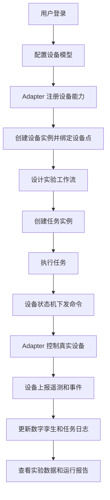

### 3.3 异常流程

- 用户未登录或 Token 失效：跳转登录页。
- Adapter 未连接：显示 MQTT 状态异常并允许重连。
- 设备实例未绑定 Adapter：禁止发送设备命令。
- 状态机拒绝操作：返回当前状态和拒绝原因。
- 约束规则命中：阻断任务或控制指令，并记录违反日志。
- 任务节点执行失败：记录 StepLog，任务进入 FAILED 或 WAITING 状态。

### 3.4 权限边界

- 前端通过菜单和路由守卫控制页面可见性。
- 后端通过 JWT 过滤器校验用户身份。
- 管理员拥有全部权限。
- 普通用户按权限对象控制可执行操作。

## 4. 系统架构


### 4.1 前端模块

- 登录注册。
- 首页 Dashboard。
- 设备模型管理。
- 设备实例管理。
- PLC / Adapter 管理。
- 数据模板管理。
- 数据点管理。
- 任务列表。
- 任务监控。
- 流程设计。
- 约束管理。
- 用户管理。

### 4.2 后端模块

- Controller 层：提供 REST API。
- Service 层：承载业务逻辑。
- Mapper 层：访问数据库。
- Entity / DTO：定义数据库实体和接口对象。
- Adapter 服务：解析 manifest、维护 MQTT 通信。
- 状态机引擎：处理设备状态迁移和命令输出。
- Global 模块：认证、安全、JSON 工具、配置。

### 4.3 外部系统

- PostgreSQL：保存业务数据、模型 JSON、任务日志和权限数据。
- MQTT Broker：负责后端和 Adapter 之间的消息通信。
- 设备适配器：屏蔽真实设备协议差异。
- 物理设备：PLC、相机、运动控制台等实验室设备。

## 5. 数据链路图

### 5.1 总体数据链路

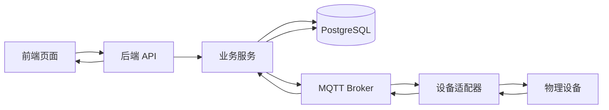

### 5.2 Adapter 注册数据链路

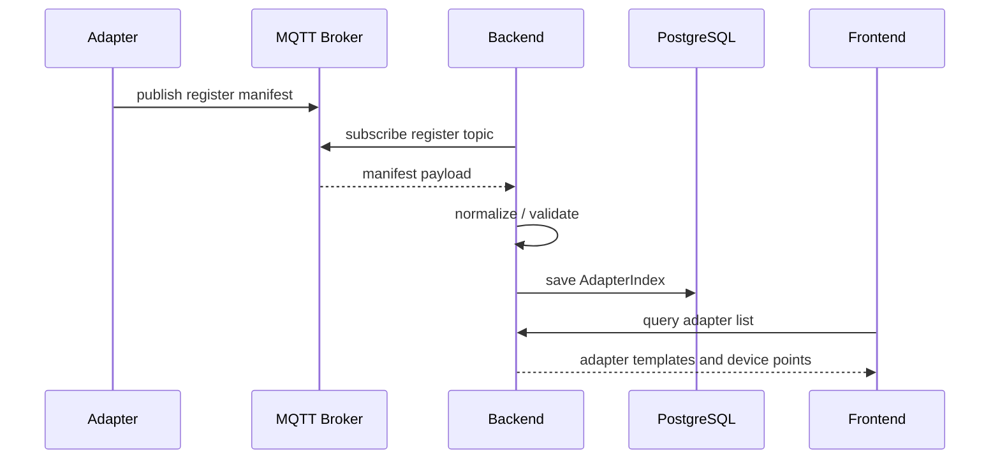

### 5.3 遥测数据链路

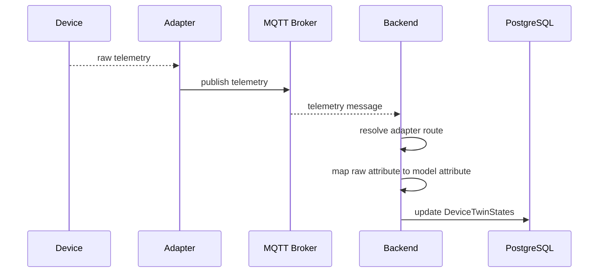

### 5.4 命令控制数据链路

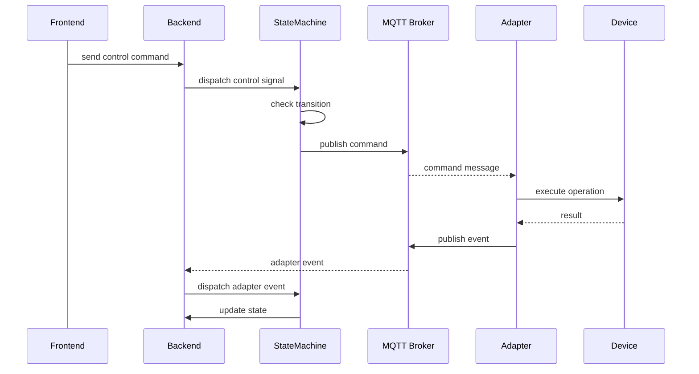

### 5.5 任务执行数据链路

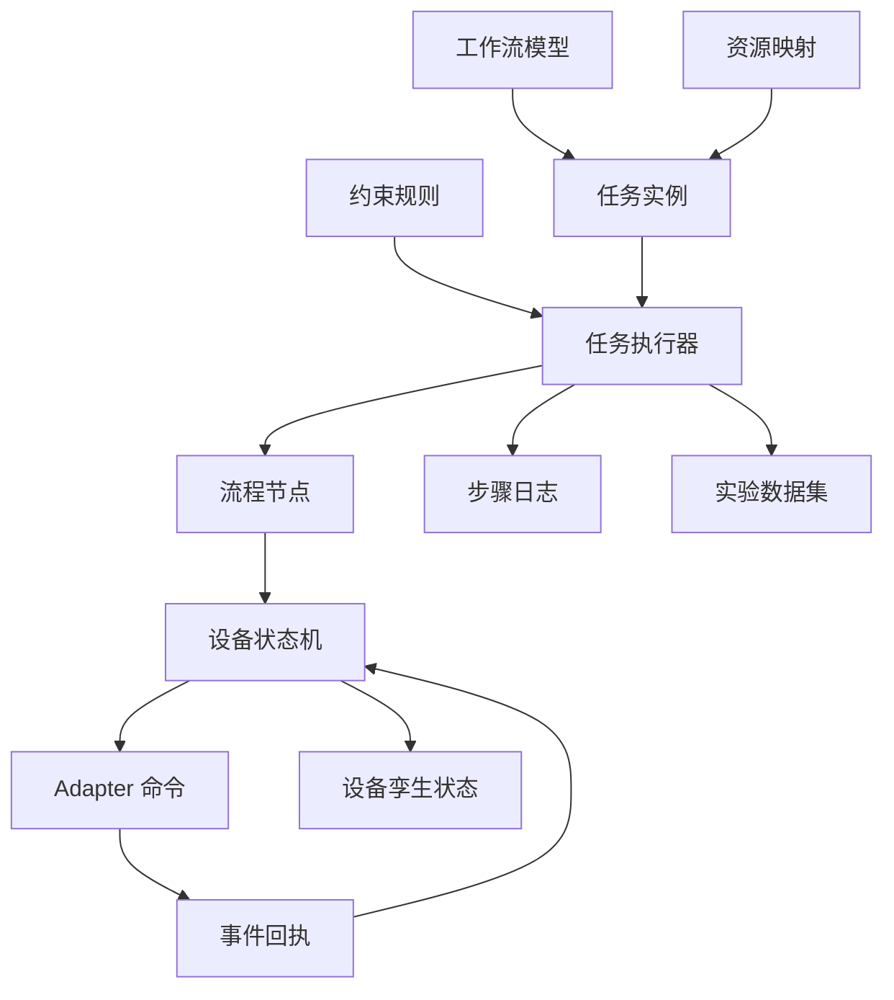

## 6. 核心对象模型

### 6.1 设备模型

- 用途：定义设备属性、能力、端口、约束、Adapter 契约和状态机。
- 来源：用户配置或 Adapter 契约生成。
- 生命周期：创建、编辑、绑定实例、归档。
- 关联对象：设备实例、约束规则、状态机、Adapter 模板。

### 6.2 设备实例

- 用途：代表真实实验室设备或设备点。
- 来源：用户在设备实例管理页面创建。
- 生命周期：创建、绑定 Adapter、运行、停用、归档。
- 关联对象：设备模型、AdapterIndex、DeviceTwinStates、DataIndex。

### 6.3 Adapter

- 用途：封装真实设备通信协议。
- 来源：设备侧通过 MQTT 注册。
- 生命周期：注册、心跳、订阅设备点、接收命令、上报事件。
- 关联对象：AdapterIndex、设备实例、Adapter manifest。

### 6.4 工作流模型

- 用途：描述实验流程节点、接口连接和端口连接。
- 来源：流程设计器。
- 生命周期：设计、保存、发布、创建任务。
- 关联对象：流程节点、任务实例、设备能力。

### 6.5 任务实例

- 用途：承载一次实验运行。
- 来源：用户从工作流模型创建。
- 生命周期：PENDING、RUNNING、COMPLETED、FAILED、ABORTED。
- 关联对象：工作流模型、任务步骤、运行日志、数据集。

### 6.6 约束规则

- 用途：描述安全、资源、设备和实验过程约束。
- 来源：安全中心配置。
- 生命周期：创建、启用、命中、记录、停用。
- 关联对象：设备模型、设备实例、任务、ViolationLog。

### 6.7 数据模板与数据集

- 用途：定义实验数据结构并保存运行结果。
- 来源：数据模板管理和设备实例创建流程。
- 生命周期：模板创建、数据集生成、数据写入、查询导出。
- 关联对象：设备实例、任务、任务步骤。

## 7. 任务拆解

### T1：固化 Adapter 注册协议

目标：

完善 Adapter manifest 的字段定义、校验逻辑、样例文件和错误提示。

涉及文件：

- `Backend/src/main/java/com/smartlab/management/service/adapter/AdapterManifestService.java`
- `Backend/src/main/java/com/smartlab/management/service/db/resource/device/AdapterIndexService.java`
- `Backend/src/main/resources/samples/`
- `docs/adapter-protocol.md`

执行步骤：

1. 阅读现有 Adapter manifest 解析逻辑。
2. 梳理必填字段、可选字段和默认值。
3. 补充 JSON schema 或文档约束。
4. 准备至少一个标准样例和一个错误样例。
5. 在前端或接口层显示清晰错误信息。

验收标准：

- 可以注册一个标准 Adapter。
- 可以查询 Adapter 的设备模板和设备点。
- 错误 manifest 能返回明确原因。
- 文档中包含 topic、字段和样例。

### T2：完善设备实例绑定闭环

目标：

确保设备实例能够稳定绑定 Adapter 设备点，并自动生成属性映射、命令 topic 和遥测 topic。

涉及文件：

- `DeviceInstanceService.java`
- `DeviceInstanceController.java`
- `DeviceInstanceManagement.vue`
- `DeviceModelManagement.vue`

执行步骤：

1. 检查设备模型与 Adapter 模板匹配逻辑。
2. 检查属性类型映射和字段映射。
3. 完善绑定预览接口。
4. 完善前端绑定表单和错误提示。
5. 保存后刷新 Adapter 路由表。

验收标准：

- 设备实例可绑定 Adapter 设备点。
- 保存后可看到 adapterBinding。
- 遥测 topic 和命令 topic 正确生成。
- 绑定不匹配时有明确提示。

### T3：统一设备控制链路

目标：

所有手动控制和后续任务控制都统一经过状态机，避免直接绕过状态机修改状态。

涉及文件：

- `StateMachineEngineService.java`
- `DeviceInstanceService.java`
- `DeviceInstanceController.java`
- `MqttAdapterMessagingService.java`

执行步骤：

1. 梳理当前设备控制入口。
2. 明确状态机接受的输入信号。
3. 将命令构造和 MQTT 发布接入状态机 SEND action。
4. Adapter event 回流后更新指令生命周期状态。
5. 补充状态拒绝时的错误信息。

验收标准：

- 非法状态不能发送命令。
- 合法控制会发布 MQTT command。
- Adapter 回执事件能推动状态变化。
- 设备孪生状态和前端显示一致。

### T4：实现任务执行器 MVP

目标：

从工作流模型创建任务后，系统可以自动调度流程节点并触发设备能力。

涉及文件：

- `TaskService.java`
- `WorkflowService.java`
- `FlowNodeService.java`
- 新增 `TaskExecutionService.java`
- `TaskMonitor.vue`
- `WorkflowDesigner.vue`

执行步骤：

1. 定义任务节点状态。
2. 读取工作流节点和连接关系。
3. 计算可执行节点。
4. 调用设备状态机触发能力。
5. 等待 Adapter event 或状态变化。
6. 写入 TaskStep 和 StepLog。
7. 更新任务整体状态。

验收标准：

- 一个简单两节点流程可以自动执行。
- 每个节点有状态和日志。
- 失败节点能记录原因。
- 任务监控页面能看到运行过程。

### T5：实现约束运行时校验

目标：

在设备控制和任务执行前执行约束规则，命中后阻断或触发处置动作。

涉及文件：

- `ConstraintRuleService.java`
- `ViolationLogService.java`
- `StateMachineEngineService.java`
- `TaskService.java`
- `SecurityCenter.vue`

执行步骤：

1. 分类约束规则：设备、实例、任务、全局。
2. 定义约束上下文。
3. 实现约束表达式读取和判断。
4. 在控制前、节点执行前调用约束检查。
5. 命中后写入 ViolationLog。

验收标准：

- 控制前可检查约束。
- 命中约束会阻断操作。
- 违反日志可查询。
- 前端能显示违反原因。

### T6：建立实验数据追踪链路

目标：

把任务、步骤、设备状态、遥测数据和实验结果关联起来，支撑论文实验分析。

涉及文件：

- `DataIndexService.java`
- `DataRecordService.java`
- `TaskService.java`
- `DeviceInstanceService.java`
- `DataManagement.vue`
- `TaskMonitor.vue`

执行步骤：

1. 定义 traceId 或 taskRunId。
2. 遥测写入时关联任务和设备实例。
3. 任务步骤保存输入输出快照。
4. 增加按任务查询数据接口。
5. 增加 CSV/Excel 导出规划。

验收标准：

- 可以从任务查到相关设备数据。
- 可以从数据记录回溯到任务和步骤。
- 实验数据可导出。
- 论文实验图表有数据来源。

## 8. 时间线

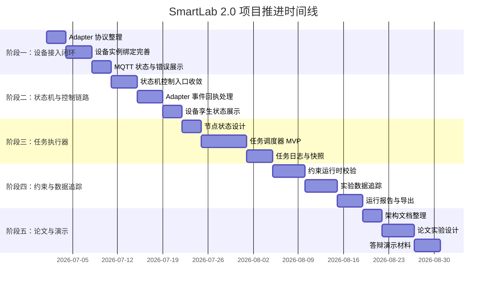

## 9. 阶段交付物

| 阶段 | 目标 | 交付物 | 验收方式 |
| --- | --- | --- | --- |
| 阶段一 | 打通设备接入闭环 | Adapter 协议、样例 manifest、设备绑定页面 | 注册 Adapter 并绑定设备实例 |
| 阶段二 | 收敛控制链路 | 状态机控制、MQTT command、事件回执 | 手动控制设备并更新状态 |
| 阶段三 | 实现任务执行器 | 节点调度、任务日志、步骤快照 | 自动执行简单工作流 |
| 阶段四 | 加入约束和数据追踪 | 约束校验、违反日志、任务数据关联 | 命中约束并可追踪实验数据 |
| 阶段五 | 支撑论文和展示 | 架构图、论文大纲、演示数据 | 完成项目汇报或论文实验章节 |

## 10. Codex 执行规则

Codex 执行任务时应遵守以下规则：

- 修改代码前先阅读相关文件和已有实现。
- 保持改动范围聚焦，不做无关重构。
- 不覆盖用户已有修改。
- 优先沿用项目现有分层、命名和风格。
- 新增接口时同步检查前端调用和后端返回结构。
- 涉及结构化数据时优先使用 JSON parser、schema 或类型对象。
- 涉及数据库结构修改时先提出迁移方案。
- 涉及真实设备、远程数据库、MQTT Broker 或外部服务时先确认。
- 每个任务完成后运行合适的验证命令。
- 如果无法运行测试，需要说明原因和残余风险。
- 新增重要功能时补充文档、样例或使用说明。

## 11. 验收标准

### 11.1 功能验收

- 页面可以正常访问。
- 接口返回结构清晰。
- 核心操作有成功和失败反馈。
- 异常状态不会导致系统崩溃。

### 11.2 数据验收

- 数据能正确流转。
- 关键对象能正确落库。
- 状态更新与前端显示一致。
- 任务、步骤、设备和数据之间可追踪。

### 11.3 工程验收

- 后端能够编译或通过目标测试。
- 前端能够构建或通过目标页面验证。
- 关键逻辑有日志。
- 错误信息可定位。
- 不引入明显安全风险。

### 11.4 文档验收

- 新增协议或流程需要补充文档。
- 架构变化需要更新架构图。
- 新增样例需要说明运行方式。
- 论文相关内容需要保留图表和数据来源。

## 12. 风险与依赖

| 风险 | 影响 | 应对方式 |
| --- | --- | --- |
| 数据库连接使用远程地址和明文密码 | 安全和稳定性风险 | 改为环境变量或本地 profile |
| MQTT Broker 不可用 | Adapter 链路无法验证 | 准备本地 Broker 或模拟消息 |
| 真实设备不在线 | 无法端到端演示 | 准备模拟 Adapter |
| Adapter 协议变化 | 前后端和设备侧不一致 | 固化 manifest schema 和版本号 |
| 任务执行器边界不清 | 容易引入复杂状态问题 | 先实现 MVP，再逐步扩展 |
| 约束表达式不规范 | 运行时校验不可靠 | 定义约束上下文和表达式规则 |
| 动态数据表风险 | SQL 和权限风险 | 严格校验表名、字段名和访问范围 |
| 论文时间不足 | 影响最终交付 | 提前整理图、实验数据和章节素材 |

## 13. 待确认问题

- 是否需要接入真实设备，还是先使用模拟 Adapter？
- 是否允许修改数据库结构？
- 是否需要部署到服务器？
- 论文重点是系统设计、可执行建模、设备接入、状态机，还是任务调度？
- 是否需要导出 Word、PDF、Excel 或 PPT？
- 是否需要把规划同步到 Notion 或 Linear？
- 是否需要为每个阶段创建 GitHub issue 或 Linear issue？
- 是否需要写自动化测试，测试范围多大？

## 14. 推荐后续文档

```text
docs/
  codex-execution-plan-outline.md
  software-architecture-and-project-plan.md
  adapter-protocol.md
  device-modeling-guide.md
  workflow-execution-design.md
  constraint-engine-design.md
  database-design.md
  thesis-outline.md
```

## 15. 给 Codex 的执行提示模板

后续可以直接复制下面这段给 Codex：

```md
请根据 `docs/codex-execution-plan-outline.md` 执行当前阶段任务。

当前任务：
[填写任务编号，例如 T1：固化 Adapter 注册协议]

要求：
1. 先阅读相关代码和文档。
2. 只修改与当前任务相关的文件。
3. 不覆盖已有用户修改。
4. 完成后运行合适的验证命令。
5. 更新相关文档或样例。
6. 最后说明改了什么、如何验证、还有什么风险。
```

````

---

## docs/software-architecture-and-project-plan.md

````text
# SmartLab 2.0 软件架构与项目规划

更新时间：2026-06-29

本文档基于当前仓库代码结构生成，用于项目汇报、论文写作、架构图绘制和后续研发规划。当前系统定位为面向智能化学实验室的可执行建模与运行管理平台，核心目标是把设备资源、设备状态、实验流程、约束规则、数据采集和适配器通信统一到一套可管理、可执行、可追踪的软件框架中。

## 1. 系统定位

SmartLab 2.0 采用前后端分离与设备适配器解耦的架构。前端提供实验室资源、流程、任务、数据、安全和用户权限管理界面；后端提供统一 API、数据库访问、设备模型管理、状态机执行、任务运行记录、约束与权限管理；设备适配器通过 MQTT 与后端交互，将 PLC、相机、运动控制台等异构设备封装为统一的设备点、遥测、事件和命令协议。

系统的核心抽象包括：

- 设备模型：描述设备属性、能力、端口、约束、适配器契约和状态机。
- 设备实例：绑定真实设备点，维护当前状态、在线状态、属性快照和 Adapter 路由。
- 工作流模型：描述实验流程节点、接口连接和端口连接。
- 任务实例：承载一次实验运行，记录任务状态、变量空间、步骤快照和运行日志。
- 约束规则：描述安全、资源、过程和实验条件限制。
- 数据模板与数据集：管理实验数据结构和动态数据表。
- Adapter manifest：由设备适配器提供能力清单，统一设备点、属性、命令和事件定义。

## 2. 总体架构

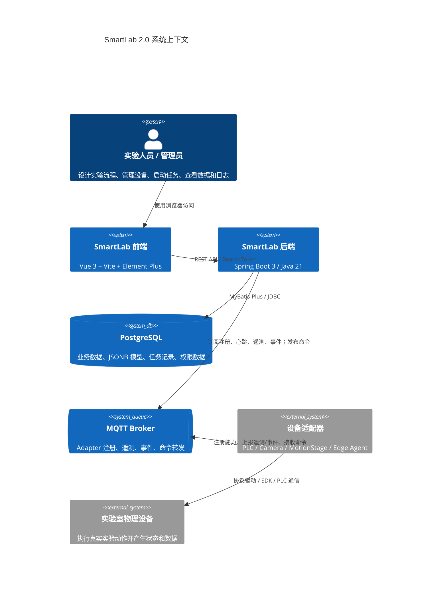

如果渲染环境不支持 C4 Mermaid，可使用下面的普通 Mermaid 版本：


## 3. 代码分层

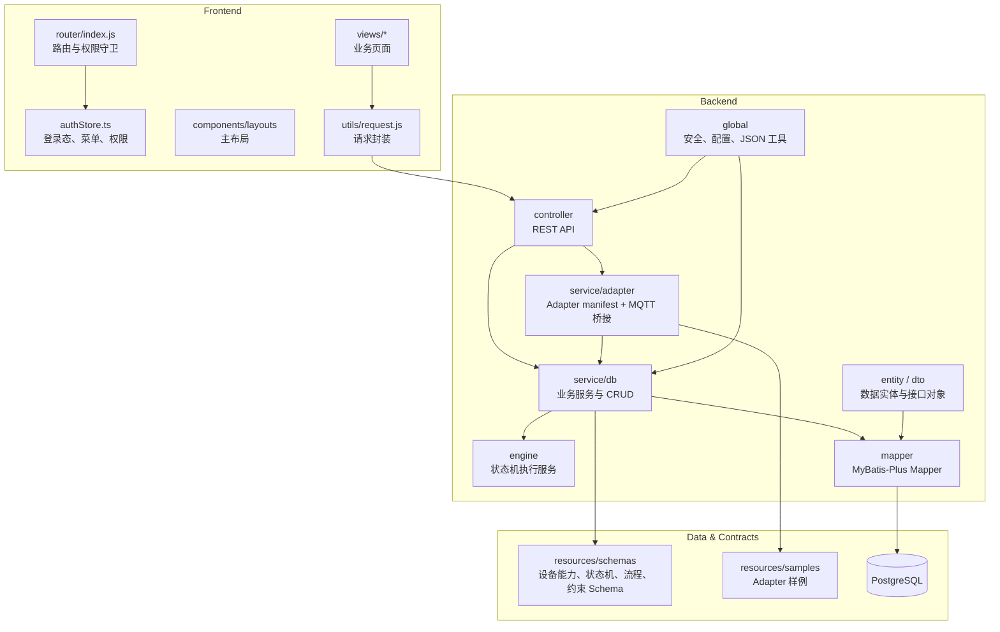

## 4. 后端核心模块

### 4.1 资源与设备管理

对应主要代码：

- `DeviceModelController` / `DeviceModelService`
- `DeviceInstanceController` / `DeviceInstanceService`
- `DeviceTwinStateController` / `DeviceTwinStateService`
- `AdapterIndexController` / `AdapterIndexService`
- `AdapterManifestService`

职责：

- 管理设备模型、设备实例、设备分类和设备组件。
- 保存设备能力、属性、端口、状态机、约束和 Adapter 契约等 JSONB 模型。
- 将设备实例绑定到 Adapter 设备点。
- 根据 Adapter manifest 生成适配器契约和属性映射。
- 维护设备数字孪生快照，包括在线状态、当前属性、指令生命周期状态和功能状态。

### 4.2 Adapter 通信与运行桥接

对应主要代码：

- `MqttAdapterMessagingService`
- `AdapterProtocolController`
- `AdapterManifestService`
- `adapter/*`

职责：

- 监听 Adapter 注册主题。
- 解析 Adapter 上报的设备模板、设备点、属性、命令和事件。
- 按设备实例绑定关系订阅 telemetry 与 event topic。
- 将遥测数据映射为设备模型属性并更新设备孪生状态。
- 将事件输入状态机。
- 发布设备控制命令到 Adapter command topic。

核心 topic 约定：

- 注册：`smartlab/adapter/register`
- 心跳：`smartlab/adapter/{adapterName}/heartbeat`
- 遥测：`smartlab/adapter/{adapterName}/{devicePoint}/telemetry`
- 事件：`smartlab/adapter/{adapterName}/{devicePoint}/event`
- 命令：`smartlab/adapter/{adapterName}/{devicePoint}/command`

### 4.3 状态机引擎

对应主要代码：

- `StateMachineEngineService`
- `StateMachineSendActionEvent`
- `device-state-machine-model.json`

职责：

- 接收人工控制、工作流控制、约束控制和 Adapter 事件。
- 根据设备模型中的状态转移规则判断是否允许状态迁移。
- 分离指令生命周期状态和设备功能状态。
- 执行 `SEND` 动作，将状态机输出信号转换为 Adapter 指令事件。
- 维护接口信号快照，支持后续扩展为流程编排、状态广播或调试面板。

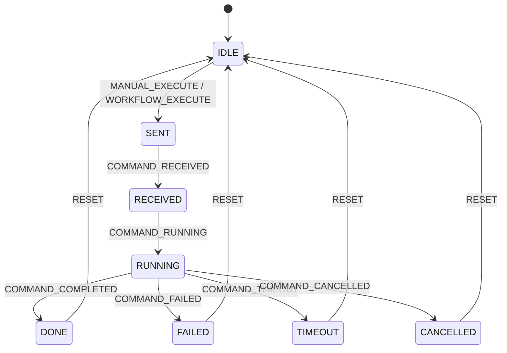

### 4.4 工作流与任务执行

对应主要代码：

- `WorkflowController` / `WorkflowService`
- `FlowNodeController` / `FlowNodeService`
- `TaskController` / `TaskService`
- `WorkflowDesigner.vue`
- `TaskList.vue`
- `TaskMonitor.vue`

职责：

- 保存实验流程模型，包括节点、接口连接、端口连接。
- 创建任务实例，记录任务变量、资源映射和任务约束。
- 启动、终止和监控任务。
- 保存步骤快照和运行日志，为实验复现和论文实验记录提供依据。

当前任务服务已具备任务状态、日志、快照和监控汇总能力；后续可进一步补齐自动调度执行器，将工作流节点与设备状态机、约束规则、数据采集合并为完整运行闭环。

### 4.5 数据管理

对应主要代码：

- `DataTemplateController` / `DataTemplateService`
- `DataIndexController` / `DataIndexService`
- `DataRecordController` / `DataRecordService`
- `DataCenter.vue`
- `DataManagement.vue`

职责：

- 管理数据模板主表与明细字段。
- 根据设备实例创建默认数据集。
- 管理数据索引和动态数据表。
- 查询实验数据集和分页记录。

该模块适合支撑论文中的实验数据采集、实验结果表格、设备运行记录和任务可追溯性分析。

### 4.6 约束与安全

对应主要代码：

- `ConstraintRuleController` / `ConstraintRuleService`
- `ViolationLogController` / `ViolationLogService`
- `SecurityCenter.vue`
- `constraint-model.json`

职责：

- 管理安全约束、资源约束、实验约束。
- 记录约束违反日志。
- 为任务执行和设备控制提供规则校验入口。

后续规划中，约束模块应从“配置与记录”升级为“运行时约束检查器”，在设备控制、任务调度和状态迁移前统一拦截风险操作。

### 4.7 用户、权限与菜单

对应主要代码：

- `SecurityConfig`
- `JwtAuthenticationFilter`
- `AuthenticationTokenService`
- `UserController` / `UserService`
- `PermissionController` / `PermissionService`
- `MenuService` / `MenuCatalogService`
- `authStore.ts`
- `router/index.js`

职责：

- 提供注册、登录、JWT 认证、用户资料和菜单加载。
- 按权限控制前端可见菜单和路由访问。
- 支持系统管理员权限绕过和普通用户权限对象校验。

## 5. 前端功能架构

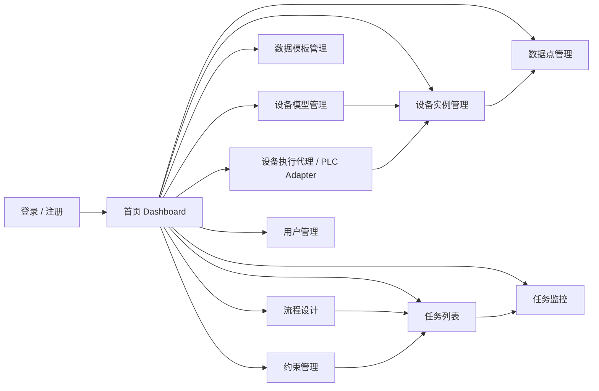

前端使用 Vue 3、Vue Router、Pinia、Element Plus、ECharts 和 Vue Flow。当前路由已经按主要业务域组织，权限守卫会在进入受保护页面时刷新用户资料和菜单，并根据后端返回的可见路径控制访问。

## 6. 关键运行链路

### 6.1 Adapter 注册与设备绑定链路

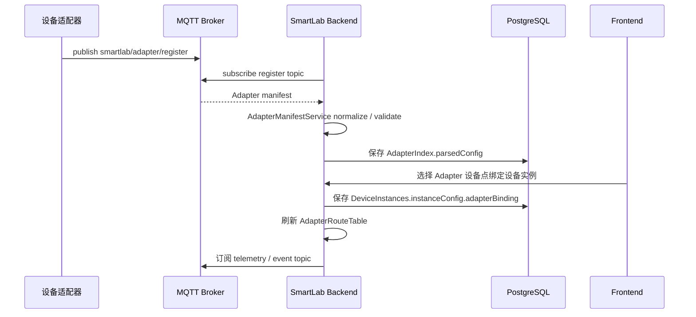

### 6.2 遥测数据更新数字孪生链路

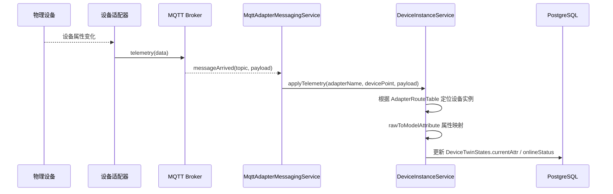

### 6.3 手动控制与状态机链路

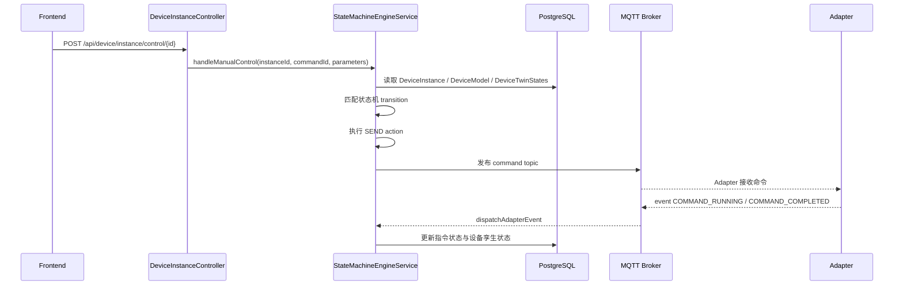

### 6.4 任务与工作流规划链路

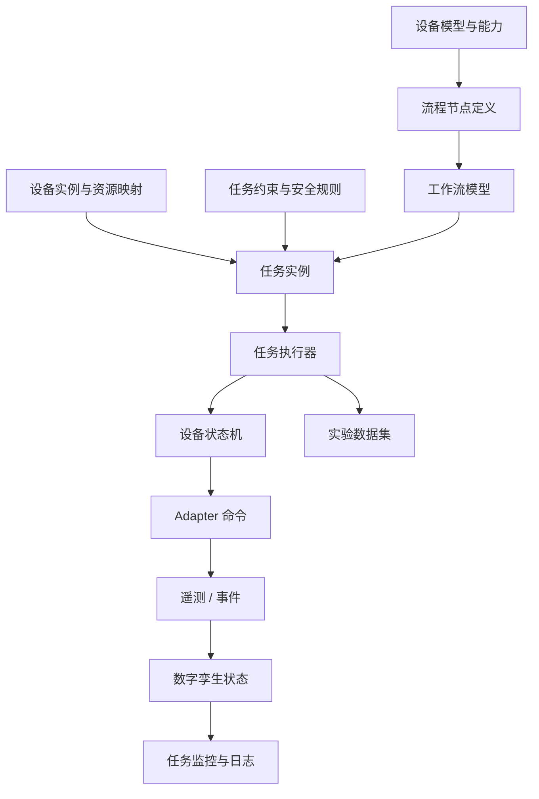

其中 `任务执行器` 是后续需要重点完善的模块：它应负责按工作流拓扑调度节点、分配设备资源、检查约束、触发设备能力、等待事件回执、记录步骤快照，并把数据写入对应数据集。

## 7. 数据模型分区

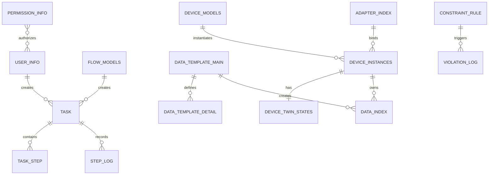

主要数据域：

- 资源域：设备分类、设备组件、设备模型、设备实例、设备孪生状态、场景资源结构。
- Adapter 域：Adapter 注册索引、解析后配置、设备模板、设备点和契约映射。
- 流程任务域：流程模型、流程节点、任务、任务步骤、步骤日志。
- 数据域：数据模板、数据字段、数据索引、动态实验数据表。
- 安全域：约束规则、违反日志、用户、权限、菜单。

## 8. 项目当前状态判断

当前项目已经具备完整的系统骨架和核心业务边界：

- 前端主业务页面基本齐全，覆盖设备、数据、任务、约束、用户和首页。
- 后端已形成 Controller、Service、Mapper、Entity、DTO 的分层结构。
- PostgreSQL + JSONB 模型适合承载复杂设备模型、工作流模型和约束模型。
- Adapter manifest、MQTT、设备实例绑定和数字孪生状态已经形成设备接入闭环。
- 状态机引擎已开始承接设备指令生命周期与 Adapter 事件处理。
- 任务执行目前更偏向任务记录与监控，距离全自动工作流执行还需要补齐调度器。

需要重点关注的工程风险：

- `application.yml` 当前含有直连数据库地址和明文密码，应迁移到环境变量或本地 profile。
- 状态机、MQTT、任务调度、数据写入之间的事务边界和失败补偿需要进一步设计。
- 设备控制链路需要统一由状态机驱动，避免 Controller/Service 中存在绕过状态机的控制路径。
- 动态数据表与 SQL 拼接相关逻辑需要持续校验表名、字段名和权限边界。
- 论文或验收前，需要补充端到端演示样例、测试数据和关键路径自动化测试。

## 9. 后续项目规划

### 阶段一：系统收敛与可运行闭环

目标：让“设备接入 - 模型绑定 - 手动控制 - 状态回执 - 数据更新”稳定跑通。

任务：

- 梳理 Adapter manifest 标准字段，形成正式协议文档。
- 固化设备模型与 Adapter 契约生成流程。
- 完善设备实例绑定校验和错误提示。
- 统一设备控制入口，优先走状态机与 MQTT 发布链路。
- 增加 MQTT 连接状态、订阅 topic、最近消息、错误信息的可视化面板。
- 准备一个可复现实验样例：例如加热/压力/PLC 数据点闭环。

交付物：

- Adapter 协议说明。
- 单设备控制演示。
- 设备孪生状态面板。
- 样例 Adapter 配置和样例设备模型。

### 阶段二：工作流执行器

目标：把流程设计从“可保存”推进到“可执行”。

任务：

- 定义工作流节点运行状态：PENDING、READY、RUNNING、WAITING_EVENT、COMPLETED、FAILED、SKIPPED。
- 实现任务执行器，按节点依赖和接口连接调度。
- 将流程节点能力调用映射到设备实例能力和 Adapter 命令。
- 实现变量空间、输入输出端口、接口事件的传递规则。
- 每个节点执行前检查资源锁、任务约束和设备状态。
- 每个节点执行后保存 TaskStep 快照和 StepLog。

交付物：

- 自动执行一个多节点实验流程。
- 任务监控页面展示节点级运行状态。
- 失败节点可定位到设备、命令、事件和约束原因。

### 阶段三：约束引擎与安全控制

目标：让系统具备实验前、执行中和异常时的安全管控能力。

任务：

- 将约束规则分为设备固有约束、实例局部约束、任务全局约束和运行时约束。
- 设计约束表达式计算上下文：设备属性、任务变量、资源占用、环境参数、用户权限。
- 在手动控制和任务执行前增加约束检查。
- 违反约束时写入 ViolationLog，并触发暂停、取消、告警或恢复策略。
- 在安全中心中展示规则命中记录和处置结果。

交付物：

- 约束规则运行时校验。
- 约束违反日志闭环。
- 安全控制实验案例。

### 阶段四：数据与实验可追溯

目标：支撑论文实验、结果分析和实验复现。

任务：

- 将任务、步骤、设备状态、Adapter 消息和数据集建立统一追踪 ID。
- 设计实验运行报告结构，包括任务参数、设备状态变化、关键数据曲线和异常记录。
- 扩展数据模板与动态数据表，支持按任务、设备、时间范围查询。
- 增加图表导出、CSV/Excel 导出和论文图表生成能力。

交付物：

- 实验运行报告。
- 任务级数据追踪。
- 可导出的实验数据与图表。

### 阶段五：论文与系统展示

目标：把工程系统整理为可讲清楚、可演示、可验证的论文成果。

建议论文结构：

1. 绪论：智能化学实验室自动化、异构设备接入和实验流程执行问题。
2. 相关工作：实验室自动化、数字孪生、工作流系统、设备适配器、约束执行。
3. 需求分析：实验流程建模、设备资源管理、状态可追踪、安全约束、数据采集。
4. 系统架构：前后端、后端分层、Adapter 协议、状态机引擎、数据模型。
5. 核心设计：设备模型、Adapter manifest、状态机、工作流执行器、约束引擎。
6. 系统实现：关键模块实现、接口设计、数据库设计、前端页面。
7. 实验与评估：典型实验流程、设备控制延迟、状态一致性、异常处理、可扩展性。
8. 总结与展望：系统贡献、不足和未来工作。

论文图建议：

- 系统总体架构图。
- 后端分层架构图。
- Adapter 注册与设备绑定时序图。
- 设备状态机图。
- 工作流执行流程图。
- 数据库核心实体关系图。
- 约束检查闭环图。

## 10. 近期优先级建议

| 优先级 | 工作项 | 价值 | 验收标准 |
| --- | --- | --- | --- |
| P0 | 固化设备接入闭环 | 打通真实设备或模拟设备 | Adapter 注册、设备绑定、遥测更新、手动命令发布成功 |
| P0 | 统一控制链路 | 降低状态不一致风险 | 所有设备控制都经过状态机和统一事件回执 |
| P1 | 任务执行器 MVP | 从管理系统升级为可执行系统 | 一个多节点流程可自动运行并生成日志 |
| P1 | 约束运行时校验 | 提升安全性和论文亮点 | 控制前可拦截违规操作并记录日志 |
| P1 | 实验数据追踪 | 支撑论文实验分析 | 任务、步骤、设备状态、数据集可以关联查询 |
| P2 | 架构与协议文档 | 降低维护成本 | README、Adapter 协议、状态机 schema、API 说明完整 |
| P2 | 自动化测试与演示数据 | 提高稳定性 | 核心 API、状态机、Adapter 解析有测试或演示脚本 |

## 11. 推荐文档目录

建议后续补充以下文档：

```text
docs/
  software-architecture-and-project-plan.md
  adapter-protocol.md
  device-modeling-guide.md
  workflow-execution-design.md
  constraint-engine-design.md
  database-design.md
  thesis-outline.md
```

这些文档可以直接作为论文、答辩 PPT、项目 README 和 Notion 项目知识库的基础材料。

````

---

## docx_output.txt

````text


数据库结构设计文档
V1.4


于涛
2025-09-11

版本信息


python : Traceback (most recent call last):
所在位置 行:1 字符: 1
+ python -c "
+ ~~~~~~~~~~~
    + CategoryInfo          : NotSpecified: (Traceback (most recent call last)::String) [], RemoteException
    + FullyQualifiedErrorId : NativeCommandError
 
  File "<string>", line 5, in <module>
    print(p.text)
    ~~~~~^^^^^^^^
UnicodeEncodeError: 'gbk' codec can't encode character '\xa0' in position 10: illegal multibyte sequence

````

---

## Frontend/index.html

````text
<!doctype html>
<html lang="en">
  <head>
    <meta charset="UTF-8" />
    <meta name="viewport" content="width=device-width, initial-scale=1.0" />
    <title>SmartLab</title>
  </head>
  <body>
    <div id="app"></div>
    <script type="module" src="/src/main.js"></script>
  </body>
</html>

````

---

## Frontend/package-lock.json

````text
{
  "name": "smartlab-front",
  "version": "0.0.0",
  "lockfileVersion": 3,
  "requires": true,
  "packages": {
    "": {
      "name": "smartlab-front",
      "version": "0.0.0",
      "dependencies": {
        "@vue-flow/background": "^1.3.2",
        "@vue-flow/controls": "^1.1.3",
        "@vue-flow/core": "^1.48.2",
        "axios": "^1.13.6",
        "echarts": "^6.1.0",
        "element-plus": "^2.13.5",
        "pinia": "^3.0.4",
        "vue": "^3.5.13",
        "vue-router": "^5.0.3"
      },
      "devDependencies": {
        "@vitejs/plugin-vue": "^5.2.1",
        "vite": "^6.0.5"
      }
    },
    "node_modules/@babel/generator": {
      "version": "7.29.1",
      "resolved": "https://registry.npmmirror.com/@babel/generator/-/generator-7.29.1.tgz",
      "integrity": "sha512-qsaF+9Qcm2Qv8SRIMMscAvG4O3lJ0F1GuMo5HR/Bp02LopNgnZBC/EkbevHFeGs4ls/oPz9v+Bsmzbkbe+0dUw==",
      "license": "MIT",
      "dependencies": {
        "@babel/parser": "^7.29.0",
        "@babel/types": "^7.29.0",
        "@jridgewell/gen-mapping": "^0.3.12",
        "@jridgewell/trace-mapping": "^0.3.28",
        "jsesc": "^3.0.2"
      },
      "engines": {
        "node": ">=6.9.0"
      }
    },
    "node_modules/@babel/helper-string-parser": {
      "version": "7.27.1",
      "resolved": "https://registry.npmmirror.com/@babel/helper-string-parser/-/helper-string-parser-7.27.1.tgz",
      "integrity": "sha512-qMlSxKbpRlAridDExk92nSobyDdpPijUq2DW6oDnUqd0iOGxmQjyqhMIihI9+zv4LPyZdRje2cavWPbCbWm3eA==",
      "license": "MIT",
      "engines": {
        "node": ">=6.9.0"
      }
    },
    "node_modules/@babel/helper-validator-identifier": {
      "version": "7.28.5",
      "resolved": "https://registry.npmmirror.com/@babel/helper-validator-identifier/-/helper-validator-identifier-7.28.5.tgz",
      "integrity": "sha512-qSs4ifwzKJSV39ucNjsvc6WVHs6b7S03sOh2OcHF9UHfVPqWWALUsNUVzhSBiItjRZoLHx7nIarVjqKVusUZ1Q==",
      "license": "MIT",
      "engines": {
        "node": ">=6.9.0"
      }
    },
    "node_modules/@babel/parser": {
      "version": "7.29.0",
      "resolved": "https://registry.npmmirror.com/@babel/parser/-/parser-7.29.0.tgz",
      "integrity": "sha512-IyDgFV5GeDUVX4YdF/3CPULtVGSXXMLh1xVIgdCgxApktqnQV0r7/8Nqthg+8YLGaAtdyIlo2qIdZrbCv4+7ww==",
      "license": "MIT",
      "dependencies": {
        "@babel/types": "^7.29.0"
      },
      "bin": {
        "parser": "bin/babel-parser.js"
      },
      "engines": {
        "node": ">=6.0.0"
      }
    },
    "node_modules/@babel/types": {
      "version": "7.29.0",
      "resolved": "https://registry.npmmirror.com/@babel/types/-/types-7.29.0.tgz",
      "integrity": "sha512-LwdZHpScM4Qz8Xw2iKSzS+cfglZzJGvofQICy7W7v4caru4EaAmyUuO6BGrbyQ2mYV11W0U8j5mBhd14dd3B0A==",
      "license": "MIT",
      "dependencies": {
        "@babel/helper-string-parser": "^7.27.1",
        "@babel/helper-validator-identifier": "^7.28.5"
      },
      "engines": {
        "node": ">=6.9.0"
      }
    },
    "node_modules/@ctrl/tinycolor": {
      "version": "4.2.0",
      "resolved": "https://registry.npmmirror.com/@ctrl/tinycolor/-/tinycolor-4.2.0.tgz",
      "integrity": "sha512-kzyuwOAQnXJNLS9PSyrk0CWk35nWJW/zl/6KvnTBMFK65gm7U1/Z5BqjxeapjZCIhQcM/DsrEmcbRwDyXyXK4A==",
      "license": "MIT",
      "engines": {
        "node": ">=14"
      }
    },
    "node_modules/@element-plus/icons-vue": {
      "version": "2.3.2",
      "resolved": "https://registry.npmmirror.com/@element-plus/icons-vue/-/icons-vue-2.3.2.tgz",
      "integrity": "sha512-OzIuTaIfC8QXEPmJvB4Y4kw34rSXdCJzxcD1kFStBvr8bK6X1zQAYDo0CNMjojnfTqRQCJ0I7prlErcoRiET2A==",
      "license": "MIT",
      "peerDependencies": {
        "vue": "^3.2.0"
      }
    },
    "node_modules/@esbuild/aix-ppc64": {
      "version": "0.25.12",
      "resolved": "https://registry.npmmirror.com/@esbuild/aix-ppc64/-/aix-ppc64-0.25.12.tgz",
      "integrity": "sha512-Hhmwd6CInZ3dwpuGTF8fJG6yoWmsToE+vYgD4nytZVxcu1ulHpUQRAB1UJ8+N1Am3Mz4+xOByoQoSZf4D+CpkA==",
      "cpu": [
        "ppc64"
      ],
      "dev": true,
      "license": "MIT",
      "optional": true,
      "os": [
        "aix"
      ],
      "engines": {
        "node": ">=18"
      }
    },
    "node_modules/@esbuild/android-arm": {
      "version": "0.25.12",
      "resolved": "https://registry.npmmirror.com/@esbuild/android-arm/-/android-arm-0.25.12.tgz",
      "integrity": "sha512-VJ+sKvNA/GE7Ccacc9Cha7bpS8nyzVv0jdVgwNDaR4gDMC/2TTRc33Ip8qrNYUcpkOHUT5OZ0bUcNNVZQ9RLlg==",
      "cpu": [
        "arm"
      ],
      "dev": true,
      "license": "MIT",
      "optional": true,
      "os": [
        "android"
      ],
      "engines": {
        "node": ">=18"
      }
    },
    "node_modules/@esbuild/android-arm64": {
      "version": "0.25.12",
      "resolved": "https://registry.npmmirror.com/@esbuild/android-arm64/-/android-arm64-0.25.12.tgz",
      "integrity": "sha512-6AAmLG7zwD1Z159jCKPvAxZd4y/VTO0VkprYy+3N2FtJ8+BQWFXU+OxARIwA46c5tdD9SsKGZ/1ocqBS/gAKHg==",
      "cpu": [
        "arm64"
      ],
      "dev": true,
      "license": "MIT",
      "optional": true,
      "os": [
        "android"
      ],
      "engines": {
        "node": ">=18"
      }
    },
    "node_modules/@esbuild/android-x64": {
      "version": "0.25.12",
      "resolved": "https://registry.npmmirror.com/@esbuild/android-x64/-/android-x64-0.25.12.tgz",
      "integrity": "sha512-5jbb+2hhDHx5phYR2By8GTWEzn6I9UqR11Kwf22iKbNpYrsmRB18aX/9ivc5cabcUiAT/wM+YIZ6SG9QO6a8kg==",
      "cpu": [
        "x64"
      ],
      "dev": true,
      "license": "MIT",
      "optional": true,
      "os": [
        "android"
      ],
      "engines": {
        "node": ">=18"
      }
    },
    "node_modules/@esbuild/darwin-arm64": {
      "version": "0.25.12",
      "resolved": "https://registry.npmmirror.com/@esbuild/darwin-arm64/-/darwin-arm64-0.25.12.tgz",
      "integrity": "sha512-N3zl+lxHCifgIlcMUP5016ESkeQjLj/959RxxNYIthIg+CQHInujFuXeWbWMgnTo4cp5XVHqFPmpyu9J65C1Yg==",
      "cpu": [
        "arm64"
      ],
      "dev": true,
      "license": "MIT",
      "optional": true,
      "os": [
        "darwin"
      ],
      "engines": {
        "node": ">=18"
      }
    },
    "node_modules/@esbuild/darwin-x64": {
      "version": "0.25.12",
      "resolved": "https://registry.npmmirror.com/@esbuild/darwin-x64/-/darwin-x64-0.25.12.tgz",
      "integrity": "sha512-HQ9ka4Kx21qHXwtlTUVbKJOAnmG1ipXhdWTmNXiPzPfWKpXqASVcWdnf2bnL73wgjNrFXAa3yYvBSd9pzfEIpA==",
      "cpu": [
        "x64"
      ],
      "dev": true,
      "license": "MIT",
      "optional": true,
      "os": [
        "darwin"
      ],
      "engines": {
        "node": ">=18"
      }
    },
    "node_modules/@esbuild/freebsd-arm64": {
      "version": "0.25.12",
      "resolved": "https://registry.npmmirror.com/@esbuild/freebsd-arm64/-/freebsd-arm64-0.25.12.tgz",
      "integrity": "sha512-gA0Bx759+7Jve03K1S0vkOu5Lg/85dou3EseOGUes8flVOGxbhDDh/iZaoek11Y8mtyKPGF3vP8XhnkDEAmzeg==",
      "cpu": [
        "arm64"
      ],
      "dev": true,
      "license": "MIT",
      "optional": true,
      "os": [
        "freebsd"
      ],
      "engines": {
        "node": ">=18"
      }
    },
    "node_modules/@esbuild/freebsd-x64": {
      "version": "0.25.12",
      "resolved": "https://registry.npmmirror.com/@esbuild/freebsd-x64/-/freebsd-x64-0.25.12.tgz",
      "integrity": "sha512-TGbO26Yw2xsHzxtbVFGEXBFH0FRAP7gtcPE7P5yP7wGy7cXK2oO7RyOhL5NLiqTlBh47XhmIUXuGciXEqYFfBQ==",
      "cpu": [
        "x64"
      ],
      "dev": true,
      "license": "MIT",
      "optional": true,
      "os": [
        "freebsd"
      ],
      "engines": {
        "node": ">=18"
      }
    },
    "node_modules/@esbuild/linux-arm": {
      "version": "0.25.12",
      "resolved": "https://registry.npmmirror.com/@esbuild/linux-arm/-/linux-arm-0.25.12.tgz",
      "integrity": "sha512-lPDGyC1JPDou8kGcywY0YILzWlhhnRjdof3UlcoqYmS9El818LLfJJc3PXXgZHrHCAKs/Z2SeZtDJr5MrkxtOw==",
      "cpu": [
        "arm"
      ],
      "dev": true,
      "license": "MIT",
      "optional": true,
      "os": [
        "linux"
      ],
      "engines": {
        "node": ">=18"
      }
    },
    "node_modules/@esbuild/linux-arm64": {
      "version": "0.25.12",
      "resolved": "https://registry.npmmirror.com/@esbuild/linux-arm64/-/linux-arm64-0.25.12.tgz",
      "integrity": "sha512-8bwX7a8FghIgrupcxb4aUmYDLp8pX06rGh5HqDT7bB+8Rdells6mHvrFHHW2JAOPZUbnjUpKTLg6ECyzvas2AQ==",
      "cpu": [
        "arm64"
      ],
      "dev": true,
      "license": "MIT",
      "optional": true,
      "os": [
        "linux"
      ],
      "engines": {
        "node": ">=18"
      }
    },
    "node_modules/@esbuild/linux-ia32": {
      "version": "0.25.12",
      "resolved": "https://registry.npmmirror.com/@esbuild/linux-ia32/-/linux-ia32-0.25.12.tgz",
      "integrity": "sha512-0y9KrdVnbMM2/vG8KfU0byhUN+EFCny9+8g202gYqSSVMonbsCfLjUO+rCci7pM0WBEtz+oK/PIwHkzxkyharA==",
      "cpu": [
        "ia32"
      ],
      "dev": true,
      "license": "MIT",
      "optional": true,
      "os": [
        "linux"
      ],
      "engines": {
        "node": ">=18"
      }
    },
    "node_modules/@esbuild/linux-loong64": {
      "version": "0.25.12",
      "resolved": "https://registry.npmmirror.com/@esbuild/linux-loong64/-/linux-loong64-0.25.12.tgz",
      "integrity": "sha512-h///Lr5a9rib/v1GGqXVGzjL4TMvVTv+s1DPoxQdz7l/AYv6LDSxdIwzxkrPW438oUXiDtwM10o9PmwS/6Z0Ng==",
      "cpu": [
        "loong64"
      ],
      "dev": true,
      "license": "MIT",
      "optional": true,
      "os": [
        "linux"
      ],
      "engines": {
        "node": ">=18"
      }
    },
    "node_modules/@esbuild/linux-mips64el": {
      "version": "0.25.12",
      "resolved": "https://registry.npmmirror.com/@esbuild/linux-mips64el/-/linux-mips64el-0.25.12.tgz",
      "integrity": "sha512-iyRrM1Pzy9GFMDLsXn1iHUm18nhKnNMWscjmp4+hpafcZjrr2WbT//d20xaGljXDBYHqRcl8HnxbX6uaA/eGVw==",
      "cpu": [
        "mips64el"
      ],
      "dev": true,
      "license": "MIT",
      "optional": true,
      "os": [
        "linux"
      ],
      "engines": {
        "node": ">=18"
      }
    },
    "node_modules/@esbuild/linux-ppc64": {
      "version": "0.25.12",
      "resolved": "https://registry.npmmirror.com/@esbuild/linux-ppc64/-/linux-ppc64-0.25.12.tgz",
      "integrity": "sha512-9meM/lRXxMi5PSUqEXRCtVjEZBGwB7P/D4yT8UG/mwIdze2aV4Vo6U5gD3+RsoHXKkHCfSxZKzmDssVlRj1QQA==",
      "cpu": [
        "ppc64"
      ],
      "dev": true,
      "license": "MIT",
      "optional": true,
      "os": [
        "linux"
      ],
      "engines": {
        "node": ">=18"
      }
    },
    "node_modules/@esbuild/linux-riscv64": {
      "version": "0.25.12",
      "resolved": "https://registry.npmmirror.com/@esbuild/linux-riscv64/-/linux-riscv64-0.25.12.tgz",
      "integrity": "sha512-Zr7KR4hgKUpWAwb1f3o5ygT04MzqVrGEGXGLnj15YQDJErYu/BGg+wmFlIDOdJp0PmB0lLvxFIOXZgFRrdjR0w==",
      "cpu": [
        "riscv64"
      ],
      "dev": true,
      "license": "MIT",
      "optional": true,
      "os": [
        "linux"
      ],
      "engines": {
        "node": ">=18"
      }
    },
    "node_modules/@esbuild/linux-s390x": {
      "version": "0.25.12",
      "resolved": "https://registry.npmmirror.com/@esbuild/linux-s390x/-/linux-s390x-0.25.12.tgz",
      "integrity": "sha512-MsKncOcgTNvdtiISc/jZs/Zf8d0cl/t3gYWX8J9ubBnVOwlk65UIEEvgBORTiljloIWnBzLs4qhzPkJcitIzIg==",
      "cpu": [
        "s390x"
      ],
      "dev": true,
      "license": "MIT",
      "optional": true,
      "os": [
        "linux"
      ],
      "engines": {
        "node": ">=18"
      }
    },
    "node_modules/@esbuild/linux-x64": {
      "version": "0.25.12",
      "resolved": "https://registry.npmmirror.com/@esbuild/linux-x64/-/linux-x64-0.25.12.tgz",
      "integrity": "sha512-uqZMTLr/zR/ed4jIGnwSLkaHmPjOjJvnm6TVVitAa08SLS9Z0VM8wIRx7gWbJB5/J54YuIMInDquWyYvQLZkgw==",
      "cpu": [
        "x64"
      ],
      "dev": true,
      "license": "MIT",
      "optional": true,
      "os": [
        "linux"
      ],
      "engines": {
        "node": ">=18"
      }
    },
    "node_modules/@esbuild/netbsd-arm64": {
      "version": "0.25.12",
      "resolved": "https://registry.npmmirror.com/@esbuild/netbsd-arm64/-/netbsd-arm64-0.25.12.tgz",
      "integrity": "sha512-xXwcTq4GhRM7J9A8Gv5boanHhRa/Q9KLVmcyXHCTaM4wKfIpWkdXiMog/KsnxzJ0A1+nD+zoecuzqPmCRyBGjg==",
      "cpu": [
        "arm64"
      ],
      "dev": true,
      "license": "MIT",
      "optional": true,
      "os": [
        "netbsd"
      ],
      "engines": {
        "node": ">=18"
      }
    },
    "node_modules/@esbuild/netbsd-x64": {
      "version": "0.25.12",
      "resolved": "https://registry.npmmirror.com/@esbuild/netbsd-x64/-/netbsd-x64-0.25.12.tgz",
      "integrity": "sha512-Ld5pTlzPy3YwGec4OuHh1aCVCRvOXdH8DgRjfDy/oumVovmuSzWfnSJg+VtakB9Cm0gxNO9BzWkj6mtO1FMXkQ==",
      "cpu": [
        "x64"
      ],
      "dev": true,
      "license": "MIT",
      "optional": true,
      "os": [
        "netbsd"
      ],
      "engines": {
        "node": ">=18"
      }
    },
    "node_modules/@esbuild/openbsd-arm64": {
      "version": "0.25.12",
      "resolved": "https://registry.npmmirror.com/@esbuild/openbsd-arm64/-/openbsd-arm64-0.25.12.tgz",
      "integrity": "sha512-fF96T6KsBo/pkQI950FARU9apGNTSlZGsv1jZBAlcLL1MLjLNIWPBkj5NlSz8aAzYKg+eNqknrUJ24QBybeR5A==",
      "cpu": [
        "arm64"
      ],
      "dev": true,
      "license": "MIT",
      "optional": true,
      "os": [
        "openbsd"
      ],
      "engines": {
        "node": ">=18"
      }
    },
    "node_modules/@esbuild/openbsd-x64": {
      "version": "0.25.12",
      "resolved": "https://registry.npmmirror.com/@esbuild/openbsd-x64/-/openbsd-x64-0.25.12.tgz",
      "integrity": "sha512-MZyXUkZHjQxUvzK7rN8DJ3SRmrVrke8ZyRusHlP+kuwqTcfWLyqMOE3sScPPyeIXN/mDJIfGXvcMqCgYKekoQw==",
      "cpu": [
        "x64"
      ],
      "dev": true,
      "license": "MIT",
      "optional": true,
      "os": [
        "openbsd"
      ],
      "engines": {
        "node": ">=18"
      }
    },
    "node_modules/@esbuild/openharmony-arm64": {
      "version": "0.25.12",
      "resolved": "https://registry.npmmirror.com/@esbuild/openharmony-arm64/-/openharmony-arm64-0.25.12.tgz",
      "integrity": "sha512-rm0YWsqUSRrjncSXGA7Zv78Nbnw4XL6/dzr20cyrQf7ZmRcsovpcRBdhD43Nuk3y7XIoW2OxMVvwuRvk9XdASg==",
      "cpu": [
        "arm64"
      ],
      "dev": true,
      "license": "MIT",
      "optional": true,
      "os": [
        "openharmony"
      ],
      "engines": {
        "node": ">=18"
      }
    },
    "node_modules/@esbuild/sunos-x64": {
      "version": "0.25.12",
      "resolved": "https://registry.npmmirror.com/@esbuild/sunos-x64/-/sunos-x64-0.25.12.tgz",
      "integrity": "sha512-3wGSCDyuTHQUzt0nV7bocDy72r2lI33QL3gkDNGkod22EsYl04sMf0qLb8luNKTOmgF/eDEDP5BFNwoBKH441w==",
      "cpu": [
        "x64"
      ],
      "dev": true,
      "license": "MIT",
      "optional": true,
      "os": [
        "sunos"
      ],
      "engines": {
        "node": ">=18"
      }
    },
    "node_modules/@esbuild/win32-arm64": {
      "version": "0.25.12",
      "resolved": "https://registry.npmmirror.com/@esbuild/win32-arm64/-/win32-arm64-0.25.12.tgz",
      "integrity": "sha512-rMmLrur64A7+DKlnSuwqUdRKyd3UE7oPJZmnljqEptesKM8wx9J8gx5u0+9Pq0fQQW8vqeKebwNXdfOyP+8Bsg==",
      "cpu": [
        "arm64"
      ],
      "dev": true,
      "license": "MIT",
      "optional": true,
      "os": [
        "win32"
      ],
      "engines": {
        "node": ">=18"
      }
    },
    "node_modules/@esbuild/win32-ia32": {
      "version": "0.25.12",
      "resolved": "https://registry.npmmirror.com/@esbuild/win32-ia32/-/win32-ia32-0.25.12.tgz",
      "integrity": "sha512-HkqnmmBoCbCwxUKKNPBixiWDGCpQGVsrQfJoVGYLPT41XWF8lHuE5N6WhVia2n4o5QK5M4tYr21827fNhi4byQ==",
      "cpu": [
        "ia32"
      ],
      "dev": true,
      "license": "MIT",
      "optional": true,
      "os": [
        "win32"
      ],
      "engines": {
        "node": ">=18"
      }
    },
    "node_modules/@esbuild/win32-x64": {
      "version": "0.25.12",
      "resolved": "https://registry.npmmirror.com/@esbuild/win32-x64/-/win32-x64-0.25.12.tgz",
      "integrity": "sha512-alJC0uCZpTFrSL0CCDjcgleBXPnCrEAhTBILpeAp7M/OFgoqtAetfBzX0xM00MUsVVPpVjlPuMbREqnZCXaTnA==",
      "cpu": [
        "x64"
      ],
      "dev": true,
      "license": "MIT",
      "optional": true,
      "os": [
        "win32"
      ],
      "engines": {
        "node": ">=18"
      }
    },
    "node_modules/@floating-ui/core": {
      "version": "1.7.5",
      "resolved": "https://registry.npmmirror.com/@floating-ui/core/-/core-1.7.5.tgz",
      "integrity": "sha512-1Ih4WTWyw0+lKyFMcBHGbb5U5FtuHJuujoyyr5zTaWS5EYMeT6Jb2AuDeftsCsEuchO+mM2ij5+q9crhydzLhQ==",
      "license": "MIT",
      "dependencies": {
        "@floating-ui/utils": "^0.2.11"
      }
    },
    "node_modules/@floating-ui/dom": {
      "version": "1.7.6",
      "resolved": "https://registry.npmmirror.com/@floating-ui/dom/-/dom-1.7.6.tgz",
      "integrity": "sha512-9gZSAI5XM36880PPMm//9dfiEngYoC6Am2izES1FF406YFsjvyBMmeJ2g4SAju3xWwtuynNRFL2s9hgxpLI5SQ==",
      "license": "MIT",
      "dependencies": {
        "@floating-ui/core": "^1.7.5",
        "@floating-ui/utils": "^0.2.11"
      }
    },
    "node_modules/@floating-ui/utils": {
      "version": "0.2.11",
      "resolved": "https://registry.npmmirror.com/@floating-ui/utils/-/utils-0.2.11.tgz",
      "integrity": "sha512-RiB/yIh78pcIxl6lLMG0CgBXAZ2Y0eVHqMPYugu+9U0AeT6YBeiJpf7lbdJNIugFP5SIjwNRgo4DhR1Qxi26Gg==",
      "license": "MIT"
    },
    "node_modules/@jridgewell/gen-mapping": {
      "version": "0.3.13",
      "resolved": "https://registry.npmmirror.com/@jridgewell/gen-mapping/-/gen-mapping-0.3.13.tgz",
      "integrity": "sha512-2kkt/7niJ6MgEPxF0bYdQ6etZaA+fQvDcLKckhy1yIQOzaoKjBBjSj63/aLVjYE3qhRt5dvM+uUyfCg6UKCBbA==",
      "license": "MIT",
      "dependencies": {
        "@jridgewell/sourcemap-codec": "^1.5.0",
        "@jridgewell/trace-mapping": "^0.3.24"
      }
    },
    "node_modules/@jridgewell/remapping": {
      "version": "2.3.5",
      "resolved": "https://registry.npmmirror.com/@jridgewell/remapping/-/remapping-2.3.5.tgz",
      "integrity": "sha512-LI9u/+laYG4Ds1TDKSJW2YPrIlcVYOwi2fUC6xB43lueCjgxV4lffOCZCtYFiH6TNOX+tQKXx97T4IKHbhyHEQ==",
      "license": "MIT",
      "dependencies": {
        "@jridgewell/gen-mapping": "^0.3.5",
        "@jridgewell/trace-mapping": "^0.3.24"
      }
    },
    "node_modules/@jridgewell/resolve-uri": {
      "version": "3.1.2",
      "resolved": "https://registry.npmmirror.com/@jridgewell/resolve-uri/-/resolve-uri-3.1.2.tgz",
      "integrity": "sha512-bRISgCIjP20/tbWSPWMEi54QVPRZExkuD9lJL+UIxUKtwVJA8wW1Trb1jMs1RFXo1CBTNZ/5hpC9QvmKWdopKw==",
      "license": "MIT",
      "engines": {
        "node": ">=6.0.0"
      }
    },
    "node_modules/@jridgewell/sourcemap-codec": {
      "version": "1.5.5",
      "resolved": "https://registry.npmmirror.com/@jridgewell/sourcemap-codec/-/sourcemap-codec-1.5.5.tgz",
      "integrity": "sha512-cYQ9310grqxueWbl+WuIUIaiUaDcj7WOq5fVhEljNVgRfOUhY9fy2zTvfoqWsnebh8Sl70VScFbICvJnLKB0Og==",
      "license": "MIT"
    },
    "node_modules/@jridgewell/trace-mapping": {
      "version": "0.3.31",
      "resolved": "https://registry.npmmirror.com/@jridgewell/trace-mapping/-/trace-mapping-0.3.31.tgz",
      "integrity": "sha512-zzNR+SdQSDJzc8joaeP8QQoCQr8NuYx2dIIytl1QeBEZHJ9uW6hebsrYgbz8hJwUQao3TWCMtmfV8Nu1twOLAw==",
      "license": "MIT",
      "dependencies": {
        "@jridgewell/resolve-uri": "^3.1.0",
        "@jridgewell/sourcemap-codec": "^1.4.14"
      }
    },
    "node_modules/@popperjs/core": {
      "name": "@sxzz/popperjs-es",
      "version": "2.11.8",
      "resolved": "https://registry.npmmirror.com/@sxzz/popperjs-es/-/popperjs-es-2.11.8.tgz",
      "integrity": "sha512-wOwESXvvED3S8xBmcPWHs2dUuzrE4XiZeFu7e1hROIJkm02a49N120pmOXxY33sBb6hArItm5W5tcg1cBtV+HQ==",
      "license": "MIT",
      "funding": {
        "type": "opencollective",
        "url": "https://opencollective.com/popperjs"
      }
    },
    "node_modules/@rollup/rollup-android-arm-eabi": {
      "version": "4.59.0",
      "resolved": "https://registry.npmmirror.com/@rollup/rollup-android-arm-eabi/-/rollup-android-arm-eabi-4.59.0.tgz",
      "integrity": "sha512-upnNBkA6ZH2VKGcBj9Fyl9IGNPULcjXRlg0LLeaioQWueH30p6IXtJEbKAgvyv+mJaMxSm1l6xwDXYjpEMiLMg==",
      "cpu": [
        "arm"
      ],
      "dev": true,
      "license": "MIT",
      "optional": true,
      "os": [
        "android"
      ]
    },
    "node_modules/@rollup/rollup-android-arm64": {
      "version": "4.59.0",
      "resolved": "https://registry.npmmirror.com/@rollup/rollup-android-arm64/-/rollup-android-arm64-4.59.0.tgz",
      "integrity": "sha512-hZ+Zxj3SySm4A/DylsDKZAeVg0mvi++0PYVceVyX7hemkw7OreKdCvW2oQ3T1FMZvCaQXqOTHb8qmBShoqk69Q==",
      "cpu": [
        "arm64"
      ],
      "dev": true,
      "license": "MIT",
      "optional": true,
      "os": [
        "android"
      ]
    },
    "node_modules/@rollup/rollup-darwin-arm64": {
      "version": "4.59.0",
      "resolved": "https://registry.npmmirror.com/@rollup/rollup-darwin-arm64/-/rollup-darwin-arm64-4.59.0.tgz",
      "integrity": "sha512-W2Psnbh1J8ZJw0xKAd8zdNgF9HRLkdWwwdWqubSVk0pUuQkoHnv7rx4GiF9rT4t5DIZGAsConRE3AxCdJ4m8rg==",
      "cpu": [
        "arm64"
      ],
      "dev": true,
      "license": "MIT",
      "optional": true,
      "os": [
        "darwin"
      ]
    },
    "node_modules/@rollup/rollup-darwin-x64": {
      "version": "4.59.0",
      "resolved": "https://registry.npmmirror.com/@rollup/rollup-darwin-x64/-/rollup-darwin-x64-4.59.0.tgz",
      "integrity": "sha512-ZW2KkwlS4lwTv7ZVsYDiARfFCnSGhzYPdiOU4IM2fDbL+QGlyAbjgSFuqNRbSthybLbIJ915UtZBtmuLrQAT/w==",
      "cpu": [
        "x64"
      ],
      "dev": true,
      "license": "MIT",
      "optional": true,
      "os": [
        "darwin"
      ]
    },
    "node_modules/@rollup/rollup-freebsd-arm64": {
      "version": "4.59.0",
      "resolved": "https://registry.npmmirror.com/@rollup/rollup-freebsd-arm64/-/rollup-freebsd-arm64-4.59.0.tgz",
      "integrity": "sha512-EsKaJ5ytAu9jI3lonzn3BgG8iRBjV4LxZexygcQbpiU0wU0ATxhNVEpXKfUa0pS05gTcSDMKpn3Sx+QB9RlTTA==",
      "cpu": [
        "arm64"
      ],
      "dev": true,
      "license": "MIT",
      "optional": true,
      "os": [
        "freebsd"
      ]
    },
    "node_modules/@rollup/rollup-freebsd-x64": {
      "version": "4.59.0",
      "resolved": "https://registry.npmmirror.com/@rollup/rollup-freebsd-x64/-/rollup-freebsd-x64-4.59.0.tgz",
      "integrity": "sha512-d3DuZi2KzTMjImrxoHIAODUZYoUUMsuUiY4SRRcJy6NJoZ6iIqWnJu9IScV9jXysyGMVuW+KNzZvBLOcpdl3Vg==",
      "cpu": [
        "x64"
      ],
      "dev": true,
      "license": "MIT",
      "optional": true,
      "os": [
        "freebsd"
      ]
    },
    "node_modules/@rollup/rollup-linux-arm-gnueabihf": {
      "version": "4.59.0",
      "resolved": "https://registry.npmmirror.com/@rollup/rollup-linux-arm-gnueabihf/-/rollup-linux-arm-gnueabihf-4.59.0.tgz",
      "integrity": "sha512-t4ONHboXi/3E0rT6OZl1pKbl2Vgxf9vJfWgmUoCEVQVxhW6Cw/c8I6hbbu7DAvgp82RKiH7TpLwxnJeKv2pbsw==",
      "cpu": [
        "arm"
      ],
      "dev": true,
      "license": "MIT",
      "optional": true,
      "os": [
        "linux"
      ]
    },
    "node_modules/@rollup/rollup-linux-arm-musleabihf": {
      "version": "4.59.0",
      "resolved": "https://registry.npmmirror.com/@rollup/rollup-linux-arm-musleabihf/-/rollup-linux-arm-musleabihf-4.59.0.tgz",
      "integrity": "sha512-CikFT7aYPA2ufMD086cVORBYGHffBo4K8MQ4uPS/ZnY54GKj36i196u8U+aDVT2LX4eSMbyHtyOh7D7Zvk2VvA==",
      "cpu": [
        "arm"
      ],
      "dev": true,
      "license": "MIT",
      "optional": true,
      "os": [
        "linux"
      ]
    },
    "node_modules/@rollup/rollup-linux-arm64-gnu": {
      "version": "4.59.0",
      "resolved": "https://registry.npmmirror.com/@rollup/rollup-linux-arm64-gnu/-/rollup-linux-arm64-gnu-4.59.0.tgz",
      "integrity": "sha512-jYgUGk5aLd1nUb1CtQ8E+t5JhLc9x5WdBKew9ZgAXg7DBk0ZHErLHdXM24rfX+bKrFe+Xp5YuJo54I5HFjGDAA==",
      "cpu": [
        "arm64"
      ],
      "dev": true,
      "license": "MIT",
      "optional": true,
      "os": [
        "linux"
      ]
    },
    "node_modules/@rollup/rollup-linux-arm64-musl": {
      "version": "4.59.0",
      "resolved": "https://registry.npmmirror.com/@rollup/rollup-linux-arm64-musl/-/rollup-linux-arm64-musl-4.59.0.tgz",
      "integrity": "sha512-peZRVEdnFWZ5Bh2KeumKG9ty7aCXzzEsHShOZEFiCQlDEepP1dpUl/SrUNXNg13UmZl+gzVDPsiCwnV1uI0RUA==",
      "cpu": [
        "arm64"
      ],
      "dev": true,
      "license": "MIT",
      "optional": true,
      "os": [
        "linux"
      ]
    },
    "node_modules/@rollup/rollup-linux-loong64-gnu": {
      "version": "4.59.0",
      "resolved": "https://registry.npmmirror.com/@rollup/rollup-linux-loong64-gnu/-/rollup-linux-loong64-gnu-4.59.0.tgz",
      "integrity": "sha512-gbUSW/97f7+r4gHy3Jlup8zDG190AuodsWnNiXErp9mT90iCy9NKKU0Xwx5k8VlRAIV2uU9CsMnEFg/xXaOfXg==",
      "cpu": [
        "loong64"
      ],
      "dev": true,
      "license": "MIT",
      "optional": true,
      "os": [
        "linux"
      ]
    },
    "node_modules/@rollup/rollup-linux-loong64-musl": {
      "version": "4.59.0",
      "resolved": "https://registry.npmmirror.com/@rollup/rollup-linux-loong64-musl/-/rollup-linux-loong64-musl-4.59.0.tgz",
      "integrity": "sha512-yTRONe79E+o0FWFijasoTjtzG9EBedFXJMl888NBEDCDV9I2wGbFFfJQQe63OijbFCUZqxpHz1GzpbtSFikJ4Q==",
      "cpu": [
        "loong64"
      ],
      "dev": true,
      "license": "MIT",
      "optional": true,
      "os": [
        "linux"
      ]
    },
    "node_modules/@rollup/rollup-linux-ppc64-gnu": {
      "version": "4.59.0",
      "resolved": "https://registry.npmmirror.com/@rollup/rollup-linux-ppc64-gnu/-/rollup-linux-ppc64-gnu-4.59.0.tgz",
      "integrity": "sha512-sw1o3tfyk12k3OEpRddF68a1unZ5VCN7zoTNtSn2KndUE+ea3m3ROOKRCZxEpmT9nsGnogpFP9x6mnLTCaoLkA==",
      "cpu": [
        "ppc64"
      ],
      "dev": true,
      "license": "MIT",
      "optional": true,
      "os": [
        "linux"
      ]
    },
    "node_modules/@rollup/rollup-linux-ppc64-musl": {
      "version": "4.59.0",
      "resolved": "https://registry.npmmirror.com/@rollup/rollup-linux-ppc64-musl/-/rollup-linux-ppc64-musl-4.59.0.tgz",
      "integrity": "sha512-+2kLtQ4xT3AiIxkzFVFXfsmlZiG5FXYW7ZyIIvGA7Bdeuh9Z0aN4hVyXS/G1E9bTP/vqszNIN/pUKCk/BTHsKA==",
      "cpu": [
        "ppc64"
      ],
      "dev": true,
      "license": "MIT",
      "optional": true,
      "os": [
        "linux"
      ]
    },
    "node_modules/@rollup/rollup-linux-riscv64-gnu": {
      "version": "4.59.0",
      "resolved": "https://registry.npmmirror.com/@rollup/rollup-linux-riscv64-gnu/-/rollup-linux-riscv64-gnu-4.59.0.tgz",
      "integrity": "sha512-NDYMpsXYJJaj+I7UdwIuHHNxXZ/b/N2hR15NyH3m2qAtb/hHPA4g4SuuvrdxetTdndfj9b1WOmy73kcPRoERUg==",
      "cpu": [
        "riscv64"
      ],
      "dev": true,
      "license": "MIT",
      "optional": true,
      "os": [
        "linux"
      ]
    },
    "node_modules/@rollup/rollup-linux-riscv64-musl": {
      "version": "4.59.0",
      "resolved": "https://registry.npmmirror.com/@rollup/rollup-linux-riscv64-musl/-/rollup-linux-riscv64-musl-4.59.0.tgz",
      "integrity": "sha512-nLckB8WOqHIf1bhymk+oHxvM9D3tyPndZH8i8+35p/1YiVoVswPid2yLzgX7ZJP0KQvnkhM4H6QZ5m0LzbyIAg==",
      "cpu": [
        "riscv64"
      ],
      "dev": true,
      "license": "MIT",
      "optional": true,
      "os": [
        "linux"
      ]
    },
    "node_modules/@rollup/rollup-linux-s390x-gnu": {
      "version": "4.59.0",
      "resolved": "https://registry.npmmirror.com/@rollup/rollup-linux-s390x-gnu/-/rollup-linux-s390x-gnu-4.59.0.tgz",
      "integrity": "sha512-oF87Ie3uAIvORFBpwnCvUzdeYUqi2wY6jRFWJAy1qus/udHFYIkplYRW+wo+GRUP4sKzYdmE1Y3+rY5Gc4ZO+w==",
      "cpu": [
        "s390x"
      ],
      "dev": true,
      "license": "MIT",
      "optional": true,
      "os": [
        "linux"
      ]
    },
    "node_modules/@rollup/rollup-linux-x64-gnu": {
      "version": "4.59.0",
      "resolved": "https://registry.npmmirror.com/@rollup/rollup-linux-x64-gnu/-/rollup-linux-x64-gnu-4.59.0.tgz",
      "integrity": "sha512-3AHmtQq/ppNuUspKAlvA8HtLybkDflkMuLK4DPo77DfthRb71V84/c4MlWJXixZz4uruIH4uaa07IqoAkG64fg==",
      "cpu": [
        "x64"
      ],
      "dev": true,
      "license": "MIT",
      "optional": true,
      "os": [
        "linux"
      ]
    },
    "node_modules/@rollup/rollup-linux-x64-musl": {
      "version": "4.59.0",
      "resolved": "https://registry.npmmirror.com/@rollup/rollup-linux-x64-musl/-/rollup-linux-x64-musl-4.59.0.tgz",
      "integrity": "sha512-2UdiwS/9cTAx7qIUZB/fWtToJwvt0Vbo0zmnYt7ED35KPg13Q0ym1g442THLC7VyI6JfYTP4PiSOWyoMdV2/xg==",
      "cpu": [
        "x64"
      ],
      "dev": true,
      "license": "MIT",
      "optional": true,
      "os": [
        "linux"
      ]
    },
    "node_modules/@rollup/rollup-openbsd-x64": {
      "version": "4.59.0",
      "resolved": "https://registry.npmmirror.com/@rollup/rollup-openbsd-x64/-/rollup-openbsd-x64-4.59.0.tgz",
      "integrity": "sha512-M3bLRAVk6GOwFlPTIxVBSYKUaqfLrn8l0psKinkCFxl4lQvOSz8ZrKDz2gxcBwHFpci0B6rttydI4IpS4IS/jQ==",
      "cpu": [
        "x64"
      ],
      "dev": true,
      "license": "MIT",
      "optional": true,
      "os": [
        "openbsd"
      ]
    },
    "node_modules/@rollup/rollup-openharmony-arm64": {
      "version": "4.59.0",
      "resolved": "https://registry.npmmirror.com/@rollup/rollup-openharmony-arm64/-/rollup-openharmony-arm64-4.59.0.tgz",
      "integrity": "sha512-tt9KBJqaqp5i5HUZzoafHZX8b5Q2Fe7UjYERADll83O4fGqJ49O1FsL6LpdzVFQcpwvnyd0i+K/VSwu/o/nWlA==",
      "cpu": [
        "arm64"
      ],
      "dev": true,
      "license": "MIT",
      "optional": true,
      "os": [
        "openharmony"
      ]
    },
    "node_modules/@rollup/rollup-win32-arm64-msvc": {
      "version": "4.59.0",
      "resolved": "https://registry.npmmirror.com/@rollup/rollup-win32-arm64-msvc/-/rollup-win32-arm64-msvc-4.59.0.tgz",
      "integrity": "sha512-V5B6mG7OrGTwnxaNUzZTDTjDS7F75PO1ae6MJYdiMu60sq0CqN5CVeVsbhPxalupvTX8gXVSU9gq+Rx1/hvu6A==",
      "cpu": [
        "arm64"
      ],
      "dev": true,
      "license": "MIT",
      "optional": true,
      "os": [
        "win32"
      ]
    },
    "node_modules/@rollup/rollup-win32-ia32-msvc": {
      "version": "4.59.0",
      "resolved": "https://registry.npmmirror.com/@rollup/rollup-win32-ia32-msvc/-/rollup-win32-ia32-msvc-4.59.0.tgz",
      "integrity": "sha512-UKFMHPuM9R0iBegwzKF4y0C4J9u8C6MEJgFuXTBerMk7EJ92GFVFYBfOZaSGLu6COf7FxpQNqhNS4c4icUPqxA==",
      "cpu": [
        "ia32"
      ],
      "dev": true,
      "license": "MIT",
      "optional": true,
      "os": [
        "win32"
      ]
    },
    "node_modules/@rollup/rollup-win32-x64-gnu": {
      "version": "4.59.0",
      "resolved": "https://registry.npmmirror.com/@rollup/rollup-win32-x64-gnu/-/rollup-win32-x64-gnu-4.59.0.tgz",
      "integrity": "sha512-laBkYlSS1n2L8fSo1thDNGrCTQMmxjYY5G0WFWjFFYZkKPjsMBsgJfGf4TLxXrF6RyhI60L8TMOjBMvXiTcxeA==",
      "cpu": [
        "x64"
      ],
      "dev": true,
      "license": "MIT",
      "optional": true,
      "os": [
        "win32"
      ]
    },
    "node_modules/@rollup/rollup-win32-x64-msvc": {
      "version": "4.59.0",
      "resolved": "https://registry.npmmirror.com/@rollup/rollup-win32-x64-msvc/-/rollup-win32-x64-msvc-4.59.0.tgz",
      "integrity": "sha512-2HRCml6OztYXyJXAvdDXPKcawukWY2GpR5/nxKp4iBgiO3wcoEGkAaqctIbZcNB6KlUQBIqt8VYkNSj2397EfA==",
      "cpu": [
        "x64"
      ],
      "dev": true,
      "license": "MIT",
      "optional": true,
      "os": [
        "win32"
      ]
    },
    "node_modules/@types/estree": {
      "version": "1.0.8",
      "resolved": "https://registry.npmmirror.com/@types/estree/-/estree-1.0.8.tgz",
      "integrity": "sha512-dWHzHa2WqEXI/O1E9OjrocMTKJl2mSrEolh1Iomrv6U+JuNwaHXsXx9bLu5gG7BUWFIN0skIQJQ/L1rIex4X6w==",
      "dev": true,
      "license": "MIT"
    },
    "node_modules/@types/lodash": {
      "version": "4.17.24",
      "resolved": "https://registry.npmmirror.com/@types/lodash/-/lodash-4.17.24.tgz",
      "integrity": "sha512-gIW7lQLZbue7lRSWEFql49QJJWThrTFFeIMJdp3eH4tKoxm1OvEPg02rm4wCCSHS0cL3/Fizimb35b7k8atwsQ==",
      "license": "MIT"
    },
    "node_modules/@types/lodash-es": {
      "version": "4.17.12",
      "resolved": "https://registry.npmmirror.com/@types/lodash-es/-/lodash-es-4.17.12.tgz",
      "integrity": "sha512-0NgftHUcV4v34VhXm8QBSftKVXtbkBG3ViCjs6+eJ5a6y6Mi/jiFGPc1sC7QK+9BFhWrURE3EOggmWaSxL9OzQ==",
      "license": "MIT",
      "dependencies": {
        "@types/lodash": "*"
      }
    },
    "node_modules/@types/web-bluetooth": {
      "version": "0.0.20",
      "resolved": "https://registry.npmmirror.com/@types/web-bluetooth/-/web-bluetooth-0.0.20.tgz",
      "integrity": "sha512-g9gZnnXVq7gM7v3tJCWV/qw7w+KeOlSHAhgF9RytFyifW6AF61hdT2ucrYhPq9hLs5JIryeupHV3qGk95dH9ow==",
      "license": "MIT"
    },
    "node_modules/@vitejs/plugin-vue": {
      "version": "5.2.4",
      "resolved": "https://registry.npmmirror.com/@vitejs/plugin-vue/-/plugin-vue-5.2.4.tgz",
      "integrity": "sha512-7Yx/SXSOcQq5HiiV3orevHUFn+pmMB4cgbEkDYgnkUWb0WfeQ/wa2yFv6D5ICiCQOVpjA7vYDXrC7AGO8yjDHA==",
      "dev": true,
      "license": "MIT",
      "engines": {
        "node": "^18.0.0 || >=20.0.0"
      },
      "peerDependencies": {
        "vite": "^5.0.0 || ^6.0.0",
        "vue": "^3.2.25"
      }
    },
    "node_modules/@vue-flow/background": {
      "version": "1.3.2",
      "resolved": "https://registry.npmmirror.com/@vue-flow/background/-/background-1.3.2.tgz",
      "integrity": "sha512-eJPhDcLj1wEo45bBoqTXw1uhl0yK2RaQGnEINqvvBsAFKh/camHJd5NPmOdS1w+M9lggc9igUewxaEd3iCQX2w==",
      "license": "MIT",
      "peerDependencies": {
        "@vue-flow/core": "^1.23.0",
        "vue": "^3.3.0"
      }
    },
    "node_modules/@vue-flow/controls": {
      "version": "1.1.3",
      "resolved": "https://registry.npmmirror.com/@vue-flow/controls/-/controls-1.1.3.tgz",
      "integrity": "sha512-XCf+G+jCvaWURdFlZmOjifZGw3XMhN5hHlfMGkWh9xot+9nH9gdTZtn+ldIJKtarg3B21iyHU8JjKDhYcB6JMw==",
      "license": "MIT",
      "peerDependencies": {
        "@vue-flow/core": "^1.23.0",
        "vue": "^3.3.0"
      }
    },
    "node_modules/@vue-flow/core": {
      "version": "1.48.2",
      "resolved": "https://registry.npmmirror.com/@vue-flow/core/-/core-1.48.2.tgz",
      "integrity": "sha512-raxhgKWE+G/mcEvXJjGFUDYW9rAI3GOtiHR3ZkNpwBWuIaCC1EYiBmKGwJOoNzVFgwO7COgErnK7i08i287AFA==",
      "license": "MIT",
      "dependencies": {
        "@vueuse/core": "^10.5.0",
        "d3-drag": "^3.0.0",
        "d3-interpolate": "^3.0.1",
        "d3-selection": "^3.0.0",
        "d3-zoom": "^3.0.0"
      },
      "peerDependencies": {
        "vue": "^3.3.0"
      }
    },
    "node_modules/@vue-flow/core/node_modules/@vueuse/core": {
      "version": "10.11.1",
      "resolved": "https://registry.npmmirror.com/@vueuse/core/-/core-10.11.1.tgz",
      "integrity": "sha512-guoy26JQktXPcz+0n3GukWIy/JDNKti9v6VEMu6kV2sYBsWuGiTU8OWdg+ADfUbHg3/3DlqySDe7JmdHrktiww==",
      "license": "MIT",
      "dependencies": {
        "@types/web-bluetooth": "^0.0.20",
        "@vueuse/metadata": "10.11.1",
        "@vueuse/shared": "10.11.1",
        "vue-demi": ">=0.14.8"
      },
      "funding": {
        "url": "https://github.com/sponsors/antfu"
      }
    },
    "node_modules/@vue-flow/core/node_modules/@vueuse/core/node_modules/vue-demi": {
      "version": "0.14.10",
      "resolved": "https://registry.npmmirror.com/vue-demi/-/vue-demi-0.14.10.tgz",
      "integrity": "sha512-nMZBOwuzabUO0nLgIcc6rycZEebF6eeUfaiQx9+WSk8e29IbLvPU9feI6tqW4kTo3hvoYAJkMh8n8D0fuISphg==",
      "hasInstallScript": true,
      "license": "MIT",
      "bin": {
        "vue-demi-fix": "bin/vue-demi-fix.js",
        "vue-demi-switch": "bin/vue-demi-switch.js"
      },
      "engines": {
        "node": ">=12"
      },
      "funding": {
        "url": "https://github.com/sponsors/antfu"
      },
      "peerDependencies": {
        "@vue/composition-api": "^1.0.0-rc.1",
        "vue": "^3.0.0-0 || ^2.6.0"
      },
      "peerDependenciesMeta": {
        "@vue/composition-api": {
          "optional": true
        }
      }
    },
    "node_modules/@vue-flow/core/node_modules/@vueuse/metadata": {
      "version": "10.11.1",
      "resolved": "https://registry.npmmirror.com/@vueuse/metadata/-/metadata-10.11.1.tgz",
      "integrity": "sha512-IGa5FXd003Ug1qAZmyE8wF3sJ81xGLSqTqtQ6jaVfkeZ4i5kS2mwQF61yhVqojRnenVew5PldLyRgvdl4YYuSw==",
      "license": "MIT",
      "funding": {
        "url": "https://github.com/sponsors/antfu"
      }
    },
    "node_modules/@vue-flow/core/node_modules/@vueuse/shared": {
      "version": "10.11.1",
      "resolved": "https://registry.npmmirror.com/@vueuse/shared/-/shared-10.11.1.tgz",
      "integrity": "sha512-LHpC8711VFZlDaYUXEBbFBCQ7GS3dVU9mjOhhMhXP6txTV4EhYQg/KGnQuvt/sPAtoUKq7VVUnL6mVtFoL42sA==",
      "license": "MIT",
      "dependencies": {
        "vue-demi": ">=0.14.8"
      },
      "funding": {
        "url": "https://github.com/sponsors/antfu"
      }
    },
    "node_modules/@vue-flow/core/node_modules/@vueuse/shared/node_modules/vue-demi": {
      "version": "0.14.10",
      "resolved": "https://registry.npmmirror.com/vue-demi/-/vue-demi-0.14.10.tgz",
      "integrity": "sha512-nMZBOwuzabUO0nLgIcc6rycZEebF6eeUfaiQx9+WSk8e29IbLvPU9feI6tqW4kTo3hvoYAJkMh8n8D0fuISphg==",
      "hasInstallScript": true,
      "license": "MIT",
      "bin": {
        "vue-demi-fix": "bin/vue-demi-fix.js",
        "vue-demi-switch": "bin/vue-demi-switch.js"
      },
      "engines": {
        "node": ">=12"
      },
      "funding": {
        "url": "https://github.com/sponsors/antfu"
      },
      "peerDependencies": {
        "@vue/composition-api": "^1.0.0-rc.1",
        "vue": "^3.0.0-0 || ^2.6.0"
      },
      "peerDependenciesMeta": {
        "@vue/composition-api": {
          "optional": true
        }
      }
    },
    "node_modules/@vue-macros/common": {
      "version": "3.1.2",
      "resolved": "https://registry.npmmirror.com/@vue-macros/common/-/common-3.1.2.tgz",
      "integrity": "sha512-h9t4ArDdniO9ekYHAD95t9AZcAbb19lEGK+26iAjUODOIJKmObDNBSe4+6ELQAA3vtYiFPPBtHh7+cQCKi3Dng==",
      "license": "MIT",
      "dependencies": {
        "@vue/compiler-sfc": "^3.5.22",
        "ast-kit": "^2.1.2",
        "local-pkg": "^1.1.2",
        "magic-string-ast": "^1.0.2",
        "unplugin-utils": "^0.3.0"
      },
      "engines": {
        "node": ">=20.19.0"
      },
      "funding": {
        "url": "https://github.com/sponsors/vue-macros"
      },
      "peerDependencies": {
        "vue": "^2.7.0 || ^3.2.25"
      },
      "peerDependenciesMeta": {
        "vue": {
          "optional": true
        }
      }
    },
    "node_modules/@vue/compiler-core": {
      "version": "3.5.30",
      "resolved": "https://registry.npmmirror.com/@vue/compiler-core/-/compiler-core-3.5.30.tgz",
      "integrity": "sha512-s3DfdZkcu/qExZ+td75015ljzHc6vE+30cFMGRPROYjqkroYI5NV2X1yAMX9UeyBNWB9MxCfPcsjpLS11nzkkw==",
      "license": "MIT",
      "dependencies": {
        "@babel/parser": "^7.29.0",
        "@vue/shared": "3.5.30",
        "entities": "^7.0.1",
        "estree-walker": "^2.0.2",
        "source-map-js": "^1.2.1"
      }
    },
    "node_modules/@vue/compiler-dom": {
      "version": "3.5.30",
      "resolved": "https://registry.npmmirror.com/@vue/compiler-dom/-/compiler-dom-3.5.30.tgz",
      "integrity": "sha512-eCFYESUEVYHhiMuK4SQTldO3RYxyMR/UQL4KdGD1Yrkfdx4m/HYuZ9jSfPdA+nWJY34VWndiYdW/wZXyiPEB9g==",
      "license": "MIT",
      "dependencies": {
        "@vue/compiler-core": "3.5.30",
        "@vue/shared": "3.5.30"
      }
    },
    "node_modules/@vue/compiler-sfc": {
      "version": "3.5.30",
      "resolved": "https://registry.npmmirror.com/@vue/compiler-sfc/-/compiler-sfc-3.5.30.tgz",
      "integrity": "sha512-LqmFPDn89dtU9vI3wHJnwaV6GfTRD87AjWpTWpyrdVOObVtjIuSeZr181z5C4PmVx/V3j2p+0f7edFKGRMpQ5A==",
      "license": "MIT",
      "dependencies": {
        "@babel/parser": "^7.29.0",
        "@vue/compiler-core": "3.5.30",
        "@vue/compiler-dom": "3.5.30",
        "@vue/compiler-ssr": "3.5.30",
        "@vue/shared": "3.5.30",
        "estree-walker": "^2.0.2",
        "magic-string": "^0.30.21",
        "postcss": "^8.5.8",
        "source-map-js": "^1.2.1"
      }
    },
    "node_modules/@vue/compiler-ssr": {
      "version": "3.5.30",
      "resolved": "https://registry.npmmirror.com/@vue/compiler-ssr/-/compiler-ssr-3.5.30.tgz",
      "integrity": "sha512-NsYK6OMTnx109PSL2IAyf62JP6EUdk4Dmj6AkWcJGBvN0dQoMYtVekAmdqgTtWQgEJo+Okstbf/1p7qZr5H+bA==",
      "license": "MIT",
      "dependencies": {
        "@vue/compiler-dom": "3.5.30",
        "@vue/shared": "3.5.30"
      }
    },
    "node_modules/@vue/devtools-api": {
      "version": "7.7.9",
      "resolved": "https://registry.npmmirror.com/@vue/devtools-api/-/devtools-api-7.7.9.tgz",
      "integrity": "sha512-kIE8wvwlcZ6TJTbNeU2HQNtaxLx3a84aotTITUuL/4bzfPxzajGBOoqjMhwZJ8L9qFYDU/lAYMEEm11dnZOD6g==",
      "license": "MIT",
      "dependencies": {
        "@vue/devtools-kit": "^7.7.9"
      }
    },
    "node_modules/@vue/devtools-kit": {
      "version": "7.7.9",
      "resolved": "https://registry.npmmirror.com/@vue/devtools-kit/-/devtools-kit-7.7.9.tgz",
      "integrity": "sha512-PyQ6odHSgiDVd4hnTP+aDk2X4gl2HmLDfiyEnn3/oV+ckFDuswRs4IbBT7vacMuGdwY/XemxBoh302ctbsptuA==",
      "license": "MIT",
      "dependencies": {
        "@vue/devtools-shared": "^7.7.9",
        "birpc": "^2.3.0",
        "hookable": "^5.5.3",
        "mitt": "^3.0.1",
        "perfect-debounce": "^1.0.0",
        "speakingurl": "^14.0.1",
        "superjson": "^2.2.2"
      }
    },
    "node_modules/@vue/devtools-shared": {
      "version": "7.7.9",
      "resolved": "https://registry.npmmirror.com/@vue/devtools-shared/-/devtools-shared-7.7.9.tgz",
      "integrity": "sha512-iWAb0v2WYf0QWmxCGy0seZNDPdO3Sp5+u78ORnyeonS6MT4PC7VPrryX2BpMJrwlDeaZ6BD4vP4XKjK0SZqaeA==",
      "license": "MIT",
      "dependencies": {
        "rfdc": "^1.4.1"
      }
    },
    "node_modules/@vue/reactivity": {
      "version": "3.5.30",
      "resolved": "https://registry.npmmirror.com/@vue/reactivity/-/reactivity-3.5.30.tgz",
      "integrity": "sha512-179YNgKATuwj9gB+66snskRDOitDiuOZqkYia7mHKJaidOMo/WJxHKF8DuGc4V4XbYTJANlfEKb0yxTQotnx4Q==",
      "license": "MIT",
      "dependencies": {
        "@vue/shared": "3.5.30"
      }
    },
    "node_modules/@vue/runtime-core": {
      "version": "3.5.30",
      "resolved": "https://registry.npmmirror.com/@vue/runtime-core/-/runtime-core-3.5.30.tgz",
      "integrity": "sha512-e0Z+8PQsUTdwV8TtEsLzUM7SzC7lQwYKePydb7K2ZnmS6jjND+WJXkmmfh/swYzRyfP1EY3fpdesyYoymCzYfg==",
      "license": "MIT",
      "dependencies": {
        "@vue/reactivity": "3.5.30",
        "@vue/shared": "3.5.30"
      }
    },
    "node_modules/@vue/runtime-dom": {
      "version": "3.5.30",
      "resolved": "https://registry.npmmirror.com/@vue/runtime-dom/-/runtime-dom-3.5.30.tgz",
      "integrity": "sha512-2UIGakjU4WSQ0T4iwDEW0W7vQj6n7AFn7taqZ9Cvm0Q/RA2FFOziLESrDL4GmtI1wV3jXg5nMoJSYO66egDUBw==",
      "license": "MIT",
      "dependencies": {
        "@vue/reactivity": "3.5.30",
        "@vue/runtime-core": "3.5.30",
        "@vue/shared": "3.5.30",
        "csstype": "^3.2.3"
      }
    },
    "node_modules/@vue/server-renderer": {
      "version": "3.5.30",
      "resolved": "https://registry.npmmirror.com/@vue/server-renderer/-/server-renderer-3.5.30.tgz",
      "integrity": "sha512-v+R34icapydRwbZRD0sXwtHqrQJv38JuMB4JxbOxd8NEpGLny7cncMp53W9UH/zo4j8eDHjQ1dEJXwzFQknjtQ==",
      "license": "MIT",
      "dependencies": {
        "@vue/compiler-ssr": "3.5.30",
        "@vue/shared": "3.5.30"
      },
      "peerDependencies": {
        "vue": "3.5.30"
      }
    },
    "node_modules/@vue/shared": {
      "version": "3.5.30",
      "resolved": "https://registry.npmmirror.com/@vue/shared/-/shared-3.5.30.tgz",
      "integrity": "sha512-YXgQ7JjaO18NeK2K9VTbDHaFy62WrObMa6XERNfNOkAhD1F1oDSf3ZJ7K6GqabZ0BvSDHajp8qfS5Sa2I9n8uQ==",
      "license": "MIT"
    },
    "node_modules/@vueuse/core": {
      "version": "12.0.0",
      "resolved": "https://registry.npmmirror.com/@vueuse/core/-/core-12.0.0.tgz",
      "integrity": "sha512-C12RukhXiJCbx4MGhjmd/gH52TjJsc3G0E0kQj/kb19H3Nt6n1CA4DRWuTdWWcaFRdlTe0npWDS942mvacvNBw==",
      "license": "MIT",
      "dependencies": {
        "@types/web-bluetooth": "^0.0.20",
        "@vueuse/metadata": "12.0.0",
        "@vueuse/shared": "12.0.0",
        "vue": "^3.5.13"
      },
      "funding": {
        "url": "https://github.com/sponsors/antfu"
      }
    },
    "node_modules/@vueuse/metadata": {
      "version": "12.0.0",
      "resolved": "https://registry.npmmirror.com/@vueuse/metadata/-/metadata-12.0.0.tgz",
      "integrity": "sha512-Yzimd1D3sjxTDOlF05HekU5aSGdKjxhuhRFHA7gDWLn57PRbBIh+SF5NmjhJ0WRgF3my7T8LBucyxdFJjIfRJQ==",
      "license": "MIT",
      "funding": {
        "url": "https://github.com/sponsors/antfu"
      }
    },
    "node_modules/@vueuse/shared": {
      "version": "12.0.0",
      "resolved": "https://registry.npmmirror.com/@vueuse/shared/-/shared-12.0.0.tgz",
      "integrity": "sha512-3i6qtcq2PIio5i/vVYidkkcgvmTjCqrf26u+Fd4LhnbBmIT6FN8y6q/GJERp8lfcB9zVEfjdV0Br0443qZuJpw==",
      "license": "MIT",
      "dependencies": {
        "vue": "^3.5.13"
      },
      "funding": {
        "url": "https://github.com/sponsors/antfu"
      }
    },
    "node_modules/acorn": {
      "version": "8.16.0",
      "resolved": "https://registry.npmmirror.com/acorn/-/acorn-8.16.0.tgz",
      "integrity": "sha512-UVJyE9MttOsBQIDKw1skb9nAwQuR5wuGD3+82K6JgJlm/Y+KI92oNsMNGZCYdDsVtRHSak0pcV5Dno5+4jh9sw==",
      "license": "MIT",
      "bin": {
        "acorn": "bin/acorn"
      },
      "engines": {
        "node": ">=0.4.0"
      }
    },
    "node_modules/ast-kit": {
      "version": "2.2.0",
      "resolved": "https://registry.npmmirror.com/ast-kit/-/ast-kit-2.2.0.tgz",
      "integrity": "sha512-m1Q/RaVOnTp9JxPX+F+Zn7IcLYMzM8kZofDImfsKZd8MbR+ikdOzTeztStWqfrqIxZnYWryyI9ePm3NGjnZgGw==",
      "license": "MIT",
      "dependencies": {
        "@babel/parser": "^7.28.5",
        "pathe": "^2.0.3"
      },
      "engines": {
        "node": ">=20.19.0"
      },
      "funding": {
        "url": "https://github.com/sponsors/sxzz"
      }
    },
    "node_modules/ast-walker-scope": {
      "version": "0.8.3",
      "resolved": "https://registry.npmmirror.com/ast-walker-scope/-/ast-walker-scope-0.8.3.tgz",
      "integrity": "sha512-cbdCP0PGOBq0ASG+sjnKIoYkWMKhhz+F/h9pRexUdX2Hd38+WOlBkRKlqkGOSm0YQpcFMQBJeK4WspUAkwsEdg==",
      "license": "MIT",
      "dependencies": {
        "@babel/parser": "^7.28.4",
        "ast-kit": "^2.1.3"
      },
      "engines": {
        "node": ">=20.19.0"
      },
      "funding": {
        "url": "https://github.com/sponsors/sxzz"
      }
    },
    "node_modules/async-validator": {
      "version": "4.2.5",
      "resolved": "https://registry.npmmirror.com/async-validator/-/async-validator-4.2.5.tgz",
      "integrity": "sha512-7HhHjtERjqlNbZtqNqy2rckN/SpOOlmDliet+lP7k+eKZEjPk3DgyeU9lIXLdeLz0uBbbVp+9Qdow9wJWgwwfg==",
      "license": "MIT"
    },
    "node_modules/asynckit": {
      "version": "0.4.0",
      "resolved": "https://registry.npmmirror.com/asynckit/-/asynckit-0.4.0.tgz",
      "integrity": "sha512-Oei9OH4tRh0YqU3GxhX79dM/mwVgvbZJaSNaRk+bshkj0S5cfHcgYakreBjrHwatXKbz+IoIdYLxrKim2MjW0Q==",
      "license": "MIT"
    },
    "node_modules/axios": {
      "version": "1.13.6",
      "resolved": "https://registry.npmmirror.com/axios/-/axios-1.13.6.tgz",
      "integrity": "sha512-ChTCHMouEe2kn713WHbQGcuYrr6fXTBiu460OTwWrWob16g1bXn4vtz07Ope7ewMozJAnEquLk5lWQWtBig9DQ==",
      "license": "MIT",
      "dependencies": {
        "follow-redirects": "^1.15.11",
        "form-data": "^4.0.5",
        "proxy-from-env": "^1.1.0"
      }
    },
    "node_modules/birpc": {
      "version": "2.9.0",
      "resolved": "https://registry.npmmirror.com/birpc/-/birpc-2.9.0.tgz",
      "integrity": "sha512-KrayHS5pBi69Xi9JmvoqrIgYGDkD6mcSe/i6YKi3w5kekCLzrX4+nawcXqrj2tIp50Kw/mT/s3p+GVK0A0sKxw==",
      "license": "MIT",
      "funding": {
        "url": "https://github.com/sponsors/antfu"
      }
    },
    "node_modules/call-bind-apply-helpers": {
      "version": "1.0.2",
      "resolved": "https://registry.npmmirror.com/call-bind-apply-helpers/-/call-bind-apply-helpers-1.0.2.tgz",
      "integrity": "sha512-Sp1ablJ0ivDkSzjcaJdxEunN5/XvksFJ2sMBFfq6x0ryhQV/2b/KwFe21cMpmHtPOSij8K99/wSfoEuTObmuMQ==",
      "license": "MIT",
      "dependencies": {
        "es-errors": "^1.3.0",
        "function-bind": "^1.1.2"
      },
      "engines": {
        "node": ">= 0.4"
      }
    },
    "node_modules/chokidar": {
      "version": "5.0.0",
      "resolved": "https://registry.npmmirror.com/chokidar/-/chokidar-5.0.0.tgz",
      "integrity": "sha512-TQMmc3w+5AxjpL8iIiwebF73dRDF4fBIieAqGn9RGCWaEVwQ6Fb2cGe31Yns0RRIzii5goJ1Y7xbMwo1TxMplw==",
      "license": "MIT",
      "dependencies": {
        "readdirp": "^5.0.0"
      },
      "engines": {
        "node": ">= 20.19.0"
      },
      "funding": {
        "url": "https://paulmillr.com/funding/"
      }
    },
    "node_modules/combined-stream": {
      "version": "1.0.8",
      "resolved": "https://registry.npmmirror.com/combined-stream/-/combined-stream-1.0.8.tgz",
      "integrity": "sha512-FQN4MRfuJeHf7cBbBMJFXhKSDq+2kAArBlmRBvcvFE5BB1HZKXtSFASDhdlz9zOYwxh8lDdnvmMOe/+5cdoEdg==",
      "license": "MIT",
      "dependencies": {
        "delayed-stream": "~1.0.0"
      },
      "engines": {
        "node": ">= 0.8"
      }
    },
    "node_modules/confbox": {
      "version": "0.2.4",
      "resolved": "https://registry.npmmirror.com/confbox/-/confbox-0.2.4.tgz",
      "integrity": "sha512-ysOGlgTFbN2/Y6Cg3Iye8YKulHw+R2fNXHrgSmXISQdMnomY6eNDprVdW9R5xBguEqI954+S6709UyiO7B+6OQ==",
      "license": "MIT"
    },
    "node_modules/copy-anything": {
      "version": "4.0.5",
      "resolved": "https://registry.npmmirror.com/copy-anything/-/copy-anything-4.0.5.tgz",
      "integrity": "sha512-7Vv6asjS4gMOuILabD3l739tsaxFQmC+a7pLZm02zyvs8p977bL3zEgq3yDk5rn9B0PbYgIv++jmHcuUab4RhA==",
      "license": "MIT",
      "dependencies": {
        "is-what": "^5.2.0"
      },
      "engines": {
        "node": ">=18"
      },
      "funding": {
        "url": "https://github.com/sponsors/mesqueeb"
      }
    },
    "node_modules/csstype": {
      "version": "3.2.3",
      "resolved": "https://registry.npmmirror.com/csstype/-/csstype-3.2.3.tgz",
      "integrity": "sha512-z1HGKcYy2xA8AGQfwrn0PAy+PB7X/GSj3UVJW9qKyn43xWa+gl5nXmU4qqLMRzWVLFC8KusUX8T/0kCiOYpAIQ==",
      "license": "MIT"
    },
    "node_modules/d3-color": {
      "version": "3.1.0",
      "resolved": "https://registry.npmmirror.com/d3-color/-/d3-color-3.1.0.tgz",
      "integrity": "sha512-zg/chbXyeBtMQ1LbD/WSoW2DpC3I0mpmPdW+ynRTj/x2DAWYrIY7qeZIHidozwV24m4iavr15lNwIwLxRmOxhA==",
      "license": "ISC",
      "engines": {
        "node": ">=12"
      }
    },
    "node_modules/d3-dispatch": {
      "version": "3.0.1",
      "resolved": "https://registry.npmmirror.com/d3-dispatch/-/d3-dispatch-3.0.1.tgz",
      "integrity": "sha512-rzUyPU/S7rwUflMyLc1ETDeBj0NRuHKKAcvukozwhshr6g6c5d8zh4c2gQjY2bZ0dXeGLWc1PF174P2tVvKhfg==",
      "license": "ISC",
      "engines": {
        "node": ">=12"
      }
    },
    "node_modules/d3-drag": {
      "version": "3.0.0",
      "resolved": "https://registry.npmmirror.com/d3-drag/-/d3-drag-3.0.0.tgz",
      "integrity": "sha512-pWbUJLdETVA8lQNJecMxoXfH6x+mO2UQo8rSmZ+QqxcbyA3hfeprFgIT//HW2nlHChWeIIMwS2Fq+gEARkhTkg==",
      "license": "ISC",
      "dependencies": {
        "d3-dispatch": "1 - 3",
        "d3-selection": "3"
      },
      "engines": {
        "node": ">=12"
      }
    },
    "node_modules/d3-ease": {
      "version": "3.0.1",
      "resolved": "https://registry.npmmirror.com/d3-ease/-/d3-ease-3.0.1.tgz",
      "integrity": "sha512-wR/XK3D3XcLIZwpbvQwQ5fK+8Ykds1ip7A2Txe0yxncXSdq1L9skcG7blcedkOX+ZcgxGAmLX1FrRGbADwzi0w==",
      "license": "BSD-3-Clause",
      "engines": {
        "node": ">=12"
      }
    },
    "node_modules/d3-interpolate": {
      "version": "3.0.1",
      "resolved": "https://registry.npmmirror.com/d3-interpolate/-/d3-interpolate-3.0.1.tgz",
      "integrity": "sha512-3bYs1rOD33uo8aqJfKP3JWPAibgw8Zm2+L9vBKEHJ2Rg+viTR7o5Mmv5mZcieN+FRYaAOWX5SJATX6k1PWz72g==",
      "license": "ISC",
      "dependencies": {
        "d3-color": "1 - 3"
      },
      "engines": {
        "node": ">=12"
      }
    },
    "node_modules/d3-selection": {
      "version": "3.0.0",
      "resolved": "https://registry.npmmirror.com/d3-selection/-/d3-selection-3.0.0.tgz",
      "integrity": "sha512-fmTRWbNMmsmWq6xJV8D19U/gw/bwrHfNXxrIN+HfZgnzqTHp9jOmKMhsTUjXOJnZOdZY9Q28y4yebKzqDKlxlQ==",
      "license": "ISC",
      "engines": {
        "node": ">=12"
      }
    },
    "node_modules/d3-timer": {
      "version": "3.0.1",
      "resolved": "https://registry.npmmirror.com/d3-timer/-/d3-timer-3.0.1.tgz",
      "integrity": "sha512-ndfJ/JxxMd3nw31uyKoY2naivF+r29V+Lc0svZxe1JvvIRmi8hUsrMvdOwgS1o6uBHmiz91geQ0ylPP0aj1VUA==",
      "license": "ISC",
      "engines": {
        "node": ">=12"
      }
    },
    "node_modules/d3-transition": {
      "version": "3.0.1",
      "resolved": "https://registry.npmmirror.com/d3-transition/-/d3-transition-3.0.1.tgz",
      "integrity": "sha512-ApKvfjsSR6tg06xrL434C0WydLr7JewBB3V+/39RMHsaXTOG0zmt/OAXeng5M5LBm0ojmxJrpomQVZ1aPvBL4w==",
      "license": "ISC",
      "dependencies": {
        "d3-color": "1 - 3",
        "d3-dispatch": "1 - 3",
        "d3-ease": "1 - 3",
        "d3-interpolate": "1 - 3",
        "d3-timer": "1 - 3"
      },
      "engines": {
        "node": ">=12"
      },
      "peerDependencies": {
        "d3-selection": "2 - 3"
      }
    },
    "node_modules/d3-zoom": {
      "version": "3.0.0",
      "resolved": "https://registry.npmmirror.com/d3-zoom/-/d3-zoom-3.0.0.tgz",
      "integrity": "sha512-b8AmV3kfQaqWAuacbPuNbL6vahnOJflOhexLzMMNLga62+/nh0JzvJ0aO/5a5MVgUFGS7Hu1P9P03o3fJkDCyw==",
      "license": "ISC",
      "dependencies": {
        "d3-dispatch": "1 - 3",
        "d3-drag": "2 - 3",
        "d3-interpolate": "1 - 3",
        "d3-selection": "2 - 3",
        "d3-transition": "2 - 3"
      },
      "engines": {
        "node": ">=12"
      }
    },
    "node_modules/dayjs": {
      "version": "1.11.20",
      "resolved": "https://registry.npmmirror.com/dayjs/-/dayjs-1.11.20.tgz",
      "integrity": "sha512-YbwwqR/uYpeoP4pu043q+LTDLFBLApUP6VxRihdfNTqu4ubqMlGDLd6ErXhEgsyvY0K6nCs7nggYumAN+9uEuQ==",
      "license": "MIT"
    },
    "node_modules/delayed-stream": {
      "version": "1.0.0",
      "resolved": "https://registry.npmmirror.com/delayed-stream/-/delayed-stream-1.0.0.tgz",
      "integrity": "sha512-ZySD7Nf91aLB0RxL4KGrKHBXl7Eds1DAmEdcoVawXnLD7SDhpNgtuII2aAkg7a7QS41jxPSZ17p4VdGnMHk3MQ==",
      "license": "MIT",
      "engines": {
        "node": ">=0.4.0"
      }
    },
    "node_modules/dunder-proto": {
      "version": "1.0.1",
      "resolved": "https://registry.npmmirror.com/dunder-proto/-/dunder-proto-1.0.1.tgz",
      "integrity": "sha512-KIN/nDJBQRcXw0MLVhZE9iQHmG68qAVIBg9CqmUYjmQIhgij9U5MFvrqkUL5FbtyyzZuOeOt0zdeRe4UY7ct+A==",
      "license": "MIT",
      "dependencies": {
        "call-bind-apply-helpers": "^1.0.1",
        "es-errors": "^1.3.0",
        "gopd": "^1.2.0"
      },
      "engines": {
        "node": ">= 0.4"
      }
    },
    "node_modules/echarts": {
      "version": "6.1.0",
      "resolved": "https://registry.npmmirror.com/echarts/-/echarts-6.1.0.tgz",
      "integrity": "sha512-q0yaFPggC9FUdsWH4blavRWFmxdrIodbkoKNAjJudAI6CA9gNPxHtV2RcZNEepZVlk4yvBYkOkbk6HIVpIyHZA==",
      "license": "Apache-2.0",
      "dependencies": {
        "tslib": "2.3.0",
        "zrender": "6.1.0"
      }
    },
    "node_modules/element-plus": {
      "version": "2.13.5",
      "resolved": "https://registry.npmmirror.com/element-plus/-/element-plus-2.13.5.tgz",
      "integrity": "sha512-dmY24fhSREfZN/PuUt0YZigMso7wWzl+B5o+YKNN15kQIn/0hzamsPU+ebj9SES0IbUqsLX1wkrzYmzU8VrVOQ==",
      "license": "MIT",
      "dependencies": {
        "@ctrl/tinycolor": "^4.2.0",
        "@element-plus/icons-vue": "^2.3.2",
        "@floating-ui/dom": "^1.0.1",
        "@popperjs/core": "npm:@sxzz/popperjs-es@^2.11.7",
        "@types/lodash": "^4.17.20",
        "@types/lodash-es": "^4.17.12",
        "@vueuse/core": "12.0.0",
        "async-validator": "^4.2.5",
        "dayjs": "^1.11.19",
        "lodash": "^4.17.23",
        "lodash-es": "^4.17.23",
        "lodash-unified": "^1.0.3",
        "memoize-one": "^6.0.0",
        "normalize-wheel-es": "^1.2.0"
      },
      "peerDependencies": {
        "vue": "^3.3.0"
      }
    },
    "node_modules/entities": {
      "version": "7.0.1",
      "resolved": "https://registry.npmmirror.com/entities/-/entities-7.0.1.tgz",
      "integrity": "sha512-TWrgLOFUQTH994YUyl1yT4uyavY5nNB5muff+RtWaqNVCAK408b5ZnnbNAUEWLTCpum9w6arT70i1XdQ4UeOPA==",
      "license": "BSD-2-Clause",
      "engines": {
        "node": ">=0.12"
      },
      "funding": {
        "url": "https://github.com/fb55/entities?sponsor=1"
      }
    },
    "node_modules/es-define-property": {
      "version": "1.0.1",
      "resolved": "https://registry.npmmirror.com/es-define-property/-/es-define-property-1.0.1.tgz",
      "integrity": "sha512-e3nRfgfUZ4rNGL232gUgX06QNyyez04KdjFrF+LTRoOXmrOgFKDg4BCdsjW8EnT69eqdYGmRpJwiPVYNrCaW3g==",
      "license": "MIT",
      "engines": {
        "node": ">= 0.4"
      }
    },
    "node_modules/es-errors": {
      "version": "1.3.0",
      "resolved": "https://registry.npmmirror.com/es-errors/-/es-errors-1.3.0.tgz",
      "integrity": "sha512-Zf5H2Kxt2xjTvbJvP2ZWLEICxA6j+hAmMzIlypy4xcBg1vKVnx89Wy0GbS+kf5cwCVFFzdCFh2XSCFNULS6csw==",
      "license": "MIT",
      "engines": {
        "node": ">= 0.4"
      }
    },
    "node_modules/es-object-atoms": {
      "version": "1.1.1",
      "resolved": "https://registry.npmmirror.com/es-object-atoms/-/es-object-atoms-1.1.1.tgz",
      "integrity": "sha512-FGgH2h8zKNim9ljj7dankFPcICIK9Cp5bm+c2gQSYePhpaG5+esrLODihIorn+Pe6FGJzWhXQotPv73jTaldXA==",
      "license": "MIT",
      "dependencies": {
        "es-errors": "^1.3.0"
      },
      "engines": {
        "node": ">= 0.4"
      }
    },
    "node_modules/es-set-tostringtag": {
      "version": "2.1.0",
      "resolved": "https://registry.npmmirror.com/es-set-tostringtag/-/es-set-tostringtag-2.1.0.tgz",
      "integrity": "sha512-j6vWzfrGVfyXxge+O0x5sh6cvxAog0a/4Rdd2K36zCMV5eJ+/+tOAngRO8cODMNWbVRdVlmGZQL2YS3yR8bIUA==",
      "license": "MIT",
      "dependencies": {
        "es-errors": "^1.3.0",
        "get-intrinsic": "^1.2.6",
        "has-tostringtag": "^1.0.2",
        "hasown": "^2.0.2"
      },
      "engines": {
        "node": ">= 0.4"
      }
    },
    "node_modules/esbuild": {
      "version": "0.25.12",
      "resolved": "https://registry.npmmirror.com/esbuild/-/esbuild-0.25.12.tgz",
      "integrity": "sha512-bbPBYYrtZbkt6Os6FiTLCTFxvq4tt3JKall1vRwshA3fdVztsLAatFaZobhkBC8/BrPetoa0oksYoKXoG4ryJg==",
      "dev": true,
      "hasInstallScript": true,
      "license": "MIT",
      "bin": {
        "esbuild": "bin/esbuild"
      },
      "engines": {
        "node": ">=18"
      },
      "optionalDependencies": {
        "@esbuild/aix-ppc64": "0.25.12",
        "@esbuild/android-arm": "0.25.12",
        "@esbuild/android-arm64": "0.25.12",
        "@esbuild/android-x64": "0.25.12",
        "@esbuild/darwin-arm64": "0.25.12",
        "@esbuild/darwin-x64": "0.25.12",
        "@esbuild/free

[file truncated because it is too long]

````

---

## Frontend/package.json

````text
{
  "name": "smartlab-front",
  "private": true,
  "version": "0.0.0",
  "type": "module",
  "scripts": {
    "dev": "vite",
    "build": "vite build",
    "preview": "vite preview"
  },
  "dependencies": {
    "@vue-flow/background": "^1.3.2",
    "@vue-flow/controls": "^1.1.3",
    "@vue-flow/core": "^1.48.2",
    "axios": "^1.13.6",
    "echarts": "^6.1.0",
    "element-plus": "^2.13.5",
    "pinia": "^3.0.4",
    "vue": "^3.5.13",
    "vue-router": "^5.0.3"
  },
  "devDependencies": {
    "@vitejs/plugin-vue": "^5.2.1",
    "vite": "^6.0.5"
  }
}

````

---

## Frontend/README.md

````text
my-vue-app/
├── node_modules/    # 依赖包
├── src/
│   ├── App.vue      # Vue 根组件（核心）
│   ├── main.js      # 入口文件：创建 Vue 实例并挂载
│   ├── components/  # 组件目录
│   └── style.css    # 全局样式
├── index.html       # Vite 入口（区别于 Webpack，Vite 以 HTML 为入口）
├── package.json     # 脚本和依赖（含 Vite、Vue 核心依赖）
└── vite.config.js   # Vite 配置文件（可选，自定义端口、插件等）

````

---

## Frontend/src/App.vue

````text
<template>
  <RouterView />
</template>

<style>
/* 你的全局样式 */
* {
  margin: 0;
  padding: 0;
  box-sizing: border-box;
}

html,
body,
#app {
  width: 100vw;
  height: 100vh;
  overflow: hidden;
}
</style>
````

---

## Frontend/src/components/device/DeviceCategorySidebar.vue

````text
<template>
    <div class="sidebar-container">
        <div class="sidebar-header">
            <h3 class="title">设备分类</h3>
        </div>

        <div class="tree-wrapper">
            <el-tree :data="deviceCategories" :props="defaultProps" node-key="deviceClassId"
                :current-node-key="selectedCategory?.deviceClassId" highlight-current default-expand-all
                :expand-on-click-node="false" @node-click="handleNodeClick" class="category-tree">
                <template #default="{ node, data }">
                    <div class="custom-tree-node">
                        <el-icon class="node-icon">
                            <Folder v-if="data.children && data.children.length > 0" />
                            <Document v-else />
                        </el-icon>
                        <span class="node-label">{{ node.label }}</span>
                    </div>
                </template>
            </el-tree>

            <el-empty v-if="!deviceCategories || deviceCategories.length === 0" description="暂无设备分类" :image-size="60" />
        </div>
    </div>
</template>

<script setup>
import { Folder, Document } from '@element-plus/icons-vue';

defineProps({
    deviceCategories: {
        type: Array,
        required: true,
        default: () => []
    },
    selectedCategory: {
        type: Object,
        default: null
    }
});

const emit = defineEmits(['select-category', 'add-category']);

// el-tree 的配置项，告诉它读取哪个字段作为显示文本和子节点
const defaultProps = {
    children: 'children',
    label: 'deviceClassName'
};

// 点击树节点时，触发父组件的方法
const handleNodeClick = (data) => {
    emit('select-category', data);
};
</script>

<style scoped>
.sidebar-container {
    height: 100%;
    display: flex;
    flex-direction: column;
    background-color: #ffffff;
}

.sidebar-header {
    display: flex;
    justify-content: space-between;
    align-items: center;
    padding: 20px;
    border-bottom: 1px solid #f0f2f5;
}

.sidebar-header .title {
    margin: 0;
    font-size: 16px;
    font-weight: 600;
    color: #2c3e50;
}

.tree-wrapper {
    flex: 1;
    overflow-y: auto;
    padding: 15px 10px;
}

/* 美化 Element Plus 的 Tree 组件 */
.category-tree {
    background: transparent;
}

:deep(.el-tree-node__content) {
    height: 38px;
    border-radius: 6px;
    margin-bottom: 2px;
    transition: background-color 0.2s;
}

:deep(.el-tree-node.is-current > .el-tree-node__content) {
    background-color: #ecf5ff !important;
    color: #409EFF;
    font-weight: bold;
}

.custom-tree-node {
    display: flex;
    align-items: center;
    font-size: 14px;
    width: 100%;
}

.node-icon {
    margin-right: 8px;
    font-size: 16px;
    color: #909399;
}

:deep(.is-current) .node-icon {
    color: #409EFF;
}

.node-label {
    flex: 1;
    overflow: hidden;
    text-overflow: ellipsis;
    white-space: nowrap;
}

/* 侧边栏滚动条美化 */
.tree-wrapper::-webkit-scrollbar {
    width: 6px;
}

.tree-wrapper::-webkit-scrollbar-thumb {
    background-color: #dcdfe6;
    border-radius: 3px;
}

.tree-wrapper::-webkit-scrollbar-thumb:hover {
    background-color: #c0c4cc;
}
</style>

````

---

## Frontend/src/components/layout/AppTopNav.vue

````text
<template>
  <header class="top-navbar">
    <div class="navbar-brand">
      <div class="brand-icon">
        <svg width="20" height="20" viewBox="0 0 24 24" fill="none">
          <path d="M9 3H5a2 2 0 00-2 2v4m6-6h10a2 2 0 012 2v4M9 3v18m0 0h10a2 2 0 002-2V9M9 21H5a2 2 0 01-2-2V9m0 0h18"
            stroke="#60a5fa" stroke-width="2" stroke-linecap="round" stroke-linejoin="round" />
        </svg>
      </div>
    </div>

    <nav class="navbar-menu-wrap">
      <el-menu
        mode="horizontal"
        router
        :default-active="activePath"
        class="navbar-menu"
        :ellipsis="false"
        background-color="transparent"
        active-text-color="#ffffff"
        text-color="rgba(255,255,255,0.72)"
      >
        <template v-for="item in authStore.menus" :key="item.name">
          <el-menu-item v-if="!item.children || item.children.length === 0" :index="item.path" class="nav-item">
            <el-icon class="nav-icon"><component :is="getMenuIcon(item.name)" /></el-icon>
            <span>{{ item.name }}</span>
          </el-menu-item>

          <el-sub-menu v-else :index="item.name" class="nav-item">
            <template #title>
              <el-icon class="nav-icon"><component :is="getMenuIcon(item.name)" /></el-icon>
              <span>{{ item.name }}</span>
            </template>
            <el-menu-item v-for="sub in item.children" :key="sub.name" :index="sub.path">
              <el-icon><component :is="getMenuIcon(sub.name)" /></el-icon>
              <span>{{ sub.name }}</span>
            </el-menu-item>
          </el-sub-menu>
        </template>
      </el-menu>
    </nav>

    <div class="navbar-right">
      <div class="info-chip">
        <el-icon><OfficeBuilding /></el-icon>
        <span>{{ authStore.lab || 'SmartLab' }}</span>
      </div>
      <div class="info-chip clock-chip">
        <el-icon><Clock /></el-icon>
        <span class="mono-time">{{ currentTime }}</span>
      </div>
      <div class="nav-divider"></div>
      <el-dropdown trigger="click" @command="handleDropdown">
        <div class="user-trigger">
          <el-avatar :size="28" class="user-avatar">{{ authStore.username ? authStore.username[0].toUpperCase() : 'U' }}</el-avatar>
          <div class="user-info">
            <span class="user-name">{{ authStore.username }}</span>
            <span class="user-role">{{ authStore.userBasicInfo }}</span>
          </div>
          <el-icon class="chevron-icon"><ArrowDown /></el-icon>
        </div>
        <template #dropdown>
          <el-dropdown-menu>
            <el-dropdown-item command="logout">
              <el-icon><SwitchButton /></el-icon>
              退出登录
            </el-dropdown-item>
          </el-dropdown-menu>
        </template>
      </el-dropdown>
    </div>
  </header>
</template>

<script setup>
import { computed, onMounted, onUnmounted, ref } from 'vue'
import { useRoute, useRouter } from 'vue-router'
import { useAuthStore } from '../../stores/authStore'
import {
  ArrowDown,
  Clock,
  Connection,
  DataAnalysis,
  EditPen,
  HomeFilled,
  List,
  Monitor,
  OfficeBuilding,
  Setting,
  Share,
  SwitchButton,
  Tools,
  User,
  VideoPlay
} from '@element-plus/icons-vue'
import { ElMessageBox } from 'element-plus'

const authStore = useAuthStore()
const route = useRoute()
const router = useRouter()
const activePath = computed(() => route.path)
const currentTime = ref('')
let timerId = null

const updateTime = () => {
  currentTime.value = new Date().toLocaleTimeString('zh-CN', { hour12: false })
}

onMounted(() => {
  updateTime()
  timerId = setInterval(updateTime, 1000)
})

onUnmounted(() => {
  if (timerId) clearInterval(timerId)
})

const getMenuIcon = (name) => {
  const map = {
    首页: HomeFilled,
    设备中心: Monitor,
    设备模型管理: Tools,
    设备实例管理: Connection,
    设备执行代理: Connection,
    资源结构管理: Share,
    数据中心: DataAnalysis,
    任务中心: List,
    任务列表: List,
    任务监控: VideoPlay,
    流程设计: EditPen,
    流程设计器: EditPen,
    约束管理: Setting,
    用户管理: User
  }
  return map[name] || List
}

const handleDropdown = (command) => {
  if (command !== 'logout') return
  ElMessageBox.confirm('确认安全退出 SmartLab 系统吗?', '退出确认', {
    confirmButtonText: '确定退出',
    cancelButtonText: '取消',
    type: 'warning'
  }).then(() => {
    authStore.clearAuth()
    router.push('/login')
  }).catch(() => {})
}
</script>

<style scoped>
.top-navbar {
  display: flex;
  align-items: center;
  height: 52px;
  min-height: 52px;
  background: #1a2d4e;
  border-bottom: 1px solid #142440;
  padding: 0 16px;
  z-index: 1000;
  box-shadow: 0 2px 8px rgba(0,0,0,0.22);
  flex-shrink: 0;
}

.navbar-brand { display: flex; align-items: center; flex-shrink: 0; margin-right: 24px; user-select: none; }
.brand-icon { display: flex; align-items: center; justify-content: center; width: 30px; height: 30px; background: rgba(96,165,250,0.12); border: 1px solid rgba(96,165,250,0.25); border-radius: 7px; }
.navbar-menu-wrap { flex: 1; min-width: 0; display: flex; align-items: center; height: 52px; overflow: hidden; }
.navbar-menu { background: transparent !important; border: none !important; height: 52px !important; display: flex; align-items: stretch; }

:deep(.el-menu--horizontal > .el-menu-item),
:deep(.el-menu--horizontal > .el-sub-menu .el-sub-menu__title) {
  height: 52px !important;
  line-height: 52px !important;
  border-bottom: 3px solid transparent !important;
  font-size: 0.855rem !important;
  font-weight: 500 !important;
  padding: 0 14px !important;
  color: rgba(255,255,255,0.72) !important;
  transition: color 0.15s, background 0.15s, border-color 0.15s !important;
}

:deep(.el-menu--horizontal > .el-menu-item:hover),
:deep(.el-menu--horizontal > .el-sub-menu:hover .el-sub-menu__title) { color: #ffffff !important; background: rgba(255,255,255,0.07) !important; }
:deep(.el-menu--horizontal > .el-menu-item.is-active) { color: #ffffff !important; border-bottom-color: #60a5fa !important; background: rgba(255,255,255,0.09) !important; }
:deep(.el-menu--horizontal > .el-sub-menu.is-active .el-sub-menu__title) { color: #ffffff !important; border-bottom-color: #60a5fa !important; }
:deep(.el-menu--popup) { background: #ffffff !important; border: 1px solid #d9dde6 !important; border-radius: 8px !important; box-shadow: 0 8px 24px rgba(0,0,0,0.12) !important; padding: 4px 0 !important; min-width: 150px !important; }
:deep(.el-menu--popup .el-menu-item) { color: #374151 !important; font-size: 0.875rem !important; height: 40px !important; line-height: 40px !important; padding: 0 18px !important; border-bottom: none !important; }
:deep(.el-menu--popup .el-menu-item:hover),
:deep(.el-menu--popup .el-menu-item.is-active) { background: #eff6ff !important; color: #1a6bbf !important; }

.nav-icon { font-size: 14px !important; margin-right: 4px !important; }
.navbar-right { display: flex; align-items: center; gap: 6px; flex-shrink: 0; margin-left: 16px; }
.info-chip { display: flex; align-items: center; gap: 5px; color: rgba(255,255,255,0.60); font-size: 0.775rem; padding: 3px 9px; background: rgba(255,255,255,0.05); border: 1px solid rgba(255,255,255,0.09); border-radius: 5px; white-space: nowrap; }
.info-chip .el-icon { font-size: 12px; }
.clock-chip { min-width: 92px; justify-content: center; }
.mono-time { font-family: 'JetBrains Mono', monospace; font-size: 0.78rem; letter-spacing: 0.04em; }
.nav-divider { width: 1px; height: 24px; background: rgba(255,255,255,0.14); margin: 0 6px; }
.user-trigger { display: flex; align-items: center; gap: 7px; padding: 4px 8px; border-radius: 6px; cursor: pointer; transition: background 0.15s; border: 1px solid rgba(255,255,255,0.09); background: rgba(255,255,255,0.04); }
.user-trigger:hover { background: rgba(255,255,255,0.10); border-color: rgba(255,255,255,0.16); }
.user-avatar { background: #1a6bbf !important; color: #fff !important; font-weight: 700 !important; font-size: 0.8rem !important; flex-shrink: 0; }
.user-info { display: flex; flex-direction: column; line-height: 1.2; }
.user-name { font-size: 0.80rem; font-weight: 600; color: #ffffff; white-space: nowrap; }
.user-role { font-size: 0.68rem; color: rgba(255,255,255,0.48); white-space: nowrap; }
.chevron-icon { color: rgba(255,255,255,0.40); font-size: 11px; }
</style>

````

---

## Frontend/src/components/layouts/MainLayout.vue

````text
<template>
  <div class="layout-container">
    <AppTopNav />
    <main class="content-area">
      <router-view v-slot="{ Component }">
        <transition name="fade-slide" mode="out-in">
          <component :is="Component" />
        </transition>
      </router-view>
    </main>
  </div>
</template>

<script setup>
import AppTopNav from '../layout/AppTopNav.vue'
</script>

<style scoped>
.layout-container {
  display: flex;
  flex-direction: column;
  height: 100vh;
  width: 100vw;
  background-color: var(--bg-primary);
  overflow: hidden;
}

.content-area {
  flex: 1;
  min-height: 0;
  overflow: hidden;
  display: flex;
  flex-direction: column;
  background: var(--bg-primary);
}

.fade-slide-enter-active,
.fade-slide-leave-active { transition: all 0.20s cubic-bezier(0.4, 0, 0.2, 1); }
.fade-slide-enter-from { opacity: 0; transform: translateY(6px); }
.fade-slide-leave-to { opacity: 0; transform: translateY(-6px); }
</style>

````

---

## Frontend/src/main.js

````text
// 从Vue核心库中导入创建应用实例的方法
import { createApp } from 'vue'
// 从Pinia状态管理库中导入创建Pinia实例的方法
import { createPinia } from 'pinia'
// 导入全局样式（让整个应用都能用上这些样式）
import './style.css'
// 导入根组件App（整个应用的“总容器”）
import App from './App.vue'
// 导入路由模块（实现多页面会用到）
import router from './router';
// 导入Element Plus UI库和它的样式
import ElementPlus from 'element-plus'
import 'element-plus/dist/index.css'
// // 导入Element Plus的图标组件（如果需要使用图标的话）
// import * as ElementPlusIconsVue from '@element-plus/icons-vue'

// 创建Pinia实例 → 让Vue应用使用Pinia状态管理库
const pinia = createPinia()

// 创建Vue应用实例 → 启用路由 → 挂载到#app上
const app = createApp(App);
// 注意：必须先挂载 pinia，再挂载 router，因为 router 的 beforeEach 中用到了 authStore
app.use(pinia);// 让应用拥有Pinia状态管理库的功能
app.use(router);// 让应用拥有路由能力
app.use(ElementPlus);// 让应用拥有Element Plus UI组件库的功能


// // 注册Element Plus图标组件（如果需要使用图标的话）
// for (const [key, component] of Object.entries(ElementPlusIconsVue)) {
//   app.component(key, component)
// }

// 配置 Axios 全局拦截器以自动附加 JWT Token 并处理 401 认证失效
import axios from 'axios'
import { useAuthStore } from './stores/authStore'

axios.interceptors.request.use(config => {
  try {
    const authStore = useAuthStore()
    if (authStore.token) {
      config.headers['Authorization'] = 'Bearer ' + authStore.token
    }
  } catch (e) {
    // 忽略未完全初始化时的 Store 读取错误
  }
  return config
}, error => {
  return Promise.reject(error)
})

axios.interceptors.response.use(response => {
  return response
}, error => {
  if (error.response && error.response.status === 401) {
    try {
      const authStore = useAuthStore()
      authStore.clearAuth()
      router.push('/login')
    } catch (e) {
      localStorage.removeItem('smartlab_auth')
      window.location.hash = '#/login'
    }
  }
  return Promise.reject(error)
})

app.mount('#app'); // 把App组件渲染到index.html的#app元素里


````

---

## Frontend/src/router/index.js

````text
import { createRouter, createWebHashHistory } from 'vue-router'
import MainLayout from '../components/layouts/MainLayout.vue'
import { useAuthStore } from '../stores/authStore'

const routes = [
  { path: '/login', name: 'Login', component: () => import('../views/auth/Login.vue'), meta: { requiresAuth: false } },
  { path: '/register', name: 'Register', component: () => import('../views/auth/Register.vue'), meta: { requiresAuth: false } },
  {
    path: '/',
    name: 'MainLayout',
    component: MainLayout,
    redirect: '/home',
    meta: { requiresAuth: true },
    children: [
      { path: 'home', name: 'Home', component: () => import('../views/dashboard/Dashboard.vue'), meta: { title: '首页' } },
      { path: 'device-model-management', name: 'DeviceModelManagement', component: () => import('../views/device/DeviceModelManagement.vue'), meta: { title: '设备模型管理' } },
      { path: 'device-instance-management', name: 'DeviceInstanceManagement', component: () => import('../views/device/DeviceInstanceManagement.vue'), meta: { title: '设备实例管理' } },
      { path: 'adapter-management', name: 'AdapterManagement', component: () => import('../views/device/AdapterManagement.vue'), meta: { title: '设备执行代理' } },
      { path: 'data-management', name: 'DataManagement', component: () => import('../views/data/DataManagement.vue'), meta: { title: '数据中心' } },
      { path: 'task-management', name: 'TaskManagement', component: () => import('../views/task/TaskList.vue'), meta: { title: '任务列表' } },
      { path: 'task-designer', name: 'TaskDesigner', component: () => import('../views/task/WorkflowDesigner.vue'), meta: { title: '流程设计' } },
      { path: 'constraint-management', name: 'ConstraintManagement', component: () => import('../views/security/SecurityCenter.vue'), meta: { title: '约束管理' } },
      { path: 'user-management', name: 'UserManagement', component: () => import('../views/admin/UserManagement.vue'), meta: { title: '用户管理' } }
    ]
  },
  { path: '/:pathMatch(.*)*', name: 'NotFound', redirect: '/home' }
]

const router = createRouter({ history: createWebHashHistory(), routes })

router.beforeEach(async (to) => {
  const authStore = useAuthStore()
  const requiresAuth = to.matched.some(record => record.meta.requiresAuth)

  if (requiresAuth && !authStore.isAuthenticated) return '/login'
  if ((to.path === '/login' || to.path === '/register') && authStore.isAuthenticated) return authStore.firstVisiblePath()

  if (requiresAuth && authStore.isAuthenticated) {
    if (!authStore.menuLoaded) await authStore.refreshProfile()
    if (!authStore.isAuthenticated) return '/login'

    const publicAuthedPaths = new Set(['/home'])
    const visiblePaths = authStore.visiblePaths()
    if (!publicAuthedPaths.has(to.path) && !visiblePaths.has(to.path)) return authStore.firstVisiblePath()
  }

  return true
})

export default router

````

---

## Frontend/src/stores/authStore.ts

````text
import { defineStore } from 'pinia'
import { ref } from 'vue'

type MenuItem = {
    name: string
    path?: string // 可能是纯目录，所以 path 可选
    children?: MenuItem[]
}

const AUTH_KEY = 'smartlab_auth'

export const useAuthStore = defineStore('auth', () => {
    const isAuthenticated = ref(false)
    const username = ref('')
    const roleName = ref('')
    const userBasicInfo = ref('') // ✨ 新增：基本信息（中文身份）
    const lab = ref('')
    const avatar = ref('')
    const token = ref('')
    const menus = ref<MenuItem[]>([])
    const permissions = ref<any[]>([])
    const authObjects = ref<string[]>([])
    const menuLoaded = ref(false)

    // ✨ 新增：判断用户是否有某个权限的方法
    const normalizePermission = (permission: any) => {
        if (!permission) return ''
        if (typeof permission === 'string') return permission
        if (permission.object && permission.action) return `${permission.object}:${permission.action}`
        return ''
    }

    const hasPermission = (permission: string) => {
        if (roleName.value === 'system_admin') return true
        const normalized = new Set([
            ...authObjects.value.map(normalizePermission),
            ...permissions.value.map(normalizePermission)
        ].filter(Boolean))
        return normalized.has(permission)
    }

    const visiblePaths = () => {
        const paths = new Set<string>()
        const walk = (items: MenuItem[]) => {
            items.forEach(item => {
                if (item.path) paths.add(item.path)
                if (item.children?.length) walk(item.children)
            })
        }
        walk(menus.value)
        return paths
    }

    const firstVisiblePath = () => {
        const paths = visiblePaths()
        return paths.values().next().value || '/home'
    }

    const clearAuth = () => {
        isAuthenticated.value = false
        username.value = ''
        roleName.value = ''
        userBasicInfo.value = ''
        lab.value = ''
        avatar.value = ''
        token.value = ''
        menus.value = []
        permissions.value = []
        authObjects.value = []
        menuLoaded.value = false
        localStorage.removeItem(AUTH_KEY)
    }

    const setAuth = (userData: any, persistMenus = true) => {
        isAuthenticated.value = true
        username.value = userData.username
        roleName.value = userData.roleName
        userBasicInfo.value = userData.userBasicInfo || userData.roleName // ✨ 存储基本信息
        lab.value = userData.lab || ''
        avatar.value = userData.avatar || ''
        token.value = userData.token || ''
        if (persistMenus) {
            menus.value = userData.menus || []
            menuLoaded.value = true
        } else {
            menus.value = []
            menuLoaded.value = false
        }
        permissions.value = userData.permissions || []
        authObjects.value = userData.authObjects || []

        localStorage.setItem(AUTH_KEY, JSON.stringify({
            username: username.value,
            roleName: roleName.value,
            userBasicInfo: userBasicInfo.value,
            lab: lab.value,
            avatar: avatar.value,
            token: token.value,
            permissions: permissions.value,
            authObjects: authObjects.value
        }))
    }

    const refreshProfile = async () => {
        if (!token.value) return null
        const res = await fetch('/api/user/profile', {
            headers: { Authorization: `Bearer ${token.value}` }
        })
        if (res.status === 401) {
            clearAuth()
            return null
        }
        const body = await res.json()
        if (body?.success && body.data) {
            setAuth({ ...body.data, token: token.value })
            return body.data
        }
        return null
    }

    const initAuth = () => {
        try {
            const raw = localStorage.getItem(AUTH_KEY)
            if (!raw) return
            const saved = JSON.parse(raw)
            if (saved?.username) {
                setAuth(saved, false)
            }
        } catch {
            clearAuth()
        }
    }

    initAuth()

    return {
        isAuthenticated,
        username,
        roleName,
        userBasicInfo,
        lab,
        avatar,
        token,
        menus,
        permissions,
        authObjects,
        menuLoaded,
        clearAuth,
        setAuth,
        initAuth,
        refreshProfile,
        hasPermission,
        visiblePaths,
        firstVisiblePath
    }
})

````

---

## Frontend/src/style.css

````text
/* ==============================================================================
 * SmartLab 2.0 — Industrial Light Theme & Design System
 * ============================================================================== */

@import url('https://fonts.googleapis.com/css2?family=Outfit:wght@300;400;500;600;700;800&family=JetBrains+Mono:wght@300;400;500;600&display=swap');

:root {
  font-family: 'Outfit', 'Inter', -apple-system, sans-serif;

  /* ── Light Industrial Color Palette ── */
  --bg-primary:    #f0f2f5;
  --bg-secondary:  #ffffff;
  --bg-tertiary:   #e8eaee;

  /* Top Bar */
  --navbar-bg:     #1a2d4e;
  --navbar-border: #14243f;

  /* Sidebar / Panel */
  --panel-bg:      #ffffff;
  --panel-border:  #d9dde6;

  /* Industrial Blue — Primary Action */
  --color-primary:        #1a6bbf;
  --color-primary-dark:   #14559a;
  --color-primary-light:  #e8f1fb;
  --color-primary-rgb:    26, 107, 191;

  /* Status Colors */
  --color-success:  #1a8754;
  --color-warning:  #d97706;
  --color-danger:   #c0392b;
  --color-info:     #0891b2;

  /* Text */
  --color-text-main:  #1e2533;
  --color-text-sub:   #4a5568;
  --color-text-muted: #8a93a6;

  /* Borders & Shadows */
  --border-color:   #d0d5e0;
  --shadow-sm:      0 1px 3px rgba(0,0,0,0.08), 0 1px 2px rgba(0,0,0,0.04);
  --shadow-md:      0 4px 12px rgba(0,0,0,0.10), 0 2px 4px rgba(0,0,0,0.06);
  --shadow-lg:      0 8px 24px rgba(0,0,0,0.12), 0 4px 8px rgba(0,0,0,0.06);

  background-color: var(--bg-primary);
  color: var(--color-text-main);
  margin: 0;
  padding: 0;
  overflow-x: hidden;
  height: 100vh;
}

body {
  margin: 0;
  padding: 0;
  background-color: var(--bg-primary);
  min-height: 100vh;
}

/* ── Scrollbar ── */
::-webkit-scrollbar        { width: 6px; height: 6px; }
::-webkit-scrollbar-track  { background: var(--bg-tertiary); }
::-webkit-scrollbar-thumb  { background: #bcc3d0; border-radius: 4px; }
::-webkit-scrollbar-thumb:hover { background: var(--color-primary); }

/* ── Card ── */
.ind-card {
  background: var(--panel-bg);
  border: 1px solid var(--panel-border);
  border-radius: 8px;
  box-shadow: var(--shadow-sm);
  transition: box-shadow 0.2s ease, border-color 0.2s ease;
}

.ind-card:hover {
  border-color: #b0b9cc;
  box-shadow: var(--shadow-md);
}

/* Keep glass-card as alias so components still compile */
.glass-card {
  background: var(--panel-bg);
  border: 1px solid var(--panel-border);
  border-radius: 8px;
  box-shadow: var(--shadow-sm);
  transition: box-shadow 0.2s ease, border-color 0.2s ease;
}

/* ── Typography ── */
h1, h2, h3, h4, h5, h6 {
  font-weight: 600;
  letter-spacing: -0.01em;
  margin: 0 0 0.75rem 0;
  color: var(--color-text-main);
  background: none;
  -webkit-background-clip: unset;
  -webkit-text-fill-color: unset;
}

/* ── Badge ── */
.glow-badge {
  display: inline-flex;
  align-items: center;
  padding: 3px 10px;
  border-radius: 4px;
  font-size: 0.72rem;
  font-weight: 600;
  text-transform: uppercase;
  letter-spacing: 0.04em;
  border: 1px solid transparent;
}

.glow-badge.primary {
  background: #dbeafe;
  color: #1d4ed8;
  border-color: #bfdbfe;
}

.glow-badge.success {
  background: #d1fae5;
  color: #065f46;
  border-color: #a7f3d0;
}

.glow-badge.warning {
  background: #fef3c7;
  color: #92400e;
  border-color: #fde68a;
}

.glow-badge.danger {
  background: #fee2e2;
  color: #991b1b;
  border-color: #fecaca;
}

.glow-badge.info {
  background: #cffafe;
  color: #155e75;
  border-color: #a5f3fc;
}

/* ── Element Plus Overrides (Light Industrial) ── */

/* Buttons */
.el-button {
  border-radius: 6px !important;
  font-weight: 500 !important;
  transition: all 0.18s ease-in-out !important;
}

.el-button--primary {
  background: var(--color-primary) !important;
  border-color: var(--color-primary) !important;
  box-shadow: none !important;
}

.el-button--primary:hover {
  background: var(--color-primary-dark) !important;
  border-color: var(--color-primary-dark) !important;
}

/* Inputs */
.el-input__wrapper,
.el-textarea__inner {
  background-color: #ffffff !important;
  border: 1px solid var(--border-color) !important;
  box-shadow: none !important;
  border-radius: 6px !important;
}

.el-input__wrapper:hover {
  border-color: var(--color-primary) !important;
}

.el-input__wrapper.is-focus {
  border-color: var(--color-primary) !important;
  box-shadow: 0 0 0 2px rgba(26,107,191,0.15) !important;
}

/* Dialog */
.el-dialog {
  background: #ffffff !important;
  border: 1px solid var(--panel-border) !important;
  border-radius: 10px !important;
  box-shadow: var(--shadow-lg) !important;
}

.el-dialog__title {
  color: var(--color-text-main) !important;
  font-weight: 600 !important;
}

/* Table */
.el-table {
  background-color: #ffffff !important;
  --el-table-border-color: #e5e7eb !important;
  --el-table-header-bg-color: #f8f9fb !important;
  --el-table-tr-bg-color: #ffffff !important;
  --el-table-row-hover-bg-color: #f0f5ff !important;
}

.el-table th.el-table__cell {
  color: var(--color-text-sub) !important;
  font-weight: 600 !important;
  font-size: 0.82rem !important;
  text-transform: uppercase !important;
  letter-spacing: 0.04em !important;
}

.el-table__row:hover > td.el-table__cell {
  background-color: #f0f5ff !important;
}

/* Menu (top bar horizontal) */
.el-menu {
  background-color: transparent !important;
  border: none !important;
}

.el-menu--horizontal .el-menu-item {
  color: rgba(255,255,255,0.75) !important;
  border-bottom: 3px solid transparent !important;
  height: 56px !important;
  line-height: 56px !important;
  padding: 0 16px !important;
  font-size: 0.88rem !important;
  font-weight: 500 !important;
  transition: color 0.18s, border-color 0.18s, background 0.18s !important;
}

.el-menu--horizontal .el-menu-item:hover {
  color: #ffffff !important;
  background-color: rgba(255,255,255,0.08) !important;
}

.el-menu--horizontal .el-menu-item.is-active {
  color: #ffffff !important;
  border-bottom-color: #60a5fa !important;
  background-color: rgba(255,255,255,0.10) !important;
}

.el-menu--horizontal .el-sub-menu__title {
  color: rgba(255,255,255,0.75) !important;
  border-bottom: 3px solid transparent !important;
  height: 56px !important;
  line-height: 56px !important;
  padding: 0 16px !important;
  font-size: 0.88rem !important;
  font-weight: 500 !important;
}

.el-menu--horizontal .el-sub-menu__title:hover {
  color: #ffffff !important;
  background-color: rgba(255,255,255,0.08) !important;
}

.el-menu--horizontal > .el-sub-menu.is-active .el-sub-menu__title {
  color: #ffffff !important;
  border-bottom-color: #60a5fa !important;
}

/* Dropdown popup from top-bar submenu */
.el-menu--popup {
  background: #ffffff !important;
  border: 1px solid var(--panel-border) !important;
  border-radius: 8px !important;
  box-shadow: var(--shadow-lg) !important;
  padding: 4px 0 !important;
  min-width: 160px !important;
}

.el-menu--popup .el-menu-item {
  color: var(--color-text-sub) !important;
  font-size: 0.875rem !important;
  height: 40px !important;
  line-height: 40px !important;
  padding: 0 20px !important;
  border-bottom: none !important;
}

.el-menu--popup .el-menu-item:hover {
  background-color: var(--color-primary-light) !important;
  color: var(--color-primary) !important;
}

.el-menu--popup .el-menu-item.is-active {
  background-color: var(--color-primary-light) !important;
  color: var(--color-primary) !important;
  font-weight: 600 !important;
}

.el-card {
  border: 1px solid var(--panel-border) !important;
  background: #ffffff !important;
  border-radius: 8px !important;
  box-shadow: var(--shadow-sm) !important;
}

/* Select & Form */
.el-select .el-input__wrapper {
  background-color: #ffffff !important;
}

.el-form-item__label {
  color: var(--color-text-sub) !important;
  font-weight: 500 !important;
}

/* Tag */
.el-tag {
  border-radius: 4px !important;
}

/* Message Box */
.el-message-box {
  border-radius: 10px !important;
  border: 1px solid var(--panel-border) !important;
}

````

---

## Frontend/src/utils/request.js

````text
import { useAuthStore } from '../stores/authStore'
import { ElMessage } from 'element-plus'

// 封装一个带有 Token 的 fetch 方法
export const request = async (url, options = {}) => {
  const authStore = useAuthStore()
  
  // 1. 设置默认 Headers，并携带 Token
  const headers = {
    'Content-Type': 'application/json',
    ...options.headers,
  }
  
  // 核心：如果本地有 Token，就塞进 Authorization 请求头里
  if (authStore.token) {
    headers['Authorization'] = `Bearer ${authStore.token}`
  }

  // 2. 发起请求
  try {
    const response = await fetch(url, { ...options, headers })
    
    // 3. 处理 401 未授权情况（Token过期或无效）
    if (response.status === 401) {
      authStore.clearAuth()
      ElMessage.error('登录已过期，请重新登录')
      window.location.href = '/login' // 强制跳回登录页
      throw new Error('Unauthorized')
    }

    const data = await response.json()
    return data;
  } catch (error) {
    throw error
  }
}
````

---

## Frontend/src/views/admin/UserManagement.vue

````text
<template>
  <div class="user-page">
    <el-card shadow="never" class="page-card">
      <template #header>
        <div class="card-header">
          <span>用户管理</span>
          <el-button type="primary" size="small" @click="openRegisterDialog">新增用户</el-button>
        </div>
      </template>

      <el-table :data="users" border stripe size="small" v-loading="loadingUsers">
        <el-table-column prop="id" label="用户编号" width="90" />
        <el-table-column prop="userName" label="用户名" min-width="140" />
        <el-table-column label="角色" min-width="120">
          <template #default="{ row }">{{ row.roleName || '-' }}</template>
        </el-table-column>
        <el-table-column prop="lab" label="实验室" min-width="120" />
        <el-table-column label="说明" min-width="160">
          <template #default="{ row }">{{ row.userBasicInfo?.description || '-' }}</template>
        </el-table-column>
        <el-table-column label="操作" width="220" fixed="right">
          <template #default="{ row }">
            <el-button link type="primary" @click="openPermissionDialog(row)">分配特权</el-button>
            <el-button link type="primary" @click="viewTaskHistory(row)">任务记录</el-button>
            <el-popconfirm title="确认删除该用户？" @confirm="deleteUser(row.id)">
              <template #reference>
                <el-button link type="danger">删除</el-button>
              </template>
            </el-popconfirm>
          </template>
        </el-table-column>
      </el-table>
    </el-card>

    <el-dialog v-model="registerDialogVisible" title="注册用户" width="460px">
      <el-form :model="registerForm" :rules="registerRules" ref="registerFormRef" label-width="100px" size="small">
        <el-form-item label="用户名" prop="userName"><el-input v-model="registerForm.userName" /></el-form-item>
        <el-form-item label="密码" prop="password"><el-input v-model="registerForm.password" type="password" show-password /></el-form-item>
        <el-form-item label="角色" prop="roleName">
          <el-select v-model="registerForm.roleName" style="width: 100%">
            <el-option label="系统管理员" value="system_admin" />
            <el-option label="实验室管理员" value="lab_admin" />
            <el-option label="研究员" value="researcher" />
            <el-option label="观察员" value="observer" />
          </el-select>
        </el-form-item>
        <el-form-item label="实验室" prop="lab"><el-input v-model="registerForm.lab" /></el-form-item>
        <el-form-item label="说明"><el-input v-model="registerForm.description" placeholder="例如：有机实验组" /></el-form-item>
      </el-form>
      <template #footer>
        <el-button @click="registerDialogVisible = false">取消</el-button>
        <el-button type="primary" :loading="registering" @click="submitRegister">确认</el-button>
      </template>
    </el-dialog>

    <el-drawer v-model="permissionDrawerVisible" :title="`分配特权：${currentUser?.userName || ''}`" size="420px">
      <div v-loading="loadingPermissions">
        <el-checkbox-group v-model="selectedPermissionIds" class="perm-list">
          <el-checkbox
            v-for="perm in permissionDict"
            :key="perm.id"
            :label="perm.id"
            border
            class="perm-item"
          >
            {{ perm.object }} / {{ perm.action }}
          </el-checkbox>
        </el-checkbox-group>
        <div class="drawer-actions">
          <el-button type="primary" :loading="savingPermissions" @click="savePermissions">保存</el-button>
        </div>
      </div>
    </el-drawer>

    <el-drawer v-model="historyDrawerVisible" :title="`用户任务记录：${currentUser?.userName || ''}`" size="60%">
      <el-table :data="userHistory" border stripe size="small" v-loading="loadingHistory">
        <el-table-column prop="taskId" label="任务编号" width="100" />
        <el-table-column prop="taskName" label="任务名称" min-width="180" />
        <el-table-column prop="templateId" label="流程" min-width="120" />
        <el-table-column prop="currentStatus" label="状态" width="100" />
        <el-table-column label="开始时间" min-width="150">
          <template #default="{ row }">{{ formatTime(row.startTime) }}</template>
        </el-table-column>
        <el-table-column label="结束时间" min-width="150">
          <template #default="{ row }">{{ formatTime(row.endTime) }}</template>
        </el-table-column>
      </el-table>
    </el-drawer>
  </div>
</template>

<script setup lang="ts">
import { onMounted, ref } from 'vue'
import axios from 'axios'
import { ElMessage, type FormInstance, type FormRules } from 'element-plus'

const users = ref<any[]>([])
const loadingUsers = ref(false)

const registerDialogVisible = ref(false)
const registerFormRef = ref<FormInstance>()
const registering = ref(false)
const registerForm = ref({
  userName: '',
  password: '',
  roleName: 'researcher',
  lab: '',
  description: ''
})

const registerRules: FormRules = {
  userName: [{ required: true, message: '请输入用户名', trigger: 'blur' }],
  password: [{ required: true, message: '请输入密码', trigger: 'blur' }],
  roleName: [{ required: true, message: '请选择角色', trigger: 'change' }],
  lab: [{ required: true, message: '请输入实验室', trigger: 'blur' }]
}

const permissionDrawerVisible = ref(false)
const currentUser = ref<any>(null)
const permissionDict = ref<any[]>([])
const selectedPermissionIds = ref<number[]>([])
const loadingPermissions = ref(false)
const savingPermissions = ref(false)

const historyDrawerVisible = ref(false)
const userHistory = ref<any[]>([])
const loadingHistory = ref(false)

const fetchUsers = async () => {
  loadingUsers.value = true
  try {
    const res = await axios.get('/api/user/list')
    if (res.data?.success) {
      users.value = res.data.data || []
    } else {
      ElMessage.error(res.data?.message || '加载用户失败')
    }
  } catch (err: any) {
    ElMessage.error(err?.response?.data?.message || '加载用户失败')
  } finally {
    loadingUsers.value = false
  }
}

const openRegisterDialog = () => {
  registerForm.value = { userName: '', password: '', roleName: 'researcher', lab: '', description: '' }
  registerDialogVisible.value = true
}

const submitRegister = async () => {
  if (!registerFormRef.value) return
  await registerFormRef.value.validate(async valid => {
    if (!valid) return
    registering.value = true
    try {
      const payload = {
        userName: registerForm.value.userName,
        password: registerForm.value.password,
        roleName: registerForm.value.roleName,
        lab: registerForm.value.lab,
        userBasicInfo: { description: registerForm.value.description || registerForm.value.roleName }
      }
      const res = await axios.post('/api/user/register', payload)
      if (res.data?.success) {
        ElMessage.success('用户注册成功')
        registerDialogVisible.value = false
        await fetchUsers()
      } else {
        ElMessage.error(res.data?.message || '注册失败')
      }
    } catch (err: any) {
      ElMessage.error(err?.response?.data?.message || '注册失败')
    } finally {
      registering.value = false
    }
  })
}

const deleteUser = async (id: number) => {
  try {
    const res = await axios.delete(`/api/user/delete/${id}`)
    if (res.data?.success) {
      ElMessage.success('删除成功')
      await fetchUsers()
    } else {
      ElMessage.error(res.data?.message || '删除失败')
    }
  } catch (err: any) {
    ElMessage.error(err?.response?.data?.message || '删除失败')
  }
}

const openPermissionDialog = async (user: any) => {
  currentUser.value = user
  permissionDrawerVisible.value = true
  loadingPermissions.value = true
  try {
    const [dictRes, userRes] = await Promise.all([
      axios.get('/api/user/permissions/list'),
      axios.get(`/api/user/permissions/by-user/${user.id}`)
    ])
    if (dictRes.data?.success) permissionDict.value = dictRes.data.data || []
    if (userRes.data?.success) selectedPermissionIds.value = userRes.data.data || []
  } catch (err: any) {
    ElMessage.error(err?.response?.data?.message || '加载权限失败')
  } finally {
    loadingPermissions.value = false
  }
}

const savePermissions = async () => {
  if (!currentUser.value) return
  savingPermissions.value = true
  try {
    const res = await axios.post('/api/user/permissions/assign', {
      userId: currentUser.value.id,
      permissionIds: selectedPermissionIds.value
    })
    if (res.data?.success) {
      ElMessage.success('特权分配成功')
      permissionDrawerVisible.value = false
    } else {
      ElMessage.error(res.data?.message || '保存失败')
    }
  } catch (err: any) {
    ElMessage.error(err?.response?.data?.message || '保存失败')
  } finally {
    savingPermissions.value = false
  }
}

const viewTaskHistory = async (user: any) => {
  currentUser.value = user
  historyDrawerVisible.value = true
  loadingHistory.value = true
  try {
    const res = await axios.get(`/api/user/task-history/${user.id}`)
    if (res.data?.success) {
      userHistory.value = res.data.data || []
    } else {
      ElMessage.error(res.data?.message || '加载任务记录失败')
    }
  } catch (err: any) {
    ElMessage.error(err?.response?.data?.message || '加载任务记录失败')
  } finally {
    loadingHistory.value = false
  }
}

const formatTime = (time?: string) => (time ? new Date(time).toLocaleString('zh-CN', { hour12: false }) : '-')

onMounted(fetchUsers)
</script>

<style scoped>
.user-page { padding: 16px; background: #f2f4f7; min-height: calc(100vh - 52px); }
.page-card { border: 1px solid #d8dce3; }
.card-header { display: flex; justify-content: space-between; align-items: center; }
.perm-list { display: flex; flex-direction: column; gap: 8px; }
.perm-item { margin-right: 0 !important; }
.drawer-actions { display: flex; justify-content: flex-end; margin-top: 12px; }
</style>

````

---

## Frontend/src/views/auth/Login.vue

````text
<template>
  <div class="auth-container">
    <div class="auth-card">
      <div class="auth-header">
        <h1 class="logo-text">SMARTLAB</h1>
        <p class="subtitle">科研装备协同控制控制台</p>
      </div>
      <el-form :model="form" @keyup.enter="handleLogin" size="large">
        <el-form-item>
          <el-input v-model="form.userName" placeholder="用户名" prefix-icon="User" />
        </el-form-item>
        <el-form-item>
          <el-input v-model="form.password" type="password" show-password placeholder="密码" prefix-icon="Lock" />
        </el-form-item>
        <el-button type="primary" :loading="loading" class="w-full submit-btn" @click="handleLogin">登录</el-button>
        <div class="link-wrap">
          <router-link to="/register">没有账号？立即注册</router-link>
        </div>
      </el-form>
    </div>
  </div>
</template>

<script setup>
import { ref } from 'vue'
import { useRouter } from 'vue-router'
import { useAuthStore } from '../../stores/authStore'
import axios from 'axios'
import { ElMessage } from 'element-plus'

const router = useRouter()
const authStore = useAuthStore()
const form = ref({ userName: '', password: '' })
const loading = ref(false)

const handleLogin = async () => {
  if (!form.value.userName || !form.value.password) {
    ElMessage.warning('请输入账号和密码')
    return
  }
  loading.value = true
  try {
    const res = await axios.post('/api/user/login', form.value)
    if (res.data.success) {
      const { token, user } = res.data.data
      authStore.setAuth({
        username: user.username,
        roleName: user.roleName,
        userBasicInfo: user.userBasicInfo,
        lab: user.lab,
        token: token,
        menus: user.menus,
        permissions: user.permissions,
        authObjects: user.authObjects
      })
      ElMessage.success('登录成功')
      // 先用 Vue Router 进行正常跳转，在跳转完成后进行页面重载以确保全局配置最新
      router.push(authStore.firstVisiblePath()).then(() => {
        window.location.reload()
      })
    } else {
      ElMessage.error(res.data.message || '登录失败')
    }
  } catch (err) {
    ElMessage.error(err.response?.data?.message || '网络异常，请检查后端连接')
  } finally {
    loading.value = false
  }
}
</script>

<style scoped>
.auth-container {
  display: flex;
  justify-content: center;
  align-items: center;
  height: 100vh;
  background: linear-gradient(135deg, #1e293b 0%, #0f172a 100%);
  font-family: 'Inter', -apple-system, sans-serif;
}
.auth-card {
  width: 380px;
  background: rgba(255, 255, 255, 0.95);
  padding: 40px 32px;
  border-radius: 12px;
  box-shadow: 0 20px 25px -5px rgba(0, 0, 0, 0.3), 0 10px 10px -5px rgba(0, 0, 0, 0.2);
  border: 1px solid rgba(255, 255, 255, 0.1);
  backdrop-filter: blur(10px);
}
.auth-header {
  text-align: center;
  margin-bottom: 32px;
}
.logo-text {
  font-size: 32px;
  font-weight: 800;
  letter-spacing: 2px;
  background: linear-gradient(to right, #2563eb, #3b82f6);
  -webkit-background-clip: text;
  -webkit-text-fill-color: transparent;
  margin: 0 0 8px 0;
}
.subtitle {
  font-size: 14px;
  color: #64748b;
  margin: 0;
}
.w-full {
  width: 100%;
}
.submit-btn {
  background-color: #2563eb;
  border-color: #2563eb;
  font-weight: 600;
  transition: all 0.2s ease;
}
.submit-btn:hover {
  background-color: #1d4ed8;
  border-color: #1d4ed8;
}
.link-wrap {
  text-align: center;
  margin-top: 20px;
  font-size: 13px;
}
.link-wrap a {
  color: #2563eb;
  text-decoration: none;
  font-weight: 500;
}
.link-wrap a:hover {
  text-decoration: underline;
}
</style>

````

---

## Frontend/src/views/auth/Register.vue

````text
<template>
  <div class="auth-container">
    <div class="auth-card">
      <div class="auth-header">
        <h1 class="logo-text">SMARTLAB</h1>
        <p class="subtitle">注册新账户</p>
      </div>
      <el-form :model="form" @keyup.enter="handleRegister" size="large">
        <el-form-item>
          <el-input v-model="form.userName" placeholder="用户名" />
        </el-form-item>
        <el-form-item>
          <el-input v-model="form.password" type="password" show-password placeholder="密码" />
        </el-form-item>
        <el-form-item>
          <el-input v-model="form.lab" placeholder="实验室名称" />
        </el-form-item>
        <el-form-item>
          <el-select v-model="form.roleName" placeholder="分配角色" class="w-full">
            <el-option label="系统管理员" value="system_admin" />
            <el-option label="实验室管理员" value="lab_admin" />
            <el-option label="研究员" value="researcher" />
            <el-option label="观察员" value="observer" />
          </el-select>
        </el-form-item>
        <el-button type="primary" :loading="loading" class="w-full submit-btn" @click="handleRegister">注册</el-button>
        <div class="link-wrap">
          <router-link to="/login">返回登录</router-link>
        </div>
      </el-form>
    </div>
  </div>
</template>

<script setup>
import { ref } from 'vue'
import { useRouter } from 'vue-router'
import axios from 'axios'
import { ElMessage } from 'element-plus'

const router = useRouter()
const form = ref({ userName: '', password: '', lab: '', roleName: 'researcher' })
const loading = ref(false)

const handleRegister = async () => {
  if (!form.value.userName || !form.value.password || !form.value.lab) {
    ElMessage.warning('请填写完整信息')
    return
  }
  loading.value = true
  try {
    const res = await axios.post('/api/user/register', form.value)
    if (res.data.success) {
      ElMessage.success('注册成功')
      router.push('/login')
    } else {
      ElMessage.error(res.data.message || '注册失败')
    }
  } catch (err) {
    ElMessage.error('网络异常，请检查后端连接')
  } finally {
    loading.value = false
  }
}
</script>

<style scoped>
.auth-container {
  display: flex;
  justify-content: center;
  align-items: center;
  height: 100vh;
  background: linear-gradient(135deg, #1e293b 0%, #0f172a 100%);
  font-family: 'Inter', -apple-system, sans-serif;
}
.auth-card {
  width: 380px;
  background: rgba(255, 255, 255, 0.95);
  padding: 40px 32px;
  border-radius: 12px;
  box-shadow: 0 20px 25px -5px rgba(0, 0, 0, 0.3), 0 10px 10px -5px rgba(0, 0, 0, 0.2);
  border: 1px solid rgba(255, 255, 255, 0.1);
  backdrop-filter: blur(10px);
}
.auth-header {
  text-align: center;
  margin-bottom: 32px;
}
.logo-text {
  font-size: 32px;
  font-weight: 800;
  letter-spacing: 2px;
  background: linear-gradient(to right, #2563eb, #3b82f6);
  -webkit-background-clip: text;
  -webkit-text-fill-color: transparent;
  margin: 0 0 8px 0;
}
.subtitle {
  font-size: 14px;
  color: #64748b;
  margin: 0;
}
.w-full {
  width: 100%;
}
.submit-btn {
  background-color: #2563eb;
  border-color: #2563eb;
  font-weight: 600;
  transition: all 0.2s ease;
}
.submit-btn:hover {
  background-color: #1d4ed8;
  border-color: #1d4ed8;
}
.link-wrap {
  text-align: center;
  margin-top: 20px;
  font-size: 13px;
}
.link-wrap a {
  color: #2563eb;
  text-decoration: none;
  font-weight: 500;
}
.link-wrap a:hover {
  text-decoration: underline;
}
</style>
````

---

## Frontend/src/views/dashboard/Dashboard.vue

````text
<template>
  <div class="dashboard-container">
    <div class="header-row">
      <h1 class="page-title">首页</h1>
      <div class="header-actions">
        <el-tag :type="mqttStatusTagType" class="mqtt-tag">MQTT {{ mqttStatusLabel }}</el-tag>
        <el-tag type="info" class="time-tag">{{ currentTime }}</el-tag>
      </div>
    </div>

    <el-alert
      v-if="showMqttAlert"
      class="mqtt-alert"
      type="warning"
      show-icon
      :closable="false"
      :title="mqttAlertTitle"
    />

    <el-row :gutter="16" class="stats-row">
      <el-col :xs="12" :md="6"><div class="stat-card"><span>设备总数</span><strong>{{ stats.totalDevices || 0 }}</strong></div></el-col>
      <el-col :xs="12" :md="6"><div class="stat-card"><span>在线设备</span><strong>{{ stats.onlineDevices || 0 }}</strong></div></el-col>
      <el-col :xs="12" :md="6"><div class="stat-card"><span>任务总数</span><strong>{{ stats.totalTasks || 0 }}</strong></div></el-col>
      <el-col :xs="12" :md="6"><div class="stat-card"><span>进行中任务</span><strong>{{ stats.runningTasks || 0 }}</strong></div></el-col>
    </el-row>

    <el-row :gutter="16" class="main-row">
      <el-col :xs="24" :lg="8">
        <el-card shadow="never" class="panel-card" header="实验室级约束">
          <el-form label-position="top">
            <el-form-item label="最大并发任务数">
              <el-input-number v-model="labConstraint.maxConcurrentTasks" :min="1" :max="100" style="width: 100%" />
            </el-form-item>
            <el-form-item label="允许夜间执行">
              <el-switch v-model="labConstraint.allowNightOperations" active-text="允许" inactive-text="禁止" />
            </el-form-item>
            <el-form-item>
              <el-button type="primary" style="width: 100%" @click="saveLabConstraint">保存约束</el-button>
            </el-form-item>
          </el-form>
        </el-card>

        <el-card shadow="never" class="panel-card" header="实验室场景概览">
          <div class="scene-list">
            <div class="scene-item">数据模板：{{ stats.totalTemplates || 0 }}</div>
            <div class="scene-item">数据记录：{{ stats.totalDataRecords || 0 }}</div>
            <div class="scene-item">离线设备：{{ stats.offlineDevices || 0 }}</div>
            <div class="scene-item">失败任务：{{ stats.failedTasks || 0 }}</div>
          </div>
        </el-card>
      </el-col>

      <el-col :xs="24" :lg="16">
        <el-card shadow="never" class="panel-card" header="进行中的任务">
          <el-table :data="runningTasks" size="small" border stripe>
            <el-table-column prop="taskId" label="任务编号" width="90" />
            <el-table-column prop="taskName" label="任务名称" min-width="140" />
            <el-table-column prop="templateId" label="流程" min-width="120" />
            <el-table-column prop="startTime" label="开始时间" min-width="140">
              <template #default="{ row }">{{ formatTime(row.startTime) }}</template>
            </el-table-column>
          </el-table>
        </el-card>

        <el-card shadow="never" class="panel-card" header="设备实时状态">
          <el-row :gutter="12">
            <el-col :xs="24" :sm="12" :md="8" v-for="device in devices" :key="device.instanceId" style="margin-bottom: 12px;">
              <div class="device-card" @click="openDeviceDrawer(device)">
                <div class="device-name">{{ device.instanceName }}</div>
                <div class="device-meta">{{ getModelLabel(device.modelId) }}</div>
                <el-tag size="small" :type="device.isOnline ? 'success' : 'info'">{{ device.isOnline ? '在线' : '离线' }}</el-tag>
              </div>
            </el-col>
          </el-row>
        </el-card>
      </el-col>
    </el-row>

    <el-drawer v-model="deviceDrawerVisible" :title="`设备详情：${currentDevice?.instanceName || ''}`" size="520px">
      <div v-if="currentDevice">
        <el-descriptions :column="1" border size="small" class="mb-12">
          <el-descriptions-item label="设备实例">{{ currentDevice.instanceId }}</el-descriptions-item>
          <el-descriptions-item label="设备模型">{{ currentDevice.modelId }}</el-descriptions-item>
          <el-descriptions-item label="位置">{{ currentDevice.commConfig?.location || '-' }}</el-descriptions-item>
          <el-descriptions-item label="MQTT 主题">{{ currentDevice.commConfig?.mqttTopic || '-' }}</el-descriptions-item>
        </el-descriptions>

        <el-divider content-position="left">实时状态</el-divider>
        <el-descriptions :column="1" border size="small" class="mb-12">
          <el-descriptions-item label="指令状态">{{ liveSnapshot?.currentCommandState || '-' }}</el-descriptions-item>
          <el-descriptions-item label="功能状态">{{ liveSnapshot?.currentOperationState || '-' }}</el-descriptions-item>
          <el-descriptions-item label="实时属性">
            <div v-if="liveSnapshot?.latestAttributes">
              <el-tag
                v-for="(val, key) in liveSnapshot.latestAttributes"
                :key="key"
                size="small"
                type="info"
                class="mr-8 mb-8"
              >{{ key }}: {{ val }}</el-tag>
            </div>
            <span v-else>-</span>
          </el-descriptions-item>
        </el-descriptions>

        <el-divider content-position="left">设备约束</el-divider>
        <el-table :data="deviceConstraints" size="small" border>
          <el-table-column label="属性">
            <template #default="{ row }">
              <el-select v-model="row.targetAttr" style="width: 100%" placeholder="选择属性">
                <el-option v-for="attr in currentDeviceAttrs" :key="attr.identifier" :label="attr.name" :value="attr.identifier" />
              </el-select>
            </template>
          </el-table-column>
          <el-table-column label="条件" width="100">
            <template #default="{ row }">
              <el-select v-model="row.operator" style="width: 100%">
                <el-option label=">" value=">" />
                <el-option label="<" value="<" />
                <el-option label=">=" value=">=" />
                <el-option label="<=" value="<=" />
                <el-option label="=" value="==" />
              </el-select>
            </template>
          </el-table-column>
          <el-table-column label="阈值" width="120">
            <template #default="{ row }"><el-input v-model="row.threshold" /></template>
          </el-table-column>
          <el-table-column label="操作" width="64">
            <template #default="{ $index }">
              <el-button link type="danger" @click="removeConstraint($index)">删除</el-button>
            </template>
          </el-table-column>
        </el-table>

        <div class="drawer-actions">
          <el-button @click="addConstraint">新增约束</el-button>
          <el-button type="primary" :loading="savingConstraint" @click="saveDeviceConstraint">保存约束</el-button>
        </div>
      </div>
    </el-drawer>
  </div>
</template>

<script setup lang="ts">
import { computed, onMounted, onUnmounted, ref } from 'vue'
import axios from 'axios'
import { ElMessage } from 'element-plus'

const currentTime = ref('')
let timer: number | undefined
let mqttTimer: number | undefined

const stats = ref<any>({})
const devices = ref<any[]>([])
const runningTasks = ref<any[]>([])
const modelMap = ref<Record<string, any>>({})
const mqttStatus = ref<any>({ enabled: true, status: 'NOT_STARTED', connected: false })

const labConstraint = ref({
  maxConcurrentTasks: Number(localStorage.getItem('lab:maxConcurrentTasks') || 10),
  allowNightOperations: localStorage.getItem('lab:allowNightOperations') === 'true'
})

const deviceDrawerVisible = ref(false)
const currentDevice = ref<any>(null)
const liveSnapshot = ref<any>(null)
const deviceConstraints = ref<Array<{ targetAttr: string; operator: string; threshold: string }>>([])
const savingConstraint = ref(false)

const currentDeviceAttrs = computed(() => {
  if (!currentDevice.value?.modelId) return []
  return modelMap.value[currentDevice.value.modelId]?.capabilitySpec?.attributes || []
})

const mqttStatusLabel = computed(() => {
  if (mqttStatus.value?.enabled === false) return '未启用'
  if (mqttStatus.value?.connected) return '已连接'
  const status = mqttStatus.value?.status || 'UNKNOWN'
  if (status === 'CONNECTING') return '连接中'
  if (status === 'NOT_STARTED') return '未启动'
  return '未连接'
})

const mqttStatusTagType = computed(() => {
  if (mqttStatus.value?.enabled === false) return 'info'
  return mqttStatus.value?.connected ? 'success' : 'warning'
})

const showMqttAlert = computed(() => mqttStatus.value?.enabled !== false && mqttStatus.value?.connected === false)

const mqttAlertTitle = computed(() => {
  const broker = mqttStatus.value?.broker || '未配置 broker'
  const topic = mqttStatus.value?.registerTopic || 'smartlab/adapter/register'
  const reason = mqttStatus.value?.lastError ? '，原因：' + mqttStatus.value.lastError : ''
  return 'MQTT 未连接：' + broker + '。系统已正常启动，正在后台重试；当前待订阅注册话题：' + topic + reason
})

const updateTime = () => {
  currentTime.value = new Date().toLocaleString('zh-CN', { hour12: false })
}

const formatTime = (v?: string) => (v ? new Date(v).toLocaleString('zh-CN', { hour12: false }) : '-')

const getModelLabel = (modelId: string) => {
  const model = modelMap.value[modelId]
  return model ? model.modelName : modelId
}

const fetchMqttStatus = async () => {
  try {
    const res = await axios.get('/api/adapter/protocol/mqtt/status')
    if (res.data?.success) {
      mqttStatus.value = res.data.data || { status: 'UNKNOWN', connected: false }
    }
  } catch (err: any) {
    mqttStatus.value = { enabled: true, status: 'UNKNOWN', connected: false, lastError: err?.response?.data?.message || '无法获取 MQTT 状态' }
  }
}

const fetchData = async () => {
  try {
    const [deviceRes, modelRes, taskSummaryRes, runningTaskRes, templateRes, dataIndexRes] = await Promise.all([
      axios.get('/api/device/instance/list'),
      axios.get('/api/device/model/list'),
      axios.get('/api/task/summary'),
      axios.get('/api/task/page', { params: { pageNo: 1, pageSize: 10, status: 'RUNNING' } }),
      axios.get('/api/data/template/list'),
      axios.get('/api/data/index/list')
    ])
    const responses = [deviceRes, modelRes, taskSummaryRes, runningTaskRes, templateRes, dataIndexRes]
    const failed = responses.find(res => !res.data?.success)
    if (failed) {
      ElMessage.error(failed.data?.message || '加载首页数据失败')
      return
    }
    const deviceList = deviceRes.data.data || []
    const modelList = modelRes.data.data || []
    const taskSummary = taskSummaryRes.data.data || {}
    const runningTaskPage = runningTaskRes.data.data || {}
    const templateList = templateRes.data.data || []
    const dataIndexList = dataIndexRes.data.data || []

    const onlineDevices = deviceList.filter((device: any) => device.isOnline || device.onlineStatus === 'ONLINE').length
    stats.value = {
      totalDevices: deviceList.length,
      onlineDevices,
      offlineDevices: Math.max(0, deviceList.length - onlineDevices),
      totalTasks: taskSummary.total || 0,
      runningTasks: taskSummary.running || 0,
      failedTasks: taskSummary.failed || 0,
      totalTemplates: templateList.length,
      totalDataRecords: dataIndexList.length
    }
    devices.value = deviceList
    runningTasks.value = runningTaskPage.records || []
    const map: Record<string, any> = {}
    modelList.forEach((m: any) => (map[m.modelId] = m))
    modelMap.value = map
  } catch (err: any) {
    ElMessage.error(err?.response?.data?.message || '加载首页数据失败')
  }
}

const saveLabConstraint = () => {
  localStorage.setItem('lab:maxConcurrentTasks', String(labConstraint.value.maxConcurrentTasks))
  localStorage.setItem('lab:allowNightOperations', String(labConstraint.value.allowNightOperations))
  ElMessage.success('实验室约束已保存')
}

const openDeviceDrawer = async (device: any) => {
  currentDevice.value = JSON.parse(JSON.stringify(device))
  const constraints = currentDevice.value?.commConfig?.constraints
  deviceConstraints.value = Array.isArray(constraints) ? constraints : []
  liveSnapshot.value = null
  deviceDrawerVisible.value = true
  try {
    const res = await axios.get(`/api/device/instance/snapshot/${device.instanceId}`)
    if (res.data?.success) liveSnapshot.value = res.data.data
  } catch {}
}

const addConstraint = () => {
  deviceConstraints.value.push({ targetAttr: '', operator: '>', threshold: '' })
}

const removeConstraint = (idx: number) => {
  deviceConstraints.value.splice(idx, 1)
}

const saveDeviceConstraint = async () => {
  if (!currentDevice.value) return
  savingConstraint.value = true
  try {
    const payload = JSON.parse(JSON.stringify(currentDevice.value))
    if (!payload.commConfig) payload.commConfig = {}
    payload.commConfig.constraints = deviceConstraints.value.filter(c => c.targetAttr && c.threshold)
    const res = await axios.post('/api/device/instance/save', payload)
    if (res.data?.success) {
      ElMessage.success('设备约束已保存')
      await fetchData()
      deviceDrawerVisible.value = false
    } else {
      ElMessage.error(res.data?.message || '保存失败')
    }
  } catch (err: any) {
    ElMessage.error(err?.response?.data?.message || '保存失败')
  } finally {
    savingConstraint.value = false
  }
}

onMounted(() => {
  updateTime()
  timer = window.setInterval(updateTime, 1000)
  fetchData()
  fetchMqttStatus()
  mqttTimer = window.setInterval(fetchMqttStatus, 10000)
})

onUnmounted(() => {
  if (timer) window.clearInterval(timer)
  if (mqttTimer) window.clearInterval(mqttTimer)
})
</script>

<style scoped>
.dashboard-container { padding: 16px; background: #f2f4f7; min-height: calc(100vh - 52px); }
.header-row { display: flex; justify-content: space-between; align-items: center; margin-bottom: 12px; gap: 12px; }
.header-actions { display: flex; align-items: center; gap: 8px; flex-wrap: wrap; justify-content: flex-end; }
.mqtt-alert { margin-bottom: 12px; }
.mqtt-tag { font-weight: 600; }
.page-title { margin: 0; font-size: 20px; color: #1f2937; }
.time-tag { font-family: 'JetBrains Mono', monospace; }
.stats-row { margin-bottom: 12px; }
.stat-card { background: #fff; border: 1px solid #d8dce3; border-radius: 6px; padding: 12px; display: flex; flex-direction: column; gap: 4px; }
.stat-card span { font-size: 12px; color: #6b7280; }
.stat-card strong { font-size: 22px; color: #111827; }
.main-row { margin-top: 0; }
.panel-card { border: 1px solid #d8dce3; margin-bottom: 12px; }
.scene-list { display: grid; grid-template-columns: 1fr 1fr; gap: 8px; }
.scene-item { background: #f6f7f9; border: 1px solid #e5e7eb; border-radius: 4px; padding: 8px; font-size: 12px; color: #374151; }
.device-card { border: 1px solid #d8dce3; background: #fff; border-radius: 6px; padding: 10px; cursor: pointer; display: flex; flex-direction: column; gap: 4px; }
.device-card:hover { border-color: #9aa4b2; }
.device-name { font-size: 13px; color: #1f2937; font-weight: 600; }
.device-meta { font-size: 12px; color: #6b7280; }
.drawer-actions { display: flex; justify-content: flex-end; gap: 8px; margin-top: 12px; }
.mb-12 { margin-bottom: 12px; }
.mr-8 { margin-right: 8px; }
</style>

````

---

## Frontend/src/views/data/DataManagement.vue

````text
<template>
  <div class="data-workbench">
    <aside class="asset-pane">
      <div class="asset-header">
        <div>
          <strong>数据中心</strong>
          <span>设备数据 / 模板库</span>
        </div>
        <el-button size="small" type="primary" @click="openTemplateDrawer">新增模板</el-button>
      </div>
      <el-input v-model="keyword" size="small" clearable placeholder="搜索设备、模型、数据表" class="asset-search" />
      <div class="asset-tree" v-loading="loading">
        <el-tree :data="filteredTree" node-key="key" default-expand-all :expand-on-click-node="false" @node-click="handleTreeClick">
          <template #default="{ data }">
            <div class="asset-node" :class="{ active: activeKey === data.key, dataset: data.type === 'dataset', template: data.type === 'template' }">
              <span class="asset-node-main">
                <el-icon v-if="['root','category'].includes(data.type)"><Folder /></el-icon>
                <el-icon v-else-if="['model','instance'].includes(data.type)"><Cpu /></el-icon>
                <el-icon v-else><Tickets /></el-icon>
                <span>{{ data.label }}</span>
              </span>
              <em v-if="data.count != null">{{ data.count }}</em>
            </div>
          </template>
        </el-tree>
        <el-empty v-if="!filteredTree.length" description="暂无数据资产" />
      </div>
    </aside>

    <section class="data-workspace">
      <div class="workspace-toolbar">
        <div>
          <span>{{ workspaceTag }}</span>
          <h1>{{ workspaceTitle }}</h1>
        </div>
        <div class="toolbar-actions">
          <el-button @click="loadAll">刷新</el-button>
          <el-button v-if="selectedTemplate" type="primary" @click="openDatasetDrawer(selectedTemplate)">用模板建表</el-button>
          <el-button v-if="selectedInstance" type="primary" @click="openDatasetDrawer(null, selectedInstance)">为该设备建表</el-button>
          <el-button v-if="selectedDataset" @click="exportDataset">导出 CSV</el-button>
          <el-popconfirm v-if="selectedDataset" title="确认删除该数据表？物理表会同步删除" @confirm="deleteDataset(selectedDataset)">
            <template #reference><el-button type="danger" plain>删除数据表</el-button></template>
          </el-popconfirm>
          <el-popconfirm v-if="selectedTemplate && !selectedTemplate.isDefault" title="确认删除该模板？已有数据表时后端会阻止删除" @confirm="deleteTemplate(selectedTemplate)">
            <template #reference><el-button type="danger" plain>删除模板</el-button></template>
          </el-popconfirm>
        </div>
      </div>

      <main class="workspace-body">
        <section v-if="selectedDataset" class="workspace-section dataset-section">
          <div class="meta-table">
            <div><span>数据表</span><strong>{{ selectedDataset.dataTable || '-' }}</strong></div>
            <div><span>绑定设备</span><strong>{{ instanceName(selectedDataset.deviceInstanceId) }}</strong></div>
            <div><span>数据模板</span><strong>{{ templateName(selectedDataset.dataTemplateId) }}</strong></div>
            <div><span>创建时间</span><strong>{{ formatTime(selectedDataset.createTime) }}</strong></div>
          </div>
          <div ref="chartRef" class="chart-box"></div>
          <div class="table-title"><strong>历史数据</strong><span>{{ recordPage.total }} 条</span></div>
          <el-table :data="records" border stripe size="small" v-loading="loadingRecords" class="record-table">
            <el-table-column label="采集时间" width="180"><template #default="{ row }">{{ formatTime(recordTime(row)) }}</template></el-table-column>
            <el-table-column v-for="field in valueFields" :key="field.columnName" :label="fieldLabel(field)" min-width="150">
              <template #default="{ row }">{{ valueOf(row, field.columnName) }}</template>
            </el-table-column>
          </el-table>
          <el-pagination class="pager" background small layout="total, sizes, prev, pager, next" :total="recordPage.total" :current-page="recordPage.pageNo" :page-size="recordPage.pageSize" :page-sizes="[50,100,200,500]" @current-change="page => { recordPage.pageNo = page; loadRecords() }" @size-change="size => { recordPage.pageNo = 1; recordPage.pageSize = size; loadRecords() }" />
        </section>

        <section v-else-if="selectedTemplate" class="workspace-section">
          <div class="meta-table">
            <div><span>模板名称</span><strong>{{ selectedTemplate.templateName }}</strong></div>
            <div><span>来源模型</span><strong>{{ modelName(selectedTemplate.deviceModelId) }}</strong></div>
            <div><span>模板类型</span><strong>{{ selectedTemplate.isDefault ? '默认模板' : '自定义模板' }}</strong></div>
            <div><span>创建时间</span><strong>{{ formatTime(selectedTemplate.createTime) }}</strong></div>
          </div>
          <div class="table-title"><strong>模板字段</strong><span>{{ templateDetails.length }} 个字段</span></div>
          <el-table :data="templateDetails" border stripe size="small" class="template-table">
            <el-table-column prop="columnName" label="模板字段" min-width="160" />
            <el-table-column prop="columnDesc" label="字段说明" min-width="160" />
            <el-table-column label="绑定属性" min-width="150"><template #default="{ row }">{{ bindingLabel(row) }}</template></el-table-column>
            <el-table-column label="默认值" width="130"><template #default="{ row }">{{ row.defaultValue || '-' }}</template></el-table-column>
            <el-table-column label="字段用途" width="120"><template #default="{ row }">{{ isUnitField(row) ? '单位' : '采集值' }}</template></el-table-column>
          </el-table>
        </section>

        <section v-else-if="selectedInstance" class="workspace-section">
          <div class="meta-table">
            <div><span>设备实例</span><strong>{{ selectedInstance.instanceName }}</strong></div>
            <div><span>所属模型</span><strong>{{ modelName(selectedInstance.deviceModelId) }}</strong></div>
            <div><span>绑定 Adapter</span><strong>{{ selectedInstance.boundAdapterName || '-' }}</strong></div>
            <div><span>设备点位</span><strong>{{ selectedInstance.boundDevicePoint || '-' }}</strong></div>
          </div>
          <el-empty description="该设备实例下暂无数据表"><el-button type="primary" @click="openDatasetDrawer(null, selectedInstance)">为该设备建表</el-button></el-empty>
        </section>

        <section v-else class="workspace-empty"><el-empty description="请选择左侧数据表、模板或设备实例" /></section>
      </main>
    </section>

    <el-drawer v-model="datasetDrawer.visible" title="新建数据表" size="520px">
      <el-form label-position="top" class="drawer-form">
        <el-form-item label="数据表说明"><el-input v-model="datasetDrawer.dataDesc" placeholder="例如：高压报警专项数据" /></el-form-item>
        <el-form-item label="数据模板"><el-select v-model="datasetDrawer.templateId" filterable placeholder="请选择模板"><el-option v-for="tpl in templates" :key="tpl.id" :label="tpl.templateName" :value="tpl.id" /></el-select></el-form-item>
        <el-form-item label="绑定设备实例"><el-select v-model="datasetDrawer.deviceInstanceId" filterable placeholder="请选择设备"><el-option v-for="ins in instances" :key="instanceId(ins)" :label="instancePath(ins)" :value="Number(instanceId(ins))" /></el-select></el-form-item>
      </el-form>
      <template #footer><el-button @click="datasetDrawer.visible = false">取消</el-button><el-button type="primary" :loading="saving" @click="createDataset">保存建表</el-button></template>
    </el-drawer>

    <el-drawer v-model="templateDrawer.visible" title="新增数据模板" size="680px">
      <el-form label-position="top" class="drawer-form">
        <div class="form-grid two">
          <el-form-item label="模板名称"><el-input v-model="templateDrawer.templateName" /></el-form-item>
          <el-form-item label="绑定模型"><el-select v-model="templateDrawer.deviceModelId" filterable @change="generateFieldsFromModel"><el-option v-for="model in models" :key="modelId(model)" :label="model.modelName" :value="Number(modelId(model))" /></el-select></el-form-item>
        </div>
        <el-form-item label="模板说明"><el-input v-model="templateDrawer.templateDesc" /></el-form-item>
        <div class="table-title"><strong>模板字段</strong><el-button size="small" @click="addTemplateField">新增字段</el-button></div>
        <div class="field-editor">
          <div class="field-head"><span>模板字段</span><span>字段说明</span><span>绑定属性</span><span>默认值</span><span></span></div>
          <div v-for="(field, idx) in templateDrawer.details" :key="field._key" class="field-row">
            <el-input v-model="field.columnName" />
            <el-input v-model="field.columnDesc" />
            <el-select v-model="field.deviceAttrKey" clearable placeholder="可为空"><el-option v-for="attr in selectedTemplateModelAttrs" :key="attr.name" :label="attr.displayName || attr.name" :value="attr.name" /></el-select>
            <el-input v-model="field.defaultValue" placeholder="无默认值" />
            <el-button text type="danger" @click="templateDrawer.details.splice(idx, 1)">删除</el-button>
          </div>
        </div>
      </el-form>
      <template #footer><el-button @click="templateDrawer.visible = false">取消</el-button><el-button type="primary" :loading="saving" @click="saveTemplate">保存模板</el-button></template>
    </el-drawer>
  </div>
</template>

<script setup>
import { computed, nextTick, onMounted, onUnmounted, reactive, ref, shallowRef, watch } from 'vue'
import axios from 'axios'
import { ElMessage } from 'element-plus'
import { Cpu, Folder, Tickets } from '@element-plus/icons-vue'
import * as echarts from 'echarts'

const loading = ref(false)
const loadingRecords = ref(false)
const saving = ref(false)
const keyword = ref('')
const activeKey = ref('')
const categories = ref([])
const models = ref([])
const instances = ref([])
const datasets = ref([])
const templates = ref([])
const templateDetails = ref([])
const records = ref([])
const selectedDataset = ref(null)
const selectedTemplate = ref(null)
const selectedInstance = ref(null)
const chartRef = ref(null)
const chart = shallowRef(null)
const recordPage = reactive({ pageNo: 1, pageSize: 100, total: 0 })
const detailCache = reactive({})

const datasetDrawer = reactive({ visible: false, templateId: null, deviceInstanceId: null, dataDesc: '' })
const templateDrawer = reactive({ visible: false, templateName: '', templateDesc: '', deviceModelId: null, details: [] })

const modelMap = computed(() => Object.fromEntries(models.value.map(m => [String(modelId(m)), m])))
const templateMap = computed(() => Object.fromEntries(templates.value.map(t => [String(t.id), t])))
const childrenByCategory = computed(() => {
  const map = new Map()
  categories.value.forEach(cat => {
    const parent = cat.parentCategoryId == null ? 'root' : String(cat.parentCategoryId)
    if (!map.has(parent)) map.set(parent, [])
    map.get(parent).push(cat)
  })
  return map
})
const selectedTemplateModelAttrs = computed(() => asArray(modelMap.value[String(templateDrawer.deviceModelId)]?.attributes))
const valueFields = computed(() => templateDetails.value.filter(row => !isUnitField(row)))
const unitMap = computed(() => {
  const map = new Map()
  templateDetails.value.filter(isUnitField).forEach(row => {
    map.set(stripUnit(row.columnName), row.defaultValue || '')
    if (row.deviceAttrKey) map.set(stripUnit(row.deviceAttrKey), row.defaultValue || '')
  })
  return map
})
const workspaceTag = computed(() => selectedDataset.value ? '数据表' : selectedTemplate.value ? '数据模板' : selectedInstance.value ? '设备实例' : '数据资产')
const workspaceTitle = computed(() => selectedDataset.value?.dataDesc || selectedDataset.value?.dataTable || selectedTemplate.value?.templateName || selectedInstance.value?.instanceName || '请选择数据对象')
const assetTree = computed(() => [
  { key: 'root_device_data', type: 'root', label: '设备数据', count: datasets.value.length, children: buildCategoryNodes('root') },
  { key: 'root_templates', type: 'root', label: '模板库', count: templates.value.length, children: templates.value.map(t => ({ key: 'template_' + t.id, type: 'template', label: t.templateName, data: t, count: t.isDefault ? '默认' : '自定义' })) }
])
const filteredTree = computed(() => filterTree(assetTree.value, keyword.value.trim().toLowerCase()))

async function loadAll() {
  loading.value = true
  try {
    const [catRes, modelRes, insRes, datasetRes, tplRes] = await Promise.all([
      axios.get('/api/device/category/list').catch(() => ({ data: { data: [] } })),
      axios.get('/api/device/model/list'),
      axios.get('/api/device/instance/list'),
      axios.get('/api/data/index/list'),
      axios.get('/api/data/template/list')
    ])
    categories.value = asArray(catRes.data?.data)
    models.value = asArray(modelRes.data?.data)
    instances.value = asArray(insRes.data?.data)
    datasets.value = asArray(datasetRes.data?.data)
    templates.value = asArray(tplRes.data?.data)
    if (!selectedDataset.value && !selectedTemplate.value && !selectedInstance.value) selectFirstAvailable()
  } catch (err) {
    ElMessage.error(errorMessage(err, '加载数据中心失败'))
  } finally {
    loading.value = false
  }
}

function buildCategoryNodes(parentKey) {
  return asArray(childrenByCategory.value.get(parentKey)).map(cat => {
    const modelNodes = models.value.filter(m => String(m.categoryId) === String(cat.id)).map(model => buildModelNode(model))
    return { key: 'category_' + cat.id, type: 'category', label: cat.categoryName, data: cat, count: modelNodes.length, children: [...buildCategoryNodes(String(cat.id)), ...modelNodes] }
  }).filter(node => node.children.length > 0 || node.count > 0)
}

function buildModelNode(model) {
  const modelInstances = instances.value.filter(ins => String(ins.deviceModelId || ins.modelId) === String(modelId(model)))
  return { key: 'model_' + modelId(model), type: 'model', label: model.modelName, data: model, count: modelInstances.length, children: modelInstances.map(buildInstanceNode) }
}

function buildInstanceNode(instance) {
  const rows = datasets.value.filter(ds => String(ds.deviceInstanceId) === String(instanceId(instance)))
  return { key: 'instance_' + instanceId(instance), type: 'instance', label: instance.instanceName, data: instance, count: rows.length, children: rows.map(ds => ({ key: 'dataset_' + ds.id, type: 'dataset', label: ds.dataDesc || ds.dataTable, data: ds })) }
}

function filterTree(nodes, kw) {
  if (!kw) return nodes
  return nodes.map(node => {
    const children = filterTree(asArray(node.children), kw)
    const hit = String(node.label || '').toLowerCase().includes(kw)
    return hit || children.length ? { ...node, children } : null
  }).filter(Boolean)
}

async function handleTreeClick(node) {
  activeKey.value = node.key
  if (node.type === 'dataset') return selectDataset(node.data)
  if (node.type === 'template') return selectTemplate(node.data)
  if (node.type === 'instance') return selectInstance(node.data)
}

async function selectDataset(dataset) {
  selectedDataset.value = dataset
  selectedTemplate.value = null
  selectedInstance.value = instances.value.find(ins => String(instanceId(ins)) === String(dataset.deviceInstanceId)) || null
  activeKey.value = 'dataset_' + dataset.id
  recordPage.pageNo = 1
  await loadTemplateDetails(dataset.dataTemplateId)
  await loadRecords()
}

async function selectTemplate(template) {
  selectedTemplate.value = template
  selectedDataset.value = null
  selectedInstance.value = null
  activeKey.value = 'template_' + template.id
  records.value = []
  disposeChart()
  await loadTemplateDetails(template.id)
}

function selectInstance(instance) {
  selectedInstance.value = instance
  selectedDataset.value = null
  selectedTemplate.value = null
  records.value = []
  templateDetails.value = []
  disposeChart()
}

async function loadTemplateDetails(templateId) {
  if (!templateId) { templateDetails.value = []; return }
  if (detailCache[templateId]) { templateDetails.value = detailCache[templateId]; return }
  const res = await axios.get(`/api/data/template/${templateId}/details`)
  detailCache[templateId] = asArray(res.data?.data)
  templateDetails.value = detailCache[templateId]
}

async function loadRecords() {
  if (!selectedDataset.value) return
  loadingRecords.value = true
  try {
    const res = await axios.get(`/api/data/record/dataset/${selectedDataset.value.id}`, { params: { pageNo: recordPage.pageNo, pageSize: recordPage.pageSize } })
    const page = res.data?.data || {}
    records.value = asArray(page.records)
    recordPage.total = Number(page.total || 0)
    await nextTick()
    renderChart()
  } catch (err) {
    ElMessage.error(errorMessage(err, '加载数据记录失败'))
  } finally {
    loadingRecords.value = false
  }
}

function renderChart() {
  if (!chartRef.value || !selectedDataset.value) return
  if (!chart.value) chart.value = echarts.init(chartRef.value)
  const sorted = [...records.value].sort((a, b) => new Date(recordTime(a) || 0) - new Date(recordTime(b) || 0))
  const xData = sorted.map(row => formatTime(recordTime(row)))
  const units = [...new Set(valueFields.value.map(field => unitMap.value.get(field.columnName) || unitMap.value.get(field.deviceAttrKey) || '数值'))]
  const yAxis = units.map((unit, idx) => ({ type: 'value', name: unit, position: idx % 2 ? 'right' : 'left', offset: idx > 1 ? (idx - 1) * 42 : 0, splitLine: { show: idx === 0 } }))
  const series = valueFields.value.map(field => {
    const unit = unitMap.value.get(field.columnName) || unitMap.value.get(field.deviceAttrKey) || '数值'
    return { name: field.columnDesc || field.columnName, type: 'line', smooth: true, yAxisIndex: Math.max(0, units.indexOf(unit)), data: sorted.map(row => numericOrNull(valueOf(row, field.columnName))) }
  })
  chart.value.setOption({ tooltip: { trigger: 'axis' }, legend: { top: 8 }, grid: { left: 56, right: Math.max(24, units.length * 42), top: 54, bottom: 36 }, xAxis: { type: 'category', data: xData }, yAxis: yAxis.length ? yAxis : [{ type: 'value' }], series }, true)
}

function openDatasetDrawer(template = null, instance = null) {
  datasetDrawer.visible = true
  datasetDrawer.templateId = template?.id || selectedDataset.value?.dataTemplateId || selectedTemplate.value?.id || null
  if (instance) datasetDrawer.deviceInstanceId = Number(instanceId(instance))
  else if (selectedDataset.value?.deviceInstanceId) datasetDrawer.deviceInstanceId = Number(selectedDataset.value.deviceInstanceId)
  else if (selectedInstance.value) datasetDrawer.deviceInstanceId = Number(instanceId(selectedInstance.value))
  else datasetDrawer.deviceInstanceId = null
  datasetDrawer.dataDesc = ''
}

async function createDataset() {
  if (!datasetDrawer.templateId || !datasetDrawer.deviceInstanceId) { ElMessage.warning('请选择模板和设备实例'); return }
  saving.value = true
  try {
    const res = await axios.post('/api/data/index/create-dataset', { templateId: datasetDrawer.templateId, deviceInstanceId: datasetDrawer.deviceInstanceId, dataDesc: datasetDrawer.dataDesc })
    if (res.data?.success) {
      ElMessage.success('数据表已创建')
      datasetDrawer.visible = false
      await loadAll()
      if (res.data.data?.id) await selectDataset(res.data.data)
    } else ElMessage.error(res.data?.message || '创建失败')
  } catch (err) { ElMessage.error(errorMessage(err, '创建失败')) } finally { saving.value = false }
}

function openTemplateDrawer() {
  Object.assign(templateDrawer, { visible: true, templateName: '', templateDesc: '', deviceModelId: null, details: [] })
}

function generateFieldsFromModel() {
  const model = modelMap.value[String(templateDrawer.deviceModelId)]
  const attrs = asArray(model?.attributes)
  templateDrawer.details = attrs.flatMap(attr => {
    const name = attr.name || attr.displayName
    const desc = attr.displayName || attr.name
    const rows = [{ _key: uid(), columnName: name, columnDesc: desc, propertyTypeId: propertyTypeId(attr.dataType), columnLength: 255, deviceAttrKey: name, defaultValue: '' }]
    if (attr.unit) rows.push({ _key: uid(), columnName: `${name}_unit`, columnDesc: `${desc}单位`, propertyTypeId: 6, columnLength: 50, deviceAttrKey: '', defaultValue: attr.unit })
    return rows
  })
}

function addTemplateField() { templateDrawer.details.push({ _key: uid(), columnName: '', columnDesc: '', propertyTypeId: 6, columnLength: 255, deviceAttrKey: '', defaultValue: '' }) }

async function saveTemplate() {
  if (!templateDrawer.templateName.trim()) { ElMessage.warning('请输入模板名称'); return }
  if (!templateDrawer.deviceModelId) { ElMessage.warning('请选择绑定模型'); return }
  saving.value = true
  try {
    const payload = { templateName: templateDrawer.templateName, templateDesc: templateDrawer.templateDesc, deviceModelId: templateDrawer.deviceModelId, isDefault: false, details: templateDrawer.details.map(({ _key, ...row }) => ({ ...row, columnLength: row.columnLength || 255 })) }
    const res = await axios.post('/api/data/template/save', payload)
    if (res.data?.success) {
      ElMessage.success('模板已保存')
      templateDrawer.visible = false
      await loadAll()
    } else ElMessage.error(res.data?.message || '保存失败')
  } catch (err) { ElMessage.error(errorMessage(err, '保存失败')) } finally { saving.value = false }
}

async function deleteDataset(dataset) {
  const res = await axios.delete(`/api/data/index/delete/${dataset.id}`)
  if (res.data?.success) { ElMessage.success('数据表已删除'); selectedDataset.value = null; records.value = []; await loadAll() } else ElMessage.error(res.data?.message || '删除失败')
}

async function deleteTemplate(template) {
  const res = await axios.delete(`/api/data/template/delete/${template.id}`)
  if (res.data?.success) { ElMessage.success('模板已删除'); selectedTemplate.value = null; templateDetails.value = []; delete detailCache[template.id]; await loadAll() } else ElMessage.error(res.data?.message || '删除失败')
}

function exportDataset() { if (selectedDataset.value?.id) window.open(`/api/data/record/export/${selectedDataset.value.id}`, '_blank') }
function selectFirstAvailable() { const firstDataset = datasets.value[0]; if (firstDataset) selectDataset(firstDataset); else if (templates.value[0]) selectTemplate(templates.value[0]) }
function fieldLabel(field) { const unit = unitMap.value.get(field.columnName) || unitMap.value.get(field.deviceAttrKey); return `${field.columnDesc || field.columnName}${unit ? ' (' + unit + ')' : ''}` }
function bindingLabel(row) { if (isUnitField(row)) return '-'; return row.deviceAttrKey || '-' }
function valueOf(row, key) { const value = row?.[key] ?? row?.[String(key).toLowerCase()] ?? row?.data?.[key] ?? row?.payload?.[key]; return value == null || value === '' ? '-' : value }
function numericOrNull(value) { const n = Number(value); return Number.isFinite(n) ? n : null }
function recordTime(row) { return row?.create_time || row?.createTime || row?.timestamp || row?.collectTime }
function formatTime(value) { return value ? new Date(value).toLocaleString('zh-CN', { hour12: false }) : '-' }
function isUnitField(row) { return String(row?.columnName || '').endsWith('_unit') }
function stripUnit(value) { return String(value || '').replace(/_unit$/, '') }
function modelId(model) { return model?.modelId || model?.id }
function instanceId(instance) { return instance?.instanceId || instance?.id }
function modelName(id) { return modelMap.value[String(id)]?.modelName || '-' }
function templateName(id) { return templateMap.value[String(id)]?.templateName || '-' }
function instanceName(id) { return instances.value.find(ins => String(instanceId(ins)) === String(id))?.instanceName || '-' }
function instancePath(ins) { return `${modelName(ins.deviceModelId)} / ${ins.instanceName}` }
function asArray(value) { return Array.isArray(value) ? value : [] }
function errorMessage(err, fallback) { return err?.response?.data?.message || err?.message || fallback }
function propertyTypeId(type) { const t = String(type || '').toUpperCase(); return t === 'DOUBLE' ? 4 : t === 'INTEGER' ? 3 : t === 'BOOLEAN' ? 5 : 6 }
function uid() { return Math.random().toString(36).slice(2, 10) }
function disposeChart() { chart.value?.dispose(); chart.value = null }
function resizeChart() { chart.value?.resize() }

watch(templateDetails, () => nextTick(renderChart))
onMounted(() => { loadAll(); window.addEventListener('resize', resizeChart) })
onUnmounted(() => { window.removeEventListener('resize', resizeChart); disposeChart() })
</script>

<style scoped>
.data-workbench { height: calc(100vh - 52px); display: flex; background: #eef2f6; color: #0f172a; }
.asset-pane { width: 360px; min-width: 360px; background: #f8fafc; border-right: 1px solid #cbd5e1; display: flex; flex-direction: column; }
.asset-header { min-height: 58px; padding: 10px 12px; background: #fff; border-bottom: 1px solid #dbe3ee; display: flex; align-items: center; justify-content: space-between; gap: 8px; }
.asset-header strong { display: block; font-size: 16px; }
.asset-header span { color: #64748b; font-size: 12px; }
.asset-search { width: auto; margin: 10px 12px; }
.asset-tree { flex: 1; min-height: 0; overflow: auto; padding: 4px 8px 12px; }
.asset-node { width: 100%; display: flex; align-items: center; justify-content: space-between; gap: 8px; }
.asset-node-main { min-width: 0; display: flex; align-items: center; gap: 6px; }
.asset-node-main span { overflow: hidden; text-overflow: ellipsis; white-space: nowrap; }
.asset-node em { min-width: 26px; min-height: 18px; border-radius: 9px; background: #e2e8f0; color: #475569; display: inline-flex; align-items: center; justify-content: center; font-size: 11px; font-style: normal; }
.asset-node.active .asset-node-main span { color: #1d4ed8; font-weight: 800; }
.asset-node.dataset .asset-node-main span { color: #047857; }
.asset-node.template .asset-node-main span { color: #6d28d9; }
.data-workspace { flex: 1; min-width: 0; display: flex; flex-direction: column; }
.workspace-toolbar { min-height: 72px; padding: 10px 16px; background: #fff; border-bottom: 1px solid #cbd5e1; display: flex; justify-content: space-between; align-items: center; gap: 12px; }
.workspace-toolbar span { color: #64748b; font-size: 12px; }
.workspace-toolbar h1 { margin: 2px 0 0; font-size: 24px; line-height: 1.25; }
.toolbar-actions { display: flex; flex-wrap: wrap; gap: 8px; justify-content: flex-end; }
.workspace-body { flex: 1; min-height: 0; overflow: auto; padding: 10px 12px 22px; }
.workspace-section { background: #fff; border: 1px solid #cbd5e1; padding: 12px; }
.meta-table { display: grid; grid-template-columns: repeat(4, minmax(0, 1fr)); border: 1px solid #dbe3ee; margin-bottom: 10px; }
.meta-table div { min-width: 0; padding: 9px 10px; border-right: 1px solid #e2e8f0; background: #f8fafc; }
.meta-table div:last-child { border-right: 0; }
.meta-table span { display: block; color: #64748b; font-size: 12px; margin-bottom: 3px; }
.meta-table strong { display: block; overflow: hidden; text-overflow: ellipsis; white-space: nowrap; font-size: 14px; }
.chart-box { height: 320px; border: 1px solid #dbe3ee; margin-bottom: 10px; }
.table-title { min-height: 36px; display: flex; align-items: center; justify-content: space-between; gap: 10px; }
.table-title strong { font-size: 16px; }
.table-title span { color: #64748b; font-size: 12px; }
.record-table, .template-table { width: 100%; }
.pager { margin-top: 10px; display: flex; justify-content: flex-end; }
.workspace-empty { min-height: 480px; display: flex; align-items: center; justify-content: center; background: #fff; border: 1px solid #cbd5e1; }
.drawer-form { padding: 0 18px; }
.form-grid.two { display: grid; grid-template-columns: repeat(2, minmax(0, 1fr)); gap: 10px; }
.field-editor { border: 1px solid #dbe3ee; }
.field-head, .field-row { display: grid; grid-template-columns: minmax(130px, 1fr) minmax(130px, 1fr) minmax(130px, 1fr) minmax(110px, 0.8fr) 60px; align-items: center; gap: 8px; padding: 8px; border-bottom: 1px solid #e2e8f0; }
.field-head { background: #f1f5f9; font-weight: 800; color: #334155; }
.field-row:last-child { border-bottom: 0; }
@media (max-width: 1180px) { .meta-table { grid-template-columns: repeat(2, minmax(0, 1fr)); } .field-head, .field-row { grid-template-columns: 1fr; } }
</style>

````

---

## Frontend/src/views/device/AdapterManagement.vue

````text
<template>
  <div class="adapter-management-page">
    <header class="page-toolbar">
      <div class="toolbar-title">
        <h1>设备执行代理</h1>
        <span>Adapter 注册、连接状态、设备点与实例绑定</span>
      </div>
      <div class="toolbar-actions">
        <el-input v-model="keyword" placeholder="搜索 Adapter" clearable :prefix-icon="Search" />
        <el-button :icon="Connection" :loading="mqttLoading" @click="reconnectMqtt">重连 MQTT</el-button>
        <el-button :icon="Refresh" @click="fetchData">刷新</el-button>
        <el-button type="primary" :icon="Plus" @click="openRegisterDrawer">注册 Adapter</el-button>
      </div>
    </header>

    <main class="adapter-workspace">
      <aside class="adapter-sidebar">
        <section class="mqtt-strip">
          <span class="strip-label">MQTT Broker</span>
          <strong>{{ mqttStatusLabel }}</strong>
          <el-tag :type="mqttConnected ? 'success' : 'danger'" effect="plain" size="small">{{ mqttConnected ? '已连接' : '未连接' }}</el-tag>
        </section>

        <div class="list-title">
          <strong>Adapter 列表</strong>
          <em>{{ filteredAdapters.length }} 个</em>
        </div>
        <div class="adapter-list" v-loading="loading">
          <el-empty v-if="filteredAdapters.length === 0" description="暂无 Adapter" :image-size="88" />
          <button
            v-for="item in filteredAdapters"
            :key="adapterIdOf(item)"
            type="button"
            class="adapter-list-item"
            :class="{ active: activeKey === adapterIdOf(item) }"
            @click="activeKey = adapterIdOf(item)"
          >
            <span class="adapter-name">{{ item.adapterName || '未命名 Adapter' }}</span>
            <span class="adapter-subline">{{ categoryCount(item) }} 类别 / {{ templateCount(item) }} 模板 / {{ pointCount(item) }} 点位</span>
            <span class="adapter-status" :class="statusClass(item.status)">{{ statusLabel(item.status) }}</span>
          </button>
        </div>
      </aside>

      <section v-if="activeAdapter" class="adapter-detail">
        <div class="detail-header">
          <div>
            <span>Adapter</span>
            <h2>{{ activeAdapter.adapterName }}</h2>
          </div>
          <div class="detail-actions">
            <el-button type="danger" plain :icon="Delete" @click="deleteAdapter(activeAdapter)">删除</el-button>
          </div>
        </div>

        <section class="runtime-table">
          <div><span>运行状态</span><strong>{{ statusLabel(activeAdapter.status) }}</strong></div>
          <div><span>最后心跳</span><strong>{{ formatTime(activeAdapter.lastHeartbeat) }}</strong></div>
          <div><span>设备模板</span><strong>{{ activeTemplates.length }}</strong></div>
          <div><span>设备点位</span><strong>{{ activePoints.length }}</strong></div>
          <div><span>绑定实例</span><strong>{{ boundInstances.length }}</strong></div>
        </section>

        <el-tabs v-model="activeTab" class="adapter-tabs">
          <el-tab-pane label="模板与点位" name="runtime">
            <section class="content-block">
              <div class="block-head"><h3>设备模板 / 设备点</h3><em>{{ activeTemplates.length }} 模板 / {{ activePoints.length }} 点位</em></div>
              <el-table
                :data="templatePointTree"
                row-key="id"
                border
                size="small"
                default-expand-all
                class="industrial-table relation-table"
                :tree-props="{ children: 'children' }"
              >
                <el-table-column label="对象" min-width="220">
                  <template #default="{ row }">
                    <div class="relation-name">
                      <el-tag size="small" :type="row.nodeType === 'category' ? 'warning' : (row.nodeType === 'template' ? 'primary' : 'success')" effect="plain">
                        {{ row.nodeType === 'category' ? '类别' : (row.nodeType === 'template' ? '模板' : '点位') }}
                      </el-tag>
                      <strong>{{ row.label }}</strong>
                      <span v-if="row.nodeType === 'point'">{{ row.devicePoint }}</span>
                    </div>
                  </template>
                </el-table-column>
                <el-table-column label="模板标识" min-width="140">
                  <template #default="{ row }">{{ row.templateName || '-' }}</template>
                </el-table-column>
                <el-table-column label="模板能力" min-width="220">
                  <template #default="{ row }">
                    <span v-if="row.nodeType === 'template' || row.nodeType === 'category'">{{ row.summary }}</span>
                    <span v-else>-</span>
                  </template>
                </el-table-column>
                <el-table-column label="点位编号" width="100">
                  <template #default="{ row }">{{ row.nodeType === 'point' ? (row.index ?? '-') : '-' }}</template>
                </el-table-column>
                <el-table-column label="属性点映射" min-width="260">
                  <template #default="{ row }">
                    <div v-if="row.nodeType === 'point'" class="mapping-chips">
                      <span v-for="(point, attr) in row.attributeMapping || {}" :key="attr"><b>{{ attr }}</b><i>→</i>{{ point }}</span>
                      <em v-if="!Object.keys(row.attributeMapping || {}).length">-</em>
                    </div>
                    <span v-else>-</span>
                  </template>
                </el-table-column>
              </el-table>
            </section>
          </el-tab-pane>

          <el-tab-pane label="命令与事件" name="contract">
            <section class="content-block">
              <div class="block-head"><h3>Adapter 命令</h3><em>{{ activeCommands.length }} 条</em></div>
              <el-table :data="activeCommands" border stripe size="small" class="industrial-table">
                <el-table-column label="命令名" min-width="170">
                  <template #default="{ row }"><strong>{{ row.name || row.commandName }}</strong></template>
                </el-table-column>
                <el-table-column label="说明" min-width="180">
                  <template #default="{ row }">{{ row.description || '-' }}</template>
                </el-table-column>
                <el-table-column label="命令参数" min-width="360">
                  <template #default="{ row }">
                    <div class="param-table-list">
                      <span v-for="param in visibleCommandParams(row)" :key="param.name || param.paramName">
                        <b>{{ param.name || param.paramName }}</b><em>{{ param.dataType || '-' }}</em>
                      </span>
                      <i v-if="visibleCommandParams(row).length === 0">无外部参数</i>
                    </div>
                  </template>
                </el-table-column>
              </el-table>
            </section>

            <section class="content-block">
              <div class="block-head"><h3>Adapter 事件</h3><em>{{ activeEvents.length }} 个</em></div>
              <el-table :data="activeEvents" border stripe size="small" class="industrial-table">
                <el-table-column label="事件名" min-width="200" prop="name" />
                <el-table-column label="事件类型" width="120" prop="type" />
                <el-table-column label="说明" min-width="220" prop="description" />
              </el-table>
            </section>
          </el-tab-pane>

          <el-tab-pane label="绑定实例" name="bindings">
            <section class="content-block">
              <div class="block-head"><h3>设备实例绑定</h3><em>{{ boundInstances.length }} 台</em></div>
              <el-tree
                v-if="bindingTreeData.length"
                :data="bindingTreeData"
                node-key="id"
                default-expand-all
                :expand-on-click-node="false"
                class="binding-tree"
              >
                <template #default="{ data }">
                  <div class="binding-node" :class="data.type">
                    <span class="binding-label">{{ data.label }}</span>
                    <span class="binding-meta">{{ data.meta }}</span>
                  </div>
                </template>
              </el-tree>
              <el-empty v-else description="暂无实例绑定" :image-size="80" />
            </section>
          </el-tab-pane>

          <el-tab-pane label="配置快照" name="json">
            <section class="content-block json-block">
              <div class="block-head"><h3>解析配置</h3></div>
              <pre>{{ activeConfigText }}</pre>
            </section>
          </el-tab-pane>
        </el-tabs>
      </section>

      <section v-else class="adapter-detail empty-detail">
        <el-empty description="请选择或注册 Adapter" :image-size="110" />
      </section>
    </main>

    <el-drawer v-model="registerDrawerVisible" title="注册 Adapter" size="640px" append-to-body>
      <section class="register-flow-card">
        <div class="flow-head">
          <div>
            <span>注册监听主题</span>
            <strong>smartlab/adapter/register</strong>
          </div>
          <el-tag :type="mqttConnected ? 'success' : 'danger'" effect="plain">{{ mqttConnected ? 'MQTT 已连接' : 'MQTT 未连接' }}</el-tag>
        </div>
        <div class="flow-actions">
          <el-button :icon="Connection" :loading="mqttLoading" @click="reconnectMqtt">连接 / 重连 MQTT</el-button>
          <el-button :icon="Refresh" :loading="pendingLoading" @click="fetchPendingRegistrations">刷新待确认</el-button>
        </div>
      </section>

      <section class="pending-register-panel" v-loading="pendingLoading">
        <div class="drawer-section-head">
          <h3>待确认注册</h3>
          <span>{{ pendingRegistrations.length }} 个</span>
        </div>
        <el-empty v-if="pendingRegistrations.length === 0" description="启动 Adapter 后，系统会在这里显示它发布的注册请求" :image-size="96" />
        <el-table v-else :data="pendingRegistrations" border size="small" class="industrial-table">
          <el-table-column label="Adapter" min-width="190">
            <template #default="{ row }"><strong>{{ row.adapterName }}</strong></template>
          </el-table-column>
          <el-table-column label="收到时间" min-width="160">
            <template #default="{ row }">{{ formatTime(row.receivedAt) }}</template>
          </el-table-column>
          <el-table-column label="类别 / 模板 / 点位" min-width="150">
            <template #default="{ row }">{{ pendingCategoryCount(row) }} / {{ row.templateCount || asArray(row.parsedConfig?.deviceTemplates).length }} / {{ row.devicePointCount || asArray(row.parsedConfig?.devicePoints).length }}</template>
          </el-table-column>
          <el-table-column label="格式" width="90">
            <template #default="{ row }">{{ row.rawConfigFormat || 'JSON' }}</template>
          </el-table-column>
          <el-table-column label="操作" width="210" fixed="right">
            <template #default="{ row }">
              <el-button type="primary" size="small" :loading="registerLoading" @click="completePendingRegistration(row)">完成注册</el-button>
              <el-button size="small" plain @click="reviewPendingRegistration(row)">审阅</el-button>
              <el-button size="small" type="danger" link @click="discardPendingRegistration(row)">忽略</el-button>
            </template>
          </el-table-column>
        </el-table>
      </section>

      <section v-if="registerPreview" class="register-review-panel">
        <div class="drawer-section-head">
          <h3>配置审阅</h3>
          <span>{{ registerPreview.adapterName || selectedPendingAdapterName || '-' }}</span>
        </div>
        <el-form label-width="96px" size="small" class="review-form">
          <el-form-item label="Adapter 说明">
            <el-input v-model="registerPreview.adapterDescription" placeholder="用于管理页面显示，不影响 Adapter 底层协议" />
          </el-form-item>
        </el-form>
        <el-table :data="adapterCategoriesOf(registerPreview)" border size="small" class="industrial-table review-table">
          <el-table-column label="设备类别" min-width="150">
            <template #default="{ row }"><strong>{{ row.categoryName || '-' }}</strong></template>
          </el-table-column>
          <el-table-column label="类别说明" min-width="190">
            <template #default="{ row }"><el-input v-model="row.categoryDescription" size="small" placeholder="类别说明" /></template>
          </el-table-column>
          <el-table-column label="设备模板" min-width="150">
            <template #default="{ row }">{{ row.deviceTemplate?.templateName || row.deviceTemplate?.name || '-' }}</template>
          </el-table-column>
          <el-table-column label="模板说明" min-width="210">
            <template #default="{ row }"><el-input v-model="row.deviceTemplate.description" size="small" placeholder="模板说明" /></template>
          </el-table-column>
          <el-table-column label="能力摘要" min-width="220">
            <template #default="{ row }">{{ asArray(row.deviceTemplate?.attributes).length }} 属性 / {{ asArray(row.deviceTemplate?.commands).length }} 命令 / {{ eventCount(row.deviceTemplate?.events) }} 事件 / {{ asArray(row.devicePoints).length }} 点位</template>
          </el-table-column>
        </el-table>
        <div class="review-actions">
          <el-button type="primary" :disabled="!selectedPendingAdapterName" :loading="registerLoading" @click="completeReviewedRegistration">按当前审阅完成注册</el-button>
        </div>
      </section>

      <details class="manual-register-panel">
        <summary>手动导入配置</summary>
        <el-form label-width="96px" size="small" class="register-form">
          <el-form-item label="Adapter 名称">
            <el-input v-model="registerForm.adapterName" placeholder="可为空，解析配置后自动带出" />
          </el-form-item>
          <el-form-item label="配置格式">
            <el-select v-model="registerForm.rawConfigFormat">
              <el-option label="JSON" value="JSON" />
              <el-option label="INI" value="INI" />
              <el-option label="YAML" value="YAML" />
              <el-option label="XML" value="XML" />
            </el-select>
          </el-form-item>
          <el-form-item label="配置文件">
            <div class="upload-row">
              <el-upload :auto-upload="false" :show-file-list="false" accept=".json,.txt,.ini,.yaml,.yml,.xml" :on-change="importRegisterFile">
                <el-button :icon="Upload">上传配置</el-button>
              </el-upload>
              <el-button plain @click="parseRegisterConfig">解析预览</el-button>
            </div>
          </el-form-item>
          <el-form-item label="配置内容">
            <el-input v-model="registerForm.rawConfigContent" type="textarea" :rows="8" placeholder="粘贴 adapter-manifest.json 或 AdapterRegisterRequest.rawConfigContent" />
          </el-form-item>
        </el-form>

        <section v-if="registerPreview" class="preview-box">
          <div><span>Adapter</span><strong>{{ registerPreview.adapterName }}</strong></div>
          <div><span>类别</span><strong>{{ adapterCategoriesOf(registerPreview).length }}</strong></div>
          <div><span>点位</span><strong>{{ adapterPointsOf(registerPreview).length }}</strong></div>
        </section>

        <div class="manual-actions">
          <el-button plain :loading="registerLoading" @click="parseRegisterConfig">解析</el-button>
          <el-button type="primary" :loading="registerLoading" @click="registerAdapter">保存注册</el-button>
        </div>
      </details>

      <template #footer>
        <div class="drawer-footer">
          <el-button @click="registerDrawerVisible = false">关闭</el-button>
        </div>
      </template>
    </el-drawer>
  </div>
</template>

<script setup>
import { computed, onMounted, onUnmounted, reactive, ref } from 'vue'
import axios from 'axios'
import { ElMessage, ElMessageBox } from 'element-plus'
import { Connection, Delete, Plus, Refresh, Search, Upload } from '@element-plus/icons-vue'

const keyword = ref('')
const activeTab = ref('runtime')
const activeKey = ref('')
const loading = ref(false)
const mqttLoading = ref(false)
const adapters = ref([])
const instances = ref([])
const models = ref({})
const mqttStatus = ref(null)
const registerDrawerVisible = ref(false)
const registerLoading = ref(false)
const pendingLoading = ref(false)
const pendingRegistrations = ref([])
const registerPreview = ref(null)
const selectedPendingAdapterName = ref('')
const registerForm = reactive({ adapterName: '', rawConfigFormat: 'JSON', rawConfigContent: '' })
let registrationStream = null

const fetchData = async () => {
  loading.value = true
  try {
    const [adapterRes, instanceRes, modelRes] = await Promise.all([
      axios.get('/api/adapter/index/list'),
      axios.get('/api/device/instance/list'),
      axios.get('/api/device/model/list')
    ])
    adapters.value = adapterRes.data?.success ? asArray(adapterRes.data.data) : []
    instances.value = instanceRes.data?.success ? asArray(instanceRes.data.data) : []
    if (modelRes.data?.success) {
      const map = {}
      asArray(modelRes.data.data).forEach(model => {
        map[String(model.modelId || model.id)] = model.modelName || model.name || String(model.modelId || model.id)
      })
      models.value = map
    }
    if (!adapters.value.some(item => adapterIdOf(item) === activeKey.value)) {
      activeKey.value = adapters.value[0] ? adapterIdOf(adapters.value[0]) : ''
    }
  } finally {
    loading.value = false
  }
  fetchMqttStatus()
}

const fetchMqttStatus = async () => {
  try {
    const res = await getMqttStatus()
    mqttStatus.value = res.data?.data || res.data || null
  } catch (error) {
    mqttStatus.value = { connected: false, status: 'UNAVAILABLE' }
  }
}

const getMqttStatus = async () => {
  try {
    return await axios.get('/api/adapter/protocol/mqtt/status')
  } catch (error) {
    return axios.get('/api/adapter/mqtt/mqtt/status')
  }
}

const reconnectMqtt = async () => {
  mqttLoading.value = true
  try {
    try {
      await axios.post('/api/adapter/protocol/mqtt/reconnect')
    } catch (error) {
      await axios.post('/api/adapter/mqtt/mqtt/reconnect')
    }
    ElMessage.success('已发起 MQTT 重连')
    await fetchMqttStatus()
  } finally {
    mqttLoading.value = false
  }
}

const filteredAdapters = computed(() => {
  const kw = keyword.value.trim().toLowerCase()
  if (!kw) return adapters.value
  return adapters.value.filter(item => String(item.adapterName || '').toLowerCase().includes(kw))
})

const activeAdapter = computed(() => adapters.value.find(item => adapterIdOf(item) === activeKey.value) || null)
const activeConfig = computed(() => parsedConfigOf(activeAdapter.value))
const activeCategories = computed(() => adapterCategoriesOf(activeConfig.value))
const activeTemplates = computed(() => activeCategories.value.map(category => ({
  ...category.deviceTemplate,
  categoryName: category.categoryName,
  categoryDescription: category.categoryDescription
})))
const activePoints = computed(() => adapterPointsOf(activeConfig.value))
const activeCommands = computed(() => activeTemplates.value.flatMap(tpl => asArray(tpl.commands)))
const activeEvents = computed(() => activeTemplates.value.flatMap(tpl => eventList(tpl.events)))
const activeConfigText = computed(() => JSON.stringify(activeConfig.value || {}, null, 2))
const templatePointTree = computed(() => activeCategories.value.map(category => {
  const template = category.deviceTemplate || {}
  const templateName = template.templateName || template.name || category.categoryName || '\u672a\u547d\u540d\u6a21\u677f'
  const categoryName = category.categoryName || templateName
  const pointChildren = asArray(category.devicePoints).map(point => ({
    ...point,
    id: `point:${categoryName}:${point.devicePoint}`,
    nodeType: 'point',
    label: point.description || point.devicePoint || '\u672a\u547d\u540d\u70b9\u4f4d',
    templateName
  }))
  return {
    id: `category:${categoryName}`,
    nodeType: 'category',
    label: category.categoryDescription || categoryName,
    templateName,
    summary: `${asArray(template.attributes).length} 属性 / ${asArray(template.commands).length} 命令 / ${eventCount(template.events)} 事件`,
    children: [{
      id: `template:${categoryName}:${templateName}`,
      nodeType: 'template',
      label: template.description || templateName,
      templateName,
      summary: `${asArray(template.attributes).length} 属性 / ${asArray(template.commands).length} 命令 / ${eventCount(template.events)} 事件`,
      children: pointChildren
    }]
  }
}))
const boundInstances = computed(() => {
  const name = activeAdapter.value?.adapterName
  if (!name) return []
  return instances.value.filter(instance => boundAdapterOf(instance) === name)
})
const bindingTreeData = computed(() => {
  const groups = new Map()
  boundInstances.value.forEach(instance => {
    const modelId = String(instance.modelId || instance.deviceModelId || '')
    if (!groups.has(modelId)) {
      groups.set(modelId, {
        id: `model:${modelId}`,
        type: 'model',
        label: `\u8bbe\u5907\u6a21\u578b:${modelNameOf(modelId)}`,
        meta: modelId ? `\u6a21\u578bID ${modelId}` : '\u672a\u7ed1\u5b9a\u6a21\u578b',
        children: []
      })
    }
    const point = boundDevicePointOf(instance) || '\u672a\u7ed1\u5b9a\u70b9\u4f4d'
    groups.get(modelId).children.push({
      id: `instance:${instance.instanceId || instance.id || instance.instanceName}`,
      type: 'instance',
      label: instance.instanceName || '\u672a\u547d\u540d\u5b9e\u4f8b',
      meta: `\u5b9e\u4f8bID ${instance.instanceId || instance.id || '-'}\uff0c\u70b9\u4f4d ${point}`,
      children: [{ id: `point:${instance.instanceId || instance.id}:${point}`, type: 'point', label: `\u7ed1\u5b9a\u70b9\u4f4d:${point}`, meta: activeAdapter.value?.adapterName || '-' }]
    })
  })
  return Array.from(groups.values())
})
const mqttConnected = computed(() => mqttStatus.value?.connected === true || mqttStatus.value?.available === true || String(mqttStatus.value?.status || '').toUpperCase() === 'CONNECTED')
const mqttStatusLabel = computed(() => mqttConnected.value ? 'Broker \u5728\u7ebf' : 'Broker \u672a\u8fde\u63a5')


const connectRegistrationStream = () => {
  if (registrationStream) return
  try {
    registrationStream = new EventSource('/api/adapter/protocol/pending-registrations/stream')
    registrationStream.addEventListener('pending_snapshot', event => {
      pendingRegistrations.value = asArray(JSON.parse(event.data || '[]'))
    })
    registrationStream.addEventListener('adapter_register_request', event => {
      const item = JSON.parse(event.data || '{}')
      if (!item?.adapterName) return
      const index = pendingRegistrations.value.findIndex(row => row.adapterName === item.adapterName)
      if (index >= 0) pendingRegistrations.value.splice(index, 1, item)
      else pendingRegistrations.value.unshift(item)
      selectedPendingAdapterName.value = item.adapterName
      registerPreview.value = cloneJson(item.parsedConfig)
    })
    registrationStream.onerror = () => {
      closeRegistrationStream()
    }
  } catch (error) {
    registrationStream = null
  }
}

const closeRegistrationStream = () => {
  if (registrationStream) {
    registrationStream.close()
    registrationStream = null
  }
}

const reviewPendingRegistration = (item) => {
  selectedPendingAdapterName.value = item?.adapterName || ''
  registerPreview.value = cloneJson(item?.parsedConfig || null)
}

const completeReviewedRegistration = () => {
  if (!selectedPendingAdapterName.value) return
  const item = pendingRegistrations.value.find(row => row.adapterName === selectedPendingAdapterName.value)
  if (item) completePendingRegistration(item)
}

const openRegisterDrawer = () => {
  registerPreview.value = null
  selectedPendingAdapterName.value = ''
  connectRegistrationStream()
  registerForm.adapterName = ''
  registerForm.rawConfigFormat = 'JSON'
  registerForm.rawConfigContent = ''
  registerDrawerVisible.value = true
  fetchPendingRegistrations()
}

const fetchPendingRegistrations = async () => {
  pendingLoading.value = true
  try {
    const res = await axios.get('/api/adapter/protocol/pending-registrations')
    pendingRegistrations.value = res.data?.success ? asArray(res.data.data) : []
  } finally {
    pendingLoading.value = false
  }
}

const completePendingRegistration = async (item) => {
  if (!item?.adapterName) return
  registerLoading.value = true
  try {
    const reviewedConfig = selectedPendingAdapterName.value === item.adapterName ? registerPreview.value : item.parsedConfig
    const res = await axios.post(`/api/adapter/protocol/pending-registrations/${encodeURIComponent(item.adapterName)}/complete`, { parsedConfig: reviewedConfig || item.parsedConfig })
    if (!res.data?.success) {
      ElMessage.error(res.data?.message || '注册失败')
      return
    }
    ElMessage.success('Adapter \u5df2\u6ce8\u518c')
    registerDrawerVisible.value = false
    selectedPendingAdapterName.value = ''
    registerPreview.value = null
    await fetchData()
    activeKey.value = adapterIdOf(res.data.data)
  } finally {
    registerLoading.value = false
  }
}

const discardPendingRegistration = async (item) => {
  if (!item?.adapterName) return
  await axios.delete(`/api/adapter/protocol/pending-registrations/${encodeURIComponent(item.adapterName)}`)
  pendingRegistrations.value = pendingRegistrations.value.filter(row => row.adapterName !== item.adapterName)
}
const parseRegisterConfig = async () => {
  if (!registerForm.rawConfigContent.trim()) {
    ElMessage.warning('\u8bf7\u5148\u586b\u5199\u6216\u4e0a\u4f20\u914d\u7f6e\u5185\u5bb9')
    return
  }
  registerLoading.value = true
  try {
    const res = await axios.post('/api/adapter/index/parse-register', buildRegisterPayload())
    if (!res.data?.success) {
      ElMessage.error(res.data?.message || '解析失败')
      return
    }
    registerPreview.value = res.data.data
    if (!registerForm.adapterName && registerPreview.value?.adapterName) registerForm.adapterName = registerPreview.value.adapterName
    ElMessage.success('解析成功')
  } finally {
    registerLoading.value = false
  }
}

const registerAdapter = async () => {
  if (!registerForm.rawConfigContent.trim()) {
    ElMessage.warning('\u8bf7\u5148\u586b\u5199\u6216\u4e0a\u4f20\u914d\u7f6e\u5185\u5bb9')
    return
  }
  registerLoading.value = true
  try {
    const res = await axios.post('/api/adapter/index/register', buildRegisterPayload())
    if (!res.data?.success) {
      ElMessage.error(res.data?.message || '注册失败')
      return
    }
    registerDrawerVisible.value = false
    ElMessage.success('Adapter \u5df2\u6ce8\u518c')
    await fetchData()
    activeKey.value = adapterIdOf(res.data.data)
  } finally {
    registerLoading.value = false
  }
}

const deleteAdapter = async (adapter) => {
  await ElMessageBox.confirm(`确认删除 Adapter「${adapter.adapterName}」？`, '删除确认', { type: 'warning' })
  const res = await axios.delete(`/api/adapter/index/delete/${adapter.id}`)
  if (!res.data?.success) {
    ElMessage.error(res.data?.message || '删除失败')
    return
  }
  ElMessage.success('\u5df2\u5220\u9664')
  await fetchData()
}

const importRegisterFile = (file) => {
  const rawFile = file?.raw
  if (!rawFile) return false
  const reader = new FileReader()
  reader.onload = () => { registerForm.rawConfigContent = String(reader.result || '') }
  reader.readAsText(rawFile, 'utf-8')
  return false
}

const buildRegisterPayload = () => {
  const payload = {
    adapterName: registerForm.adapterName || manifestAdapterName(registerForm.rawConfigContent),
    rawConfigFormat: registerForm.rawConfigFormat,
    rawConfigContent: registerForm.rawConfigContent,
    timestamp: Date.now()
  }
  if (registerPreview.value) payload.parsedConfig = registerPreview.value
  return payload
}

const manifestAdapterName = (content) => {
  try { return JSON.parse(content)?.adapterName || '' } catch { return '' }
}

const cloneJson = value => value == null ? null : JSON.parse(JSON.stringify(value))
const asArray = value => Array.isArray(value) ? value : []
const adapterIdOf = adapter => String(adapter?.id || adapter?.adapterName || '')
const parsedConfigOf = adapter => {
  if (!adapter?.parsedConfig) return {}
  if (typeof adapter.parsedConfig === 'string') {
    try { return JSON.parse(adapter.parsedConfig) } catch { return {} }
  }
  return adapter.parsedConfig || {}
}
const adapterCategoriesOf = config => {
  const categories = asArray(config?.deviceCategories)
  if (categories.length) return categories
  const templates = asArray(config?.deviceTemplates)
  const points = asArray(config?.devicePoints)
  return templates.map(template => {
    const templateName = template.templateName || template.name || ''
    return {
      categoryName: template.categoryName || templateName,
      categoryDescription: template.categoryDescription || template.description || '',
      deviceTemplate: template,
      devicePoints: points.filter(point => String(point.templateName || '') === String(templateName))
    }
  })
}
const adapterPointsOf = config => {
  const categories = adapterCategoriesOf(config)
  if (categories.length) return categories.flatMap(category => asArray(category.devicePoints).map(point => ({ ...point, categoryName: category.categoryName })))
  return asArray(config?.devicePoints)
}
const categoryCount = adapter => adapterCategoriesOf(parsedConfigOf(adapter)).length
const pendingCategoryCount = row => row.categoryCount || adapterCategoriesOf(row.parsedConfig).length
const templateCount = adapter => {
  const config = parsedConfigOf(adapter)
  const categories = adapterCategoriesOf(config)
  return categories.length ? categories.length : asArray(config.deviceTemplates).length
}
const pointCount = adapter => adapterPointsOf(parsedConfigOf(adapter)).length
const modelNameOf = id => models.value[String(id)] || String(id || '-')
const boundAdapterOf = instance => instance?.boundAdapterName || instance?.instanceConfig?.boundAdapterName || instance?.instanceConfig?.adapterName || ''
const boundDevicePointOf = instance => instance?.boundDevicePoint || instance?.instanceConfig?.boundDevicePoint || instance?.instanceConfig?.devicePoint || ''
const statusLabel = status => status || 'UNKNOWN'
const statusClass = status => String(status || 'unknown').toLowerCase()
const formatTime = value => value ? new Date(value).toLocaleString('zh-CN', { hour12: false }) : '-'
const eventList = events => [
  ...asArray(events?.cmdEvents).map(event => ({ name: event.name || event.eventName, description: event.description || '', type: '指令周期' })),
  ...asArray(events?.opEvents).map(event => ({ name: event.name || event.eventName, description: event.description || '', type: '业务事件' }))
]
const eventCount = events => eventList(events).length
const visibleCommandParams = command => asArray(command?.parameters || command?.commandParameters).filter(param => !param.hidden)

onMounted(() => {
  fetchData()
  connectRegistrationStream()
})
onUnmounted(closeRegistrationStream)
</script>

<style scoped>
.adapter-management-page { height: calc(100vh - 52px); min-height: 0; display: flex; flex-direction: column; background: #eef2f6; color: #172033; overflow: hidden; }
.page-toolbar { height: 60px; padding: 0 16px; border-bottom: 1px solid #cbd5e1; background: #fff; display: flex; align-items: center; justify-content: space-between; gap: 16px; }
.toolbar-title h1 { margin: 0; font-size: 20px; line-height: 1.2; color: #0f172a; }
.toolbar-title span { color: #64748b; font-size: 12px; }
.toolbar-actions { display: flex; align-items: center; gap: 8px; }
.toolbar-actions .el-input { width: 220px; }
.adapter-workspace { flex: 1; min-height: 0; display: grid; grid-template-columns: 330px minmax(0, 1fr); }
.adapter-sidebar { min-width: 0; background: #f8fafc; border-right: 1px solid #cbd5e1; display: flex; flex-direction: column; overflow: hidden; }
.list-title { height: 42px; padding: 0 12px; border-top: 1px solid #e2e8f0; border-bottom: 1px solid #e2e8f0; background: #fff; display: flex; align-items: center; justify-content: space-between; }
.list-title strong { font-size: 14px; color: #0f172a; }
.list-title em { font-style: normal; color: #64748b; font-size: 12px; }
.adapter-list { flex: 1; min-height: 0; overflow: auto; padding: 10px; }
.adapter-list-item { width: 100%; margin-bottom: 8px; padding: 10px; border: 1px solid #dbe4ef; border-radius: 6px; background: #fff; text-align: left; cursor: pointer; display: grid; gap: 5px; }
.adapter-list-item.active { border-color: #2563eb; background: #eff6ff; }
.adapter-name { color: #0f172a; font-size: 14px; font-weight: 800; overflow: hidden; text-overflow: ellipsis; white-space: nowrap; }
.adapter-subline { color: #64748b; font-size: 12px; }
.adapter-status { width: fit-content; padding: 2px 7px; border-radius: 999px; background: #e2e8f0; color: #475569; font-size: 11px; font-weight: 800; }
.adapter-status.online, .adapter-status.alive, .adapter-status.registered { background: #dcfce7; color: #15803d; }
.adapter-status.degraded { background: #fef3c7; color: #b45309; }
.adapter-detail { min-width: 0; min-height: 0; overflow: auto; padding: 12px; }
.empty-detail { background: #fff; display: flex; align-items: center; justify-content: center; }
.detail-header { min-height: 58px; padding: 10px 12px; border: 1px solid #cbd5e1; border-radius: 7px; background: #fff; display: flex; align-items: center; justify-content: space-between; }
.detail-header h2 { margin: 2px 0 0; font-size: 22px; line-height: 1.2; color: #0f172a; }
.detail-actions { display: flex; gap: 8px; }
.metric-grid { margin-top: 10px; display: grid; grid-template-columns: repeat(4, minmax(0, 1fr)); gap: 8px; }
.metric-grid article { padding: 10px 12px; border: 1px solid #dbe4ef; border-radius: 6px; background: #fff; display: grid; gap: 5px; }
.metric-grid strong { font-size: 16px; color: #0f172a; }
.adapter-tabs { margin-top: 10px; padding: 0 10px 10px; border: 1px solid #cbd5e1; border-radius: 7px; background: #fff; }
.content-block { margin-top: 10px; padding: 10px; border: 1px solid #dbe4ef; border-radius: 6px; background: #fff; }
.block-head { margin-bottom: 8px; display: flex; align-items: center; justify-content: space-between; }
.block-head h3 { margin: 0; font-size: 16px; color: #0f172a; }
.block-head em { font-style: normal; color: #64748b; font-size: 12px; }
.template-tags, .param-tags, .mapping-chips { display: flex; align-items: center; flex-wrap: wrap; gap: 6px; }
.mapping-chips span { padding: 2px 6px; border: 1px solid #bfdbfe; border-radius: 4px; color: #1d4ed8; background: #eff6ff; font-size: 12px; }
.mapping-chips em { color: #94a3b8; font-style: normal; }
.industrial-table :deep(.el-table__cell) { padding: 7px 8px; }
.json-block pre { max-height: 500px; overflow: auto; margin: 0; padding: 10px; border: 1px solid #e2e8f0; border-radius: 5px; background: #0f172a; color: #e2e8f0; font-size: 12px; line-height: 1.5; }
.register-form :deep(.el-select) { width: 100%; }
.upload-row { display: flex; gap: 8px; align-items: center; }
.register-flow-card { margin-bottom: 10px; padding: 12px; border: 1px solid #bfdbfe; border-left: 3px solid #2563eb; border-radius: 6px; background: #eff6ff; }
.flow-head { display: flex; align-items: center; justify-content: space-between; gap: 12px; }
.flow-head div { display: grid; gap: 4px; min-width: 0; }
.flow-head span { color: #64748b; font-size: 12px; }
.flow-head strong { color: #0f172a; font-size: 15px; word-break: break-all; }
.flow-actions { margin-top: 10px; display: flex; gap: 8px; flex-wrap: wrap; }
.pending-register-panel { min-height: 130px; padding: 10px; border: 1px solid #dbe4ef; border-radius: 6px; background: #fff; }
.drawer-section-head { display: flex; align-items: center; justify-content: space-between; margin-bottom: 8px; }
.drawer-section-head h3 { margin: 0; color: #0f172a; font-size: 15px; }
.drawer-section-head span { color: #64748b; font-size: 12px; }
.register-review-panel { margin-top: 10px; padding: 10px; border: 1px solid #cbd5e1; background: #fff; }
.review-form { margin-bottom: 8px; }
.review-actions { height: 42px; display: flex; align-items: flex-end; justify-content: flex-end; }
.review-table :deep(.el-input__wrapper) { box-shadow: none; border-radius: 0; }
.manual-register-panel { margin-top: 10px; border: 1px solid #dbe4ef; border-radius: 6px; background: #fff; padding: 10px; }
.manual-register-panel summary { cursor: pointer; color: #0f172a; font-weight: 700; }
.manual-register-panel .register-form { margin-top: 10px; }
.manual-actions { display: flex; justify-content: flex-end; gap: 8px; }
.preview-box { margin-top: 8px; padding: 10px; border: 1px solid #bfdbfe; border-radius: 6px; background: #eff6ff; display: grid; grid-template-columns: repeat(3, 1fr); gap: 8px; }
.preview-box div { display: grid; gap: 4px; }
.preview-box span { color: #64748b; font-size: 12px; }
.preview-box strong { color: #0f172a; font-size: 15px; }
.drawer-footer { display: flex; justify-content: flex-end; gap: 8px; }
.mqtt-strip { height: 46px; padding: 0 12px; border-bottom: 1px solid #cbd5e1; background: #fff; display: grid; grid-template-columns: auto 1fr auto; align-items: center; gap: 8px; }
.strip-label { color: #64748b; font-size: 12px; font-weight: 700; }
.mqtt-strip strong { color: #0f172a; font-size: 14px; }
.adapter-list { padding: 0; }
.adapter-list-item { margin: 0; border: 0; border-bottom: 1px solid #dbe4ef; border-radius: 0; background: #fff; grid-template-columns: 1fr auto; align-items: center; column-gap: 8px; }
.adapter-list-item.active { border-color: #dbe4ef; background: #eaf2ff; box-shadow: inset 3px 0 0 #2563eb; }
.adapter-subline { grid-column: 1 / 3; }
.adapter-status { border-radius: 3px; }
.adapter-detail { padding: 0; background: #eef2f6; }
.detail-header { min-height: 58px; padding: 10px 14px; border-width: 0 0 1px; border-radius: 0; }
.runtime-table { display: grid; grid-template-columns: repeat(5, minmax(0, 1fr)); border-bottom: 1px solid #cbd5e1; background: #fff; }
.runtime-table div { min-width: 0; padding: 9px 12px; border-right: 1px solid #e2e8f0; display: grid; gap: 3px; }
.runtime-table div:last-child { border-right: 0; }
.runtime-table span { color: #64748b; font-size: 12px; }
.runtime-table strong { color: #0f172a; font-size: 14px; overflow: hidden; text-overflow: ellipsis; white-space: nowrap; }
.adapter-tabs { margin: 0; padding: 0 12px 12px; border-width: 0; border-radius: 0; background: #fff; }
.adapter-tabs :deep(.el-tabs__header) { margin: 0; }
.content-block { margin-top: 10px; padding: 0; border: 1px solid #cbd5e1; border-radius: 0; background: #fff; }
.block-head { height: 40px; margin: 0; padding: 0 10px; border-bottom: 1px solid #dbe4ef; background: #f8fafc; }
.relation-name { display: flex; align-items: center; gap: 8px; min-width: 0; }
.relation-name strong { color: #0f172a; }
.relation-name span { color: #64748b; font-size: 12px; }
.mapping-chips span { border-radius: 2px; background: #f8fbff; }
.mapping-chips b { margin-right: 4px; color: #0f172a; }
.mapping-chips i { margin: 0 4px; color: #64748b; font-style: normal; }
.param-table-list { display: flex; flex-wrap: wrap; gap: 6px; align-items: center; }
.param-table-list span { display: inline-flex; align-items: center; overflow: hidden; border: 1px solid #cbd5e1; background: #fff; }
.param-table-list b { padding: 2px 7px; color: #0f172a; font-weight: 700; }
.param-table-list em { padding: 2px 7px; border-left: 1px solid #cbd5e1; background: #f1f5f9; color: #475569; font-style: normal; }
.param-table-list i { color: #94a3b8; font-style: normal; }
.binding-tree { padding: 8px 10px; }
.binding-tree :deep(.el-tree-node__content) { height: 34px; border-bottom: 1px solid #eef2f6; }
.binding-node { width: 100%; display: grid; grid-template-columns: minmax(180px, 0.6fr) minmax(220px, 1fr); gap: 14px; align-items: center; }
.binding-node.model .binding-label { font-weight: 800; color: #0f172a; }
.binding-node.instance .binding-label { color: #1d4ed8; font-weight: 700; }
.binding-node.point .binding-label { color: #059669; }
.binding-meta { color: #64748b; font-size: 12px; }
.register-flow-card, .pending-register-panel, .register-review-panel, .manual-register-panel, .preview-box { border-radius: 0; }
.preview-box { background: #fff; border-color: #cbd5e1; }
@media (max-width: 1120px) { .adapter-workspace { grid-template-columns: 280px minmax(0, 1fr); } .template-grid, .command-grid, .metric-grid { grid-template-columns: 1fr; } }
</style>

````

---

## Frontend/src/views/device/DeviceInstanceManagement.vue

````text

<template>
  <div class="instance-page">
    <el-container class="layout">
      <el-aside width="320px" class="sidebar">
        <div class="sidebar-header">
          <div class="header-title">
            <span>设备模型分类</span>
          </div>
        </div>
        <el-scrollbar class="sidebar-scroll" v-loading="modelsLoading">
          <div class="model-list" v-for="group in groupedModels" :key="group.category">
            <div class="category-title" style="padding: 10px 16px; font-weight: bold; color: #909399; font-size: 12px; background: #f8f9fa;">
              {{ group.category }}
            </div>
            <div
              v-for="model in group.items"
              :key="model.modelId"
              :class="['model-item', { active: selectedModelId === model.modelId }]"
              @click="selectModel(model.modelId)"
            >
              <div class="model-name">{{ model.modelName }}</div>
              <div class="model-meta">编号: {{ model.modelId }}</div>
            </div>
          </div>
        </el-scrollbar>
      </el-aside>

      <el-main class="content">
        <div class="main-header">
          <div>
            <h2>{{ selectedModelName }}</h2>
            <span class="subtitle">设备实例查看与配置</span>
          </div>
          <div class="actions">
            <el-input
              v-model="instanceKeyword"
              class="instance-search"
              size="small"
              clearable
              placeholder="搜索实例或设备SN"
              @input="onInstanceSearchInput"
            />
            <el-button :icon="Refresh" circle size="small" @click="loadData" title="刷新" />
            <el-button v-if="canCreateInstance" type="primary" class="add-device-trigger" @click="openCreateDialog">
              <el-icon><Plus /></el-icon> 添加设备
            </el-button>
          </div>
        </div>


        <div class="instance-list-wrap" v-loading="loading">
          <el-table
            v-if="instances.length > 0"
            :data="instances"
            border
            stripe
            size="small"
            class="instance-table"
            row-key="instanceId"
            @row-click="viewDetails"
          >
            <el-table-column label="设备实例" min-width="180">
              <template #default="{ row }">
                <div class="instance-name-cell">
                  <strong>{{ row.instanceName }}</strong>
                  <span>实例ID {{ row.instanceId }}</span>
                </div>
              </template>
            </el-table-column>
            <el-table-column label="设备模型" min-width="160">
              <template #default="{ row }">{{ getModelName(row.modelId) }}</template>
            </el-table-column>
            <el-table-column label="Adapter / 设备点" min-width="220">
              <template #default="{ row }">
                <div class="binding-cell">
                  <span><b>Adapter</b>{{ row.boundAdapterName || row.commConfig?.boundAdapterName || '\u672a\u5206\u914d' }}</span>
                  <span><b>\u8bbe\u5907\u70b9</b>{{ row.boundDevicePoint || row.commConfig?.boundDevicePoint || '\u672a\u5206\u914d' }}</span>
                </div>
              </template>
            </el-table-column>
            <el-table-column label="MQTT 主题" min-width="360">
              <template #default="{ row }">
                <div class="topic-cell">
                  <span v-for="topic in mqttTopicRows(row.boundAdapterName, row.boundDevicePoint)" :key="topic.type">
                    <b>{{ topic.label }}</b><code>{{ topic.topic || '-' }}</code>
                  </span>
                </div>
              </template>
            </el-table-column>
            <el-table-column label="在线状态" width="105" align="center">
              <template #default="{ row }">
                <el-tag :type="row.isOnline ? 'success' : 'info'" size="small" effect="plain">{{ row.isOnline ? '在线' : '离线' }}</el-tag>
              </template>
            </el-table-column>
          </el-table>
          <div v-else class="empty-wrap">
            <el-empty description="暂无设备实例" :image-size="100" />
          </div>
        </div>
        <div class="instance-pagination">
          <el-pagination
            v-model:current-page="instancePageNo"
            v-model:page-size="instancePageSize"
            :page-sizes="[12, 24, 48, 96]"
            :total="instanceTotal"
            layout="total, sizes, prev, pager, next"
            background
            small
            @size-change="handleInstancePageSizeChange"
            @current-change="loadInstances"
          />
        </div>
      </el-main>
    </el-container>

    <el-dialog
      v-model="drawerVisible"
      :title="`设备实例: ${activeInstance?.instanceName || ''}`"
      width="980px"
      :destroy-on-close="true"
      @close="closeDrawer"
    >
      <div v-if="activeInstance" class="drawer-body">
        <el-tabs v-model="activeTab">
          <el-tab-pane label="基础配置" name="info">
            <el-form label-position="top" size="small" class="instance-info-grid">
              <el-form-item label="实例编号">
                <el-input v-model="activeInstance.instanceId" disabled />
              </el-form-item>
              <el-form-item label="实例名称">
                <el-input v-model="activeInstance.instanceName" />
              </el-form-item>
              <el-form-item label="设备模型">
                <el-select v-model="activeInstance.modelId" style="width: 100%" @change="onModelChangeInDrawer">
                  <el-option v-for="m in models" :key="m.modelId" :label="m.modelName" :value="m.modelId" />
                </el-select>
              </el-form-item>
              <el-form-item label="在线状态">
                <div class="readonly-status">
                  <el-tag :type="activeInstance.isOnline ? 'success' : 'info'" effect="plain">{{ activeInstance.isOnline ? '在线' : '离线' }}</el-tag>
                  <span>由 Adapter 心跳 / 运行状态返回</span>
                </div>
              </el-form-item>
              <el-form-item label="Adapter">
                <el-select v-model="activeInstance.boundAdapterName" style="width: 100%" filterable @change="onAdapterChangeInDrawer">
                  <el-option v-for="adapter in adapterOptions" :key="adapter.adapterName" :label="adapter.adapterName" :value="adapter.adapterName" />
                </el-select>
              </el-form-item>
              <el-form-item label="设备点">
                <el-select v-model="activeInstance.boundDevicePoint" style="width: 100%" filterable :disabled="!activeInstance.boundAdapterName">
                  <el-option v-for="point in drawerDevicePointOptions" :key="point.devicePoint" :label="devicePointLabel(point)" :value="point.devicePoint" />
                </el-select>
              </el-form-item>
            </el-form>

            <section class="topic-section">
              <div class="section-caption">MQTT 主题</div>
              <el-table :data="activeMqttTopicRows" border size="small" class="topic-table">
                <el-table-column label="用途" width="110" prop="label" />
                <el-table-column label="方向" width="135" prop="direction" />
                <el-table-column label="主题">
                  <template #default="{ row }"><code>{{ row.topic || '-' }}</code></template>
                </el-table-column>
              </el-table>
            </section>

            <div class="footer-actions">
              <el-popconfirm v-if="canDeleteInstance" title="确认删除该设备实例？" @confirm="deleteInstance(activeInstance.instanceId)">
                <template #reference>
                  <el-button type="danger" plain size="small">删除设备</el-button>
                </template>
              </el-popconfirm>
              <el-button v-if="canEditInstance" type="primary" size="small" :loading="saving" @click="saveInstance">保存</el-button>
            </div>
          </el-tab-pane>

          <el-tab-pane v-if="canControlInstance" label="手动控制" name="control">
            <el-form label-position="top" size="small" class="manual-control-form">
              <el-form-item label="设备功能">
                <el-select v-model="controlCommandId" style="width: 100%" placeholder="选择模型定义的功能" @change="resetControlParams">
                  <el-option
                    v-for="cmd in activeInstanceCommands"
                    :key="cmd.commandId"
                    :label="`${cmd.commandName || cmd.commandId} / Adapter: ${cmd.adapterCommandName || '-'}`"
                    :value="cmd.commandId"
                  />
                </el-select>
              </el-form-item>
              <div class="control-param-grid" v-if="activeControlParams.length">
                <el-form-item v-for="param in activeControlParams" :key="paramKey(param)" :label="param.displayName || param.name || param.paramName">
                  <el-switch v-if="isBooleanType(param.dataType)" v-model="controlParamValues[paramKey(param)]" />
                  <el-input-number
                    v-else-if="isNumberType(param.dataType)"
                    v-model="controlParamValues[paramKey(param)]"
                    :precision="isIntegerType(param.dataType) ? 0 : undefined"
                    controls-position="right"
                    style="width: 100%"
                  />
                  <el-input v-else v-model="controlParamValues[paramKey(param)]" :placeholder="param.dataType || 'STRING'" />
                  <div class="field-hint">数据类型：{{ param.dataType || '-' }}</div>
                </el-form-item>
              </div>
              <div v-else class="empty-inline">该功能无外部参数</div>
            </el-form>
            <div class="footer-actions">
              <el-button type="primary" size="small" :loading="sendingControl" @click="sendManualCommand">
                发送指令
              </el-button>
            </div>
          </el-tab-pane>

          <el-tab-pane label="实时状态" name="status">
            <div class="status-top">
              <el-tag type="success" size="small">状态扫描中（每 3 秒刷新）</el-tag>
              <span>更新时间: {{ lastSnapshotTime }}</span>
            </div>
            <el-descriptions :column="1" border size="small" class="mb-12">
              <el-descriptions-item label="指令状态">{{ snapshot?.currentCommandState || '-' }}</el-descriptions-item>
              <el-descriptions-item label="功能状态">{{ snapshot?.currentOperationState || '-' }}</el-descriptions-item>
            </el-descriptions>
            <section class="snapshot-section">
              <div class="section-caption">属性快照</div>
              <el-table :data="snapshotAttributeRows" border size="small" class="snapshot-table">
                <el-table-column label="模型属性" min-width="160" prop="label" />
                <el-table-column label="属性标识" min-width="150" prop="key" />
                <el-table-column label="数据类型" width="110" prop="dataType" />
                <el-table-column label="单位" width="90" prop="unit" />
                <el-table-column label="当前值" min-width="160">
                  <template #default="{ row }"><span class="mono">{{ row.value ?? '-' }}</span></template>
                </el-table-column>
              </el-table>
            </section>
          </el-tab-pane>

          <el-tab-pane label="局部约束" name="constraints">
            <div class="constraint-actions">
              <el-button v-if="canEditInstance" type="primary" plain size="small" @click="addConstraint">
                <el-icon><Plus /></el-icon> 新增约束
              </el-button>
            </div>
            <el-table :data="localConstraints" border size="small">
              <el-table-column label="监控属性">
                <template #default="{ row }">
                  <el-select v-model="row.targetAttr" size="small" style="width: 100%" placeholder="选择属性">
                    <el-option
                      v-for="prop in getModelAttributes(activeInstance.modelId)"
                      :key="prop.identifier"
                      :label="prop.name"
                      :value="prop.identifier"
                    />
                  </el-select>
                </template>
              </el-table-column>
              <el-table-column label="条件" width="100">
                <template #default="{ row }">
                  <el-select v-model="row.operator" size="small">
                    <el-option label=">" value=">" />
                    <el-option label=">=" value=">=" />
                    <el-option label="<" value="<" />
                    <el-option label="<=" value="<=" />
                    <el-option label="=" value="==" />
                  </el-select>
                </template>
              </el-table-column>
              <el-table-column label="阈值" width="120">
                <template #default="{ row }">
                  <el-input v-model="row.threshold" size="small" />
                </template>
              </el-table-column>
              <el-table-column v-if="canEditInstance" label="操作" width="70" align="center">
                <template #default="{ $index }">
                  <el-button type="danger" link size="small" @click="removeConstraint($index)">删除</el-button>
                </template>
              </el-table-column>
            </el-table>
            <div class="footer-actions mt-12">
              <el-button v-if="canEditInstance" type="primary" size="small" :loading="saving" @click="saveConstraints">保存约束</el-button>
            </div>
          </el-tab-pane>


          <el-tab-pane label="结构拓扑" name="components">
            <section class="component-create-panel" v-if="canEditInstance">
              <el-input v-model="componentForm.componentName" size="small" placeholder="新增槽位名称" />
              <el-select v-model="componentForm.categoryId" size="small" clearable filterable placeholder="组件类别">
                <el-option v-for="cat in categories" :key="String(cat.id)" :label="cat.categoryName" :value="String(cat.id)" />
              </el-select>
              <el-button type="primary" size="small" :loading="savingComponent" @click="saveComponent">新增槽位</el-button>
            </section>
            <el-table :data="instanceComponents" border size="small" v-loading="loadingComponents" class="component-table">
              <el-table-column label="组件槽位" min-width="150" prop="componentName" />
              <el-table-column label="类别" min-width="130">
                <template #default="{ row }">{{ categoryNameById(row.categoryId) || '-' }}</template>
              </el-table-column>
              <el-table-column label="绑定实例" min-width="150">
                <template #default="{ row }">{{ instanceNameById(row.selfInstanceId) }}</template>
              </el-table-column>
              <el-table-column label="状态" width="110">
                <template #default="{ row }">
                  <el-tag size="small" :type="componentStatusType(row.status)" effect="plain">{{ row.status || '未配置' }}</el-tag>
                </template>
              </el-table-column>
              <el-table-column label="安装时间" min-width="150">
                <template #default="{ row }">{{ formatTime(row.installTime) }}</template>
              </el-table-column>
              <el-table-column label="规格" min-width="180">
                <template #default="{ row }"><code>{{ componentSpecBrief(row.specification) }}</code></template>
              </el-table-column>
              <el-table-column v-if="canEditInstance" label="操作" width="230" fixed="right">
                <template #default="{ row }">
                  <el-button v-if="!row.selfInstanceId && row.status !== '使用中'" link type="primary" size="small" @click="openComponentAction(row, 'configure')">配置</el-button>
                  <el-button v-else link type="primary" size="small" @click="openComponentAction(row, 'replace')">更换</el-button>
                  <el-button link size="small" @click="showComponentHistory(row)">历史</el-button>
                  <el-button link type="warning" size="small" @click="discardComponent(row)">废弃</el-button>
                  <el-popconfirm title="确认删除该组件槽位？" @confirm="deleteComponent(row)">
                    <template #reference><el-button link type="danger" size="small">删除</el-button></template>
                  </el-popconfirm>
                </template>
              </el-table-column>
            </el-table>
          </el-tab-pane>

          <el-tab-pane label="数据集" name="datasets">
            <div v-if="canCreateDataset" class="dataset-create-panel">
              <el-select v-model="datasetCreateForm.templateId" size="small" filterable clearable placeholder="选择数据模板">
                <el-option v-for="tpl in availableDataTemplates" :key="templateIdOf(tpl)" :label="tpl.templateName || '未命名模板'" :value="templateIdOf(tpl)" />
              </el-select>
              <el-input v-model="datasetCreateForm.dataDesc" size="small" placeholder="数据集名称，例如：高压报警专项数据" />
              <el-button type="primary" size="small" :loading="creatingDataSet" @click="createDataSetForInstance">绑定模板建表</el-button>
            </div>
            <el-table :data="instanceDataSets" border size="small" v-loading="loadingDataSets">
              <el-table-column prop="id" label="数据集ID" width="90" />
              <el-table-column prop="dataDesc" label="数据集描述" min-width="160" />
              <el-table-column prop="dataTable" label="底层物理表" min-width="180" />
              <el-table-column prop="createTime" label="创建时间" min-width="160">
                <template #default="{ row }">{{ row.createTime ? new Date(row.createTime).toLocaleString() : '-' }}</template>
              </el-table-column>
              <el-table-column v-if="canDeleteDataset" label="操作" width="90" align="center">
                <template #default="{ row }">
                  <el-popconfirm title="确认删除该数据表？物理表会同时删除。" @confirm="deleteInstanceDataSet(row)">
                    <template #reference>
                      <el-button link type="danger" size="small">删除</el-button>
                    </template>
                  </el-popconfirm>
                </template>
              </el-table-column>
            </el-table>
            <div class="footer-actions mt-12">
              <el-button type="primary" size="small" @click="loadDataSets">刷新列表</el-button>
            </div>
          </el-tab-pane>
        </el-tabs>
      </div>
    </el-dialog>


    <el-dialog v-model="componentActionVisible" :title="componentActionMode === 'replace' ? '更换组件' : '配置组件'" width="560px" append-to-body>
      <el-form label-position="top" size="small" class="component-action-form">
        <el-form-item label="组件槽位">
          <el-input v-model="componentActionForm.componentName" />
        </el-form-item>
        <el-form-item label="绑定设备实例">
          <el-select v-model="componentActionForm.selfInstanceId" clearable filterable style="width: 100%" placeholder="不绑定数字化实例时可只填写规格">
            <el-option v-for="item in instances" :key="item.instanceId" :label="item.instanceName" :value="item.instanceId" />
          </el-select>
        </el-form-item>
        <el-form-item label="规格信息 JSON">
          <el-input v-model="componentActionForm.specificationText" type="textarea" :rows="4" placeholder="例如：{&quot;brand&quot;:&quot;A&quot;,&quot;model&quot;:&quot;M1&quot;}" />
        </el-form-item>
      </el-form>
      <template #footer>
        <el-button size="small" @click="componentActionVisible = false">取消</el-button>
        <el-button size="small" type="primary" :loading="savingComponent" @click="submitComponentAction">保存</el-button>
      </template>
    </el-dialog>

    <el-dialog v-model="componentHistoryVisible" title="组件历史" width="720px" append-to-body>
      <el-table :data="componentHistoryRows" border size="small" v-loading="loadingComponentHistory">
        <el-table-column label="组件槽位" min-width="150" prop="componentName" />
        <el-table-column label="绑定实例" min-width="150">
          <template #default="{ row }">{{ instanceNameById(row.selfInstanceId) }}</template>
        </el-table-column>
        <el-table-column label="状态" width="100" prop="status" />
        <el-table-column label="安装时间" min-width="150">
          <template #default="{ row }">{{ formatTime(row.installTime) }}</template>
        </el-table-column>
        <el-table-column label="前序ID" width="90" prop="predecessorId" />
      </el-table>
    </el-dialog>
    <el-dialog v-model="createDialogVisible" title="添加设备实例" width="760px" class="instance-create-dialog" append-to-body :destroy-on-close="true">
      <div class="instance-create-body">
        <el-form :model="createForm" :rules="createRules" ref="createFormRef" label-width="92px" label-position="top" size="small" class="instance-create-form">
          <el-form-item label="设备名称" prop="instanceName">
            <el-input v-model="createForm.instanceName" />
          </el-form-item>
          <el-form-item label="设备模型" prop="modelId">
            <el-select
              v-model="createForm.modelId"
              style="width: 100%"
              placeholder="搜索并选择设备模型"
              filterable
              remote
              reserve-keyword
              :remote-method="searchModels"
              :loading="modelSearchLoading"
              @change="onModelChangeInCreate"
            >
              <el-option v-for="m in modelOptions" :key="m.modelId" :label="`${m.modelName}（${m.modelId}）`" :value="m.modelId" />
            </el-select>
          </el-form-item>

          <el-form-item label="Adapter" prop="boundAdapterName">
            <el-select v-model="createForm.boundAdapterName" style="width: 100%" filterable :loading="adapterLoading" @change="onAdapterChangeInCreate">
              <el-option v-for="adapter in adapterOptions" :key="adapter.adapterName" :label="adapter.adapterName" :value="adapter.adapterName" />
            </el-select>
          </el-form-item>
          <el-form-item label="设备点" prop="boundDevicePoint">
            <el-select v-model="createForm.boundDevicePoint" style="width: 100%" filterable :loading="pointsLoading" :disabled="!createForm.boundAdapterName" @change="updateCreateTopicPreview">
              <el-option v-for="point in createDevicePointOptions" :key="point.devicePoint" :label="devicePointLabel(point)" :value="point.devicePoint" />
            </el-select>
          </el-form-item>
          <el-form-item label="资产编号">
            <el-input v-model="createForm.assetInfo.serialNumber" placeholder="可选" />
          </el-form-item>
          <el-form-item label="安装位置">
            <el-input v-model="createForm.assetInfo.location" placeholder="例如：A区实验台 1" />
          </el-form-item>
          <el-form-item label="采购日期">
            <el-date-picker v-model="createForm.assetInfo.purchaseDate" type="date" value-format="YYYY-MM-DD" style="width: 100%" />
          </el-form-item>
          <el-form-item label="安装日期">
            <el-date-picker v-model="createForm.assetInfo.installDate" type="date" value-format="YYYY-MM-DD" style="width: 100%" />
          </el-form-item>
          <el-form-item label="备注" class="form-wide">
            <el-input v-model="createForm.assetInfo.notes" type="textarea" :rows="2" />
          </el-form-item>
          <el-form-item label="MQTT 主题预览" class="form-wide">
            <div class="topic-preview-grid">
              <div v-for="topic in createMqttTopicRows" :key="topic.type">
                <span>{{ topic.label }}</span>
                <code>{{ topic.topic || '-' }}</code>
              </div>
            </div>
          </el-form-item>
        </el-form>
      </div>
      <template #footer>
        <el-button size="small" @click="createDialogVisible = false">取消</el-button>
        <el-button size="small" type="primary" :loading="creating" @click="submitCreate">保存</el-button>
      </template>
    </el-dialog>
  </div>
</template>

<script setup lang="ts">
import { ref, computed, onMounted, onUnmounted, watch } from 'vue'
import { Cpu, Plus, Refresh } from '@element-plus/icons-vue'
import { ElMessage, ElMessageBox, type FormInstance, type FormRules } from 'element-plus'
import axios from 'axios'
import { useAuthStore } from '../../stores/authStore'

interface DeviceModel {
  modelId: string
  modelName: string
  deviceCategory: string
  capabilitySpec: any
}

interface AdapterOption {
  adapterName: string
  parsedConfig?: any
}

interface AdapterDevicePoint {
  devicePoint: string
  templateName: string
  description?: string
}

interface DeviceInstance {
  instanceId: string
  modelId: string
  stateMachineId: string
  instanceName: string
  boundAdapterName?: string
  boundDevicePoint?: string
  commConfig: {
    boundAdapterName?: string
    boundDevicePoint?: string
    mqttTopic?: string
    mqttTopics?: Array<{ type: string; label: string; direction: string; topic: string }>
    constraints?: Array<{ targetAttr: string; operator: string; threshold: string }>
  }
  isOnline: boolean
}

interface DeviceSnapshot {
  instanceId: string
  currentCommandState?: string
  currentOperationState?: string
  latestAttributes?: Record<string, any>
}

const authStore = useAuthStore()

const models = ref<DeviceModel[]>([])
const modelOptions = ref<DeviceModel[]>([])
const instances = ref<DeviceInstance[]>([])
const adapterOptions = ref<AdapterOption[]>([])
const createDevicePointOptions = ref<AdapterDevicePoint[]>([])
const drawerDevicePointOptions = ref<AdapterDevicePoint[]>([])
const categories = ref<any[]>([])
const categoriesMap = ref<Record<string, string>>({})
const selectedModelId = ref('')
const instanceKeyword = ref('')
const loading = ref(false)
const modelsLoading = ref(false)
const modelSearchLoading = ref(false)
const saving = ref(false)
const creating = ref(false)
const sendingControl = ref(false)
const adapterLoading = ref(false)
const pointsLoading = ref(false)

const drawerVisible = ref(false)
const activeInstance = ref<DeviceInstance | null>(null)
const activeTab = ref('info')

const snapshot = ref<DeviceSnapshot | null>(null)
const lastSnapshotTime = ref('-')
let pollingTimer: any = null
const instancePageNo = ref(1)
const instancePageSize = ref(24)
const instanceTotal = ref(0)
let modelSearchTimer: any = null
let instanceLoadSeq = 0
let instanceSearchTimer: any = null

const localConstraints = ref<Array<{ targetAttr: string; operator: string; threshold: string }>>([])
const controlCommandId = ref('')
const controlParamValues = ref<Record<string, any>>({})

const instanceDataSets = ref<any[]>([])
const loadingDataSets = ref(false)
const dataTemplates = ref<any[]>([])
const creatingDataSet = ref(false)
const datasetCreateForm = ref({ templateId: '', dataDesc: '' })
const instanceComponents = ref<any[]>([])
const loadingComponents = ref(false)
const savingComponent = ref(false)
const componentForm = ref({ componentName: '', categoryId: '', selfInstanceId: '', status: '\u672a\u914d\u7f6e' })
const componentActionVisible = ref(false)
const componentActionMode = ref<'configure' | 'replace'>('configure')
const activeComponent = ref<any>(null)
const componentActionForm = ref({ componentName: '', selfInstanceId: '', specificationText: '{}' })
const componentHistoryVisible = ref(false)
const componentHistoryRows = ref<any[]>([])
const loadingComponentHistory = ref(false)

const createDialogVisible = ref(false)
const createFormRef = ref<FormInstance>()
const createForm = ref({
  instanceName: '',
  modelId: '',
  boundAdapterName: '',
  boundDevicePoint: '',
  mqttTopicPreview: '',
  assetInfo: { serialNumber: '', purchaseDate: '', installDate: '', location: '', notes: '' }
})
const createRules = ref<FormRules>({
  instanceName: [{ required: true, message: '\u8bf7\u8f93\u5165\u8bbe\u5907\u540d\u79f0', trigger: 'blur' }],
  modelId: [{ required: true, message: '\u8bf7\u9009\u62e9\u8bbe\u5907\u6a21\u578b', trigger: 'change' }],
  boundAdapterName: [{ required: true, message: '\u8bf7\u9009\u62e9 Adapter', trigger: 'change' }],
  boundDevicePoint: [{ required: true, message: '\u8bf7\u9009\u62e9\u8bbe\u5907\u70b9', trigger: 'change' }]
})

const canCreateInstance = computed(() => authStore.hasPermission('device_instance:create'))
const canEditInstance = computed(() => authStore.hasPermission('device_instance:edit'))
const canDeleteInstance = computed(() => authStore.hasPermission('device_instance:delete'))
const canControlInstance = computed(() => authStore.hasPermission('device_instance:control'))
const canCreateDataset = computed(() => authStore.hasPermission('data_dataset:create'))
const canDeleteDataset = computed(() => authStore.hasPermission('data_dataset:delete'))

const selectedModelName = computed(() => {
  if (!selectedModelId.value) return '\u5168\u90e8\u8bbe\u5907\u5b9e\u4f8b'
  const model = models.value.find(m => String(m.modelId) === String(selectedModelId.value))
  return model ? `${model.modelName} (${model.modelId})` : '\u672a\u77e5\u6a21\u578b'
})

const groupedModels = computed(() => {
  const groups: Record<string, DeviceModel[]> = {}
  models.value.forEach(model => {
    const catId = (model as any).categoryId
    const catName = (catId && categoriesMap.value[catId]) || '\u672a\u5206\u7c7b'
    if (!groups[catName]) groups[catName] = []
    groups[catName].push(model)
  })
  return Object.entries(groups).map(([category, items]) => ({ category, items }))
})

const snapshotAttributes = computed(() => snapshot.value?.latestAttributes || {})

const selectedCreateModel = computed(() => findModelById(createForm.value.modelId))
const activeInstanceModel = computed(() => activeInstance.value ? findModelById(activeInstance.value.modelId) : null)
const activeInstanceCommands = computed(() => {
  const capabilities = asArray(activeInstanceModel.value?.capabilitySpec?.capabilities)
  return capabilities.map((cap: any) => ({
    ...cap,
    commandId: cap.name || cap.commandId || cap.adapterCommandName,
    commandName: cap.displayName || cap.name || cap.commandId,
    adapterCommandName: cap.adapterCommandName || cap.commandName || cap.name,
    parameters: asArray(cap.parameters)
  })).filter((cap: any) => cap.commandId)
})
const activeControlCommand = computed(() => activeInstanceCommands.value.find((cmd: any) => cmd.commandId === controlCommandId.value) || null)
const activeControlParams = computed(() => asArray(activeControlCommand.value?.parameters).filter((param: any) => !param.hidden))
const createMqttTopicRows = computed(() => mqttTopicRows(createForm.value.boundAdapterName, createForm.value.boundDevicePoint))
const activeMqttTopicRows = computed(() => mqttTopicRows(activeInstance.value?.boundAdapterName, activeInstance.value?.boundDevicePoint))
const snapshotAttributeRows = computed(() => {
  if (!activeInstance.value) return []
  const attrs = asArray(getModelAttributes(activeInstance.value.modelId))
  const snapshotMap = snapshotAttributes.value
  const used = new Set<string>()
  const rows = attrs.map((attr: any) => {
    const candidates = [attr.name, attr.identifier, attr.displayName].filter(Boolean).map(String)
    const matchedKey = candidates.find(key => Object.prototype.hasOwnProperty.call(snapshotMap, key)) || candidates[0] || ''
    if (matchedKey) used.add(matchedKey)
    return {
      key: attr.name || attr.identifier || attr.displayName || '-',
      label: attr.displayName || attr.name || attr.identifier || '-',
      dataType: attr.dataType || '-',
      unit: attr.unit || '-',
      value: matchedKey ? snapshotMap[matchedKey] : undefined
    }
  })
  Object.keys(snapshotMap).forEach(key => {
    if (!used.has(key)) rows.push({ key, label: getAttributeName(key), dataType: '-', unit: '-', value: snapshotMap[key] })
  })
  return rows
})
const availableDataTemplates = computed(() => {
  const modelId = activeInstance.value?.modelId
  return dataTemplates.value.filter(tpl => !tpl.deviceModelId || !modelId || String(tpl.deviceModelId) === String(modelId))
})

const mqttTopicRows = (adapterName?: string, devicePoint?: string) => {
  const ready = !!adapterName && !!devicePoint
  const base = ready ? `smartlab/adapter/${adapterName}/${devicePoint}` : ''
  return [
    { type: 'command', label: '命令', direction: '系统 → Adapter', topic: ready ? `${base}/command` : '' },
    { type: 'telemetry', label: '遥测', direction: 'Adapter → 系统', topic: ready ? `${base}/telemetry` : '' },
    { type: 'event', label: '事件', direction: 'Adapter → 系统', topic: ready ? `${base}/event` : '' },
    { type: 'heartbeat', label: '心跳', direction: 'Adapter → 系统', topic: adapterName ? `smartlab/adapter/${adapterName}/heartbeat` : '' }
  ]
}

const loadData = async () => {
  modelsLoading.value = true
  try {
    const catRes = await axios.get('/api/device/category/list')
    if (catRes.data?.success) {
      const map: Record<string, string> = {}
      categories.value = catRes.data.data || []
      ;(catRes.data.data || []).forEach((c: any) => {
        map[c.id] = c.categoryName
      })
      categoriesMap.value = map
    }
    await Promise.all([loadSidebarModels(), loadModelOptions(), loadAdapters(), loadDataTemplates()])
    await loadInstances()
  } catch (err: any) {
    ElMessage.error(err.response?.data?.message || '加载设备数据失败')
  } finally {
    modelsLoading.value = false
  }
}

const loadSidebarModels = async () => {
  const res = await axios.get('/api/device/model/page', {
    params: {
      pageNo: 1,
      pageSize: 100
    }
  })
  if (res.data?.success) {
    models.value = (res.data.data?.records || []).map(normalizeModel)
    if (models.value.length > 0 && !selectedModelId.value) {
      selectedModelId.value = models.value[0].modelId
    }
  }
}

const loadModelOptions = async (keyword = '') => {
  const res = await axios.get('/api/device/model/page', {
    params: {
      pageNo: 1,
      pageSize: 100,
      keyword: keyword.trim() || undefined
    }
  })
  if (res.data?.success) {
    const records = (res.data.data?.records || []).map(normalizeModel)
    const selected = findModelById(createForm.value.modelId)
    modelOptions.value = selected && !records.some((v: DeviceModel) => v.modelId === selected.modelId)
      ? [selected, ...records]
      : records
  }
}

const loadAdapters = async () => {
  adapterLoading.value = true
  try {
    const res = await axios.get('/api/adapter/index/list')
    if (res.data?.success) {
      adapterOptions.value = res.data.data || []
    }
  } finally {
    adapterLoading.value = false
  }
}

const loadDataTemplates = async () => {
  try {
    const res = await axios.get('/api/data/template/list')
    if (res.data?.success) {
      dataTemplates.value = res.data.data || []
    }
  } catch (err: any) {
    ElMessage.error(err.response?.data?.message || '加载数据模板失败')
  }
}

const loadDevicePoints = async (adapterName: string, target: 'create' | 'drawer' = 'create') => {
  const listRef = target === 'drawer' ? drawerDevicePointOptions : createDevicePointOptions
  listRef.value = []
  if (!adapterName) return
  pointsLoading.value = true
  try {
    const model = target === 'drawer' ? activeInstanceModel.value : selectedCreateModel.value
    const adapterConfig = model?.capabilitySpec?.adapterContract?.config || {}
    const categoryName = adapterConfig.categoryName || undefined
    const templateName = adapterConfig.templateName || undefined
    const params = categoryName ? { categoryName } : { templateName }
    const res = await axios.get(`/api/adapter/index/${encodeURIComponent(adapterName)}/device-points`, { params })
    if (res.data?.success) {
      listRef.value = res.data.data || []
    }
  } catch (err: any) {
    ElMessage.error(err.response?.data?.message || '\u52a0\u8f7d Adapter \u8bbe\u5907\u70b9\u5931\u8d25')
  } finally {
    pointsLoading.value = false
  }
}
const searchModels = (keyword: string) => {
  if (modelSearchTimer) window.clearTimeout(modelSearchTimer)
  modelSearchTimer = window.setTimeout(async () => {
    modelSearchLoading.value = true
    try {
      await loadModelOptions(keyword)
    } catch (err: any) {
      ElMessage.error(err.response?.data?.message || '搜索设备模型失败')
    } finally {
      modelSearchLoading.value = false
    }
  }, 250)
}

const loadInstances = async () => {
  const seq = ++instanceLoadSeq
  loading.value = true
  try {
    const instancesRes = await axios.get('/api/device/instance/page', {
      params: {
        pageNo: instancePageNo.value,
        pageSize: instancePageSize.value,
        modelId: selectedModelId.value || undefined,
        keyword: instanceKeyword.value.trim() || undefined
      }
    })
    
    if (seq !== instanceLoadSeq) return
    if (instancesRes.data?.success) {
      const pageData = instancesRes.data.data || {}
      instances.value = (pageData.records || []).map(normalizeInstance)
      instanceTotal.value = pageData.total || 0
    }
  } catch (err: any) {
    ElMessage.error(err.response?.data?.message || '加载设备实例失败')
  } finally {
    if (seq === instanceLoadSeq) loading.value = false
  }
}

const selectModel = (id: string) => {
  selectedModelId.value = id
  instancePageNo.value = 1
  loadInstances()
}

const onInstanceSearchInput = () => {
  if (instanceSearchTimer) window.clearTimeout(instanceSearchTimer)
  instanceSearchTimer = window.setTimeout(() => {
    instancePageNo.value = 1
    loadInstances()
  }, 250)
}

const handleInstancePageSizeChange = (size: number) => {
  instancePageSize.value = size
  instancePageNo.value = 1
  loadInstances()
}

const getModelName = (modelId: string) => {
  const model = findModelById(modelId)
  return model ? model.modelName : modelId
}

const getModelAttributes = (modelId: string) => {
  const model = findModelById(modelId)
  return model?.capabilitySpec?.attributes || []
}

const getAttributeName = (key: string) => {
  if (!activeInstance.value) return key
  const attr = getModelAttributes(activeInstance.value.modelId).find((v: any) => [v.identifier, v.name, v.displayName].filter(Boolean).map(String).includes(String(key)))
  return attr?.displayName || attr?.name || key
}

function asArray<T = any>(value: any): T[] {
  return Array.isArray(value) ? value : []
}

const paramKey = (param: any) => String(param.name || param.paramName || param.displayName || '')
const normalizeType = (type: any) => String(type || '').toUpperCase()
const isBooleanType = (type: any) => normalizeType(type) === 'BOOLEAN' || normalizeType(type) === 'BOOL'
const isIntegerType = (type: any) => ['INTEGER', 'INT', 'LONG'].includes(normalizeType(type))
const isNumberType = (type: any) => isIntegerType(type) || ['DOUBLE', 'FLOAT', 'NUMBER', 'DECIMAL'].includes(normalizeType(type))

const defaultValueForType = (type: any) => {
  if (isBooleanType(type)) return false
  if (isNumberType(type)) return 0
  return ''
}

const resetControlParams = () => {
  const next: Record<string, any> = {}
  activeControlParams.value.forEach((param: any) => {
    next[paramKey(param)] = controlParamValues.value[paramKey(param)] ?? defaultValueForType(param.dataType)
  })
  controlParamValues.value = next
}

const buildControlParameters = () => {
  const parameters: Record<string, any> = {}
  activeControlParams.value.forEach((param: any) => {
    const key = paramKey(param)
    let value = controlParamValues.value[key]
    if (isIntegerType(param.dataType)) value = value === '' || value == null ? 0 : Number.parseInt(String(value), 10)
    else if (isNumberType(param.dataType)) value = value === '' || value == null ? 0 : Number(value)
    parameters[key] = value
  })
  return parameters
}

const viewDetails = (instance: DeviceInstance) => {
  activeInstance.value = JSON.parse(JSON.stringify(instance))
  if (!activeInstance.value.commConfig) {
    activeInstance.value.commConfig = {}
  }
  activeInstance.value.boundAdapterName ||= activeInstance.value.commConfig.boundAdapterName || ''
  activeInstance.value.boundDevicePoint ||= activeInstance.value.commConfig.boundDevicePoint || ''
  activeInstance.value.commConfig.mqttTopic = commandTopicPreview(activeInstance.value.boundAdapterName, activeInstance.value.boundDevicePoint)
  activeInstance.value.commConfig.mqttTopics = mqttTopicRows(activeInstance.value.boundAdapterName, activeInstance.value.boundDevicePoint)
  localConstraints.value = JSON.parse(JSON.stringify(activeInstance.value.commConfig.constraints || []))
  loadDevicePoints(activeInstance.value.boundAdapterName, 'drawer')
  datasetCreateForm.value = { templateId: '', dataDesc: '' }
  controlCommandId.value = activeInstanceCommands.value[0]?.commandId || ''
  resetControlParams()
  activeTab.value = 'info'
  drawerVisible.value = true
  loadDataSets()
  loadComponents()
}

const onModelChangeInDrawer = (modelId: string) => {
  if (!activeInstance.value) return
  activeInstance.value.stateMachineId = `${modelId}StateMachine`
  activeInstance.value.boundDevicePoint = ''
  loadDevicePoints(activeInstance.value.boundAdapterName || '', 'drawer')
}

const saveInstance = async () => {
  if (!activeInstance.value) return
  saving.value = true
  try {
    const payload = JSON.parse(JSON.stringify(activeInstance.value))
    payload.boundAdapterName = activeInstance.value.boundAdapterName
    payload.boundDevicePoint = activeInstance.value.boundDevicePoint
    payload.commConfig.boundAdapterName = activeInstance.value.boundAdapterName
    payload.commConfig.boundDevicePoint = activeInstance.value.boundDevicePoint
    payload.commConfig.mqttTopic = commandTopicPreview(activeInstance.value.boundAdapterName, activeInstance.value.boundDevicePoint)
    payload.commConfig.mqttTopics = mqttTopicRows(activeInstance.value.boundAdapterName, activeInstance.value.boundDevicePoint)
    payload.commConfig.constraints = localConstraints.value
    const res = await axios.post('/api/device/instance/save', payload)
    if (res.data?.success) {
      ElMessage.success('保存成功')
      drawerVisible.value = false
      await loadData()
    } else {
      ElMessage.error(res.data?.message || '保存失败')
    }
  } catch (err: any) {
    ElMessage.error(err.response?.data?.message || '保存失败')
  } finally {
    saving.value = false
  }
}

const deleteInstance = async (id: string) => {
  try {
    const res = await axios.delete(`/api/device/instance/delete/${id}`)
    if (res.data?.success) {
      ElMessage.success('删除成功')
      drawerVisible.value = false
      await loadData()
    } else {
      ElMessage.error(res.data?.message || '删除失败')
    }
  } catch (err: any) {
    ElMessage.error(err.response?.data?.message || '删除失败')
  }
}

const addConstraint = () => {
  localConstraints.value.push({ targetAttr: '', operator: '>', threshold: '' })
}

const removeConstraint = (index: number) => {
  localConstraints.value.splice(index, 1)
}

const saveConstraints = async () => {
  if (!activeInstance.value) return
  saving.value = true
  try {
    const payload = JSON.parse(JSON.stringify(activeInstance.value))
    payload.boundAdapterName = activeInstance.value.boundAdapterName
    payload.boundDevicePoint = activeInstance.value.boundDevicePoint
    payload.commConfig.boundAdapterName = activeInstance.value.boundAdapterName
    payload.commConfig.boundDevicePoint = activeInstance.value.boundDevicePoint
    payload.commConfig.mqttTopic = commandTopicPreview(activeInstance.value.boundAdapterName, activeInstance.value.boundDevicePoint)
    payload.commConfig.mqttTopics = mqttTopicRows(activeInstance.value.boundAdapterName, activeInstance.value.boundDevicePoint)
    payload.commConfig.constraints = localConstraints.value.filter(v => v.targetAttr && v.threshold)
    const res = await axios.post('/api/device/instance/save', payload)
    if (res.data?.success) {
      ElMessage.success('约束保存成功')
      await loadData()
    } else {
      ElMessage.error(res.data?.message || '保存失败')
    }
  } catch (err: any) {
    ElMessage.error(err.response?.data?.message || '保存失败')
  } finally {
    saving.value = false
  }
}

const fetchSnapshot = async () => {
  if (!activeInstance.value) return
  try {
    const res = await axios.get(`/api/device/instance/snapshot/${activeInstance.value.instanceId}`)
    if (res.data?.success) {
      snapshot.value = res.data.data || null
      lastSnapshotTime.value = new Date().toLocaleTimeString('zh-CN', { hour12: false })
    }
  } catch {
    snapshot.value = null
  }
}

const startPolling = () => {
  stopPolling()
  fetchSnapshot()
  pollingTimer = setInterval(fetchSnapshot, 3000)
}

const stopPolling = () => {
  if (pollingTimer) {
    clearInterval(pollingTimer)
    pollingTimer = null
  }
}

const closeDrawer = () => {
  stopPolling()
  snapshot.value = null
  activeInstance.value = null
  controlCommandId.value = ''
  controlParamValues.value = {}
  instanceDataSets.value = []
}

const loadComponents = async () => {
  if (!activeInstance.value) return
  loadingComponents.value = true
  try {
    const res = await axios.get('/api/device/component/list', { params: { parentInstanceId: activeInstance.value.instanceId } })
    if (res.data?.success) instanceComponents.value = res.data.data || []
  } catch (err: any) {
    ElMessage.error(err.response?.data?.message || '加载结构拓扑失败')
  } finally {
    loadingComponents.value = false
  }
}

const saveComponent = async () => {
  if (!activeInstance.value || !componentForm.value.componentName.trim()) {
    ElMessage.warning('\u8bf7\u8f93\u5165\u7ec4\u4ef6\u540d\u79f0')
    return
  }
  savingComponent.value = true
  try {
    const res = await axios.post('/api/device/component/save', {
      componentName: componentForm.value.componentName.trim(),
      categoryId: componentForm.value.categoryId ? Number(componentForm.value.categoryId) : null,
      parentInstanceId: Number(activeInstance.value.instanceId),
      selfInstanceId: null,
      status: '\u672a\u914d\u7f6e',
      specification: {}
    })
    if (res.data?.success) {
      componentForm.value = { componentName: '', categoryId: '', selfInstanceId: '', status: '\u672a\u914d\u7f6e' }
      await loadComponents()
      ElMessage.success('\u7ec4\u4ef6\u69fd\u4f4d\u5df2\u65b0\u589e')
    } else {
      ElMessage.error(res.data?.message || '\u4fdd\u5b58\u7ec4\u4ef6\u5931\u8d25')
    }
  } finally {
    savingComponent.value = false
  }
}

const componentSpecBrief = (value: any) => {
  if (!value || (typeof value === 'object' && Object.keys(value).length === 0)) return '-'
  const text = typeof value === 'string' ? value : JSON.stringify(value)
  return text.length > 80 ? text.slice(0, 77) + '...' : text
}
const componentStatusType = (status?: string) => {
  if (status === '\u4f7f\u7528\u4e2d') return 'success'
  if (status === '\u5df2\u66f4\u6362') return 'warning'
  if (status === '\u5df2\u5e9f\u5f03') return 'info'
  return 'info'
}
const openComponentAction = (row: any, mode: 'configure' | 'replace') => {
  activeComponent.value = row
  componentActionMode.value = mode
  componentActionForm.value = {
    componentName: row?.componentName || '',
    selfInstanceId: row?.selfInstanceId ? String(row.selfInstanceId) : '',
    specificationText: row?.specification && Object.keys(row.specification || {}).length ? JSON.stringify(row.specification, null, 2) : '{}'
  }
  componentActionVisible.value = true
}
const submitComponentAction = async () => {
  if (!activeComponent.value?.id) return
  let specification: any = {}
  try {
    specification = componentActionForm.value.specificationText?.trim() ? JSON.parse(componentActionForm.value.specificationText) : {}
  } catch {
    ElMessage.error('\u89c4\u683c\u4fe1\u606f\u5fc5\u987b\u662f\u5408\u6cd5 JSON')
    return
  }
  savingComponent.value = true
  try {
    const payload = {
      componentName: componentActionForm.value.componentName,
      selfInstanceId: componentActionForm.value.selfInstanceId ? Number(componentActionForm.value.selfInstanceId) : null,
      specification
    }
    const action = componentActionMode.value === 'replace' ? 'replace' : 'configure'
    const res = await axios.post('/api/device/component/' + activeComponent.value.id + '/' + action, payload)
    if (!res.data?.success) {
      ElMessage.error(res.data?.message || '\u4fdd\u5b58\u7ec4\u4ef6\u5931\u8d25')
      return
    }
    componentActionVisible.value = false
    await loadComponents()
    ElMessage.success(componentActionMode.value === 'replace' ? '\u7ec4\u4ef6\u5df2\u66f4\u6362' : '\u7ec4\u4ef6\u5df2\u914d\u7f6e')
  } finally {
    savingComponent.value = false
  }
}
const discardComponent = async (row: any) => {
  if (!row?.id) return
  try {
    await ElMessageBox.confirm('\u786e\u8ba4\u5c06\u8be5\u7ec4\u4ef6\u6807\u8bb0\u4e3a\u5df2\u5e9f\u5f03\uff1f', '\u5e9f\u5f03\u7ec4\u4ef6', { type: 'warning' })
    const res = await axios.post('/api/device/component/' + row.id + '/discard')
    if (!res.data?.success) {
      ElMessage.error(res.data?.message || '\u5e9f\u5f03\u7ec4\u4ef6\u5931\u8d25')
      return
    }
    await loadComponents()
    ElMessage.success('\u7ec4\u4ef6\u5df2\u5e9f\u5f03')
  } catch (error: any) {
    if (error === 'cancel' || error === 'close') return
    ElMessage.error(error.response?.data?.message || '\u5e9f\u5f03\u7ec4\u4ef6\u5f02\u5e38')
  }
}

const showComponentHistory = async (row: any) => {
  if (!row?.id) return
  componentHistoryVisible.value = true
  loadingComponentHistory.value = true
  try {
    const res = await axios.get('/api/device/component/' + row.id + '/history')
    if (res.data?.success) {
      componentHistoryRows.value = res.data.data || []
    } else {
      componentHistoryRows.value = []
      ElMessage.error(res.data?.message || '\u52a0\u8f7d\u7ec4\u4ef6\u5386\u53f2\u5931\u8d25')
    }
  } catch (error: any) {
    componentHistoryRows.value = []
    ElMessage.error(error.response?.data?.message || '\u52a0\u8f7d\u7ec4\u4ef6\u5386\u53f2\u5931\u8d25')
  } finally {
    loadingComponentHistory.value = false
  }
}

const deleteComponent = async (row: any) => {
  const id = row?.id
  if (!id) return
  const res = await axios.delete('/api/device/component/delete/' + id)
  if (res.data?.success) {
    ElMessage.success('组件已删除')
    await loadComponents()
  } else {
    ElMessage.error(res.data?.message || '删除组件失败')
  }
}

const loadDataSets = async () => {
  if (!activeInstance.value) return
  loadingDataSets.value = true
  try {
    const res = await axios.get('/api/data/index/list', {
      params: { deviceInstanceId: activeInstance.value.instanceId }
    })
    if (res.data?.success) {
      instanceDataSets.value = res.data.data || []
    }
  } catch (err: any) {
    ElMessage.error(err.response?.data?.message || '加载数据集失败')
  } finally {
    loadingDataSets.value = false
  }
}

const createDataSetForInstance = async () => {
  if (!activeInstance.value) return
  if (!datasetCreateForm.value.templateId) {
    ElMessage.warning('请选择数据模板')
    return
  }
  creatingDataSet.value = true
  try {
    const template = dataTemplates.value.find(tpl => String(templateIdOf(tpl)) === String(datasetCreateForm.value.templateId))
    const res = await axios.post('/api/data/index/create-dataset', {
      templateId: datasetCreateForm.value.templateId,
      deviceInstanceId: activeInstance.value.instanceId,
      dataDesc: datasetCreateForm.value.dataDesc || (activeInstance.value.instanceName + ' - ' + (template?.templateName || '自定义数据表'))
    })
    if (res.data?.success) {
      ElMessage.success('数据表创建成功')
      datasetCreateForm.value = { templateId: '', dataDesc: '' }
      await loadDataSets()
    } else {
      ElMessage.error(res.data?.message || '创建失败')
    }
  } catch (err: any) {
    ElMessage.error(err.response?.data?.message || '创建失败')
  } finally {
    creatingDataSet.value = false
  }
}

const deleteInstanceDataSet = async (row: any) => {
  const id = row?.id || row?.dataIndexId
  if (!id) return
  try {
    const res = await axios.delete('/api/data/index/delete/' + id)
    if (res.data?.success) {
      ElMessage.success('数据表已删除')
      await loadDataSets()
    } else {
      ElMessage.error(res.data?.message || '删除失败')
    }
  } catch (err: any) {
    ElMessage.error(err.response?.data?.message || '删除失败')
  }
}

watch(activeTab, (tab) => {
  if (tab === 'status') {
    startPolling()
  } else {
    stopPolling()
  }
})


const commandTopicPreview = (adapterName?: string, devicePoint?: string) => {
  if (!adapterName || !devicePoint) return ''
  return `smartlab/adapter/${adapterName}/${devicePoint}/command`
}

const updateCreateTopicPreview = () => {
  createForm.value.mqttTopicPreview = commandTopicPreview(createForm.value.boundAdapterName, createForm.value.boundDevicePoint)
}

const devicePointLabel = (point: AdapterDevicePoint) => {
  return point.description ? `${point.devicePoint} · ${point.description}` : point.devicePoint
}

const onModelChangeInCreate = async () => {
  const adapterName = selectedCreateModel.value?.capabilitySpec?.adapterContract?.config?.adapterName || createForm.value.boundAdapterName
  createForm.value.boundAdapterName = adapterName || ''
  createForm.value.boundDevicePoint = ''
  await loadDevicePoints(createForm.value.boundAdapterName, 'create')
  updateCreateTopicPreview()
}

const onAdapterChangeInCreate = async () => {
  createForm.value.boundDevicePoint = ''
  await loadDevicePoints(createForm.value.boundAdapterName, 'create')
  updateCreateTopicPreview()
}

const onAdapterChangeInDrawer = async () => {
  if (!activeInstance.value) return
  activeInstance.value.boundDevicePoint = ''
  await loadDevicePoints(activeInstance.value.boundAdapterName || '', 'drawer')
}

watch(() => [createForm.value.boundAdapterName, createForm.value.boundDevicePoint], () => {
  updateCreateTopicPreview()
})

const openCreateDialog = () => {
  createForm.value = {
    instanceName: '',
    modelId: '',
    boundAdapterName: '',
    boundDevicePoint: '',
    mqttTopicPreview: '',
    assetInfo: { serialNumber: '', purchaseDate: '', installDate: '', location: '', notes: '' }
  }
  createDialogVisible.value = true
  if (!models.value.length) {
    searchModels('')
  }
  if (!adapterOptions.value.length) {
    loadAdapters()
  }
}
const submitCreate = async () => {
  if (!createFormRef.value) return
  await createFormRef.value.validate(async (valid) => {
    if (!valid) return
    creating.value = true
    try {
      const mqttTopic = commandTopicPreview(createForm.value.boundAdapterName, createForm.value.boundDevicePoint)
      const payload: any = {
        instanceId: '',
        modelId: createForm.value.modelId,
        stateMachineId: createForm.value.modelId + 'StateMachine',
        instanceName: createForm.value.instanceName,
        boundAdapterName: createForm.value.boundAdapterName,
        boundDevicePoint: createForm.value.boundDevicePoint,
        instanceConfig: { assetInfo: createForm.value.assetInfo },
        assetInfo: createForm.value.assetInfo,
        commConfig: {
          boundAdapterName: createForm.value.boundAdapterName,
          boundDevicePoint: createForm.value.boundDevicePoint,
          mqttTopic,
          mqttTopics: mqttTopicRows(createForm.value.boundAdapterName, createForm.value.boundDevicePoint),
          constraints: []
        },
        isOnline: false
      }
      const res = await axios.post('/api/device/instance/save', payload)
      if (res.data?.success) {
        ElMessage.success('\u8bbe\u5907\u6dfb\u52a0\u6210\u529f')
        createDialogVisible.value = false
        await loadData()
      } else {
        ElMessage.error(res.data?.message || '\u6dfb\u52a0\u5931\u8d25')
      }
    } catch (err: any) {
      ElMessage.error(err.response?.data?.message || '\u6dfb\u52a0\u5931\u8d25')
    } finally {
      creating.value = false
    }
  })
}
const sendManualCommand = async () => {
  if (!activeInstance.value) return
  if (!controlCommandId.value) {
    ElMessage.warning('\u8bf7\u9009\u62e9\u547d\u4ee4')
    return
  }
  const parameters = buildControlParameters()
  sendingControl.value = true
  try {
    const res = await axios.post('/api/device/instance/control/' + activeInstance.value.instanceId, {
      commandId: controlCommandId.value,
      parameters
    })
    if (res.data?.success) {
      ElMessage.success('\u6307\u4ee4\u6d88\u606f\u5df2\u751f\u6210')
    } else {
      ElMessage.error(res.data?.message || '\u6307\u4ee4\u53d1\u9001\u5931\u8d25')
    }
  } catch (err: any) {
    ElMessage.error(err.response?.data?.message || '\u6307\u4ee4\u53d1\u9001\u5931\u8d25')
  } finally {
    sendingControl.value = false
  }
}

const categoryNameById = (id: any) => categoriesMap.value[String(id)] || ''
const instanceNameById = (id: any) => instances.value.find(item => String(item.instanceId) === String(id))?.instanceName || (id ? String(id) : '-')


function normalizeModel(raw: any): DeviceModel {
  return {
    ...raw,
    modelId: String(raw.modelId || raw.id || ''),
    modelName: raw.modelName || raw.name || '',
    deviceCategory: raw.deviceCategory || raw.categoryName || '',
    capabilitySpec: raw.capabilitySpec || {
      attributes: raw.attributes || [],
      capabilities: raw.capabilities || [],
      adapterContract: raw.adapterContract || { config: { protocol: 'MQTT' }, commands: [], telemetry: { adapterAttributes: [], attributesMapping: [] }, events: [] }
    }
  }
}

function normalizeInstance(raw: any): DeviceInstance {
  const commConfig = raw.commConfig || raw.instanceConfig || {}
  const boundAdapterName = raw.boundAdapterName || commConfig.boundAdapterName || commConfig.adapterName || ''
  const boundDevicePoint = raw.boundDevicePoint || commConfig.boundDevicePoint || commConfig.devicePoint || ''
  return {
    ...raw,
    instanceId: String(raw.instanceId || raw.id || ''),
    modelId: String(raw.modelId || raw.deviceModelId || ''),
    stateMachineId: raw.stateMachineId || `${raw.modelId || raw.deviceModelId || ''}StateMachine`,
    instanceName: raw.instanceName || raw.name || '',
    boundAdapterName,
    boundDevicePoint,
    commConfig: { ...commConfig, boundAdapterName, boundDevicePoint, mqttTopic: commConfig.mqttTopic || commandTopicPreview(boundAdapterName, boundDevicePoint), mqttTopics: commConfig.mqttTopics || mqttTopicRows(boundAdapterName, boundDevicePoint) },
    isOnline: raw.isOnline === true || raw.onlineStatus === 'ONLINE'
  }
}

const templateIdOf = (template: any) => String(template?.templateId || template?.id || '')

function findModelById(modelId: string) {
  if (!modelId) return null
  return modelOptions.value.find(v => v.modelId === modelId) || models.value.find(v => v.modelId === modelId) || null
}

onMounted(loadData)
onUnmounted(() => {
  stopPolling()
  if (modelSearchTimer) window.clearTimeout(modelSearchTimer)
  if (instanceSearchTimer) window.clearTimeout(instanceSearchTimer)
})
</script>

<style scoped>
.instance-page {
  height: calc(100vh - 52px);
  background: #eef2f6;
}

.layout { height: 100%; }

.sidebar {
  background: #fff;
  border-right: 1px solid #ccd6e3;
  display: flex;
  flex-direction: column;
}

.sidebar-header {
  padding: 14px 16px;
  border-bottom: 1px solid #e5e7eb;
}

.header-title {
  display: flex;
  align-items: center;
  gap: 8px;
  font-size: 14px;
  font-weight: 600;
  color: #1f2937;
}

.sidebar-scroll { flex: 1; }

.model-list { padding: 10px; }

.model-item {
  border: 1px solid #e5e7eb;
  background: #f9fafb;
  border-radius: 6px;
  padding: 10px;
  margin-bottom: 8px;
  cursor: pointer;
}

.model-item.active {
  border-color: #9ca3af;
  background: #eef1f5;
}

.model-name { font-size: 13px; font-weight: 600; color: #111827; }
.model-meta { font-size: 11px; color: #6b7280; margin-top: 4px; }

.content { padding: 0; background: #eef2f6; display: flex; flex-direction: column; }

.main-header {
  padding: 16px 20px;
  background: #fff;
  border-bottom: 1px solid #e5e7eb;
  display: flex;
  justify-content: space-between;
  align-items: center;
}

.main-header h2 { margin: 0; font-size: 19px; color: #111827; }
.subtitle { font-size: 12px; color: #6b7280; }
.actions { display: flex; gap: 8px; align-items: center; }
.add-device-trigger { height: 34px; border-radius: 18px; padding: 0 16px; box-shadow: 0 8px 1

[file truncated because it is too long]

````

---

## Frontend/src/views/device/DeviceModelManagement.vue

````text
<template>
  <div class="model-management-page">
    <aside class="model-tree-pane">
      <div class="pane-title">
        <div>
          <strong>设备类别与模型</strong>
          <span>类别树 / 模型挂载</span>
        </div>
        <el-button size="small" type="primary" @click="beginCreateRootCategory">新增根类别</el-button>
      </div>
      <el-input v-model="keyword" size="small" clearable placeholder="搜索类别或模型" class="tree-search" />

      <div v-if="categoryEditor.visible" class="tree-editor">
        <div class="editor-caption">{{ categoryEditor.id ? '重命名类别' : '新增类别' }}</div>
        <el-input v-model="categoryEditor.categoryName" size="small" placeholder="类别名称" />
        <el-input v-model="categoryEditor.description" size="small" placeholder="类别描述" />
        <div class="editor-actions">
          <el-button size="small" @click="categoryEditor.visible = false">取消</el-button>
          <el-button size="small" type="primary" @click="saveCategory">保存</el-button>
        </div>
      </div>

      <div class="tree-scroll" v-loading="loading">
        <el-tree
          :data="filteredTree"
          node-key="key"
 :default-expanded-keys="treeDefaultExpandedKeys"
          :expand-on-click-node="false"
          @node-click="handleTreeNodeClick"
        >
          <template #default="{ data }">
            <div class="tree-node" :class="{ active: activeNodeKey === data.key, model: data.type === 'model' }">
              <span class="node-main">
                <el-icon v-if="data.type === 'category'"><Folder /></el-icon>
                <el-icon v-else><Document /></el-icon>
                <span class="node-label">{{ data.label }}</span>
              </span>
              <span class="node-actions" v-if="data.type === 'category'">
                <el-button text size="small" @click.stop="beginCreateChildCategory(data)">子类</el-button>
                <el-button text size="small" @click.stop="beginCreateModel(data)">模型</el-button>
                <el-button text size="small" @click.stop="beginRenameCategory(data)">改名</el-button>
                <el-popconfirm title="确认删除该类别？仅空类别可删除" @confirm="deleteCategory(data)">
                  <template #reference><el-button text size="small" class="danger" @click.stop>删除</el-button></template>
                </el-popconfirm>
              </span>
            </div>
          </template>
        </el-tree>
        <el-empty v-if="!filteredTree.length" description="暂无类别或模型" />
      </div>
    </aside>

    <section class="model-detail-pane">
      <div class="detail-toolbar">
        <div class="toolbar-title">
          <span>{{ selectedCategoryName }}</span>
          <h1>{{ draft.modelName || '未选择设备模型' }}</h1>
        </div>
        <div class="toolbar-actions" v-if="draftReady">
          <el-button @click="loadSelectedModel" :disabled="!draft.modelId">还原</el-button>
          <el-button @click="previewModel">预览模型文件</el-button>
          <el-button type="primary" :loading="saving" @click="saveModel">保存模型</el-button>
          <el-popconfirm v-if="draft.modelId" title="确认删除该模型？有实例时后端会阻止删除" @confirm="deleteModel">
            <template #reference><el-button type="danger" plain>删除</el-button></template>
          </el-popconfirm>
        </div>
      </div>

      <div v-if="!draftReady" class="empty-workspace">
        <el-empty description="请选择模型，或在左侧叶子类别下新建设备模型" />
      </div>

      <div v-else class="detail-body">
        <nav class="section-nav">
          <button v-for="item in navItems" :key="item.key" :class="{ active: activeSection === item.key }" @click="scrollToSection(item.key)">{{ item.label }}</button>
        </nav>

        <main ref="contentRef" class="section-scroll" @scroll="syncActiveSection">
          <section :ref="setSectionRef('basic')" class="editor-section">
            <SectionHeader title="基础信息" count-label="必填" />
            <div class="form-grid two">
              <el-form-item label="模型名称">
                <el-input v-model="draft.modelName" placeholder="例如：反应釜模型" />
              </el-form-item>
              <el-form-item label="所属类别">
                <el-select v-model="draft.categoryId" filterable placeholder="请选择叶子类别">
                  <el-option v-for="cat in leafCategories" :key="cat.id" :value="cat.id" :label="categoryPath(cat.id)" />
                </el-select>
              </el-form-item>
            </div>
          </section>

          <section :ref="setSectionRef('capability')" class="editor-section">
            <SectionHeader title="属性功能" :count-label="draft.attributes.length + draft.capabilities.length + ' 项'" />
            <div class="sub-section-title">
              <strong>设备属性</strong>
              <el-button size="small" type="primary" @click="addAttribute">新增属性</el-button>
            </div>
            <div class="dense-table">
              <div class="table-head attr-grid"><span>属性名</span><span>取值类型</span><span>数据类型</span><span>单位</span><span></span></div>
              <div v-for="(attr, idx) in draft.attributes" :key="attr._key" class="table-row attr-grid">
                <el-input v-model="attr.displayName" placeholder="显示名称" @input="syncDefaultTemplateFromAttributes" />
                <el-select v-model="attr.valueKind"><el-option label="连续值" value="CONTINUOUS" /><el-option label="离散值" value="DISCRETE" /></el-select>
                <el-select v-model="attr.dataType" @change="syncDefaultTemplateFromAttributes"><el-option v-for="type in dataTypes" :key="type" :label="type" :value="type" /></el-select>
                <el-input v-model="attr.unit" placeholder="单位" @input="syncDefaultTemplateFromAttributes" />
                <el-button text type="danger" @click="removeAttribute(idx)">删除</el-button>
              </div>
            </div>

            <div class="sub-section-title split-title">
              <strong>设备操作</strong>
              <el-button size="small" type="primary" @click="addCapability">新增操作</el-button>
            </div>
            <div class="capability-list">
              <article v-for="(cap, cIdx) in draft.capabilities" :key="cap._key" class="capability-item">
                <div class="capability-title">
                  <span class="index-badge">{{ cIdx + 1 }}</span>
                  <el-input v-model="cap.displayName" placeholder="操作名称" />
                  <el-button text type="danger" @click="removeCapability(cIdx)">删除</el-button>
                </div>
                <div class="param-grid">
                  <div class="param-head"><span>参数名</span><span>数据类型</span><span></span></div>
                  <div v-for="(param, pIdx) in cap.parameters" :key="param._key" class="param-row">
                    <el-input v-model="param.displayName" placeholder="参数显示名" />
                    <el-select v-model="param.dataType"><el-option v-for="type in dataTypes" :key="type" :label="type" :value="type" /></el-select>
                    <el-button text type="danger" @click="cap.parameters.splice(pIdx, 1)">删除</el-button>
                  </div>
                </div>
                <el-button size="small" plain @click="addCapabilityParam(cap)">新增参数</el-button>
              </article>
            </div>
          </section>

          <section :ref="setSectionRef('ports')" class="editor-section">
            <SectionHeader title="端口" :count-label="draft.ports.length + ' 个'" />
            <div class="sub-section-title">
              <strong>端口配置</strong>
              <el-button size="small" type="primary" @click="addPort">新增端口</el-button>
            </div>
            <div class="port-grid">
              <article v-for="(port, idx) in draft.ports" :key="port._key" class="line-card">
                <label>端口名称</label><el-input v-model="port.portName" placeholder="例如：温度输出" />
                <label>方向</label><el-select v-model="port.direction"><el-option label="输出" value="OUT" /><el-option label="输入" value="IN" /></el-select>
                <label>绑定属性</label><el-select v-model="port.bindingAttrName" clearable placeholder="请选择属性"><el-option v-for="attr in draft.attributes" :key="attr.name" :label="attr.displayName" :value="attr.name" /></el-select>
                <el-button text type="danger" @click="draft.ports.splice(idx, 1)">删除</el-button>
              </article>
            </div>
          </section>

          <section :ref="setSectionRef('adapter')" class="editor-section">
            <SectionHeader title="Adapter 契约" :count-label="draft.adapterContract?.config?.adapterName || '未选择'" />
            <div class="form-grid three">
              <el-form-item label="注册 Adapter">
                <el-select v-model="adapterSelection.adapterName" filterable clearable placeholder="选择已注册 Adapter" @change="onAdapterChanged">
                  <el-option v-for="adapter in adapters" :key="adapter.adapterName" :label="adapter.adapterName" :value="adapter.adapterName" />
                </el-select>
              </el-form-item>
              <el-form-item label="Adapter 类别">
                <el-select v-model="adapterSelection.categoryName" filterable clearable placeholder="选择 Adapter 类别" @change="loadAdapterContract">
                  <el-option v-for="cat in adapterCategories" :key="cat.categoryName" :label="cat.categoryName" :value="cat.categoryName" />
                </el-select>
              </el-form-item>
              <el-form-item label="协议">
                <el-input :model-value="draft.adapterContract?.config?.protocol || 'MQTT'" disabled />
              </el-form-item>
            </div>
            <div class="contract-panels">
              <InfoTable title="Adapter 属性" :rows="adapterAttributes" :columns="adapterAttrColumns" />
              <InfoTable title="Adapter 命令" :rows="adapterCommands" :columns="adapterCommandColumns" />
              <InfoTable title="Adapter 事件" :rows="adapterEvents" :columns="adapterEventColumns" />
            </div>
          </section>

          <section :ref="setSectionRef('mapping')" class="editor-section">
            <SectionHeader title="映射关系" count-label="模型 ↔ Adapter" />
            <div class="sub-section-title"><strong>属性映射</strong></div>
            <div class="mapping-list compact">
              <div v-for="mapping in attributeMappings" :key="mapping.adapterAttrName" class="mapping-row">
                <span class="mapping-object">{{ attrDisplay(mapping.modelAttributeName) || '未绑定属性' }}</span>
                <span class="arrow">→</span>
                <span class="mapping-object adapter">{{ mapping.adapterAttrName }}</span>
                <el-select v-model="mapping.modelAttributeName" clearable placeholder="模型属性"><el-option v-for="attr in availableAttrsForMapping(mapping)" :key="attr.name" :label="attr.displayName + ' / ' + attr.dataType" :value="attr.name" /></el-select>
              </div>
            </div>

            <div class="sub-section-title split-title"><strong>功能映射</strong></div>
            <div class="capability-map-list">
              <article v-for="cap in draft.capabilities" :key="cap._key" class="map-card">
                <div class="map-card-head">
                  <strong>{{ cap.displayName || '未命名操作' }}</strong>
                  <el-select v-model="cap.adapterCommandName" clearable placeholder="Adapter 命令" @change="ensureParamMappings(cap)">
                    <el-option v-for="cmd in availableCommandsForCapability(cap)" :key="cmd.commandName" :label="cmd.commandName" :value="cmd.commandName" />
                  </el-select>
                </div>
                <div v-if="cap.adapterCommandName" class="param-mapping-list">
                  <div v-for="row in cap.parameterMapping" :key="row._key" class="param-map-row">
                    <div class="field-block"><span>功能参数</span><el-select v-model="row.capabilityParamName" :disabled="row.isFixedValue" clearable placeholder="选择功能参数"><el-option v-for="param in availableCapabilityParams(cap, row)" :key="param.name" :label="param.displayName + ' / ' + param.dataType" :value="param.name" /></el-select></div>
                    <div class="field-block"><span>Adapter 参数</span><el-select v-model="row.commandParamName" clearable placeholder="选择命令参数"><el-option v-for="param in availableCommandParams(cap, row)" :key="param.paramName" :label="param.paramName + ' / ' + param.dataType" :value="param.paramName" /></el-select></div>
                    <div class="field-block small"><span>取值方式</span><el-switch v-model="row.isFixedValue" active-text="固定" inactive-text="映射" /></div>
                    <div v-if="row.isFixedValue" class="field-block"><span>固定值</span><el-input v-model="row.fixedValue" placeholder="输入固定值" /></div>
                    <el-button text type="danger" @click="removeParamMapping(cap, row)">删除</el-button>
                  </div>
                </div>
                <el-button size="small" plain @click="addParamMapping(cap)">新增参数映射</el-button>
              </article>
            </div>
          </section>

          <section :ref="setSectionRef('state')" class="editor-section">
            <SectionHeader title="状态机" :count-label="opStates.length + ' 个功能状态'" />
            <div class="sub-section-title"><strong>功能状态</strong><el-button size="small" type="primary" @click="addOpState">新增状态</el-button></div>
            <div class="state-grid">
              <div v-for="state in opStates" :key="state._key" class="state-pill" :class="{ initial: draft.opState.initialStateName === state.stateName }">
                <el-input v-model="state.stateName" placeholder="状态名" />
                <el-radio v-model="draft.opState.initialStateName" :label="state.stateName">初始</el-radio>
                <el-button text type="danger" @click="removeOpState(state)">删除</el-button>
              </div>
            </div>
            <div class="sub-section-title split-title"><strong>功能状态转移</strong><el-button size="small" type="primary" @click="addTransition">新增规则</el-button></div>
            <div class="transition-list">
              <div v-for="(tr, idx) in draft.stateTransitions" :key="tr._key" class="transition-row">
                <el-input v-model="tr.description" placeholder="说明" />
                <el-select v-model="tr.fromStateName" placeholder="来源"><el-option v-for="s in opStates" :key="s.stateName" :label="s.stateName" :value="s.stateName" /></el-select>
                <span class="arrow">→</span>
                <el-select v-model="tr.toStateName" placeholder="目标"><el-option v-for="s in opStates" :key="s.stateName" :label="s.stateName" :value="s.stateName" /></el-select>
                <el-select v-model="tr.trigger.interfaceName" placeholder="接口"><el-option v-for="itf in adapterInInterfaces" :key="itf.name" :label="itf.name" :value="itf.name" /></el-select>
                <el-select v-model="tr.trigger.signalName" filterable placeholder="接收信号"><el-option v-for="sig in adapterAllowedSignals" :key="sig" :label="sig" :value="sig" /></el-select>
                <el-button text type="danger" @click="draft.stateTransitions.splice(idx, 1)">删除</el-button>
              </div>
            </div>
          </section>

          <section :ref="setSectionRef('bom')" class="editor-section">
            <SectionHeader title="BOM" :count-label="draft.componentsBom.length + ' 个组件槽'" />
            <div class="sub-section-title"><strong>组件槽</strong><el-button size="small" type="primary" @click="addBomSlot">新增组件槽</el-button></div>
            <div class="dense-table">
              <div class="table-head bom-grid"><span>组件名称</span><span>组件类别</span><span>规格说明</span><span></span></div>
              <div v-for="(slot, idx) in draft.componentsBom" :key="slot._key" class="table-row bom-grid">
                <el-input v-model="slot.componentName" placeholder="例如：搅拌电机" />
                <el-select v-model="slot.categoryId" clearable filterable placeholder="组件类别"><el-option v-for="cat in categories" :key="cat.id" :label="categoryPath(cat.id)" :value="cat.id" /></el-select>
                <el-input v-model="slot.specificationText" placeholder="规格信息" />
                <el-button text type="danger" @click="draft.componentsBom.splice(idx, 1)">删除</el-button>
              </div>
            </div>
          </section>

          <section :ref="setSectionRef('data')" class="editor-section">
            <SectionHeader title="数据模板" :count-label="defaultDetails.length + ' 个字段'" />
            <div class="form-grid two">
              <el-form-item label="默认模板名称"><el-input v-model="draft.defaultDataTemplate.main.templateName" /></el-form-item>
              <el-form-item label="模板说明"><el-input v-model="draft.defaultDataTemplate.main.templateDesc" /></el-form-item>
            </div>
            <el-table :data="defaultDetails" border size="small" class="plain-table">
              <el-table-column prop="columnName" label="存储字段" min-width="160" />
              <el-table-column prop="columnDesc" label="字段说明" min-width="150" />
              <el-table-column label="绑定属性" min-width="150"><template #default="{ row }">{{ attrDisplay(row.deviceAttrKey) || '-' }}</template></el-table-column>
              <el-table-column prop="defaultValue" label="默认值" width="120"><template #default="{ row }">{{ row.defaultValue || '-' }}</template></el-table-column>
              <el-table-column label="字段用途" width="120"><template #default="{ row }">{{ isUnitField(row) ? '单位' : '采集值' }}</template></el-table-column>
            </el-table>
          </section>

          <section :ref="setSectionRef('file')" class="editor-section">
            <SectionHeader title="模型文件" count-label="后端预览" />
            <div class="json-toolbar"><el-button size="small" @click="previewModel">刷新预览</el-button></div>
            <pre class="json-preview">{{ modelPreviewText }}</pre>
          </section>
        </main>
      </div>
    </section>
  </div>
</template>

<script setup>
import { computed, defineComponent, h, nextTick, onMounted, reactive, ref } from 'vue'
import axios from 'axios'
import { ElMessage, ElMessageBox } from 'element-plus'
import { Document, Folder } from '@element-plus/icons-vue'

const dataTypes = ['STRING', 'INTEGER', 'DOUBLE', 'BOOLEAN']
const navItems = [
  { key: 'basic', label: '基础信息' },
  { key: 'capability', label: '属性功能' },
  { key: 'ports', label: '端口' },
  { key: 'adapter', label: 'Adapter 契约' },
  { key: 'mapping', label: '映射关系' },
  { key: 'state', label: '状态机' },
  { key: 'bom', label: 'BOM' },
  { key: 'data', label: '数据模板' },
  { key: 'file', label: '模型文件' }
]

const SectionHeader = defineComponent({
  props: { title: String, countLabel: String },
  setup(props) {
    return () => h('div', { class: 'section-head' }, [h('h2', props.title), props.countLabel ? h('span', props.countLabel) : null])
  }
})

const InfoTable = defineComponent({
  props: { title: String, rows: Array, columns: Array },
  setup(props) {
    return () => h('div', { class: 'info-table' }, [
      h('div', { class: 'info-table-title' }, [h('strong', props.title), h('span', `${props.rows?.length || 0} 项`)]),
      h('table', [
        h('thead', [h('tr', props.columns?.map(col => h('th', col.label)))]),
        h('tbody', (props.rows || []).length
          ? props.rows.map(row => h('tr', props.columns?.map(col => h('td', col.render ? col.render(row) : row[col.prop] || '-'))))
          : [h('tr', [h('td', { colspan: props.columns?.length || 1 }, '暂无数据')])])
      ])
    ])
  }
})

const loading = ref(false)
const saving = ref(false)
const keyword = ref('')
const categories = ref([])
const models = ref([])
const adapters = ref([])
const adapterCategories = ref([])
const activeNodeKey = ref('')
const activeSection = ref('basic')
const draftReady = ref(false)
const modelPreviewText = ref('')
const contentRef = ref(null)
const sectionRefs = reactive({})
let scrollTicking = false
const adapterSelection = reactive({ adapterName: '', categoryName: '' })
const categoryEditor = reactive({ visible: false, id: null, parentCategoryId: null, categoryName: '', description: '' })

const draft = reactive(emptyDraft())

const adapterAttrColumns = [{ label: '属性', prop: 'name' }, { label: '数据类型', prop: 'dataType' }, { label: '说明', prop: 'description' }]
const adapterCommandColumns = [{ label: '命令', prop: 'commandName' }, { label: '参数', render: row => (row.commandParameters || []).filter(p => !p.hidden).map(p => `${p.paramName} / ${p.dataType}`).join('、') || '-' }, { label: '说明', prop: 'description' }]
const adapterEventColumns = [{ label: '事件', prop: 'eventName' }, { label: '类型', prop: 'eventType' }, { label: '说明', prop: 'description' }]

const modelMap = computed(() => Object.fromEntries(models.value.map(m => [String(modelIdOf(m)), m])))
const childrenByCategory = computed(() => {
  const map = new Map()
  categories.value.forEach(cat => {
    const parent = cat.parentCategoryId == null ? 'root' : String(cat.parentCategoryId)
    if (!map.has(parent)) map.set(parent, [])
    map.get(parent).push(cat)
  })
  return map
})
const leafCategories = computed(() => categories.value.filter(cat => !childrenByCategory.value.has(String(cat.id))))
const selectedCategoryName = computed(() => draft.categoryId ? categoryPath(draft.categoryId) : '未绑定类别')
const categoryModelMap = computed(() => {
  const map = new Map()
  models.value.forEach(model => {
    const categoryId = model.categoryId == null ? 'uncategorized' : String(model.categoryId)
    if (!map.has(categoryId)) map.set(categoryId, [])
    map.get(categoryId).push(model)
  })
  return map
})
const treeData = computed(() => buildTree('root'))
const treeDefaultExpandedKeys = computed(() => treeData.value.slice(0, 6).map(node => node.key))
const filteredTree = computed(() => filterTree(treeData.value, keyword.value.trim().toLowerCase()))
const adapterAttributes = computed(() => asArray(draft.adapterContract?.telemetry?.adapterAttributes))
const adapterCommands = computed(() => asArray(draft.adapterContract?.commands))
const adapterEvents = computed(() => {
  const events = draft.adapterContract?.events || {}
  const cmd = asArray(events.cmdEvents).map(e => ({ eventName: e.eventName || e.name, description: e.description, eventType: '指令周期' }))
  const op = asArray(events.opEvents).map(e => ({ eventName: e.eventName || e.name, description: e.description, eventType: '业务事件' }))
  return [...cmd, ...op]
})
const attributeMappings = computed(() => asArray(draft.adapterContract?.telemetry?.attributesMapping))
const adapterAllowedSignals = computed(() => adapterEvents.value.map(e => e.eventName).filter(Boolean))
const adapterInInterfaces = computed(() => [{ name: 'Interface_adapter_in' }])
const opStates = computed(() => draft.opState.states)
const defaultDetails = computed(() => draft.defaultDataTemplate.details)

function emptyDraft() {
  return {
    modelId: null,
    modelName: '',
    categoryId: null,
    attributes: [],
    capabilities: [],
    adapterContract: { config: { protocol: 'MQTT' }, commands: [], telemetry: { adapterAttributes: [], attributesMapping: [] }, events: { cmdEvents: [], opEvents: [] } },
    ports: [],
    intrinsicConstraints: [],
    opState: { initialStateName: 'IDLE', states: [{ _key: uid(), stateName: 'IDLE', onEntry: [] }] },
    stateTransitions: [],
    componentsBom: [],
    defaultDataTemplate: { enabled: true, main: { templateName: '', templateDesc: '' }, details: [] }
  }
}

function resetDraft(next = emptyDraft()) {
  Object.keys(draft).forEach(key => delete draft[key])
  Object.assign(draft, next)
}

async function loadAll() {
 loading.value = true
 let firstModel = null
 try {
 const [catRes, modelRes, adapterRes] = await Promise.all([
 axios.get("/api/device/category/list"),
 axios.get("/api/device/model/list"),
 axios.get("/api/adapter/index/list").catch(() => ({ data: { data: [] } }))
 ])
 categories.value = asArray(catRes.data?.data)
 models.value = asArray(modelRes.data?.data)
 adapters.value = asArray(adapterRes.data?.data)
 if (!draftReady.value && models.value.length) firstModel = models.value[0]
 } catch (err) {
 ElMessage.error(errorMessage(err, "加载设备模型失败"))
 } finally {
 loading.value = false
 }
 if (firstModel) nextTick(() => selectModel(firstModel))
}

function buildTree(parentKey) {
  const categoryNodes = asArray(childrenByCategory.value.get(parentKey)).map(cat => ({
    key: 'cat_' + cat.id,
    type: 'category',
    label: cat.categoryName,
    data: cat,
    children: [...buildTree(String(cat.id)), ...modelNodesOf(cat.id)]
  }))
  return categoryNodes.sort((a, b) => a.label.localeCompare(b.label, 'zh-CN'))
}

function modelNodesOf(categoryId) {
  return asArray(categoryModelMap.value.get(String(categoryId))).map(model => ({ key: 'model_' + modelIdOf(model), type: 'model', label: model.modelName, data: model, children: [] }))
}

function filterTree(nodes, kw) {
  if (!kw) return nodes
  return nodes.map(node => {
    const children = filterTree(asArray(node.children), kw)
    const hit = String(node.label || '').toLowerCase().includes(kw)
    return hit || children.length ? { ...node, children } : null
  }).filter(Boolean)
}

async function handleTreeNodeClick(node) {
  activeNodeKey.value = node.key
  if (node.type === 'model') await selectModel(node.data)
}

async function selectModel(model) {
  activeNodeKey.value = 'model_' + modelIdOf(model)
  draftReady.value = true
  await loadModelBundle(modelIdOf(model))
}

async function loadSelectedModel() {
  if (draft.modelId) await loadModelBundle(draft.modelId)
}

async function loadModelBundle(id) {
  const res = await axios.get(`/api/device/model/${id}/bundle`)
  const bundle = res.data?.data || {}
  const capability = bundle.capabilityModel || {}
  const state = bundle.stateMachineModel || {}
  const metadata = capability.metadata || {}
  const next = emptyDraft()
  next.modelId = metadata.modelId || id
  next.modelName = metadata.modelName || modelMap.value[String(id)]?.modelName || ''
  next.categoryId = metadata.deviceCategoryId || modelMap.value[String(id)]?.categoryId || null
  next.attributes = withKeys(asArray(capability.attributes))
  next.capabilities = withKeys(asArray(capability.capabilities).map(cap => ({ ...cap, parameters: withKeys(asArray(cap.parameters)), parameterMapping: withKeys(asArray(cap.parameterMapping)) })))
  next.adapterContract = normalizeAdapterContract(capability.adapterContract)
  next.ports = withKeys(asArray(capability.ports))
  next.intrinsicConstraints = withKeys(asArray(capability.intrinsicConstraints))
  next.opState = normalizeOpState(state.opStateSpace)
  next.stateTransitions = withKeys(asArray(state.transitions).filter(t => !isStandardTransition(t)).map(t => ({ ...t, trigger: t.trigger || { interfaceName: 'Interface_adapter_in', signalName: '' }, actions: asArray(t.actions) })))
  next.componentsBom = withKeys(asArray(modelMap.value[String(id)]?.componentsBom || capability.componentsBom))
  next.defaultDataTemplate.main.templateName = `${next.modelName || '设备模型'} 默认数据模板`
  next.defaultDataTemplate.main.templateDesc = '系统根据设备模型自动生成的默认数据模板'
  resetDraft(next)
  adapterSelection.adapterName = next.adapterContract?.config?.adapterName || ''
  adapterSelection.categoryName = next.adapterContract?.config?.categoryName || ''
  if (adapterSelection.adapterName) await loadAdapterCategories(adapterSelection.adapterName)
  syncDefaultTemplateFromAttributes()
  modelPreviewText.value = '点击右上角预览按钮或本模块刷新预览后生成。'
}

function beginCreateModel(categoryNode) {
  const category = categoryNode.data
  if (!isLeafCategory(category.id)) {
    ElMessage.warning('只能在叶子类别下创建设备模型')
    return
  }
  draftReady.value = true
  activeNodeKey.value = categoryNode.key
  const next = emptyDraft()
  next.categoryId = category.id
  next.modelName = ''
  resetDraft(next)
  adapterSelection.adapterName = ''
  adapterSelection.categoryName = ''
  addAttribute()
  syncDefaultTemplateFromAttributes()
  nextTick(() => scrollToSection('basic'))
}

function beginCreateRootCategory() { Object.assign(categoryEditor, { visible: true, id: null, parentCategoryId: null, categoryName: '', description: '' }) }
function beginCreateChildCategory(node) { Object.assign(categoryEditor, { visible: true, id: null, parentCategoryId: node.data.id, categoryName: '', description: '' }) }
function beginRenameCategory(node) { Object.assign(categoryEditor, { visible: true, id: node.data.id, parentCategoryId: node.data.parentCategoryId ?? null, categoryName: node.data.categoryName || '', description: node.data.description || '' }) }

async function saveCategory() {
  if (!categoryEditor.categoryName.trim()) { ElMessage.warning('请输入类别名称'); return }
  const payload = { id: categoryEditor.id, categoryName: categoryEditor.categoryName.trim(), parentCategoryId: categoryEditor.parentCategoryId, description: categoryEditor.description }
  const res = await axios.post('/api/device/category/save', payload)
  if (res.data?.success) {
    ElMessage.success('类别已保存')
    categoryEditor.visible = false
    await loadAll()
  } else ElMessage.error(res.data?.message || '保存类别失败')
}

async function deleteCategory(node) {
  const res = await axios.delete(`/api/device/category/delete/${node.data.id}`)
  if (res.data?.success) { ElMessage.success('类别已删除'); await loadAll() } else ElMessage.error(res.data?.message || '删除失败')
}

async function saveModel() {
  try {
    ensureIdentifiers()
    if (!draft.modelName.trim()) throw new Error('请输入模型名称')
    if (!draft.categoryId) throw new Error('请选择所属叶子类别')
    saving.value = true
    const res = await axios.post('/api/device/model/save', buildPayload())
    if (res.data?.success) {
      ElMessage.success('模型已保存')
      const id = res.data.data?.modelId || res.data.data?.id || draft.modelId
      await loadAll()
      if (id) await loadModelBundle(id)
    } else ElMessage.error(res.data?.message || '保存失败')
  } catch (err) {
    ElMessage.error(err.message || errorMessage(err, '保存失败'))
  } finally {
    saving.value = false
  }
}

async function deleteModel() {
  const res = await axios.delete(`/api/device/model/delete/${draft.modelId}`)
  if (res.data?.success) {
    ElMessage.success('模型已删除')
    draftReady.value = false
    resetDraft()
    await loadAll()
  } else ElMessage.error(res.data?.message || '删除失败')
}

async function previewModel(showMessage = true) {
  ensureIdentifiers()
  const res = await axios.post('/api/device/model/preview', buildPayload())
  if (res.data?.success) {
    modelPreviewText.value = JSON.stringify(res.data.data, null, 2)
    if (showMessage) ElMessage.success('预览已刷新')
  } else {
    modelPreviewText.value = JSON.stringify(buildPayload(), null, 2)
    if (showMessage) ElMessage.error(res.data?.message || '预览失败')
  }
}

function buildPayload() {
  ensureIdentifiers()
  return {
    modelId: draft.modelId,
    modelName: draft.modelName,
    categoryId: draft.categoryId,
    attributes: draft.attributes.map(({ _key, ...row }) => row),
    capabilities: draft.capabilities.map(cap => ({
      name: cap.name,
      displayName: cap.displayName,
      adapterCommandName: cap.adapterCommandName || '',
      parameters: cap.parameters.map(({ _key, ...p }) => p),
      parameterMapping: asArray(cap.parameterMapping).map(row => {
        const out = { commandParamName: row.commandParamName, capabilityParamName: row.isFixedValue ? undefined : row.capabilityParamName, isFixedValue: !!row.isFixedValue }
        if (row.isFixedValue) out.fixedValue = row.fixedValue
        return out
      })
    })),
    adapterContract: cleanAdapterContract(),
    ports: draft.ports.map(({ _key, ...row }) => row),
    intrinsicConstraints: draft.intrinsicConstraints.map(({ _key, ...row }) => row),
    opState: { initialStateName: draft.opState.initialStateName || 'IDLE', states: draft.opState.states.map(({ _key, ...state }) => ({ stateName: state.stateName, onEntry: asArray(state.onEntry) })) },
    stateTransitions: draft.stateTransitions.map(({ _key, ...row }) => row),
    componentsBom: draft.componentsBom.map(({ _key, specificationText, ...row }) => ({ ...row, specification: row.specification || (specificationText ? { description: specificationText } : {}) })),
    defaultDataTemplate: draft.defaultDataTemplate
  }
}

function cleanAdapterContract() {
  const contract = JSON.parse(JSON.stringify(draft.adapterContract || {}))
  contract.config = contract.config || { protocol: 'MQTT' }
  contract.config.protocol = contract.config.protocol || 'MQTT'
  contract.events = contract.events || { cmdEvents: [], opEvents: [] }
  contract.telemetry = contract.telemetry || { adapterAttributes: [], attributesMapping: [] }
  contract.telemetry.attributesMapping = asArray(contract.telemetry.attributesMapping).filter(row => row.adapterAttrName && row.modelAttributeName)
  contract.commands = asArray(contract.commands).map(cmd => ({ ...cmd, commandParameters: asArray(cmd.commandParameters).filter(p => !p.hidden) }))
  return contract
}

async function onAdapterChanged(name) {
  adapterSelection.categoryName = ''
  adapterCategories.value = []
  if (name) await loadAdapterCategories(name)
}

async function loadAdapterCategories(name) {
  const res = await axios.get(`/api/adapter/index/${encodeURIComponent(name)}/categories`)
  adapterCategories.value = asArray(res.data?.data)
}

async function loadAdapterContract() {
  if (!adapterSelection.adapterName || !adapterSelection.categoryName) return
  const res = await axios.get(`/api/adapter/index/${encodeURIComponent(adapterSelection.adapterName)}/adapter-contract`, { params: { categoryName: adapterSelection.categoryName } })
  if (res.data?.success) {
    draft.adapterContract = normalizeAdapterContract(res.data.data)
    draft.adapterContract.config.adapterName = adapterSelection.adapterName
    draft.adapterContract.config.categoryName = adapterSelection.categoryName
    rebuildAttributeMappings()
    draft.capabilities.forEach(ensureParamMappings)
  } else ElMessage.error(res.data?.message || '加载 Adapter 契约失败')
}

function normalizeAdapterContract(contract) {
  const c = contract && Object.keys(contract).length ? JSON.parse(JSON.stringify(contract)) : { config: { protocol: 'MQTT' }, commands: [], telemetry: {}, events: {} }
  c.config = c.config || { protocol: 'MQTT' }
  c.commands = asArray(c.commands).map(cmd => ({ commandName: cmd.commandName || cmd.name, description: cmd.description || '', commandParameters: asArray(cmd.commandParameters || cmd.parameters).map(p => ({ paramName: p.paramName || p.name, dataType: normalizeType(p.dataType), description: p.description || '', hidden: !!p.hidden, sourceField: p.sourceField })) }))
  c.telemetry = c.telemetry || {}
  c.telemetry.adapterAttributes = asArray(c.telemetry.adapterAttributes).map(a => ({ name: a.name, dataType: normalizeType(a.dataType), description: a.description || '' }))
  c.telemetry.attributesMapping = asArray(c.telemetry.attributesMapping)
  c.events = c.events || { cmdEvents: [], opEvents: [] }
  c.events.cmdEvents = asArray(c.events.cmdEvents).map(e => ({ eventName: e.eventName || e.name, description: e.description || '' }))
  c.events.opEvents = asArray(c.events.opEvents).map(e => ({ eventName: e.eventName || e.name, description: e.description || '' }))
  return c
}

function ensureTelemetryContract() {
  draft.adapterContract = normalizeAdapterContract(draft.adapterContract)
  return draft.adapterContract.telemetry
}

function rebuildAttributeMappings() {
  const telemetry = ensureTelemetryContract()
  telemetry.attributesMapping = asArray(telemetry.adapterAttributes).map(attr => {
    const compatible = draft.attributes.find(a => normalizeType(a.dataType) === normalizeType(attr.dataType) && !asArray(telemetry.attributesMapping).some(m => m.modelAttributeName === a.name))
    return { adapterAttrName: attr.name, modelAttributeName: compatible?.name || '' }
  })
}

function ensureParamMappings(cap) {
  const cmd = commandByName(cap.adapterCommandName)
  cap.parameterMapping = asArray(cmd?.commandParameters).filter(p => !p.hidden).map(param => {
    const existing = asArray(cap.parameterMapping).find(m => m.commandParamName === param.paramName)
    if (existing) return existing
    const compatible = cap.parameters.find(p => normalizeType(p.dataType) === normalizeType(param.dataType) && !asArray(cap.parameterMapping).some(m => m.capabilityParamName === p.name))
    return { _key: uid(), commandParamName: param.paramName, capabilityParamName: compatible?.name || '', isFixedValue: false, fixedValue: '' }
  })
}

function addAttribute() { draft.attributes.push({ _key: uid(), name: '', displayName: '', valueKind: 'CONTINUOUS', dataType: 'DOUBLE', unit: '' }); syncDefaultTemplateFromAttributes() }
function removeAttribute(idx) { draft.attributes.splice(idx, 1); syncDefaultTemplateFromAttributes() }
function addCapability() { draft.capabilities.push({ _key: uid(), name: '', displayName: '', adapterCommandName: '', parameters: [], parameterMapping: [] }) }
function removeCapability(idx) { draft.capabilities.splice(idx, 1) }
function addCapabilityParam(cap) { cap.parameters.push({ _key: uid(), name: '', displayName: '', dataType: 'DOUBLE' }) }
function addPort() { draft.ports.push({ _key: uid(), portName: '', direction: 'OUT', bindingAttrName: '' }) }
function addOpState() { draft.opState.states.push({ _key: uid(), stateName: 'STATE_' + (draft.opState.states.length + 1), onEntry: [] }) }
function removeOpState(state) { if (state.stateName === draft.opState.initialStateName) draft.opState.initialStateName = 'IDLE'; draft.opState.states = draft.opState.states.filter(s => s !== state) }
function addTransition() { draft.stateTransitions.push({ _key: uid(), description: '', fromStateName: draft.opState.initialStateName || 'IDLE', toStateName: '', trigger: { interfaceName: 'Interface_adapter_in', signalName: '' }, actions: [] }) }
function addBomSlot() { draft.componentsBom.push({ _key: uid(), componentName: '', categoryId: null, specificationText: '' }) }
function addParamMapping(cap) { cap.parameterMapping.push({ _key: uid(), commandParamName: '', capabilityParamName: '', isFixedValue: false, fixedValue: '' }) }
function removeParamMapping(cap, row) { cap.parameterMapping = asArray(cap.parameterMapping).filter(item => item !== row) }

function syncDefaultTemplateFromAttributes() {
  ensureIdentifiers()
  draft.defaultDataTemplate.main.templateName = draft.defaultDataTemplate.main.templateName || `${draft.modelName || '设备模型'} 默认数据模板`
  draft.defaultDataTemplate.main.templateDesc = draft.defaultDataTemplate.main.templateDesc || '系统根据设备模型自动生成的默认数据模板'
  draft.defaultDataTemplate.details = draft.attributes.flatMap(attr => {
    const name = attr.name || ''
    const desc = attr.displayName || name
    const rows = [{ columnName: name, columnDesc: desc, propertyTypeId: propertyTypeId(attr.dataType), columnLength: 255, deviceAttrKey: name, defaultValue: '' }]
    if (attr.unit) rows.push({ columnName: `${name}_unit`, columnDesc: `${desc}单位`, propertyTypeId: 6, columnLength: 50, deviceAttrKey: '', defaultValue: attr.unit })
    return rows
  })
}

function ensureIdentifiers() {
  draft.attributes.forEach((attr, idx) => { attr.name = attr.name || `attribute_${idx + 1}`; attr.displayName = attr.displayName || attr.name })
  draft.capabilities.forEach((cap, idx) => {
    cap.name = cap.name || `capability_${idx + 1}`
    cap.displayName = cap.displayName || cap.name
    cap.parameters.forEach((param, pIdx) => { param.name = param.name || `parameter_${pIdx + 1}`; param.displayName = param.displayName || param.name })
  })
}

function availableAttrsForMapping(row) { return draft.attributes.filter(attr => attr.name === row.modelAttributeName || !attributeMappings.value.some(m => m !== row && m.modelAttributeName === attr.name)) }
function availableCommandsForCapability(cap) { return adapterCommands.value.filter(cmd => cmd.commandName === cap.adapterCommandName || !draft.capabilities.some(other => other !== cap && other.adapterCommandName === cmd.commandName)) }
function availableCommandParams(cap, row) { const cmd = commandByName(cap.adapterCommandName); return asArray(cmd?.commandParameters).filter(p => !p.hidden && (p.paramName === row.commandParamName || !asArray(cap.parameterMapping).some(m => m !== row && m.commandParamName === p.paramName))) }
function availableCapabilityParams(cap, row) { return cap.parameters.filter(p => p.name === row.capabilityParamName || !asArray(cap.parameterMapping).some(m => m !== row && m.capabilityParamName === p.name)) }
function commandByName(name) { return adapterCommands.value.find(cmd => cmd.commandName === name) }
function attrDisplay(name) { return draft.attributes.find(attr => attr.name === name)?.displayName || '' }
function isUnitField(row) { return String(row.columnName || '').endsWith('_unit') }
function isLeafCategory(id) { return !childrenByCategory.value.has(String(id)) }
function categoryPath(id) { const parts = []; let cur = categories.value.find(c => String(c.id) === String(id)); while (cur) { parts.unshift(cur.categoryName); cur = categories.value.find(c => String(c.id) === String(cur.parentCategoryId)) } return parts.join(' / ') || '-' }
function modelIdOf(model) { return model?.modelId || model?.id }
function asArray(value) { return Array.isArray(value) ? value : [] }
function withKeys(rows) { return asArray(rows).map(row => ({ _key: uid(), ...row })) }
function normalizeType(type) { const t = String(type || 'STRING').toUpperCase(); return t === 'INT' ? 'INTEGER' : t === 'NUMBER' || t === 'FLOAT' ? 'DOUBLE' : t }
function propertyTypeId(type) { return normalizeType(type) === 'DOUBLE' ? 4 : normalizeType(type) === 'INTEGER' ? 3 : normalizeType(type) === 'BOOLEAN' ? 5 : 6 }
function uid() { return Math.random().toString(36).slice(2, 10) }
function errorMessage(err, fallback) { return err?.response?.data?.message || err?.message || fallback }
function isStandardTransition(t) { return ['EXECUTE_START', 'MANUAL_EXECUTE', 'COMMAND_RECEIVED', 'COMMAND_RUNNING', 'COMMAND_COMPLETED', 'COMMAND_FAILED', 'COMMAND_TIMEOUT', 'COMMAND_CANCELLED', 'EXECUTE_CANCEL', 'MANUAL_CANCEL', 'CONSTRAINT_CANCEL'].includes(t?.trigger?.signalName) }
function normalizeOpState(node) { const states = asArray(node?.states).map(s => ({ _key: uid(), stateName: s.stateName || String(s), onEntry: asArray(s.onEntry) })); return { initialStateName: node?.initialStateName || states[0]?.stateName || 'IDLE', states: states.length ? states : [{ _key: uid(), stateName: 'IDLE', onEntry: [] }] } }
function setSectionRef(key) { return el => { if (el) sectionRefs[key] = el } }
function scrollToSection(key) { sectionRefs[key]?.scrollIntoView({ behavior: 'smooth', block: 'start' }); activeSection.value = key }
function syncActiveSection() {
  if (scrollTicking) return
  scrollTicking = true
  requestAnimationFrame(() => {
    const top = contentRef.value?.scrollTop || 0
    const visible = navItems
      .map(item => [item.key, sectionRefs[item.key]?.offsetTop || 0])
      .filter(([, offset]) => offset <= top + 90)
      .pop()
    if (visible) activeSection.value = visible[0]
    scrollTicking = false
  })
}

onMounted(loadAll)
</script>

<style scoped>
.model-management-page { height: calc(100vh - 52px); display: flex; background: #eef2f6; color: #0f172a; }
.model-tree-pane { width: 390px; min-width: 390px; background: #f8fafc; border-right: 1px solid #cbd5e1; display: flex; flex-direction: column; }
.pane-title { min-height: 58px; padding: 10px 12px; display: flex; justify-content: space-between; align-items: center; border-bottom: 1px solid #dbe3ee; background: #fff; }
.pane-title strong { display: block; font-size: 15px; }
.pane-title span { color: #64748b; font-size: 12px; }
.tree-search { margin: 10px 12px; width: auto; }
.tree-editor { margin: 0 12px 10px; padding: 10px; border: 1px solid #bfdbfe; background: #eff6ff; display: grid; gap: 8px; }
.editor-caption { font-weight: 700; font-size: 13px; color: #1d4ed8; }
.editor-actions { display: flex; justify-content: flex-end; gap: 6px; }
.tree-scroll { flex: 1; min-height: 0; overflow: auto; padding: 4px 8px 12px; }
.tree-node { width: 100%; display: flex; align-items: center; justify-content: space-between; gap: 8px; padding: 2px 0; }
.tree-node.active .node-label { color: #1d4ed8; font-weight: 800; }
.tree-node.model .node-label { color: #0f766e; }
.node-main { min-width: 0; display: flex; align-items: center; gap: 6px; }
.node-label { overflow: hidden; text-overflow: ellipsis; white-space: nowrap; }
.node-actions { display: none; align-items: center; gap: 2px; }
.tree-node:hover .node-actions { display: flex; }
.node-actions .danger { color: #dc2626; }
.model-detail-pane { flex: 1; min-width: 0; display: flex; flex-direction: column; }
.detail-toolbar { min-height: 70px; padding: 10px 16px; background: #fff; border-bottom: 1px solid #cbd5e1; display: flex; align-items: center; justify-content: space-between; gap: 16px; }
.toolbar-title span { color: #64748b; font-size: 12px; }
.toolbar-title h1 { margin: 2px 0 0; font-size: 21px; line-height: 1.25; }
.toolbar-actions { display: flex; gap: 8px; flex-wrap: wrap; justify-content: flex-end; }
.empty-workspace { flex: 1; display: flex; align-items: center; justify-content: center; }
.detail-body { flex: 1; min-height: 0; display: flex; }
.section-nav { width: 164px; min-width: 164px; padding: 12px 10px; background: #f8fafc; border-right: 1px solid #dbe3ee; display: flex; flex-direction: column; gap: 6px; }
.section-nav button { height: 34px; border: 0; background: transparent; text-align: left; padding: 0 12px; border-left: 3px solid transparent; color: #475569; cursor: pointer; }
.section-nav button.active { background: #dbeafe; border-left-color: #2563eb; color: #1d4ed8; font-weight: 800; }
.section-scroll { flex: 1; min-width: 0; overflow: auto; padding: 10px 12px 22px; }
.editor-section { background: #fff; border: 1px solid #cbd5e1; border-left: 3px solid #2563eb; margin-bottom: 8px; padding: 10px 12px; }
.section-head { display: flex; align-items: center; justify-content: space-between; margin-bottom: 12px; border-bottom: 1px solid #e2e8f0; padding-bottom: 8px; }
.section-head h2 { margin: 0; font-size: 16px; font-weight: 700; }
.section-head span { color: #64748b; font-size: 12px; }
.form-grid { display: grid; gap: 10px; }
.form-grid.two { grid-template-columns: repeat(2, minmax(0, 1fr)); }
.form-grid.three { grid-template-columns: repeat(3, minmax(0, 1fr)); }
.sub-section-title { min-height: 34px; display: flex; justify-content: space-between; align-items: center; margin: 2px 0 8px; }
.split-title { margin-top: 14px; }
.dense-table { border: 1px solid #dbe3ee; }
.table-head, .table-row { display: grid; align-items: center; gap: 8px; padding: 8px; border-bottom: 1px solid #e2e8f0; }
.table-head { background: #f1f5f9; color: #334155; font-weight: 800; }
.table-row:last-child { border-bottom: 0; }
.attr-grid { grid-template-columns: minmax(160px, 1fr) 130px 130px 120px 70px; }
.bom-grid { grid-template-columns: minmax(180px, 1fr) minmax(220px, 1fr) minmax(220px, 1.2fr) 70px; }
.capability-list, .capability-map-list, .transition-list { display: grid; gap: 8px; }
.capability-item, .map-card, .line-card, .transition-row { border: 1px solid #dbe3ee; background: #fff; padding: 8px; }
.capability-title, .map-card-head { display: flex; align-items: center; gap: 10px; margin-bottom: 8px; }
.index-badge { width: 26px; height: 26px; border-radius: 4px; background: #e2e8f0; display: inline-flex; align-items: center; justify-content: center; font-weight: 800; color: #334155; }
.param-grid { border: 1px solid #dbe3ee; margin-bottom: 8px; }
.param-head, .param-row { display: grid; grid-template-columns: minmax(180px, 1fr) 150px 70px; gap: 8px; padding: 7px; border-bottom: 1px solid #e2e8f0; }
.param-head { background: #f1f5f9; font-weight: 800; }
.port-grid { display: grid; gap: 8px; }
.line-card { display: grid; grid-template-columns: 80px minmax(180px, 1fr) 60px 140px 80px minmax(180px, 1fr) 70px; align-items: center; gap: 8px; }
.contract-panels { display: grid; grid-template-columns: repeat(3, minmax(0, 1fr)); gap: 10px; }
.info-table { border: 1px solid #dbe3ee; background: #fff; }
.info-table-title { height: 38px; padding: 0 10px; display: flex; align-items: center; justify-content: space-between; border-bottom: 1px solid #dbe3ee; background: #f8fafc; }
.info-table table { width: 100%; border-collapse: collapse; font-size: 12px; }
.info-table th, .info-table td { border-bottom: 1px solid #e2e8f0; padding: 7px 8px; text-align: left; vertical-align: top; }
.mapping-list { display: grid; grid-template-columns: repeat(2, minmax(0, 1fr)); gap: 8px; }
.mapping-row { border: 1px solid #dbe3ee; padding: 8px; display: grid; grid-template-columns: minmax(110px, 1fr) 24px minmax(110px, 1fr) minmax(190px, 1fr); gap: 8px; align-items: center; background: #f8fafc; }
.mapping-object { min-height: 32px; display: flex; align-items: center; padding: 0 8px; background: #ecfdf5; color: #047857; font-weight: 800; }
.mapping-object.adapter { background: #eff6ff; color: #1d4ed8; }
.arrow { text-align: center; color: #64748b; font-weight: 800; }
.param-map-row { display: grid; grid-template-columns: minmax(170px, 1fr) minmax(170px, 1fr) 120px minmax(150px, 1fr) 60px; gap: 8px; align-items: end; padding: 8px 0; border-top: 1px solid #e2e8f0; }
.field-block { display: grid; gap: 4px; }
.field-block span { font-size: 12px; color: #475569; font-weight: 700; }
.state-grid { display: flex; flex-wrap: wrap; gap: 8px; }
.state-pill { min-width: 260px; display: flex; align-items: center; gap: 8px; padding: 8px; background: #ecfdf5; border: 1px solid #bbf7d0; }
.state-pill.initial { border-color: #2563eb; background: #eff6ff; }
.transition-row { display: grid; grid-template-columns: minmax(140px, 1fr) 140px 24px 140px minmax(170px, 1fr) minmax(170px, 1fr) 60px; align-items: center; gap: 8px; }
.plain-table { width: 100%; }
.json-toolbar { margin-bottom: 8px; display: flex; justify-content: flex-end; }
.json-preview { margin: 0; max-height: 520px; overflow: auto; padding: 12px; background: #0f172a; color: #d1fae5; font-size: 12px; line-height: 1.55; }
@media (max-width: 1280px) { .contract-panels, .mapping-list { grid-template-columns: 1fr; } .form-grid.two, .form-grid.three { grid-template-columns: 1fr; } .line-card, .transition-row, .param-map-row { grid-template-columns: 1fr; } }
</style>

````

---

## Frontend/src/views/security/SecurityCenter.vue

````text
<template>
  <div class="security-page">
    <div class="page-heading">
      <div>
        <h1>约束管理</h1>
        <p>维护规则约束集合，查看系统执行中的违规记录。</p>
      </div>
      <div class="heading-actions">
        <el-button v-if="activeTab === 'rules'" :icon="Refresh" @click="fetchRules">刷新</el-button>
        <el-button v-if="activeTab === 'violations'" :icon="Refresh" @click="fetchViolations">刷新</el-button>
        <el-button v-if="activeTab === 'rules' && canCreateRule" type="primary" :icon="Plus" @click="openRuleDialog()">新增规则</el-button>
      </div>
    </div>

    <el-card shadow="never" class="page-card">
      <el-tabs v-model="activeTab" @tab-change="onTabChange">
        <el-tab-pane label="约束规则" name="rules">
          <div class="toolbar">
            <el-input v-model="ruleQuery.keyword" clearable placeholder="搜索规则名称、对象、阈值或说明" :prefix-icon="Search" @keyup.enter="fetchRules" />
            <el-select v-model="ruleQuery.sourceType" clearable placeholder="来源类型">
              <el-option v-for="item in sourceTypes" :key="item" :label="item" :value="item" />
            </el-select>
            <el-select v-model="ruleQuery.operator" clearable placeholder="比较符">
              <el-option v-for="item in operators" :key="item" :label="item" :value="item" />
            </el-select>
            <el-select v-model="ruleQuery.isEnabled" clearable placeholder="启用状态">
              <el-option label="启用" :value="true" />
              <el-option label="停用" :value="false" />
            </el-select>
            <el-button type="primary" plain :icon="Search" @click="fetchRules">查询</el-button>
          </div>

          <el-table :data="rules" border stripe size="small" v-loading="loadingRules" class="data-table">
            <el-table-column prop="id" label="ID" width="70" />
            <el-table-column prop="ruleName" label="约束名称" min-width="150" show-overflow-tooltip />
            <el-table-column prop="sourceType" label="来源类型" min-width="190" show-overflow-tooltip />
            <el-table-column prop="objectEndpoint" label="监控端点" min-width="150" show-overflow-tooltip />
            <el-table-column prop="objectName" label="约束对象" min-width="150" show-overflow-tooltip />
            <el-table-column label="条件" min-width="140">
              <template #default="{ row }">
                <span class="condition-text">{{ row.operator }} {{ row.threshold }}</span>
              </template>
            </el-table-column>
            <el-table-column label="违规动作" min-width="220">
              <template #default="{ row }">
                <div class="action-tags">
                  <el-tag v-for="(action, index) in normalizeActions(row.violationActions)" :key="index" size="small" :type="action.actionType === 'SYSTEM' ? 'warning' : 'info'">
                    {{ summarizeAction(action) }}
                  </el-tag>
                </div>
              </template>
            </el-table-column>
            <el-table-column label="状态" width="92">
              <template #default="{ row }">
                <el-switch
                  v-model="row.isEnabled"
                  :disabled="!canEditRule"
                  size="small"
                  @change="(value) => toggleRule(row, value)"
                />
              </template>
            </el-table-column>
            <el-table-column prop="description" label="说明" min-width="180" show-overflow-tooltip />
            <el-table-column label="创建时间" min-width="155">
              <template #default="{ row }">{{ formatTime(row.createTime) }}</template>
            </el-table-column>
            <el-table-column label="操作" width="150" fixed="right">
              <template #default="{ row }">
                <el-button v-if="canEditRule" link type="primary" @click="openRuleDialog(row)">编辑</el-button>
                <el-popconfirm v-if="canDeleteRule" title="确认删除该约束规则？" @confirm="deleteRule(row)">
                  <template #reference>
                    <el-button link type="danger">删除</el-button>
                  </template>
                </el-popconfirm>
                <span v-if="!canEditRule && !canDeleteRule" class="muted">无操作权限</span>
              </template>
            </el-table-column>
          </el-table>

          <div class="pagination-row">
            <el-pagination
              v-model:current-page="ruleQuery.pageNo"
              v-model:page-size="ruleQuery.pageSize"
              :total="ruleTotal"
              :page-sizes="[10, 20, 50, 100]"
              layout="total, sizes, prev, pager, next, jumper"
              @current-change="fetchRules"
              @size-change="fetchRules"
            />
          </div>
        </el-tab-pane>

        <el-tab-pane label="违规日志" name="violations">
          <div class="toolbar">
            <el-input v-model="violationQuery.keyword" clearable placeholder="搜索观测变量、动作或约束类型" :prefix-icon="Search" @keyup.enter="fetchViolations" />
            <el-input v-model="violationQuery.constraintRuleId" clearable placeholder="规则 ID" />
            <el-input v-model="violationQuery.taskId" clearable placeholder="任务 ID" />
            <el-input v-model="violationQuery.deviceInstanceId" clearable placeholder="设备实例 ID" />
            <el-button type="primary" plain :icon="Search" @click="fetchViolations">查询</el-button>
            <el-button v-if="canExportViolation" :icon="Download" @click="exportViolations">导出当前页</el-button>
          </div>

          <el-table :data="violations" border stripe size="small" v-loading="loadingViolations" class="data-table">
            <el-table-column prop="id" label="ID" width="70" />
            <el-table-column prop="constraintRuleId" label="规则 ID" width="90" />
            <el-table-column prop="constraintType" label="约束类型" min-width="130" show-overflow-tooltip />
            <el-table-column prop="taskId" label="任务 ID" width="90" />
            <el-table-column prop="taskStepId" label="步骤 ID" width="90" />
            <el-table-column prop="deviceInstanceId" label="设备实例" width="105" />
            <el-table-column prop="observedVariable" label="观测变量" min-width="150" show-overflow-tooltip />
            <el-table-column label="期望条件" min-width="180" show-overflow-tooltip>
              <template #default="{ row }">{{ compactJson(row.expectedCondition) }}</template>
            </el-table-column>
            <el-table-column label="实际值" min-width="140" show-overflow-tooltip>
              <template #default="{ row }">{{ compactJson(row.actualValue) }}</template>
            </el-table-column>
            <el-table-column prop="actionTaken" label="执行动作" min-width="160" show-overflow-tooltip />
            <el-table-column label="发生时间" min-width="155">
              <template #default="{ row }">{{ formatTime(row.violationTime) }}</template>
            </el-table-column>
            <el-table-column label="操作" width="90" fixed="right">
              <template #default="{ row }">
                <el-button link type="primary" @click="openViolationDrawer(row)">详情</el-button>
              </template>
            </el-table-column>
          </el-table>

          <div class="pagination-row">
            <el-pagination
              v-model:current-page="violationQuery.pageNo"
              v-model:page-size="violationQuery.pageSize"
              :total="violationTotal"
              :page-sizes="[10, 20, 50, 100]"
              layout="total, sizes, prev, pager, next, jumper"
              @current-change="fetchViolations"
              @size-change="fetchViolations"
            />
          </div>
        </el-tab-pane>
      </el-tabs>
    </el-card>

    <el-dialog v-model="ruleDialogVisible" :title="ruleDialogMode === 'create' ? '新增约束规则' : '编辑约束规则'" width="820px" destroy-on-close>
      <el-form :model="ruleForm" :rules="ruleFormRules" ref="ruleFormRef" label-width="108px" size="small">
        <div class="form-grid">
          <el-form-item label="约束名称" prop="ruleName">
            <el-input v-model="ruleForm.ruleName" placeholder="例如：反应釜温度上限" />
          </el-form-item>
          <el-form-item label="来源类型" prop="sourceType">
            <el-select v-model="ruleForm.sourceType" style="width: 100%" placeholder="请选择来源类型" @change="onSourceTypeChange">
              <el-option v-for="item in sourceTypes" :key="item" :label="item" :value="item" />
            </el-select>
          </el-form-item>
          <el-form-item label="监控端点" prop="objectEndpoint">
            <el-input v-model="ruleForm.objectEndpoint" placeholder="设备实例 ID / 节点定位" />
          </el-form-item>
          <el-form-item label="约束对象" prop="objectName">
            <el-input v-model="ruleForm.objectName" placeholder="用户定义的 observable object name" />
          </el-form-item>
          <el-form-item label="比较符" prop="operator">
            <el-select v-model="ruleForm.operator" style="width: 100%">
              <el-option v-for="item in operators" :key="item" :label="item" :value="item" />
            </el-select>
          </el-form-item>
          <el-form-item label="阈值" prop="threshold">
            <el-input v-model="ruleForm.threshold" placeholder="如 80 或 [60,90]" />
          </el-form-item>
        </div>
        <el-form-item label="规则说明">
          <el-input v-model="ruleForm.description" type="textarea" :rows="2" />
        </el-form-item>
        <el-form-item label="启用规则">
          <el-switch v-model="ruleForm.isEnabled" />
        </el-form-item>

        <div class="subsection">
          <div class="subsection-header">
            <span>违规触发动作集</span>
            <div>
              <el-button size="small" :icon="Plus" @click="addSystemAction">系统动作</el-button>
              <el-button size="small" :icon="Plus" @click="addDeviceAction">设备能力</el-button>
            </div>
          </div>
          <el-table :data="ruleForm.violationActions" border size="small" empty-text="请至少添加一个违规动作">
            <el-table-column label="类型" width="150">
              <template #default="{ row }">
                <el-select v-model="row.actionType" @change="onActionTypeChange(row)">
                  <el-option label="SYSTEM" value="SYSTEM" />
                  <el-option label="DEVICE_CAPABILITY" value="DEVICE_CAPABILITY" />
                </el-select>
              </template>
            </el-table-column>
            <el-table-column label="动作内容" min-width="420">
              <template #default="{ row }">
                <div v-if="row.actionType === 'SYSTEM'" class="inline-controls">
                  <el-select v-model="row.action" placeholder="系统动作" style="width: 180px">
                    <el-option v-for="item in systemActions" :key="item" :label="item" :value="item" />
                  </el-select>
                </div>
                <div v-else class="device-action-editor">
                  <div class="inline-controls">
                    <el-select v-model="row.deviceInstanceId" filterable placeholder="设备实例" style="width: 210px" @change="() => onDeviceActionInstanceChange(row)">
                      <el-option v-for="item in deviceInstances" :key="item.id" :label="deviceInstanceLabel(item)" :value="Number(item.id || item.instanceId)" />
                    </el-select>
                    <el-select v-model="row.capabilityName" filterable placeholder="设备能力" style="width: 190px">
                      <el-option v-for="cap in capabilityOptions(row)" :key="cap.name" :label="cap.displayName || cap.name" :value="cap.name" />
                    </el-select>
                  </div>
                  <el-input v-model="row.parametersText" type="textarea" :rows="2" class="json-input" placeholder='参数 JSON，例如 {"targetTemperature":80}' />
                </div>
              </template>
            </el-table-column>
            <el-table-column label="操作" width="80">
              <template #default="{ $index }">
                <el-button link type="danger" @click="removeAction($index)">移除</el-button>
              </template>
            </el-table-column>
          </el-table>
        </div>
      </el-form>
      <template #footer>
        <el-button @click="ruleDialogVisible = false">取消</el-button>
        <el-button type="primary" :loading="savingRule" @click="submitRule">保存</el-button>
      </template>
    </el-dialog>

    <el-drawer v-model="violationDrawerVisible" title="违规日志详情" size="560px">
      <el-descriptions v-if="currentViolation" :column="1" border size="small">
        <el-descriptions-item label="日志 ID">{{ currentViolation.id }}</el-descriptions-item>
        <el-descriptions-item label="规则 ID">{{ currentViolation.constraintRuleId }}</el-descriptions-item>
        <el-descriptions-item label="约束类型">{{ currentViolation.constraintType || '-' }}</el-descriptions-item>
        <el-descriptions-item label="任务/步骤">{{ currentViolation.taskId || '-' }} / {{ currentViolation.taskStepId || '-' }}</el-descriptions-item>
        <el-descriptions-item label="设备实例">{{ currentViolation.deviceInstanceId || '-' }}</el-descriptions-item>
        <el-descriptions-item label="观测变量">{{ currentViolation.observedVariable || '-' }}</el-descriptions-item>
        <el-descriptions-item label="执行动作">{{ currentViolation.actionTaken || '-' }}</el-descriptions-item>
        <el-descriptions-item label="发生时间">{{ formatTime(currentViolation.violationTime) }}</el-descriptions-item>
      </el-descriptions>
      <div class="json-detail">
        <h3>期望条件</h3>
        <pre>{{ prettyJson(currentViolation?.expectedCondition) }}</pre>
        <h3>实际值</h3>
        <pre>{{ prettyJson(currentViolation?.actualValue) }}</pre>
        <h3>变量快照</h3>
        <pre>{{ prettyJson(currentViolation?.variableSnapshot) }}</pre>
      </div>
    </el-drawer>
  </div>
</template>

<script setup lang="ts">
import { computed, onMounted, reactive, ref } from 'vue'
import axios from 'axios'
import { ElMessage, type FormInstance, type FormRules } from 'element-plus'
import { Download, Plus, Refresh, Search } from '@element-plus/icons-vue'
import { useAuthStore } from '../../stores/authStore'

const authStore = useAuthStore()
const activeTab = ref('rules')

const canCreateRule = computed(() => authStore.hasPermission('constraint_rule:create'))
const canEditRule = computed(() => authStore.hasPermission('constraint_rule:edit'))
const canDeleteRule = computed(() => authStore.hasPermission('constraint_rule:delete'))
const canViewViolation = computed(() => authStore.hasPermission('violation_log:view'))
const canExportViolation = computed(() => authStore.hasPermission('violation_log:export'))

const sourceTypes = ref<string[]>([])
const operators = ref<string[]>([])
const systemActions = ref<string[]>([])
const deviceModels = ref<any[]>([])
const deviceInstances = ref<any[]>([])

const loadingRules = ref(false)
const rules = ref<any[]>([])
const ruleTotal = ref(0)
const ruleQuery = reactive({
  pageNo: 1,
  pageSize: 20,
  keyword: '',
  sourceType: '',
  objectEndpoint: '',
  objectName: '',
  operator: '',
  isEnabled: undefined as boolean | undefined
})

const loadingViolations = ref(false)
const violations = ref<any[]>([])
const violationTotal = ref(0)
const violationQuery = reactive({
  pageNo: 1,
  pageSize: 20,
  keyword: '',
  constraintRuleId: '',
  taskId: '',
  deviceInstanceId: ''
})

const ruleDialogVisible = ref(false)
const ruleDialogMode = ref<'create' | 'edit'>('create')
const ruleFormRef = ref<FormInstance>()
const savingRule = ref(false)
const ruleForm = ref<any>(emptyRuleForm())

const violationDrawerVisible = ref(false)
const currentViolation = ref<any>(null)

const ruleFormRules: FormRules = {
  ruleName: [{ required: true, message: '请输入约束名称', trigger: 'blur' }],
  sourceType: [{ required: true, message: '请选择来源类型', trigger: 'change' }],
  objectEndpoint: [{ required: true, message: '请输入监控端点', trigger: 'blur' }],
  objectName: [{ required: true, message: '请输入约束对象名称', trigger: 'blur' }],
  operator: [{ required: true, message: '请选择比较符', trigger: 'change' }],
  threshold: [{ required: true, message: '请输入阈值界限', trigger: 'blur' }]
}

function emptyRuleForm() {
  return {
    id: null,
    ruleName: '',
    sourceType: '',
    objectEndpoint: '',
    objectName: '',
    operator: 'GT',
    threshold: '',
    violationActions: [] as any[],
    description: '',
    isEnabled: true
  }
}

async function fetchOptions() {
  try {
    const res = await axios.get('/api/constraint/rule/options')
    if (res.data?.success) {
      sourceTypes.value = res.data.data?.sourceTypes || []
      operators.value = res.data.data?.operators || []
      systemActions.value = res.data.data?.systemViolationActions || []
    }
  } catch (err: any) {
    ElMessage.error(err?.response?.data?.message || '加载约束选项失败')
  }
}

async function fetchDeviceRefs() {
  try {
    const [modelRes, instanceRes] = await Promise.all([
      axios.get('/api/device/model/list'),
      axios.get('/api/device/instance/list')
    ])
    if (modelRes.data?.success) deviceModels.value = modelRes.data.data || []
    if (instanceRes.data?.success) deviceInstances.value = instanceRes.data.data || []
  } catch {
    // Device refs are optional for rule table rendering.
  }
}

async function fetchRules() {
  loadingRules.value = true
  try {
    const res = await axios.get('/api/constraint/rule/page', { params: cleanParams(ruleQuery) })
    if (res.data?.success) {
      const data = res.data.data || {}
      rules.value = data.records || []
      ruleTotal.value = Number(data.total || 0)
    } else {
      ElMessage.error(res.data?.message || '加载约束规则失败')
    }
  } catch (err: any) {
    ElMessage.error(err?.response?.data?.message || '加载约束规则失败')
  } finally {
    loadingRules.value = false
  }
}

async function fetchViolations() {
  if (!canViewViolation.value) return
  loadingViolations.value = true
  try {
    const res = await axios.get('/api/constraint/violation/page', { params: cleanParams(violationQuery) })
    if (res.data?.success) {
      const data = res.data.data || {}
      violations.value = data.records || []
      violationTotal.value = Number(data.total || 0)
    } else {
      ElMessage.error(res.data?.message || '加载违规日志失败')
    }
  } catch (err: any) {
    ElMessage.error(err?.response?.data?.message || '加载违规日志失败')
  } finally {
    loadingViolations.value = false
  }
}

function openRuleDialog(row?: any) {
  ruleDialogMode.value = row?.id ? 'edit' : 'create'
  ruleForm.value = row ? toEditableRule(row) : emptyRuleForm()
  ruleDialogVisible.value = true
}

function toEditableRule(row: any) {
  return {
    id: row.id,
    ruleName: row.ruleName || '',
    sourceType: row.sourceType || '',
    objectEndpoint: row.objectEndpoint || '',
    objectName: row.objectName || '',
    operator: row.operator || 'GT',
    threshold: row.threshold || '',
    description: row.description || '',
    isEnabled: row.isEnabled !== false,
    violationActions: normalizeActions(row.violationActions).map((action: any) => ({
      ...action,
      parametersText: action.parameters ? JSON.stringify(action.parameters) : '{}'
    }))
  }
}

async function submitRule() {
  if (!ruleFormRef.value) return
  await ruleFormRef.value.validate(async (valid) => {
    if (!valid) return
    const payload = buildRulePayload()
    if (!payload) return
    savingRule.value = true
    try {
      const request = payload.id
        ? axios.put(`/api/constraint/rule/${payload.id}`, payload)
        : axios.post('/api/constraint/rule', payload)
      const res = await request
      if (res.data?.success) {
        ElMessage.success('保存成功')
        ruleDialogVisible.value = false
        await fetchRules()
      } else {
        ElMessage.error(res.data?.message || '保存失败')
      }
    } catch (err: any) {
      ElMessage.error(err?.response?.data?.message || '保存失败')
    } finally {
      savingRule.value = false
    }
  })
}

function buildRulePayload() {
  if (!ruleForm.value.violationActions.length) {
    ElMessage.warning('请至少添加一个违规触发动作')
    return null
  }
  const actions: any[] = []
  for (const [index, action] of ruleForm.value.violationActions.entries()) {
    if (action.actionType === 'SYSTEM') {
      if (!action.action) {
        ElMessage.warning(`第 ${index + 1} 个系统动作未选择 action`)
        return null
      }
      actions.push({ actionType: 'SYSTEM', action: action.action })
    } else if (action.actionType === 'DEVICE_CAPABILITY') {
      if (!action.deviceInstanceId || !action.capabilityName) {
        ElMessage.warning(`第 ${index + 1} 个设备能力动作缺少设备实例或能力名`)
        return null
      }
      const parsed = parseJsonObject(action.parametersText || '{}', `第 ${index + 1} 个设备能力动作参数`)
      if (parsed === null) return null
      actions.push({
        actionType: 'DEVICE_CAPABILITY',
        deviceInstanceId: Number(action.deviceInstanceId),
        capabilityName: action.capabilityName,
        parameters: parsed
      })
    }
  }
  return {
    id: ruleForm.value.id,
    ruleName: ruleForm.value.ruleName,
    sourceType: ruleForm.value.sourceType,
    objectEndpoint: ruleForm.value.objectEndpoint,
    objectName: ruleForm.value.objectName,
    operator: ruleForm.value.operator,
    threshold: ruleForm.value.threshold,
    violationActions: actions,
    description: ruleForm.value.description,
    isEnabled: ruleForm.value.isEnabled
  }
}

async function deleteRule(row: any) {
  try {
    const res = await axios.delete(`/api/constraint/rule/${row.id}`)
    if (res.data?.success) {
      ElMessage.success('删除成功')
      await fetchRules()
    } else {
      ElMessage.error(res.data?.message || '删除失败')
    }
  } catch (err: any) {
    ElMessage.error(err?.response?.data?.message || '删除失败')
  }
}

async function toggleRule(row: any, enabled: boolean) {
  try {
    const res = await axios.patch(`/api/constraint/rule/${row.id}/enabled`, null, { params: { enabled } })
    if (!res.data?.success) throw new Error(res.data?.message || '更新状态失败')
    ElMessage.success(enabled ? '规则已启用' : '规则已停用')
  } catch (err: any) {
    row.isEnabled = !enabled
    ElMessage.error(err?.response?.data?.message || err?.message || '更新状态失败')
  }
}

function addSystemAction() {
  ruleForm.value.violationActions.push({ actionType: 'SYSTEM', action: systemActions.value[0] || 'ALERT' })
}

function addDeviceAction() {
  ruleForm.value.violationActions.push({ actionType: 'DEVICE_CAPABILITY', deviceInstanceId: undefined, capabilityName: '', parametersText: '{}' })
}

function removeAction(index: number) {
  ruleForm.value.violationActions.splice(index, 1)
}

function onActionTypeChange(row: any) {
  if (row.actionType === 'SYSTEM') {
    row.action = row.action || systemActions.value[0] || 'ALERT'
    delete row.deviceInstanceId
    delete row.capabilityName
    delete row.parametersText
  } else {
    row.deviceInstanceId = undefined
    row.capabilityName = ''
    row.parametersText = '{}'
    delete row.action
  }
}

function onDeviceActionInstanceChange(row: any) {
  row.capabilityName = ''
}

function onSourceTypeChange() {
  if (!ruleForm.value.objectName && ruleForm.value.sourceType) {
    ruleForm.value.objectName = ruleForm.value.sourceType
  }
}

function capabilityOptions(action: any) {
  const instance = deviceInstances.value.find((item: any) => Number(item.id || item.instanceId) === Number(action.deviceInstanceId))
  const modelId = instance?.deviceModelId || instance?.modelId
  const model = deviceModels.value.find((item: any) => Number(item.id || item.modelId) === Number(modelId))
  return Array.isArray(model?.capabilities) ? model.capabilities : []
}

function deviceInstanceLabel(item: any) {
  return `${item.instanceName || item.name || '设备实例'} #${item.id || item.instanceId}`
}

function normalizeActions(value: any) {
  if (Array.isArray(value)) return value
  if (typeof value === 'string') {
    try {
      const parsed = JSON.parse(value)
      return Array.isArray(parsed) ? parsed : []
    } catch {
      return []
    }
  }
  return []
}

function summarizeAction(action: any) {
  if (action.actionType === 'SYSTEM') return `SYSTEM:${action.action || '-'}`
  if (action.actionType === 'DEVICE_CAPABILITY') return `DEVICE:${action.capabilityName || '-'}@${action.deviceInstanceId || '-'}`
  return action.actionType || '-'
}

function parseJsonObject(text: string, label: string) {
  try {
    const parsed = text?.trim() ? JSON.parse(text) : {}
    if (!parsed || Array.isArray(parsed) || typeof parsed !== 'object') {
      ElMessage.warning(`${label}必须是 JSON 对象`)
      return null
    }
    return parsed
  } catch {
    ElMessage.warning(`${label}不是合法 JSON`)
    return null
  }
}

function openViolationDrawer(row: any) {
  currentViolation.value = row
  violationDrawerVisible.value = true
}

function exportViolations() {
  const rows = violations.value.map(row => JSON.stringify(row)).join('\n')
  const blob = new Blob([rows], { type: 'application/json;charset=utf-8' })
  const url = URL.createObjectURL(blob)
  const link = document.createElement('a')
  link.href = url
  link.download = `violation-log-page-${violationQuery.pageNo}.jsonl`
  link.click()
  URL.revokeObjectURL(url)
}

function onTabChange(name: string | number) {
  if (name === 'rules') fetchRules()
  if (name === 'violations') fetchViolations()
}

function cleanParams(source: Record<string, any>) {
  const params: Record<string, any> = {}
  Object.entries(source).forEach(([key, value]) => {
    if (value !== '' && value !== undefined && value !== null) params[key] = value
  })
  return params
}

function compactJson(value: any) {
  if (value === null || value === undefined) return '-'
  if (typeof value === 'string') return value
  return JSON.stringify(value)
}

function prettyJson(value: any) {
  if (value === null || value === undefined) return '-'
  if (typeof value === 'string') {
    try { return JSON.stringify(JSON.parse(value), null, 2) } catch { return value }
  }
  return JSON.stringify(value, null, 2)
}

function formatTime(time?: string) {
  return time ? new Date(time).toLocaleString('zh-CN', { hour12: false }) : '-'
}

onMounted(async () => {
  await Promise.all([fetchOptions(), fetchDeviceRefs()])
  await fetchRules()
})
</script>

<style scoped>
.security-page {
  min-height: calc(100vh - 52px);
  background: #f3f5f8;
  padding: 16px;
  overflow: auto;
}

.page-heading {
  display: flex;
  align-items: center;
  justify-content: space-between;
  gap: 16px;
  margin-bottom: 12px;
}

.page-heading h1 {
  margin: 0;
  font-size: 20px;
  font-weight: 650;
  color: #1f2937;
}

.page-heading p {
  margin: 4px 0 0;
  color: #64748b;
  font-size: 13px;
}

.heading-actions,
.toolbar,
.inline-controls {
  display: flex;
  align-items: center;
  gap: 8px;
}

.page-card {
  border: 1px solid #d9dee7;
  border-radius: 6px;
}

.toolbar {
  margin-bottom: 12px;
  flex-wrap: wrap;
}

.toolbar .el-input {
  width: 260px;
}

.toolbar .el-select {
  width: 180px;
}

.data-table {
  width: 100%;
}

.condition-text {
  font-family: Consolas, Menlo, monospace;
  color: #334155;
}

.action-tags {
  display: flex;
  gap: 6px;
  flex-wrap: wrap;
}

.pagination-row {
  display: flex;
  justify-content: flex-end;
  padding-top: 12px;
}

.form-grid {
  display: grid;
  grid-template-columns: repeat(2, minmax(0, 1fr));
  gap: 0 12px;
}

.subsection {
  border: 1px solid #dfe4ec;
  border-radius: 6px;
  padding: 12px;
  background: #fbfcfe;
}

.subsection-header {
  display: flex;
  align-items: center;
  justify-content: space-between;
  margin-bottom: 10px;
  font-weight: 600;
  color: #334155;
}

.device-action-editor {
  display: flex;
  flex-direction: column;
  gap: 8px;
}

.json-input :deep(textarea),
.json-detail pre {
  font-family: Consolas, Menlo, monospace;
  font-size: 12px;
  line-height: 1.45;
}

.json-detail {
  margin-top: 14px;
}

.json-detail h3 {
  margin: 14px 0 6px;
  font-size: 13px;
  color: #334155;
}

.json-detail pre {
  margin: 0;
  padding: 10px;
  background: #0f172a;
  color: #e2e8f0;
  border-radius: 6px;
  white-space: pre-wrap;
  word-break: break-word;
}

.muted {
  color: #94a3b8;
  font-size: 12px;
}

@media (max-width: 900px) {
  .page-heading {
    align-items: flex-start;
    flex-direction: column;
  }

  .form-grid {
    grid-template-columns: 1fr;
  }

  .toolbar .el-input,
  .toolbar .el-select {
    width: 100%;
  }
}
</style>
````

---

## Frontend/src/views/task/TaskList.vue

````text
<template>
  <div class="task-list-fullscreen">
    <!-- Main Table Card -->
    <el-card class="table-card-fullscreen" shadow="never">
      <template #header>
        <div class="card-header-fullscreen">
          <span class="header-title">任务列表</span>
          <div class="header-actions-right">
            <el-button @click="refreshTaskList" :loading="loading">
              <el-icon><Refresh /></el-icon> 刷新
            </el-button>
            <el-button type="primary" class="premium-btn" @click="openCreateDrawer">
              <el-icon class="mr-1"><Plus /></el-icon> 新建任务
            </el-button>
          </div>
        </div>
      </template>

      <el-table
        :data="tasks"
        v-loading="loading"
        style="width: 100%; height: 100%;"
        height="100%"
        border
        stripe
        highlight-current-row
        @row-click="handleRowClick"
        class="custom-table"
      >
        <el-table-column prop="taskId" label="ID" width="72" align="center" />
        <el-table-column prop="taskName" label="任务名称" min-width="160">
          <template #default="{ row }">
            <div style="font-weight: 600; color: #0f172a;">{{ row.taskName }}</div>
            <div v-if="row.taskDesc" style="font-size: 12px; color: #64748b; margin-top: 2px;">{{ row.taskDesc }}</div>
          </template>
        </el-table-column>
        <el-table-column label="关联流程" min-width="160">
          <template #default="{ row }">
            <div v-if="getWorkflowName(row.templateId) !== row.templateId" style="font-weight: 500; color: #334155;">{{ getWorkflowName(row.templateId) }}</div>
            <div style="font-size: 11px; color: #94a3b8; font-family: monospace;">ID: {{ row.templateId || '-' }}</div>
          </template>
        </el-table-column>
        <el-table-column prop="currentStatus" label="状态" width="110" align="center">
          <template #default="{ row }">
            <div class="status-badge-container">
              <span :class="['pulse-dot', (row.currentStatus || '').toLowerCase()]" v-if="row.currentStatus === 'RUNNING'"></span>
              <el-tag :type="getStatusType(row.currentStatus)" effect="dark" class="status-tag">
                {{ getStatusLabel(row.currentStatus) }}
              </el-tag>
            </div>
          </template>
        </el-table-column>
        <el-table-column label="当前节点" width="110" align="center">
          <template #default="{ row }">
            <el-tag v-if="row.currentNodeIdRef != null" type="info" size="small" effect="plain">节点 #{{ row.currentNodeIdRef }}</el-tag>
            <span v-else style="color: #94a3b8; font-size: 12px;">-</span>
          </template>
        </el-table-column>
        <el-table-column label="执行周期" min-width="200">
          <template #default="{ row }">
            <div class="time-range-cell">
              <div><span class="time-label">始：</span>{{ formatTime(row.startTime) }}</div>
              <div v-if="row.endTime"><span class="time-label">终：</span>{{ formatTime(row.endTime) }}</div>
              <div v-else-if="row.currentStatus === 'RUNNING'" style="color: #2563eb; font-size: 12px;">运行中...</div>
            </div>
          </template>
        </el-table-column>
        <el-table-column label="资源绑定" width="100" align="center">
          <template #default="{ row }">
            <el-tag v-if="row.resourceMap && Object.keys(row.resourceMap || {}).length > 0"
              type="success" size="small" effect="plain">
              {{ Object.keys(row.resourceMap).length }} 个设备
            </el-tag>
            <span v-else style="color: #94a3b8; font-size: 12px;">无</span>
          </template>
        </el-table-column>
        <el-table-column label="操作" width="200" fixed="right" align="center">
          <template #default="{ row }">
            <div class="action-buttons" @click.stop>
              <el-button
                type="primary"
                size="small"
                plain
                :disabled="row.currentStatus !== 'PENDING'"
                @click="startTask(row.taskId)"
              >
                启动
              </el-button>
              <el-button
                type="warning"
                size="small"
                plain
                :disabled="!['PENDING', 'RUNNING'].includes(row.currentStatus)"
                @click="abortTask(row.taskId)"
              >
                终止
              </el-button>
              <el-button
                type="danger"
                size="small"
                plain
                @click="confirmDeleteTask(row.taskId)"
              >
                删除
              </el-button>
            </div>
          </template>
        </el-table-column>
      </el-table>

      <div class="pagination-bar">
        <el-pagination
          v-model:current-page="taskPageNo"
          v-model:page-size="taskPageSize"
          :page-sizes="[10, 20, 50, 100]"
          :total="taskTotal"
          layout="total, sizes, prev, pager, next, jumper"
          background
          @size-change="handleTaskPageSizeChange"
          @current-change="handleTaskPageChange"
        />
      </div>
    </el-card>

    <!-- Create Task Drawer -->
    <el-drawer v-model="createDrawerVisible" title="新建任务" size="640px" class="model-drawer" destroy-on-close>
      <div class="drawer-body" style="padding: 0 16px;">
        <el-form
          ref="createFormRef"
          :model="createForm"
          :rules="createRules"
          label-width="120px"
          label-position="top"
          class="basic-form"
          style="max-width: 100%;"
        >
          <div class="anchor-section industrial-section">
            <h2 style="margin-bottom: 16px; border-left: 4px solid var(--el-color-primary); padding-left: 12px;">基础配置</h2>
            <section class="drawer-section">
              <el-form-item label="任务名称" prop="taskName">
                <el-input v-model="createForm.taskName" placeholder="例如：批次PCR扩增与物料搅拌" />
              </el-form-item>
              <el-form-item label="关联流程" prop="templateId">
                <el-select
                  v-model="createForm.templateId"
                  placeholder="请选择流程"
                  style="width: 100%"
                  v-loading="loadingWorkflows"
                  @change="handleTemplateChange"
                >
                  <el-option
                    v-for="tpl in processTemplates"
                    :key="tpl.templateId"
                    :label="tpl.templateName"
                    :value="tpl.templateId"
                  />
                </el-select>
              </el-form-item>
            </section>
          </div>

          <div class="anchor-section industrial-section" v-if="requiredModels.length > 0">
            <h2 style="margin-bottom: 16px; border-left: 4px solid var(--el-color-primary); padding-left: 12px; margin-top: 24px;">设备资源绑定</h2>
            <section class="drawer-section">
              <div class="schema-info-bar" style="margin-bottom: 12px; padding: 8px; background: #f8fafc; border-radius: 4px; font-size: 12px; color: #64748b;">
                <span>请为以下所需设备分配真实的物理实例：</span>
              </div>
              <div v-for="model in requiredModels" :key="model.nodeId" style="width: 100%; margin-bottom: 16px;">
                <div style="font-size: 13px; margin-bottom: 6px; font-weight: 600; color: #334155;">{{ model.nodeType }} (节点: {{ model.nodeIdRef }}):</div>
                <el-select v-model="createForm.resourceMap[model.nodeIdRef]" placeholder="请选择设备实例" style="width: 100%">
                  <el-option
                    v-for="inst in availableInstances[model.deviceModelId] || []"
                    :key="inst.id"
                    :label="inst.deviceName || inst.id"
                    :value="inst.id"
                  />
                </el-select>
              </div>
            </section>
          </div>

          <div class="anchor-section industrial-section">
            <h2 style="margin-bottom: 16px; border-left: 4px solid var(--el-color-primary); padding-left: 12px; margin-top: 24px;">任务补充约束</h2>
            
            <section class="drawer-section">
              <div class="section-title">
                <h3 style="font-size: 14px;">可观测对象 (Observable Objects)</h3>
              </div>
              <el-table :data="createForm.constraintsForm.observableObjects" size="small" border>
                <el-table-column prop="name" label="对象名称(标识)" width="150">
                  <template #default="{ row }">
                    <el-input v-model="row.name" placeholder="唯一名称" size="small" />
                  </template>
                </el-table-column>
                <el-table-column prop="sourceType" label="来源类型" width="180">
                  <template #default="{ row }">
                    <el-select v-model="row.sourceType" size="small">
                      <el-option label="设备属性" value="DEVICE_ATTRIBUTE" />
                      <el-option label="设备操作状态" value="DEVICE_OPERATION_STATE" />
                      <el-option label="设备指令生命周期" value="DEVICE_COMMAND_LIFECYCLE" />
                      <el-option label="节点生命周期状态" value="NODE_LIFECYCLE_STATE" />
                    </el-select>
                  </template>
                </el-table-column>
                <el-table-column prop="dataType" label="数据类型" width="120">
                  <template #default="{ row }">
                    <el-select v-model="row.dataType" size="small">
                      <el-option label="FLOAT" value="FLOAT" />
                      <el-option label="INT" value="INT" />
                      <el-option label="BOOL" value="BOOL" />
                      <el-option label="STRING" value="STRING" />
                    </el-select>
                  </template>
                </el-table-column>
                <el-table-column label="详情配置" min-width="300">
                  <template #default="{ row }">
                    <div v-if="row.sourceType === 'DEVICE_ATTRIBUTE'" style="display: flex; gap: 8px;">
                      <el-select v-model="row.deviceModelId" placeholder="选择模型" size="small" @change="fetchModelAttributes(row)" style="width: 120px;">
                        <el-option v-for="m in allModels" :key="m.id" :label="m.modelName" :value="m.id" />
                      </el-select>
                      <el-select v-model="row.deviceInstanceId" placeholder="选择实例(可选)" size="small" clearable style="width: 120px;">
                        <el-option v-for="inst in availableInstances[row.deviceModelId] || []" :key="inst.id" :label="inst.deviceName || inst.id" :value="inst.id" />
                      </el-select>
                      <el-select v-model="row.targetName" placeholder="属性名" size="small" style="width: 120px;">
                        <el-option v-for="attr in modelAttributes[row.deviceModelId] || []" :key="attr" :label="attr" :value="attr" />
                      </el-select>
                    </div>
                    <div v-else-if="row.sourceType === 'DEVICE_OPERATION_STATE' || row.sourceType === 'DEVICE_COMMAND_LIFECYCLE'" style="display: flex; gap: 8px;">
                      <el-select v-model="row.deviceModelId" placeholder="选择模型" size="small" @change="fetchModelAttributes(row)" style="width: 120px;">
                        <el-option v-for="m in allModels" :key="m.id" :label="m.modelName" :value="m.id" />
                      </el-select>
                      <el-select v-model="row.deviceInstanceId" placeholder="选择实例(可选)" size="small" clearable style="width: 120px;">
                        <el-option v-for="inst in availableInstances[row.deviceModelId] || []" :key="inst.id" :label="inst.deviceName || inst.id" :value="inst.id" />
                      </el-select>
                    </div>
                    <div v-else-if="row.sourceType === 'NODE_LIFECYCLE_STATE'" style="display: flex; gap: 8px;">
                      <el-select v-model="row.workflowTemplateId" placeholder="流程模板(可选)" size="small" clearable style="width: 150px;">
                        <el-option v-for="tpl in processTemplates" :key="tpl.templateId" :label="tpl.templateName" :value="tpl.templateId" />
                      </el-select>
                      <el-input v-model="row.nodeName" placeholder="节点名(nodeIdRef)" size="small" style="width: 120px;" />
                    </div>
                  </template>
                </el-table-column>
                <el-table-column label="操作" width="60" align="center">
                  <template #default="{ $index }">
                    <el-button type="danger" :icon="Delete" circle plain size="small" @click="createForm.constraintsForm.observableObjects.splice($index, 1)" />
                  </template>
                </el-table-column>
              </el-table>
              <el-button type="primary" plain size="small" style="margin-top: 8px;" @click="addObservableObject">+ 添加可观测对象</el-button>
            </section>

            <section class="drawer-section">
              <div class="section-title">
                <h3 style="font-size: 14px;">约束规则 (Constraints)</h3>
              </div>
              <el-table :data="createForm.constraintsForm.constraints" size="small" border>
                <el-table-column prop="name" label="规则名称" width="120">
                  <template #default="{ row }">
                    <el-input v-model="row.name" placeholder="规则名" size="small" />
                  </template>
                </el-table-column>
                <el-table-column prop="observedObjectName" label="观测对象" width="150">
                  <template #default="{ row }">
                    <el-select v-model="row.observedObjectName" size="small" placeholder="请选择">
                      <el-option v-for="obj in createForm.constraintsForm.observableObjects" :key="obj.name" :label="obj.name" :value="obj.name" />
                    </el-select>
                  </template>
                </el-table-column>
                <el-table-column prop="operator" label="运算符" width="120">
                  <template #default="{ row }">
                    <el-select v-model="row.operator" size="small">
                      <el-option v-for="op in ['GT','LT','EQ','NEQ','GTE','LTE','IN','NOT_IN']" :key="op" :label="op" :value="op" />
                    </el-select>
                  </template>
                </el-table-column>
                <el-table-column prop="threshold" label="阈值" width="120">
                  <template #default="{ row }">
                    <el-input v-model="row.threshold" placeholder="阈值" size="small" />
                  </template>
                </el-table-column>
                <el-table-column label="违规动作" min-width="250">
                  <template #default="{ row }">
                    <div v-for="(act, aIndex) in row.violationActions" :key="aIndex" style="display: flex; gap: 4px; margin-bottom: 4px;">
                      <el-select v-model="act.actionType" size="small" style="width: 100px;">
                        <el-option label="系统动作" value="SYSTEM" />
                        <el-option label="设备动作" value="DEVICE_CAPABILITY" />
                      </el-select>
                      <template v-if="act.actionType === 'SYSTEM'">
                        <el-select v-model="act.action" size="small" style="flex: 1;">
                          <el-option label="终止任务" value="ABORT_TASK" />
                          <el-option label="告警" value="ALERT" />
                        </el-select>
                      </template>
                      <template v-else-if="act.actionType === 'DEVICE_CAPABILITY'">
                         <el-input v-model="act.deviceInstanceId" placeholder="实例ID" size="small" style="width: 80px;" />
                         <el-input v-model="act.capabilityName" placeholder="指令名" size="small" style="flex: 1;" />
                      </template>
                      <el-button type="danger" icon="Delete" circle plain size="small" @click="row.violationActions.splice(aIndex, 1)" />
                    </div>
                    <el-button type="primary" plain size="small" @click="row.violationActions.push({ actionType: 'SYSTEM', action: 'ALERT' })">+ 添加动作</el-button>
                  </template>
                </el-table-column>
                <el-table-column label="操作" width="60" align="center">
                  <template #default="{ $index }">
                    <el-button type="danger" :icon="Delete" circle plain size="small" @click="createForm.constraintsForm.constraints.splice($index, 1)" />
                  </template>
                </el-table-column>
              </el-table>
              <el-button type="primary" plain size="small" style="margin-top: 8px;" @click="addConstraintRule">+ 添加约束规则</el-button>
            </section>
          </div>
          </el-form>
      </div>
      <template #footer>
        <div class="drawer-footer">
          <el-button @click="createDrawerVisible = false">取消</el-button>
          <el-button type="primary" @click="submitCreateTask" :loading="creating">
            创建任务
          </el-button>
        </div>
      </template>
    </el-drawer>

    <!-- Monitor Tab Drawer -->
    <el-drawer v-model="monitorDrawerVisible" :title="`任务详情: ${activeTask?.taskName || ''}`" size="680px">
      <div v-if="activeTask" class="monitor-container">
        <!-- Meta Cards -->
        <div class="monitor-header-card">
          <div class="monitor-header-left">
            <div class="monitor-task-name">{{ activeTask.taskName }}</div>
            <div class="monitor-task-meta">
              <span>ID: {{ activeTask.taskId }}</span>
              <span>·</span>
              <span>流程: {{ getWorkflowName(activeTask.templateId) }}</span>
            </div>
          </div>
          <div class="monitor-header-right">
            <el-tag :type="getStatusType(activeTask.currentStatus)" size="large" effect="dark">
              {{ getStatusLabel(activeTask.currentStatus) }}
            </el-tag>
          </div>
        </div>
        <el-descriptions border :column="2" size="small" class="mb-4" style="margin-top: 12px;">
          <el-descriptions-item label="资源绑定数">
            <el-tag type="success" size="small" v-if="activeTask.resourceMap && Object.keys(activeTask.resourceMap || {}).length > 0">
              {{ Object.keys(activeTask.resourceMap || {}).length }} 个设备
            </el-tag>
            <span v-else style="color: #94a3b8;">未绑定</span>
          </el-descriptions-item>
          <el-descriptions-item label="当前节点">
            <el-tag type="info" size="small" v-if="activeTask.currentNodeIdRef != null">#{{ activeTask.currentNodeIdRef }}</el-tag>
            <span v-else style="color: #94a3b8;">-</span>
          </el-descriptions-item>
          <el-descriptions-item label="开始时间">{{ formatTime(activeTask.startTime) }}</el-descriptions-item>
          <el-descriptions-item label="结束时间">{{ activeTask.endTime ? formatTime(activeTask.endTime) : '-' }}</el-descriptions-item>
        </el-descriptions>

        <!-- Drawer Content Tabs -->
        <el-tabs v-model="monitorActiveTab" class="monitor-tabs">
          <!-- Tab 1: Nodes Progress Map -->
          <el-tab-pane label="步骤执行" name="snapshots">
            <div class="snapshots-timeline" v-loading="loadingDetails">
              <div v-for="step in nodeSnapshots" :key="step.id" class="node-snapshot-card">
                <div class="node-snap-header">
                  <div style="display: flex; align-items: center; gap: 8px;">
                    <span class="item-index">{{ step.nodeIdRef }}</span>
                    <span class="node-name">深度 {{ step.stepDepth || 0 }}</span>
                  </div>
                  <el-tag :type="getNodeStateType(step.nodeStatus)" size="small" effect="plain">
                    {{ step.nodeStatus }}
                  </el-tag>
                </div>
                <div class="node-snap-body">
                  <div class="snap-row" v-if="step.startTime">
                    <span class="snap-label">开始：</span>
                    <span class="snap-val">{{ formatTime(step.startTime) }}</span>
                  </div>
                  <div class="snap-row" v-if="step.durationMs != null">
                    <span class="snap-label">耗时：</span>
                    <span class="snap-val">{{ step.durationMs }}ms</span>
                  </div>
                  <div class="snap-row" v-if="step.variableSpace && Object.keys(step.variableSpace).length > 0">
                    <span class="snap-label">变量空间：</span>
                    <div class="snap-tags mt-1">
                      <el-tag
                        v-for="(val, key) in step.variableSpace"
                        :key="key" type="info" size="small" class="mr-2 mb-1"
                      >
                        {{ key }}: {{ val }}
                      </el-tag>
                    </div>
                  </div>
                </div>
              </div>
              <el-empty v-if="nodeSnapshots.length === 0" description="暂无执行步骤记录" />
            </div>
          </el-tab-pane>

          <!-- Tab 2: Live Log Terminal -->
          <el-tab-pane label="执行日志" name="logs">
            <div class="terminal-header">
              <span>任务执行日志（自动刷新）</span>
              <el-button link type="primary" size="small" @click="fetchLogsAndSnapshots">
                手动同步
              </el-button>
            </div>
            <div class="log-container" ref="logContainerRef" v-loading="loadingDetails">
              <div v-for="log in executionLogs" :key="log.id" class="log-item">
                <span class="log-time">[{{ formatLogTime(log.logTime) }}]</span>
                <span class="log-module">[{{ log.sourceType || 'TASK' }}]</span>
                <span :class="['log-level', (log.logLevel || '').toLowerCase()]">{{ log.logLevel }}</span>
                <span class="log-msg">{{ log.logInfo }}</span>
              </div>
              <div v-if="executionLogs.length === 0" class="empty-terminal">
                &gt; 暂无任务日志。
              </div>
            </div>
          </el-tab-pane>

          <!-- Tab 3: Resource Map -->
          <el-tab-pane label="资源映射" name="resources">
            <div class="constraints-section">
              <div v-if="activeTask.resourceMap && Object.keys(activeTask.resourceMap || {}).length > 0">
                <div v-for="(instanceId, nodeRef) in activeTask.resourceMap" :key="nodeRef" class="resource-map-row">
                  <div class="resource-node-label">节点 #{{ nodeRef }}</div>
                  <el-icon style="color: #2563eb;"><ArrowRight /></el-icon>
                  <div class="resource-instance-label">
                    {{ getInstanceName(instanceId) }}
                    <span style="font-size: 11px; color: #94a3b8; margin-left: 6px;">(ID: {{ instanceId }})</span>
                  </div>
                </div>
              </div>
              <el-empty v-else description="未配置设备资源" />
            </div>
          </el-tab-pane>

          <!-- Tab 4: Supplemental constraints mapping -->
          <el-tab-pane label="任务约束" name="constraints">
            <div class="constraints-section" v-if="activeTask.globalConstraints">
              <div v-if="activeTask.globalConstraints.observableObjects_O?.length > 0" class="constraint-group">
                <div class="constraint-group-title">可观测对象</div>
                <el-tag v-for="obj in activeTask.globalConstraints.observableObjects_O" :key="obj" type="info" size="small" style="margin: 2px;">{{ obj }}</el-tag>
              </div>
              <div v-if="activeTask.globalConstraints.handlingActions_H?.length > 0" class="constraint-group">
                <div class="constraint-group-title">操作动作</div>
                <el-tag v-for="act in activeTask.globalConstraints.handlingActions_H" :key="act" type="warning" size="small" style="margin: 2px;">{{ act }}</el-tag>
              </div>
              <div v-if="activeTask.globalConstraints.globalConstraints_B0?.length > 0" class="constraint-group">
                <div class="constraint-group-title">全局约束</div>
                <el-tag v-for="c in activeTask.globalConstraints.globalConstraints_B0" :key="c" type="danger" size="small" style="margin: 2px;">{{ c }}</el-tag>
              </div>
              <div v-if="activeTask.globalConstraints.taskRequirements_U?.goals_G?.length > 0" class="constraint-group">
                <div class="constraint-group-title">任务目标</div>
                <el-tag v-for="g in activeTask.globalConstraints.taskRequirements_U.goals_G" :key="g" type="success" size="small" style="margin: 2px;">{{ g }}</el-tag>
              </div>
              <div v-if="activeTask.globalConstraints.taskRequirements_U?.taskConstraints_Btau?.length > 0" class="constraint-group">
                <div class="constraint-group-title">任务限制</div>
                <el-tag v-for="c in activeTask.globalConstraints.taskRequirements_U.taskConstraints_Btau" :key="c" size="small" style="margin: 2px;">{{ c }}</el-tag>
              </div>
              <el-empty v-if="!hasAnyConstraint(activeTask.globalConstraints)" description="未配置任务约束" />
            </div>
            <el-empty v-else description="未配置任务约束" />
          </el-tab-pane>
        </el-tabs>
      </div>
    </el-drawer>
  </div>
</template>

<script setup lang="ts">
import { ref, onMounted, onUnmounted, computed, nextTick } from 'vue'
import axios from 'axios'
import { ElMessage, ElMessageBox, type FormInstance, type FormRules } from 'element-plus'
import { Plus, Refresh, Delete, ArrowRight } from '@element-plus/icons-vue'

interface TaskInstance {
  taskId: number
  taskName: string
  taskDesc?: string
  templateId: string
  flowModelId?: number
  globalConstraints: Record<string, any>
  resourceMap?: Record<string, any>
  taskVariables?: Record<string, any>
  currentStatus: string
  currentNodeIdRef?: number
  currentFlowNodeId?: number
  startTime: string
  endTime?: string
}

interface TaskStep {
  id: number
  taskId: number
  flowNodeId?: number
  nodeIdRef?: number
  parentStepId?: number
  stepDepth?: number
  nodeStatus: string
  interfaceInSnapshot?: any
  interfaceOutSnapshot?: any
  portInSnapshot?: any
  portOutSnapshot?: any
  variableSpace?: Record<string, any>
  startTime?: string
  endTime?: string
  durationMs?: number
}

interface StepLog {
  id: number
  sourceType?: string
  taskId: number
  deviceInstanceId?: number
  taskStepId?: number
  logLevel: string
  logInfo: string
  logTime: string
}

interface WorkflowTemplate {
  templateId: string
  templateName: string
}

// Stats & lists
const tasks = ref<TaskInstance[]>([])
const loading = ref(false)
const taskTotal = ref(0)
const taskPageNo = ref(1)
const taskPageSize = ref(20)
const taskSummary = ref({
  total: 0,
  pending: 0,
  running: 0,
  completed: 0,
  failed: 0,
  aborted: 0
})
const processTemplates = ref<WorkflowTemplate[]>([])
const loadingWorkflows = ref(false)

// Drawer state
const createDrawerVisible = ref(false)
const createFormRef = ref<FormInstance>()
const createForm = ref({
  taskName: '',
  templateId: '',
  resourceMap: {} as Record<string, string>,
  constraintsForm: {
    observableObjects: [] as any[],
    constraints: [] as any[]
  }
})
const creating = ref(false)
const allModels = ref<any[]>([])
const modelAttributes = ref<Record<string, string[]>>({})

const addObservableObject = () => {
  createForm.value.constraintsForm.observableObjects.push({
    name: '',
    sourceType: 'DEVICE_ATTRIBUTE',
    dataType: 'FLOAT',
    deviceModelId: undefined,
    deviceInstanceId: undefined,
    targetName: ''
  })
}

const addConstraintRule = () => {
  createForm.value.constraintsForm.constraints.push({
    name: '',
    observedObjectName: '',
    operator: 'EQ',
    threshold: '',
    violationActions: []
  })
}

const fetchModelAttributes = async (row: any) => {
  if (!row.deviceModelId) return
  if (!modelAttributes.value[row.deviceModelId]) {
    try {
      const res = await axios.get(`/api/device/model/${row.deviceModelId}`)
      if (res.data?.success && res.data.data?.modelDef?.attributes) {
        modelAttributes.value[row.deviceModelId] = res.data.data.modelDef.attributes.map((a: any) => a.attributeName)
      } else {
        modelAttributes.value[row.deviceModelId] = []
      }
      
      if (!availableInstances.value[row.deviceModelId]) {
        const listRes = await axios.get(`/api/device/instance/page?modelId=${row.deviceModelId}&pageSize=100`)
        if (listRes.data?.success) {
          availableInstances.value[row.deviceModelId] = listRes.data.data.records || []
        } else {
          availableInstances.value[row.deviceModelId] = []
        }
      }
    } catch (e) {
      modelAttributes.value[row.deviceModelId] = []
    }
  }
}

const fetchAllModels = async () => {
  try {
    const res = await axios.get('/api/device/model/list')
    if (res.data?.success) {
      allModels.value = res.data.data || []
    }
  } catch (e) {}
}

interface RequiredModel {
  nodeId: number
  nodeIdRef: number
  nodeType: string
  deviceModelId: string
}
const requiredModels = ref<RequiredModel[]>([])
const availableInstances = ref<Record<string, any[]>>({})

const handleTemplateChange = async (val: string) => {
  requiredModels.value = []
  createForm.value.resourceMap = {}
  
  if (!val) return
  try {
    const res = await axios.get(`/api/workflow/node/list?flowModelId=${val}`)
    if (res.data?.success && res.data.data) {
      const nodes = res.data.data || []
      const reqModels: RequiredModel[] = []
      
      for (const n of nodes) {
        if (n.deviceModelId) {
          reqModels.push({
            nodeId: n.id,
            nodeIdRef: n.nodeIdRef,
            nodeType: n.nodeType,
            deviceModelId: n.deviceModelId
          })
          
          if (!availableInstances.value[n.deviceModelId]) {
            try {
              const listRes = await axios.get(`/api/device/instance/page?modelId=${n.deviceModelId}&pageSize=100`)
              if (listRes.data?.success) {
                availableInstances.value[n.deviceModelId] = listRes.data.data.records || []
              } else {
                availableInstances.value[n.deviceModelId] = []
              }
            } catch (e) {
              availableInstances.value[n.deviceModelId] = []
            }
          }
        }
      }
      requiredModels.value = reqModels
    }
  } catch (error) {
    ElMessage.error('加载流程节点失败')
  }
}


// Monitor Drawer
const monitorDrawerVisible = ref(false)
const activeTask = ref<TaskInstance | null>(null)
const monitorActiveTab = ref('snapshots')
const nodeSnapshots = ref<TaskStep[]>([])
const executionLogs = ref<StepLog[]>([])
const loadingDetails = ref(false)
const logContainerRef = ref<HTMLElement | null>()
// All device instances cache for name lookup
const allInstances = ref<Record<string, string>>({})

// Auto refresh interval id
let pollIntervalId: any = null
let mainListPollIntervalId: any = null
let latestDetailLogId = 0

// Form rules
const createRules = ref<FormRules>({
  taskName: [{ required: true, message: '请输入任务名称', trigger: 'blur' }],
  templateId: [{ required: true, message: '请选择流程', trigger: 'change' }]
})

// Stats computed
const stats = computed(() => {
  return {
    total: taskSummary.value.total,
    running: taskSummary.value.running,
    completed: taskSummary.value.completed,
    failed: taskSummary.value.failed + taskSummary.value.aborted
  }
})

// Fetch all task instances
const fetchTasks = async () => {
  loading.value = true
  try {
    const res = await axios.get('/api/task/page', {
      params: {
        pageNo: taskPageNo.value,
        pageSize: taskPageSize.value
      }
    })
    if (res.data?.success) {
      const pageData = res.data.data || {}
      tasks.value = pageData.records || []
      taskTotal.value = pageData.total || 0
    } else {
      ElMessage.error(res.data?.message || '加载任务列表失败')
    }
  } catch (error: any) {
    ElMessage.error('无法加载任务数据: ' + error.message)
  } finally {
    loading.value = false
  }
}

// Fetch all device instances for name lookup
const fetchAllInstances = async () => {
  try {
    const res = await axios.get('/api/device/instance/page?pageSize=500')
    if (res.data?.success) {
      const records = res.data.data?.records || []
      const map: Record<string, string> = {}
      records.forEach((inst: any) => {
        map[String(inst.id)] = inst.instanceName || inst.deviceName || String(inst.id)
      })
      allInstances.value = map
    }
  } catch (e) {}
}

const getInstanceName = (instanceId: any) => {
  return allInstances.value[String(instanceId)] || String(instanceId)
}

const fetchTaskSummary = async () => {
  try {
    const res = await axios.get('/api/task/summary')
    if (res.data?.success) {
      taskSummary.value = {
        total: res.data.data?.total || 0,
        pending: res.data.data?.pending || 0,
        running: res.data.data?.running || 0,
        completed: res.data.data?.completed || 0,
        failed: res.data.data?.failed || 0,
        aborted: res.data.data?.aborted || 0
      }
    }
  } catch (error) {
    ElMessage.error('加载任务统计失败')
  }
}

const refreshTaskList = async () => {
  await Promise.all([fetchTasks(), fetchTaskSummary()])
}

const handleTaskPageChange = (page: number) => {
  taskPageNo.value = page
  fetchTasks()
}

const handleTaskPageSizeChange = (size: number) => {
  taskPageSize.value = size
  taskPageNo.value = 1
  fetchTasks()
}

// Fetch process workflows templates
const fetchWorkflows = async () => {
  loadingWorkflows.value = true
  try {
    const res = await axios.get('/api/workflow/list')
    if (res.data?.success) {
      processTemplates.value = res.data.data || []
    }
  } catch (error) {
    ElMessage.error('加载流程列表失败')
  } finally {
    loadingWorkflows.value = false
  }
}

// Workflow Name mapping helper
const getWorkflowName = (tplId: string) => {
  const match = processTemplates.value.find(w => w.templateId === tplId)
  return match ? match.templateName : tplId
}

// Status Badges helpers
const getStatusType = (status: string) => {
  switch (status) {
    case 'PENDING': return 'info'
    case 'RUNNING': return 'primary'
    case 'COMPLETED': return 'success'
    case 'FAILED': return 'danger'
    case 'ABORTED': return 'warning'
    default: return 'info'
  }
}

const getStatusLabel = (status: string) => {
  switch (status) {
    case 'PENDING': return '排队中'
    case 'RUNNING': return '运行中'
    case 'COMPLETED': return '完成'
    case 'FAILED': return '终止'
    case 'ABORTED': return '已终止'
    default: return status
  }
}

const getNodeStateType = (state: string) => {
  switch (state) {
    case 'PENDING': return 'info'
    case 'RUNNING': return 'warning'
    case 'COMPLETED': return 'success'
    case 'FAILED': return 'danger'
    case 'ABORTED': return 'warning'
    default: return 'info'
  }
}

// Row click trigger Drawer
const handleRowClick = (row: TaskInstance) => {
  activeTask.value = row
  monitorActiveTab.value = 'snapshots'
  nodeSnapshots.value = []
  executionLogs.value = []
  latestDetailLogId = 0
  monitorDrawerVisible.value = true
  
  fetchLogsAndSnapshots()
  
  // Start polling detail details
  startDetailsPolling()
}

// Start details polling
const startDetailsPolling = () => {
  stopDetailsPolling()
  pollIntervalId = setInterval(() => {
    if (monitorDrawerVisible.value && activeTask.value) {
      // If task is running, actively pull progress
      fetchLogsAndSnapshots(true)
    } else {
      stopDetailsPolling()
    }
  }, 3000)
}

const stopDetailsPolling = () => {
  if (pollIntervalId) {
    clearInterval(pollIntervalId)
    pollIntervalId = null
  }
}

// Fetch logs and snapshots for active task
const fetchLogsAndSnapshots = async (silent = false) => {
  if (!activeTask.value) return
  if (!silent) {
    loadingDetails.value = true
  }
  
  try {
    const taskId = activeTask.value.taskId
    
    // Concurrently load snapshots & logs
    const logsUrl = latestDetailLogId > 0
      ? `/api/task/logs/${taskId}?afterLogId=${latestDetailLogId}&limit=300`
      : `/api/task/logs/${taskId}`
    const [snapRes, logRes] = await Promise.all([
      axios.get(`/api/task/snapshots/${taskId}`),
      axios.get(logsUrl)
    ])
    
    if (snapRes.data?.success) {
      nodeSnapshots.value = snapRes.data.data || []
    }
    
    if (logRes.data?.success) {
      const logs = logRes.data.data || []
      if (latestDetailLogId > 0) {
        executionLogs.value = [...executionLogs.value, ...logs]
      } else {
        executionLogs.value = logs
      }
      latestDetailLogId = executionLogs.value.reduce((max, log) => Math.max(max, Number(log.id || 0)), latestDetailLogId)
      
      // Auto scroll terminal to bottom
      nextTick(() => {
        if (logContainerRef.value) {
          logContainerRef.value.scrollTop = logContainerRef.value.scrollHeight
        }
      })
    }
    
    // Also sync the task instance itself in case status updated
    const taskRes = await axios.get(`/api/task/${taskId}`)
    if (taskRes.data?.success && taskRes.data.data) {
      const updated = taskRes.data.data
      activeTask.value.currentStatus = updated.currentStatus
      activeTask.value.startTime = updated.startTime
      activeTask.value.endTime = updated.endTime
      
      // Find matching item in main list and sync
      const mainMatch = tasks.value.find(t => t.taskId === taskId)
      if (mainMatch) {
        mainMatch.currentStatus = updated.currentStatus
        mainMatch.startTime = updated.startTime
        mainMatch.endTime = updated.endTime
      }
    }
  } catch (error) {
    ElMessage.error('加载任务详情失败')
  } finally {
    if (!silent) {
      loadingDetails.value = false
    }
  }
}

// Start task on engine
const startTask = async (taskId: number) => {
  try {
    await ElMessageBox.confirm('确认启动该任务吗？', '启动确认', {
      confirmButtonText: '确认启动',
      cancelButtonText: '取消',
      type: 'warning'
    })
    
    const res = await axios.post(`/api/task/start/${taskId}`)
    if (res.data?.success) {
      ElMessage.success('任务已启动')
      refreshTaskList()
    } else {
      ElMessage.error(res.data?.message || '启动任务失败')
    }
  } catch (e) {
    // cancelled
  }
}

const abortTask = async (taskId: number) => {
  try {
    await ElMessageBox.confirm('确认终止该任务吗？活动节点会停止推进，并释放已占用的设备资源。', '终止确认', {
      confirmButtonText: '确认终止',
      cancelButtonText: '取消',
      type: 'warning'
    })
    const res = await axios.post(`/api/task/abort/${taskId}`)
    if (res.data?.success) {
      ElMessage.success('任务已终止')
      await refreshTaskList()
      if (activeTask.value?.taskId === taskId) {
        await fetchLogsAndSnapshots()
      }
    } else {
      ElMessage.error(res.data?.message || '终止任务失败')
    }
  } catch (e) {
    // cancelled
  }
}

// Confirm Delete Task
const confirmDeleteTask = async (taskId: number) => {
  try {
    await ElMessageBox.confirm('确认删除该任务及关联快照吗？该操作不可恢复。', '删除确认', {
      confirmButtonText: '确定',
      cancelButtonText: '取消',
      type: 'danger'
    })
    
    const res = await axios.delete(`/api/task/delete/${taskId}`)
    if (res.data?.success) {
      ElMessage.success('任务已删除')
      if (activeTask.value?.taskId === taskId) {
        monitorDrawerVisible.value = false
      }
      refreshTaskList()
    } else {
      ElMessage.error(res.data?.message || '注销失败')
    }
  } catch (e) {
    // cancelled
  }
}

const openCreateDrawer = () => {
  createForm.value = {
    taskName: '',
    templateId: '',
    resourceMap: {},
    constraintsForm: {
      observableObjects: [],
      constraints: []
    }
  } as any
  requiredModels.value = []
  createDrawerVisible.value = true
  nextTick(() => {
    createFormRef.value?.clearValidate()
  })
}

// Submit Create task
const submitCreateTask = async () => {
  if (!createFormRef.value) return
  await createFormRef.value.validate(async (valid) => {
    if (valid) {
      creating.value = true
      try {
        const payload = {
          taskName: createForm.value.taskName,
          flowModelId: createForm.value.templateId,
          globalConstraints: createForm.value.constraintsForm,
          resourceMap: createForm.value.resourceMap
        }
        
        const res = await axios.post('/api/task/save', payload)
        if (res.data?.success) {
          ElMessage.success('任务创建成功')
          createDrawerVisible.value = false
          taskPageNo.value = 1
          refreshTaskList()
        } else {
          ElMessage.error(res.data?.message || '任务创建失败')
        }
      } catch (error: any) {
        ElMessage.error('保存失败: ' + error.message)
      } finally {
        creating.value = false
      }
    }
  })
}

// Format time utility

const formatTime = (timeStr: string) => {
  if (!timeStr) return '-'
  const date = new Date(timeStr)
  return date.toLocaleString()
}

const formatLogTime = (timeStr: string) => {
  if (!timeStr) return ''
  const date = new Date(timeStr)
  return [
    String(date.getHours()).padStart(2, '0'),
    String(date.getMinutes()).padStart(2, '0'),
    String(date.getSeconds()).padStart(2, '0')
  ].join(':')
}

const startMainListPolling = () => {
  if (mainListPollIntervalId) return
  mainListPollIntervalId = setInterval(() => {
    // Only fetch tasks in background quietly
    axios.get(`/api/task/page?pageNo=${taskPageNo.value}&pageSize=${taskPageSize.value}`)
      .then((res) => {
        if (res.data?.success) {
          tasks.value = res.data.data.records || []
          taskTotal.value = res.data.data.total || 0
        }
      })
      .catch(() => {})
      
    axios.get('/api/task/summary').then((res) => {
      if (res.data?.success) taskSummary.value = res.data.data
    }).catch(() => {})
  }, 3000)
}

const stopMainListPolling = () => {
  if (mainListPollIntervalId) {
    clearInterval(mainListPollIntervalId)
    mainListPollIntervalId = null
  }
}

const hasAnyConstraint = (c: Record<string, any>) => {
  if (!c) return false
  return (
    (c.observableObjects_O?.length > 0) ||
    (c.handlingActions_H?.length > 0) ||
    (c.globalConstraints_B0?.length > 0) ||
    (c.taskRequirements_U?.goals_G?.length > 0) ||
    (c.taskRequirements_U?.taskConstraints_Btau?.length > 0)
  )
}

onMounted(() => {
  refreshTaskList()
  fetchWorkflows()
  fetchAllInstances()
  fetchAllModels()
  startMainListPolling()
})

onUnmounted(() => {
  stopDetailsPolling()
  stopMainListPolling()
})
</script>

<style scoped>
.task-list {
  padding: 32px;
  background-color: #f1f5f9;
  min-height: 100vh;
  box-sizing: border-box;
  font-family: "Inter", "PingFang SC", "Microsoft YaHei", sans-serif;
}

.header-actions {
  display: flex;
  justify-content: space-between;
  align-items: center;
  margin-bottom: 32px;
}

.title {
  margin: 0;
  color: #0f172a;
  font-weight: 800;
  font-size: 28px;
  letter-spacing: -0.03em;
}

.subtitle {
  margin: 6px 0 0 0;
  color: #64748b;
  font-size: 14px;
}

.mb-6 {
  margin-bottom: 32px;
}

.mb-4 {
  margin-bottom: 16px;
}

.mt-1 { margin-top: 4px; }
.mt-2 { margin-top: 8px; }
.mr-1 { margin-right: 4px; }
.mr-2 { margin-right: 8px; }
.mb-1 { margin-bottom: 4px; }

/* Premium Glassmorphism Stat Cards */
.stat-card {
  background: rgba(255, 255, 255, 0.7);
  backdrop-filter: blur(16px);
  border: 1px solid rgba(255, 255, 255, 0.8);
  border-radius: 16px;
  padding: 24px;
  display: flex;
  flex-direction: column;
  box-shadow: 0 4px 20px rgba(0, 0, 0, 0.03);
  transition: transform 0.3s cubic-bezier(0.4, 0, 0.2, 1), box-shadow 0.3s ease;
}

.stat-card:hover {
  transform: translateY(-4px);
  box-shadow: 0 12px 30px rgba(0, 0, 0, 0.08);
}

.stat-label {
  font-size: 13px;
  color: #64748b;
  font-weight: 600;
  text-transform: uppercase;
  letter-spacing: 0.05em;
}

.stat-val {
  font-size: 36px;
  font-weight: 800;
  color: #0f172a;
  margin-top: 8px;
}

/* Gradient Texts for Val */
.text-blue {
  background: linear-gradient(135deg, #3b82f6 0%, #06b6d4 100%);
  -webkit-background-clip: text;
  -webkit-text-fill-color: transparent;
}
.text-green {
  background: linear-gradient(135deg, #10b981 0%, #34d399 100%);
  -webkit-background-clip: text;
  -webkit-text-fill-color: transparent;
}
.text-red {
  background: linear-gradient(135deg, #f43f5e 0%, #fb923c 100%);
  -webkit-background-clip: text;
  -webkit-text-fill-color: transparent;
}

/* Table Card */
.table-card {
  background: #ffffff;
  border: none;
  border-radius: 16px;
  box-shadow: 0 10px 40px rgba(0, 0, 0, 0.04);
  overflow: hidden;
}

.card-header {
  display: flex;
  justify-content: space-between;
  align-items: center;
  font-weight: 700;
  font-size: 16px;
  color: #1e293b;
  padding: 16px 20px;
}

/* Custom Table Styles */
.custom-table {
  border-radius: 0 0 16px 16px;
  overflow: hidden;
}

.custom-table :deep(th.el-table__cell) {
  background-color: #f8fafc;
  color: #475569;
  font-weight: 600;
  text-transform: uppercase;
  font-size: 12px;
  letter-spacing: 0.05em;
  border-bottom: 2px solid #e2e8f0;
}

.custom-table :deep(td.el-table__cell) {
  border-bottom: 1px solid #f1f5f9;
  padding: 12px 0;
}

.custom-table :deep(.el-table__row) {
  transition: background-color 0.2s ease;
}

.custom-table :deep(.el-table__row:hover > td.el-table__cell) {
  background-color: #f8fafc;
}

.pagination-bar {
  display: flex;
  justify-content: flex-end;
  padding: 20px;
}

/* Status Badge with Neon Pulse */
.status-badge-container {
  display: flex;
  align-items: center;
  justify-content: center;
  gap: 8px;
}

.status-tag {
  border-radius: 20px;
  font-weight: 600;
  border: none;
  padding: 0 12px;
  box-shadow: 0 2px 8px rgba(0,0,0,0.05);
}

.pulse-dot {
  width: 8px;
  height: 8px;
  border-radius: 50%;
  background-color: #3b82f6;
  box-shadow: 0 0 0 0 rgba(59, 130, 246, 0.7);
  animation: pulse 1.6s infinite cubic-bezier(0.4, 0, 0.2, 1);
}

@keyframes pulse {
  0% { transform: scale(0.95); box-shadow: 0 0 0 0 rgba(59, 130, 246, 0.7); }
  70% { transform: scale(1); box-shadow: 0 0 0 6px rgba(59, 130, 246, 0); }
  100% { transform: scale(0.95); box-shadow: 0 0 0 0 rgba(59, 130, 246, 0); }
}

.time-range-cell {
  font-size: 12px;
  color: #64748b;
  line-height: 1.6;
}

.time-label {
  color: #94a3b8;
  font-weight: 500;
}

.action-buttons {
  display: flex;
  justify-content: center;
  gap: 8px;
}

.premium-btn {
  background: linear-gradient(135deg, #2563eb 0%, #3b82f6 100%);
  border: none;
  border-radius: 8px;
  font-weight: 600;
  padding: 10px 20px;
  transition: all 0.3s ease;
  box-shadow: 0 4px 12px rgba(37, 99, 235, 0.2);
}
.premium-btn:hover {
  transform: translateY(-1px);
  box-shadow: 0 6px 16px rgba(37, 99, 235, 0.3);
}

/* Forms */
.create-form {
  padding: 10px 20px;
}

.monospace-textarea :deep(textarea) {
  font-family: "Fira Code", Consolas, Monaco, monospace;
  font-size: 13px;
  background-color: #f8fafc;
  color: #0f172a;
  border-radius: 8px;
  border: 1px solid #e2e8f0;
}

.schema-info-bar {
  background: linear-gradient(90deg, #eff6ff 0%, #f8fafc 100%);
  border-left: 4px solid #3b82f6;
  padding: 10px 14px;
  font-size: 12px;
  color: #1e3a8a;
  border-radius: 0 6px 6px 0;
}

.drawer-footer {
  display: flex;
  justify-content: flex-end;
  gap: 12px;
  padding: 16px 20px;
}

/* Monitor Drawer */
.monitor-container {
  display: flex;
  flex-direction: column;
  height: calc(100vh - 120px);
  padding: 0 20px;
}

.monitor-tabs {
  flex: 1;
  display: flex;
  flex-direction: column;
}

:deep(.el-tabs__content) {
  flex: 1;
  overflow-y: auto;
  padding-top: 16px;
}

/* Timeline Snapshots */
.snapshots-timeline {
  display: flex;
  flex-direction: column;
  gap: 16px;
  padding-right: 8px;
}

.node-snapshot-card {
  background: #ffffff;
  border: 1px solid #f1f5f9;
  border-radius: 12px;
  padding: 16px;
  box-shadow: 0 4px 12px rgba(0, 0, 0, 0.02);
  transition: transform 0.2s ease;
  position: relative;
  overflow: hidden;
}
.node-snapshot-card::before {
  content: '';
  position: absolute;
  left: 0;
  top: 0;
  bottom: 0;
  width: 4px;
  background: #3b82f6;
  border-radius: 4px 0 0 4px;
}

.node-snap-header {
  display: flex;
  justify-content: space-between;
  align-items: center;
  padding-bottom: 12px;
  border-bottom: 1px dashed #e2e8f0;
  margin-bottom: 12px;
}

.dynamic-list-item {
  display: flex;
  align-items: center;
  gap: 8px;
  margin-bottom: 8px;
  width: 100%;
}

.drawer-body {
  height: 100%;
  min-height: 0;
  overflow-y: auto;
}

.drawer-section {
  border: 1px solid #e5e7eb;
  border-radius: 4px;
  padding: 10px 16px;
  background: #fff;
  margin-top: 8px;
}

.section-title {
  display: flex;
  align-items: center;
  justify-content: space-between;
  margin-bottom: 12px;
  min-height: 26px;
}

.section-title h3 {
  margin: 0;
  font-size: 15px;
  line-height: 1.3;
  color: #0f172a;
}

.compact-empty {
  display: flex;
  align-items: center;
  min-height: 30px;
  padding: 7px 10px;
  border: 1px dashed #cbd5e1;
  border-radius: 4px;
  background: #f8fafc;
  color: #64748b;
  font-size: 13px;
}

.node-name {
  font-size: 14px;
  font-weight: 700;
  color: #0f172a;
}

.node-snap-body {
  font-size: 13px;
}

.snap-row {
  margin-bottom: 8px;
  display: flex;
  flex-direction: column;
}

.snap-label {
  color: #64748b;
  font-weight: 600;
  margin-bottom: 4px;
  text-transform: uppercase;
  font-size: 11px;
}

.snap-val {
  color: #0f172a;
  font-weight: 500;
}

.snap-tags {
  display: flex;
  flex-wrap: wrap;
}

/* Terminal Log UI */
.terminal-header {
  display: flex;
  justify-content: space-between;
  align-items: center;
  font-size: 12px;
  color: #64748b;
  margin-bottom: 12px;
  font-weight: 600;
  text-transform: uppercase;
}

.log-container {
  background-color: #f8fafc;
  color: #334155;
  padding: 20px;
  border-radius: 12px;
  font-family: "Fira Code", Consolas, Monaco, monospace;
  font-size: 13px;
  height: 420px;
  overflow-y: auto;
  line-height: 1.6;
  border: 1px solid #e2e8f0;
  box-shadow: inset 0 2px 10px rgba(0,0,0,0.02);
}

.log-item {
  margin-bottom: 8px;
  word-wrap: break-word;
}

.log-time {
  color: #64748b;
  margin-right: 12px;
}

.log-module {
  color: #0284c7;
  margin-right: 12px;
  font-weight: 600;
}

.log-level {
  display: inline-block;
  width: 60px;
  font-weight: 700;
  text-transform: uppercase;
  margin-right: 12px;
}
.log-level.info { color: #3b82f6; }
.log-level.warn { color: #f59e0b; }
.log-level.error { color: #ef4444; }
.log-level.success { color: #10b981; }

.log-msg {
  color: #0f172a;
}

.empty-terminal {
  color: #475569;
  font-style: italic;
  display: flex;
  align-items: center;
  justify-content: center;
  height: 100%;
}

.constraints-section {
  display: flex;
  flex-direction: column;
  gap: 12px;
  padding: 4px 0;
}

.constraint-group {
  background: #fff;
  border: 1px solid #e5e7eb;
  border-radius: 8px;
  padding: 12px 16px;
}

.constraint-group-title {
  font-size: 12px;
  font-weight: 700;
  color: #64748b;
  text-transform: uppercase;
  letter-spacing: 0.5px;
  margin-bottom: 8px;
}

/* Monitor header card */
.monitor-header-card {
  display: flex;
  align-items: flex-start;
  justify-content: space-between;
  background: linear-gradient(135deg, #f8fafc 0%, #f1f5f9 100%);
  border: 1px solid #e2e8f0;
  border-radius: 12px;
  padding: 16px 20px;
  margin-bottom: 4px;
}

.monitor-task-name {
  font-size: 16px;
  font-weight: 700;
  color: #0f172a;
  margin-bottom: 4px;
}

.monitor-task-meta {
  display: flex;
  gap: 8px;
  font-size: 12px;
  color: #94a3b8;
}

/* Resource Map */
.resource-map-row {
  display: flex;
  align-items: center;
  gap: 12px;
  background: #fff;
  border: 1px solid #e5e7eb;
  border-radius: 8px;
  padding: 12px 16px;
  margin-bottom: 8px;
}

.resource-node-label {
  font-size: 13px;
  font-weight: 600;
  color: #334155;
  background: #f1f5f9;
  padding: 4px 10px;
  border-radius: 6px;
  font-family: monospace;
  min-width: 80px;
  text-align: center;
}

.resource-instance-label {
  font-size: 14px;
  font-weight: 600;
  color: #0f172a;
  flex: 1;
}

/* item-index badge */
.item-index {
  width: 22px;
  height: 22px;
  flex: 0 0 22px;
  display: inline-flex;
  align-items: center;
  justify-content: center;
  border-radius: 6px;
  background: #eef2f7;
  color: #475569;
  font-size: 12px;
  font-weight: 700;
}

</style>


````

---

## Frontend/src/views/task/WorkflowDesigner.vue

````text

<template>
  <div class="workflow-designer">
    <aside class="sidebar">
      <el-tabs v-model="sidebarTab" class="sidebar-tabs" stretch>
        <el-tab-pane label="节点组件库" name="palette">
          <div class="sidebar-scroll" v-loading="loadingBase">
            <div class="group-title">控制节点</div>
            <div class="logic-grid">
              <div
                v-for="item in logicTemplates"
                :key="item.kind"
                class="logic-item"
                draggable="true"
                @dragstart="onPaletteDragStart($event, item.kind)"
              >
                <el-icon><component :is="item.icon" /></el-icon>
                <span>{{ item.label }}</span>
              </div>
            </div>

            <div class="group-title">设备模型节点</div>
            <div class="palette-list">
              <div
                v-for="model in deviceModels"
                :key="model.modelId"
                class="palette-item"
                draggable="true"
                @dragstart="onDeviceDragStart($event, model)"
              >
                <el-icon><Box /></el-icon>
                <div>
                  <div class="item-title">{{ model.modelName }}</div>
                  <div class="item-sub mono">{{ model.modelId }}</div>
                </div>
              </div>
            </div>
          </div>
        </el-tab-pane>

        <el-tab-pane label="已有流程" name="workflows">
          <div class="sidebar-scroll" v-loading="loadingWorkflows">
            <div
              v-for="wf in workflows"
              :key="workflowId(wf)"
              :class="['workflow-item', { active: selectedWorkflowId === workflowId(wf) }]"
              @click="loadWorkflow(workflowId(wf))"
            >
              <div class="item-title">{{ workflowNameText(wf) }}</div>
              <div class="item-sub mono">{{ workflowId(wf) }}</div>
            </div>
            <el-empty v-if="workflows.length === 0" description="暂无流程" :image-size="60" />
          </div>
        </el-tab-pane>
      </el-tabs>
    </aside>

    <section class="main">
      <div class="header">
        <div class="header-left">
          <el-input v-model="workflowName" placeholder="请输入流程名称" class="name-input" />
          <div class="protocol-strip">
            <span>执行切片</span>
            <span>节点 {{ nodes.length }}</span>
            <span>控制流 {{ interfaceEdgeCount }}</span>
            <span>数据流 {{ portEdgeCount }}</span>
            <span>Sigma: smartlab.signal.v1</span>
          </div>
        </div>
        <div class="header-actions">
          <el-button @click="clearCanvas">清空画布</el-button>
          <el-button type="primary" :loading="saving" @click="saveWorkflow">保存流程</el-button>
        </div>
      </div>

      <div class="canvas-wrap" ref="flowContainer" @drop="onDrop" @dragover.prevent>
        <VueFlow
          v-model:nodes="nodes"
          v-model:edges="edges"
          :snap-to-grid="true"
          :snap-grid="[20, 20]"
          :default-edge-options="{ type: 'smoothstep', markerEnd: MarkerType.ArrowClosed }"
          @connect="onConnect"
          @node-click="onNodeClick"
          @pane-click="onPaneClick"
        >
          <Background :gap="20" pattern-color="#d7dbe1" />
          <Controls position="bottom-right" />

          <template #node-custom="props">
            <div class="node-shell" :class="`kind-${props.data.kind}`">
              <Handle
                v-for="(h, idx) in getFlowInHandles(props.data.interfaces)"
                :key="`if_in_${h.interfaceId}`"
                :id="`if:${h.interfaceId}`"
                type="target"
                :position="Position.Top"
                class="node-handle flow-handle"
                :style="{ left: `${(idx + 1) * (100 / (getFlowInHandles(props.data.interfaces).length + 1))}%` }"
              />
              <Handle
                v-for="(h, idx) in getFlowOutHandles(props.data.interfaces)"
                :key="`if_out_${h.interfaceId}`"
                :id="`if:${h.interfaceId}`"
                type="source"
                :position="Position.Bottom"
                class="node-handle flow-handle"
                :style="{ left: `${(idx + 1) * (100 / (getFlowOutHandles(props.data.interfaces).length + 1))}%` }"
              />
              <Handle
                v-for="(p, idx) in getDataInPorts(props.data.ports)"
                :key="`port_in_${p.portId}`"
                :id="`port:${p.portId}`"
                type="target"
                :position="Position.Left"
                class="node-handle data-handle"
                :style="{ top: calcOffset(idx, getDataInPorts(props.data.ports).length) }"
              />
              <Handle
                v-for="(p, idx) in getDataOutPorts(props.data.ports)"
                :key="`port_out_${p.portId}`"
                :id="`port:${p.portId}`"
                type="source"
                :position="Position.Right"
                class="node-handle data-handle"
                :style="{ top: calcOffset(idx, getDataOutPorts(props.data.ports).length) }"
              />

              <div class="node-head">
                <span class="node-tag">{{ kindLabel(props.data.kind) }}</span>
                <span class="node-title">{{ props.data.name }}</span>
              </div>
              <div class="node-sub">{{ nodeSummary(props.data) }}</div>
              <div class="node-meta">
                <span>接口 {{ props.data.interfaces.length }}</span>
                <span>端口 {{ props.data.ports.length }}</span>
                <span v-if="props.data.kind === 'device'">信号 {{ props.data.functionId || '未配置' }}</span>
              </div>
            </div>
          </template>
        </VueFlow>
      </div>
    </section>

    <el-drawer v-model="drawerVisible" title="节点配置" size="620px">
      <div v-if="selectedNode" class="drawer-content">
        <el-form label-width="100px" size="small">
          <el-form-item label="节点名称"><el-input v-model="selectedNode.data.name" /></el-form-item>
          <el-form-item label="节点类型"><el-input :model-value="kindLabel(selectedNode.data.kind)" disabled /></el-form-item>
        </el-form>

        <el-tabs v-model="configTab" class="config-tabs">
          <el-tab-pane label="基础配置" name="basic">
            <el-form label-width="110px" size="small">
              <template v-if="selectedNode.data.kind === 'device'">
                <el-form-item label="设备模型">
                  <el-select v-model="selectedNode.data.modelId" style="width: 100%" @change="onModelChanged">
                    <el-option v-for="m in deviceModels" :key="m.modelId" :label="m.modelName" :value="m.modelId" />
                  </el-select>
                </el-form-item>
                <el-form-item label="执行能力">
                  <el-select v-model="selectedNode.data.functionId" style="width: 100%" @change="onFunctionChanged">
                    <el-option
                      v-for="op in selectedNodeOps"
                      :key="capabilityOptionValue(op)"
                      :label="capabilityOptionLabel(op)"
                      :value="capabilityOptionValue(op)"
                    />
                  </el-select>
                </el-form-item>
                <el-form-item label="协议预览">
                  <div class="signal-preview">
                    <div><span>Envelope</span><b>smartlab.signal.v1</b></div>
                    <div><span>输入接口</span><b>if_wf_cmd_in</b></div>
                    <div><span>信号类型</span><b>{{ selectedNode.data.functionId || '未选择' }}</b></div>
                    <div><span>目标命令</span><b>{{ selectedCommandId || '-' }}</b></div>
                  </div>
                </el-form-item>
                <el-form-item label="能力参数">
                  <el-table :data="selectedNodeParamRows" border size="small" style="width: 100%">
                    <el-table-column prop="key" label="参数" width="180" />
                    <el-table-column label="值">
                      <template #default="{ row }"><el-input v-model="selectedNode.data.parameters[row.key]" /></template>
                    </el-table-column>
                  </el-table>
                </el-form-item>
              </template>

              <template v-else-if="selectedNode.data.kind === 'branch'">
                <el-form-item label="分支表达式">
                  <div class="condition-list">
                    <div v-for="c in selectedNode.data.conditions" :key="c.interfaceId" class="condition-row">
                      <span class="condition-label">{{ c.label }}</span>
                      <el-input v-model="c.expression" placeholder="例如 temperature >= 80" />
                    </div>
                  </div>
                </el-form-item>
              </template>
            </el-form>
          </el-tab-pane>
          <el-tab-pane label="端口与变量" name="ports">
            <el-divider content-position="left">内部变量</el-divider>
            <div class="table-actions"><el-button size="small" @click="addInternalVariable">新增变量</el-button></div>
            <el-table :data="selectedNode.data.internalVariables" border size="small" style="width: 100%">
              <el-table-column label="变量名">
                <template #default="{ row }"><el-input v-model="row.name" /></template>
              </el-table-column>
              <el-table-column label="类型" width="140">
                <template #default="{ row }">
                  <el-select v-model="row.dataType" style="width: 100%">
                    <el-option label="字符串" value="string" />
                    <el-option label="数字" value="number" />
                    <el-option label="布尔" value="boolean" />
                  </el-select>
                </template>
              </el-table-column>
              <el-table-column label="映射" width="180">
                <template #default="{ row }"><el-input v-model="row.mapping" placeholder="可选" /></template>
              </el-table-column>
              <el-table-column label="操作" width="80">
                <template #default="{ $index }"><el-button link type="danger" @click="removeInternalVariable($index)">删除</el-button></template>
              </el-table-column>
            </el-table>

            <el-divider content-position="left">数据端口</el-divider>
            <div class="table-actions"><el-button size="small" @click="addPort">新增端口</el-button></div>
            <el-table :data="selectedNode.data.ports" border size="small" style="width: 100%">
              <el-table-column label="端口ID" width="150">
                <template #default="{ row }"><el-input v-model="row.portId" /></template>
              </el-table-column>
              <el-table-column label="方向" width="110">
                <template #default="{ row }">
                  <el-select v-model="row.direction" style="width: 100%">
                    <el-option label="输入" value="IN" />
                    <el-option label="输出" value="OUT" />
                  </el-select>
                </template>
              </el-table-column>
              <el-table-column label="类型" width="120">
                <template #default="{ row }">
                  <el-select v-model="row.dataType" style="width: 100%">
                    <el-option label="字符串" value="string" />
                    <el-option label="数字" value="number" />
                    <el-option label="布尔" value="boolean" />
                  </el-select>
                </template>
              </el-table-column>
              <el-table-column label="绑定变量">
                <template #default="{ row }">
                  <el-select v-model="row.variableBinding" style="width: 100%" clearable>
                    <el-option v-for="v in selectedNode.data.internalVariables" :key="v.name" :label="v.name" :value="v.name" />
                  </el-select>
                </template>
              </el-table-column>
              <el-table-column label="操作" width="80">
                <template #default="{ $index }"><el-button link type="danger" @click="removePort($index)">删除</el-button></template>
              </el-table-column>
            </el-table>
          </el-tab-pane>

          <el-tab-pane label="接口与触发" name="interfaces">
            <div class="table-actions"><el-button size="small" @click="addInterface">新增接口</el-button></div>
            <el-table :data="selectedNode.data.interfaces" border size="small" style="width: 100%">
              <el-table-column label="接口ID" width="140"><template #default="{ row }"><el-input v-model="row.interfaceId" /></template></el-table-column>
              <el-table-column label="方向" width="100">
                <template #default="{ row }">
                  <el-select v-model="row.direction" style="width: 100%">
                    <el-option label="输入" value="IN" />
                    <el-option label="输出" value="OUT" />
                  </el-select>
                </template>
              </el-table-column>
              <el-table-column label="信号" width="120">
                <template #default="{ row }">
                  <el-select v-model="row.signalType" style="width: 100%">
                    <el-option label="START" value="START" />
                    <el-option label="DONE" value="DONE" />
                    <el-option label="ERROR" value="ERROR" />
                    <el-option label="ALERT" value="ALERT" />
                    <el-option label="USER_CONFIRM" value="USER_CONFIRM" />
                  </el-select>
                </template>
              </el-table-column>
              <el-table-column label="触发方式" width="120">
                <template #default="{ row }">
                  <el-select v-model="row.triggerMode" style="width: 100%">
                    <el-option label="总是触发" value="ALWAYS" />
                    <el-option label="按信号" value="SIGNAL" />
                    <el-option label="按表达式" value="EXPRESSION" />
                  </el-select>
                </template>
              </el-table-column>
              <el-table-column label="触发条件">
                <template #default="{ row }"><el-input v-model="row.triggerExpr" :disabled="row.triggerMode !== 'EXPRESSION'" /></template>
              </el-table-column>
              <el-table-column label="操作" width="80"><template #default="{ $index }"><el-button link type="danger" @click="removeInterface($index)">删除</el-button></template></el-table-column>
            </el-table>
            <div class="hint">控制流接口用于流程推进；数据端口用于节点间数据交换。两类连接会分别入库。</div>
          </el-tab-pane>
        </el-tabs>
      </div>
    </el-drawer>
  </div>
</template>

<script setup lang="ts">
import { computed, onMounted, ref } from 'vue'
import axios from 'axios'
import { ElMessage } from 'element-plus'
import { Box, CircleCheck, Connection, Share, VideoPlay } from '@element-plus/icons-vue'
import { Background } from '@vue-flow/background'
import { Controls } from '@vue-flow/controls'
import { Handle, MarkerType, Position, VueFlow, useVueFlow } from '@vue-flow/core'
import '@vue-flow/core/dist/style.css'
import '@vue-flow/core/dist/theme-default.css'

type DeviceModel = {
  modelId: string
  modelName: string
  capabilitySpec?: {
    operations?: Array<{ name: string; description?: string; parameters?: Record<string, any> | Array<{ name?: string; paramName?: string; id?: string }> }>
    capabilities?: Array<{
      capabilityId: string
      adapterCommandId: string
      name: string
      displayName?: string
      parameters?: Array<{ id?: string; name?: string; displayName?: string }>
    }>
  }
}

type FlowNodeKind = 'start' | 'end' | 'branch' | 'join' | 'device'
type NodeVariable = { name: string; dataType: 'string' | 'number' | 'boolean'; mapping: string }
type NodePort = { portId: string; direction: 'IN' | 'OUT'; dataType: 'string' | 'number' | 'boolean'; variableBinding: string }
type NodeInterface = {
  interfaceId: string
  direction: 'IN' | 'OUT'
  signalType: 'START' | 'DONE' | 'ERROR' | 'ALERT' | 'USER_CONFIRM'
  triggerMode: 'ALWAYS' | 'SIGNAL' | 'EXPRESSION'
  triggerExpr: string
}

type WorkflowNodeData = {
  kind: FlowNodeKind
  name: string
  nodeType: 'DEVICE_CAPABILITY_NODE' | 'FUNCTIONAL_NODE'
  modelId: string
  functionId: string
  parameters: Record<string, any>
  conditions: Array<{ label: string; expression: string; interfaceId: string }>
  interfaces: NodeInterface[]
  ports: NodePort[]
  internalVariables: NodeVariable[]
}

const sidebarTab = ref('palette')
const configTab = ref('basic')
const loadingBase = ref(false)
const loadingWorkflows = ref(false)
const saving = ref(false)

const workflowName = ref('')
const selectedWorkflowId = ref('')
const deviceModels = ref<DeviceModel[]>([])
const workflows = ref<any[]>([])
const flowContainer = ref<HTMLElement | null>(null)
const nodes = ref<any[]>([])
const edges = ref<any[]>([])
const selectedNodeId = ref('')
const drawerVisible = ref(false)

const { project, addEdges } = useVueFlow()

const logicTemplates = [
  { kind: 'start', label: '开始', icon: VideoPlay },
  { kind: 'end', label: '结束', icon: CircleCheck },
  { kind: 'branch', label: '分支', icon: Share },
  { kind: 'join', label: '汇聚', icon: Connection }
]

const selectedNode = computed(() => nodes.value.find(n => n.id === selectedNodeId.value) || null)
const modelMap = computed(() => {
  const map: Record<string, DeviceModel> = {}
  deviceModels.value.forEach(item => (map[item.modelId] = item))
  return map
})
const selectedNodeOps = computed(() => {
  if (!selectedNode.value?.data?.modelId) return [] as Array<{ name: string; parameters?: any }>
  const spec = modelMap.value[selectedNode.value.data.modelId]?.capabilitySpec || {}
  const caps = spec.capabilities || []
  if (caps.length > 0) return caps.map((cap: any) => ({
    name: cap.capabilityId || cap.name,
    description: cap.displayName || cap.name,
    adapterCommandId: cap.adapterCommandId,
    parameters: cap.parameters || []
  }))
  return spec.operations || []
})
const selectedNodeParamRows = computed(() => {
  if (!selectedNode.value?.data?.functionId) return [] as Array<{ key: string }>
  const op = selectedNodeOps.value.find((item: any) => capabilityOptionValue(item) === selectedNode.value?.data?.functionId)
  if (!op?.parameters) return []
  if (Array.isArray(op.parameters)) return op.parameters.map((p: any) => ({ key: p.name || p.paramName || p.id || '' })).filter(v => v.key)
  return Object.keys(op.parameters).map(key => ({ key }))
})
const selectedCommandId = computed(() => {
  const op = selectedNodeOps.value.find((item: any) => capabilityOptionValue(item) === selectedNode.value?.data?.functionId) as any
  return op?.adapterCommandId || op?.name || ''
})

const interfaceEdgeCount = computed(() => edges.value.filter((e: any) => String(e.sourceHandle || '').startsWith('if:')).length)
const portEdgeCount = computed(() => edges.value.filter((e: any) => String(e.sourceHandle || '').startsWith('port:')).length)

const workflowId = (wf: any) => wf.templateId || wf.id || ''
const workflowNameText = (wf: any) => wf.templateName || wf.name || '未命名流程'

const kindLabel = (kind: FlowNodeKind) => {
  if (kind === 'start') return '开始'
  if (kind === 'end') return '结束'
  if (kind === 'branch') return '分支'
  if (kind === 'join') return '汇聚'
  if (kind === 'device') return '设备'
  return '设备'
}

const nodeSummary = (data: WorkflowNodeData) => {
  if (data.kind === 'device') return `${modelMap.value[data.modelId]?.modelName || '未选模型'} / ${data.functionId || '未选能力'}`
  if (data.kind === 'branch') return `分支条件 ${data.conditions.length}`
  return '流程控制'
}

const capabilityOptionValue = (op: any) => op.capabilityId || op.name || op.commandId || ''
const capabilityOptionLabel = (op: any) => {
  const value = capabilityOptionValue(op)
  const command = op.adapterCommandId ? ` -> ${op.adapterCommandId}` : ''
  return `${op.displayName || op.description || op.name || value}${command}`
}

const getFlowInHandles = (interfaces: NodeInterface[] = []) => interfaces.filter(i => i.direction === 'IN')
const getFlowOutHandles = (interfaces: NodeInterface[] = []) => interfaces.filter(i => i.direction === 'OUT')
const getDataInPorts = (ports: NodePort[] = []) => ports.filter(p => p.direction === 'IN')
const getDataOutPorts = (ports: NodePort[] = []) => ports.filter(p => p.direction === 'OUT')
const calcOffset = (index: number, total: number) => `${(index + 1) * (100 / (total + 1))}%`

const defaultInterfacesByKind = (kind: FlowNodeKind): NodeInterface[] => {
  if (kind === 'start') return [{ interfaceId: 'flow_out', direction: 'OUT', signalType: 'START', triggerMode: 'ALWAYS', triggerExpr: '' }]
  if (kind === 'end') return [{ interfaceId: 'flow_in', direction: 'IN', signalType: 'DONE', triggerMode: 'SIGNAL', triggerExpr: '' }]
  if (kind === 'branch') return [
    { interfaceId: 'flow_in', direction: 'IN', signalType: 'DONE', triggerMode: 'SIGNAL', triggerExpr: '' },
    { interfaceId: 'flow_yes', direction: 'OUT', signalType: 'DONE', triggerMode: 'EXPRESSION', triggerExpr: 'result == true' },
    { interfaceId: 'flow_no', direction: 'OUT', signalType: 'DONE', triggerMode: 'EXPRESSION', triggerExpr: 'result == false' }
  ]
  return [
    { interfaceId: 'flow_in', direction: 'IN', signalType: 'START', triggerMode: 'SIGNAL', triggerExpr: '' },
    { interfaceId: 'flow_out', direction: 'OUT', signalType: 'DONE', triggerMode: 'ALWAYS', triggerExpr: '' }
  ]
}
const defaultPortsByKind = (kind: FlowNodeKind): NodePort[] => kind === 'device'
  ? [{ portId: 'data_in', direction: 'IN', dataType: 'number', variableBinding: '' }, { portId: 'data_out', direction: 'OUT', dataType: 'number', variableBinding: '' }]
  : []
const defaultVariablesByKind = (_kind: FlowNodeKind): NodeVariable[] => []

const createNodeData = (kind: FlowNodeKind, model?: DeviceModel): WorkflowNodeData => {
  if (kind === 'device') return {
    kind, name: `${model?.modelName || '设备'}节点`, nodeType: 'DEVICE_CAPABILITY_NODE', modelId: model?.modelId || '', functionId: '', parameters: {},
    conditions: [], interfaces: defaultInterfacesByKind(kind), ports: defaultPortsByKind(kind), internalVariables: defaultVariablesByKind(kind)
  }
  if (kind === 'branch') return {
    kind, name: '分支节点', nodeType: 'FUNCTIONAL_NODE', modelId: '', functionId: 'BRANCH_EVAL', parameters: {},
    conditions: [{ label: '满足条件', expression: 'result == true', interfaceId: 'flow_yes' }, { label: '不满足', expression: 'result == false', interfaceId: 'flow_no' }],
    interfaces: defaultInterfacesByKind(kind), ports: defaultPortsByKind(kind), internalVariables: defaultVariablesByKind(kind)
  }
  return { kind, name: `${kindLabel(kind)}节点`, nodeType: 'FUNCTIONAL_NODE', modelId: '', functionId: kind.toUpperCase(), parameters: {}, conditions: [], interfaces: defaultInterfacesByKind(kind), ports: defaultPortsByKind(kind), internalVariables: defaultVariablesByKind(kind) }
}

const onPaletteDragStart = (event: DragEvent, kind: FlowNodeKind) => {
  if (!event.dataTransfer) return
  event.dataTransfer.setData('nodeKind', kind)
}
const onDeviceDragStart = (event: DragEvent, model: DeviceModel) => {
  if (!event.dataTransfer) return
  event.dataTransfer.setData('nodeKind', 'device')
  event.dataTransfer.setData('deviceModel', JSON.stringify(model))
}

const onDrop = (event: DragEvent) => {
  const kind = (event.dataTransfer?.getData('nodeKind') || '') as FlowNodeKind
  if (!kind || !flowContainer.value) return
  const bounds = flowContainer.value.getBoundingClientRect()
  const position = project({ x: event.clientX - bounds.left, y: event.clientY - bounds.top })

  let model: DeviceModel | undefined
  if (kind === 'device') {
    const raw = event.dataTransfer?.getData('deviceModel')
    if (raw) {
      try { model = JSON.parse(raw) } catch { model = undefined }
    }
  }

  nodes.value.push({
    id: `node_${Date.now()}_${Math.floor(Math.random() * 1000)}`,
    type: 'custom',
    position,
    data: createNodeData(kind, model)
  })
}

const onConnect = (params: any) => {
  const sourceHandle = String(params.sourceHandle || '')
  const targetHandle = String(params.targetHandle || '')
  const sourceIsInterface = sourceHandle.startsWith('if:')
  const targetIsInterface = targetHandle.startsWith('if:')
  const sourceIsPort = sourceHandle.startsWith('port:')
  const targetIsPort = targetHandle.startsWith('port:')

  if ((sourceIsInterface && !targetIsInterface) || (sourceIsPort && !targetIsPort)) {
    ElMessage.warning('控制流接口和数据端口不能混连')
    return
  }
  if (params.source === params.target) {
    ElMessage.warning('节点不能自连接')
    return
  }

  addEdges([{
    ...params,
    id: `edge_${Date.now()}_${Math.floor(Math.random() * 1000)}`,
    type: 'smoothstep',
    animated: sourceIsInterface,
    style: {
      stroke: sourceIsInterface ? '#6b7280' : '#8f6d2a',
      strokeWidth: 2,
      strokeDasharray: sourceIsInterface ? 'none' : '5,4'
    },
    markerEnd: MarkerType.ArrowClosed
  }])
}

const onNodeClick = ({ node }: any) => {
  selectedNodeId.value = node.id
  configTab.value = 'basic'
  drawerVisible.value = true
}
const onPaneClick = () => {
  drawerVisible.value = false
  selectedNodeId.value = ''
}

const onModelChanged = () => {
  if (!selectedNode.value) return
  selectedNode.value.data.functionId = ''
  selectedNode.value.data.parameters = {}
}
const onFunctionChanged = () => {
  if (!selectedNode.value) return
  const op = selectedNodeOps.value.find((item: any) => capabilityOptionValue(item) === selectedNode.value.data.functionId)
  const params: Record<string, any> = {}
  if (op?.parameters) {
    if (Array.isArray(op.parameters)) op.parameters.forEach((p: any) => { const key = p.name || p.paramName || p.id; if (key) params[key] = '' })
    else Object.keys(op.parameters).forEach(key => { params[key] = '' })
  }
  selectedNode.value.data.parameters = params
}

const addInternalVariable = () => {
  selectedNode.value?.data.internalVariables.push({ name: '', dataType: 'string', mapping: '' })
}
const removeInternalVariable = (index: number) => {
  selectedNode.value?.data.internalVariables.splice(index, 1)
}
const addPort = () => {
  selectedNode.value?.data.ports.push({ portId: `port_${Date.now().toString().slice(-4)}`, direction: 'IN', dataType: 'string', variableBinding: '' })
}
const removePort = (index: number) => {
  selectedNode.value?.data.ports.splice(index, 1)
}
const addInterface = () => {
  selectedNode.value?.data.interfaces.push({ interfaceId: `flow_${Date.now().toString().slice(-4)}`, direction: 'OUT', signalType: 'DONE', triggerMode: 'ALWAYS', triggerExpr: '' })
}
const removeInterface = (index: number) => {
  selectedNode.value?.data.interfaces.splice(index, 1)
}
const clearCanvas = () => {
  nodes.value = []
  edges.value = []
  drawerVisible.value = false
  selectedNodeId.value = ''
}

const buildPayload = () => {
  const nodesDef = nodes.value.map((n: any, idx: number) => {
    const interfaces = (n.data.interfaces || []).map((it: NodeInterface) => ({
      interfaceId: `${n.id}_${it.interfaceId}`,
      direction: it.direction,
      interfaceType: 'CONTROL_FLOW',
      allowedSignals: ['START', 'DONE', 'ERROR', 'ALERT', 'USER_CONFIRM'],
      triggerMode: it.triggerMode,
      triggerExpr: it.triggerExpr,
      signalType: it.signalType
    }))

    const ports = (n.data.ports || [])
      .filter((p: NodePort) => p.portId)
      .map((p: NodePort) => ({
        portId: `${n.id}_${p.portId}`,
        direction: p.direction,
        dataType: p.dataType,
        internalVariableBinding: p.variableBinding
      }))

    const internalVariables = (n.data.internalVariables || [])
      .filter((v: NodeVariable) => v.name)
      .map((v: NodeVariable, vi: number) => ({
        variableId: `${n.id}_var_${vi}`,
        name: v.name,
        dataType: v.dataType,
        mapping: v.mapping
      }))

    const capability =
      n.data.kind === 'device'
        ? { deviceModelRef: n.data.modelId, capabilityRef: n.data.functionId || 'NOOP', bindingPolicy: 'AUTO_ONLINE' }
        : { functionType: n.data.kind.toUpperCase(), capabilityRef: n.data.functionId || n.data.kind.toUpperCase() }

    const nodeParameters = n.data.kind === 'device' ? { ...n.data.parameters } : {}

    return {
      nodeId: n.id,
      name: n.data.name,
      nodeType: n.data.nodeType,
      capability,
      parameters: nodeParameters,
      internalVariables,
      lifecycle: {
        initialState: 'PENDING',
        states: [
          { stateId: 'PENDING', stateName: 'PENDING' },
          { stateId: 'RUNNING', stateName: 'RUNNING' },
          { stateId: 'SUCCESS', stateName: 'SUCCESS' },
          { stateId: 'FAILED', stateName: 'FAILED' }
        ],
        transitions: [
          { transitionId: `${n.id}_t1`, from: 'PENDING', to: 'RUNNING', trigger: { interfaceRef: `${n.id}_flow_in`, signalType: 'START' } },
          { transitionId: `${n.id}_t2`, from: 'RUNNING', to: 'SUCCESS', trigger: { interfaceRef: `${n.id}_flow_out`, signalType: 'DONE' } }
        ]
      },
      interfaces,
      ports,
      actions: [
        {
          actionId: `${n.id}_action`,
          actionType: n.data.kind === 'device' ? 'EMIT_SIGNAL' : 'EXECUTE_LOGIC',
          interfaceRef: n.data.kind === 'device' ? 'if_wf_cmd_in' : `${n.id}_flow_out`,
          signalType: n.data.kind === 'device' ? n.data.functionId || 'EXEC' : n.data.kind.toUpperCase(),
          logicExpression: n.data.kind === 'device' ? undefined : n.data.kind.toUpperCase(),
          payload: n.data.kind === 'device'
            ? { specVersion: 'smartlab.signal.v1', modelId: n.data.modelId, capabilityRef: n.data.functionId, commandId: n.data.functionId, parameters: n.data.parameters }
            : { conditions: n.data.conditions || [] }
        }
      ],
      _order: idx
    }
  })

  const interfaceConnections = edges.value
    .filter((e: any) => String(e.sourceHandle || '').startsWith('if:') && String(e.targetHandle || '').startsWith('if:'))
    .map((e: any, idx: number) => ({
      connectionId: `conn_if_${idx + 1}`,
      connectionType: 'NODE_TO_NODE',
      source: { interfaceRef: `${e.source}_${String(e.sourceHandle).replace('if:', '')}` },
      target: { interfaceRef: `${e.target}_${String(e.targetHandle).replace('if:', '')}` }
    }))

  const portConnections = edges.value
    .filter((e: any) => String(e.sourceHandle || '').startsWith('port:') && String(e.targetHandle || '').startsWith('port:'))
    .map((e: any, idx: number) => ({
      connectionId: `conn_port_${idx + 1}`,
      source: { nodeRef: e.source, portRef: `${e.source}_${String(e.sourceHandle).replace('port:', '')}` },
      target: { nodeRef: e.target, portRef: `${e.target}_${String(e.targetHandle).replace('port:', '')}` }
    }))

  return { templateId: selectedWorkflowId.value || '', templateName: workflowName.value, nodesDef, interfaceConnections, portConnections }
}

const saveWorkflow = async () => {
  if (!workflowName.value.trim()) return ElMessage.warning('请输入流程名称')
  if (nodes.value.length === 0) return ElMessage.warning('请先添加节点')

  saving.value = true
  try {
    const payload = buildPayload()
    const res = await axios.post('/api/workflow/save', payload)
    if (res.data?.success) {
      ElMessage.success('流程保存成功')
      await fetchWorkflows()
    } else {
      ElMessage.error(res.data?.message || '流程保存失败')
    }
  } catch (err: any) {
    ElMessage.error(err?.response?.data?.message || '流程保存失败')
  } finally {
    saving.value = false
  }
}

const decodeRef = (refText: string, nodeIds: string[]) => {
  const matchedNodeId = nodeIds.find(id => refText.startsWith(`${id}_`))
  if (!matchedNodeId) return null
  return { nodeId: matchedNodeId, localRef: refText.replace(`${matchedNodeId}_`, '') }
}

const loadWorkflow = async (templateId: string) => {
  selectedWorkflowId.value = templateId
  try {
    const res = await axios.get(`/api/workflow/detail/${templateId}`)
    if (!res.data?.success || !res.data?.data) return ElMessage.error(res.data?.message || '加载流程失败')

    const tpl = res.data.data
    if ((tpl.nodesDef || []).some((n: any) => ['LLM_NODE', 'LLM'].includes(String(n.capability?.functionType || '').toUpperCase()))) {
      return ElMessage.error('该旧流程包含下层 LLM 节点，已禁止加载。请在上层编排中调用确定性 SmartLab 工作流。')
    }
    workflowName.value = tpl.templateName || tpl.name || ''

    const loadedNodes = (tpl.nodesDef || []).map((n: any, idx: number) => {
      const capability = n.capability || {}
      const functionType = capability.functionType || ''
      const kind: FlowNodeKind =
        n.nodeType === 'DEVICE_CAPABILITY_NODE' ? 'device'
        : functionType === 'START' ? 'start'
        : functionType === 'END' ? 'end'
        : functionType === 'BRANCH' ? 'branch'
        : 'join'

      const rawInterfaces = (n.interfaces || []).map((it: any) => ({
        interfaceId: String(it.interfaceId || '').replace(`${n.nodeId}_`, ''),
        direction: (it.direction || 'IN') as 'IN' | 'OUT',
        signalType: (it.signalType || 'DONE') as NodeInterface['signalType'],
        triggerMode: (it.triggerMode || 'ALWAYS') as NodeInterface['triggerMode'],
        triggerExpr: it.triggerExpr || ''
      }))
      const rawPorts = (n.ports || []).map((p: any) => ({
        portId: String(p.portId || '').replace(`${n.nodeId}_`, ''),
        direction: (p.direction || 'IN') as 'IN' | 'OUT',
        dataType: (p.dataType || 'string') as NodePort['dataType'],
        variableBinding: p.internalVariableBinding || ''
      }))
      const rawVariables = (n.internalVariables || []).map((v: any) => ({ name: v.name || '', dataType: (v.dataType || 'string') as NodeVariable['dataType'], mapping: v.mapping || '' }))

      return {
        id: n.nodeId,
        type: 'custom',
        position: { x: 120 + (idx % 4) * 260, y: 80 + Math.floor(idx / 4) * 150 },
        data: {
          kind,
          name: n.name || kindLabel(kind),
          nodeType: n.nodeType || (kind === 'device' ? 'DEVICE_CAPABILITY_NODE' : 'FUNCTIONAL_NODE'),
          modelId: capability.deviceModelRef || '',
          functionId: capability.capabilityRef || '',
          parameters: n.actions?.[0]?.payload?.parameters || {},
          conditions: n.actions?.[0]?.payload?.conditions || [],
          interfaces: rawInterfaces.length ? rawInterfaces : defaultInterfacesByKind(kind),
          ports: rawPorts.length ? rawPorts : defaultPortsByKind(kind),
          internalVariables: rawVariables.length ? rawVariables : defaultVariablesByKind(kind)
        }
      }
    })

    nodes.value = loadedNodes
    const nodeIds = loadedNodes.map((n: any) => n.id)

    const ifEdges = (tpl.interfaceConnections || []).map((conn: any, idx: number) => {
      const src = decodeRef(conn.source?.interfaceRef || '', nodeIds)
      const tgt = decodeRef(conn.target?.interfaceRef || '', nodeIds)
      if (!src || !tgt) return null
      return { id: `edge_if_${idx}`, source: src.nodeId, sourceHandle: `if:${src.localRef}`, target: tgt.nodeId, targetHandle: `if:${tgt.localRef}`, type: 'smoothstep', animated: true, style: { stroke: '#6b7280', strokeWidth: 2 }, markerEnd: MarkerType.ArrowClosed }
    }).filter(Boolean)

    const portEdges = (tpl.portConnections || []).map((conn: any, idx: number) => {
      const sourceRef = conn.source?.portRef || conn.sourcePort || conn.fromPort || ''
      const targetRef = conn.target?.portRef || conn.targetPort || conn.toPort || ''
      const src = decodeRef(sourceRef, nodeIds)
      const tgt = decodeRef(targetRef, nodeIds)
      if (!src || !tgt) return null
      return { id: `edge_port_${idx}`, source: src.nodeId, sourceHandle: `port:${src.localRef}`, target: tgt.nodeId, targetHandle: `port:${tgt.localRef}`, type: 'smoothstep', animated: false, style: { stroke: '#8f6d2a', strokeWidth: 2, strokeDasharray: '5,4' }, markerEnd: MarkerType.ArrowClosed }
    }).filter(Boolean)

    edges.value = [...ifEdges, ...portEdges]
    drawerVisible.value = false
    selectedNodeId.value = ''
  } catch (err: any) {
    ElMessage.error(err?.response?.data?.message || '加载流程失败')
  }
}

const fetchBaseData = async () => {
  loadingBase.value = true
  try {
    const res = await axios.get('/api/device/model/list')
    if (res.data?.success) deviceModels.value = res.data.data || []
  } catch (err: any) {
    ElMessage.error(err?.response?.data?.message || '设备模型加载失败')
  } finally {
    loadingBase.value = false
  }
}
const fetchWorkflows = async () => {
  loadingWorkflows.value = true
  try {
    const res = await axios.get('/api/workflow/list')
    if (res.data?.success) workflows.value = res.data.data || []
  } catch (err: any) {
    ElMessage.error(err?.response?.data?.message || '流程列表加载失败')
  } finally {
    loadingWorkflows.value = false
  }
}

onMounted(async () => {
  await Promise.all([fetchBaseData(), fetchWorkflows()])
})
</script>

<style scoped>
.workflow-designer {
  --bg-main: #f8fafc;
  --bg-panel: rgba(255, 255, 255, 0.85);
  --bg-node: rgba(255, 255, 255, 0.95);
  --line: rgba(0, 0, 0, 0.08);
  --line-strong: rgba(0, 0, 0, 0.15);
  --text-main: #0f172a;
  --text-sub: #64748b;
  --accent: #3b82f6;
  
  display: flex;
  height: calc(100vh - 52px);
  background: var(--bg-main);
  color: var(--text-main);
  font-family: "Inter", "PingFang SC", sans-serif;
}

.sidebar { 
  width: 320px; 
  background: var(--bg-panel); 
  backdrop-filter: blur(20px);
  border-right: 1px solid var(--line);
  box-shadow: 4px 0 24px rgba(0,0,0,0.03);
  z-index: 10;
}

.sidebar-tabs { height: 100%; }
.sidebar-tabs :deep(.el-tabs__header) { margin: 0; border-bottom: 1px solid var(--line); }
.sidebar-tabs :deep(.el-tabs__item) { color: var(--text-sub); }
.sidebar-tabs :deep(.el-tabs__item.is-active) { color: var(--text-main); font-weight: 600; }
.sidebar-tabs :deep(.el-tabs__active-bar) { background: var(--accent); }
.sidebar-tabs :deep(.el-tabs__nav-wrap::after) { display: none; }

.sidebar-scroll { height: calc(100vh - 120px); overflow: auto; padding: 20px; }
.sidebar-scroll::-webkit-scrollbar { width: 6px; }
.sidebar-scroll::-webkit-scrollbar-thumb { background: rgba(0,0,0,0.1); border-radius: 4px; }

.group-title { font-size: 13px; font-weight: 700; color: #94a3b8; margin: 12px 0 12px; letter-spacing: 0.05em; text-transform: uppercase; }

.logic-grid { display: grid; grid-template-columns: 1fr 1fr; gap: 12px; margin-bottom: 20px; }
.logic-item { 
  display: flex; align-items: center; justify-content: center; gap: 8px; 
  padding: 12px 10px; 
  border: 1px solid rgba(0,0,0,0.08); 
  border-radius: 10px; 
  font-size: 13px; font-weight: 500;
  color: var(--text-main); 
  background: #ffffff; 
  cursor: grab; 
  transition: all 0.2s ease;
  box-shadow: 0 2px 6px rgba(0,0,0,0.02);
}
.logic-item:hover {
  background: #eff6ff;
  border-color: rgba(59,130,246,0.3);
  transform: translateY(-2px);
  box-shadow: 0 4px 12px rgba(59,130,246,0.1);
}

.palette-list { display: flex; flex-direction: column; gap: 12px; margin-bottom: 20px; }
.palette-item, .workflow-item { 
  border: 1px solid var(--line); 
  border-radius: 12px; 
  background: #ffffff; 
  padding: 14px; 
  display: flex; align-items: center; gap: 12px; 
  cursor: pointer; 
  transition: all 0.2s ease;
  box-shadow: 0 2px 8px rgba(0,0,0,0.02);
}
.palette-item:hover, .workflow-item:hover {
  background: #f8fafc;
  border-color: var(--line-strong);
  box-shadow: 0 4px 12px rgba(0,0,0,0.04);
}
.workflow-item { display: block; margin-bottom: 10px; }
.workflow-item.active { 
  border-color: var(--accent); 
  background: #eff6ff; 
  box-shadow: inset 0 0 0 1px var(--accent), 0 2px 8px rgba(59,130,246,0.1);
}

.item-title { color: var(--text-main); font-size: 14px; font-weight: 600; }
.item-sub { color: var(--text-sub); font-size: 12px; margin-top: 4px; }
.mono { font-family: 'JetBrains Mono', Consolas, monospace; }

.main { flex: 1; min-width: 0; display: flex; flex-direction: column; position: relative; }

/* Floating Header with Blur */
.header { 
  position: absolute;
  top: 20px; left: 20px; right: 20px;
  z-index: 20;
  min-height: 64px; 
  background: rgba(255, 255, 255, 0.7);
  backdrop-filter: blur(12px);
  border: 1px solid rgba(0,0,0,0.05);
  border-radius: 16px;
  display: flex; align-items: center; justify-content: space-between; 
  padding: 12px 20px; 
  box-shadow: 0 8px 32px rgba(0,0,0,0.04);
}

.header-left { display: flex; flex-direction: column; gap: 8px; min-width: 0; }
.name-input { width: min(420px, 42vw); }
.name-input :deep(.el-input__wrapper) {
  background-color: #ffffff;
  border: 1px solid rgba(0,0,0,0.1);
  box-shadow: 0 2px 6px rgba(0,0,0,0.02);
  color: #0f172a;
}
.name-input :deep(.el-input__inner) { color: #0f172a; font-weight: 600; }

.protocol-strip { display: flex; align-items: center; gap: 10px; flex-wrap: wrap; color: #64748b; font-size: 12px; }
.protocol-strip span { 
  border: 1px solid rgba(0,0,0,0.08); 
  background: #f1f5f9; 
  border-radius: 6px; 
  padding: 4px 8px; 
  white-space: nowrap; 
}
.header-actions { display: flex; gap: 12px; }
.header-actions .el-button {
  border-radius: 8px;
  font-weight: 600;
  backdrop-filter: blur(4px);
}

.canvas-wrap { flex: 1; min-height: 0; width: 100%; height: 100%; position: absolute; inset: 0; }
.canvas-wrap :deep(.vue-flow__pane) { 
  background-image: 
    linear-gradient(rgba(0,0,0,0.05) 1px, transparent 1px),
    linear-gradient(90deg, rgba(0,0,0,0.05) 1px, transparent 1px);
  background-size: 24px 24px;
}

/* Premium Glass Node */
.node-shell { 
  width: 240px; min-height: 90px; 
  border: 1px solid rgba(0,0,0,0.1); 
  border-radius: 14px; 
  background: var(--bg-node); 
  backdrop-filter: blur(12px);
  padding: 14px; box-sizing: border-box; position: relative; 
  box-shadow: 0 10px 30px rgba(0, 0, 0, 0.05), inset 0 1px 0 #ffffff; 
  transition: all 0.25s cubic-bezier(0.4, 0, 0.2, 1);
}
.node-shell:hover {
  transform: translateY(-4px) scale(1.02);
  box-shadow: 0 16px 40px rgba(0, 0, 0, 0.08), inset 0 1px 0 #ffffff;
  border-color: rgba(0,0,0,0.15);
}
.vue-flow__node-custom.selected .node-shell {
  border-color: var(--accent);
  box-shadow: 0 0 0 2px rgba(59,130,246,0.3), 0 16px 40px rgba(0, 0, 0, 0.08);
}
.node-shell.kind-llm { border-style: dashed; background: rgba(248, 250, 252, 0.9); }

.node-head { display: flex; align-items: center; gap: 10px; margin-bottom: 10px; }
.node-tag { 
  display: inline-flex; align-items: center; height: 22px; padding: 0 10px; 
  border-radius: 12px; font-size: 11px; font-weight: 700;
  background: #eff6ff; color: #2563eb; 
}
.node-title { font-size: 14px; font-weight: 700; color: #0f172a; }
.node-sub { margin-top: 6px; font-size: 12px; color: var(--text-sub); white-space: nowrap; overflow: hidden; text-overflow: ellipsis; }
.node-meta { margin-top: 8px; font-size: 11px; color: #64748b; display: flex; gap: 8px; flex-wrap: wrap; }
.node-meta span { background: #f1f5f9; padding: 2px 6px; border-radius: 4px; border: 1px solid #e2e8f0; }

/* Glowing Edges & Handles */
.node-handle { 
  width: 12px !important; height: 12px !important; 
  border: 2px solid #94a3b8 !important; 
  background: #ffffff !important; 
  transition: all 0.2s;
}
.node-handle:hover {
  transform: scale(1.5);
  background: var(--accent) !important;
  border-color: #fff !important;
  box-shadow: 0 0 10px rgba(59,130,246,0.4);
}
.flow-handle { border-radius: 50% !important; }
.data-handle { border-radius: 3px !important; border-color: #8b5cf6 !important; }

/* Custom Drawer styling */
:deep(.el-drawer) {
  background: #ffffff;
  color: #0f172a;
}
:deep(.el-drawer__header) { color: #0f172a; border-bottom: 1px solid rgba(0,0,0,0.05); margin-bottom: 0; padding-bottom: 16px; }

.drawer-content { padding: 10px 4px; }
.config-tabs :deep(.el-tabs__item) { font-size: 14px; color: #64748b; }
.config-tabs :deep(.el-tabs__item.is-active) { color: #0f172a; font-weight: 600; }

.table-actions { display: flex; justify-content: flex-end; margin-bottom: 12px; }
.condition-list { display: flex; flex-direction: column; gap: 12px; width: 100%; }
.condition-row { display: flex; align-items: center; gap: 10px; }
.condition-label { width: 80px; color: var(--text-sub); font-size: 13px; }
.hint { margin-top: 10px; color: #64748b; font-size: 12px; }

.signal-preview { 
  width: 100%; border: 1px solid rgba(0,0,0,0.05); 
  border-radius: 8px; background: #f8fafc; 
  padding: 12px; display: grid; grid-template-columns: 1fr 1fr; gap: 8px 12px; 
}
.signal-preview div { display: flex; justify-content: space-between; gap: 10px; font-size: 13px; min-width: 0; }
.signal-preview span { color: #64748b; white-space: nowrap; }
.signal-preview b { color: #0f172a; font-family: 'JetBrains Mono', Consolas, monospace; font-weight: 600; overflow: hidden; text-overflow: ellipsis; white-space: nowrap; }

/* Vue Flow Edge animation glow */
:deep(.vue-flow__edge-path) {
  stroke: rgba(148, 163, 184, 0.8);
}
:deep(.vue-flow__edge.selected .vue-flow__edge-path) {
  stroke: var(--accent);
  filter: drop-shadow(0 0 4px rgba(59,130,246,0.3));
}

@media (max-width: 920px) {
  .workflow-designer { flex-direction: column; }
  .sidebar { width: 100%; height: 260px; border-right: 0; border-bottom: 1px solid var(--line); }
  .sidebar-scroll { height: 210px; }
  .header { position: relative; top: 0; left: 0; right: 0; border-radius: 0; box-shadow: none; align-items: stretch; flex-direction: column; }
  .header-actions { justify-content: flex-end; }
  .name-input { width: 100%; }
  .canvas-wrap { position: relative; }
}
</style>

````

---

## Frontend/vite.config.js

````text
import { defineConfig } from 'vite'
import vue from '@vitejs/plugin-vue'

// https://vite.dev/config/
export default defineConfig({
  plugins: [vue()],
  server: {
    proxy: {
      '/api': {
        target: 'http://localhost:8080',
        changeOrigin: true
      }
    }
  }
})

````

---

## README.md

````text
# smartlab

SmartLab 2.0 project workspace.

````

---

## schemas_archive/adapter-message-envelope.json

````text
{
  "$schema": "http://json-schema.org/draft-07/schema#",
  "title": "AdapterMessageEnvelope",
  "description": "Canonical runtime copy: Backend/src/main/resources/schemas/adapter-message-envelope.json",
  "$ref": "../Backend/src/main/resources/schemas/adapter-message-envelope.json"
}

````

---

## schemas_archive/adapter-northbound-contract.json

````text
{
  "$schema": "http://json-schema.org/draft-07/schema#",
  "title": "AdapterNorthboundContract",
  "description": "SmartLab 与设备执行代理之间的确定性北向契约。当前主要支持 MQTT；GetPLCData 等既有 adapter 可声明 TCP/socket 北向命令。",
  "type": "object",
  "properties": {
    "transportType": { "type": "string", "enum": ["MQTT", "TCP", "SOCKET_TCP", "HTTP"] },
    "contractVersion": { "type": "string", "minLength": 1 },
    "commandTopic": { "type": "string" },
    "statusTopic": { "type": "string" },
    "eventTopic": { "type": "string" },
    "telemetryTopic": { "type": "string" },
    "alarmTopic": { "type": "string" },
    "heartbeatTopic": { "type": "string" },
    "qos": { "type": "integer", "minimum": 0, "maximum": 2 },
    "commands": {
      "type": "array",
      "minItems": 1,
      "items": {
        "type": "object",
        "properties": {
          "commandId": { "type": "string", "minLength": 1 },
          "commandName": { "type": "string" },
          "timeoutMs": { "type": "integer", "minimum": 1 },
          "commandParameters": {
            "type": "array",
            "items": {
              "type": "object",
              "properties": {
                "paramId": { "type": "string", "minLength": 1 },
                "paramName": { "type": "string" },
                "dataType": { "type": "string", "enum": ["integer", "float", "string", "boolean"] }
              },
              "required": ["paramId", "dataType"]
            }
          },
          "topic": { "type": "string" },
          "payloadTemplate": { "type": "object" },
          "lineTemplate": { "type": "string" },
          "query": { "type": "object", "additionalProperties": true },
          "tcp": { "type": "object", "additionalProperties": true }
        },
        "required": ["commandId"]
      }
    },
    "feedbackEvents": {
      "type": "array",
      "items": {
        "type": "object",
        "properties": {
          "eventId": { "type": "string", "minLength": 1 },
          "eventName": { "type": "string" }
        },
        "required": ["eventId"]
      }
    }
  },
  "required": [
    "transportType",
    "contractVersion",
    "commands",
    "feedbackEvents"
  ],
  "additionalProperties": true
}

````

---

## schemas_archive/README.md

````text
# ⚠️ 注意 / WARNING

此目录内的 Schema 文件为**早期理论设计版本**，目前已**全面废弃并归档**。

为了确保开发过程中的结构一致性，系统中所有最新且正在被校验的 JSON Schema 文件统一存放在后端资源目录下：
👉 `Backend/src/main/resources/schemas/`

请不要再使用、参考或修改本目录下的旧文件！

````

---

## schemas_archive/resource-connection-graph.json

````text
{
  "$schema": "http://json-schema.org/draft-07/schema#",
  "title": "ResourceConnectionGraph",
  "description": "Canonical runtime copy: Backend/src/main/resources/schemas/resource-connection-graph.json",
  "$ref": "../Backend/src/main/resources/schemas/resource-connection-graph.json"
}

````

---

## schemas_archive/工作流模型.json

````text
{
  "$schema": "http://json-schema.org/draft-07/schema#",
  "title": "DynamicWorkflowModel",
  "description": "动态工作流模型：定义特定任务语境下的资源执行切片与组织关系",
  "type": "object",
  "properties": {
    "workflowTemplateId": { "type": "string" },
    "name": { "type": "string" },
    "nodes": {
      "type": "array",
      "description": "工作流节点集，对应能力执行切片 (VF)",
      "items": {
        "type": "object",
        "properties": {
          "nodeId": { "type": "string" },
          "name": { "type": "string" },
          "nodeType": { 
            "type": "string", 
            "enum": ["DEVICE_CAPABILITY_NODE", "FUNCTIONAL_NODE"] 
          },
          "capability": {
            "type": "object",
            "description": "节点能力语义 (ψ)。基于 nodeType 呈现多态结构"
          },
          "internalVariables": {
            "type": "array",
            "description": "内部变量空间 (X)，维护节点执行上下文",
            "items": {
              "type": "object",
              "properties": {
                "variableId": { "type": "string" },
                "name": { "type": "string" },
                "dataType": { "type": "string" },
                "attributesMapping": {
                  "type": "string",
                  "description": "可选的属性映射，格式为 deviceModelRef.attributeId"
                }
              },
              "required": ["variableId", "name", "dataType"]
            }
          },
          "lifecycle": {
            "type": "object",
            "description": "节点生命周期状态 (S) 与内部转移规则 (Θ)",
            "properties": {
              "initialState": { "type": "string" },
              "states": {
                "type": "array",
                "items": {
                  "oneOf": [
                    { "type": "string" },
                    {
                      "type": "object",
                      "properties": {
                        "stateId": { "type": "string" },
                        "stateName": { "type": "string" }
                      },
                      "required": ["stateId"]
                    }
                  ]
                }
              },
              "transitions": {
                "type": "array",
                "items": {
                  "type": "object",
                  "properties": {
                    "transitionId": { "type": "string" },
                    "from": { "type": "string" },
                    "to": { "type": "string" }
                  },
                  "required": ["transitionId", "from", "to"]
                }
              }
            },
            "required": ["initialState", "states", "transitions"]
          },
          "interfaces": {
            "type": "array",
            "description": "通信接口集 (I) 与挂载的触发器集合",
            "items": {
              "type": "object",
              "properties": {
                "interfaceId": { "type": "string" },
                "direction": { "type": "string", "enum": ["IN", "OUT"] },
                "interfaceType": { "type": "string", "enum": ["CONTROL_FLOW", "STATE_MACHINE_SIGNAL"] },
                "allowedSignals": { "type": "array", "items": { "type": "string" } },
                "bindingTriggers": { 
                  "type": "array",
                  "description": "输入接口的触发器规则 <cond, m>",
                  "items": { 
                    "type": "object",
                    "properties": {
                      "triggerId": { "type": "string" },
                      "cond": { "type": "string", "description": "触发条件表达式。支持使用 '*' 表示无条件触发" },
                      "actionRef": { "type": "string", "description": "引用的内部动作(M) ID" }
                    },
                    "required": ["triggerId", "cond", "actionRef"]
                  } 
                }
              },
              "required": ["interfaceId", "direction", "interfaceType"]
            }
          },
          "ports": {
            "type": "array",
            "description": "数据交换端口集 (P)",
            "items": {
              "type": "object",
              "properties": {
                "portId": { "type": "string" },
                "direction": { "type": "string", "enum": ["IN", "OUT"] },
                "internalVariableBinding": { "type": "string", "description": "绑定的内部变量ID" }
              },
              "required": ["portId", "direction", "internalVariableBinding"]
            }
          },
          "actions": {
            "type": "array",
            "description": "节点内部动作库 (M)",
            "items": {
              "type": "object",
              "properties": {
                "actionId": { "type": "string" },
                "actionType": { "type": "string", "enum": ["EMIT_SIGNAL", "UPDATE_VARIABLE", "EXECUTE_LOGIC", "SEND", "ASSIGN"] },
                "payload": { "type": "object", "description": "信息载荷或运算上下文" }
              },
              "required": ["actionId", "actionType"],
              "allOf": [
                {
                  "if": { "properties": { "actionType": { "const": "EMIT_SIGNAL" } } },
                  "then": {
                    "properties": {
                      "targetInterfaceRef": { "type": "string", "description": "信号发出的目的端口(OUT)" },
                      "interfaceRef": { "type": "string", "description": "信号发出的接口 ID" },
                      "signalType": { "type": "string", "description": "协议 Type 标识" }
                    },
                    "required": ["signalType"]
                  }
                },
                {
                  "if": { "properties": { "actionType": { "const": "UPDATE_VARIABLE" } } },
                  "then": {
                    "properties": {
                      "variableRef": { "type": "string", "description": "待更新的内部变量ID" },
                      "valueExpression": { "type": "string", "description": "更新计算表达式" }
                    },
                    "required": ["variableRef", "valueExpression"]
                  }
                },
                {
                  "if": { "properties": { "actionType": { "const": "EXECUTE_LOGIC" } } },
                  "then": {
                    "properties": {
                      "logicExpression": { "type": "string", "description": "执行的内部运算或判断逻辑" }
                    },
                    "required": ["logicExpression"]
                  }
                }
              ]
            }
          }
        },
        "required": ["nodeId", "nodeType", "capability", "lifecycle", "interfaces", "actions"],
        "allOf": [
          {
            "if": { "properties": { "nodeType": { "const": "DEVICE_CAPABILITY_NODE" } } },
            "then": {
              "properties": {
                "capability": {
                  "type": "object",
                  "properties": {
                    "deviceModelRef": { "type": "string" },
                    "capabilityRef": { "type": "string" }
                  },
                  "required": ["deviceModelRef", "capabilityRef"]
                }
              }
            }
          },
          {
            "if": { "properties": { "nodeType": { "const": "FUNCTIONAL_NODE" } } },
            "then": {
              "properties": {
                "capability": {
                  "type": "object",
                  "properties": {
                    "functionType": { "type": "string", "enum": ["START", "END", "BRANCH", "SYNC", "WAIT", "LOOP", "JOIN"] },
                    "actionRefs": { 
                      "type": "array", 
                      "items": { "type": "string" },
                      "description": "绑定的具体执行动作ID列表" 
                    }
                  },
                  "required": ["functionType"]
                }
              }
            }
          }
        ]
      }
    },
    "interfaceConnections": {
      "type": "array",
      "description": "接口路由拓扑 (CI)。控制流流转图",
      "items": {
        "type": "object",
        "properties": {
          "connectionId": { "type": "string" },
          "connectionType": { "type": "string", "enum": ["NODE_TO_NODE", "NODE_TO_STATE_MACHINE", "STATE_MACHINE_TO_NODE"] },
          "source": { 
            "type": "object",
            "properties": { "interfaceRef": {"type": "string"} },
            "required": ["interfaceRef"]
          },
          "target": { 
            "type": "object",
            "properties": { "interfaceRef": {"type": "string"} },
            "required": ["interfaceRef"]
          }
        },
        "required": ["connectionId", "connectionType", "source", "target"]
      }
    },
    "portConnections": {
      "type": "array",
      "description": "端口数据流拓扑 (CP)。定义持久的数据依赖网络",
      "items": {
        "type": "object",
        "properties": {
          "connectionId": { "type": "string" },
          "source": { 
            "type": "object",
            "properties": { "nodeRef": {"type": "string"}, "portRef": {"type": "string"} },
            "required": ["nodeRef", "portRef"]
          },
          "target": { 
            "type": "object",
            "properties": { "nodeRef": {"type": "string"}, "portRef": {"type": "string"} },
            "required": ["nodeRef", "portRef"]
          }
        },
        "required": ["connectionId", "source", "target"]
      }
    }
  },
  "required": ["workflowTemplateId", "name", "nodes", "interfaceConnections", "portConnections"]
}

````

---

## schemas_archive/设备状态机模型.json

````text
{
  "$schema": "http://json-schema.org/draft-07/schema#",
  "title": "DeviceStateMachineModel",
  "description": "设备状态机模型：定义常驻设备实体的命令生命周期（逻辑进度）与物理操作状态（设备孪生）的正交并发演化",
  "type": "object",
  "properties": {
    "stateMachineId": { "type": "string", "description": "状态机实体全局唯一编码" },
    "deviceModelRef": { "type": "string", "description": "指向对应的静态设备能力模型 ID" },
    "interfaces": {
      "type": "array",
      "description": "接口集合（I），确立状态机在系统边界中的通信端点契约",
      "items": {
        "type": "object",
        "properties": {
          "interfaceId": { "type": "string" },
          "name": { "type": "string", "example": "if_wf_cmd_in" },
          "direction": { "type": "string", "enum": ["IN", "OUT"] },
          "interfaceType": { 
            "type": "string", 
            "enum": ["WORKFLOW", "STAT", "ADAPTER"],
            "description": "WORKFLOW: 接收外部节点控制命令; STAT: 发布指令运行进度状态; ADAPTER: 接收硬件事件或下发动作报文"
          },
          "allowedSignals": {
            "type": "array",
            "description": "契约验证层：限制并规定该通信接口允许进出的合法信号类型(Type)列表",
            "items": { "type": "string" }
          }
        },
        "required": ["interfaceId", "name", "direction", "interfaceType", "allowedSignals"]
      }
    },
    "stateRegions": {
      "type": "array",
      "description": "正交并发区域空间（Q = Q_cmd x Q_op）。外部输入信号将同时全局广播至所有区域",
      "minItems": 2,
      "items": {
        "type": "object",
        "properties": {
          "regionId": { "type": "string" },
          "regionType": { 
            "type": "string", 
            "enum": ["COMMAND_LIFECYCLE", "OPERATION_STATE"],
            "description": "COMMAND_LIFECYCLE管控任务进度指令响应；OPERATION_STATE管控底层硬件客观状态的孪生映射"
          },
          "initialState": { "type": "string", "description": "该并发区域的初试状态节点（q0）" },
          "states": {
            "type": "array",
            "description": "区域包含的状态节点集合",
            "items": {
              "type": "object",
              "properties": {
                "stateId": { "type": "string" },
                "stateName": { "type": "string", "example": "EXECUTING" },
                "onEntry": {
                  "type": "array",
                  "description": "进入该状态节点时自动触发并执行的动作流水线",
                  "items": { "$ref": "#/definitions/Action" }
                }
              },
              "required": ["stateId", "stateName"]
            }
          },
          "transitions": {
            "type": "array",
            "description": "状态转移规则集合（T），明确表达‘源状态、接口、触发信号、目标状态、动作集’的控制论语义",
            "items": {
              "type": "object",
              "properties": {
                "transitionId": { "type": "string" },
                "from": { "type": "string", "description": "源状态状态ID，允许使用 '*' 关键字声明任意状态跳转" },
                "to": { "type": "string", "description": "目标状态状态ID" },
                "trigger": {
                  "type": "object",
                  "description": "触发器：基于特定接口接收到的特定路由信号类型（Type）",
                  "properties": {
                    "interfaceRef": { "type": "string", "description": "接收到信号的 IN 方向接口唯一编码" },
                    "signalType": { "type": "string", "description": "匹配信息的 Type 意图标识" }
                  },
                  "required": ["interfaceRef", "signalType"]
                },
                "actions": {
                  "type": "array",
                  "description": "跃迁过程中伴随执行的副作用隔离动作流水线",
                  "items": { "$ref": "#/definitions/Action" }
                }
              },
              "required": ["transitionId", "from", "to", "trigger"]
            }
          }
        },
        "required": ["regionId", "regionType", "initialState", "states", "transitions"]
      }
    }
  },
  "required": ["stateMachineId", "deviceModelRef", "interfaces", "stateRegions"],
  "definitions": {
    "Action": {
      "type": "object",
      "description": "状态机动作原语模型：利用 JSON Schema 模式条件限制，实现强类型多态字段约束结构",
      "properties": {
        "actionType": { 
          "type": "string", 
          "enum": ["SEND", "ASSIGN"],
          "description": "SEND代表向外发送事件或底层委托；ASSIGN代表纯粹的内部更新上下文记忆"
        },
        "payload": {
          "type": "object",
          "description": "万能动态数据载荷。当ASSIGN时，承载键值对覆盖Context；当SEND时，承载发送正文"
        }
      },
      "required": ["actionType", "payload"],
      "allOf": [
        {
          "if": {
            "properties": { "actionType": { "const": "SEND" } }
          },
          "then": {
            "properties": {
              "interfaceRef": { "type": "string", "description": "SEND动作的指定信息出口接口 ID" },
              "signalType": { "type": "string", "description": "发送信息的协议 Type 标识（如 cmd_heat 或 EXEC_SUCCESS）" }
            },
            "required": ["interfaceRef", "signalType"]
          }
        },
        {
          "if": {
            "properties": { "actionType": { "const": "ASSIGN" } }
          },
          "then": {
            "properties": {
              "interfaceRef": { "not": {} },
              "signalType": { "not": {} }
            },
            "description": "确保 ASSIGN 动作结构的纯净性，严格禁止包含网络 I/O 相关的物理通道字段"
          }
        }
      ]
    }
  }
}
````

---

## schemas_archive/设备能力模型.json

````text
{
  "$schema": "http://json-schema.org/draft-07/schema#",
  "title": "DeviceCapabilityModel",
  "description": "设备能力模型：静态定义设备的静态属性空间、暴露的操作能力、底层适配器契约与固有物理约束",
  "type": "object",
  "properties": {
    "metadata": {
      "type": "object",
      "properties": {
        "modelId": { "type": "string", "description": "设备能力模型唯一全局编码" },
        "modelName": { "type": "string", "description": "设备模型名称" },
        "deviceCategory": { "type": "string", "description": "设备物理分类" }
      },
      "required": ["modelId", "modelName", "deviceCategory"]
    },
    "attributes": {
      "type": "array",
      "description": "设备静态及动态属性空间（Att），由状态机直接进行物理映射或读取",
      "items": {
        "type": "object",
        "properties": {
          "attributeId": { "type": "string", "description": "属性唯一编码" },
          "name": { "type": "string", "description": "属性英文标识名" },
          "displayName": { "type": "string", "description": "前端 UI 渲染显示名" },
          "valueKind": { "type": "string", "enum": ["DISCRETE", "CONTINUOUS"] },
          "dataType": { "type": "string", "enum": ["integer", "float", "string", "boolean"] },
          "unit": { "type": "string", "description": "物理单位" }
        },
        "required": ["attributeId", "name", "valueKind", "dataType"]
      }
    },
    "capabilities": {
      "type": "array",
      "description": "设备向业务层暴露的操作能力集合（Φ）",
      "items": {
        "type": "object",
        "properties": {
          "capabilityId": { "type": "string", "description": "操作能力唯一编码" },
          "adapterCommandId": { "type": "string", "description": "映射并指向 adapterContract.commands 中的唯一 ID" },
          "name": { "type": "string", "example": "cap_heat" },
          "displayName": { "type": "string", "example": "反应釜加热" },
          "parameters": {
            "type": "array",
            "description": "对外暴露的业务参数列表，供前端生成输入表单及工作流节点配置",
            "items": {
              "type": "object",
              "properties": {
                "id": { "type": "string", "description": "参数编码" },
                "name": { "type": "string", "example": "targetTemp" },
                "displayName": { "type": "string", "example": "目标温度" }
              },
              "required": ["id", "name", "displayName"]
            }
          },
          "parameterMapping": {
            "type": "array",
            "description": "参数翻译与注入词典：打通业务参数与底层硬件命令参数的转换边界",
            "items": {
              "type": "object",
              "properties": {
                "commandParamId": { "type": "string", "description": "底层真实硬件命令的参数ID" },
                "capabilityParamId": { "type": "string", "description": "上层业务能力的参数ID，若为动态映射则填此字段" },
                "isFixedValue": { "type": "boolean", "default": false, "description": "是否为隐式注入的系统固定参数" },
                "fixedValue": { "type": "string", "description": "固定参数的值，在后端拼装时强行注入，不暴露给前端" }
              },
              "required": ["commandParamId", "isFixedValue"]
            }
          }
        },
        "required": ["capabilityId", "adapterCommandId", "name", "displayName", "parameters", "parameterMapping"]
      }
    },
    "adapterContract": {
      "type": "object",
      "description": "设备执行代理北向契约（Γ）：只描述上位机系统与 adapter 的 MQTT 命令、状态、事件、遥测接口，不描述 Modbus/串口/寄存器等南向硬件细节",
      "properties": {
        "transportType": { "type": "string", "enum": ["MQTT", "TCP", "SOCKET_TCP", "HTTP"], "description": "系统到 adapter 的北向协议。推荐 MQTT；GetPLCData 等既有 adapter 可使用 TCP/socket 契约。" },
        "contractVersion": { "type": "string", "default": "smartlab.adapter.v1" },
        "commandTopic": { "type": "string" },
        "statusTopic": { "type": "string" },
        "eventTopic": { "type": "string" },
        "telemetryTopic": { "type": "string" },
        "alarmTopic": { "type": "string" },
        "heartbeatTopic": { "type": "string" },
        "topicTemplates": {
          "type": "object",
          "additionalProperties": { "type": "string" },
          "description": "标准 topic 模板，允许使用 ${tenantId}/${labId}/${deviceType}/${modelId}/${deviceSn}/${commandId} 占位符"
        },
        "commands": {
          "type": "array",
          "items": {
            "type": "object",
            "properties": {
              "commandId": { "type": "string", "description": "底层硬件指令唯一编码" },
              "commandName": { "type": "string", "example": "start_heating" },
              "topic": { "type": "string", "description": "MQTT/工业协议路由的主题" },
              "timeoutMs": { "type": "integer", "minimum": 1 },
              "successEvents": { "type": "array", "items": { "type": "string" } },
              "failureEvents": { "type": "array", "items": { "type": "string" } },
              "commandParameters": {
                "type": "array",
                "description": "底层硬件指令严格要求的参数声明，用于后端执行引擎在渲染前的类型安全校验",
                "items": {
                  "type": "object",
                  "properties": {
                    "paramId": { "type": "string" },
                    "paramName": { "type": "string", "example": "set_point" },
                    "dataType": { "type": "string", "enum": ["integer", "float", "string", "boolean"] }
                  },
                  "required": ["paramId", "paramName", "dataType"]
                }
              },
              "payloadTemplate": {
                "type": "object",
                "description": "发往底层适配器的真实 JSON 骨架结构，含变量占位符。由 Java 引擎拦截动作后自动调用并动态渲染"
              }
            },
            "required": ["commandId", "commandName", "topic", "commandParameters", "payloadTemplate"]
          }
        },
        "feedbackEvents": {
          "type": "array",
          "description": "适配器物理层回传的异步反馈事件字典",
          "items": {
            "type": "object",
            "properties": {
              "eventId": { "type": "string" },
              "eventName": { "type": "string", "example": "evt_temp_reached" }
            },
            "required": ["eventId", "eventName"]
          }
        }
      },
      "required": ["commands", "feedbackEvents"]
    },
    "ports": {
      "type": "array",
      "description": "属性-数据交互端口空间（PD），定义资源层节点间持久的数据交换边界",
      "items": {
        "type": "object",
        "properties": {
          "portId": { "type": "string" },
          "direction": { "type": "string", "enum": ["IN", "OUT"] },
          "bindingAttrId": { "type": "string", "description": "直连并绑定的内部属性 attributeId" }
        },
        "required": ["portId", "direction", "bindingAttrId"]
      }
    },
    "intrinsicConstraints": {
      "type": "array",
      "description": "设备固有物理约束（ΛD）：独立于特定任务上下文、常驻于资源层内部的安全防线",
      "items": {
        "type": "object",
        "properties": {
          "targetAttrId": { "type": "string", "description": "受监控的设备属性ID" },
          "operator": { "type": "string", "enum": ["<", "<=", "==", "!=", ">=", ">"] },
          "boundaryValue": { "type": "number", "description": "触发越界惩罚的阈值边界" },
          "violationStateRef": { "type": "string", "description": "一旦发生约束破坏，设备状态机功能区应强行跃迁至的异常状态ID（如 op_abnormal）" }
        },
        "required": ["targetAttrId", "operator", "boundaryValue", "violationStateRef"]
      }
    }
  },
  "required": ["metadata", "attributes", "capabilities", "adapterContract", "ports", "intrinsicConstraints"]
}

````

---

## schemas_archive/资源结构图.json

````text
{
  "connectionGraphId": "rcg_lab_001",
  "modelType": "RESOURCE_CONNECTION_GRAPH",
  "connections": [
    {
      "connectionId": "conn_reactor_temp_to_collector",
      "connectionType": "DATA_CHANNEL",
      "source": {
        "deviceInstanceRef": "dev_inst_reactor_01",
        "devicePortRef": "dport_temp_out"
      },
      "target": {
        "deviceInstanceRef": "dev_inst_data_collector_01",
        "devicePortRef": "dport_temp_in"
      },
      "direction": "SOURCE_TO_TARGET",
      "description": "反应釜温度数据接入采集器"
    }
  ]
}
````

---

## schemas_archive/需求约束模型.json

````text
{
  "$schema": "http://json-schema.org/draft-07/schema#",
  "title": "ConstraintModel",
  "description": "需求约束模型：严格映射 C = <B0, O, H, U> 结构，提供全局边界约束与任务级补充约束的持续监督",
  "type": "object",
  "properties": {
    "observableObjects": {
      "type": "array",
      "description": "异构可观测对象空间 (O)。跨层融合资源对象与流程进度",
      "items": {
        "type": "object",
        "properties": {
          "observableId": { "type": "string" },
          "name": { "type": "string" },
          "sourceLayer": { "type": "string", "enum": ["R", "F"], "description": "数据来源：资源层(R) 或 工作流层(F)" },
          "sourceType": { 
            "type": "string", 
            "enum": ["DEVICE_ATTRIBUTE", "DEVICE_OPERATION_STATE", "NODE_LIFECYCLE_STATE"] 
          },
          "dataType": { "type": "string" }
        },
        "required": ["observableId", "sourceLayer", "sourceType"],
        "allOf": [
          {
            "if": { "properties": { "sourceLayer": { "const": "R" } } },
            "then": {
              "properties": {
                "deviceModelRef": { "type": "string" },
                "targetRef": { "type": "string", "description": "对应 attributeId 或 stateMachine 的 regionId" }
              },
              "required": ["deviceModelRef", "targetRef"]
            }
          },
          {
            "if": { "properties": { "sourceLayer": { "const": "F" } } },
            "then": {
              "properties": {
                "workflowTemplateRef": { "type": "string" },
                "nodeRef": { "type": "string" }
              },
              "required": ["workflowTemplateRef", "nodeRef"]
            }
          }
        ]
      }
    },
    "handlingActions": {
      "type": "array",
      "description": "违规后置处理动作集 (H)",
      "items": {
        "type": "object",
        "properties": {
          "handlingActionId": { "type": "string" },
          "actionType": { "type": "string", "enum": ["WARNING", "ALARM", "STOP_NODE", "ABORT_SYSTEM"] },
          "target": { 
            "type": "object",
            "description": "基于动作强度的作用域定向",
            "properties": {
              "nodeRef": { "type": "string", "description": "针对 STOP_NODE 必须指定目标节点" },
              "interfaceRef": { "type": "string", "description": "强制终止信号发射的接口路径" }
            }
          },
          "signalType": { "type": "string" }
        },
        "required": ["handlingActionId", "actionType"]
      }
    },
    "globalConstraints0": {
      "type": "array",
      "description": "全局边界约束集合 (B0)。持续活跃并长期约束整个实验室运行状态",
      "items": {
        "$ref": "#/definitions/ConstraintRuleTuple"
      }
    },
    "rules": {
      "type": "array",
      "description": "任务级约束规则集合",
      "items": {
        "$ref": "#/definitions/ConstraintRuleTuple"
      }
    },
    "observableObjects_O": {
      "type": "array",
      "items": {
        "type": "object"
      }
    },
    "handlingActions_H": {
      "type": "array",
      "items": {
        "type": "object"
      }
    },
    "globalConstraints_B0": {
      "type": "array",
      "items": {
        "$ref": "#/definitions/ConstraintRuleTuple"
      }
    },
    "taskRequirements": {
      "type": "object",
      "description": "任务级补充需求约束 (U_tau)。仅在特定任务执行期挂载生效",
      "properties": {
        "goals_G": {
          "type": "array",
          "description": "任务目标定义 (G_tau)",
          "items": {
            "type": "object",
            "properties": {
              "goalId": { "type": "string" },
              "description": { "type": "string" }
            },
            "required": ["goalId"]
          }
        },
        "taskConstraints": {
          "type": "array",
          "description": "特定于该任务的动态边界约束集 (B_tau)",
          "items": {
            "$ref": "#/definitions/ConstraintRuleTuple"
          }
        }
      },
      "required": ["goals_G", "taskConstraints"]
    }
  },
  "additionalProperties": true,
  "definitions": {
    "ConstraintRuleTuple": {
      "type": "object",
      "description": "统一边界检查规则四元组 β = <o, ⊙, v, h>",
      "properties": {
        "constraintRuleId": { "type": "string" },
        "observedObjectRef": { "type": "string", "description": "被观测对象 o，指向 observableObjects 中的 ID" },
        "operator": { "type": "string", "enum": ["<", "<=", "==", "!=", ">=", ">", "in", "not_in", "contains"], "description": "比较运算符 ⊙。默认语义为命中该谓词即违规；predicateType=SAFE 时表示必须满足该谓词。" },
        "threshold": { "type": ["number", "string", "array", "boolean"], "description": "约束边界、枚举集合或取值范围 v" },
        "predicateType": { "type": "string", "enum": ["VIOLATION", "SAFE"], "default": "VIOLATION", "description": "VIOLATION 表示条件成立即违规；SAFE 表示条件不成立才违规。" },
        "violationHandlingRef": { "type": "string", "description": "违规处理动作 h，指向 handlingActions 中的 ID" }
      },
      "required": ["constraintRuleId", "observedObjectRef", "operator", "threshold", "violationHandlingRef"]
    }
  }
}

````

---

## 菜单权限映射_建议.csv

````text
MENU_NAME,ROUTE,REQUIRED_OBJECT,REQUIRED_ACTION,说明
首页,/home,,,登录后可见
设备中心,,device,view,父菜单有任一子菜单权限即可显示
设备模型管理,/device-model-management,device_model,view,只控制入口显示
设备实例管理,/device-instance-management,device_instance,view,只控制入口显示
设备执行代理,/adapter-management,adapter,view,只控制入口显示
数据中心,/data-template-management,data,view,数据中心入口
任务中心,,task,view,父菜单有任务或流程权限即可显示
任务列表,/task-management,task,view,任务列表入口
流程设计,/task-designer,workflow,view,流程设计入口
约束管理,/constraint-management,constraint,view,约束规则入口
用户管理,/user-management,user,view,用户管理入口
权限管理,/permission-management,permission,view,如果未来拆出单独权限页面使用
场景管理,/scene-management,scene,view,如果未来恢复场景页面使用
资源结构,/resource-structure,resource,view,如果未来恢复资源结构页面使用

````
