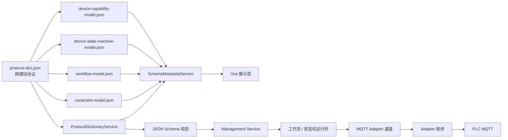
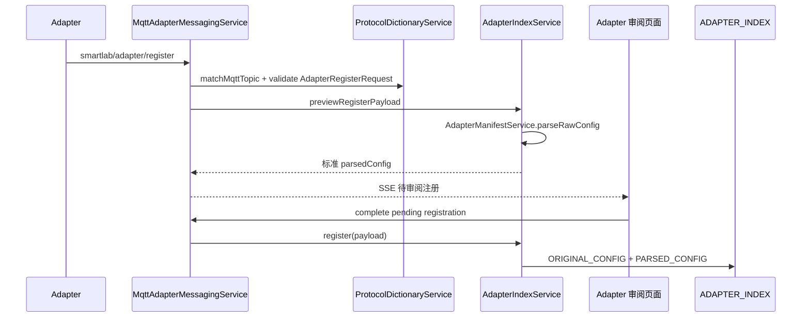
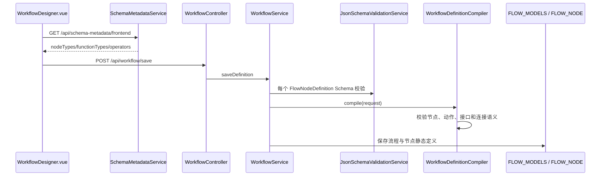
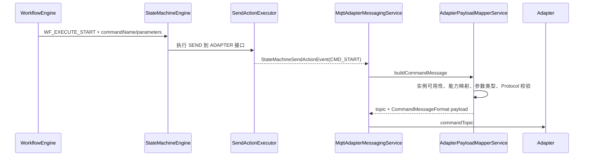

# SmartLab 协议到运行时实现链路

本文档描述当前代码中“规范从哪里定义、由谁加载、由谁校验、最终由谁执行”的完整链路。它记录的是当前实现，不把尚未接线的设计目标描述成已完成功能。

## 1. 分层原则

SmartLab 当前采用三层规范体系：

1. `protocol-dict.json`：跨模块协商的公共协议，包括通用数据类型、比较操作符、系统信号、MQTT Topic 和 MQTT 消息格式。
2. 领域模型 JSON Schema：描述设备能力模型、设备状态机模型、工作流模型和约束模型各自的数据结构。
3. Java/Python 执行代码：实现状态推进、节点调度、动作执行、数据库事务、MQTT 收发和 PLC 寄存器读写等运行语义。

Schema 决定“什么数据合法”，执行器决定“合法数据到达后系统做什么”。系统不会尝试用 JSON Schema 代替工作流引擎、状态机引擎或 MQTT 客户端。



## 2. 规范源及其实现映射

### 2.1 跨模块协议字典

规范源：`Backend/src/main/resources/schemas/protocol-dict.json`

加载器：`com.smartlab.global.protocol.ProtocolDictionaryService`

| Protocol 定义 | 当前用途 | 加载或校验入口 | 最终实现 |
| --- | --- | --- | --- |
| `DataType` | 统一 `INTEGER/DOUBLE/STRING/BOOLEAN/JSON` | `enumValues("DataType")` | Adapter 解析、命令参数校验、遥测值校验、前端类型选择器 |
| `CommunicationProtocol` | 系统与 Adapter 的通信方式，当前仅 `MQTT` | `SchemaMetadataService.protocolMetadata()` | 设备模型 Adapter 契约、前端协议显示、MQTT 实现 |
| `ConstraintOperator` | 跨设备、工作流和约束共享的操作符 | 被三个领域 Schema `$ref`；前端元数据读取 | `WorkflowConditionEvaluator`、约束规则校验、设备内置约束编辑 |
| `StateMachineAction` | 状态机动作，目前仅 `SEND` | 状态机 Schema `$ref` | `StateMachineDictionary.SendActionExecutor` |
| `WorkflowNodeAction` | 工作流节点动作，目前仅 `EMIT_SIGNAL` | 工作流 Schema `$ref`，`WorkflowDefinitionCompiler` 校验 | 设备能力节点向状态机发信号 |
| `SystemViolationAction` | 约束违规动作声明 | 约束 Schema `$ref` | 当前进入约束 Management 数据；完整运行时执行器尚未接线 |
| `SystemSignalFormat` | 系统内部信号的统一外形 | 协议字典定义 | 当前运行时使用同构 `signalName + payload` 对象，但没有逐次调用该 definition 校验 |
| `MqttTopicConvention` | 注册、心跳、命令、遥测、事件 Topic | `resolveMqttTopic()`、`matchMqttTopic()` | `MqttAdapterMessagingService` 和 testAdapter Topic 路由 |
| `AdapterRegisterRequest` | Adapter 注册报文 | `validateDefinition()` | MQTT 注册入口、手动注册预览入口 |
| `CommandMessageFormat` | 系统下发命令报文 | `validateDefinition()` | `AdapterPayloadMapperService.buildCommandMessage()` |
| `CommandAbortMessageFormat` | 系统下发中止报文 | `validateDefinition()` | `AdapterPayloadMapperService.buildAbortMessage()` |
| `TelemetryMessageFormat` | Adapter 上行遥测报文 | `validateDefinition()` | `MqttAdapterMessagingService` → `applyTelemetry()` |
| `EventMessageFormat` | Adapter 上行事件报文 | `validateDefinition()` | `MqttAdapterMessagingService` → `applyAdapterEvent()` |
| `AdapterHeartbeat` | Adapter 心跳报文 | `validateDefinition()` | `AdapterIndexService.heartbeat()` |
| `WorkflowControlSignal` | 工作流到状态机 | 状态机标准接口通过引用加载 | `WorkflowEngine` → `StateMachineEngine` |
| `ManualControlSignal` | 人工控制到状态机 | 状态机标准接口通过引用加载 | `DeviceInstanceController` → `StateMachineEngine` |
| `ConstraintControlSignal` | 约束模块到状态机 | 状态机标准接口通过引用加载 | 接口契约已存在，约束运行时尚未完整接线 |
| `AdapterOutboundSignal` | 状态机到 Adapter | 状态机标准接口通过引用加载 | `CMD_START/CMD_ABORT` → MQTT command Topic |

`ProtocolDictionaryService` 不复制这些枚举。它在运行时读取 JSON 文件并提供：

- `dictionary()`：读取完整协议字典；
- `definition(name)`：读取一个 definition；
- `enumValues(name)`：读取协议枚举；
- `mqttTopicConvention()`：读取 Topic 模板；
- `resolveMqttTopic()`：用 Adapter 和设备点填充 Topic；
- `matchMqttTopic()`：从实际 Topic 识别消息类型并提取变量；
- `validateDefinition()`：使用 Draft-07 JSON Schema 校验具体消息。

原始协议字典可通过 `GET /api/protocol/dictionary` 查看。前端业务页面不直接使用这个原始接口，而使用聚合后的 Schema 元数据接口。

### 2.2 设备能力模型

规范源：`Backend/src/main/resources/schemas/device-capability-model.json`

主要描述：

- 设备属性 `attributes`；
- 设备能力 `capabilities`；
- 能力参数及 `dataType`；
- Adapter 契约 `adapterContract`；
- 端口 `ports`；
- 设备内置约束 `intrinsicConstraints`。

公共数据类型、通信协议和比较操作符通过 `$ref` 指向 `protocol-dict.json`，不会在能力模型中再维护一份枚举。

持久化映射：`DEVICE_MODELS` 表中的 `ATTRIBUTES`、`CAPABILITIES`、`ADAPTER_CONTRACT`、`PORTS`、`INTRINSIC_CONSTRAINT` 等 JSONB 字段。

校验入口：`DeviceModelService.validateModelSchemas()` → `JsonSchemaValidationService.validate(..., "device-capability-model.json")`。

### 2.3 设备状态机模型

规范源：`Backend/src/main/resources/schemas/device-state-machine-model.json`

领域内定义：

- 接口类型：`WORKFLOW/STAT/ADAPTER/CONTROL/CONSTRAINT`；
- 状态空间：`CMD/OP`；
- CMD 执行状态：`IDLE → SENT → RECEIVED → RUNNING → COMPLETED`，以及 `ABORTED/FAILED`；
- 接口、允许信号、CMD 状态空间、OP 状态空间和状态转移规则；
- `x-standardInterfaces`：系统建议的标准接口；
- `x-executionLifecycleMainPath`：执行状态主路径；
- `x-systemTransitions`：系统级基础转移；
- 自动转移允许的状态空间和终态集合。

状态机动作通过 `$ref` 使用 `protocol-dict.json#/definitions/StateMachineAction`。

持久化映射：`DEVICE_MODELS` 表中的 `STATE_MACHINE_INTERFACES`、`CMD_STATE`、`OP_STATE`、`STATE_TRANSITIONS`。

动态状态映射：`DEVICE_TWIN_STATES.CURRENT_CMD_STATE`、`CURRENT_OP_STATE` 和 `CURRENT_ATTR`。

### 2.4 工作流模型

规范源：`Backend/src/main/resources/schemas/workflow-model.json`

节点分为：

- `DEVICE_CAPABILITY_NODE`：调用某个设备模型能力；
- `FUNCTIONAL_NODE`：`START/END/BRANCH/AGGREGATE`；
- `SUB_FLOW_NODE`：进入另一个流程模型。

公共类型、条件操作符和节点动作通过 `$ref` 使用协议字典。工作流自身维护节点类型、功能类型、节点生命周期、接口、端口和连接结构，因为它们属于工作流领域，不属于跨模块通信协议。

持久化分工：

- `FLOW_MODELS`：流程级元数据、节点 ID 引用列表、接口连接、端口连接；
- `FLOW_NODE`：每个节点的静态定义；
- `TASK`：一次任务的总体动态状态、资源映射和任务变量；
- `TASK_STEP`：节点的实际执行过程、父步骤、深度、接口快照、端口快照和变量空间；
- `EXECUTION_LOG`：任务或人工控制产生的设备执行日志。

### 2.5 约束模型

规范源：`Backend/src/main/resources/schemas/constraint-model.json`

它引用协议字典中的 `DataType`、`ConstraintOperator` 和 `SystemViolationAction`。当前代码已经具备约束规则与 `VIOLATION_LOG` 的实体、Mapper、Service 和 Controller，但尚未形成与工作流引擎同等完整度的持续求值与控制执行链。

因此当前准确状态是：约束的模型与 Management 链路存在，约束运行时链路仍是后续工作。

## 3. 统一元数据加载链路

前端不分别解析五个 JSON 文件。后端由 `SchemaMetadataService` 聚合它们：

```text
protocol-dict.json ──> ProtocolDictionaryService
各领域 JSON Schema ──> SchemaMetadataService
                            │
                            └─ GET /api/schema-metadata/frontend
                                         │
                                         ├─ 设备模型编辑器
                                         └─ 工作流设计器
```

`SchemaMetadataService.frontendMetadata()` 返回五个命名空间：

- `protocol`：MQTT Topic、注册格式、通信协议、状态机动作名；
- `stateMachine`：接口类型、CMD 状态、标准接口、执行主路径和系统转移；
- `workflow`：节点类型、功能类型和节点生命周期；
- `constraint`：约束对象类型、操作符、数据类型和违规动作；
- `deviceCapability`：设备能力模型使用的数据类型和操作符。

前端 `deviceModelConstants.js` 的数组初始为空，必须先调用 `ensureProtocolMetadataLoaded()`。工作流设计器同样从 `/api/schema-metadata/frontend` 读取节点功能类型、节点生命周期和操作符；不存在本地协议枚举兜底。

## 4. Adapter 注册链路

### 4.1 配置源

Adapter 对外配置源是 `adapterconfig.ini` 或等价 JSON。系统当前支持 `INI/JSON`，格式不匹配时直接拒绝，不根据内容猜测格式。

示例与规范文件位于：

- `Backend/src/main/resources/samples/adapterSetup.ini`；
- `Backend/src/main/resources/samples/adapterSetup.json`；
- `Backend/src/main/resources/samples/adapter-config.schema.json`。

注意：`adapter-config.schema.json` 当前是格式规范文件，但尚未被注册代码直接加载。实际解析和完整业务校验由 `AdapterManifestService` 实现，包括模板、类别、属性、命令、参数、事件、设备点、映射关系、数据类型及 `internal/sourceField` 约束。

### 4.2 MQTT 注册



具体步骤：

1. Adapter 发布 `AdapterRegisterRequest` 到 `registerTopic`。
2. `MqttAdapterMessagingService` 用协议字典匹配 Topic 并校验消息结构。
3. `AdapterIndexService.previewRegisterPayload()` 调用 `AdapterManifestService` 解析原始 INI/JSON。
4. 解析结果统一为系统内部 `parsedConfig.deviceCategories[]` 结构。
5. 待注册项进入内存审阅队列，并通过 SSE 推送给前端。
6. 用户只能在审阅阶段调整 description 类字段。
7. 确认后保存到 `ADAPTER_INDEX`：
   - `ORIGINAL_CONFIG` 保存原始 TEXT；
   - `PARSED_CONFIG` 保存系统使用的标准 JSONB；
   - 后续业务读取 `PARSED_CONFIG`，不在每次使用时重新解析原始配置。

手动导入走 `POST /api/adapter/index/parse-register` 和 `POST /api/adapter/index/register`，从解析步骤开始与 MQTT 注册共用同一套 Service。

### 4.3 internal 参数边界

`parsedConfig` 保留 Adapter 配置中的：

```json
{
  "name": "index",
  "dataType": "INTEGER",
  "internal": true,
  "sourceField": "index"
}
```

但设备能力模型的 `adapterContract.commands[].commandParameters` 会过滤 internal 参数，前端也不会展示它们。系统只传递业务参数；Adapter 程序根据设备点的固定字段和 `sourceField` 拼装 internal 参数。

## 5. 设备模型创建链路

```text
Adapter PARSED_CONFIG
  └─ AdapterIndexService.buildAdapterContract(adapterName, categoryName)
       └─ AdapterManifestService.buildAdapterContract(...)
            └─ 去除 internal 参数，保留 attributes/commands/cmdEvents/opEvents
                 └─ 设备模型编辑器建立业务能力到 Adapter 命令/属性的映射
                      └─ POST /api/device/model/save
                           └─ DeviceModelService.savePayload
                                ├─ canonicalAdapterContract
                                ├─ enrichStateMachine
                                ├─ device-capability-model 校验
                                ├─ device-state-machine-model 校验
                                └─ DEVICE_MODELS
```

前端模型编辑器先读取聚合 Schema 元数据，再读取 Adapter 类别契约。用户创建的是系统业务模型：

- 业务属性映射到 Adapter 模板属性；
- 业务能力映射到 Adapter 命令；
- 能力参数映射到公开命令参数或固定值；
- cmdEvents 和 opEvents 保留不同事件域；
- 状态机接口、CMD/OP 状态及转移规则由设备状态机 Schema 约束。

`POST /api/device/model/preview` 与 `GET /api/device/model/{id}/bundle` 生成能力模型和状态机模型预览，并分别执行完整 JSON Schema 校验。

## 6. 设备实例化与路由链路

1. 用户通过 `POST /api/device/instance/save` 选择设备模型、Adapter 和设备点。
2. `DeviceInstanceService` 校验设备模型及 Adapter 绑定，保存 `DEVICE_INSTANCES`。
3. 新实例的 `LIFECYCLE_STATUS` 为使用中；注销通过 `POST /api/device/instance/retire/{id}` 完成，不物理删除业务历史。
4. `AdapterPayloadMapperService.refreshAdapterRouteTable()` 只装载使用中的实例。
5. 路由键为 `adapterName + devicePoint`，路由内容包含设备实例、设备模型、属性映射和数据类型。
6. 注销实例不会进入 Adapter 路由表，因此不能接收遥测，也不能被命令链路选用。

实例创建时还会根据设备模型 BOM 创建 `DEVICE_COMPONENTS` 当前组件记录；组件维护属于设备实例管理链路，不参与 Adapter Topic 路由。

## 7. 工作流设计与保存链路



保存时存在两层校验：

1. `JsonSchemaValidationService.validateDefinition(..., "workflow-model.json", "FlowNodeDefinition")` 校验结构；
2. `WorkflowDefinitionCompiler` 校验需要执行代码才能判断的语义，例如节点类型、功能类型、动作名、连接引用和节点动作适用范围。

Schema 枚举由 `SchemaMetadataService.workflowNodeTypes()` 和 `workflowFunctionTypes()` 提供给编译器，编译器没有复制一份节点枚举。

## 8. 任务与工作流运行链路

### 8.1 创建与启动

1. `POST /api/task/save` 调用 `TaskService.create()`，创建 `TASK` 并保存流程模型、资源映射、任务变量和约束快照。
2. `WorkflowTaskResourceService.validate()` 确认每个设备能力节点都绑定了可用设备实例。
3. `POST /api/task/start/{id}` 经过 `WorkflowTaskControlService.start()` 启动任务。
4. `WorkflowEngine.driveWorkflows()` 驱动运行中的任务，并为实际执行节点创建 `TASK_STEP`。

### 8.2 节点执行

| 节点 | 执行实现 |
| --- | --- |
| `START` | 完成当前步骤并按输出接口路由 |
| `END` | 完成当前流程；子流程则返回父步骤，主流程则完成任务 |
| `BRANCH` | `WorkflowConditionEvaluator` 使用结构化条件选择输出接口 |
| `AGGREGATE` | 等待所有实际前序步骤完成后继续，策略当前为 `ALL` |
| `DEVICE_CAPABILITY_NODE` | 解析任务资源映射，向目标设备状态机发送启动信号 |
| `SUB_FLOW_NODE` | 创建带 `PARENT_STEP_ID` 和递增 `STEP_DEPTH` 的子流程步骤 |

`WorkflowRuntimeService` 负责 `TASK/TASK_STEP/EXECUTION_LOG` 的动态写入；`WorkflowEngine` 不直接拼 SQL。

## 9. 工作流节点到设备状态机

设备能力节点执行时：

1. 从 `TASK.RESOURCE_MAP` 解析该 `FLOW_NODE` 对应的设备实例；
2. 再次调用 `requireUsableInstance()`，防止任务创建后实例被注销；
3. 生成唯一 `messageId` 并写入 `TASK_STEP.INTERFACE_IN_SNAPSHOT`；
4. 从节点 `EMIT_SIGNAL` 动作读取 `interfaceType` 和 `signalName`；
5. 调用 `StateMachineEngine.dispatchSignalByType()`；
6. 状态机根据设备模型接口定义找到真正的输入接口名，而不是在工作流引擎中写死接口名称。

START 控制信号必须携带：

```json
{
  "messageId": "...",
  "commandName": "heat",
  "parameters": {},
  "taskId": 1,
  "taskStepId": 10
}
```

ABORT 信号不要求业务参数。

## 10. 状态机执行链路

`StateMachineEngine.dispatchSignal()` 的匹配键是：

```text
实例 + 接口名 + 当前状态空间状态 + 信号名
```

具体过程：

1. 读取 `DEVICE_INSTANCES` 和对应 `DEVICE_MODELS`；
2. 读取或初始化 `DEVICE_TWIN_STATES`；
3. `StateMachineModels.Definition` 把模型 JSON 转换为运行领域对象；
4. `computeNextState()` 在 CMD/OP 各自状态空间中匹配转移；
5. 更新数字孪生当前 CMD/OP 状态；
6. 从注册表查找动作执行器；未知动作立即失败，不静默跳过；
7. `SEND` 由 `StateMachineDictionary.SendActionExecutor` 执行；
8. 输出统一信号，并发布 `StateMachineInterfaceSignalEvent`；
9. CMD 到达 `COMPLETED/FAILED/ABORTED` 后自动回到 CMD 初始状态 `IDLE`。

自动转移使用 `trigger: null`，当前只允许 CMD 状态空间。它用于补齐 Adapter 没有对应事件的中间执行阶段；终态仍需真实事件或控制结果触发。

## 11. 状态机到 Adapter 命令链路



`AdapterPayloadMapperService` 负责：

- 从实例获得 `adapterName/devicePoint`；
- 从设备能力映射得到 Adapter `commandName`；
- 将业务能力参数映射到公开 Adapter 命令参数；
- 校验每个值的数据类型；
- 不拼装 internal 参数；
- 生成并校验 `CommandMessageFormat`；
- 通过协议字典生成 command Topic。

## 12. Adapter 上行遥测与事件链路

### 12.1 遥测

```text
telemetryTopic
  └─ ProtocolDictionaryService.matchMqttTopic
       └─ validate TelemetryMessageFormat
            └─ 校验 Topic 中身份 == Payload 中身份
                 └─ AdapterPayloadMapperService.applyTelemetry
                      ├─ Adapter 原始字段 → 模板属性 → 业务模型属性
                      ├─ 按 DataType 校验全部映射值
                      ├─ 更新 DEVICE_TWIN_STATES.CURRENT_ATTR
                      └─ 写入数据记录服务
```

只有当前路由表中的使用中实例会消费遥测。

### 12.2 事件

```text
eventTopic
  └─ validate EventMessageFormat + 身份一致性
       └─ applyAdapterEvent
            ├─ cmdEvent 必须携带原 command 的 messageId
            └─ StateMachineEngine.dispatchAdapterEvent
                 └─ 匹配 ADAPTER 输入接口和转移规则
                      └─ 输出 CMD_STATE / OP_STATE
```

当状态机通过 STAT 输出接口发出 `CMD_STATE`：

- `WorkflowEngine.handleStateMachineSignal()` 通过 `messageId` 找到运行中的设备步骤；
- `COMPLETED` 完成 `TASK_STEP` 并路由到下一节点；
- `FAILED/ABORTED` 将当前步骤标记失败。

cmdEvents 和 opEvents 均由 Adapter 配置文件定义，不在 `protocol-dict.json` 中维护固定事件名。

## 13. testAdapter 到 PLC 的实现链路

testAdapter 使用两个配置源：

- `adapterconfig.ini`：发送给 SmartLab 的设备模板、属性、命令、事件和设备点契约；
- `setup.ini`：仅供 Adapter 本地运行，保存 Broker、认证、Client ID、QoS、心跳、Topic 和 PLC DeviceSN。

启动入口：`adapter/testAdapter/main.py`

运行组件：

- `config.py`：严格读取两个 INI 文件；
- `runtime.py`：连接同一个 MQTT Broker、订阅系统命令和 PLC 数据、发布注册/心跳/遥测/事件；
- `router.py`：业务命令、internal 参数、PLC 寄存器和生命周期事件路由；
- `plc_protocol.py`：PLC JSON 数组协议编解码。

PLC 上行：

```text
plc/data
  └─ decode_snapshot(payload, DeviceSN)
       └─ 读取最后一条 TagData
            ├─ MW0  → temperature
            ├─ MW20 → coolingEnabled
            ├─ MW21 → automaticMode
            └─ MW22 → manualMode
                 └─ 转成 SmartLab TelemetryMessageFormat
```

PLC 下行：

```json
[
  {
    "DeviceSN": "plc0001",
    "TagData": [
      { "MW20": 1 }
    ]
  }
]
```

该报文由 `encode_register_write()` 生成并发布到 `plc/MQTTCommand`。Topic、Broker 和认证信息均来自 `setup.ini`，修改配置后无需修改 Python 代码。

internal 参数由 `router.py` 根据 `adapterconfig.ini` 的 `sourceField` 和具体 devicePoint 固定字段注入，这正是系统设备模型不保存 internal 参数的原因。

## 14. 数据落点总表

| 运行阶段 | 主表 | 主要内容 |
| --- | --- | --- |
| Adapter 注册 | `ADAPTER_INDEX` | 原始配置、标准 parsedConfig、状态、心跳 |
| 设备业务建模 | `DEVICE_MODELS` | 能力模型、Adapter 契约、状态机模型、BOM |
| 设备实例化 | `DEVICE_INSTANCES` | 模型引用、Adapter/设备点绑定、生命周期 |
| 实例动态状态 | `DEVICE_TWIN_STATES` | 当前属性、CMD 状态、OP 状态 |
| 组件拓扑 | `DEVICE_COMPONENTS` | 当前组件、更换链、规格和备注 |
| 流程定义 | `FLOW_MODELS` | 流程元数据和连接关系 |
| 节点定义 | `FLOW_NODE` | 节点静态能力、接口、端口和动作 |
| 任务实例 | `TASK` | 流程引用、资源映射、任务状态和变量 |
| 节点执行过程 | `TASK_STEP` | 父子层级、状态、接口/端口快照和变量空间 |
| 设备执行日志 | `EXECUTION_LOG` | 任务或人工控制的设备执行记录 |
| 约束违规 | `VIOLATION_LOG` | 违规条件、实际值和变量快照 |

## 15. 规范驱动与代码语义边界

必须从规范读取的内容：

- 数据类型、比较操作符、通信协议；
- MQTT Topic 模板及消息字段；
- Adapter 注册格式；
- 工作流节点类型和功能类型；
- 状态机接口类型、标准接口、允许信号；
- CMD 状态集合和系统转移模板；
- 状态机/工作流允许声明的动作名称。

必须由代码实现的内容：

- INI/JSON 的语法解析；
- 数据库事务与业务聚合；
- 工作流节点调度、分支、聚合和子流程栈；
- 状态机规则匹配、状态更新、自动转移和动作执行；
- 设备可用性与 Adapter 路由；
- MQTT 连接、订阅、发布、重连和身份校验；
- 参数映射、遥测映射和数据类型检查；
- Adapter 的 internal 参数注入；
- PLC MQTT 报文编解码和寄存器业务语义。

## 16. 当前未完全接线的部分

以下内容已经有规范或数据结构，但当前不能描述成完整运行链路：

1. `adapter-config.schema.json` 尚未被 `AdapterManifestService` 直接加载；现阶段 Java 解析器自身是实际注册校验实现。
2. `SystemSignalFormat` 定义了内部信号外形，但状态机每次发送内部信号时尚未调用 `ProtocolDictionaryService.validateDefinition()`。
3. 约束模型、规则 Management 和 `VIOLATION_LOG` 已存在，但持续求值、违规动作执行及约束信号到状态机的完整引擎链尚未完成。
4. 当前通信执行器只有 MQTT；协议字典也仅声明 MQTT，因此不存在声明了 HTTP 但没有执行器的虚假能力。

这些边界不影响当前 Adapter 注册、设备建模、设备实例化、工作流任务、状态机、MQTT 和 testAdapter—PLC 主链的执行。
