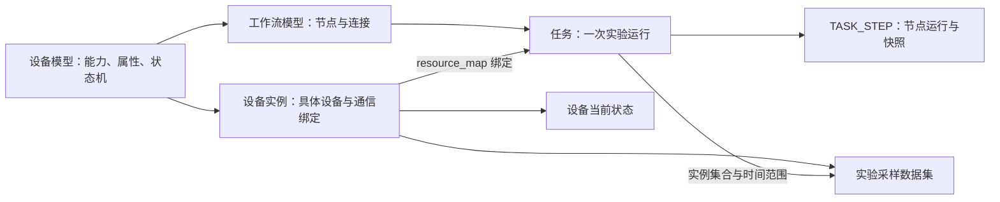
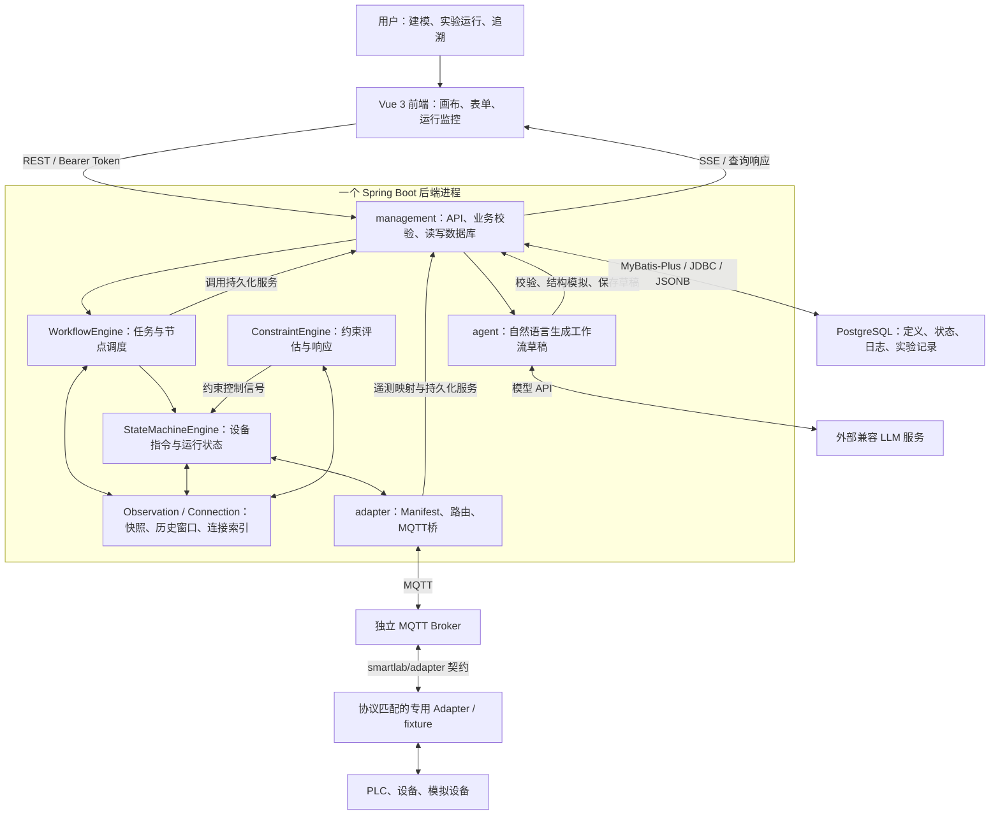
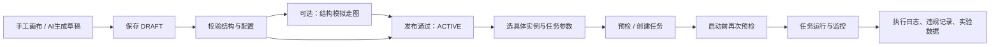
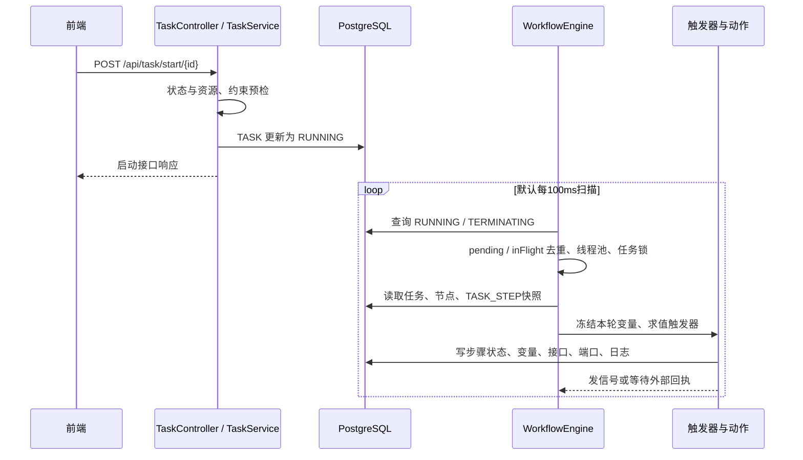
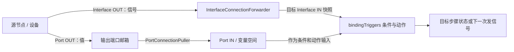
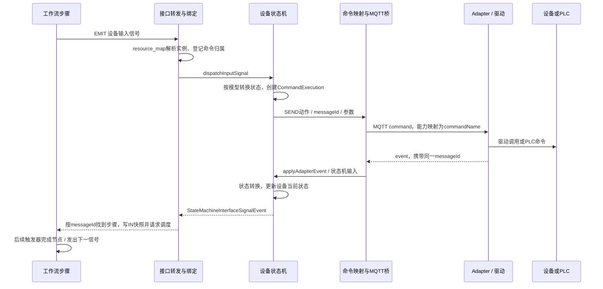
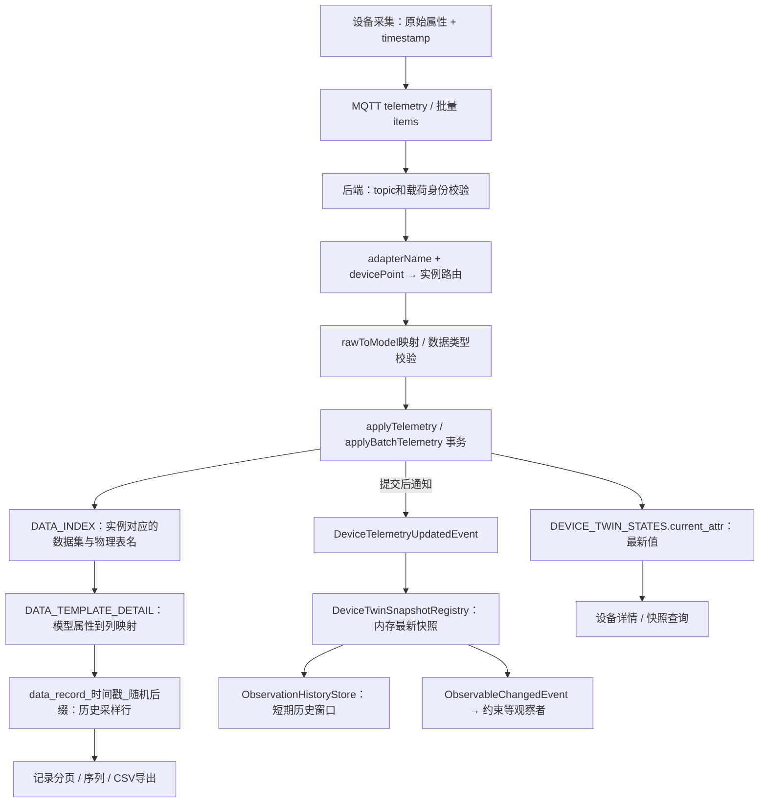
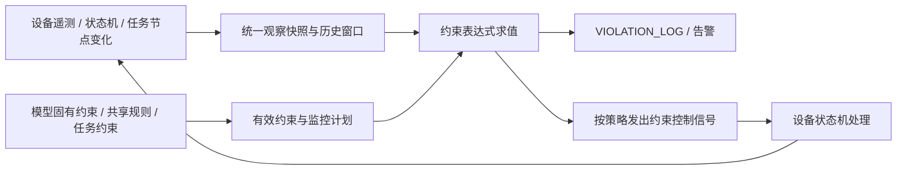

# SmartLab 2.0 系统阅读手册

分析日期：2026-09-07。分析对象：`D:/SmartLab2.0` 当前工作区，基线提交 `2abf835`（2026-09-06），包含当前未提交代码。本文依据入口、调用链、实体映射和执行实现，设计文档只用于理解背景。未启动设备、未连接实际数据库、未执行实验；文中的“已实现”表示源码存在对应路径，不代表已完成现场联调。

## 1. 先认识系统解决什么问题

SmartLab 是一个**把实验方法建模、把设备能力抽象出来、将一次实验绑定到具体设备并自动执行、持续采集数据与检查约束**的系统。

它有两种时间尺度：

- **设计时**：定义设备能做什么、流程如何协作、参数和信号是什么、哪些约束需要满足。
- **运行时**：选择具体设备，创建一次任务，执行设备命令，接收回报，推进流程，保存过程与实验数据。

因此，理解它最先要分清四个对象：

- **设备模型**：一种设备的能力说明书，包括属性、能力参数、接口、状态机、固有约束、数据模板。它本身不是一台机器。
- **设备实例**：一台可被选择和绑定的设备，有实例 ID、所属模型、Adapter 名称和点位、运行状态、资产信息。代码还区分 PHYSICAL、VIRTUAL、TEMPORARY。
- **工作流模型**：可复用的实验定义，包括节点、信号接口连线和数据端口连线。设备节点选择设备模型与能力，并不在设计时固定某一台物理设备。
- **任务**：对某个可执行工作流的一次运行，带设备绑定、任务变量、任务约束、执行种类、开始结束时间和节点运行记录。

上图表示概念引用，不能据此假定数据库已建立全部外键。对应实体见 [设备模型](<D:/SmartLab2.0/Backend/src/main/java/com/smartlab/management/entity/resource/device/DeviceModels.java:15>)、[设备实例](<D:/SmartLab2.0/Backend/src/main/java/com/smartlab/management/entity/resource/device/DeviceInstances.java:14>)、[流程模型](<D:/SmartLab2.0/Backend/src/main/java/com/smartlab/management/entity/workflow/FlowModels.java:14>)、[任务](<D:/SmartLab2.0/Backend/src/main/java/com/smartlab/management/entity/workflow/Task.java:14>)。

## 2. 系统部署与模块架构

前端是 Vue 3 应用，后端是一个 Java 21 / Spring Boot 3.3.5 应用。`management`、`engine`、`adapter`、`global`、`agent` 是同一个后端进程中的逻辑模块，不能把它们理解为五个独立微服务。

后端经 MyBatis-Plus/JDBC 访问 PostgreSQL，经 Paho MQTT 客户端与独立 Broker 通信。设备侧的适配程序是另外的进程，承担协议翻译和物理操作。前端主要使用 REST、SSE 和定时查询；不能仅因依赖中有 WebSocket 就把页面主链路画成 WebSocket。

默认后端端口为 8080，前端开发代理把 `/api` 转到该端口；配置中的 MQTT 默认地址是本机 1883。它们是仓库配置值，实际部署可以覆盖。依赖与入口见 [后端依赖](<D:/SmartLab2.0/Backend/pom.xml:5>)、[应用启动](<D:/SmartLab2.0/Backend/src/main/java/com/smartlab/SmartLabApplication.java:9>)、[前端依赖](<D:/SmartLab2.0/Frontend/package.json:11>)、[开发代理](<D:/SmartLab2.0/Frontend/vite.config.js:8>)。

### 目录和实际职责

- `Frontend/src/views`：用户看到的设备、流程、任务、数据、约束、用户页面。
- `Frontend/src/services`：工作流和任务 API 契约；其他业务也有页面所属的 API 文件。
- `Frontend/src/stores`：登录权限、设备控制台、AI 会话等浏览器状态。
- `Backend/.../management/controller`：HTTP 入口；`service/db` 负责业务约束与数据库操作，`mapper/entity` 负责表映射。
- `Backend/.../engine/workflow`：编译、触发器求值、动作执行、任务调度。
- `Backend/.../engine/statemachine`：每台设备的指令状态、操作状态、命令关联与状态转换。
- `Backend/.../engine/constraint`、`observation`、`connection`：规则求值、可观察快照、历史窗口、信号与数据连接。
- `Backend/.../adapter`：后端的 MQTT 桥与 Adapter 清单服务；这里不是硬件驱动本体。
- `Backend/.../global`：枚举契约、协议字典、Schema 元数据、安全、事件和线程池。
- `Backend/.../agent`：调用大模型和业务工具生成草稿。
- 仓库根目录 `adapter/`：独立设备侧程序，存在多个代际，不能把它们默认视为同一套已接通运行时。
- `fixture/`：设备与 Adapter 联调夹具，部分虚拟设备链路也在此实现。

## 3. 用户业务路径

以下是业务参与方式，不是数据库中固定的角色名称。

### 路径 A：管理员或设备负责人准备实验资源

1. **登录**。`/api/user/login` 返回 Token、用户、菜单和权限。浏览器保存登录态；路由根据后端返回的菜单决定可访问页面，按钮再检查对象与动作权限。
2. **准备设备模型**。定义属性、能力及参数、Adapter 契约、数据端口、状态机、固有约束、组件 BOM、默认数据模板。模型保存会做完整校验，并维护默认数据模板。
3. **接入 Adapter**。设备侧上报注册清单；后端先将其放入内存中的待注册列表，完成注册才写入 `ADAPTER_INDEX`。心跳与遥测订阅依据注册和实例绑定建立。
4. **创建设备实例并绑定点位**。选择设备模型，填写实例资产信息，绑定 `adapterName + devicePoint`。后端生成或检查属性/命令映射，创建当前状态、默认数据集和组件槽位。
5. **检查设备就绪**。在实例详情查看在线状态、属性、指令状态、控制台、结构、数据和约束；有控制权限时可单独调试设备。

实例创建后，设备模型不能直接换成另一模型；注销与删除也不是同一个概念。注销将设备退出可用资源集合，保留追溯所需的信息。参见 [模型保存](<D:/SmartLab2.0/Backend/src/main/java/com/smartlab/management/service/db/resource/device/DeviceModelService.java:232>)、[实例保存](<D:/SmartLab2.0/Backend/src/main/java/com/smartlab/management/service/db/resource/device/DeviceInstanceService.java:266>)、[默认数据集](<D:/SmartLab2.0/Backend/src/main/java/com/smartlab/management/service/db/resource/data/DataIndexService.java:175>)。

### 路径 B：实验设计者形成可执行工作流

工作流节点分为三种：`DEV_NODE` 设备节点、`FUNC_NODE` 功能节点、`SUBFLOW_NODE` 子流程节点。功能节点进一步有 START、END、BRANCH、AGGREGATE。画布中除了连接节点，还要配置生命周期、接口信号与触发条件、动作、变量和数据端口。

`DRAFT` 是可继续修改的定义；只有 `ACTIVE` 流程和全部递归引用的子流程都通过可执行性检查，才能进入正常任务创建和启动。已 ACTIVE 的版本再保存修改，会建立后继版本和 `predecessor_id`，以免原有运行引用被直接覆盖。版本逻辑见 [WorkflowService](<D:/SmartLab2.0/Backend/src/main/java/com/smartlab/management/service/db/workflow/WorkflowService.java:79>)、[保存与发布](<D:/SmartLab2.0/Backend/src/main/java/com/smartlab/management/service/db/workflow/WorkflowService.java:142>)。

### 路径 C：实验操作者运行一次任务

选择已发布流程 → 选择执行种类 → 为各设备需求绑定实例 → 填任务变量与约束 → 预检 → 保存任务 → 启动 → 监视步骤树、运行图、接口/端口快照、变量、日志和约束事件 → 完成后查数据。

设计模型中的 `deviceModelId` 回答“需要什么类型”；任务中的 `resource_map` 回答“这次用哪台实例”。这是流程复用与设备执行之间最关键的一次绑定。

运行监控不是单一的数据源：SSE 推送任务、步骤和日志变化，页面还通过查询接口获取执行视图与快照。设备控制台有独立 SSE，实例详情的当前状态还会按秒查询。首页的 MQTT 状态采用轮询，不能把首页所有数字都理解为持续实时更新。参见 [路由](<D:/SmartLab2.0/Frontend/src/router/index.js:5>)、[登录态](<D:/SmartLab2.0/Frontend/src/stores/authStore.ts:84>)、[任务事件流](<D:/SmartLab2.0/Backend/src/main/java/com/smartlab/management/sse/TaskExecutionSseHub.java:34>)。

## 4. 从“点击启动”深入到运行机制

### 4.1 HTTP 请求与执行循环分离

启动调用链是 `TaskController → WorkflowTaskControlService → TaskService.start`。接口把任务置为 RUNNING 后，`WorkflowEngine.driveWorkflows` 才通过数据库扫描接手。默认 100ms 是调度检查间隔，不是设备完成命令的时延保证。

引擎用 `pendingTaskIds` / `inFlightTaskIds` 合并同一任务的重复调度请求，再交给 `workflowEngineExecutor`。同一任务的调度与设备回执处理共用任务锁；锁和调度集合属于当前 JVM 内存。参见 [启动接口](<D:/SmartLab2.0/Backend/src/main/java/com/smartlab/management/controller/workflow/TaskController.java:102>)、[调度器](<D:/SmartLab2.0/Backend/src/main/java/com/smartlab/engine/workflow/WorkflowEngine.java:113>)、[线程池](<D:/SmartLab2.0/Backend/src/main/java/com/smartlab/global/config/TaskExecutionConfig.java:33>)。

### 4.2 模型是 DAG，运行靠信号与触发器

编译器对 `NODE_TO_NODE` 控制连接做图结构检查，包括 START/END 入出边要求和拓扑无环检查。因此这一部分模型是 DAG。

但执行不是简单地按拓扑序逐行运行。实际核心是：

1. 为进入执行范围的节点创建 `TASK_STEP`，初始化接口 IN/OUT、端口 IN/OUT、局部变量。
2. 每轮读取并冻结变量快照，更新输出端口邮箱，遍历接口上的 `bindingTriggers`。
3. 对每个触发器计算条件。仅在条件由假变真时运行绑定动作；触发状态也保存，避免条件保持为真时每轮重复执行。
4. `UPDATE` 更新受支持的状态或变量目标；`EMIT` 从指定接口发出信号。
5. 发出的信号沿接口连接送往其他节点或设备，创建/更新目标步骤的输入快照，引发后续调度。
6. 子流程仍在同一个任务下以 `parent_step_id` 与 `step_depth` 形成步骤树。子流程 END 向父步骤输入 `SUBFLOW_COMPLETED`；根 END 成功进入任务完成路径。

这解释了为什么一个“看起来连好了”的图仍可能停住：结构连通只保证有路径；触发器条件、接口信号名称、变量来源、设备状态和聚合条件也必须满足。

参见 [图编译](<D:/SmartLab2.0/Backend/src/main/java/com/smartlab/engine/workflow/WorkflowDefinitionCompiler.java:470>)、[触发器循环](<D:/SmartLab2.0/Backend/src/main/java/com/smartlab/engine/workflow/WorkflowEngine.java:276>)、[步骤初始化](<D:/SmartLab2.0/Backend/src/main/java/com/smartlab/management/service/db/workflow/WorkflowRuntimeService.java:115>)、[子流程完成](<D:/SmartLab2.0/Backend/src/main/java/com/smartlab/engine/workflow/WorkflowEngine.java:250>)。

### 4.3 控制流与数据流是两套连接

**Interface** 是控制信号接口：传递“开始、完成、失败、条件满足”等信号，可带映射载荷。连接有节点到节点、节点到设备、设备到节点等方向。

**Port** 是数据接口：保存输出值，通过端口连接把源值拉取到目标的输入快照和变量。它传值，不应被等同于自动启动下一节点的控制边。

**变量** 是节点求值与动作使用的工作空间。任务变量提供初始上下文，节点可定义局部变量，输入映射和表达式继续更新它。接口快照、端口快照、变量空间都在 `TASK_STEP` 中有各自的 JSONB 字段。

源码入口是 [信号转发](<D:/SmartLab2.0/Backend/src/main/java/com/smartlab/engine/connection/InterfaceConnectionForwarder.java:125>)、[数据端口](<D:/SmartLab2.0/Backend/src/main/java/com/smartlab/engine/connection/PortConnectionPuller.java:1>)。

## 5. 一个设备步骤如何真正执行

下面用“调用反应设备的一项能力，参数中包含目标温度”说明机制；设备名称、能力名和参数值仅是解释性例子，是否可用以实际模型及驱动为准。

### 5.1 三个 ID 分别解决不同问题

- `flow_node_id / node_id_ref`：定位流程定义里的节点。`node_id_ref` 是流程内引用，不宜当全系统唯一节点 ID。
- `task_id + task_step_id`：定位这次实验中的这个运行步骤，子流程同样需要步骤上下文。
- `messageId`：关联一次设备命令及它的事件回报。正式 MQTT 载荷里的相关键是 `messageId`，不能画成另外发明的 `requestId` 或 `commandId`。

同一设备的业务名称、数据库实例 ID、Adapter 名称、设备点位也不是同一个标识；后端通过绑定和路由将它们接起来。

### 5.2 状态机为什么单独存在

工作流负责实验步骤之间的协作，设备状态机负责“这台设备现在允许接收什么信号、当前命令到了什么阶段、操作状态如何转换”。模型把能力与输入接口、状态转换和动作连在一起。

设备 CMD 状态和 OP 状态分开保存：`current_cmd_state` 表示指令生命周期，`current_op_state` 用 JSON 表示运行状态区域。状态机将厂商/Adapter 事件映射为模型定义中的状态与输出信号，工作流无需直接理解 PLC 寄存器。

关键源码：[工作流发射](<D:/SmartLab2.0/Backend/src/main/java/com/smartlab/engine/workflow/WorkflowEngine.java:370>) → [转发到设备](<D:/SmartLab2.0/Backend/src/main/java/com/smartlab/engine/connection/InterfaceConnectionForwarder.java:157>) → [StateMachineEngine](<D:/SmartLab2.0/Backend/src/main/java/com/smartlab/engine/statemachine/StateMachineEngine.java:394>) → [命令载荷映射](<D:/SmartLab2.0/Backend/src/main/java/com/smartlab/management/service/protocol/AdapterPayloadMapperService.java:121>)。

### 5.3 MQTT 主协议与设备侧边界

主协议定义在 [MqttTopic](<D:/SmartLab2.0/Backend/src/main/java/com/smartlab/global/contract/MqttTopic.java:4>)：

- 注册：`smartlab/adapter/register`。
- 心跳：`smartlab/adapter/{adapterName}/heartbeat`。
- 命令：`smartlab/adapter/{adapterName}/{devicePoint}/command`。
- 遥测：同一前缀下的 `/telemetry`。
- 执行事件：同一前缀下的 `/event`。
- 虚拟租约：另有 `leaserequest / leaseresult`。

没有必要额外画一个源码中不存在的 ACK Broker 或 ACK/result 独立主题；命令接收、运行、完成、失败等事件通过 event 主题表达。

`adapter/testAdapter` 有与该契约对接的 PLC 路径：一侧连接 SmartLab MQTT，另一侧连接 PLC MQTT，把命令转换为寄存器目标，并通过 PLC 状态反馈确认完成，另有超时处理。完成判断不能统一理解成“消息发布成功就代表设备完成”。参见 [PLC Adapter入口](<D:/SmartLab2.0/adapter/testAdapter/main.py:25>)、[寄存器执行与回报](<D:/SmartLab2.0/adapter/testAdapter/core.py:134>)。

`adapter/edge-agent-runtime` 是通用可扩展 Python 运行时，具备 HTTP/TCP/MQTT/process/modbus/serial/custom/simulated 等连接器，但它默认示例及网关管理面使用 `smartlab/v1/.../gateway/...` 等契约，当前后端主桥未发现对应网关管理订阅。因此，它的存在不等于已被当前后端完整管理；接入需要核对 topic 和 payload 两者。参见 [通用驱动分派](<D:/SmartLab2.0/adapter/edge-agent-runtime/runtime.py:685>)、[网关主题](<D:/SmartLab2.0/adapter/edge-agent-runtime/runtime.py:1005>)、[后端消息分派](<D:/SmartLab2.0/Backend/src/main/java/com/smartlab/adapter/MqttAdapterMessagingService.java:403>)。

## 6. 数据从设备到数据库的完整链路

### 6.1 一个采样值有三次命名映射

设备侧可能上报原始属性键 A；Adapter 绑定把 A 转成设备模型属性 B；数据模板再用 `device_attr_key = B` 找到物理表的 `column_name = C`。

因此“原始遥测字段名、模型属性名、数据库列名”允许不同，不能只按字符串相同来推测数据落点。

单条遥测处理在一个 Spring 事务中更新设备属性并追加数据记录；如果实例没有数据集，会拒绝产生不可追溯的遥测状态。`DeviceTwinSnapshotRegistry` 在事务提交后接收遥测事件，更新内存快照与历史窗口，再发布属性变化事件。批量遥测保存每条采样记录，但当前状态和观察通知使用最后一条映射值；不要将其理解为“每一条批量历史样本都逐一触发一次实时约束评估”。参见 [遥测事务](<D:/SmartLab2.0/Backend/src/main/java/com/smartlab/management/service/protocol/AdapterPayloadMapperService.java:248>)、[批量遥测](<D:/SmartLab2.0/Backend/src/main/java/com/smartlab/management/service/protocol/AdapterPayloadMapperService.java:315>)、[提交后更新快照](<D:/SmartLab2.0/Backend/src/main/java/com/smartlab/engine/observation/device/DeviceTwinSnapshotRegistry.java:96>)。

### 6.2 实验数据是动态物理表

固定的 `DATA_INDEX` 保存数据集索引，而实际行保存在每个数据集创建时生成的物理表中。表名代码形式为 `data_record_<毫秒时间戳>_<随机后缀>`。

创建数据集时：检查实例与模板属于同一模型 → 插入 `DATA_INDEX` → 根据模板字段建表 → 建采集时间和 data_index_id 索引。实例创建会根据所属模型唯一的默认数据模板创建默认数据集。

动态表基本列是 `id`、`data_index_id`、模板定义的业务列、`create_time`、`ingest_time`。其中：

- `create_time`：Adapter 采集时间；批量数据可各带自己的采集时间。
- `ingest_time`：数据库接收写入时间，默认 `now()`。

该差异可解释“设备何时采到”和“服务器何时存下”之间的延迟。不能把两者混为一条时间线。参见 [建数据集](<D:/SmartLab2.0/Backend/src/main/java/com/smartlab/management/service/db/resource/data/DataIndexService.java:124>)、[动态建表](<D:/SmartLab2.0/Backend/src/main/java/com/smartlab/management/service/db/resource/data/DataIndexService.java:252>)、[写采样行](<D:/SmartLab2.0/Backend/src/main/java/com/smartlab/management/service/db/resource/data/DataRecordService.java:333>)。

### 6.3 “这个任务的数据”如何找到

生产任务的数据查询先根据 `TASK.resource_map` 找到绑定设备实例，再列出设备的数据集；传入 `taskId` 时，记录服务以 `TASK.start_time / end_time` 过滤采样时间。正在运行的任务没有结束时间，则从开始时间往后查询。

**当前生产采样表没有通过每行 `task_id` 直接归属任务，主要是“设备数据集 + 任务时间窗口”的关联。** 因此同设备重叠使用、设备采集时钟偏移、边界时刻样本都需要按该实现解释。仿真任务则有虚拟租约对应的归档数据集指针，不能与生产任务共用一套推断。

参见 [任务数据资产](<D:/SmartLab2.0/Backend/src/main/java/com/smartlab/management/service/db/workflow/TaskDataAssetService.java:43>)、[时间窗口过滤](<D:/SmartLab2.0/Backend/src/main/java/com/smartlab/management/service/db/resource/data/DataRecordService.java:371>)。

## 7. 持久化对象与内存对象

### 7.1 PostgreSQL 中的主要落点

- **资源定义**：`DEVICE_CATEGORY`、`DEVICE_MODELS`、`DEVICE_INSTANCES`、`DEVICE_COMPONENTS`、`RESOURCE_STRUCTURE`；场景布局使用 `SCENE_MAIN`、`SCENE_DETAIL`。
- **设备接入**：`ADAPTER_INDEX` 保存已注册 Adapter 信息；`VIRTUAL_LEASE` 保存虚拟租约关系和状态。
- **流程定义**：`FLOW_MODELS` 保存版本、状态、节点引用与连接；`FLOW_NODE` 保存节点类型、能力、变量、生命周期、接口、端口、动作。
- **任务主记录**：`TASK` 保存工作流版本引用、状态、资源映射、变量、任务约束、执行种类、时间。
- **节点运行记录**：`TASK_STEP` 保存父子步骤关系、深度、生命周期、接口/端口 IN/OUT 快照、变量空间和耗时。它是了解流程实际走到了哪里的核心表。
- **设备最新状态**：`DEVICE_TWIN_STATES` 保存当前属性、指令状态、操作状态、在线状态和更新时间。它是最新状态投影，不能代替完整历史。
- **实验数据**：`DATA_TEMPLATE_MAIN / DETAIL`、`PROPERTY_TYPE` 定义字段；`DATA_INDEX` 指向动态 `data_record_*` 表；采样行在动态表里。
- **过程与异常**：`EXECUTION_LOG` 保存 TASK/MANUAL/CONSTRAINT/SYSTEM/ADAPTER 来源的执行日志；`CONSTRAINT_RULE` 保存规则；`VIOLATION_LOG` 保存违规对象、表达式、实际值、变量快照和采取的动作。
- **用户权限**：`USER_INFO`、`PERMISSION_INFO` 保存用户及权限体系数据；菜单由服务端目录和权限结果组成。

表名以实体 `@TableName` 为准，例如当前是 `TASK_STEP` 和 `VIOLATION_LOG` 单数形式；少数代码注释里的复数名字不是实际映射。JSON 类字段通过 [PostgresJsonbTypeHandler](<D:/SmartLab2.0/Backend/src/main/java/com/smartlab/management/mapper/common/PostgresJsonbTypeHandler.java:21>) 写为 PostgreSQL JSONB。

### 7.2 JVM 内存中的运行工作集

编译定义缓存、调度去重集合、任务锁、设备命令执行上下文、接口活边与命令归属、观察快照与历史窗口、SSE 订阅者、待确认 Adapter 注册清单等存在于后端内存。

这里尤其要区分：**数据库里有快照，不等于所有执行上下文都持久化了。** `ObservationHistoryStore` 默认每个观察键最多保留 4096 个样本、最多 1800 秒；它供表达式/约束查询近期变化，不是长期实验数据仓库。设备快照从数据库恢复时被标为 `STALE / RECOVERED`，收到新遥测后才成为实时有效来源。

参见 [观察历史](<D:/SmartLab2.0/Backend/src/main/java/com/smartlab/engine/observation/ObservationHistoryStore.java:22>)、[快照恢复](<D:/SmartLab2.0/Backend/src/main/java/com/smartlab/engine/observation/device/DeviceTwinSnapshotRegistry.java:65>)、[连接索引](<D:/SmartLab2.0/Backend/src/main/java/com/smartlab/engine/connection/InterfaceConnectionIndex.java:10>)。

### 7.3 浏览器与设备侧文件

浏览器 localStorage 保存登录信息、设备控制台的近期展示记录、按用户区分的 AI 会话；它们不能被当作服务端统一审计库。

设备侧按运行时使用 INI/JSON 配置、驱动或脚本文件；fixture 的虚拟租约也有本地 JSON 落点。对于断线消息，必须看具体 Adapter：专用 PLC Adapter 有内存命令事件补发队列，普通遥测/心跳断线则不会获得同等保存保证，且进程重启会失去这类内存队列。

## 8. 约束如何介入运行

系统包含设备模型固有约束、实例/任务层面的约束配置，以及管理域中的共享规则。约束不是页面上的提示文字；它连接到运行快照和设备控制信号。

可以按三个位置理解：

1. **保存/发布时**：检查规则、变量引用和模型结构能否被理解。
2. **任务预检时**：检查本次绑定资源和当前可观察状态是否允许开始，并把问题反馈给操作者。
3. **运行过程中**：根据快照变化和检查计划重新求值，记录违规事实，并依据规则执行相应约束动作。

执行引擎与约束引擎通过 Observation 体系共享设备属性、设备状态机状态、任务/步骤生命周期等观察对象。违规记录有规则/任务/步骤/设备关联、表达式、实际值和变量快照，供事后追溯。实时观察依赖数据的新鲜度和历史窗口，因此数据库中“最后保存的值”与“现在可用于判断的实时值”也要分开看。

具体规则组合与动作以 [有效约束编译](<D:/SmartLab2.0/Backend/src/main/java/com/smartlab/engine/constraint/EffectiveConstraintModelCompiler.java:1>)、[约束引擎](<D:/SmartLab2.0/Backend/src/main/java/com/smartlab/engine/constraint/ConstraintEngine.java:1>)、[设备固有约束监视](<D:/SmartLab2.0/Backend/src/main/java/com/smartlab/engine/statemachine/IntrinsicConstraintMonitor.java:1>) 为入口阅读。

## 9. AI、结构模拟、任务仿真分别做什么

### 9.1 AI 是草稿生成入口

用户自然语言 → `/api/agent/workflow/generate/stream` → `AgentLoop` 调用 LLM → 查询设备/流程目录及具体模型 → 生成文档 → 调用校验/模拟/保存工具 → 返回草稿 ID 与生成过程。

这些工具复用现有业务服务，AI 成功结果仍是工作流 DRAFT，后续发布、资源绑定和任务执行继续走正常链路。AI 对话历史主要在浏览器保存；服务端一次生成会话的消息和工具日志在内存中组织。

一个容易误读的细节：提示词和工具描述建议校验后做模拟，但当前 `saveBlockReason()` 的硬门禁是成功获取设备目录、流程目录并通过校验，没有把 `lastSimulateWalkable` 纳入保存阻断条件。因此不能声称“每份 AI 草稿都已自动通过仿真”。参见 [AgentLoop](<D:/SmartLab2.0/Backend/src/main/java/com/smartlab/agent/loop/AgentLoop.java:61>)、[保存门禁](<D:/SmartLab2.0/Backend/src/main/java/com/smartlab/agent/loop/AgentLoop.java:478>)、[SSE生成接口](<D:/SmartLab2.0/Backend/src/main/java/com/smartlab/agent/api/WorkflowAgentController.java:41>)。

### 9.2 设计器“模拟执行”是结构走图

`WorkflowSimulationService → WorkflowStructureWalker` 不启动正式 WorkflowEngine，也不创建 TASK。它沿 `NODE_TO_NODE` 连接走图、不求值实际分支条件，设备节点经过真实设备状态机和进程内 Adapter 模拟器，返回当次路径及问题报告。

它并非整个过程都无数据库写入：会创建 TEMPORARY 设备实例及 Twin 状态，结束时尝试清理；TEMPORARY 不创建默认采样数据集。服务报告不会作为正式任务记录保存，取历史任务报告会返回“流程模拟不创建任务”。这一边界以实际服务为准，而不是只看工具描述中的“不写库”。参见 [模拟服务](<D:/SmartLab2.0/Backend/src/main/java/com/smartlab/management/service/db/workflow/WorkflowSimulationService.java:45>)、[结构走图](<D:/SmartLab2.0/Backend/src/main/java/com/smartlab/management/service/db/workflow/WorkflowStructureWalker.java:29>)、[临时实例](<D:/SmartLab2.0/Backend/src/main/java/com/smartlab/management/service/db/resource/device/DeviceInstanceService.java:660>)。

### 9.3 SIMULATION 任务是另一条运行模式

任务级仿真具有正式 TASK、TASK_STEP、执行日志与实验数据链路。它使用虚拟租约，将所选物理实例需求映射到虚拟实例/虚拟点位，运行仍经过任务调度与设备命令回报。结束时按租约机制释放虚拟资源，同时通过归档数据集关联保留任务数据入口。

结构走图回答“模型的连接和设备状态机路径是否能走通”；仿真任务回答“在虚拟设备环境下，这次绑定后的任务如何运行”；真实生产实验还依赖实际驱动、硬件行为、时钟和通信条件。三者证据范围不同。

## 10. 阅读当前系统时必须保留的边界

1. **静态代码分析与现场事实分开**。本文没有核验线上服务版本、实际表 DDL、数据量、硬件连接或延迟。
2. **逻辑分层与部署进程分开**。后端当前是同进程模块架构；单 JVM 的锁和缓存不能直接推导为分布式互斥和多副本一致性。
3. **可扫描继续处理与完整断点恢复分开**。持久化 RUNNING/TASK_STEP 使调度器能在启动后发现任务，但在途命令、连接归属和观察历史还包含内存状态，不能据此承诺任意断点无损续跑。
4. **数据库事务与外部设备动作分开**。SQL 回滚不会自动撤销已通过 MQTT 发给设备的命令；当前链路不能描述为跨数据库和硬件的原子事务。
5. **采样归属与执行日志关联分开**。执行日志显式带 task_id/task_step_id，生产采样数据主要按设备和任务时间窗关联。
6. **当前快照与事件历史分开**。Twin 保存最新状态，TASK_STEP 保存执行快照，EXECUTION_LOG/VIOLATION_LOG 保存过程事实，data_record 表保存采样历史，各自回答不同问题。
7. **权限菜单与后端鉴权分开**。前端隐藏页面/按钮；后端有 JWT 总体认证及部分域的显式动作权限检查。不要仅凭前端菜单推断全部接口已覆盖同一粒度的权限。
8. **代码资产与接通链路分开**。通用 edge runtime、专用 PLC Adapter、C++ 工程、camera 和 fixture 必须按具体协议逐一对接核验。

## 11. 推荐的源码阅读顺序

1. 先读 [Task / TaskStep](<D:/SmartLab2.0/Backend/src/main/java/com/smartlab/management/entity/workflow/TaskStep.java:13>) 与设备模型/实例实体，建立“定义—实例—运行—数据”对象关系。
2. 读 [前端路由](<D:/SmartLab2.0/Frontend/src/router/index.js:5>) 和任务页面，了解用户从哪里操作。
3. 读 [WorkflowService](<D:/SmartLab2.0/Backend/src/main/java/com/smartlab/management/service/db/workflow/WorkflowService.java:142>) 与 `WorkflowDefinitionCompiler`，了解模型如何落库、校验和发布。
4. 读 [TaskService.start](<D:/SmartLab2.0/Backend/src/main/java/com/smartlab/management/service/db/workflow/TaskService.java:165>) 与 [WorkflowEngine](<D:/SmartLab2.0/Backend/src/main/java/com/smartlab/engine/workflow/WorkflowEngine.java:113>)，理解任务如何被调度。
5. 读 [InterfaceConnectionForwarder](<D:/SmartLab2.0/Backend/src/main/java/com/smartlab/engine/connection/InterfaceConnectionForwarder.java:157>) 与 [StateMachineEngine](<D:/SmartLab2.0/Backend/src/main/java/com/smartlab/engine/statemachine/StateMachineEngine.java:394>)，追踪一条设备命令。
6. 读 [AdapterPayloadMapperService](<D:/SmartLab2.0/Backend/src/main/java/com/smartlab/management/service/protocol/AdapterPayloadMapperService.java:248>) 与 [DataRecordService](<D:/SmartLab2.0/Backend/src/main/java/com/smartlab/management/service/db/resource/data/DataRecordService.java:333>)，追踪一条采样数据。
7. 再读 Observation、Constraint、VirtualLease、Agent，理解跨模块能力如何叠加在这条主线上。

阅读时始终带着五个定位键：**flow_model_id、node_id_ref、task_id、task_step_id、device_instance_id**；追踪命令时再加 **messageId**，追踪采样时再加 **data_index_id 和采集时间**。
