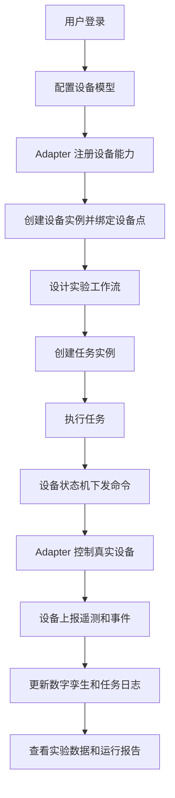
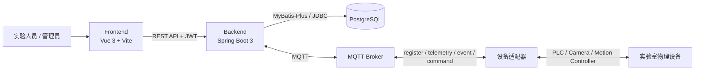
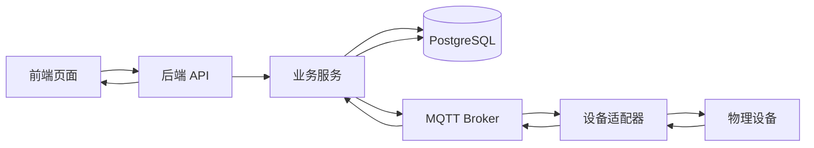
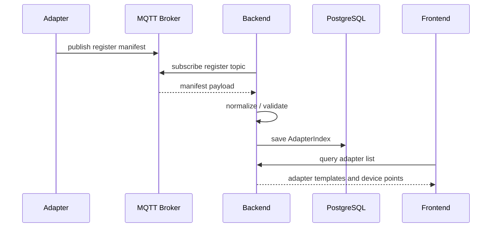
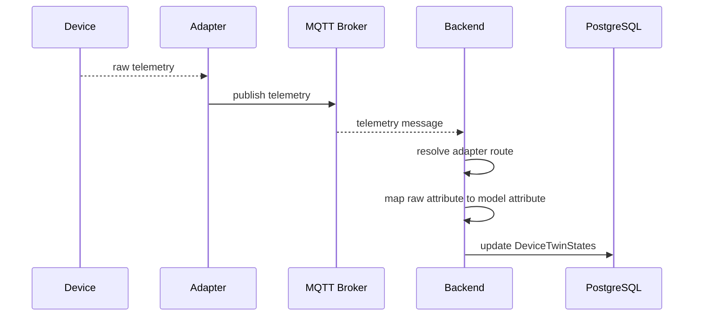
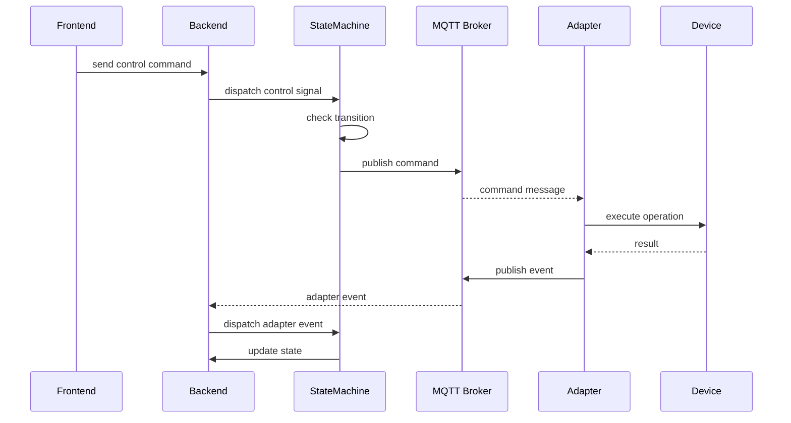
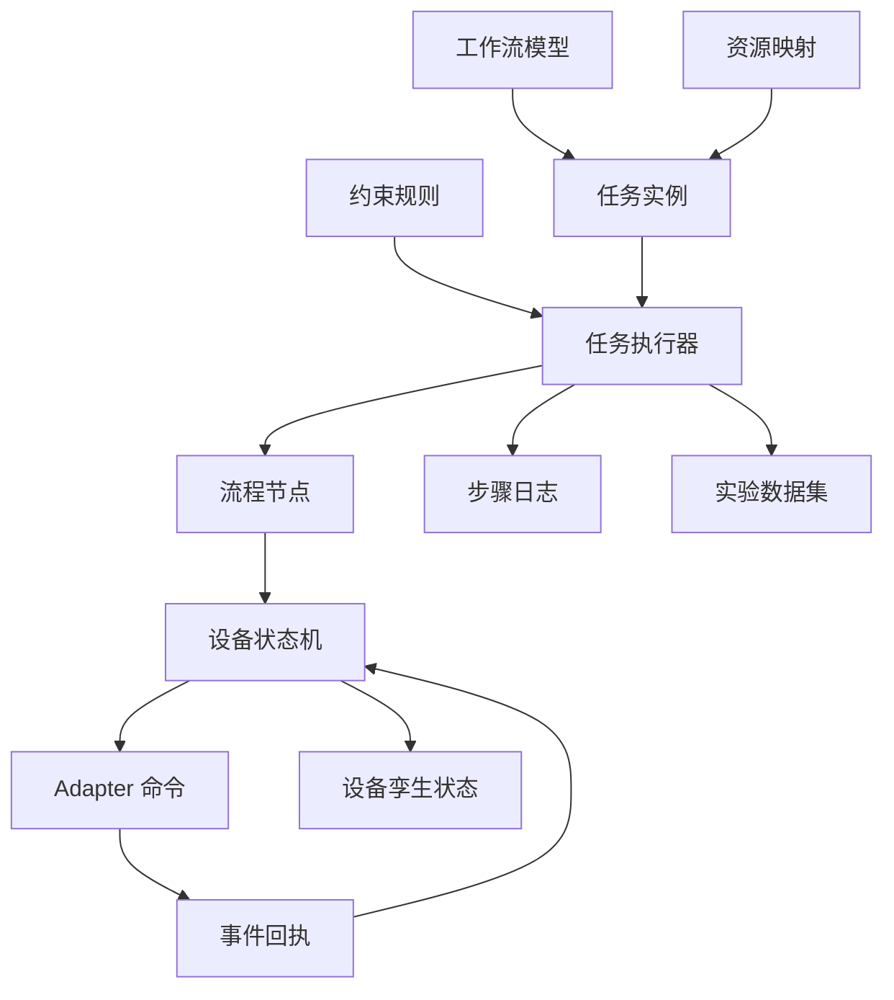
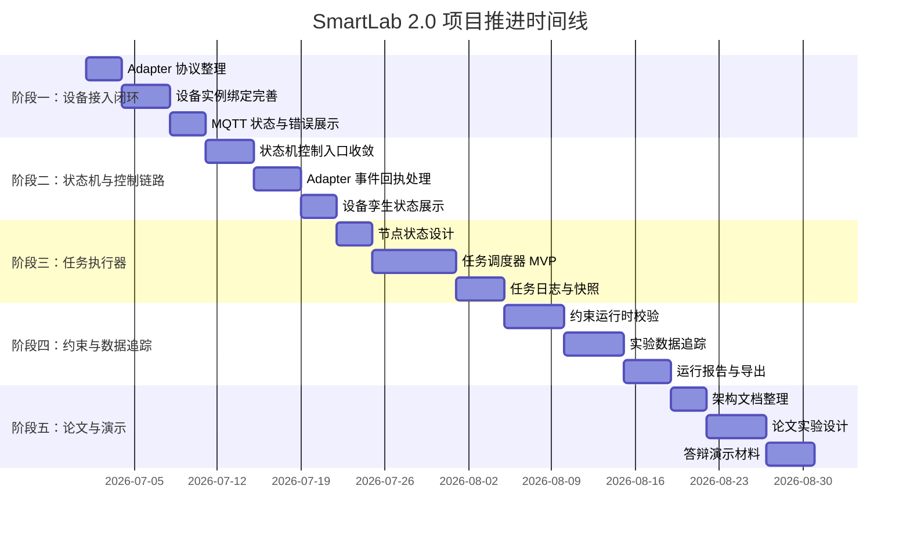

# Codex 可执行任务规划方案大纲

> 用途：给 大模型、项目成员或后续论文/答辩整理使用。  
> 写作目标：让执行者明确项目目标、当前状态、数据链路、任务拆解、时间线、验收标准和风险边界。

## 1. 项目目标

### 1.1 项目名称

SmartLab 2.0 智能实验室可执行建模与运行管理系统。

### 1.2 一句话目标

构建一个支持设备建模、设备接入、实验流程设计、任务执行、约束管理、数据采集和运行追踪的智能实验室管理平台。

### 1.3 当前阶段目标

- 打通设备接入、设备实例绑定、Adapter 通信、状态机控制和数据更新链路。
- 梳理系统架构和核心数据链路。
- 为后续论文、项目展示和持续开发建立清晰任务规划。

### 1.4 最终交付物

- 可运行的前后端系统。
- 设备接入与 Adapter 通信闭环。
- 工作流设计与任务执行 MVP。
- 约束规则管理与运行时校验。
- 实验数据采集、查询和导出能力。
- 软件架构文档、论文大纲和项目演示材料。

### 1.5 范围外内容

- 不优先实现复杂算法优化。
- 不优先支持所有真实实验设备。
- 不优先做大规模部署和多租户能力。
- 不在没有确认的情况下修改数据库结构或真实设备控制逻辑。

## 2. 当前背景

### 2.1 系统现状

当前项目采用前后端分离架构：

- 前端：Vue 3、Vite、Element Plus、Pinia、Vue Router、Vue Flow、ECharts。
- 后端：Spring Boot 3、Java 21、MyBatis-Plus、PostgreSQL、JWT、MQTT。
- 设备侧：Adapter 目录中包含 PLC、Camera、MotionStage、Edge Agent 等适配器相关代码。

### 2.2 已完成模块

- 用户登录、注册、JWT 认证和权限菜单。
- 设备模型管理。
- 设备实例管理。
- Adapter 注册、解析和 MQTT 通信基础。
- 设备孪生状态维护。
- 工作流模型保存。
- 任务列表、启动、终止、监控和日志查询基础。
- 数据模板、数据索引和数据记录管理。
- 约束规则与违反日志基础。

### 2.3 当前主要问题

- 任务执行器还需要从“任务状态管理”升级为“自动执行流程”。
- Adapter 协议需要固化为正式文档和 schema。
- 状态机、MQTT、任务调度、约束校验之间的边界需要进一步收敛。
- 数据追踪链路需要统一任务、步骤、设备状态和实验数据。
- 论文需要明确技术主线、创新点和实验验证路径。

### 2.4 关键代码入口

- 后端入口：`Backend/src/main/java/com/smartlab/SmartLabApplication.java`
- 后端配置：`Backend/src/main/resources/application.yml`
- 前端入口：`Frontend/src/main.js`
- 前端路由：`Frontend/src/router/index.js`
- 前端认证状态：`Frontend/src/stores/authStore.ts`
- 设备实例服务：`Backend/src/main/java/com/smartlab/management/service/db/resource/device/DeviceInstanceService.java`
- 状态机服务：`Backend/src/main/java/com/smartlab/engine/StateMachineEngineService.java`
- MQTT 服务：`Backend/src/main/java/com/smartlab/management/service/adapter/MqttAdapterMessagingService.java`
- Adapter manifest 服务：`Backend/src/main/java/com/smartlab/management/service/adapter/AdapterManifestService.java`

## 3. 业务流程

### 3.1 用户角色

- 系统管理员：管理用户、权限、菜单和全局配置。
- 实验人员：创建设备实例、设计实验流程、启动任务、查看数据。
- 设备维护人员：管理 Adapter、设备接入、设备点绑定和通信状态。
- 安全负责人：配置约束规则、查看违反日志和异常处置记录。

### 3.2 主流程



### 3.3 异常流程

- 用户未登录或 Token 失效：跳转登录页。
- Adapter 未连接：显示 MQTT 状态异常并允许重连。
- 设备实例未绑定 Adapter：禁止发送设备命令。
- 状态机拒绝操作：返回当前状态和拒绝原因。
- 约束规则命中：阻断任务或控制指令，并记录违反日志。
- 任务节点执行失败：记录 StepLog，任务进入 FAILED 或 WAITING 状态。

### 3.4 权限边界

- 前端通过菜单和路由守卫控制页面可见性。
- 后端通过 JWT 过滤器校验用户身份。
- 管理员拥有全部权限。
- 普通用户按权限对象控制可执行操作。

## 4. 系统架构



### 4.1 前端模块

- 登录注册。
- 首页 Dashboard。
- 设备模型管理。
- 设备实例管理。
- PLC / Adapter 管理。
- 数据模板管理。
- 数据点管理。
- 任务列表。
- 任务监控。
- 流程设计。
- 约束管理。
- 用户管理。

### 4.2 后端模块

- Controller 层：提供 REST API。
- Service 层：承载业务逻辑。
- Mapper 层：访问数据库。
- Entity / DTO：定义数据库实体和接口对象。
- Adapter 服务：解析 manifest、维护 MQTT 通信。
- 状态机引擎：处理设备状态迁移和命令输出。
- Global 模块：认证、安全、JSON 工具、配置。

### 4.3 外部系统

- PostgreSQL：保存业务数据、模型 JSON、任务日志和权限数据。
- MQTT Broker：负责后端和 Adapter 之间的消息通信。
- 设备适配器：屏蔽真实设备协议差异。
- 物理设备：PLC、相机、运动控制台等实验室设备。

## 5. 数据链路图

### 5.1 总体数据链路



### 5.2 Adapter 注册数据链路



### 5.3 遥测数据链路



### 5.4 命令控制数据链路



### 5.5 任务执行数据链路



## 6. 核心对象模型

### 6.1 设备模型

- 用途：定义设备属性、能力、端口、约束、Adapter 契约和状态机。
- 来源：用户配置或 Adapter 契约生成。
- 生命周期：创建、编辑、绑定实例、归档。
- 关联对象：设备实例、约束规则、状态机、Adapter 模板。

### 6.2 设备实例

- 用途：代表真实实验室设备或设备点。
- 来源：用户在设备实例管理页面创建。
- 生命周期：创建、绑定 Adapter、运行、停用、归档。
- 关联对象：设备模型、AdapterIndex、DeviceTwinStates、DataIndex。

### 6.3 Adapter

- 用途：封装真实设备通信协议。
- 来源：设备侧通过 MQTT 注册。
- 生命周期：注册、心跳、订阅设备点、接收命令、上报事件。
- 关联对象：AdapterIndex、设备实例、Adapter manifest。

### 6.4 工作流模型

- 用途：描述实验流程节点、接口连接和端口连接。
- 来源：流程设计器。
- 生命周期：设计、保存、发布、创建任务。
- 关联对象：流程节点、任务实例、设备能力。

### 6.5 任务实例

- 用途：承载一次实验运行。
- 来源：用户从工作流模型创建。
- 生命周期：PENDING、RUNNING、COMPLETED、FAILED、ABORTED。
- 关联对象：工作流模型、任务步骤、运行日志、数据集。

### 6.6 约束规则

- 用途：描述安全、资源、设备和实验过程约束。
- 来源：安全中心配置。
- 生命周期：创建、启用、命中、记录、停用。
- 关联对象：设备模型、设备实例、任务、ViolationLog。

### 6.7 数据模板与数据集

- 用途：定义实验数据结构并保存运行结果。
- 来源：数据模板管理和设备实例创建流程。
- 生命周期：模板创建、数据集生成、数据写入、查询导出。
- 关联对象：设备实例、任务、任务步骤。

## 7. 任务拆解

### T1：固化 Adapter 注册协议

目标：

完善 Adapter manifest 的字段定义、校验逻辑、样例文件和错误提示。

涉及文件：

- `Backend/src/main/java/com/smartlab/management/service/adapter/AdapterManifestService.java`
- `Backend/src/main/java/com/smartlab/management/service/db/resource/device/AdapterIndexService.java`
- `Backend/src/main/resources/samples/`
- `docs/adapter-protocol.md`

执行步骤：

1. 阅读现有 Adapter manifest 解析逻辑。
2. 梳理必填字段、可选字段和默认值。
3. 补充 JSON schema 或文档约束。
4. 准备至少一个标准样例和一个错误样例。
5. 在前端或接口层显示清晰错误信息。

验收标准：

- 可以注册一个标准 Adapter。
- 可以查询 Adapter 的设备模板和设备点。
- 错误 manifest 能返回明确原因。
- 文档中包含 topic、字段和样例。

### T2：完善设备实例绑定闭环

目标：

确保设备实例能够稳定绑定 Adapter 设备点，并自动生成属性映射、命令 topic 和遥测 topic。

涉及文件：

- `DeviceInstanceService.java`
- `DeviceInstanceController.java`
- `DeviceInstanceManagement.vue`
- `DeviceModelManagement.vue`

执行步骤：

1. 检查设备模型与 Adapter 模板匹配逻辑。
2. 检查属性类型映射和字段映射。
3. 完善绑定预览接口。
4. 完善前端绑定表单和错误提示。
5. 保存后刷新 Adapter 路由表。

验收标准：

- 设备实例可绑定 Adapter 设备点。
- 保存后可看到 adapterBinding。
- 遥测 topic 和命令 topic 正确生成。
- 绑定不匹配时有明确提示。

### T3：统一设备控制链路

目标：

所有手动控制和后续任务控制都统一经过状态机，避免直接绕过状态机修改状态。

涉及文件：

- `StateMachineEngineService.java`
- `DeviceInstanceService.java`
- `DeviceInstanceController.java`
- `MqttAdapterMessagingService.java`

执行步骤：

1. 梳理当前设备控制入口。
2. 明确状态机接受的输入信号。
3. 将命令构造和 MQTT 发布接入状态机 SEND action。
4. Adapter event 回流后更新指令生命周期状态。
5. 补充状态拒绝时的错误信息。

验收标准：

- 非法状态不能发送命令。
- 合法控制会发布 MQTT command。
- Adapter 回执事件能推动状态变化。
- 设备孪生状态和前端显示一致。

### T4：实现任务执行器 MVP

目标：

从工作流模型创建任务后，系统可以自动调度流程节点并触发设备能力。

涉及文件：

- `TaskService.java`
- `WorkflowService.java`
- `FlowNodeService.java`
- 新增 `TaskExecutionService.java`
- `TaskMonitor.vue`
- `WorkflowDesigner.vue`

执行步骤：

1. 定义任务节点状态。
2. 读取工作流节点和连接关系。
3. 计算可执行节点。
4. 调用设备状态机触发能力。
5. 等待 Adapter event 或状态变化。
6. 写入 TaskStep 和 StepLog。
7. 更新任务整体状态。

验收标准：

- 一个简单两节点流程可以自动执行。
- 每个节点有状态和日志。
- 失败节点能记录原因。
- 任务监控页面能看到运行过程。

### T5：实现约束运行时校验

目标：

在设备控制和任务执行前执行约束规则，命中后阻断或触发处置动作。

涉及文件：

- `ConstraintRuleService.java`
- `ViolationLogService.java`
- `StateMachineEngineService.java`
- `TaskService.java`
- `SecurityCenter.vue`

执行步骤：

1. 分类约束规则：设备、实例、任务、全局。
2. 定义约束上下文。
3. 实现约束表达式读取和判断。
4. 在控制前、节点执行前调用约束检查。
5. 命中后写入 ViolationLog。

验收标准：

- 控制前可检查约束。
- 命中约束会阻断操作。
- 违反日志可查询。
- 前端能显示违反原因。

### T6：建立实验数据追踪链路

目标：

把任务、步骤、设备状态、遥测数据和实验结果关联起来，支撑论文实验分析。

涉及文件：

- `DataIndexService.java`
- `DataRecordService.java`
- `TaskService.java`
- `DeviceInstanceService.java`
- `DataManagement.vue`
- `TaskMonitor.vue`

执行步骤：

1. 定义 traceId 或 taskRunId。
2. 遥测写入时关联任务和设备实例。
3. 任务步骤保存输入输出快照。
4. 增加按任务查询数据接口。
5. 增加 CSV/Excel 导出规划。

验收标准：

- 可以从任务查到相关设备数据。
- 可以从数据记录回溯到任务和步骤。
- 实验数据可导出。
- 论文实验图表有数据来源。

## 8. 时间线



## 9. 阶段交付物

| 阶段 | 目标 | 交付物 | 验收方式 |
| --- | --- | --- | --- |
| 阶段一 | 打通设备接入闭环 | Adapter 协议、样例 manifest、设备绑定页面 | 注册 Adapter 并绑定设备实例 |
| 阶段二 | 收敛控制链路 | 状态机控制、MQTT command、事件回执 | 手动控制设备并更新状态 |
| 阶段三 | 实现任务执行器 | 节点调度、任务日志、步骤快照 | 自动执行简单工作流 |
| 阶段四 | 加入约束和数据追踪 | 约束校验、违反日志、任务数据关联 | 命中约束并可追踪实验数据 |
| 阶段五 | 支撑论文和展示 | 架构图、论文大纲、演示数据 | 完成项目汇报或论文实验章节 |

## 10. Codex 执行规则

Codex 执行任务时应遵守以下规则：

- 修改代码前先阅读相关文件和已有实现。
- 保持改动范围聚焦，不做无关重构。
- 不覆盖用户已有修改。
- 优先沿用项目现有分层、命名和风格。
- 新增接口时同步检查前端调用和后端返回结构。
- 涉及结构化数据时优先使用 JSON parser、schema 或类型对象。
- 涉及数据库结构修改时先提出迁移方案。
- 涉及真实设备、远程数据库、MQTT Broker 或外部服务时先确认。
- 每个任务完成后运行合适的验证命令。
- 如果无法运行测试，需要说明原因和残余风险。
- 新增重要功能时补充文档、样例或使用说明。

## 11. 验收标准

### 11.1 功能验收

- 页面可以正常访问。
- 接口返回结构清晰。
- 核心操作有成功和失败反馈。
- 异常状态不会导致系统崩溃。

### 11.2 数据验收

- 数据能正确流转。
- 关键对象能正确落库。
- 状态更新与前端显示一致。
- 任务、步骤、设备和数据之间可追踪。

### 11.3 工程验收

- 后端能够编译或通过目标测试。
- 前端能够构建或通过目标页面验证。
- 关键逻辑有日志。
- 错误信息可定位。
- 不引入明显安全风险。

### 11.4 文档验收

- 新增协议或流程需要补充文档。
- 架构变化需要更新架构图。
- 新增样例需要说明运行方式。
- 论文相关内容需要保留图表和数据来源。

## 12. 风险与依赖

| 风险 | 影响 | 应对方式 |
| --- | --- | --- |
| 数据库连接使用远程地址和明文密码 | 安全和稳定性风险 | 改为环境变量或本地 profile |
| MQTT Broker 不可用 | Adapter 链路无法验证 | 准备本地 Broker 或模拟消息 |
| 真实设备不在线 | 无法端到端演示 | 准备模拟 Adapter |
| Adapter 协议变化 | 前后端和设备侧不一致 | 固化 manifest schema 和版本号 |
| 任务执行器边界不清 | 容易引入复杂状态问题 | 先实现 MVP，再逐步扩展 |
| 约束表达式不规范 | 运行时校验不可靠 | 定义约束上下文和表达式规则 |
| 动态数据表风险 | SQL 和权限风险 | 严格校验表名、字段名和访问范围 |
| 论文时间不足 | 影响最终交付 | 提前整理图、实验数据和章节素材 |

## 13. 待确认问题

- 是否需要接入真实设备，还是先使用模拟 Adapter？
- 是否允许修改数据库结构？
- 是否需要部署到服务器？
- 论文重点是系统设计、可执行建模、设备接入、状态机，还是任务调度？
- 是否需要导出 Word、PDF、Excel 或 PPT？
- 是否需要把规划同步到 Notion 或 Linear？
- 是否需要为每个阶段创建 GitHub issue 或 Linear issue？
- 是否需要写自动化测试，测试范围多大？

## 14. 推荐后续文档

```text
docs/
  codex-execution-plan-outline.md
  software-architecture-and-project-plan.md
  adapter-protocol.md
  device-modeling-guide.md
  workflow-execution-design.md
  constraint-engine-design.md
  database-design.md
  thesis-outline.md
```

## 15. 给 Codex 的执行提示模板

后续可以直接复制下面这段给 Codex：

```md
请根据 `docs/codex-execution-plan-outline.md` 执行当前阶段任务。

当前任务：
[填写任务编号，例如 T1：固化 Adapter 注册协议]

要求：
1. 先阅读相关代码和文档。
2. 只修改与当前任务相关的文件。
3. 不覆盖已有用户修改。
4. 完成后运行合适的验证命令。
5. 更新相关文档或样例。
6. 最后说明改了什么、如何验证、还有什么风险。
```
