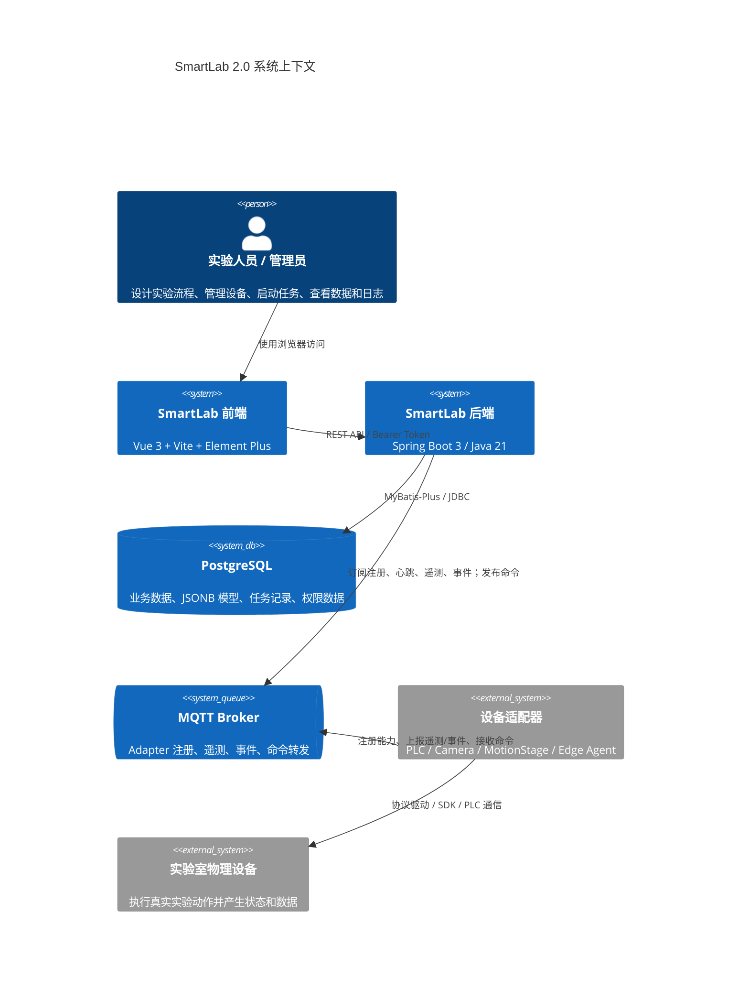
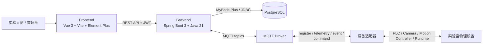
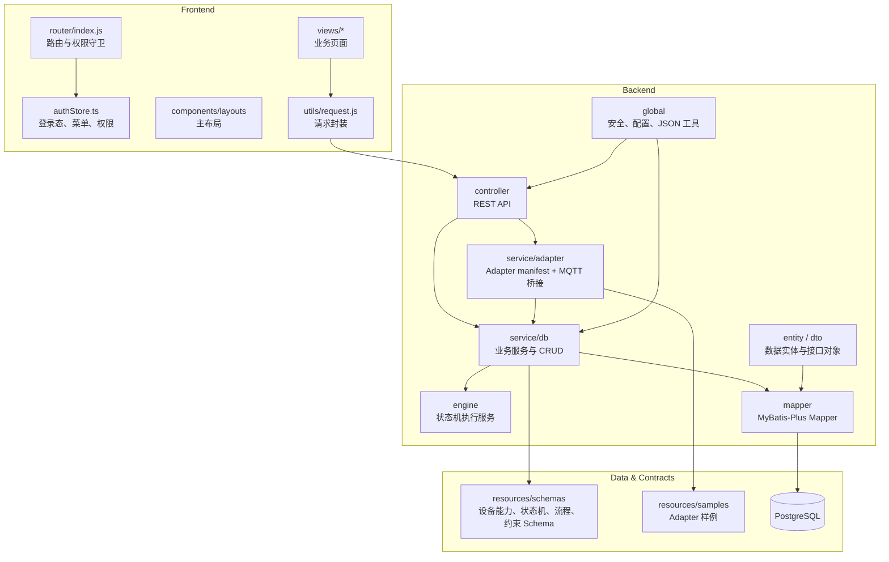
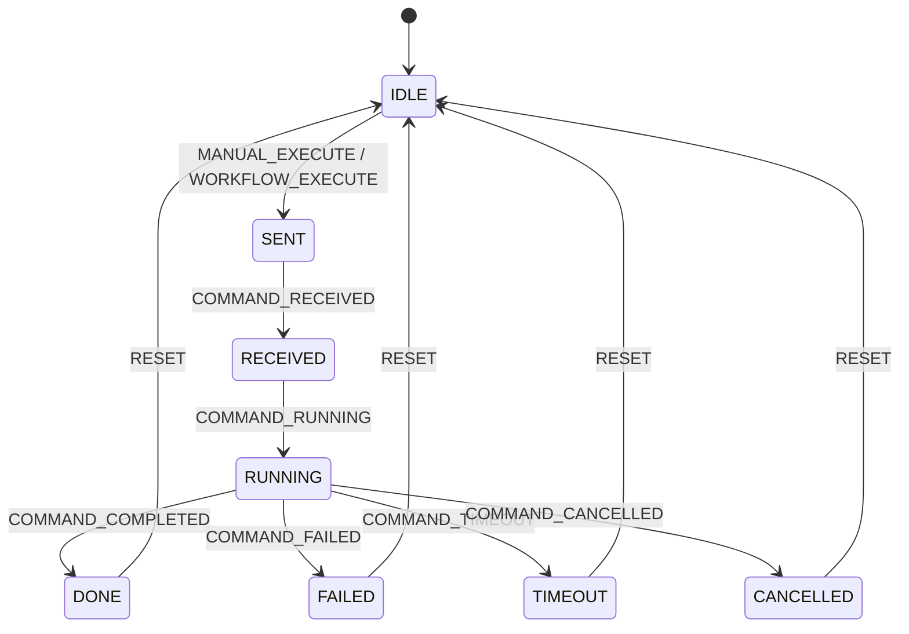
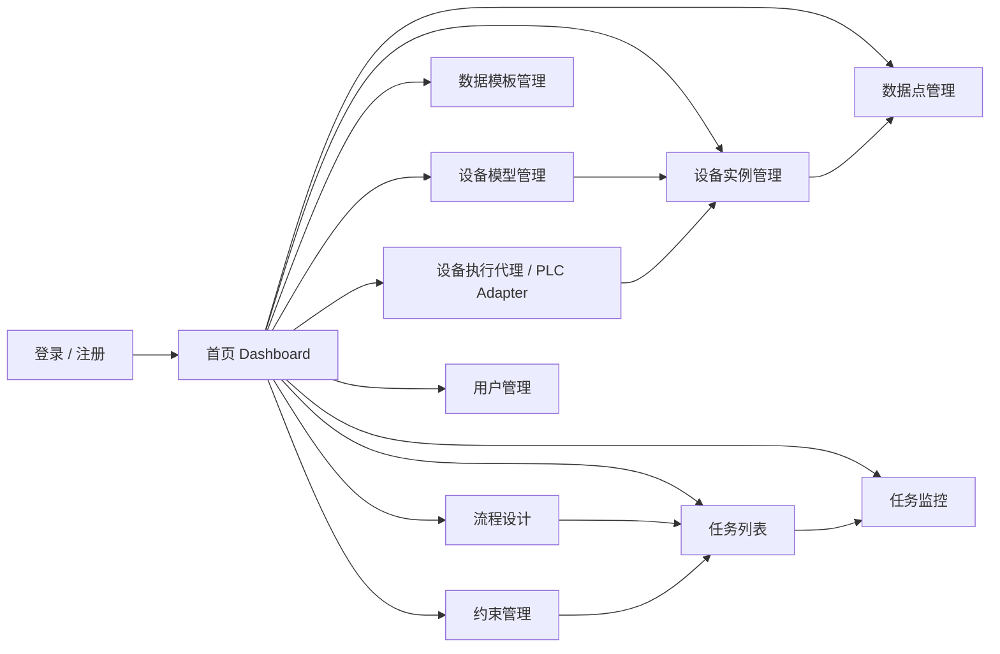
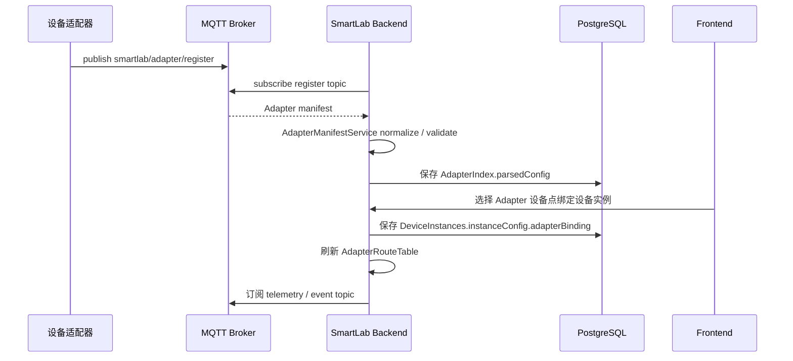
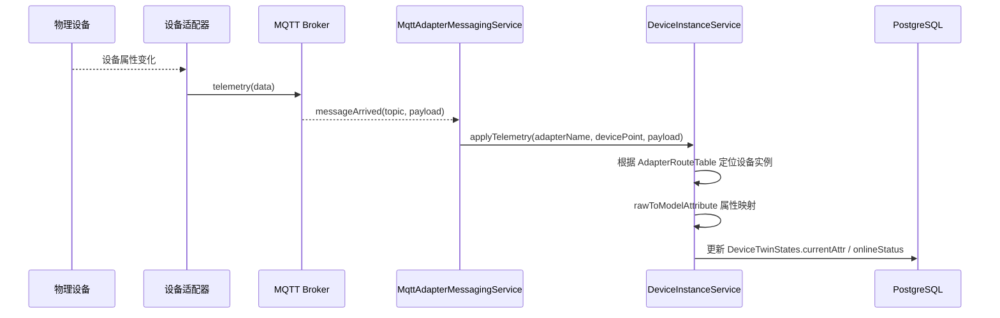
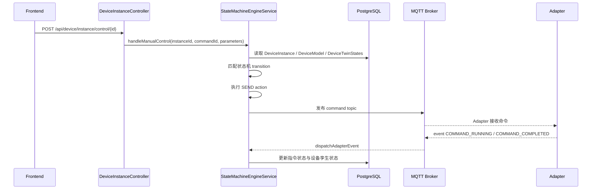
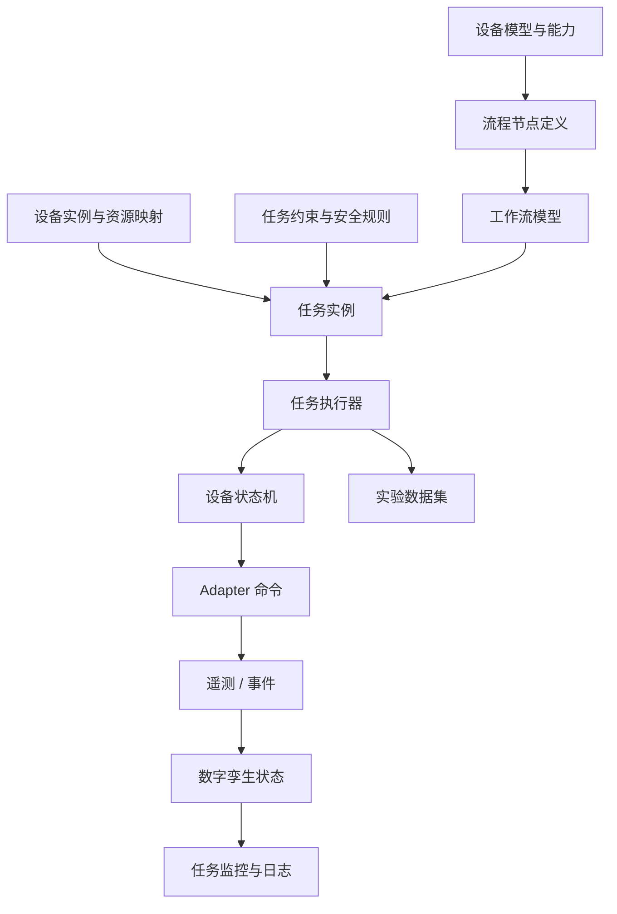
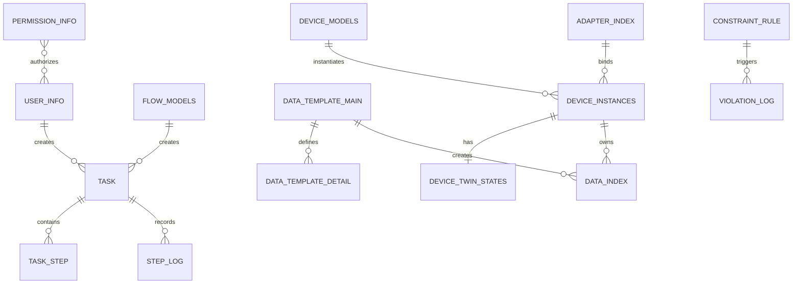

# SmartLab 2.0 软件架构与项目规划

更新时间：2026-06-29

本文档基于当前仓库代码结构生成，用于项目汇报、论文写作、架构图绘制和后续研发规划。当前系统定位为面向智能化学实验室的可执行建模与运行管理平台，核心目标是把设备资源、设备状态、实验流程、约束规则、数据采集和适配器通信统一到一套可管理、可执行、可追踪的软件框架中。

## 1. 系统定位

SmartLab 2.0 采用前后端分离与设备适配器解耦的架构。前端提供实验室资源、流程、任务、数据、安全和用户权限管理界面；后端提供统一 API、数据库访问、设备模型管理、状态机执行、任务运行记录、约束与权限管理；设备适配器通过 MQTT 与后端交互，将 PLC、相机、运动控制台等异构设备封装为统一的设备点、遥测、事件和命令协议。

系统的核心抽象包括：

- 设备模型：描述设备属性、能力、端口、约束、适配器契约和状态机。
- 设备实例：绑定真实设备点，维护当前状态、在线状态、属性快照和 Adapter 路由。
- 工作流模型：描述实验流程节点、接口连接和端口连接。
- 任务实例：承载一次实验运行，记录任务状态、变量空间、步骤快照和运行日志。
- 约束规则：描述安全、资源、过程和实验条件限制。
- 数据模板与数据集：管理实验数据结构和动态数据表。
- Adapter manifest：由设备适配器提供能力清单，统一设备点、属性、命令和事件定义。

## 2. 总体架构



如果渲染环境不支持 C4 Mermaid，可使用下面的普通 Mermaid 版本：



## 3. 代码分层



## 4. 后端核心模块

### 4.1 资源与设备管理

对应主要代码：

- `DeviceModelController` / `DeviceModelService`
- `DeviceInstanceController` / `DeviceInstanceService`
- `DeviceTwinStateController` / `DeviceTwinStateService`
- `AdapterIndexController` / `AdapterIndexService`
- `AdapterManifestService`

职责：

- 管理设备模型、设备实例、设备分类和设备组件。
- 保存设备能力、属性、端口、状态机、约束和 Adapter 契约等 JSONB 模型。
- 将设备实例绑定到 Adapter 设备点。
- 根据 Adapter manifest 生成适配器契约和属性映射。
- 维护设备数字孪生快照，包括在线状态、当前属性、指令生命周期状态和功能状态。

### 4.2 Adapter 通信与运行桥接

对应主要代码：

- `MqttAdapterMessagingService`
- `AdapterProtocolController`
- `AdapterManifestService`
- `adapter/*`

职责：

- 监听 Adapter 注册主题。
- 解析 Adapter 上报的设备模板、设备点、属性、命令和事件。
- 按设备实例绑定关系订阅 telemetry 与 event topic。
- 将遥测数据映射为设备模型属性并更新设备孪生状态。
- 将事件输入状态机。
- 发布设备控制命令到 Adapter command topic。

核心 topic 约定：

- 注册：`smartlab/adapter/register`
- 心跳：`smartlab/adapter/{adapterName}/heartbeat`
- 遥测：`smartlab/adapter/{adapterName}/{devicePoint}/telemetry`
- 事件：`smartlab/adapter/{adapterName}/{devicePoint}/event`
- 命令：`smartlab/adapter/{adapterName}/{devicePoint}/command`

### 4.3 状态机引擎

对应主要代码：

- `StateMachineEngineService`
- `StateMachineSendActionEvent`
- `device-state-machine-model.json`

职责：

- 接收人工控制、工作流控制、约束控制和 Adapter 事件。
- 根据设备模型中的状态转移规则判断是否允许状态迁移。
- 分离指令生命周期状态和设备功能状态。
- 执行 `SEND` 动作，将状态机输出信号转换为 Adapter 指令事件。
- 维护接口信号快照，支持后续扩展为流程编排、状态广播或调试面板。



### 4.4 工作流与任务执行

对应主要代码：

- `WorkflowController` / `WorkflowService`
- `FlowNodeController` / `FlowNodeService`
- `TaskController` / `TaskService`
- `WorkflowDesigner.vue`
- `TaskList.vue`
- `TaskMonitor.vue`

职责：

- 保存实验流程模型，包括节点、接口连接、端口连接。
- 创建任务实例，记录任务变量、资源映射和任务约束。
- 启动、终止和监控任务。
- 保存步骤快照和运行日志，为实验复现和论文实验记录提供依据。

当前任务服务已具备任务状态、日志、快照和监控汇总能力；后续可进一步补齐自动调度执行器，将工作流节点与设备状态机、约束规则、数据采集合并为完整运行闭环。

### 4.5 数据管理

对应主要代码：

- `DataTemplateController` / `DataTemplateService`
- `DataIndexController` / `DataIndexService`
- `DataRecordController` / `DataRecordService`
- `DataCenter.vue`
- `DataManagement.vue`

职责：

- 管理数据模板主表与明细字段。
- 根据设备实例创建默认数据集。
- 管理数据索引和动态数据表。
- 查询实验数据集和分页记录。

该模块适合支撑论文中的实验数据采集、实验结果表格、设备运行记录和任务可追溯性分析。

### 4.6 约束与安全

对应主要代码：

- `ConstraintRuleController` / `ConstraintRuleService`
- `ViolationLogController` / `ViolationLogService`
- `SecurityCenter.vue`
- `constraint-model.json`

职责：

- 管理安全约束、资源约束、实验约束。
- 记录约束违反日志。
- 为任务执行和设备控制提供规则校验入口。

后续规划中，约束模块应从“配置与记录”升级为“运行时约束检查器”，在设备控制、任务调度和状态迁移前统一拦截风险操作。

### 4.7 用户、权限与菜单

对应主要代码：

- `SecurityConfig`
- `JwtAuthenticationFilter`
- `AuthenticationTokenService`
- `UserController` / `UserService`
- `PermissionController` / `PermissionService`
- `MenuService` / `MenuCatalogService`
- `authStore.ts`
- `router/index.js`

职责：

- 提供注册、登录、JWT 认证、用户资料和菜单加载。
- 按权限控制前端可见菜单和路由访问。
- 支持系统管理员权限绕过和普通用户权限对象校验。

## 5. 前端功能架构



前端使用 Vue 3、Vue Router、Pinia、Element Plus、ECharts 和 Vue Flow。当前路由已经按主要业务域组织，权限守卫会在进入受保护页面时刷新用户资料和菜单，并根据后端返回的可见路径控制访问。

## 6. 关键运行链路

### 6.1 Adapter 注册与设备绑定链路



### 6.2 遥测数据更新数字孪生链路



### 6.3 手动控制与状态机链路



### 6.4 任务与工作流规划链路



其中 `任务执行器` 是后续需要重点完善的模块：它应负责按工作流拓扑调度节点、分配设备资源、检查约束、触发设备能力、等待事件回执、记录步骤快照，并把数据写入对应数据集。

## 7. 数据模型分区



主要数据域：

- 资源域：设备分类、设备组件、设备模型、设备实例、设备孪生状态、场景资源结构。
- Adapter 域：Adapter 注册索引、解析后配置、设备模板、设备点和契约映射。
- 流程任务域：流程模型、流程节点、任务、任务步骤、步骤日志。
- 数据域：数据模板、数据字段、数据索引、动态实验数据表。
- 安全域：约束规则、违反日志、用户、权限、菜单。

## 8. 项目当前状态判断

当前项目已经具备完整的系统骨架和核心业务边界：

- 前端主业务页面基本齐全，覆盖设备、数据、任务、约束、用户和首页。
- 后端已形成 Controller、Service、Mapper、Entity、DTO 的分层结构。
- PostgreSQL + JSONB 模型适合承载复杂设备模型、工作流模型和约束模型。
- Adapter manifest、MQTT、设备实例绑定和数字孪生状态已经形成设备接入闭环。
- 状态机引擎已开始承接设备指令生命周期与 Adapter 事件处理。
- 任务执行目前更偏向任务记录与监控，距离全自动工作流执行还需要补齐调度器。

需要重点关注的工程风险：

- `application.yml` 当前含有直连数据库地址和明文密码，应迁移到环境变量或本地 profile。
- 状态机、MQTT、任务调度、数据写入之间的事务边界和失败补偿需要进一步设计。
- 设备控制链路需要统一由状态机驱动，避免 Controller/Service 中存在绕过状态机的控制路径。
- 动态数据表与 SQL 拼接相关逻辑需要持续校验表名、字段名和权限边界。
- 论文或验收前，需要补充端到端演示样例、测试数据和关键路径自动化测试。

## 9. 后续项目规划

### 阶段一：系统收敛与可运行闭环

目标：让“设备接入 - 模型绑定 - 手动控制 - 状态回执 - 数据更新”稳定跑通。

任务：

- 梳理 Adapter manifest 标准字段，形成正式协议文档。
- 固化设备模型与 Adapter 契约生成流程。
- 完善设备实例绑定校验和错误提示。
- 统一设备控制入口，优先走状态机与 MQTT 发布链路。
- 增加 MQTT 连接状态、订阅 topic、最近消息、错误信息的可视化面板。
- 准备一个可复现实验样例：例如加热/压力/PLC 数据点闭环。

交付物：

- Adapter 协议说明。
- 单设备控制演示。
- 设备孪生状态面板。
- 样例 Adapter 配置和样例设备模型。

### 阶段二：工作流执行器

目标：把流程设计从“可保存”推进到“可执行”。

任务：

- 定义工作流节点运行状态：PENDING、READY、RUNNING、WAITING_EVENT、COMPLETED、FAILED、SKIPPED。
- 实现任务执行器，按节点依赖和接口连接调度。
- 将流程节点能力调用映射到设备实例能力和 Adapter 命令。
- 实现变量空间、输入输出端口、接口事件的传递规则。
- 每个节点执行前检查资源锁、任务约束和设备状态。
- 每个节点执行后保存 TaskStep 快照和 StepLog。

交付物：

- 自动执行一个多节点实验流程。
- 任务监控页面展示节点级运行状态。
- 失败节点可定位到设备、命令、事件和约束原因。

### 阶段三：约束引擎与安全控制

目标：让系统具备实验前、执行中和异常时的安全管控能力。

任务：

- 将约束规则分为设备固有约束、实例局部约束、任务全局约束和运行时约束。
- 设计约束表达式计算上下文：设备属性、任务变量、资源占用、环境参数、用户权限。
- 在手动控制和任务执行前增加约束检查。
- 违反约束时写入 ViolationLog，并触发暂停、取消、告警或恢复策略。
- 在安全中心中展示规则命中记录和处置结果。

交付物：

- 约束规则运行时校验。
- 约束违反日志闭环。
- 安全控制实验案例。

### 阶段四：数据与实验可追溯

目标：支撑论文实验、结果分析和实验复现。

任务：

- 将任务、步骤、设备状态、Adapter 消息和数据集建立统一追踪 ID。
- 设计实验运行报告结构，包括任务参数、设备状态变化、关键数据曲线和异常记录。
- 扩展数据模板与动态数据表，支持按任务、设备、时间范围查询。
- 增加图表导出、CSV/Excel 导出和论文图表生成能力。

交付物：

- 实验运行报告。
- 任务级数据追踪。
- 可导出的实验数据与图表。

### 阶段五：论文与系统展示

目标：把工程系统整理为可讲清楚、可演示、可验证的论文成果。

建议论文结构：

1. 绪论：智能化学实验室自动化、异构设备接入和实验流程执行问题。
2. 相关工作：实验室自动化、数字孪生、工作流系统、设备适配器、约束执行。
3. 需求分析：实验流程建模、设备资源管理、状态可追踪、安全约束、数据采集。
4. 系统架构：前后端、后端分层、Adapter 协议、状态机引擎、数据模型。
5. 核心设计：设备模型、Adapter manifest、状态机、工作流执行器、约束引擎。
6. 系统实现：关键模块实现、接口设计、数据库设计、前端页面。
7. 实验与评估：典型实验流程、设备控制延迟、状态一致性、异常处理、可扩展性。
8. 总结与展望：系统贡献、不足和未来工作。

论文图建议：

- 系统总体架构图。
- 后端分层架构图。
- Adapter 注册与设备绑定时序图。
- 设备状态机图。
- 工作流执行流程图。
- 数据库核心实体关系图。
- 约束检查闭环图。

## 10. 近期优先级建议

| 优先级 | 工作项 | 价值 | 验收标准 |
| --- | --- | --- | --- |
| P0 | 固化设备接入闭环 | 打通真实设备或模拟设备 | Adapter 注册、设备绑定、遥测更新、手动命令发布成功 |
| P0 | 统一控制链路 | 降低状态不一致风险 | 所有设备控制都经过状态机和统一事件回执 |
| P1 | 任务执行器 MVP | 从管理系统升级为可执行系统 | 一个多节点流程可自动运行并生成日志 |
| P1 | 约束运行时校验 | 提升安全性和论文亮点 | 控制前可拦截违规操作并记录日志 |
| P1 | 实验数据追踪 | 支撑论文实验分析 | 任务、步骤、设备状态、数据集可以关联查询 |
| P2 | 架构与协议文档 | 降低维护成本 | README、Adapter 协议、状态机 schema、API 说明完整 |
| P2 | 自动化测试与演示数据 | 提高稳定性 | 核心 API、状态机、Adapter 解析有测试或演示脚本 |

## 11. 推荐文档目录

建议后续补充以下文档：

```text
docs/
  software-architecture-and-project-plan.md
  adapter-protocol.md
  device-modeling-guide.md
  workflow-execution-design.md
  constraint-engine-design.md
  database-design.md
  thesis-outline.md
```

这些文档可以直接作为论文、答辩 PPT、项目 README 和 Notion 项目知识库的基础材料。
