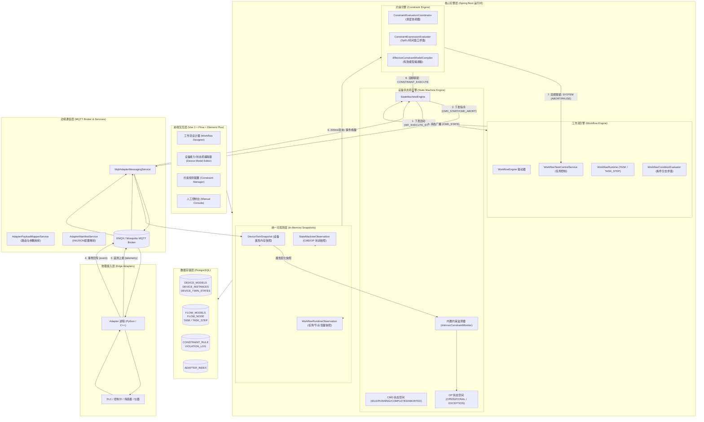
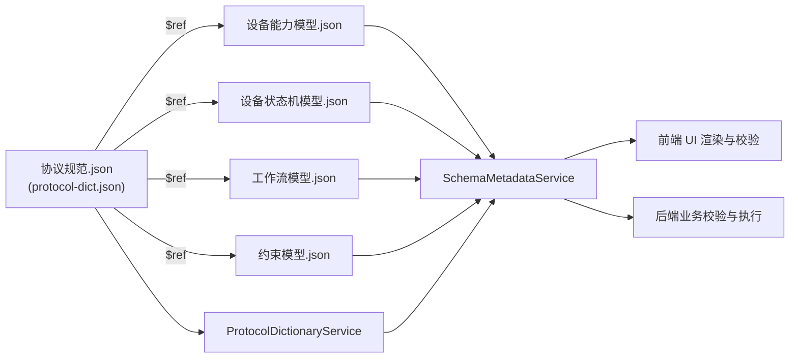
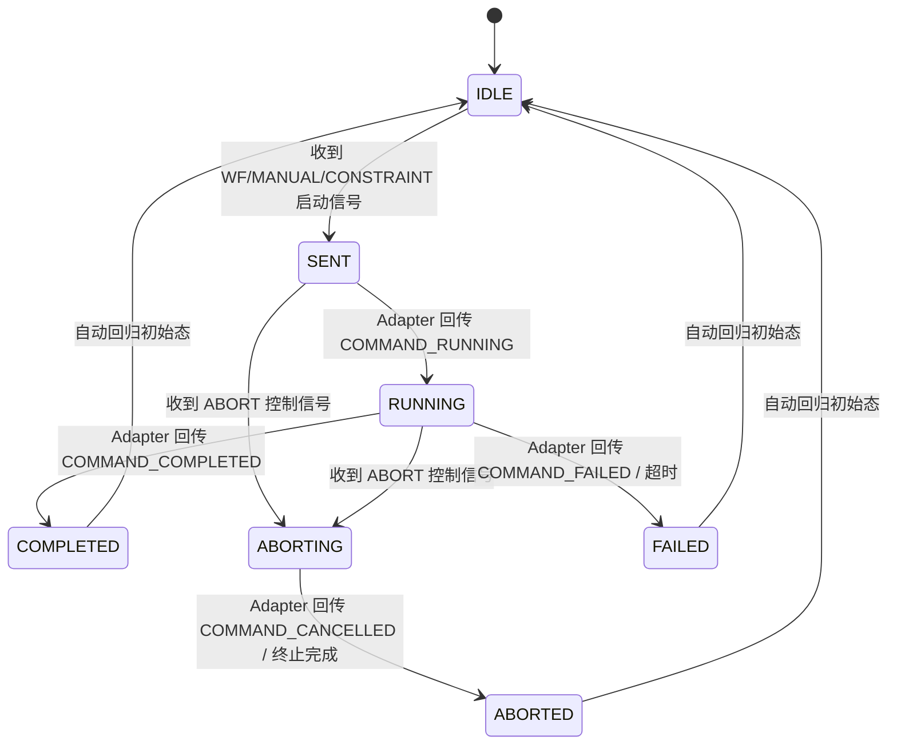
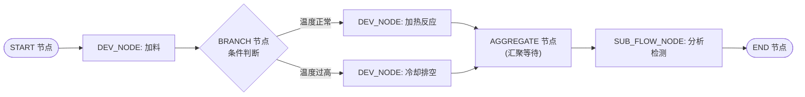
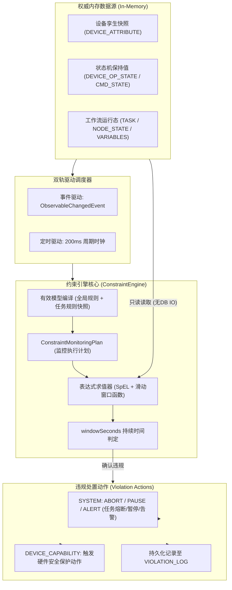
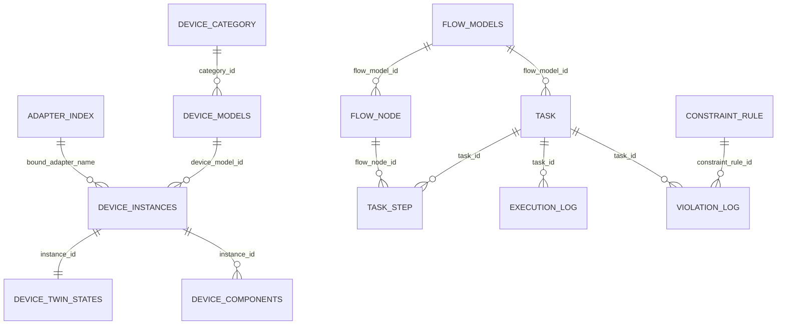

# SmartLab 2.0 智能实验室系统技术架构文档

---

## 1. 总体架构概览

### 1.1 系统定位与核心价值
SmartLab 2.0 是一套面向智能化学/材料实验室、自动化合成与仪器装备联动的**任务导向型可执行建模与运行时控制系统**。系统通过建立物理设备抽象（数字孪生）、灵活的工作流编排、软实时约束监控与安全联锁，以及标准化的边缘 Adapter 接入体系，实现了从实验配方设计到硬件底层执行的全链路闭环。

### 1.2 核心架构分层与设计原则
系统采用 **“三层规范驱动 + 四层软件架构 + 内存软实时求值 + 异步消息闭环”** 的设计模式：

1. **三层规范体系**：
   - **公共跨模块协议字典 (`protocol-dict.json` / `协议规范.json`)**：统一基础数据类型、系统信号类型、MQTT 主题约定与报文结构；
   - **领域模型 JSON Schema**：分别约束设备能力模型、状态机模型、工作流模型与约束模型；
   - **Java / Python 运行时执行层**：执行状态推进、节点调度、表达式计算与物理寄存器交互。
2. **内存快照软实时求值**：
   - 约束引擎求值与设备内置约束监测**绝不直连数据库**，全部通过基于内存的权威快照（`ConcurrentHashMap` 结合修订号 `revision`）进行纳秒/微秒级内存读取，保障 200ms 周期内的软实时安全联锁；
   - 数据库仅承担静态定义、任务归档、历史审计和系统崩溃恢复职责。
3. **高内聚低耦合的引擎分工**：
   - **工作流引擎**：负责“做哪些步骤、按什么拓扑做”；
   - **状态机引擎**：负责“单个设备处于什么状态、允许执行什么动作”；
   - **约束引擎**：负责“全局/任务维度是否存在违规，如何联锁干预”；
   - **Adapter 体系**：负责“软硬件协议转换与物理通信”。

### 1.3 系统架构拓扑图



---

## 2. 核心规范体系与模型 JSON Schema

系统所有领域模型通过统一的 JSON Schema（Draft-07）定义，并由后端 [`ProtocolDictionaryService`](file:///d:/SmartLab2.0/Backend/src/main/java/com/smartlab/global/protocol/ProtocolDictionaryService.java) 与 [`SchemaMetadataService`](file:///d:/SmartLab2.0/Backend/src/main/java/com/smartlab/global/schema/SchemaMetadataService.java) 加载校验，统一对前端提供元数据接口 `/api/schema-metadata/frontend`。



### 2.1 跨模块协议规范 (`协议规范.json`)
承担跨引擎通用定义：
- **`DataType`**：全局基础数据类型：`INTEGER`、`DOUBLE`、`STRING`、`BOOLEAN`、`JSON`。
- **`CommunicationProtocol`**：适配器通信协议（当前为 `MQTT`）。
- **统一系统信号枚举**：
  - `WorkflowControlSignal`：`WF_EXECUTE_START`（携带能力名与参数）、`WF_EXECUTE_ABORT`（不带参数，通过上下文触发附属终止能力）；
  - `ManualControlSignal`：`MANUAL_EXECUTE_START`、`MANUAL_EXECUTE_ABORT`；
  - `ConstraintControlSignal`：`CONSTRAINT_EXECUTE`、`CONSTRAINT_ABORT`；
  - `AdapterOutboundSignal`：`CMD_START`、`CMD_ABORT`；
  - `StatusSignal`：`CMD_STATE`、`OP_STATE`。
- **MQTT 主题规范 (`MqttTopicConvention`)** 与 **5 类标准 MQTT 报文格式**（`AdapterRegisterRequest`、`CommandMessageFormat`、`TelemetryMessageFormat`、`EventMessageFormat`、`AdapterHeartbeat`）。

### 2.2 设备能力模型 Schema (`设备能力模型.json`)
描述设备静态功能与物理接口：
- **`attributes`**：属性空间（属性名、数据类型、连续/离散 `valueKind`、单位 `unit`）；
- **`capabilities`**：对外暴露的能力集。包含 `capabilityName`、映射的 `adapterCommandName`、`isAbort`（是否为终止操作）、`abortCapabilityName`（普通能力关联的附属终止能力）、`scope`（终止影响范围）、`parameters` 及 `parameterMapping`；
- **`adapterContract`**：包含 `commands`（已剔除 internal 的公开参数）、`telemetry`（上报字段及到设备属性的 `attributesMapping`）、`events`（`cmdEvents` 与 `opEvents`）；
- **`intrinsicConstraints`**：设备内置约束（监测表达式、违规激活的异常状态名 `violationStateName` 及处置动作）。

### 2.3 设备状态机模型 Schema (`设备状态机模型.json`)
规范设备动态运行状态与转移规则：
- **`interfaces`**：声明接口名称、方向（`IN`/`OUT`）、类型（`WORKFLOW`、`STATE`、`ADAPTER`、`CONTROL`、`CONSTRAINT`）及允许信号 `allowedSignals`；
- **`opStateSpace`**：业务状态空间，包含 `OPERATIONAL`（单状态互斥业务区）与 `EXCEPTION`（异常状态集合区）；
- **`cmdLifecycleSpace`**：指令生命周期空间（标准路径：`IDLE` $\rightarrow$ `SENT` $\rightarrow$ `RUNNING` $\rightarrow$ `COMPLETED`；异常/终止路径：`ABORTING` $\rightarrow$ `ABORTED`、`FAILED`）；
- **`transitions`**：声明触发条件（接口名 + 信号名）、前置状态、目标状态与执行动作（`StateMachineAction: SEND`）。

### 2.4 工作流模型 Schema (`工作流模型.json`)
规范实验流程图拓扑：
- **`nodes`**：支持三种节点类型：
  - `devNode`（设备能力节点）：绑定目标设备模型、能力、参数表达式与内部变量映射；
  - `funcNode`（功能控制节点）：`START`、`END`、`BRANCH`（条件分支）、`AGGREGATE`（多路汇聚）；
  - `subflowNode`（子流程节点）：嵌套引用外部流程模型。
- **`interfaceConnections`**：接口连线关系（`NODE_TO_NODE`、`NODE_TO_DEVICE`、`DEVICE_TO_NODE`）；
- **`portConnections`**：数据/物理物料端口连线拓扑（`source` $\rightarrow$ `target`）。

### 2.5 约束模型 Schema (`约束模型.json`)
规范安全检测规则与联锁：
- **`observableObjects`**：声明监测的数据源，通过 `sourceType` 区分 6 类对象：
  1. `DEVICE_ATTRIBUTE`：设备属性；
  2. `DEVICE_OPERATION_STATE`：设备业务运行状态；
  3. `DEVICE_COMMAND_LIFECYCLE`：设备指令生命周期；
  4. `NODE_LIFECYCLE_STATE`：工作流节点生命周期；
  5. `NODE_INTERNAL_VARIABLE`：节点内部变量；
  6. `TASK_LIFECYCLE_STATE`：任务整体执行状态。
- **`constraints`**：规则集，包含布尔表达式 `expression`、变量映射 `bindings`（绑定到 `OBSERVABLE` 或 `LITERAL` 常量）、持续时间窗口 `windowSeconds`、违规处置动作 `violationActions`（`SYSTEM` 任务控制或 `DEVICE_CAPABILITY` 触发设备能力）。

---

## 3. 设备状态机引擎 (Device State Machine Engine)

设备状态机引擎（[`StateMachineEngine`](file:///d:/SmartLab2.0/Backend/src/main/java/com/smartlab/engine/statemachine/StateMachineEngine.java)）是设备数字孪生与控制的中枢。



### 3.1 双状态空间架构
每个设备实例在内存中维护两个独立而关联的状态空间：
1. **CMD 状态空间（指令生命周期）**：
   - 统一由系统内核状态机驱动，追踪单条指令从发起到完成的物理执行进度；
   - 严格保证指令终态（`COMPLETED` / `ABORTED` / `FAILED`）后自动复位至 `IDLE`，以便接收下一条指令。
2. **OP 状态空间（设备功能/安全状态）**：
   - **`OPERATIONAL` 分区**：表示设备当前的物理运行模态（如 `STANDBY`、`HEATING`、`STIRRING`），遵循状态转移表；
   - **`EXCEPTION` 分区**：表示设备当前的异常标记集合（如 `[OVER_PRESSURE, DOOR_OPEN]`）。异常状态无需手动转移，由内置约束监测器依据实时传感器数据自动挂载与消除。

### 3.2 接口类型与信号隔离
状态机对外暴露 5 类接口，防止非法信号串扰：
- **`WORKFLOW` (IN)**：仅接收 `WF_EXECUTE_START` 与 `WF_EXECUTE_ABORT`；
- **`CONTROL` (IN)**：仅接收人工操作界面的 `MANUAL_EXECUTE_START` 与 `MANUAL_EXECUTE_ABORT`；
- **`CONSTRAINT` (IN)**：仅接收约束引擎触发的 `CONSTRAINT_EXECUTE` 与 `CONSTRAINT_ABORT`；
- **`ADAPTER` (IN/OUT)**：IN 方向接收 Adapter 原始事件（如 `COMMAND_RUNNING`、`TEMP_REACHED`）；OUT 方向向 Adapter 发送 `CMD_START` / `CMD_ABORT` 下行控制；
- **`STATE` (OUT)**：向外广播 `CMD_STATE`（携带 `messageId`）和 `OP_STATE` 状态变更通知。

### 3.3 普通指令与抢占式终止指令双轨制
- 当设备正在执行耗时较长的普通指令（`isAbort=false`，处于 `RUNNING` 态）时，系统禁止下发其他普通指令；
- 系统允许立即下发标记为 `isAbort=true` 的终止指令，或者通过普通指令定义的 `abortCapabilityName` 路由到专属终止能力；
- 状态机直接切入 `ABORTING` 态并向 Adapter 发送终止下行帧，实现安全抢占。

### 3.4 设备内置约束监测器 ([`IntrinsicConstraintMonitor`](file:///d:/SmartLab2.0/Backend/src/main/java/com/smartlab/engine/statemachine/IntrinsicConstraintMonitor.java))
- 系统启动或模型变更时，将设备模型中的 `intrinsicConstraints` 预编译为内存中的 [`IntrinsicConstraintPlan`](file:///d:/SmartLab2.0/Backend/src/main/java/com/smartlab/engine/statemachine/IntrinsicConstraintPlanRegistry.java)；
- 监测器独立轮询设备属性快照的 `revision`，当发现温度/压力超限时，自动将状态机 `EXCEPTION` 分区置为异常，并触发内置保护动作。

---

## 4. 工作流引擎 (Workflow Engine)

工作流引擎（[`WorkflowEngine`](file:///d:/SmartLab2.0/Backend/src/main/java/com/smartlab/engine/workflow/WorkflowEngine.java)）负责任务流程的驱动、节点生命周期管理与上下文传递。



### 4.1 核心执行机制与调度
- **静态定义与动态实例分离**：
  - 流程图结构持久化在 `FLOW_MODELS` 和 `FLOW_NODE` 表中；
  - 运行时每次执行创建独立的 `TASK` 记录，每一个节点的实际调度生成一条 `TASK_STEP` 记录。
- **节点生命周期**：`PENDING` $\rightarrow$ `EXECUTING` $\rightarrow$ `COMPLETED`（或 `FAILED` / `ABORTED`）。

### 4.2 节点类型调度策略
1. **`START` 节点**：初始化任务变量空间，沿输出连接激活第一批下游节点；
2. **`END` 节点**：
   - 若当前为主流程，则标记整个 `TASK` 为 `COMPLETED`；
   - 若当前为子流程（`SUB_FLOW_NODE`），则向父步骤发送 `SUBFLOW_COMPLETED` 信号，恢复父流程执行；
3. **`BRANCH` 节点**：调用 [`WorkflowConditionEvaluator`](file:///d:/SmartLab2.0/Backend/src/main/java/com/smartlab/engine/workflow/WorkflowConditionEvaluator.java)，根据任务变量与操作符（`==`, `!=`, `>`, `<`, `>=`, `<=`, `IN`, `BETWEEN` 等）计算满足条件的分支并输出；
4. **`AGGREGATE` 节点**：等待所有到达当前汇聚点的前序实际步骤全部执行完成（`ALL` 策略）后才继续推进；
5. **`SUB_FLOW_NODE` 节点**：实例化目标子流程，并自动维护 `parentStepId` 与递增的 `stepDepth`；
6. **`DEVICE_CAPABILITY_NODE` 节点**：
   - 从 `TASK.RESOURCE_MAP` 中解析当前节点绑定的物理 `deviceInstanceId`；
   - 生成全局唯一 `messageId` 写入 `TASK_STEP.INTERFACE_IN_SNAPSHOT`；
   - 向对应状态机发送 `WF_EXECUTE_START` 信号，当前步骤进入 `EXECUTING` 挂起状态。

### 4.3 异步状态监听与闭环恢复
- 工作流引擎实现 [`StateMachineInterfaceSignalEvent`](file:///d:/SmartLab2.0/Backend/src/main/java/com/smartlab/engine/statemachine/StateMachineInterfaceSignalEvent.java) 事件监听；
- 收到状态机的 `CMD_STATE` 广播后，提取载荷中的 `messageId`；
- 准确定位对应的 `TASK_STEP`：
  - 若为 `COMPLETED`：完成当前步骤，将输出参数写入变量空间，并沿连接线激活下游节点；
  - 若为 `FAILED` 或 `ABORTED`：将当前步骤与任务标记为异常终态。

---

## 5. 约束引擎与统一可观测层 (Constraint Engine & Observation)

约束引擎负责全局与实验过程中的安全联锁、工艺窗口监测与异常应急处置。



### 5.1 六类可观测对象的权威内存来源
系统通过 [`ObservableKey`](file:///d:/SmartLab2.0/Backend/src/main/java/com/smartlab/engine/observation/ObservableKey.java) 唯一定位可观测对象。所有对象统一具备 **当前值保持、修订号递增、轻量变更通知、随时只读快照访问** 特性：
- `DEVICE_ATTRIBUTE`：源自 [`DeviceTwinSnapshotRegistry`](file:///d:/SmartLab2.0/Backend/src/main/java/com/smartlab/engine/observation/device/DeviceTwinSnapshotRegistry.java)；
- `DEVICE_OPERATION_STATE` / `DEVICE_COMMAND_LIFECYCLE`：源自 [`StateMachineObservationRegistry`](file:///d:/SmartLab2.0/Backend/src/main/java/com/smartlab/engine/observation/statemachine/StateMachineObservationRegistry.java)；
- `NODE_LIFECYCLE_STATE` / `NODE_INTERNAL_VARIABLE` / `TASK_LIFECYCLE_STATE`：源自工作流运行态内存映射。

### 5.2 全局约束与任务约束生命周期
- **全局约束 (`CONSTRAINT_RULE`)**：保存在数据库中，支持动态维护。规则的新增、修改、停用会即时触发 `ConstraintRulesChangedEvent`，重新编译当前所有运行任务的监控计划；
- **任务约束 (`TASK.TASK_CONSTRAINTS`)**：在任务创建时写入快照，**任务一旦启动后绝对锁定**，不随全局规则修改而漂移，保证实验可追溯性。

### 5.3 软实时双轨调度与求值计算
- **调度器 ([`ConstraintEvaluationCoordinator`](file:///d:/SmartLab2.0/Backend/src/main/java/com/smartlab/engine/constraint/ConstraintEvaluationCoordinator.java))**：
  - **事件驱动**：当属性/状态变化抛出 `ObservableChangedEvent` 时，快速将对象标记为 `dirty` 并异步触发单线程 Worker；
  - **固定 200ms 扫描**：以 `smartlab.constraint.scan-interval-ms: 200` 为周期进行软实时轮询，作为滑动窗口函数与事件遗漏的兜底机制。
- **表达式求值 ([`ConstraintExpressionEvaluator`](file:///d:/SmartLab2.0/Backend/src/main/java/com/smartlab/engine/constraint/ConstraintExpressionEvaluator.java))**：
  - 基于 Spring Expression Language (SpEL)，支持算术、逻辑与比较运算；
  - **时序滑动窗口函数**：
    - `delta(var, seconds)`：变量在过去 $N$ 秒内的数值变化量；
    - `avg(var, seconds)`：变量在过去 $N$ 秒内的移动平均值；
    - `rate(var)`：变量的变化速率（单位/秒）。
  - **持续时间窗口 (`windowSeconds`)**：仅当表达式持续为 `true` 超过该秒数后才触发动作，有效过滤传感器噪声抖动。

### 5.4 违规处置闭环与审计
- **`SYSTEM` 动作**：
  - `ABORT`：调用 `WorkflowTaskControlService.terminate(taskId)` 立即终止任务；
  - `PAUSE`：调用 `WorkflowTaskControlService.pause(taskId)` 挂起任务执行；
  - `ALERT`：通过 Spring 事件总线发布 `ConstraintAlertEvent` 向前端推送告警。
- **`DEVICE_CAPABILITY` 动作**：
  - 调用 `StateMachineCommandPort.executeConstraintCapability(deviceInstanceId, capabilityName, params)`，向设备状态机下发应急动作（如紧急关阀、开启排风）；
- **审计记录**：
  - 触发瞬间捕获完整的现场变量快照、表达式与处置记录，持久化写入 `VIOLATION_LOG`。

---

## 6. Adapter 边缘接入与通信体系

Adapter 是部署在边缘网关或工控机上的物理接入代理。

```text
       ┌────────────────────────────────────────────────────────┐
       │                   SmartLab 2.0 后端                    │
       └──────────────┬─────────────────────────▲───────────────┘
  smartlab/adapter/   │ commandTopic            │ telemetryTopic / eventTopic /
  {name}/{point}/...  ▼                         │ registerTopic / heartbeatTopic
       ┌────────────────────────────────────────┴───────────────┐
       │                     MQTT Broker                        │
       └──────────────┬─────────────────────────▲───────────────┘
                      │                         │
       ┌──────────────▼─────────────────────────┴───────────────┐
       │                 Adapter 边缘进程 (Python)               │
       │  ┌──────────────┐  ┌──────────────┐  ┌──────────────┐  │
       │  │northbound.py │  │   core.py    │  │southbound.py │  │
       │  │ (MQTT 交互)  │◄─┼─► (数据/指令转换) ┼─►│ (PLC/SDK驱动)│  │
       │  └──────────────┘  └──────────────┘  └──────────────┘  │
       │  ┌──────────────────────────────────────────────────┐  │
       │  │ runtime.py (配置加载 / 进程管理 / 看门狗心跳)      │  │
       │  └──────────────────────────────────────────────────┘  │
       └────────────────────────┬───────────────────────────────┘
                                │ Modbus / TCP / 串口 / 厂商 SDK
       ┌────────────────────────▼───────────────────────────────┐
       │                  PLC / 反应釜 / 仪器硬件               │
       └────────────────────────────────────────────────────────┘
```

### 6.1 Adapter 四层标准架构
1. **`runtime.py`**：加载配置文件、管理进程生命周期、心跳与异常恢复；
2. **`northbound.py`**：封装 MQTT 客户端，处理与系统的标准报文收发；
3. **`core.py`**：处理业务逻辑、指令追踪、设备原始数据与系统模型双向翻译；
4. **`southbound.py`**：对接底层硬件协议驱动（如 Modbus-TCP、PLC S7、串口、厂商 SDK）。

### 6.2 Adapter 配置文件规范 (`adapterconfig.ini`)
Adapter 通过声明式 INI/JSON 文件表达设备模板、物理点位与映射关系：

```ini
[adapter]
specVersion = smartlab.adapter.config.v1
adapterName = TestHeatPressureAdapter-01
rawConfigFormat = INI

; 1. 类别与模板定义
[deviceTemplates.ReactorUnitTemplate]
categoryName = ReactorUnit
categoryDescription = 反应单元

; 声明支持的遥测属性
[deviceTemplates.ReactorUnitTemplate.attributes]
temperature = [DOUBLE][当前温度]
pressure = [DOUBLE][当前压力]

; 声明支持的下发指令与参数
[deviceTemplates.ReactorUnitTemplate.commands.heat]
description = 加热到目标温度

[deviceTemplates.ReactorUnitTemplate.commands.heat.parameters]
targetTemperature = [DOUBLE][目标温度][internal=false]
durationSec = [INTEGER][加热持续时间，秒][internal=false]
index = [INTEGER][设备点内部编号][internal=true][sourceField=index]

; 声明指令生命周期事件与物理运行事件
[deviceTemplates.ReactorUnitTemplate.events.cmdEvents]
COMMAND_RECEIVED = 指令已接收
COMMAND_RUNNING = 指令执行中
COMMAND_COMPLETED = 指令执行完成

[deviceTemplates.ReactorUnitTemplate.events.opEvents]
HEAT_STARTED = 开始加热
TARGET_TEMP_REACHED = 达到目标温度

; 2. 物理点位与硬件映射定义
[devicePoints.Reactor1]
templateName = ReactorUnitTemplate
description = 1号反应单元
index = 1

[devicePoints.Reactor1.attributeMapping]
temperature = R1_TEMP_REG
pressure = R1_PRESS_REG
```

### 6.3 `internal` 参数隔离机制
- **前端与物模型隔离**：`internal=true` 的参数（如设备内部编号 `index`、通信通道号 `channel`）在后端生成物模型契约时被完全剔除，用户和工作流设计器无需关心；
- **下发与注入机制**：系统只下发业务参数（如 `targetTemperature=80.0`）；Adapter 收到指令后，根据目标 `devicePoint` 从本地点位配置中提取 `sourceField=index`，自动将 `index=1` 注入到底层 PLC 报文。

### 6.4 MQTT 通信主题与报文规约
| Topic 格式 | 方向 | 报文 Schema | 用途 |
| :--- | :--- | :--- | :--- |
| `smartlab/adapter/register` | Adapter $\rightarrow$ 系统 | `AdapterRegisterRequest` | 适配器启动注册，上报配置文本 |
| `smartlab/adapter/{adapterName}/heartbeat` | Adapter $\rightarrow$ 系统 | `AdapterHeartbeat` | 声明 `ALIVE`，系统超时判定离线 |
| `smartlab/adapter/{adapterName}/{devicePoint}/command` | 系统 $\rightarrow$ Adapter | `CommandMessageFormat` | 下发普通指令或终止指令（携带 `messageId`） |
| `smartlab/adapter/{adapterName}/{devicePoint}/telemetry` | Adapter $\rightarrow$ 系统 | `TelemetryMessageFormat` | 周期性上报传感器遥测数据 |
| `smartlab/adapter/{adapterName}/{devicePoint}/event` | Adapter $\rightarrow$ 系统 | `EventMessageFormat` | 回传指令生命周期与状态事件（回传 `messageId`） |

---

## 7. 数据库结构设计与持久化映射

数据库采用 PostgreSQL，广泛使用 `JSONB` 字段存储复杂模型，兼具强一致性与模型可扩展性。



### 7.1 核心数据表与实体映射

#### 1. 资源与设备模型表
- **`DEVICE_MODELS`** ([`DeviceModels`](file:///d:/SmartLab2.0/Backend/src/main/java/com/smartlab/management/entity/resource/device/DeviceModels.java))：设备物模型定义。
  - `model_name` (VARCHAR), `category_id` (BIGINT)
  - `attributes` (JSONB)：设备属性元数据定义列表。
  - `capabilities` (JSONB)：设备操作能力、参数及终止能力映射。
  - `adapter_contract` (JSONB)：对应的 Adapter 契约（命令、遥测映射、事件）。
  - `state_machine_interfaces` (JSONB)：状态机 5 类接口及允许信号。
  - `op_state` / `cmd_state` / `state_transitions` (JSONB)：双状态空间与转移规则。
  - `intrinsic_constraint` (JSONB)：设备内置硬约束规则。
  - `components_bom` (JSONB)：设备物料清单与子组件模板。
- **`DEVICE_INSTANCES`** ([`DeviceInstances`](file:///d:/SmartLab2.0/Backend/src/main/java/com/smartlab/management/entity/resource/device/DeviceInstances.java))：物理设备实例注册。
  - `instance_name` (VARCHAR), `device_model_id` (BIGINT)
  - `bound_adapter_name` (VARCHAR), `bound_device_point` (VARCHAR)
  - `lifecycle_status` (VARCHAR)：`IN_USE`（使用中）、`RETIRED`（已注销）。
  - `instance_config` (JSONB)：实例专属配置参数。
- **`DEVICE_TWIN_STATES`** ([`DeviceTwinStates`](file:///d:/SmartLab2.0/Backend/src/main/java/com/smartlab/management/entity/resource/device/DeviceTwinStates.java))：设备数字孪生实时状态快照。
  - `instance_id` (BIGINT)
  - `current_cmd_state` (VARCHAR)：最新指令状态（`IDLE`, `RUNNING` 等）。
  - `current_op_state` (JSONB)：各 OP 分区当前激活状态列表。
  - `current_attr` (JSONB)：最新传感器遥测属性键值对快照。
  - `online_status` (VARCHAR), `last_online_time` (TIMESTAMP)。

#### 2. 工作流与任务执行表
- **`FLOW_MODELS`** ([`FlowModels`](file:///d:/SmartLab2.0/Backend/src/main/java/com/smartlab/management/entity/workflow/FlowModels.java))：工作流模型图。
  - `flow_name` (VARCHAR), `version` (INT), `status` (VARCHAR)
  - `nodes` (JSONB)：引用的流程节点 ID 列表。
  - `interface_connection` (JSONB)：节点间与状态机接口连接关系。
  - `port_connection` (JSONB)：数据与物料端口连接关系。
- **`FLOW_NODE`** ([`FlowNode`](file:///d:/SmartLab2.0/Backend/src/main/java/com/smartlab/management/entity/workflow/FlowNode.java))：工作流节点静态配置。
  - `flow_model_id` (BIGINT), `node_type` (VARCHAR: `DEV_NODE`/`FUNC_NODE`/`SUBFLOW_NODE`)
  - `capability` (JSONB)：设备能力配置及入参表达式。
  - `in_variables` (JSONB)：节点内部变量空间及初始值。
  - `lifecycle` (JSONB), `interfaces` (JSONB), `ports` (JSONB), `actions` (JSONB)。
- **`TASK`** ([`Task`](file:///d:/SmartLab2.0/Backend/src/main/java/com/smartlab/management/entity/workflow/Task.java))：任务执行实例。
  - `task_name` (VARCHAR), `flow_model_id` (BIGINT), `task_status` (VARCHAR)
  - `resource_map` (JSONB)：节点 ID 到具体 `deviceInstanceId` 的绑定关系。
  - `task_variables` (JSONB)：当前任务全局变量空间。
  - `task_constraints` (JSONB)：任务启动时固化的任务级约束规则快照。
- **`TASK_STEP`** ([`TaskStep`](file:///d:/SmartLab2.0/Backend/src/main/java/com/smartlab/management/entity/workflow/TaskStep.java))：节点单次执行明细。
  - `task_id` (BIGINT), `flow_node_id` (BIGINT), `node_status` (VARCHAR)
  - `parent_step_id` (BIGINT), `step_depth` (INT)
  - `interface_in_snapshot` (JSONB)：包含本次下发的 `messageId` 及入参快照。
  - `interface_out_snapshot` (JSONB)：节点执行输出快照。
  - `variable_space` (JSONB)：节点私有变量运行时上下文。
  - `start_time` / `end_time` (TIMESTAMP), `duration_ms` (BIGINT)。

#### 3. 约束与审计表
- **`CONSTRAINT_RULE`** ([`ConstraintRule`](file:///d:/SmartLab2.0/Backend/src/main/java/com/smartlab/management/entity/constraint/ConstraintRule.java))：全局约束规则。
  - `rule_name` (VARCHAR), `expression` (VARCHAR)
  - `bindings` (JSONB)：变量绑定映射定义。
  - `window_seconds` (INT)：持续时间阈值。
  - `violation_actions` (JSONB)：违规处置动作列表。
  - `is_enabled` (BOOLEAN)：全局开关。
- **`VIOLATION_LOG`** ([`ViolationLog`](file:///d:/SmartLab2.0/Backend/src/main/java/com/smartlab/management/entity/constraint/ViolationLog.java))：安全违规与联锁审计日志。
  - `constraint_rule_id` (BIGINT), `constraint_type` (VARCHAR: `TASK_CONSTRAINT` / `CONSTRAINT_MODEL`)
  - `task_id` (BIGINT), `task_step_id` (BIGINT), `device_instance_id` (BIGINT)
  - `observed_variable` (JSONB)：被监测的可观测变量元数据。
  - `actual_value` (JSONB)：违规采样值快照。
  - `variable_snapshot` (JSONB)：违规时任务与设备的环境全量上下文快照。
  - `action_taken` (VARCHAR)：实际采取的处置措施（如 `SYSTEM:ABORT`）。
- **`ADAPTER_INDEX`** ([`AdapterIndex`](file:///d:/SmartLab2.0/Backend/src/main/java/com/smartlab/management/entity/resource/adapter/AdapterIndex.java))：适配器注册中心。
  - `adapter_name` (VARCHAR), `status` (VARCHAR), `last_heartbeat` (TIMESTAMP)
  - `original_config` (TEXT)：原始 INI / JSON 文本。
  - `parsed_config` (JSONB)：标准化解析后的配置元数据树。

---

## 8. 总结与架构演进方向

SmartLab 2.0 架构通过模型驱动与强契约设计，实现了复杂的化学实验自动化控制逻辑与底层多变硬件的完全解耦：
1. **可靠性**：基于 `messageId` 的全生命周期状态闭环与双状态空间设计，杜绝了指令丢失与状态不一致；
2. **安全性**：基于内存快照的 200ms 软实时约束引擎与设备内置约束监测器，为自动化实验提供了多层安全防线；
3. **灵活性**：通过统一的 JSON Schema 规范体系与声明式 Adapter 配置，新增仪器型号仅需编写配置文件或轻量驱动即可即插即用。
