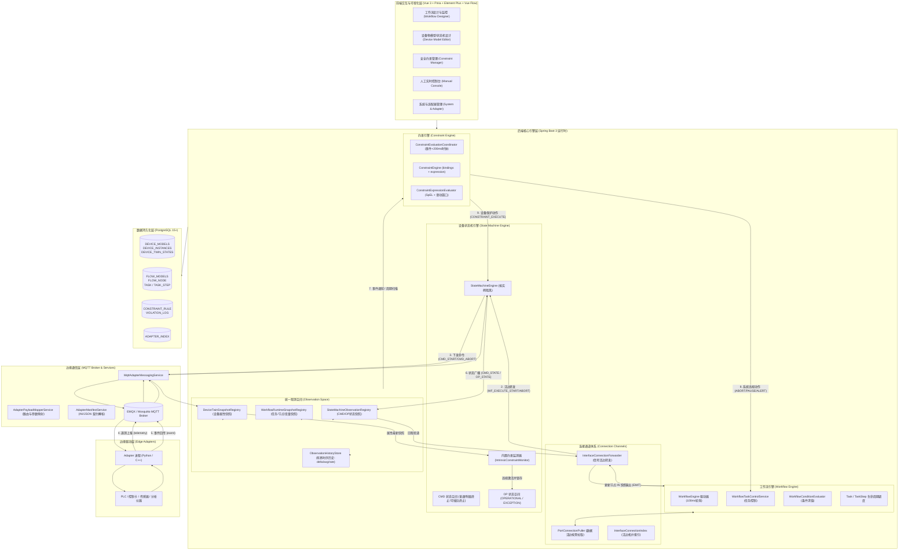
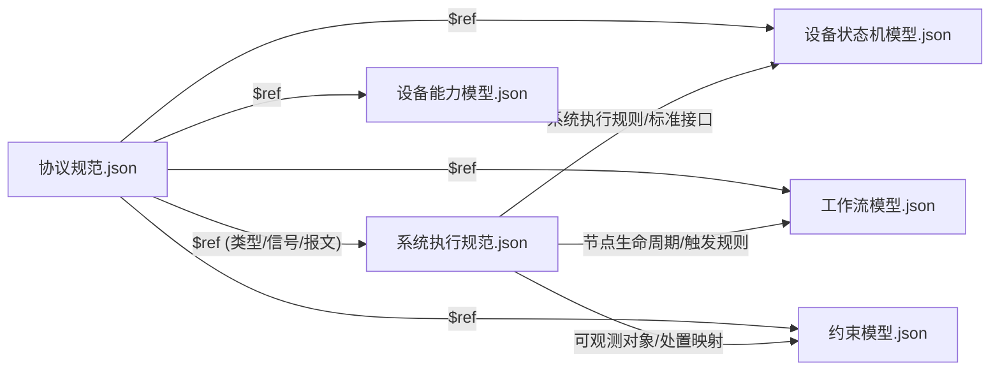
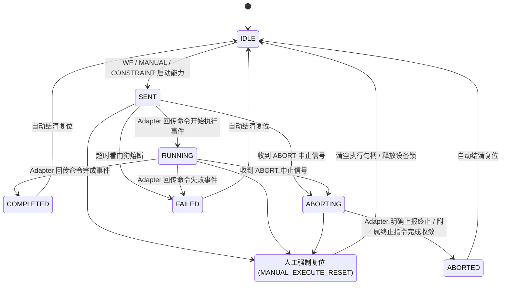
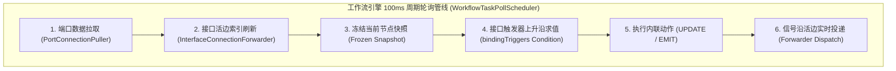
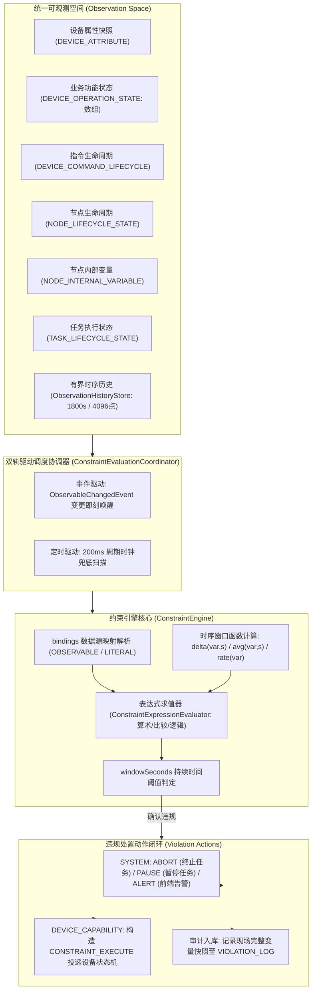
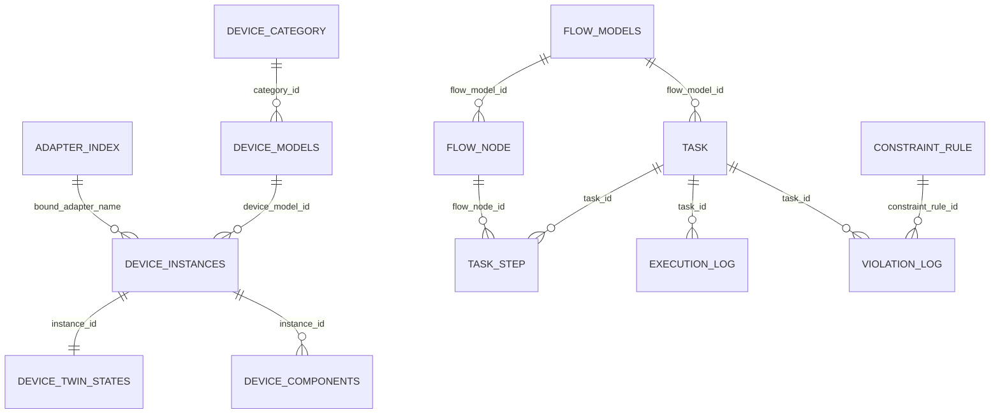

# SmartLab 2.0 智能实验室系统技术架构文档 (v2)

---

## 1. 总体架构概览与核心设计原则

### 1.1 系统定位与核心价值
SmartLab 2.0 是一套面向智能化学/材料实验室、自动化合成与仪器装备联动的**任务导向型可执行建模与运行时控制系统**。系统通过建立物理设备抽象（数字孪生）、灵活的工作流编排、软实时约束监控与安全联锁，以及标准化的边缘 Adapter 接入体系，实现了从实验配方设计到硬件底层执行的全链路闭环控制。

### 1.2 核心架构设计哲学与原则
系统坚持**“统一自洽的内在逻辑体系，杜绝作弊代码与例外特例”**，所有功能与模块均基于顶层形式化规范推导构建：

1. **五大核心支柱与驱动层分工清晰、正交解耦**：
   - **设备状态机引擎（State Machine Engine）**：驱动设备实例数字孪生，管理指令生命周期（CMD 状态空间）与业务功能/异常状态（OP 状态空间），严格按设备实例隔离。
   - **工作流引擎（Workflow Engine）**：负责任务编排与步骤推进，基于 100ms 周期性冻结快照与接口上升沿触发求值驱动。
   - **约束引擎（Constraint Engine）**：纯逻辑旁路计算引擎，不直接侵入各引擎运行时，基于多维可观测对象与时序窗口函数进行安全判定与联动处置。
   - **统一观测空间（Observation Space）**：权威内存快照与有界时序历史存储，解耦数据生产者与消费者，提供纳秒/微秒级只读访问。
   - **连接通道体系（Connection Channels）**：解耦信号控制流与数据流，接口连接（Interface Connection）负责控制信号路由，端口连接（Port Connection）负责数据拓扑拉取。
   - **物理接入 Adapter 驱动层**：基于 `runtime`、`northbound`、`core`、`southbound` 标准四层架构实现软硬件协议转换。
2. **权威内存快照 + 异步持久化隔离**：
   - 所有运行时状态判断、内置约束检测、工作流触发求值与全局约束计算，**绝不直连数据库**，全部在权威内存快照（`ConcurrentHashMap` 结合递增版本号与有界历史）中进行；
   - 数据库（PostgreSQL + JSONB）仅承担静态模型持久化、任务归档、审计追溯与冷启动恢复职责。
3. **闭环生命周期与严密收敛**：
   - 系统中任何指令、任务、节点、异常状态都有严格的开启、推进、异常分支与终态收敛路径，通过全局唯一 `messageId` 形成全链路强追踪闭环。

---

### 1.3 系统全局架构拓扑图



---

## 2. 核心规范体系与模型 JSON Schema

系统所有领域模型通过统一的 JSON Schema（Draft-07）进行形式化描述，由后端 `ProtocolDictionaryService` 统一加载校验，为前后端提供唯一的元数据事实来源。



### 2.1 跨模块协议规范 (`协议规范.json`)
定义跨引擎通信的标准契约：
* **标准数据类型 (`DataType`)**：`INTEGER`、`DOUBLE`、`STRING`、`BOOLEAN`、`JSON`。
* **统一系统信号体系**：
  * `WorkflowNodeSignal`：`ACTIVE`（节点间激活）、`SUBFLOW_COMPLETED`（子流程执行完毕）；
  * `WorkflowControlSignal`：`WF_EXECUTE_START`（携带能力名与参数）、`WF_EXECUTE_ABORT`（不带参数，通过上下文触发附属终止能力）；
  * `ManualControlSignal`：`MANUAL_EXECUTE_START`、`MANUAL_EXECUTE_ABORT`、`MANUAL_EXECUTE_RESET`（人工强制复位状态机）；
  * `ConstraintControlSignal`：`CONSTRAINT_EXECUTE`（携带 `ConstraintExecutePayload`）、`CONSTRAINT_ABORT`；
  * `AdapterOutboundSignal`：`CMD_START`（启动指令）、`CMD_ABORT`（终止指令）；
  * `StatusSignal`：`CMD_STATE`（携带 `CommandStatePayload`）、`OP_STATE`（携带 `OperationStatePayload`）。
* **MQTT Topic 约定与 5 类标准报文格式**：
  * `smartlab/adapter/register` -> `AdapterRegisterRequest`（上报完整原始配置）；
  * `smartlab/adapter/{adapterName}/heartbeat` -> `AdapterHeartbeat`（声明 `ALIVE`）；
  * `smartlab/adapter/{adapterName}/{devicePoint}/command` -> `CommandMessageFormat`（统一携带 `messageId` 下发）；
  * `smartlab/adapter/{adapterName}/{devicePoint}/telemetry` -> `TelemetryMessageFormat`（上报传感器属性字典）；
  * `smartlab/adapter/{adapterName}/{devicePoint}/event` -> `EventMessageFormat`（上报事件并回传 `messageId`）。

### 2.2 设备能力模型 Schema (`设备能力模型.json`)
规范设备静态物模型与物理接入能力：
* **`attributes`**：属性空间（属性名、数据类型、连续/离散 `valueKind`、物理单位 `unit`）；
* **`capabilities`**：对外暴露的操作能力集合：
  * `capabilityName`：能力标识名；
  * `adapterCommandName`：映射的底层命令名；
  * `isAbort`：是否为终止能力（普通能力为 `false`，急停/终止能力为 `true`）；
  * `abortCapabilityName`：普通能力关联的附属终止能力名；
  * `scope`：终止能力的受影响能力范围数组；
  * `parameters` 与 `parameterMapping`：参数定义与映射规则；
* **`adapterContract`**：包含 `commands`（公开参数）、`telemetry`（上报属性及到模型属性的 `attributesMapping`）、`events`（`cmdEvents` 与 `opEvents`）；
* **`intrinsicConstraints`**：设备内置约束（监测属性、比较操作符、阈值及违规激活的 `violationStateName`）。

### 2.3 设备状态机模型 Schema (`设备状态机模型.json`)
规范设备动态状态演变：
* **`interfaces`**：声明 5 类标准化接口（`WORKFLOW`、`STATE`、`ADAPTER`、`CONTROL`、`CONSTRAINT`）及其 `allowedSignals`；
* **`opStateSpace`**：业务状态分区（`OPERATIONAL` 互斥单状态区与 `EXCEPTION` 异常状态集合区）；
* **`cmdLifecycleSpace`**：指令生命周期空间（`IDLE`、`SENT`、`RUNNING`、`COMPLETED`、`FAILED`、`ABORTING`、`ABORTED`）；
* **`transitions`**：声明自定义状态转移（触发接口、触发信号、原状态、目标状态与 `SEND` 动作）。

### 2.4 工作流模型 Schema (`工作流模型.json`)
规范实验编排流程图拓扑：
* **`nodes`**：支持三类正交节点：
  * `devNode`：设备能力节点（具备生命周期，绑定 `deviceModelId` 与具体 `capability`）；
  * `funcNode`：功能控制节点（无生命周期，包含 `START`、`END`、`BRANCH`、`AGGREGATE`，支持 `expression` 赋值计算）；
  * `subflowNode`：子流程节点（具备生命周期，嵌套调用子流程模型）；
* **`interfaceConnections`**：控制信号连线（`NODE_TO_NODE`、`NODE_TO_DEVICE`、`DEVICE_TO_NODE`）；
* **`portConnections`**：数据与物料流动端口连线（`source` OUT 端口 -> `target` IN 端口）。

### 2.5 约束模型 Schema (`约束模型.json`)
规范安全防护与时序监控规则：
* **`observableObjects`**：声明 6 类数据源对象（`DEVICE_ATTRIBUTE`、`DEVICE_OPERATION_STATE`、`DEVICE_COMMAND_LIFECYCLE`、`NODE_LIFECYCLE_STATE`、`NODE_INTERNAL_VARIABLE`、`TASK_LIFECYCLE_STATE`）；
* **`constraints`**：规则集（`expression` 表达式、`bindings` 变量映射、`windowSeconds` 持续防抖时间窗口、`violationActions` 处置动作）。

---

## 3. 设备状态机引擎 (State Machine Engine)

设备状态机引擎（`StateMachineEngine`）是设备控制与数字孪生运行时中枢。



### 3.1 实例隔离与指令调度双轨制
* **严格按设备实例隔离**：所有状态机模型定义由同型号设备共享，但运行时实例（`DeviceStateMachineRuntime`）按 `deviceInstanceId` 分立维护，互不干扰；
* **普通指令（`isAbort=false`）**：
  * 进入普通指令状态机，同一设备实例同时**只允许一个活动普通指令**；
  * 处于 `SENT` / `RUNNING` 时，拒绝新的普通指令进入；
* **附属终止状态机（Attached Abort）**：
  * 当活动普通指令 A 在执行中收到中止信号时，根据 A 定义的 `abortCapabilityName` 解析出终止能力 B；
  * 在 A 执行期间创建附属终止状态机执行 B，B 是一条独立指令，生成全新的 `messageId`；
  * A 进入 `COMPLETED`、`FAILED` 或 `ABORTED` 后，附属终止状态机自动销毁；
* **可插队终止能力（`isAbort=true`）**：
  * 直接执行急停或终止操作时进入可插队的终止状态机；
  * 不受普通指令状态机是否空闲的限制，可立即插队下发；
* **终止作用域收敛机制（`ABORT_SCOPE_DEFAULT_TRANSITION`）**：
  * 终止指令 B 或 C 启动时，记录其 `scope` 声明覆盖的活动普通指令；
  * 当 B 或 C 进入 `COMPLETED` 终态后，对于尚未收到 Adapter 明确终态的匹配普通指令，系统默认将其转为 `ABORTED`，防止指令槽挂死；
* **超时看门狗与人工复位**：
  * 定时扫描处于 `SENT` 超过设定时限（默认 10s）的指令，自动触发 `FAILED` 熔断复位；
  * 控制台发送 `MANUAL_EXECUTE_RESET` 时，强制清空当前指令句柄，复位回 `IDLE` 初始态并广播通知。

### 3.2 双状态空间与内置约束锁存机制
* **CMD 状态空间（指令执行生命周期）**：标准路径 `IDLE` -> `SENT` -> `RUNNING` -> `COMPLETED`；异常路径 `ABORTING` -> `ABORTED`、`FAILED`；
* **OP 状态空间（业务功能与异常状态）**：
  * **`OPERATIONAL` 分区**：互斥单状态区域（有 `initialStateName`），由 Adapter 业务事件驱动普通状态转移整体替换；
  * **`EXCEPTION` 分区**：多活动状态集合区域（初始为空数组），**不声明、不匹配普通状态转移**；
* **内置约束监测器（`IntrinsicConstraintMonitor`）与状态锁存（Latch）**：
  * 监测器按独立周期轮询设备最新属性快照，一次性全量计算所有 `intrinsicConstraints`；
  * 违规时将 `violationStateName` 幂等加入 `EXCEPTION` 状态集合；
  * **锁存机制**：物理条件恢复正常后，异常状态**不会自动移出**；
  * **人工解除流程**：人工发起解除请求时，状态机重新计算关联的所有内置约束，仅当确认全部不再违规时才允许移出，保障绝对安全。

### 3.3 6 大标准化状态机接口
| 接口名称 | 方向 | 接口类型 | 允许通过信号 | 职责说明 |
| :--- | :--- | :--- | :--- | :--- |
| `Interface_workflow_in` | IN | `WORKFLOW` | `WF_EXECUTE_START`, `WF_EXECUTE_ABORT` | 接收工作流引擎发起的能力调用或中止 |
| `Interface_control_in` | IN | `CONTROL` | `MANUAL_EXECUTE_START`, `MANUAL_EXECUTE_ABORT`, `MANUAL_EXECUTE_RESET` | 接收人工控制台的实时干预与强制复位 |
| `Interface_constraint_in` | IN | `CONSTRAINT` | `CONSTRAINT_EXECUTE`, `CONSTRAINT_ABORT` | 接收约束引擎触发的安全联动处置能力 |
| `Interface_adapter_in` | IN | `ADAPTER` | 契约声明的 `cmdEvents` / `opEvents` | 接收底层 Adapter 回传的执行事件与运行事件 |
| `Interface_adapter_out` | OUT | `ADAPTER` | `CMD_START`, `CMD_ABORT` | 向底层 Adapter 下发经过参数注入的标准控制帧 |
| `Interface_state_out` | OUT | `STATE` | `CMD_STATE`, `OP_STATE` | 向外广播指令生命周期与业务/异常状态变更 |

---

## 4. 工作流引擎与连接通道 (Workflow Engine & Connection Channels)

工作流引擎（`WorkflowEngine`）承担任务调度、步骤推进与数据拓扑流转。



### 4.1 核心执行与调度机制
* **静态模型与动态任务分立**：
  * 模型持久化在 `FLOW_MODELS` 与 `FLOW_NODE`；
  * 执行时生成 `TASK` 实例，每个节点的调度产生一条 `TASK_STEP` 记录；
* **三类正交节点调度语义**：
  * **`DEV_NODE`**：具备生命周期（`PENDING` -> `RUNNING` -> `SUCCEEDED` / `FAILED` / `TERMINATED`）。`EMIT` 发送 `WF_EXECUTE_START`，进入等待状态，由状态机回传 `CMD_STATE` 推动完成；
  * **`FUNC_NODE`**：无生命周期。`START` 启动首批节点；`END` 结清主流程或向父流程发送 `SUBFLOW_COMPLETED`；`BRANCH` / `AGGREGATE` 支持时序/算术表达式计算并赋值内部变量；
  * **`SUBFLOW_NODE`**：具备生命周期。递归实例化子流程，维护 `parentStepId` 与递增 `stepDepth`；
* **100ms 冻结快照与上升沿求值**：
  * 每轮轮询开始时，冻结当前节点的接口与变量快照；
  * 接口上的 `bindingTriggers` 对照冻结快照求值；
  * **上升沿触发**：仅当条件由 `false` 变为 `true` 时，执行内联动作 `UPDATE`（更新内部变量/生命周期）或 `EMIT`（发送信号）；
  * 本轮产生的内部变量变更立即持久化，但不对本轮其他触发器可见，保障求值确定性。

### 4.2 连接通道体系（Connection Channels：控制流与数据流正交分离）

```mermaid
flowchart LR
    subgraph NODE_A["源步骤 (Node A: DEV_NODE)"]
        A_PORT_OUT["OUT 端口\n(绑定内部变量 a)"]
        A_IF_OUT["OUT 接口 (Interface_workflow_out)\n(EMIT 发出 ACTIVE)"]
    end

    subgraph NODE_B["目标步骤 (Node B: DEV_NODE)"]
        B_IF_IN["IN 接口 (Interface_workflow_in)\n(接收 ACTIVE 触发求值)"]
        B_PORT_IN["IN 端口\n(写入目标内部变量 b)"]
    end

    A_IF_OUT -- "InterfaceConnection (活边转发: 信号控制流)" --> B_IF_IN
    A_PORT_OUT -. "PortConnection (按需主动拉取: 数据流) ."-> B_PORT_IN
```

#### 1. 接口连接（Interface Connection —— 控制信号流）
* 静态声明在模型中（`NODE_TO_NODE`、`NODE_TO_DEVICE`、`DEVICE_TO_NODE`）；
* 运行时由 `InterfaceConnectionForwarder` 动态实例化为**带 `taskId`、`stepId`、`deviceInstanceId` 的活边（Live Edge）**；
* `EMIT` 产生信号时先写 OUT 快照，Forwarder 沿活边实时转发，不进中间队列；去程信号不含 taskId，回程按占用中的 `DEVICE_TO_NODE` 活边原路写回目标节点的 IN 快照。

#### 2. 端口连接（Port Connection —— 数据流）
* 严格遵循 `OUT -> IN`，用于步骤间的数据传递与物料上下文同步；
* **下游主动拉取机制（`PortConnectionPuller`）**：
  * 仅当下游目标步骤处于活跃状态（`PENDING` / `RUNNING` / `TERMINATING`）时才建立拉取边；
  * 拉取只写入目标端口 `PORT_IN` 快照与目标内部变量，**绝不逆向修改源步骤的变量空间与 `PORT_OUT`**，保障上游终态数据绝对冻结。

### 4.3 任务优雅终止收敛流程 (`taskTerminationProcess`)
当收到任务终止请求或约束引擎触发 `SYSTEM:ABORT` 时，执行标准的 5 步收敛机制：
1. **任务状态标记**：任务服务将 `TASK_STATUS` 更新为 `TERMINATING`；
2. **节点状态收敛**：引擎继续轮询，`PENDING` 节点直接转 `TERMINATED`，`RUNNING` 节点转 `TERMINATING`，设备节点通过模型触发器 `EMIT WF_EXECUTE_ABORT`；
3. **状态机执行中止**：目标设备状态机收到中止信号，将普通指令转入 `ABORTING`，派生附属终止状态机下发 `CMD_ABORT`；
4. **Adapter 终态确认**：Adapter 上报终止事件或终止能力执行完成，状态机将普通指令转为 `ABORTED` 并广播 `CMD_STATE`；
5. **任务最终结清**：设备节点收到 `ABORTED` 转为 `TERMINATED`；当任务内所有活跃步骤全部收敛为终态后，整个任务正式结清为 `TERMINATED`。

---

## 5. 约束引擎与统一可观测空间 (Constraint Engine & Observation Space)

约束引擎负责实验室全局安全联锁、实验工艺窗口监控与异常应急处置。



### 5.1 六类可观测对象的权威内存管理
通过 `ObservableKey` 唯一定位可观测对象，统一实现版本递增、不可变快照访问与时序历史归档：
* `DEVICE_ATTRIBUTE`：设备传感器最新属性；
* `DEVICE_OPERATION_STATE`：设备 OP 业务状态（来自 `OP_STATE`，携带完整活动状态数组）；
* `DEVICE_COMMAND_LIFECYCLE`：设备指令状态（来自 `CMD_STATE`）；
* `NODE_LIFECYCLE_STATE` / `NODE_INTERNAL_VARIABLE` / `TASK_LIFECYCLE_STATE`：工作流运行态。

### 5.2 软实时双轨调度与求值计算
* **双轨调度协调器（`ConstraintEvaluationCoordinator`）**：
  * **事件驱动**：当可观测对象发生变更时抛出 `ObservableChangedEvent`，立即唤醒对应约束的异步求值；
  * **200ms 周期扫描**：定时轮询机制，作为滑动窗口函数与事件遗漏的兜底；
* **表达式求值与时序函数（`ConstraintExpressionEvaluator`）**：
  * 支持算术（`+,-,*,/`）、比较（`>,<,>=,<=,==,!=`）、逻辑（`&&,||,!`）；
  * **内置时序函数**：
    * `delta(var, seconds)`：变量在过去 $N$ 秒内的数值变化量；
    * `avg(var, seconds)`：变量在过去 $N$ 秒内的移动平均值；
    * `rate(var)`：变量的变化速率（单位/秒）；
* **持续时间防抖窗口（`windowSeconds`）**：
  * 表达式必须持续为 `true` 超过设定秒数后才触发违规动作，有效过滤实验过程中的瞬态抖动与毛刺。

### 5.3 违规处置闭环与审计
* **系统级处置（`SYSTEM`）**：
  * `ABORT`：调用任务终止服务，进入 5 步优雅终止流程；
  * `PAUSE`：调用任务服务暂停任务推进；
  * `ALERT`：向 Spring 事件总线发布 `ConstraintAlertEvent`，推送前端告警；
* **设备级保护（`DEVICE_CAPABILITY`）**：
  * 保留指定的能力名与参数，构造 `CONSTRAINT_EXECUTE` 信号投递给目标设备状态机执行安全保护；
* **全量审计日志**：
  * 违规时刻捕获完整的上下文快照、采样值与处置结论，写入 `VIOLATION_LOG`。

---

## 6. Adapter 边缘驱动与通信体系

Adapter 是部署在边缘网关或工控机上的硬件接入代理，充当硬件协议与 SmartLab 规范的翻译桥梁。

```text
       ┌────────────────────────────────────────────────────────┐
       │                   SmartLab 2.0 后端                    │
       └──────────────┬─────────────────────────▲───────────────┘
   MQTT Topic 规范    │ commandTopic            │ telemetryTopic / eventTopic /
                      ▼                         │ registerTopic / heartbeatTopic
       ┌────────────────────────────────────────┴───────────────┐
       │                     MQTT Broker                        │
       └──────────────┬─────────────────────────▲───────────────┘
                      │                         │
       ┌──────────────▼─────────────────────────┴───────────────┐
       │                 Adapter 边缘进程 (Python)               │
       │  ┌──────────────┐  ┌──────────────┐  ┌──────────────┐  │
       │  │northbound.py │  │   core.py    │  │southbound.py │  │
       │  │ (MQTT 通信)  │◄─┼─►(语义转换/状态) ┼─►│ (硬件协议驱动)│  │
       │  └──────────────┘  └──────────────┘  └──────────────┘  │
       │  ┌──────────────────────────────────────────────────┐  │
       │  │ runtime.py (配置加载 / 生命周期 / 看门狗 / 异常退出) │  │
       │  └──────────────────────────────────────────────────┘  │
       └────────────────────────┬───────────────────────────────┘
                                │ Modbus-TCP / 串口 / 厂商 SDK / TCP
       ┌────────────────────────▼───────────────────────────────┐
       │                 PLC / 仪器装备 / 物理反应釜             │
       └────────────────────────────────────────────────────────┘
```

### 6.1 Adapter 四层标准架构
1. **`runtime.py`**：进程生命周期管理、配置文件加载校验、启动/停止编排与看门狗心跳；
2. **`northbound.py`**：负责 MQTT Broker 连接、订阅系统主题、解析标准信封与发布遥测/事件/心跳；**禁止包含硬件协议与寄存器逻辑**；
3. **`core.py` (或 `core/`)**：负责系统命令到设备操作的语义翻译、参数校验、命令状态跟踪与安全联锁；**禁止直接发起网络 I/O**；
4. **`southbound.py` (或 `southbound/`)**：负责 Modbus、串口、TCP、DLL 或厂商 SDK 的具体物理通信；**禁止包含 SmartLab 协议格式**。

### 6.2 配置文件划分与 `internal` 注入机制
* **`adapterconfig.ini`（或对应 JSON）—— 对外暴露的能力契约**：
  * 声明 Adapter 名称、设备模板、支持的属性、下发命令、公开参数、内部参数映射及事件；
  * Adapter 启动注册时读取其完整原文作为 `rawConfigContent` 上传给系统；
* **`setup.ini` —— 本地私有部署配置**：
  * 包含 MQTT Broker 地址、账号密钥、设备串口号/IP、轮询周期、日志级别；**严禁随注册报文上传**；
* **`internal=true` 参数与源字段注入**：
  * 内部参数（如 Modbus 站号 `stationId`、通道号 `channel`、点位索引 `index`）在生成前端物模型时自动剔除；
  * 系统下发指令时仅包含业务参数，Adapter `core` 模块根据目标 `devicePoint` 从本地配置中提取 `sourceField` 并注入到底层硬件控制帧。

### 6.3 MQTT 通信主题规约
| 主题路径模板 | 发布方 -> 订阅方 | 载荷 Schema 契约 | 核心用途 |
| :--- | :--- | :--- | :--- |
| `smartlab/adapter/register` | Adapter -> 系统 | `AdapterRegisterRequest` | 适配器上线动态注册，提交完整能力配置 |
| `smartlab/adapter/{adapterName}/heartbeat` | Adapter -> 系统 | `AdapterHeartbeat` | 周期性心跳报文（`ALIVE`），超时判定离线 |
| `smartlab/adapter/{adapterName}/{devicePoint}/command` | 系统 -> Adapter | `CommandMessageFormat` | 系统下发普通指令或终止指令（携带 `messageId`） |
| `smartlab/adapter/{adapterName}/{devicePoint}/telemetry` | Adapter -> 系统 | `TelemetryMessageFormat` | 周期性上报传感器遥测数据 |
| `smartlab/adapter/{adapterName}/{devicePoint}/event` | Adapter -> 系统 | `EventMessageFormat` | 回传指令生命周期事件与运行状态事件（回传 `messageId`） |

---

## 7. 数据库持久化结构与映射设计

后端基于 PostgreSQL，广泛使用 `JSONB` 存储复杂模型树，兼具强类型表结构与模式扩展性。



### 7.1 核心数据表结构说明

#### 1. 资源与设备模型表
* **`DEVICE_MODELS`**：设备物模型定义。
  * `model_name` (VARCHAR), `category_id` (BIGINT)
  * `attributes` (JSONB)：属性定义列表（名称、类型、连续/离散、单位）；
  * `capabilities` (JSONB)：能力集合、终止能力绑定与参数映射；
  * `adapter_contract` (JSONB)：Adapter 契约（命令、遥测映射、事件）；
  * `state_machine_interfaces` (JSONB)：5 类接口及 allowedSignals；
  * `op_state` / `cmd_state` / `state_transitions` (JSONB)：双状态空间与转移规则；
  * `intrinsic_constraint` (JSONB)：设备内置硬约束规则；
* **`DEVICE_INSTANCES`**：物理设备实例。
  * `instance_name` (VARCHAR), `device_model_id` (BIGINT)
  * `bound_adapter_name` (VARCHAR), `bound_device_point` (VARCHAR)
  * `lifecycle_status` (VARCHAR: `IN_USE` / `RETIRED`)
  * `instance_config` (JSONB)：点位专属配置；
* **`DEVICE_TWIN_STATES`**：数字孪生实时持久化镜像。
  * `instance_id` (BIGINT)
  * `current_cmd_state` (VARCHAR)：最新指令状态（`IDLE`、`RUNNING` 等）；
  * `current_op_state` (JSONB)：各 OP 分区当前活动状态数组；
  * `current_attr` (JSONB)：最新传感器属性字典快照；
  * `online_status` (VARCHAR), `last_online_time` (TIMESTAMP)；

#### 2. 工作流与任务执行表
* **`FLOW_MODELS`**：工作流模型定义。
  * `flow_name` (VARCHAR), `version` (INT), `status` (VARCHAR)
  * `nodes` (JSONB)：节点引用列表；
  * `interface_connection` (JSONB)：接口信号连接关系；
  * `port_connection` (JSONB)：数据端口连接关系；
* **`FLOW_NODE`**：流程节点静态配置。
  * `flow_model_id` (BIGINT), `node_type` (VARCHAR: `DEV_NODE` / `FUNC_NODE` / `SUBFLOW_NODE`)
  * `capability` (JSONB)：绑定的能力配置与参数表达式；
  * `in_variables` (JSONB)：节点私有内部变量空间及初始值；
  * `lifecycle` (JSONB), `interfaces` (JSONB), `ports` (JSONB), `actions` (JSONB)；
* **`TASK`**：任务执行实例。
  * `task_name` (VARCHAR), `flow_model_id` (BIGINT), `task_status` (VARCHAR)
  * `resource_map` (JSONB)：节点到具体物理 `deviceInstanceId` 的资源绑定映射；
  * `task_variables` (JSONB)：任务全局变量空间；
  * `task_constraints` (JSONB)：任务启动时锁定的约束快照；
* **`TASK_STEP`**：节点单次执行明细。
  * `task_id` (BIGINT), `flow_node_id` (BIGINT), `node_status` (VARCHAR)
  * `parent_step_id` (BIGINT), `step_depth` (INT)
  * `interface_in_snapshot` (JSONB)：输入接口快照（包含下发 `messageId`）；
  * `interface_out_snapshot` (JSONB)：输出接口快照；
  * `variable_space` (JSONB)：私有变量运行时上下文；

#### 3. 约束与审计表
* **`CONSTRAINT_RULE`**：全局安全约束规则。
  * `rule_name` (VARCHAR), `expression` (VARCHAR)
  * `bindings` (JSONB)：数据源映射关系；
  * `window_seconds` (INT)：持续时间阈值；
  * `violation_actions` (JSONB)：违规处置动作列表；
  * `is_enabled` (BOOLEAN)：是否启用；
* **`VIOLATION_LOG`**：违规处置审计日志。
  * `constraint_rule_id` (BIGINT), `constraint_type` (VARCHAR)
  * `task_id` (BIGINT), `task_step_id` (BIGINT), `device_instance_id` (BIGINT)
  * `observed_variable` (JSONB)：监测变量元数据；
  * `actual_value` (JSONB)：违规采样值；
  * `variable_snapshot` (JSONB)：违规时全量环境上下文快照；
  * `action_taken` (VARCHAR)：实际采取的处置措施；
* **`ADAPTER_INDEX`**：适配器注册中心。
  * `adapter_name` (VARCHAR), `status` (VARCHAR), `last_heartbeat` (TIMESTAMP)
  * `original_config` (TEXT)：原始 INI / JSON 配置文件文本；
  * `parsed_config` (JSONB)：后端解析校验后的结构化 manifest 树。

---

## 8. 技术架构总结与后续优化方向

### 8.1 架构核心优势
1. **闭环自洽**：全链路采用 `messageId` 追踪与双状态空间，杜绝指令丢失与状态不一致；
2. **多层安全防线**：结合设备内置约束锁存（局部物理级）与全局约束引擎（多维系统级），全方位保障实验室自动化安全；
3. **高内聚正交性**：信号流（Interface Connection）与数据流（Port Connection）彻底解耦，引擎间通过只读快照与事件驱动交互，避免紧密耦合。

### 8.2 当前阶段（整体优化期）主要聚焦领域
1. **UI 交互与全生命周期可视化**：
   * 工作流设计器（Vue Flow）活边连接渲染、端口连线校验与多层嵌套子流程平滑展开；
   * 人工控制台设备状态机双状态空间（CMD + OP）动态仪表盘与异常锁存解除交互；
   * 实时运行任务的单步甘特图、变量空间热重载查看与现场快照回溯；
2. **业务实现与极端场景闭环**：
   * 复杂实验室分支/汇聚业务流程与异常自动熔断处置联动；
   * 边缘 Adapter 离线重连、心跳恢复与批量设备点位自动重新注册流水线优化。
