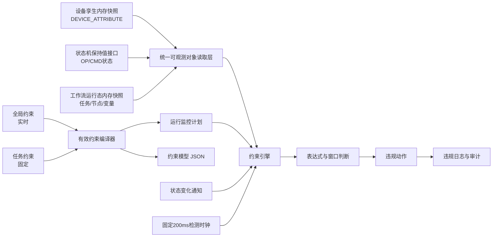

# SmartLab 约束管理与约束引擎优化方案

## 1. 文档目的

本文档用于明确 SmartLab 约束相关功能的目标架构、业务边界、运行机制、接口设计、实施步骤和验收标准。

本方案重点解决以下问题：

1. 全局约束与任务约束的生命周期如何划分。
2. `observableObjects` 的真实数据应由谁维护、如何读取。
3. 约束引擎如何以固定 200ms 周期主动检测。
4. 状态变化通知如何与主动检测协同。
5. 如何避免约束引擎依赖遥测消息或其他引擎的内部事件载荷。
6. 如何保证导出的约束模型与实际运行模型一致。
7. 如何实现规则实时更新、任务规则固定、状态失效、审计和故障恢复。

---

## 2. 术语约定

本文档严格区分以下概念。

### 2.1 后端内存快照

“后端快照”专指运行在 Java 后端进程内存中的当前状态，例如：

```java
ConcurrentHashMap<Long, DeviceTwinSnapshot>
```

它承担实时读取职责，是约束引擎每 200ms 主动检测时的数据来源。

### 2.2 数据库持久化状态

数据库中的 `DEVICE_TWIN_STATES`、`TASK`、`TASK_STEP` 等表只负责：

- 重启恢复；
- 持久化；
- 页面查询；
- 历史审计；
- 故障排查。

数据库不进入约束引擎 200ms 实时求值的主链路。

### 2.3 状态接口

状态接口不是只发送一次就消失的瞬时消息，而是具有保持值的接口：

- 状态变化时发送变化信号；
- 当前状态持续保存在所属引擎内存中；
- 其他引擎可以随时查询；
- 直到下一次状态变化，接口当前值保持不变。

### 2.4 变化通知

变化通知只表示“某个可观测对象可能发生了变化”，不作为约束求值的最终事实。

约束引擎收到通知后，必须通过对应状态接口重新读取权威内存快照。

### 2.5 软实时

固定 200ms 检测周期属于后端软实时：

- 正常情况下，变化会在 0～200ms 内被主动检测；
- 加上表达式计算和动作执行后，实际响应时间略高于 200ms；
- PLC、设备控制器等硬实时安全保护不应由后端约束引擎替代。

---

## 3. 已确定的业务原则

### 3.1 约束来源只有两类

有效约束模型只包含：

1. 当前启用的全局约束；
2. 当前任务的任务级约束。

设备模型的内置约束不纳入任务有效约束模型，也不参与该模型的导出。

### 3.2 全局约束实时变化

全局约束保存在 `CONSTRAINT_RULE` 表中。

运行中的任务始终使用当前启用的全局规则：

- 新建规则后生效；
- 编辑规则后使用新版本；
- 停用规则后停止执行；
- 重新启用后重新建立运行状态；
- 删除后从运行计划中移除。

### 3.3 任务约束启动后固定

任务约束保存在：

```text
TASK.TASK_CONSTRAINTS
```

任务约束在任务创建时保存，在任务启动前再次校验。

任务启动后：

- 不允许修改；
- 不跟随全局规则变化；
- 作为当前任务的固定规则快照使用。

### 3.4 管理态按单条规则保存

数据库不直接保存完整约束模型，而是保存单条 `ConstraintRule`。

完整约束模型在需要运行、预览或导出时实时编译：

```json
{
  "observableObjects": [],
  "constraints": []
}
```

### 3.5 导出模型实时合并

任务完整模型导出时：

```text
当前启用的全局约束 + TASK.TASK_CONSTRAINTS
```

全局约束采用导出时的最新状态，任务约束采用任务固定快照。

---

## 4. 总体目标架构



总体原则：

> 其他引擎维护自己的权威内存状态，约束引擎通过只读接口主动读取；变化通知只负责降低延迟，固定 200ms 检测负责保证最终发现。

---

## 5. 六类 observableObjects 的权威来源

当前约束模型支持六类可观测对象。

| sourceType | 含义 | 权威内存来源 | 读取方式 |
|---|---|---|---|
| `DEVICE_ATTRIBUTE` | 设备属性 | 设备孪生内存快照 | 按设备实例和属性名读取 |
| `DEVICE_OPERATION_STATE` | 设备业务状态 | 状态机保持值接口 | 按设备实例和状态分区读取 |
| `DEVICE_COMMAND_LIFECYCLE` | 设备指令生命周期 | 状态机保持值接口 | 读取设备当前 CMD 状态 |
| `NODE_LIFECYCLE_STATE` | 工作流节点状态 | 工作流运行态内存快照 | 按任务、流程和节点读取 |
| `NODE_INTERNAL_VARIABLE` | 节点内部变量 | 工作流运行态内存快照 | 按任务、节点和变量名读取 |
| `TASK_LIFECYCLE_STATE` | 任务整体状态 | 工作流运行态内存快照 | 按任务读取 |

六类对象统一具有以下运行语义：

1. 当前值持续保留；
2. 变化时修订号递增；
3. 变化时发送轻量通知；
4. 约束引擎可以随时主动读取；
5. 读取结果包含值、数据时间、修订号和可用状态。

---

## 6. 统一运行态数据结构

### 6.1 ObservableKey

`ObservableKey` 唯一标识一个可观测对象。

```java
public record ObservableKey(
        ObservableObjectType sourceType,
        Long deviceInstanceId,
        Long workflowTemplateId,
        Long taskId,
        String regionName,
        String nodeName,
        String targetName,
        String variableName
) {
}
```

不同类型只使用与自身相关的字段。

示例：

```text
DEVICE_ATTRIBUTE:18:temperature
DEVICE_OPERATION_STATE:18:HeatingRegion
DEVICE_COMMAND_LIFECYCLE:18
NODE_LIFECYCLE_STATE:1024:workflow-3:HeatNode
NODE_INTERNAL_VARIABLE:1024:workflow-3:HeatNode:temperature
TASK_LIFECYCLE_STATE:1024
```

### 6.2 ObservationSnapshot

所有状态接口统一返回：

```java
public record ObservationSnapshot(
        ObservableKey key,
        JsonNode value,
        Instant observedAt,
        Instant updatedAt,
        long revision,
        ObservationStatus status
) {
}
```

`ObservationStatus`：

```java
public enum ObservationStatus {
    VALID,
    STALE,
    UNAVAILABLE
}
```

字段语义：

- `value`：当前保持值；
- `observedAt`：真实数据产生时间；
- `updatedAt`：后端内存快照更新时间；
- `revision`：状态每次变化后递增；
- `status`：当前值是否可以参与约束求值。

### 6.3 不返回可变内部对象

状态接口不能把内部可变 `JsonNode` 直接暴露给约束引擎。

应返回：

- 不可变数据结构；
- 或 `deepCopy()`；
- 或原子替换后的不可变快照引用。

避免约束引擎意外修改其他引擎的运行状态。

---

## 7. 设备孪生内存快照

### 7.1 当前问题

数据库中已有：

```text
DEVICE_TWIN_STATES
```

其中保存：

- `current_attr`
- `current_op_state`
- `current_cmd_state`
- `online_status`
- `last_online_time`
- `update_time`

但这只是数据库持久化状态。

当前没有统一的、专门供约束引擎高频读取的设备孪生内存快照。

### 7.2 新增 DeviceTwinSnapshotRegistry

新增：

```java
@Service
public class DeviceTwinSnapshotRegistry {

    private final ConcurrentHashMap<Long, AtomicReference<DeviceTwinSnapshot>> snapshots
            = new ConcurrentHashMap<>();
}
```

快照结构：

```java
public record DeviceTwinSnapshot(
        Long deviceInstanceId,
        JsonNode attributes,
        String onlineStatus,
        Instant observedAt,
        Instant updatedAt,
        long revision,
        SnapshotOrigin origin
) {
}
```

设备孪生内存快照只作为 `DEVICE_ATTRIBUTE` 的权威来源。

OP 和 CMD 状态的权威来源仍然是状态机，不因数据库中存在相同投影字段而改变。

### 7.3 更新接口

```java
public DeviceTwinSnapshot updateAttributes(
        Long deviceInstanceId,
        ObjectNode changedAttributes,
        Instant observedAt
);

public DeviceTwinSnapshot updateOnlineStatus(
        Long deviceInstanceId,
        String onlineStatus,
        Instant observedAt
);

public DeviceTwinSnapshot snapshot(Long deviceInstanceId);

public Map<Long, DeviceTwinSnapshot> snapshotBatch(Collection<Long> deviceInstanceIds);
```

### 7.4 更新顺序

遥测处理流程调整为：

```text
Adapter原始数据
    ↓
协议映射与数据类型校验
    ↓
原子更新DeviceTwinSnapshotRegistry
    ↓
发布DeviceTwinSnapshotChangedEvent
    ↓
持久化到DEVICE_TWIN_STATES和数据记录
```

约束引擎读取内存快照，不读取遥测事件载荷。

### 7.5 并发更新

一个设备的多个属性必须原子合并，不能用整个对象的无锁覆盖造成属性丢失。

推荐：

- 每个设备使用 `AtomicReference<DeviceTwinSnapshot>`；
- 使用 CAS 循环合并属性；
- 或使用按设备粒度的锁；
- 更新成功后再递增 `revision`；
- 发布通知时携带更新后的 `revision`。

### 7.6 启动恢复

后端启动时可以从 `DEVICE_TWIN_STATES` 批量加载最后状态，但必须标记为：

```text
STALE / RECOVERED
```

只有收到真实设备数据后，才更新为：

```text
VALID
```

避免后端重启后直接使用过期数据库值触发设备动作。

---

## 8. 状态机保持值接口

### 8.1 保持值语义

状态机的输出接口应同时具有：

1. 当前状态值；
2. 状态修订号；
3. 最后变化时间；
4. 状态变化信号。

变化信号是边沿通知，当前状态是持续保持值。

### 8.2 当前可复用基础

现有状态机已经维护：

- `deviceRuntimes`
- `interfaceSignalTable`

并提供：

```java
interfaceSignalSnapshot()
```

但不建议约束引擎直接读取完整内部 Map。

应新增明确的只读边界。

### 8.3 StateMachineObservationPort

```java
public interface StateMachineObservationPort {

    ObservationSnapshot readOperationState(
            Long deviceInstanceId,
            String regionName
    );

    ObservationSnapshot readCommandLifecycle(
            Long deviceInstanceId
    );

    Map<ObservableKey, ObservationSnapshot> readBatch(
            Collection<ObservableKey> keys
    );
}
```

状态机内部负责：

- 将 OP 状态一直保留到下一次 OP 转移；
- 将 CMD 状态一直保留到下一次 CMD 转移；
- 状态改变后递增修订号；
- 更新保持值后再发布变化信号。

### 8.4 状态变化通知

```java
public record StateMachineObservationChangedEvent(
        ObservableKey key,
        long revision
) {
}
```

通知不应携带并要求约束引擎直接信任完整状态内容。

约束引擎收到通知后，通过 `StateMachineObservationPort` 重新读取。

---

## 9. 工作流运行态内存快照

### 9.1 当前问题

当前节点状态、节点变量和任务状态主要保存在：

- `TASK`
- `TASK_STEP`
- `TASK_STEP.variableSpace`

工作流模块会发布包含完整状态内容的事件，当前约束引擎直接使用事件载荷。

目标方案中，事件载荷不再作为约束事实。

### 9.2 新增 WorkflowRuntimeSnapshotRegistry

```java
@Service
public class WorkflowRuntimeSnapshotRegistry {

    private final ConcurrentHashMap<Long, TaskRuntimeSnapshot> tasks
            = new ConcurrentHashMap<>();
}
```

任务运行态：

```java
public record TaskRuntimeSnapshot(
        Long taskId,
        String taskState,
        Map<NodeRuntimeKey, NodeRuntimeSnapshot> nodes,
        Instant updatedAt,
        long revision
) {
}
```

节点运行态：

```java
public record NodeRuntimeSnapshot(
        Long taskStepId,
        Long workflowTemplateId,
        String nodeName,
        String nodeState,
        JsonNode variableSpace,
        Instant updatedAt,
        long revision
) {
}
```

### 9.3 WorkflowObservationPort

```java
public interface WorkflowObservationPort {

    ObservationSnapshot readTaskLifecycle(Long taskId);

    ObservationSnapshot readNodeLifecycle(
            Long taskId,
            Long workflowTemplateId,
            String nodeName
    );

    ObservationSnapshot readNodeVariable(
            Long taskId,
            Long workflowTemplateId,
            String nodeName,
            String variableName
    );

    Map<ObservableKey, ObservationSnapshot> readBatch(
            Collection<ObservableKey> keys
    );
}
```

### 9.4 更新时机

以下操作必须同步更新工作流内存快照：

- 任务创建；
- 任务启动、暂停、恢复、终止、成功、失败；
- 节点创建；
- 节点进入运行态；
- 节点完成、失败、终止；
- 节点变量空间发生变化。

更新顺序：

```text
工作流状态完成原子变更
    ↓
更新WorkflowRuntimeSnapshotRegistry
    ↓
递增revision
    ↓
发布轻量变化通知
    ↓
数据库持久化或事务提交
```

对于必须保证事务一致性的状态，可以在事务提交后更新内存快照并发布通知。

### 9.5 任务结束后的清理

任务结束后不能立即删除内存快照，应设置短暂保留期，例如：

```text
5分钟
```

用途：

- 处理延迟到达的状态变化；
- 完成最后一轮约束求值；
- 支持任务详情短期实时查看；
- 避免终止动作与状态清理竞争。

---

## 10. 可观测对象读取层

### 10.1 统一 Provider 接口

```java
public interface ObservableSnapshotProvider {

    Set<ObservableObjectType> supportedTypes();

    Map<ObservableKey, ObservationSnapshot> readBatch(
            Collection<ObservableKey> keys
    );
}
```

实现：

```text
DeviceTwinObservableProvider
StateMachineObservableProvider
WorkflowObservableProvider
```

### 10.2 ObservableSnapshotService

```java
@Service
public class ObservableSnapshotService {

    private final Map<ObservableObjectType, ObservableSnapshotProvider> providers;

    public Map<ObservableKey, ObservationSnapshot> readBatch(
            Collection<ObservableKey> keys
    ) {
        // 按sourceType分组
        // 分发到对应provider
        // 合并结果
    }
}
```

约束引擎只依赖 `ObservableSnapshotService`。

它不应依赖：

- `DeviceTwinStatesMapper`
- `TaskMapper`
- `TaskStepMapper`
- 遥测事件完整载荷
- 工作流节点事件完整载荷
- 状态机内部 Map

---

## 11. 有效约束模型编译

### 11.1 统一编译入口

建立统一编译服务：

```java
EffectiveConstraintModelCompiler
```

输入：

- 当前启用的全局规则；
- 当前任务固定规则；
- 当前规则修订号；
- 任务约束快照修订号。

输出：

1. 标准约束模型 JSON；
2. 约束运行监控计划；
3. 模型修订号；
4. 模型哈希。

### 11.2 输出模型

```java
public record EffectiveConstraintModel(
        long modelRevision,
        String modelHash,
        JsonNode jsonModel,
        ConstraintMonitoringPlan monitoringPlan
) {
}
```

### 11.3 导出与运行必须同源

目标链路：

```text
CONSTRAINT_RULE + TASK.TASK_CONSTRAINTS
                 ↓
EffectiveConstraintModelCompiler
                 ├──→ JSON下载
                 └──→ 约束引擎运行计划
```

禁止形成：

```text
一套逻辑用于导出
另一套逻辑用于运行
```

### 11.4 observableObjects 去重

多个规则引用相同数据源时，只生成一个 `ObservableKey`。

例如：

```text
规则1：设备18.temperature
规则2：设备18.temperature
规则3：设备18.pressure
```

监控计划中只有：

```text
设备18.temperature
设备18.pressure
```

同一个观测值供多条规则复用。

---

## 12. ConstraintMonitoringPlan

```java
public record ConstraintMonitoringPlan(
        long revision,
        String modelHash,
        Map<ObservableKey, ObservableDefinition> observables,
        Map<ObservableKey, Set<RuntimeConstraintKey>> dependentRules,
        Map<RuntimeConstraintKey, RuntimeConstraint> constraints
) {
}
```

`RuntimeConstraintKey`：

```java
public record RuntimeConstraintKey(
        Long ruleId,
        long ruleRevision,
        Long taskId,
        Integer taskRuleIndex,
        String scopeKey
) {
}
```

`RuntimeConstraint`：

```java
public record RuntimeConstraint(
        RuntimeConstraintKey key,
        CompiledExpression expression,
        Map<String, RuntimeBinding> bindings,
        Integer windowSeconds,
        List<ViolationAction> actions
) {
}
```

编译阶段完成：

- 表达式语法解析；
- 变量绑定解析；
- 数据类型检查；
- observable 去重；
- 规则依赖索引；
- 作用域计算；
- 动作规范化。

200ms 求值阶段不再重复解析规则结构。

---

## 13. 固定 200ms 主动检测

### 13.1 固定周期

约束引擎统一采用：

```text
200ms
```

即每秒最多执行 5 个检测周期。

### 13.2 推荐调度结构

建议使用单线程协调器，而不是允许多个 `@Scheduled` 调用并发进入求值逻辑。

```java
@Service
public class ConstraintEvaluationCoordinator {

    private final ScheduledExecutorService timer;
    private final ExecutorService worker;
    private final AtomicBoolean evaluationRequested = new AtomicBoolean();
    private final Set<ObservableKey> dirtyKeys = ConcurrentHashMap.newKeySet();
}
```

定时器每 200ms 请求一次检测：

```java
timer.scheduleAtFixedRate(
        this::requestPeriodicEvaluation,
        0,
        200,
        TimeUnit.MILLISECONDS
);
```

实际求值只在一个工作线程中串行执行。

### 13.3 防止任务堆积

如果一轮求值超过 200ms：

- 不创建无限排队任务；
- 将多个请求合并为一次；
- 下一轮读取最新快照；
- 保证队列长度有界。

不能出现：

```text
第1轮未完成
第2轮排队
第3轮继续排队
最终延迟越来越大
```

### 13.4 每轮检测流程

```text
1. 原子读取当前ConstraintMonitoringPlan
2. 获取去重后的ObservableKey集合
3. 按Provider批量读取内存快照
4. 比较revision，识别变化值
5. 更新约束引擎观测缓存
6. 更新历史时间序列
7. 找出依赖变化值的规则
8. 加入正在等待windowSeconds的规则
9. 求值
10. 执行违规动作
11. 写入违规日志
```

### 13.5 没有变化时的行为

如果某个 observable 的 `revision` 没变：

- 不重复写入历史序列；
- 不重复判断普通瞬时规则；
- 但仍需检查已经进入 `windowSeconds` 计时的规则。

这样可以降低固定 200ms 扫描的计算压力。

---

## 14. 状态变化通知

### 14.1 通知结构

```java
public record ObservableChangedEvent(
        ObservableKey key,
        long revision,
        Instant changedAt
) {
}
```

### 14.2 通知处理

约束引擎收到通知后：

1. 将 `key` 放入 `dirtyKeys`；
2. 请求协调器立即执行一次检测；
3. 协调器合并短时间内的多个通知；
4. 通过 Provider 重新读取真实内存快照；
5. 判断依赖该 observable 的规则。

### 14.3 通知不是唯一触发源

即使通知丢失：

- 下一轮 200ms 主动读取仍会发现修订号变化；
- 因此通知丢失不会永久漏检。

最终语义：

```text
变化通知保证低延迟
200ms主动检测保证不遗漏
内存状态接口保证真实性
```

---

## 15. 约束引擎内部观测缓存

约束引擎可以维护自己的只读求值缓存：

```java
ConcurrentHashMap<ObservableKey, ObservationState>
```

```java
public final class ObservationState {
    private ObservationSnapshot current;
    private final Deque<TimedObservation> history;
}
```

该缓存不是权威状态，只服务于：

- 当前表达式求值；
- `delta`；
- `avg`；
- `rate`；
- 变量快照记录。

权威值仍然来自其他引擎的状态接口。

---

## 16. 历史函数

### 16.1 历史条目

```java
public record TimedObservation(
        Instant observedAt,
        long revision,
        JsonNode value
) {
}
```

只有以下情况才追加：

- `revision` 变化；
- 状态从不可用恢复为可用；
- 数据源明确产生了新的观测时间。

### 16.2 历史清理

同时按两种条件清理：

1. 最大时间范围；
2. 最大条目数量。

例如：

```text
最多保留30分钟
且最多保留4096条
```

### 16.3 时间语义

历史函数使用 `observedAt`，不使用约束引擎读取时间。

持续违规 `windowSeconds` 可以使用单调时钟计算，避免系统时间调整造成计时错误。

---

## 17. 表达式求值

每条规则在编译时生成 `CompiledExpression`。

求值前必须满足：

- 所有 `OBSERVABLE` 绑定值均为 `VALID`；
- 所有必需变量均存在；
- 数据类型符合规则；
- 数据没有超过允许的新鲜度；
- 作用域匹配。

表达式返回：

```text
true = 违规
false = 正常
```

对于 `STALE` 或 `UNAVAILABLE`：

- 默认不执行违规动作；
- 记录诊断信息；
- 后续可扩展专门的“数据不可用约束”。

---

## 18. windowSeconds 与触发锁

每个运行规则实例保存：

```java
public final class ConstraintRuntimeState {
    private long ruleRevision;
    private Instant trueSince;
    private boolean triggered;
    private Instant lastEvaluatedAt;
}
```

状态变化：

```text
false
  ↓
清除trueSince和triggered

第一次true
  ↓
记录trueSince

持续true但未达到windowSeconds
  ↓
继续等待

达到windowSeconds
  ↓
执行一次动作，triggered=true

持续true
  ↓
不重复触发

恢复false
  ↓
允许下一次违规周期重新触发
```

运行状态键必须包含 `ruleRevision`，避免规则编辑后复用旧触发状态。

---

## 19. 全局规则实时更新

### 19.1 规则变化事件

全局规则发生以下操作后发布：

```java
ConstraintRuleChangedEvent
```

覆盖：

- 创建；
- 编辑；
- 启用；
- 停用；
- 删除。

### 19.2 更新流程

```text
规则保存成功
    ↓
globalRuleRevision递增
    ↓
重新编译受影响的监控计划
    ↓
原子替换当前计划
    ↓
清理旧ruleId + ruleRevision对应运行状态
    ↓
请求立即求值
```

### 19.3 原子计划替换

使用：

```java
AtomicReference<ConstraintMonitoringPlan>
```

一轮求值只能看到完整旧计划或完整新计划，不能看到编译到一半的计划。

---

## 20. 任务约束生命周期

### 20.1 创建任务

创建任务时：

- 校验表达式；
- 校验任务绑定设备；
- 校验工作流节点；
- 校验动作目标；
- 规范化 `TASK_CONSTRAINTS`；
- 保存任务约束快照。

### 20.2 启动任务

启动任务时：

- 再次校验资源和约束；
- 生成任务约束快照哈希；
- 将任务规则加入运行监控计划；
- 任务进入 `RUNNING`。

### 20.3 启动后禁止修改

所有任务约束更新接口必须检查：

```text
TASK_STATUS == PENDING
```

非 `PENDING` 状态拒绝更新。

不能只依靠前端隐藏编辑按钮。

### 20.4 任务结束

任务进入终态后：

- 从活动运行计划中移除任务规则；
- 清理任务规则运行状态；
- 保留短期任务运行态快照；
- 不影响全局约束继续运行。

---

## 21. 违规动作

继续支持：

### 21.1 SYSTEM

```text
ABORT
PAUSE
ALERT
```

### 21.2 DEVICE_CAPABILITY

通过状态机约束接口执行：

```text
CONSTRAINT_EXECUTE
CONSTRAINT_ABORT
```

约束引擎不直接向 Adapter 发送设备命令。

### 21.3 动作幂等

建议动作幂等键：

```text
modelRevision
+ runtimeConstraintKey
+ scopeKey
+ violationCycleId
+ actionIndex
```

避免：

- 后端重启后重复执行；
- 同一轮多次通知重复执行；
- 200ms主动检测与即时通知同时触发相同动作。

---

## 22. 违规日志与审计

违规日志建议增加：

```text
rule_revision
effective_model_revision
effective_model_hash
violation_cycle_id
observation_revisions
rule_snapshot
detection_time
observed_time
```

每次违规至少记录：

- 使用的规则版本；
- 使用的有效模型版本；
- 表达式；
- 当前变量值；
- 每个变量的数据产生时间；
- 每个变量的修订号；
- 执行动作；
- 动作结果；
- 任务、节点和设备作用域。

全局规则后来被编辑或删除后，仍然可以还原历史违规依据。

违规日志外部接口应只读：

- 查询；
- 分页；
- 导出。

创建、编辑和删除不应作为公开管理接口。

---

## 23. 导出功能

### 23.1 约束管理页面

只管理全局约束：

- 查询；
- 创建；
- 编辑；
- 启停；
- 删除；
- 导出当前启用的全局约束模型。

不在该页面混入任务选择和任务约束管理。

### 23.2 任务页面

任务详情展示：

- 全局约束：实时；
- 任务约束：固定；
- 当前模型修订号；
- 编译时间；
- 模型哈希；
- 完整模型导出按钮。

### 23.3 导出格式

```json
{
  "observableObjects": [
    {
      "name": "global_12_temperature",
      "sourceType": "DEVICE_ATTRIBUTE",
      "dataType": "DOUBLE",
      "deviceModelId": 3,
      "deviceInstanceId": 18,
      "targetName": "temperature"
    }
  ],
  "constraints": [
    {
      "name": "温度上限",
      "expression": "temperature > limit",
      "bindings": {
        "temperature": {
          "bindingType": "OBSERVABLE",
          "observableName": "global_12_temperature"
        },
        "limit": {
          "bindingType": "LITERAL",
          "value": 80
        }
      },
      "windowSeconds": 5,
      "violationActions": []
    }
  ]
}
```

---

## 24. 数据库与内存的关系

### 24.1 实时读取

约束引擎实时求值只能读取：

- `DeviceTwinSnapshotRegistry`
- `StateMachineObservationPort`
- `WorkflowRuntimeSnapshotRegistry`

### 24.2 持久化

数据库继续保存：

- 设备孪生最后状态；
- 任务和节点状态；
- 任务约束；
- 全局约束；
- 违规日志；
- 数据历史。

### 24.3 后端重启

恢复流程：

```text
加载数据库最后状态
    ↓
初始化内存快照为STALE
    ↓
重新连接设备、状态机和工作流运行态
    ↓
收到权威数据后更新为VALID
    ↓
约束引擎开始允许动作触发
```

不能仅凭数据库恢复值立即执行高风险违规动作。

---

## 25. 性能设计

### 25.1 热路径禁止数据库查询

以下路径禁止访问数据库：

```text
200ms检测
变化通知触发的即时检测
表达式求值
历史窗口读取
规则依赖查找
```

数据库写入违规日志除外，但后续可通过异步审计队列降低动作延迟。

### 25.2 批量读取

每轮按 Provider 批量读取：

```text
所有设备属性一次批量读取
所有状态机状态一次批量读取
所有工作流状态一次批量读取
```

禁止按规则逐条查询。

### 25.3 只求值受影响规则

使用：

```text
ObservableKey → RuntimeConstraintKey集合
```

只有以下规则参与本轮求值：

- 依赖值发生变化的规则；
- 等待 `windowSeconds` 的规则；
- 新加入监控计划的规则；
- 规则版本刚刚变化的规则。

### 25.4 性能目标

初始目标：

- 固定检测周期：200ms；
- 正常单轮求值：小于100ms；
- 不允许检测任务堆积；
- 状态变化通知到动作决策：正常小于200ms；
- 1000个去重 observable 时仍能稳定运行；
- 运行热路径数据库查询数为0。

---

## 26. 多实例部署边界

本方案第一阶段默认：

```text
单个SmartLab后端进程
```

如果未来部署多个后端实例：

- 不能让每个实例各自维护不一致的权威快照；
- 需要按设备/任务分区；
- 或引入共享实时状态总线；
- 或明确唯一约束引擎主节点；
- 动作幂等必须跨实例生效。

多实例方案不应在第一阶段过度设计，但需要保留 revision、幂等键和状态所有权概念。

---

## 27. 建议的代码结构

```text
com.smartlab.engine.observation
├── ObservableKey.java
├── ObservationSnapshot.java
├── ObservationStatus.java
├── ObservableSnapshotProvider.java
├── ObservableSnapshotService.java
├── event
│   └── ObservableChangedEvent.java
├── device
│   ├── DeviceTwinSnapshot.java
│   ├── DeviceTwinSnapshotRegistry.java
│   └── DeviceTwinObservableProvider.java
├── statemachine
│   ├── StateMachineObservationPort.java
│   └── StateMachineObservableProvider.java
└── workflow
    ├── WorkflowRuntimeSnapshotRegistry.java
    ├── WorkflowObservationPort.java
    └── WorkflowObservableProvider.java

com.smartlab.engine.constraint
├── ConstraintEngine.java
├── ConstraintEvaluationCoordinator.java
├── ConstraintMonitoringPlan.java
├── RuntimeConstraint.java
├── RuntimeConstraintKey.java
├── ConstraintRuntimeState.java
├── ObservationState.java
└── EffectiveConstraintModelCompiler.java
```

---

## 28. 现有代码调整范围

### 28.1 AdapterPayloadMapperService

调整内容：

- 遥测映射完成后更新 `DeviceTwinSnapshotRegistry`；
- 不再让约束引擎直接使用 `DeviceTelemetryUpdatedEvent.attributes`；
- 发布轻量 `ObservableChangedEvent`；
- 保留数据库持久化和数据记录写入。

### 28.2 StateMachineEngine

调整内容：

- 明确 OP/CMD 状态保持值；
- 为每个状态增加 revision 和 updatedAt；
- 实现 `StateMachineObservationPort`；
- 状态变化后发布轻量通知；
- 保留现有接口信号传播。

### 28.3 WorkflowRuntimeService / WorkflowEngine

调整内容：

- 任务、节点、变量变化时更新 `WorkflowRuntimeSnapshotRegistry`；
- 实现 `WorkflowObservationPort`；
- 原有完整状态事件不再作为约束引擎事实来源；
- 发布轻量变化通知。

### 28.4 ConstraintEngine

重构内容：

- 移除直接使用遥测、节点和任务事件载荷的求值逻辑；
- 通过 `ObservableSnapshotService` 主动读取；
- 固定 200ms 检测；
- 支持通知唤醒；
- 使用编译后的监控计划；
- 增加规则版本状态键；
- 增加数据可用性和新鲜度判断。

### 28.5 ConstraintModelCompilerService

演进为统一有效模型编译器：

- 同时服务 JSON 导出；
- 同时生成运行监控计划；
- 生成 revision 和 hash；
- 确保运行与导出一致。

### 28.6 ConstraintRuleService

调整内容：

- 全局规则 CRUD 后发布规则变化事件；
- 增加规则修订号；
- 触发计划重新编译；
- 清理旧运行状态。

### 28.7 TaskService

调整内容：

- 启动时生成任务约束快照 revision/hash；
- 将任务约束加入活动监控计划；
- 后端强制禁止运行后修改；
- 任务结束后移除活动任务规则。

---

## 29. 测试方案

### 29.1 内存快照测试

- 设备属性合并不会丢失其他属性；
- revision 只在值变化时递增；
- 批量读取返回一致快照；
- 返回对象不能修改内部状态；
- 并发更新同一设备不会丢数据。

### 29.2 状态机接口测试

- OP 状态变化后保持到下一次变化；
- CMD 状态变化后保持到下一次变化；
- 变化通知后读取到的新 revision 一致；
- 未发生变化时重复读取结果一致。

### 29.3 工作流快照测试

- 任务状态更新可被主动读取；
- 节点状态保持；
- 节点变量更新原子可见；
- 任务结束后按保留期清理。

### 29.4 200ms协调器测试

- 固定周期触发；
- 上一轮未完成时不会堆积；
- 多个变化通知被合并；
- 通知丢失后下一轮仍能检测；
- 相同 revision 不重复追加历史；
- `windowSeconds` 在无新数据时仍能到期触发。

### 29.5 规则生命周期测试

- 新建全局规则下一轮生效；
- 编辑后旧运行状态被清理；
- 停用后不再触发；
- 重新启用后作为新 revision 重新判断；
- 删除后监控计划移除；
- 任务运行后任务规则不能修改。

### 29.6 导出一致性测试

- 导出 observable 与运行计划 observable 完全对应；
- 全局规则和任务规则数量一致；
- 不包含设备内置约束；
- 相同模型生成相同 hash；
- 全局规则变化后导出和运行 revision 同时变化。

### 29.7 热路径测试

通过 Mock 验证以下操作不会在求值阶段调用数据库 Mapper：

- 设备属性读取；
- 状态机状态读取；
- 工作流状态读取；
- 每200ms检测；
- 变化通知即时检测。

---

## 30. 实施阶段

### 第一阶段：内存快照基础设施

目标：

- 完成三类权威内存状态源；
- 不修改现有约束执行语义。

工作项：

1. 新增 `DeviceTwinSnapshotRegistry`；
2. 新增状态机只读保持值接口；
3. 新增 `WorkflowRuntimeSnapshotRegistry`；
4. 增加统一 `ObservationSnapshot`；
5. 增加轻量变化通知；
6. 保留现有数据库持久化。

### 第二阶段：200ms主动检测

目标：

- 约束引擎不再依赖完整事件载荷。

工作项：

1. 新增 `ConstraintEvaluationCoordinator`；
2. 固定200ms检测；
3. 增加批量读取和去重；
4. 增加 revision 比较；
5. 增加非重入和请求合并；
6. 保留事件即时唤醒。

### 第三阶段：统一运行模型与导出模型

目标：

- 下载模型与运行模型完全一致。

工作项：

1. 重构有效约束模型编译器；
2. 生成监控计划；
3. 生成模型 revision/hash；
4. 全局规则更新后原子替换计划；
5. 任务启动时加入固定任务规则。

### 第四阶段：可靠性和审计

目标：

- 支持规则演进、重启和可追溯。

工作项：

1. 规则 revision；
2. 运行状态失效；
3. 数据新鲜度；
4. 动作幂等；
5. 违规规则快照；
6. 后端重启恢复；
7. 违规日志公开接口只读化。

### 第五阶段：页面完善

目标：

- 页面准确呈现实际运行模型。

工作项：

1. 任务有效约束展示 revision/hash；
2. 展示 observable 当前可用状态；
3. 展示最后观测时间；
4. 展示模型编译时间；
5. 保留全局模型和任务完整模型导出。

---

## 31. 验收标准

功能验收：

- [ ] 只存在全局约束和任务约束两个来源。
- [ ] 任务有效模型不包含设备内置约束。
- [ ] 全局规则修改后下一轮检测生效。
- [ ] 任务启动后任务约束不能修改。
- [ ] 六类 observable 都有持续保持的后端内存状态。
- [ ] 约束引擎固定每200ms主动读取。
- [ ] 状态变化通知能够提前唤醒检测。
- [ ] 通知丢失后200ms主动检测仍能发现变化。
- [ ] 约束引擎不直接使用遥测、节点或任务事件载荷求值。
- [ ] 同一 observable 每轮只读取一次。
- [ ] 导出模型与实际运行模型一致。

性能验收：

- [ ] 约束求值热路径不查询数据库。
- [ ] 正常单轮求值时间小于100ms。
- [ ] 检测任务不会因超时而无限堆积。
- [ ] 1000个去重 observable 时运行稳定。
- [ ] 状态变化到约束决策的正常延迟不高于200ms。

可靠性验收：

- [ ] 规则编辑后不继承旧触发锁。
- [ ] 停用后重新启用能够重新形成违规周期。
- [ ] 后端重启后数据库恢复值不会直接触发高风险动作。
- [ ] 同一违规周期的动作具有幂等性。
- [ ] 违规日志可以还原规则版本、模型版本和观测快照。

---

## 32. 最终结论

优化后的约束体系应遵循以下核心原则：

> 全局规则实时、任务规则固定；其他引擎持续维护自己的权威内存状态；约束引擎每200ms主动读取并判断；变化通知只负责降低延迟；数据库只负责持久化和恢复；导出模型与实际运行模型完全同源。

该方案保留现有合理的数据模型和页面分工，主要重构约束引擎的数据获取方式和运行时状态管理，从而形成稳定、实时、可恢复、可审计的约束执行闭环。
